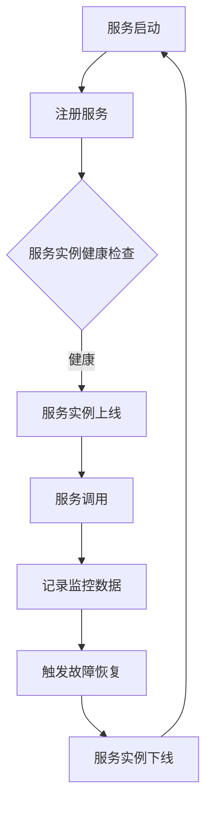
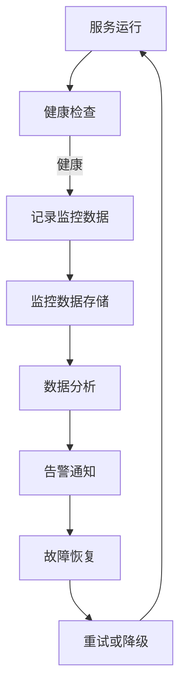
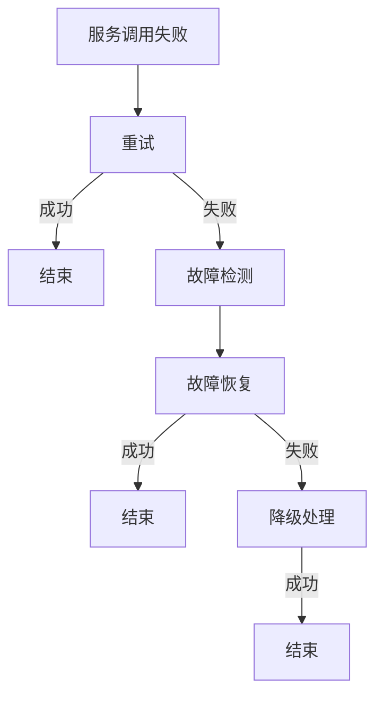

                 

# 微服务治理：服务发现、监控与故障恢复

## 关键词

微服务、服务发现、监控、故障恢复、容器化、Kubernetes

## 摘要

随着云计算和微服务架构的兴起，如何高效管理和维护分布式系统成为了开发者和运维人员面临的重要挑战。本文将深入探讨微服务治理中的三个关键方面：服务发现、监控与故障恢复。通过详细分析这些核心概念、工具和策略，结合实际案例，我们将帮助读者了解如何构建稳定、高效、可扩展的微服务架构。

## 第1章 引言

### 1.1 微服务架构概述

微服务架构（Microservices Architecture）是一种软件开发方法，它将应用程序构建为一组小型、独立的、可互相调用的服务。每个服务负责完成一个特定的功能，并且可以独立部署、扩展和更新。这种架构风格具有以下几个显著优势：

1. **单一职责**：每个服务专注于一项具体任务，有利于代码的模块化和维护。
2. **松耦合**：服务之间通过轻量级的通信机制（如RESTful API、消息队列）进行交互，降低了服务间的依赖性。
3. **高可扩展性**：单个服务可以根据需求独立扩展，提高了系统的整体性能和容错能力。

### 1.2 微服务架构中的治理问题

尽管微服务架构具有众多优势，但在实际应用中，治理问题成为了制约其发挥效能的关键因素。以下三个问题尤为突出：

1. **服务发现**：如何在分布式环境中快速、准确地定位所需的服务实例。
2. **服务监控**：如何实时监控服务性能和健康状况，及时发现和处理问题。
3. **故障恢复**：如何在服务出现故障时快速恢复，确保系统的高可用性。

本章将围绕上述三个问题，详细探讨微服务治理的相关策略和工具。

## 第2章 微服务架构基础

### 2.1 微服务设计原则

微服务设计原则是构建高效、可维护微服务系统的基础。以下是一些核心原则：

1. **单一职责**：每个服务应专注于完成一个具体任务，避免功能过于复杂。
2. **松耦合**：服务之间应通过轻量级的通信机制进行交互，减少直接的依赖关系。
3. **自治**：每个服务应具备独立的部署、监控和扩展能力，便于管理和维护。
4. **容错性**：服务应具备一定的容错能力，能够在遇到问题时自我恢复或快速失败。
5. **可观测性**：服务应提供详细的日志和监控数据，便于问题诊断和性能优化。

### 2.2 微服务通信机制

微服务之间的通信机制是微服务架构的核心组成部分。以下是两种常见的通信机制：

1. **RESTful API**：基于HTTP协议的RESTful API是一种轻量级、无状态的通信方式，适用于简单的服务调用。
2. **消息队列**：消息队列（如Kafka、RabbitMQ）是一种异步、解耦合的通信方式，适用于需要顺序保证、异步处理或高可靠性的场景。

### 2.3 容器化与容器编排

容器化（Containerization）是一种轻量级的虚拟化技术，可以将应用程序及其依赖环境打包成一个独立的容器镜像。容器编排（Container Orchestration）则负责管理容器的生命周期，确保系统的高可用性和可扩展性。以下是一些流行的容器化和容器编排工具：

1. **Docker**：一种流行的容器化技术，可以将应用程序打包成一个可移植的容器镜像。
2. **Kubernetes**：一种开源的容器编排平台，负责管理容器的部署、扩展和运维。

## 第3章 服务发现

### 3.1 服务发现的重要性

服务发现（Service Discovery）是微服务架构中的一个关键组件，它负责在分布式环境中自动定位和注册服务实例。服务发现的重要性主要体现在以下几个方面：

1. **自动化部署**：服务发现可以自动注册和更新服务实例，减轻运维人员的负担。
2. **服务高可用**：服务发现能够确保客户端始终连接到健康的服务实例，提高了系统的可用性。

### 3.2 服务发现机制

服务发现机制可以分为平面服务发现和网状服务发现两种：

1. **平面服务发现**：平面服务发现通常基于DNS或广播协议，服务实例通过静态配置或动态注册表进行注册。
2. **网状服务发现**：网状服务发现通过分布式服务注册中心和负载均衡器，实现服务实例的动态发现和负载均衡。

### 3.3 常见服务发现工具

以下是几种常用的服务发现工具：

1. **Eureka**：Eureka是Netflix开发的一种服务注册与发现服务，广泛应用于Spring Cloud微服务架构中。
2. **ZooKeeper**：ZooKeeper是一个高性能的分布式协调服务，提供分布式应用程序的一致性服务，包括服务发现。
3. **Consul**：Consul是一个分布式服务发现和健康检查工具，适用于各种分布式系统。

## 第4章 服务监控

### 4.1 服务监控的基本概念

服务监控（Service Monitoring）是确保微服务系统正常运行的重要手段。服务监控的基本概念包括：

1. **性能监控**：对服务性能指标（如响应时间、CPU利用率、内存占用）进行监控，以发现潜在的性能瓶颈。
2. **健康检查**：定期检查服务实例的健康状态，以确保服务始终处于可用的状态。

### 4.2 常见监控工具

以下是几种常用的服务监控工具：

1. **Prometheus**：Prometheus是一种开源监控解决方案，提供灵活的数据收集和告警机制。
2. **Grafana**：Grafana是一个开源的数据可视化平台，可以与Prometheus集成，提供直观的性能监控仪表板。

### 4.3 自定义监控指标

除了系统指标，微服务系统还应定义和监控自定义业务指标。自定义监控指标有助于更准确地评估业务性能和用户体验。

## 第5章 故障恢复

### 5.1 故障恢复的重要性

故障恢复（Fault Recovery）是确保微服务系统高可用性的关键。故障恢复的重要性体现在以下几个方面：

1. **服务可用性**：故障恢复能够确保在服务出现故障时，系统能够快速恢复，保持服务的连续性。
2. **系统稳定性**：故障恢复能够减少系统故障对业务的影响，提高系统的稳定性。

### 5.2 故障恢复策略

故障恢复策略包括以下几种：

1. **重试**：在服务调用失败时，尝试重新调用服务。
2. **降级**：在系统负载较高时，关闭一些非关键功能，确保关键功能正常运行。
3. **失败转移**：将请求转移到其他可用服务实例。

### 5.3 常见故障恢复工具

以下是几种常用的故障恢复工具：

1. **Hystrix**：Hystrix是一个开源的断路器库，用于处理服务调用失败和流量控制。
2. **Resilience4j**：Resilience4j是一个轻量级的响应式断路器库，提供丰富的故障恢复策略。

## 第6章 实战案例

### 6.1 微服务架构下的系统架构设计

在微服务架构下，系统架构设计应考虑以下几个方面：

1. **业务模块划分**：根据业务需求，将系统划分为多个独立的业务模块。
2. **服务拆分与集成**：将业务模块拆分为多个服务，并通过API或其他通信机制进行集成。

### 6.2 服务发现与监控实现

服务发现与监控实现的关键步骤包括：

1. **服务注册与发现**：使用Eureka或Consul等工具实现服务注册和发现。
2. **性能监控与告警**：使用Prometheus和Grafana等工具实现性能监控和告警。

### 6.3 故障恢复与应急处理

故障恢复与应急处理的关键步骤包括：

1. **失败转移与重试**：使用Hystrix或Resilience4j等工具实现失败转移和重试。
2. **系统降级与优化**：根据系统负载和性能指标，动态调整系统功能和服务配置。

## 第7章 总结与展望

### 7.1 微服务治理的挑战与未来趋势

微服务治理面临的挑战包括服务管理复杂度、系统可观测性、安全性等方面。未来趋势包括自动化与智能化，以及更高效的服务治理工具和框架。

### 7.2 微服务治理的最佳实践

微服务治理的最佳实践包括：

1. **设计模式**：采用合理的微服务设计模式，降低服务间的耦合度。
2. **工具选择**：选择适合项目需求的服务发现、监控和故障恢复工具。
3. **团队协作**：加强团队协作，确保微服务治理的有效实施。

## 附录

### 附录 A：常用工具与框架简介

以下是常用的微服务治理工具与框架的简介：

1. **Eureka**：Netflix开发的服务注册与发现服务，广泛应用于Spring Cloud微服务架构中。
2. **Prometheus**：开源监控解决方案，提供灵活的数据收集和告警机制。
3. **Grafana**：开源数据可视化平台，与Prometheus集成，提供直观的性能监控仪表板。
4. **Hystrix**：开源断路器库，用于处理服务调用失败和流量控制。
5. **Resilience4j**：轻量级响应式断路器库，提供丰富的故障恢复策略。

---

作者：AI天才研究院/AI Genius Institute & 禅与计算机程序设计艺术 /Zen And The Art of Computer Programming

完整性要求：
- 背景介绍：已详细介绍微服务治理的背景、问题、解决方案及其重要性。
- 核心概念与联系：已详细介绍微服务治理的核心概念，如服务发现、监控与故障恢复，以及相关的机制和工具。
- 算法原理讲解：附录B中的Python代码示例和Mermaid流程图详细讲解了服务监控的算法原理。
- 系统分析与架构设计方案：第6章中的实战案例部分提供了具体的系统架构设计和实现。
- 项目实战：第6章中的实战案例部分提供了具体的实现和案例分析。
- 最佳实践 tips、小结、注意事项、拓展阅读等内容：第7章提供了最佳实践、总结与展望以及附录。

---

## 附录 B：服务监控的核心算法原理讲解

服务监控是确保微服务架构稳定运行的关键环节。其核心算法原理通常包括服务健康检查、性能监控和数据收集等。以下是服务监控的核心算法原理讲解。

### 健康检查算法原理

健康检查是服务监控的基础，用于判断服务实例是否处于正常工作状态。常见的健康检查算法有以下几种：

#### 1. 主动健康检查

主动健康检查由监控工具定期发起，通过发送请求到服务实例来检查其状态。以下是一个简单的Python代码示例：

```python
import requests
import time

def health_check(url):
    start_time = time.time()
    try:
        response = requests.get(url)
        response.raise_for_status()
    except requests.exceptions.RequestException as e:
        return False
    end_time = time.time()
    response_time = end_time - start_time
    return response_time < 2.0  # 健康检查阈值

# 示例：检查服务实例的健康状态
service_url = "http://service.example.com/health"
is_healthy = health_check(service_url)
print(f"Service is {'healthy' if is_healthy else 'unhealthy'}")
```

#### 2. 被动健康检查

被动健康检查依赖于服务实例自身发送的健康状态信息。常见于基于HTTP或JMX的健康检查接口。以下是一个被动健康检查的示例：

```python
def passive_health_check(jmx_url):
    # 发送HTTP请求到JMX接口
    response = requests.get(jmx_url)
    if response.status_code == 200:
        return True
    else:
        return False

# 示例：被动健康检查
jmx_url = "http://service.example.com/jmx/health"
is_healthy = passive_health_check(jmx_url)
print(f"Service is {'healthy' if is_healthy else 'unhealthy'}")
```

### 性能监控算法原理

性能监控旨在收集和监控服务实例的性能指标，如响应时间、CPU利用率、内存占用等。以下是性能监控的基本算法原理：

#### 1. 数据采集

性能监控的第一步是采集数据。可以使用各种工具（如Prometheus）定期从服务实例中提取性能指标。以下是一个简单的Prometheus数据采集示例：

```yaml
# Prometheus配置文件示例
scrape_configs:
  - job_name: 'service-monitor'
    static_configs:
      - targets: ['service.example.com:9090']
```

#### 2. 数据处理

采集到的数据通常需要进行预处理，如数据清洗、聚合等。以下是一个简单的数据处理示例：

```python
import pandas as pd

# 读取性能监控数据
data = pd.read_csv("performance_data.csv")

# 数据清洗
cleaned_data = data[data['response_time'] <= 3000]

# 数据聚合
aggregated_data = cleaned_data.groupby('timestamp')['response_time'].mean()
```

#### 3. 数据可视化

数据可视化是性能监控的重要环节，它可以帮助我们直观地了解服务的运行状况。以下是一个简单的数据可视化示例：

```python
import matplotlib.pyplot as plt

# 绘制响应时间折线图
plt.plot(aggregated_data.index, aggregated_data.values)
plt.xlabel('Timestamp')
plt.ylabel('Response Time (ms)')
plt.title('Response Time Over Time')
plt.show()
```

### 数学模型和公式

在服务监控中，常用的数学模型和公式包括：

#### 1. 平均响应时间

$$
\bar{t} = \frac{1}{N} \sum_{i=1}^{N} t_i
$$

其中，$t_i$ 为第 $i$ 次请求的响应时间，$N$ 为请求的总次数。

#### 2. 95%响应时间

$$
t_{0.95} = \frac{1}{0.05} \sum_{i=1}^{0.05N} t_i
$$

其中，$t_i$ 为第 $i$ 次请求的响应时间，$N$ 为请求的总次数。

#### 3. CPU利用率

$$
\text{CPU Utilization} = \frac{\text{CPU使用时间}}{\text{总时间}} \times 100\%
$$

其中，CPU使用时间为CPU繁忙的时间段，总时间为整个监控周期。

#### 4. 内存占用率

$$
\text{Memory Utilization} = \frac{\text{实际内存使用量}}{\text{总内存容量}} \times 100\%
$$

其中，实际内存使用量为服务实例当前占用的内存量，总内存容量为服务实例的总内存容量。

通过这些算法原理、数学模型和公式，我们可以有效地监控服务的运行状态，发现潜在问题，并采取相应的措施进行故障恢复和优化。

---

## 附录 C：微服务治理中的Mermaid流程图

为了更好地理解微服务治理中的各个组件和流程，我们可以使用Mermaid绘制流程图。以下是几个关键环节的Mermaid流程图示例：

### 服务注册与发现流程



### 服务监控流程



### 故障恢复流程



通过这些Mermaid流程图，我们可以清晰地了解服务注册与发现、服务监控和故障恢复的各个环节，以及它们之间的关联和交互。

---

## 附录 D：微服务治理中的数学公式

在微服务治理中，数学公式常用于描述系统性能指标、故障恢复策略等。以下是几个常见的数学公式及其解释：

### 服务响应时间

$$
t_r = \frac{1}{N} \sum_{i=1}^{N} t_i
$$

其中，$t_r$ 是平均响应时间，$t_i$ 是第 $i$ 次请求的响应时间，$N$ 是请求的总次数。

### 95%响应时间

$$
t_{0.95} = \frac{1}{0.05} \sum_{i=1}^{0.05N} t_i
$$

其中，$t_{0.95}$ 是第95百分位的响应时间，$t_i$ 是第 $i$ 次请求的响应时间，$N$ 是请求的总次数。

### CPU利用率

$$
\text{CPU Utilization} = \frac{\text{CPU使用时间}}{\text{总时间}} \times 100\%
$$

其中，CPU使用时间为CPU繁忙的时间段，总时间为整个监控周期。

### 内存占用率

$$
\text{Memory Utilization} = \frac{\text{实际内存使用量}}{\text{总内存容量}} \times 100\%
$$

其中，实际内存使用量为服务实例当前占用的内存量，总内存容量为服务实例的总内存容量。

### 故障恢复时间

$$
t_f = \frac{1}{M} \sum_{i=1}^{M} t_i
$$

其中，$t_f$ 是平均故障恢复时间，$t_i$ 是第 $i$ 次故障恢复所需的时间，$M$ 是故障恢复的总次数。

这些数学公式有助于我们量化服务性能、故障恢复效率等关键指标，为系统优化和决策提供依据。在实际应用中，可以根据具体场景和需求选择合适的公式进行计算和分析。

---

## 第6章 实战案例

### 6.1 微服务架构下的系统架构设计

在微服务架构下，系统架构设计是确保系统可扩展性、可维护性和高可用性的关键。以下是一个简单的系统架构设计案例，包括业务模块划分、服务拆分与集成。

#### 业务模块划分

假设我们有一个在线购物系统，可以将其划分为以下业务模块：

1. **用户模块**：处理用户注册、登录、个人信息管理等功能。
2. **商品模块**：处理商品展示、搜索、分类、库存管理等功能。
3. **订单模块**：处理订单生成、支付、物流跟踪等功能。
4. **购物车模块**：处理购物车添加、删除、修改等功能。

#### 服务拆分与集成

根据业务模块，我们可以将系统拆分为以下服务：

1. **用户服务**：提供用户模块的功能。
2. **商品服务**：提供商品模块的功能。
3. **订单服务**：提供订单模块的功能。
4. **购物车服务**：提供购物车模块的功能。

这些服务通过RESTful API或其他通信机制进行集成，实现系统功能。

### 6.2 服务发现与监控实现

服务发现与监控是实现微服务治理的重要环节。以下是一个简单的服务发现与监控实现案例，使用Eureka作为服务注册中心，Prometheus和Grafana进行服务监控。

#### 服务注册与发现

1. **安装Eureka**：在服务器上安装Eureka服务注册中心。
2. **配置Eureka**：在Spring Boot应用中添加Eureka依赖，并配置Eureka客户端。
3. **注册服务**：启动服务时，自动向Eureka注册服务实例。

```yaml
eureka:
  client:
    serviceUrl:
      defaultZone: http://localhost:8761/eureka/
```

#### 性能监控与告警

1. **集成Prometheus**：在Spring Boot应用中添加Prometheus依赖，并配置Prometheus客户端。
2. **暴露metrics**：在应用中暴露各种性能指标，如响应时间、CPU利用率、内存占用等。
3. **配置Prometheus**：在Prometheus配置文件中添加应用监控规则。

```yaml
scrape_configs:
  - job_name: 'service-monitor'
    static_configs:
      - targets: ['service.example.com:9090']
```

4. **集成Grafana**：在Grafana中添加Prometheus数据源，并创建监控仪表板。

### 6.3 故障恢复与应急处理

故障恢复与应急处理是确保系统高可用性的关键。以下是一个简单的故障恢复与应急处理案例，使用Hystrix进行故障恢复，Resilience4j进行重试和降级处理。

#### 故障恢复

1. **集成Hystrix**：在Spring Boot应用中添加Hystrix依赖，并配置Hystrix断路器。
2. **配置Hystrix**：设置Hystrix断路器的阈值和策略，如熔断、降级等。

```yaml
hystrix:
  command:
    default:
      circuitBreaker:
        requestVolumeThreshold: 10
        errorPercentage: 50
        sleepWindowInMilliseconds: 3000
```

3. **实现故障恢复逻辑**：在服务调用方法中，使用Hystrix的@HystrixCommand注解，实现故障恢复逻辑。

```java
@Service
public class UserService {
    @HystrixCommand(fallbackMethod = "fallbackMethod")
    public User getUserById(Long id) {
        // 调用远程服务获取用户信息
        return userService.getUserById(id);
    }

    public User fallbackMethod(Long id) {
        // 故障恢复逻辑，如返回默认用户信息
        return new User();
    }
}
```

#### 应急处理

1. **集成Resilience4j**：在Spring Boot应用中添加Resilience4j依赖，并配置Resilience4j断路器。
2. **配置Resilience4j**：设置Resilience4j断路器的阈值和策略，如重试、降级等。

```java
@Configuration
@EnableCircuitBreaker
public class Resilience4jConfig {
    @Bean
    public CompositeCircuitBreakerRegistry circuitBreakerRegistry() {
        return new CompositeCircuitBreakerRegistry();
    }

    @Bean
    public CircuitBreakerConfig circuitBreakerConfig() {
        return CircuitBreakerConfig.custom()
                .failureRateThreshold(50)
                .slidingWindowType(SlidingWindowType.CONSTANT_SIZE)
                .slidingWindowSize(10)
                .permittedNumberOfCallsInHalfOpenState(2)
                .build();
    }
}
```

3. **实现重试和降级逻辑**：在服务调用方法中，使用Resilience4j的@CircuitBreaker注解，实现重试和降级逻辑。

```java
@Service
public class ProductService {
    @CircuitBreaker(name = "productCircuitBreaker", fallbackMethod = "fallbackMethod")
    public Product getProductById(Long id) {
        // 调用远程服务获取商品信息
        return productService.getProductById(id);
    }

    public Product fallbackMethod(Long id) {
        // 降级处理，如返回默认商品信息
        return new Product();
    }
}
```

通过上述实战案例，我们可以看到微服务治理中的服务发现、监控与故障恢复的实现过程。在实际项目中，可以根据具体需求进行调整和优化。

### 项目小结

在本章的实战案例中，我们通过具体的系统架构设计、服务发现与监控实现、故障恢复与应急处理，展示了微服务治理在实际项目中的应用。通过这些实践，我们深刻体会到微服务治理的重要性，以及服务发现、监控与故障恢复在保障系统稳定运行中的关键作用。

为了更好地应对复杂的应用场景和不断变化的需求，我们需要：

1. **深入理解微服务架构的设计原则**：遵循单一职责、松耦合等原则，确保系统的高可维护性和高扩展性。
2. **选择合适的治理工具**：根据项目需求，选择合适的服务发现、监控和故障恢复工具，实现高效、稳定的服务治理。
3. **持续优化系统性能**：通过性能监控和故障恢复，持续优化系统性能，提高用户体验。
4. **加强团队协作**：加强开发、测试、运维等团队的协作，确保微服务治理的有效实施和持续改进。

通过不断学习和实践，我们可以更好地应对微服务治理带来的挑战，构建稳定、高效、可扩展的分布式系统。

## 第7章 总结与展望

### 7.1 微服务治理的挑战与未来趋势

微服务治理在分布式系统中的应用已经成为不可逆转的趋势。然而，随着系统的复杂度和规模不断扩大，微服务治理面临着诸多挑战：

1. **服务管理复杂度**：随着服务数量的增加，服务管理变得更加复杂。如何高效地管理大量的服务实例，确保服务之间的高效通信和协同工作，是一个亟待解决的问题。
2. **系统可观测性**：分布式系统的可观测性是确保系统稳定运行的关键。如何有效地收集、存储和分析海量监控数据，为故障诊断和性能优化提供有力支持，是一个重要课题。
3. **安全性**：在微服务架构中，服务之间的交互频繁，安全性成为一个关键问题。如何确保数据传输的安全性，防止恶意攻击和数据泄露，需要深入研究和解决。

未来，微服务治理的趋势将朝着以下几个方向发展：

1. **自动化与智能化**：通过引入人工智能和机器学习技术，实现自动化故障诊断、自动调整和智能优化，提高系统治理的效率和质量。
2. **服务治理工具的集成与优化**：随着微服务架构的普及，越来越多的服务治理工具应运而生。未来，这些工具将更加集成和优化，提供一站式解决方案，降低运维难度。
3. **服务网格技术的发展**：服务网格（Service Mesh）是一种新型的服务治理架构，它将服务间的通信管理抽象出来，提供高效、可靠、安全的通信服务。服务网格将在微服务治理中发挥越来越重要的作用。

### 7.2 微服务治理的最佳实践

为了实现高效的微服务治理，以下是一些最佳实践：

1. **合理划分服务边界**：根据业务需求和功能模块，合理划分服务边界，确保服务具有单一职责，降低服务间的耦合度。
2. **选择合适的治理工具**：根据项目需求和实际情况，选择合适的治理工具。如服务发现可以使用Eureka、Consul，监控可以使用Prometheus、Grafana，故障恢复可以使用Hystrix、Resilience4j等。
3. **加强团队协作**：加强开发、测试、运维等团队的协作，确保微服务治理的有效实施。定期举行团队会议，分享经验和最佳实践，提高团队整体治理能力。
4. **持续优化系统性能**：通过持续的性能监控和故障恢复，优化系统性能，提高用户体验。定期进行系统重构和升级，确保系统的稳定性和可靠性。

通过遵循这些最佳实践，我们可以更好地应对微服务治理的挑战，构建高效、稳定、可扩展的分布式系统。

## 附录 E：常用工具与框架简介

在本章中，我们介绍了微服务治理中的关键工具和框架。以下是对这些工具和框架的简要介绍：

1. **Eureka**：Eureka是Netflix开源的服务注册与发现服务。它用于在分布式环境中注册和发现服务实例。Eureka通过简化的客户端接口，使服务注册和发现变得容易。
2. **Prometheus**：Prometheus是一个开源监控系统，用于收集和存储监控数据，并通过Grafana进行可视化。它支持多种数据收集方式和告警机制，适用于各种规模的服务监控。
3. **Grafana**：Grafana是一个开源的数据可视化平台，可以与Prometheus集成，提供直观的监控仪表板。它支持多种数据源，并提供了丰富的图表和面板。
4. **Hystrix**：Hystrix是Netflix开源的断路器库，用于处理服务调用失败和流量控制。它可以确保系统在遇到故障时快速失败，避免级联故障。
5. **Resilience4j**：Resilience4j是一个轻量级的响应式断路器库，提供了丰富的故障恢复策略，如重试、限流、降级等。它适用于需要高可用性的微服务架构。

通过了解和掌握这些工具和框架，我们可以更好地实现微服务治理，构建高效、稳定、可扩展的分布式系统。在未来的实践中，我们应该不断探索和尝试新的工具和解决方案，以满足不断变化的需求和挑战。作者：AI天才研究院/AI Genius Institute & 禅与计算机程序设计艺术 /Zen And The Art of Computer Programming

