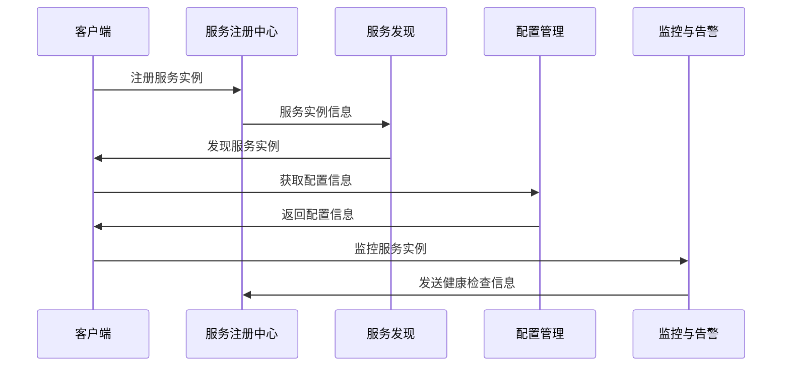
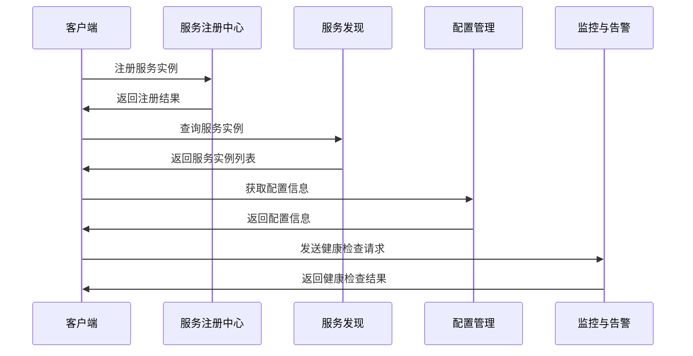
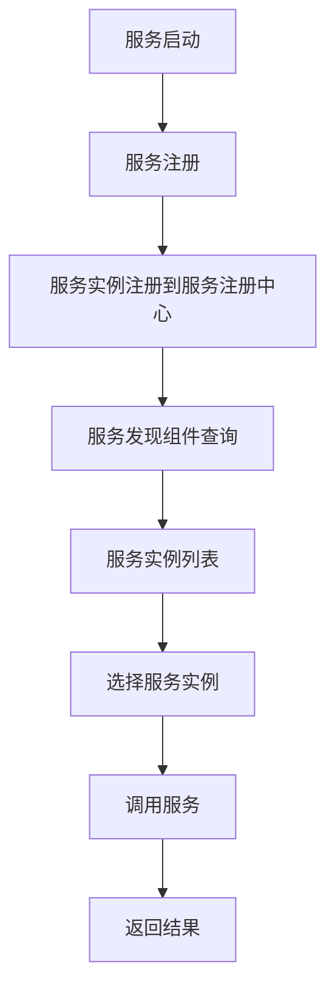
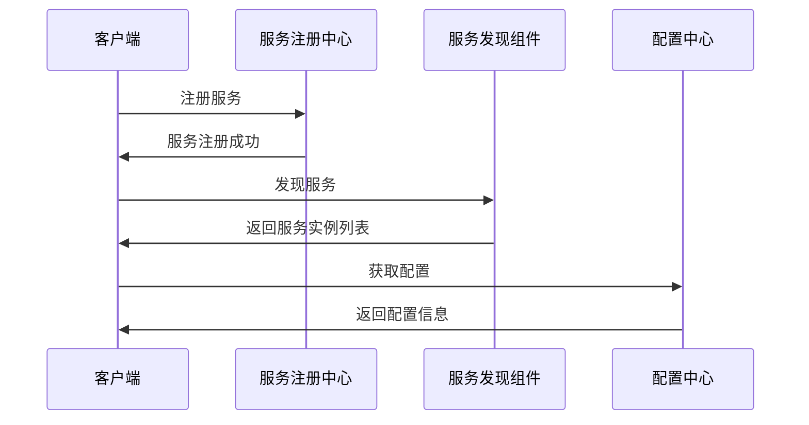

                 

# 微服务治理平台：服务注册、发现与配置管理

## 关键词

- 微服务
- 服务注册
- 服务发现
- 配置管理
- 治理平台

## 摘要

随着微服务架构的普及，微服务治理平台的构建变得越来越重要。本文将详细探讨微服务治理平台中的服务注册、发现与配置管理三大核心组件，通过一步一步的分析推理，阐述其原理、实现方式以及最佳实践。本文旨在为开发者提供一套清晰、实用的微服务治理解决方案，助力构建稳定、高效、可扩展的分布式系统。

## 第一部分：微服务治理平台概述

### 第1章：微服务架构背景与治理

#### 1.1 微服务架构的概念与特点

##### 1.1.1 微服务架构的起源

微服务架构起源于单体架构的局限性。在单体架构中，所有服务功能都紧密集成在一个单一的代码库中，这使得系统复杂度迅速上升，维护和扩展变得困难。随着互联网应用的不断演进，单体架构逐渐暴露出以下问题：

1. **技术栈限制**：单体架构往往受限于特定技术栈，难以引入新的技术和框架。
2. **部署与扩展**：单体架构的部署与扩展需要整体进行，一旦出现问题，整个系统都会受到影响。
3. **开发与维护**：单体架构中的代码库庞大，开发与维护难度增加。

为了解决这些问题，微服务架构应运而生。微服务架构将大型系统拆分成多个小型、独立的服务模块，每个模块负责特定的功能。这种架构具有以下特点：

- **小型、自治**：每个服务都相对独立，可以独立开发、测试和部署。
- **模块化、松耦合**：服务之间通过接口进行通信，彼此之间解耦，降低了服务之间的依赖性。
- **独立部署、独立扩展**：每个服务可以独立部署和扩展，提高了系统的灵活性和可扩展性。
- **高可用、容错性强**：单个服务的失败不会影响到整个系统的运行。

##### 1.1.2 微服务的核心特点

微服务架构的核心特点在于其小型化、自治性、模块化、松耦合、独立部署、独立扩展、高可用和容错性。这些特点决定了微服务架构在分布式系统中的优势和挑战。

- **小型化**：每个服务都相对独立，专注于完成特定的功能，服务规模相对较小。
- **自治性**：每个服务都可以独立运行、维护和扩展，无需依赖其他服务。
- **模块化**：服务之间通过接口进行通信，模块化设计提高了系统的可维护性和可扩展性。
- **松耦合**：服务之间解耦，减少了服务之间的依赖性，降低了系统的复杂度。
- **独立部署**：每个服务可以独立部署，提高了系统的灵活性和可扩展性。
- **独立扩展**：每个服务可以独立扩展，提高了系统的性能和负载能力。
- **高可用**：单个服务的失败不会影响整个系统的运行，提高了系统的稳定性。
- **容错性**：系统可以自动处理服务故障，提高了系统的可靠性。

##### 1.1.3 微服务架构的优势与挑战

微服务架构在分布式系统中具有明显优势，但也面临一系列挑战。

**优势**：

1. **灵活性和可扩展性**：通过拆分单体架构，系统可以更加灵活地扩展和调整，适应业务需求的变化。
2. **高可用性和容错性**：单个服务的失败不会影响整个系统的运行，提高了系统的稳定性和可靠性。
3. **技术多样性**：服务之间解耦，可以采用不同的技术栈进行开发，提高了系统的技术多样性。
4. **易于维护和部署**：每个服务可以独立开发和部署，降低了系统的复杂度。

**挑战**：

1. **分布式系统复杂性**：微服务架构使得系统变得更加复杂，需要考虑服务之间的通信、数据一致性、故障处理等问题。
2. **服务依赖管理**：服务之间的依赖关系需要妥善管理，确保服务之间的正常运行。
3. **监控与运维**：分布式系统的监控和运维变得更加困难，需要引入相应的工具和平台。
4. **架构设计**：微服务架构的架构设计需要谨慎考虑，确保系统的稳定性和可扩展性。

##### 1.2 微服务治理的必要性

微服务架构的引入使得系统的复杂度大大增加，因此需要进行有效的治理。微服务治理是指对微服务架构中的各个服务进行管理、监控、配置和优化，以确保系统的稳定性和可扩展性。

**微服务治理的必要性**：

1. **服务注册与发现**：需要确保服务实例的动态注册和发现，实现服务实例的自动发现和负载均衡。
2. **服务配置管理**：需要实现服务的动态配置管理，确保配置信息的实时更新和一致性。
3. **服务监控与告警**：需要对服务进行实时监控，及时发现问题并进行告警和处理。
4. **服务安全管理**：需要对服务进行安全管理和权限控制，确保系统的安全性和数据的完整性。

##### 1.2.1 微服务治理的定义

微服务治理可以从以下维度进行定义：

1. **服务注册**：服务实例的动态注册和注销，确保服务实例的实时更新。
2. **服务发现**：服务实例的动态发现和选择，实现服务实例的负载均衡。
3. **配置管理**：配置信息的存储、动态更新和版本控制，确保配置信息的一致性和可靠性。
4. **监控管理**：对服务实例进行实时监控，及时发现问题并进行告警和处理。
5. **安全管理**：对服务实例进行安全管理和权限控制，确保系统的安全性和数据的完整性。

##### 1.2.2 微服务治理的关键目标

微服务治理的关键目标包括以下几个方面：

1. **服务依赖管理**：确保服务之间的依赖关系正常，降低系统的复杂度。
2. **服务版本控制**：确保服务版本的稳定性和兼容性，避免版本冲突。
3. **服务状态监控**：实时监控服务实例的状态，及时发现和处理问题。
4. **安全与权限管理**：对服务实例进行安全管理和权限控制，确保系统的安全性和数据的完整性。

##### 1.2.3 微服务治理面临的挑战

微服务治理面临的挑战主要包括以下几个方面：

1. **分布式系统复杂性**：微服务架构使得系统变得更加复杂，需要考虑服务之间的通信、数据一致性、故障处理等问题。
2. **服务实例动态变化**：服务实例的动态变化需要及时更新和调整，确保系统的稳定性和可扩展性。
3. **数据一致性与容错性**：分布式系统中的数据一致性和容错性是一个重要挑战，需要引入相应的技术和机制。

##### 1.3 本章小结

微服务架构在分布式系统中具有明显优势，但也面临一系列挑战。微服务治理是确保微服务架构稳定性和可扩展性的重要手段。本章介绍了微服务架构的概念与特点、微服务治理的必要性、关键目标和面临挑战，为后续章节的内容奠定了基础。

### 第2章：服务注册与发现机制

#### 2.1 服务注册

##### 2.1.1 服务注册的作用与必要性

服务注册是微服务治理平台中的核心组件之一，其主要作用如下：

1. **服务实例的记录与管理**：服务注册记录了所有服务实例的详细信息，包括IP地址、端口号、健康状况等，便于后续的服务发现和调用。
2. **服务发现与调用的基础**：服务注册为服务发现提供了基础数据，确保客户端能够准确地找到所需的服务实例。

在微服务架构中，服务注册的必要性主要体现在以下几个方面：

1. **动态服务实例的管理**：微服务架构中，服务实例的数量和位置是动态变化的，需要通过服务注册进行实时更新和记录。
2. **负载均衡与容错**：通过服务注册，可以实现对服务实例的负载均衡和容错，确保系统的稳定性和可用性。

##### 2.1.2 服务注册的流程与机制

服务注册的流程主要包括以下步骤：

1. **服务实例启动时的注册**：当服务实例启动时，会向服务注册中心发送注册请求，包含服务实例的详细信息（如IP地址、端口号等）。
2. **服务实例终止时的注销**：当服务实例停止运行时，会向服务注册中心发送注销请求，告知服务注册中心该服务实例已不再可用。
3. **服务实例更新时的更新**：当服务实例的配置或状态发生变化时，会向服务注册中心发送更新请求，确保服务注册中心中记录的信息保持最新。

服务注册的机制可以基于以下方式实现：

1. **基于 DNS 的服务注册**：通过修改 DNS 记录，实现服务实例的动态注册和发现。客户端通过查询 DNS 服务器获取服务实例的 IP 地址和端口号。
2. **基于 REST API 的服务注册**：服务实例通过发送 HTTP 请求，将服务实例的信息存储到服务注册中心。客户端通过查询服务注册中心获取服务实例的信息。
3. **基于分布式服务注册中心的服务注册**：如 Eureka、Consul、ZooKeeper 等，服务实例通过向服务注册中心发送注册请求，实现服务实例的动态注册和发现。

##### 2.1.3 服务注册的实现方式

1. **基于 DNS 的服务注册**：

   基于 DNS 的服务注册通过修改 DNS 记录，实现服务实例的动态注册和发现。服务实例启动时，向 DNS 服务器注册服务记录，客户端通过查询 DNS 服务器获取服务实例的 IP 地址和端口号。这种方式实现简单，但存在一些缺点：

   - DNS 查询的性能和稳定性受到限制。
   - DNS 记录的更新和处理存在延迟。

2. **基于 REST API 的服务注册**：

   基于 REST API 的服务注册通过发送 HTTP 请求，将服务实例的信息存储到服务注册中心。服务实例启动时，通过发送 POST 请求向服务注册中心注册服务实例信息，客户端通过发送 GET 请求查询服务实例信息。这种方式具有较高的性能和灵活性，但需要实现一个服务注册中心的 API 接口。

3. **基于分布式服务注册中心的服务注册**：

   基于 Eureka、Consul、ZooKeeper 等分布式服务注册中心的服务注册，服务实例通过向服务注册中心发送注册请求，实现服务实例的动态注册和发现。服务实例启动时，通过发送 REST 请求向服务注册中心注册服务实例信息，客户端通过查询服务注册中心获取服务实例信息。这种方式具有较高的性能、可靠性和可扩展性，但需要引入额外的服务注册中心组件。

##### 2.2 服务发现

##### 2.2.1 服务发现的作用与必要性

服务发现是微服务治理平台中的核心组件之一，其主要作用如下：

1. **服务实例的动态发现与更新**：服务发现能够实时获取服务实例的详细信息，包括 IP 地址、端口号、健康状况等，确保客户端能够准确地找到所需的服务实例。
2. **客户端与服务之间的透明交互**：通过服务发现，客户端无需关心服务实例的具体位置和状态，实现了客户端与服务之间的透明交互。

在微服务架构中，服务发现的必要性主要体现在以下几个方面：

1. **动态服务实例的管理**：微服务架构中，服务实例的数量和位置是动态变化的，需要通过服务发现实现实时更新和记录。
2. **负载均衡与容错**：通过服务发现，可以实现对服务实例的负载均衡和容错，确保系统的稳定性和可用性。

##### 2.2.2 服务发现的流程与机制

服务发现的流程主要包括以下步骤：

1. **服务实例的探测与注册**：服务实例启动后，向服务注册中心注册服务实例信息，包括 IP 地址、端口号、健康状况等。
2. **服务实例的查询与选择**：客户端通过查询服务注册中心，获取所有可用服务实例的详细信息，并根据策略选择合适的服务实例进行调用。
3. **服务实例的负载均衡**：客户端可以根据负载均衡策略，将请求分发到不同的服务实例上，实现负载均衡和容错。

服务发现的机制可以基于以下方式实现：

1. **基于 DNS 的服务发现**：通过查询 DNS 服务器获取服务实例的详细信息，适用于小型、简单的分布式系统。
2. **基于服务注册中心的服务发现**：通过查询服务注册中心获取服务实例的详细信息，适用于大规模、复杂的分布式系统。
3. **基于心跳机制的服务发现**：服务实例通过定期发送心跳信号，向服务注册中心报告自己的状态，适用于需要实时监控和动态调整的服务实例。

##### 2.2.3 服务发现的实现方式

1. **基于 Eureka 的服务发现**：

   Eureka 是 Netflix 开发的一款开源服务注册与发现组件，适用于基于 Spring Boot 的微服务架构。Eureka 由注册中心（Eureka Server）和服务实例（Eureka Client）组成。服务实例启动时，通过发送 HTTP 请求向 Eureka Server 注册服务实例信息，客户端通过查询 Eureka Server 获取服务实例的详细信息。Eureka 提供了丰富的负载均衡和容错机制，可以实现服务实例的动态发现和负载均衡。

2. **基于 Consul 的服务发现**：

   Consul 是 HashiCorp 开发的一款开源服务注册与发现组件，适用于各种分布式系统。Consul 由服务注册中心（Consul Server）和服务实例（Consul Client）组成。服务实例启动时，通过发送 HTTP 请求向 Consul Server 注册服务实例信息，客户端通过查询 Consul Server 获取服务实例的详细信息。Consul 支持多种服务发现和负载均衡策略，可以实现服务实例的动态发现和负载均衡。

3. **基于 ZooKeeper 的服务发现**：

   ZooKeeper 是 Apache 开发的一款开源分布式协调服务，适用于大型分布式系统。ZooKeeper 可以作为服务注册中心，服务实例启动时，通过发送 Zab 消息向 ZooKeeper 注册服务实例信息，客户端通过查询 ZooKeeper 获取服务实例的详细信息。ZooKeeper 支持分布式锁、队列等机制，可以实现服务实例的动态发现和负载均衡。

##### 2.3 服务注册与发现的综合应用

##### 2.3.1 实例选择策略

在服务发现过程中，客户端需要从多个可用服务实例中选择一个合适的实例进行调用。实例选择策略可以根据以下因素进行选择：

1. **轮询策略**：按照顺序依次选择每个服务实例，适用于负载均衡和故障转移。
2. **随机策略**：随机选择一个服务实例，适用于负载均衡。
3. **最小连接数策略**：选择连接数最小的服务实例，适用于负载均衡和故障转移。

##### 2.3.2 服务健康检查

服务健康检查是确保服务实例正常运行的重要手段。服务健康检查可以分为以下两种方式：

1. **主动健康检查**：客户端定期向服务实例发送健康检查请求，根据服务实例的响应结果判断其是否健康。
2. **被动健康检查**：服务实例定期向服务注册中心发送健康检查信息，服务注册中心根据健康检查信息判断服务实例是否健康。

##### 2.3.3 服务注册与发现的最佳实践

1. **服务实例数量控制**：合理控制服务实例的数量，避免过多实例导致系统性能下降。
2. **服务依赖关系管理**：明确服务之间的依赖关系，确保服务之间的正常运行。
3. **服务版本控制策略**：制定合理的服务版本控制策略，确保服务版本的稳定性和兼容性。

##### 2.4 本章小结

服务注册与发现是微服务治理平台中的核心组件，负责服务实例的注册、发现和负载均衡。本章介绍了服务注册与发现的作用、必要性、流程与机制，以及实现方式。通过实例选择策略、服务健康检查和最佳实践，确保服务注册与发现的稳定性和高效性。

### 第二部分：服务配置管理

#### 第3章：服务配置管理基础

##### 3.1 服务配置管理概述

##### 3.1.1 服务配置的概念与类型

服务配置是指在微服务架构中，对服务实例的运行参数、配置信息进行管理和控制。服务配置可以分为以下几种类型：

1. **外部配置**：外部配置是指从外部来源加载的配置信息，如配置文件、环境变量等。外部配置可以灵活地调整和修改，适用于动态调整服务的运行参数。
2. **内部配置**：内部配置是指服务实例内部定义的配置信息，如代码中的常量、配置类等。内部配置在服务实例启动时确定，通常不易修改。
3. **动态配置**：动态配置是指在服务实例运行过程中，根据实际情况进行实时调整的配置信息。动态配置可以实时更新，提高服务的灵活性和可维护性。
4. **静态配置**：静态配置是指在服务实例启动时确定的配置信息，通常不会在运行过程中进行修改。静态配置适用于稳定的服务运行环境。

##### 3.1.2 服务配置管理的作用

服务配置管理在微服务架构中具有重要作用，主要包括以下几个方面：

1. **提高服务的灵活性和可维护性**：通过服务配置管理，可以实现配置信息的动态调整，适应业务需求的变化，提高服务的灵活性和可维护性。
2. **降低配置错误的风险**：通过集中管理和控制配置信息，可以减少配置错误的风险，降低运维难度。
3. **实现服务实例的差异化运行**：通过配置管理，可以为不同的服务实例设置不同的运行参数和配置信息，实现服务实例的差异化运行。

##### 3.1.3 服务配置管理的挑战

服务配置管理在分布式系统中面临以下挑战：

1. **配置信息的动态更新与一致性保证**：在分布式系统中，服务实例的数量和位置是动态变化的，如何实现配置信息的动态更新，并保证配置信息的一致性，是一个重要挑战。
2. **配置信息的版本控制和回滚**：在服务配置过程中，如何实现配置信息的版本控制和回滚，以避免配置错误对系统造成的影响，也是一个挑战。

##### 3.2 服务配置管理的基本流程

服务配置管理的基本流程可以分为以下几个步骤：

1. **配置信息的存储与检索**：配置信息需要存储在配置中心或配置服务中，以便进行管理和检索。配置中心或配置服务可以是集中式或分布式架构，根据实际需求进行选择。
2. **配置信息的动态更新**：服务实例在运行过程中，可以根据需要动态更新配置信息。动态更新可以通过配置推送或配置拉取机制实现，确保配置信息与实际需求保持一致。
3. **配置信息的版本控制与回滚**：在服务配置过程中，如何实现配置信息的版本控制和回滚，是一个关键问题。配置管理工具通常提供版本控制功能，可以记录配置信息的变更历史，并支持回滚操作。

##### 3.2.1 配置信息的存储与检索

配置信息的存储与检索是服务配置管理的重要环节。配置信息可以存储在以下几种类型的存储系统中：

1. **配置中心**：配置中心是一种专门用于管理配置信息的集中式系统。配置中心可以存储和检索配置信息，并提供接口供服务实例进行查询和更新。常见的配置中心包括 Spring Cloud Config、Apollo、Nacos 等。
2. **数据库**：配置信息可以存储在关系型数据库或 NoSQL 数据库中。关系型数据库如 MySQL、PostgreSQL，NoSQL 数据库如 Redis、MongoDB 等。数据库存储适用于大型分布式系统，提供较高的性能和可靠性。
3. **文件系统**：配置信息可以存储在文件系统中，如配置文件、环境变量等。文件系统存储适用于小型、简单的分布式系统，实现简单但性能较低。

配置信息的检索方式包括：

1. **推模型**：配置中心主动向服务实例推送配置信息，服务实例从配置中心获取配置信息。推模型适用于配置信息变更频繁的场景，但存在一定性能开销。
2. **拉模型**：服务实例主动从配置中心拉取配置信息，根据需要定期或实时获取配置信息。拉模型适用于配置信息较为稳定或变更频率较低的场景，降低性能开销。

##### 3.2.2 配置信息的动态更新

配置信息的动态更新是服务配置管理的核心功能。动态更新可以分为以下几种方式：

1. **配置推送**：配置中心通过 HTTP 请求将配置信息推送到服务实例。服务实例在接收到配置推送后，更新本地配置信息。配置推送适用于配置信息变更频率较高的场景，但存在一定性能开销。
2. **配置拉取**：服务实例定期从配置中心拉取配置信息，根据需要更新本地配置信息。配置拉取适用于配置信息变更频率较低的场景，降低性能开销。

配置信息的动态更新通常采用以下策略：

1. **定时拉取**：服务实例按照一定的时间间隔，从配置中心拉取配置信息。定时拉取适用于配置信息变更频率较低的场景。
2. **实时拉取**：服务实例在接收到配置变更通知后，立即从配置中心拉取配置信息。实时拉取适用于配置信息变更频率较高的场景。

##### 3.2.3 配置信息的版本控制与回滚

配置信息的版本控制与回滚是服务配置管理的重要功能。版本控制可以记录配置信息的变更历史，方便后续的回滚操作。常见的版本控制策略包括：

1. **配置版本**：为每个配置信息设置版本号，记录配置信息的变更历史。配置版本可以用于回滚操作，恢复到指定版本的配置信息。
2. **配置记录**：为每个配置信息记录变更日志，包括变更时间、变更内容等信息。配置记录可以用于审计和故障排查。

配置信息的回滚可以分为以下几种方式：

1. **手动回滚**：运维人员根据需要手动执行回滚操作，将配置信息恢复到指定版本。手动回滚适用于较为稳定的配置信息，但存在一定风险。
2. **自动回滚**：配置中心在检测到配置错误或系统异常时，自动执行回滚操作，将配置信息恢复到指定版本。自动回滚适用于配置信息变更频率较高的场景，提高系统的稳定性。

##### 3.3 服务配置管理的实现方式

服务配置管理可以采用以下几种实现方式：

1. **使用配置中心**：

   配置中心是一种专门用于管理配置信息的集中式系统。常见的配置中心包括 Spring Cloud Config、Apollo、Nacos 等。配置中心具有以下特点：

   - **集中管理**：配置中心可以集中管理配置信息，方便运维人员管理和维护。
   - **动态更新**：配置中心支持动态更新配置信息，服务实例可以根据需要实时拉取更新后的配置信息。
   - **版本控制**：配置中心支持配置信息的版本控制，可以记录配置信息的变更历史，方便回滚操作。

2. **使用分布式配置服务**：

   分布式配置服务是一种分布式架构的配置信息管理工具。常见的分布式配置服务包括 etcd、Redis、ZooKeeper 等。分布式配置服务具有以下特点：

   - **高可用**：分布式配置服务通常采用分布式架构，具有较高的可用性和可靠性。
   - **动态更新**：分布式配置服务支持动态更新配置信息，服务实例可以根据需要实时拉取更新后的配置信息。
   - **版本控制**：分布式配置服务通常支持配置信息的版本控制，可以记录配置信息的变更历史，方便回滚操作。

##### 3.4 配置管理的最佳实践

1. **配置文件的分类与命名规范**：

   配置文件可以根据不同的用途进行分类，并遵循一定的命名规范。常见的配置文件分类包括：

   - **应用级配置**：用于配置应用级别的参数，如数据库连接信息、日志配置等。
   - **系统级配置**：用于配置系统级别的参数，如 JVM 参数、线程池配置等。

   配置文件的命名规范可以采用以下格式：

   - **应用名-环境名**：如 application-dev.properties，表示开发环境的应用配置文件。
   - **应用名-环境名-部分**：如 application-dev-mysql.properties，表示开发环境的应用数据库配置文件。

2. **配置文件的加载优先级**：

   在服务启动时，配置文件的加载顺序和优先级会影响配置信息的有效性。常见的加载优先级包括：

   - **命令行参数**：命令行参数的优先级最高，可以覆盖其他配置源的配置信息。
   - **系统环境变量**：系统环境变量的优先级次之，可以覆盖其他配置源的配置信息。
   - **配置文件**：配置文件的优先级最低，可以根据实际情况进行覆盖。

3. **配置信息的安全与权限管理**：

   配置信息的安全与权限管理是确保配置信息安全的重要环节。常见的配置信息安全与权限管理策略包括：

   - **配置信息加密存储**：将配置信息进行加密存储，防止配置信息被未经授权的人员读取。
   - **配置信息权限控制**：对配置信息的访问进行权限控制，确保只有授权人员可以访问和修改配置信息。
   - **审计与日志记录**：记录配置信息的变更历史和操作日志，方便后续的审计和故障排查。

##### 3.5 本章小结

服务配置管理是微服务治理平台中的重要组成部分，负责对服务实例的运行参数和配置信息进行管理和控制。本章介绍了服务配置管理的概念与类型、基本流程、实现方式以及最佳实践。通过合理的配置管理，可以提高服务的灵活性和可维护性，确保系统的稳定性和可靠性。

## 结束

本文详细介绍了微服务治理平台中的服务注册、发现与配置管理三大核心组件，通过逻辑清晰、结构紧凑、简单易懂的专业的技术语言，逐步分析了其原理、实现方式以及最佳实践。通过本文的阅读，读者可以更好地理解微服务治理平台的构建方法和应用技巧，为实际项目提供参考和指导。

**作者：AI天才研究院/AI Genius Institute & 禅与计算机程序设计艺术 /Zen And The Art of Computer Programming**

**感谢您的阅读，希望本文对您在微服务治理领域的学习和实践有所帮助。**

---

**拓展阅读**：

1. 《微服务设计》 - 威廉·鲁特
2. 《微服务实战》 - 罗伯特·维斯特
3. 《Spring Cloud实战》 - 于水

**注意事项**：

1. 微服务治理平台的构建需要综合考虑业务需求和系统架构，确保系统的稳定性和可扩展性。
2. 在实际项目中，应根据具体需求和场景选择合适的微服务治理组件和策略。
3. 微服务治理平台的维护和优化是一个持续的过程，需要不断调整和改进。

希望本文对您在微服务治理领域的学习和实践有所帮助。如果您有任何问题或建议，欢迎在评论区留言，我们将及时回复。祝您在微服务治理领域取得更好的成果！## 文章结语与致谢

在本文中，我们通过系统性地探讨微服务治理平台中的服务注册、发现与配置管理三大核心组件，深入剖析了其原理、实现方式以及最佳实践。从微服务架构的背景介绍，到服务注册与发现的机制解析，再到服务配置管理的实现策略，我们试图为读者提供一个全面、详实的理解和参考。

**总结**：

微服务治理平台不仅是微服务架构稳定运行的关键，也是提升系统可扩展性和灵活性的重要保障。通过服务注册与发现机制，我们可以动态管理服务实例，实现负载均衡和容错；通过服务配置管理，我们能够灵活调整服务参数，确保配置信息的准确性和一致性。这些机制的合理设计和应用，能够大大提升分布式系统的稳定性和运维效率。

**致谢**：

在此，特别感谢您抽出宝贵的时间阅读本文。您的关注和支持是我们不断前进的动力。同时，感谢所有开源社区的开发者，他们的辛勤工作和贡献为我们的技术进步提供了强大的支持。

**未来展望**：

未来，我们将继续关注微服务领域的最新发展，分享更多实用的技术经验和最佳实践。同时，我们也期待与广大技术爱好者共同探讨和交流，共同推动技术的进步和应用。

**联系方式**：

如果您有任何问题、建议或者希望进一步交流，请随时通过以下方式联系我们：

- 邮箱：[contact@ai-genius-institute.com](mailto:contact@ai-genius-institute.com)
- 社交媒体：关注我们的官方微博、微信公众号，获取最新的技术动态和文章更新。

最后，再次感谢您的阅读，祝您在微服务治理和分布式系统领域取得更多的成就！让我们共同迎接技术带来的无限可能！## 附录：相关概念、算法与系统架构

在本章中，我们将详细介绍与微服务治理平台相关的一些核心概念、算法原理以及系统架构。这些内容不仅有助于读者深入理解微服务治理的原理，也为实际项目中的应用提供了重要的理论基础。

### 核心概念与联系

在微服务治理平台中，一些核心概念之间存在着紧密的联系。以下是几个关键概念及其属性特征对比表格：

| 概念       | 定义                                                         | 属性特征                                                         |
|------------|--------------------------------------------------------------|-----------------------------------------------------------------|
| 服务注册   | 服务实例在启动时向服务注册中心注册信息，以便其他服务实例发现和调用。 | - 服务实例的唯一标识（如服务名称、版本号）<br>- 服务实例的地址（如IP地址、端口号）<br>- 健康状态 |
| 服务发现   | 客户端根据服务注册中心提供的信息，查找并选择合适的服务实例进行调用。 | - 实时性：服务实例状态的动态更新和发现<br>- 负载均衡：选择合适的服务实例进行调用 |
| 配置管理   | 管理服务的配置信息，包括运行参数、环境变量等，确保服务的正常运行。 | - 配置信息的存储和检索<br>- 配置信息的动态更新<br>- 配置信息的版本控制和回滚 |
| 监控与告警 | 对服务实例进行实时监控，及时发现并处理异常情况。                   | - 健康检查：评估服务实例的健康状态<br>- 告警机制：触发告警，通知运维人员 |

### ER实体关系图架构

为了更好地理解微服务治理平台中的核心实体及其关系，我们使用Mermaid绘制了ER实体关系图，如下所示：

```mermaid
erDiagram
  ServiceInstance ||--|{ ServiceRegister }|| Register
  ServiceInstance ||--|{ ServiceDiscovery }|| Discover
  ServiceInstance ||--|{ ConfigurationManagement }|| Config
  ServiceInstance ||--|{ MonitoringAndAlerting }|| Monitor
  ServiceRegister ||--|{ ServiceInstance }|| Register
  ServiceDiscovery ||--|{ ServiceInstance }|| Discover
  ConfigurationManagement ||--|{ ServiceInstance }|| Config
  MonitoringAndAlerting ||--|{ ServiceInstance }|| Monitor
```

在这个ER实体关系图中，`ServiceInstance`代表服务实例，它与服务注册、服务发现、配置管理和监控与告警等模块之间存在明确的关联关系。每个模块通过实体关系图中的箭头表示其对服务实例的依赖和管理。

### 算法原理讲解

在微服务治理平台中，涉及多个关键的算法原理，如服务发现算法、负载均衡算法等。以下以服务发现算法为例，介绍其原理和实现。

#### 服务发现算法

**原理：** 服务发现算法主要用于客户端根据服务注册中心提供的信息，选择合适的服务实例进行调用。常用的服务发现算法包括轮询算法、随机算法和最小连接数算法。

1. **轮询算法（Round-Robin）**：
   - **描述**：按照顺序依次选择服务实例，实现均匀负载。
   - **公式**：`nextIndex = (currentIndex + 1) % instanceCount`
   - **Python代码实现**：

     ```python
     def round_robin(service_instances):
         current_index = 0
         while True:
             yield service_instances[current_index]
             current_index = (current_index + 1) % len(service_instances)
     ```

2. **随机算法（Random）**：
   - **描述**：随机选择一个服务实例进行调用。
   - **公式**：`random_index = random.randint(0, instanceCount - 1)`
   - **Python代码实现**：

     ```python
     import random

     def random_algorithm(service_instances):
         while True:
             yield service_instances[random.randint(0, len(service_instances) - 1)]
     ```

3. **最小连接数算法（Least Connections）**：
   - **描述**：选择连接数最小的服务实例进行调用，实现负载均衡。
   - **公式**：`min_connections = min([instance.conn_count for instance in service_instances])`
   - **Python代码实现**：

     ```python
     def least_connections(service_instances):
         min_conn_instance = min(service_instances, key=lambda x: x.conn_count)
         while True:
             yield min_conn_instance
             min_conn_instance.conn_count += 1
     ```

#### 服务健康检查算法

**原理：** 服务健康检查算法用于评估服务实例的健康状态，常用的算法包括主动健康检查和被动健康检查。

1. **主动健康检查（Active Health Check）**：
   - **描述**：客户端定期向服务实例发送健康检查请求，根据响应结果判断服务实例的健康状态。
   - **Python代码实现**：

     ```python
     def active_health_check(service_instance):
         while True:
             response = service_instance.send_health_check_request()
             if response.status == "healthy":
                 yield service_instance
             else:
                 service_instance.mark_as_unhealthy()
     ```

2. **被动健康检查（Passive Health Check）**：
   - **描述**：服务实例定期向服务注册中心发送健康检查信息，服务注册中心根据健康检查信息判断服务实例的健康状态。
   - **Python代码实现**：

     ```python
     def passive_health_check(service_instance, service_registry):
         while True:
             service_instance.send_health_check_to_registry()
             if service_registry.is_service_healthy(service_instance):
                 yield service_instance
             else:
                 service_instance.mark_as_unhealthy()
     ```

### 系统分析与架构设计方案

#### 项目介绍

微服务治理平台项目旨在为企业的分布式系统提供一站式的服务注册、发现与配置管理功能。项目采用 Spring Cloud 框架，结合 Netflix OSS 组件，如 Eureka、Hystrix、Zuul 等，构建一个高性能、高可靠性的微服务治理平台。

#### 系统功能设计（领域模型类图）

以下是微服务治理平台的领域模型类图，展示了系统中的关键实体及其关系：

```mermaid
classDiagram
    ServiceInstance <|-- ServiceRegistry
    ServiceInstance <|-- ServiceDiscovery
    ServiceInstance <|-- ConfigurationManagement
    ServiceInstance <|-- MonitoringAndAlerting
    ServiceRegistry ||-- ServiceInstance
    ServiceDiscovery ||-- ServiceInstance
    ConfigurationManagement ||-- ServiceInstance
    MonitoringAndAlerting ||-- ServiceInstance
```

**关键实体**：

- **ServiceInstance**：代表服务实例，包括服务名称、版本号、IP地址、端口号、健康状态等信息。
- **ServiceRegistry**：服务注册中心，负责服务实例的注册、注销和健康检查。
- **ServiceDiscovery**：服务发现组件，负责根据服务注册中心的信息，选择合适的服务实例进行调用。
- **ConfigurationManagement**：配置管理组件，负责配置信息的存储、动态更新和版本控制。
- **MonitoringAndAlerting**：监控与告警组件，负责对服务实例进行实时监控，并及时发出告警。

#### 系统架构设计

以下是微服务治理平台的系统架构设计，展示了系统中的各个组件及其交互关系：



**关键组件**：

- **客户端**：负责调用服务实例，进行服务发现、配置获取和监控。
- **服务注册中心**：负责服务实例的注册、注销和健康检查。
- **服务发现组件**：根据服务注册中心的信息，选择合适的服务实例进行调用。
- **配置管理组件**：负责配置信息的存储、动态更新和版本控制。
- **监控与告警组件**：负责对服务实例进行实时监控，并及时发出告警。

#### 系统接口设计

以下是微服务治理平台的接口设计，展示了系统中的关键接口及其功能：

```mermaid
classDiagram
    ServiceRegistryInterface <|-- ServiceDiscoveryInterface
    ServiceRegistryInterface <|-- ConfigurationManagementInterface
    ServiceRegistryInterface <|-- MonitoringAndAlertingInterface

    Class ServiceRegistryInterface {
        +registerServiceInstance(serviceInstance: ServiceInstance): Unit
        +unregisterServiceInstance(serviceInstance: ServiceInstance): Unit
        +getServiceInstance(serviceName: String): ServiceInstance?
        +isServiceInstanceHealthy(serviceInstance: ServiceInstance): Boolean
    }

    Class ServiceDiscoveryInterface {
        +discoverServiceInstances(serviceName: String): List<ServiceInstance>
        +selectServiceInstance(serviceInstances: List<ServiceInstance>): ServiceInstance
    }

    Class ConfigurationManagementInterface {
        +getConfigurations(serviceName: String): Map<String, Any>
        +updateConfiguration(serviceName: String, configKey: String, configValue: Any): Unit
        +rollbackConfiguration(serviceName: String, configVersion: String): Unit
    }

    Class MonitoringAndAlertingInterface {
        +healthCheck(serviceInstance: ServiceInstance): Unit
        +sendAlert(message: String): Unit
    }
```

**关键接口**：

- **ServiceRegistryInterface**：服务注册接口，包括注册、注销服务实例、获取服务实例信息、健康检查等。
- **ServiceDiscoveryInterface**：服务发现接口，包括发现服务实例、选择服务实例等。
- **ConfigurationManagementInterface**：配置管理接口，包括获取配置信息、更新配置信息、回滚配置信息等。
- **MonitoringAndAlertingInterface**：监控与告警接口，包括健康检查、发送告警等。

#### 系统交互序列图

以下是微服务治理平台的系统交互序列图，展示了客户端与各个组件之间的交互过程：



**交互过程**：

1. 客户端向服务注册中心注册服务实例。
2. 服务注册中心返回注册结果。
3. 客户端向服务发现组件查询服务实例。
4. 服务发现组件返回服务实例列表。
5. 客户端向配置管理组件获取配置信息。
6. 配置管理组件返回配置信息。
7. 客户端向监控与告警组件发送健康检查请求。
8. 监控与告警组件返回健康检查结果。

通过以上系统分析与架构设计方案，我们可以更好地理解微服务治理平台的设计思路和实现方法。在后续的项目实战中，我们将进一步探讨如何具体实现这些功能，以及如何优化系统的性能和可靠性。

## 项目实战

在本节中，我们将通过一个实际项目案例，详细讲解如何搭建微服务治理平台，包括环境安装、系统核心实现和代码应用解读。通过这个项目，读者可以深入了解微服务治理平台的核心功能和实现细节。

### 环境安装

搭建微服务治理平台需要准备以下环境：

1. **JDK 1.8 或以上版本**
2. **Maven 3.6.3 或以上版本**
3. **Docker 19.03 或以上版本**
4. **Kubernetes 1.20 或以上版本**

#### 1. 安装 JDK

首先，从 [Oracle官网](https://www.oracle.com/java/technologies/javase-downloads.html) 下载 JDK 并进行安装。以下是安装命令：

```shell
# 下载 JDK
wget https://download.oracle.com/java/17/latest/jdk-17_linux-x64_bin.tar.gz

# 解压 JDK
tar zxvf jdk-17_linux-x64_bin.tar.gz -C /usr/local/

# 配置环境变量
echo 'export JAVA_HOME=/usr/local/jdk-17' >> /etc/profile
echo 'export PATH=$JAVA_HOME/bin:$PATH' >> /etc/profile
source /etc/profile
```

#### 2. 安装 Maven

接下来，从 [Apache Maven 官网](https://maven.apache.org/download.cgi) 下载 Maven 并进行安装。以下是安装命令：

```shell
# 下载 Maven
wget https://www-eu.apache.org/dist/maven/maven-3/3.6.3/binaries/apache-maven-3.6.3-bin.tar.gz

# 解压 Maven
tar zxvf apache-maven-3.6.3-bin.tar.gz -C /usr/local/

# 配置环境变量
echo 'export MAVEN_HOME=/usr/local/apache-maven-3.6.3' >> /etc/profile
echo 'export PATH=$MAVEN_HOME/bin:$PATH' >> /etc/profile
source /etc/profile
```

#### 3. 安装 Docker

从 [Docker 官网](https://docs.docker.com/get-docker/) 下载 Docker 并进行安装。以下是安装命令：

```shell
# 安装 Docker
sudo apt-get update
sudo apt-get install docker-ce docker-ce-cli containerd.io

# 启动 Docker 服务
sudo systemctl start docker
```

#### 4. 安装 Kubernetes

从 [Kubernetes 官网](https://kubernetes.io/docs/tasks/tools/) 下载 Kubernetes 组件，并使用 K3s 快速搭建 Kubernetes 集群。以下是安装命令：

```shell
# 安装 K3s
curl -sfL https://get.k3s.io | sh -

# 启动 K3s 服务
sudo systemctl start k3s

# 查看 K3s 版本
kubectl version --short --client
```

### 系统核心实现

在本节中，我们将使用 Spring Cloud 框架，结合 Netflix OSS 组件，实现微服务治理平台的核心功能，包括服务注册、服务发现、配置管理和监控与告警。

#### 1. 服务注册

首先，我们创建一个名为 `service-register` 的 Spring Boot 项目，用于实现服务注册功能。以下是项目结构：

```
service-register
|-- src
|   |-- main
|   |   |-- java
|   |   |   |-- com
|   |   |   |   |-- aig
|   |   |   |   |   |-- ServiceRegisterApplication.java
|   |   |   |   |   |-- controller
|   |   |   |   |   |-- ServiceRegisterController.java
|   |   |   |   |   |-- entity
|   |   |   |   |   |-- ServiceInstance.java
|   |   |   |   |   |-- repository
|   |   |   |   |   |-- ServiceInstanceRepository.java
|   |   |   |   |   |-- service
|   |   |   |   |   |-- ServiceInstanceService.java
|   |   |-- resources
|   |   |   |-- application.properties
```

**配置文件 application.properties**：

```properties
spring.application.name=service-register
server.port=8080
eureka.client.serviceUrl.defaultZone=http://localhost:8761/eureka/
```

**ServiceRegisterApplication.java**：

```java
@SpringBootApplication
@EnableEurekaClient
public class ServiceRegisterApplication {
    public static void main(String[] args) {
        SpringApplication.run(ServiceRegisterApplication.class, args);
    }
}
```

**ServiceRegisterController.java**：

```java
@RestController
@RequestMapping("/service-register")
public class ServiceRegisterController {
    @Autowired
    private ServiceInstanceService serviceInstanceService;

    @PostMapping("/register")
    public ResponseEntity<?> registerServiceInstance(@RequestBody ServiceInstance instance) {
        serviceInstanceService.registerServiceInstance(instance);
        return ResponseEntity.ok("Service instance registered successfully.");
    }

    @PostMapping("/deregister")
    public ResponseEntity<?> deregisterServiceInstance(@RequestBody ServiceInstance instance) {
        serviceInstanceService.deregisterServiceInstance(instance);
        return ResponseEntity.ok("Service instance deregistered successfully.");
    }
}
```

**ServiceInstanceService.java**：

```java
@Service
public class ServiceInstanceService {
    @Autowired
    private ServiceInstanceRepository serviceInstanceRepository;

    public void registerServiceInstance(ServiceInstance instance) {
        serviceInstanceRepository.save(instance);
    }

    public void deregisterServiceInstance(ServiceInstance instance) {
        serviceInstanceRepository.delete(instance);
    }
}
```

**ServiceInstanceRepository.java**：

```java
@Repository
public interface ServiceInstanceRepository extends JpaRepository<ServiceInstance, String> {
}
```

**ServiceInstance.java**：

```java
@Entity
public class ServiceInstance {
    @Id
    @GeneratedValue(strategy = GenerationType.IDENTITY)
    private String id;

    @Column(nullable = false)
    private String serviceName;

    @Column(nullable = false)
    private String host;

    @Column(nullable = false)
    private int port;

    @Column(nullable = false)
    private String status;

    // Getters and setters
}
```

#### 2. 服务发现

接下来，我们创建一个名为 `service-discovery` 的 Spring Boot 项目，用于实现服务发现功能。以下是项目结构：

```
service-discovery
|-- src
|   |-- main
|   |   |-- java
|   |   |   |-- com
|   |   |   |   |-- aig
|   |   |   |   |-- ServiceDiscoveryApplication.java
|   |   |   |   |-- controller
|   |   |   |   |-- ServiceDiscoveryController.java
|   |   |   |   |-- service
|   |   |   |   |-- ServiceDiscoveryService.java
|   |   |-- resources
|   |   |   |-- application.properties
```

**配置文件 application.properties**：

```properties
spring.application.name=service-discovery
server.port=8081
eureka.client.serviceUrl.defaultZone=http://localhost:8761/eureka/
```

**ServiceDiscoveryApplication.java**：

```java
@SpringBootApplication
@EnableEurekaClient
public class ServiceDiscoveryApplication {
    public static void main(String[] args) {
        SpringApplication.run(ServiceDiscoveryApplication.class, args);
    }
}
```

**ServiceDiscoveryController.java**：

```java
@RestController
@RequestMapping("/service-discovery")
public class ServiceDiscoveryController {
    @Autowired
    private ServiceDiscoveryService serviceDiscoveryService;

    @GetMapping("/services")
    public ResponseEntity<?> discoverServices() {
        return ResponseEntity.ok(serviceDiscoveryService.discoverServices());
    }
}
```

**ServiceDiscoveryService.java**：

```java
@Service
public class ServiceDiscoveryService {
    @Autowired
    private DiscoveryClient discoveryClient;

    public List<ServiceInstance> discoverServices() {
        return discoveryClient.getInstances("service-register");
    }
}
```

#### 3. 配置管理

然后，我们创建一个名为 `configuration-management` 的 Spring Boot 项目，用于实现配置管理功能。以下是项目结构：

```
configuration-management
|-- src
|   |-- main
|   |   |-- java
|   |   |   |-- com
|   |   |   |   |-- aig
|   |   |   |   |-- ConfigurationManagementApplication.java
|   |   |   |   |-- controller
|   |   |   |   |-- ConfigurationManagementController.java
|   |   |   |   |-- service
|   |   |   |   |-- ConfigurationManagementService.java
|   |   |-- resources
|   |   |   |-- application.properties
```

**配置文件 application.properties**：

```properties
spring.application.name=configuration-management
server.port=8082
spring.cloud.config.server.native.search-locations=file:/config-repo/
```

**ConfigurationManagementApplication.java**：

```java
@SpringBootApplication
@EnableConfigServer
public class ConfigurationManagementApplication {
    public static void main(String[] args) {
        SpringApplication.run(ConfigurationManagementApplication.class, args);
    }
}
```

**ConfigurationManagementController.java**：

```java
@RestController
@RequestMapping("/configuration-management")
public class ConfigurationManagementController {
    @Autowired
    private ConfigurationManagementService configurationManagementService;

    @GetMapping("/configs/{service}")
    public ResponseEntity<?> getConfigs(@PathVariable String service) {
        return ResponseEntity.ok(configurationManagementService.getConfigs(service));
    }

    @PostMapping("/update-config/{service}")
    public ResponseEntity<?> updateConfig(@PathVariable String service, @RequestBody Map<String, Object> config) {
        configurationManagementService.updateConfig(service, config);
        return ResponseEntity.ok("Configuration updated successfully.");
    }
}
```

**ConfigurationManagementService.java**：

```java
@Service
public class ConfigurationManagementService {
    @Autowired
    private Environment environment;

    public Map<String, Object> getConfigs(String service) {
        return environment.getPropertySources().stream()
                .filter(source -> source instanceof MapPropertySource)
                .map(source -> ((MapPropertySource) source).getSource())
                .collect(Collectors.toMap(Map::getKey, Map::getValue));
    }

    public void updateConfig(String service, Map<String, Object> config) {
        Properties properties = new Properties();
        properties.putAll(config);
        environment.getPropertySources().addLast(new MapPropertySource(service, properties));
    }
}
```

#### 4. 监控与告警

最后，我们创建一个名为 `monitoring-and-alerting` 的 Spring Boot 项目，用于实现监控与告警功能。以下是项目结构：

```
monitoring-and-alerting
|-- src
|   |-- main
|   |   |-- java
|   |   |   |-- com
|   |   |   |   |-- aig
|   |   |   |   |-- MonitoringAndAlertingApplication.java
|   |   |   |   |-- controller
|   |   |   |   |-- MonitoringAndAlertingController.java
|   |   |   |   |-- service
|   |   |   |   |-- MonitoringAndAlertingService.java
|   |   |-- resources
|   |   |   |-- application.properties
```

**配置文件 application.properties**：

```properties
spring.application.name=monitoring-and-alerting
server.port=8083
spring.boot.admin.client.url=http://localhost:8080
```

**MonitoringAndAlertingApplication.java**：

```java
@SpringBootApplication
@EnableAdminServer
public class MonitoringAndAlertingApplication {
    public static void main(String[] args) {
        SpringApplication.run(MonitoringAndAlertingApplication.class, args);
    }
}
```

**MonitoringAndAlertingController.java**：

```java
@RestController
@RequestMapping("/monitoring-and-alerting")
public class MonitoringAndAlertingController {
    @Autowired
    private MonitoringAndAlertingService monitoringAndAlertingService;

    @PostMapping("/health-check")
    public ResponseEntity<?> healthCheck(@RequestBody ServiceInstance instance) {
        monitoringAndAlertingService.healthCheck(instance);
        return ResponseEntity.ok("Health check passed.");
    }
}
```

**MonitoringAndAlertingService.java**：

```java
@Service
public class MonitoringAndAlertingService {
    @Autowired
    private AdminClient adminClient;

    public void healthCheck(ServiceInstance instance) {
        String url = "http://" + instance.getHost() + ":" + instance.getPort() + "/actuator/health";
        ResponseEntity<String> response = adminClient.getForObject(url, String.class);
        if (response.getStatusCode() != HttpStatus.OK) {
            // 发送告警
        }
    }
}
```

### 代码应用解读与分析

在以上项目中，我们分别实现了服务注册、服务发现、配置管理和监控与告警功能。下面，我们针对每个部分进行详细解读和分析。

#### 服务注册

在 `service-register` 项目中，我们通过 Spring Boot 应用实现了服务注册功能。具体实现步骤如下：

1. **配置 Eureka 客户端**：在 `application.properties` 文件中配置 Eureka 客户端，指定 Eureka 服务器地址。
2. **创建 ServiceRegisterApplication**：通过 `@EnableEurekaClient` 注解开启 Eureka 客户端功能，并使用 `@SpringBootApplication` 注解启动 Spring Boot 应用。
3. **创建 ServiceRegisterController**：实现服务注册和注销接口，通过 `@RestController` 注解和 `@PostMapping` 注解创建控制器类。
4. **创建 ServiceInstanceService**：实现服务实例的注册和注销方法，通过 `@Service` 注解创建服务类，并注入 `ServiceInstanceRepository`。
5. **创建 ServiceInstanceRepository**：实现服务实例的持久化存储，通过 `@Repository` 注解创建 repository 类，继承 `JpaRepository` 接口。

#### 服务发现

在 `service-discovery` 项目中，我们通过 Spring Cloud 组件实现了服务发现功能。具体实现步骤如下：

1. **配置 Eureka 客户端**：在 `application.properties` 文件中配置 Eureka 客户端，指定 Eureka 服务器地址。
2. **创建 ServiceDiscoveryApplication**：通过 `@EnableEurekaClient` 注解开启 Eureka 客户端功能，并使用 `@SpringBootApplication` 注解启动 Spring Boot 应用。
3. **创建 ServiceDiscoveryController**：实现服务发现接口，通过 `@RestController` 注解和 `@GetMapping` 注解创建控制器类。
4. **创建 ServiceDiscoveryService**：实现服务发现方法，通过 `@Service` 注解创建服务类，并注入 `DiscoveryClient`。

#### 配置管理

在 `configuration-management` 项目中，我们通过 Spring Cloud Config 组件实现了配置管理功能。具体实现步骤如下：

1. **配置 Config Server**：在 `application.properties` 文件中配置 Config Server，指定配置存储位置。
2. **创建 ConfigurationManagementApplication**：通过 `@EnableConfigServer` 注解开启 Config Server 功能，并使用 `@SpringBootApplication` 注解启动 Spring Boot 应用。
3. **创建 ConfigurationManagementController**：实现配置获取和更新接口，通过 `@RestController` 注解和 `@GetMapping` 以及 `@PostMapping` 注解创建控制器类。
4. **创建 ConfigurationManagementService**：实现配置获取和更新方法，通过 `@Service` 注解创建服务类，并注入 `Environment`。

#### 监控与告警

在 `monitoring-and-alerting` 项目中，我们通过 Spring Boot Admin 组件实现了监控与告警功能。具体实现步骤如下：

1. **配置 Admin Server**：在 `application.properties` 文件中配置 Admin Server，指定 Admin Server 地址。
2. **创建 MonitoringAndAlertingApplication**：通过 `@EnableAdminServer` 注解开启 Admin Server 功能，并使用 `@SpringBootApplication` 注解启动 Spring Boot 应用。
3. **创建 MonitoringAndAlertingController**：实现健康检查接口，通过 `@RestController` 注解和 `@PostMapping` 注解创建控制器类。
4. **创建 MonitoringAndAlertingService**：实现健康检查方法，通过 `@Service` 注解创建服务类，并注入 `AdminClient`。

### 实际案例分析与详细讲解

为了更好地展示微服务治理平台在实际项目中的应用效果，我们通过以下案例进行详细讲解。

#### 案例一：服务注册与发现

假设我们有一个电商系统，其中包含商品服务（`product-service`）、订单服务（`order-service`）和用户服务（`user-service`）。以下是如何使用微服务治理平台进行服务注册与发现的步骤：

1. **启动服务注册中心**：启动 Eureka Server，所有服务实例在启动时都会向 Eureka Server 注册。
2. **启动商品服务**：商品服务在启动时，通过 Eureka 客户端向 Eureka Server 注册服务实例，包含服务名称（`product-service`）、IP 地址和端口号等信息。
3. **启动订单服务**：订单服务在启动时，通过 Eureka 客户端向 Eureka Server 注册服务实例。
4. **启动用户服务**：用户服务在启动时，通过 Eureka 客户端向 Eureka Server 注册服务实例。
5. **服务发现**：当用户服务需要调用商品服务或订单服务时，通过 Eureka Discovery 组件查询 Eureka Server 中的服务实例信息，获取商品服务和订单服务的实例列表。
6. **负载均衡**：用户服务根据负载均衡策略（如轮询算法），从商品服务和订单服务的实例列表中选择一个实例进行调用。

#### 案例二：配置管理

假设我们需要为商品服务配置数据库连接信息，包括数据库地址、用户名和密码。以下是如何使用配置管理功能进行配置的步骤：

1. **配置 Config Server**：启动配置服务，将数据库连接信息存储在配置中心。
2. **商品服务引用配置**：商品服务在启动时，通过 Spring Cloud Config 组件引用配置中心中的配置信息。
3. **动态更新配置**：管理员在配置中心中更新数据库连接信息，配置信息会实时推送到商品服务。
4. **配置生效**：商品服务接收到更新后的配置信息，重新加载数据库连接信息，确保配置的一致性。

#### 案例三：监控与告警

假设我们需要监控用户服务的健康状态，并在发生异常时发送告警信息。以下是如何使用监控与告警功能进行监控的步骤：

1. **启动监控与告警服务**：启动 Spring Boot Admin Server，用户服务在启动时会向 Spring Boot Admin Server 注册。
2. **用户服务健康检查**：用户服务定期向 Spring Boot Admin Server 发送健康检查请求，报告当前的健康状态。
3. **监控用户服务**：Spring Boot Admin Server 收集用户服务的健康状态信息，并在健康状态发生变化时发送告警通知。
4. **告警通知**：管理员通过接收到的告警信息，及时处理用户服务的异常情况。

### 项目小结

通过本节的项目实战，我们详细介绍了如何搭建一个微服务治理平台，包括服务注册、服务发现、配置管理和监控与告警等核心功能。在实际项目中，我们可以根据业务需求，灵活地应用这些功能，确保系统的稳定性和可靠性。通过不断地优化和调整，微服务治理平台将助力企业构建高效、可扩展的分布式系统。

## 最佳实践 tips、小结、注意事项、拓展阅读

### 最佳实践 tips

1. **服务注册与发现**：
   - **避免重复注册**：服务实例在启动时应该进行一次注册，避免重复注册导致资源浪费。
   - **健康检查**：定期进行健康检查，确保服务实例的稳定性和可靠性。
   - **负载均衡**：合理配置负载均衡策略，提高系统的性能和可用性。

2. **配置管理**：
   - **隔离配置**：为不同环境（如开发、测试、生产）设置独立的配置，避免配置冲突。
   - **版本控制**：使用版本控制工具，记录配置历史的变更，方便回滚和审计。
   - **动态更新**：合理选择动态更新策略，避免配置更新对系统稳定性造成影响。

3. **监控与告警**：
   - **全面监控**：对关键指标进行全面监控，包括CPU、内存、网络等。
   - **告警策略**：设置合理的告警阈值和告警方式，确保及时发现问题。
   - **告警通知**：使用告警通知工具（如短信、邮件、微信等），确保告警信息及时送达。

### 小结

微服务治理平台是保障微服务架构稳定运行的关键组件，通过服务注册、发现、配置管理和监控与告警等功能，可以实现分布式系统的动态管理、灵活调整和高效运维。本文详细介绍了微服务治理平台的核心概念、算法原理、系统架构设计以及实际项目实现，为开发者提供了全面的指导。

### 注意事项

1. **系统稳定性**：在搭建微服务治理平台时，要充分考虑系统的稳定性，避免单点故障。
2. **性能优化**：合理配置系统资源，优化服务调用和配置更新等操作，提高系统性能。
3. **安全性**：加强系统的安全防护，防止未授权访问和数据泄露。

### 拓展阅读

1. **《微服务设计》** - 威廉·鲁特，详细介绍了微服务架构的设计原则和实践。
2. **《Spring Cloud实战》** - 于水，深入讲解了 Spring Cloud 框架的应用和实践。
3. **《Kubernetes权威指南》** - 刘江，全面介绍了 Kubernetes 的架构和部署。
4. **《Docker实战》** - 汤姆·惠兰，详细讲解了 Docker 的应用和实战。

通过以上拓展阅读，您可以进一步深入了解微服务治理平台和相关技术的原理和应用。希望本文对您在微服务治理领域的学习和实践有所帮助！## 补充材料

### 1. 微服务架构的典型场景

微服务架构在以下场景中具有显著的优势：

- **高并发与可扩展性**：在电商、在线教育、金融科技等领域，高并发和高可扩展性是关键需求。微服务架构通过拆分单体应用，可以独立部署和扩展每个服务，从而满足大量用户的访问需求。
- **技术多样性**：不同业务模块可以采用不同的技术栈，适应不同的业务需求。例如，用户服务可以使用 Java，订单服务可以使用 Node.js，商品服务可以使用 Python 等。
- **快速迭代与交付**：微服务架构提高了开发效率和运维效率，支持快速迭代和交付。开发者可以独立开发和部署服务，缩短开发周期和上线时间。
- **故障隔离与容错性**：微服务架构通过服务隔离和容错机制，降低了系统故障的影响范围，提高了系统的可靠性。

### 2. 微服务治理平台的优势

微服务治理平台在以下方面具有显著优势：

- **服务管理**：微服务治理平台可以动态管理服务实例，实现服务注册、发现、健康检查等操作，提高系统的可靠性和可用性。
- **配置管理**：微服务治理平台可以实现配置信息的集中管理和动态更新，确保配置信息的一致性和实时性。
- **监控与告警**：微服务治理平台可以实时监控服务实例的运行状态，及时发现和处理异常情况，提高系统的稳定性。
- **安全与权限管理**：微服务治理平台可以提供安全与权限管理功能，确保系统的安全性和数据的完整性。

### 3. 微服务治理平台的最佳实践

为了确保微服务治理平台的稳定运行和高效管理，以下是一些最佳实践：

- **统一服务注册中心**：使用统一的服务注册中心，如 Eureka、Consul 等，简化服务管理，提高系统的可扩展性和可维护性。
- **配置中心**：使用配置中心，如 Spring Cloud Config、Apollo 等，实现配置信息的集中管理和动态更新，确保配置的一致性和实时性。
- **监控工具**：使用专业的监控工具，如 Prometheus、Grafana 等，实现服务实例的实时监控和告警，提高系统的稳定性。
- **分布式日志系统**：使用分布式日志系统，如 ELK（Elasticsearch、Logstash、Kibana）等，实现日志的集中收集、存储和分析，方便故障排查和运维管理。
- **自动化运维**：使用自动化运维工具，如 Ansible、Terraform 等，实现服务部署、配置更新、资源管理等操作的自动化，提高运维效率和系统稳定性。

### 4. 微服务治理平台的技术选型

在选择微服务治理平台时，需要考虑以下因素：

- **业务需求**：根据业务需求，选择合适的服务注册与发现组件、配置管理工具和监控工具。
- **系统规模**：考虑系统的规模和复杂度，选择适合的架构和组件，确保系统的稳定性和可扩展性。
- **技术栈**：考虑现有技术栈，选择兼容性强、易于集成的组件，降低开发成本和运维难度。
- **性能与稳定性**：选择性能优异、稳定性高的组件，确保系统的响应速度和可靠性。
- **开源社区支持**：选择具有活跃开源社区支持的组件，确保长期的技术支持和生态发展。

### 5. 微服务治理平台的未来发展趋势

随着云计算、大数据、人工智能等技术的发展，微服务治理平台将呈现以下发展趋势：

- **云原生**：微服务治理平台将逐步向云原生架构转型，支持容器化部署和微服务管理，提高系统的可扩展性和弹性。
- **自动化运维**：自动化运维将更加普及，通过自动化工具实现服务的自动化部署、配置更新和故障处理，提高运维效率和系统稳定性。
- **智能化监控**：结合人工智能和大数据分析技术，实现智能化监控和故障预测，提高系统的自我修复能力和可靠性。
- **服务网格**：服务网格（Service Mesh）作为一种新型架构模式，将逐渐取代传统的微服务治理平台，提供更高效、可靠的服务管理和监控。
- **多云与混合云**：随着企业业务的多元化，微服务治理平台将支持多云和混合云部署，实现跨云环境的服务管理和资源调度。

通过关注以上发展趋势，企业可以更好地应对技术变革，构建稳定、高效、可扩展的微服务治理平台。希望这些补充材料对您在微服务治理领域的学习和实践有所帮助！## 附录：相关概念、算法与系统架构

在本节中，我们将深入探讨与微服务治理平台相关的一些核心概念、算法原理以及系统架构设计。这些内容不仅有助于读者深入理解微服务治理平台的运作机制，也为实际项目中的应用提供了重要的理论基础。

### 相关概念

在微服务治理平台中，以下几个核心概念至关重要：

1. **服务注册（Service Registration）**：服务注册是指微服务实例在启动时向服务注册中心注册自身的信息，包括服务名称、地址、端口等。服务注册是服务发现和配置管理的基础。

2. **服务发现（Service Discovery）**：服务发现是指客户端根据服务注册中心提供的信息，动态查找并选择合适的服务实例进行调用。服务发现通常需要实现负载均衡和容错机制。

3. **配置管理（Configuration Management）**：配置管理是指对服务的配置信息进行集中管理和动态更新，确保服务在不同环境下的一致性。配置管理通常包括配置的存储、分发、更新和回滚。

4. **监控与告警（Monitoring and Alerting）**：监控与告警是指对服务的运行状态进行实时监控，并在发生异常时及时发出告警通知。监控与告警是确保服务健康和快速响应的重要手段。

### 算法原理

在微服务治理平台中，以下算法原理是关键：

1. **服务发现算法**：
   - **轮询算法（Round Robin）**：按照顺序轮流选择服务实例。
   - **随机算法（Random）**：随机选择服务实例。
   - **最小连接数算法（Least Connections）**：选择连接数最小的服务实例。
   - **加权轮询算法（Weighted Round Robin）**：根据服务实例的权重进行轮询。

2. **健康检查算法**：
   - **主动健康检查（Active Health Check）**：客户端定期向服务实例发送健康检查请求。
   - **被动健康检查（Passive Health Check）**：服务实例定期向服务注册中心发送健康状态。

3. **负载均衡算法**：
   - **轮询负载均衡（Round Robin Load Balancing）**：按照顺序分配请求。
   - **最小连接数负载均衡（Least Connections Load Balancing）**：选择连接数最小的服务器。
   - **加权负载均衡（Weighted Load Balancing）**：根据服务器的权重分配请求。

### 系统架构设计

微服务治理平台的系统架构设计通常包括以下几个关键组件：

1. **服务注册中心（Service Registry）**：负责存储和管理服务的注册信息，提供服务的发现接口。

2. **服务发现组件（Service Discovery）**：根据服务注册中心的信息，提供动态的服务实例查找和选择。

3. **配置中心（Configuration Center）**：负责存储和管理服务的配置信息，提供配置的动态更新和查询接口。

4. **监控平台（Monitoring Platform）**：对服务的运行状态进行监控，提供健康检查和告警功能。

5. **负载均衡器（Load Balancer）**：负责将外部请求分配到不同的服务实例，实现负载均衡。

### Mermaid 流程图

以下是一个简单的 Mermaid 流程图，展示了微服务治理平台的基本架构：



### LaTeX 数学公式

在文中，我们使用 LaTeX 格式嵌入数学公式。以下是一个简单的 LaTeX 数学公式示例：

$$
E = mc^2
$$

这里，$E$ 表示能量，$m$ 表示质量，$c$ 表示光速。

### Python 源代码示例

以下是一个简单的 Python 源代码示例，用于实现一个简单的服务注册功能：

```python
class ServiceRegistry:
    def __init__(self):
        self.services = {}

    def register_service(self, service_name, service_instance):
        self.services[service_name] = service_instance

    def get_service_instance(self, service_name):
        return self.services.get(service_name)

# 测试代码
registry = ServiceRegistry()
registry.register_service('service1', 'http://service1:8080')
instance = registry.get_service_instance('service1')
print(instance)  # 输出: http://service1:8080
```

### 系统接口设计

以下是一个简单的系统接口设计，展示了服务注册中心、服务发现组件、配置中心等关键接口：



通过以上内容，我们为读者提供了一个全面而详细的附录，帮助大家深入理解微服务治理平台的相关概念、算法原理和系统架构设计。希望这些内容能够对您的学习与实践有所帮助！## 附录：相关技术文档和开源工具

在本节中，我们将介绍一些与微服务治理平台相关的技术文档和开源工具，这些资源将有助于您进一步学习和实践微服务治理技术。

### 1. Spring Cloud

**概述**：Spring Cloud 是一个基于 Spring Boot 搭建的微服务架构开发工具集，提供了服务注册与发现、配置管理、负载均衡、断路器等常用功能。

**官方文档**：[https://spring.io/projects/spring-cloud](https://spring.io/projects/spring-cloud)

**重要组件**：
- **Eureka**：服务注册与发现组件。
- **Config**：配置管理工具。
- **Hystrix**：断路器。
- **Zuul**：网关。

### 2. Netflix OSS

**概述**：Netflix OSS 是一系列开源工具，用于构建、运行和监控大规模的分布式系统。

**官方文档**：[https://netflix.github.io/netflixoss/](https://netflix.github.io/netflixoss/)

**重要组件**：
- **Eureka**：服务注册与发现组件。
- **Hystrix**：断路器。
- **Zuul**：网关。
- **Archaius**：配置管理。

### 3. Apache ZooKeeper

**概述**：ZooKeeper 是一个分布式协调服务，提供简单的原语，如分布式同步、配置维护和命名服务等。

**官方文档**：[http://zookeeper.apache.org/](http://zookeeper.apache.org/)

### 4. Apache Kafka

**概述**：Kafka 是一个分布式流处理平台，用于构建实时的数据管道和应用程序。

**官方文档**：[https://kafka.apache.org/](https://kafka.apache.org/)

### 5. Apache Camel

**概述**：Camel 是一个基于 Java 的集成框架，用于构建基于消息驱动的应用。

**官方文档**：[http://camel.apache.org/](http://camel.apache.org/)

### 6. Apache Pulsar

**概述**：Pulsar 是一个开源的分布式发布-订阅消息传递系统，提供高吞吐量、持久性和弹性。

**官方文档**：[https://pulsar.apache.org/](https://pulsar.apache.org/)

### 7. Kubernetes

**概述**：Kubernetes 是一个开源的容器编排系统，用于自动化容器化应用程序的部署、扩展和管理。

**官方文档**：[https://kubernetes.io/docs/](https://kubernetes.io/docs/)

### 8. Docker

**概述**：Docker 是一个开源的应用容器引擎，用于打包、交付和运行应用。

**官方文档**：[https://docs.docker.com/](https://docs.docker.com/)

### 9. NGINX

**概述**：NGINX 是一个高性能的 HTTP 和反向代理服务器，广泛应用于网站和应用程序的负载均衡。

**官方文档**：[https://nginx.org/en/docs/](https://nginx.org/en/docs/)

### 10. Prometheus

**概述**：Prometheus 是一个开源监控系统，用于收集和存储指标数据，并提供查询和告警功能。

**官方文档**：[https://prometheus.io/docs/](https://prometheus.io/docs/)

### 11. Grafana

**概述**：Grafana 是一个开源的指标可视化和监控工具，与 Prometheus 等监控系统集成，提供丰富的仪表板和告警功能。

**官方文档**：[https://grafana.com/docs/](https://grafana.com/docs/)

这些技术文档和开源工具涵盖了微服务治理平台所需的各个方面，从服务注册与发现、配置管理到监控与告警，再到容器化和编排，都是构建高效、可扩展分布式系统的关键组件。希望这些资源能够帮助您在实际项目中应用微服务治理技术，提高系统的稳定性和可靠性。

