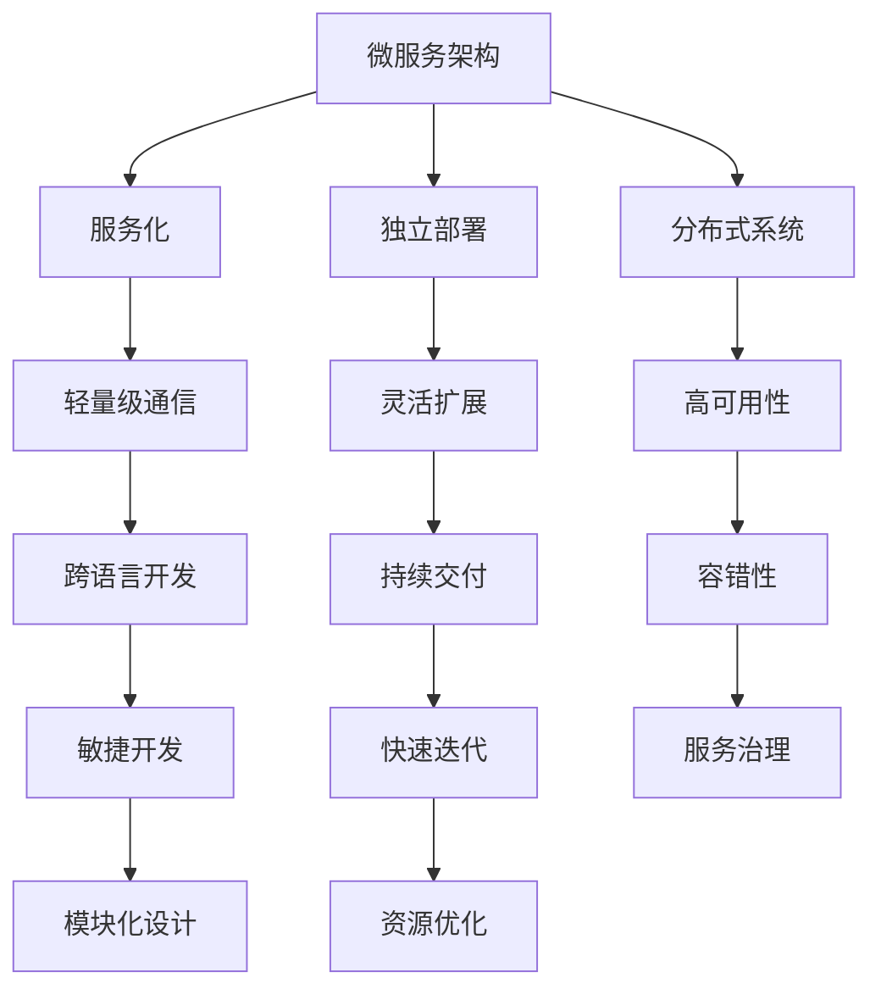

                 


# 微服务测试策略：单元测试到端到端测试

## 关键词

- 微服务测试
- 单元测试
- 端到端测试
- 分布式系统
- 测试策略
- 测试框架
- 测试工具
- 测试实践

## 摘要

微服务架构以其灵活性和可扩展性在软件工程领域得到了广泛应用。然而，微服务的分布式特性带来了测试的复杂性。本文将深入探讨微服务测试策略，从单元测试到端到端测试，旨在为开发人员提供一种系统化的测试方法，确保微服务架构的稳定性和可靠性。

## 第一部分：微服务测试基础

### 第1章：微服务与测试

#### 1.1 微服务概述

微服务是一种软件架构风格，它将应用程序划分为一系列小的、独立的、可复用的服务。每个服务都有自己的业务逻辑，可以独立部署、扩展和管理。微服务架构的核心概念包括服务化、独立部署、分布式系统、轻量级通信、灵活扩展、高可用性、跨语言开发、持续交付、容错性、敏捷开发和模块化设计。

##### 1.1.1 微服务架构的核心概念

微服务架构的核心概念可以通过Mermaid流程图来展示：



- **服务化**：将应用程序分解为多个小型服务，每个服务负责不同的功能。
- **独立部署**：每个服务可以独立部署，便于管理和扩展。
- **分布式系统**：微服务通常分布在不同的服务器上，形成分布式系统。
- **轻量级通信**：服务间通过轻量级协议（如HTTP/REST、gRPC等）进行通信。
- **灵活扩展**：可以根据需求独立扩展某个服务，而不会影响其他服务。
- **高可用性**：通过服务备份和冗余设计，确保系统的稳定性。
- **跨语言开发**：允许使用不同的编程语言开发服务，提高了开发的灵活性。
- **持续交付**：通过自动化测试和部署流程，实现持续交付。
- **容错性**：系统能够在部分服务失败的情况下，仍保持整体运行。
- **敏捷开发**：支持快速迭代和灵活响应变更。
- **模块化设计**：通过模块化设计，提高代码的可维护性和可复用性。
- **资源优化**：可以根据服务负载动态分配资源，提高资源利用率。

##### 1.1.2 微服务测试的重要性

微服务架构虽然带来了诸多好处，但也带来了测试的复杂性。以下是微服务测试的重要性和面临的挑战：

- **分布式系统中的复杂性**：服务间的依赖关系和通信增加了测试难度。
- **稳定性与可靠性**：需要确保每个服务的稳定运行，避免分布式系统中的故障扩散。
- **性能与可扩展性**：测试需要覆盖负载和高并发场景，验证服务的性能和可扩展性。
- **跨语言与跨平台**：需要支持不同语言和平台的兼容性测试。
- **集成测试**：在分布式环境中，集成测试尤为重要，以确保服务之间的交互正常。

### 第2章：微服务测试的挑战

#### 1.2.1 分布式系统中的复杂性

在分布式系统中，服务间的依赖关系和通信增加了测试的复杂性。以下是一些主要挑战：

- **服务间的依赖关系**：测试需要考虑服务间的依赖关系，确保每个服务都能正确地与依赖的服务进行通信。
- **网络延迟与故障**：网络延迟和不稳定可能导致测试失败，需要模拟这些情况来测试系统的健壮性。

#### 1.2.2 软件质量的保障

微服务测试的目的是确保软件质量，包括以下方面：

- **稳定性与可靠性**：测试需要覆盖各种情况，确保服务在正常和异常情况下都能稳定运行。
- **性能与可扩展性**：测试需要模拟高负载和并发场景，评估服务的性能和可扩展性。
- **安全性**：测试需要确保服务能够抵御外部攻击，包括认证、授权、数据加密等。

### 第3章：微服务测试策略

#### 2.1 测试层次概述

微服务测试可以分为多个层次，包括单元测试、集成测试和端到端测试。每种测试层次都有其独特的目的和重要性。

##### 2.1.1 单元测试

**单元测试**是针对单个服务单元进行的测试，主要目的是验证服务内的逻辑正确性。单元测试的目的是：

- **逻辑正确性**：验证服务内的业务逻辑是否正确。
- **边界条件**：测试输入和输出的边界条件。
- **异常处理**：验证服务在异常情况下的行为。

**单元测试工具**：常用的单元测试工具有JUnit（Java）、NUnit（C#）、pytest（Python）等。

##### 2.1.2 集成测试

**集成测试**是针对服务之间交互的测试，主要目的是验证服务之间的协作和交互是否符合预期。集成测试的目的是：

- **服务交互**：验证服务之间的通信是否符合协议和业务逻辑。
- **依赖关系**：确保服务之间的依赖关系正确无误。
- **错误传播**：测试服务之间的错误是否能够正确地传递和处理。

**集成测试工具**：常用的集成测试工具有Postman（API测试）、Selenium（Web自动化测试）等。

##### 2.1.3 端到端测试

**端到端测试**是针对整个系统的测试，主要目的是验证系统的整体功能和性能。端到端测试的目的是：

- **功能完整性**：验证系统的各项功能是否正常。
- **性能与稳定性**：测试系统的性能和稳定性，包括负载测试和压力测试。
- **用户体验**：模拟用户操作，验证系统的用户界面和交互是否顺畅。

**端到端测试工具**：常用的端到端测试工具有JMeter（性能测试）、Appium（移动应用测试）等。

## 第二部分：单元测试实践

### 第3章：单元测试基础

#### 3.1 单元测试原理

**单元测试**是针对单个服务单元进行的测试，主要目的是验证服务内的逻辑正确性。单元测试的基本原理如下：

- **测试用例设计**：根据服务内的功能点和边界条件设计测试用例。
- **自动化执行**：使用测试工具自动化执行测试用例。
- **结果验证**：对比预期结果和实际结果，判断测试是否通过。

以下是一个简单的Python单元测试示例：

```python
import unittest

class TestCalculator(unittest.TestCase):
    def test_add(self):
        self.assertEqual(1 + 1, 2)

    def test_subtract(self):
        self.assertEqual(1 - 1, 0)

if __name__ == '__main__':
    unittest.main()
```

在这个示例中，`TestCalculator` 类继承自 `unittest.TestCase`，`test_add` 和 `test_subtract` 方法分别测试加法和减法运算的正确性。

#### 3.2 单元测试框架

**单元测试框架**提供了自动化测试和结果验证的功能，常用的单元测试框架有：

- **JUnit**（Java）
- **NUnit**（C#）
- **pytest**（Python）

以下是一个简单的JUnit测试示例：

```java
import org.junit.Test;
import static org.junit.Assert.assertEquals;

public class CalculatorTest {
    @Test
    public void testAdd() {
        assertEquals(2, 1 + 1);
    }

    @Test
    public void testSubtract() {
        assertEquals(0, 1 - 1);
    }
}
```

在这个示例中，`CalculatorTest` 类包含了两个测试方法 `testAdd` 和 `testSubtract`，分别测试加法和减法运算的正确性。

### 第4章：单元测试工具

#### 4.1 单元测试框架

**单元测试框架**提供了自动化测试和结果验证的功能，常用的单元测试框架有：

- **JUnit**（Java）
- **NUnit**（C#）
- **pytest**（Python）

以下是一个简单的NUnit测试示例：

```csharp
using NUnit.Framework;
using System;

public class CalculatorTest
{
    [Test]
    public void TestAdd()
    {
        Assert.AreEqual(2, 1 + 1);
    }

    [Test]
    public void TestSubtract()
    {
        Assert.AreEqual(0, 1 - 1);
    }
}
```

在这个示例中，`CalculatorTest` 类包含了两个测试方法 `TestAdd` 和 `TestSubtract`，分别测试加法和减法运算的正确性。

### 第5章：单元测试实践案例

#### 5.1 实践案例1：基本运算

##### 5.1.1 案例描述

本案例旨在通过单元测试验证一个简单的计算器服务，包括加法和减法运算。计算器服务包含以下功能：

- 加法运算：计算两个整数的和。
- 减法运算：计算两个整数的差。

##### 5.1.2 测试用例设计

根据计算器的功能，设计以下测试用例：

1. **加法运算测试**：
   - 输入：1 和 1
   - 预期结果：2
   - 边界条件：最大整数、最小整数

2. **减法运算测试**：
   - 输入：1 和 1
   - 预期结果：0
   - 边界条件：最大整数、最小整数

##### 5.1.3 测试工具应用

使用Python的`pytest`框架进行单元测试，以下是一个简单的测试用例示例：

```python
import pytest

class TestCalculator:
    def test_add(self, calculator):
        result = calculator.add(1, 1)
        assert result == 2

    def test_subtract(self, calculator):
        result = calculator.subtract(1, 1)
        assert result == 0
```

在这个示例中，`TestCalculator` 类包含了两个测试方法 `test_add` 和 `test_subtract`，分别测试加法和减法运算的正确性。`calculator` 是一个计算器实例，可以通过工厂方法或依赖注入等方式传入。

## 第三部分：集成测试与端到端测试

### 第6章：集成测试原理与实践

#### 6.1 集成测试概念

**集成测试**是针对服务之间交互的测试，主要目的是验证服务之间的协作和交互是否符合预期。集成测试可以分为以下类型：

- **功能集成测试**：验证服务之间的功能是否符合设计。
- **性能集成测试**：评估系统的性能和可扩展性。
- **安全性集成测试**：测试服务之间的安全性，包括认证、授权和数据加密。

##### 6.1.1 集成测试的定义

**集成测试**是针对多个服务单元组成的系统的测试，主要目的是验证服务之间的交互是否符合预期。集成测试的定义可以概括为：

- **目的**：验证服务之间的协作和交互是否符合设计。
- **方法**：通过模拟服务之间的交互，执行测试用例，验证服务之间的响应和结果。

##### 6.1.2 集成测试的类型

根据测试的目的和范围，集成测试可以分为以下类型：

1. **功能集成测试**：
   - **目的**：验证服务之间的功能是否符合设计。
   - **方法**：通过模拟服务之间的交互，执行测试用例，验证服务之间的响应和结果。
   - **应用场景**：用于验证不同服务之间的功能交互，如订单服务与库存服务之间的交互。

2. **性能集成测试**：
   - **目的**：评估系统的性能和可扩展性。
   - **方法**：通过模拟高负载和并发场景，执行性能测试用例，评估系统的响应时间和吞吐量。
   - **应用场景**：用于评估系统在高负载下的性能和可扩展性。

3. **安全性集成测试**：
   - **目的**：测试服务之间的安全性，包括认证、授权和数据加密。
   - **方法**：通过模拟攻击场景，执行安全测试用例，验证系统的安全措施是否有效。
   - **应用场景**：用于验证系统对外部攻击的防护能力。

### 第7章：端到端测试原理与实践

#### 7.1 端到端测试概念

**端到端测试**是针对整个系统的测试，主要目的是验证系统的整体功能和性能。端到端测试可以分为以下类型：

- **功能端到端测试**：验证系统的各项功能是否正常。
- **性能端到端测试**：评估系统的性能和稳定性。
- **用户体验端到端测试**：模拟用户操作，验证系统的用户界面和交互是否顺畅。

##### 7.1.1 端到端测试的定义

**端到端测试**是针对整个系统的测试，主要目的是验证系统的整体功能和性能。端到端测试的定义可以概括为：

- **目的**：验证系统的整体功能和性能。
- **方法**：通过模拟用户操作，执行测试用例，验证系统的响应和结果。

##### 7.1.2 端到端测试的类型

根据测试的目的和范围，端到端测试可以分为以下类型：

1. **功能端到端测试**：
   - **目的**：验证系统的各项功能是否正常。
   - **方法**：通过模拟用户操作，执行功能测试用例，验证系统的响应和结果。
   - **应用场景**：用于验证系统的整体功能，如电商平台从用户登录到购买商品的全过程。

2. **性能端到端测试**：
   - **目的**：评估系统的性能和稳定性。
   - **方法**：通过模拟高负载和并发场景，执行性能测试用例，评估系统的响应时间和吞吐量。
   - **应用场景**：用于评估系统在高负载下的性能和稳定性。

3. **用户体验端到端测试**：
   - **目的**：验证系统的用户界面和交互是否顺畅。
   - **方法**：通过模拟用户操作，执行用户体验测试用例，评估系统的易用性和交互效果。
   - **应用场景**：用于验证系统的用户界面和交互设计。

## 结论

微服务测试是确保微服务架构稳定性和可靠性的关键。通过单元测试、集成测试和端到端测试，可以全面地验证微服务的功能、性能和安全性。本文介绍了微服务测试的基础知识、测试策略和实践案例，为开发人员提供了一种系统化的测试方法。在实际项目中，应根据具体需求选择合适的测试策略和工具，确保微服务架构的稳定性和可靠性。

### 作者信息

作者：AI天才研究院/AI Genius Institute & 禅与计算机程序设计艺术 /Zen And The Art of Computer Programming

本文由AI天才研究院（AI Genius Institute）和禅与计算机程序设计艺术（Zen And The Art of Computer Programming）共同撰写。AI天才研究院致力于推动人工智能技术的发展和应用，为全球开发者提供高质量的技术内容和解决方案。禅与计算机程序设计艺术则专注于计算机编程领域，提倡以禅宗思维审视编程艺术，实现代码与心灵的和谐统一。期待与广大读者一起探索计算机编程和人工智能的无限可能。

