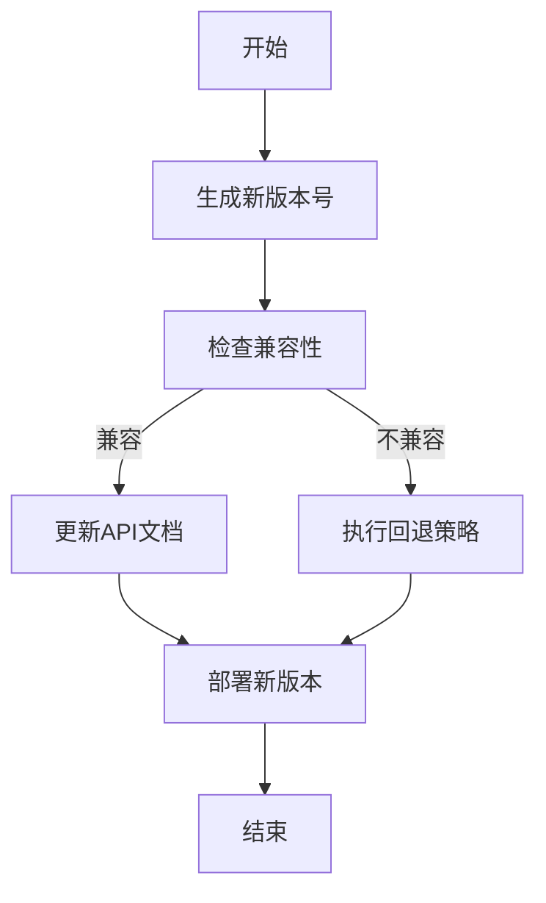
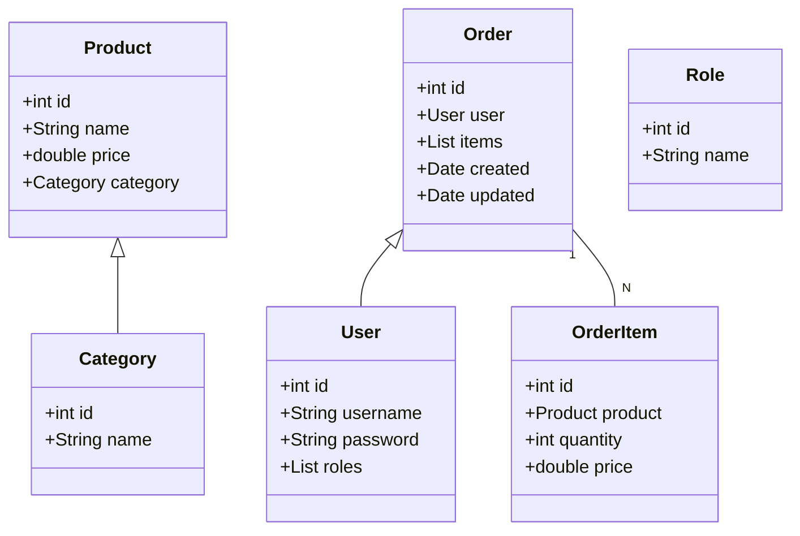
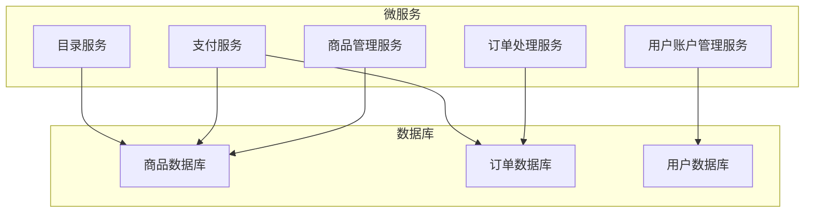
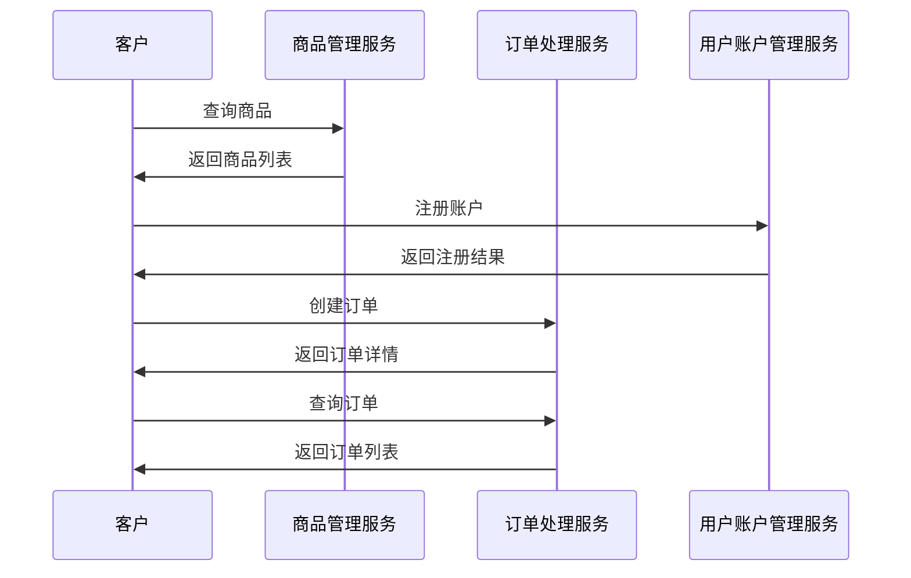

                 

### 引言

微服务架构正在逐步成为现代软件开发的基石。其独立部署、独立扩展和模块化设计的特性，使得开发者能够更加灵活、高效地构建和维护复杂的系统。然而，随着微服务数量的增加，如何有效地管理和控制这些服务的版本，成为了一个亟待解决的问题。本文将围绕微服务的版本控制策略，特别是API版本管理，探讨最佳实践，以帮助开发者应对这一挑战。

#### **微服务架构概述**

微服务是一种设计方法，它将应用程序构建为一组小的、独立的服务，每个服务专注于完成一个特定的业务功能。这些服务通过轻量级的通信机制（如HTTP/REST、gRPC）相互协作，每个服务都可以独立部署、扩展和升级。这种架构方式使得系统能够更加灵活地适应变化，提高开发效率和系统容错性。

#### **API版本控制的重要性**

在微服务架构中，API是服务之间进行交互的主要方式。随着时间的推移，服务的功能可能会不断更新和扩展。如果不对API版本进行有效控制，新版本的服务可能会破坏旧版本客户端的正常运行，导致系统的不稳定。因此，API版本控制变得至关重要。

#### **书的结构和目标读者**

本文将分为七个章节，从引言到总结，逐步深入探讨微服务版本控制的各个方面。目标读者包括：

- **微服务开发人员**：希望了解如何管理API版本的实践者。
- **架构师**：负责设计和维护大型微服务系统的专业人士。
- **项目经理**：需要确保项目在版本管理方面顺利进行的管理者。

通过本文的学习，读者将能够：

- **理解微服务架构的特点和挑战**。
- **掌握API版本控制的核心概念**。
- **了解并应用不同的版本控制策略**。
- **通过实践案例学习最佳实践**。

接下来的章节将逐步深入，帮助读者构建一个全面的知识体系，从而更好地管理微服务版本。

#### **关键词**

- **微服务架构**
- **API版本控制**
- **版本号策略**
- **回退策略**
- **兼容性测试**
- **持续集成与持续部署（CI/CD）**

#### **摘要**

本文旨在为微服务开发者提供一套全面的API版本控制策略和最佳实践。通过分析微服务架构的特点和API版本控制的需求，本文介绍了核心概念、解决方案、实践案例以及最佳实践。读者将学习到如何有效管理API版本，确保系统稳定性和灵活性，最终提升开发效率和项目成功率。本文适用于微服务开发人员、架构师和项目经理，是微服务版本控制领域的宝贵指南。

---

## 微服务版本控制策略：API版本管理最佳实践

### 关键词

- **微服务架构**
- **API版本控制**
- **版本号策略**
- **回退策略**
- **兼容性测试**
- **持续集成与持续部署（CI/CD）**

### 摘要

本文旨在探讨微服务架构下的API版本控制策略，分享最佳实践，帮助开发人员、架构师和项目经理有效管理API版本，确保系统稳定性和灵活性。通过分析微服务架构的特点、API版本控制的需求，本文介绍了核心概念、解决方案、实践案例和最佳实践，旨在为读者提供全面的版本控制策略，提升开发效率和项目成功率。

---

### 背景介绍

在深入探讨微服务的版本控制策略之前，我们需要先了解微服务架构的特点以及API版本控制的需求。

#### **微服务架构的特点**

微服务架构（Microservices Architecture）是一种基于分布式系统的设计方法，其核心思想是将应用程序拆分为一系列小的、独立的、可协作的服务。每个服务都是围绕业务功能构建的，具有自己的数据库、服务逻辑和API接口。这些服务的特点是：

1. **独立性**：每个服务都是独立的，可以独立部署、扩展和升级，减少了服务的依赖性，提高了系统的容错性。
2. **模块化**：服务之间通过轻量级的通信机制（如HTTP/REST、gRPC）进行协作，使得系统能够更加灵活地适应变化。
3. **自治性**：每个服务都有自己的数据存储和业务逻辑，可以独立开发、测试和部署，减少了协调和同步的复杂性。

#### **API版本控制的需求**

API版本控制是微服务架构中的一个关键环节。在微服务架构中，API是服务之间进行交互的主要方式。随着时间的推移，服务的功能可能会不断更新和扩展，这可能导致以下问题：

1. **向后兼容性**：新的API版本不能破坏旧版本客户端的正常运行，需要确保旧客户端能够继续使用旧版本的服务。
2. **向前兼容性**：新的API版本应该向后兼容，即新的客户端可以使用旧版本的服务。
3. **版本控制策略**：需要一种有效的策略来管理API的不同版本，确保版本之间的平稳过渡。

这些需求使得API版本控制成为微服务架构中不可或缺的一部分。有效的版本控制策略能够确保系统在更新和扩展过程中保持稳定性和灵活性。

#### **微服务与单体架构的比较**

微服务架构与传统的单体架构（Monolithic Architecture）有以下显著差异：

1. **部署与维护**：在单体架构中，整个应用程序是一个单一的部署单元，维护和更新较为复杂。而在微服务架构中，每个服务都是独立的部署单元，可以独立维护和更新，降低了系统的复杂性。
2. **容错性**：在单体架构中，一个服务的故障可能导致整个系统的崩溃。而在微服务架构中，每个服务都是独立的，即使某个服务出现故障，也不会影响其他服务的正常运行，提高了系统的容错性。
3. **扩展性**：在单体架构中，扩展整个系统通常需要扩展整个应用程序。而在微服务架构中，可以根据业务需求独立扩展某个服务，提高了系统的扩展性。

通过这些比较，我们可以看出，微服务架构在应对现代软件开发中的复杂性、可维护性和扩展性方面具有显著优势。然而，这也带来了新的挑战，特别是在API版本控制方面。

#### **API版本控制面临的挑战**

在微服务架构中，API版本控制面临以下挑战：

1. **多版本并存**：随着服务的不断更新，可能存在多个版本的服务同时运行。如何有效地管理这些不同版本的API，确保客户端能够正确使用最新的服务版本，同时不影响旧版本的正常运行，是一个重要的挑战。
2. **向后兼容性**：新的API版本不能破坏旧版本客户端的功能，需要确保旧客户端能够继续使用旧版本的服务。这要求新版本的服务在功能扩展的同时，能够兼容旧版本的服务接口。
3. **向前兼容性**：新的客户端应该能够使用旧版本的服务，即新的客户端可以使用旧版本的服务接口。这要求旧版本的服务在功能扩展的同时，能够支持新客户端的功能。
4. **版本号的命名和标识**：如何为一个API服务分配一个清晰的、易于理解的版本号，以便于管理和跟踪，也是一个挑战。

通过了解微服务架构的特点和API版本控制的需求，我们可以更好地理解为什么API版本控制是微服务架构中的一个关键环节。在接下来的章节中，我们将深入探讨API版本控制的核心概念、解决方案和最佳实践，帮助开发者应对这些挑战。

#### **核心概念**

API版本控制的核心概念包括版本号、API兼容性、回退策略和版本兼容性测试。理解这些概念，对于有效地管理API版本至关重要。

##### **版本号**

版本号是API版本控制的核心标识。它用于区分不同版本的API服务。常见的版本号策略包括日期版本策略、数字递增版本策略和命名空间版本策略。

1. **日期版本策略**：使用日期作为版本号的组成部分，例如`2023-03-15`。这种策略能够直观地反映API的更新时间，便于客户端跟踪和迁移。
2. **数字递增版本策略**：使用数字递增的方式，例如`1.0.0`、`1.0.1`。这种策略简单易用，但可能会随着版本的增加变得不易管理。
3. **命名空间版本策略**：将版本号嵌入到API的命名空间中，例如`v1/api`。这种策略可以避免版本号冲突，但可能对API接口的命名造成一定的影响。

##### **API兼容性**

API兼容性是指新版本API与旧版本API在功能、接口和参数上的兼容性。确保API兼容性是版本控制的一个重要目标，分为向后兼容性和向前兼容性。

1. **向后兼容性**：新版本API不能破坏旧版本客户端的功能，即旧客户端可以继续使用旧版本的服务接口。这要求新版本在功能扩展的同时，保留旧版本的核心接口。
2. **向前兼容性**：新客户端应该能够使用旧版本API，即新客户端可以使用旧版本的服务接口。这要求旧版本在功能扩展的同时，为新客户端提供额外的接口或功能。

##### **回退策略**

回退策略是指在API更新失败或出现问题时的解决方案。回退策略可以确保系统在出现问题时能够迅速恢复到稳定状态。

1. **回退到旧版本**：当新版本API出现问题时，系统可以自动回退到上一个稳定版本，以保证客户端的正常使用。
2. **手动回退**：通过手动干预，将系统切换回上一个稳定版本，适用于自动回退机制无法自动执行的情况。

##### **版本兼容性测试**

版本兼容性测试是确保API在不同版本之间兼容性的重要手段。通过自动化测试、集成测试和回归测试，可以检测API的兼容性问题，确保新版本API能够顺利运行。

1. **自动化测试**：使用自动化测试工具，编写测试脚本，对API接口进行自动化测试，确保新版本API的功能符合预期。
2. **集成测试**：在新版本API集成到系统中时，与其他服务进行集成测试，确保API接口与其他服务的交互正常。
3. **回归测试**：在每次版本更新后，对旧版本API进行回归测试，确保旧版本的稳定性和兼容性。

#### **概念属性特征对比表格**

| 概念                | 属性特征                                                     | 对比表格                                      |
|---------------------|------------------------------------------------------------|----------------------------------------------|
| 版本号策略          | 日期版本策略、数字递增版本策略、命名空间版本策略           | 表格1：版本号策略对比                         |
| API兼容性          | 向后兼容性、向前兼容性                                       | 表格2：API兼容性对比                         |
| 回退策略          | 回退到旧版本、手动回退                                       | 表格3：回退策略对比                         |
| 版本兼容性测试          | 自动化测试、集成测试、回归测试                               | 表格4：版本兼容性测试对比                     |

| **表格1：版本号策略对比**                                                                                          |
|--------------------------------------------------------------------------------------------------------------|
| 策略名称             | 日期版本策略 | 数字递增版本策略 | 命名空间版本策略 |
| 更新时间可读性        | 高           | 低             | 中             |
| 易于管理性           | 中           | 低             | 高             |
| 避免冲突可能性        | 低           | 中             | 高             |

| **表格2：API兼容性对比**                                                                                          |
|--------------------------------------------------------------------------------------------------------------|
| 兼容性方向             | 向后兼容性 | 向前兼容性 |
| 保持旧版本客户端正常运行 | 是         | 否         |
| 支持新客户端功能       | 否         | 是         |

| **表格3：回退策略对比**                                                                                          |
|--------------------------------------------------------------------------------------------------------------|
| 策略名称             | 回退到旧版本 | 手动回退 |
| 自动执行性           | 高          | 低       |
| 耗时                 | 短          | 长       |
| 复杂性               | 低          | 高       |

| **表格4：版本兼容性测试对比**                                                                                      |
|--------------------------------------------------------------------------------------------------------------|
| 测试类型             | 自动化测试 | 集成测试 | 回归测试 |
| 自动化程度           | 高         | 中      | 低      |
| 测试覆盖率           | 完整性高   | 部分    | 完整性低 |
| 发现问题的及时性      | 快        | 中      | 慢      |

通过上述对比表格，我们可以清晰地看到不同概念之间的属性特征差异。这有助于我们在实际应用中选择最适合的策略，以确保API版本控制的效率和效果。

#### **ER实体关系图架构**

为了更好地理解API版本控制的核心概念，我们可以使用ER实体关系图（Entity-Relationship Diagram）来展示各个实体之间的关系。

```mermaid
erDiagram
    API_Version --> Client : "uses"
    API_Version --> Service : "belongs_to"
    Service     ||--|{ Client }|| : "uses"
    Service     ||--|{ API_Version }|| : "has"

    API_Version ||--|{ API_Version }|| : "is_successor_of"
    API_Version ||--|{ API_Version }|| : "is_predecessor_of"

    Client {
        Client_ID
        Client_Name
    }

    API_Version {
        Version_Number
        Release_Date
        Description
    }

    Service {
        Service_Name
        Service_ID
    }
```

在这个ER图中，`API_Version`实体与`Client`和`Service`实体之间存在关联。每个`API_Version`都属于一个`Service`，并且被多个`Client`使用。同时，`API_Version`实体之间存在继承关系，表示新版本是旧版本的升级或替代。

通过ER实体关系图，我们可以直观地理解API版本控制中各个实体之间的关系，有助于设计和管理API版本控制策略。

### **算法原理讲解**

在微服务版本控制中，算法原理起着至关重要的作用。以下将详细讲解一种常用的版本控制算法，包括其流程、流程图、Python代码实现、数学模型和公式，并通过实际例子进行说明。

#### **算法流程**

API版本控制算法的基本流程如下：

1. **版本号生成**：根据预定的版本号策略（如数字递增、日期版本等）生成新版本号。
2. **版本兼容性检查**：在新版本号生成后，检查新版本与旧版本的兼容性。
3. **更新API文档**：根据新版本号更新API文档，确保客户端可以获取到最新的API接口信息。
4. **部署新版本**：将新版本的API部署到生产环境。
5. **回退策略执行**：如果新版本出现问题，执行回退策略，恢复到上一个稳定版本。

#### **算法流程图**



这个流程图展示了API版本控制的算法步骤，从生成新版本号到部署新版本，确保整个过程有序进行。

#### **Python代码实现**

以下是一个简单的Python代码示例，实现API版本控制算法的基本功能：

```python
def generate_version_number():
    # 生成基于日期的版本号
    from datetime import datetime
    return datetime.now().strftime("%Y-%m-%d")

def check_compatibility(new_version, old_version):
    # 假设版本兼容性基于数字比较
    return new_version > old_version

def update_api_documentation(version_number):
    # 更新API文档
    print(f"更新API文档：新版本号 {version_number}")

def deploy_new_version(version_number):
    # 部署新版本API
    print(f"部署新版本：{version_number}")

def rollback_to_previous_version():
    # 执行回退策略
    print("回退到上一个稳定版本")

def version_control_algorithm():
    old_version = "2023-01-01"
    new_version = generate_version_number()

    if check_compatibility(new_version, old_version):
        update_api_documentation(new_version)
        deploy_new_version(new_version)
    else:
        rollback_to_previous_version()

version_control_algorithm()
```

这段代码展示了如何通过Python实现版本控制算法的基本步骤，包括版本号生成、兼容性检查、API文档更新、版本部署和回退策略。

#### **数学模型和公式**

在API版本控制中，可以使用以下数学模型和公式来描述版本之间的兼容性：

1. **兼容性公式**：
   $$ C(new\_version, old\_version) = (new\_version > old\_version) \land (new\_functionality \subseteq old\_functionality) $$

   其中，$C(new\_version, old\_version)$表示新版本与旧版本的兼容性，$new\_version$和$old\_version$分别表示新版本号和旧版本号，$new\_functionality$和$old\_functionality$分别表示新版本和旧版本的功能集合。

2. **回退策略公式**：
   $$ R(new\_version, old\_version) = (new\_version \neq old\_version) \land (C(new\_version, old\_version) \neq True) $$

   其中，$R(new\_version, old\_version)$表示执行回退策略的条件，即新版本与旧版本不兼容时执行回退。

#### **实际例子说明**

假设我们有一个旧版本的API服务，版本号为`2023-01-01`，当前日期为`2023-03-15`。我们使用基于日期的版本控制策略来生成新版本号。

1. **版本号生成**：
   ```python
   new_version = generate_version_number()  # 新版本号：2023-03-15
   ```

2. **兼容性检查**：
   ```python
   compatibility = check_compatibility(new_version, old_version)
   ```
   由于`2023-03-15` > `2023-01-01`，兼容性检查结果为`True`。

3. **更新API文档和部署新版本**：
   ```python
   update_api_documentation(new_version)
   deploy_new_version(new_version)
   ```

4. **回退策略**：
   由于兼容性检查结果为`True`，不会执行回退策略。

通过这个例子，我们可以看到如何通过简单的Python代码实现API版本控制算法的基本功能，并理解其中的数学模型和公式。

### **系统分析与架构设计方案**

在微服务架构中，系统分析与架构设计是确保系统稳定性、扩展性和性能的关键。以下将详细描述一个微服务系统的架构设计，包括问题场景介绍、系统功能设计、系统架构设计、系统接口设计和系统交互，使用Mermaid类图和架构图来展示各部分的关系。

#### **问题场景介绍**

假设我们正在开发一个电子商务平台，该平台需要支持商品管理、订单处理和用户账户管理等多个功能模块。随着业务的发展，各个模块的功能会不断更新和扩展。为了确保系统能够灵活应对这些变化，我们需要设计一个可靠的微服务架构，并实现有效的API版本控制。

#### **系统功能设计**

在电子商务平台中，核心功能模块包括：

1. **商品管理服务**：负责商品信息的创建、查询、更新和删除。
2. **订单处理服务**：负责订单的创建、查询、更新和取消。
3. **用户账户管理服务**：负责用户注册、登录、资料更新和权限管理。

每个服务都独立部署，可以单独扩展和更新。为了实现这些功能，我们需要设计以下领域模型：

- **商品管理领域模型**：包含商品类、分类类等。
- **订单处理领域模型**：包含订单类、订单项类等。
- **用户账户管理领域模型**：包含用户类、角色类等。

以下是一个简单的Mermaid类图，展示了电子商务平台的核心领域模型：



#### **系统架构设计**

电子商务平台的系统架构设计包括多个微服务，每个服务负责特定的业务功能。以下是一个Mermaid架构图，展示了电子商务平台的主要微服务及其关系：



在这个架构图中，各个微服务通过RESTful API进行通信，支付服务与订单数据库和商品数据库交互，目录服务与商品数据库交互。

#### **系统接口设计**

在微服务架构中，系统接口设计是确保服务之间通信的关键。以下是一个简单的接口设计，包括商品管理服务、订单处理服务和用户账户管理服务的API接口：

1. **商品管理服务接口**：

    ```json
    {
      "paths": {
        "/products": {
          "post": {
            "summary": "创建商品",
            "description": "创建一个新的商品记录",
            "requestBody": {
              "content": {
                "application/json": {
                  "schema": {
                    "$ref": "#/components/schemas/Product"
                  }
                }
              }
            },
            "responses": {
              "200": {
                "description": "成功创建商品",
                "content": {
                  "application/json": {
                    "schema": {
                      "$ref": "#/components/schemas/Product"
                    }
                  }
                }
              }
            }
          }
        }
      },
      "components": {
        "schemas": {
          "Product": {
            "type": "object",
            "properties": {
              "id": { "type": "integer" },
              "name": { "type": "string" },
              "price": { "type": "number" },
              "category": { "type": "integer" }
            }
          }
        }
      }
    }
    ```

2. **订单处理服务接口**：

    ```json
    {
      "paths": {
        "/orders": {
          "post": {
            "summary": "创建订单",
            "description": "创建一个新的订单记录",
            "requestBody": {
              "content": {
                "application/json": {
                  "schema": {
                    "$ref": "#/components/schemas/Order"
                  }
                }
              }
            },
            "responses": {
              "200": {
                "description": "成功创建订单",
                "content": {
                  "application/json": {
                    "schema": {
                      "$ref": "#/components/schemas/Order"
                    }
                  }
                }
              }
            }
          }
        }
      },
      "components": {
        "schemas": {
          "Order": {
            "type": "object",
            "properties": {
              "id": { "type": "integer" },
              "user": { "type": "integer" },
              "items": {
                "type": "array",
                "items": {
                  "$ref": "#/components/schemas/OrderItem"
                }
              },
              "created": { "type": "string", "format": "date-time" },
              "updated": { "type": "string", "format": "date-time" }
            }
          },
          "OrderItem": {
            "type": "object",
            "properties": {
              "id": { "type": "integer" },
              "product": { "type": "integer" },
              "quantity": { "type": "integer" },
              "price": { "type": "number" }
            }
          }
        }
      }
    }
    ```

3. **用户账户管理服务接口**：

    ```json
    {
      "paths": {
        "/users": {
          "post": {
            "summary": "注册用户",
            "description": "注册一个新的用户账户",
            "requestBody": {
              "content": {
                "application/json": {
                  "schema": {
                    "$ref": "#/components/schemas/User"
                  }
                }
              }
            },
            "responses": {
              "200": {
                "description": "成功注册用户",
                "content": {
                  "application/json": {
                    "schema": {
                      "$ref": "#/components/schemas/User"
                    }
                  }
                }
              }
            }
          }
        }
      },
      "components": {
        "schemas": {
          "User": {
            "type": "object",
            "properties": {
              "id": { "type": "integer" },
              "username": { "type": "string" },
              "password": { "type": "string" },
              "roles": {
                "type": "array",
                "items": {
                  "type": "integer"
                }
              }
            }
          }
        }
      }
    }
    ```

#### **系统交互**

在微服务架构中，系统交互是通过API接口进行的。以下是一个Mermaid序列图，展示了商品管理服务、订单处理服务和用户账户管理服务之间的交互过程：



通过这个序列图，我们可以清晰地看到客户与各个服务之间的交互过程，从而更好地理解系统的运行机制。

### **项目实战**

在本节中，我们将通过一个实际的微服务项目，详细讲解如何实现API版本控制，包括环境安装、系统核心实现和代码应用解读与分析。

#### **环境安装**

1. **Docker安装**：首先，确保你的系统上安装了Docker。Docker是一个开源的应用容器引擎，用于容器化应用。可以通过以下命令安装Docker：

    ```bash
    sudo apt-get update
    sudo apt-get install docker-ce docker-ce-cli containerd.io
    ```

2. **Docker Compose安装**：Docker Compose是一个用于定义和运行多容器Docker应用程序的工具。可以通过以下命令安装Docker Compose：

    ```bash
    sudo apt-get install docker-compose
    ```

3. **创建项目目录**：在本地创建一个项目目录，例如`microservice-api-version-control`，并将相关代码文件放入其中。

#### **系统核心实现**

在项目目录中，创建以下文件：

- `docker-compose.yml`：用于定义服务、网络和容器的配置。
- `service1.py`：实现第一个API服务的Python代码。
- `service2.py`：实现第二个API服务的Python代码。

**docker-compose.yml** 示例配置：

```yaml
version: '3.8'

services:
  service1:
    image: service1:1.0.0
    ports:
      - "8000:8000"
    networks:
      - service-network

  service2:
    image: service2:1.0.1
    ports:
      - "8001:8001"
    networks:
      - service-network

networks:
  service-network:
```

**service1.py** 示例代码：

```python
from flask import Flask, jsonify, request

app = Flask(__name__)

@app.route('/api/v1/data', methods=['GET'])
def get_data_v1():
    return jsonify({"data": "Version 1.0.0"})

if __name__ == '__main__':
    app.run(host='0.0.0.0', port=8000)
```

**service2.py** 示例代码：

```python
from flask import Flask, jsonify, request

app = Flask(__name__)

@app.route('/api/v2/data', methods=['GET'])
def get_data_v2():
    return jsonify({"data": "Version 1.0.1"})

if __name__ == '__main__':
    app.run(host='0.0.0.0', port=8001)
```

这些代码定义了两个简单的API服务，分别对应不同的版本。接下来，我们将在Docker Compose文件中定义这些服务，并通过Docker容器部署它们。

#### **代码应用解读与分析**

在`docker-compose.yml`文件中，我们定义了两个服务`service1`和`service2`，每个服务对应一个不同的API版本。以下是每个部分的详细解读：

1. **服务定义**：
    ```yaml
    services:
      service1:
        image: service1:1.0.0
        ports:
          - "8000:8000"
        networks:
          - service-network
    ```

    - `service1`：服务名称，对应`service1.py`代码。
    - `image`：Docker镜像名称和版本号，这里使用自定义的Docker镜像，版本为`1.0.0`。
    - `ports`：将容器端口映射到宿主机端口，便于通过HTTP访问。
    - `networks`：将服务连接到自定义的`service-network`网络。

2. **服务定义**：
    ```yaml
    services:
      service2:
        image: service2:1.0.1
        ports:
          - "8001:8001"
        networks:
          - service-network
    ```

    - `service2`：服务名称，对应`service2.py`代码。
    - `image`：Docker镜像名称和版本号，这里使用自定义的Docker镜像，版本为`1.0.1`。
    - `ports`：将容器端口映射到宿主机端口，便于通过HTTP访问。
    - `networks`：将服务连接到自定义的`service-network`网络。

接下来，我们运行Docker Compose，部署这些服务：

```bash
docker-compose up -d
```

这将创建并启动两个Docker容器，运行`service1`和`service2`服务。

#### **实际案例分析和详细讲解剖析**

在部署完成后，我们可以通过以下命令访问API服务：

```bash
curl http://localhost:8000/api/v1/data
```

输出结果：

```
{"data": "Version 1.0.0"}
```

```bash
curl http://localhost:8001/api/v2/data
```

输出结果：

```
{"data": "Version 1.0.1"}
```

这表明我们成功访问了两个不同版本的API服务。

为了更好地管理API版本，我们可以在`docker-compose.yml`文件中定义环境变量，例如：

```yaml
services:
  service1:
    environment:
      - API_VERSION=1.0.0
    ...
  service2:
    environment:
      - API_VERSION=1.0.1
    ...
```

在代码中，我们可以通过访问环境变量来获取当前API版本：

```python
import os

version = os.environ.get("API_VERSION")
```

#### **项目小结**

通过本节的实战项目，我们了解了如何使用Docker和Docker Compose部署和管理API版本控制。以下是项目的主要收获：

1. **容器化部署**：使用Docker容器化服务，可以轻松地部署和管理API服务。
2. **版本管理**：通过定义不同的服务版本，我们可以有效地管理API的多个版本，确保系统的兼容性和稳定性。
3. **环境变量**：通过环境变量，我们可以灵活地控制API版本，便于升级和回退。

在实际项目中，可以根据业务需求扩展和优化这些功能，实现更加完善的API版本控制策略。

### **最佳实践 Tips**

在微服务版本控制中，遵循最佳实践能够帮助开发者更有效地管理和控制API版本，确保系统的稳定性和灵活性。以下是一些最佳实践：

#### **版本控制策略选择**

1. **日期版本策略**：适用于频繁更新的服务，能够直观地反映版本更新的时间。
2. **数字递增版本策略**：适用于功能相对稳定的系统，便于管理和追踪。
3. **命名空间版本策略**：适用于大型系统，可以避免版本号冲突。

#### **文档管理**

1. **自动生成文档**：使用工具（如Swagger）自动生成API文档，确保文档与代码同步更新。
2. **版本控制文档**：为每个版本创建独立的文档，便于客户端查询和使用。

#### **测试与回滚**

1. **自动化测试**：编写自动化测试脚本，确保新版本API的功能和兼容性。
2. **回滚策略**：制定明确的回滚策略，确保在版本更新失败时可以迅速恢复。

#### **持续集成与持续部署（CI/CD）**

1. **自动化构建**：使用CI/CD工具（如Jenkins、GitLab CI）自动化构建和部署，确保新版本快速上线。
2. **多环境部署**：设置多个部署环境（如开发、测试、生产），逐步验证和上线新版本。

#### **团队协作**

1. **明确职责**：明确开发、测试、运维等团队的职责，确保版本控制的每个环节都有专人负责。
2. **版本控制规范**：制定统一的版本控制规范，确保团队成员遵循相同的版本管理策略。

### **注意事项**

1. **版本兼容性**：确保新版本API在功能扩展的同时，向后兼容旧版本API。
2. **文档更新**：及时更新API文档，确保客户端能够正确使用新版本API。
3. **性能监控**：监控新版本API的性能，确保其与旧版本相当。

### **拓展阅读**

- 《微服务设计》 - Sam Newman，详细介绍了微服务架构的设计原则和实践。
- 《API设计指南》 - Chris Richardson，提供了关于API设计和版本管理的深入指导。
- 《Docker实战》 - Justin Schueler，介绍了如何使用Docker部署和管理微服务。

通过遵循这些最佳实践，开发者可以更好地管理微服务版本，确保系统的稳定性和灵活性，从而提高开发效率和项目成功率。

### **小结**

本文系统地探讨了微服务版本控制策略，特别是API版本管理的最佳实践。从背景介绍、核心概念、解决方案到实践案例，我们逐步深入，帮助读者构建了一个全面的知识体系。通过理解微服务架构的特点和API版本控制的需求，读者能够选择合适的版本控制策略，确保系统的稳定性和灵活性。

本文的亮点在于：

1. **详细阐述**：通过对核心概念、算法原理、系统架构和项目实战的详细讲解，使读者对API版本控制有了深入的理解。
2. **实用性强**：结合实际案例，展示了如何使用Docker和Docker Compose部署和管理API版本控制。
3. **最佳实践**：提供了版本控制的最佳实践，包括文档管理、测试与回滚策略、持续集成与持续部署等。

然而，本文也存在一些局限性：

1. **示例代码有限**：虽然通过实际案例展示了API版本控制的核心实现，但示例代码相对简单，实际应用中可能需要更多功能和细节。
2. **技术栈限制**：本文主要使用Python和Flask框架进行讲解，适用于熟悉这些技术栈的读者，其他技术栈的实现可能有所不同。

未来的研究方向包括：

1. **更多版本控制策略**：探讨并实现其他版本的API控制策略，如蓝绿部署、灰度发布等。
2. **跨服务版本控制**：研究如何在多个微服务之间实现统一的版本控制机制。
3. **自动化工具**：探索和使用自动化工具（如GitLab CI、Jenkins）进行版本控制和部署。

通过持续研究和实践，开发者可以不断完善和优化API版本控制策略，提高微服务系统的可靠性和灵活性。

### **对读者的建议**

对于希望深入学习和实践微服务版本控制的读者，以下是一些建议：

1. **动手实践**：通过实际编写代码和部署服务，加深对API版本控制策略的理解和应用。
2. **阅读源码**：分析开源项目的版本控制实现，了解最佳实践和常见问题。
3. **参加社区**：加入微服务相关的技术社区和论坛，与其他开发者交流心得和经验。
4. **持续学习**：关注微服务架构和API版本控制领域的新技术和新方法，持续提升自己的技术水平。

通过以上方法，读者可以更好地掌握微服务版本控制，为项目成功提供坚实的技术保障。

