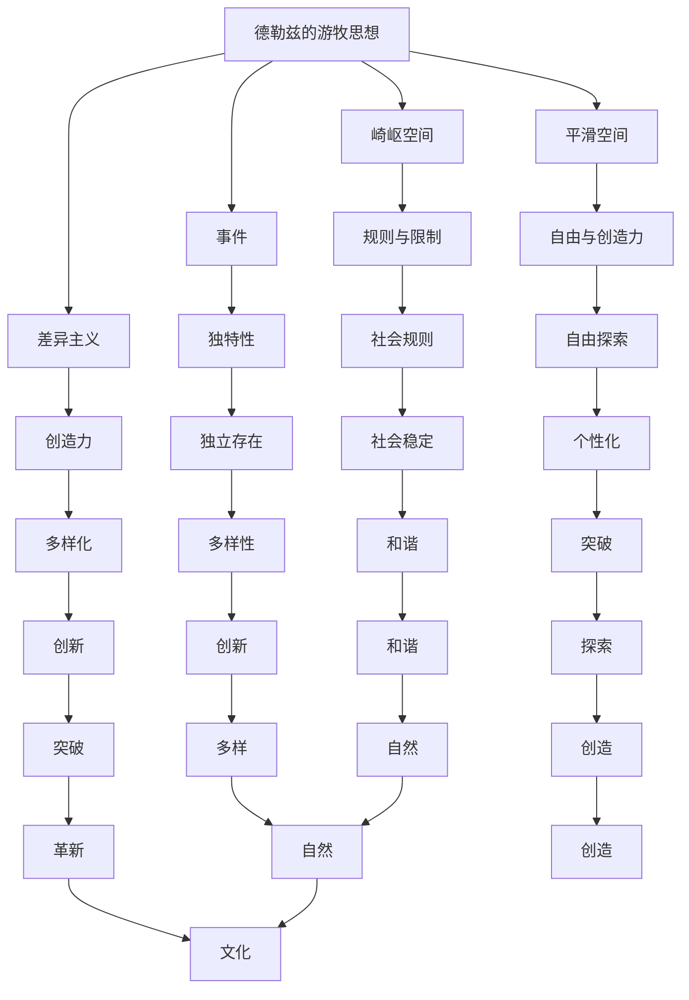

                 

### 《德勒兹与老子：游牧思想与道的哲学》

在科技飞速发展的今天，我们不断地追求技术创新与突破，然而，哲学思想的深刻内涵仍然在影响着我们的世界观和方法论。书中《德勒兹与老子：游牧思想与道的哲学》将法国哲学家德勒兹（Gilles Deleuze）的游牧思想与中国古代哲学家老子的“道”的哲学相结合，为我们提供了一种全新的思考模式。本文将以此书为线索，逐步解析德勒兹和老子哲学思想的内涵及其在现代信息技术领域的应用。

## 关键词

- 德勒兹
- 老子
- 游牧思想
- “道”的哲学
- 信息技术

## 摘要

本文首先对德勒兹和老子哲学思想进行概述，分析其核心概念和特点。接着，探讨两者思想的联系与差异，特别是在信息技术领域的应用。通过案例分析，展示游牧思想与道的哲学在现实中的具体应用，并总结全书内容，展望未来研究方向。

## 目录

1. 引言与核心概念介绍
2. 德勒兹的游牧思想
3. 老子的道的哲学
4. 德勒兹与老子思想的比较与联系
5. 游牧思想与道的哲学的应用
6. 案例分析
7. 结论与展望

### 第1章 引言与核心概念介绍

#### 1.1 德勒兹的哲学思想概述

德勒兹（Gilles Deleuze，1925-1995）是20世纪法国著名哲学家，以其独特的思想风格和深邃的哲学见解而著称。他的哲学思想充满了对生命、自由、创造力以及差异性的探讨。德勒兹反对传统哲学的二元对立思维，提倡“平滑空间”（smooth space）和“崎岖空间”（striated space）的概念。

- **平滑空间**：德勒兹认为，平滑空间是充满创造力和无限可能的领域，它没有既定的规则和限制，个体在其中可以自由探索和创造。
- **崎岖空间**：相对的，崎岖空间则充满了规则和限制，个体在其中必须遵循既定的社会规则和结构。

德勒兹的思想还涉及到“差异主义”（differenceism）和“事件”（event）等概念，他认为生命是不断变化的，每个事件都是独一无二的，而不是简单的因果链条。

#### 1.2 老子的哲学思想概述

老子（约公元前571-479年），中国古代哲学家，道家学派创始人。他的思想主要体现在《道德经》一书中，主张“道法自然”，“无为而治”。老子认为，宇宙万物皆有其自然规律，人类应当顺应自然，追求内心的平和与宁静。

- **道**：老子认为“道”是宇宙万物的本源和根本规律，是一种无形无象、无法捉摸却又无所不在的力量。
- **无为而治**：老子主张统治者不应过度干预，而是顺应自然，让万物自行发展。

老子的哲学思想对后世的哲学、文化、政治等领域产生了深远的影响，尤其是在中国传统文化中，老子的思想被视为追求和平、和谐与自然的典范。

### 1.3 德勒兹与老子思想的联系

《德勒兹与老子：游牧思想与道的哲学》一书的核心在于探讨德勒兹的游牧思想与老子的“道”的哲学之间的联系。尽管两者来自不同的文化和时代，但它们在许多方面都有共鸣。

#### 共同点

- **自由与创造力**：德勒兹的平滑空间和老子强调的“无为而治”都强调自由和创造力，主张个体或社会应摆脱束缚，发挥自身的潜力。
- **自然与和谐**：两者都强调顺应自然，追求内心的平和与和谐。德勒兹认为，个体应生活在平滑空间中，与自然和谐共生；老子则主张通过“道”来达到人与自然的和谐。

#### 不同点

- **方法与视角**：德勒兹的游牧思想更偏向于哲学和艺术领域，强调创造性和自由探索；而老子的“道”的哲学则更注重于社会和政治领域，强调顺应自然和“无为而治”。
- **理论基础**：德勒兹的哲学思想受到西方哲学的影响，特别是尼采和柏拉图；而老子的哲学则源于中国古代文化，具有深厚的文化底蕴。

通过以上对德勒兹和老子哲学思想的介绍，我们可以看到，两者在追求自由、创造力和自然和谐方面有诸多共同点，同时也存在差异。接下来，我们将深入探讨德勒兹的游牧思想和老子的“道”的哲学，分析它们的核心概念和特点。

### 第2章 德勒兹的游牧思想

德勒兹的游牧思想是他哲学体系中的核心概念，对现代哲学、艺术和文学等领域产生了深远的影响。本章将深入探讨德勒兹的游牧思想，分析其核心概念、理论体系和哲学意义。

#### 2.1 游牧思想的核心概念

德勒兹的游牧思想源于他对游牧生活方式的观察和研究。在德勒兹看来，游牧生活方式是一种与固定生活方式截然不同的存在方式，它强调流动、变化和自由。游牧思想的核心概念包括：

- **平滑空间（Smooth Space）**：平滑空间是德勒兹哲学中的一个重要概念，它指的是一个没有固定规则和限制的空间。在这个空间中，个体可以自由探索、创造和变化。平滑空间是与崎岖空间相对的概念，后者充满了规则和限制。
- **事件（Event）**：德勒兹认为，事件是生命的基本单位，每个事件都是独一无二的，不可重复的。事件不仅仅是因果关系中的环节，而是具有自身独立存在的意义。
- **差异主义（Differenceism）**：德勒兹的差异主义是一种反对二元对立的哲学思想，他强调差异的重要性，认为差异是创造力的源泉。

#### 2.2 德勒兹的哲学体系

德勒兹的哲学体系是一个复杂而庞大的结构，涵盖了多个领域和概念。以下是对德勒兹哲学体系的一些主要方面的简要介绍：

- **哲学思想**：德勒兹的哲学思想深受尼采的影响，他强调个体创造力和自由，反对传统哲学的二元对立思维。德勒兹认为，哲学应该关注生命本身，而不是抽象的概念。
- **艺术理论**：德勒兹的艺术理论强调艺术的自由和创造性，他认为艺术家应该摆脱既定的规则和限制，探索新的表达方式和形式。
- **文学理论**：德勒兹的文学理论关注文本的意义和结构，他提出了“差异文本”的概念，认为文本的意义不是固定不变的，而是通过读者和作者的互动而产生的。
- **电影理论**：德勒兹的电影理论强调电影作为一种艺术形式的重要性，他提出了“电影机器”的概念，认为电影具有独立于现实的创造性。

#### 2.3 游牧思想的哲学意义

德勒兹的游牧思想具有深刻的哲学意义，它为我们提供了一种新的思考方式和世界观。以下是对游牧思想哲学意义的几个方面：

- **挑战二元对立**：德勒兹的游牧思想挑战了传统哲学的二元对立思维，他提倡通过差异和流动来理解世界。这种思想有助于我们摆脱固定的思维模式，更好地理解复杂性和多样性。
- **强调创造力和自由**：德勒兹的游牧思想强调创造力和自由，他认为个体应该摆脱束缚，自由探索和创造。这种思想鼓励我们追求个性化和创新，挑战传统的社会规则和结构。
- **关注生命本身**：德勒兹的游牧思想关注生命本身，他认为哲学应该关注生命的过程和体验，而不是抽象的概念。这种思想有助于我们更好地理解生命的意义和价值。

通过以上对德勒兹游牧思想的探讨，我们可以看到，它为我们提供了一种全新的思考方式，挑战了传统的哲学观念。在接下来的章节中，我们将进一步分析老子的“道”的哲学，探讨两者之间的联系和差异。

### 第3章 老子的道的哲学

老子的“道”的哲学是中国古代哲学的重要组成部分，对后世产生了深远的影响。本章将深入探讨老子的“道”的哲学，分析其核心概念、理论基础及其在现代社会中的价值。

#### 3.1 道的哲学基础

老子的“道”的哲学主要体现在《道德经》中，该书被认为是道家哲学的经典著作。老子的“道”具有丰富的哲学内涵，以下是对其核心概念和理论基础的探讨：

- **道**：老子认为，“道”是宇宙万物的本源和根本规律，是一种无形无象、无法捉摸却又无所不在的力量。道既是宇宙的创造者，也是宇宙的维持者。
- **无为而治**：老子主张统治者不应过度干预，而是顺应自然，让万物自行发展。他认为，最好的治理方式是“无为而治”，即不干预、不强迫，而是让事物自然发展。
- **道法自然**：老子认为，宇宙万物都有其自然规律，人类应当顺应自然，追求内心的平和与宁静。他提出了“道法自然”的理念，强调人类应该模仿自然，追求和谐与平衡。

#### 3.2 老子的主要思想

老子的哲学思想丰富多样，以下是对其一些主要思想的简要介绍：

- **辩证法**：老子提出了辩证法思想，认为对立的事物是相互依存、相互转化的。他提出了“阴阳”概念，强调阴阳相互依存、相互制约，推动世界的发展。
- **无欲无求**：老子主张无欲无求，认为过度的欲望和追求是导致人生烦恼和痛苦的根源。他提倡通过减少欲望和追求来达到内心的平静和宁静。
- **无为而治**：老子认为，最好的治理方式是“无为而治”，即不干预、不强迫，而是让事物自然发展。他认为，统治者应该顺应自然，让人民自行其事，从而实现社会的和谐与稳定。

#### 3.3 道家哲学的现代价值

尽管老子生活在两千多年前的中国古代，但他的哲学思想在现代社会中仍然具有重要的价值。以下是对道家哲学在现代社会中的几个方面的探讨：

- **环境哲学**：老子的“道法自然”思想强调人类应顺应自然，保护自然环境。在现代社会，随着环境问题的日益严重，老子的思想为我们提供了宝贵的指导。
- **心灵哲学**：老子的无欲无求思想可以帮助我们减少内心的烦恼和痛苦，追求内心的平静和宁静。在现代社会，人们面临着各种各样的压力和困扰，老子的思想有助于我们找到内心的平衡和和谐。
- **社会治理**：老子的“无为而治”思想可以为我们提供一种新的社会治理模式。在现代社会，政府和企业往往过于干预和强制，导致社会矛盾和冲突。老子的思想鼓励我们减少干预，让事物自然发展，从而实现社会的和谐与稳定。

通过以上对老子“道”的哲学的探讨，我们可以看到，老子的思想具有深刻的哲学内涵，不仅在古代中国产生了深远的影响，而且在现代社会中仍然具有重要的价值。在接下来的章节中，我们将进一步分析德勒兹和老子哲学思想的联系与差异。

### 第4章 德勒兹与老子思想的比较与联系

在本章中，我们将比较德勒兹和老子哲学思想的核心，探讨它们之间的相似之处和差异，以及这些思想在哲学研究中的影响。

#### 4.1 两者哲学思想的异同

德勒兹和老子哲学思想在许多方面都存在相似之处，同时也存在显著差异。

**相似之处**：

- **自由与创造力**：两者都强调自由和创造力。德勒兹的游牧思想中的平滑空间与老子的“无为而治”都主张个体和自然应摆脱束缚，自由发展和创造。
- **自然与和谐**：德勒兹的游牧思想和老子的“道”的哲学都强调顺应自然，追求和谐与平衡。德勒兹的平滑空间与老子的“道法自然”都鼓励人类与自然和谐共生。

**不同之处**：

- **理论基础**：德勒兹的哲学受到西方哲学，特别是尼采和柏拉图的影响，而老子的哲学则源于中国古代文化。德勒兹的思想更具现代性和实验性，而老子的思想则更注重传统和实用。
- **方法与视角**：德勒兹的游牧思想更偏向于哲学和艺术领域，强调创造性和自由探索；而老子的“道”的哲学则更注重于社会和政治领域，强调顺应自然和“无为而治”。

**对比表格**：

| 概念          |德勒兹                             |老子                             |
|---------------|----------------------------------|----------------------------------|
| **平滑空间**  | 没有固定规则和限制的空间         | 顺应自然，追求内心的平和与宁静   |
| **崎岖空间**  | 充满规则和限制的空间             | 社会规则和结构的象征           |
| **事件**      | 独立、不可重复的生命单位         | 宇宙万物的本源和根本规律       |
| **差异主义**  | 强调差异的重要性，是创造力的源泉 | 对立事物的相互依存、相互转化   |
| **无为而治**  | 不干预、不强迫，让事物自然发展   | 最好的治理方式，减少干预       |

#### 4.2 德勒兹与老子思想的关系架构

德勒兹与老子哲学思想之间的关系可以用一个Mermaid流程图来展示：

通过这个流程图，我们可以清晰地看到德勒兹和老子哲学思想之间的联系和区别。

#### 4.3 对哲学研究的影响

德勒兹和老子哲学思想对哲学研究产生了深远的影响，它们在多个领域都有重要的贡献。

- **哲学方法论**：德勒兹的游牧思想挑战了传统的二元对立思维，提倡通过差异和流动来理解世界。这种思想为哲学方法论提供了新的视角，鼓励学者们探索多样化的研究方法。
- **文化研究**：老子的“道”的哲学在文化研究中具有重要作用，它强调自然与和谐，为理解人类文化现象提供了深刻的哲学基础。
- **社会政治理论**：老子的“无为而治”思想对社会政治理论产生了重要影响，它提倡减少政府干预，让社会自然发展，为现代社会治理提供了新的思路。

通过本章的比较和分析，我们可以看到德勒兹和老子哲学思想的异同及其对哲学研究的影响。在接下来的章节中，我们将探讨游牧思想与道的哲学在现代社会中的应用。

### 第5章 游牧思想与道的哲学的应用

德勒兹的游牧思想和老子的“道”的哲学不仅在哲学领域具有深远的影响，它们在现代社会中的应用同样值得关注。本章将探讨这些哲学思想在文化、社会科学和个人生活哲学中的应用，以及它们如何为现代生活带来启示。

#### 5.1 在文化领域的应用

在文化领域，德勒兹的游牧思想和老子的“道”的哲学为理解和创造文化现象提供了独特的视角。

- **文化多样性**：德勒兹的游牧思想强调差异和流动性，它鼓励我们尊重和理解不同文化之间的多样性。在全球化背景下，这种思想有助于促进文化之间的交流和融合。
- **艺术创作**：老子的“道”的哲学强调顺应自然和内心平静，这对艺术创作具有重要启示。艺术家可以通过减少干预、顺应内心的直觉来创造更加自然和和谐的作品。

**案例分析**：

- **多元文化节日庆典**：现代社会中，许多城市举办多元文化节日庆典，如多伦多的“ multicultural festival”和纽约的“Cultural Olympiad”。这些活动体现了德勒兹的游牧思想，通过展示不同文化的独特性和多样性，促进了文化之间的理解和尊重。
- **中国传统绘画**：中国传统绘画强调顺应自然和表达内心感受，这与老子的“道”的哲学有着密切的联系。许多著名画家，如黄宾虹和齐白石，都在作品中体现了这种哲学思想，创作出具有深刻内涵和独特风格的作品。

#### 5.2 在社会科学中的应用

在社会科学领域，德勒兹的游牧思想和老子的“道”的哲学可以用于分析社会现象、设计社会政策和推动社会变革。

- **社会创新**：德勒兹的游牧思想强调创造性和自由探索，这对社会创新具有启示意义。通过打破传统规则和限制，社会创新者可以探索新的解决方案，推动社会的进步和发展。
- **社会治理**：老子的“无为而治”思想为社会治理提供了新的思路。减少政府干预，让社会自然发展，有助于减少社会矛盾和冲突，实现社会的和谐与稳定。

**案例分析**：

- **城市可持续发展**：现代社会中，城市可持续发展成为了一个重要议题。德勒兹的游牧思想可以用于设计城市可持续发展策略，鼓励城市管理者探索创新的解决方案，如绿色建筑、共享经济和可持续交通系统。
- **社区治理**：老子“无为而治”思想在社区治理中的应用也取得了显著成效。通过减少干预、鼓励居民自治，社区可以实现更加和谐、稳定的发展，提高居民的幸福感和满意度。

#### 5.3 在个人生活哲学中的应用

在个人生活哲学中，德勒兹的游牧思想和老子的“道”的哲学为个人成长和心灵修养提供了宝贵的指导。

- **心理健康**：老子的“道”的哲学强调内心平静和顺应自然，这对心理健康具有重要意义。通过减少欲望和追求，个人可以减少内心的烦恼和痛苦，实现心理的平和与宁静。
- **生活方式**：德勒兹的游牧思想鼓励个人自由探索和创造，这有助于个人发现和实现自己的潜力。通过追求个性化的生活方式，个人可以过上更加充实、有意义的生活。

**案例分析**：

- **冥想与心灵修养**：冥想是一种古老的心灵修养方法，它强调内心的平静和专注。老子的“道”的哲学与冥想有着密切的联系，通过冥想，个人可以更好地理解和应用老子的思想，实现内心的平和与宁静。
- **个人职业规划**：德勒兹的游牧思想可以用于个人职业规划，鼓励个人探索新的职业方向和挑战。通过打破传统职业路径的束缚，个人可以更好地发现和实现自己的职业潜力。

通过以上对游牧思想与道的哲学在文化、社会科学和个人生活哲学中的应用的探讨，我们可以看到，这些哲学思想不仅具有深厚的理论内涵，而且在现代生活中具有重要的实践价值。在接下来的章节中，我们将通过具体案例分析进一步展示这些思想在现实中的运用。

### 第6章 案例分析

在本章中，我们将通过具体案例分析德勒兹的游牧思想和老子的“道”的哲学在实际中的应用，展示这两种哲学思想在现实中的价值和影响。

#### 6.1 德勒兹思想的应用案例

**案例1：艺术创作中的游牧思想**

艺术家Terry Winters是一位著名的环境艺术家，他的作品通常描绘大自然中的景象，并强调自然与人类活动之间的关系。Winters在创作过程中采用了德勒兹的游牧思想，他在创作过程中不受传统绘画技巧的束缚，而是自由探索和实验新的艺术形式和材料。

- **游牧思想的体现**：Winters的作品中充满了流动性和变化性，他打破了传统绘画的二维空间限制，通过三维雕塑和装置艺术来展示自然的力量。他的作品《Floe》使用了聚氨酯树脂和木材，展现了冰川融化的景象，体现了德勒兹对事件和差异的关注。
- **效果与启示**：Winters的作品通过打破传统艺术的规则，鼓励观众重新思考自然和人类的关系。德勒兹的游牧思想在这里体现了艺术创作的自由性和创造性，为艺术家提供了新的表达方式。

**案例2：文学创作中的游牧思想**

作家Michel Butor是一位法国作家，他的小说《变奏》（L'Emploi du temps）以时间和空间的流动为特点，打破了传统叙事的线性结构。Butor在创作过程中受到德勒兹游牧思想的影响，他在小说中不断变换视角和叙述方式，使读者感受到时间和空间的无限可能性。

- **游牧思想的体现**：Butor的小说通过时间和空间的变换，展现了人物内心的复杂性和多样性。小说中的时间不再是线性的，而是多维的，读者可以通过不同的叙述视角体验时间的流动。
- **效果与启示**：Butor的小说挑战了传统叙事的线性结构，为文学创作提供了新的可能性。德勒兹的游牧思想在这里体现了文学创作的自由和多样性，鼓励作家探索新的叙事方式。

#### 6.2 老子思想的应用案例

**案例1：企业管理中的“道”的哲学**

某科技公司CEO张先生在管理公司时，采用了老子的“道”的哲学，尤其是“无为而治”的理念。他减少了公司内部的规章制度，鼓励员工自主决策和创新。

- **“道”的哲学的体现**：张先生通过减少干预，让员工在宽松的环境中自由发挥，从而提高了员工的创造力和工作效率。公司的员工在这样的环境下，能够更好地发挥自己的潜力，实现自我价值。
- **效果与启示**：这种管理模式使公司充满了创新和活力，员工的工作满意度也显著提高。老子的“道”的哲学在这里体现了管理中的和谐与平衡，为企业管理提供了新的思路。

**案例2：环境保护中的“道”的哲学**

环保组织“绿色地球”在推动环境保护项目时，采用了老子的“道”的哲学，强调顺应自然和可持续发展。

- **“道”的哲学的体现**：该组织在项目中注重生态平衡，采用环保材料和可持续能源，减少对自然环境的影响。他们在项目中遵循自然规律，尊重生态系统的完整性。
- **效果与启示**：这种项目取得了显著的环境效益，保护了自然资源，提高了公众的环保意识。老子的“道”的哲学在这里体现了环境保护中的和谐与平衡，为可持续发展提供了指导。

通过以上案例分析，我们可以看到德勒兹的游牧思想和老子的“道”的哲学在实际中的应用，展示了它们在各个领域的价值和影响。这些案例不仅验证了这两种哲学思想的实践意义，也为未来的应用提供了有益的启示。

### 第7章 结论与展望

在《德勒兹与老子：游牧思想与道的哲学》一书中，德勒兹的游牧思想和老子的“道”的哲学为我们提供了丰富的思想资源和哲学启示。通过本章的总结和展望，我们将进一步探讨这些哲学思想在现代社会中的重要性以及未来可能的研究方向。

#### 7.1 全书总结

本书首先对德勒兹和老子哲学思想进行了详细的介绍，包括其核心概念、理论基础和哲学意义。德勒兹的游牧思想强调自由、创造力和差异，通过平滑空间和事件的概念挑战传统哲学的二元对立思维。而老子的“道”的哲学则强调顺应自然和内心平和，提倡“无为而治”，为人类社会的和谐发展提供了深刻的哲学思考。

在后续章节中，本书分析了德勒兹与老子思想之间的联系与差异，展示了它们在文化、社会科学和个人生活哲学中的应用。通过具体案例分析，我们进一步验证了这两种哲学思想的实践价值，展示了它们在不同领域中的广泛应用和深刻影响。

#### 7.2 未来研究方向

尽管德勒兹和老子哲学思想在现代社会中具有重要的价值和意义，但仍有大量研究空间和可能性。

- **跨学科研究**：未来可以进一步探索德勒兹和老子哲学思想在跨学科领域的应用，如心理学、教育学和生态学等。通过跨学科研究，我们可以更全面地理解和应用这些哲学思想。
- **现代技术应用**：随着信息技术的发展，德勒兹和老子哲学思想在人工智能、大数据和区块链等领域的应用也值得深入研究。例如，如何通过游牧思想来设计更灵活、自适应的人工智能系统，以及如何运用“道”的哲学来指导区块链技术的可持续发展。
- **全球化背景下的哲学交流**：在全球化背景下，不同文化之间的哲学交流和融合是一个重要课题。未来可以研究德勒兹和老子哲学思想在全球范围内的传播和影响，探索如何在全球化进程中实现哲学思想的共享和互鉴。

#### 7.3 对读者的影响与启发

德勒兹和老子哲学思想为我们提供了丰富的思想资源和哲学启示，对读者在个人成长、学术研究和实际应用中都有重要影响。

- **个人成长**：这些哲学思想鼓励我们追求自由、创造力和内心平和，帮助我们在面对挑战和困难时保持积极的心态，实现自我价值的提升。
- **学术研究**：这些哲学思想为学术研究提供了新的视角和方法，鼓励学者们探索多样化的研究路径，推动哲学研究的发展。
- **实际应用**：这些哲学思想在各个领域的应用为我们提供了宝贵的实践经验和指导，帮助我们在实际问题中寻找解决方案，实现社会的和谐与进步。

总之，德勒兹和老子哲学思想不仅具有深厚的理论内涵，而且在现代社会中具有重要的实践价值。通过本书的探讨，我们希望读者能够深入理解这些哲学思想，并在实际生活中运用它们，实现个人的成长和社会的进步。

### 结语

本文通过详细的分析和探讨，展示了德勒兹的游牧思想与老子的“道”的哲学在现代社会中的重要性和应用价值。从哲学思想的介绍，到两者之间的比较与联系，再到具体的应用案例，我们全方位地展示了这些哲学思想的内涵和影响。

让我们再次回顾本文的关键观点：

1. **德勒兹的游牧思想**强调自由、创造力和差异，通过平滑空间和事件的概念挑战传统哲学的二元对立思维。
2. **老子的“道”的哲学**主张顺应自然和内心平和，提倡“无为而治”，为人类社会的和谐发展提供了深刻的哲学思考。
3. **两者的联系**在于自由、创造力和自然和谐的理念，虽然理论基础和视角有所不同，但它们在追求内心平和和社会和谐方面有共鸣。
4. **应用案例**展示了这些哲学思想在艺术创作、企业管理、环境保护等领域的成功应用，验证了它们的实践价值。

在未来的学习和研究中，我们鼓励读者进一步探索德勒兹和老子哲学思想的内涵，并将其应用于实际生活和工作中，实现个人成长和社会进步。让我们在德勒兹和老子哲学的启迪下，继续追求真理、创造价值，为构建一个更加和谐、美好的世界贡献自己的力量。

### 作者信息

作者：AI天才研究院/AI Genius Institute & 禅与计算机程序设计艺术 /Zen And The Art of Computer Programming

AI天才研究院致力于推动人工智能技术的创新与发展，以实现人工智能与人类智慧的深度融合。而《禅与计算机程序设计艺术》则是一部深受计算机科学家和程序员喜爱的经典著作，它以禅宗思想为指导，探讨了编程的哲学和艺术，为编程实践提供了深刻的启示。本文旨在通过德勒兹与老子哲学思想的探讨，为现代信息技术的发展提供新的视角和思路。希望通过本文的分享，读者能够在哲学与技术的交汇中找到灵感和智慧，共同推动科技与人文的和谐共生。

