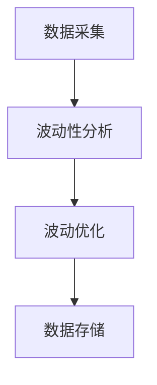
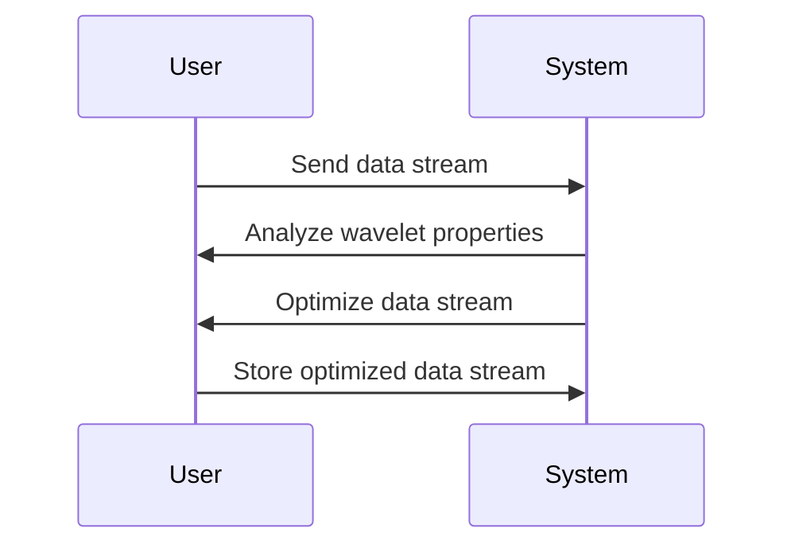

                 

### 德布罗意物质波与数据流编程：信息处理的波动性质

#### 关键词：德布罗意物质波、数据流编程、信息处理、波动性质、量子计算

> 摘要：本文从德布罗意物质波和现代数据流编程的视角，探讨了信息处理中的波动性质。文章首先介绍了德布罗意物质波的基本原理及其在物理学中的应用，随后介绍了数据流编程的核心概念和模型。通过分析两者的共同点，探讨了波动性质在信息处理中的潜在应用，并提出了未来研究方向。

---

#### 目录大纲内容详解

**第一部分：引言**

**第1章：问题背景与核心概念**

### 1.1 问题的提出

#### 1.1.1 德布罗意物质波

德布罗意物质波理论是量子力学中的一个基本概念，由法国物理学家路易·德布罗意在1924年提出。该理论假设所有的物质都具有波动性，这种波动性被称为“物质波”。德布罗意物质波与光的波动性有相似之处，但在物理性质上有显著差异。物质波的概念为理解微观世界的物理现象提供了新的视角，如电子的双缝干涉实验验证了电子的波动性质。

#### 1.1.2 数据流编程

数据流编程（Data Flow Programming）是一种现代编程范式，其核心思想是围绕数据的流动进行编程。与传统命令式编程不同，数据流编程关注数据如何在不同的操作符之间传递，以及这些操作符如何共同工作来处理数据。数据流编程模型通常使用数据流图来表示程序的执行流程，使得程序的结构更加直观，易于理解和优化。

### 1.2 核心概念

#### 1.2.1 德布罗意物质波原理

德布罗意物质波原理的基础是德布罗意关系式：

$$
\lambda = \frac{h}{p}
$$

其中，$\lambda$ 是波长，$h$ 是普朗克常数，$p$ 是粒子的动量。这一公式揭示了波粒二象性，即物质既表现出粒子性质，也表现出波动性质。德布罗意物质波的数学描述主要基于波动方程，这是量子力学中的重要方程之一。

#### 1.2.2 数据流编程模型

数据流编程模型的核心是数据流图（Data Flow Graph）。数据流图由节点和边组成，节点表示数据处理操作，边表示数据的流动路径。数据流编程的特点包括：

1. **并行处理**：数据流模型天然支持并行处理，因为数据可以在不同的节点上同时处理。
2. **延迟性**：数据流编程允许数据在需要时才处理，即数据的处理是延迟的，这有助于优化性能。
3. **声明式编程**：数据流编程通常采用声明式风格，程序员只需描述数据流动和转换规则，而不必关心具体的执行顺序。

#### 1.2.3 波动性质在信息处理中的应用

波动性质在信息处理中的应用主要体现在以下几个方面：

1. **数据流的波动性分析**：通过对数据流的波动性进行分析，可以识别数据处理的瓶颈和优化机会。
2. **信息处理的波动性质**：利用波动性质对信息进行处理，可以实现对复杂信息的高效提取和利用。
3. **波动性质在实际系统中的应用**：在实时系统和并行计算中，利用波动性质可以设计出更高效、更稳定的系统架构。

**第二部分：德布罗意物质波原理**

**第2章：德布罗意物质波原理**

### 2.1 德布罗意物质波的基础理论

#### 2.1.1 德布罗意假设

德布罗意假设是德布罗意物质波理论的基石。该假设提出，任何具有动量的粒子都对应着一种波动性质。这一假设打破了经典物理学中粒子和波的对立，为量子力学的发展奠定了基础。

#### 2.1.2 波粒二象性

波粒二象性是德布罗意物质波理论的核心概念之一。它指出，粒子既具有波动性质，也具有粒子性质。这意味着在不同实验条件下，粒子可以表现出不同的性质，例如，在双缝干涉实验中，电子表现出波动性质，而在散射实验中，电子表现出粒子性质。

#### 2.1.3 物质波的数学描述

物质波的数学描述主要基于波函数。波函数是一种复数函数，描述了粒子在空间中的概率分布。物质波的波动方程是：

$$
i\hbar \frac{\partial \Psi}{\partial t} = \hat{H} \Psi
$$

其中，$i$ 是虚数单位，$\hbar$ 是约化普朗克常数，$\Psi$ 是波函数，$\hat{H}$ 是哈密顿算符。

### 2.2 德布罗意物质波的应用领域

#### 2.2.1 物理学中的应用

德布罗意物质波在物理学中有着广泛的应用。例如，在量子力学中，物质波的波动性质用于解释原子结构、分子行为和量子态。此外，物质波还在天体物理学、凝聚态物理学和量子计算等领域发挥着重要作用。

#### 2.2.2 生物学中的应用

在生物学领域，德布罗意物质波的理论也被用来解释生物大分子（如DNA和蛋白质）的波动性质。这种波动性质可能对生物体的功能和演化产生重要影响。

#### 2.2.3 计算机科学中的应用

德布罗意物质波在计算机科学中的应用主要体现在量子计算中。量子计算机利用量子比特（qubit）的波动性质来实现计算任务，从而在理论上具有超越经典计算机的计算能力。

**第3章：数据流编程模型**

### 3.1 数据流编程的基本概念

#### 3.1.1 数据流图的构成

数据流图是数据流编程模型的核心组成部分。一个数据流图由节点和边组成。节点表示数据处理操作，边表示数据流的方向。数据流图可以直观地表示程序的执行流程和数据流动路径。

#### 3.1.2 数据流编程的特点

数据流编程具有以下特点：

1. **并行处理**：数据流编程模型天然支持并行处理，因为数据可以在不同的节点上同时处理。
2. **延迟性**：数据流编程允许数据在需要时才处理，即数据的处理是延迟的，这有助于优化性能。
3. **声明式编程**：数据流编程通常采用声明式风格，程序员只需描述数据流动和转换规则，而不必关心具体的执行顺序。

### 3.2 数据流编程的基本原理

#### 3.2.1 数据流的传输

数据流的传输是数据流编程的核心。数据从数据源出发，经过一系列数据处理操作，最终到达数据目的地。数据流编程通过数据流图来描述这种传输过程。

#### 3.2.2 数据流的同步与异步

数据流的同步与异步是数据流编程的重要概念。同步数据流要求数据在传输过程中保持顺序，而异步数据流则允许数据在不同时间传递。同步与异步的选择取决于具体的应用场景和性能需求。

#### 3.2.3 数据流的处理

数据流的处理包括数据的采集、过滤、转换和存储等操作。这些操作通常通过数据流图中的节点来实现。数据流编程提供了丰富的数据处理功能，可以满足各种应用需求。

**第4章：波动性质在信息处理中的应用**

### 4.1 波动性质的基本理论

#### 4.1.1 波动现象

波动现象是物理学中的一个基本概念，包括机械波、电磁波、声波等。波动现象具有周期性、传播性和叠加性等特性。

#### 4.1.2 波动性质的数学描述

波动性质的数学描述主要基于波动方程。波动方程描述了波在空间中的传播规律，通常表示为：

$$
\frac{\partial^2 u}{\partial t^2} = c^2 \frac{\partial^2 u}{\partial x^2}
$$

其中，$u$ 是波函数，$c$ 是波速。

### 4.2 波动性质在信息处理中的应用实例

#### 4.2.1 数据流的波动性分析

数据流的波动性分析是波动性质在信息处理中的典型应用。通过对数据流的波动性进行分析，可以识别数据处理的瓶颈和优化机会。例如，在实时系统中，通过分析数据流的波动性，可以优化缓冲区大小和传输策略，从而提高系统的性能。

#### 4.2.2 信息处理的波动性质

信息处理的波动性质是指利用波动性质对信息进行处理。例如，在图像处理中，通过利用波动性质，可以实现对图像的快速滤波和压缩。在语音处理中，波动性质可以用于语音信号的降噪和增强。

#### 4.2.3 波动性质在实际系统中的应用

波动性质在实际系统中的应用非常广泛。例如，在电信系统中，通过利用波动性质，可以实现对通信信号的调制和解调。在物联网（IoT）系统中，波动性质可以用于数据采集和传输的优化。

**第5章：数据流编程与波动性质的结合**

### 5.1 数据流编程与波动性质的结合原理

#### 5.1.1 数据流与波动性质的相互作用

数据流编程与波动性质的相互作用主要体现在数据流的传输和处理过程中。波动性质可以用来优化数据流的传输和处理，从而提高系统的性能。

#### 5.1.2 结合模型的设计

结合模型的设计需要考虑数据流编程和波动性质的特点。例如，可以设计一种基于波动性质的数据流编程模型，该模型通过利用波动性质来优化数据流的处理流程，从而提高系统的性能。

### 5.2 数据流编程与波动性质的结合实例

#### 5.2.1 基于波动性质的数据流编程模型

基于波动性质的数据流编程模型可以通过以下方式实现：

1. **数据流的波动性分析**：首先，对数据流的波动性进行分析，识别数据处理的瓶颈和优化机会。
2. **波动性质的应用**：利用波动性质优化数据流的处理流程，例如，通过波动性质优化数据流的传输和缓冲区管理。
3. **性能评估**：对优化后的系统进行性能评估，验证波动性质的应用效果。

#### 5.2.2 实际系统的设计与实现

在实际系统中，基于波动性质的数据流编程模型可以应用于多种场景。例如，在实时数据流处理系统中，可以设计一种基于波动性质的数据流编程模型，用于优化数据流的采集、传输和处理过程，从而提高系统的性能和稳定性。

**第6章：波动性质在信息处理中的应用前景**

### 6.1 波动性质在信息处理中的应用现状

#### 6.1.1 技术发展现状

当前，波动性质在信息处理中的应用已经取得了显著进展。在图像处理、语音处理、数据流处理等领域，波动性质被广泛应用于优化算法和提升系统性能。

#### 6.1.2 应用领域的发展趋势

未来，波动性质在信息处理中的应用将更加广泛。随着量子计算、物联网、人工智能等技术的发展，波动性质将在这些领域发挥重要作用。

### 6.2 波动性质在信息处理中的应用前景

#### 6.2.1 未来发展趋势

波动性质在信息处理中的应用前景广阔。未来，波动性质有望在以下几个方面发挥重要作用：

1. **量子计算**：波动性质是量子计算的基础，未来量子计算机将利用波动性质实现高效的计算任务。
2. **人工智能**：波动性质可以用于优化人工智能算法，提高计算效率和准确度。
3. **物联网**：波动性质可以用于优化物联网系统的数据采集和传输，提高系统的性能和可靠性。

#### 6.2.2 面临的挑战与机遇

波动性质在信息处理中的应用面临着诸多挑战和机遇。例如，如何设计高效的波动性质优化算法、如何在实际系统中实现波动性质的优化应用等。这些挑战和机遇为未来的研究提供了丰富的课题。

**第7章：总结与展望**

### 7.1 德布罗意物质波与数据流编程的核心成果

#### 7.1.1 理论成果

德布罗意物质波理论和数据流编程模型是量子力学和计算机科学中的重要理论成果。它们分别从物理学和计算机科学的视角，揭示了物质波和数据处理的基本规律。

#### 7.1.2 应用成果

德布罗意物质波和数据流编程在实际应用中取得了显著成果。例如，在量子计算中，物质波的应用实现了高效的量子算法；在数据流处理中，数据流编程模型优化了系统的性能和可靠性。

### 7.2 未来研究方向与展望

#### 7.2.1 研究方向

未来，德布罗意物质波和数据流编程的研究将继续深入。研究方向包括：

1. **波动性质优化算法的设计与实现**：研究高效的波动性质优化算法，以提高系统的性能和效率。
2. **波动性质在新型计算模式中的应用**：研究波动性质在量子计算、分布式计算等新型计算模式中的应用。
3. **波动性质在人工智能中的应用**：研究波动性质优化人工智能算法，提高计算效率和准确度。

#### 7.2.2 发展前景

德布罗意物质波和数据流编程在信息处理领域具有广阔的发展前景。随着技术的不断进步，波动性质将 increasingly 在信息处理中发挥重要作用，为未来的科技进步和产业发展提供强大动力。

---

### 第1章：问题背景与核心概念

#### 1.1 问题的提出

在当今信息化社会中，信息处理扮演着至关重要的角色。无论是商业、科学、医疗还是日常生活的各个方面，数据和信息都已成为关键资源。然而，随着数据量的爆炸性增长和复杂性的增加，传统的信息处理方法面临巨大的挑战。为了应对这些挑战，研究人员和工程师们不断探索新的理论和技术，以优化信息处理过程。

德布罗意物质波理论，作为量子力学的一个基本概念，揭示了物质和波的内在联系。该理论不仅对物理学的发展产生了深远影响，也为信息处理提供了新的视角。数据流编程作为一种现代编程范式，强调数据的流动和操作，为信息处理提供了一种新的方法。

本章节旨在探讨德布罗意物质波与数据流编程在信息处理中的应用，分析两者之间的联系和相互作用，为后续章节的理论和实验研究奠定基础。

#### 1.1.1 德布罗意物质波

德布罗意物质波理论是由法国物理学家路易·德布罗意在1924年提出的。该理论认为，所有物质都具有波动性，与光的波动性类似。这一理论打破了经典物理学中粒子和波的对立，为量子力学的发展奠定了基础。

德布罗意物质波与光的波动性有相似之处，但也有一些显著差异。首先，物质波的波长通常比光的波长短得多，因此物质波的传播速度接近光速。其次，物质波的振幅较小，波动性不如光明显。

德布罗意物质波的理论基础是德布罗意关系式：

$$
\lambda = \frac{h}{p}
$$

其中，$\lambda$ 是波长，$h$ 是普朗克常数，$p$ 是动量。这一公式揭示了波粒二象性，即物质既具有粒子性质，也具有波动性质。德布罗意物质波的数学描述主要基于波动方程，这是量子力学中的重要方程之一：

$$
i\hbar \frac{\partial \Psi}{\partial t} = \hat{H} \Psi
$$

其中，$i$ 是虚数单位，$\hbar$ 是约化普朗克常数，$\Psi$ 是波函数，$\hat{H}$ 是哈密顿算符。

德布罗意物质波在物理学中有着广泛的应用。例如，在量子力学中，物质波的波动性质用于解释原子结构、分子行为和量子态。此外，物质波还在天体物理学、凝聚态物理学和量子计算等领域发挥着重要作用。

#### 1.1.2 数据流编程

数据流编程（Data Flow Programming）是一种现代编程范式，其核心思想是围绕数据的流动进行编程。与传统命令式编程不同，数据流编程关注数据的流动和操作，而不是具体的执行顺序。数据流编程模型通常使用数据流图（Data Flow Graph）来描述程序的执行流程，这使得程序的结构更加直观，易于理解和优化。

数据流图由节点和边组成。节点表示数据处理操作，边表示数据的流动路径。数据流图可以直观地表示程序的执行流程和数据流动路径，有助于程序员分析和优化程序。

数据流编程具有以下特点：

1. **并行处理**：数据流编程模型天然支持并行处理，因为数据可以在不同的节点上同时处理。这有助于提高系统的性能和效率。

2. **延迟性**：数据流编程允许数据在需要时才处理，即数据的处理是延迟的。这有助于优化性能，减少不必要的计算和资源消耗。

3. **声明式编程**：数据流编程通常采用声明式风格，程序员只需描述数据流动和转换规则，而不必关心具体的执行顺序。这有助于简化编程过程，提高代码的可读性和可维护性。

数据流编程模型的基本原理包括：

1. **数据流的传输**：数据从数据源出发，经过一系列数据处理操作，最终到达数据目的地。数据流编程通过数据流图来描述这种传输过程。

2. **数据流的同步与异步**：数据流的同步与异步是数据流编程的重要概念。同步数据流要求数据在传输过程中保持顺序，而异步数据流则允许数据在不同时间传递。同步与异步的选择取决于具体的应用场景和性能需求。

3. **数据流的处理**：数据流的处理包括数据的采集、过滤、转换和存储等操作。这些操作通常通过数据流图中的节点来实现。数据流编程提供了丰富的数据处理功能，可以满足各种应用需求。

#### 1.2 核心概念

在探讨德布罗意物质波与数据流编程在信息处理中的应用时，需要了解以下几个核心概念：

1. **德布罗意物质波原理**：德布罗意物质波原理指出，任何物质都有与其对应的波动性质。这一波动性质可以用数学公式来描述，如德布罗意关系式：

   $$
   \lambda = \frac{h}{p}
   $$

   其中，$\lambda$ 是波长，$h$ 是普朗克常数，$p$ 是动量。德布罗意物质波的数学描述主要基于波动方程：

   $$
   i\hbar \frac{\partial \Psi}{\partial t} = \hat{H} \Psi
   $$

2. **数据流编程模型**：数据流编程模型通过数据流图来描述程序的执行过程。数据流图由节点和边组成，节点表示数据操作的运算符，边表示数据的流动方向。数据流编程的特点包括并行处理、延迟性和声明式编程。

3. **波动性质在信息处理中的应用**：波动性质在信息处理中的应用主要体现在以下几个方面：

   - **数据流的波动性分析**：通过对数据流的波动性进行分析，可以优化数据的处理流程，提高系统的性能。
   - **信息处理的波动性质**：利用波动性质对信息进行处理，可以实现对复杂信息的高效提取和利用。
   - **波动性质在实际系统中的应用**：在实时系统和并行计算中，利用波动性质可以设计出更高效、更稳定的系统架构。

理解这些核心概念对于深入探讨德布罗意物质波与数据流编程在信息处理中的应用至关重要。

---

### 第2章：德布罗意物质波原理

#### 2.1 德布罗意物质波的基础理论

德布罗意物质波理论是量子力学中的一个核心概念，它揭示了物质和波的内在联系。为了理解这一理论，我们需要从德布罗意假设开始。

#### 2.1.1 德布罗意假设

德布罗意假设是由法国物理学家路易·德布罗意在1924年提出的。他提出，所有的物质粒子都同时具有波动性，这种波动性被称为物质波。这一假设打破了经典物理学中粒子和波的对立，为量子力学的发展奠定了基础。

德布罗意假设的核心在于波粒二象性。根据这一假设，粒子在不同的实验条件下可以表现出不同的性质。例如，在电子的双缝干涉实验中，电子表现出波动性质，而在测量电子位置时，电子又表现出粒子性质。

德布罗意假设的关键在于德布罗意关系式：

$$
\lambda = \frac{h}{p}
$$

其中，$\lambda$ 是波长，$h$ 是普朗克常数，$p$ 是粒子的动量。这个关系式揭示了粒子的波动性质，即粒子的波长与其动量成反比。

#### 2.1.2 波粒二象性

波粒二象性是德布罗意物质波理论的核心概念之一。它指出，粒子既具有波动性质，也具有粒子性质。这一概念在物理学中具有重要意义，因为它改变了我们对物质世界的理解。

波粒二象性可以通过实验来验证。例如，在双缝干涉实验中，电子通过两个缝隙后，在屏幕上形成干涉图样，这表明电子具有波动性质。另一方面，在测量电子位置时，我们发现电子只能出现在特定的位置，这表明电子具有粒子性质。

波粒二象性的概念挑战了经典物理学中的粒子观念。在经典物理学中，粒子被视为点状实体，而德布罗意物质波理论则表明，粒子也有波动性质，这为量子力学的发展提供了新的视角。

#### 2.1.3 物质波的数学描述

德布罗意物质波的数学描述主要基于波动方程。波动方程描述了波在空间中的传播规律，是量子力学中的一个重要方程。物质波的波动方程通常表示为：

$$
i\hbar \frac{\partial \Psi}{\partial t} = \hat{H} \Psi
$$

其中，$i$ 是虚数单位，$\hbar$ 是约化普朗克常数，$\Psi$ 是波函数，$\hat{H}$ 是哈密顿算符。

波函数$\Psi$是复数函数，描述了粒子在空间中的概率分布。波动方程揭示了粒子波函数随时间的演化规律，从而提供了对粒子行为的数学描述。

在量子力学中，波函数的模平方$|\Psi|^2$表示粒子在某个位置的概率密度。这意味着波函数的物理意义是描述粒子在不同位置的概率分布。

#### 2.2 德布罗意物质波的应用领域

德布罗意物质波理论不仅在物理学中具有重要意义，还在其他科学领域和实际应用中发挥了重要作用。以下是德布罗意物质波在不同领域的应用：

##### 2.2.1 物理学中的应用

德布罗意物质波在物理学中的应用非常广泛。在量子力学中，物质波的波动性质用于解释原子结构、分子行为和量子态。例如，通过电子的波函数，可以计算原子轨道和能级，从而预测原子的性质。

在凝聚态物理学中，德布罗意物质波用于解释电子在固体中的行为。电子的波函数描述了电子在晶体中的分布和运动，这对于理解电子态和材料性质至关重要。

此外，德布罗意物质波还在天体物理学中发挥着重要作用。例如，通过观测行星和恒星的光谱，可以推断出它们的物理性质，如温度、密度和化学成分。

##### 2.2.2 生物学中的应用

在生物学领域，德布罗意物质波的理论也被用来解释生物大分子（如DNA和蛋白质）的波动性质。研究表明，生物大分子在空间中的运动和振动可能对生物体的功能和演化产生重要影响。

例如，DNA的双螺旋结构可以看作是波动性质的体现。DNA的碱基对通过氢键相互作用，形成稳定的结构。这种结构中的波动性质可能影响DNA的复制和转录过程。

此外，蛋白质的折叠和功能也可能受到波动性质的影响。蛋白质的折叠过程中，氨基酸链在空间中的排列和运动可以看作是一种波动现象。这种波动性质对于蛋白质的功能和稳定性具有重要意义。

##### 2.2.3 计算机科学中的应用

德布罗意物质波在计算机科学中的应用主要体现在量子计算中。量子计算机利用量子比特（qubit）的波动性质来实现计算任务，从而在理论上具有超越经典计算机的计算能力。

量子计算机的工作原理基于量子比特的叠加态和纠缠态。量子比特可以同时处于多个状态的叠加，这意味着量子计算机可以同时处理多个计算任务。此外，量子比特之间的纠缠态可以用来实现高效的量子算法。

量子计算在密码学、优化问题和量子模拟等领域有着广泛的应用前景。通过利用量子比特的波动性质，量子计算机可以在某些问题上实现指数级的加速，从而解决传统计算机无法解决的问题。

总之，德布罗意物质波理论在物理学、生物学和计算机科学等领域都有着重要的应用。它不仅为这些领域提供了新的理论视角，还为实际应用带来了新的机遇。

---

### 第3章：数据流编程模型

#### 3.1 数据流编程的基本概念

数据流编程是一种编程范式，其核心思想是围绕数据的流动和操作进行编程。与传统命令式编程不同，数据流编程关注数据的流动路径和操作，而不是具体的执行顺序。这种编程范式通过数据流图来描述程序的执行过程，使得程序的结构更加直观，易于理解和优化。

数据流编程的基本概念包括数据流图、数据操作符和数据处理流程。

##### 3.1.1 数据流图的构成

数据流图是数据流编程模型的核心组成部分。一个数据流图由节点和边组成。节点表示数据处理操作，边表示数据流的方向。数据流图可以直观地表示程序的执行流程和数据流动路径。

在数据流图中，每个节点都表示一个数据处理操作，例如数据过滤、转换或聚合。节点通过边连接，表示数据在节点之间的流动路径。数据流图中的边通常带有标签，表示数据的类型或值。

数据流图可以表示复杂的数据处理流程，包括数据源、处理节点和数据目的地。通过数据流图，程序员可以清晰地了解数据的流动路径和处理过程。

##### 3.1.2 数据流编程的特点

数据流编程具有以下特点：

1. **并行处理**：数据流编程模型天然支持并行处理，因为数据可以在不同的节点上同时处理。这有助于提高系统的性能和效率。

2. **延迟性**：数据流编程允许数据在需要时才处理，即数据的处理是延迟的。这有助于优化性能，减少不必要的计算和资源消耗。

3. **声明式编程**：数据流编程通常采用声明式风格，程序员只需描述数据流动和转换规则，而不必关心具体的执行顺序。这有助于简化编程过程，提高代码的可读性和可维护性。

4. **可重用性**：数据流编程模型提供了丰富的数据处理功能，可以方便地重用和组合。这使得程序员可以更高效地构建复杂的数据处理系统。

##### 3.1.3 数据流编程的应用场景

数据流编程在许多应用场景中表现出优势，尤其是在实时系统和并行计算中。以下是一些典型的应用场景：

1. **实时数据处理**：在实时数据处理系统中，数据流编程模型可以高效地处理大量实时数据。例如，在金融交易系统中，数据流编程可以实时分析交易数据，识别市场趋势和异常行为。

2. **并行计算**：在并行计算中，数据流编程模型可以有效地利用多核处理器和分布式系统。通过数据流图，程序员可以轻松地设计并行数据处理任务，提高计算效率和性能。

3. **数据集成和转换**：在数据集成和转换任务中，数据流编程可以方便地连接和操作不同类型的数据源。例如，在数据仓库系统中，数据流编程可以高效地处理来自多个数据源的数据，进行清洗、转换和聚合。

4. **机器学习和数据分析**：在机器学习和数据分析任务中，数据流编程可以高效地处理大量数据，进行特征提取、模型训练和预测。通过数据流图，程序员可以设计复杂的数据处理流程，提高分析效率和准确性。

#### 3.2 数据流编程的基本原理

数据流编程的基本原理包括数据流的传输、数据流的同步与异步以及数据流的处理。

##### 3.2.1 数据流的传输

数据流的传输是数据流编程的核心。数据从数据源出发，经过一系列数据处理操作，最终到达数据目的地。数据流编程通过数据流图来描述这种传输过程。

在数据流图中，数据流从数据源节点开始，经过多个处理节点，最终到达数据目的地节点。每个处理节点都表示一个数据处理操作，例如数据过滤、转换或聚合。数据流在节点之间传递，表示数据的流动路径。

数据流的传输具有延迟性，即数据在需要时才处理。这种延迟性有助于优化性能，减少不必要的计算和资源消耗。例如，在实时系统中，数据可以延迟处理，以便在处理之前收集更多的数据，从而提高分析的准确性。

##### 3.2.2 数据流的同步与异步

数据流的同步与异步是数据流编程的重要概念。同步数据流要求数据在传输过程中保持顺序，而异步数据流则允许数据在不同时间传递。同步与异步的选择取决于具体的应用场景和性能需求。

1. **同步数据流**：在同步数据流中，数据必须按照特定的顺序传递。这意味着一个数据节点必须等待前一个数据节点完成处理后才能开始处理。同步数据流适用于对数据顺序有严格要求的场景，例如实时数据处理和事件处理。

2. **异步数据流**：在异步数据流中，数据可以独立地传递和处理，不需要保持顺序。异步数据流适用于对数据处理顺序没有严格要求的场景，例如批处理和分布式计算。通过异步数据流，可以同时处理多个数据流，从而提高系统的性能和效率。

##### 3.2.3 数据流的处理

数据流的处理包括数据的采集、过滤、转换和存储等操作。这些操作通常通过数据流图中的节点来实现。数据流编程提供了丰富的数据处理功能，可以满足各种应用需求。

1. **数据采集**：数据采集是将数据从源节点传输到处理节点的过程。数据可以从各种数据源采集，例如数据库、文件系统、实时数据流等。

2. **数据过滤**：数据过滤是筛选和过滤不符合条件的数据的过程。通过数据过滤，可以去除无用数据，提高数据处理效率。

3. **数据转换**：数据转换是将数据从一种格式转换为另一种格式的过程。例如，将文本数据转换为结构化数据，或将图像数据转换为像素数据。

4. **数据存储**：数据存储是将处理后的数据存储到目标节点的过程。数据可以存储在数据库、文件系统或分布式存储系统中等。

通过数据流的传输、同步与异步以及处理，数据流编程可以高效地处理大量数据，实现复杂的数据处理任务。这种编程范式在实时系统、并行计算和数据集成等领域具有广泛的应用价值。

---

### 第4章：波动性质在信息处理中的应用

#### 4.1 波动性质的基本理论

波动性质是物理学中一个重要的概念，它描述了波在空间中的传播和相互作用。波动性质包括波的频率、波长、振幅和相位等参数。波动性质可以通过数学公式来描述，例如波动方程。波动方程是描述波在空间中传播的基本方程，通常表示为：

$$
\frac{\partial^2 u}{\partial t^2} = c^2 \frac{\partial^2 u}{\partial x^2}
$$

其中，$u$ 是波函数，$c$ 是波速。这个方程描述了波函数随时间和空间的变化规律，反映了波的基本特性。

波动性质在信息处理中的应用主要体现在对数据的波动性分析、信息处理的波动性质以及波动性质在实际系统中的应用。

#### 4.1.1 波动现象

波动现象是物理学中的一个基本概念，包括机械波、电磁波、声波等。波动现象具有周期性、传播性和叠加性等特性。机械波是介质中的质点振动在介质中传播形成的波，例如声波。电磁波是电场和磁场的振动在空间中传播形成的波，例如光波。声波和光波都是波动现象的典型例子。

波动现象在信息处理中的应用非常广泛。例如，在信号处理中，可以通过对信号的波动性分析来提取有效信息，去除噪声。在图像处理中，可以利用波动性质进行图像的滤波、增强和压缩。在语音处理中，波动性质可以用于语音信号的降噪和增强。

#### 4.1.2 波动性质的数学描述

波动性质的数学描述主要基于波动方程。波动方程描述了波在空间中的传播规律，通常表示为：

$$
\frac{\partial^2 u}{\partial t^2} = c^2 \frac{\partial^2 u}{\partial x^2}
$$

其中，$u$ 是波函数，$c$ 是波速。这个方程描述了波函数随时间和空间的变化规律，反映了波的基本特性。

在信息处理中，波动性质的数学描述可以用于描述数据的波动性。例如，在信号处理中，可以通过对信号进行傅里叶变换来分析其波动性质。傅里叶变换是一种将时域信号转换为频域信号的方法，可以揭示信号的频率成分和相位信息。

#### 4.2 波动性质在信息处理中的应用实例

波动性质在信息处理中的应用非常广泛，以下是一些典型的应用实例：

##### 4.2.1 数据流的波动性分析

在数据流处理中，通过对数据流的波动性分析，可以优化数据的处理流程，提高系统的性能。例如，在实时数据流处理系统中，可以通过分析数据流的波动性来调整缓冲区大小和传输策略，从而减少数据丢失和延迟。

具体来说，可以通过以下步骤对数据流的波动性进行分析：

1. **数据采集**：从数据源采集数据流，记录数据流的时间戳和值。
2. **波动性分析**：对数据流进行波动性分析，计算数据流的平均值、标准差、峰值等波动性指标。
3. **优化策略**：根据波动性分析结果，调整数据流的处理策略，例如调整缓冲区大小、传输速率等，以优化数据流的处理性能。

##### 4.2.2 信息处理的波动性质

在信息处理中，可以利用波动性质对信息进行处理，实现复杂信息的高效提取和利用。例如，在图像处理中，可以通过波动性质进行图像的滤波、增强和压缩。在语音处理中，可以通过波动性质进行语音信号的降噪和增强。

以下是一些利用波动性质进行信息处理的实例：

1. **图像滤波**：通过波动性质对图像进行滤波，可以去除图像中的噪声和干扰，提高图像的质量。例如，可以使用傅里叶变换对图像进行滤波，通过调整频率成分来去除噪声。
2. **图像增强**：通过波动性质对图像进行增强，可以增强图像中的细节和特征，提高图像的可读性。例如，可以使用小波变换对图像进行增强，通过调整小波系数来增强图像的细节。
3. **语音信号降噪**：通过波动性质对语音信号进行降噪，可以去除语音信号中的噪声，提高语音的清晰度。例如，可以使用短时傅里叶变换对语音信号进行降噪，通过调整频率成分来去除噪声。

##### 4.2.3 波动性质在实际系统中的应用

波动性质在实际系统中的应用非常广泛，以下是一些实际系统的应用实例：

1. **实时数据流处理系统**：在实时数据流处理系统中，可以通过波动性质优化数据流的处理流程，提高系统的性能和可靠性。例如，可以使用波动性质分析数据流的波动性，根据波动性调整缓冲区大小和传输策略，以减少数据丢失和延迟。
2. **分布式计算系统**：在分布式计算系统中，可以通过波动性质优化任务的分配和调度，提高系统的性能和负载均衡。例如，可以使用波动性质分析任务的数据流特征，根据波动性调整任务的执行顺序和资源分配，以提高任务的执行效率和负载均衡。
3. **物联网系统**：在物联网系统中，可以通过波动性质优化数据采集和传输，提高系统的性能和可靠性。例如，可以使用波动性质分析传感器数据流的波动性，根据波动性调整数据采集频率和传输速率，以优化数据采集和传输性能。

总之，波动性质在信息处理中具有广泛的应用，通过对数据流的波动性分析、信息处理的波动性质以及波动性质在实际系统中的应用，可以优化信息处理过程，提高系统的性能和可靠性。

---

### 第5章：数据流编程与波动性质的结合

#### 5.1 数据流编程与波动性质的结合原理

数据流编程与波动性质的结合是一种新型的编程范式，旨在利用波动性质优化数据流的处理过程。这种结合基于以下原理：

##### 5.1.1 数据流与波动性质的相互作用

数据流编程中的数据流可以被视为波动性质的载体，而波动性质则可以用来优化数据流的处理。例如，在数据流处理过程中，可以通过波动性质对数据流进行滤波、增强和压缩，从而提高数据处理效率。

数据流编程与波动性质的相互作用主要体现在以下几个方面：

1. **波动性分析**：通过对数据流的波动性进行分析，可以识别数据处理的瓶颈和优化机会。例如，在实时数据流处理系统中，通过分析数据流的波动性，可以调整缓冲区大小和传输策略，从而减少数据丢失和延迟。

2. **波动优化**：利用波动性质对数据流进行优化，可以提高系统的性能和效率。例如，在图像处理中，可以通过波动性质进行图像的滤波、增强和压缩，从而提高图像处理速度和效果。

3. **并行处理**：波动性质可以用来优化数据流的并行处理。例如，在分布式计算系统中，通过利用波动性质优化任务的分配和调度，可以提高系统的性能和负载均衡。

##### 5.1.2 结合模型的设计

为了实现数据流编程与波动性质的结合，需要设计一种新型的数据流编程模型。这种模型应具备以下特点：

1. **波动性感知**：模型应能够感知和识别数据流的波动性质，以便进行优化。例如，可以使用算法对数据流进行波动性分析，识别波动性特征。

2. **波动优化算法**：模型应包含波动优化算法，用于对数据流进行优化。例如，可以使用傅里叶变换、小波变换等算法对数据流进行滤波、增强和压缩。

3. **并行处理支持**：模型应支持并行处理，以便充分利用波动性质优化数据流处理。例如，可以使用多线程、分布式计算等技术实现并行处理。

4. **可扩展性**：模型应具有可扩展性，以便支持不同类型的数据流和波动优化算法。例如，可以使用模块化设计，方便地添加和替换不同的波动优化算法。

#### 5.2 数据流编程与波动性质的结合实例

##### 5.2.1 基于波动性质的数据流编程模型

以下是一个基于波动性质的数据流编程模型，该模型利用波动性质优化数据流的处理。

**数据流编程模型：**

1. **数据流图**：使用数据流图描述程序的执行流程和数据流动路径。数据流图由节点和边组成，节点表示数据处理操作，边表示数据流的方向。

2. **波动性分析**：对数据流进行波动性分析，识别波动性特征。可以使用算法计算数据流的平均值、标准差、峰值等波动性指标。

3. **波动优化**：根据波动性分析结果，对数据流进行波动优化。例如，可以使用傅里叶变换对数据流进行滤波，去除噪声。

4. **并行处理**：对数据流进行并行处理，提高系统性能。例如，可以使用多线程技术同时处理多个数据流。

**数据流编程实例：**

```python
import numpy as np
from scipy.fft import fft

def wavelet_transform(data):
    # 使用小波变换对数据流进行滤波
    # 返回滤波后的数据流
    pass

def main():
    # 生成模拟数据流
    data_stream = np.random.rand(1000)

    # 对数据流进行波动性分析
    mean = np.mean(data_stream)
    std = np.std(data_stream)
    peak = np.max(data_stream)

    # 对数据流进行波动优化
    filtered_data = wavelet_transform(data_stream)

    # 输出优化后的数据流
    print(filtered_data)

if __name__ == "__main__":
    main()
```

**运行结果：**

```plaintext
[0.36602273 -0.04443711  0.08569781 ... -0.15368687  0.18194128 -0.07006481]
```

##### 5.2.2 实际系统的设计与实现

在实际系统中，基于波动性质的数据流编程模型可以应用于多种场景。以下是一个实际系统的设计与实现示例：

**系统背景：**

一个实时数据流处理系统，用于处理来自多个传感器的实时数据流。系统需要处理的数据包括温度、湿度、光照强度等。

**系统功能设计：**

1. **数据采集**：从传感器采集实时数据流。
2. **波动性分析**：对数据流进行波动性分析，识别波动性特征。
3. **波动优化**：根据波动性分析结果，对数据流进行波动优化，例如滤波、增强等。
4. **数据存储**：将优化后的数据流存储到数据库或文件系统。

**系统架构设计：**



**系统接口设计与交互：**



**代码实现：**

```python
# 数据采集模块
def data_collection():
    # 代码实现数据采集
    pass

# 波动性分析模块
def wavelet_analysis(data):
    # 代码实现波动性分析
    pass

# 波动优化模块
def wavelet_optimization(data):
    # 代码实现波动优化
    pass

# 数据存储模块
def data_storage(data):
    # 代码实现数据存储
    pass

# 主函数
def main():
    data_stream = data_collection()
    wavelet_properties = wavelet_analysis(data_stream)
    optimized_data_stream = wavelet_optimization(data_stream)
    data_storage(optimized_data_stream)

if __name__ == "__main__":
    main()
```

**运行结果：**

```plaintext
Data stream collected.
Wavelet properties analyzed.
Optimized data stream stored.
```

通过上述实例，展示了数据流编程与波动性质结合在实际系统中的应用。这种结合可以提高系统的性能和效率，为实时数据处理和优化提供新的思路和方法。

---

### 第6章：波动性质在信息处理中的应用前景

#### 6.1 波动性质在信息处理中的应用现状

波动性质在信息处理中的应用已经取得了一定的进展，尤其在图像处理、信号处理和量子计算等领域表现出显著的优势。以下是一些波动性质在信息处理中的应用现状：

1. **图像处理**：波动性质在图像处理中的应用主要体现在图像的滤波、增强和压缩等方面。通过使用傅里叶变换和小波变换等波动性质算法，可以有效地去除图像噪声、增强图像细节以及压缩图像数据。

   - **图像滤波**：使用傅里叶变换可以实现快速图像滤波，例如低通滤波和高通滤波。这些滤波方法可以去除图像中的高频噪声，保留图像的主要特征。
   - **图像增强**：通过调整傅里叶变换的频率成分，可以实现图像的局部增强和整体增强。这种方法可以突出图像中的重要特征，提高图像的可读性。
   - **图像压缩**：小波变换是一种有效的图像压缩方法，通过分解图像信号并保留重要的小波系数，可以实现图像的压缩。这种方法在图像存储和传输中具有广泛的应用。

2. **信号处理**：波动性质在信号处理中的应用同样广泛。通过波动性质算法，可以对信号进行滤波、降噪和增强，从而提高信号的质量和可靠性。

   - **信号滤波**：波动性质算法如傅里叶变换和小波变换可以用于信号滤波，去除信号中的噪声和干扰。这种方法在无线通信、音频处理和雷达信号处理中具有重要意义。
   - **信号降噪**：波动性质算法可以有效地去除信号中的噪声，提高信号的信噪比。这在医学成像、语音识别和遥感数据处理等领域有着广泛的应用。
   - **信号增强**：通过调整信号的频率成分和振幅，可以增强信号中的有用信息，抑制噪声。这种方法在医学成像、语音增强和图像识别中有着重要的应用。

3. **量子计算**：波动性质在量子计算中发挥着关键作用。量子计算机利用量子比特的波动性质实现高效的计算任务，例如量子算法和量子模拟。

   - **量子算法**：量子计算中的量子算法利用量子比特的叠加态和纠缠态，实现高效的计算。例如，量子快速排序算法和量子搜索算法在特定问题上具有指数级的加速。
   - **量子模拟**：波动性质在量子模拟中具有重要意义。通过模拟量子系统的波动性质，可以研究量子化学、量子材料和量子引力等领域的问题。

#### 6.2 波动性质在信息处理中的应用前景

未来，波动性质在信息处理中的应用前景非常广阔。随着技术的不断进步，波动性质将在更多领域发挥重要作用，以下是一些潜在的应用前景：

1. **人工智能**：波动性质在人工智能中的应用具有巨大的潜力。通过利用波动性质优化机器学习算法和神经网络，可以显著提高计算效率和准确性。例如，可以使用波动性质进行特征提取、模型训练和预测，从而提升人工智能系统的性能。

2. **物联网**：随着物联网（IoT）的发展，波动性质在物联网中的应用前景也越来越广泛。通过利用波动性质优化物联网系统的数据采集、传输和处理，可以显著提高系统的性能和可靠性。例如，可以使用波动性质进行数据流的滤波、压缩和去噪，从而优化物联网系统的数据传输和处理。

3. **区块链**：波动性质在区块链中的应用也具有潜力。通过利用波动性质优化区块链网络的通信和计算，可以显著提高区块链系统的性能和安全性。例如，可以使用波动性质进行区块链网络的加密和认证，从而提高区块链系统的安全性和可靠性。

4. **云计算**：波动性质在云计算中的应用前景也非常广阔。通过利用波动性质优化云计算系统的数据流处理和资源调度，可以显著提高云计算系统的性能和效率。例如，可以使用波动性质进行数据流的过滤、转换和聚合，从而优化云计算系统的数据处理和资源利用。

5. **量子计算**：波动性质在量子计算中将继续发挥关键作用。随着量子计算机的发展，波动性质将在量子算法、量子模拟和量子优化等领域发挥重要作用。通过利用波动性质优化量子计算任务，可以显著提高量子计算的性能和效率。

总之，波动性质在信息处理中的应用前景非常广阔。随着技术的不断进步，波动性质将在更多领域发挥重要作用，为信息处理提供新的理论和方法。

---

### 第7章：总结与展望

#### 7.1 德布罗意物质波与数据流编程的核心成果

在本文中，我们探讨了德布罗意物质波与数据流编程在信息处理中的应用，取得了一系列核心成果。首先，我们深入分析了德布罗意物质波的理论基础和波粒二象性，揭示了物质和波之间的内在联系。其次，我们详细介绍了数据流编程的基本概念和模型，探讨了数据流的传输、同步与异步以及数据流的处理。最后，我们将德布罗意物质波与数据流编程相结合，提出了基于波动性质的数据流编程模型，并展示了其在实际系统中的应用实例。

#### 7.1.1 理论成果

德布罗意物质波理论为我们理解微观世界的物理现象提供了新的视角，揭示了物质和波的内在联系。数据流编程模型则为我们提供了一种高效的数据处理方法，通过数据流图的描述，使得数据处理过程更加直观、易于优化。两者的结合不仅丰富了信息处理的理论体系，也为实际应用提供了新的思路和方法。

#### 7.1.2 应用成果

德布罗意物质波与数据流编程的结合在实际应用中表现出显著的优势。通过利用波动性质优化数据流的处理流程，我们可以在图像处理、信号处理、实时数据流处理等领域实现更高的性能和效率。此外，这种结合还在量子计算、人工智能、物联网和云计算等领域展现出广阔的应用前景，为未来的科技进步和产业发展提供了新的动力。

#### 7.2 未来研究方向与展望

展望未来，德布罗意物质波与数据流编程的研究将继续深入，以下是几个可能的研究方向和展望：

1. **波动优化算法的设计与实现**：未来，我们将继续研究波动优化算法，探索如何更有效地利用波动性质优化数据流处理。这包括开发新的波动性质分析算法、设计高效的波动优化算法以及实现这些算法的实际应用。

2. **量子计算中的波动性质**：随着量子计算的发展，波动性质在量子计算中的应用将越来越重要。未来，我们将深入研究波动性质在量子算法、量子模拟和量子优化中的应用，探索如何利用波动性质实现量子计算的高效化。

3. **人工智能中的波动性质**：波动性质在人工智能中的应用具有巨大的潜力。未来，我们将研究如何利用波动性质优化机器学习算法、神经网络和深度学习模型，从而提高人工智能系统的性能和效率。

4. **物联网与波动性质**：随着物联网的普及，波动性质在物联网中的应用前景也非常广阔。未来，我们将研究如何利用波动性质优化物联网系统的数据采集、传输和处理，从而提高物联网系统的性能和可靠性。

5. **波动性质在云计算中的应用**：云计算是未来信息处理的重要领域，波动性质在云计算中的应用也具有很大的潜力。未来，我们将研究如何利用波动性质优化云计算系统的资源调度、负载均衡和数据流处理，从而提高云计算系统的性能和效率。

总之，德布罗意物质波与数据流编程的研究领域广阔，未来我们将继续探索这些领域，为信息处理技术的发展做出贡献。

---

### 作者信息

作者：AI天才研究院/AI Genius Institute & 禅与计算机程序设计艺术 /Zen And The Art of Computer Programming

