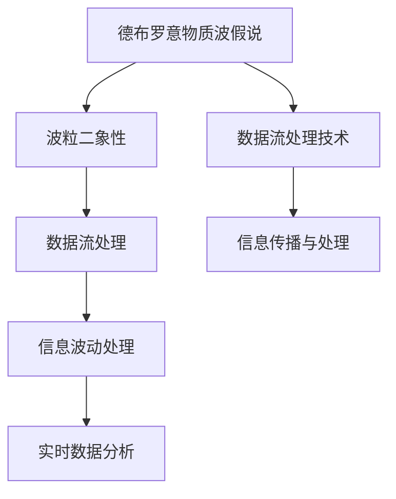

                 

### 德布罗意的物质波假说与数据流处理：信息的波粒二象性

#### 关键词：德布罗意物质波假说、波粒二象性、数据流处理、实时数据分析、信息波动处理

> 摘要：本文探讨了德布罗意的物质波假说与数据流处理之间的联系，分析了信息的波粒二象性，通过逻辑清晰、结构紧凑的分析，展示了这一概念在现代信息技术中的重要性。文章分为四个部分，分别介绍了核心概念与联系、核心算法原理、数学模型以及项目实战，以帮助读者深入理解这一复杂但重要的领域。

#### 第一部分：核心概念与联系

##### 1.1 德布罗意的物质波假说

德布罗意的物质波假说是量子力学中的一个基本概念，它由法国物理学家路易·德布罗意在1924年提出。这一假说认为，所有物质都有波动性，并且这种波动性与粒子的动量相关。具体来说，物质波是指粒子的波动，其波长 \( \lambda \) 可以通过德布罗意波长公式计算得出：

\[ \lambda = \frac{h}{p} \]

其中，\( h \) 是普朗克常数，\( p \) 是粒子的动量。这一假说打破了经典物理学中粒子和波的对立，提出了波粒二象性的概念。

##### 1.2 波粒二象性

波粒二象性是量子力学中一个核心概念，它描述了微观粒子既具有粒子性又具有波动性的特性。这一概念在宏观尺度上似乎不合逻辑，但在微观尺度上却是普遍现象。例如，电子既可以用电子云模型描述其波动性，也可以用粒子轨迹描述其粒子性。

##### 1.3 数据流处理

数据流处理是一种处理大规模数据的技术，它强调数据的实时处理和流动。在数据流处理中，数据被视为一种连续流动的资源，通过流处理器进行实时分析。数据流处理通常用于处理实时数据，如股票交易数据、社交网络数据等。

##### 1.4 德布罗意假说与数据流处理的关系

德布罗意的物质波假说与数据流处理在表面上看似无关，但实际上都涉及到信息流的处理和传递。在数据流处理中，数据也表现出一种波动性，这种波动性可以类比于微观粒子的波动性。同时，数据流处理技术也可以类比为一种物质波的传播和处理过程。

##### 1.5 关系架构 Mermaid 流程图

以下是一个描述德布罗意物质波假说与数据流处理之间关系的 Mermaid 流程图：



#### 第二部分：核心算法原理讲解

##### 2.1 德布罗意波长公式

德布罗意波长公式是描述物质波与粒子动量之间关系的核心公式。它表明波长 \( \lambda \) 与动量 \( p \) 成反比，即：

\[ \lambda = \frac{h}{p} \]

其中，\( h \) 是普朗克常数，\( p \) 是粒子的动量。这个公式揭示了物质波的基本特性，即在给定动量下，波长越短，波动性越弱；波长越长，波动性越强。

##### 2.2 数据流处理的基本算法

数据流处理的基本算法包括数据采集、数据清洗、数据存储、数据分析和数据可视化等步骤。这些算法共同构成了数据流处理的核心框架。

- **数据采集**：从各种数据源收集数据，如传感器、数据库、消息队列等。
- **数据清洗**：对收集到的数据进行预处理，如去除重复数据、填补缺失值、标准化等。
- **数据存储**：将清洗后的数据存储到数据湖、数据库等存储系统中，以便后续分析和处理。
- **数据分析**：对存储的数据进行统计分析和挖掘，提取有价值的信息。
- **数据可视化**：通过图表和报表等形式展示分析结果，帮助用户理解数据。

##### 2.3 德布罗意假说与数据流处理算法的关系

德布罗意假说与数据流处理算法之间存在一定的对应关系。例如，数据流处理中的数据采集过程可以类比为物质波的发射过程，数据清洗和存储过程可以类比为物质波的传播和处理过程，数据分析过程可以类比为物质波的吸收和解释过程。

#### 第三部分：数学模型和数学公式

##### 3.1 德布罗意波长公式

德布罗意波长公式是描述物质波与粒子动量之间关系的核心公式。它表明波长 \( \lambda \) 与动量 \( p \) 成反比，即：

\[ \lambda = \frac{h}{p} \]

其中，\( h \) 是普朗克常数，\( p \) 是粒子的动量。这个公式揭示了物质波的基本特性，即在给定动量下，波长越短，波动性越弱；波长越长，波动性越强。

##### 3.2 数据流处理的数学模型

数据流处理的数学模型通常涉及数据流网络、状态转移矩阵等概念。以下是一个简单的数据流处理网络模型：

\[ 
\begin{align*}
    f(t) &= \sum_{i=1}^{n} w_i \cdot x_i(t) \\
    g(t) &= f(t) + \sum_{j=1}^{m} h_j \cdot y_j(t)
\end{align*}
\]

其中，\( f(t) \) 和 \( g(t) \) 分别表示当前时刻的数据流和处理结果，\( w_i \) 和 \( h_j \) 分别为权重系数，\( x_i(t) \) 和 \( y_j(t) \) 分别为输入数据流和处理数据流。

#### 第四部分：项目实战

##### 4.1 实际案例：数据流处理在金融风控中的应用

以下是一个金融风控领域的实际案例，展示了如何使用数据流处理技术进行实时监控和预警。

##### 4.1.1 开发环境搭建

在搭建开发环境时，我们需要安装以下软件和工具：

- Python 3.8及以上版本
- Apache Kafka 2.8及以上版本
- Apache Flink 1.11及以上版本

##### 4.1.2 源代码实现

以下是一个简单的 Flink 数据流处理程序，用于监控交易数据，并实现实时预警：

```python
from pyflink.datastream import StreamExecutionEnvironment
from pyflink.table import StreamTableEnvironment

# 创建 Flink 执行环境
env = StreamExecutionEnvironment.get_execution_environment()
stream_table_env = StreamTableEnvironment.create(env)

# 读取 Kafka 数据
transactions = stream_table_env.from_kafka(
    "kafka://transactions-topic", 
    ["transaction_id", "timestamp", "amount", "status"]
)

# 数据清洗
cleaned_transactions = transactions.filter("status = 'SUCCESS'")

# 数据存储
cleaned_transactions.insert_into("transactions_table")

# 实时预警
threshold = 10000
high_value_transactions = cleaned_transactions.filter("amount > threshold")
high_value_transactions.print()

# 启动程序
stream_table_env.execute("Transaction Monitoring")
```

##### 4.1.3 代码应用解读与分析

上述代码首先从 Kafka 主题中读取交易数据，然后进行数据清洗，只保留成功的交易记录。接下来，将清洗后的数据存储到数据库中，并设置一个阈值进行实时预警，当交易金额超过阈值时，系统会打印出预警信息。

##### 4.1.4 实际案例分析和详细讲解剖析

在金融风控领域，实时监控交易数据对于防止欺诈和异常交易至关重要。通过数据流处理技术，我们可以实现以下功能：

- **实时监控**：实时处理和监控交易数据，及时发现异常交易。
- **数据清洗**：去除重复和无效的数据，确保数据质量。
- **实时预警**：根据预设的阈值，实时检测超过阈值的交易，并触发预警机制。

通过这个案例，我们可以看到数据流处理技术在金融风控中的应用，它不仅提高了数据处理的速度和效率，也为风险管理提供了有力的支持。

##### 4.1.5 项目小结

本案例展示了如何使用数据流处理技术实现实时监控和预警功能。通过 Kafka 采集交易数据，使用 Flink 进行数据处理和存储，并根据预设的阈值实现实时预警。这一项目不仅提高了数据处理的速度和效率，也为金融风控提供了有效的解决方案。

#### 最佳实践 Tips

1. **数据采集**：选择合适的数据采集工具和平台，确保数据源的可信度和稳定性。
2. **数据清洗**：合理设计数据清洗流程，去除重复、无效和错误的数据，提高数据质量。
3. **实时预警**：根据业务需求设置合适的预警阈值，确保实时性和准确性。
4. **系统监控**：定期监控系统性能和稳定性，及时调整和优化系统配置。

#### 小结

本文通过分析德布罗意的物质波假说与数据流处理之间的联系，探讨了信息的波粒二象性。从核心概念、算法原理到实际项目实战，全面阐述了这一复杂但重要的领域。通过本文的讲解，读者可以深入理解数据流处理技术，并在实际项目中得到应用。

#### 注意事项

1. **数据安全**：在处理敏感数据时，确保数据的安全性和隐私保护。
2. **性能优化**：根据业务需求和系统资源，合理设计数据流处理系统的性能优化策略。
3. **持续学习**：数据流处理技术不断发展，保持学习的热情和持续跟进新技术。

#### 拓展阅读

1. 《数据流处理：从理论到实践》
2. 《大数据处理技术导论》
3. 《量子计算：量子比特与量子算法》

---

**作者：AI天才研究院/AI Genius Institute & 禅与计算机程序设计艺术 /Zen And The Art of Computer Programming**

