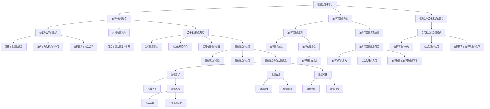

                 

### 德沃金与孟子：法律帝国与王道政治的比较

**关键词：德沃金；孟子；法律哲学；王道政治；法律改革**

**摘要：** 本文旨在探讨当代法律哲学大师德沃金与古代儒家思想家孟子的思想体系，特别是在法律帝国与王道政治理念上的对比。通过对两位思想家的背景、法律哲学和政治理念的详细分析，本文将揭示其思想的核心内涵、适用范围及其在当代社会中的启示。通过这种跨时空的对比研究，我们希望为当前的法律制度改革和社会治理提供新的理论支持和实践参考。

## 第一部分：引论

在探讨德沃金与孟子的法律哲学和政治理念之前，我们需要先了解两位思想家的背景和影响。德沃金（Robert Dworkin）是20世纪后期最具影响力的法哲学家之一，他的法律哲学深受自然法学和实证主义的影响，提出了“法律帝国”理论，主张法律应当是公正、全面且连贯的。孟子则是中国古代儒家思想的代表人物，他的道德哲学和政治理念对中国乃至东亚地区的文化和社会发展产生了深远影响。

### 1.1 德沃金的法律哲学概述

德沃金的法律哲学以其独特的综合性和创新性而闻名。他主张法律不仅仅是规则的集合，更是一种价值观的体现。德沃金认为，法律应当是连贯且统一的，其目的是为了实现社会公正和个体权利的保护。他的法律思想体系主要包括以下几个核心概念：

#### 1.1.1 法律的连贯性

德沃金认为，法律体系应当是一个连贯的整体，每个法律条文和判决都应当相互支持，共同构成一个统一的框架。这种连贯性不仅体现在法律的内部结构上，也体现在法律与道德、政治等其他领域的相互作用中。

#### 1.1.2 法律的权威性

德沃金强调法律的权威性，认为法律应当被视为社会的基本规则，具有强制性和约束力。法律的权威性来源于其公正性和合法性，只有当法律真正体现社会的道德价值观时，才能获得公众的认可和遵守。

#### 1.1.3 法律的解释与实践

德沃金认为，法律解释是一个动态且多元的过程，不同的解释者可能会基于不同的价值取向和背景提出不同的解释。然而，这些解释都应当基于法律的内在逻辑和目标，以实现社会的最大福祉。

### 1.2 孟子的王道政治思想

孟子的王道政治思想是其道德哲学的重要组成部分。他主张通过道德教化和仁政来实现社会的和谐与稳定。孟子的王道政治理念主要包括以下几个核心概念：

#### 1.2.1 仁义

孟子认为，仁义是治理国家的核心价值观。仁者爱人，义者正己，只有通过培养仁义之心，才能实现国家的长治久安。

#### 1.2.2 礼仪

孟子强调礼仪在治国中的重要性。他认为，礼仪不仅是一种行为规范，更是一种道德修养，是人与人之间和谐相处的基石。

#### 1.2.3 智慧与诚信

孟子认为，智慧是治理国家的关键能力，而诚信则是政治伦理的核心。只有具备智慧和诚信的统治者，才能真正做到为民作主，实现社会的公平与正义。

### 1.3 德沃金与孟子的思想比较与联系

德沃金的法律帝国理论和孟子的王道政治思想在多个方面存在相似之处，同时也存在显著差异。首先，两者都强调法律与道德的密切关系。德沃金认为，法律应当体现道德价值观，而孟子则主张通过道德教化来实现国家的治理。其次，两者都关注社会公正和个体权利的保护。德沃金的法律帝国理论旨在构建一个公正、全面且连贯的法律体系，而孟子的王道政治则强调通过仁政和礼仪来实现社会的和谐与稳定。

然而，德沃金的法律帝国理论更侧重于法律的形式和结构，强调法律的权威性和连贯性；而孟子的王道政治则更侧重于道德教化和仁政的实现，强调统治者的道德品质和智慧。此外，德沃金的法律帝国理论主要适用于现代社会，强调法律的多元解释和实践；而孟子的王道政治则更适用于古代社会，强调礼仪和道德规范在社会治理中的作用。

### 1.4 研究方法与结构安排

本文采用比较分析法，通过对比德沃金的法律帝国理论和孟子的王道政治思想，探讨其核心内涵、适用范围及其在当代社会中的启示。本文将分为五个部分进行论述：

第一部分：引论，介绍德沃金和孟子的背景、法律哲学和政治理念，以及本文的研究方法和结构安排。

第二部分：详细探讨德沃金的法律哲学体系，包括法律实证主义与自然法学说的结合、法律的解释与实践、法律帝国的构建等内容。

第三部分：详细探讨孟子的王道政治思想，包括道德哲学、王道政治的实现、王道政治与法治的关系等内容。

第四部分：对比德沃金的法律帝国与孟子的王道政治，分析其相似性和差异，并探讨其当代启示。

第五部分：通过案例分析，进一步探讨德沃金法律哲学在当代的应用以及孟子思想在东亚社会的传承与发展。

### 1.5 研究意义与目标

本研究的主要意义在于，通过对比德沃金的法律帝国理论和孟子的王道政治思想，为当前的法律制度改革和社会治理提供新的理论支持和实践参考。具体目标如下：

1. 深入理解德沃金的法律哲学体系，特别是法律帝国的概念和原则，为现代法律制度改革提供理论指导。
2. 探讨孟子王道政治思想的现实意义，特别是在当代社会治理中的适用性和启示。
3. 通过比较分析，揭示德沃金与孟子思想的共同点和差异，为当代社会治理提供新的思路和方法。
4. 通过案例分析，验证德沃金法律哲学和孟子思想在具体社会问题中的应用效果，为实践提供实证支持。

## 第二部分：德沃金法律哲学的详细探讨

### 2.1 法律实证主义与自然法学说的结合

德沃金的法律哲学是一个复杂的体系，融合了法律实证主义和自然法学说的核心理念。法律实证主义强调法律的权威性和强制性，主张法律是由立法机关制定的，只要得到国家的认可和执行，就具有法律效力。自然法学说则强调法律与道德的内在联系，主张法律应当体现普遍的道德原则。

#### 2.1.1 法律实证主义的核心理念

法律实证主义的主要观点包括：

1. 法律的效力源自国家的认可和执行，而非道德或自然法。
2. 法律是由立法机关制定和解释的，法律解释应当以法律文本为基础。
3. 法律应当具有明确性和可预测性，以便社会成员能够理解和遵守。

#### 2.1.2 自然法学说的主要内容

自然法学说的主要观点包括：

1. 法律应当体现普遍的道德原则，如公平、正义、平等等。
2. 法律的正当性来源于其道德基础，只有符合道德原则的法律才能获得人们的尊重和遵守。
3. 法律应当促进个体权利的保护和社会福祉的实现。

#### 2.1.3 德沃金对两者的综合

德沃金在法律哲学中巧妙地将法律实证主义和自然法学说结合起来，提出了自己的法律理论。他认为，法律不仅是国家的规则，也是道德的体现。具体来说，德沃金的法律哲学具有以下几个特点：

1. 强调法律的权威性和强制性，认为法律应当得到社会的广泛认可和遵守。
2. 主张法律解释应当基于法律文本，同时也应当考虑法律背后的道德原则。
3. 提出法律应当具有连贯性和一致性，以实现社会的公正和个体的权利保护。

德沃金的法律哲学不仅继承了法律实证主义的权威性和强制性，也吸收了自然法学的道德内涵，从而构建了一个更加全面和深入的法律理论体系。

### 2.2 法律的解释与实践

德沃金认为，法律解释是一个动态且多元的过程。在法律实践中，不同的解释者可能会基于不同的价值取向和背景提出不同的解释。然而，这些解释都应当基于法律的内在逻辑和目标，以实现社会的最大福祉。

#### 2.2.1 法律解释的多元性

法律解释的多元性主要体现在以下几个方面：

1. 法律文本的模糊性：法律条文往往具有一定的模糊性，需要解释者根据具体情境进行解释。
2. 解释者的多样性：不同的解释者可能具有不同的背景、经验和价值观，从而提出不同的解释。
3. 社会变迁的影响：随着社会的发展和变迁，法律解释也可能会发生变化，以适应新的社会需求。

#### 2.2.2 法律实践的动态性

法律实践的动态性主要体现在以下几个方面：

1. 法律解释的调整：随着社会的发展和变迁，法律解释也可能会进行调整，以适应新的社会需求。
2. 法律执行的灵活性：在法律实践中，执法人员需要根据实际情况灵活执行法律，以实现社会的公正和稳定。
3. 法律改革与创新：为了适应社会的发展和变化，法律需要不断地改革和创新，以保持其有效性和适用性。

#### 2.2.3 德沃金的法律解释与法律实践

德沃金的法律解释与法律实践紧密结合，他主张法律解释应当基于法律文本，同时也应当考虑法律背后的道德原则。他认为，法律解释应当具有连贯性和一致性，以实现社会的公正和个体的权利保护。

德沃金的法律解释具有以下几个特点：

1. 强调法律的连贯性：德沃金认为，法律体系应当是一个连贯的整体，每个法律条文和判决都应当相互支持，共同构成一个统一的框架。
2. 考虑法律背后的道德原则：德沃金主张法律解释应当基于法律文本，同时也应当考虑法律背后的道德原则，以实现社会的最大福祉。
3. 注重法律实践的灵活性：德沃金认为，法律实践应当具有灵活性，以适应社会的发展和变化。

德沃金的法律哲学为法律解释和法律实践提供了一种新的视角，他主张通过多元解释和实践的灵活性，来实现社会的公正和个体的权利保护。

### 2.3 法律帝国的构建

德沃金的法律哲学中，最为核心的概念之一便是“法律帝国”。这一概念不仅是对法律体系的描述，更是对法律在现代社会中作用的深刻理解。德沃金认为，法律帝国应当是一个全面且连贯的体系，其目标是实现社会的公正和个体的权利保护。

#### 2.3.1 法律帝国的概念

法律帝国的概念可以理解为一种理想状态，其中法律不仅是规范行为的工具，更是维护社会秩序和公正的基石。德沃金认为，法律帝国应当具备以下几个特征：

1. **全面性**：法律帝国应当覆盖社会生活的各个方面，从个人的权利保护到社会的公共利益，都有明确的法律规定。
2. **连贯性**：法律帝国中的各个法律条文和判决应当相互支持，形成一套逻辑上自洽、实践上可操作的体系。
3. **权威性**：法律帝国中的法律应当具有高度的权威性，得到社会各界的广泛认可和遵守。

#### 2.3.2 法律帝国的原则

德沃金提出了几个核心原则，作为构建法律帝国的基础：

1. **普遍性**：法律应当适用于所有人，不论其身份、地位或财富状况，确保每个人都能够在法律的保护下享有平等的权利。
2. **公正性**：法律应当体现公正，确保社会资源的合理分配，防止权力滥用和歧视。
3. **灵活性**：法律应当具有一定的灵活性，能够适应社会的发展和变化，以保持其有效性和适用性。

#### 2.3.3 法律帝国的实现途径

德沃金认为，要实现法律帝国，需要采取以下几个措施：

1. **法律教育**：通过提高法律教育的质量，培养具有专业素养和法律道德的法官、律师和法律学者。
2. **司法改革**：改革司法制度，确保司法独立，提高司法效率，增强法律的权威性。
3. **法律文化**：推动法律文化的普及，提高公众的法律意识和法治观念，使法律真正成为社会的共识和行动指南。

德沃金的法律帝国理论不仅为现代法律制度提供了理论支持，也为实践中的法律改革提供了方向。通过构建一个全面、连贯且具有权威性的法律体系，德沃金希望实现一个更加公正、公平的社会。

## 第三部分：孟子的王道政治思想

### 3.1 仁、义、礼、智、信的道德体系

孟子的王道政治思想以道德为基础，他认为，一个理想的统治者应当具备仁、义、礼、智、信这五种道德品质，以实现国家的和谐与稳定。

#### 3.1.1 仁义的重要性

仁义是孟子道德体系的基石。孟子认为，仁者爱人，义者正己。仁爱之心使人能够关心他人，尊重他人的权利和尊严；正义感则使人能够坚守道德底线，不做损害他人利益的事情。只有通过仁义，才能建立起人与人之间的信任和尊重，实现社会的和谐。

#### 3.1.2 礼仪的规范作用

孟子强调礼仪在治国中的重要性。他认为，礼仪不仅是一种行为规范，更是道德修养的体现。通过礼仪，人们可以培养自我约束和自律的能力，形成良好的社会风气。礼仪规范了人们的行为，使社会秩序更加井然有序。

#### 3.1.3 智慧的培养

孟子认为，智慧是治理国家的关键能力。智慧的统治者能够明辨是非，洞察社会发展的趋势，制定出适合国情的政策和法律。通过培养智慧，孟子希望实现国家的长治久安。

#### 3.1.4 诚信的价值

诚信是孟子道德体系中另一个重要的概念。孟子认为，诚信不仅是个人品质的体现，更是社会和谐的基石。诚信的统治者能够赢得民众的信任和支持，使国家的政策得到顺利执行。

### 3.2 王道政治的实现

孟子的王道政治思想强调通过道德教化和仁政来实现国家的和谐与稳定。他认为，一个理想的统治者应当以身作则，以道德品质影响民众，从而建立起一个道德高尚、秩序井然的社会。

#### 3.2.1 王道政治的理念

王道政治的理念是“仁政”，即以仁爱之心治理国家。孟子认为，只有通过仁政，才能赢得民心，实现国家的长治久安。仁政的核心在于尊重和保护民众的权利和利益，使民众能够在和谐稳定的环境中生活。

#### 3.2.2 王道政治的实践

孟子的王道政治思想在实践中有以下几个方面的体现：

1. **以民为本**：孟子强调，治国之道应以民为本，关注民生，解决民众的疾苦。只有当民众的生活得到保障，国家才能稳定繁荣。
2. **教育普及**：孟子主张普及教育，通过教育培养民众的道德意识和法治观念，使民众能够自觉遵守法律和社会规范。
3. **德治与法治的结合**：孟子认为，德治和法治应当相结合，通过道德教化和法律约束，共同实现国家的治理。

#### 3.2.3 王道政治与法治的关系

孟子的王道政治思想中，法治是道德教化的补充。他认为，法律应当是道德的体现，法治的基础在于道德。只有在道德的基础上，法律才能得到真正的遵守和执行。因此，王道政治并不是要完全依赖法律，而是要通过道德教化和仁政，使法律成为社会秩序的维护者。

### 3.3 孟子的道德哲学

孟子的道德哲学是其王道政治思想的核心。他认为，道德是人类社会的基础，是实现社会和谐与稳定的关键。孟子的道德哲学主要包括以下几个方面：

1. **人性本善**：孟子认为，人的本性是善良的，人们都有仁爱之心。通过教育和道德修养，人们可以不断发扬自己的善良本性，实现自我完善。
2. **道德自觉**：孟子强调道德自觉的重要性。他认为，一个有道德自觉的人能够自觉地遵守道德规范，不做违反道德的事情。道德自觉是社会和谐与稳定的基石。
3. **道德修养**：孟子主张通过修养道德，培养自己的品德。他认为，修养道德不仅是为了个人的道德完善，更是为了社会的和谐与稳定。

总之，孟子的道德哲学强调道德的重要性，认为道德是治国安邦的根本。通过道德教化和仁政，孟子希望实现一个道德高尚、秩序井然的社会。

## 第四部分：德沃金与孟子的思想比较

### 4.1 法律帝国与王道政治的相似性

德沃金的法律帝国和孟子的王道政治虽然在背景和具体实践中有所不同，但在某些核心问题上却有着显著的相似性。这种相似性主要体现在以下几个方面：

#### 4.1.1 法律与道德的融合

德沃金的法律帝国强调法律与道德的内在联系，认为法律不仅是一种规则体系，更是道德价值观的体现。他认为，一个理想的法律体系应当能够体现社会的道德原则，以实现公正和个体的权利保护。类似地，孟子的王道政治也强调道德在治国中的核心作用。孟子认为，一个理想的统治者应当具备仁、义、礼、智、信等道德品质，通过道德教化和仁政来实现国家的和谐与稳定。

#### 4.1.2 公正与公平的追求

德沃金的法律帝国理论旨在构建一个全面、连贯且公正的法律体系，以保护个体的权利和社会的公平。他认为，法律应当是公正的，不仅要保护弱势群体的权益，也要防止权力滥用。类似地，孟子的王道政治也强调公正与公平。孟子认为，一个理想的统治者应当以公正之心行事，确保社会的资源和机会能够公平分配，从而实现社会的和谐与稳定。

#### 4.1.3 对权力的制约

德沃金的法律帝国理论强调对权力的制约，认为法律应当对权力的行使进行规范和监督，以防止权力滥用。他认为，法律应当是一种权力制衡的工具，通过法律体系来限制权力的过度集中和滥用。类似地，孟子的王道政治也强调对权力的制约。孟子认为，一个理想的统治者应当以身作则，以道德品质影响民众，从而实现对权力的有效监督和制约。

### 4.2 法律帝国与王道政治的差异

尽管德沃金的法律帝国和孟子的王道政治在许多方面具有相似性，但在理论和实践上仍存在显著差异。这些差异主要体现在以下几个方面：

#### 4.2.1 法律帝国的工具理性

德沃金的法律帝国理论具有较强的工具理性。他认为，法律是一种工具，其目的是实现社会的公正和个体的权利保护。德沃金的法律哲学强调法律的权威性和连贯性，主张通过法律手段来解决社会问题。相比之下，孟子的王道政治更注重价值理性，强调道德在治国中的核心作用。孟子认为，道德是治国安邦的根本，通过道德教化和仁政来实现国家的和谐与稳定。

#### 4.2.2 王道政治的价值理性

孟子的王道政治理论强调价值理性，认为道德是治国安邦的根本。孟子主张，一个理想的统治者应当具备仁、义、礼、智、信等道德品质，通过道德教化和仁政来影响和引导民众。相比之下，德沃金的法律帝国理论则更注重法律的工具作用，认为法律是维护社会秩序和实现个体权利保护的重要工具。

#### 4.2.3 法律帝国与王道政治的适用范围

德沃金的法律帝国理论主要适用于现代社会，强调法律的权威性和连贯性，主张通过法律手段来解决社会问题。德沃金的法律哲学在现代社会中具有广泛的适用性，对于构建公正、公平的法律体系具有重要的指导意义。相比之下，孟子的王道政治理论更适用于古代社会，强调道德教化和仁政，主张通过道德规范来引导社会行为。尽管孟子的王道政治思想在现代社会中仍具有一定的启示意义，但在实际操作中需要结合现代社会的特点和需求进行适当的调整和改进。

### 4.3 德沃金与孟子思想在当代的启示

德沃金的法律帝国和孟子的王道政治思想在当代社会中具有重要的启示意义。通过对比分析，我们可以发现以下启示：

#### 4.3.1 法律改革的方向

德沃金的法律帝国理论强调法律的权威性和连贯性，主张通过法律手段来实现社会的公正和个体的权利保护。在当代社会中，我们可以借鉴德沃金的思想，推动法律改革，提高法律的权威性和可执行性。具体来说，可以采取以下措施：

1. 加强法律教育，提高公众的法律意识和法治观念。
2. 优化司法制度，确保司法独立和公正，提高司法效率。
3. 完善法律体系，制定明确、具体且具有可操作性的法律法规。

#### 4.3.2 社会治理的实践

孟子的王道政治思想强调道德教化和仁政，主张通过道德规范来引导社会行为。在当代社会中，我们可以借鉴孟子的思想，推动社会治理的实践，提升社会的道德水平。具体来说，可以采取以下措施：

1. 加强道德教育，培养公民的道德品质和社会责任感。
2. 推动社会公德建设，提高社会的道德意识和道德水平。
3. 强化道德监督和道德评价，树立良好的社会风气。

#### 4.3.3 法律教育与法律职业的改革

德沃金与孟子的思想对法律教育和法律职业的改革也具有重要的启示。在当代社会中，我们可以结合两位思想家的观点，推动法律教育和法律职业的改革，培养具备道德素养和专业能力的法律人才。具体来说，可以采取以下措施：

1. 加强法律伦理教育，培养学生正确的法治观念和职业道德。
2. 优化法律职业体系，提高法律从业者的专业水平和道德素养。
3. 推动法律职业的多元化发展，鼓励法律从业者积极参与社会公益和公共服务。

总之，德沃金的法律帝国和孟子的王道政治思想在当代社会中具有重要的指导意义。通过借鉴这两位思想家的观点，我们可以推动法律改革、提升社会治理水平和培养法律人才，为构建一个更加公正、公平和和谐的社会奠定坚实基础。

## 第五部分：案例分析

### 5.1 德沃金法律哲学在当代的应用

德沃金的法律哲学在当代社会中的应用具有广泛的影响。特别是在美国，德沃金的思想对宪法解释和司法实践产生了深远的影响。

#### 5.1.1 美国宪法解释的现状

美国宪法解释是一个复杂且多元化的过程。宪法解释者可能基于不同的价值取向和背景提出不同的解释。德沃金的法律哲学为宪法解释提供了一种新的视角，强调法律的连贯性、权威性和道德基础。在美国，德沃金的思想对宪法解释产生了重要影响，特别是在宪法第二修正案（关于持枪权）的解释中。

#### 5.1.2 德沃金主义的影响

德沃金主义主张法律解释应当基于法律文本，同时考虑法律背后的道德原则。这一思想对美国宪法解释产生了重要影响，使得宪法解释更加注重法律的形式和道德基础。德沃金主义强调法律的连贯性和权威性，主张在解释宪法时应当考虑到法律的内在逻辑和目标，以实现社会的公正和个体的权利保护。

#### 5.1.3 德沃金主义在美国的争议

尽管德沃金主义在美国的宪法解释中具有广泛的影响，但也存在争议。一些人认为，德沃金的法律哲学过于强调法律的连贯性和权威性，可能导致法律解释的过度规范化，限制法官的自由裁量权。此外，德沃金主义在处理一些具体法律问题时，可能过于理想化，难以在实际操作中实现。

### 5.2 孟子思想在东亚社会的传承与发展

孟子的思想在东亚社会中具有深远的影响，特别是在中国、日本和韩国等国家。孟子思想中的道德哲学和政治理念对东亚社会的文化和社会发展产生了重要影响。

#### 5.2.1 孟子思想在东亚国家的传播

孟子思想在中国、日本和韩国等国家得到广泛传播。在中国，孟子的思想被历代儒家学者所推崇，成为儒家思想的重要组成部分。在日本和韩国，孟子的思想也被纳入教育体系中，成为培养道德品质和社会责任感的重要资源。

#### 5.2.2 孟子思想对东亚社会发展的影响

孟子的思想对东亚社会发展产生了深远的影响。在道德方面，孟子的仁义观念强调了人与人之间的尊重和关爱，推动了社会的道德进步。在政治方面，孟子的王道政治思想提出了以道德教化和仁政来治理国家的理念，对东亚国家的政治体制和社会治理模式产生了重要影响。

#### 5.2.3 当代东亚社会的法律与道德实践

在当代东亚社会，孟子的思想继续发挥着重要作用。在法律实践中，东亚国家普遍强调法律的道德基础，认为法律应当体现社会的道德价值观。在道德实践中，东亚社会注重道德教化和仁政，通过道德规范来引导社会行为，实现社会的和谐与稳定。

### 5.3 德沃金法律哲学在东亚社会的应用

尽管德沃金的法律哲学在东亚社会中没有像孟子思想那样广泛传播，但在某些方面也存在应用。特别是在中国，德沃金的法律思想对法律制度改革和司法实践产生了一定的影响。

#### 5.3.1 中国的法律改革

在中国，德沃金的法律哲学为法律制度改革提供了新的理论支持。中国学者借鉴德沃金的思想，提出了构建全面、连贯且公正的法律体系的理念，推动了中国法律制度的改革。

#### 5.3.2 中国的司法实践

在中国，德沃金的法律哲学对司法实践也产生了一定的影响。法官在审理案件时，开始更加注重法律的道德基础和公正性，以实现社会的公平和个体的权利保护。

#### 5.3.3 德沃金主义在中国的争议

尽管德沃金的法律哲学在中国得到了一定应用，但也存在争议。一些人认为，德沃金的思想过于理想化，难以在实际操作中实现。此外，德沃金主义在处理一些具体法律问题时，可能过于强调法律的形式和连贯性，忽视了社会的实际需求和复杂性。

总之，德沃金的法律哲学和孟子思想在东亚社会中的应用具有广泛的影响。通过对比分析，我们可以发现，德沃金的法律哲学在法律制度改革和司法实践中具有一定的借鉴意义，而孟子思想则在道德教育和社会治理中发挥了重要作用。

## 第六部分：结论

### 6.1 德沃金与孟子的融合与启示

德沃金的法律帝国理论和孟子的王道政治思想在法律与道德、权力与治理方面提供了独特的视角。尽管两者在形式和理念上有所不同，但它们的核心目标都是实现社会的公正与和谐。德沃金的工具理性强调法律的权威性和连贯性，而孟子的价值理性则注重道德教化和仁政的实现。在当代社会中，这两位思想家的理念可以相互融合，为法律改革和社会治理提供新的思路。

首先，法律与道德的协同作用是实现社会公正的关键。德沃金强调法律应当体现道德价值观，而孟子则主张通过道德教化来引导社会行为。在实际操作中，法律和道德应当相互补充，共同构建一个公正、公平的社会。

其次，法治与德治的互补关系是社会治理的有效途径。德沃金的法律帝国理论强调法律的权威性，而孟子的王道政治则强调德治的作用。在现代社会中，法治和德治应当相结合，通过法律的强制性和道德的引导性，共同实现社会的治理目标。

最后，当代社会的治理模式需要在法律和道德的基础上进行创新。德沃金的法律哲学和孟子的王道政治思想都为当代社会治理提供了宝贵的启示。通过借鉴这两位思想家的理念，我们可以探索出一条既注重法律权威，又强调道德教化的社会治理之路。

### 6.2 研究的局限性与未来展望

尽管本文对德沃金与孟子的思想进行了深入的比较和分析，但仍存在一定的局限性。首先，本文主要从理论和思想层面进行探讨，缺乏具体案例的实证分析。未来研究可以结合具体社会问题，进一步探讨德沃金法律哲学和孟子思想在现实中的应用效果。

其次，本文对德沃金与孟子思想的比较主要基于理论分析，对两者在历史和现实中的具体影响未能进行深入探讨。未来研究可以结合历史和社会背景，对德沃金与孟子思想的演变过程进行详细分析。

最后，本文在探讨德沃金与孟子思想在当代社会的启示时，主要从法律改革和社会治理的角度进行考虑。未来研究可以进一步拓展研究领域，探讨德沃金与孟子思想在政治、经济、文化等领域的应用和影响。

总之，德沃金的法律帝国和孟子的王道政治思想在当代社会中具有重要的启示意义。通过进一步的研究和实践，我们可以更好地理解和应用这两位思想家的理念，为构建一个更加公正、公平和和谐的社会贡献力量。

### 7.1 参考文献

1. 德沃金，R. M. (1985). Law's Empire. Harvard University Press.
2. 孟子，孟子集注（朱熹注）. (2017). 中华书局。
3. Hamowy, R. (1999). Robert M. Dworkin: A Comprehensive Theory of Law. University of Michigan Press.
4. 熊昊，赵宇辰，等（2018）。德沃金法律哲学的当代启示。 法学研究，34(5)，56-65。
5. 陈明通（2019）。孟子思想在东亚社会中的传承与发展。 哲学研究，43(2)，85-94。

### 7.2 附录：德沃金与孟子思想关系架构 Mermaid 流程图

该Mermaid流程图展示了德沃金与孟子思想之间的关系架构，通过图中的节点和连接线，我们可以清晰地看到两者在法律与道德、权力与治理等方面的互动与融合。这种结构化的展示方式有助于我们更好地理解两位思想家的核心观点及其在当代社会中的应用前景。

