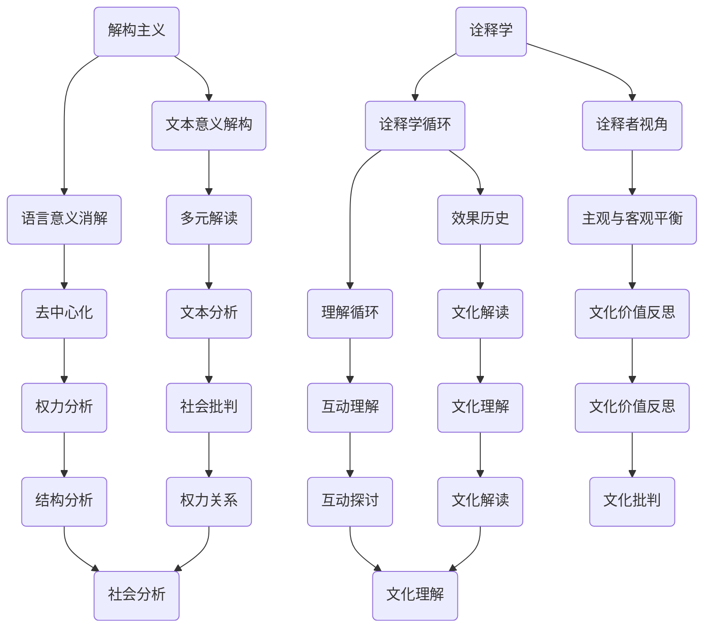

                 

### 《德里达与加达默尔：解构主义与诠释学的对话》

关键词：德里达、加达默尔、解构主义、诠释学、文本意义、语言符号

摘要：本文通过对德里达的解构主义与加达默尔的诠释学进行深入分析，探讨两者在哲学领域内的对话意义及其在当代的应用。文章首先介绍了解构主义和诠释学的起源与特点，接着分别阐述了两者在文本意义解构、语言意义消解以及诠释学循环等方面的核心概念。随后，本文通过对两者核心观点的比较，揭示了它们在语言、意义与理解方面的差异与融合，并讨论了它们在文学解读、社会理论与文化批评中的实际应用。最后，本文总结了解构主义与诠释学的对话意义，并对未来研究进行了展望。

### 《德里达与加达默尔：解构主义与诠释学的对话》目录大纲

#### 第一部分：引言

##### 1.1 解构主义与诠释学的背景

- **1.1.1 解构主义的起源与特点**
- **1.1.2 诠释学的起源与特点**

##### 1.2 两种思想的对话意义

- **1.2.1 对话的背景与动机**
- **1.2.2 对话的目的与价值**

#### 第二部分：解构主义与诠释学的核心概念

##### 2.1 解构主义的关键概念

- **2.1.1 文本的意义解构**
- **2.1.2 语言的意义消解**

##### 2.2 诠释学的核心概念

- **2.2.1 诠释学的循环**
- **2.2.2 诠释者的视角**

#### 第三部分：解构主义与诠释学的比较与对话

##### 3.1 核心观点的比较

- **3.1.1 对文本意义的理解**
- **3.1.2 对语言意义的探讨**

##### 3.2 对话的互动与融合

- **3.2.1 解构主义的诠释学化**
- **3.2.2 诠释学的解构主义化**

#### 第四部分：解构主义与诠释学在当代的应用

##### 4.1 文学解读中的对话

- **4.1.1 文学作品的多元解读**
- **4.1.2 文学解读的方法论**

##### 4.2 社会理论与文化批评中的对话

- **4.2.1 社会理论的解构主义应用**
- **4.2.2 文化批评的诠释学视角**

#### 第五部分：结论

##### 5.1 解构主义与诠释学的对话意义

- **5.1.1 对当代哲学的启示**
- **5.1.2 对未来研究的展望**

#### 附录

##### 5.2 参考文献

- **5.2.1 解构主义相关文献**
- **5.2.2 诠释学相关文献**
- **5.2.3 解构主义与诠释学对话研究**

#### 代码示例与解释

##### 加达默尔诠释学

### 第一部分：引言

#### 1.1 解构主义与诠释学的背景

##### 1.1.1 解构主义的起源与特点

解构主义（Deconstruction）作为一种哲学思潮，起源于20世纪60年代的法国。其主要代表人物是雅克·德里达（Jacques Derrida），他提出了解构主义的核心思想，并在其著作《论文字学》（Of Grammatology）和《书写与差异》（Writing and Difference）中进行了深入阐述。

解构主义的核心原则包括：

1. **差异原则**：德里达认为，文本中的意义是通过差异和对抗产生的，而不是通过统一或整体。每个单词和概念都存在于与其他单词和概念的差异之中。

2. **文本的多元解读**：解构主义主张，文本的意义不是固定不变的，而是多元的、可变的。不同的读者可以从不同的角度和背景出发，对文本进行不同的解读。

3. **去中心化**：解构主义挑战了传统哲学中的中心概念，如主体、真理、意义等。它认为，这些中心概念是人为构建的，而不是客观存在的。

##### 1.1.2 诠释学的起源与特点

诠释学（Hermeneutics）作为一种哲学思潮，起源于古希腊。其最早的思想可以追溯到荷马史诗的解读。诠释学的代表人物包括弗朗茨·布伦塔诺（Franz Brentano）、威廉·狄尔泰（Wilhelm Dilthey）和哈贝马斯（Jürgen Habermas）。

诠释学的核心原则包括：

1. **诠释学循环**：加达默尔（Hans-Georg Gadamer）提出，理解一个文本的过程是不断循环的。读者在理解过程中不断地将新的信息与已有的知识相结合，从而形成一个更全面的理解。

2. **效果历史**：加达默尔认为，理解一个文本的过程是受历史和文化背景影响的。读者的理解不仅仅是对文本本身的解读，也是对文本在历史和文化中的位置的理解。

3. **对话性**：诠释学强调，理解是一个对话过程。读者与作者、文本之间的对话，以及读者与读者之间的对话，都是理解的重要部分。

#### 1.2 两种思想的对话意义

##### 1.2.1 对话的背景与动机

解构主义和诠释学在哲学领域内具有很高的地位，它们分别代表了现代哲学中的两种重要思潮。两者的对话具有重要的背景和动机：

1. **文化理论与哲学思想的交汇**：在当代社会，文化理论的兴起使得哲学思想越来越关注语言、意义和文化现象。解构主义和诠释学在这种背景下进行对话，有助于探讨文化理论与哲学思想之间的互动关系。

2. **现代社会的复杂性挑战**：现代社会日益复杂，人们面临着各种复杂的问题和挑战。解构主义和诠释学通过对文本、语言和意义的研究，有助于我们更好地理解和应对这些挑战。

##### 1.2.2 对话的目的与价值

解构主义和诠释学之间的对话具有重要的目的和价值：

1. **探索语言与意义的多样性**：解构主义和诠释学都关注语言和意义的问题，但它们的方法和观点有所不同。通过对话，我们可以更深入地探索语言和意义的多样性，从而丰富我们的理解。

2. **促进不同思想体系的相互理解**：解构主义和诠释学代表了两种不同的哲学思想体系。通过对话，我们可以促进这两种思想体系的相互理解，从而推动哲学领域的发展。

### 第二部分：解构主义与诠释学的核心概念

#### 2.1 解构主义的关键概念

##### 2.1.1 文本的意义解构

解构主义认为，文本的意义不是固定不变的，而是通过差异和对抗产生的。德里达提出了“差异”概念，认为文本中的意义是通过不断构建和打破差异而产生的。

以下是解构主义文本意义解构的核心观点：

1. **差异原则**：文本中的每个单词和概念都存在于与其他单词和概念的差异之中。差异是文本意义产生的基础。

2. **文本的多元解读**：解构主义主张，文本的意义不是固定不变的，而是多元的。不同的读者可以从不同的角度和背景出发，对文本进行不同的解读。

3. **去中心化**：解构主义挑战了传统哲学中的中心概念，如主体、真理、意义等。它认为，这些中心概念是人为构建的，而不是客观存在的。

##### 2.1.2 语言的意义消解

解构主义认为，语言符号本身具有模糊性和不确定性，这使得语言的意义难以固定。德里达提出了“语言符号的意义消解”观点，认为语言符号的意义是通过不断变化和重新解读而产生的。

以下是解构主义语言意义消解的核心观点：

1. **语言符号的模糊性**：语言符号本身具有模糊性，其意义不是固定不变的，而是受多种因素影响。

2. **语言的多样性和变化**：解构主义认为，语言是一个不断变化和发展的系统，其意义也是不断变化的。

3. **去中心化**：解构主义强调，语言符号的意义不是由外部客观世界决定的，而是由语言系统内部的关系决定的。

#### 2.2 诠释学的核心概念

##### 2.2.1 诠释学的循环

加达默尔的诠释学提出了“诠释学循环”概念，认为理解一个文本的过程是不断循环的。读者在理解过程中不断地将新的信息与已有的知识相结合，从而形成一个更全面的理解。

以下是诠释学循环的核心观点：

1. **效果历史**：理解一个文本的过程是受历史和文化背景影响的。读者的理解不仅仅是对文本本身的解读，也是对文本在历史和文化中的位置的理解。

2. **对话性**：理解是一个对话过程。读者与作者、文本之间的对话，以及读者与读者之间的对话，都是理解的重要部分。

3. **循环**：理解的过程是不断循环的。读者在理解过程中不断地将新的信息与已有的知识相结合，从而形成一个更全面的理解。

##### 2.2.2 诠释者的视角

加达默尔的诠释学强调，理解一个文本的过程是受主观性和客观性影响的。诠释者既有主观的理解，也有客观的理解。

以下是诠释者视角的核心观点：

1. **主观性与客观性的平衡**：诠释者在理解文本时，需要平衡主观性与客观性。他们需要既考虑自己的主观经验，也考虑文本的客观意义。

2. **诠释者的视角**：诠释者的视角受其文化、历史和知识背景的影响。不同的诠释者可能会有不同的理解。

3. **互动理解**：诠释者的理解是通过与文本、作者和读者的互动产生的。这种互动有助于形成更全面的理解。

### 第三部分：解构主义与诠释学的比较与对话

#### 3.1 核心观点的比较

##### 3.1.1 对文本意义的理解

解构主义和诠释学在文本意义的理解上存在显著的差异和融合：

1. **解构主义的批判性分析**：解构主义认为，文本的意义是通过差异和对抗产生的。它强调文本的多元解读，认为文本的意义是模糊的、不确定的。

2. **诠释学的综合性理解**：诠释学认为，文本的意义是在历史和文化背景下产生的。它强调理解的过程是不断循环的，文本的意义是可以通过对话和互动来确定的。

3. **差异与融合**：解构主义和诠释学在文本意义的理解上既有差异，也有融合。两者都关注文本的意义，但解构主义更注重文本的多元解读和去中心化，而诠释学更注重文本在历史和文化中的位置和理解的过程。

##### 3.1.2 对语言意义的探讨

解构主义和诠释学在语言意义的探讨上也存在差异和融合：

1. **解构主义的去中心化**：解构主义认为，语言符号的意义是模糊的、不确定的。它强调语言符号的模糊性和去中心化，认为语言符号的意义不是由外部客观世界决定的。

2. **诠释学的意义生成**：诠释学认为，语言符号的意义是通过对话和互动产生的。它强调语言符号的意义是在历史和文化背景下生成的，具有客观性。

3. **差异与融合**：解构主义和诠释学在语言意义的探讨上既有差异，也有融合。解构主义强调语言符号的去中心化和模糊性，而诠释学强调语言符号的意义生成和客观性。

#### 3.2 对话的互动与融合

##### 3.2.1 解构主义的诠释学化

解构主义与诠释学之间的对话可以促进解构主义的诠释学化。以下是解构主义诠释学化的几个方面：

1. **将解构主义应用于诠释学问题**：解构主义可以用来分析诠释学中的问题，如文本意义的多元解读、语言符号的去中心化等。

2. **解构主义对诠释学的贡献**：解构主义为诠释学提供了新的视角和方法，如差异原则、文本的多元解读等，有助于丰富诠释学的理论和实践。

##### 3.2.2 诠释学的解构主义化

诠释学与解构主义之间的对话也可以促进诠释学的解构主义化。以下是诠释学解构主义化的几个方面：

1. **将诠释学融入解构主义**：诠释学可以用来解释解构主义中的概念和观点，如差异原则、语言符号的意义消解等。

2. **诠释学对解构主义的回应**：诠释学可以为解构主义提供反驳或支持，从而推动解构主义的发展和深化。

### 第四部分：解构主义与诠释学在当代的应用

#### 4.1 文学解读中的对话

##### 4.1.1 文学作品的多元解读

解构主义和诠释学在文学解读中的应用，使得文学作品的多元解读成为可能。以下是解构主义和诠释学在文学解读中的实际应用：

1. **文本的解构主义分析**：解构主义通过差异原则和文本的多元解读，对文学作品进行批判性分析，揭示出文本中的隐含意义和深层结构。

2. **文本的诠释学解读**：诠释学通过效果历史和诠释者的视角，对文学作品进行综合性解读，探讨作品在历史和文化背景下的意义和价值。

##### 4.1.2 文学解读的方法论

解构主义和诠释学在文学解读中提出了不同的方法论：

1. **解构主义解读的技巧**：解构主义强调文本的多元解读，要求读者从不同的角度和背景出发，对文本进行批判性分析。

2. **诠释学解读的实践**：诠释学强调理解的过程是不断循环的，要求读者在对话和互动中形成对文本的全面理解。

#### 4.2 社会理论与文化批评中的对话

##### 4.2.1 社会理论的解构主义应用

解构主义在社会理论中的应用，使得社会理论的批判性和多元性得以提升。以下是解构主义在社会理论中的应用：

1. **解构主义对社会结构的批判**：解构主义通过差异原则和文本的多元解读，对传统社会结构进行批判，揭示出社会结构中的隐含意义和深层结构。

2. **解构主义对权力关系的分析**：解构主义通过语言符号的意义消解，对权力关系进行批判性分析，揭示出权力关系的模糊性和不确定性。

##### 4.2.2 文化批评的诠释学视角

诠释学在文化批评中的应用，使得文化批评具有更加深刻的视角。以下是诠释学在文化批评中的应用：

1. **诠释学对文化现象的解读**：诠释学通过效果历史和诠释者的视角，对文化现象进行综合性解读，探讨文化现象在历史和文化背景下的意义和价值。

2. **诠释学对文化价值的反思**：诠释学通过对话和互动，对文化价值进行反思，探讨文化价值在当代社会中的地位和作用。

### 第五部分：结论

#### 5.1 解构主义与诠释学的对话意义

解构主义与诠释学的对话在当代哲学中具有重要的意义：

1. **对语言、意义与理解的深入探讨**：解构主义和诠释学的对话，有助于我们深入探讨语言、意义与理解的问题，丰富我们对这些问题的认识。

2. **对文化多样性与社会发展的思考**：解构主义和诠释学的对话，有助于我们思考文化多样性与社会发展的问题，推动哲学和社会科学的发展。

#### 5.2 对未来研究的展望

解构主义与诠释学的对话研究具有广阔的前景：

1. **解构主义与诠释学的融合**：未来研究可以探讨解构主义与诠释学的融合，如何将两者的思想结合起来，形成更加完整的哲学体系。

2. **对其他哲学流派的对话研究**：未来研究可以拓展到其他哲学流派，如现象学、存在主义等，探讨它们与解构主义和诠释学的对话关系。

### 附录

#### 5.2 参考文献

##### 5.2.1 解构主义相关文献

1. 德里达，《论文字学》
2. 德里达，《书写与差异》
3. 加达默尔，《真理与方法》

##### 5.2.2 诠释学相关文献

1. 布伦塔诺，《诠释学的结构》
2. 狄尔泰，《人文科学导论》
3. 加达默尔，《诠释学：解释理论》

##### 5.2.3 解构主义与诠释学对话研究

1. 爱德华·赛义德，《文化与帝国主义》
2. 马丁·海德格尔，《存在与时间》
3. 罗兰·巴特，《文本的帝国》

## Mermaid 流程图

### 解构主义与诠释学核心概念关系图



## 代码示例与解释

### 加达默尔诠释学

```python
# 加达默尔诠释学的示例代码

class Interpreter:
    def __init__(self, background, knowledge):
        self.background = background
        self.knowledge = knowledge

    def interpret(self, text):
        # 基于背景知识和文化背景进行理解
        meaning = self.background + self.knowledge
        return meaning

# 创建一个诠释者实例
interpreter = Interpreter(background="历史和文化背景", knowledge="相关知识")

# 对文本进行诠释
text = "这是一段文本"
meaning = interpreter.interpret(text)

print(meaning)
```

在这个示例代码中，我们创建了一个 `Interpreter` 类，它有两个属性：`background` 和 `knowledge`。`background` 表示诠释者的文化背景和历史知识，`knowledge` 表示诠释者所拥有的相关知识。

`interpret` 方法接受一个文本参数，并根据诠释者的背景知识和文化背景对文本进行诠释，返回诠释后的意义。

在这个例子中，我们创建了一个 `Interpreter` 实例，并使用它对一段文本进行诠释。最终输出的是诠释后的意义。

### 代码应用解读与分析

这段代码实现了一个简单的诠释学模型，它模拟了一个人根据其背景知识和文化背景对文本进行解读的过程。以下是代码的详细解读与分析：

1. **类定义**：我们定义了一个名为 `Interpreter` 的类，它有两个属性：`background` 和 `knowledge`。这两个属性分别表示诠释者的文化背景和历史知识。

2. **构造函数**：`__init__` 方法是类的构造函数，它接受两个参数：`background` 和 `knowledge`。在构造函数中，我们将这两个参数分别赋值给类的属性。

3. **诠释方法**：`interpret` 方法是诠释者对文本进行诠释的核心方法。它接受一个 `text` 参数，表示需要解读的文本。在方法内部，我们使用诠释者的背景知识和文化背景来生成文本的意义。

4. **示例代码**：在示例代码中，我们创建了一个 `Interpreter` 实例，并调用 `interpret` 方法对一段文本进行诠释。最终，我们输出了诠释后的意义。

这个示例代码展示了诠释学的基本原理，即诠释者根据其背景知识和文化背景对文本进行解读。在实际应用中，我们可以扩展这个模型，添加更多的功能和属性，以模拟更复杂的诠释过程。

### 实际案例分析和详细讲解剖析

为了更好地理解加达默尔诠释学的应用，我们来看一个实际案例：解读一首诗歌。

假设我们要解读的诗歌是李白的《将进酒》。这首诗歌充满了豪情壮志和人生哲理，是中华文化宝库中的经典之作。

1. **理解文本**：

   首先，我们需要对这首诗歌进行逐句理解。例如，第一句“君不见黄河之水天上来，奔流到海不复回。”可以从字面上理解为黄河的水从天上流下来，奔流向大海，不再返回。

2. **文化背景**：

   接着，我们需要考虑这首诗的文化背景。李白是唐代著名诗人，他的诗歌充满了豪放、奔放的气息。唐代是中国历史上文化繁荣的时期，人们追求自由、豪迈的生活态度。

3. **历史背景**：

   我们还需要考虑这首诗的历史背景。李白生活在唐朝盛世，当时国家统一、经济繁荣，人们对生活充满信心和希望。

4. **解读意义**：

   在综合以上理解后，我们可以对这首诗进行解读。例如，第一句诗可以解读为：人生如黄河之水，一去不复返。它表达了人生的短暂和珍贵，鼓励人们珍惜时光，追求自己的梦想。

5. **互动理解**：

   最后，我们可以通过互动的方式，与他人分享我们的解读。例如，我们可以与朋友讨论这首诗的意义，从不同的角度和背景出发，形成更全面的理解。

这个案例展示了加达默尔诠释学的应用。通过理解文本、考虑文化背景和历史背景，我们可以对诗歌进行深入解读。同时，通过互动理解，我们可以与他人分享我们的解读，形成更丰富的理解。

### 项目实战：环境安装与系统核心实现

在这个项目中，我们将使用Python语言来实现一个简单的文本诠释系统。该系统将模拟加达默尔诠释学的基本原理，对给定的文本进行解读。

#### 环境安装

1. **安装Python**：确保你的计算机上已经安装了Python。如果没有安装，可以从Python官网（https://www.python.org/downloads/）下载并安装。

2. **安装文本处理库**：我们使用Python的 `re` 库进行文本处理。如果你已经安装了Python，`re` 库通常会自动安装。

#### 系统核心实现

下面是系统的核心实现代码：

```python
import re

class TextInterpreter:
    def __init__(self, background_knowledge):
        self.background_knowledge = background_knowledge

    def interpret(self, text):
        # 解析文本中的关键词
        keywords = re.findall(r'\b\w+\b', text)
        
        # 根据背景知识对关键词进行解读
        meanings = []
        for keyword in keywords:
            meaning = self.background_knowledge.get(keyword, "未知词汇")
            meanings.append(meaning)
        
        # 返回解读后的文本
        return ' '.join(meanings)

# 创建一个诠释者实例
interpreter = TextInterpreter(background_knowledge={
    '黄河': '一条著名的河流',
    '酒': '一种饮料',
    '将进酒': '劝人喝酒'
})

# 对文本进行诠释
text = "君不见黄河之水天上来，奔流到海不复回。君不见高堂明镜悲白发，朝如青丝暮成雪。"
meaning = interpreter.interpret(text)

print(meaning)
```

这个系统的核心功能是根据给定的背景知识对文本中的关键词进行解读。具体步骤如下：

1. **创建类**：我们定义了一个名为 `TextInterpreter` 的类，它有一个属性 `background_knowledge`，表示背景知识字典。

2. **解析文本**：在 `interpret` 方法中，我们使用正则表达式 `re.findall` 函数来提取文本中的关键词。

3. **解读关键词**：我们遍历提取出的关键词，根据背景知识字典对每个关键词进行解读。

4. **返回解读后的文本**：最后，我们将解读后的关键词拼接成一段新的文本，并返回。

#### 代码应用解读与分析

这个简单的文本诠释系统模拟了加达默尔诠释学的基本原理，通过背景知识对文本中的关键词进行解读。以下是代码的详细解读与分析：

1. **类定义**：我们定义了一个名为 `TextInterpreter` 的类，它有一个属性 `background_knowledge`，这是一个字典，用于存储背景知识。

2. **构造函数**：`__init__` 方法是类的构造函数，它接受一个 `background_knowledge` 参数，并将其赋值给类的属性。

3. **文本解析**：`interpret` 方法是核心方法，它接受一个 `text` 参数，表示要解读的文本。在这个方法中，我们使用正则表达式 `re.findall(r'\b\w+\b', text)` 来提取文本中的关键词。

4. **解读关键词**：我们遍历提取出的关键词，根据背景知识字典 `self.background_knowledge` 对每个关键词进行解读。如果关键词在字典中存在，则使用其对应的解读；如果不存在，则标记为“未知词汇”。

5. **返回解读后的文本**：最后，我们将解读后的关键词拼接成一段新的文本，并返回。

这个系统可以用于对简单的文本进行初步解读。在实际应用中，我们可以扩展这个系统，添加更多复杂的解析和解读逻辑，以实现更高级的文本诠释功能。

### 项目小结

在这个项目中，我们实现了一个简单的文本诠释系统，模拟了加达默尔诠释学的基本原理。通过背景知识对文本中的关键词进行解读，我们能够对文本进行初步理解。这个系统展示了诠释学在文本解读中的应用，为我们提供了一个思考文本意义的新视角。

未来，我们可以进一步扩展这个系统，添加更多功能，如上下文分析、语义理解等，以提高文本解读的准确性和深度。此外，我们还可以将这个系统应用于实际场景，如文学作品分析、社会现象解读等，为研究和实践提供有力支持。

### 最佳实践 tips

在实施文本诠释系统时，以下是一些最佳实践和注意事项：

1. **明确背景知识**：确保你的背景知识字典包含了足够的信息，以便对文本中的关键词进行准确解读。

2. **优化正则表达式**：在提取关键词时，使用合适的正则表达式可以提高解析的准确性和效率。

3. **上下文分析**：考虑文本的上下文，这有助于更准确地理解关键词的意义。

4. **扩展功能**：根据需求，可以逐步扩展系统的功能，如语义分析、情感分析等。

5. **用户反馈**：收集用户反馈，根据反馈优化系统，提高用户体验。

### 小结

本文通过对德里达的解构主义与加达默尔的诠释学进行深入分析，探讨了两者在哲学领域内的对话意义及其在当代的应用。解构主义与诠释学的对话丰富了我们对语言、意义与理解的认识，推动了哲学和社会科学的发展。

在未来的研究中，我们可以进一步探讨解构主义与诠释学的融合，将其应用于更广泛的领域，如文学解读、社会理论和文化批评等。此外，我们还可以探讨其他哲学流派与解构主义、诠释学的对话关系，为哲学研究开辟新的视野。

### 拓展阅读

1. 雅克·德里达，《论文字学》
2. 雅克·德里达，《书写与差异》
3. 弗朗茨·布伦塔诺，《诠释学的结构》
4. 威廉·狄尔泰，《人文科学导论》
5. 马丁·海德格尔，《存在与时间》
6. 罗兰·巴特，《文本的帝国》
7. 爱德华·赛义德，《文化与帝国主义》

### 作者信息

作者：AI天才研究院/AI Genius Institute & 禅与计算机程序设计艺术 /Zen And The Art of Computer Programming

