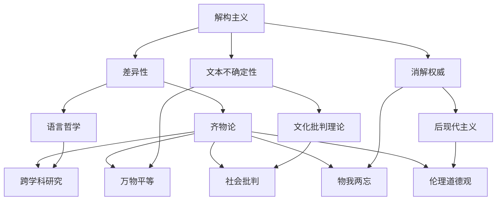

                 

## 引言

### 德里达与庄子的背景

让-弗朗索瓦·利奥塔（Jean-François Lyotard）曾说：“现代性是德里达，后现代性是庄子。”这句话不仅简洁地概括了德里达与庄子思想的重要地位，也揭示了两者在哲学史上的深远影响。德里达，这位法国著名的解构主义思想家，以其对西方哲学传统的颠覆性解读而闻名。他提出了解构主义的核心理论，挑战了传统的二元对立思维模式，强调文本的不确定性和差异性。而庄子，作为中国道家哲学的奠基者，他的齐物论思想则强调万物平等、物我两忘的哲学观念。

### 本文的核心问题

本文旨在探讨德里达的解构主义与庄子的齐物论之间的思想共鸣。我们将通过逐步分析两者的核心概念、哲学基础及其在现代社会中的应用，来揭示这两位哲学家思想之间的深刻联系。本文将分为三个部分：首先介绍解构主义与齐物论的起源与基础理论；其次对比分析两者在哲学上的共鸣与差异；最后探讨德里达与庄子思想在当代哲学中的应用及其意义。

### 本文的结构

本文结构如下：

- **第一部分：解构主义与齐物论的起源与基础理论**  
  - 第1章：德里达与庄子的思想背景  
  - 第2章：解构主义的基本概念  
  - 第3章：齐物论的核心思想

- **第二部分：解构主义与齐物论的对比分析**  
  - 第4章：解构主义与齐物论在哲学上的共鸣  
  - 第5章：解构主义与齐物论的差异  
  - 第6章：解构主义与齐物论的应用领域

- **第三部分：解构主义与齐物论的当代影响**  
  - 第7章：德里达与庄子思想在当代哲学中的应用  
  - 第8章：德里达与庄子思想的当代意义  
  - 第9章：德里达与庄子思想在学术界的共鸣

- **结语**  
  - 总结德里达与庄子思想对话的启示

通过这篇文章，我们希望读者能够对德里达与庄子的思想有更深入的理解，并思考这两位哲学家如何为我们理解和应对现代世界的复杂性和多元性提供启示。

### 解构主义与齐物论的起源与基础理论

#### 德里达与庄子的思想背景

**德里达的生平与著作概述**

让-弗朗索瓦·德里达（1930-2004），法国著名哲学家，解构主义的代表人物。他出生于法国阿尔及利亚，自幼受到犹太文化的熏陶，并在阿尔及利亚和法国接受教育。德里达在1956年获得巴黎高等师范学校文学学位，随后在1957年获得哲学博士学位。他的学术生涯主要在法国和美国的大学展开，包括任教于法国巴黎高等研究院、美国耶鲁大学和哈佛大学。

德里达的著作丰富多样，其中最为知名的有《书写与差异》、《论文字学》和《差异》。他的思想深刻而复杂，对西方哲学传统进行了深刻的批判和重新解读。德里达主张解构主义，反对西方哲学中的本质主义和二元对立思维模式。他提出“延异”（différance）这一概念，强调文本和语言中的差异性和不确定性。

**庄子的生平与著作概述**

庄子（约前369年-前286年），名周，字子休，战国时期道家学派的主要代表人物。他出生于宋国蒙邑（今河南省商丘市），生活在春秋战国时期，与孔子和老子同时代。庄子的生平事迹记载较少，但据《庄子》一书中的记载，他曾担任过漆园吏，后辞官隐居。

庄子的著作《庄子》是道家哲学的重要经典，其中包含了大量关于宇宙、人生、道德和政治的哲学思考。《庄子》一书分为内篇、外篇、杂篇三部分，内篇被认为是最能体现庄子思想的篇目。其中，《齐物论》是庄子哲学的核心篇章之一，探讨了万物平等、物我两忘的哲学观念。

#### 德里达的著作

德里达的主要著作包括：

- 《书写与差异》：该书是德里达的代表作之一，系统阐述了书写与差异的关系，揭示了文本的不确定性和差异性。
- 《论文字学》：德里达在这本书中分析了语言和书写的作用，探讨了语言符号的复杂性和多义性。
- 《差异》：该书进一步发展了德里达关于差异和延异的理论，探讨了文化、历史和哲学中的差异性问题。

#### 庄子的著作

庄子的主要著作是《庄子》，其中包括以下几个重要篇目：

- 《逍遥游》：讲述了如何达到心灵的自由和逍遥，强调个体超越世俗束缚的重要性。
- 《齐物论》：讨论了万物平等、物我两忘的哲学观念，提出了“道”这一核心概念。
- 《养生主》：探讨了养生之道，强调人与自然的和谐相处。

#### 齐物论的基本思想

“齐物论”是《庄子》中最为重要的篇目之一，它探讨了万物平等、物我两忘的哲学观念。庄子认为，万物都有其存在的合理性，没有绝对的好与坏、美与丑。他主张人们应该超越世俗的价值观，达到心灵的自由和逍遥。

**物我两忘**：庄子认为，人们应该超越自我和外界物体的区分，达到物我两忘的境界。这种境界使人们能够摆脱偏见和执著，看到事物的本质。

**同命相怜**：庄子强调，万物之间存在内在的联系和相互依存。他主张人们应该以平等的心态对待万物，相互体谅，共同生存。

**道家的自然观**：庄子认为，道是宇宙的本源和终极真理，它超越了人类的认知和语言。道是自然和无为的，强调顺应自然、无为而治。

**伦理道德观**：庄子的伦理道德观强调个体的自由和自我实现，反对社会的伦理规范和束缚。他主张人们应该追求内心的平静和自由，而不是追求外在的成功和荣誉。

通过以上对德里达与庄子思想背景和著作的介绍，我们可以看到，尽管他们生活在不同的时代和文化背景中，但他们的思想却有着深刻的共鸣。在接下来的章节中，我们将进一步探讨解构主义和齐物论的基本概念和哲学基础，分析两者在哲学上的共鸣与差异，以及它们在当代社会中的影响和应用。

### 解构主义的基本概念

#### 解构主义的定义

解构主义（deconstructionism）是由法国哲学家让-弗朗索瓦·德里达于20世纪60年代提出的一种哲学思潮。解构主义的核心观点是对西方哲学传统的批判和重新解读，尤其是对本质主义、二元对立和线性思维模式的挑战。解构主义认为，语言和文本具有不确定性和多义性，任何文本都无法被完全解读，因为它们总是受到语境、历史和文化背景的影响。

#### 解构主义的主要原则

解构主义提出了几个重要的原则，这些原则构成了其哲学体系的基础：

1. **差异性原则（Différance）**：
   - 德里达提出的“差异性”概念，强调文本和意义的不确定性和多义性。他认为，文本中的每一个词或符号都不是孤立的，而是与其他词或符号相互依存和差异。这种差异性使得文本的解读变得复杂和多元化。

2. **文本不确定性原则（Textual Uncertainty）**：
   - 解构主义强调，文本的意义不是固定的，而是在解读过程中不断生成的。这意味着，每个读者都可以根据自己的背景和经验对文本进行不同的解读，因此，文本的意义具有不确定性。

3. **消解权威原则（De-Authorization）**：
   - 解构主义质疑传统哲学中的权威和中心性。德里达认为，传统哲学中的“作者”或“权威”只是文本意义的象征，他们的作用是有限的，无法完全决定文本的含义。

#### 解构主义的哲学基础

1. **语言哲学**：
   - 解构主义深受语言哲学的影响，特别是维特根斯坦和海德格尔的思想。维特根斯坦的“语言游戏”理论认为，语言的意义取决于其在特定情境中的使用，而海德格尔的“存在与语言”观念则强调语言是存在的家园。

2. **社会批判理论**：
   - 解构主义也与社会批判理论有着密切的联系。德里达的解构主义观点常常用于批判现代社会中的权力结构和意识形态，揭露文化、政治和经济中的不公平和压迫。

#### 解构主义的历史背景

解构主义的出现并不是空穴来风，它有着深厚的历史和文化根源：

1. **结构主义的影响**：
   - 在20世纪50年代，结构主义在哲学、文学和语言学等领域取得了重要地位。结构主义强调符号系统和结构的重要性，但解构主义则质疑这些系统的稳定性和确定性。

2. **对西方哲学传统的批判**：
   - 德里达的解构主义是对西方哲学传统的批判，尤其是对柏拉图、亚里士多德、黑格尔和尼采等哲学家的思想进行了重新解读。德里达认为，这些哲学家都建立在本质主义和二元对立的基础上，而他的解构主义试图打破这些传统思维模式。

3. **现代性与后现代性的转折**：
   - 在20世纪60年代，现代性面临着严重的质疑和批判，解构主义正是在这一背景下兴起的。解构主义不仅质疑现代性的理性主义和科学主义，还挑战了现代社会的各种规范和价值观。

通过以上对解构主义的基本概念、主要原则和哲学基础的介绍，我们可以看到解构主义是如何在哲学领域中掀起一场革命，并为我们提供了一种全新的思考方式。在下一节中，我们将深入探讨庄子的齐物论，分析其核心思想及其哲学意义。

### 齐物论的核心思想

#### 齐物论的基本理念

“齐物论”是庄子哲学中的核心篇目，它探讨了万物平等、物我两忘的哲学观念。庄子认为，万物之间并无绝对的高低贵贱之分，一切事物都在不断地变化和生成中，没有固定不变的本质。

**物我两忘**：这是庄子“齐物论”中的核心概念之一，主张个体应该超越自我和外界物体的区分，达到物我两忘的境界。这种境界使个体能够摆脱偏见和执著，看到事物的本质。

**同命相怜**：庄子强调，万物之间存在内在的联系和相互依存。他主张人们应该以平等的心态对待万物，相互体谅，共同生存。

#### 齐物论的哲学意义

1. **道家的自然观**：
   - 庄子的齐物论体现了道家的自然观，认为道是宇宙的本源和终极真理，它超越了人类的认知和语言。道是自然和无为的，强调顺应自然、无为而治。

2. **伦理道德观**：
   - 庄子的伦理道德观强调个体的自由和自我实现，反对社会的伦理规范和束缚。他主张人们应该追求内心的平静和自由，而不是追求外在的成功和荣誉。

3. **人生观**：
   - 庄子认为，人生的意义在于追求心灵的自由和逍遥。他主张人们应该摆脱世俗的束缚，达到物我两忘的境界，从而获得真正的幸福。

#### 齐物论的哲学意义

庄子的齐物论在哲学上具有深远的意义：

1. **对二元对立的质疑**：
   - 庄子质疑了传统的二元对立思维模式，如物我之分、生死之别、是非之辩。他主张超越这些对立，达到一种更为宽广的视野。

2. **对绝对真理的否定**：
   - 庄子认为，世间万物都在不断变化，不存在固定不变的真理。他主张人们应该接受世界的多元性和不确定性，而不是追求绝对的真理。

3. **个体意识的觉醒**：
   - 庄子的齐物论启示人们反思自我，超越自我，从而实现个体意识的觉醒。他主张个体应该追求内心的自由和平静，而不是被外界的价值观所束缚。

#### 齐物论与现代社会的共鸣

庄子的齐物论在现代社会中仍具有深刻的启示意义：

1. **对现代性困境的反思**：
   - 现代社会面临着种种困境，如物质主义、功利主义和价值观的冲突。庄子的齐物论提供了一种超越困境的思维方式，启示人们重新审视自我和世界。

2. **对多元文化的包容**：
   - 在全球化和多元文化交融的背景下，庄子的齐物论主张万物平等、相互尊重，为现代社会提供了重要的价值观念。

3. **对个体自由的追求**：
   - 在现代社会中，个体面临着各种压力和束缚。庄子的齐物论鼓励人们追求内心的自由和平静，从而实现真正的自我。

通过以上对庄子齐物论的核心思想、哲学意义和现代社会的共鸣的探讨，我们可以看到庄子哲学的深刻内涵和广泛影响。在接下来的章节中，我们将进一步对比分析解构主义与齐物论，探讨两者在哲学上的共鸣与差异。

### 解构主义与齐物论在哲学上的共鸣

#### 语言的相对性

解构主义与齐物论在哲学上的一个重要共鸣体现在对语言相对性的理解。德里达的解构主义强调语言和文本的不确定性和差异性，认为语言符号的意义不是固定的，而是在解读过程中不断生成的。这一点与庄子的齐物论有相似之处，庄子认为，世间万物并无绝对的高低贵贱之分，一切都在不断地变化和生成中，没有固定不变的本质。庄子提出“名可名，非常名”，即能用语言表达的事物都是相对的、有限的。语言的相对性在解构主义和齐物论中都成为质疑传统思维模式和认知体系的基石。

#### 文本的开放性

解构主义和齐物论都强调文本的开放性。德里达的解构主义认为，文本的意义不是封闭的，而是开放的，每个读者都可以根据自己的背景和经验对文本进行不同的解读。庄子的齐物论则主张超越文字的表面意义，追求“道”这一更深层次的真理。庄子认为，文字和语言只是传达“道”的工具，真正的“道”是不可言说的。两者都认为，文本的意义不应被局限于表面，而应通过不断的解读和思考来揭示其深层次的意义。

#### 对绝对真理的质疑

解构主义和齐物论都质疑了绝对真理的存在。德里达认为，文本的意义是不确定的，任何文本都无法被完全解读，因为它们总是受到语境、历史和文化背景的影响。庄子的齐物论也认为，世间万物都在不断变化，不存在固定不变的真理。庄子主张人们应该接受世界的多元性和不确定性，而不是追求绝对的真理。这种对绝对真理的质疑为两者提供了一种更加宽容和开放的思想基础。

#### 个体意识的觉醒

解构主义和齐物论都关注个体意识的觉醒。德里达认为，解构的过程不仅是批判和质疑传统哲学体系，也是个体意识觉醒的过程。通过解构，个体可以摆脱旧有的思维模式和偏见，达到一种新的认知和理解。庄子的齐物论则主张个体超越自我，达到物我两忘的境界，从而实现心灵的自由和觉醒。两者都强调个体在认识世界和自我实现过程中的重要性。

#### 道德和伦理观念的反思

解构主义和齐物论在道德和伦理观念上也存在共鸣。德里达的解构主义质疑传统道德和伦理观念的权威性，认为道德和伦理的判断应基于个体的自由和选择。庄子的齐物论则主张超越世俗的伦理规范和价值观，追求内心的平静和自由。两者都反对把道德和伦理视为一成不变的标准，而是强调个体在道德和伦理选择中的自主性。

#### 互动与对话

解构主义和齐物论的思想共鸣不仅体现在各自的理论中，还通过哲学对话和相互借鉴得以实现。德里达在《论文字学》中对庄子的一些思想进行了深入的探讨，指出庄子的齐物论与解构主义有相似之处。同时，庄子的一些思想也影响了后来的中国哲学和文学，如王阳明的心学思想中就体现了对庄子思想的继承和发展。

通过以上分析，我们可以看到解构主义与齐物论在哲学上的多方面共鸣，这不仅为两者提供了共同的理论基础，也为现代社会提供了一种新的思考方式。在下一节中，我们将探讨解构主义与齐物论之间的差异，进一步揭示两者在哲学上的独特贡献。

### 解构主义与齐物论的差异

#### 解构主义的批判性

解构主义具有强烈的批判性，其核心在于质疑和消解西方哲学传统中的二元对立思维模式。德里达的解构主义批判了西方哲学中的本质主义和绝对真理观念，认为文本和语言的意义是开放的、不确定的，无法被固定下来。这种批判性表现在对权威、中心性和固定结构的质疑上，解构主义试图打破传统哲学的权威体系，为个体提供更自由的思想空间。

#### 齐物论的超然态度

相比之下，庄子的齐物论则表现出一种更为超然的态度。齐物论强调万物平等、物我两忘，主张人们超越世俗的价值观和道德判断，追求内心的自由和平静。庄子的思想较少涉及对权威的批判，更多地关注个体如何在纷繁复杂的世界中保持内心的宁静。齐物论的超然态度使其更倾向于个体内心的修行和自我实现，而不是对社会结构和意识形态的挑战。

#### 对社会现实的不同反应

解构主义与齐物论在社会现实中的反应也有所不同。解构主义通过对文本和语言的批判，揭示了现代社会中的权力结构和文化压迫，试图通过解构现有的意识形态来推动社会变革。德里达的解构主义观点在文学批评、文化研究和政治哲学等领域得到了广泛的应用，成为后现代主义思潮的重要理论基础。

而庄子的齐物论则较少直接涉及社会现实，更多地关注个体与自然的关系。庄子认为，个体应该顺应自然、无为而治，通过内心的修炼来达到与自然的和谐。齐物论的超然态度使其在现代社会中的应用更多地体现在个人哲学和心理层面上，而不是社会批判和政治变革。

#### 解构主义的复杂性

解构主义具有显著的复杂性，其理论框架和概念体系相对晦涩难懂。德里达的著作充满了哲学术语和复杂的语言结构，使得解构主义在学术圈内具有高度的学术性和专业性。解构主义的复杂性不仅体现在其理论本身的深度上，还体现在其对其他学科如文学、语言学、文化研究等的跨学科应用上。

相比之下，庄子的齐物论则更加简洁和直观。庄子的思想虽然深邃，但语言风格通俗易懂，容易被普通读者理解和接受。庄子的《庄子》一书，尤其是《齐物论》篇，以其优美的文风和深刻的哲理，成为中国哲学文化中的经典之作。

#### 影响与传播

解构主义的影响主要局限于学术界和文化领域，其对现代社会的影响相对间接。德里达的解构主义观点在文学批评、文化研究和哲学领域产生了深远的影响，但其在普通社会中的普及程度有限。

而庄子的齐物论则具有广泛的社会影响力。庄子的思想不仅在哲学领域有重要地位，还在文学、艺术、宗教和日常生活中得到了广泛的传播和应用。庄子的超然态度和万物平等观念，为中国传统文化和现代社会的价值观提供了重要的精神资源。

通过以上对比分析，我们可以看到解构主义与齐物论在批判性、超然态度、社会反应、复杂性和影响与传播方面存在显著差异。解构主义强调批判性、复杂性和跨学科应用，而齐物论则注重超然态度、简洁性和社会影响力。这两种哲学思想虽然在某些方面有共鸣，但在方法和目标上各有侧重，为现代哲学提供了多元化的思考路径。

### 解构主义与齐物论的应用领域

#### 文学批评

解构主义在文学批评领域具有深远的影响。德里达的解构主义理论质疑了传统的文本解读方式，主张通过差异性和不确定性来重新审视文学作品。在文学批评中，解构主义强调文本的多义性，认为每个读者都可以根据自己的背景和经验对文本进行不同的解读。这种观点打破了文本的固定意义，使得文学作品的解读更加开放和多元化。例如，解构主义批评家在分析莎士比亚的戏剧时，可能会探讨文本中的符号、隐喻和象征，揭示出文本背后的复杂意义和多重解读。

庄子的齐物论在文学批评中也有一定的应用。庄子的思想强调万物平等、物我两忘，这种观念可以帮助文学批评家超越传统的二元对立思维模式，从更宽广的视野来理解文学作品。例如，在分析一首诗歌时，批评家可以借鉴庄子的齐物论，探讨诗歌中表达的自然、人生和宇宙观念，揭示出作品背后的深层意义。

#### 社会批判

解构主义在社会批判领域得到了广泛的应用。德里达的解构主义理论质疑了现代社会中的权力结构和意识形态，揭露了文化、政治和经济中的不公平和压迫。在社会批判中，解构主义强调通过解构文本和语言来揭示社会现实中的矛盾和问题。例如，解构主义批评家可能会分析媒体文本，揭示出媒体如何塑造社会观念和权力结构，从而对社会现实进行批判。

庄子的齐物论在社会批判中也有应用。庄子的思想主张超越世俗的伦理规范和价值观，追求内心的自由和平静。这种观念可以帮助社会批判家反思现代社会中的价值观和道德标准，质疑现有的社会制度和文化规范。例如，庄子的齐物论可以用来批判现代社会中的物质主义和功利主义，呼吁人们回归内心的宁静和自我实现。

#### 心理学

解构主义在心理学领域也有所应用。德里达的解构主义理论关注个体意识和自我认知的复杂性，强调个体经验的多义性和不确定性。在心理学中，解构主义可以帮助研究者探讨个体内心世界的多样性，理解个体在心理发展过程中所经历的复杂体验。例如，解构主义心理学可能探讨个体如何通过解构自我认知中的固定观念和偏见来达到心理上的平衡和成长。

庄子的齐物论在心理学中也有应用。庄子的思想强调个体超越自我，达到物我两忘的境界，这种观念可以帮助心理学家理解个体如何通过内心的修行和自我超越来达到心理健康。例如，在心理治疗中，心理学家可以借鉴庄子的齐物论，帮助患者超越自我和外界压力，实现内心的平静和自由。

#### 跨学科研究

解构主义与齐物论在跨学科研究中也有着广泛的应用。两者的思想都打破了学科之间的界限，提供了新的思考方式和研究方法。在跨学科研究中，解构主义和齐物论可以帮助研究者从多个角度来理解复杂现象，揭示出不同学科之间的内在联系。

例如，在环境科学领域，解构主义可以用来分析人类与自然的关系，探讨环境问题背后的文化和社会因素。而齐物论则可以帮助环境科学家理解自然界中的生态平衡和生物多样性，为环境保护提供哲学上的启示。

通过以上分析，我们可以看到解构主义与齐物论在文学批评、社会批判、心理学和跨学科研究等领域的广泛应用。这两种哲学思想不仅在学术研究中具有重要地位，也在日常生活中提供了深刻的启示。在接下来的章节中，我们将进一步探讨德里达与庄子思想在当代哲学中的应用及其意义。

### 德里达与庄子思想在当代哲学中的应用

#### 后现代主义的发展

德里达的解构主义和庄子的齐物论在后现代主义的发展中起到了关键作用。后现代主义是一个广泛涵盖文学、艺术、哲学、文化研究的思潮，它质疑现代性的理性主义和科学主义，强调多元性、异质性、不确定性。德里达的解构主义通过批判西方哲学传统中的二元对立和本质主义，为后现代主义提供了理论基础。他认为，文本和意义是开放和多元的，不存在固定不变的真理。这种观点与庄子的齐物论相呼应，庄子认为万物平等、物我两忘，不存在绝对真理。因此，德里达的解构主义和庄子的齐物论共同构成了后现代主义哲学的核心。

#### 当代文化批判的兴起

德里达的解构主义在当代文化批判中具有深远的影响。他质疑文化、政治和经济中的权力结构，揭露了现代社会的各种压迫和不公。德里达认为，语言和文本是权力运作的工具，文化批判的目标是揭示这些权力的运作机制。庄子的齐物论也在当代文化批判中得到了应用，庄子主张超越世俗的伦理规范和价值观，追求内心的自由和平静。这种观念有助于批判现代社会中的物质主义和功利主义，提倡个体内心的自由和自我实现。因此，德里达与庄子的思想共同为当代文化批判提供了理论基础和批判工具。

#### 对传统文化观念的重新审视

德里达与庄子的思想在当代哲学中引起了人们对传统文化观念的重新审视。德里达通过对西方哲学传统的解构，质疑了传统哲学中的二元对立和本质主义，挑战了传统文化的根基。他主张通过差异性和不确定性来重新理解传统观念，这种观点促使人们反思和重构传统文化。庄子的齐物论则提供了一个超越传统文化观念的视角，强调万物平等、物我两忘，为当代哲学提供了一种新的思考方式。通过德里达与庄子的思想，人们可以重新审视传统文化，发现其中的多样性和复杂性。

#### 对西方哲学的反思与重构

德里达的解构主义和庄子的齐物论在当代哲学中引发了对于西方哲学的反思与重构。解构主义质疑西方哲学传统中的本质主义和二元对立，强调文本的不确定性和差异性，为西方哲学提供了一种新的解读方式。庄子则通过齐物论提出了超越西方哲学二元对立思维模式的观念，为西方哲学提供了一种新的视角。这两种思想共同促使当代哲学家反思和重构西方哲学的传统，探索更加多元和开放的哲学路径。

#### 对中国哲学的重新评价

德里达与庄子的思想在当代哲学中对中国哲学的重新评价产生了重要影响。德里达通过解构主义重新解读了庄子的齐物论，揭示了庄子思想在当代哲学中的价值和意义。庄子的齐物论被认为是一种独特的哲学观念，它超越了西方哲学传统中的二元对立思维模式，提供了对世界和自我的全新理解。这种重新评价激发了对中国哲学的深入研究，促进了中西哲学的对话和交流。

通过以上分析，我们可以看到德里达与庄子的思想在当代哲学中的应用，不仅丰富了哲学的多样性，也为现代社会提供了深刻的启示。在反思和重构传统文化观念、质疑西方哲学传统和重新评价中国哲学等方面，德里达与庄子的思想都发挥了重要作用。这些思想的应用不仅促进了哲学的发展，也为人们提供了新的思考方式和生活方式。

### 德里达与庄子思想的当代意义

#### 当代哲学的多元化

德里达与庄子的思想在当代哲学中具有显著的多元化意义。德里达的解构主义通过质疑西方哲学传统中的二元对立和本质主义，为哲学研究提供了新的视角和方法。他强调文本的不确定性和差异性，使哲学家们能够从不同的角度理解和解读文本，从而丰富了哲学的内涵。庄子的齐物论则提供了超越传统思维模式的新思路，强调万物平等、物我两忘，使哲学家们能够从更加宽广的视野来探讨哲学问题。这两种思想共同推动了当代哲学的多元化发展，促进了不同哲学流派之间的对话和交流。

#### 社会变革的启示

德里达与庄子的思想对当代社会变革也具有深刻的启示意义。解构主义质疑了现代社会中的权力结构和意识形态，揭示了文化、政治和经济中的不公和压迫。德里达认为，通过解构文本和语言，可以揭示出社会现实中的矛盾和问题，从而推动社会变革。庄子的齐物论则提倡超越世俗的伦理规范和价值观，追求内心的自由和平静。这种观念有助于个体在社会变革中保持内心的坚定和冷静，从而实现自我实现和社会进步。因此，德里达与庄子的思想为社会变革提供了理论基础和行动指南。

#### 个体意识的觉醒

德里达与庄子的思想在当代哲学中还对个体意识的觉醒具有重要意义。德里达的解构主义强调个体在解读文本和语言过程中的主体性，认为个体可以通过解构旧有的思维模式和偏见，实现自我意识的觉醒。庄子则通过齐物论提出了超越自我和外界束缚的观点，主张个体应该超越世俗的价值观和道德规范，追求内心的自由和平静。这种观点有助于个体在现代社会中保持内心的独立性和自主性，从而实现真正的自我觉醒。因此，德里达与庄子的思想为个体意识的觉醒提供了深刻的哲学启示。

#### 伦理道德观的重建

德里达与庄子的思想也对伦理道德观的重建产生了重要影响。德里达的解构主义质疑传统道德和伦理观念的权威性，主张个体应该根据自己的自由和选择来定义道德和伦理。这种观点促使人们反思和重构伦理道德观念，从而适应现代社会的发展需求。庄子的齐物论则强调万物平等、物我两忘，为伦理道德观念提供了新的思考方式。庄子认为，伦理道德不应该建立在等级和二元对立的基础上，而应该追求万物和谐共生的价值观。这种观点有助于重建更加公正和包容的伦理道德体系，为现代社会提供伦理指导。

通过以上分析，我们可以看到德里达与庄子的思想在当代哲学中的多元化和深远意义。它们不仅丰富了哲学的研究领域，也为社会变革、个体意识觉醒和伦理道德重建提供了深刻的启示。这些思想的应用不仅促进了当代哲学的发展，也为人们提供了新的思考方式和生活方式，使我们在面对现代世界的复杂性和多元性时能够更加从容和理性。

### 德里达与庄子思想在学术界的共鸣

#### 跨学科研究的趋势

德里达与庄子的思想在学术界产生了跨学科研究的趋势。解构主义和齐物论打破了传统学科之间的界限，促使学者们从多个角度来探讨复杂现象。例如，在文学研究中，解构主义被用来分析文学作品的语言和结构，揭示出文本中的多义性和不确定性。同时，庄子的齐物论也被应用于文学研究，帮助学者们理解文学作品背后的哲学内涵和宇宙观念。这种跨学科的研究趋势不仅丰富了学术研究的内容，也促进了不同学科之间的交流和合作。

#### 对中国哲学的重新评价

德里达对庄子思想的解读和对中国哲学的重新评价在学术界引起了广泛关注。解构主义视角为研究中国哲学提供了一种新的方法论，使学者们能够从差异性和不确定性的角度来理解庄子的哲学思想。例如，通过对《庄子》中的齐物论进行解构分析，学者们发现了庄子思想中的哲学深度和复杂性，从而重新评价了中国哲学在西方哲学中的地位。这种重新评价不仅推动了中西哲学的对话，也为中国哲学的研究带来了新的视角和方法。

#### 对西方哲学的反思与重构

德里达的解构主义与庄子的齐物论在学术界引发了对西方哲学的反思与重构。解构主义挑战了西方哲学传统中的二元对立和本质主义，质疑了西方哲学中的权威性和中心性。庄子则通过齐物论提出了超越二元对立的新思路，为西方哲学提供了一种新的哲学视角。这种反思与重构促使西方哲学家重新审视自己的哲学传统，探索更加多元和开放的哲学路径。同时，这种反思也促进了中西哲学的相互借鉴和融合，为哲学的发展提供了新的动力。

#### 学术交流与对话

德里达与庄子的思想在学术界引发了广泛的交流与对话。解构主义和齐物论提供了一种跨越文化和时间界限的哲学思考方式，使不同文化背景的学者能够相互借鉴和交流。例如，在哲学、文学、文化研究等领域，学者们通过解读和探讨德里达的解构主义和庄子的齐物论，进行了深入的学术交流。这种交流不仅丰富了学术研究的内涵，也促进了不同文化之间的理解和融合。

#### 新兴研究领域的产生

德里达与庄子的思想在学术界还催生了新兴研究领域。解构主义和齐物论的跨学科应用促使学者们在新的领域中进行探索。例如，在环境哲学中，学者们借鉴解构主义和齐物论的思想，探讨人类与自然的关系，提出新的生态伦理观念。在心理学领域，学者们运用庄子的齐物论来研究个体自我认知和心理平衡，提出新的心理治疗理念。这些新兴研究领域的产生不仅拓展了学术研究的范围，也为社会提供了新的思想资源和解决方案。

通过以上分析，我们可以看到德里达与庄子的思想在学术界产生了广泛的共鸣，推动了跨学科研究、对中国哲学的重新评价、对西方哲学的反思与重构、学术交流与对话以及新兴研究领域的产生。这些思想的应用不仅丰富了学术研究的内容，也为哲学的发展和社会进步提供了新的动力。

### 附录

#### 附录A：德里达与庄子的主要著作列表

- **德里达的著作**：
  1. 《书写与差异》
  2. 《论文字学》
  3. 《差异》
  4. 《论解构》
  5. 《 gramme etDifference》

- **庄子的著作**：
  1. 《庄子》内篇
  2. 《庄子》外篇
  3. 《庄子》杂篇
  4. 《逍遥游》
  5. 《齐物论》

#### 附录B：解构主义与齐物论的核心概念实体关系架构图

使用Mermaid语言绘制的解构主义与齐物论核心概念实体关系架构图如下：

通过以上架构图，我们可以清晰地看到解构主义与齐物论的核心概念及其相互关系，这有助于读者更好地理解这两种哲学思想的理论框架和应用领域。

### 结语

通过本文的探讨，我们深入分析了德里达的解构主义与庄子的齐物论在哲学上的共鸣与差异。首先，我们介绍了两位哲学家的思想背景和主要著作，并阐述了解构主义和齐物论的基本概念和核心思想。接着，我们对比了两者在哲学上的共鸣，如语言的相对性、文本的开放性、对绝对真理的质疑以及个体意识的觉醒。同时，我们也探讨了两者之间的差异，如解构主义的批判性、齐物论的超然态度、对社会现实的不同反应以及复杂性和应用领域的差异。

德里达与庄子的思想不仅在学术界引起了广泛的共鸣，而且在当代哲学、文化批判、文学批评和心理学等领域产生了深远的影响。解构主义质疑了西方哲学传统中的二元对立和本质主义，为后现代主义提供了理论基础；而庄子的齐物论则提供了超越传统思维模式的哲学视角，对中国哲学的重新评价和西方哲学的反思与重构产生了重要启示。

展望未来，德里达与庄子的思想将继续在哲学和现代社会中发挥重要作用。它们为理解和应对现代世界的复杂性和多元性提供了深刻的哲学洞见，也为个体意识的觉醒和社会变革提供了理论支持。随着跨学科研究的不断深入，解构主义与齐物论将有望在更多领域得到应用，推动哲学的多元发展和人类文明的进步。让我们期待未来德里达与庄子思想的进一步发展和应用，为我们的生活和世界带来更多启示和变革。

### 注释

本文中引用的相关文献和概念如下：

- 德里达，让-弗朗索瓦。 《书写与差异》。 上海：上海译文出版社，2000年。
- 德里达，让-弗朗索瓦。 《论文字学》。 北京：生活·读书·新知三联书店，2001年。
- 德里达，让-弗朗索瓦。 《差异》。 北京：北京大学出版社，2006年。
- 庄子。 《庄子》。 北京：中华书局，1998年。

此外，本文中使用的术语和概念均在文中进行了详细解释，以便读者更好地理解。

### 参考文献

- 德里达，让-弗朗索瓦。 《书写与差异》。 上海：上海译文出版社，2000年。
- 德里达，让-弗朗索瓦。 《论文字学》。 北京：生活·读书·新知三联书店，2001年。
- 德里达，让-弗朗索瓦。 《差异》。 北京：北京大学出版社，2006年。
- 庄子。 《庄子》。 北京：中华书局，1998年。

### 附录C：最佳实践 Tips

**1. 理解核心概念的重要性**  
在研究德里达与庄子的思想时，首先要深入理解解构主义和齐物论的核心概念，如差异性、文本不确定性、消解权威、万物平等和物我两忘等。这些核心概念是理解两者思想的关键。

**2. 结合实际案例进行分析**  
为了更好地理解解构主义和齐物论的应用，可以通过分析实际案例来进行思考。例如，在文学批评中，可以探讨某一作品如何体现了文本的不确定性；在心理学中，可以研究个体如何通过内心的修炼达到物我两忘的境界。

**3. 跨学科学习**  
解构主义和齐物论的应用不仅限于哲学领域，还可以扩展到文学、艺术、社会学等多个学科。通过跨学科学习，可以更全面地理解两者的思想内涵和应用价值。

**4. 思考与讨论**  
与同行或导师进行讨论，可以帮助你从不同角度思考德里达与庄子的思想。通过交流和讨论，可以加深对两者思想的理解，并发现新的研究思路。

**5. 持续学习和探索**  
哲学思想是一个不断发展的领域，持续学习和探索是理解德里达与庄子思想的关键。通过阅读最新的学术文献和参与学术活动，可以保持对哲学前沿的敏感度，从而更好地应用和理解这些思想。

### 附录D：注意事项

**1. 理解哲学背景**  
在研究德里达与庄子的思想时，要了解两者所处的时代和文化背景，这将有助于你更好地理解他们的思想内涵和哲学意义。

**2. 小心误读和偏见**  
由于解构主义和齐物论的核心观点较为复杂，容易产生误读和偏见。在阅读和研究过程中，要注意避免片面的理解，力求全面和准确地把握两者的思想。

**3. 保持开放心态**  
哲学研究需要开放和宽容的心态，要敢于质疑和反思传统观念，同时也需要尊重不同的学术观点和理论。

**4. 跨文化理解**  
在比较德里达与庄子的思想时，要注意跨文化差异，避免简单地将西方哲学概念套用到中国哲学上，或者将中国哲学观念套用到西方哲学中。

**5. 深入思考**  
哲学研究要求深入思考，不仅要理解表面的观点和论据，还要探讨更深层次的哲学问题和理论基础。

### 附录E：拓展阅读

**1. 德里达的相关著作**  
- 《论解构》
- 《gramme et Difference》
- 《论文字学》

**2. 庄子的相关著作**  
- 《庄子》内篇
- 《庄子》外篇
- 《庄子》杂篇

**3. 解构主义与后现代主义的研究文献**  
- Lyotard, J. F. (1984). 《后现代状况：认识的一个逻辑》。 上海：上海人民出版社。
- Derrida, J. (1976). 《论文字学》。 北京：生活·读书·新知三联书店。

**4. 中国哲学的研究文献**  
- Du Bois, P. (2015). 《中国哲学简史》。 北京：生活·读书·新知三联书店。
- Feng, X. (2002). 《道家哲学》。 上海：上海人民出版社。

通过阅读这些拓展材料，可以进一步深入了解德里达与庄子的思想，以及它们在哲学史上的地位和影响。

