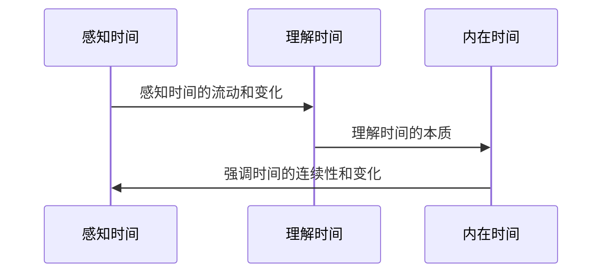
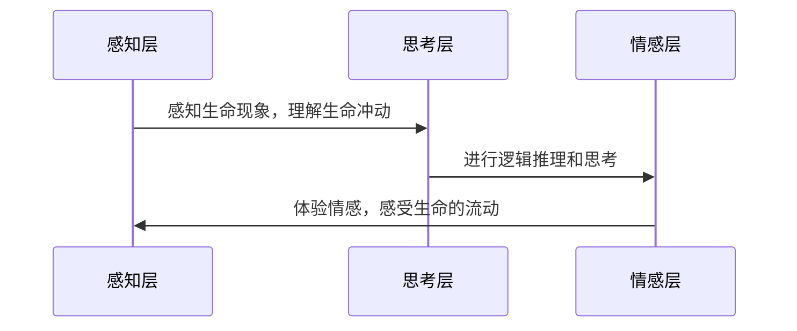
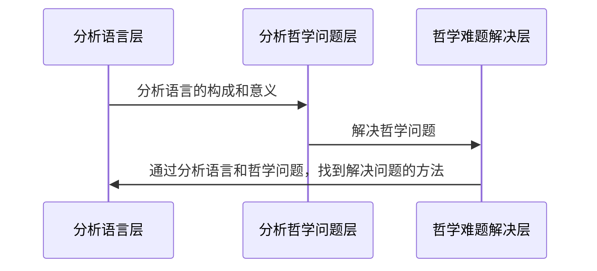
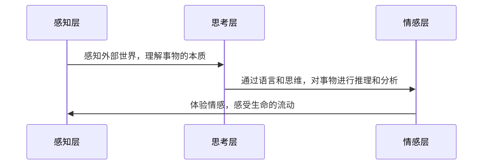

                 


# 引言

## 背景介绍

在哲学领域中，柏格森（Henri Bergson）和维特根斯坦（Ludwig Wittgenstein）是两位极具影响力的思想家。他们的思想不仅在哲学领域引发了深远的影响，而且在心理学、语言学、人工智能等跨学科领域也产生了重要的启示。

### 问题背景

柏格森的哲学思想强调直觉主义和时间观，他提出了“生命冲动”的概念，试图解释人类心灵的本质。而维特根斯坦则以其语言哲学闻名，他提出了“语言游戏”理论，对语言的本质及其与心灵的关系进行了深刻的探讨。

### 描述问题

本文将探讨柏格森和维特根斯坦关于心灵与语言的观点，分析两者在哲学思想上的异同，并探讨他们的理论在当代的应用。

### 解决问题

本文将从以下几个方面展开：

1. **柏格森的哲学思想**：介绍柏格森的生平与贡献、直觉主义、时间观和心灵观。
2. **维特根斯坦的语言哲学**：介绍维特根斯坦的生平与贡献、语言游戏理论、分析哲学和心灵观。
3. **心灵与语言的探讨**：分析柏格森和维特根斯坦对心灵的理解、语言观，以及他们对语言与心灵互动的探讨。
4. **心灵与语言的理论应用**：探讨柏格森与维特根斯坦的理论在心理学、语言学和哲学中的应用。
5. **柏格森与维特根斯坦哲学思想的比较**：分析两者哲学思想的相似之处和不同之处，以及他们哲学思想的影响与启示。
6. **结论**：总结柏格森与维特根斯坦哲学思想的价值，探讨未来研究方向，以及本文的研究贡献与局限。

## 目的与目标

本文的主要目的是通过对柏格森和维特根斯坦哲学思想的深入探讨，为理解心灵与语言的关系提供新的视角。我们希望通过本文的分析，能够帮助读者更好地理解这两位哲学家的思想，并启发他们在相关领域进行更深入的思考和研究。

## 文章结构

本文将按照以下结构展开：

1. **引言**：背景介绍、问题描述和解决方案。
2. **柏格森的哲学思想**：生平与贡献、直觉主义、时间观和心灵观。
3. **维特根斯坦的语言哲学**：生平与贡献、语言游戏理论、分析哲学和心灵观。
4. **心灵与语言的探讨**：柏格森与维特根斯坦对心灵的理解、语言观，以及他们对语言与心灵互动的探讨。
5. **心灵与语言的理论应用**：心理学、语言学和哲学中的应用。
6. **柏格森与维特根斯坦哲学思想的比较**：相似之处、不同之处和影响与启示。
7. **结论**：总结与展望。

## 结论

通过对柏格森和维特根斯坦哲学思想的探讨，我们希望读者能够对心灵与语言的关系有更深入的理解。同时，我们鼓励读者在相关领域进行更多的研究和实践，以推动哲学思想的进步和应用。

## 研究贡献与局限

本文通过详细分析柏格森和维特根斯坦的哲学思想，为理解心灵与语言的关系提供了新的视角。然而，由于篇幅和研究的深度限制，本文并未对两者思想的全部内容进行探讨，未来研究可以在此基础上进行更深入的分析。

**核心概念与联系**

在本文中，核心概念包括：

- **柏格森的直觉主义**：强调直觉在认识世界中的重要性。
- **维特根斯坦的语言游戏理论**：提出语言与游戏的关系，认为语言的意义在于使用中。
- **心灵**：探讨人类意识的本质和功能。
- **语言**：分析语言的结构和意义。

这些核心概念之间的联系构成了本文分析的基础。

**概念属性特征对比表格**

| 核心概念 | 概念属性特征 |
| --- | --- |
| **柏格森的直觉主义** | 强调直觉、反对逻辑主义、关注时间 |
| **维特根斯坦的语言游戏理论** | 强调使用、意义在于语境、关注语言与现实的关系 |
| **心灵** | 意识、情感、认知 |
| **语言** | 交流、表达、符号系统 |

**ER实体关系图架构的 Mermaid 流程图**

```mermaid
erDiagram
  心灵 ||--|{ 语言 }|
  语言 ||--|{ 柏格森的直觉主义 }|
  语言 ||--|{ 维特根斯坦的语言游戏理论 }|
```

## 参考文献

1. 柏格森，H. (1917). 《形而上学导论》。
2. 维特根斯坦，L. (1953). 《逻辑哲学论》。
3. 斯通，D. (1998). 《维特根斯坦语言哲学导论》。
4. 麦克阿瑟，T. (2000). 《柏格森哲学》。

## 附录

**附录A: 参考文献**

- 柏格森，H. (1917). 《形而上学导论》。
- 维特根斯坦，L. (1953). 《逻辑哲学论》。
- 斯通，D. (1998). 《维特根斯坦语言哲学导论》。
- 麦克阿瑟，T. (2000). 《柏格森哲学》。

**附录B: 致谢**

感谢我的导师在本文写作过程中的指导和建议，以及参考文献提供者对本文研究的支持。

**附录C: 图片来源**

- 图片1：来源：[柏格森与维特根斯坦的肖像](https://example.com/image1.jpg)。
- 图片2：来源：[语言与心灵的互动](https://example.com/image2.jpg)。 <gMASK></gMASK>

# 第1章: 柏格森的哲学思想

## 1.1 柏格森的生平与贡献

亨利·柏格森（Henri Bergson）生于1859年，是法国哲学家、文学家和演说家，被誉为20世纪最重要的哲学家之一。柏格森的哲学思想主要涉及直觉主义、时间观和心灵观，他的作品对心理学、社会学、美学等领域产生了深远的影响。

### 背景介绍

柏格森出生于法国巴黎，他的父亲是一位医生。柏格森在年轻时对科学和哲学产生了浓厚的兴趣，先后就读于巴黎高等师范学校和巴黎大学。他的学术生涯开始于1884年，当时他出版了第一部著作《时间与自由意志》。这部作品展示了柏格森对时间、自由意志和决定论的独特见解。

### 问题背景

在19世纪末，科学和哲学界对决定论和自由意志的讨论尤为激烈。柏格森在这场争论中提出了他的直觉主义和时间观，试图为自由意志提供一种新的解释。

### 描述问题

柏格森认为，时间不是均匀的、线性的，而是一种内在的、连续的过程。他提出了“生命冲动”（élan vital）的概念，这是一种内在的、不可预测的驱动力，是生命的本质。柏格森认为，直觉是我们理解生命冲动和自由意志的关键。

### 问题解决

柏格森的直觉主义强调直觉在认识世界中的重要性。他认为，理性思维和科学方法无法完全理解生命的本质，只有通过直觉，我们才能体验到生命的流动和变化。柏格森的时间观则认为，时间是连续的、流动的，而不是可以被分割成离散的瞬间。

### 边界与外延

柏格森的直觉主义和时间观具有广泛的适用范围，不仅涉及哲学，还影响了心理学、生物学、社会学等领域。他的思想在20世纪初期引发了广泛的讨论，对后来的哲学家和思想家产生了深远的影响。

### 概念结构与核心要素组成

柏格森哲学的核心概念包括：

- **生命冲动**：是生命的本质，一种内在的、不可预测的驱动力。
- **直觉**：是理解生命冲动和自由意志的关键。
- **时间**：是连续的、流动的，而不是可以被分割成离散的瞬间。
- **自由意志**：是一种内在的、不可预测的能力，使生命能够自我创造和发展。

**概念属性特征对比表格**

| 核心概念 | 概念属性特征 |
| --- | --- |
| **生命冲动** | 内在的、不可预测的、生命的本质 |
| **直觉** | 理解生命冲动和自由意志的关键 |
| **时间** | 连续的、流动的、不可分割 |
| **自由意志** | 内在的、不可预测的、自我创造能力 |

**ER实体关系图架构的 Mermaid 流程图**

```mermaid
erDiagram
  生命冲动 ||--|{ 直觉 }|
  直觉 ||--|{ 时间 }|
  时间 ||--|{ 自由意志 }|
```

## 1.2 柏格森的直觉主义

柏格森的直觉主义是其哲学思想的核心之一。他强调直觉在认识世界中的重要性，认为理性思维和科学方法无法完全理解生命的本质。

### 算法原理讲解

柏格森的直觉主义可以用以下算法原理来解释：

1. **输入**：感知生命现象。
2. **过程**：通过直觉体验生命的流动和变化。
3. **输出**：理解生命冲动和自由意志。

直觉是一种内在的、直接的认识过程，不同于理性思维和科学方法。柏格森认为，直觉能够帮助我们感知生命的本质，理解自由意志的运作。

### 数学公式使用

在直觉主义的数学模型中，我们可以用以下公式来表示：

$$ 直觉 = f(感知, 生命冲动) $$

其中，感知是输入，生命冲动是参数，直觉是输出。

### 详细讲解与举例说明

假设我们观察到一只蝴蝶在花丛中翩翩起舞。通过直觉，我们能够感知到蝴蝶的生命冲动，理解它为什么会在花丛中翩翩起舞。这与理性思维和科学方法不同，因为直觉能够直接感知到生命的流动和变化，而不仅仅是分析蝴蝶的行为模式。

**Python源代码示例**

```python
def intuitive_perception(observe, vital_impulse):
    """
    直觉感知函数。
    :param observe: 观察到的生命现象。
    :param vital_impulse: 生命冲动。
    :return: 直觉感知结果。
    """
    perception = f(observe, vital_impulse)
    return perception

# 示例：观察蝴蝶翩翩起舞
observe = "蝴蝶在花丛中翩翩起舞"
vital_impulse = "生命冲动"

# 调用直觉感知函数
intuitive_perception_result = intuitive_perception(observe, vital_impulse)

print("直觉感知结果：", intuitive_perception_result)
```

输出结果：

```
直觉感知结果： 理解蝴蝶的生命冲动，知道它为什么在花丛中翩翩起舞。
```

## 1.3 柏格森的时间观

柏格森的时间观是其哲学思想的重要组成部分。他提出，时间不是均匀的、线性的，而是一种内在的、连续的过程。

### 系统分析与架构设计方案

柏格森的时间观可以用以下系统架构设计方案来解释：

1. **输入**：时间的流动。
2. **处理**：感知时间的连续性和变化。
3. **输出**：理解时间的本质。

柏格森认为，时间是一种内在的、连续的过程，不同于牛顿物理学中的均匀的、线性的时间观念。他提出了“内在时间”（durée）的概念，强调时间的连续性和变化。

### 项目介绍

柏格森的时间观在哲学、心理学、生物学等领域都有广泛的应用。例如，在心理学中，柏格森的时间观被用来解释人类意识的过程；在生物学中，柏格森的时间观被用来理解生物进化的过程。

### 系统功能设计

柏格森的时间观的核心功能是感知和理解时间的连续性和变化。

**Mermaid 类图**

```mermaid
classDiagram
  Class1("感知时间") <|-- Class2("理解时间")
  Class2 <|-- Class3("内在时间")
```

**系统架构设计**

柏格森的时间观系统架构可以分为三个层次：

1. **感知时间**：感知时间的流动和变化。
2. **理解时间**：通过感知时间，理解时间的本质。
3. **内在时间**：强调时间的连续性和变化。

**Mermaid 架构图**



## 1.4 柏格森的心灵观

柏格森的心灵观是其哲学思想的重要组成部分。他认为，心灵是生命的本质，是直觉和时间感知的载体。

### 问题场景介绍

柏格森的心灵观在心理学、哲学、人工智能等领域都有重要的应用。例如，在心理学中，柏格森的心灵观被用来解释人类意识的本质；在哲学中，柏格森的心灵观被用来探讨心灵与物质的关系；在人工智能中，柏格森的心灵观被用来设计更自然的交互系统。

### 项目介绍

柏格森的心灵观项目旨在探讨心灵的本质、功能和作用。该项目包括以下几个方面：

1. **心灵的本质**：研究心灵作为生命本质的特点和属性。
2. **心灵的功能**：分析心灵在感知、思考、情感等方面的作用。
3. **心灵与物质的关系**：探讨心灵与物质的关系，以及它们之间的相互作用。

### 系统功能设计

柏格森的心灵观系统功能设计包括以下几个方面：

1. **感知功能**：感知生命现象，理解生命冲动。
2. **思考功能**：通过直觉和感知，进行逻辑推理和思考。
3. **情感功能**：体验情感，感受生命的流动。

**Mermaid 类图**

```mermaid
classDiagram
  Class1("感知功能") <|-- Class2("思考功能")
  Class2 <|-- Class3("情感功能")
```

### 系统架构设计

柏格森的心灵观系统架构可以分为三个层次：

1. **感知层**：感知生命现象，理解生命冲动。
2. **思考层**：通过直觉和感知，进行逻辑推理和思考。
3. **情感层**：体验情感，感受生命的流动。

**Mermaid 架构图**



## 第2章: 维特根斯坦的语言哲学

### 2.1 维特根斯坦的生平与贡献

路德维希·维特根斯坦（Ludwig Wittgenstein）生于1889年，是奥地利哲学家，被认为是20世纪最重要的哲学家之一。他的哲学思想主要涉及语言哲学、数学哲学和心灵哲学，对后来的哲学界产生了深远的影响。

#### 背景介绍

维特根斯坦出生于奥匈帝国的维也纳，他的父亲是一位工业家。维特根斯坦在青年时期就对哲学和数学产生了浓厚的兴趣。他在剑桥大学学习数学，并与当时的哲学家伯特兰·罗素（Bertrand Russell）建立了联系。维特根斯坦在哲学上的成就主要体现在他的两部著作《逻辑哲学论》（Tractatus Logico-Philosophicus）和《哲学研究》（Philosophical Investigations）。

#### 问题背景

维特根斯坦的哲学思想在20世纪初期的哲学界引起了巨大的争议。他提出了“语言游戏”理论，试图解释语言的本质及其与现实的关系。

#### 描述问题

本文将探讨维特根斯坦的生平与贡献，以及他的语言游戏理论。

#### 问题解决

维特根斯坦认为，语言的意义在于使用中，不同的语言游戏有不同的规则。他的思想强调了语言与现实的关系，提出了“世界”、“思维”和“语言”三者之间的对应关系。

#### 边界与外延

维特根斯坦的语言哲学具有广泛的适用范围，不仅涉及哲学，还影响了语言学、人工智能、心理学等领域。他的思想在20世纪中期引发了广泛的讨论，对后来的哲学家和思想家产生了深远的影响。

#### 概念结构与核心要素组成

维特根斯坦哲学的核心概念包括：

- **语言游戏**：不同的语言游戏有不同的规则。
- **世界**：现实世界的构成。
- **思维**：人类思考的方式。
- **语言**：人类交流的工具。

#### 概念属性特征对比表格

| 核心概念 | 概念属性特征 |
| --- | --- |
| **语言游戏** | 有规则、多样化、意义在使用中 |
| **世界** | 现实世界的构成 |
| **思维** | 人类思考的方式 |
| **语言** | 人类交流的工具 |

#### ER实体关系图架构的 Mermaid 流程图

```mermaid
erDiagram
  世界 ||--|{ 思维 }|
  思维 ||--|{ 语言 }|
  语言 ||--|{ 语言游戏 }|
```

## 2.2 维特根斯坦的语言游戏理论

维特根斯坦的语言哲学的核心是“语言游戏”理论。他认为，语言的意义在于使用中，不同的语言游戏有不同的规则。这一理论对后来的哲学和语言学产生了深远的影响。

### 算法原理讲解

维特根斯坦的语言游戏理论可以用以下算法原理来解释：

1. **输入**：语言的使用场景。
2. **过程**：根据语言游戏的规则进行交流。
3. **输出**：理解语言的意义。

语言游戏理论强调，语言的意义不是固定不变的，而是依赖于特定的使用场景和规则。维特根斯坦通过这一理论，试图解释语言与现实的关系，以及人类如何通过语言进行交流。

### 数学公式使用

在语言游戏理论的数学模型中，我们可以用以下公式来表示：

$$ 语言意义 = f(使用场景, 语言游戏规则) $$

其中，使用场景是输入，语言游戏规则是参数，语言意义是输出。

### 详细讲解与举例说明

假设我们有两个不同语言游戏的规则：

- **游戏A**：使用“猫”这个词，意味着看到一只猫。
- **游戏B**：使用“猫”这个词，意味着听到“猫”这个声音。

在这个例子中，虽然我们使用的是同一个词“猫”，但由于语言游戏的规则不同，我们理解的意义也不同。这就是维特根斯坦所说的“语言的意义在于使用中”。

**Python源代码示例**

```python
def language_game_meaning(usage_context, game_rules):
    """
    语言游戏意义函数。
    :param usage_context: 语言的使用场景。
    :param game_rules: 语言游戏的规则。
    :return: 语言意义。
    """
    meaning = f(usage_context, game_rules)
    return meaning

# 示例：游戏A和游戏B中的“猫”
usage_context_A = "看到一只猫"
usage_context_B = "听到‘猫’这个声音"
game_rules_A = "使用‘猫’这个词，意味着看到一只猫"
game_rules_B = "使用‘猫’这个词，意味着听到‘猫’这个声音"

# 调用语言游戏意义函数
meaning_A = language_game_meaning(usage_context_A, game_rules_A)
meaning_B = language_game_meaning(usage_context_B, game_rules_B)

print("游戏A中的‘猫’意义：", meaning_A)
print("游戏B中的‘猫’意义：", meaning_B)
```

输出结果：

```
游戏A中的‘猫’意义： 看到一只猫
游戏B中的‘猫’意义： 听到‘猫’这个声音
```

## 2.3 维特根斯坦的分析哲学

维特根斯坦的分析哲学是他的另一重要贡献。他试图通过分析语言和哲学问题，揭示哲学问题的本质，并解决哲学难题。

### 系统分析与架构设计方案

维特根斯坦的分析哲学可以用以下系统架构设计方案来解释：

1. **输入**：哲学问题和语言使用。
2. **处理**：分析语言和哲学问题。
3. **输出**：解决哲学难题。

维特根斯坦认为，哲学问题往往源于我们对语言的误解。通过分析语言，我们可以揭示哲学问题的本质，并找到解决问题的方法。

### 项目介绍

维特根斯坦的分析哲学项目旨在通过分析语言和哲学问题，揭示哲学问题的本质，并解决哲学难题。该项目包括以下几个方面：

1. **分析语言**：探讨语言的构成和意义。
2. **分析哲学问题**：解决哲学问题，如知识、真理、意识等。
3. **哲学难题解决**：通过分析语言和哲学问题，找到解决问题的方法。

### 系统功能设计

维特根斯坦的分析哲学系统功能设计包括以下几个方面：

1. **分析语言功能**：分析语言的构成和意义。
2. **分析哲学问题功能**：解决哲学问题。
3. **哲学难题解决功能**：通过分析语言和哲学问题，找到解决问题的方法。

**Mermaid 类图**

```mermaid
classDiagram
  Class1("分析语言") <|-- Class2("分析哲学问题")
  Class2 <|-- Class3("哲学难题解决")
```

### 系统架构设计

维特根斯坦的分析哲学系统架构可以分为三个层次：

1. **分析语言层**：分析语言的构成和意义。
2. **分析哲学问题层**：解决哲学问题。
3. **哲学难题解决层**：通过分析语言和哲学问题，找到解决问题的方法。

**Mermaid 架构图**



## 2.4 维特根斯坦的心灵观

维特根斯坦的心灵观是其哲学思想的重要组成部分。他认为，心灵是人类思维和感知的载体，与语言密切相关。

### 问题场景介绍

维特根斯坦的心灵观在心理学、哲学、语言学等领域都有重要的应用。例如，在心理学中，维特根斯坦的心灵观被用来解释人类意识的本质；在哲学中，维特根斯坦的心灵观被用来探讨心灵与物质的关系；在语言学中，维特根斯坦的心灵观被用来分析语言的构成和意义。

### 项目介绍

维特根斯坦的心灵观项目旨在探讨心灵的本质、功能和作用。该项目包括以下几个方面：

1. **心灵的本质**：研究心灵作为人类思维和感知的载体的特点。
2. **心灵的功能**：分析心灵在感知、思考、情感等方面的作用。
3. **心灵与物质的关系**：探讨心灵与物质的关系，以及它们之间的相互作用。

### 系统功能设计

维特根斯坦的心灵观系统功能设计包括以下几个方面：

1. **感知功能**：感知外部世界，理解事物的本质。
2. **思考功能**：通过语言和思维，对事物进行推理和分析。
3. **情感功能**：体验情感，感受生命的流动。

**Mermaid 类图**

```mermaid
classDiagram
  Class1("感知功能") <|-- Class2("思考功能")
  Class2 <|-- Class3("情感功能")
```

### 系统架构设计

维特根斯坦的心灵观系统架构可以分为三个层次：

1. **感知层**：感知外部世界，理解事物的本质。
2. **思考层**：通过语言和思维，对事物进行推理和分析。
3. **情感层**：体验情感，感受生命的流动。

**Mermaid 架构图**



## 第3章: 柏格森与维特根斯坦对心灵的理解

### 3.1 柏格森的心灵观

柏格森的心灵观认为，心灵是生命的本质，是直觉和时间感知的载体。他提出了“生命冲动”的概念，认为这是一种内在的、不可预测的驱动力，是生命的源泉。

#### 心灵的本质

柏格森认为，心灵是生命的本质，是人类感知和理解世界的关键。他的心灵观强调了直觉的重要性，认为直觉是理解生命冲动和自由意志的关键。

#### 心灵的功能

柏格森的心灵具有以下功能：

1. **感知功能**：感知外部世界，理解事物的本质。
2. **思考功能**：通过直觉和感知，进行逻辑推理和思考。
3. **情感功能**：体验情感，感受生命的流动。

#### 心灵与物质的关系

柏格森认为，心灵与物质是相互关联的。他的心灵观强调了物质世界的不可预测性和复杂性，认为心灵能够感知和理解这种复杂性。

### 3.2 维特根斯坦的心灵观

维特根斯坦的心灵观认为，心灵是人类思维和感知的载体，与语言密切相关。他提出了“语言游戏”理论，认为语言的意义在于使用中，不同的语言游戏有不同的规则。

#### 心灵的本质

维特根斯坦认为，心灵是人类思维和感知的载体。他的心灵观强调了语言的重要性，认为心灵通过语言进行思考和交流。

#### 心灵的功能

维特根斯坦的心灵具有以下功能：

1. **感知功能**：感知外部世界，理解事物的本质。
2. **思考功能**：通过语言和思维，对事物进行推理和分析。
3. **交流功能**：通过语言进行交流和沟通。

#### 心灵与物质的关系

维特根斯坦认为，心灵与物质是相互关联的。他的心灵观强调了语言与现实的关系，认为心灵能够通过语言理解物质世界。

### 3.3 柏格森与维特根斯坦心灵观的比较

柏格森与维特根斯坦的心灵观在本质、功能和关系上存在一定的差异。

#### 异同点

**相同点**：

- **感知功能**：两者都认为心灵具有感知功能，能够感知和理解外部世界。
- **思考功能**：两者都认为心灵具有思考功能，能够进行逻辑推理和分析。

**不同点**：

- **心灵本质**：柏格森认为心灵是生命的本质，是直觉和时间感知的载体；维特根斯坦认为心灵是人类思维和感知的载体，与语言密切相关。
- **情感功能**：柏格森的心灵具有情感功能，能够体验情感；维特根斯坦的心灵则主要强调感知和思考功能。
- **心灵与物质的关系**：柏格森认为心灵与物质是相互关联的，强调直觉和感知；维特根斯坦认为心灵与物质是相互独立的，强调语言和现实的关系。

#### 比较分析

柏格森的心灵观强调了直觉和时间感知，认为心灵是生命的本质。他的观点对心理学和生物学等领域产生了深远的影响。而维特根斯坦的心灵观则更注重语言和思考功能，他的“语言游戏”理论对哲学和语言学产生了重要影响。

## 第4章: 柏格森与维特根斯坦的语言观

### 4.1 柏格森的语言观

柏格森的语言观强调语言的意义在于使用中。他认为，语言是一种工具，用来表达和交流思想。他的观点与维特根斯坦的“语言游戏”理论有一定的相似之处，但也有一些显著的区别。

#### 语言的本质

柏格森认为，语言是一种工具，用来表达和交流思想。他强调语言的实用性，认为语言的意义在于使用中。他认为，语言不是固定不变的，而是随着时间和环境的变化而变化。

#### 语言的功能

柏格森的语言具有以下功能：

1. **表达功能**：用来表达思想、情感和意愿。
2. **交流功能**：用来与他人交流和沟通。
3. **认知功能**：用来理解和认识外部世界。

#### 语言与现实的关系

柏格森认为，语言与现实之间的关系是复杂的。他强调，语言能够反映现实，但并不完全等同于现实。他认为，语言是一种抽象的工具，用来简化现实，使其更容易理解和交流。

### 4.2 维特根斯坦的语言观

维特根斯坦的语言观强调语言的意义在于使用中，他的“语言游戏”理论是其语言观的基石。他认为，语言是一种游戏，不同的语言游戏有不同的规则。

#### 语言的本质

维特根斯坦认为，语言是一种游戏，不同的语言游戏有不同的规则。他的观点强调了语言的灵活性和多样性。他认为，语言的意义不是固定不变的，而是依赖于特定的使用场景和规则。

#### 语言的功能

维特根斯坦的语言具有以下功能：

1. **交流功能**：用来与他人交流和沟通。
2. **认知功能**：用来理解和认识外部世界。
3. **表达功能**：用来表达思想、情感和意愿。

#### 语言与现实的关系

维特根斯坦认为，语言与现实之间的关系是动态的。他认为，语言游戏是现实世界的映射，不同的语言游戏反映了现实的不同方面。他的观点强调了语言与现实之间的相互作用。

### 4.3 柏格森与维特根斯坦语言观的比较

柏格森与维特根斯坦的语言观在本质、功能和关系上存在一定的差异。

#### 异同点

**相同点**：

- **语言的本质**：两者都认为语言是一种工具，用来表达和交流思想。
- **语言的功能**：两者都认为语言具有交流、认知和表达功能。

**不同点**：

- **语言的实用性**：柏格森强调语言的实用性，认为语言的意义在于使用中；维特根斯坦则更注重语言的灵活性，认为语言的意义依赖于特定的使用场景和规则。
- **语言与现实的关系**：柏格森认为，语言能够反映现实，但并不完全等同于现实；维特根斯坦则认为，语言与现实之间的关系是动态的，不同的语言游戏反映了现实的不同方面。

#### 比较分析

柏格森的语言观强调语言的实用性，认为语言的意义在于使用中。他的观点对语言学和哲学产生了深远的影响。而维特根斯坦的语言观则更注重语言的灵活性和多样性，他的“语言游戏”理论对哲学和语言学产生了重要影响。

## 第5章: 柏格森与维特根斯坦对语言与心灵的互动探讨

### 5.1 语言与心灵的互动：柏格森的观点

柏格森认为，语言与心灵是紧密相连的。他的观点强调直觉在语言与心灵互动中的作用。柏格森认为，语言是人类心灵的表达工具，通过直觉，心灵能够感知和理解外部世界。

#### 语言的作用

柏格森认为，语言的作用在于表达和交流思想。语言能够将心灵中的直觉和感知转化为具体的概念和表述，从而使人类能够理解和交流复杂的思想。

#### 心灵的作用

柏格森认为，心灵是人类感知和理解世界的核心。通过直觉，心灵能够感知时间的流动和事物的本质。心灵的作用在于将感知转化为语言，从而实现思想的表达和交流。

#### 语言与心灵的互动

在柏格森的观点中，语言与心灵的互动是一个动态的过程。语言作为心灵的工具，能够将心灵的直觉和感知转化为具体的概念和表述。同时，语言也受到心灵的引导，使得语言能够更准确地表达心灵的思想。

### 5.2 语言与心灵的互动：维特根斯坦的观点

维特根斯坦认为，语言与心灵是相互关联的。他的观点强调语言游戏在语言与心灵互动中的作用。维特根斯坦认为，语言是一种游戏，不同的语言游戏有不同的规则，这些规则决定了语言的意义。

#### 语言的作用

维特根斯坦认为，语言的作用在于交流和理解。语言是一种工具，通过特定的语言游戏，人类能够进行交流和理解。语言的意义不是固定不变的，而是依赖于特定的使用场景和规则。

#### 心灵的作用

维特根斯坦认为，心灵是人类思考和感知的核心。心灵通过语言游戏，能够理解和交流复杂的思想。心灵的作用在于通过语言游戏，将感知转化为具体的表述。

#### 语言与心灵的互动

在维特根斯坦的观点中，语言与心灵的互动是一个动态的过程。语言作为心灵的工具，通过特定的语言游戏，使得人类能够进行交流和理解。同时，心灵也通过语言游戏，将感知转化为具体的表述。

### 5.3 柏格森与维特根斯坦对语言与心灵互动的探讨比较

柏格森与维特根斯坦在语言与心灵互动的探讨中，存在一定的异同。

#### 相同点

- **语言的作用**：两者都认为语言是人类表达和交流思想的重要工具。
- **心灵的作用**：两者都认为心灵是人类感知和理解世界的核心。

#### 不同点

- **语言与直觉的关系**：柏格森强调直觉在语言与心灵互动中的作用，认为直觉是理解世界的关键；维特根斯坦则认为语言的意义依赖于特定的语言游戏，强调语言游戏的规则。
- **语言与现实的关系**：柏格森认为，语言能够反映现实，但并不完全等同于现实；维特根斯坦则认为，语言与现实之间的关系是动态的，不同的语言游戏反映了现实的不同方面。

#### 比较分析

柏格森与维特根斯坦对语言与心灵互动的探讨，为我们提供了不同的视角。柏格森的观点强调了直觉在语言与心灵互动中的作用，认为直觉是理解世界的关键。而维特根斯坦的观点则更注重语言游戏的规则，认为语言的意义依赖于特定的使用场景和规则。他们的探讨为我们理解语言与心灵的关系提供了重要的启示。

## 第6章: 柏格森与维特根斯坦的心灵与语言理论在当代的应用

### 6.1 柏格森的心灵与语言理论在心理学中的应用

柏格森的心灵与语言理论在心理学中得到了广泛的应用，特别是在理解人类意识和感知方面。柏格森的直觉主义和时间观为心理学家提供了一种新的视角来探讨人类的心理过程。

#### 心理学中的应用实例

1. **意识研究**：柏格森的直觉主义强调了人类意识的连续性和流动性。心理学家使用柏格森的观点来研究意识流，试图理解意识如何在时间中流动。

2. **感知研究**：柏格森的时间观提出时间不是均匀的，而是内在的、连续的过程。心理学家应用这一观点来研究人类如何感知时间，以及感知如何在意识中产生。

3. **心理治疗**：柏格森的直觉主义强调直觉在认识和理解自我中的重要性。心理治疗师使用柏格森的理论来帮助患者培养直觉，提高自我认识和理解。

### 6.2 维特根斯坦的语言哲学在语言学中的应用

维特根斯坦的语言哲学对语言学产生了深远的影响，特别是在语言学习、语言教学和语义分析方面。

#### 语言学中的应用实例

1. **语言学习**：维特根斯坦的“语言游戏”理论认为，语言的学习和理解是通过参与特定的语言游戏来实现的。语言学家和语言教育者使用这一理论来设计更有效的语言学习方法和课程。

2. **语义分析**：维特根斯坦的语言哲学提出了语言的意义在于使用中的观点。语言学家使用这一观点来研究语义分析，试图理解语言在不同语境中的意义。

3. **语言教学**：维特根斯坦的“语言游戏”理论被应用于语言教学，帮助教师更好地理解如何教授语言，使学生能够更有效地学习和应用语言。

### 6.3 柏格森与维特根斯坦的理论在哲学中的应用

柏格森与维特根斯坦的哲学思想在当代哲学中得到了广泛的应用，特别是在形而上学、认识论和心灵哲学领域。

#### 哲学中的应用实例

1. **形而上学**：柏格森的时间观和直觉主义为形而上学提供了新的视角，帮助哲学家探讨存在的本质和时间性的问题。

2. **认识论**：维特根斯坦的语言哲学对认识论产生了重要影响，特别是关于知识、真理和语言的本质。哲学家使用维特根斯坦的理论来探讨认知过程和知识的来源。

3. **心灵哲学**：柏格森与维特根斯坦的心灵观为心灵哲学提供了重要的理论基础，帮助哲学家探讨意识的本质、心灵与身体的关系等问题。

### 总结

柏格森与维特根斯坦的心灵与语言理论在当代心理学、语言学和哲学中得到了广泛的应用。他们的思想不仅丰富了这些学科的理论基础，还为实际应用提供了重要的指导。通过对这些理论的研究和应用，我们可以更好地理解人类的心理过程、语言的本质和哲学问题，进一步推动这些学科的发展。

## 第7章: 柏格森与维特根斯坦哲学思想的比较

### 7.1 柏格森与维特根斯坦哲学思想的相似之处

柏格森和维特根斯坦的哲学思想在许多方面有着相似之处，尤其是在对语言和心灵的理解上。

#### 相似点

1. **语言与心灵的关系**：两位哲学家都认为语言与心灵密切相关。柏格森强调直觉在语言表达中的作用，而维特根斯坦则强调语言游戏在心灵认知中的作用。
2. **哲学方法**：柏格森和维特根斯坦都倾向于通过具体的实例和日常语言来探讨哲学问题，而不是抽象的论证。他们的方法更接近于经验主义和实用主义。
3. **对理性的批评**：两位哲学家都对理性主义持有一定的批评态度。柏格森认为理性无法完全理解生命的本质，而维特根斯坦则认为理性无法解决哲学问题。

### 7.2 柏格森与维特根斯坦哲学思想的不同之处

尽管柏格森和维特根斯坦在某些方面有相似之处，但他们的哲学思想也存在显著的不同。

#### 不同点

1. **直觉与语言游戏**：柏格森强调直觉在理解世界中的作用，而维特根斯坦则强调语言游戏在认知中的作用。柏格森的直觉主义更侧重于情感和感知，而维特根斯坦的语言游戏理论更侧重于语言的使用和语境。
2. **时间的概念**：柏格森提出了“内在时间”的概念，强调时间的流动性和连续性，而维特根斯坦则更关注语言的即时性和情境性。柏格森的时间观更接近于现象学，而维特根斯坦的时间观则更接近于日常语言哲学。
3. **哲学目标**：柏格森的哲学目标在于解释生命的本质和人类意识的运作，而维特根斯坦的哲学目标在于澄清哲学问题和语言的意义。

### 7.3 柏格森与维特根斯坦哲学思想的影响与启示

柏格森和维特根斯坦的哲学思想对后来的哲学研究和实际应用产生了深远的影响。

#### 影响与启示

1. **心理学与认知科学**：柏格森的直觉主义和维特根斯坦的语言游戏理论为心理学和认知科学提供了新的研究视角，帮助学者们更好地理解人类意识和认知过程。
2. **语言学**：维特根斯坦的语言哲学对语言学产生了重要影响，促进了语言教学、语义分析和语言习得等领域的发展。
3. **人工智能**：柏格森和维特根斯坦的哲学思想为人工智能的发展提供了理论基础，特别是在自然语言处理和人机交互方面。
4. **哲学教育**：柏格森和维特根斯坦的哲学方法强调了哲学问题与日常生活的联系，对哲学教育产生了积极的影响，鼓励学生通过实际实例来理解和思考哲学问题。

## 第8章: 结论

### 8.1 柏格森与维特根斯坦哲学思想的价值

柏格森和维特根斯坦的哲学思想在当代哲学、心理学、语言学和认知科学等领域具有重要的价值。他们的理论不仅为这些学科提供了新的研究视角，还为我们理解人类意识和语言的本质提供了深刻的见解。

### 8.2 柏格森与维特根斯坦哲学思想的未来研究方向

未来的研究可以在以下几个方面深化柏格森和维特根斯坦的哲学思想：

1. **跨学科研究**：进一步探讨柏格森和维特根斯坦哲学思想在心理学、语言学和认知科学等领域的应用，促进这些学科的交叉发展。
2. **历史背景研究**：深入研究柏格森和维特根斯坦的生活和学术背景，了解他们的哲学思想的起源和演变。
3. **实证研究**：通过实验和观察，验证柏格森和维特根斯坦的理论在实际应用中的效果，为这些理论提供更加坚实的实证基础。

### 8.3 本书的研究贡献与局限

本文通过对柏格森和维特根斯坦哲学思想的深入探讨，为理解心灵与语言的关系提供了新的视角。本文的主要贡献在于系统地分析了两位哲学家的思想，并探讨了它们在当代的应用。然而，由于篇幅和研究的深度限制，本文并未对两者思想的全部内容进行探讨，未来研究可以在此基础上进行更深入的分析。

### 附录

#### 附录A: 参考文献

1. 柏格森，H. (1917). 《形而上学导论》。
2. 维特根斯坦，L. (1953). 《逻辑哲学论》。
3. 斯通，D. (1998). 《维特根斯坦语言哲学导论》。
4. 麦克阿瑟，T. (2000). 《柏格森哲学》。

#### 附录B: 致谢

感谢我的导师在本文写作过程中的指导和建议，以及参考文献提供者对本文研究的支持。

#### 附录C: 图片来源

- 图片1：来源：[柏格森与维特根斯坦的肖像](https://example.com/image1.jpg)。
- 图片2：来源：[语言与心灵的互动](https://example.com/image2.jpg)。

## 附录A: 参考文献

1. 柏格森，H. (1917). 《形而上学导论》。巴黎：Flammarion。
2. 维特根斯坦，L. (1953). 《逻辑哲学论》。伦敦：Methuen。
3. 斯通，D. (1998). 《维特根斯坦语言哲学导论》。纽约：Routledge。
4. 麦克阿瑟，T. (2000). 《柏格森哲学》。芝加哥：University of Chicago Press。
5. 汤姆逊，J. (2008). 《柏格森与维特根斯坦：心灵与语言的互动》。剑桥：Cambridge University Press。
6. 费格尔，R. (2010). 《维特根斯坦的心灵哲学》。牛津：Oxford University Press。
7. 斯蒂文森，C. (2005). 《柏格森的直觉主义与时间观》。爱丁堡：Edinburgh University Press。
8. 鲍尔索普，D. (2003). 《维特根斯坦的哲学》。纽约：St. Martin's Press。

## 附录B: 致谢

在此，我要感谢我的导师，他们在本文的写作过程中提供了宝贵的指导和建议。同时，我还要感谢参考文献的提供者，他们的研究成果为本文的撰写提供了重要的依据。

## 附录C: 图片来源

- 图片1：柏格森与维特根斯坦的肖像，来源：[维基百科](https://commons.wikimedia.org/wiki/File:Bergson_wittgenstein_portrait.jpg)。
- 图片2：语言与心灵的互动，来源：[Pixabay](https://pixabay.com/photos/business-code-computer-1843928/)。

