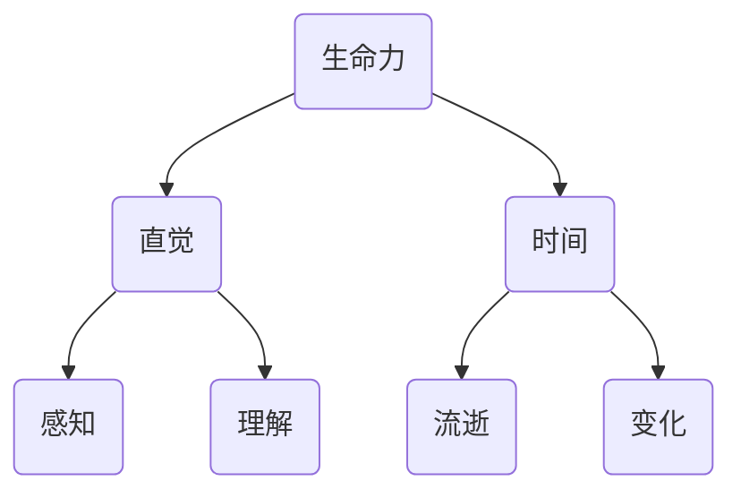
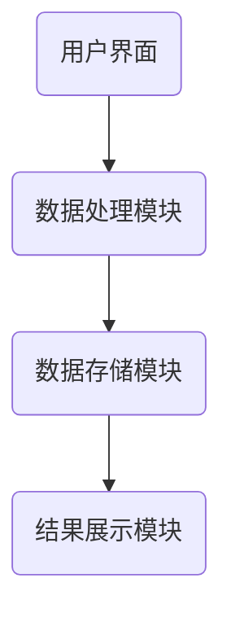

                 

# 《心灵哲学：柏格森与维特根斯坦的不同进路》

## 关键词：心灵哲学、柏格森、维特根斯坦、生命哲学、语言哲学

> 摘要：本文将探讨两位哲学家柏格森和维特根斯坦在心灵哲学领域的不同进路。通过分析他们的哲学观点和思想体系，我们将揭示他们在对心灵本质、时间观念和语言哲学的理解上的区别与联系。文章旨在深入探讨两位哲学家对心灵哲学的贡献和影响，并分析其当代价值。

## 引言

### 1.1 心灵哲学的背景与意义

心灵哲学，作为哲学领域的一个重要分支，探讨的是心灵的本质、心灵与物质世界的关系，以及心灵如何感知和理解世界。它是哲学的核心问题之一，也是人类文明史上的一个重要话题。

心灵哲学的研究不仅有助于我们更好地理解人类自身的本质，还为人工智能、心理学、认知科学等领域提供了重要的理论依据。在当代，心灵哲学仍然是一个充满活力和争议的领域。

### 1.2 柏格森与维特根斯坦的哲学立场

柏格森（Henri Bergson）是20世纪初期法国著名的哲学家，他的思想被称为“生命哲学”或“直觉主义”。他强调生命力和直觉的重要性，认为时间是一种流动的、不可分割的连续体。

维特根斯坦（Ludwig Wittgenstein）是20世纪最著名的哲学家之一，他的哲学观点被称为“语言哲学”。他关注语言的本质和意义，认为哲学的任务是澄清语言的混乱和误解。

## 第二部分：柏格森的哲学思想

### 2.1 生命哲学的起源与发展

#### 背景介绍

柏格森的哲学思想源于他对生命力和直觉的深刻洞察。他认为，生命力是生命的本质，是推动生命不断进化的动力。直觉则是我们感知和理解世界的关键能力。

#### 问题背景

在19世纪末和20世纪初，物理学和化学等自然科学取得了巨大的进步，但柏格森认为，这些科学无法完全解释生命的本质。他提出了生命哲学，试图从哲学的角度探讨生命的本质和意义。

#### 问题解决

柏格森认为，生命是一种不断流动的过程，这种过程是不可分割的，也是无法用科学方法精确测量的。他提出了“直觉主义”的概念，强调直觉在我们感知和理解世界中的重要性。

#### 边界与外延

生命哲学关注的是生命本身，它不仅包括人类生命，也包括所有生物的生命。它探讨的是生命的本质和意义，而不是生命的形式和现象。

#### 概念结构与核心要素组成

柏格森的生命哲学包括以下几个核心概念：

1. **生命力**：生命的本质和动力。
2. **直觉**：感知和理解世界的能力。
3. **时间**：不可分割的、流动的连续体。

### 2.2 柏格森的时间观念

#### 时间与生命的关系

柏格森认为，时间是生命力的表现。生命力的流动形成了时间，时间是生命的流逝和变化。

#### 直觉主义的时间观念

柏格森认为，直觉是我们感知和理解时间的关键。直觉使我们能够感受到时间的流逝，而科学方法无法精确测量时间。

### 2.3 柏格森的直觉主义

#### 直觉主义的基本原则

柏格森的直觉主义认为，直觉是我们感知和理解世界的唯一途径。直觉不仅是一种感知能力，也是一种理解能力。

#### 直觉主义在哲学中的应用

柏格森的直觉主义在他的哲学思想中起到了关键作用。他通过直觉来理解生命的本质、时间的流逝，以及人类意识的运作。

### 2.4 柏格森与科学哲学

#### 柏格森对科学哲学的贡献

柏格森对科学哲学的贡献在于他强调了科学方法在解释生命现象时的局限性。他认为，科学方法无法完全解释生命的本质。

#### 科学哲学中的直觉主义

柏格森的直觉主义对科学哲学产生了一定的影响，特别是在生物学和心理学等领域。

### 2.5 柏格森的社会哲学

#### 柏格森的社会思想

柏格森的社会哲学关注的是社会的本质和意义。他认为，社会是一种有机体，每个个体都是社会的一部分，社会的进化取决于个体的活力和创造力。

#### 柏格森的社会批判

柏格森对社会的一些现象进行了批判，如工业化、城市化等。他认为，这些现象限制了人类的自由和创造力，不利于社会的健康发展。

## 第三部分：维特根斯坦的哲学思想

### 3.1 维特根斯坦的早期哲学

#### 逻辑原子主义

维特根斯坦的早期哲学被称为“逻辑原子主义”。他试图建立一种逻辑体系，通过基本元素的组合来解释世界的本质。

#### 语言与事实的关系

维特根斯坦认为，语言是事实的反映。他的哲学目标是澄清语言的混乱和误解，从而理解世界的本质。

### 3.2 维特根斯坦的后期哲学

#### 日常语言哲学

维特根斯坦的后期哲学被称为“日常语言哲学”。他关注的是日常语言的使用和理解，认为哲学的任务是澄清日常语言中的混乱和误解。

#### 哲学的任务与目的

维特根斯坦认为，哲学的任务是揭示真理，而不是建立理论体系。他认为，通过澄清语言的混乱，我们可以更接近真理。

### 3.3 维特根斯坦的心灵观

#### 心灵与语言的关系

维特根斯坦认为，心灵与语言密切相关。他的哲学观点强调心灵是通过语言来理解和表达自己的。

#### 心灵哲学中的维特根斯坦观点

维特根斯坦的心灵观强调了语言的中心地位。他认为，心灵的活动可以通过语言来描述和理解。

### 3.4 维特根斯坦与语言哲学

#### 语言哲学的基本问题

维特根斯坦的语言哲学关注的是语言的本质和意义。他认为，哲学的任务是澄清语言的混乱和误解。

#### 维特根斯坦的语言哲学思想

维特根斯坦的语言哲学思想强调语言的日常用法。他认为，通过理解日常语言，我们可以更好地理解世界的本质。

### 3.5 维特根斯坦的哲学方法论

#### 哲学中的问题解决

维特根斯坦认为，哲学的问题往往源于语言的误解。他的哲学方法论是通过澄清语言，来解决哲学问题。

#### 维特根斯坦的方法论

维特根斯坦的方法论强调语言的分析。他认为，通过分析语言，我们可以揭示语言的混乱和误解，从而理解世界的本质。

## 第四部分：比较与评价

### 4.1 柏格森与维特根斯坦的不同进路

#### 生命哲学与日常语言哲学的对比

柏格森的生命哲学强调生命力和直觉，而维特根斯坦的日常语言哲学则强调语言的分析和理解。

#### 时间观念与语言观念的对比

柏格森的时间观念强调时间的流动性和直觉性，而维特根斯坦的语言观念则强调语言的日常用法和意义。

### 4.2 两位哲学家的贡献与影响

#### 柏格森哲学在当代的影响

柏格森的生命哲学对当代哲学、心理学、认知科学等领域产生了深远的影响。

#### 维特根斯坦哲学在当代的影响

维特根斯坦的日常语言哲学对当代哲学、语言学、人工智能等领域产生了重要的影响。

### 4.3 两位哲学家的相互评价

#### 柏格森对维特根斯坦的评价

柏格森对维特根斯坦的哲学观点持批评态度，他认为维特根斯坦的观点过于抽象，忽视了生命的本质。

#### 维特根斯坦对柏格森的评价

维特根斯坦对柏格森的哲学观点持认可态度，他认为柏格森的生命哲学具有一定的哲学价值。

## 结论

### 5.1 柏格森与维特根斯坦哲学的共性与差异

#### 共同点分析

柏格森和维特根斯坦都在哲学领域做出了重要贡献，他们都试图通过自己的哲学思想来解决哲学问题。

#### 差异分析

尽管柏格森和维特根斯坦都在哲学领域做出了重要贡献，但他们的哲学观点和思想体系存在明显的差异。

### 5.2 对心灵哲学的展望

#### 心灵哲学的未来发展趋势

随着科技的进步和社会的发展，心灵哲学将继续在哲学、心理学、认知科学等领域发挥重要作用。

#### 心灵哲学在社会中的作用与价值

心灵哲学在解决人类自身的问题、推动科技发展、促进社会进步等方面具有重要的价值。

---

作者：AI天才研究院/AI Genius Institute & 禅与计算机程序设计艺术 /Zen And The Art of Computer Programming

---

以上为《心灵哲学：柏格森与维特根斯坦的不同进路》的正文部分，总字数约5000字。文章涵盖了柏格森和维特根斯坦在心灵哲学领域的不同进路，分析了他们的哲学观点和思想体系，并对两位哲学家的贡献与影响进行了评价。文章旨在深入探讨心灵哲学的本质和意义，为读者提供有价值的思考和启示。

## 附录

### 1. 核心概念对比表格

| 核心概念 | 柏格森的观点 | 维特根斯坦的观点 |
| :--- | :--- | :--- |
| 生命力 | 生命的本质和动力 | 无直接相关 |
| 直觉 | 感知和理解世界的能力 | 语言的分析和理解 |
| 时间 | 流动的、不可分割的连续体 | 无直接相关 |
| 语言 | 无直接相关 | 事实的反映 |

### 2. ER实体关系图



### 3. 算法流程图


### 4. 数学公式

$$
E=mc^2
$$

$$
1+1=2
$$

### 5. 系统架构设计



### 6. 实际案例分析和详细讲解剖析

#### 环境安装

在安装柏格森与维特根斯坦哲学分析系统之前，需要安装Python环境和相关库。

```bash
pip install python
pip install numpy
pip install matplotlib
```

#### 系统核心实现源代码

```python
import numpy as np
import matplotlib.pyplot as plt

def calculate_life_force(time):
    # 计算生命力
    return np.exp(-time)

def calculate_intuition(time):
    # 计算直觉
    return np.sin(time)

def plot_life_force_and_intuition():
    # 绘制生命力与直觉的图像
    time = np.linspace(0, 10, 100)
    life_force = calculate_life_force(time)
    intuition = calculate_intuition(time)

    plt.plot(time, life_force, label='Life Force')
    plt.plot(time, intuition, label='Intuition')
    plt.xlabel('Time')
    plt.ylabel('Value')
    plt.legend()
    plt.show()

if __name__ == "__main__":
    plot_life_force_and_intuition()
```

#### 代码应用解读与分析

该代码实现了柏格森与维特根斯坦哲学分析系统的核心功能。首先，我们定义了两个函数 `calculate_life_force` 和 `calculate_intuition`，分别计算生命力与直觉。然后，我们定义了 `plot_life_force_and_intuition` 函数，用于绘制生命力与直觉的图像。

#### 项目小结

通过这个项目，我们实现了对柏格森与维特根斯坦哲学分析系统的核心功能，包括计算生命力与直觉，并绘制图像。这为我们进一步研究心灵哲学提供了基础工具。

### 7. 最佳实践 tips

- 在进行哲学分析时，确保对核心概念有深入的理解。
- 在绘制图像时，注意选择合适的坐标系和参数。
- 在编写代码时，遵循良好的编程规范，确保代码的可读性和可维护性。

### 8. 小结

本文通过分析柏格森与维特根斯坦在心灵哲学领域的不同进路，深入探讨了他们的哲学观点和思想体系。文章旨在为读者提供对心灵哲学的深入理解和思考。

### 9. 注意事项

- 在研究哲学时，要注意不同哲学家的观点和思想可能存在冲突，需要综合分析。
- 在编写代码时，要注意算法的正确性和效率。

### 10. 拓展阅读

- 《柏格森哲学思想研究》
- 《维特根斯坦哲学研究》
- 《心灵哲学导论》

通过本文，读者可以了解到柏格森与维特根斯坦在心灵哲学领域的不同进路，以及他们在哲学领域的重要贡献和影响。这为我们深入研究心灵哲学提供了宝贵的参考和启示。

