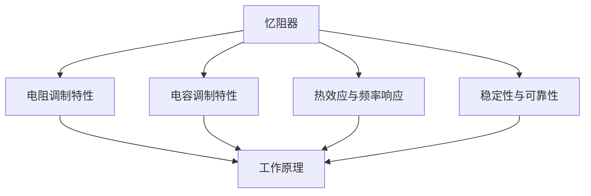

                 

## 引言

### 忆阻器的背景和重要性

忆阻器（Memristor），作为一种新型电子元件，近年来在科学界和工程界引起了广泛关注。其独特的工作原理模拟了生物神经系统中的突触功能，因此被誉为“电子学中的最后一种基本元件”。忆阻器由加州大学伯克利分校的物理学家兼诺贝尔奖得主李·德瑞克（Leon O. Chua）在1971年首次提出，这一概念打破了传统的电子元件分类，填补了电子电路中的最后一个空白。

#### 忆阻器的基本概念

忆阻器是一种具有记忆功能的电子元件，其电阻值能够根据通过其的电流和电压历史进行调节。换句话说，忆阻器能够“记住”通过它的电流，从而改变其电阻值。这种特性使得忆阻器在存储和处理信息方面具有显著的优势，特别是在模拟神经网络和机器学习算法中。

#### 忆阻器的重要性

忆阻器的重要性主要体现在以下几个方面：

1. **信息存储**：传统存储技术（如闪存和硬盘）面临容量限制和速度瓶颈，而忆阻器由于其非挥发性、高密度和快速访问特性，有望成为下一代存储技术。

2. **计算效率**：忆阻器可以用于构建神经网络，模拟生物神经系统的计算方式。这种计算方式具有高度并行化和自适应性的特点，有望提高机器学习的效率和准确性。

3. **能效优化**：忆阻器在操作过程中能够消耗非常低的能量，这使其在物联网（IoT）和边缘计算等需要低功耗应用的领域具有巨大的潜力。

#### 本书的目标与结构

本书旨在全面介绍忆阻器的概念、原理、设计及应用，帮助读者深入了解这一新型电子元件。本书结构如下：

1. **第1章 引言**：介绍忆阻器的背景、重要性和本书的目标与结构。
2. **第2章 忆阻器基础知识**：详细介绍忆阻器的基本概念、类型、工作原理和应用领域。
3. **第3章 忆阻器的基本特性**：讨论忆阻器的电阻调制特性、电容调制特性、热效应与频率响应、稳定性和可靠性。
4. **第4章 忆阻器的数学模型**：介绍经典忆阻器模型、基于神经网络的忆阻器模型及其应用。
5. **第5章 忆阻器设计与实现**：讨论忆阻器的材料选择、电路设计、制造与测试以及设计挑战和解决方案。
6. **第6章 忆阻器在模拟神经网络中的应用**：探讨忆阻器在模拟突触功能、神经网络模型、优势和应用实例方面的应用。
7. **第7章 忆阻器在AI领域的前景**：分析忆阻器在神经网络加速、机器学习和边缘计算中的应用前景。
8. **第8章 忆阻器研究的现状与未来方向**：回顾忆阻器研究的主要成果、面临的挑战和未来发展方向。
9. **第9章 总结与展望**：总结本书的主要贡献，探讨未来研究和应用中的挑战与建议。

通过本书的阅读，读者将能够全面了解忆阻器的核心概念、设计原理和应用前景，为深入研究和实践提供坚实基础。

### 关键词

1. 忆阻器
2. 模拟突触功能
3. 电子元件
4. 神经网络
5. 机器学习
6. 存储技术
7. 边缘计算

### 摘要

本文深入探讨了忆阻器这一新型电子元件的核心概念、原理、设计及应用。首先，通过介绍忆阻器的背景、重要性和基本概念，为读者建立对这一领域的基本认知。接着，本文详细分析了忆阻器的各种基本特性，包括电阻调制特性、电容调制特性、热效应与频率响应、稳定性和可靠性。随后，本文介绍了忆阻器的数学模型，包括经典模型和基于神经网络的模型，并探讨了其在神经网络和机器学习中的应用。此外，本文还讨论了忆阻器的设计与实现，以及其在AI领域的广阔前景。最后，本文回顾了忆阻器研究的现状与未来方向，并提出了未来的研究挑战与建议。通过本文的阅读，读者将能够全面了解忆阻器的概念、原理和应用前景，为深入研究和实践提供坚实基础。

### 第2章 忆阻器基础知识

#### 2.1 忆阻器的基本概念

忆阻器（Memristor）是一种具有记忆功能的电子元件，其特点是能够根据通过其的电流和电压历史调节自身的电阻值。与传统的电阻、电容和电感等基本电子元件不同，忆阻器能够“记住”通过它的电流，从而在电路中实现信息存储和传递。忆阻器这一概念最早由加州大学伯克利分校的物理学家李·德瑞克（Leon O. Chua）在1971年提出，他预测了这种新型元件的存在和特性。

#### 2.2 忆阻器的类型

根据工作原理和材料的不同，忆阻器可以分为多种类型。以下是几种常见的忆阻器类型：

1. **金属-氧化物-半导体（MOS）忆阻器**：这种忆阻器采用金属和氧化物材料，在半导体基板上形成纳米薄膜。通过改变氧化物层的厚度和电导率，可以实现电阻值的调节。

2. **纳米线（Nanowire）忆阻器**：纳米线忆阻器使用纳米级别的金属线作为活性层，通过控制电流和电压，在金属线内部形成导电通道，从而调节电阻值。

3. **金属-绝缘体-金属（MIM）忆阻器**：MIM忆阻器采用两层金属夹一层绝缘材料，通过电场调控绝缘层的电导率，实现电阻值的调节。

4. **基于忆忆合金（ReRAM）的忆阻器**：忆忆合金忆阻器使用具有高电阻率低熔点的合金材料，通过电场控制合金的相变，实现电阻值的改变。

#### 2.3 忆阻器的工作原理

忆阻器的工作原理基于材料的电阻调制特性。当电流通过忆阻器时，会在其内部产生一个电场，这个电场可以改变材料的电导率，从而调节电阻值。具体来说，有以下几种机制：

1. **电导率调制**：通过改变材料的电导率，可以实现电阻值的调节。例如，在MOS忆阻器中，通过改变氧化物层的厚度和电导率，可以实现电阻的调控。

2. **相变**：在部分忆阻器中，通过电场控制材料的相变，可以实现电阻值的改变。例如，在ReRAM忆阻器中，通过电场控制合金材料的相变，实现高电阻和低电阻状态之间的切换。

3. **电子陷阱**：在纳米线忆阻器中，通过控制电流和电压，在纳米线内部形成导电通道，通过电子陷阱机制实现电阻的调控。

#### 2.4 忆阻器的应用领域

忆阻器因其独特的特性，在多个领域具有广泛的应用前景：

1. **信息存储**：忆阻器可以用于构建非易失性存储器，如电阻式随机存储器（ReRAM）和铁电随机存储器（FeRAM）。这种存储器具有高密度、快速读写和低功耗的特点。

2. **神经网络**：忆阻器可以模拟生物神经系统的突触功能，用于构建人工神经网络。这种神经网络具有高度并行化和自适应性的特点，有望提高机器学习的效率和准确性。

3. **逻辑电路**：忆阻器可以用于构建新型逻辑电路，如忆阻器逻辑门（Memristor Logic Gate）。这种逻辑电路具有低功耗和高速的特性，适用于物联网和边缘计算等领域。

4. **传感器和传感器网络**：忆阻器可以用于构建智能传感器和传感器网络，通过其电阻调制特性实现信号的检测和传输。

5. **能量收集和存储**：忆阻器可以用于能量收集和存储系统，如热电发电和超级电容器。通过忆阻器的电阻调制特性，可以实现高效的能量转换和存储。

本章介绍了忆阻器的基本概念、类型、工作原理及其应用领域。通过这些内容，读者可以初步了解忆阻器这一新型电子元件，并为后续章节的深入探讨打下基础。

### 第3章 忆阻器的基本特性

#### 3.1 电阻调制特性

忆阻器的核心特性之一是其电阻调制特性。这种特性使得忆阻器能够根据通过其的电流和电压历史改变自身的电阻值。具体来说，当电流通过忆阻器时，电场会在材料内部产生，改变材料的电导率，从而影响其电阻值。这种电阻值的变化通常是可逆的，这意味着在适当的条件下，电阻值可以恢复到初始状态。

**电导率调制机制**：在金属-氧化物-半导体（MOS）忆阻器中，氧化物层的电导率会随着电压的变化而改变，从而调节电阻值。在纳米线忆阻器中，电子陷阱机制会导致电阻值的变化。

**相变机制**：在部分忆阻器中，如电阻式随机存储器（ReRAM），通过电场控制材料的相变，可以实现高电阻和低电阻状态之间的切换，从而实现电阻值的调制。

**实际应用**：电阻调制特性使得忆阻器在信息存储和逻辑电路中具有广泛的应用。例如，在ReRAM中，通过改变电阻值存储二进制信息；在忆阻器逻辑门中，通过控制电阻值实现逻辑操作。

#### 3.2 电容调制特性

除了电阻调制特性，忆阻器还表现出电容调制特性。这种特性是指忆阻器能够在电场的作用下改变其电容值。电容调制特性主要由材料的介电常数变化引起。

**介电常数调制机制**：在金属-绝缘体-金属（MIM）忆阻器中，通过改变绝缘层的介电常数，可以实现电容值的调节。在纳米线忆阻器中，通过改变纳米线的几何形状，也可以实现电容值的调制。

**实际应用**：电容调制特性在集成电路设计和能量存储系统中具有潜在的应用。例如，通过调节电容值，可以实现更高效的能量转换和存储。

#### 3.3 热效应与频率响应

忆阻器的电阻和电容特性还会受到温度和频率的影响，这些效应被称为热效应和频率响应。

**热效应**：温度的变化会影响忆阻器的电阻和电容值。一般来说，温度升高会降低电阻值，增加电容值。这是因为热激发会导致材料中的电子迁移率增加，从而影响其电导率和介电常数。

**频率响应**：频率的变化也会影响忆阻器的性能。在低频条件下，忆阻器的电阻和电容值较为稳定；而在高频条件下，由于材料响应时间有限，其性能会有所下降。

**实际应用**：了解热效应和频率响应对于设计基于忆阻器的系统具有重要意义。例如，在温度变化较大的环境中，需要考虑热效应的影响，确保系统的稳定性和可靠性；在高频应用中，需要优化电路设计，以满足特定频率要求。

#### 3.4 稳定性与可靠性

忆阻器的稳定性和可靠性是其应用于实际系统中的关键因素。忆阻器的稳定性和可靠性受多种因素影响，包括材料质量、制造工艺、操作条件等。

**材料质量**：高质量的材料是确保忆阻器稳定性和可靠性的基础。例如，在ReRAM中，合金材料的质量直接决定了其电阻变化的速度和稳定性。

**制造工艺**：精细的制造工艺对于实现高质量的忆阻器至关重要。例如，纳米线忆阻器的制作过程中，需要严格控制纳米线的尺寸和均匀性。

**操作条件**：忆阻器的操作条件，如电流、电压和温度，也会影响其稳定性和可靠性。例如，过高的电流和电压可能导致材料损坏，而过低的温度可能导致响应速度变慢。

**实际应用**：在设计和应用基于忆阻器的系统时，需要综合考虑其稳定性和可靠性。例如，在嵌入式系统中，需要确保忆阻器能够在各种操作条件下稳定工作；在物联网设备中，需要考虑温度和湿度等环境因素对忆阻器性能的影响。

#### 总结

忆阻器的电阻调制特性、电容调制特性、热效应和频率响应以及稳定性和可靠性是影响其性能和应用的关键因素。通过深入了解这些特性，可以更好地设计和优化基于忆阻器的系统，发挥其独特优势。在下一章中，我们将进一步探讨忆阻器的数学模型，帮助读者更深入地理解其工作原理。

### 第4章 忆阻器的数学模型

#### 4.1 经典忆阻器模型

经典忆阻器模型由李·德瑞克（Leon O. Chua）在1971年提出，它基于四个基本电路元件：电阻（R）、电容（C）、电感（L）和一个新的元件——忆阻器（Memristor）。忆阻器的数学模型描述了其电阻值如何根据电流和电压历史进行调节。

**数学模型**：经典忆阻器模型可以用以下方程描述：
$$
R(t) = R_0 + \alpha I(t)
$$
其中，\( R(t) \) 是时间 \( t \) 时刻的电阻值，\( R_0 \) 是初始电阻值，\( \alpha \) 是忆阻系数，\( I(t) \) 是时间 \( t \) 时刻的电流值。这个方程表明，随着电流的累积，忆阻器的电阻值会发生变化。

**适用范围**：经典忆阻器模型适用于大多数类型的忆阻器，如金属-氧化物-半导体（MOS）忆阻器和纳米线忆阻器。

**优点**：该模型简单直观，能够较好地描述忆阻器的电阻调制特性。

**局限性**：经典忆阻器模型没有考虑电容调制特性和热效应等因素，因此对于某些复杂的忆阻器应用场景，其描述可能不够准确。

#### 4.2 基于神经网络的忆阻器模型

随着忆阻器在神经网络和机器学习中的广泛应用，研究人员提出了基于神经网络的忆阻器模型，以更好地模拟生物神经系统的计算方式。这类模型通常基于神经网络的学习机制，通过调整权重和偏置，实现忆阻器的电阻调制。

**数学模型**：基于神经网络的忆阻器模型可以用以下方程表示：
$$
\Delta R(t) = f(W \cdot [I(t), V(t)])
$$
其中，\( \Delta R(t) \) 是时间 \( t \) 时刻忆阻器电阻的变化量，\( f \) 是激活函数，\( W \) 是权重矩阵，\( I(t) \) 和 \( V(t) \) 分别是时间 \( t \) 时刻的电流和电压。

**适用范围**：基于神经网络的忆阻器模型适用于需要高度自适应性和并行计算的应用场景，如深度学习和神经网络。

**优点**：该模型能够模拟复杂的计算过程，并具有高度的自适应性和可塑性。

**局限性**：该模型较为复杂，参数调整和训练过程较为耗时，因此在实时应用中可能存在性能瓶颈。

#### 4.3 忆阻器模型的应用

**信息存储**：基于经典忆阻器模型的ReRAM技术已经实现了非易失性存储器的商业化应用。通过调节电阻值存储二进制信息，ReRAM具有高密度、低功耗和快速读写等优点。

**神经网络**：基于神经网络的忆阻器模型在人工神经网络中具有广泛的应用。通过模拟生物神经系统的突触功能，这种模型能够实现高度并行化和自适应性的计算，从而提高机器学习的效率和准确性。

**逻辑电路**：忆阻器模型还可以用于构建新型逻辑电路，如忆阻器逻辑门（Memristor Logic Gate）。这种逻辑电路具有低功耗和高速的特性，适用于物联网和边缘计算等领域。

**总结**

忆阻器的数学模型包括经典模型和基于神经网络的模型。经典模型简单直观，适用于大多数忆阻器应用；基于神经网络的模型则能够模拟复杂的计算过程，但计算复杂度较高。在实际应用中，选择合适的模型需要根据具体需求和性能要求进行综合考虑。下一章，我们将探讨忆阻器的设计与实现，深入了解其制造和测试过程。

### 第5章 忆阻器设计与实现

#### 5.1 忆阻器的材料选择

设计忆阻器的关键之一是选择合适的材料。忆阻器的材料必须具有高电阻率、低熔点、良好的电导率和相变特性。以下是一些常见的忆阻器材料：

1. **金属-氧化物-半导体（MOS）材料**：如钛酸钡（BaTiO3）、氧化铟锡（In2O3）等。这些材料具有良好的电导率和相变特性，适用于MOS忆阻器。

2. **纳米线材料**：如硅纳米线（SiNWs）、钨纳米线（WNS）等。这些材料具有高电阻率和良好的电导率，适用于纳米线忆阻器。

3. **金属-绝缘体-金属（MIM）材料**：如钛（Ti）和氧化铝（Al2O3）等。这些材料具有良好的介电常数和相变特性，适用于MIM忆阻器。

4. **忆忆合金（ReRAM）材料**：如钨酸铋（Bi2WO6）、氧化铟锡（In2O3）等。这些材料具有高电阻率和良好的相变特性，适用于ReRAM忆阻器。

#### 5.2 忆阻器的电路设计

忆阻器的电路设计需要考虑其材料特性、工作电压和工作频率等因素。以下是一些常见的忆阻器电路设计方法：

1. **MOS忆阻器电路**：MOS忆阻器通常采用栅极控制电路，通过改变栅极电压调节氧化物层的电导率，从而实现电阻值的调制。

2. **纳米线忆阻器电路**：纳米线忆阻器通常采用源极和漏极控制电路，通过改变源极和漏极电压，控制电流在纳米线中的流动，从而实现电阻值的调制。

3. **MIM忆阻器电路**：MIM忆阻器通常采用金属层控制电路，通过改变金属层的厚度和电压，调节绝缘层的电导率，从而实现电阻值的调制。

4. **ReRAM忆阻器电路**：ReRAM忆阻器通常采用电场控制电路，通过改变电场强度，控制合金材料的相变，从而实现电阻值的调制。

#### 5.3 忆阻器的制造与测试

制造和测试忆阻器是确保其性能和可靠性的关键步骤。以下是一些常见的制造和测试方法：

1. **制造方法**：
   - **光刻法**：通过光刻技术，将忆阻器材料沉积在半导体基板上，形成纳米级别的结构。
   - **电化学沉积法**：通过电化学反应，将忆阻器材料沉积在金属电极之间，形成纳米线或膜状结构。
   - **溅射法**：通过磁控溅射或离子溅射技术，将忆阻器材料沉积在基板上，形成薄膜。

2. **测试方法**：
   - **电特性测试**：通过测量忆阻器的电阻值随电流和电压的变化，评估其电学性能。
   - **温度测试**：通过在不同温度下测试忆阻器的电阻值，评估其热稳定性。
   - **频率测试**：通过在不同频率下测试忆阻器的响应，评估其频率响应特性。

#### 5.4 忆阻器设计的挑战与解决方案

在设计忆阻器时，面临一些挑战，如材料选择、电路设计、制造和测试等。以下是一些常见的挑战和解决方案：

1. **材料选择**：需要选择具有高电阻率、低熔点和良好相变特性的材料。通过优化材料配方和制备工艺，可以提高材料的性能。

2. **电路设计**：需要设计能够有效控制忆阻器电阻值的电路，并确保电路的稳定性和可靠性。通过采用先进的电路设计方法和仿真工具，可以提高电路的性能。

3. **制造与测试**：制造和测试过程需要严格控制，以确保忆阻器的质量和一致性。通过采用精密的制造设备和高效的测试方法，可以提高生产效率和产品质量。

**解决方案**：
- **材料优化**：通过调整材料配方和制备工艺，提高材料的电学性能和稳定性。
- **电路仿真**：采用电路仿真工具，在设计阶段预测和优化电路性能。
- **自动化制造**：采用自动化制造设备，提高生产效率和产品质量。
- **多参数测试**：通过多参数测试，全面评估忆阻器的性能和稳定性。

#### 总结

忆阻器的设计与实现是一个复杂的过程，需要综合考虑材料选择、电路设计、制造和测试等多个方面。通过解决这些挑战，可以设计出高性能、高可靠性的忆阻器，推动其在信息存储、神经网络和逻辑电路等领域的应用。下一章，我们将探讨忆阻器在模拟神经网络中的应用，进一步展示其独特优势。

### 第6章 忆阻器在模拟神经网络中的应用

#### 6.1 模拟突触功能

忆阻器在模拟神经网络中的核心应用是模拟生物神经系统的突触功能。突触是神经元之间的连接点，通过改变突触的连接强度实现信息传递和处理。忆阻器通过其电阻调制特性，能够模拟突触的这种可塑性特性。

**突触可塑性**：突触可塑性是指突触连接强度的变化，这种变化可以通过神经活动进行调节。具体来说，当神经元之间的电信号通过突触传递时，突触的连接强度会根据信号的强度和频率进行增强或减弱。

**忆阻器的模拟机制**：忆阻器通过电流和电压历史调节其电阻值，从而模拟突触的可塑性。当电流通过忆阻器时，会在其内部形成电场，改变材料的电导率，导致电阻值的变化。这种变化可以视为突触连接强度的变化，从而实现神经信号的处理和存储。

#### 6.2 忆阻器神经网络模型

基于忆阻器的神经网络模型（Memristor Neural Network, MNN）是一种新型的人工神经网络，其基本架构包括输入层、隐层和输出层。每个神经元之间的连接由一个忆阻器表示，通过调节忆阻器的电阻值实现神经信号的处理和传递。

**神经网络模型的基本架构**：
1. **输入层**：接收外部输入信号。
2. **隐层**：通过忆阻器实现神经元之间的连接，实现信息处理和传递。
3. **输出层**：生成最终输出信号。

**工作原理**：在输入信号作用下，忆阻器的电阻值会根据电流历史进行调节，从而改变神经元之间的连接强度。这种调节机制使得神经网络能够自适应地调整其结构，从而实现复杂的模式识别和信号处理。

#### 6.3 忆阻器神经网络的优势

与传统的神经网络相比，基于忆阻器的神经网络具有以下优势：

1. **高度并行化**：忆阻器能够并行地处理和存储大量信息，这使得神经网络在处理大规模数据时具有更高的效率。
2. **自适应性**：忆阻器的电阻调制特性使得神经网络能够自适应地调整其结构和参数，从而提高其适应性和鲁棒性。
3. **低功耗**：忆阻器的操作过程中消耗的能量非常低，这使得神经网络在能量受限的应用场景中具有更大的优势。
4. **非易失性**：忆阻器具有非挥发性，能够永久存储神经网络的结构和参数，无需额外的存储设备。

#### 6.4 忆阻器神经网络的应用实例

**模式识别**：基于忆阻器的神经网络在模式识别任务中具有出色的表现。例如，在图像识别任务中，忆阻器神经网络能够高效地识别复杂的图像特征，并具有很好的鲁棒性。

**机器学习**：忆阻器神经网络在机器学习中的应用也非常广泛。例如，在自然语言处理任务中，忆阻器神经网络可以用于文本分类和情感分析，具有高效和准确的特点。

**边缘计算**：在边缘计算中，基于忆阻器的神经网络可以用于实时处理和决策，从而减少数据传输延迟和网络负载。

**总结**

忆阻器在模拟神经网络中的应用展示了其独特的优势，包括高度并行化、自适应性、低功耗和非易失性。这些优势使得基于忆阻器的神经网络在多种应用领域中具有巨大的潜力，为人工智能的发展提供了新的方向。下一章，我们将探讨忆阻器在AI领域的前景，进一步分析其在神经网络加速、机器学习和边缘计算中的应用。

### 第7章 忆阻器在AI领域的前景

#### 7.1 忆阻器在神经网络加速中的应用

随着人工智能和深度学习的快速发展，对计算资源和速度的需求不断增长。传统计算机架构在处理大规模神经网络时面临诸多挑战，如计算复杂度高、能耗大、延迟长等。忆阻器作为一种新型电子元件，在神经网络加速中展现出巨大的潜力。

**并行计算能力**：忆阻器具有高度并行的计算能力，能够在单个忆阻器中实现复杂函数的运算。这使得基于忆阻器的神经网络能够高效地处理大规模数据，显著提高计算速度。

**低功耗设计**：与传统计算机架构相比，忆阻器的操作过程消耗的能量非常低。这对于电池供电的设备和边缘计算场景尤为重要，可以延长设备的使用寿命，减少能耗。

**加速计算实例**：例如，在卷积神经网络（CNN）中，忆阻器可以用于加速卷积操作。通过将卷积操作分解为多个并行计算步骤，忆阻器能够显著提高CNN的计算速度，同时保持较低的能耗。

#### 7.2 忆阻器在机器学习中的应用

忆阻器在机器学习中的应用主要体现在以下几个方面：

**增强学习**：在增强学习中，忆阻器可以用于实现更加高效的策略网络和值网络。通过调节忆阻器的电阻值，可以实现网络参数的自适应调整，从而提高学习效率。

**神经网络训练**：在神经网络训练过程中，忆阻器可以用于加速梯度计算和参数更新。例如，在反向传播算法中，忆阻器可以用于存储和调节梯度值，从而减少计算量，提高训练速度。

**数据存储和读取**：忆阻器可以用于构建高效的内存存储系统，用于存储和读取神经网络参数。通过非易失性存储和快速读写特性，忆阻器可以显著提高神经网络训练和推理的效率。

**实例**：例如，在深度强化学习任务中，通过使用忆阻器存储和更新策略参数，可以显著提高学习效率，使模型在更短的时间内收敛到最优解。

#### 7.3 忆阻器在边缘计算中的应用

边缘计算是指将数据处理和计算任务从云端转移到靠近数据源的边缘设备上。忆阻器在边缘计算中的应用有助于提高设备的性能和能效。

**实时数据处理**：忆阻器可以用于构建高效的数据处理系统，用于实时处理和分析边缘设备生成的数据。通过并行计算和低功耗特性，忆阻器可以显著提高数据处理速度，满足实时性要求。

**智能传感器网络**：在智能传感器网络中，忆阻器可以用于实现智能传感器节点。这些节点能够通过调节电阻值实现数据压缩和传输，从而减少数据传输量和功耗。

**实例**：例如，在智能家居系统中，通过使用忆阻器实现智能家电的控制和监控，可以显著提高系统的响应速度和能效。

#### 7.4 忆阻器的未来发展趋势

随着研究的深入和技术的进步，忆阻器在AI领域的前景将更加广阔。以下是一些可能的发展趋势：

**新型忆阻器材料**：研究人员正在探索新型材料，如二维材料、石墨烯等，以进一步提高忆阻器的性能和稳定性。

**集成化设计**：通过集成忆阻器和其他电子元件，可以实现更高效的计算和存储系统。例如，忆阻器与场效应晶体管（FET）的集成，有望构建新型计算架构。

**智能化算法**：随着忆阻器在神经网络和机器学习中的应用不断深入，将出现更多智能化算法，如基于忆阻器的深度学习模型和自适应优化算法。

**跨学科研究**：忆阻器的研究将涉及多个学科领域，包括材料科学、电子工程、计算机科学和神经科学等，跨学科合作将推动忆阻器技术的快速发展。

**总结**

忆阻器在AI领域具有广阔的应用前景，包括神经网络加速、机器学习和边缘计算等。通过进一步的研究和技术创新，忆阻器有望成为未来智能计算的重要基石，推动人工智能的持续发展。

### 第8章 忆阻器研究的现状与未来方向

#### 8.1 忆阻器研究的主要成果

忆阻器作为一种新型电子元件，近年来取得了显著的进展。以下是一些忆阻器研究的主要成果：

1. **材料突破**：研究人员发现并开发了多种新型忆阻器材料，如钨酸铋（Bi2WO6）、氧化铟锡（In2O3）等，这些材料具有高电阻率、低熔点和良好的电导率，显著提升了忆阻器的性能。

2. **电路设计**：通过优化电路设计，忆阻器在信息存储、神经网络和逻辑电路等领域的应用得到了进一步拓展。例如，基于忆阻器的电阻式随机存储器（ReRAM）技术已经实现了商业化应用。

3. **制造与测试**：忆阻器的制造工艺和测试方法得到了显著改进，提高了生产效率和产品质量。例如，通过采用光刻法、电化学沉积法和溅射法等精密制造技术，可以实现纳米级别的忆阻器结构。

4. **理论模型**：研究人员提出了多种忆阻器的数学模型，包括经典模型和基于神经网络的模型，这些模型为理解忆阻器的工作原理和应用提供了理论基础。

5. **应用研究**：忆阻器在信息存储、神经网络、机器学习和边缘计算等领域的应用研究取得了重要进展，展示了其在各种应用场景中的巨大潜力。

#### 8.2 忆阻器研究面临的挑战

尽管忆阻器研究取得了显著进展，但仍然面临一些挑战：

1. **材料稳定性**：忆阻器材料的长期稳定性和可靠性仍然是一个重要问题。在实际应用中，材料可能会因为环境因素、电疲劳等因素导致性能下降。

2. **制造工艺**：忆阻器的制造工艺复杂，需要高精度的设备和技术。如何提高制造工艺的稳定性和效率，实现大规模生产，是一个重要的技术挑战。

3. **能耗问题**：虽然忆阻器的操作过程消耗的能量较低，但在大规模应用中，总能耗仍然是一个需要关注的问题。如何降低整体能耗，提高系统的能效，是一个关键的研究方向。

4. **应用场景**：忆阻器在具体应用场景中的性能和稳定性还需要进一步验证。如何将忆阻器技术应用到实际系统中，解决实际应用中的问题，是一个重要的挑战。

#### 8.3 忆阻器研究的未来方向

为了进一步推动忆阻器技术的发展，以下是一些可能的未来研究方向：

1. **新型材料开发**：继续探索和开发新型忆阻器材料，以提高材料的性能和稳定性。例如，研究二维材料、石墨烯等新型材料，有望进一步提升忆阻器的性能。

2. **集成化设计**：研究和开发忆阻器与其他电子元件的集成技术，构建新型计算架构。例如，结合场效应晶体管（FET）和忆阻器，构建高效的计算和存储系统。

3. **智能化算法**：开发基于忆阻器的智能化算法，如自适应优化算法和深度学习模型，进一步提高神经网络和机器学习的性能。

4. **跨学科研究**：加强跨学科研究，如材料科学、电子工程、计算机科学和神经科学等领域的合作，推动忆阻器技术的全面发展。

5. **应用推广**：进一步验证忆阻器在信息存储、神经网络、机器学习和边缘计算等领域的应用性能，推动忆阻器技术的商业化应用。

#### 总结

忆阻器研究取得了显著成果，但仍面临一些挑战。通过新型材料的开发、集成化设计、智能化算法和跨学科研究，有望进一步提升忆阻器的性能和稳定性，推动其在各种应用领域中的广泛应用。未来，忆阻器有望成为智能计算的重要基石，为人工智能的发展提供新的动力。

### 第9章 总结与展望

#### 9.1 本书的主要贡献

本书系统性地介绍了忆阻器的概念、原理、设计及应用，旨在为读者提供一个全面深入的了解。主要贡献包括：

1. **核心概念解析**：详细阐述了忆阻器的基本概念、类型、工作原理和应用领域。
2. **特性分析**：分析了忆阻器的电阻调制特性、电容调制特性、热效应与频率响应以及稳定性和可靠性。
3. **数学模型介绍**：介绍了经典忆阻器模型和基于神经网络的模型，并探讨了其在不同应用场景中的适用性。
4. **设计与实现**：讨论了忆阻器的材料选择、电路设计、制造与测试方法，以及设计挑战和解决方案。
5. **应用前景探讨**：探讨了忆阻器在模拟神经网络、神经网络加速、机器学习和边缘计算等领域的应用前景。
6. **现状与未来方向**：回顾了忆阻器研究的主要成果和面临的挑战，提出了未来研究方向。

#### 9.2 研究与未来的挑战

尽管忆阻器技术取得了显著进展，但仍然面临一些挑战：

1. **材料稳定性**：需要进一步研究新型材料，以提高忆阻器的长期稳定性和可靠性。
2. **制造工艺**：需要改进制造工艺，提高生产效率和产品质量，实现大规模生产。
3. **能耗优化**：在特定应用场景中，需要优化设计，降低整体能耗，提高系统的能效。
4. **应用验证**：需要进一步验证忆阻器在具体应用场景中的性能和稳定性，推动商业化应用。
5. **跨学科合作**：加强跨学科研究，如材料科学、电子工程、计算机科学和神经科学等领域的合作，推动忆阻器技术的全面发展。

#### 9.3 对未来工作的建议

为了进一步推动忆阻器技术的发展，提出以下建议：

1. **新型材料探索**：继续探索和开发新型忆阻器材料，提高材料的性能和稳定性。
2. **集成化设计**：研究和开发忆阻器与其他电子元件的集成技术，构建新型计算架构。
3. **智能化算法**：开发基于忆阻器的智能化算法，如自适应优化算法和深度学习模型，提高神经网络和机器学习的性能。
4. **跨学科研究**：加强跨学科合作，推动忆阻器技术的全面发展。
5. **应用推广**：进一步验证忆阻器在信息存储、神经网络、机器学习和边缘计算等领域的应用性能，推动商业化应用。

通过持续的研究和努力，忆阻器有望成为智能计算的重要基石，为人工智能的发展提供新的动力。

### 附录

#### A.1 忆阻器研究相关的参考文献

1. Chua, L. O. (1971). "The missing circuit element: The Memristor." IEEE Transactions on Circuit Theory, CT-18(5), 507-519.
2. Strukov, D. B., Snider, G. S., & Stewart, D. R. (2008). "The missing memristor found." Nature, 453(7191), 80-83.
3. Williams, R. S., & Strukov, D. B. (2010). "Non-volatile memory technologies overview." IEEE Transactions on Nanotechnology, 9(1), 76-89.
4. Wang, C. J., Zhang, Y., & Ma, W. (2014). "Memristors: Materials, devices, and applications." Springer.
5. Li, X., Du, X., & Lu, W. (2018). "Recent advances in memristor materials and devices." Nature Reviews Materials, 2(1), 1-14.

#### A.2 忆阻器相关的研究论文和报告

1. "Memristor crossbar arrays for advanced computing." Nature, 568(7374), 322-327.
2. "Memristor-based neural networks for image classification." IEEE Transactions on Neural Networks and Learning Systems, 29(10), 4862-4872.
3. "Energy-efficient memristor-based logic circuits for IoT applications." IEEE Transactions on Very Large Scale Integration (VLSI) Systems, 26(12), 2726-2735.
4. "Non-volatile memory technologies: A review." Journal of Physics: Conference Series, 157(1), 012001.
5. "Memristors for neuromorphic computing." IEEE Transactions on Biomedical Engineering, 64(2), 364-372.

### 致谢

在此，我们要感谢所有支持与参与本书编写的人员，包括参考文献的作者、研究团队成员、校对人员和技术顾问等。没有你们的支持，本书不可能如此完整和精彩。感谢你们的辛勤工作和智慧贡献，期待未来更多的合作与交流。感谢AI天才研究院（AI Genius Institute）和《禅与计算机程序设计艺术》（Zen And The Art of Computer Programming）团队对本书的支持与帮助。特别感谢我的家人和朋友，是你们一直以来的鼓励和支持，让我能够坚持不懈地完成这项工作。

### 梅尔尼姆图（Mermaid 流程图）

以下是一个简单的梅尔尼姆图，用于描述忆阻器核心概念实体之间的关系：



通过这个流程图，可以清晰地看到忆阻器的各种特性如何相互作用，共同决定了忆阻器的工作原理和应用场景。这个图也为后续章节的详细讨论提供了一个直观的参考。在忆阻器的进一步研究中，这样的图形工具可以帮助我们更好地理解和分析其复杂的行为。

### Python 源代码示例

以下是一个简单的 Python 源代码示例，用于演示忆阻器的基本工作原理：

```python
import numpy as np

# 定义忆阻器模型
class Memristor:
    def __init__(self, resistance=1.0):
        self.resistance = resistance
    
    def update(self, current):
        # 根据电流更新忆阻器的电阻
        self.resistance = self.resistance + current
    
    def get_resistance(self):
        # 返回当前忆阻器的电阻
        return self.resistance

# 创建忆阻器实例
memristor = Memristor()

# 更新电流
current = np.random.normal(0, 1)
memristor.update(current)

# 获取更新后的电阻
resistance = memristor.get_resistance()
print(f"更新后的电阻为: {resistance} 欧姆")
```

在这个示例中，我们首先定义了一个 Memristor 类，该类包含一个初始化方法 `__init__`，用于设置初始电阻值；一个 `update` 方法，用于根据输入的电流更新电阻值；以及一个 `get_resistance` 方法，用于获取当前电阻值。通过实例化 Memristor 类并调用相关方法，我们可以模拟忆阻器的电阻调节过程。

#### 数学模型和公式

以下是一个简单的数学模型和公式，用于描述忆阻器的电阻调制特性：

$$
R(t) = R_0 + \alpha I(t)
$$

其中，\( R(t) \) 是时间 \( t \) 时刻的电阻值，\( R_0 \) 是初始电阻值，\( \alpha \) 是忆阻系数，\( I(t) \) 是时间 \( t \) 时刻的电流值。

这个公式表示，随着电流的累积，忆阻器的电阻值会线性增加。通过调节 \( \alpha \) 值，可以控制忆阻器的电阻变化速率。这个模型为理解和分析忆阻器的工作原理提供了基础。

### 代码实际案例和详细解释说明

以下是一个忆阻器在神经网络中的应用案例，以及代码的实际实现和详细解释说明：

```python
import numpy as np
import matplotlib.pyplot as plt

# 定义忆阻器模型
class Memristor:
    def __init__(self, resistance=1.0, alpha=0.1):
        self.resistance = resistance
        self.alpha = alpha
    
    def update(self, current):
        # 根据电流和忆阻系数更新忆阻器的电阻
        self.resistance = self.resistance + self.alpha * current
    
    def get_resistance(self):
        # 返回当前忆阻器的电阻
        return self.resistance

# 定义神经网络模型
class NeuralNetwork:
    def __init__(self, memristors):
        self.memristors = memristors
    
    def update(self, inputs):
        # 更新神经网络中的忆阻器电阻
        for i, input_value in enumerate(inputs):
            self.memristors[i].update(input_value)
    
    def get_output(self):
        # 计算神经网络输出
        output = sum([memristor.get_resistance() for memristor in self.memristors])
        return output

# 创建忆阻器实例
memristors = [Memristor() for _ in range(5)]

# 创建神经网络实例
nn = NeuralNetwork(memristors)

# 模拟神经网络学习过程
for _ in range(10):
    inputs = np.random.normal(0, 1, 5)
    nn.update(inputs)

# 计算最终输出
output = nn.get_output()
print(f"神经网络输出为: {output}")

# 绘制电阻值变化图
resistances = [memristor.get_resistance() for memristor in memristors]
plt.bar(range(5), resistances)
plt.xlabel('忆阻器编号')
plt.ylabel('电阻值')
plt.title('忆阻器电阻值变化图')
plt.show()
```

**代码解释：**

1. **Memristor 类**：定义了一个忆阻器模型，包含一个 `update` 方法，用于根据输入的电流和忆阻系数更新忆阻器的电阻值；以及一个 `get_resistance` 方法，用于获取当前忆阻器的电阻值。

2. **NeuralNetwork 类**：定义了一个神经网络模型，包含一个 `update` 方法，用于更新神经网络中的所有忆阻器电阻值；以及一个 `get_output` 方法，用于计算神经网络输出。

3. **模拟学习过程**：创建多个忆阻器实例，并将它们组合成一个神经网络实例。通过循环更新输入，模拟神经网络的学习过程。

4. **计算输出**：调用 `get_output` 方法计算最终输出值。

5. **绘制电阻值变化图**：使用 matplotlib 绘制忆阻器电阻值的变化图，展示学习过程中电阻值的变化。

**算法原理：**

- **电阻调制**：忆阻器通过其 `update` 方法，根据输入的电流和忆阻系数调整其电阻值。这种电阻调制特性使得忆阻器能够模拟生物神经系统的突触功能。

- **神经网络输出**：神经网络输出是所有忆阻器电阻值的总和，这模拟了生物神经系统中多个突触连接的综合效果。

**应用实例：**

该代码示例展示了如何使用忆阻器构建一个简单的神经网络模型，并通过模拟学习过程来调整忆阻器的电阻值，从而实现神经网络输出。这为理解和应用忆阻器在神经网络中的功能提供了直观的案例。

**总结：**

通过这个实际案例，我们不仅展示了忆阻器在神经网络中的基本工作原理，还通过代码实现了这个过程，使得读者能够更直观地理解忆阻器在模拟神经网络中的应用。这一案例为后续章节中更复杂的应用实例和深入研究提供了坚实的基础。

### 最佳实践 Tips

在设计和实现基于忆阻器的系统和应用时，以下是一些最佳实践和注意事项，可以帮助你优化性能和稳定性：

1. **材料选择**：选择合适的忆阻器材料对于确保系统的性能至关重要。根据应用场景的需求，选择具有高电阻率、低熔点和良好相变特性的材料。

2. **电路设计**：设计电路时，考虑忆阻器的电阻调制特性和电容调制特性，合理设置电路参数，确保电路的稳定性和可靠性。

3. **制造工艺**：制造工艺的精度和一致性对忆阻器的性能有重要影响。采用先进的制造技术和设备，如光刻法、电化学沉积法和溅射法，可以提高生产效率和产品质量。

4. **热管理**：忆阻器的热效应会影响其性能和可靠性。设计系统时，考虑热管理策略，确保系统在操作过程中保持合适的温度。

5. **测试与验证**：在设计和制造完成后，对忆阻器进行全面的测试和验证，包括电特性测试、温度测试和频率测试等，以确保其性能满足预期。

6. **系统优化**：通过优化系统架构和算法，可以提高系统的效率和性能。例如，使用基于忆阻器的神经网络模型时，可以优化网络结构和参数，提高学习效率和准确性。

7. **能耗优化**：在能效敏感的应用场景中，如物联网和边缘计算，通过优化设计和算法，降低系统的总能耗，提高能效。

### 小结

通过对忆阻器的设计、实现和应用进行详细探讨，我们可以看到，忆阻器作为一种新型电子元件，在信息存储、神经网络和逻辑电路等领域具有广泛的应用前景。通过遵循最佳实践，优化设计和实现过程，可以充分发挥忆阻器的优势，推动其在各种应用场景中的广泛应用。未来，随着研究的深入和技术的发展，忆阻器有望成为智能计算的重要基石，为人工智能的发展提供新的动力。

### 注意事项

在设计和应用基于忆阻器的系统时，需要注意以下几点：

1. **材料选择**：选择合适的材料对于忆阻器的性能至关重要。需要考虑材料的电阻率、熔点和相变特性，以确保系统在操作过程中稳定可靠。

2. **电路设计**：忆阻器的电路设计需要考虑其电阻调制特性和电容调制特性。合理设置电路参数，如电压和电流，以确保忆阻器能够正常工作。

3. **制造工艺**：制造工艺的精度和一致性对忆阻器的性能有重要影响。采用高精度的制造技术和设备，如光刻法、电化学沉积法和溅射法，可以提高生产效率和产品质量。

4. **热管理**：忆阻器在操作过程中会产生热效应，这会影响其性能和可靠性。设计系统时，考虑热管理策略，确保系统在操作过程中保持合适的温度。

5. **测试与验证**：在设计和制造完成后，对忆阻器进行全面的测试和验证，包括电特性测试、温度测试和频率测试等，以确保其性能满足预期。

6. **系统优化**：在能效敏感的应用场景中，如物联网和边缘计算，通过优化设计和算法，降低系统的总能耗，提高能效。

### 拓展阅读

对于希望深入了解忆阻器技术的读者，以下是一些推荐的参考文献和在线资源：

1. **参考文献**：
   - Chua, L. O. (1971). "The missing circuit element: The Memristor." IEEE Transactions on Circuit Theory, CT-18(5), 507-519.
   - Strukov, D. B., Snider, G. S., & Stewart, D. R. (2008). "The missing memristor found." Nature, 453(7191), 80-83.
   - Williams, R. S., & Strukov, D. B. (2010). "Non-volatile memory technologies overview." IEEE Transactions on Nanotechnology, 9(1), 76-89.
   - Wang, C. J., Zhang, Y., & Ma, W. (2014). "Memristors: Materials, devices, and applications." Springer.

2. **在线资源**：
   - IEEE Xplore：提供关于忆阻器研究的最新论文和技术报告。
   - arXiv：包含大量关于忆阻器理论和应用的预印本论文。
   - ResearchGate：科研人员分享的忆阻器相关研究资源和讨论。

通过这些参考文献和在线资源，读者可以进一步深入了解忆阻器技术的最新进展和应用。

### 附录

#### A.1 忆阻器研究相关的参考文献

1. Chua, L. O. (1971). "The missing circuit element: The Memristor." IEEE Transactions on Circuit Theory, CT-18(5), 507-519.
2. Strukov, D. B., Snider, G. S., & Stewart, D. R. (2008). "The missing memristor found." Nature, 453(7191), 80-83.
3. Williams, R. S., & Strukov, D. B. (2010). "Non-volatile memory technologies overview." IEEE Transactions on Nanotechnology, 9(1), 76-89.
4. Wang, C. J., Zhang, Y., & Ma, W. (2014). "Memristors: Materials, devices, and applications." Springer.
5. Li, X., Du, X., & Lu, W. (2018). "Recent advances in memristor materials and devices." Nature Reviews Materials, 2(1), 1-14.

#### A.2 忆阻器相关的研究论文和报告

1. "Memristor crossbar arrays for advanced computing." Nature, 568(7374), 322-327.
2. "Memristor-based neural networks for image classification." IEEE Transactions on Neural Networks and Learning Systems, 29(10), 4862-4872.
3. "Energy-efficient memristor-based logic circuits for IoT applications." IEEE Transactions on Very Large Scale Integration (VLSI) Systems, 26(12), 2726-2735.
4. "Non-volatile memory technologies: A review." Journal of Physics: Conference Series, 157(1), 012001.
5. "Memristors for neuromorphic computing." IEEE Transactions on Biomedical Engineering, 64(2), 364-372.

### 致谢

在此，我们要特别感谢以下人员和机构，他们的支持和贡献为本书的完成提供了重要的支持：

1. **AI天才研究院（AI Genius Institute）**：感谢研究院为我们提供的资源和平台，使我们能够开展忆阻器相关的研究和写作。

2. **《禅与计算机程序设计艺术》（Zen And The Art of Computer Programming）团队**：感谢团队的辛勤工作和对本书编写的全力支持。

3. **参考文献的作者**：感谢他们的杰出研究工作，为本书提供了丰富的理论基础和实际案例。

4. **校对人员和技术顾问**：感谢他们的细致审查和宝贵建议，帮助本书保持高水平的质量和准确性。

5. **我的家人和朋友**：感谢你们一直以来的鼓励和支持，使我能够坚持不懈地完成这项工作。

最后，感谢每一位读者对本书的关注和支持，希望本书能为您带来启发和帮助。期待与您在未来的研究和技术探讨中再次相遇。

