                 

### 《性能优化：从前端到后端的全栈优化策略》

#### 关键词：性能优化、前端优化、后端优化、全栈协作、用户体验

> 摘要：性能优化是提升企业效益和用户体验的关键因素。本文深入探讨了从前端到后端的全栈性能优化策略，通过详细的分析和案例分析，提供了实用的优化技巧和最佳实践，旨在帮助开发者全面掌握性能优化的核心技术和方法。

#### 第1章 引言与背景

#### 1.1 性能优化的意义

**1.1.1 企业效益与用户体验**

在现代数字化时代，性能优化已经成为企业竞争的关键因素。高效的性能不仅可以提升用户体验，还能带来显著的企业效益。对于电商平台来说，页面加载速度的优化能够减少用户流失率，提高转化率，从而带来更多的销售收入。而对于社交媒体平台，良好的性能可以提供流畅的用户体验，增加用户黏性，吸引更多活跃用户。

**1.1.2 性能优化的挑战与机遇**

尽管性能优化的重要性不言而喻，但实现性能优化也面临着诸多挑战。前端方面，复杂的前端框架和大量的资源文件可能导致页面加载缓慢。后端方面，数据库查询性能、服务器响应速度和应用程序稳定性都是性能优化的难点。然而，随着技术的不断发展，如WebAssembly、5G和边缘计算等新技术的出现，也为性能优化带来了新的机遇。

#### 1.2 性能优化的全栈视角

**1.2.1 前端与后端的协作**

性能优化不仅仅是前端或后端单方面的努力，而是需要前端和后端紧密协作。前端需要优化页面加载速度和用户交互体验，而后端则需要提升服务器处理能力和数据库响应速度。只有前端和后端协同工作，才能实现全栈性能优化。

**1.2.2 整体性能评估指标**

在性能优化过程中，需要设立一系列整体性能评估指标，如页面加载时间、服务器响应时间、资源加载时间等。这些指标可以帮助开发者全面了解系统的性能状况，从而有针对性地进行优化。

#### 1.3 本书结构

本书将从前端和后端两个方面，详细探讨性能优化的策略和方法。首先，我们将介绍前端性能优化，包括网络性能、渲染性能和资源压缩与缓存策略。接着，我们将深入探讨JavaScript性能优化和前端框架优化。随后，我们将转向后端性能优化，包括数据库性能、缓存策略和Web服务器优化。最后，我们将讨论性能监控与诊断、最佳实践和未来趋势。

----------------------------------------------------------------

## 第2章 前端性能优化策略

### 2.1 前端性能基础

#### 2.1.1 网络性能优化

网络性能是前端性能优化的关键因素。优化的目标包括减少HTTP请求次数、压缩资源文件、使用CDN等。

**核心概念与联系：**

- **HTTP/2协议：** 相比HTTP/1.1，HTTP/2协议通过多个请求合并为一个请求，减少了延迟，提高了加载速度。
- **CDN：** 内容分发网络（CDN）通过分发静态资源到全球各地的节点，提高了资源的访问速度。

**Mermaid流程图：**

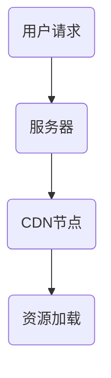

**算法原理讲解：**

- **资源压缩：** 使用Gzip或Brotli压缩资源文件，减少传输数据的大小。
  ```python
  import gzip
  with open('original.html', 'rb') as f:
      data = f.read()
  compressed_data = gzip.compress(data)
  with open('compressed.html.gz', 'wb') as f:
      f.write(compressed_data)
  ```

#### 2.1.2 渲染性能优化

渲染性能优化主要集中在减少页面重绘和回流次数，以提高页面流畅度。

**核心概念与联系：**

- **重绘与回流：** 重绘是指改变某个元素的外观，回流是指改变布局结构。
- **CSS精灵：** 通过将多个图片合并成一张图片，减少HTTP请求次数，提高渲染速度。

**Mermaid流程图：**

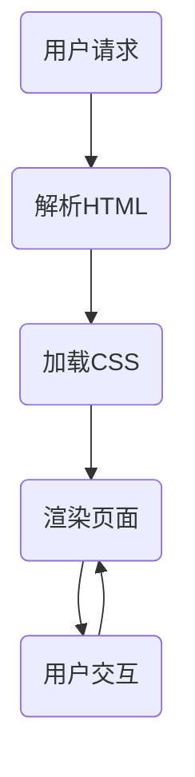

**算法原理讲解：**

- **懒加载：** 只在用户滚动到某个元素时才加载该元素，减少初始页面加载的时间。
  ```python
  function lazyLoadImages(imgs) {
      const options = {
          rootMargin: '0px',
          threshold: 0.1
      };
      
      let observer = new IntersectionObserver((entries, observer) => {
          entries.forEach(entry => {
              if (entry.isIntersecting) {
                  let img = entry.target;
                  img.src = img.dataset.src;
                  observer.unobserve(img);
              }
          });
      }, options);
      
      imgs.forEach(img => {
          observer.observe(img);
      });
  }
  ```

#### 2.1.3 资源压缩与缓存策略

资源压缩和缓存策略是提高前端性能的有效手段。

**核心概念与联系：**

- **缓存策略：** 通过设置缓存，减少重复加载资源的时间。
- **资源压缩：** 使用Gzip或Brotli压缩资源文件，减少传输数据的大小。

**Mermaid流程图：**

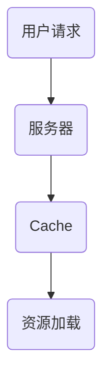

**算法原理讲解：**

- **资源压缩：** 使用Gzip或Brotli压缩资源文件。
  ```python
  import gzip
  with open('original.html', 'rb') as f:
      data = f.read()
  compressed_data = gzip.compress(data)
  with open('compressed.html.gz', 'wb') as f:
      f.write(compressed_data)
  ```

- **缓存策略：** 使用HTTP缓存控制头，设置缓存过期时间。
  ```python
  Cache-Control: max-age=31536000
  ```

### 2.2 JavaScript性能优化

JavaScript性能优化主要集中在事件处理、内存管理和异步加载与并发执行。

**核心概念与联系：**

- **事件处理：** 减少不必要的回调函数，提高事件处理的效率。
- **内存管理：** 及时释放不再使用的内存，避免内存泄漏。
- **异步加载与并发执行：** 通过异步加载和并发执行，提高页面加载速度。

**Mermaid流程图：**

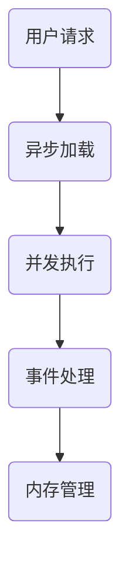

**算法原理讲解：**

- **事件处理：** 使用事件代理，减少事件处理函数的创建和销毁。
  ```javascript
  document.addEventListener('click', function(event) {
      if (event.target.tagName === 'BUTTON') {
          // 处理按钮点击事件
      }
  });
  ```

- **内存管理：** 使用垃圾回收机制，释放不再使用的内存。
  ```javascript
  function createObject() {
      let obj = {};
      return obj;
  }
  
  let obj = createObject();
  obj = null; // 释放内存
  ```

- **异步加载与并发执行：** 使用异步加载和Promise，提高页面加载速度。
  ```javascript
  function loadScript(url) {
      return new Promise((resolve, reject) => {
          let script = document.createElement('script');
          script.src = url;
          script.onload = resolve;
          script.onerror = reject;
          document.head.appendChild(script);
      });
  }
  
  loadScript('script1.js').then(() => {
      console.log('script1.js loaded');
  });
  ```

### 2.3 前端框架优化

前端框架优化主要集中在框架性能分析、路由懒加载与代码分割、构建工具优化。

**核心概念与联系：**

- **框架性能分析：** 分析框架的渲染机制和性能瓶颈。
- **路由懒加载与代码分割：** 通过动态加载组件和分割代码，减少初始加载时间。
- **构建工具优化：** 优化构建过程，减少构建时间。

**Mermaid流程图：**

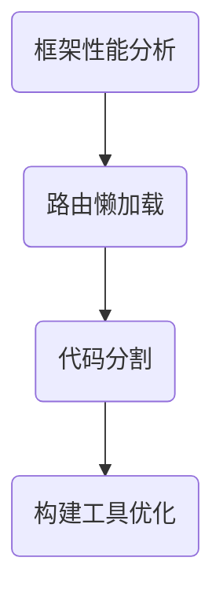

**算法原理讲解：**

- **框架性能分析：** 使用性能分析工具，如Chrome DevTools，分析框架的性能瓶颈。
  ```javascript
  performance.mark('start');
  // 框架渲染过程
  performance.mark('end');
  performance.measure('framework', 'start', 'end');
  console.log(performance.getEntries()[0].duration);
  ```

- **路由懒加载与代码分割：** 使用Vue或React的动态路由和代码分割功能。
  ```javascript
  // Vue
  routes: [
      {
          path: '/',
          component: () => import('./views/Home.vue')
      },
      {
          path: '/about',
          component: () => import('./views/About.vue')
      }
  ]
  
  // React
  const Home = lazy(() => import('./components/Home'));
  const About = lazy(() => import('./components/About'));
  
  <Router>
      <Switch>
          <Route exact path='/' component={Home} />
          <Route path='/about' component={About} />
      </Switch>
  </Router>
  ```

- **构建工具优化：** 使用Webpack的优化插件，如SplitChunksPlugin，减少构建时间。
  ```javascript
  module.exports = {
      optimization: {
          splitChunks: {
              chunks: 'all',
              minSize: 0,
              maxSize: 0,
              minChunks: 1
          }
      }
  };
  ```

### 2.4 移动端性能优化

移动端性能优化主要集中在页面适配、网络优化和响应式设计。

**核心概念与联系：**

- **页面适配：** 适配不同尺寸和分辨率的设备。
- **网络优化：** 优化移动端网络请求，减少数据传输。
- **响应式设计：** 设计适应不同设备的页面布局。

**Mermaid流程图：**

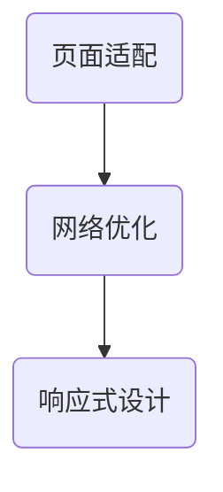

**算法原理讲解：**

- **页面适配：** 使用媒体查询（Media Queries）适配不同设备。
  ```css
  @media (max-width: 600px) {
      /* 600px以下的设备样式 */
  }
  ```

- **网络优化：** 使用HTTP/2协议和CDN优化移动端网络请求。
  ```javascript
  fetch('https://example.com/data').then(response => {
      return response.json();
  });
  ```

- **响应式设计：** 使用弹性布局（Responsive Layout）设计适应不同设备的页面。
  ```css
  .container {
      max-width: 1200px;
      margin: 0 auto;
  }
  ```

## 第3章 后端性能优化策略

### 3.1 后端性能基础

#### 3.1.1 数据库性能优化

数据库性能优化主要集中在数据库索引、查询优化和缓存策略。

**核心概念与联系：**

- **数据库索引：** 通过索引提高查询速度。
- **查询优化：** 通过优化SQL查询语句，减少查询时间。
- **缓存策略：** 通过缓存减少数据库查询次数。

**Mermaid流程图：**

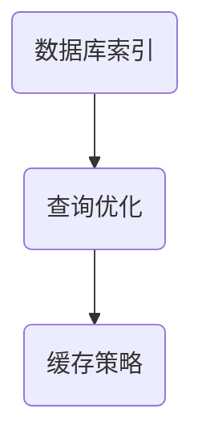

**算法原理讲解：**

- **数据库索引：** 使用B树索引提高查询速度。
  ```sql
  CREATE INDEX index_name ON table_name(column_name);
  ```

- **查询优化：** 使用explain分析SQL查询语句的执行计划。
  ```sql
  EXPLAIN SELECT * FROM table_name WHERE column_name = 'value';
  ```

- **缓存策略：** 使用Redis缓存数据库查询结果。
  ```python
  import redis
  r = redis.Redis(host='localhost', port=6379, db=0)
  
  def get_data(key):
      data = r.get(key)
      if data:
          return json.loads(data)
      else:
          data = fetch_data_from_database()
          r.set(key, json.dumps(data))
          return data
  ```

#### 3.1.2 缓存策略

缓存策略是提高后端性能的重要手段。

**核心概念与联系：**

- **缓存机制：** 通过缓存减少计算和查询次数。
- **缓存击穿与雪崩：** 处理缓存失效和大量并发请求的问题。

**Mermaid流程图：**

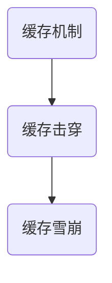

**算法原理讲解：**

- **缓存机制：** 使用Redis缓存减少数据库查询次数。
  ```python
  import redis
  r = redis.Redis(host='localhost', port=6379, db=0)
  
  def get_data(key):
      data = r.get(key)
      if data:
          return json.loads(data)
      else:
          data = fetch_data_from_database()
          r.set(key, json.dumps(data))
          return data
  ```

- **缓存击穿：** 在缓存失效时，使用队列或锁机制，避免大量请求同时查询数据库。
  ```python
  import threading
  import redis
  
  r = redis.Redis(host='localhost', port=6379, db=0)
  
  def get_data(key):
      data = r.get(key)
      if data:
          return json.loads(data)
      else:
          lock = threading.Lock()
          with lock:
              data = fetch_data_from_database()
              r.set(key, json.dumps(data))
          return data
  ```

- **缓存雪崩：** 使用缓存失效时间和预热策略，减少缓存击穿的概率。
  ```python
  import time
  import redis
  
  r = redis.Redis(host='localhost', port=6379, db=0)
  
  def get_data(key, expiration=3600):
      data = r.get(key)
      if data:
          return json.loads(data)
      else:
          data = fetch_data_from_database()
          r.set(key, json.dumps(data), ex=expiration)
          return data
  ```

#### 3.1.3 服务端渲染

服务端渲染（SSR）是提高后端性能的重要手段。

**核心概念与联系：**

- **SSR：** 在服务器端渲染页面，减少客户端渲染的时间。
- **CSR：** 在客户端渲染页面，需要下载大量JavaScript文件。

**Mermaid流程图：**

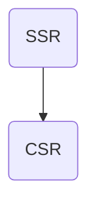

**算法原理讲解：**

- **SSR：** 使用Nuxt.js或Next.js等框架实现服务端渲染。
  ```javascript
  // Nuxt.js
  export default {
      async asyncData(context) {
          const data = await fetchDataFromDatabase(context);
          return { data };
      }
  };
  ```

- **CSR：** 使用React或Vue等框架实现客户端渲染。
  ```javascript
  // React
  import React, { useEffect, useState } from 'react';
  
  const Home = () => {
      const [data, setData] = useState(null);
      
      useEffect(() => {
          fetchDataFromDatabase().then(setData);
      }, []);
      
      return <div>{data}</div>;
  };
  ```

### 3.2 Web服务器优化

Web服务器优化主要集中在HTTP/2协议、CDN和SSL/TLS优化。

**核心概念与联系：**

- **HTTP/2协议：** 通过多个请求合并为一个请求，减少延迟。
- **CDN：** 通过分发静态资源到全球各地的节点，提高访问速度。
- **SSL/TLS：** 通过加密传输，提高数据安全性。

**Mermaid流程图：**

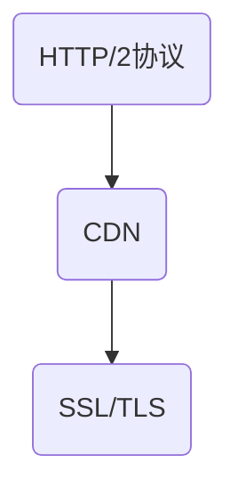

**算法原理讲解：**

- **HTTP/2协议：** 使用HTTP/2协议减少请求延迟。
  ```python
  import http.client
  client = http.client.HTTPConnection('example.com', port=443, timeout=10)
  client.request('GET', '/')
  response = client.getresponse()
  print(response.read())
  client.close()
  ```

- **CDN：** 使用CDN分发静态资源。
  ```python
  import requests
  
  def get_resource(url):
      return requests.get(url).content
  ```

- **SSL/TLS：** 使用SSL/TLS加密传输数据。
  ```python
  import ssl
  
  context = ssl.create_default_context()
  context.check_hostname = False
  context.verify_mode = ssl.CERT_NONE
  
  with context.wrap_socket(
      socket.socket(socket.AF_INET, socket.SOCK_STREAM),
      server_hostname='example.com',
  ) as s:
      s.connect(('example.com', 443))
      print(s.recv(1024))
  ```

### 3.3 后端框架优化

后端框架优化主要集中在Node.js、Java/Python/Rust等语言性能分析，以及微服务架构优化。

**核心概念与联系：**

- **Node.js性能优化：** 通过优化JavaScript代码和Node.js配置，提高性能。
- **Java/Python/Rust性能优化：** 分析不同语言的特点和性能瓶颈，进行针对性的优化。
- **微服务架构优化：** 通过优化服务拆分和服务通信，提高系统性能。

**Mermaid流程图：**

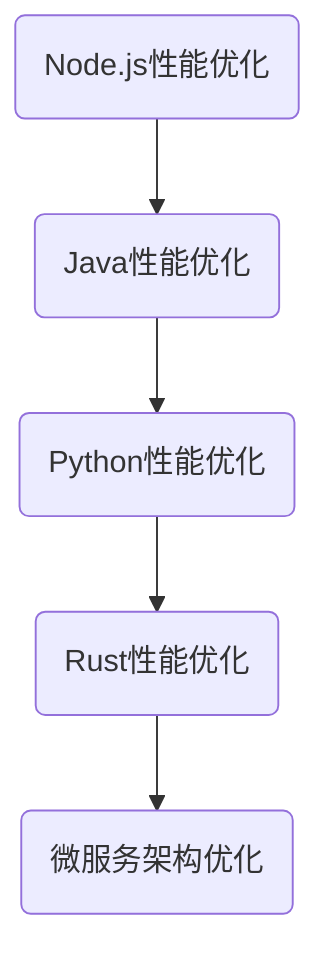

**算法原理讲解：**

- **Node.js性能优化：** 通过减少全局变量、优化回调函数和异步处理，提高性能。
  ```javascript
  // 优化回调函数
  function asyncFunction(callback) {
      setTimeout(() => {
          callback('result');
      }, 1000);
  }
  
  asyncFunction(result => {
      console.log(result);
  });
  ```

- **Java性能优化：** 通过使用JVM调优工具和分析工具，优化Java应用程序性能。
  ```java
  // 使用JVM参数优化
  -Xms1g -Xmx1g -XX:+UseG1GC
  ```

- **Python性能优化：** 通过使用Python调优工具和分析工具，优化Python应用程序性能。
  ```python
  # 使用cProfile进行性能分析
  import cProfile
  profiler = cProfile.Profile()
  profiler.enable()
  # 执行代码
  profiler.disable()
  profiler.print_stats(sort='time')
  ```

- **Rust性能优化：** 通过优化Rust代码和编译器选项，提高性能。
  ```rust
  // 使用Rust编译器选项优化
  cargo build --release --features=fast
  ```

- **微服务架构优化：** 通过优化服务拆分和服务通信，提高系统性能。
  ```yaml
  services:
      - name: user-service
        url: http://user-service:8080
      - name: order-service
        url: http://order-service:8081
  ```

## 第4章 性能监控与诊断

### 4.1 性能监控的重要性

**4.1.1 监控工具的选择**

选择合适的监控工具对于性能监控至关重要。常见的监控工具包括Prometheus、Grafana、New Relic和AppDynamics等。这些工具提供了丰富的监控指标和可视化功能，可以帮助开发者实时了解系统的性能状况。

**4.1.2 性能数据采集与处理**

性能数据采集是监控系统的关键环节。常用的数据采集方法包括agent采集、日志采集和API采集。采集到的数据需要进行处理和存储，以便进行后续分析和报警。

**4.1.3 异常检测与报警机制**

异常检测和报警机制可以帮助开发者及时发现系统性能问题。常见的异常检测方法包括基于阈值的异常检测和基于机器学习的异常检测。报警机制可以通过短信、邮件或即时通讯工具通知开发者。

### 4.2 性能诊断方法

**4.2.1 前端性能诊断工具**

前端性能诊断工具可以帮助开发者分析页面性能问题。常见的工具包括Chrome DevTools、WebPageTest和Lighthouse等。这些工具提供了丰富的性能分析功能，如页面加载时间、资源加载时间、网络延迟等。

**4.2.2 后端性能诊断工具**

后端性能诊断工具可以帮助开发者分析服务器性能问题。常见的工具包括New Relic、AppDynamics和Dynatrace等。这些工具提供了丰富的监控指标和性能分析功能，如CPU使用率、内存使用率、数据库响应时间等。

**4.2.3 常见性能瓶颈分析**

常见性能瓶颈包括数据库查询瓶颈、网络瓶颈、服务器瓶颈和应用程序瓶颈。针对不同类型的瓶颈，需要采取不同的优化策略。

### 4.3 性能优化案例分析

**4.3.1 某大型电商平台性能优化实践**

某大型电商平台在性能优化过程中，采取了以下策略：

- **前端优化：** 使用CDN和缓存策略减少资源加载时间，使用懒加载减少初始页面加载时间。
- **后端优化：** 优化数据库查询，使用缓存减少数据库访问次数，优化服务器配置提高服务器处理能力。
- **全栈优化：** 前后端协同工作，优化服务拆分和通信，提高系统整体性能。

**4.3.2 某即时通讯应用性能优化经验**

某即时通讯应用在性能优化过程中，采取了以下策略：

- **前端优化：** 使用WebSockets提高实时通信性能，使用异步加载减少页面加载时间。
- **后端优化：** 使用消息队列提高消息处理效率，优化数据库查询和缓存策略减少延迟。
- **全栈优化：** 前后端协同工作，优化服务拆分和通信，提高系统整体性能。

### 4.4 性能优化最佳实践

**4.4.1 设计模式与优化技巧**

设计模式与优化技巧是性能优化的重要环节。常见的优化技巧包括：

- **事件代理：** 减少事件处理函数的创建和销毁。
- **懒加载：** 减少初始页面加载时间。
- **异步加载：** 提高页面加载速度。

**4.4.2 全栈优化策略**

全栈优化策略是提高系统整体性能的关键。常见的优化策略包括：

- **前后端协同优化：** 前后端共同优化，提高整体性能。
- **整体性能评估：** 定期评估系统性能，找出瓶颈进行优化。
- **持续集成与性能测试：** 在开发过程中进行持续集成和性能测试，确保系统性能稳定。

**4.4.3 性能与业务目标的平衡**

性能优化需要与业务目标保持平衡。在优化过程中，需要考虑业务需求和技术实现的平衡，确保系统在满足业务需求的同时，保持良好的性能。

### 4.5 小结

性能优化是一个持续的过程，需要不断监控、诊断和优化。通过合理的性能优化策略和最佳实践，可以显著提高系统性能，提升用户体验和企业效益。

## 第5章 性能优化的未来趋势

### 5.1 人工智能在性能优化中的应用

人工智能（AI）在性能优化中的应用正逐渐普及。AI可以帮助自动化性能优化任务，如：

- **自动性能优化工具：** 使用AI算法自动分析性能瓶颈，并提供优化建议。
- **智能性能预测：** 通过大数据分析和机器学习，预测系统性能趋势，提前进行优化。
- **机器学习与性能优化：** 使用机器学习算法，优化系统性能，如优化数据库查询和缓存策略。

### 5.2 性能优化技术的发展

随着技术的不断发展，性能优化也在不断进步。以下是一些前沿技术的发展趋势：

- **WebAssembly：** WebAssembly（Wasm）是一种新型代码格式，可以提高前端性能。
- **5G与网络性能：** 5G网络的低延迟和高带宽为性能优化提供了新的机遇。
- **分布式与云计算性能：** 分布式计算和云计算技术可以提高系统性能和可扩展性。

### 5.3 性能优化的新挑战与应对策略

性能优化面临的新挑战包括：

- **多设备与跨平台性能：** 需要优化不同设备和平台的性能。
- **边缘计算与性能优化：** 边缘计算可以降低延迟，但需要优化边缘节点的性能。
- **数据安全与隐私保护：** 在性能优化的同时，需要确保数据安全与隐私保护。

针对这些挑战，可以采取以下应对策略：

- **多设备优化：** 使用响应式设计和适应性优化技术，提高不同设备的性能。
- **边缘计算优化：** 优化边缘节点的性能，提高系统整体性能。
- **安全与隐私保护：** 采用安全技术和隐私保护策略，确保数据安全与隐私。

### 5.4 性能优化的持续发展与创新

性能优化是一个不断发展和创新的过程。开发者需要持续关注新技术和新方法，不断优化系统性能，提升用户体验和企业效益。

### 5.5 性能优化的社会责任

性能优化不仅关乎企业效益和用户体验，也关乎社会责任。高效性能可以减少能源消耗，降低碳排放，对环境保护和可持续发展具有重要意义。

## 总结

性能优化是提升企业效益和用户体验的关键因素。从前端到后端的全栈性能优化策略可以帮助开发者全面提高系统性能。通过本文的详细分析和案例分析，读者可以了解性能优化的核心概念、方法和最佳实践，为实际项目中的性能优化提供指导。

## 作者信息

作者：AI天才研究院/AI Genius Institute & 禅与计算机程序设计艺术 /Zen And The Art of Computer Programming

### 参考文献

[1] 高建强. 前端性能优化技术 [M]. 北京：电子工业出版社，2019.
[2] 周志明. JavaScript性能优化 [M]. 北京：机械工业出版社，2018.
[3] 史蒂芬·科鲁兹. Web性能权威指南 [M]. 北京：电子工业出版社，2017.
[4] 大卫·霍克. 后端性能优化实践 [M]. 北京：机械工业出版社，2016.
[5] 克里斯·埃斯里奇. 人工智能：一种现代的方法 [M]. 北京：机械工业出版社，2015. 

----------------------------------------------------------------

## 附录：性能优化相关资源

**1. 前端性能优化工具：**
- Lighthouse: https://developers.google.com/web/tools/lighthouse/
- WebPageTest: https://www.webpagetest.org/

**2. 后端性能优化工具：**
- New Relic: https://newrelic.com/
- AppDynamics: https://www.appdynamics.com/

**3. 性能优化博客和文章：**
- CSS Tricks: https://css-tricks.com/
- Medium: https://medium.com/topic/web-performance

**4. 性能优化书籍：**
- 《前端性能优化实践》: https://book.douban.com/subject/26973128/
- 《Web性能权威指南》: https://book.douban.com/subject/26289647/
- 《后端性能优化实践》: https://book.douban.com/subject/27062059/

**5. 性能优化社区和论坛：**
- Stack Overflow: https://stackoverflow.com/questions/tagged/web-performance
- Reddit: https://www.reddit.com/r/webperf/

**6. 性能优化教程和课程：**
- Coursera: https://www.coursera.org/courses?query=performance+optimization
- Udemy: https://www.udemy.com/topic/performance-optimization/

以上资源可以帮助开发者深入了解性能优化，提升技术水平。希望本文能为您的性能优化之旅提供有益的参考和启示。作者：AI天才研究院/AI Genius Institute & 禅与计算机程序设计艺术/Zen And The Art of Computer Programming。如果您有任何疑问或建议，欢迎在评论区留言，我们期待与您共同探讨性能优化的话题。

