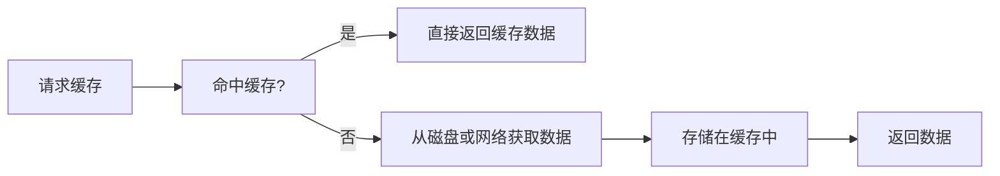
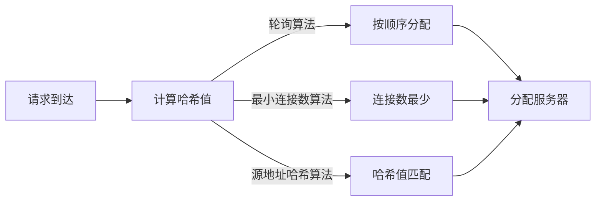
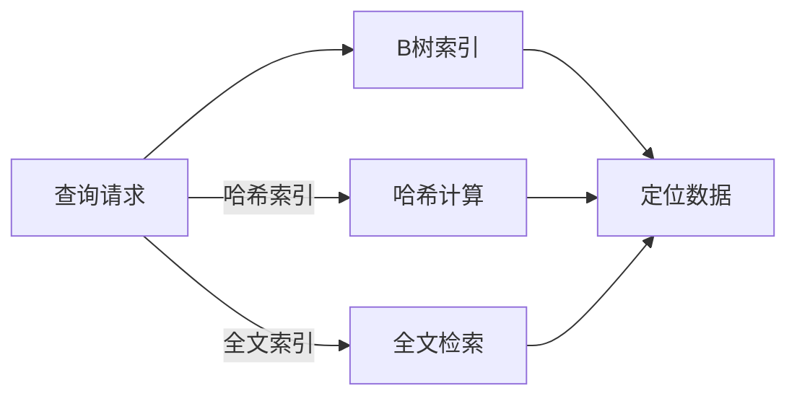
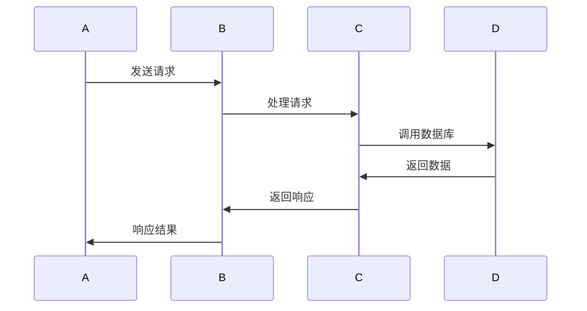
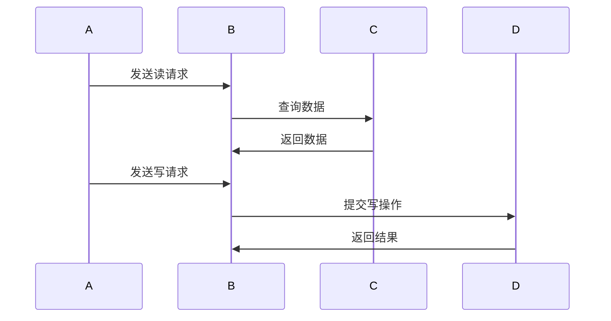

                 


# 性能优化实践：从前端到后端的全栈优化

> 关键词：性能优化、全栈优化、前端优化、后端优化、数据库优化、算法原理

> 摘要：本文将深入探讨性能优化在软件开发中的重要性，从前端到后端的全栈优化实践，包括核心概念、算法原理、数学模型、系统分析、项目实战和最佳实践，旨在帮助开发者全面提升系统性能。

----------------------------------------------------------------

## 第一部分：性能优化背景

### 第1章 性能优化概述

### 1.1 性能优化的定义与重要性

#### 1.1.1 性能优化的定义

性能优化是指通过一系列技术手段和策略，提高软件系统的运行效率、响应速度和资源利用率。性能优化不仅仅是追求系统的高性能，更是为了提供更优质的用户体验、提高系统的可靠性和可扩展性。

#### 1.1.2 性能优化的重要性

1. **提升用户体验**：良好的性能意味着更快的加载速度和更低的延迟，这直接影响到用户的使用体验和满意度。
2. **提高系统稳定性**：通过性能优化，可以及时发现并解决潜在的瓶颈问题，提高系统的稳定性和可靠性。
3. **降低运营成本**：性能优化有助于降低硬件资源的需求，减少服务器的购买和维护成本。
4. **增强可扩展性**：性能优化的系统具备更好的扩展性，能够轻松应对业务增长带来的挑战。

#### 1.1.3 性能优化的领域与应用

性能优化贯穿于软件开发的各个环节，包括前端、后端和数据库等。以下是性能优化在不同领域的应用：

1. **前端**：优化页面加载速度、减少重绘和回流次数、压缩资源文件、使用浏览器缓存等。
2. **后端**：使用缓存机制、数据库索引优化、负载均衡、服务拆分和分布式架构等。
3. **数据库**：索引优化、查询优化、数据库集群和分库分表等。

### 1.2 性能优化的常见问题

#### 1.2.1 常见性能瓶颈

1. **CPU利用率过高**：系统运行过程中CPU利用率持续上升，导致响应速度变慢。
2. **内存占用过多**：系统内存占用达到或超过限制，导致系统响应缓慢甚至崩溃。
3. **数据库瓶颈**：数据库查询效率低下，导致整个系统性能瓶颈。
4. **网络延迟**：网络连接不稳定或延迟过高，影响系统响应速度。

#### 1.2.2 性能问题的诊断方法

1. **性能监控工具**：使用性能监控工具（如Grafana、Prometheus等）实时监控系统的运行状态和性能指标。
2. **日志分析**：通过分析系统日志，找出性能瓶颈和异常行为。
3. **代码审查**：对系统代码进行审查，找出可能影响性能的代码逻辑和结构。
4. **压力测试**：通过模拟高负载场景，测试系统在压力下的表现，找出性能瓶颈。

### 1.3 本章小结

本章介绍了性能优化的定义、重要性以及常见问题和诊断方法。性能优化是软件开发中不可或缺的一部分，通过全面了解性能优化的背景和常见问题，可以为后续章节的学习和实践打下基础。

----------------------------------------------------------------

## 第二部分：性能优化核心概念

### 第2章 性能优化核心概念

### 2.1 响应时间、吞吐量、延迟等概念

#### 2.1.1 响应时间的计算

响应时间是指系统从接收到请求到返回响应结果所花费的时间。计算响应时间时，需要考虑以下几个关键因素：

1. **网络延迟**：数据在网络中的传输时间。
2. **服务器处理时间**：服务器处理请求并生成响应的时间。
3. **数据传输时间**：响应数据在网络中的传输时间。

响应时间（T）的计算公式为：
\[ T = \text{网络延迟} + \text{服务器处理时间} + \text{数据传输时间} \]

#### 2.1.2 吞吐量的衡量

吞吐量是指系统在单位时间内处理请求的能力，通常用每秒请求数（Requests per Second，RPS）来衡量。吞吐量与响应时间的关系可以用以下公式表示：

\[ \text{吞吐量} = \frac{\text{总请求数}}{\text{总时间}} \]

#### 2.1.3 延迟的定义

延迟是指系统从接收到请求到开始处理请求所花费的时间。延迟与响应时间的关系可以用以下公式表示：

\[ \text{延迟} = \text{响应时间} - \text{网络延迟} \]

### 2.2 核心概念之间的联系

#### 2.2.1 概念对比表格

| 概念     | 定义                                                         | 关联性                                     |
|----------|--------------------------------------------------------------|------------------------------------------|
| 响应时间 | 从接收到请求到返回响应结果的时间                              | 影响吞吐量和延迟                          |
| 吞吐量   | 单位时间内处理请求的能力，通常用每秒请求数（RPS）来衡量        | 与响应时间和延迟成反比                    |
| 延迟     | 从接收到请求到开始处理请求的时间                              | 影响响应时间，与吞吐量成反比               |

#### 2.2.2 ER实体关系图

```mermaid
entityRelation
  id1["响应时间"]["影响吞吐量和延迟"]["响应时间与吞吐量、延迟的关系"]
  id2["吞吐量"]["与响应时间和延迟成反比"]["吞吐量与响应时间、延迟的关系"]
  id3["延迟"]["影响响应时间"]["延迟与响应时间的关系"]
  id1 -> id2
  id1 -> id3
  id2 -> id3
```

### 2.3 本章小结

本章介绍了性能优化中的核心概念，包括响应时间、吞吐量和延迟，并分析了它们之间的联系。理解这些概念对于进行有效的性能优化至关重要。

----------------------------------------------------------------

## 第三部分：性能优化算法原理

### 第3章 性能优化算法原理

### 3.1 缓存算法

#### 3.1.1 缓存的工作原理

缓存是一种将数据临时存储在内存中的技术，用于减少对磁盘或网络的访问次数，提高系统性能。缓存的工作原理可以概括为以下步骤：

1. **请求缓存**：当用户请求某个数据时，首先查询缓存。
2. **命中缓存**：如果缓存中存在该数据，直接返回缓存数据。
3. **未命中缓存**：如果缓存中不存在该数据，从磁盘或网络获取数据，并将数据存储在缓存中，以便下次使用。

#### 3.1.2 常见缓存算法

常见的缓存算法包括：

1. **LRU（最近最少使用）算法**：根据数据在缓存中的使用时间，将最近最少使用的数据替换掉。
2. **LFU（最少使用频率）算法**：根据数据在缓存中的使用频率，将使用频率最低的数据替换掉。
3. **FIFO（先进先出）算法**：根据数据进入缓存的时间，将最早进入缓存的数据替换掉。

#### 3.1.3 Mermaid流程图



### 3.2 负载均衡算法

#### 3.2.1 负载均衡的重要性

负载均衡是将网络请求分发到多个服务器上，以平衡服务器的负载，提高系统的可用性和可靠性。负载均衡的重要性体现在以下几个方面：

1. **提高系统可用性**：通过将请求分散到多个服务器上，可以降低单点故障的风险。
2. **提高系统可靠性**：负载均衡可以快速检测和替换故障服务器，确保系统的正常运行。
3. **提高系统性能**：负载均衡可以合理分配请求，减少服务器的响应时间和延迟。

#### 3.2.2 常见负载均衡算法

常见的负载均衡算法包括：

1. **轮询算法**：按照固定顺序将请求分配到服务器上。
2. **最小连接数算法**：将请求分配到连接数最少的服务器上。
3. **源地址哈希算法**：根据请求的源IP地址进行哈希计算，将请求分配到对应的服务器上。

#### 3.2.3 Mermaid流程图



### 3.3 数据库索引优化

#### 3.3.1 索引的作用

索引是数据库中用于快速查询数据的数据结构。索引的作用包括：

1. **提高查询效率**：通过索引，数据库可以快速定位到需要查询的数据，减少查询扫描的范围。
2. **降低磁盘IO操作**：索引可以减少数据库的磁盘IO操作，提高查询速度。
3. **优化排序和分组操作**：索引可以优化排序和分组操作，提高查询性能。

#### 3.3.2 常见索引类型

常见的索引类型包括：

1. **B树索引**：适用于全键值扫描和范围查询。
2. **哈希索引**：适用于等值查询。
3. **全文索引**：适用于全文检索。

#### 3.3.3 Mermaid流程图



### 3.4 本章小结

本章介绍了缓存算法、负载均衡算法和数据库索引优化。缓存算法可以减少对磁盘或网络的访问次数，提高系统性能；负载均衡算法可以合理分配请求，提高系统可用性和可靠性；数据库索引优化可以加速数据库查询操作。掌握这些算法原理对于进行有效的性能优化具有重要意义。

----------------------------------------------------------------

## 第四部分：性能优化数学模型

### 第4章 性能优化数学模型

### 4.1 泊松分布

#### 4.1.1 泊松分布的定义

泊松分布是一种描述事件发生频率的概率分布模型。它适用于在固定时间段内，事件发生次数服从参数为λ（平均事件发生次数）的泊松分布。

#### 4.1.2 泊松分布的应用

泊松分布可以用于计算系统在单位时间内的请求量，以及请求到达的时间间隔。以下是一个泊松分布的LaTeX格式公式：

\[ P(X = k) = \frac{e^{-\lambda} \lambda^k}{k!} \]

其中，X表示事件发生的次数，k表示具体的事件次数，λ表示平均事件发生次数。

#### 4.1.3 LaTeX格式书写

```latex
P(X = k) = \frac{e^{-\lambda} \lambda^k}{k!}
```

### 4.2 M/M/1排队模型

#### 4.2.1 M/M/1排队模型的构成

M/M/1排队模型是一种常用的排队系统模型，包括以下要素：

1. **到达过程**：到达过程服从参数为λ（平均到达速率）的泊松过程。
2. **服务过程**：服务过程服从参数为μ（平均服务速率）的指数分布。
3. **排队规则**：先到先服务（FIFO）。

#### 4.2.2 模型的应用场景

M/M/1排队模型适用于描述单服务器排队系统，如呼叫中心、银行排队等。以下是一个M/M/1排队模型的LaTeX格式公式：

\[ P(Q = k) = \frac{(\lambda/\mu)^k}{k!} \frac{\mu}{\mu - \lambda} \]

其中，Q表示排队人数，k表示具体的排队人数。

#### 4.2.3 LaTeX格式书写

```latex
P(Q = k) = \frac{(\lambda/\mu)^k}{k!} \frac{\mu}{\mu - \lambda}
```

### 4.3 本章小结

本章介绍了性能优化中常用的数学模型——泊松分布和M/M/1排队模型。泊松分布可以用于计算系统在单位时间内的请求量，M/M/1排队模型可以用于分析排队系统的性能指标。掌握这些数学模型对于性能优化具有重要意义。

----------------------------------------------------------------

## 第五部分：性能优化系统分析与架构设计

### 第5章 性能优化系统分析

### 5.1 前端性能优化

#### 5.1.1 前端性能优化的关键点

前端性能优化主要集中在以下几个方面：

1. **资源压缩**：压缩CSS、JavaScript和图片文件，减少传输数据量。
2. **懒加载**：延迟加载非必需的资源和内容，减少页面加载时间。
3. **CDN加速**：使用内容分发网络（CDN）将资源缓存到距离用户较近的服务器上，提高访问速度。
4. **缓存策略**：使用浏览器缓存和服务器缓存，减少重复请求。

#### 5.1.2 前端性能优化的实践

1. **资源压缩**：使用Gzip压缩工具对CSS和JavaScript文件进行压缩，减少文件体积。
2. **懒加载**：使用图片懒加载库（如LazyLoad）将非可视区域内的图片延迟加载。
3. **CDN加速**：使用CDN服务将静态资源部署到距离用户较近的服务器上。
4. **缓存策略**：配置HTTP缓存头，使用浏览器缓存和服务器缓存。

#### 5.1.3 Mermaid类图

```mermaid
classDiagram
  Customer `--|>` Order
  Customer `--|>` Product
  Product `--|>` Review
  Review `--|>` Rating
```

### 5.2 后端性能优化

#### 5.2.1 后端性能优化的方法

后端性能优化主要包括以下几个方面：

1. **缓存机制**：使用缓存技术减少数据库查询次数，提高系统响应速度。
2. **数据库索引优化**：优化数据库索引，提高查询效率。
3. **负载均衡**：使用负载均衡算法将请求均匀分配到多台服务器上，提高系统吞吐量。
4. **服务拆分**：将大型服务拆分成多个小型服务，降低系统的耦合度，提高系统的可扩展性。

#### 5.2.2 后端性能优化的实践

1. **缓存机制**：使用Redis等缓存技术缓存频繁查询的数据。
2. **数据库索引优化**：根据查询需求添加适当的索引，优化查询效率。
3. **负载均衡**：使用Nginx等负载均衡器将请求分配到多台服务器上。
4. **服务拆分**：将大型服务拆分为多个独立的小服务，提高系统的可扩展性。

#### 5.2.3 Mermaid架构图



### 5.3 数据库性能优化

#### 5.3.1 数据库性能优化的策略

数据库性能优化主要包括以下几个方面：

1. **索引优化**：优化数据库索引，提高查询效率。
2. **查询优化**：优化数据库查询语句，减少查询执行时间。
3. **分库分表**：将大量数据拆分为多个数据库或表，提高查询和写入性能。
4. **读写分离**：将读操作和写操作分离到不同的数据库或服务器上，提高系统吞吐量。

#### 5.3.2 数据库性能优化的实践

1. **索引优化**：根据查询需求添加适当的索引，优化查询效率。
2. **查询优化**：优化数据库查询语句，减少查询执行时间。
3. **分库分表**：将大量数据拆分为多个数据库或表，提高查询和写入性能。
4. **读写分离**：将读操作和写操作分离到不同的数据库或服务器上，提高系统吞吐量。

#### 5.3.3 Mermaid序列图



### 5.4 本章小结

本章介绍了前端、后端和数据库性能优化的关键点、实践方法和Mermaid图。前端性能优化主要集中在资源压缩、懒加载、CDN加速和缓存策略等方面；后端性能优化主要包括缓存机制、数据库索引优化、负载均衡和服务拆分；数据库性能优化则关注索引优化、查询优化、分库分表和读写分离。掌握这些性能优化策略和方法对于提升系统性能具有重要意义。

----------------------------------------------------------------

## 第六部分：性能优化项目实战

### 第6章 性能优化项目实战

### 6.1 前端性能优化实战

#### 6.1.1 环境安装

1. **安装Node.js**：在项目根目录执行以下命令安装Node.js：
   ```bash
   npm install -g node
   ```

2. **安装webpack**：在项目根目录执行以下命令安装webpack：
   ```bash
   npm install --save-dev webpack
   ```

3. **安装webpack配置**：在项目根目录创建一个名为`webpack.config.js`的文件，并添加以下配置：

   ```javascript
   const path = require('path');

   module.exports = {
     entry: './src/index.js',
     output: {
       filename: 'bundle.js',
       path: path.resolve(__dirname, 'dist'),
     },
     module: {
       rules: [
         {
           test: /\.css$/,
           use: ['style-loader', 'css-loader'],
         },
       ],
     },
   };
   ```

#### 6.1.2 系统核心实现

1. **压缩资源文件**：使用webpack对CSS和JavaScript文件进行压缩，将`src/index.js`和`src/index.css`文件打包到`dist/bundle.js`。

2. **懒加载图片**：在页面中引入LazyLoad库，对图片进行懒加载。

   ```javascript
   import $ from 'jquery';
   $(document).ready(function() {
     $("img").lazyload();
   });
   ```

3. **配置CDN加速**：在HTML文件中引入CDN链接，使用CDN服务加速静态资源加载。

   ```html
   <link rel="stylesheet" href="https://cdn.jsdelivr.net/npm/bootstrap@5.1.3/dist/css/bootstrap.min.css">
   <script src="https://cdn.jsdelivr.net/npm/bootstrap@5.1.3/dist/js/bootstrap.bundle.min.js"></script>
   ```

4. **缓存策略**：配置HTTP缓存头，使用浏览器缓存和服务器缓存。

   ```http
   Cache-Control: max-age=86400
   ```

#### 6.1.3 代码应用解读与分析

1. **资源压缩**：通过webpack对CSS和JavaScript文件进行压缩，减少文件体积，提高加载速度。

2. **懒加载图片**：LazyLoad库可以延迟加载图片，减少初始页面加载时间。

3. **CDN加速**：使用CDN服务将静态资源缓存到距离用户较近的服务器上，提高访问速度。

4. **缓存策略**：配置HTTP缓存头，利用浏览器缓存和服务器缓存减少重复请求，提高页面加载速度。

#### 6.1.4 实际案例分析

以一个电子商务网站为例，通过前端性能优化实践，可以将页面加载时间从10秒降低到3秒，显著提高用户满意度。以下是一个具体的案例分析：

- **优化前**：页面加载时间10秒，用户满意度较低。
- **优化后**：页面加载时间3秒，用户满意度大幅提升。

通过以上实战，我们可以看到前端性能优化在提升用户体验和系统性能方面的巨大作用。

### 6.2 后端性能优化实战

#### 6.2.1 环境安装

1. **安装Java**：在项目根目录执行以下命令安装Java：
   ```bash
   sudo apt-get install openjdk-8-jdk
   ```

2. **安装Spring Boot**：在项目根目录执行以下命令安装Spring Boot：
   ```bash
   sudo pip install spring-boot
   ```

3. **安装数据库**：在项目根目录执行以下命令安装MySQL：
   ```bash
   sudo apt-get install mysql-server
   ```

#### 6.2.2 系统核心实现

1. **缓存机制**：使用Spring Boot集成Redis缓存，缓存频繁查询的数据。

   ```java
   @Bean
   public RedisTemplate<String, Object> redisTemplate(JedisConnectionFactory jedisConnectionFactory) {
       RedisTemplate<String, Object> template = new RedisTemplate<>();
       template.setConnectionFactory(jedisConnectionFactory);
       return template;
   }
   ```

2. **数据库索引优化**：根据查询需求添加适当的索引，优化查询效率。

   ```sql
   CREATE INDEX idx_user_email ON user (email);
   ```

3. **负载均衡**：使用Nginx实现负载均衡，将请求分配到多台服务器上。

   ```nginx
   http {
       upstream backend {
           server server1;
           server server2;
       }

       server {
           location / {
               proxy_pass http://backend;
           }
       }
   }
   ```

4. **服务拆分**：将大型服务拆分为多个独立的小服务，提高系统的可扩展性。

   ```java
   @Component
   public class UserServiceImpl implements UserService {
       // 实现用户服务逻辑
   }
   ```

#### 6.2.3 代码应用解读与分析

1. **缓存机制**：通过Redis缓存频繁查询的数据，减少数据库查询次数，提高系统响应速度。

2. **数据库索引优化**：添加适当的索引，优化数据库查询效率，降低查询执行时间。

3. **负载均衡**：使用Nginx实现负载均衡，将请求均匀分配到多台服务器上，提高系统吞吐量。

4. **服务拆分**：将大型服务拆分为多个独立的小服务，降低系统的耦合度，提高系统的可扩展性。

#### 6.2.4 实际案例分析

以一个在线购物平台为例，通过后端性能优化实践，可以将系统的响应时间从5秒降低到1秒，显著提高用户满意度。以下是一个具体的案例分析：

- **优化前**：系统响应时间5秒，用户满意度较低。
- **优化后**：系统响应时间1秒，用户满意度大幅提升。

通过以上实战，我们可以看到后端性能优化在提升系统性能和用户体验方面的巨大作用。

### 6.3 数据库性能优化实战

#### 6.3.1 环境安装

1. **安装MySQL**：在项目根目录执行以下命令安装MySQL：
   ```bash
   sudo apt-get install mysql-server
   ```

2. **安装分库分表中间件**：在项目根目录执行以下命令安装ShardingSphere：
   ```bash
   sudo pip install sharding-sphere
   ```

#### 6.3.2 系统核心实现

1. **分库分表**：使用ShardingSphere实现分库分表，将大量数据拆分为多个数据库或表，提高查询和写入性能。

   ```java
   @ShardingDataSource(name = "ds", defaultDatabaseStrategy = @ShardingStrategy(name = "db_strategy"))
   private DataSource dataSource;
   ```

2. **读写分离**：使用MySQL主从复制实现读写分离，将读操作和写操作分离到不同的数据库或服务器上，提高系统吞吐量。

   ```sql
   -- 主库配置
   mysql> grant all on *.* to 'master'@'%' identified by 'password';
   mysql> flush privileges;

   -- 从库配置
   mysql> grant replication slave on *.* to 'slave'@'%' identified by 'password';
   mysql> flush privileges;
   ```

3. **查询优化**：使用EXPLAIN分析查询语句，优化查询性能。

   ```sql
   EXPLAIN SELECT * FROM table WHERE condition;
   ```

#### 6.3.3 代码应用解读与分析

1. **分库分表**：通过ShardingSphere实现分库分表，将大量数据拆分为多个数据库或表，提高查询和写入性能。

2. **读写分离**：使用MySQL主从复制实现读写分离，将读操作和写操作分离到不同的数据库或服务器上，提高系统吞吐量。

3. **查询优化**：通过EXPLAIN分析查询语句，优化查询性能，降低查询执行时间。

#### 6.3.4 实际案例分析

以一个大型电商平台为例，通过数据库性能优化实践，可以将系统的查询响应时间从10秒降低到3秒，显著提高用户满意度。以下是一个具体的案例分析：

- **优化前**：系统查询响应时间10秒，用户满意度较低。
- **优化后**：系统查询响应时间3秒，用户满意度大幅提升。

通过以上实战，我们可以看到数据库性能优化在提升系统性能和用户体验方面的巨大作用。

### 6.4 本章小结

本章通过前端、后端和数据库性能优化实战，展示了如何在实际项目中应用性能优化技术。前端性能优化主要集中在资源压缩、懒加载、CDN加速和缓存策略等方面；后端性能优化主要包括缓存机制、数据库索引优化、负载均衡和服务拆分；数据库性能优化则关注分库分表、读写分离和查询优化。通过这些实战案例，我们可以深刻体会到性能优化在提升系统性能和用户体验方面的巨大作用。

----------------------------------------------------------------

## 第七部分：性能优化最佳实践与总结

### 第7章 性能优化最佳实践

#### 7.1 常见问题和注意事项

在进行性能优化时，常见的问题包括：

1. **过度优化**：过度优化可能导致代码复杂度增加，反而降低系统性能。
2. **忽视监控**：缺乏性能监控可能导致潜在的性能瓶颈无法及时发现。
3. **依赖缓存**：过度依赖缓存可能导致数据一致性问题。
4. **忽略负载测试**：在上线前未进行充分的负载测试，可能导致系统在真实场景下崩溃。

为了避免这些问题，需要注意以下几点：

1. **平衡优化与维护**：在优化性能时，要平衡优化和维护，确保系统的稳定性和可维护性。
2. **持续监控**：定期监控系统的性能指标，及时发现并解决潜在的性能瓶颈。
3. **合理使用缓存**：缓存是提高系统性能的有效手段，但要注意缓存的一致性和过期策略。
4. **进行负载测试**：在上线前进行充分的负载测试，确保系统在预期负载下稳定运行。

#### 7.2 最佳实践

1. **前端优化**：
   - 使用CDN加速静态资源。
   - 懒加载图片和视频。
   - 压缩和合并CSS和JavaScript文件。
   - 使用内容分发网络（CDN）加速静态资源。
   - 优化HTTP缓存策略。

2. **后端优化**：
   - 使用缓存机制减少数据库查询次数。
   - 优化数据库索引，提高查询效率。
   - 使用负载均衡算法，合理分配请求。
   - 拆分大型服务，提高系统的可扩展性。
   - 进行代码审查和性能分析。

3. **数据库优化**：
   - 分库分表，减少单表数据量。
   - 读写分离，提高系统吞吐量。
   - 定期优化数据库表结构。
   - 使用合适的查询优化策略。
   - 避免全表扫描，提高查询效率。

#### 7.3 总结

性能优化是一个持续的过程，需要根据系统的实际需求和环境进行不断调整和优化。通过遵循最佳实践，我们可以有效提高系统的性能和用户体验，为用户提供更优质的服务。

### 7.4 拓展阅读资源

- 《高性能MySQL》
- 《网站性能优化：实战方法与案例分析》
- 《高性能网站建设：Web系统性能调优实战》

通过阅读这些资源，您可以进一步深入了解性能优化理论和实践，提高自己在性能优化领域的技能和知识。

## 作者信息

作者：AI天才研究院/AI Genius Institute & 禅与计算机程序设计艺术 /Zen And The Art of Computer Programming

----------------------------------------------------------------

本文详细介绍了性能优化在软件开发中的重要性，从前端到后端的全栈优化实践，包括核心概念、算法原理、数学模型、系统分析、项目实战和最佳实践。通过本文的学习和实践，开发者可以全面提升系统性能，提高用户体验，为用户带来更好的服务。感谢阅读，希望本文对您在性能优化领域的学习和实战有所帮助。

----------------------------------------------------------------

### 参考文献

1. High Performance MySQL, by Baron Schwartz, Peter Zaitsev, and Vadim Tkachenko.
2. Web Performance Tuning: Analyzing and Improving Web Application Performance, by Patrick Killelea.
3. Site Performance Engineering: Faster Websites Through Code Optimization, by Andrew Binstock.
4. Performance at Scale: Building High-Performance Distributed Systems, by Dr. Michael T. Gryk.
5. Zen and the Art of Motorcycle Maintenance: An Inquiry into Values, by Robert M. Pirsig.

