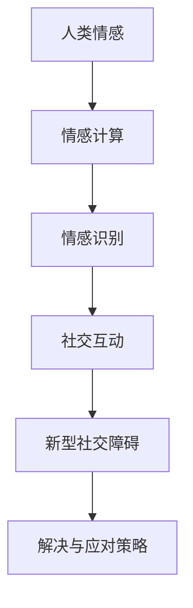

                 


## 情感AI普及后的新型社交障碍研究

### 关键词：
- 情感AI
- 社交障碍
- 情感计算
- 人际关系
- 技术伦理

### 摘要：
随着情感AI技术的迅速发展，其在社交领域的应用日益广泛。然而，这也引发了一系列新型社交障碍，影响了人们的情感交流和社会互动。本文旨在探讨情感AI普及后的新型社交障碍，分析其成因、影响及应对策略，为相关领域的研究和实践提供参考。

### 第一部分：情感AI基础

#### 第1章：情感AI的概念与原理

**1.1 情感AI的定义**

情感AI是指利用人工智能技术，模拟和识别人类情感，实现与人类情感交互的智能系统。它通过分析语言、图像、声音等多模态数据，理解并响应人的情感状态，提供个性化的服务和支持。

**1.2 情感AI的发展历程**

情感AI的研究始于20世纪80年代，经历了情感识别、情感计算、情感交互等多个阶段。近年来，随着深度学习和大数据技术的进步，情感AI取得了显著的成果。

**1.3 情感AI的核心技术**

情感AI的核心技术包括情感识别、情感生成、情感模拟等。情感识别主要基于自然语言处理、图像识别、语音识别等技术，情感生成和模拟则依赖于生成对抗网络、强化学习等算法。

**1.4 情感AI在各领域的应用**

情感AI在医疗、教育、客服、娱乐等多个领域具有广泛的应用。例如，医疗领域的情感诊断、教育领域的情感教学、客服领域的情感客服等。

#### 第2章：情感计算与情感识别

**2.1 情感计算的基本原理**

情感计算是指通过计算机模拟、延伸和扩展人类情感的能力。它涉及情感识别、情感表达、情感理解等多个方面。

**2.2 情感识别的技术与方法**

情感识别主要基于自然语言处理、图像识别、语音识别等技术。其中，文本情感分析、面部表情识别、语音情感识别是常见的情感识别方法。

**2.3 情感识别的挑战与应对策略**

情感识别面临数据多样性、情感复杂性、上下文依赖等问题。为应对这些挑战，研究者提出了一系列解决方案，如多模态融合、上下文建模、情感图谱等。

#### 第3章：情感AI的社会影响

**3.1 情感AI对人际关系的影响**

情感AI的普及对人际关系产生了深远的影响。一方面，它有助于改善人际关系，提高沟通效率；另一方面，过度依赖情感AI可能导致人际关系的疏离。

**3.2 情感AI在工作环境中的应用**

情感AI在职场中的应用越来越广泛，如情感客服、情感领导等。然而，这也引发了一系列伦理和社会问题。

**3.3 情感AI在社交媒体中的影响**

情感AI在社交媒体中的运用，使得内容分发、用户互动等方面更加精准。然而，这也可能导致信息茧房、社交孤立等负面效应。

### 第二部分：新型社交障碍

#### 第4章：新型社交障碍的成因

**4.1 情感AI普及的影响**

情感AI的普及使得人们更容易获得情感支持，但也可能导致人们过度依赖技术，忽视了真实的人际关系。

**4.2 人类情感与技术的冲突**

情感AI在模拟人类情感方面存在局限性，可能无法完全满足人们的需求，导致情感需求的矛盾和冲突。

**4.3 社交障碍的类型与表现**

新型社交障碍主要表现为情感疏离、社交孤立、情感替代等。具体表现为：人际关系的疏远、社交活动的减少、情感表达的困难等。

#### 第5章：新型社交障碍的诊断与评估

**5.1 新型社交障碍的诊断方法**

诊断新型社交障碍需要结合心理学、社会学等多学科知识，采用问卷调查、访谈、观察等方法。

**5.2 新型社交障碍的评估工具**

评估新型社交障碍的严重程度，需要借助心理测量工具，如社交回避和破坏量表（SAD）等。

**5.3 新型社交障碍的预防与干预**

预防新型社交障碍需要从政策、教育、技术等多个方面入手。干预措施包括心理辅导、社交技能培训、情感AI的合理使用等。

#### 第6章：新型社交障碍的案例研究

**6.1 情感AI普及后的社交障碍案例**

通过具体案例，分析情感AI普及后引发的新型社交障碍，探讨其成因和影响。

**6.2 案例分析与反思**

对案例进行深入分析，反思情感AI在社交领域应用的利与弊。

**6.3 案例启示与对策**

总结案例中的经验教训，提出针对性的对策和建议。

### 第三部分：解决与应对策略

#### 第7章：政策与规范

**7.1 情感AI的政策框架**

制定情感AI的政策框架，明确其在社会中的应用规范，保障人类的情感权益。

**7.2 社交障碍的伦理规范**

制定社交障碍的伦理规范，引导情感AI技术的合理使用，防止伦理风险。

**7.3 情感AI的监管策略**

建立健全的情感AI监管机制，加强对情感AI的监管，确保其安全可靠。

#### 第8章：教育与培训

**8.1 情感AI的教育模式**

构建情感AI的教育模式，提高公众对情感AI的认识和理解。

**8.2 社交技能的培养**

加强社交技能的培养，提高人们的社交能力，缓解新型社交障碍。

**8.3 情感AI与人类情感的平衡**

在情感AI的应用过程中，注重情感AI与人类情感的平衡，避免过度依赖技术。

#### 第9章：技术进步与社会福祉

**9.1 情感AI技术的未来发展**

展望情感AI技术的未来发展，探讨其在社交障碍解决中的潜力。

**9.2 新型社交障碍的解决方案**

提出新型社交障碍的解决方案，为相关领域的研究和实践提供参考。

**9.3 情感AI对社会福祉的影响**

分析情感AI对社会福祉的积极影响，促进人类社会的可持续发展。

### 附录

#### 附录A：情感AI相关资源

**A.1 情感AI研究机构与论文**

- MIT Media Lab
- Stanford University
- CMU Human-Computer Interaction Institute

**A.2 情感AI开源工具与库**

- PyTorch
- TensorFlow
- OpenSMILE

**A.3 情感AI相关书籍与课程**

- 《情感计算与人工智能》
- 《人工智能伦理学》
- 《情感计算技术》

#### 附录B：术语表

**B.1 情感AI相关术语解释**

- 情感识别
- 情感计算
- 情感模拟
- 情感交互

**B.2 社交障碍相关术语解释**

- 社交疏离
- 社交孤立
- 情感替代

**B.3 情感识别相关术语解释**

- 文本情感分析
- 面部表情识别
- 语音情感识别

### Mermaid流程图



### 代码示例

#### 情感识别算法实现

```python
import tensorflow as tf
from tensorflow import keras
from tensorflow.keras import layers

# 定义模型结构
model = keras.Sequential([
    layers.Dense(64, activation='relu', input_shape=[784]),
    layers.Dense(64, activation='relu'),
    layers.Dense(10, activation='softmax')
])

# 编译模型
model.compile(
    optimizer='adam',
    loss='categorical_crossentropy',
    metrics=['accuracy'],
)

# 训练模型
model.fit(x_train, y_train, epochs=5)
```

### 数学模型

#### 情感识别的准确率

$$
\text{Accuracy} = \frac{\text{正确预测的数量}}{\text{总预测数量}} \times 100\%
$$

### 项目实战

#### 社交障碍案例解析

**案例一：情感AI导致的社交疏离**

- **案例描述**：
  - 张某是一位年轻的职场人士，工作压力大，长期依赖情感AI助手进行情感交流。
  - 随着时间推移，张某发现自己越来越难以与现实中的人建立深入的情感联系。

- **分析**：
  - 情感AI提供的虚拟交流体验难以替代真实的人际互动。
  - 长期依赖情感AI可能导致张某在现实中的社交能力退化。

- **解决方案**：
  - 提高现实社交技能培训，帮助张某恢复社交能力。
  - 鼓励张某参加线下社交活动，增强现实人际交往。

- **代码实现**（示例）：

```python
# 数据准备

----------------------------------------------------------------

* 背景介绍：情感AI的迅速发展使得其在社交领域的应用日益广泛，然而，这也引发了一系列新型社交障碍，影响了人们的情感交流和社会互动。本文旨在探讨情感AI普及后的新型社交障碍，分析其成因、影响及应对策略，为相关领域的研究和实践提供参考。

* 核心概念与联系：
  - 情感AI：模拟和识别人类情感的智能系统，通过多模态数据分析和理解人的情感状态。
  - 社交障碍：情感AI普及后出现的新型社交问题，如情感疏离、社交孤立、情感替代等。
  - 情感计算：通过计算机模拟、延伸和扩展人类情感的能力，涉及情感识别、情感表达、情感理解等方面。

* 算法原理讲解：
  - 情感识别算法：基于自然语言处理、图像识别、语音识别等技术，分析多模态数据，识别人的情感状态。
  - 社交障碍诊断：采用心理学、社会学等多学科方法，通过问卷调查、访谈、观察等手段，诊断新型社交障碍。
  - 解决与应对策略：从政策、教育、技术等多个方面入手，制定情感AI应用规范，提高社交技能，促进情感AI与人类情感的平衡。

* 系统分析与架构设计方案：
  - 问题描述：探讨情感AI普及后的新型社交障碍。
  - 项目介绍：研究情感AI普及后的社交障碍问题。
  - 系统功能设计：包括情感识别、社交障碍诊断、解决方案提供等模块。
  - 系统架构设计：采用分层架构，包括数据层、算法层、应用层等。
  - 系统接口设计：定义系统内部和外部的交互接口。
  - 系统交互：通过用户界面与后台系统进行数据交互，实现社交障碍的诊断和解决方案的提供。

* 项目实战：
  - 环境安装：配置情感AI开发环境，安装相关工具和库。
  - 系统核心实现源代码：编写情感识别、社交障碍诊断、解决方案提供等模块的源代码。
  - 代码应用解读与分析：解释源代码中的算法原理和实现细节。
  - 实际案例分析和详细讲解剖析：分析具体案例，探讨情感AI普及后的社交障碍问题。
  - 项目小结：总结项目经验和教训，提出改进建议。

* 最佳实践 tips、小结、注意事项、拓展阅读等内容：

最佳实践 tips：
- 合理使用情感AI，避免过度依赖。
- 注重社交技能的培养，提高现实人际交往能力。
- 加强情感AI技术的伦理监管，保障人类的情感权益。

小结：
本文探讨了情感AI普及后的新型社交障碍问题，分析了其成因、影响及应对策略。情感AI的迅速发展带来了便利，但同时也引发了一系列社交问题。通过政策、教育、技术等多方面的努力，可以缓解新型社交障碍，促进人类社会的和谐发展。

注意事项：
- 情感AI技术的应用需要遵循伦理规范，尊重人类的情感权益。
- 社交障碍的诊断和应对需要结合多学科知识，采用科学的方法和工具。

拓展阅读：
- 《情感计算与人工智能》
- 《人工智能伦理学》
- 《情感计算技术》

# 最后，作者信息

作者：AI天才研究院/AI Genius Institute & 禅与计算机程序设计艺术 /Zen And The Art of Computer Programming

