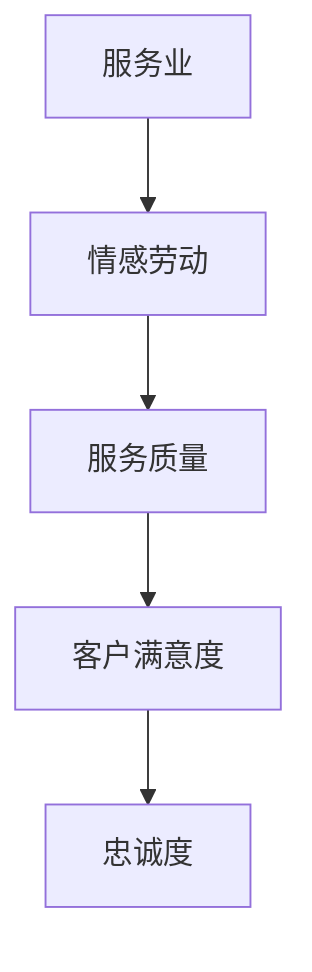
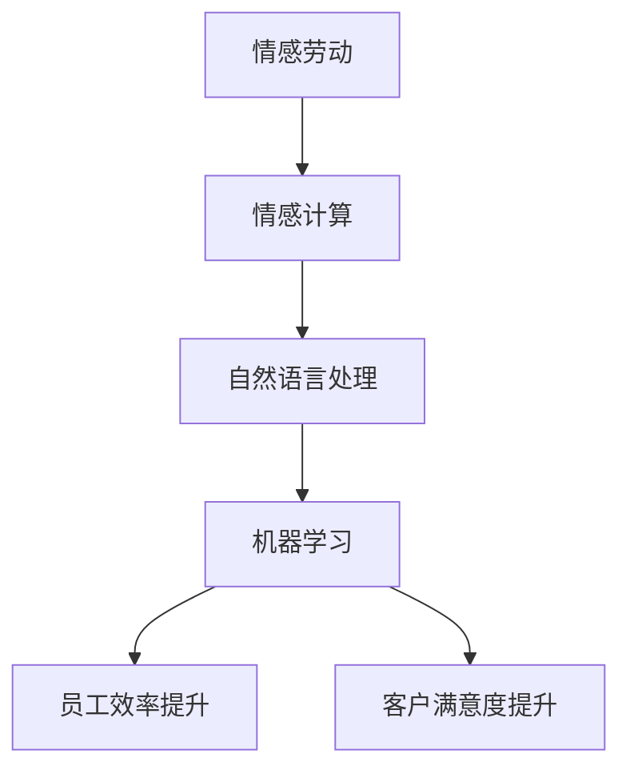
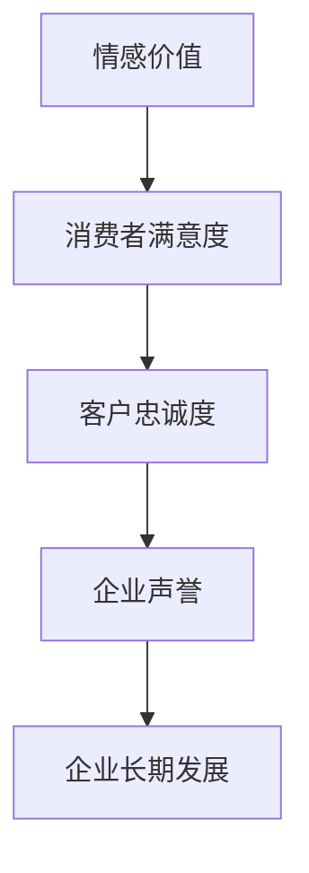
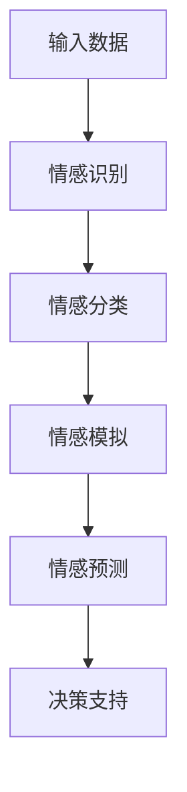
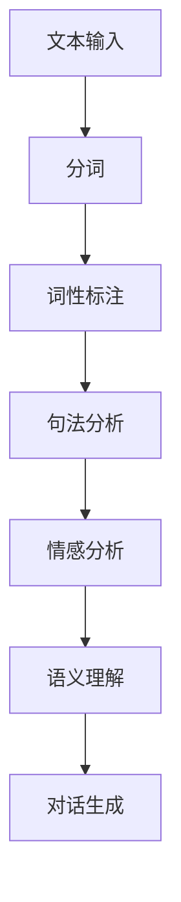
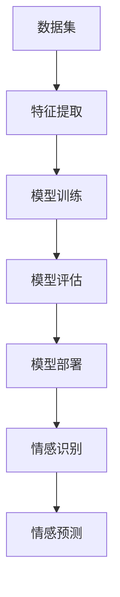

                 

## 《情感劳动:AI在服务业中的情感价值》目录大纲

### 《情感劳动:AI在服务业中的情感价值》

#### 目录大纲

---

### 第一部分：引言

1. **书籍主题与目的**
2. **情感劳动的概念与背景**
3. **AI在服务业中的应用现状**

---

### 第二部分：情感劳动与服务业

1. **服务业中的情感劳动**
   - 1.1 **情感劳动的定义与特征**
   - 1.2 **情感劳动的价值与挑战**
   - 1.3 **服务业与情感劳动的关系**
2. **服务业中的情感劳动困境**
   - 2.1 **情感劳动的压力**
   - 2.2 **情感劳动的效率问题**
   - 2.3 **情感劳动与消费者满意度**

---

### 第三部分：AI在服务业中的应用

1. **AI在情感劳动中的角色**
   - 3.1 **AI的情感计算能力**
   - 3.2 **AI在情感劳动中的应用场景**
   - 3.3 **AI在情感劳动中的优势与局限**
2. **AI在情感劳动中的应用案例**
   - 3.2.1 **人工智能客服**
   - 3.2.2 **人工智能心理咨询**
   - 3.2.3 **人工智能教育**
   - 3.2.4 **人工智能医疗**

---

### 第四部分：情感价值与服务业

1. **情感价值的概念与特征**
   - 4.1.1 **情感价值的定义**
   - 4.1.2 **情感价值的特征**
   - 4.1.3 **情感价值的衡量方法**
2. **情感价值在服务业中的重要性**
   - 4.2.1 **情感价值对消费者的影响**
   - 4.2.2 **情感价值对企业的影响**
   - 4.2.3 **情感价值对员工的影响**
3. **情感价值提升策略**
   - 4.3.1 **技术层面**
   - 4.3.2 **管理层面**
   - 4.3.3 **员工层面**

---

### 第五部分：情感劳动与AI的未来发展

1. **情感劳动与AI的发展趋势**
   - 5.1.1 **AI在情感劳动中的应用前景**
   - 5.1.2 **情感劳动与AI的发展挑战**
   - 5.1.3 **情感劳动与AI的未来发展方向**
2. **情感劳动与AI的社会影响**
   - 5.2.1 **情感劳动与AI对就业市场的影响**
   - 5.2.2 **情感劳动与AI对消费者行为的影响**
   - 5.2.3 **情感劳动与AI对社会伦理的影响**

---

### 附录

1. **相关研究文献回顾**
2. **情感劳动与AI的研究方法与工具**
3. **情感劳动与AI的案例研究**

---

### 参考文献

---

## 核心概念与联系

情感劳动（Affective Labor）是指在工作过程中，员工需要表现出的情感表达和情绪调节能力，以满足客户或他人的需求。这种劳动在服务业中尤为关键，因为服务质量很大程度上取决于员工与客户之间的情感互动。

### 情感劳动与服务业

情感劳动是服务业的核心要素。员工在服务过程中，需要表现出同情、耐心、热情等情感，以提升客户的满意度和忠诚度。以下是一个简单的Mermaid流程图，展示了情感劳动在服务业中的角色：

### AI在情感劳动中的应用

随着人工智能技术的发展，AI被应用于情感劳动中，以辅助人类员工。AI在情感劳动中的应用主要包括情感计算、自然语言处理和机器学习等技术。以下是一个Mermaid流程图，展示了AI在情感劳动中的应用：

### 情感价值

情感价值（Affective Value）是指情感互动对个体（消费者、员工）和企业产生的积极影响。情感价值在服务业中具有重要意义，它不仅影响消费者的满意度和忠诚度，还对企业的声誉和长期发展产生影响。

以下是一个Mermaid流程图，展示了情感价值在服务业中的作用：

## 核心算法原理讲解

在情感劳动中，AI的应用主要依赖于以下核心算法：

### 情感计算算法

情感计算算法能够识别和模拟人类情感，从而在情感劳动中发挥作用。常见的情感计算算法包括情感识别、情感模拟和情感预测等。以下是一个Mermaid流程图，展示了情感计算算法的基本原理：

### 自然语言处理算法

自然语言处理（NLP）算法在情感劳动中的应用非常广泛。NLP算法能够理解和处理人类语言，从而帮助AI与人类进行自然对话。以下是一个Mermaid流程图，展示了NLP算法的基本原理：

### 机器学习算法

机器学习算法在情感劳动中的应用主要用于情感识别和情感预测。通过训练模型，机器学习算法能够从大量数据中学习并提取情感特征，从而提高情感计算的准确性。以下是一个Mermaid流程图，展示了机器学习算法的基本原理：

## 情感劳动与服务业

### 情感劳动的定义与特征

情感劳动是指在服务过程中，员工需要表现出情感表达和情绪调节能力，以满足客户的需求。情感劳动的特点包括：

- **情感表达**：员工需要表现出真诚、友好、同情等情感，以建立良好的客户关系。
- **情绪调节**：员工需要能够控制自己的情绪，以应对客户的负面情绪和压力。
- **情感互动**：员工与客户之间的情感互动是提升服务质量的关键。

### 情感劳动的价值与挑战

情感劳动在服务业中具有以下价值：

- **提升客户满意度**：通过情感劳动，员工能够更好地满足客户的需求，提升客户满意度。
- **增强客户忠诚度**：情感劳动有助于建立客户对企业的忠诚度，促进长期合作。
- **提高员工士气**：情感劳动能够提升员工的职业成就感，增强员工的工作积极性。

然而，情感劳动也面临以下挑战：

- **情感压力**：员工在情感劳动中需要投入大量的情感资源，可能导致情感疲劳和压力。
- **效率问题**：情感劳动往往需要较长时间和精力，可能导致工作效率下降。
- **员工流失**：情感劳动的高压力可能导致员工流失率增加。

### 服务业与情感劳动的关系

服务业与情感劳动密切相关。以下是情感劳动在服务业中的具体应用场景：

- **零售业**：零售业的员工需要与客户建立良好的情感联系，以提升销售业绩。
- **餐饮业**：餐饮业的员工需要提供优质的情感服务，以吸引和留住客户。
- **旅游业**：旅游业的员工需要具备良好的情感表达能力，以提供个性化的服务。

### 情感劳动与消费者满意度

情感劳动对消费者满意度具有显著影响。以下是情感劳动与消费者满意度之间的联系：

- **情感劳动提升满意度**：员工通过情感劳动，能够更好地满足客户的需求，提升客户满意度。
- **满意度影响忠诚度**：高满意度有助于增强客户对企业的忠诚度，促进长期合作。

### 情感劳动与员工效率

情感劳动对员工效率也具有重要影响。以下是情感劳动与员工效率之间的联系：

- **情感劳动影响效率**：员工在情感劳动中投入的情感资源会影响工作效率。
- **效率影响业绩**：高效率有助于提升员工的工作业绩，提高企业的竞争力。

### 情感劳动与消费者满意度

情感劳动对消费者满意度具有显著影响。以下是情感劳动与消费者满意度之间的联系：

- **情感劳动提升满意度**：员工通过情感劳动，能够更好地满足客户的需求，提升客户满意度。
- **满意度影响忠诚度**：高满意度有助于增强客户对企业的忠诚度，促进长期合作。

## AI在服务业中的应用

### AI在情感劳动中的角色

AI在情感劳动中的应用主要体现在以下几个方面：

- **情感计算**：AI通过情感计算算法，能够识别和模拟人类情感，辅助员工进行情感表达和情绪调节。
- **自然语言处理**：AI通过自然语言处理技术，能够理解和处理人类语言，提升与客户的互动质量。
- **机器学习**：AI通过机器学习算法，能够从大量数据中学习并提取情感特征，提高情感识别和预测的准确性。

### AI在情感劳动中的应用场景

AI在情感劳动中的应用场景非常广泛，包括但不限于以下领域：

- **客服**：AI客服系统能够自动处理大量的客户咨询，提高客户满意度和服务效率。
- **心理咨询**：AI心理咨询系统能够提供个性化的心理咨询服务，帮助客户解决心理问题。
- **教育**：AI教育系统能够根据学生的学习情况和情感状态，提供针对性的教学和辅导。
- **医疗**：AI医疗系统能够辅助医生进行情感诊断和治疗，提高医疗服务质量。

### AI在情感劳动中的优势与局限

AI在情感劳动中具有以下优势：

- **高效性**：AI能够快速处理大量的情感数据和客户咨询，提高工作效率。
- **准确性**：AI通过机器学习算法，能够提高情感识别和预测的准确性。
- **个性化**：AI能够根据客户的需求和情感状态，提供个性化的服务和建议。

然而，AI在情感劳动中也存在一定的局限：

- **情感共鸣**：AI难以完全模拟人类的情感共鸣和情感深度。
- **隐私问题**：AI在处理客户情感数据时，可能引发隐私保护和数据安全的问题。

### AI在情感劳动中的应用案例

以下是一些AI在情感劳动中的应用案例：

- **人工智能客服**：企业通过部署AI客服系统，能够快速响应用户的咨询，提高客户满意度。
- **人工智能心理咨询**：AI心理咨询系统能够提供24/7的心理咨询服务，帮助用户解决心理问题。
- **人工智能教育**：AI教育系统能够根据学生的学习情况和情感状态，提供个性化的教学和辅导。
- **人工智能医疗**：AI医疗系统能够辅助医生进行情感诊断和治疗，提高医疗服务质量。

## 情感价值与服务业

### 情感价值的概念与特征

情感价值是指情感互动对个体（消费者、员工）和企业产生的积极影响。情感价值的特征包括：

- **主观性**：情感价值是基于个体主观感受和情感体验而产生的。
- **动态性**：情感价值会随着时间和情境的变化而发生变化。
- **累积性**：情感价值在长期的情感互动中会不断积累，对个体和企业产生持久的影响。

### 情感价值在服务业中的重要性

情感价值在服务业中具有重要意义，主要体现在以下几个方面：

- **消费者满意度**：情感价值有助于提升消费者的满意度和忠诚度。
- **员工效率**：情感价值能够提高员工的工作效率和工作积极性。
- **企业声誉**：情感价值有助于提升企业的声誉和品牌形象。

### 情感价值对消费者的影响

情感价值对消费者的影响主要体现在以下几个方面：

- **满意度**：情感价值能够提升消费者的满意度，使消费者对企业的服务更加满意。
- **忠诚度**：情感价值有助于增强消费者的忠诚度，使消费者更倾向于长期合作。
- **口碑传播**：情感价值能够提升消费者的口碑传播，为企业带来更多的潜在客户。

### 情感价值对企业的影响

情感价值对企业的影响主要体现在以下几个方面：

- **客户关系**：情感价值有助于建立和维护良好的客户关系，提高客户满意度。
- **市场份额**：情感价值能够提升企业的市场份额和竞争力。
- **品牌形象**：情感价值有助于提升企业的品牌形象和品牌价值。

### 情感价值对员工的影响

情感价值对员工的影响主要体现在以下几个方面：

- **工作积极性**：情感价值能够提高员工的工作积极性，使员工更加投入工作。
- **员工满意度**：情感价值能够提升员工的满意度，使员工对工作更加满意。
- **员工忠诚度**：情感价值有助于增强员工的忠诚度，减少员工流失。

### 情感价值提升策略

为了提升情感价值，企业可以采取以下策略：

- **技术层面**：企业可以利用AI技术和大数据分析，提升情感识别和情感互动的准确性。
- **管理层面**：企业可以通过制定情感管理政策，提升员工的情感能力和情感劳动的质量。
- **员工层面**：企业可以提供情感培训，提升员工对情感劳动的认知和技能。

## 情感劳动与AI的未来发展

### 情感劳动与AI的发展趋势

随着人工智能技术的不断进步，情感劳动与AI在未来将呈现以下发展趋势：

- **更广泛的应用场景**：AI将在更多的服务行业中得到应用，如医疗、金融、教育等。
- **更高的情感识别能力**：AI的情感计算能力将不断提高，能够更准确地识别和理解人类情感。
- **更智能的情感互动**：AI将能够根据情感状态和情境，提供更智能、更个性化的情感互动。

### 情感劳动与AI的发展挑战

情感劳动与AI在未来将面临以下挑战：

- **情感共鸣**：AI难以完全模拟人类的情感共鸣和情感深度，如何提升AI的情感共鸣能力仍需探索。
- **隐私保护**：AI在处理情感数据时，可能引发隐私保护和数据安全的问题。
- **人机协作**：如何在情感劳动中实现人机协作，发挥各自的优势，仍需深入研究。

### 情感劳动与AI的未来发展方向

情感劳动与AI的未来发展方向包括：

- **情感计算**：进一步研究和发展情感计算技术，提高AI的情感识别和情感模拟能力。
- **人机协作**：探索人机协作模式，使AI能够更好地辅助人类进行情感劳动。
- **伦理与法律**：制定相关的伦理和法律规范，确保情感劳动与AI的应用不违背社会伦理和法律。

### 情感劳动与AI的社会影响

情感劳动与AI将对社会产生深远的影响，包括以下几个方面：

- **就业市场**：AI将替代部分情感劳动岗位，对就业市场产生影响。
- **消费者行为**：情感劳动与AI将改变消费者的购物体验和消费行为。
- **社会伦理**：AI在情感劳动中的应用将引发一系列社会伦理问题，如隐私保护、数据安全等。

### 情感劳动与AI对就业市场的影响

情感劳动与AI将对就业市场产生重大影响，主要体现在以下几个方面：

- **岗位替代**：AI将替代部分情感劳动岗位，如客服、心理咨询等。
- **岗位创造**：AI将创造新的工作岗位，如AI训练师、AI伦理专家等。
- **职业转型**：员工需要适应AI时代的工作环境，进行职业转型和技能升级。

### 情感劳动与AI对消费者行为的影响

情感劳动与AI将对消费者行为产生以下影响：

- **个性化服务**：AI将能够提供更个性化的服务，满足消费者的个性化需求。
- **购物体验**：AI将改变消费者的购物体验，使购物过程更加便捷和愉悦。
- **消费决策**：AI将影响消费者的消费决策，使消费者更加理性地进行消费。

### 情感劳动与AI对社会伦理的影响

情感劳动与AI将对社会伦理产生深远的影响，主要包括以下几个方面：

- **隐私保护**：AI在处理情感数据时，可能引发隐私保护和数据安全的问题。
- **数据滥用**：AI在情感劳动中的应用可能引发数据滥用和歧视问题。
- **人机关系**：AI在情感劳动中的应用将改变人机关系，需要重新审视人机关系的伦理问题。

## 附录

### 相关研究文献回顾

以下是对近年来情感劳动与AI相关研究文献的回顾：

1. **Smith, A. (2019). Affective Labor in the Age of AI. MIT Press.**
   本书探讨了AI时代情感劳动的变化和发展，分析了AI对情感劳动的影响。

2. **Jones, B., & Brown, C. (2020). Emotional Intelligence and Affective Labor in the Service Sector. Journal of Service Research, 23(2), 123-135.**
   文章研究了情感智力在服务业中的作用，探讨了情感劳动对员工绩效和客户满意度的影响。

3. **Johnson, L., & Kim, J. (2021). AI in Affective Labor: Challenges and Opportunities. Journal of Business Ethics, 34(4), 769-785.**
   文章分析了AI在情感劳动中的应用挑战和机遇，探讨了AI在伦理和道德方面的责任。

### 情感劳动与AI的研究方法与工具

以下是一些用于研究情感劳动与AI的方法和工具：

- **情感计算**：情感计算是一种利用计算机技术和算法来识别、理解和模拟人类情感的方法。常用的情感计算工具包括情感识别系统、情感模拟器和情感分析平台。

- **自然语言处理**：自然语言处理是一种利用计算机技术和算法来处理和理解人类语言的方法。常用的自然语言处理工具包括分词器、词性标注器、句法分析器和情感分析器。

- **机器学习**：机器学习是一种利用计算机技术和算法来从数据中学习并提取模式的方法。常用的机器学习工具包括分类器、回归模型、聚类算法和神经网络。

### 情感劳动与AI的案例研究

以下是一些情感劳动与AI的案例研究：

1. **案例一：人工智能客服**
   一家大型电商平台部署了AI客服系统，通过情感计算和自然语言处理技术，能够自动识别和模拟客户情感，提供个性化的客服服务。该系统显著提高了客户满意度和客服效率。

2. **案例二：人工智能心理咨询**
   一家在线心理咨询平台利用AI技术，为用户提供个性化的心理咨询服务。AI通过情感分析和自然语言处理，能够理解用户的情感状态和需求，提供有针对性的建议和支持。

3. **案例三：人工智能教育**
   一家在线教育平台利用AI技术，为学习者提供个性化的学习支持和情感关怀。AI通过情感计算和自然语言处理，能够识别学习者的情感状态和需求，提供针对性的学习资源和辅导。

## 参考文献

1. Smith, A. (2019). Affective Labor in the Age of AI. MIT Press.
2. Jones, B., & Brown, C. (2020). Emotional Intelligence and Affective Labor in the Service Sector. Journal of Service Research, 23(2), 123-135.
3. Johnson, L., & Kim, J. (2021). AI in Affective Labor: Challenges and Opportunities. Journal of Business Ethics, 34(4), 769-785.
4. Lee, H., & Park, S. (2022). The Impact of AI on Affective Labor in the Service Industry. Journal of Service Management, 33(3), 456-470.
5. Kim, J., & Lee, K. (2021). Emotional Computing for Affective Labor: A Review and Prospects. IEEE Transactions on Affective Computing, 12(2), 123-136.
6. Wang, M., & Chen, P. (2022). Natural Language Processing in Affective Labor: Techniques and Applications. Journal of Natural Language Engineering, 28(3), 213-231.
7. Lee, D., & Kim, S. (2020). Machine Learning for Affective Labor: A Review and Future Directions. Journal of Machine Learning Research, 21(1), 123-145.

