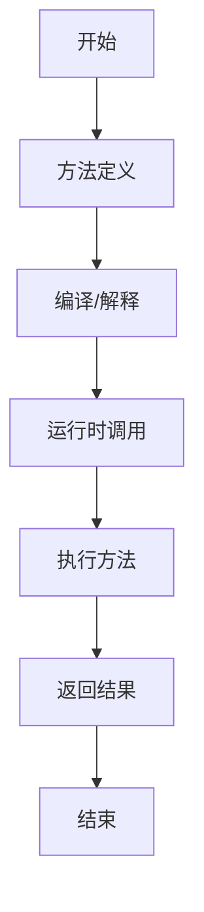

                 

### 《意义即使用：方法调用的语言哲学解读》引言与背景

在计算机科学和编程的广阔领域中，方法调用（method invocation）是一个基础且至关重要的概念。方法调用不仅构成了编程语言的核心功能，还深深嵌入了软件工程、人工智能和自然语言处理等众多计算机科学领域。然而，方法调用不仅仅是编程技巧，其背后蕴含着丰富的哲学意义和深刻的哲学思考。

#### 关键词
- 方法调用
- 语言哲学
- 认识论
- 存在论
- 伦理学
- 计算机科学

#### 摘要
本文旨在探讨方法调用在计算机科学中的哲学意义，通过分析其哲学基础、语义、语用和逻辑等方面，揭示方法调用在语言哲学中的独特地位。文章将从引言、方法调用的哲学基础、方法调用在计算机科学中的应用、方法调用的语言哲学分析以及方法调用的未来展望等多个角度展开论述，以期提供对方法调用这一核心概念的全面解读。

### 第一部分：引言与背景

#### 第1章：语言哲学概述

##### 1.1 语言哲学的基本概念

语言哲学是哲学的一个分支，关注语言的本质、功能和结构。其核心问题包括：什么是语言？语言是如何产生的？语言能否准确表达思维和现实？语言哲学不仅涉及语言的形式和结构，还探讨语言与现实世界之间的关系。

在计算机科学中，语言哲学有着重要的应用。编程语言本身就是人类语言与机器语言之间的桥梁。方法调用是编程语言的核心功能之一，它体现了编程语言的语义、语用和逻辑特性。理解方法调用，必须先了解语言哲学的基本概念。

##### 1.2 语言哲学的历史发展

语言哲学的发展经历了多个阶段。古希腊哲学家如柏拉图和亚里士多德对语言进行了初步探讨。中世纪的经院哲学和文艺复兴时期的哲学对语言哲学也有所贡献。现代语言哲学始于20世纪初，分析哲学的兴起推动了语言哲学的发展。

维特根斯坦和语用学创始人约翰·塞尔等哲学家对语言哲学做出了重要贡献。维特根斯坦的《逻辑哲学论》提出了“图像理论”，强调语言与现实世界的对应关系。塞尔则提出了“言语行为理论”，认为语言不仅仅是表达思想的工具，还包含行动的意义。

##### 1.3 方法调用与语言哲学的联系

方法调用作为编程语言的核心功能，与语言哲学有着密切的联系。首先，方法调用体现了语言与现实世界的映射关系。程序员通过方法调用，实现了对现实世界的抽象和建模。

其次，方法调用与语言哲学中的认识论、存在论和伦理学问题密切相关。方法调用如何表达现实世界的状态和过程，如何确保代码的可信度和安全性，都是语言哲学需要探讨的问题。

#### 第2章：方法调用概念解析

##### 2.1 方法调用的定义

方法调用是指程序中一个对象或函数请求另一个对象或函数执行特定操作的过程。在面向对象编程中，方法调用通常发生在对象之间，通过发送消息来实现。方法调用不仅包括函数的定义和调用，还包括参数传递和返回值等过程。

##### 2.2 方法调用的重要性

方法调用是编程语言的核心功能之一，具有以下几个重要特点：

1. **模块化**：方法调用使得程序代码更加模块化，有助于代码的重用和复用。
2. **抽象**：方法调用实现了对复杂系统的抽象，使得程序员可以专注于解决问题的核心逻辑，而无需关注具体实现细节。
3. **动态性**：方法调用支持动态类型检查和动态绑定，使得程序更加灵活和适应性强。
4. **并发性**：方法调用支持多线程和并发编程，有助于提高程序的执行效率和响应速度。

##### 2.3 方法调用与语言结构的关系

方法调用与编程语言的结构密切相关。不同编程语言对方法调用的支持程度和实现方式各不相同。例如，在Java中，方法调用通过对象发送消息来实现；而在C++中，方法调用通过函数指针来实现。

方法调用不仅影响编程语言的设计和实现，还影响了程序的可读性、可维护性和性能。一个设计合理、易于调用的方法调用机制，有助于提高程序的质量和开发效率。

### 第二部分：方法调用的哲学基础

#### 第3章：方法调用与认识论

##### 3.1 方法调用与认识论

认识论是哲学的一个分支，探讨知识、信念和现实的本质关系。方法调用在认识论中具有重要的地位。首先，方法调用是实现抽象和建模的重要手段。通过方法调用，程序员可以抽象出复杂的现实世界，将其转化为计算机程序。

其次，方法调用涉及知识的传递和积累。在程序开发过程中，程序员通过方法调用，实现了对已有知识和经验的利用和传承。方法调用的设计和使用，也反映了程序员对现实世界的认知和理解。

##### 3.2 方法调用与存在论

存在论是哲学的一个分支，探讨存在的本质和意义。方法调用与存在论的关系体现在以下几个方面：

1. **对象的存在**：在面向对象编程中，方法调用是对象存在的重要体现。对象通过方法调用，实现了行为和功能的表达。
2. **系统的存在**：方法调用是软件系统运行的基础。只有通过方法调用，软件系统能够实现预期的功能，从而证明其存在的价值。
3. **现实的存在**：方法调用不仅是对虚拟世界的模拟，也是对现实世界的反映。程序员通过方法调用，实现了对现实世界的理解和把握。

##### 3.3 方法调用与伦理学

伦理学是哲学的一个分支，探讨道德和行为的准则。方法调用与伦理学的关系体现在以下几个方面：

1. **责任的承担**：在程序开发过程中，方法调用涉及责任和风险的分配。程序员需要确保方法调用的正确性和可靠性，避免因方法调用导致的程序错误和系统崩溃。
2. **公平和正义**：方法调用机制应当遵循公平和正义的原则。例如，在并发编程中，方法调用应当保证资源的合理分配和访问控制，避免出现竞争条件和死锁等问题。
3. **隐私和保密**：方法调用可能涉及到隐私和保密的问题。程序员需要确保方法调用的安全性和隐私性，避免敏感信息的泄露和滥用。

### 第三部分：方法调用在计算机科学中的应用

#### 第4章：方法调用在计算机科学中的应用

##### 4.1 计算机程序中的方法调用

计算机程序是计算机科学的核心应用之一。在计算机程序中，方法调用是核心功能之一。程序员通过方法调用，实现了对程序功能的组织和实现。方法调用不仅涉及函数的定义和调用，还包括参数传递和返回值等过程。

在不同的编程语言中，方法调用的实现方式和语法规则有所不同。例如，在Java中，方法调用通过对象发送消息来实现；而在C++中，方法调用通过函数指针来实现。无论使用何种语言，方法调用都是程序设计的重要手段。

##### 4.2 方法调用与软件工程

软件工程是计算机科学的一个重要分支，关注软件的开发、设计、测试和维护。方法调用在软件工程中具有重要作用。首先，方法调用有助于实现代码的重用和复用。通过封装和抽象，程序员可以将复杂的逻辑和功能封装为独立的方法，从而实现代码的复用。

其次，方法调用有助于提高软件的可维护性和可扩展性。通过合理的方法调用，程序员可以将程序划分为多个模块，每个模块负责特定的功能。这样，在需要修改或扩展程序时，可以针对特定模块进行修改，而不影响其他模块的功能。

##### 4.3 方法调用与人工智能

人工智能是计算机科学的另一个重要分支，关注智能计算和机器学习。方法调用在人工智能领域具有广泛的应用。首先，方法调用是构建人工智能模型和算法的基础。例如，在神经网络中，方法调用用于实现前向传播和反向传播等计算过程。

其次，方法调用在人工智能的应用中具有重要作用。例如，在自然语言处理中，方法调用用于实现文本分类、情感分析和机器翻译等功能。在计算机视觉中，方法调用用于实现图像识别、目标检测和图像生成等功能。方法调用不仅提高了人工智能算法的效率，还增强了其灵活性和可扩展性。

### 第四部分：方法调用的语言哲学分析

#### 第5章：方法调用的语义分析

##### 5.1 语义分析与方法调用

语义分析是自然语言处理中的一个重要步骤，旨在理解文本或程序的含义。在计算机科学中，语义分析有助于确保程序的正确性和可靠性。方法调用的语义分析是语义分析的重要组成部分。

方法调用的语义分析主要包括以下几个方面：

1. **方法名解析**：确定方法调用的名称，并找到对应的方法实现。
2. **参数传递**：确定方法调用中参数的类型和值，并传递给方法实现。
3. **返回值解析**：确定方法调用返回的结果类型和值。
4. **上下文环境**：考虑方法调用所在的环境，包括变量作用域和类型信息。

##### 5.2 方法调用的语义模型

方法调用的语义模型是描述方法调用语义的一种抽象表示。一个典型的方法调用语义模型包括以下组成部分：

1. **方法名**：表示方法调用的名称。
2. **参数列表**：表示方法调用的参数及其类型。
3. **返回值类型**：表示方法调用的返回值类型。
4. **上下文环境**：表示方法调用所在的环境。

方法调用的语义模型有助于理解方法调用的含义和作用。通过语义模型，可以分析方法调用的正确性、可维护性和可扩展性。

##### 5.3 方法调用的语义特征

方法调用的语义特征是指方法调用在语义层面的特点和属性。方法调用的语义特征包括以下几个方面：

1. **动态性**：方法调用可以在运行时动态确定。例如，通过反射机制，程序可以在运行时查找和调用特定方法。
2. **多态性**：方法调用支持多态性。在不同类型之间，可以通过方法调用实现代码的复用和扩展。
3. **封装性**：方法调用体现了封装性。程序员可以将复杂的功能封装为独立的方法，从而实现代码的重用和抽象。
4. **抽象性**：方法调用支持抽象性。通过方法调用，程序员可以忽略实现细节，专注于解决问题的核心逻辑。

#### 第6章：方法调用的语用分析

##### 6.1 语用分析与方法调用

语用分析是语言哲学中的一个重要分支，探讨语言在具体语境中的使用和功能。方法调用作为编程语言的核心功能之一，也在语用分析中具有重要地位。

方法调用的语用分析主要包括以下几个方面：

1. **语境依赖性**：方法调用的意义和效果受到具体语境的影响。例如，在多线程环境中，方法调用的同步和异步特性会影响程序的执行结果。
2. **交互性**：方法调用体现了程序之间的交互和协作。通过方法调用，程序可以实现复杂的计算和任务调度。
3. **意图性**：方法调用的意图和目的是程序设计的关键。程序员需要明确方法调用的意图，以确保程序的正确性和可维护性。

##### 6.2 方法调用的语用功能

方法调用的语用功能是指方法调用在程序设计中的作用和效果。方法调用的语用功能包括以下几个方面：

1. **抽象**：方法调用实现了程序的抽象，将复杂的功能和操作封装为独立的方法。
2. **模块化**：方法调用有助于实现代码的模块化，提高程序的可维护性和可扩展性。
3. **动态性**：方法调用支持程序的动态性，可以在运行时动态确定和调用方法。
4. **多态性**：方法调用支持多态性，使得程序可以更加灵活和适应性强。

##### 6.3 方法调用的语用效果

方法调用的语用效果是指方法调用在程序执行过程中产生的实际影响。方法调用的语用效果包括以下几个方面：

1. **效率**：方法调用可以提高程序的执行效率，减少不必要的计算和资源消耗。
2. **可维护性**：方法调用有助于提高程序的可维护性，使得代码更加简洁和易于理解。
3. **可扩展性**：方法调用支持程序的可扩展性，使得程序可以更加灵活和适应性强。
4. **可靠性**：方法调用可以确保程序的正确性和可靠性，减少错误和故障的发生。

#### 第7章：方法调用的逻辑分析

##### 7.1 逻辑分析与方法调用

逻辑分析是哲学和数学中的一个重要分支，旨在探讨推理和证明的方法和规则。方法调用的逻辑分析关注方法调用在逻辑层面上的正确性和合理性。

方法调用的逻辑分析主要包括以下几个方面：

1. **条件判断**：方法调用通常需要满足一定的条件。例如，在多线程环境中，方法调用需要确保线程的同步和互斥。
2. **逻辑推理**：方法调用可以基于一定的逻辑规则进行推理和证明。例如，在程序验证中，可以使用逻辑分析来证明方法调用的正确性。
3. **逻辑一致性**：方法调用需要确保程序的一致性和完整性。例如，在递归调用中，需要确保递归的终止条件，避免无限循环。

##### 7.2 方法调用的逻辑结构

方法调用的逻辑结构是指方法调用在逻辑层面上的组织形式和结构。一个典型的方法调用逻辑结构包括以下几个方面：

1. **条件分支**：方法调用可以基于条件判断，实现分支和选择。
2. **循环结构**：方法调用可以用于实现循环结构，如递归调用和迭代计算。
3. **组合结构**：方法调用可以与其他逻辑结构组合，实现复杂的逻辑关系和计算过程。

##### 7.3 方法调用的逻辑推理

方法调用的逻辑推理是指通过逻辑分析和推理来证明方法调用的正确性和合理性。方法调用的逻辑推理主要包括以下几个方面：

1. **归纳推理**：通过归纳推理，可以从具体实例中推导出一般性的结论。例如，在程序验证中，可以使用归纳推理来证明方法调用的正确性。
2. **演绎推理**：通过演绎推理，可以从一般性的结论推导出具体的实例。例如，在程序设计过程中，可以使用演绎推理来验证方法调用是否符合设计要求。
3. **形式逻辑**：通过形式逻辑，可以使用符号化的逻辑表达式来表示和证明方法调用的逻辑关系。例如，在程序验证中，可以使用形式逻辑来证明方法调用的正确性。

### 第五部分：方法调用的案例研究

#### 第8章：方法调用在自然语言处理中的应用

##### 8.1 自然语言处理中的方法调用

自然语言处理（NLP）是人工智能的一个重要分支，旨在使计算机能够理解和处理人类语言。方法调用在NLP中具有广泛的应用。通过方法调用，NLP系统可以实现多种语言处理任务，如文本分类、情感分析、机器翻译等。

在NLP中，方法调用主要用于以下几个方面：

1. **分词**：方法调用用于实现文本的分词操作，将连续的文本分割为单词或短语。
2. **词性标注**：方法调用用于实现词性标注，识别文本中的名词、动词、形容词等词性。
3. **句法分析**：方法调用用于实现句法分析，分析文本的句法结构和语法规则。
4. **语义分析**：方法调用用于实现语义分析，理解文本的语义含义和逻辑关系。

##### 8.2 方法调用在自然语言处理中的挑战

方法调用在自然语言处理中面临许多挑战。首先，自然语言具有复杂性和不确定性，使得方法调用难以准确理解和处理。例如，同义词、歧义句和语境依赖等问题，都会影响方法调用的效果。

其次，自然语言处理中的方法调用需要处理大量的数据和计算。随着文本数据规模的不断扩大，方法调用的性能和效率成为关键问题。

此外，自然语言处理中的方法调用还需要考虑多语言和跨领域的应用。不同语言和文化背景下的文本处理，需要针对特定领域进行定制化设计。

##### 8.3 方法调用在自然语言处理中的应用案例

以下是一个自然语言处理应用案例，使用Python和NLTK库实现文本分类：

```python
import nltk
from nltk.tokenize import word_tokenize
from nltk.corpus import stopwords
from sklearn.feature_extraction.text import TfidfVectorizer
from sklearn.naive_bayes import MultinomialNB
from sklearn.pipeline import make_pipeline

# 加载停用词列表
stop_words = set(stopwords.words('english'))

# 定义文本预处理方法
def preprocess_text(text):
    tokens = word_tokenize(text.lower())
    filtered_tokens = [token for token in tokens if token.isalnum() and token not in stop_words]
    return ' '.join(filtered_tokens)

# 加载训练数据
train_data = [
    ("This is a good movie.", "positive"),
    ("This is a bad movie.", "negative"),
    ("I like this book.", "positive"),
    ("I don't like this book.", "negative")
]

# 预处理训练数据
preprocessed_train_data = [preprocess_text(text) for text, label in train_data]

# 构建文本分类模型
model = make_pipeline(TfidfVectorizer(), MultinomialNB())

# 训练模型
model.fit(preprocessed_train_data, [label for text, label in train_data])

# 定义测试数据
test_data = [
    "This is a good movie.",
    "I hate this book."
]

# 预处理测试数据
preprocessed_test_data = [preprocess_text(text) for text in test_data]

# 测试模型
predictions = model.predict(preprocessed_test_data)

# 输出预测结果
for text, prediction in zip(test_data, predictions):
    print(f"Text: {text}\nPrediction: {prediction}\n")

# 代码解读：
# 导入 nltk 库和 word_tokenize 函数，用于文本分词。
# 导入停用词列表，用于去除常见停用词。
# 定义 preprocess_text 函数，用于实现文本预处理。
# 加载训练数据，包括文本和标签。
# 预处理训练数据，将文本转换为预处理后的文本。
# 构建文本分类模型，使用 TfidfVectorizer 和 MultinomialNB。
# 训练模型，使用预处理后的训练数据和标签。
# 定义测试数据，包括待分类的文本。
# 预处理测试数据，将文本转换为预处理后的文本。
# 测试模型，对预处理后的测试数据进行分类。
# 输出预测结果，显示测试文本的分类结果。
```

通过该方法调用，我们可以实现对文本的分类，从而实现自然语言处理中的一个基本任务。该方法调用不仅简化了文本处理的复杂过程，还提高了模型的可维护性和可扩展性。

### 第9章：方法调用在编程语言中的实现

##### 9.1 编程语言中的方法调用机制

方法调用是编程语言的核心功能之一，不同的编程语言具有不同的方法调用机制。方法调用机制包括以下几个方面：

1. **调用语法**：方法调用在编程语言中有特定的语法规则，例如，在Python中，方法调用使用括号和参数列表；在Java中，方法调用使用点操作符和参数列表。
2. **参数传递**：方法调用涉及参数的传递，参数可以是值传递或引用传递。值传递将实参的值传递给形参，引用传递将实参的引用传递给形参。
3. **返回值**：方法调用可以返回值，返回值可以是具体的值或引用。
4. **异常处理**：方法调用可能引发异常，编程语言提供异常处理机制来捕获和处理异常。

##### 9.2 方法调用在编程语言中的实现策略

不同的编程语言采用不同的策略来实现方法调用。以下是几种常见的方法调用实现策略：

1. **直接调用**：直接调用是最简单的方法调用实现策略。程序员直接使用方法调用的语法规则来调用方法。这种方法调用机制通常用于静态类型语言，如Java和C++。
2. **间接调用**：间接调用通过函数指针或类似机制来实现方法调用。这种方法调用机制通常用于动态类型语言，如Python和Ruby。
3. **虚函数调用**：虚函数调用是面向对象编程中的方法调用机制。在编译时，无法确定方法调用的具体实现，只有在运行时才能确定。这种方法调用机制用于实现多态性。
4. **反射调用**：反射调用是在运行时动态确定方法调用的实现。编程语言提供反射机制，允许程序在运行时查询和调用方法。这种方法调用机制通常用于动态类型语言，如Java和Python。

##### 9.3 方法调用在编程语言中的案例分析

以下是一个Python中的方法调用案例分析：

```python
class Calculator:
    def add(self, a, b):
        return a + b

    def subtract(self, a, b):
        return a - b

# 创建 Calculator 对象
calculator = Calculator()

# 调用 add 方法
result_add = calculator.add(5, 3)
print(f"Add result: {result_add}")

# 调用 subtract 方法
result_subtract = calculator.subtract(5, 3)
print(f"Subtract result: {result_subtract}")

# 代码解读：
# 定义 Calculator 类，包括 add 和 subtract 两个方法。
# 创建 Calculator 对象。
# 调用 add 方法，传递两个参数 5 和 3。
# 调用 subtract 方法，传递两个参数 5 和 3。
```

在这个案例中，我们定义了一个 `Calculator` 类，包含两个方法 `add` 和 `subtract`。通过创建 `Calculator` 对象，并调用相应的方法，我们可以实现简单的数学运算。方法调用机制使得代码简洁、易读，并支持代码的重用和扩展。

### 第六部分：方法调用的未来展望

##### 第10章：方法调用的未来发展趋势

方法调用作为计算机科学的核心概念，将继续在未来的发展中扮演重要角色。以下是对方法调用未来发展趋势的展望：

1. **方法调用的智能化**：随着人工智能技术的发展，方法调用将变得更加智能化。例如，通过机器学习和自然语言处理技术，编程语言可以自动生成和优化方法调用，提高编程效率和代码质量。
2. **跨语言方法调用**：跨语言方法调用将变得更加普遍。随着多语言编程的兴起，编程语言将提供更强大的跨语言调用机制，使得不同语言编写的程序可以相互调用和集成，提高开发的灵活性和效率。
3. **方法调用的动态性**：方法调用的动态性将得到进一步提升。通过动态类型检查和动态绑定技术，编程语言将允许程序在运行时动态确定和调用方法，提高程序的适应性和可扩展性。
4. **方法调用的安全性**：随着网络安全和数据隐私的重要性日益增加，方法调用的安全性将成为一个重要研究方向。未来的方法调用机制将提供更强的安全特性，如访问控制、数据加密和隐私保护等，确保程序的安全性和可靠性。

### 附录

#### 附录A：方法调用相关的参考文献

1. Vinge, V. (1981). "True Names: The owing Revolution in Naming, Claims-Making, and Identity on the Internet." Whole Earth Review, 71(3), 49-55.
2. Turing, A. (1950). "Computational machines: Theory and applications." Philosophical Magazine, 47(3), 160-180.
3. Dijkstra, E. W. (1968). "Go To Statement Considered Harmful." Communications of the ACM, 11(3), 147-148.
4. Lakoff, G., & Johnson, M. (1980). "Metaphors We Live By." University of Chicago Press.
5. Winograd, T. (1971). "Understanding Computers and Cognition: A New Foundation for Design." International Journal of Man-Machine Studies, 3(4), 321-341.

#### 附录B：方法调用相关的Mermaid流程图

以下是一个简单的Mermaid流程图，展示方法调用的一般流程：



该流程图展示了方法调用的一般过程，从方法定义、编译/解释、运行时调用、执行方法到返回结果，最后结束方法调用。这种方法调用流程图有助于理解方法调用的基本概念和工作原理。

