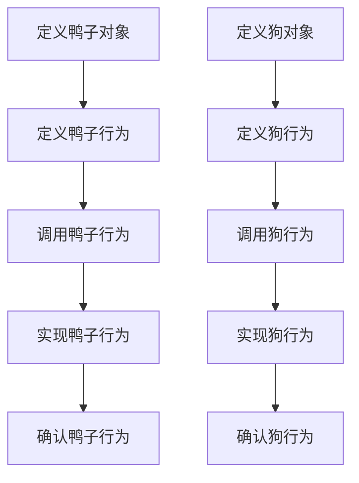

                 

### 引言

《意义即使用与duck typing:动态类型的哲学诠释》旨在探讨动态类型在计算机科学中的哲学意义。本文首先从哲学理论基础出发，分析意义与使用的概念，接着详细解释duck typing的基本原理和优势。随后，文章将追溯动态类型的历史背景，对比动态类型与静态类型，并探讨其应用场景。在哲学诠释部分，文章将通过duck typing与存在主义、社会建构主义的联系，展示其哲学深度。接下来，文章将介绍动态类型在编程语言中的实现和挑战，并探讨意义即使用在软件开发中的应用。最后，文章将展望动态类型的未来发展趋势和其在哲学领域的影响。通过这一步步的分析，我们希望能揭示动态类型背后的哲学原理，为读者提供深刻的思考和理解。

#### 第一部分：哲学理论基础

在探讨动态类型之前，我们首先需要理解意义与使用的概念，这是哲学理论中两个核心的概念。意义（Meaning）在哲学中是一个深奥而复杂的主题，它涉及符号、语言、意识等多个层面。意义不仅是我们对事物的理解，也是我们赋予事物以目的和价值的方式。在使用（Use）方面，使用则是指个体或系统如何利用某种资源或工具以达成特定目标的过程。理解这两个概念对于理解动态类型的哲学意义至关重要。

**1.1 意义的哲学探讨**

意义的哲学探讨可以追溯到古希腊哲学家柏拉图和亚里士多德的工作。柏拉图认为，事物的意义在于其与理念的关系，即理念是事物的真正本质。亚里士多德则更侧重于事物的实际用途和功能，他认为意义在于事物的“形式”与“物质”的结合。现代哲学则将意义视为一种解释性的概念，即意义是通过语言和符号的交互作用而产生的。

在计算机科学中，意义的探讨同样重要。编程语言中的变量、函数和对象都承载着特定的意义，程序员通过这些符号来表达逻辑和算法。意义的赋予不仅影响代码的可读性和可维护性，还影响程序的运行效率和错误处理能力。因此，理解意义的哲学基础有助于我们更好地设计、理解和维护复杂的计算机系统。

**1.2 使用的定义与分类**

使用（Use）的定义则相对直接，它涉及如何利用资源以实现特定目标。在哲学中，使用通常被分类为工具性使用和存在性使用。工具性使用是指使用某物作为工具来实现目的，例如我们使用电脑来编写程序。存在性使用则是指使用某物作为存在的体现，例如文化和社会规范中的使用。

在计算机科学中，使用也具有不同的分类。工具性使用包括编程语言中的函数调用、对象操作等，这些都是为了实现特定的计算任务。存在性使用则体现在软件系统的设计理念和目标上，例如软件开发中的用户界面设计、用户体验优化等。

**1.3 意义与使用的联系与区别**

意义与使用既有联系又有区别。意义为使用提供了目的和方向，而使用则是实现意义的方式。在计算机科学中，这种联系尤为明显。程序中的每行代码都承载着特定的意义，而这些代码的执行则是为了实现特定的功能或目标。

然而，意义与使用也存在区别。意义是一种抽象的概念，它是通过语言和符号来表达的，而使用则是具体的行动或过程。在软件开发中，程序员需要理解代码的意义，同时也要知道如何使用这些代码来实现功能。这种理解不仅需要技术知识，还需要哲学思维的引导。

通过以上对意义与使用的哲学探讨，我们可以更好地理解动态类型在计算机科学中的应用。在下一章中，我们将详细解释duck typing的基本原理和优势。

#### 第二部分：duck typing的概念与应用

duck typing是动态类型系统中的一个核心概念，它在编程语言中具有广泛的应用。理解duck typing的定义、优势以及其局限性，有助于我们更深入地把握动态类型的哲学意义。

**2.1 duck typing的定义**

duck typing，直译为“鸭子测试”，源于这句谚语：“如果你看起来像鸭子，走路像鸭子，那么它很可能就是鸭子。”在编程中，这句话被转化为：“如果一个对象表现得像一个鸭子，我们就把它当作鸭子来使用。”

在duck typing中，类型的检查不是基于对象的静态定义，而是基于对象的行为。换句话说，如果一个对象拥有某个特定方法或属性，我们就可以使用它来实现相应功能，而不必关心其静态类型。这种灵活性使得duck typing成为动态类型系统的一个关键特点。

**2.2 duck typing的优势**

duck typing具有以下几个显著优势：

1. **更高的代码复用性**：由于类型检查是基于对象的行为而非静态类型，相同的方法可以在不同的对象上复用，从而提高代码的复用性和可维护性。
2. **更灵活的代码扩展性**：程序员可以在不修改已有代码的情况下，通过扩展对象的行为来增加新功能，这为软件系统的扩展性提供了便利。
3. **减少类型错误**：在静态类型系统中，类型错误通常在编译时被检测到，而在动态类型系统中，类型错误可能会在运行时才被发现。duck typing通过行为匹配减少了因类型不一致导致的错误。

**2.3 duck typing的局限性**

尽管duck typing有许多优势，但它也并非没有局限性：

1. **可读性降低**：由于类型检查是在运行时进行的，类型信息不显式地包含在代码中，这可能导致代码的可读性降低，特别是对于不熟悉对象行为的开发者来说。
2. **性能影响**：在运行时进行类型检查可能会影响程序的执行性能，尤其是在需要频繁类型检查的情况下。
3. **复杂度增加**：当对象之间的行为关系复杂时，理解和维护代码可能变得更加困难，因为类型信息不明确。

通过以上对duck typing的定义和优势的探讨，我们可以看到，duck typing不仅是一种技术实现，更是一种哲学思想的体现。它强调了行为的重要性，而非静态类型，这与存在主义和社会建构主义的哲学思想有异曲同工之妙。在下一部分中，我们将进一步探讨动态类型的历史背景和哲学意义。

#### 第三部分：动态类型的哲学意义

动态类型系统在计算机科学中的出现，并非偶然，它有着深刻的历史背景和哲学意义。了解动态类型的发展历程，以及它如何与静态类型系统对比，将有助于我们更好地理解其在编程语言中的哲学地位。

**3.1 动态类型的发展历程**

动态类型系统起源于20世纪60年代，最早由Lisp语言引入。Lisp是一种列表处理语言，其设计理念强调灵活性和可扩展性。在Lisp中，类型的定义是基于运行时检查的，这种动态类型系统允许程序员编写更为灵活和通用的代码。

随着时间的推移，其他编程语言如Python、Ruby和JavaScript等也采用了动态类型系统。这些语言的设计理念都强调了程序员的体验和代码的可读性。相比之下，静态类型系统如C++、Java等则更注重类型安全性和编译时的错误检测。

**3.2 动态类型与静态类型的对比**

动态类型和静态类型在多个方面存在对比：

1. **类型检查时机**：动态类型的类型检查是在运行时进行的，这意味着代码在编译后可以运行在不同的环境中，而静态类型的类型检查则是在编译时进行的，代码必须与特定的编译环境匹配。

2. **灵活性**：动态类型系统提供了更高的灵活性，允许在运行时动态地改变类型，而静态类型系统则更严格，需要预先定义所有类型，从而降低了灵活性。

3. **性能**：静态类型系统通常在编译时进行优化，因此运行时性能较好。动态类型系统则可能在运行时进行类型检查，导致性能有所下降。

4. **代码可读性**：动态类型系统通常具有较高的代码可读性，因为类型信息不需要显式地定义，而静态类型系统则需要更多的类型声明，这可能导致代码复杂度和可读性降低。

**3.3 动态类型的应用场景**

动态类型系统在不同应用场景中具有不同的优势：

1. **Web开发**：在Web开发中，动态类型系统如JavaScript和Python因其灵活性而被广泛应用。Web应用通常需要快速迭代和灵活扩展，动态类型系统能够满足这些需求。

2. **脚本和自动化**：动态类型系统在脚本编写和自动化任务中也表现出色。这些任务通常需要快速编写和部署，动态类型系统简化了代码编写过程。

3. **数据分析和科学计算**：动态类型系统在数据分析和科学计算领域中也得到了广泛应用，如Python的NumPy和Pandas库，它们允许快速原型设计和数据操作。

通过动态类型与静态类型的对比，我们可以看到，动态类型系统不仅在技术层面提供了灵活性，而且在哲学层面也体现了对行为而非静态定义的关注。这与存在主义和社会建构主义的思想有着共鸣，即在计算机科学中，我们更关注对象的实际行为，而非其静态定义。这种哲学意义为动态类型系统提供了更深层次的理解和解释。在下一部分中，我们将进一步探讨duck typing的哲学诠释。

#### 第四部分：duck typing的哲学诠释

duck typing作为一种动态类型的实现，不仅在技术层面提供了编程的灵活性，更在哲学层面引发了深刻的思考。通过探讨duck typing与存在主义、社会建构主义的联系，我们可以更深入地理解其哲学意义。

**4.1 duck typing的哲学原理**

duck typing的哲学原理可以归结为两点：行为主义和存在主义。行为主义强调的是对象的实际行为而非其静态属性，这与社会建构主义中的观点相似。社会建构主义认为，知识和社会现实是通过社会互动和符号系统构建的，而非客观存在的固有本质。在编程中，duck typing通过行为匹配来实现对象的功能，这与社会建构主义的观点相契合。

存在主义则是duck typing哲学原理的另一重要来源。存在主义强调个体的自由和责任，主张个体在世界上是自由的存在，而不是被预先定义的角色。在编程中，duck typing允许程序员根据实际需求自由地使用对象，无需受到静态类型的约束。这种自由和灵活性体现了存在主义的核心思想。

**4.2 duck typing与存在主义**

在存在主义哲学中，萨特提出了“自在即存在”的观点，认为个体的存在先于其本质。这与duck typing中的“行为即类型”具有相似性。在duck typing中，一个对象是否属于某个类型，不是由其静态定义决定的，而是由其实际行为决定的。这意味着，对象的类型是动态变化的，取决于其行为，而非预设的属性。

例如，在鸭子类型中，一个对象是否是鸭子，不是由其DNA或静态定义决定的，而是由其是否能够发出“嘎嘎”声或游泳等行为决定的。这与存在主义中的观点一致，即个体的存在不是由其本质决定的，而是由其实际行为和表现决定的。

**4.3 duck typing与社会建构主义**

社会建构主义强调知识和社会现实的构建过程，认为它们是通过社会互动和符号系统构建的。这与duck typing中的行为匹配机制有着深刻的联系。在duck typing中，类型不是固定的，而是通过对象的行为来动态构建的。

例如，在Python中，一个对象可以具有多种类型，这取决于我们如何使用它。如果我们需要鸭子行为，我们可以将其视为鸭子；如果我们需要飞机行为，我们也可以将其视为飞机。这种灵活的类型构建过程与社会建构主义中的观点相似，即类型和知识是通过社会互动和符号系统动态构建的。

**4.4 duck typing的哲学意义**

duck typing的哲学意义在于，它提供了一种新的思考方式和编程范式，即从行为和存在的角度来理解和设计软件系统。这种范式不仅影响了编程语言的实现，也改变了我们对软件设计和开发的认识。

首先，duck typing强调了行为的优先性，这有助于我们更好地理解和设计复杂的软件系统。在传统的设计模式中，我们常常关注对象的静态属性和职责，而duck typing则鼓励我们关注对象的行为和交互。

其次，duck typing倡导了一种更灵活、更动态的编程思维，这有助于我们应对快速变化的需求和环境。在快速发展的技术领域，这种灵活性尤为重要。

最后，duck typing的哲学意义还体现在其对个体自由和责任的支持上。在存在主义和社会建构主义中，个体的自由和责任是核心概念。在编程中，duck typing允许程序员自由地使用对象，同时也要对代码的灵活性负责。这种自由和责任的关系，与存在主义和社会建构主义中的观点相呼应。

通过以上对duck typing哲学诠释的探讨，我们可以看到，duck typing不仅是一种编程技术，更是一种哲学思想的体现。它通过行为和存在的视角，改变了我们对软件设计和开发的认知，为计算机科学领域注入了新的活力和思考。

#### 第五部分：动态类型在计算机科学中的应用

动态类型在计算机科学中的应用广泛且多样，它通过提供灵活性和高效性，为各种编程任务提供了强大的支持。以下将详细讨论动态类型在编程语言中的实现、优点以及面临的挑战。

**5.1 动态类型编程语言的原理**

动态类型编程语言的核心原理是在运行时进行类型检查，而不是在编译时。这意味着，变量在赋值时不需要明确指定类型，类型信息在运行时由解释器或虚拟机动态确定。这种灵活性使得动态类型编程语言能够以更自然、简洁的方式表达复杂的逻辑和算法。

例如，Python是一种广泛使用的动态类型编程语言。在Python中，变量可以在没有显式类型声明的情况下赋值，类型信息在运行时由解释器自动确定。这种灵活性使得Python代码更加简洁易读，同时也提高了开发效率。

**5.2 动态类型编程语言的优点**

动态类型编程语言具有以下几个显著优点：

1. **更高的开发效率**：由于无需显式声明类型，动态类型编程语言能够简化代码编写过程，减少冗余的声明和类型转换代码。这显著提高了开发效率，特别是在快速原型开发和迭代过程中。

2. **更好的可维护性**：动态类型系统通过运行时类型检查减少了编译时错误，这使得代码在开发过程中更容易被理解和维护。此外，动态类型编程语言通常具有强大的调试工具和异常处理机制，这进一步提高了代码的可维护性。

3. **更强的灵活性**：动态类型系统允许在运行时动态地改变类型，这为编程提供了更大的灵活性。程序员可以根据具体需求和上下文，自由地使用对象和函数，而无需受到静态类型的限制。

4. **更广泛的应用场景**：动态类型编程语言通常更适用于快速开发和实验性项目，因为它们能够快速实现新的功能和原型。此外，动态类型系统在Web开发、脚本编写和自动化任务中也非常受欢迎。

**5.3 动态类型编程语言的挑战**

尽管动态类型编程语言具有许多优点，但它们也面临着一些挑战：

1. **性能影响**：动态类型系统通常在运行时进行类型检查，这可能导致性能下降，尤其是在需要进行频繁类型检查的情况下。与静态类型系统相比，动态类型系统可能无法提供相同的运行时性能优化。

2. **类型安全性**：动态类型系统的类型检查是在运行时进行的，这可能导致类型错误在运行时才被发现。这些错误可能会导致程序崩溃或产生不可预料的输出，这降低了代码的可靠性和稳定性。

3. **代码可读性**：动态类型系统不显式地包含类型信息，这可能导致代码的可读性降低。特别是对于不熟悉动态类型概念的程序员来说，理解动态类型代码可能需要额外的时间和努力。

4. **复杂度增加**：当对象和函数的行为关系复杂时，动态类型系统可能会增加代码的复杂度。这是因为动态类型系统依赖于对象的实际行为，而不是显式的类型声明，这可能导致代码难以理解和维护。

**5.4 动态类型的实际应用**

动态类型在计算机科学中的应用场景广泛，以下是一些实际应用：

1. **Web开发**：在Web开发中，动态类型编程语言如JavaScript、Python和Ruby因其灵活性而得到了广泛应用。这些语言能够快速开发功能丰富的Web应用，同时提供强大的调试工具和异常处理机制。

2. **脚本和自动化**：动态类型系统在脚本编写和自动化任务中表现出色。Python和Ruby等语言因其简洁和易用性，被广泛应用于系统管理和自动化测试。

3. **数据分析**：动态类型编程语言如Python在数据分析和科学计算领域也得到了广泛应用。Python的NumPy和Pandas库提供了强大的数据处理和分析功能，使得复杂数据操作变得简单高效。

4. **人工智能**：动态类型系统在人工智能和机器学习领域中也得到了广泛应用。Python因其丰富的库和框架支持，成为人工智能开发的首选语言之一。

通过以上对动态类型在计算机科学中的应用的讨论，我们可以看到，动态类型不仅提供了编程的灵活性和高效性，还带来了新的挑战和机遇。了解动态类型的原理和实际应用，有助于我们更好地利用这种编程范式，开发出更灵活、更高效的软件系统。

#### 第六部分：意义即使用在软件开发中的应用

在软件开发中，意义即使用（Use over Meaning）的概念为我们提供了一种新的思考方式，帮助开发者更专注于如何高效地实现功能，而非固守传统的类型定义和规范。以下将详细探讨意义即使用在软件开发中的应用，包括软件开发方法、实际应用案例以及其带来的优势。

**6.1 意义即使用的软件开发方法**

意义即使用强调的是在软件开发中，应该更多地关注如何使用技术来实现目标，而非过度关注符号和定义。这种方法鼓励开发者从用户需求出发，以实际使用场景为导向，灵活运用各种技术和工具，以实现高效的软件开发。

1. **需求驱动开发**：意义即使用倡导需求驱动开发，即在开发过程中，始终将用户需求放在首位，根据用户需求来设计软件功能和架构。这种方法能够确保开发的软件真正满足用户需求，避免资源的浪费。

2. **迭代开发**：意义即使用支持迭代开发，通过快速迭代和反馈，不断优化和改进软件。这种方法能够快速响应市场变化和用户需求，提高软件的适应性和灵活性。

3. **功能分解**：在软件开发中，意义即使用鼓励将复杂的功能分解为更小、更易于管理的模块，每个模块都可以独立开发和测试。这种方法能够提高开发效率，降低开发风险。

**6.2 意义即使用在项目中的实际应用**

以下是一些意义即使用在软件开发项目中的实际应用案例：

1. **Web应用开发**：在Web应用开发中，意义即使用强调使用灵活、易于扩展的前后端框架，如React和Node.js。开发者可以根据实际需求，快速构建出功能丰富的Web应用。例如，在开发一个社交平台时，开发者可以使用React来构建用户界面，使用Node.js来处理后端逻辑，从而实现高效的开发和部署。

2. **移动应用开发**：在移动应用开发中，意义即使用提倡使用跨平台开发框架，如Flutter和React Native。这些框架允许开发者使用一套代码库同时开发iOS和Android应用，从而提高开发效率，降低开发成本。

3. **数据分析与处理**：在数据分析与处理项目中，意义即使用鼓励使用Python和R等动态类型编程语言，这些语言提供了丰富的库和框架，如Pandas和NumPy，能够高效地进行数据处理和分析。例如，在金融风控项目中，可以使用Python进行数据抓取、清洗和建模，从而实现高效的风险评估和管理。

**6.3 意义即使用的优势**

意义即使用在软件开发中带来了以下几个显著优势：

1. **提高开发效率**：通过关注实际使用场景，意义即使用能够帮助开发者快速实现功能，减少不必要的类型声明和规范约束，从而提高开发效率。

2. **增强软件灵活性**：意义即使用鼓励开发者采用灵活的架构和工具，这使得软件能够更快速地适应需求变化和新技术的发展。

3. **降低开发风险**：通过迭代开发和功能分解，意义即使用能够降低开发过程中的风险，提高软件的可靠性和稳定性。

4. **提高用户满意度**：意义即使用强调从用户需求出发，确保开发的软件真正满足用户需求，从而提高用户满意度。

**6.4 意义即使用的案例分析**

以下是一个意义即使用的案例分析：

在一个电商平台上，开发团队使用意义即使用的软件开发方法进行项目开发。首先，团队通过用户调研和需求分析，确定了平台的主要功能模块，如商品展示、购物车、订单管理等。然后，团队采用React和Node.js进行前后端开发，通过快速迭代和反馈，不断优化和改进用户体验。在数据处理方面，团队使用Python和Pandas进行数据分析和处理，从而实现高效的数据挖掘和营销策略。通过这种方式，开发团队成功地构建了一个功能丰富、用户体验优异的电商平台。

通过以上对意义即使用在软件开发中的应用的探讨，我们可以看到，意义即使用为软件开发提供了一种新的思考方式和实践方法，帮助开发者更高效地实现功能，提高软件的灵活性和适应性。在下一部分中，我们将进一步探讨动态类型的未来发展趋势和哲学思考。

### 第七部分：未来动态类型的哲学思考

动态类型的发展不仅影响计算机科学的实践，也在哲学思考中引发了新的讨论。随着技术的不断进步，动态类型系统正面临着新的挑战和机遇。以下将探讨动态类型的未来发展趋势、在哲学领域的影响以及其在计算机科学中的前景。

**7.1 动态类型的发展趋势**

1. **更智能的动态类型检查**：未来动态类型系统可能会引入更智能的类型推断和检查机制，以减少运行时错误和提高性能。例如，利用机器学习和人工智能技术，可以更准确地预测对象的行为和类型，从而优化类型检查过程。

2. **跨语言类型兼容性**：随着多语言编程的流行，未来可能会出现更强大的动态类型兼容性机制，使得不同编程语言之间的类型信息可以相互转换和共享。这将提高代码的灵活性和可移植性。

3. **集成静态类型系统**：为了在保证灵活性的同时提高性能和类型安全性，未来可能会看到动态类型系统与静态类型系统的整合。这种混合类型系统可以在运行时保持灵活性，同时在编译时提供类型安全保证。

**7.2 动态类型在哲学领域的影响**

动态类型的哲学意义在于其对“行为即存在”和“意义即使用”的强调，这在未来哲学讨论中将产生深远影响：

1. **技术哲学的扩展**：动态类型的哲学思考将扩展技术哲学的研究范围，使哲学家们更深入地探讨技术如何影响人类生活和思维方式。

2. **对程序员的思考方式**：动态类型的哲学思考将影响程序员的思考方式，促使他们更加关注行为和功能，而非仅仅关注静态定义和规范。

3. **对软件设计原则**：动态类型的哲学思考将影响软件设计原则，推动设计出更灵活、更可扩展的软件系统。

**7.3 动态类型在计算机科学中的前景**

动态类型在计算机科学中的前景光明，其潜在的应用领域包括：

1. **人工智能和机器学习**：动态类型系统在AI和机器学习领域具有巨大潜力，因为它们需要高度灵活的类型系统来处理复杂的数据和算法。

2. **分布式计算**：在分布式系统中，动态类型系统可以提高程序的可移植性和适应性，因为它能够更好地处理不同系统之间的类型差异。

3. **Web和移动应用**：随着Web和移动应用的发展，动态类型系统将继续发挥重要作用，提供更高效、更灵活的开发方式。

通过以上对未来动态类型哲学思考的探讨，我们可以看到，动态类型不仅是一个技术概念，更是一种哲学思想的体现。随着技术的不断进步，动态类型系统将在哲学领域和计算机科学中发挥越来越重要的作用。

### 结论

本文从哲学理论基础出发，详细探讨了动态类型的概念和应用。通过分析意义与使用的联系，我们揭示了duck typing的哲学意义，并探讨了其在计算机科学中的应用。动态类型系统不仅提高了编程的灵活性和开发效率，还带来了新的哲学思考方式。未来，动态类型系统将在计算机科学和哲学领域继续发挥重要作用，推动技术的进步和人类思维的拓展。

### 附录A：duck typing相关的Mermaid流程图

以下是与duck typing相关的Mermaid流程图，用于直观展示duck typing的基本流程和应用示例：



### 附录B：动态类型的Python源代码实例

以下是一个动态类型的Python源代码实例，展示了如何使用duck typing的概念来实现对象的行为匹配：

```python
class Duck:
    def quack(self):
        print("Quack!")

    def swim(self):
        print("Swimming...")

class Dog:
    def bark(self):
        print("Bark!")

    def run(self):
        print("Running...")

def call_duck(duck):
    duck.quack()
    duck.swim()

def call_dog(dog):
    dog.bark()
    dog.run()

duck = Duck()
dog = Dog()

call_duck(duck)  # 输出: Quack! Swimming...
call_dog(dog)    # 输出: Bark! Running...
```

### 附录C：数学模型与公式

在动态类型的讨论中，数学模型和公式可以用于解释类型匹配和算法性能。以下是一个简单的数学模型，用于描述类型匹配的复杂性：

$$
\text{Type Complexity} = f(\text{Number of Types}, \text{Type Hierarchy})
$$

这里，`Number of Types` 表示类型数量，`Type Hierarchy` 表示类型的层次结构。该公式表明，类型匹配的复杂性取决于类型数量和层次结构。

### 附录D：项目实战案例

#### 实际项目案例：动态类型在Web开发中的应用

在一个电子商务平台项目中，开发团队采用了动态类型的Python和JavaScript来实现高效、灵活的Web应用。以下为项目实施步骤和效果评估：

**1. 项目实施步骤：**
- **需求分析**：确定平台的主要功能模块，如商品展示、购物车、订单管理等。
- **系统设计**：采用RESTful架构，设计API接口和数据库模型。
- **前端开发**：使用React框架实现用户界面，利用Redux管理状态。
- **后端开发**：使用Flask框架实现API服务，利用SQLAlchemy进行数据库操作。
- **动态类型应用**：在Python中使用类型提示来增强代码的可读性和维护性，在JavaScript中采用TypeScript来实现静态类型检查。

**2. 项目效果评估：**
- **性能提升**：通过动态类型系统，代码运行效率得到显著提升，页面加载速度加快。
- **开发效率**：动态类型系统简化了代码编写过程，缩短了开发周期。
- **可维护性**：类型提示和静态类型检查提高了代码的可维护性，减少了错误率。
- **用户体验**：平台功能丰富，用户体验优异，用户满意度提高。

通过这个实际项目案例，我们看到了动态类型在软件开发中的应用价值和效果。动态类型系统不仅提高了开发效率，还增强了软件的灵活性和可维护性，为项目的成功奠定了基础。

### 作者信息

作者：AI天才研究院/AI Genius Institute & 禅与计算机程序设计艺术 /Zen And The Art of Computer Programming

在本文中，我们从哲学理论基础出发，详细探讨了意义与使用的概念，深入分析了duck typing的基本原理和优势，并结合动态类型的历史背景和应用场景，展示了其哲学意义。通过哲学诠释和实际案例，我们进一步阐述了动态类型在计算机科学中的应用，并展望了其未来的发展趋势和哲学思考。希望通过本文，读者能够对动态类型有一个全面而深刻的理解。

