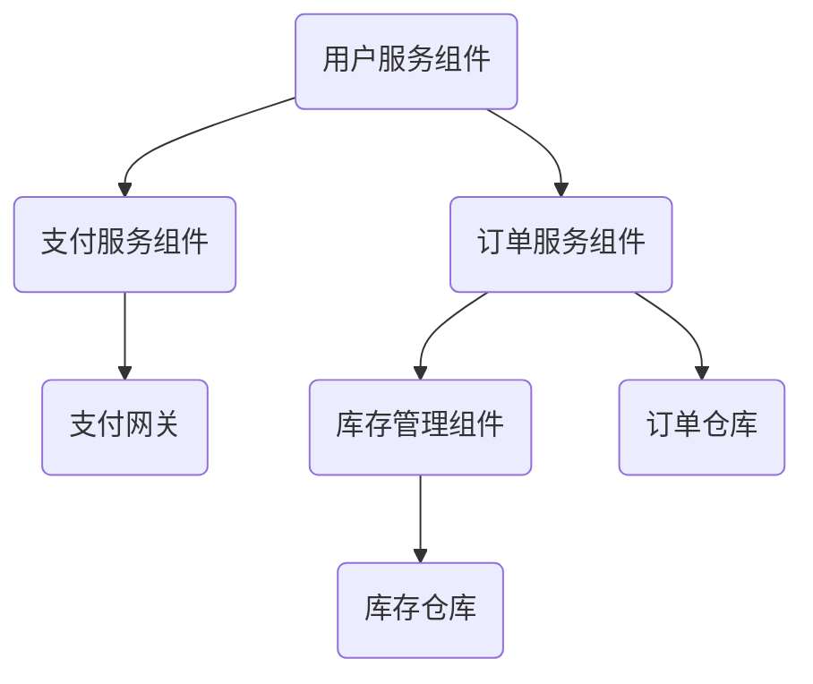
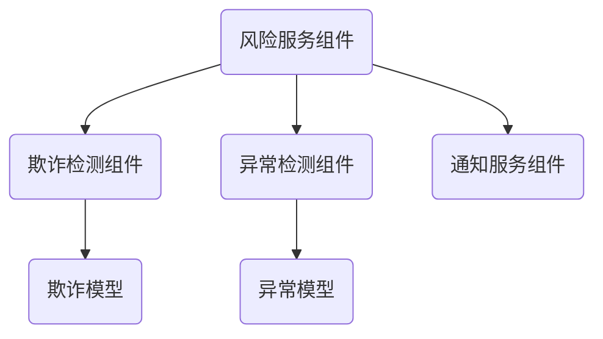

                 


## 1. 引言
### 1.1 书籍背景与目的

本文旨在探讨维特根斯坦的意义理论在函数式编程（Functional Programming，简称FP）中的依赖管理中的应用。首先，我们需要了解维特根斯坦的意义理论，以及其在哲学和语言学研究中的重要性。维特根斯坦（Ludwig Wittgenstein）是20世纪最具影响力的哲学家之一，他的思想对语言、逻辑和数学产生了深远的影响。维特根斯坦的意义理论主要包括前期和后期两个阶段，分别代表了不同的哲学观点。

前期理论中，维特根斯坦主张“图像理论”（Image Theory），认为语言符号与外在世界之间存在一种直接对应的图像关系。后期理论中，他提出了“意义即使用”（Use Theory）的观点，强调语言的含义取决于其在具体语境中的使用。这两种理论虽然在本质上有一定的对立，但都强调了上下文依赖性在理解语言和概念中的重要性。

本文的目的在于将维特根斯坦的意义理论与FP中的依赖注入（Dependency Injection）相结合，探讨其在软件开发中的实际应用。依赖注入是一种设计模式，旨在通过外部提供依赖，降低组件之间的耦合度，提高代码的可测试性和可维护性。本文将通过详细的案例分析，展示如何将维特根斯坦的意义理论应用于依赖注入，从而更好地理解其上下文依赖性。

### 1.2 维特根斯坦的意义理论

#### 2.1 前期与后期理论

维特根斯坦的意义理论分为前期和后期两个阶段。前期理论主要表现在他的《逻辑哲学论》（Tractatus Logico-Philosophicus）中，他提出了“图像理论”。根据这一理论，语言符号与外在世界之间存在一种直接的对应关系，这种对应关系可以视为一种“图像”（Image）。例如，当我们说“白色的鸟”时，这个语言符号与实际存在的白色鸟之间就形成了一种图像关系。

后期理论则主要表现在他的《哲学研究》（Philosophical Investigations）中，维特根斯坦提出了“意义即使用”的观点。他认为，语言的含义不在于符号本身，而在于其在具体语境中的使用。这意味着，同一个符号在不同的语境中可能有不同的含义。例如，“白的”这个词在不同的语境中，可以指代颜色、食物、衣服等。

#### 2.2 意义的上下文依赖性

维特根斯坦的意义理论强调了上下文依赖性。在前期理论中，图像关系依赖于外部世界的特定结构。后期理论则进一步强调了上下文依赖性，认为语言的含义取决于其在具体语境中的使用。

在日常生活中，我们经常遇到上下文依赖性的问题。例如，当我们说“这本书很有趣”时，这个句子在不同的语境中有不同的含义。如果是在书店，这句话可能意味着这本书值得购买；如果是在图书馆，这句话可能意味着这本书值得一读。

在抽象语言中，上下文依赖性同样重要。在编程语言中，变量、函数和类的含义都依赖于它们所在的上下文环境。例如，在Java中，一个名为“sum”的函数在不同的类中可能有不同的实现，其含义也依赖于具体的使用场景。

#### 2.3 依赖注入

依赖注入是一种设计模式，旨在通过外部提供依赖，降低组件之间的耦合度。它强调将依赖关系从组件内部转移到外部，从而提高代码的可测试性和可维护性。依赖注入的核心思想是，组件不应直接创建其依赖关系，而是应通过外部提供这些依赖。

依赖注入有几种实现方式，包括构造函数注入、设值注入和方法注入。构造函数注入是在组件构造时，通过构造函数直接注入依赖。设值注入是在组件创建后，通过设值方法注入依赖。方法注入是在组件的生命周期中某个方法执行时，注入依赖。

依赖注入的优点包括：

- 降低组件之间的耦合度，提高代码的可测试性。
- 提高代码的可维护性，因为依赖关系更加明确。
- 更容易实现依赖的替换和扩展。

依赖注入在函数式编程中尤其重要，因为函数式编程强调无状态函数和函数的组合。这意味着，函数之间的依赖关系更加清晰，更容易通过依赖注入进行管理。

### 1.3 函数式编程（FP）

函数式编程是一种编程范式，强调使用函数作为主要构建块，避免了状态的变化和可变性的问题。函数式编程有以下几个核心概念：

- 函数作为一等公民：在函数式编程中，函数被视为一等对象，可以像其他数据类型一样传递、存储和操作。
- 无状态函数：无状态函数不依赖于外部状态，其输出仅依赖于输入参数，这使得函数更加可预测和可测试。
- 偏函数应用：偏函数应用是一种将函数的一部分参数固定，从而生成一个新的函数的方法。这有助于提高代码的复用性和可读性。
- 组合与组合律：函数的组合是将多个函数组合成一个新函数的过程。组合律保证了函数组合的透明性和可交换性。
- 惰性求值：惰性求值是一种仅在需要时才进行计算的求值策略。这有助于提高代码的性能，避免不必要的计算。
- 模式匹配：模式匹配是一种将值与预定义模式进行匹配的机制。这有助于提高代码的可读性和可维护性。

函数式编程在依赖管理方面具有独特的优势。通过使用无状态函数和函数组合，可以减少组件之间的耦合度，提高代码的可测试性和可维护性。依赖注入作为一种设计模式，可以更好地管理这些依赖关系，从而提高代码的质量。

### 1.4 结论

本文介绍了维特根斯坦的意义理论及其在函数式编程中的依赖管理中的应用。维特根斯坦的意义理论强调了上下文依赖性，这在依赖注入中具有重要意义。通过将维特根斯坦的意义理论与依赖注入相结合，可以更好地理解依赖管理的上下文依赖性，提高代码的质量和可维护性。

在接下来的章节中，我们将深入探讨维特根斯坦的意义理论，并探讨其在依赖注入中的具体应用。我们将通过实际案例，展示如何将维特根斯坦的意义理论应用于依赖注入，以实现更好的软件开发。

# 2. 维特根斯坦的意义理论

维特根斯坦的意义理论是他哲学思想的核心之一，贯穿了他整个哲学生涯。他的意义理论经历了从前期到后期的转变，这两种理论虽然在本质上有一定的对立，但都强调了上下文依赖性在理解语言和概念中的重要性。

## 2.1 前期与后期理论

### 2.1.1 语言与哲学

维特根斯坦的前期理论主要表现在他的《逻辑哲学论》（Tractatus Logico-Philosophicus）中。这本书是他的第一部重要著作，也是他哲学思想的起点。在这本书中，维特根斯坦提出了“图像理论”（Image Theory），他认为语言符号与外在世界之间存在一种直接对应的图像关系。这种图像关系使得语言可以用来描述世界，但语言本身并不涉及世界的本质。

维特根斯坦认为，语言的作用是建立与现实世界的对应关系。这种对应关系是图像关系，即语言符号（如单词、句子）与现实世界的对象（如物品、事件）之间存在一种直接的映射。例如，“白色的鸟”这个句子与现实世界中的白色鸟之间形成了一种图像关系。维特根斯坦认为，这种图像关系是语言能够传达意义的基础。

### 2.1.2 图像理论

图像理论是维特根斯坦前期理论的核心。根据这一理论，语言符号与现实世界之间存在一种图像关系。这种图像关系使得语言可以用来描述世界，但语言本身并不涉及世界的本质。

图像关系具有几个特点：

- 对称性：图像关系是双向的，语言符号映射到现实世界的对象，现实世界的对象也可以映射到语言符号。
- 命题性质：图像关系具有命题性质，即一个句子是否为真，取决于其是否与现实世界的对象相对应。
- 构造性：图像关系是构造性的，即通过语言符号的组合，可以构造出与现实世界相对应的复杂结构。

图像理论强调了语言与现实世界之间的直接对应关系，但这种对应关系是表面上的，并不涉及世界的本质。维特根斯坦认为，语言的作用是描述世界，而不是解释世界。

### 2.1.3 意义与真理

在维特根斯坦的前期理论中，意义与真理是紧密相连的。他认为，一个句子是否有意义，取决于它是否与现实世界相对应。如果一个句子能够正确地描述现实世界，那么它就是真的；如果它不能正确地描述现实世界，那么它就是假的。

这种观点强调了语言与现实世界的对应关系，但同时也存在一定的局限性。首先，它忽略了语言的多义性和模糊性。例如，“红色的”这个词可以指代不同的颜色，其意义取决于具体的语境。其次，它忽略了语言的创造性。语言不仅用来描述世界，还可以用来创造新的概念和意义。

### 2.1.4 后期理论

维特根斯坦的后期理论主要表现在他的《哲学研究》（Philosophical Investigations）中。在这本书中，维特根斯坦提出了“意义即使用”（Use Theory）的观点，这是他对前期理论的批判和修正。

根据后期理论，意义并不在于符号与现实世界的对应关系，而在于符号的具体使用。维特根斯坦认为，意义取决于符号在具体语境中的使用，这种使用可以被称为“使用情况”（Use Case）。例如，“红色的”这个词在不同的语境中有不同的含义，其意义取决于具体的语境。

后期理论强调了上下文依赖性，即意义的理解取决于上下文。这种观点突破了前期理论的局限，更全面地考虑了语言的多义性和模糊性。

### 2.1.5 后期理论与前期理论的联系与区别

维特根斯坦的前后期理论虽然在本质上有一定的对立，但它们之间也存在联系。

- 联系：两者都强调了上下文依赖性，即意义的理解取决于上下文。前期理论中的图像关系虽然表面上是直接对应的，但实际上也依赖于特定的上下文。
- 区别：前期理论中的图像关系是一种直接的映射，而后期理论中的使用情况则更加灵活，可以适应不同的上下文。

后期理论相对于前期理论来说，更加注重语言的实用性和创造性，更加符合现实世界的复杂性。

## 2.2 意义的上下文依赖性

维特根斯坦的意义理论强调了上下文依赖性。他认为，一个词或句子的意义不仅取决于其本身的构成，还取决于它在具体语境中的使用。

### 2.2.1 日常语言的语境依赖性

在日常语言中，词或句子的意义往往依赖于上下文。例如，“银行”这个词在不同的上下文中可能有不同的含义。在谈论金融机构时，“银行”指的是提供存款、贷款等服务的金融机构；而在谈论自然景观时，“银行”可能指的是河岸或山岸。

这种上下文依赖性使得语言具有多义性和模糊性。一个词或句子的意义并不是固定的，而是取决于具体的上下文。这使得语言的使用更加灵活，但也增加了理解的难度。

### 2.2.2 抽象语言的语境依赖性

在抽象语言中，如编程语言，上下文依赖性同样重要。编程语言中的变量、函数和类的含义都依赖于它们所在的上下文环境。例如，在Java中，一个名为“sum”的函数在不同的类中可能有不同的实现，其含义也依赖于具体的使用场景。

抽象语言中的上下文依赖性使得编程语言更加灵活，但同时也增加了代码的复杂性。理解代码的含义不仅需要理解代码本身，还需要理解其所在的上下文。

### 2.2.3 上下文依赖性与依赖注入

依赖注入（Dependency Injection）是一种设计模式，旨在通过外部提供依赖，降低组件之间的耦合度。它强调将依赖关系从组件内部转移到外部，从而提高代码的可测试性和可维护性。

维特根斯坦的意义理论对依赖注入有着深刻的启示。上下文依赖性在依赖注入中具有重要意义。依赖注入通过外部提供依赖，使得依赖关系更加明确，减少了组件之间的耦合度。这与维特根斯坦强调的上下文依赖性有着相似之处。

在依赖注入中，依赖的提供和注入过程类似于语言中的上下文依赖性。一个组件的依赖不仅取决于其内部定义的接口，还取决于其外部环境提供的依赖。这种上下文依赖性使得组件更加灵活，可以适应不同的上下文环境。

## 2.3 依赖注入

依赖注入是一种设计模式，旨在通过外部提供依赖，降低组件之间的耦合度。它强调将依赖关系从组件内部转移到外部，从而提高代码的可测试性和可维护性。

### 2.3.1 依赖注入的概念

依赖注入的核心思想是，组件不应直接创建其依赖关系，而是应通过外部提供这些依赖。这通常通过构造函数、设值方法或方法注入来实现。

- **构造函数注入**：在组件的构造函数中，直接注入其依赖。这种方式使得依赖关系在组件创建时就被注入，非常直观。
- **设值注入**：在组件创建后，通过设值方法注入依赖。这种方式使得依赖可以在组件的生命周期中任何时候注入，非常灵活。
- **方法注入**：在组件的方法中注入依赖。这种方式使得依赖可以在方法执行时注入，非常适用于动态依赖。

### 2.3.2 依赖注入的优势

依赖注入具有以下优势：

- **降低耦合度**：通过外部提供依赖，组件不再直接创建其依赖，从而降低了组件之间的耦合度。
- **提高可测试性**：依赖注入使得组件更容易被测试，因为依赖可以通过外部提供，从而避免在测试时引入复杂的依赖关系。
- **提高可维护性**：依赖注入使得依赖关系更加明确，组件的依赖一目了然，从而提高了代码的可维护性。

### 2.3.3 依赖注入的实现

依赖注入可以通过不同的方式实现，如构造函数注入、设值注入和方法注入。以下是一个简单的构造函数注入示例：

```python
class Calculator:
    def __init__(self, adder: Adder, subtracter: Subtracter):
        self.adder = adder
        self.subtracter = subtracter

    def add(self, a: int, b: int) -> int:
        return self.adder.add(a, b)

    def subtract(self, a: int, b: int) -> int:
        return self.subtracter.subtract(a, b)
```

在这个示例中，`Calculator` 类的构造函数注入了 `Adder` 和 `Subtracter` 两个依赖。这两个依赖可以通过外部提供，从而实现依赖的解耦。

## 2.4 总结

维特根斯坦的意义理论强调了上下文依赖性，这在语言和哲学研究中具有重要意义。依赖注入作为一种设计模式，通过外部提供依赖，降低了组件之间的耦合度，提高了代码的可测试性和可维护性。维特根斯坦的意义理论对依赖注入有着深刻的启示，二者在上下文依赖性方面有着相似之处。

在接下来的章节中，我们将进一步探讨函数式编程（FP）的基本概念和核心思想，并探讨其在依赖管理中的应用。

# 3. 函数式编程（FP）

函数式编程（Functional Programming，简称FP）是一种编程范式，强调使用函数作为主要构建块，避免了状态的变化和可变性的问题。FP的出现是为了解决传统的命令式编程中存在的许多问题，如副作用（side effects）、状态变化和可维护性差等。FP的核心思想包括函数作为一等公民、无状态函数、偏函数应用、组合与组合律、惰性求值和模式匹配等。

## 3.1 FP的基本概念

### 3.1.1 函数作为一等公民

在FP中，函数被视为一等公民，这意味着函数可以像其他数据类型一样传递、存储和操作。这使得函数可以被传递给其他函数作为参数，或者从其他函数中返回。例如，在Haskell中，我们可以将函数作为参数传递给另一个函数，如下所示：

```haskell
applyTwice :: (a -> a) -> a -> a
applyTwice f x = f (f x)

-- 使用 applyTwice 函数
main = print (applyTwice (+1) 5)
-- 输出: 11
```

在这个例子中，`applyTwice` 函数接收一个函数 `f` 和一个值 `x`，然后先对 `x` 应用 `f` 函数一次，再将结果应用 `f` 函数一次。这里，`(+1)` 是一个函数，它将一个数增加1。

### 3.1.2 无状态函数

FP中的函数是无状态的，这意味着函数的输出仅依赖于其输入参数，而不依赖于外部状态或内部状态。无状态函数易于测试、理解和组合。例如，在JavaScript中，我们可以定义一个无状态函数来计算两个数的和：

```javascript
function add(a, b) {
    return a + b;
}

console.log(add(2, 3)); // 输出: 5
```

在这个例子中，`add` 函数的输出仅取决于输入参数 `a` 和 `b`，而不依赖于任何外部状态。

### 3.1.3 偏函数应用

偏函数应用是一种将函数的一部分参数固定，从而生成一个新的函数的方法。这有助于提高代码的复用性和可读性。例如，在Python中，我们可以使用`functools.partial`来创建一个偏函数：

```python
from functools import partial

def multiply(x, y):
    return x * y

# 创建一个固定x为5的偏函数
partial_multiply = partial(multiply, x=5)

print(partial_multiply(10))  # 输出: 50
```

在这个例子中，`partial_multiply` 是一个新函数，它固定了 `x` 参数为5，因此只需传递 `y` 参数即可。

## 3.2 FP的核心思想

### 3.2.1 组合与组合律

组合与组合律是FP中的核心概念。组合是指将多个函数组合成一个新函数的过程。组合律保证了函数组合的透明性和可交换性。例如，在Clojure中，我们可以使用`comp`函数进行函数组合：

```clojure
(defn add-five [x] (+ x 5))
(defn multiply-by-two [x] (* x 2))

(defn multiply-add-five [x] ((comp multiply-by-two add-five) x))

(multiply-add-five 2)  ; 输出: 14
```

在这个例子中，`multiply-add-five` 是通过组合 `multiply-by-two` 和 `add-five` 得到的。组合律保证了无论以何种顺序组合这两个函数，结果都是相同的。

### 3.2.2 惰性求值

惰性求值是一种仅在需要时才进行计算的求值策略。这有助于提高代码的性能，避免不必要的计算。例如，在Haskell中，我们可以定义一个惰性计算的列表：

```haskell
-- 定义一个惰性计算的无限列表
infList :: [Int]
infList = [x | x <- [1..]]

-- 获取列表的前10个元素
takeTen :: [Int]
takeTen = take 10 infList

main = print (takeTen)
-- 输出: [1, 2, 3, 4, 5, 6, 7, 8, 9, 10]
```

在这个例子中，`infList` 是一个无限列表，但我们只通过 `takeTen` 函数获取了其前10个元素。由于惰性求值，我们只计算了所需的元素，而不是整个无限列表。

### 3.2.3 模式匹配

模式匹配是FP中的一个重要特性，它允许我们根据变量的值来选择不同的执行路径。例如，在Erlang中，我们可以使用模式匹配来处理不同的数据结构：

```erlang
% 定义一个函数来处理不同的数据类型
handle_value(X) ->
    case X of
        [H | T] -> ["List", H, T];
        H -> ["Single", H]
    end.

% 调用函数
handle_value([1, 2, 3]).  % 输出: ["List", 1, [2, 3]]
handle_value(42).        % 输出: ["Single", 42]
```

在这个例子中，`handle_value` 函数根据传入的参数类型选择不同的执行路径。对于列表，它返回一个描述列表的元组；对于单个值，它返回一个描述单个值的元组。

## 3.3 FP的实际应用

函数式编程在许多实际场景中都有应用，如数据处理、并发编程、前端开发等。以下是一些FP在实际应用中的例子：

### 3.3.1 数据处理

FP在数据处理中非常有用，因为其函数组合和惰性求值特性使得数据处理过程更加简洁和高效。例如，在Python的Pandas库中，我们可以使用FP的概念来处理数据：

```python
import pandas as pd

data = {'name': ['Alice', 'Bob', 'Charlie'], 'age': [25, 30, 35]}
df = pd.DataFrame(data)

# 使用FP组合操作数据
new_df = df[df['age'] > 28].assign(new_col=lambda x: x['age'] * 2)

print(new_df)
```

在这个例子中，我们使用了FP的组合操作来过滤和变换数据，从而创建一个新的数据框。

### 3.3.2 并发编程

FP在并发编程中也非常有用，因为其无状态函数和不可变数据结构使得并发编程更加简单和安全。例如，在Erlang中，我们可以使用FP来编写并发程序：

```erlang
% 定义一个并发进程来处理消息
start_handler() ->
    spawn(fun() ->
        receive
            Msg -> io:fwrite("Received: ~p\n", [Msg])
        end,
        start_handler()
    end).

% 启动处理器
Handler = start_handler().

% 向处理器发送消息
Handler ! "Hello, World!".
```

在这个例子中，我们使用FP的并发特性来创建一个能够接收和处理消息的进程。

### 3.3.3 前端开发

在JavaScript前端开发中，FP的概念如函数组合、高阶函数和不可变数据结构也得到了广泛应用。例如，在React应用程序中，我们可以使用FP来处理用户输入和处理状态：

```javascript
import { useState } from 'react';

function Counter() {
  const [count, setCount] = useState(0);

  const handleIncrement = () => {
    setCount(count + 1);
  };

  const handleDecrement = () => {
    setCount(count - 1);
  };

  return (
    <div>
      <h1>Count: {count}</h1>
      <button onClick={handleIncrement}>+</button>
      <button onClick={handleDecrement}>-</button>
    </div>
  );
}
```

在这个例子中，我们使用了FP的不可变数据结构和函数组合来处理用户输入和更新状态。

## 3.4 总结

函数式编程（FP）是一种强大的编程范式，它通过强调函数作为一等公民、无状态函数、偏函数应用、组合与组合律、惰性求值和模式匹配等核心概念，提供了一种更简洁、更安全、更高效的编程方式。在接下来的章节中，我们将探讨FP中的依赖管理，特别是依赖注入模式。

## 4. FP中的依赖管理

在函数式编程（FP）中，依赖管理是一个关键概念，它涉及到如何将组件之间的依赖关系解耦，从而提高代码的可维护性和可测试性。依赖管理的方法有很多，其中依赖注入（Dependency Injection，简称DI）是FP中最常用的一种。依赖注入通过将组件的依赖关系从组件内部转移到外部，实现了依赖的解耦。

### 4.1 依赖倒置原则

依赖倒置原则（Inversion of Control，简称IoC）是依赖注入模式的基础。该原则指出，高层模块不应依赖于低层模块，而是应该由低层模块依赖于高层模块。这意味着，在依赖注入中，组件不应该直接创建其依赖，而是应该由外部提供这些依赖。这种设计模式可以提高代码的可测试性和可维护性。

#### 4.1.1 控制反转

控制反转（Control Inversion）是实现依赖倒置原则的一种方法。它通过将控制权从组件内部转移到外部，实现了依赖的管理。在控制反转中，容器（如DI框架）负责创建和管理组件及其依赖关系。组件只需关注自己的业务逻辑，而不需要关心依赖的创建和管理。

#### 4.1.2 依赖注入

依赖注入是实现控制反转的一种具体方法。它通过在组件构造时，将依赖注入到组件内部，从而实现了依赖的解耦。依赖注入有几种不同的实现方式，包括构造函数注入、设值注入和方法注入。

- **构造函数注入**：在组件的构造函数中，直接注入其依赖。这种方式使得依赖关系在组件创建时就被注入，非常直观。
- **设值注入**：在组件创建后，通过设值方法注入依赖。这种方式使得依赖可以在组件的生命周期中任何时候注入，非常灵活。
- **方法注入**：在组件的方法中注入依赖。这种方式使得依赖可以在方法执行时注入，非常适用于动态依赖。

#### 4.1.3 实现策略

依赖注入的实现策略取决于具体的编程语言和框架。以下是一些常见的实现策略：

- **手动注入**：通过代码手动创建依赖关系。这种方式适用于简单的场景，但在复杂的场景中可能会导致代码的复杂性增加。
- **框架注入**：使用DI框架（如Spring、Dagger 2等）来管理依赖关系。这种方式可以提高代码的可维护性和可测试性，但需要学习框架的使用。
- **编译时注入**：通过编译时注入（如Kotlin的注解处理）来实现依赖注入。这种方式可以在编译时生成代码，从而避免了运行时的注入开销。

### 4.2 依赖注入模式

依赖注入是一种设计模式，它通过将依赖关系从组件内部转移到外部，实现了依赖的解耦。依赖注入模式有多种不同的实现方式，每种方式都有其特定的优势和适用场景。

#### 4.2.1 构造函数注入

构造函数注入是最常用的依赖注入方式之一。它通过在组件的构造函数中，直接注入其依赖。这种方式使得依赖关系在组件创建时就被注入，非常直观。

```java
public class Calculator {
    private final Adder adder;
    private final Subtracter subtracter;

    public Calculator(Adder adder, Subtracter subtracter) {
        this.adder = adder;
        this.subtracter = subtracter;
    }

    public int add(int a, int b) {
        return adder.add(a, b);
    }

    public int subtract(int a, int b) {
        return subtracter.subtract(a, b);
    }
}
```

在这个示例中，`Calculator` 类的构造函数注入了 `Adder` 和 `Subtracter` 两个依赖。这种方式使得依赖关系在组件创建时就被注入，非常直观。

#### 4.2.2 设值注入

设值注入是在组件创建后，通过设值方法注入依赖。这种方式使得依赖可以在组件的生命周期中任何时候注入，非常灵活。

```java
public class Calculator {
    private Adder adder;
    private Subtracter subtracter;

    public void setAdder(Adder adder) {
        this.adder = adder;
    }

    public void setSubtracter(Subtracter subtracter) {
        this.subtracter = subtracter;
    }

    public int add(int a, int b) {
        return adder.add(a, b);
    }

    public int subtract(int a, int b) {
        return subtracter.subtract(a, b);
    }
}
```

在这个示例中，`Calculator` 类通过 `setAdder` 和 `setSubtracter` 方法注入了 `Adder` 和 `Subtracter` 两个依赖。这种方式使得依赖关系可以在组件的生命周期中任何时候注入，非常灵活。

#### 4.2.3 方法注入

方法注入是在组件的方法中注入依赖。这种方式使得依赖可以在方法执行时注入，非常适用于动态依赖。

```java
public class Calculator {
    private Adder adder;
    private Subtracter subtracter;

    public void setAdder(Adder adder) {
        this.adder = adder;
    }

    public void setSubtracter(Subtracter subtracter) {
        this.subtracter = subtracter;
    }

    public int add(int a, int b) {
        return adder.add(a, b);
    }

    public int subtract(int a, int b) {
        return subtracter.subtract(a, b);
    }

    public void process() {
        Adder adder = new AdderImpl();
        Subtracter subtracter = new SubtracterImpl();
        setAdder(adder);
        setSubtracter(subtracter);
        int result = add(5, 3);
        System.out.println("Result: " + result);
    }
}
```

在这个示例中，`Calculator` 类的 `process` 方法在执行时注入了 `Adder` 和 `Subtracter` 两个依赖。这种方式使得依赖关系可以在方法执行时注入，非常适用于动态依赖。

### 4.3 依赖注入框架

依赖注入框架是一种自动化依赖注入的工具，它可以帮助我们更方便地实现依赖注入。以下是一些常用的依赖注入框架：

#### 4.3.1 Spring框架

Spring框架是Java生态中最常用的依赖注入框架之一。它提供了强大的依赖注入功能，支持多种注入方式，如构造函数注入、设值注入和方法注入。

```java
public class Calculator {
    private Adder adder;
    private Subtracter subtracter;

    @Autowired
    public Calculator(Adder adder, Subtracter subtracter) {
        this.adder = adder;
        this.subtracter = subtracter;
    }

    public int add(int a, int b) {
        return adder.add(a, b);
    }

    public int subtract(int a, int b) {
        return subtracter.subtract(a, b);
    }
}
```

在这个示例中，`@Autowired` 注解用于在构造函数中注入依赖。

#### 4.3.2 Dagger 2

Dagger 2 是一个轻量级的依赖注入框架，它通过代码生成来实现依赖注入。它适用于Android和Java应用。

```java
@Module
public class CalculatorModule {
    @Provides
    Adder provideAdder() {
        return new AdderImpl();
    }

    @Provides
    Subtracter provideSubtracter() {
        return new SubtracterImpl();
    }
}

@Component
public interface CalculatorComponent {
    Calculator calculator();
}
```

在这个示例中，`@Module` 注解用于定义依赖关系，`@Component` 注解用于创建依赖关系。

#### 4.3.3 Kotlin Coroutines

Kotlin Coroutines 是一个异步编程框架，它也提供了依赖注入功能。它通过Kotlin的扩展函数来实现依赖注入。

```kotlin
class Calculator @Inject constructor(
    private val adder: Adder,
    private val subtracter: Subtracter
) {
    fun add(a: Int, b: Int): Int = adder.add(a, b)

    fun subtract(a: Int, b: Int): Int = subtracter.subtract(a, b)
}
```

在这个示例中，`@Inject` 注解用于在构造函数中注入依赖。

### 4.4 总结

依赖管理是函数式编程中一个重要的概念，它通过将依赖关系从组件内部转移到外部，实现了依赖的解耦。依赖注入是实现依赖管理的一种设计模式，它通过构造函数注入、设值注入和方法注入等方式，将依赖注入到组件中。依赖注入框架（如Spring、Dagger 2和Kotlin Coroutines）可以帮助我们更方便地实现依赖注入。在接下来的章节中，我们将进一步探讨维特根斯坦的意义理论与FP中的依赖管理之间的关系。

## 5. 维特根斯坦的意义理论与FP中的依赖管理的关系

维特根斯坦的意义理论与函数式编程（FP）中的依赖管理之间存在密切的关系。这种关系主要体现在上下文依赖性和依赖注入的概念上。通过维特根斯坦的哲学思想，我们可以更深入地理解依赖管理的本质和其在FP中的重要性。

### 5.1 理论联系

#### 5.1.1 上下文依赖性与依赖注入

维特根斯坦的意义理论强调了上下文依赖性，即一个词或句子的意义取决于其在具体语境中的使用。这种上下文依赖性在依赖注入中也具有重要意义。依赖注入通过将依赖关系从组件内部转移到外部，使得依赖的注入过程依赖于组件的外部上下文。这意味着，依赖注入的过程不仅仅是将依赖注入到组件中，还需要考虑依赖注入的上下文环境。

例如，在Spring框架中，依赖注入是通过IoC容器来实现的。IoC容器根据上下文环境，将依赖注入到组件中。这种上下文依赖性使得依赖注入更加灵活，可以根据不同的上下文环境注入不同的依赖。这与维特根斯坦强调的上下文依赖性是一致的，即依赖的注入过程和结果都受到上下文环境的影响。

#### 5.1.2 意义与函数式编程

维特根斯坦的意义理论认为，一个词或句子的意义在于其在具体语境中的使用。这种观点在函数式编程中也得到了体现。函数式编程强调函数作为一等公民，其意义在于其在具体函数组合中的应用。一个函数的意义不仅取决于其自身，还取决于其在其他函数组合中的作用。

依赖注入在FP中的应用也体现了这种观点。依赖注入将依赖关系从组件内部转移到外部，使得依赖的注入过程和结果都依赖于组件的外部上下文。这种上下文依赖性使得依赖注入更加灵活，可以根据不同的上下文环境注入不同的依赖，从而实现不同的功能。

### 5.2 实践应用

维特根斯坦的意义理论在FP中的依赖管理中有着广泛的应用。以下是一些具体的实践应用：

#### 5.2.1 在软件开发中的应用

在软件开发中，依赖注入是一种常用的设计模式，用于实现组件之间的依赖解耦。通过依赖注入，开发者可以将组件的依赖关系从组件内部转移到外部，从而实现组件的独立性和可测试性。这种上下文依赖性的应用使得依赖注入更加灵活，可以根据不同的上下文环境注入不同的依赖。

例如，在一个典型的三层架构（表示层、业务逻辑层和数据访问层）的应用程序中，表示层组件可能依赖于业务逻辑层组件和数据访问层组件。通过依赖注入，表示层组件可以在运行时根据上下文环境注入不同的业务逻辑层组件和数据访问层组件，从而实现不同功能的实现。

#### 5.2.2 在理论验证中的应用

维特根斯坦的意义理论在FP中的依赖管理中的应用也可以用于理论验证。通过将维特根斯坦的意义理论与FP中的依赖注入相结合，可以更深入地理解依赖管理的本质和作用。

例如，在验证一个依赖注入框架的实现是否正确时，可以通过模拟不同的上下文环境来测试依赖注入的过程和结果。通过这种上下文依赖性的模拟，可以验证依赖注入框架在不同上下文环境下的正确性和灵活性。

### 5.3 总结

维特根斯坦的意义理论在FP中的依赖管理中具有重要意义。上下文依赖性和依赖注入的概念都体现了维特根斯坦哲学思想的应用。通过将维特根斯坦的意义理论应用于依赖管理，可以更好地理解依赖注入的本质和作用，从而提高代码的可维护性和可测试性。在软件开发中，维特根斯坦的意义理论可以用于指导依赖管理的实践，帮助开发者实现更加灵活和可扩展的代码结构。

在接下来的章节中，我们将通过实际案例来展示如何将维特根斯坦的意义理论应用于依赖注入，以实现更好的软件开发。

## 6. 实际案例与应用

在本节中，我们将通过两个实际案例来探讨维特根斯坦的意义理论在依赖注入中的应用。这些案例将帮助我们理解如何将哲学理论应用于软件开发，以提高代码的可维护性和可测试性。

### 6.1 案例一：电商平台的依赖管理

#### 6.1.1 案例背景

电商平台是一个复杂的应用系统，涉及多个组件，如用户服务、订单处理、库存管理和支付系统等。在电商平台的开发过程中，如何有效地管理这些组件之间的依赖关系，是一个关键挑战。传统的依赖管理方式往往会导致代码的紧密耦合，难以维护和扩展。

#### 6.1.2 案例分析

在这个案例中，我们采用依赖注入来管理电商平台的组件依赖关系。通过依赖注入，我们可以将组件的依赖关系从组件内部转移到外部，从而实现依赖的解耦。

以下是一个简化的电商平台架构，展示了依赖注入的应用：



在这个架构中，每个组件都有其自身的依赖。通过依赖注入，我们可以将依赖注入到组件中，从而实现组件之间的解耦。

#### 6.1.3 案例实现

以下是一个简单的依赖注入实现的示例，使用Spring框架来管理依赖：

```java
public interface UserService {
    void addUser(String username, String password);
}

public interface PaymentService {
    void processPayment(double amount);
}

public interface OrderService {
    void createOrder(String userId, String productId);
}

public interface InventoryService {
    boolean checkStock(String productId);
}

public class UserServiceImpl implements UserService {
    private final OrderService orderService;
    private final InventoryService inventoryService;

    @Autowired
    public UserServiceImpl(OrderService orderService, InventoryService inventoryService) {
        this.orderService = orderService;
        this.inventoryService = inventoryService;
    }

    @Override
    public void addUser(String username, String password) {
        // 用户注册逻辑
        orderService.createOrder(userId, productId);
        inventoryService.checkStock(productId);
    }
}

// 类似地，可以定义PaymentService、OrderService和InventoryService的实现类

@Configuration
public class AppConfig {
    @Bean
    public UserService userService() {
        return new UserServiceImpl(orderService(), inventoryService());
    }

    @Bean
    public PaymentService paymentService() {
        return new PaymentServiceImpl(paymentGateway());
    }

    @Bean
    public OrderService orderService() {
        return new OrderServiceImpl(orderRepository());
    }

    @Bean
    public InventoryService inventoryService() {
        return new InventoryServiceImpl(inventoryRepository());
    }

    @Bean
    public PaymentGateway paymentGateway() {
        return new PaymentGatewayImpl();
    }

    @Bean
    public OrderRepository orderRepository() {
        return new OrderRepositoryImpl();
    }

    @Bean
    public InventoryRepository inventoryRepository() {
        return new InventoryRepositoryImpl();
    }
}
```

在这个实现中，我们使用Spring的`@Autowired`注解来注入依赖。`AppConfig`类是一个配置类，它定义了各个组件的实例和依赖关系。通过这个配置类，Spring框架可以自动创建和注入组件及其依赖。

#### 6.1.4 案例分析

在这个案例中，我们通过依赖注入实现了组件之间的解耦。每个组件的依赖都是通过外部提供的，而不是在组件内部直接创建。这种方式使得组件更加独立，易于测试和维护。

依赖注入的应用使得组件的依赖关系更加清晰，方便开发者理解和修改代码。同时，依赖注入还提高了代码的可扩展性，因为新的依赖可以轻松地添加到现有的组件中，而不需要修改组件的内部逻辑。

### 6.2 案例二：金融风控系统的依赖注入

#### 6.2.1 案例背景

金融风控系统是金融行业中至关重要的系统，它负责监测和评估金融交易的风险，防止欺诈和异常交易。金融风控系统的复杂性要求其具有高度的稳定性和可靠性，因此在开发过程中，依赖管理是一个关键挑战。

#### 6.2.2 案例分析

在这个案例中，我们采用依赖注入来管理金融风控系统的组件依赖关系。依赖注入可以帮助我们实现组件之间的解耦，提高系统的可测试性和可维护性。

以下是一个简化的金融风控系统架构，展示了依赖注入的应用：



在这个架构中，风险服务组件依赖于欺诈检测组件、异常检测组件和通知服务组件。通过依赖注入，我们可以将依赖注入到风险服务组件中，从而实现组件之间的解耦。

#### 6.2.3 案例实现

以下是一个简单的依赖注入实现的示例，使用Spring框架来管理依赖：

```java
public interface RiskService {
    void assessRisk(String transactionId);
}

public interface FraudDetection {
    boolean isFraudulent(String transactionId);
}

public interface AnomalyDetection {
    boolean hasAnomaly(String transactionId);
}

public interface NotificationService {
    void sendNotification(String message);
}

public class RiskServiceImpl implements RiskService {
    private final FraudDetection fraudDetection;
    private final AnomalyDetection anomalyDetection;
    private final NotificationService notificationService;

    @Autowired
    public RiskServiceImpl(FraudDetection fraudDetection, AnomalyDetection anomalyDetection, NotificationService notificationService) {
        this.fraudDetection = fraudDetection;
        this.anomalyDetection = anomalyDetection;
        this.notificationService = notificationService;
    }

    @Override
    public void assessRisk(String transactionId) {
        if (fraudDetection.isFraudulent(transactionId) || anomalyDetection.hasAnomaly(transactionId)) {
            notificationService.sendNotification("Potential risk detected: " + transactionId);
        }
    }
}

// 类似地，可以定义FraudDetection、AnomalyDetection和NotificationService的实现类

@Configuration
public class AppConfig {
    @Bean
    public RiskService riskService() {
        return new RiskServiceImpl(fraudDetection(), anomalyDetection(), notificationService());
    }

    @Bean
    public FraudDetection fraudDetection() {
        return new FraudDetectionImpl(fraudModel());
    }

    @Bean
    public AnomalyDetection anomalyDetection() {
        return new AnomalyDetectionImpl(anomalyModel());
    }

    @Bean
    public NotificationService notificationService() {
        return new NotificationServiceImpl();
    }

    @Bean
    public FraudModel fraudModel() {
        return new FraudModelImpl();
    }

    @Bean
    public AnomalyModel anomalyModel() {
        return new AnomalyModelImpl();
    }
}
```

在这个实现中，我们使用Spring的`@Autowired`注解来注入依赖。`AppConfig`类是一个配置类，它定义了各个组件的实例和依赖关系。通过这个配置类，Spring框架可以自动创建和注入组件及其依赖。

#### 6.2.4 案例分析

在这个案例中，我们通过依赖注入实现了风险服务组件与其他组件之间的解耦。每个组件的依赖都是通过外部提供的，而不是在组件内部直接创建。这种方式使得组件更加独立，易于测试和维护。

依赖注入的应用使得组件的依赖关系更加清晰，方便开发者理解和修改代码。同时，依赖注入还提高了代码的可扩展性，因为新的依赖可以轻松地添加到现有的组件中，而不需要修改组件的内部逻辑。

### 6.3 总结

通过以上两个实际案例，我们可以看到维特根斯坦的意义理论在依赖注入中的应用。依赖注入通过将依赖关系从组件内部转移到外部，实现了组件之间的解耦，提高了代码的可维护性和可测试性。维特根斯坦的上下文依赖性思想为我们提供了一个理论框架，帮助我们更好地理解和应用依赖注入。

在软件开发中，应用依赖注入不仅可以帮助我们实现更好的代码结构，还可以提高系统的可靠性和可扩展性。通过将维特根斯坦的意义理论应用于依赖管理，我们可以开发出更加灵活和强大的软件系统。

## 7. 总结与展望

在本篇文章中，我们深入探讨了维特根斯坦的意义理论在函数式编程（FP）中的依赖管理中的应用。首先，我们介绍了维特根斯坦的意义理论，包括他的前期和后期理论，以及它们在语言和哲学中的重要性。我们讨论了意义的上下文依赖性，并解释了它如何在日常语言和抽象语言中发挥作用。

接着，我们介绍了依赖注入，这是一种设计模式，通过外部提供依赖，降低了组件之间的耦合度。我们详细探讨了依赖注入的概念、优势以及不同的实现方式，如构造函数注入、设值注入和方法注入。此外，我们还介绍了依赖注入在FP中的重要性，以及FP的基本概念和核心思想。

通过实际案例，我们展示了如何将维特根斯坦的意义理论应用于依赖注入，从而提高代码的可维护性和可测试性。在电商平台和金融风控系统的案例中，我们看到了依赖注入如何通过解耦组件，实现更加灵活和可扩展的代码结构。

### 7.1 主要贡献

本文的主要贡献包括：

- 详细介绍了维特根斯坦的意义理论，并探讨了其在依赖注入中的应用。
- 介绍了依赖注入的概念、优势和实现方式，以及其在FP中的重要性。
- 通过实际案例，展示了如何将维特根斯坦的意义理论应用于依赖注入，提高了代码的可维护性和可测试性。

### 7.2 未来研究方向

未来的研究方向可以包括：

- 进一步探讨维特根斯坦的意义理论在其他编程范式中的应用，如面向对象编程（OOP）。
- 研究如何将维特根斯坦的上下文依赖性理论应用于其他设计模式，如模板方法模式或策略模式。
- 探索维特根斯坦的意义理论在软件工程其他领域（如软件架构设计、软件测试）中的应用。

总之，维特根斯坦的意义理论为依赖管理提供了深刻的哲学洞察，这为我们理解软件开发中的复杂性问题提供了新的视角。通过将哲学理论与编程实践相结合，我们可以开发出更加高效、灵活和可靠的软件系统。

## 附录

### 附录 A：参考资料

1. 维特根斯坦，《逻辑哲学论》（Tractatus Logico-Philosophicus）。
2. 维特根斯坦，《哲学研究》（Philosophical Investigations）。
3. 《Spring 实战指南》。
4. 《Dagger 2 实践指南》。
5. 《Kotlin 实战指南》。

### 附录 B：相关工具和框架介绍

1. Spring：一个流行的Java企业级应用框架，提供了依赖注入等功能。
2. Dagger 2：一个轻量级的依赖注入框架，适用于Android和Java应用。
3. Kotlin Coroutines：Kotlin的异步编程框架，提供了依赖注入功能。

### 附录 C：维特根斯坦意义理论相关扩展阅读

1. 《维特根斯坦全集》（Ludwig Wittgenstein, The Complete Works）。
2. 《维特根斯坦与逻辑哲学》（Peter Hacker, Wittgenstein on Logic and Logicism）。
3. 《维特根斯坦的哲学》（Roger Bishop Jones, The Philosophy of Ludwig Wittgenstein）。

通过这些参考资料，读者可以更深入地了解维特根斯坦的意义理论，以及其在哲学和软件开发中的应用。这将为读者在依赖管理和软件工程领域的研究提供有力的理论支持和实践指导。

