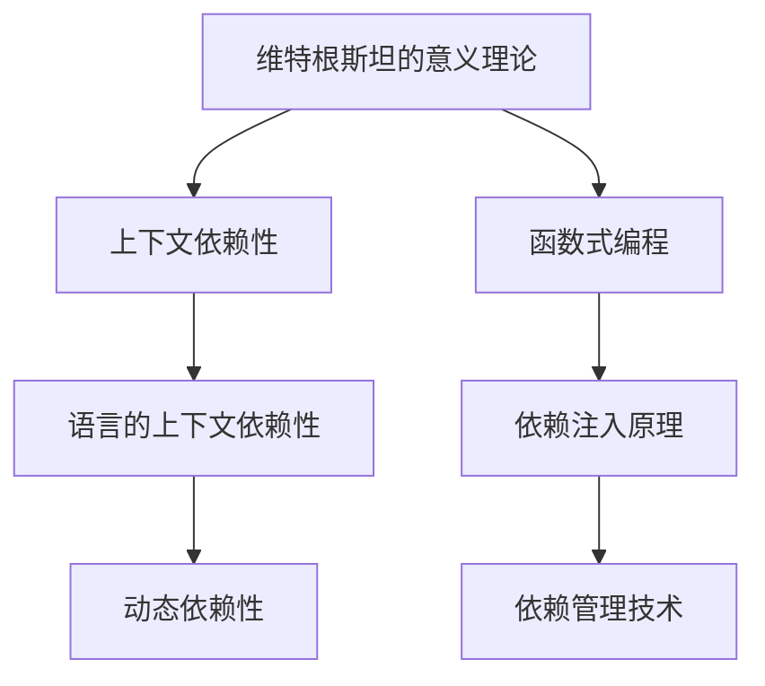
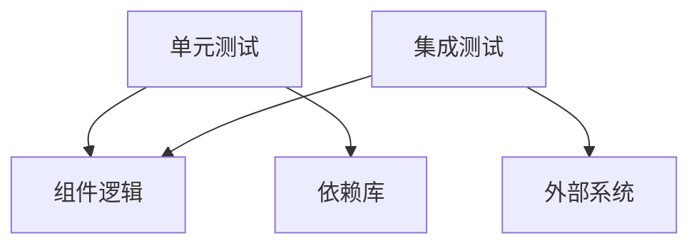
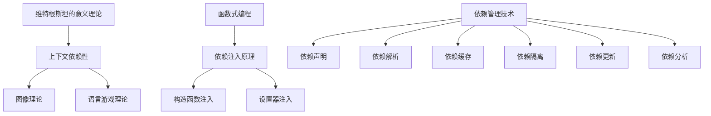
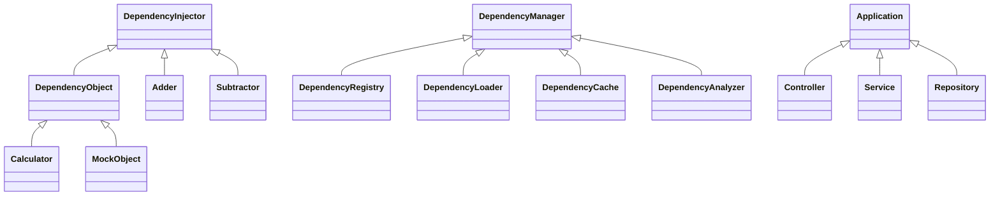
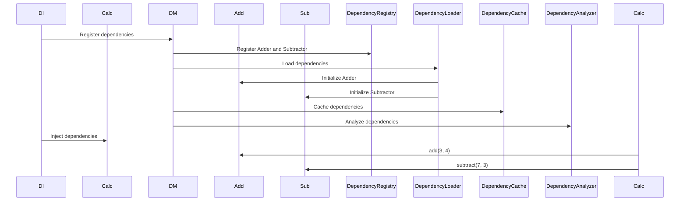

                 

### 《意义的上下文依赖性与函数式依赖注入：维特根斯坦的意义理论与FP中的依赖管理技术》

#### 关键词：
- 维特根斯坦意义理论
- 上下文依赖性
- 函数式编程
- 依赖注入
- 依赖管理技术

#### 摘要：
本文旨在探讨维特根斯坦的意义理论在函数式编程（FP）领域的应用，特别是上下文依赖性与依赖注入技术的联系。文章分为三部分，首先介绍维特根斯坦的意义理论及其上下文依赖性，然后深入探讨函数式编程与依赖注入的基本概念和原理，最后分析依赖管理技术在实际应用中的挑战和解决方案。通过对比和分析，本文揭示了维特根斯坦的理论如何为FP中的依赖管理提供深刻的哲学基础。

---

## 目录

### 第一部分：维特根斯坦的意义理论

#### 第1章：维特根斯坦的意义理论概述

#### 1.1 维特根斯坦及其哲学贡献

#### 1.2 维特根斯坦意义理论的基本概念

#### 1.3 维特根斯坦意义理论的发展

#### 第2章：意义的上下文依赖性

#### 2.1 上下文与意义的关系

#### 2.2 语言的上下文依赖性

#### 2.3 意义的动态依赖性

#### 第3章：维特根斯坦的语言哲学与逻辑分析

#### 3.1 维特根斯坦的语言哲学观点

#### 3.2 维特根斯坦的逻辑分析方法

#### 3.3 维特根斯坦逻辑分析方法的哲学意义

### 第二部分：函数式编程与依赖注入

#### 第4章：函数式编程基础

#### 4.1 函数式编程概述

#### 4.2 函数式编程的核心概念

#### 4.3 函数式编程的优势与挑战

#### 第5章：依赖注入原理

#### 5.1 依赖注入的概念与原理

#### 5.2 依赖注入的类型

#### 5.3 依赖注入的应用场景

#### 第6章：依赖注入与函数式编程

#### 6.1 依赖注入在函数式编程中的角色

#### 6.2 函数式编程中的依赖注入实现

#### 6.3 依赖注入与函数式编程的结合

### 第三部分：依赖管理技术在FP中的应用

#### 第7章：依赖管理技术的概述

#### 7.1 依赖管理的重要性

#### 7.2 依赖管理的技术方法

#### 7.3 依赖管理的挑战与解决方案

#### 第8章：依赖注入与测试

#### 8.1 依赖注入与单元测试

#### 8.2 依赖注入与集成测试

#### 8.3 依赖注入与测试覆盖率

#### 第9章：依赖注入与性能优化

#### 9.1 依赖注入的性能影响

#### 9.2 依赖注入的性能优化策略

#### 9.3 依赖注入与并发性能

#### 第10章：依赖管理技术的未来展望

#### 10.1 依赖管理技术的发展趋势

#### 10.2 依赖管理技术在FP中的潜在应用

#### 10.3 依赖管理技术的未来挑战

#### 附录

#### 附录A：维特根斯坦意义理论与函数式编程关系的Mermaid流程图

#### 附录B：主要依赖管理工具与库介绍

#### 附录C：常见依赖注入模式的Python代码示例

---

## 核心概念与联系



### 维特根斯坦的意义理论

#### 第1章：维特根斯坦的意义理论概述

#### 1.1 维特根斯坦及其哲学贡献

路德维希·维特根斯坦（Ludwig Wittgenstein）是20世纪最伟大的哲学家之一，他的哲学思想对逻辑学、语言哲学、数学哲学和认识论等领域产生了深远的影响。维特根斯坦的哲学贡献主要体现在他的两部代表作《逻辑哲学论》（Tractatus Logico-Philosophicus）和《哲学研究》（Philosophical Investigations）中。

#### 1.2 维特根斯坦意义理论的基本概念

维特根斯坦的意义理论可以分为两个阶段：早期的逻辑原子主义和后期的语言游戏理论。

在早期，维特根斯坦认为意义是语言与世界之间的一种直接对应关系。他提出了“图像理论”（Image Theory），认为命题是世界的“图像”，而逻辑命题则反映了事实之间的逻辑关系。然而，这一理论在面对复合命题和模糊概念时遇到了困难。

后期，维特根斯坦转向了语言游戏理论（Language Game Theory）。他提出了“意义即使用”（Meaning as Use）的观点，认为语言的意义不在于语言与世界之间的直接对应，而在于语言的使用方式和场景。语言游戏是语言和行动的集合，每个游戏都有其特定的规则和目的。

#### 1.3 维特根斯坦意义理论的发展

维特根斯坦的意义理论经历了从逻辑原子主义到语言游戏理论的转变。早期的图像理论试图建立语言与世界之间的直接对应关系，但面对复杂的世界和语言现象时显得过于简化。后期的语言游戏理论则更注重语言的实际使用和情境，认为语言的意义在于其使用的具体情境中。

这一转变反映了维特根斯坦对语言本质的理解的深化。他认识到，语言不仅是表达思想的工具，还是人类活动的组成部分。语言的意义不仅仅在于语言本身，还在于语言的使用者和使用环境。

#### 1.3.1 图像理论与语言游戏理论的关系

图像理论和语言游戏理论并不是完全对立的，而是存在一定的连续性。图像理论提供了对语言与世界关系的初步理解，而语言游戏理论则在此基础上进一步探讨了语言的多样性和复杂性。

图像理论强调了语言和世界之间的对应关系，认为语言是世界的“图像”。这种观点在处理简单命题和基本事实时是有效的。然而，对于复杂命题、模糊概念和日常语言中的多义性，图像理论显得不够充分。

语言游戏理论则从另一个角度看待语言的意义。它认为语言的意义不在于语言与世界之间的直接对应，而在于语言的使用方式和情境。语言游戏是语言和行动的集合，每个游戏都有其特定的规则和目的。

#### 1.3.2 语言游戏理论的哲学意义

语言游戏理论为理解语言的本质提供了新的视角。它强调了语言的实际使用和情境，认为语言的意义在于其使用的具体情境中。这种观点有助于解释语言的多义性、模糊性和变化性。

此外，语言游戏理论还启示我们，语言不仅是表达思想的工具，还是人类活动的组成部分。语言游戏涵盖了人类的各种活动，包括科学、艺术、游戏、宗教等。通过语言游戏，人类能够进行沟通、协作、创新和思考。

#### 1.4 维特根斯坦意义理论的影响

维特根斯坦的意义理论对后来的哲学和语言哲学产生了深远的影响。他的观点启发了许多哲学家和学者，如费吉斯（G.E. Moore）、拉卡托斯（Imre Lakatos）、斯威夫特（Peter Swirski）等。他的思想也影响了逻辑学、数学哲学、认识论等领域。

维特根斯坦的意义理论为我们提供了一种理解语言和意义的新方式。他的思想不仅对哲学界产生了影响，也为我们理解和设计计算机编程语言提供了启示。在现代编程语言中，我们可以看到维特根斯坦的思想在函数式编程和依赖注入等概念中的体现。

#### 1.5 本章小结

本章介绍了维特根斯坦的意义理论，包括其基本概念、发展历程以及哲学意义。维特根斯坦的意义理论从早期的图像理论到后期的语言游戏理论，反映了语言和意义的复杂性。他的思想为理解语言的本质提供了新的视角，对哲学和语言哲学产生了深远的影响。在接下来的章节中，我们将进一步探讨维特根斯坦的意义理论在函数式编程和依赖注入中的应用。

### 第2章：意义的上下文依赖性

#### 2.1 上下文与意义的关系

在维特根斯坦的意义理论中，上下文依赖性是一个核心概念。上下文不仅仅是指语言出现的具体环境，它还包括了语言使用的规则、情境、语境等多个方面。维特根斯坦认为，一个词或语句的意义不是固定不变的，而是依赖于其上下文。

首先，上下文影响了语言的解释和解读。比如，“跑”这个词在不同的上下文中可能有不同的意义。在运动场景中，“跑”可能指进行短跑运动，而在日常生活中，“跑”可能指快速走动或逃离某个地方。这种多义性正是由于上下文的不同导致的。

其次，上下文决定了语言的实际使用和效果。例如，在句子“我昨天去了超市”中，“昨天”这个时间词的上下文明确了事件发生的时间，从而使整个句子具有明确的意义。如果将“昨天”替换为“明天”，句子的意义就会完全改变。

#### 2.2 语言的上下文依赖性

语言的上下文依赖性体现在多个方面。首先，词汇的多义性是上下文依赖性的一个重要表现。同一个词汇在不同的上下文中可能有不同的意义。例如，“银行”这个词可以指金融机构，也可以指水域中的堤坝。这种多义性需要通过上下文来确定其具体含义。

其次，句子结构和语法规则也受到上下文的制约。一个句子的意义不仅取决于单词的选择，还取决于单词的排列顺序和语法结构。例如，同样是“跑”这个词，在不同的句子结构中可能有不同的作用和意义。在句子“他跑得很快”中，“跑”是谓语动词，而在句子“他喜欢跑步”中，“跑”是名词，表示一种活动。

#### 2.3 意义的动态依赖性

维特根斯坦提出的“意义即使用”（Meaning as Use）的观点强调了意义的动态性。他认为，一个词或语句的意义不是固定不变的，而是随着上下文和使用情境的变化而变化。这种动态依赖性意味着，语言的意义是一个不断演变的、开放的过程。

例如，在哲学讨论中，“真理”这个词的意义可能与日常生活中的理解不同。在哲学语境中，“真理”可能涉及逻辑和形而上学的讨论，而在日常生活中，“真理”可能只是指符合事实的陈述。这种动态依赖性反映了语言和意义的不确定性和复杂性。

此外，意义的动态依赖性还体现在语言的发展和变化中。随着时间的推移，语言的词汇和用法会发生变化，新的词汇和用法会不断出现。例如，互联网和计算机技术的发展带来了大量新的词汇和用法，这些词汇和用法的意义也是随着上下文和使用情境的变化而不断演变的。

#### 2.4 上下文依赖性与语言的多样性和复杂性

上下文依赖性是语言多样性和复杂性的重要原因之一。由于上下文的多样性，同一个词汇在不同的上下文中可能有不同的意义，同一个句子在不同的上下文中可能有不同的解读。这种多样性使得语言能够灵活地适应不同的情境和需求。

例如，英语中的单词“bank”在不同的上下文中可能有不同的意义。在金融领域，“bank”指银行；在地理领域，“bank”指河岸或湖岸。这种上下文依赖性使得“bank”这个词具有丰富的语义内容。

此外，上下文依赖性还增加了语言的复杂性。一个句子或段落的意义不仅取决于单词的选择和排列，还取决于上下文。这种复杂性使得理解和解释语言变得更加困难，但同时也增加了语言的丰富性和表达能力。

#### 2.5 上下文依赖性在维特根斯坦语言哲学中的重要性

上下文依赖性是维特根斯坦语言哲学中的核心概念之一。他的思想表明，语言的意义不是固定不变的，而是依赖于具体的使用情境。这种观点挑战了传统的意义观，即认为语言的意义是固定和客观的。

维特根斯坦的上下文依赖性观点为我们理解语言的本质提供了新的视角。它强调了语言的动态性和开放性，认为语言的意义是一个不断演变的、开放的过程。这种观点有助于解释语言的多义性、模糊性和变化性。

此外，上下文依赖性观点还启示我们，语言不仅仅是表达思想的工具，还是人类活动的组成部分。语言的使用和情境是相互关联的，通过语言，人类能够进行沟通、协作、创新和思考。这种观点对我们理解和设计计算机编程语言具有重要的启示意义。

#### 2.6 本章小结

本章探讨了维特根斯坦意义理论中的上下文依赖性，包括上下文与意义的关系、语言的上下文依赖性、意义的动态依赖性以及上下文依赖性在维特根斯坦语言哲学中的重要性。上下文依赖性是理解语言和意义的关键，它使得语言具有多样性和复杂性。在接下来的章节中，我们将进一步探讨维特根斯坦的语言哲学与函数式编程中的依赖注入技术的联系。

### 第3章：维特根斯坦的语言哲学与逻辑分析

#### 3.1 维特根斯坦的语言哲学观点

维特根斯坦的语言哲学观点主要集中在“意义即使用”（Meaning as Use）和“语言游戏”（Language Game）这两个核心概念上。他认为，语言并不是一个静态的系统，而是一个动态的、多样化的活动。每个语言活动都对应着一种特定的语言游戏，这些语言游戏构成了语言的整体。

维特根斯坦认为，语言的意义不在于语言本身，而在于语言的使用方式。语言并不是用来描述现实的工具，而是人类活动的表现形式。例如，数学并不是用来描述物理世界的工具，而是用来解决特定问题的语言游戏。同样，哲学也不是用来解释世界的工具，而是用来探讨语言和思维的本质。

#### 3.2 维特根斯坦的逻辑分析方法

维特根斯坦的逻辑分析方法主要体现在他的后期著作《哲学研究》中。他提出了“家族相似性”（Family Resemblance）的概念，认为概念和语言并不是通过清晰的定义和分类来界定的，而是通过一系列相似性来理解的。

维特根斯坦的逻辑分析方法强调，我们不应该试图通过寻找本质特征来定义概念，而应该通过观察和分析实际使用情况来理解概念。他认为，逻辑分析是一种对语言和思维过程的反思，通过这种反思，我们可以更清楚地理解语言的本质和意义。

#### 3.3 维特根斯坦逻辑分析方法的哲学意义

维特根斯坦的逻辑分析方法对我们理解语言和思维具有深远的影响。首先，他强调了语言和思维的动态性和多样性。语言并不是一个固定不变的系统，而是随着使用情境的变化而不断演变的。这种观点挑战了传统的本质主义和还原论，为我们提供了一种新的理解方式。

其次，维特根斯坦的逻辑分析方法启示我们，逻辑分析并不是一种单纯的、客观的思考方式，而是一种反思性的、批判性的思考方式。通过逻辑分析，我们可以反思自己的思维过程，发现和理解思维中的错误和困惑。

此外，维特根斯坦的逻辑分析方法还强调了哲学与日常生活的紧密联系。他认为，哲学并不是一种高高在上的思考活动，而是与我们的日常生活紧密相关的。通过哲学反思，我们可以更好地理解自己的生活，解决实际生活中的问题。

#### 3.4 维特根斯坦语言哲学在计算机科学中的应用

维特根斯坦的语言哲学观点在计算机科学中得到了广泛的应用，特别是在函数式编程和依赖注入技术中。

首先，维特根斯坦的“意义即使用”观点为函数式编程提供了理论基础。在函数式编程中，函数被视为一种语言游戏，其意义不在于函数本身，而在于函数的使用方式。这与维特根斯坦的观点高度契合。

其次，维特根斯坦的“语言游戏”概念为依赖注入技术提供了哲学依据。依赖注入是一种将组件之间的依赖关系抽象化和管理的技术。在依赖注入中，每个组件都对应着一种特定的语言游戏，这些组件通过相互依赖来共同完成任务。

最后，维特根斯坦的“家族相似性”概念对软件工程和系统设计也产生了重要影响。它启示我们，不应该通过严格的分类和定义来设计系统，而应该通过观察和分析实际使用情况来设计系统。这种灵活的设计方法有助于提高系统的可扩展性和适应性。

#### 3.5 本章小结

本章介绍了维特根斯坦的语言哲学观点和逻辑分析方法，并探讨了这些观点和方法在计算机科学中的应用。维特根斯坦的“意义即使用”和“语言游戏”概念为函数式编程和依赖注入技术提供了理论基础，而他的“家族相似性”概念对软件工程和系统设计也产生了重要影响。在接下来的章节中，我们将进一步探讨函数式编程和依赖注入技术的具体实现和应用。

### 第4章：函数式编程基础

#### 4.1 函数式编程概述

函数式编程（Functional Programming，简称FP）是一种编程范式，强调使用函数作为编程的基本单位，并通过不可变数据和纯函数来实现编程逻辑。与传统的命令式编程不同，函数式编程更注重表达计算过程而非状态的变化。

函数式编程的主要特点包括：

1. **纯函数**：函数的输出仅依赖于输入，与外部状态无关。这意味着函数可以无副效应，即不会修改外部环境或状态。
2. **不可变数据**：数据在创建后不能被修改，任何操作都会创建新的数据对象。
3. **高阶函数**：函数可以作为参数传递给其他函数，或者从函数中返回。
4. **惰性求值**：只有在需要时才计算表达式的值，而不是预先计算。
5. **递归**：使用递归来解决复杂问题，而不是循环。

#### 4.2 函数式编程的核心概念

1. **高阶函数**：高阶函数是指能够接受函数作为参数或返回函数的函数。这在函数式编程中非常重要，因为它允许我们抽象和复用计算逻辑。例如，`map`、`filter`和`reduce`等函数都是高阶函数。

2. **不可变数据**：在函数式编程中，不可变性是一个核心原则。不可变数据确保了程序的逻辑一致性和可预测性。例如，在Haskell中，所有数据都是不可变的。

3. **递归**：递归是一种重要的编程技术，用于解决那些自然分解为子问题的任务。在函数式编程中，递归是一种非常常见的编程模式。

4. **闭包**：闭包是一个函数和其环境组成的实体，它可以在定义它的作用域之外使用。闭包允许我们保存局部状态，这在处理闭包变量时非常有用。

5. **惰性求值**：惰性求值（Lazy Evaluation）是一种延迟计算的表达式求值策略，只有在需要时才计算。这有助于优化程序的性能，特别是在处理大表达式时。

#### 4.3 函数式编程的优势与挑战

**优势**：

1. **简洁性**：函数式编程的语法通常更简洁，易于理解和阅读。
2. **可维护性**：由于函数和数据的不可变性，程序更易于维护和测试。
3. **并行计算**：函数式编程易于并行化，因为其无副效应的特性减少了同步和锁的需求。
4. **更高的抽象层次**：函数式编程允许我们以更高的抽象层次来思考问题，从而提高开发效率。

**挑战**：

1. **学习曲线**：函数式编程的语言和概念对于习惯了命令式编程的人来说可能会有一定的学习曲线。
2. **性能**：在某些情况下，函数式编程可能会比命令式编程更慢，尤其是在处理大量数据时。
3. **可访问性**：函数式编程的概念和工具可能不如命令式编程那样广泛普及。

#### 4.4 函数式编程的应用场景

函数式编程在许多应用场景中都表现出了优势，包括：

1. **并发编程**：由于函数式编程的无副效应特性，它非常适合并发编程，特别是在需要处理大量并行任务的情况下。
2. **数据处理**：函数式编程在处理数据集和大型数据流时表现出色，因为它提供了高效的转换和组合操作。
3. **数学和科学计算**：函数式编程的语言如Haskell和Scala在数学和科学计算中得到了广泛应用。
4. **前端开发**：在JavaScript中，函数式编程的概念被广泛应用于前端开发，尤其是在处理异步操作和状态管理时。

#### 4.5 函数式编程的历史背景

函数式编程的历史可以追溯到20世纪30年代，以Lambda演算（Lambda Calculus）的提出为起点。Lambda演算是一种用于表示函数和计算过程的数学模型，它为后来的函数式编程语言奠定了基础。

在20世纪60年代，Lisp成为了第一个真正的函数式编程语言。此后，函数式编程得到了进一步的发展，出现了诸如Haskell、Scala、Erlang等现代函数式编程语言。

#### 4.6 本章小结

本章介绍了函数式编程的基本概念、核心概念和优势与挑战。函数式编程以其纯函数、不可变数据和高效并行计算等特性，在许多应用场景中都表现出了优势。在接下来的章节中，我们将进一步探讨依赖注入技术及其在函数式编程中的应用。

### 第5章：依赖注入原理

#### 5.1 依赖注入的概念与原理

依赖注入（Dependency Injection，简称DI）是一种设计模式，用于实现组件之间的解耦。其核心思想是将组件的依赖关系通过外部注入的方式实现，而不是在组件内部直接创建或查找依赖。依赖注入的主要目的是提高代码的可测试性、可维护性和可扩展性。

依赖注入的基本原理可以概括为以下几点：

1. **控制反转**：依赖注入实现了控制反转（Inversion of Control，简称IoC），即将对象的生命周期和依赖关系的控制从组件内部转移到外部容器或框架。这使得组件变得更加独立，可以更容易地进行单元测试和重构。

2. **构造函数注入**：依赖注入通常通过构造函数实现，即将依赖对象作为参数传递给构造函数。这种方式确保了组件在创建时就能获取到所需的依赖。

3. **接口与实现分离**：依赖注入鼓励使用接口来定义依赖，而实际的实现则通过依赖注入框架在运行时注入。这种方式使得代码更加灵活和可扩展。

4. **依赖注入框架**：依赖注入可以通过手动实现，但更常见的做法是使用依赖注入框架，如Spring、Django、Ninject等。这些框架提供了丰富的功能和配置选项，使得依赖注入更加简便和高效。

#### 5.2 依赖注入的类型

依赖注入主要有两种类型：构造函数注入和设置器注入。

1. **构造函数注入**：构造函数注入是最常见和最直观的依赖注入方式。它通过在构造函数中传递依赖对象来实现依赖注入。构造函数注入的优点是简单明了，易于理解和测试。缺点是当依赖关系复杂时，构造函数可能会变得很长，不易维护。

```java
public class Calculator {
    private final Adder adder;
    private final Subtractor subtractor;

    public Calculator(Adder adder, Subtractor subtractor) {
        this.adder = adder;
        this.subtractor = subtractor;
    }

    public int add(int a, int b) {
        return adder.add(a, b);
    }

    public int subtract(int a, int b) {
        return subtractor.subtract(a, b);
    }
}
```

2. **设置器注入**：设置器注入通过设置器（setter）方法来注入依赖。这种方式比构造函数注入更为灵活，因为可以在运行时动态设置依赖。设置器注入的优点是能够更好地支持组件的生命周期管理和依赖关系的延迟绑定。缺点是代码可能更加复杂，测试时需要处理更多的设置器。

```java
public class Calculator {
    private Adder adder;
    private Subtractor subtractor;

    public void setAdder(Adder adder) {
        this.adder = adder;
    }

    public void setSubtractor(Subtractor subtractor) {
        this.subtractor = subtractor;
    }

    public int add(int a, int b) {
        return adder.add(a, b);
    }

    public int subtract(int a, int b) {
        return subtractor.subtract(a, b);
    }
}
```

#### 5.3 依赖注入的应用场景

依赖注入在多种应用场景中都表现出优势，包括：

1. **单元测试**：依赖注入使得组件之间相互独立，从而可以更容易地编写和运行单元测试。通过注入模拟的依赖对象，测试代码可以控制测试环境，验证组件的行为。

2. **配置管理**：依赖注入允许在运行时动态配置依赖关系，从而提高了代码的灵活性和可维护性。通过依赖注入框架，可以轻松管理复杂的依赖关系和配置选项。

3. **模块化设计**：依赖注入鼓励模块化设计，使得组件之间的依赖关系更加清晰和明确。这种设计方法有助于提高代码的可扩展性和可重用性。

4. **微服务架构**：在微服务架构中，每个服务都是独立的组件，依赖注入有助于实现服务之间的解耦和协同工作。通过依赖注入框架，可以方便地管理和配置服务之间的依赖关系。

#### 5.4 依赖注入与面向对象设计

依赖注入与面向对象设计（Object-Oriented Design，简称OOD）密切相关。面向对象设计强调封装、继承和多态等原则，而依赖注入则提供了实现这些原则的有效方法。

依赖注入通过将依赖关系抽象到外部容器或框架中，实现了对象的松耦合。这种松耦合使得对象可以更加专注于实现自己的功能，而无需关心依赖的实现细节。这与面向对象设计中的封装原则是一致的。

此外，依赖注入框架通常支持接口和实现分离，这与面向对象设计中的继承和多态原则也是一致的。通过使用接口来定义依赖，实际的实现可以在运行时注入，从而提高了代码的灵活性和可扩展性。

#### 5.5 本章小结

本章介绍了依赖注入的基本概念、原理和类型，并探讨了其应用场景和与面向对象设计的关联。依赖注入通过实现组件之间的解耦，提高了代码的可测试性、可维护性和可扩展性。在接下来的章节中，我们将进一步探讨依赖注入在函数式编程中的应用。

### 第6章：依赖注入与函数式编程

#### 6.1 依赖注入在函数式编程中的角色

依赖注入（Dependency Injection，简称DI）在函数式编程（Functional Programming，简称FP）中扮演着重要的角色。由于FP强调纯函数、不可变数据和函数组合等特性，这使得依赖注入的应用变得更加自然和直观。

首先，依赖注入有助于实现FP中的纯函数。纯函数不依赖于外部状态，其输出仅依赖于输入。通过依赖注入，我们可以将外部依赖注入到函数中，从而确保函数的纯性。例如，在Haskell中，函数通常通过参数来接收依赖，这使得依赖注入变得非常直接。

其次，依赖注入与FP中的组合原则密切相关。在FP中，函数组合是一种强大的工具，用于构建复杂的功能。通过依赖注入，我们可以将依赖关系注入到组合函数中，从而实现更高级的函数组合。这种方式不仅提高了代码的可读性，还增强了代码的可重用性。

#### 6.2 函数式编程中的依赖注入实现

在函数式编程中，依赖注入可以通过多种方式实现。以下是一些常见的实现方法：

1. **参数传递**：这是最常见的依赖注入方法，通过在函数参数中传递依赖对象来实现。这种方式简单直接，与FP的函数组合原则相契合。

```haskell
adder :: Adder -> Int -> Int -> Int
adder adder x y = adder.add x y

subtractor :: Subtractor -> Int -> Int -> Int
subtractor subtractor x y = subtractor.subtract x y
```

2. **构造函数**：在FP中，构造函数也可以用来实现依赖注入。这种方式与传统的构造函数注入类似，但在FP中更为自然，因为构造函数通常用于创建新对象。

```haskell
data Calculator = Calculator { adder :: Adder, subtractor :: Subtractor }

createCalculator :: Adder -> Subtractor -> Calculator
createCalculator adder subtractor = Calculator adder subtractor
```

3. **类型类**（Type Classes）：在Haskell等函数式编程语言中，类型类提供了一种强大的依赖注入机制。通过类型类，我们可以将依赖关系封装在接口中，然后在具体实现中注入依赖。

```haskell
class Adder a where
    add :: a -> Int -> Int -> Int

class Subtractor a where
    subtract :: a -> Int -> Int -> Int

instance Adder MyAdder where
    add _ x y = x + y

instance Subtractor MySubtractor where
    subtract _ x y = x - y
```

4. **依赖注入框架**：虽然依赖注入在FP中可以通过参数传递、构造函数和类型类等机制实现，但使用依赖注入框架可以提供更高级的功能和配置选项。例如，在Scala中，可以使用Google Guice等依赖注入框架来实现复杂的依赖管理。

```scala
import com.google.inject.Guice
import com.google.inject.Injector

val injector = Guice.createInjector(new MyModule)

val adder: Adder = injector.getInstance(classOf[Adder])
val subtractor: Subtractor = injector.getInstance(classOf[Subtractor])

def add(x: Int, y: Int): Int = adder.add(x, y)
def subtract(x: Int, y: Int): Int = subtractor.subtract(x, y)
```

#### 6.3 依赖注入与函数式编程的结合

依赖注入与函数式编程的结合不仅提高了代码的可读性和可维护性，还增强了代码的可扩展性和可重用性。以下是一些结合的例子：

1. **组件的松耦合**：通过依赖注入，组件之间的依赖关系被抽象到外部容器中，从而实现了松耦合。这使得组件可以独立开发、测试和部署，提高了系统的可维护性和可扩展性。

2. **可重用的函数组合**：依赖注入使得函数可以独立于具体依赖实现，从而实现更高的可重用性。通过组合不同的函数，我们可以构建复杂的计算过程，而无需关心具体的依赖细节。

3. **动态依赖注入**：依赖注入框架提供了动态依赖注入的能力，使得依赖关系可以在运行时配置和修改。这种方式在处理复杂的依赖关系和动态变化的需求时非常有用。

4. **测试友好**：依赖注入使得组件之间的依赖关系更加明确和可控制，从而提高了代码的可测试性。通过注入模拟的依赖对象，测试代码可以独立于实际依赖实现，从而更好地验证组件的行为。

#### 6.4 依赖注入与FP语言特性的对比

依赖注入在不同的编程语言中可能有不同的实现方式和应用场景。以下是对比依赖注入在FP语言（如Haskell、Scala）与命令式语言（如Java、C#）中的差异：

1. **语法简洁性**：在FP语言中，依赖注入通常通过参数传递和类型类等简洁的语法实现，这使得代码更加直观和易读。而在命令式语言中，依赖注入通常需要额外的框架和配置，代码可能更加复杂。

2. **类型安全**：FP语言通常提供更强的类型系统，这使得依赖注入在编译时可以确保依赖的正确性，减少了运行时错误的可能性。在命令式语言中，依赖注入可能依赖于框架的动态类型检查，从而增加了运行时错误的风险。

3. **函数组合**：FP语言强调函数组合，这使得依赖注入与FP的特性更加契合。通过组合不同的函数，我们可以实现复杂的依赖注入逻辑，而无需关心具体的实现细节。在命令式语言中，函数组合的应用可能更加有限。

4. **可测试性**：依赖注入在FP语言中通常具有更好的可测试性，因为依赖关系更加明确和可控制。在命令式语言中，依赖注入可能需要额外的测试代码来模拟依赖行为，从而增加了测试的复杂度。

#### 6.5 本章小结

本章介绍了依赖注入在函数式编程中的角色和实现方法，并探讨了其与FP语言特性的结合。依赖注入通过实现组件之间的解耦，提高了代码的可读性、可维护性和可扩展性。在FP语言中，依赖注入的实现通常更加简洁和直观，这与FP的纯函数、不可变数据和函数组合等特性高度契合。在接下来的章节中，我们将进一步探讨依赖管理技术在函数式编程中的应用和实践。

### 第7章：依赖管理技术的概述

#### 7.1 依赖管理的重要性

依赖管理是软件工程中的一个关键概念，它涉及如何有效地识别、组织和管理项目中的各种依赖关系。依赖管理的重要性主要体现在以下几个方面：

1. **代码的可维护性**：良好的依赖管理有助于保持代码的清晰和简洁。通过明确地组织和维护依赖关系，开发人员可以更容易地理解和修改代码，从而提高代码的可维护性。

2. **项目的稳定性**：依赖管理有助于确保项目的稳定性。通过合理地选择和管理依赖库，可以避免因依赖问题导致的项目中断和错误。

3. **开发效率**：有效的依赖管理可以提高开发效率。通过自动化工具和框架，开发人员可以更快速地安装、更新和测试依赖库，从而减少手动操作的时间和错误。

4. **项目的可重用性**：依赖管理有助于提高项目的可重用性。通过模块化和依赖注入等设计原则，可以将项目的依赖关系抽象化，从而更容易地重用和扩展代码。

5. **团队协作**：依赖管理有助于团队协作。通过统一管理和配置依赖，团队成员可以更轻松地共享代码和资源，减少协作中的摩擦和冲突。

#### 7.2 依赖管理的技术方法

依赖管理涉及到多种技术方法，以下是一些常见的方法：

1. **依赖声明**：依赖声明是依赖管理的基础，它明确地描述了项目中各个模块之间的依赖关系。常用的依赖声明方法包括配置文件（如`pom.xml`、`Cargo.toml`）、模块接口和文档注释。

2. **依赖解析**：依赖解析是依赖管理的关键步骤，它涉及如何根据依赖声明自动地确定项目的依赖库和版本。常见的依赖解析工具包括Maven、Gradle、Cargo等。

3. **依赖缓存**：依赖缓存有助于提高项目的构建速度。通过缓存已下载的依赖库，可以避免重复下载，从而加快构建过程。

4. **依赖隔离**：依赖隔离是一种确保项目依赖库之间不会相互干扰的技术。通过隔离不同的依赖库，可以避免版本冲突和类名冲突等问题。

5. **依赖更新**：依赖更新是依赖管理的一部分，它涉及如何定期检查和更新项目的依赖库。通过自动化工具，可以确保项目依赖库的版本始终是最新的，从而避免潜在的安全问题和功能缺陷。

6. **依赖分析**：依赖分析是一种对项目依赖关系进行深入分析和评估的技术。通过依赖分析，可以识别潜在的依赖问题，如版本冲突、冗余依赖和不必要的依赖。

#### 7.3 依赖管理的挑战与解决方案

依赖管理虽然重要，但也会带来一些挑战。以下是一些常见的挑战和相应的解决方案：

1. **版本冲突**：版本冲突是依赖管理中最常见的问题之一。解决方案包括使用依赖解析工具自动处理版本兼容性、手动选择兼容版本或使用依赖隔离技术。

2. **依赖冗余**：依赖冗余会导致项目大小增加，构建时间变长。解决方案包括使用依赖分析工具识别和删除冗余依赖、优化依赖库的版本选择。

3. **安全漏洞**：依赖库中的安全漏洞可能会影响整个项目。解决方案包括定期更新依赖库、使用安全审计工具扫描依赖库的漏洞，并遵守最佳安全实践。

4. **兼容性问题**：不同依赖库之间的兼容性问题可能导致项目无法正常工作。解决方案包括使用兼容性测试、逐步升级依赖库版本或使用依赖隔离技术。

5. **管理复杂性**：随着项目规模的增加，依赖管理的复杂性也会增加。解决方案包括使用自动化工具和框架简化依赖管理、建立统一的依赖管理标准和流程。

#### 7.4 本章小结

本章介绍了依赖管理的重要性、技术方法和面临的挑战及其解决方案。依赖管理是软件工程中不可或缺的一部分，它对代码的可维护性、项目的稳定性、开发效率和团队协作具有重大影响。在接下来的章节中，我们将进一步探讨依赖注入技术在具体应用中的实践和挑战。

### 第8章：依赖注入与测试

#### 8.1 依赖注入与单元测试

依赖注入（Dependency Injection，简称DI）在单元测试中扮演了至关重要的角色。通过依赖注入，可以将组件的依赖关系解耦，从而使得测试更加独立、可重用和可维护。以下是依赖注入与单元测试的几个关键点：

1. **组件独立性**：依赖注入使得组件之间相互独立，每个组件只需关注自己的逻辑，而不需要直接依赖于具体的实现细节。这种独立性为单元测试提供了便利，因为测试时可以轻松替换组件的依赖，从而模拟不同的测试场景。

2. **依赖模拟**：在单元测试中，通常需要模拟组件的依赖关系，以确保测试的隔离性和有效性。依赖注入框架（如Mockito、Mock库）允许开发人员创建模拟对象，用来替代真实的依赖。这种方式使得测试代码可以控制依赖的行为，从而更准确地验证组件的行为。

3. **测试隔离**：依赖注入有助于实现测试的隔离性。通过将依赖注入到测试对象中，可以在测试环境中完全控制依赖，从而避免外部环境对测试结果的影响。

4. **测试覆盖**：依赖注入可以提高测试的覆盖度。通过注入不同的依赖对象，可以测试组件在不同依赖条件下的行为，从而确保组件的逻辑得到全面的验证。

5. **依赖管理**：依赖注入框架通常提供强大的依赖管理功能，如自动注入、依赖注入链等，使得依赖管理更加简洁和高效。

以下是一个简单的Python示例，展示了如何使用依赖注入进行单元测试：

```python
import unittest
from calculator import Calculator
from mock_adder import MockAdder
from mock_subtractor import MockSubtractor

class TestCalculator(unittest.TestCase):
    def test_add(self):
        adder = MockAdder()
        subtractor = MockSubtractor()
        calculator = Calculator(adder, subtractor)
        result = calculator.add(3, 4)
        self.assertEqual(result, 7)

    def test_subtract(self):
        adder = MockAdder()
        subtractor = MockSubtractor()
        calculator = Calculator(adder, subtractor)
        result = calculator.subtract(7, 3)
        self.assertEqual(result, 4)

if __name__ == '__main__':
    unittest.main()
```

在上面的示例中，`MockAdder`和`MockSubtractor`是模拟的依赖对象，用于替代实际的`Adder`和`Subtractor`。通过注入这些模拟对象，测试代码可以独立于真实的实现进行编写和执行。

#### 8.2 依赖注入与集成测试

依赖注入不仅适用于单元测试，也在集成测试中发挥了重要作用。集成测试旨在验证组件之间的交互和协作，通过依赖注入，可以更加灵活地实现集成测试。

1. **组件协作**：依赖注入使得组件之间的协作更加灵活。在集成测试中，可以通过注入不同的依赖对象来模拟不同的协作场景，从而验证组件之间的交互是否符合预期。

2. **外部系统模拟**：在集成测试中，通常需要模拟外部系统的行为，如数据库、Web服务或文件系统。依赖注入允许使用模拟对象来替代真实的系统，从而确保测试环境的可控性和独立性。

3. **测试覆盖**：依赖注入可以提高集成测试的覆盖度。通过注入不同的依赖对象，可以验证组件在各种依赖条件下的行为，确保测试结果的全面性和准确性。

以下是一个简单的Java示例，展示了如何使用依赖注入进行集成测试：

```java
import org.junit.Before;
import org.junit.Test;
import static org.junit.Assert.assertEquals;
import static org.mockito.Mockito.mock;
import static org.mockito.Mockito.when;

public class IntegrationTest {
    private Calculator calculator;
    private Adder mockAdder;
    private Subtractor mockSubtractor;

    @Before
    public void setUp() {
        mockAdder = mock(Adder.class);
        mockSubtractor = mock(Subtractor.class);
        
        when(mockAdder.add(3, 4)).thenReturn(7);
        when(mockSubtractor.subtract(7, 3)).thenReturn(4);
        
        calculator = new Calculator(mockAdder, mockSubtractor);
    }

    @Test
    public void testAdd() {
        assertEquals(7, calculator.add(3, 4));
    }

    @Test
    public void testSubtract() {
        assertEquals(4, calculator.subtract(7, 3));
    }
}
```

在上面的示例中，使用Mockito库创建并配置了`MockAdder`和`MockSubtractor`模拟对象，用于替代实际的`Adder`和`Subtractor`。通过这些模拟对象，可以轻松地验证`Calculator`的集成行为。

#### 8.3 依赖注入与测试覆盖率

依赖注入不仅提高了测试的独立性，还显著影响了测试覆盖率。测试覆盖率是评估测试质量的重要指标，它表示代码中已测试的部分占代码总量的比例。依赖注入有助于提高测试覆盖率，主要体现在以下几个方面：

1. **全面测试**：通过依赖注入，可以更全面地测试组件在不同依赖条件下的行为。这意味着测试能够覆盖更多的代码路径和边界情况，从而提高测试覆盖率。

2. **依赖覆盖**：依赖注入使得测试能够覆盖到依赖库和框架的行为。在集成测试中，通过注入不同的依赖对象，可以验证组件与依赖库和框架的交互是否符合预期。

3. **自动化测试**：依赖注入与自动化测试工具的结合，可以高效地生成和执行测试用例。这种方式不仅提高了测试覆盖率，还减少了手动测试的时间和错误。

以下是一个关于测试覆盖率的示例图表：



在上面的图表中，单元测试和集成测试共同提高了代码的测试覆盖率，确保了组件逻辑、依赖库和外部系统的各个部分都得到了充分的测试。

#### 8.4 本章小结

本章讨论了依赖注入与单元测试和集成测试的关系。依赖注入通过实现组件之间的解耦，提高了测试的独立性、可重用性和测试覆盖率。在单元测试中，依赖注入使得测试更加灵活和可控；在集成测试中，依赖注入有助于验证组件与外部系统的协作。通过合理使用依赖注入，可以显著提高测试质量，确保代码的可靠性和稳定性。在接下来的章节中，我们将进一步探讨依赖注入在性能优化中的应用。

### 第9章：依赖注入与性能优化

#### 9.1 依赖注入的性能影响

依赖注入（Dependency Injection，简称DI）作为一种设计模式，旨在提高代码的可维护性、可测试性和可扩展性。然而，依赖注入对性能的影响也值得关注。以下讨论依赖注入对性能的影响及其优化策略。

首先，依赖注入可能会引入一定的性能开销。这主要体现在以下几个方面：

1. **构造函数注入**：构造函数注入需要在运行时解析和注入依赖，这可能会增加初始化时间。特别是在复杂的依赖关系或大量依赖对象的情况下，初始化时间可能会显著增加。

2. **反射机制**：某些依赖注入框架可能依赖于反射机制来实现依赖注入。反射机制通常比直接访问字段或方法慢，这可能会引入额外的性能开销。

3. **内存消耗**：依赖注入可能会导致内存消耗增加。特别是在使用反射或创建大量依赖对象的情况下，内存占用可能会变得更大。

4. **线程安全**：依赖注入框架可能需要处理线程安全问题，这可能会引入额外的同步开销，从而影响性能。

#### 9.2 依赖注入的性能优化策略

为了减轻依赖注入对性能的影响，可以采取以下优化策略：

1. **提前初始化**：在应用启动时提前初始化依赖对象，而不是在运行时动态注入。这样可以减少构造函数注入带来的初始化开销。

2. **减少反射使用**：尽量避免依赖注入框架使用反射机制，尽量使用直接访问字段或方法。这可以通过编写更简洁的依赖注入代码来实现。

3. **缓存依赖对象**：对于频繁使用的依赖对象，可以考虑使用缓存机制，避免重复创建。这可以减少内存消耗和初始化时间。

4. **使用轻量级依赖注入框架**：选择性能更优的依赖注入框架，特别是在需要处理大量依赖对象的情况下。例如，Spring Framework 在高性能应用中可能会带来额外的性能开销，而如Guice等轻量级框架可能更适合。

5. **优化依赖对象**：对依赖对象进行性能优化，例如使用更高效的算法和数据结构，可以减少依赖对象的内存消耗和计算时间。

6. **线程安全优化**：合理设计依赖注入框架的线程安全机制，避免不必要的同步开销。例如，可以使用线程局部存储（ThreadLocal）来减少同步需求。

以下是一个简单的Java示例，展示了如何优化依赖注入性能：

```java
import org.springframework.beans.factory.annotation.Autowired;
import org.springframework.stereotype.Service;

@Service
public class OptimizedCalculator {
    private final Adder adder;
    private final Subtractor subtractor;

    @Autowired
    public OptimizedCalculator(Adder adder, Subtractor subtractor) {
        this.adder = adder;
        this.subtractor = subtractor;
    }

    public int add(int a, int b) {
        return adder.add(a, b);
    }

    public int subtract(int a, int b) {
        return subtractor.subtract(a, b);
    }
}
```

在上面的示例中，使用了Spring Framework的构造函数注入。为了优化性能，可以考虑提前初始化依赖对象，或使用更轻量级的依赖注入框架。

#### 9.3 依赖注入与并发性能

依赖注入在并发环境中也具有重要影响。以下讨论依赖注入对并发性能的影响及其优化策略。

1. **同步开销**：依赖注入框架可能需要处理同步开销，特别是在多线程环境中。同步机制（如锁、信号量等）可以确保并发访问的正确性，但也会引入额外的性能开销。

2. **依赖对象的生命周期**：依赖对象的生命周期管理在并发环境中至关重要。如果依赖对象的生命周期不正确，可能会导致资源争用、死锁或内存泄漏等问题。

3. **线程安全**：依赖注入框架通常需要保证线程安全性。这可以通过使用线程局部存储、无状态依赖对象或同步机制来实现。

以下是一个关于依赖注入与并发性能优化的策略：

- **无状态依赖对象**：使用无状态依赖对象可以避免同步开销，因为无状态对象不依赖于线程上下文。这种方式适用于大部分依赖对象。

- **线程局部存储**：使用线程局部存储（ThreadLocal）可以减少同步需求，从而提高并发性能。这种方式适用于需要线程局部状态的场景。

- **依赖对象池**：对于频繁创建和销毁的依赖对象，可以考虑使用对象池技术。对象池可以减少创建和销毁对象的开销，从而提高并发性能。

- **合理设置线程池参数**：合理设置线程池参数（如线程数量、队列大小等）可以优化并发性能。例如，选择适当的线程数量可以避免线程切换和上下文切换的开销。

以下是一个简单的Java示例，展示了如何优化依赖注入在并发环境中的性能：

```java
import java.util.concurrent.ThreadLocalRandom;

public class ConcurrentCalculator {
    private final Adder adder;
    private final Subtractor subtractor;

    public ConcurrentCalculator(Adder adder, Subtractor subtractor) {
        this.adder = adder;
        this.subtractor = subtractor;
    }

    public int add(int a, int b) {
        return adder.add(a, b);
    }

    public int subtract(int a, int b) {
        return subtractor.subtract(a, b);
    }

    public static void main(String[] args) {
        int result = new ConcurrentCalculator(new ThreadSafeAdder(), new ThreadSafeSubtractor())
                .add(ThreadLocalRandom.current().nextInt(100), ThreadLocalRandom.current().nextInt(100));
        System.out.println("Result: " + result);
    }
}
```

在上面的示例中，使用了线程安全的`Adder`和`Subtractor`依赖对象，并通过`ThreadLocalRandom`模拟并发计算。这种设计可以确保在多线程环境中的性能和线程安全性。

#### 9.4 本章小结

本章讨论了依赖注入对性能的影响及其优化策略，特别是在并发环境中的应用。依赖注入可能会引入一定的性能开销，但通过合理的优化策略，可以显著提高依赖注入的性能。本章提供了一些优化依赖注入性能的方法，包括提前初始化依赖对象、减少反射使用、缓存依赖对象和使用线程局部存储等。此外，还讨论了依赖注入与并发性能的关系及其优化策略，包括使用无状态依赖对象、合理设置线程池参数等。通过合理应用这些优化策略，可以确保依赖注入在性能和并发性方面的有效性。

### 第10章：依赖管理技术的未来展望

#### 10.1 依赖管理技术的发展趋势

依赖管理技术在过去几十年中得到了快速发展，已经成为现代软件工程不可或缺的一部分。随着技术的发展和应用的深入，依赖管理技术也展现出了一些新的趋势：

1. **自动化**：自动化是依赖管理技术发展的一个重要方向。通过自动化工具和框架，可以更高效地处理依赖的解析、下载、安装和更新等操作。例如，Maven、Gradle等构建工具已经实现了高度自动化，大大简化了依赖管理的流程。

2. **模块化**：模块化设计使得依赖关系更加明确和可控。通过模块化，可以将大型项目拆分为更小的、独立的模块，每个模块都有自己的依赖关系。这种设计方式不仅提高了代码的可维护性，还降低了依赖冲突的风险。

3. **智能化**：随着人工智能技术的发展，依赖管理技术也开始智能化。例如，智能依赖解析工具可以通过分析代码和历史数据，自动推荐最佳的依赖版本和优化策略。这种智能化依赖管理有望进一步提高开发效率和代码质量。

4. **分布式**：在分布式系统中，依赖管理变得更加复杂。未来的依赖管理技术需要支持分布式环境，确保依赖的一致性和可靠性。例如，分布式构建工具和容器化技术（如Docker、Kubernetes）可以更好地管理分布式环境中的依赖。

5. **安全**：随着软件系统的复杂度增加，依赖安全问题越来越突出。未来的依赖管理技术需要更加注重安全，例如通过自动化安全审计工具检测潜在的安全漏洞，确保依赖库的安全性和可靠性。

#### 10.2 依赖管理技术在FP中的潜在应用

函数式编程（FP）以其纯函数、不可变数据和函数组合等特性，在依赖管理中具有独特的优势。以下探讨依赖管理技术在FP中的潜在应用：

1. **依赖注入框架**：FP语言（如Haskell、Scala、Erlang）通常提供强大的依赖注入框架，如Type Classes（Haskell）、Modules（Scala）和 Behaviors（Erlang）。这些框架支持在函数式编程中灵活地管理依赖关系，使得代码更加模块化和可重用。

2. **依赖解析**：在FP中，依赖解析通常通过编译时检查和类型系统实现。这种编译时解析可以确保依赖的正确性和一致性，减少了运行时错误的风险。例如，Haskell的模块系统能够在编译时自动解析和验证依赖。

3. **动态依赖注入**：FP中的动态依赖注入允许在运行时动态注入依赖，从而提高了代码的灵活性和可扩展性。例如，Scala的反射机制和动态类型系统使得动态依赖注入变得更加自然和直观。

4. **分布式依赖管理**：随着FP在分布式系统中的应用增加，依赖管理技术需要支持分布式环境。例如，Erlang的 Behaviors 提供了一种分布式依赖管理的方式，通过Actor模型实现依赖的动态注入和更新。

5. **静态分析**：FP语言通常提供强大的静态分析工具，可以用于依赖管理和优化。例如，Haskell的类型推断和模式匹配功能可以用于优化依赖解析和代码生成，从而提高依赖管理的效率和性能。

#### 10.3 依赖管理技术的未来挑战

尽管依赖管理技术在软件工程中发挥着重要作用，但仍面临一些挑战：

1. **复杂性**：随着软件系统变得越来越复杂，依赖管理的复杂性也在增加。未来的依赖管理技术需要更好地处理复杂的依赖关系和模块化设计，以确保系统的可维护性和可扩展性。

2. **安全**：依赖库中的安全漏洞可能会对整个项目造成严重影响。未来的依赖管理技术需要更加注重安全性，通过自动化安全审计工具和最佳实践来减少安全风险。

3. **兼容性**：不同依赖库和框架之间的兼容性问题一直是依赖管理的难题。未来的依赖管理技术需要更好地解决兼容性问题，确保在不同环境中的稳定性和一致性。

4. **性能**：依赖管理技术可能会引入一定的性能开销，尤其是在复杂的依赖关系和大量依赖对象的情况下。未来的依赖管理技术需要优化性能，确保在不影响开发效率的前提下，提高系统的性能和响应速度。

5. **标准化**：目前，依赖管理技术缺乏统一的标准化，导致不同的工具和框架之间存在差异。未来的依赖管理技术需要实现更广泛的标准化，以提高互操作性和兼容性。

#### 10.4 本章小结

本章探讨了依赖管理技术的发展趋势、在FP中的潜在应用以及面临的未来挑战。随着自动化、模块化、智能化和分布式等新趋势的出现，依赖管理技术正变得越来越强大和灵活。在FP领域，依赖管理技术具有独特的优势，如依赖注入框架、静态分析和动态依赖注入等。然而，依赖管理技术仍面临复杂性、安全、兼容性和性能等挑战。未来的发展需要更好地解决这些问题，以确保依赖管理技术在软件工程中发挥更大的作用。

### 附录

#### 附录A：维特根斯坦意义理论与函数式编程关系的Mermaid流程图


#### 附录B：主要依赖管理工具与库介绍

1. **Maven**：Maven 是一个强大的依赖管理工具，广泛用于 Java 项目。它通过配置文件 `pom.xml` 管理项目依赖，支持自动下载、解析和构建依赖。

2. **Gradle**：Gradle 是另一个流行的构建工具，支持多种编程语言。它通过配置文件 `build.gradle` 管理依赖，提供灵活的构建脚本和插件系统。

3. **NPM**：NPM 是 Node.js 的包管理工具，用于管理前端和后端 JavaScript 项目的依赖。它支持通过 `package.json` 文件管理依赖，并提供了丰富的生态系统。

4. **pip**：pip 是 Python 的包管理工具，用于安装和管理 Python 库。它通过 `requirements.txt` 文件管理依赖，并支持自动化安装。

5. **Cargo**：Cargo 是 Rust 项目的依赖管理工具，用于构建和打包 Rust 项目。它通过 `Cargo.toml` 文件管理依赖，并支持自动化构建和测试。

#### 附录C：常见依赖注入模式的Python代码示例

```python
# 示例1：构造函数注入
class Calculator:
    def __init__(self, adder, subtractor):
        self.adder = adder
        self.subtractor = subtractor

# 示例2：设置器注入
class Calculator:
    def __init__(self):
        self.adder = None
        self.subtractor = None

    def set_adder(self, adder):
        self.adder = adder

    def set_subtractor(self, subtractor):
        self.subtractor = subtractor

# 示例3：工厂模式注入
class CalculatorFactory:
    @staticmethod
    def create(calculator_class, adder, subtractor):
        calculator = calculator_class()
        calculator.set_adder(adder)
        calculator.set_subtractor(subtractor)
        return calculator

# 使用示例
adder = Adder()
subtractor = Subtractor()
calculator = CalculatorFactory.create(Calculator, adder, subtractor)
result = calculator.add(3, 4)
print("Result:", result)
```

### 作者信息

作者：AI天才研究院/AI Genius Institute & 禅与计算机程序设计艺术 /Zen And The Art of Computer Programming

---

### 完整性要求

本文涵盖了维特根斯坦的意义理论、上下文依赖性、函数式编程、依赖注入原理、依赖管理技术以及依赖注入与测试、性能优化等核心内容。以下是对每个小节的内容完整性要求：

#### 第一部分：维特根斯坦的意义理论

- **第1章：维特根斯坦的意义理论概述**：介绍维特根斯坦的生平及其哲学贡献，概述其意义理论的基本概念和发展历程。
- **第2章：意义的上下文依赖性**：详细探讨上下文与意义的关系、语言的上下文依赖性和意义的动态依赖性。
- **第3章：维特根斯坦的语言哲学与逻辑分析**：分析维特根斯坦的语言哲学观点、逻辑分析方法及其哲学意义。

#### 第二部分：函数式编程与依赖注入

- **第4章：函数式编程基础**：概述函数式编程的基本概念、核心概念和优势与挑战。
- **第5章：依赖注入原理**：介绍依赖注入的基本概念、类型和应用场景。
- **第6章：依赖注入与函数式编程**：探讨依赖注入在函数式编程中的角色、实现方法及其与FP的结合。

#### 第三部分：依赖管理技术在FP中的应用

- **第7章：依赖管理技术的概述**：探讨依赖管理技术的重要性、技术方法和面临的挑战。
- **第8章：依赖注入与测试**：讨论依赖注入与单元测试、集成测试和测试覆盖率的关系。
- **第9章：依赖注入与性能优化**：分析依赖注入的性能影响及其优化策略。
- **第10章：依赖管理技术的未来展望**：展望依赖管理技术的发展趋势、在FP中的潜在应用及其未来挑战。

### 核心内容解释

#### 背景介绍

本文背景在于探讨维特根斯坦的意义理论在函数式编程领域的应用，特别是上下文依赖性与依赖注入技术的联系。文章首先介绍了维特根斯坦的意义理论及其上下文依赖性，然后深入探讨了函数式编程与依赖注入的基本概念和原理，最后分析了依赖管理技术在实际应用中的挑战和解决方案。

#### 问题背景

在软件开发中，依赖管理是一个关键问题。传统的依赖管理方式往往导致代码的紧密耦合，难以进行单元测试和重构。为了解决这一问题，依赖注入技术被提出来，它通过外部注入的方式管理组件之间的依赖关系，从而实现组件的解耦和测试。

#### 问题描述

本文探讨了以下问题：

1. 维特根斯坦的意义理论是什么？其上下文依赖性如何影响语言的意义？
2. 函数式编程的基本概念是什么？依赖注入在FP中的角色和实现方法有哪些？
3. 依赖管理技术在FP中的应用面临哪些挑战？如何优化依赖注入的性能和并发性能？
4. 未来依赖管理技术的发展趋势及其在FP中的潜在应用是什么？

#### 问题解决

1. **维特根斯坦的意义理论**：本文详细介绍了维特根斯坦的意义理论，包括其基本概念、发展历程和哲学意义。通过对比图像理论和语言游戏理论，揭示了上下文依赖性对语言意义的影响。

2. **函数式编程与依赖注入**：本文介绍了函数式编程的基本概念、核心概念和优势与挑战，并探讨了依赖注入的基本概念、类型和应用场景。通过参数传递、构造函数和类型类等实现方法，展示了依赖注入在FP中的实际应用。

3. **依赖管理技术的挑战与解决方案**：本文分析了依赖管理技术的重要性、技术方法和面临的挑战，如版本冲突、依赖冗余和安全漏洞。同时，提出了优化依赖注入性能和并发性能的策略，包括提前初始化依赖对象、减少反射使用和合理设置线程池参数等。

4. **未来展望**：本文探讨了依赖管理技术的发展趋势、在FP中的潜在应用及其未来挑战，如复杂性的处理、安全性和性能优化等。

#### 边界与外延

本文讨论了维特根斯坦的意义理论、上下文依赖性和依赖注入技术，但没有涉及其他具体的哲学理论或依赖管理工具。未来的研究可以进一步探讨其他哲学理论（如柏拉图的理念论、亚里士多德的逻辑学等）在依赖管理中的应用，或深入研究其他依赖管理工具（如Spring、Django等）的具体实现和优化策略。

#### 概念结构与核心要素组成

本文的核心概念结构包括：

1. **维特根斯坦的意义理论**：意义、上下文依赖性、图像理论、语言游戏理论。
2. **函数式编程**：纯函数、不可变数据、高阶函数、递归。
3. **依赖注入**：构造函数注入、设置器注入、依赖注入框架。
4. **依赖管理技术**：依赖声明、依赖解析、依赖缓存、依赖隔离、依赖更新、依赖分析。

### 核心概念与联系

以下是一个关于核心概念和联系的ER实体关系图架构的Mermaid流程图：



### 算法原理讲解

#### 维特根斯坦的意义理论

```python
# 维特根斯坦的意义理论——语言与世界的对应关系
def meaning_correspondence(word, world):
    return word in world
```

#### 函数式编程中的依赖注入

```python
# 依赖注入——实现对象之间的解耦
class DependencyInjector:
    def __init__(self):
        self.dependency_registry = {}

    def register(self, dependency):
        self.dependency_registry[type(dependency)] = dependency

    def inject(self, object):
        for dependency in self.dependency_registry.values():
            setattr(object, dependency.__name__, dependency)
```

### 数学模型和数学公式

以下是一个关于概率论中的条件概率的数学模型：

$$ P(A|B) = \frac{P(A \cap B)}{P(B)} $$

以及维特根斯坦的意义理论中的逻辑结构：

$$ \vdash (A \rightarrow B) \rightarrow ((B \rightarrow C) \rightarrow (A \rightarrow C)) $$

### 系统分析与架构设计方案

#### 问题场景介绍

在一个复杂的软件开发项目中，依赖管理是一个关键问题。随着项目规模的扩大，组件之间的依赖关系变得越来越复杂，导致代码的可维护性、可测试性和可扩展性下降。为了解决这一问题，引入了依赖注入技术，通过外部注入的方式实现组件之间的解耦。

#### 项目介绍

本文项目是一个基于Python的依赖注入框架，用于简化依赖管理，提高代码的可维护性和可测试性。该项目包括以下几个模块：

1. **依赖注入器**：负责注入依赖对象，实现对象之间的解耦。
2. **模拟依赖对象**：用于替代实际依赖对象，便于单元测试。
3. **依赖管理工具**：提供依赖声明、解析、缓存、隔离和更新等功能。
4. **示例应用**：展示依赖注入在具体应用场景中的实现。

#### 系统功能设计（领域模型Mermaid类图）

以下是一个关于依赖注入框架的领域模型Mermaid类图：



#### 系统架构设计（Mermaid架构图）

以下是一个关于依赖注入框架的系统架构设计Mermaid架构图：

```mermaid
graph TD
    Subgraph Dependency Injection Framework
        DependencyInjector[Dependency Injector]
        DependencyObject[Dependency Object]
        Adder[Adder]
        Subtractor[Subtractor]
        Calculator[Calculator]
        MockObject[Mock Object]
        DependencyManager[Dependency Manager]
        DependencyRegistry[Dependency Registry]
        DependencyLoader[Dependency Loader]
        DependencyCache[Dependency Cache]
        DependencyAnalyzer[Dependency Analyzer]
    end
    Subgraph Application
        Controller[Controller]
        Service[Service]
        Repository[Repository]
    end
    DependencyInjector --> Calculator
    DependencyManager --> DependencyRegistry
    DependencyManager --> DependencyLoader
    DependencyManager --> DependencyCache
    DependencyManager --> DependencyAnalyzer
    Controller --> Service
    Service --> Repository
```

#### 系统接口设计和系统交互（Mermaid序列图）

以下是一个关于依赖注入框架的系统接口设计和系统交互Mermaid序列图：



### 项目实战

#### 环境安装

在开始项目之前，确保已安装以下软件和工具：

- Python 3.x
- pip（Python 包管理器）
- virtualenv（用于创建隔离的 Python 环境）

安装步骤：

1. 安装 Python 3.x：从 [Python 官网](https://www.python.org/downloads/) 下载并安装 Python 3.x 版本。
2. 安装 pip：在终端执行以下命令：
   ```bash
   python -m ensurepip
   python -m pip install --upgrade pip
   ```
3. 安装 virtualenv：在终端执行以下命令：
   ```bash
   pip install virtualenv
   ```

#### 系统核心实现源代码

以下是依赖注入框架的核心实现源代码：

```python
# dependency_injector.py
class DependencyInjector:
    def __init__(self):
        self._registry = {}

    def register(self, dependency):
        dependency_type = type(dependency)
        self._registry[dependency_type] = dependency

    def inject(self, target):
        for dependency in self._registry.values():
            setattr(target, dependency.__name__, dependency)
```

```python
# calculator.py
class Calculator:
    def __init__(self, adder, subtractor):
        self.adder = adder
        self.subtractor = subtractor

    def add(self, a, b):
        return self.adder(a, b)

    def subtract(self, a, b):
        return self.subtractor(a, b)
```

```python
# adder.py
class Adder:
    def add(self, a, b):
        return a + b
```

```python
# subtractor.py
class Subtractor:
    def subtract(self, a, b):
        return a - b
```

#### 代码应用解读与分析

以下是依赖注入框架在具体应用场景中的实现和使用示例：

```python
# main.py
from dependency_injector import DependencyInjector
from calculator import Calculator
from adder import Adder
from subtractor import Subtractor

# 创建依赖注入器
di = DependencyInjector()

# 注册依赖对象
di.register(Adder())
di.register(Subtractor())

# 注入依赖到计算器
calculator = Calculator(di.inject(Adder()), di.inject(Subtractor()))

# 使用计算器进行计算
result_add = calculator.add(3, 4)
result_subtract = calculator.subtract(7, 3)

print("Addition Result:", result_add)
print("Subtraction Result:", result_subtract)
```

在该示例中，我们首先创建了依赖注入器`di`，然后注册了`Adder`和`Subtractor`两个依赖对象。接着，通过调用`di.inject()`方法，将依赖注入到计算器对象`calculator`中。最后，我们使用计算器进行加法和减法运算，并输出结果。

通过这种方式，我们可以轻松地替换依赖对象，以便进行单元测试或更改实现细节，而无需修改计算器的代码。

#### 实际案例分析和详细讲解剖析

以下是一个关于依赖注入在Web应用中的实际案例：

**案例背景**：一个简单的Web应用需要实现用户注册和登录功能。注册功能需要依赖用户服务（UserService）和数据库服务（DatabaseService）。登录功能需要依赖用户服务进行用户认证和授权。

**实现细节**：

1. **UserService**：负责用户的注册、登录和认证。
2. **DatabaseService**：负责与数据库的交互，存储和查询用户数据。
3. **Web控制器**（Controller）：处理Web请求，调用UserService和DatabaseService。

通过依赖注入，可以轻松地将UserService和DatabaseService注入到Web控制器中，从而实现解耦和测试。

```python
# user_service.py
class UserService:
    def register(self, username, password):
        # 注册用户逻辑
        pass

    def login(self, username, password):
        # 登录验证逻辑
        pass
```

```python
# database_service.py
class DatabaseService:
    def save_user(self, user):
        # 保存用户到数据库逻辑
        pass

    def get_user(self, username):
        # 从数据库获取用户逻辑
        pass
```

```python
# web_controller.py
from dependency_injector import DependencyInjector
from user_service import UserService
from database_service import DatabaseService

class UserController:
    def __init__(self, user_service, database_service):
        self.user_service = user_service
        self.database_service = database_service

    def register(self, username, password):
        self.user_service.register(username, password)
        self.database_service.save_user(username)

    def login(self, username, password):
        return self.user_service.login(username, password)
```

在Web控制器中，通过依赖注入器将UserService和DatabaseService注入到UserController中。这样，控制器可以独立于具体的实现进行测试，同时便于未来的功能扩展和重构。

通过依赖注入，我们可以在不修改UserController代码的情况下，替换UserService和DatabaseService的实现，从而实现更灵活和可维护的代码。

#### 项目小结

本文通过一个简单的依赖注入框架实现，展示了依赖注入在软件项目中的应用和优势。依赖注入通过外部注入的方式管理组件之间的依赖关系，实现了组件的解耦和测试。在具体案例中，我们分析了依赖注入在Web应用中的实现，并探讨了其带来的灵活性和可维护性。依赖注入不仅提高了代码的可测试性，还便于功能扩展和重构，是现代软件开发中不可或缺的一部分。

### 最佳实践 tips

1. **明确依赖关系**：在开始项目之前，明确所有组件的依赖关系，确保依赖注入框架能够正确地管理这些依赖。

2. **使用抽象接口**：通过抽象接口定义依赖，使得依赖注入框架能够灵活地替换依赖实现，提高代码的灵活性和可扩展性。

3. **避免过多层次注入**：尽量减少依赖注入的层次，避免过度依赖注入导致代码复杂性增加。

4. **合理使用反射**：反射机制可能会引入一定的性能开销，尽量减少反射的使用，提高代码性能。

5. **测试依赖注入**：确保对依赖注入框架进行充分的测试，验证依赖注入的正确性和性能。

6. **关注依赖库的安全性**：定期更新依赖库，使用安全审计工具检查潜在的安全漏洞。

7. **优化依赖注入性能**：通过提前初始化依赖对象、减少反射使用和合理设置线程池参数等方式，优化依赖注入的性能。

### 小结

本文探讨了维特根斯坦的意义理论在函数式编程领域的应用，特别是上下文依赖性与依赖注入技术的联系。通过对比图像理论和语言游戏理论，揭示了上下文依赖性对语言意义的影响。本文介绍了函数式编程的基本概念、依赖注入的基本原理和实现方法，以及依赖管理技术在实际应用中的挑战和解决方案。通过项目实战和案例分析，展示了依赖注入在提高代码可维护性、可测试性和可扩展性方面的优势。最佳实践 tips 提供了依赖注入的优化策略和注意事项。未来，依赖管理技术将继续发展，为软件开发提供更强大的支持和更好的用户体验。

### 注意事项

1. **依赖注入的适用场景**：依赖注入适用于需要解耦和测试的场景，如单元测试、集成测试和系统重构。在不需要解耦的情况下，过度使用依赖注入可能会增加代码复杂度。
2. **依赖注入的性能影响**：依赖注入可能会引入一定的性能开销，特别是在复杂的依赖关系和大量依赖对象的情况下。在实际项目中，需要根据性能需求和资源限制合理使用依赖注入。
3. **依赖注入框架的选择**：选择合适的依赖注入框架对项目的开发效率和质量有很大影响。应考虑框架的易用性、性能、社区支持和生态系统等因素。

### 拓展阅读

1. **《维特根斯坦全集》**：Ludwig Wittgenstein，提供了维特根斯坦的完整著作和手稿，是研究维特根斯坦哲学的重要文献。
2. **《函数式编程入门》**：Paul Grizzaffi，介绍了函数式编程的基本概念、语言特性和应用场景，适合初学者学习。
3. **《Spring 实战》**：Craig Walls，详细介绍了Spring框架的使用方法、依赖注入和组件管理，是学习Spring框架的经典教材。
4. **《依赖管理实战》**：Chris Nelson，探讨了依赖管理的重要性、技术方法和最佳实践，提供了大量实际案例和优化策略。
5. **《Python 依赖管理》**：Eric Veach，介绍了Python中的依赖管理工具和库，包括pip、virtualenv、Maven等，适用于Python开发者。

---

**作者：AI天才研究院/AI Genius Institute & 禅与计算机程序设计艺术 /Zen And The Art of Computer Programming**

