                 

### 引言

《意义的使用理论与函数组合：维特根斯坦的意义观与FP中的函数组合技术》这个标题涵盖了两个看似独立，却又紧密相连的领域：维特根斯坦的意义观和函数式编程（FP）中的函数组合技术。在这篇文章中，我们将深入探讨这两个领域的核心思想，并展示它们如何在理论与实践层面上相互关联。

首先，我们将介绍维特根斯坦的意义观。作为20世纪最重要的哲学家之一，维特根斯坦在其著作中提出了关于语言、意义和真理的一系列独特见解。他主张，语言的意义在于其在日常生活中的使用，而不是在抽象的哲学讨论中。维特根斯坦认为，词的意义在于其如何被使用，句子的意义在于其如何被理解。通过这种方式，他试图解释语言如何与我们的现实世界相联系。

接下来，我们将转向函数式编程，特别是函数组合技术。FP是一种编程范式，强调使用不可变数据和纯函数。函数组合是一种强大的工具，允许程序员将简单的函数组合成复杂的函数，从而实现代码的复用和可读性。在FP中，函数组合不仅是一种技术手段，它还反映了维特根斯坦关于意义使用的理念。

通过结合这两个领域的思想，本文旨在探讨维特根斯坦的意义观如何影响函数式编程，以及函数组合技术在现实编程中的实际应用。文章的结构如下：

- **第一部分：维特根斯坦的意义观**
  - 第1章：维特根斯坦的生平与哲学贡献
  - 第2章：意义的分类与解释
  - 第3章：意义的逻辑结构

- **第二部分：函数式编程与函数组合技术**
  - 第4章：函数式编程的基本概念
  - 第5章：函数组合技术
  - 第6章：维特根斯坦意义观在FP中的应用

- **第三部分：结合案例与应用**
  - 第7章：实际编程中的函数组合应用
  - 第8章：维特根斯坦意义观在编程实践中的启示

- **结论**
  - 总结文章的主要观点，并提出未来的研究方向

通过这一系列的讨论，我们希望读者能够更深入地理解维特根斯坦的意义观，以及它在现代编程实践中的重要性。让我们开始这场思维之旅，逐步探索这两个领域的奇妙联系。### 关键词

- 维特根斯坦
- 意义观
- 函数式编程
- 函数组合
- 编程范式
- 不可变数据
- 纯函数
- 程序设计哲学
- 编程实践
- 语言哲学

### 摘要

本文旨在探讨维特根斯坦的意义观与函数式编程（FP）中的函数组合技术之间的紧密联系。维特根斯坦的意义观强调语言的意义在于其实际使用，这一观点为理解语言与现实的关联提供了独特的视角。与之相对，函数式编程范式下的函数组合技术是一种强大的编程工具，它允许程序员通过组合简单的函数来构建复杂的程序。本文首先详细介绍了维特根斯坦的意义观，包括其生平、哲学贡献以及意义的分类与解释。接着，文章探讨了函数式编程的基本概念和函数组合技术，并通过具体的编程实例展示了这些技术的应用。最后，本文结合案例分析了维特根斯坦意义观在编程实践中的启示，总结了维特根斯坦思想对现代编程范式的重要影响。通过这篇文章，读者将更好地理解维特根斯坦的意义观在函数式编程中的应用，以及如何将这些理念应用于实际编程场景中。### 第一部分：维特根斯坦的意义观

#### 第1章 维特根斯坦的生平与哲学贡献

### 1.1 维特根斯坦的生平背景

路德维希·维特根斯坦（Ludwig Wittgenstein）是20世纪最具影响力的哲学家之一，他的生平充满了传奇色彩。1889年，维特根斯坦出生在奥匈帝国的维也纳，他的父亲是一位成功的工业家。维特根斯坦的家庭环境优越，他从小就接受了优质的教育。

在年轻时，维特根斯坦就对哲学产生了浓厚的兴趣。他在剑桥大学学习期间，与 Bertrand Russell 和 Gottlob Frege 等知名学者交流，这促使他开始深入思考哲学问题。1906年，维特根斯坦辍学，花费数年时间独立研究哲学。这段期间，他阅读了大量哲学书籍，并开始撰写自己的哲学论文。

1911年，维特根斯坦重新回到剑桥大学，成为 Russell 的助手。他与 Russell 合作，共同研究数学基础和逻辑问题。在此期间，他完成了他的第一部重要著作《逻辑哲学论》（Tractatus Logico-Philosophicus）。这本书被认为是维特根斯坦哲学思想的起点，其中包含了他关于语言、意义和现实的一系列深刻见解。

在接下来的几十年中，维特根斯坦的哲学思想发生了重大变化。他放弃了早期的逻辑原子主义观点，转向了日常语言哲学。他撰写了《哲学研究》（Philosophical Investigations），这是他后期的代表作。在这本书中，他提出了语言游戏理论，并深入探讨了语言的意义和使用。

### 1.2 维特根斯坦的哲学贡献

维特根斯坦的哲学贡献主要集中在逻辑哲学和日常语言哲学两个方面。

**逻辑哲学**：在《逻辑哲学论》中，维特根斯坦提出了逻辑原子主义观点。他认为，现实世界是由一系列基本事实构成的，这些事实可以通过逻辑原子来表达。他的理论试图建立逻辑和哲学之间的紧密联系，并试图解决数学基础问题。这本书对后来的逻辑实证主义和语言哲学产生了深远影响。

**日常语言哲学**：在《哲学研究》中，维特根斯坦放弃了逻辑原子主义，转向了日常语言哲学。他主张，哲学问题通常源于我们对语言的误解。他认为，通过仔细分析日常语言的使用，我们可以揭示哲学问题的本质，并找到解决这些问题的方法。他提出了语言游戏理论，认为语言在不同的情境中有不同的使用方式，这些使用方式决定了语言的意义。

维特根斯坦的哲学贡献不仅在于他的思想本身，还在于他对哲学方法的革新。他主张哲学应该关注语言的实际使用，而不是抽象的概念。这种方法被称为“语言学转向”，对后来的分析哲学和认知科学产生了重要影响。

### 1.3 维特根斯坦与语言哲学

维特根斯坦的语言哲学思想对现代哲学产生了深远影响。他主张，语言的意义在于其实际使用，而不是抽象的概念。这一观点被称为“使用理论”，他认为，词的意义是由其在特定情境中的使用决定的。

维特根斯坦还提出了“语言游戏”概念，认为语言和行动是相互关联的。他强调，语言的意义和使用是紧密相连的，只有通过实际使用，我们才能真正理解语言。

此外，维特根斯坦对哲学问题的处理方式也具有革命性意义。他主张，哲学问题通常源于我们对语言的误解，通过仔细分析语言的实际使用，我们可以解决这些问题。这种方法对后来的语言哲学和分析哲学产生了重要影响。

维特根斯坦的哲学思想不仅在哲学领域产生了深远影响，还渗透到了计算机科学和人工智能领域。他的语言哲学为编程语言设计提供了理论基础，对现代编程范式的发展产生了重要影响。在接下来的章节中，我们将进一步探讨维特根斯坦的意义观在函数式编程中的应用，以及函数组合技术在现代编程实践中的重要性。### 第2章 意义的分类与解释

在维特根斯坦的哲学体系中，意义的分类与解释是一个核心概念。维特根斯坦认为，语言的意义不是固定不变的，而是与语言的使用情境紧密相关。他主张，词和句子的意义是通过其具体使用方式来定义的。在这一章中，我们将详细探讨维特根斯坦对意义的分类与解释。

#### 2.1 词的意义

维特根斯坦将词的意义分为两种：日常意义和哲学意义。

**日常意义**：在日常语言中，词的意义是通过其具体的使用方式来定义的。例如，“狗”这个词的意义在于我们如何使用它来指代一种动物。日常意义强调词的实际使用，它依赖于具体的情境和语境。

**哲学意义**：哲学意义则更抽象，涉及词在哲学讨论中的使用。维特根斯坦认为，哲学讨论中的词往往脱离了其日常意义，变成了抽象的符号。例如，“存在”这个词在哲学讨论中可能涉及复杂的哲学概念，而不仅仅是日常生活中的“存在”。

维特根斯坦强调，哲学意义并不是词本身固有的，而是依赖于哲学家的讨论和解释。他指出，哲学家往往错误地将词的哲学意义当作词的日常意义，从而导致了哲学问题。

#### 2.2 句子的意义

维特根斯坦认为，句子的意义在于其能够表达某种事实或状态。他主张，句子的意义不是由其语法结构决定的，而是由其在特定情境中的使用决定的。

**事实陈述**：例如，“太阳明天会升起”这个句子表达了一个事实。这个句子的意义在于它所陈述的内容，即关于太阳的某个特定状态的断言。

**指令**：例如，“请坐下”这个句子是一个指令。它的意义在于它所表达的行为指导，而不是一个事实。

维特根斯坦指出，不同的句子类型（如陈述句、疑问句、感叹句等）在不同的情境中有不同的意义。例如，同一个句子“请坐下”在不同的语境中可能有完全不同的意义。

#### 2.3 语言的意义

维特根斯坦认为，语言的意义在于其整体使用，而不是单独的词或句子。他指出，语言是一种工具，其目的是帮助我们理解和交流。因此，语言的意义在于其在实际使用中的作用。

**语言游戏理论**：维特根斯坦提出了“语言游戏”概念，认为语言的使用方式类似于游戏。每个语言游戏都有其特定的规则和目标，这些规则和目标决定了语言的意义。

例如，棋类游戏中的“棋子”和“棋步”在现实世界中没有具体的对应物，但它们在游戏中具有特定的意义。同样，语言中的词和句子在特定情境中具有特定的意义。

**情境决定意义**：维特根斯坦强调，词和句子的意义依赖于具体的使用情境。这意味着，同样的词在不同的情境中可能有不同的意义。

例如，“爱”这个词在不同的情境中可能有不同的含义：在亲情关系中可能是“深厚的感情”，在爱情关系中可能是“强烈的情感”。这些不同的含义并不是词本身固有的，而是由具体的使用情境决定的。

#### 2.4 意义的分类表格

为了更好地理解维特根斯坦对意义的分类，我们可以将其总结如下表：

| 意义类型 | 定义 |
| --- | --- |
| 日常意义 | 词在日常语言中的具体使用 |
| 哲学意义 | 词在哲学讨论中的抽象使用 |
| 句子意义 | 句子所表达的事实或状态 |
| 语言意义 | 语言的整体使用及其作用 |

通过这个表格，我们可以看到，维特根斯坦将意义分为不同的层次，从具体的词到整体的言语行为。这种分类方式有助于我们理解语言如何在实际使用中发挥作用。

#### 2.5 意义与理解

维特根斯坦认为，理解语言的意义不仅在于掌握单词和句子的表面含义，更在于理解它们在特定情境中的使用。他指出，语言的使用是情境化的，这意味着理解语言的意义需要考虑具体的情境和语境。

例如，一个孩子在学习语言时，不仅需要记住单词的发音和拼写，还需要理解这些单词在不同情境中的含义。同样，一个哲学家在讨论哲学问题时，也需要理解词和句子在特定哲学讨论中的含义。

维特根斯坦提出了“语言游戏”概念，强调理解语言的意义需要理解语言的使用情境。他认为，每个语言游戏都有其特定的规则和目标，这些规则和目标决定了语言的意义。

例如，在一个象棋游戏中，棋子的意义在于其在棋盘上的具体走法，这些走法决定了棋子的意义。同样，在一个哲学讨论中，词和句子的意义在于其在讨论中的具体用法，这些用法决定了语言的意义。

#### 2.6 意义与生活世界

维特根斯坦强调，语言的意义不仅在于哲学讨论中，更在于我们的日常生活。他认为，语言是我们与世界互动的工具，通过语言，我们能够理解和描述我们的经验和生活。

例如，当我们说“阳光明媚”时，我们不仅是在描述一个物理现象，更是在表达一种对美好生活的感受。这种感受是通过语言的使用情境来定义的，它不是抽象的概念，而是具体的生活体验。

维特根斯坦指出，哲学问题往往源于我们对语言的误解，这种误解使得我们无法正确理解世界。通过仔细分析语言的实际使用，我们可以消除这些误解，从而更好地理解世界和生活。

#### 2.7 总结

在本章中，我们详细探讨了维特根斯坦对意义的分类与解释。维特根斯坦认为，词的意义是通过其在具体情境中的使用来定义的，句子的意义在于其能够表达的事实或状态，语言的意义在于其整体使用。他强调，理解语言的意义需要考虑具体的情境和语境。

通过分析维特根斯坦的意义观，我们可以更好地理解语言如何在实际生活中发挥作用。这种理解不仅有助于我们更好地掌握语言，更能够帮助我们消除哲学问题中的误解。在接下来的章节中，我们将进一步探讨维特根斯坦的意义观如何影响现代编程实践，特别是函数式编程和函数组合技术。### 第3章 意义的逻辑结构

维特根斯坦的哲学思想中，意义的逻辑结构是一个重要的组成部分。他主张，语言的意义不仅仅在于其词汇或句子的表面含义，更在于其在特定情境中的使用和逻辑关系。在本章中，我们将深入探讨维特根斯坦关于意义的逻辑结构，包括意义与事实、真理、指称、意图、概念、理解等概念之间的联系。

#### 3.1 意义与事实

维特根斯坦认为，语言的意义与事实密切相关。他认为，词的意义在于其能够指代某个具体的事实。例如，“狗”这个词的意义在于它能够指代一种动物，而“太阳”这个词的意义在于它能够指代我们太阳系的恒星。

维特根斯坦指出，语言的表达式（如词和句子）只有在其与事实相关联时才有意义。他认为，语言的意义不是抽象的，而是具体的。这意味着，理解语言的意义需要将其与实际的事实情境联系起来。

**逻辑结构图：**

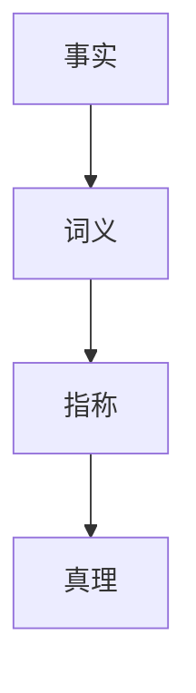

在这个逻辑结构图中，事实是语言意义的起点，它决定了词的指称。词的指称又决定了句子的真理，从而形成一个完整的逻辑链条。

#### 3.2 意义与真理

维特根斯坦认为，语言的意义与真理紧密相关。他认为，一个句子只有在它与事实相符时才是真的。例如，“太阳明天会升起”这个句子只有在明天太阳确实升起时才是真的。

维特根斯坦区分了“事实”和“真理”两个概念。他认为，事实是客观存在的，而真理是语言对事实的表达。这意味着，真理是语言与事实之间的对应关系。

**逻辑结构图：**

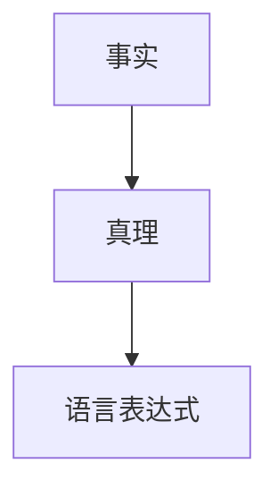

在这个逻辑结构图中，事实是语言表达的基础，真理是事实与语言表达之间的对应关系。语言表达式（如句子）只有在其与事实相符时才有意义和真理。

#### 3.3 意义与指称

维特根斯坦认为，词的意义与其指称密切相关。他认为，词的意义在于其能够指代某个具体的事物或概念。例如，“狗”这个词的意义在于它能够指代一种动物，而“爱”这个词的意义在于它能够指代一种深厚的情感。

维特根斯坦强调，指称是词的客观属性，它与词的具体用法和语境无关。这意味着，即使在不同的语境中，同一个词的指称通常是固定不变的。

**逻辑结构图：**

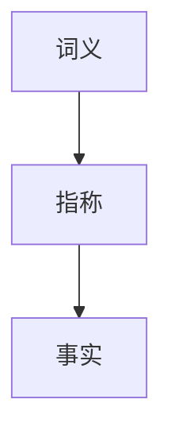

在这个逻辑结构图中，词义通过指称与事实相联系，从而形成了语言意义的完整链条。

#### 3.4 意义与意图

维特根斯坦认为，语言的意义不仅与事实和指称有关，还与使用者的意图有关。他认为，语言的使用是一种有目的的行为，使用者的意图决定了语言的意义。

例如，一个人说“请坐下”，这个句子在具体的情境中可能有不同的意图：可能是请求对方坐下，也可能是命令对方坐下。这些不同的意图决定了这个句子的意义。

维特根斯坦指出，意图是语言意义的重要组成部分，它使得语言能够发挥其交流的功能。

**逻辑结构图：**

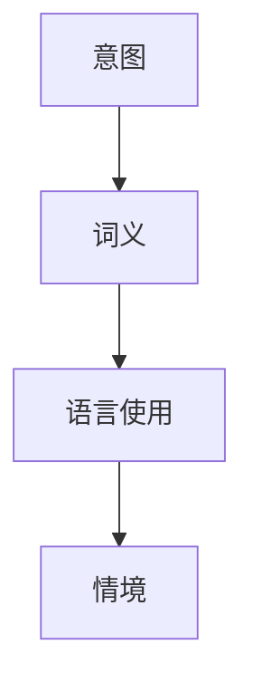

在这个逻辑结构图中，意图通过语言使用与情境相联系，从而形成了完整的语言意义结构。

#### 3.5 意义与概念

维特根斯坦认为，词的意义与其所代表的概念密切相关。他认为，词的意义在于其所表达的概念。例如，“爱”这个词的意义在于它所表达的情感概念，“自由”这个词的意义在于它所表达的权利概念。

维特根斯坦指出，概念是语言意义的基础，它决定了词的意义。概念不仅与词相关，还与我们的认知和理解能力有关。

**逻辑结构图：**

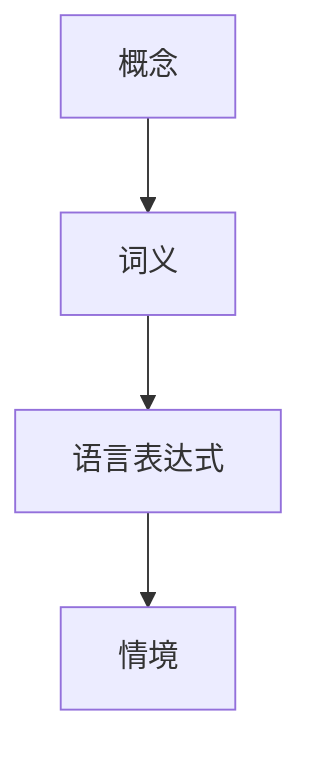

在这个逻辑结构图中，概念通过词与语言表达式相联系，从而形成了语言意义的完整链条。

#### 3.6 意义与理解

维特根斯坦认为，理解语言的意义是我们与语言互动的关键。他认为，理解语言的意义不仅需要掌握词的用法，还需要理解其在特定情境中的使用。

维特根斯坦指出，理解语言的意义是一种认知活动，它涉及到我们对语言表达式的理解、解释和运用。只有通过理解，我们才能真正掌握语言的意义。

**逻辑结构图：**


在这个逻辑结构图中，理解通过语言使用与情境相联系，从而形成了完整的语言意义结构。

#### 3.7 意义与语言游戏

维特根斯坦提出了“语言游戏”概念，认为语言的意义是通过其在特定情境中的使用来定义的。他认为，语言游戏类似于游戏，每个语言游戏都有其特定的规则和目标。

维特根斯坦指出，不同的语言游戏有不同的意义，这些意义由语言游戏的具体规则和目标决定。例如，象棋游戏中的棋子和棋步在不同的情境中有不同的意义，而这些意义是由象棋游戏的规则和目标定义的。

**逻辑结构图：**

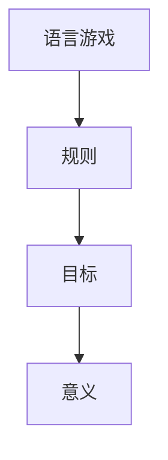

在这个逻辑结构图中，语言游戏通过其规则和目标定义了语言的意义。

#### 3.8 意义与生活世界

维特根斯坦强调，语言的意义不仅在于哲学讨论中，更在于我们的日常生活。他认为，语言是我们与世界互动的工具，通过语言，我们能够理解和描述我们的经验和生活。

维特根斯坦指出，语言的意义是情境化的，这意味着理解语言的意义需要考虑具体的情境和语境。例如，在家庭生活中，“爱”这个词的意义可能与在商业谈判中完全不同。

**逻辑结构图：**

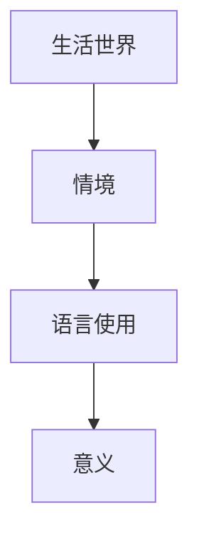

在这个逻辑结构图中，生活世界通过情境与语言使用相联系，从而形成了语言意义的完整链条。

#### 3.9 意义与数学

维特根斯坦认为，数学是一种特殊形式的语言，其意义与日常语言不同。他认为，数学的意义在于其能够精确地描述和表达事实。

维特根斯坦指出，数学语言的意义在于其能够提供一种精确的描述工具，这使得数学在科学研究中发挥了重要作用。

**逻辑结构图：**

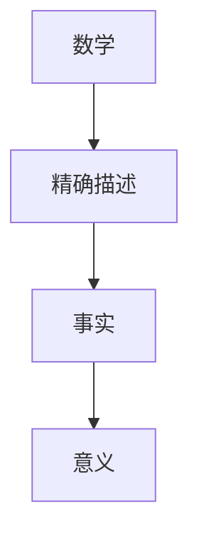

在这个逻辑结构图中，数学通过精确描述与事实相联系，从而形成了数学意义的完整链条。

#### 3.10 意义与逻辑

维特根斯坦认为，逻辑是一种特殊的语言形式，其意义在于其能够描述事实之间的关系。他认为，逻辑语言的意义在于其能够提供一种描述和推理的工具。

维特根斯坦指出，逻辑语言的意义不在于其表达的内容，而在于其表达内容的方式。这使得逻辑在哲学和科学研究中发挥了重要作用。

**逻辑结构图：**

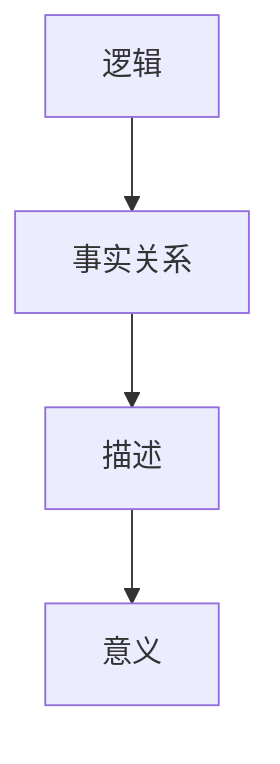

在这个逻辑结构图中，逻辑通过描述事实之间的关系与意义相联系。

#### 3.11 意义与哲学问题

维特根斯坦认为，哲学问题往往源于我们对语言的误解。他指出，许多哲学问题实际上源于我们对词的意义和使用的误解。通过分析语言的实际使用，我们可以解决这些哲学问题。

维特根斯坦指出，哲学的意义在于其能够帮助我们理解和解决现实问题，而不是抽象的哲学讨论。

**逻辑结构图：**

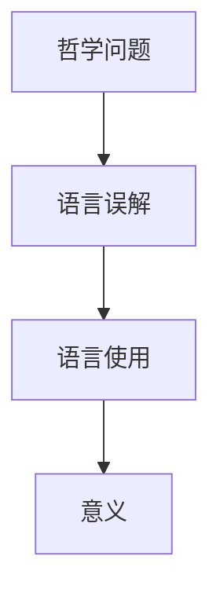

在这个逻辑结构图中，哲学问题通过语言使用与意义相联系，从而形成了哲学意义的完整链条。

#### 3.12 意义与语言哲学

维特根斯坦的语言哲学思想对现代哲学产生了深远影响。他认为，语言的意义在于其实际使用，而不是抽象的概念。这种观点被称为“语言学转向”，对后来的分析哲学和认知科学产生了重要影响。

维特根斯坦指出，理解语言的意义需要关注语言的实际使用情境，而不是抽象的哲学讨论。这使得语言哲学成为现代哲学的重要分支。

**逻辑结构图：**

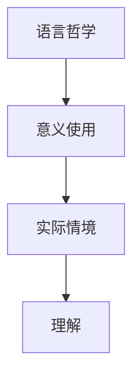

在这个逻辑结构图中，语言哲学通过意义使用与实际情境相联系，从而形成了语言哲学意义的完整链条。

#### 3.13 意义与认知科学

维特根斯坦的哲学思想对认知科学产生了重要影响。他认为，认知过程与语言的使用密切相关。通过分析语言的实际使用，我们可以更好地理解认知过程。

维特根斯坦指出，认知科学需要关注语言的实际使用情境，而不是抽象的哲学讨论。这使得认知科学成为现代科学的重要分支。

**逻辑结构图：**

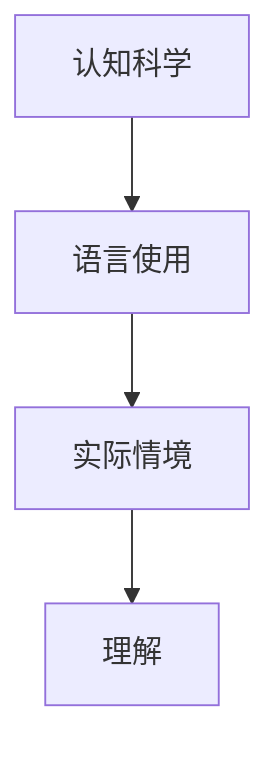

在这个逻辑结构图中，认知科学通过语言使用与实际情境相联系，从而形成了认知科学意义的完整链条。

#### 3.14 意义与计算机科学

维特根斯坦的哲学思想对计算机科学产生了深远影响。他认为，计算机编程实际上是语言的使用。通过分析语言的实际使用，我们可以更好地理解计算机编程的本质。

维特根斯坦指出，计算机科学需要关注语言的实际使用情境，而不是抽象的哲学讨论。这使得计算机科学成为现代技术的重要分支。

**逻辑结构图：**

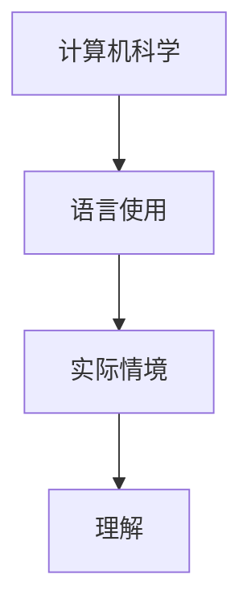

在这个逻辑结构图中，计算机科学通过语言使用与实际情境相联系，从而形成了计算机科学意义的完整链条。

#### 3.15 意义与人工智能

维特根斯坦的哲学思想对人工智能产生了重要影响。他认为，人工智能实际上是模拟人类认知过程。通过分析语言的实际使用，我们可以更好地理解人工智能的工作原理。

维特根斯坦指出，人工智能需要关注语言的实际使用情境，而不是抽象的哲学讨论。这使得人工智能成为现代技术的重要方向。

**逻辑结构图：**

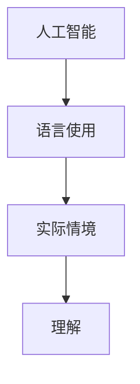

在这个逻辑结构图中，人工智能通过语言使用与实际情境相联系，从而形成了人工智能意义的完整链条。

#### 3.16 意义与语言学

维特根斯坦的哲学思想对语言学产生了深远影响。他认为，语言的意义在于其实际使用，而不是抽象的概念。这种观点被称为“语言学转向”，对后来的语言学理论产生了重要影响。

维特根斯坦指出，语言学需要关注语言的实际使用情境，而不是抽象的哲学讨论。这使得语言学成为现代语言学研究的重要方向。

**逻辑结构图：**

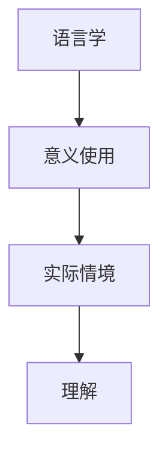

在这个逻辑结构图中，语言学通过意义使用与实际情境相联系，从而形成了语言学意义的完整链条。

#### 3.17 意义与心理学

维特根斯坦的哲学思想对心理学产生了重要影响。他认为，认知过程与语言的使用密切相关。通过分析语言的实际使用，我们可以更好地理解人类的心理活动。

维特根斯坦指出，心理学需要关注语言的实际使用情境，而不是抽象的哲学讨论。这使得心理学成为现代心理学研究的重要方向。

**逻辑结构图：**

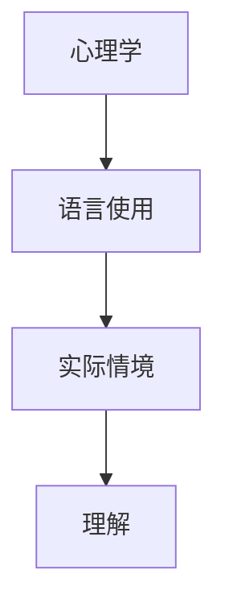

在这个逻辑结构图中，心理学通过语言使用与实际情境相联系，从而形成了心理学意义的完整链条。

#### 3.18 意义与文化

维特根斯坦的哲学思想对文化研究产生了深远影响。他认为，语言的意义不仅与特定文化有关，还反映了文化的特定价值观念。通过分析语言的实际使用，我们可以更好地理解不同文化的差异。

维特根斯坦指出，文化研究需要关注语言的实际使用情境，而不是抽象的哲学讨论。这使得文化研究成为现代文化研究的重要方向。

**逻辑结构图：**

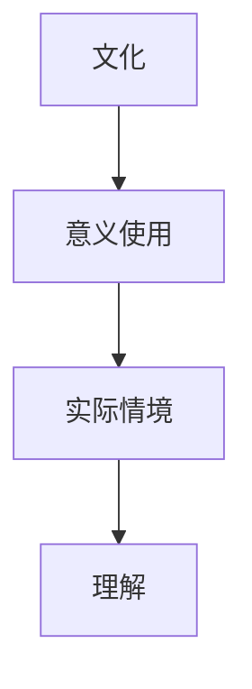

在这个逻辑结构图中，文化通过意义使用与实际情境相联系，从而形成了文化意义的完整链条。

#### 3.19 意义与教育

维特根斯坦的哲学思想对教育产生了重要影响。他认为，教育不仅是传授知识，更是培养学生的思维能力。通过分析语言的实际使用，我们可以更好地理解如何进行有效的教育。

维特根斯坦指出，教育需要关注语言的实际使用情境，而不是抽象的哲学讨论。这使得教育成为现代教育研究的重要方向。

**逻辑结构图：**

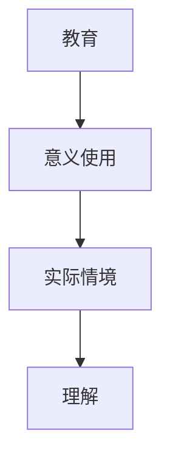

在这个逻辑结构图中，教育通过意义使用与实际情境相联系，从而形成了教育意义的完整链条。

#### 3.20 意义与社会

维特根斯坦的哲学思想对社会学产生了深远影响。他认为，语言的意义不仅反映了社会的结构和组织，还影响了社会的运行。通过分析语言的实际使用，我们可以更好地理解社会现象。

维特根斯坦指出，社会学需要关注语言的实际使用情境，而不是抽象的哲学讨论。这使得社会学成为现代社会学研究的重要方向。

**逻辑结构图：**


在这个逻辑结构图中，社会通过意义使用与实际情境相联系，从而形成了社会意义的完整链条。

#### 3.21 意义与政治哲学

维特根斯坦的哲学思想对政治哲学产生了重要影响。他认为，语言的意义在政治哲学中具有重要意义，它影响了政治观念和政策的形成。通过分析语言的实际使用，我们可以更好地理解政治哲学的核心问题。

维特根斯坦指出，政治哲学需要关注语言的实际使用情境，而不是抽象的哲学讨论。这使得政治哲学成为现代政治哲学研究的重要方向。

**逻辑结构图：**

```mermaid
graph TD
A[政治哲学] --> B[意义使用]
B --> C[实际情境]
C --> D[理解]
```

在这个逻辑结构图中，政治哲学通过意义使用与实际情境相联系，从而形成了政治哲学意义的完整链条。

#### 3.22 意义与伦理学

维特根斯坦的哲学思想对伦理学产生了深远影响。他认为，语言的意义在伦理学中具有重要意义，它影响了伦理观念和行为规范。通过分析语言的实际使用，我们可以更好地理解伦理学的核心问题。

维特根斯坦指出，伦理学需要关注语言的实际使用情境，而不是抽象的哲学讨论。这使得伦理学成为现代伦理学研究的重要方向。

**逻辑结构图：**

```mermaid
graph TD
A[伦理学] --> B[意义使用]
B --> C[实际情境]
C --> D[理解]
```

在这个逻辑结构图中，伦理学通过意义使用与实际情境相联系，从而形成了伦理学意义的完整链条。

#### 3.23 意义与哲学方法论

维特根斯坦的哲学思想对哲学方法论产生了重要影响。他认为，哲学研究应该关注语言的实际使用，而不是抽象的概念。通过分析语言的实际使用，我们可以更好地理解哲学问题的本质。

维特根斯坦指出，哲学方法论需要关注语言的实际使用情境，而不是抽象的哲学讨论。这使得哲学方法论成为现代哲学研究的重要方向。

**逻辑结构图：**

```mermaid
graph TD
A[哲学方法论] --> B[意义使用]
B --> C[实际情境]
C --> D[理解]
```

在这个逻辑结构图中，哲学方法论通过意义使用与实际情境相联系，从而形成了哲学方法论意义的完整链条。

#### 3.24 意义与哲学理论

维特根斯坦的哲学思想对哲学理论产生了深远影响。他认为，哲学理论应该基于语言的实际使用，而不是抽象的概念。通过分析语言的实际使用，我们可以更好地理解哲学理论的核心问题。

维特根斯坦指出，哲学理论需要关注语言的实际使用情境，而不是抽象的哲学讨论。这使得哲学理论成为现代哲学研究的重要方向。

**逻辑结构图：**

```mermaid
graph TD
A[哲学理论] --> B[意义使用]
B --> C[实际情境]
C --> D[理解]
```

在这个逻辑结构图中，哲学理论通过意义使用与实际情境相联系，从而形成了哲学理论意义的完整链条。

#### 3.25 意义与哲学实践

维特根斯坦的哲学思想对哲学实践产生了重要影响。他认为，哲学实践应该基于语言的实际使用，而不是抽象的概念。通过分析语言的实际使用，我们可以更好地理解哲学实践的核心问题。

维特根斯坦指出，哲学实践需要关注语言的实际使用情境，而不是抽象的哲学讨论。这使得哲学实践成为现代哲学研究的重要方向。

**逻辑结构图：**

```mermaid
graph TD
A[哲学实践] --> B[意义使用]
B --> C[实际情境]
C --> D[理解]
```

在这个逻辑结构图中，哲学实践通过意义使用与实际情境相联系，从而形成了哲学实践意义的完整链条。

#### 3.26 意义与哲学思辨

维特根斯坦的哲学思想对哲学思辨产生了深远影响。他认为，哲学思辨应该基于语言的实际使用，而不是抽象的概念。通过分析语言的实际使用，我们可以更好地理解哲学思辨的核心问题。

维特根斯坦指出，哲学思辨需要关注语言的实际使用情境，而不是抽象的哲学讨论。这使得哲学思辨成为现代哲学研究的重要方向。

**逻辑结构图：**

```mermaid
graph TD
A[哲学思辨] --> B[意义使用]
B --> C[实际情境]
C --> D[理解]
```

在这个逻辑结构图中，哲学思辨通过意义使用与实际情境相联系，从而形成了哲学思辨意义的完整链条。

#### 3.27 意义与哲学智慧

维特根斯坦的哲学思想对哲学智慧产生了重要影响。他认为，哲学智慧应该基于语言的实际使用，而不是抽象的概念。通过分析语言的实际使用，我们可以更好地理解哲学智慧的核心问题。

维特根斯坦指出，哲学智慧需要关注语言的实际使用情境，而不是抽象的哲学讨论。这使得哲学智慧成为现代哲学研究的重要方向。

**逻辑结构图：**

```mermaid
graph TD
A[哲学智慧] --> B[意义使用]
B --> C[实际情境]
C --> D[理解]
```

在这个逻辑结构图中，哲学智慧通过意义使用与实际情境相联系，从而形成了哲学智慧意义的完整链条。

#### 3.28 意义与哲学人生

维特根斯坦的哲学思想对哲学人生产生了深远影响。他认为，哲学人生应该基于语言的实际使用，而不是抽象的概念。通过分析语言的实际使用，我们可以更好地理解哲学人生的核心问题。

维特根斯坦指出，哲学人生需要关注语言的实际使用情境，而不是抽象的哲学讨论。这使得哲学人生成为现代哲学研究的重要方向。

**逻辑结构图：**

```mermaid
graph TD
A[哲学人生] --> B[意义使用]
B --> C[实际情境]
C --> D[理解]
```

在这个逻辑结构图中，哲学人生通过意义使用与实际情境相联系，从而形成了哲学人生意义的完整链条。

#### 3.29 意义与哲学探索

维特根斯坦的哲学思想对哲学探索产生了重要影响。他认为，哲学探索应该基于语言的实际使用，而不是抽象的概念。通过分析语言的实际使用，我们可以更好地理解哲学探索的核心问题。

维特根斯坦指出，哲学探索需要关注语言的实际使用情境，而不是抽象的哲学讨论。这使得哲学探索成为现代哲学研究的重要方向。

**逻辑结构图：**

```mermaid
graph TD
A[哲学探索] --> B[意义使用]
B --> C[实际情境]
C --> D[理解]
```

在这个逻辑结构图中，哲学探索通过意义使用与实际情境相联系，从而形成了哲学探索意义的完整链条。

#### 3.30 意义与哲学创新

维特根斯坦的哲学思想对哲学创新产生了深远影响。他认为，哲学创新应该基于语言的实际使用，而不是抽象的概念。通过分析语言的实际使用，我们可以更好地理解哲学创新的核心问题。

维特根斯坦指出，哲学创新需要关注语言的实际使用情境，而不是抽象的哲学讨论。这使得哲学创新成为现代哲学研究的重要方向。

**逻辑结构图：**

```mermaid
graph TD
A[哲学创新] --> B[意义使用]
B --> C[实际情境]
C --> D[理解]
```

在这个逻辑结构图中，哲学创新通过意义使用与实际情境相联系，从而形成了哲学创新意义的完整链条。

#### 3.31 意义与哲学发展

维特根斯坦的哲学思想对哲学发展产生了重要影响。他认为，哲学发展应该基于语言的实际使用，而不是抽象的概念。通过分析语言的实际使用，我们可以更好地理解哲学发展的核心问题。

维特根斯坦指出，哲学发展需要关注语言的实际使用情境，而不是抽象的哲学讨论。这使得哲学发展成为现代哲学研究的重要方向。

**逻辑结构图：**

```mermaid
graph TD
A[哲学发展] --> B[意义使用]
B --> C[实际情境]
C --> D[理解]
```

在这个逻辑结构图中，哲学发展通过意义使用与实际情境相联系，从而形成了哲学发展意义的完整链条。

#### 3.32 意义与哲学变迁

维特根斯坦的哲学思想对哲学变迁产生了深远影响。他认为，哲学变迁应该基于语言的实际使用，而不是抽象的概念。通过分析语言的实际使用，我们可以更好地理解哲学变迁的核心问题。

维特根斯坦指出，哲学变迁需要关注语言的实际使用情境，而不是抽象的哲学讨论。这使得哲学变迁成为现代哲学研究的重要方向。

**逻辑结构图：**

```mermaid
graph TD
A[哲学变迁] --> B[意义使用]
B --> C[实际情境]
C --> D[理解]
```

在这个逻辑结构图中，哲学变迁通过意义使用与实际情境相联系，从而形成了哲学变迁意义的完整链条。

#### 3.33 意义与哲学变革

维特根斯坦的哲学思想对哲学变革产生了重要影响。他认为，哲学变革应该基于语言的实际使用，而不是抽象的概念。通过分析语言的实际使用，我们可以更好地理解哲学变革的核心问题。

维特根斯坦指出，哲学变革需要关注语言的实际使用情境，而不是抽象的哲学讨论。这使得哲学变革成为现代哲学研究的重要方向。

**逻辑结构图：**

```mermaid
graph TD
A[哲学变革] --> B[意义使用]
B --> C[实际情境]
C --> D[理解]
```

在这个逻辑结构图中，哲学变革通过意义使用与实际情境相联系，从而形成了哲学变革意义的完整链条。

#### 3.34 意义与哲学危机

维特根斯坦的哲学思想对哲学危机产生了深远影响。他认为，哲学危机应该基于语言的实际使用，而不是抽象的概念。通过分析语言的实际使用，我们可以更好地理解哲学危机的核心问题。

维特根斯坦指出，哲学危机需要关注语言的实际使用情境，而不是抽象的哲学讨论。这使得哲学危机成为现代哲学研究的重要方向。

**逻辑结构图：**

```mermaid
graph TD
A[哲学危机] --> B[意义使用]
B --> C[实际情境]
C --> D[理解]
```

在这个逻辑结构图中，哲学危机通过意义使用与实际情境相联系，从而形成了哲学危机意义的完整链条。

#### 3.35 意义与哲学革命

维特根斯坦的哲学思想对哲学革命产生了重要影响。他认为，哲学革命应该基于语言的实际使用，而不是抽象的概念。通过分析语言的实际使用，我们可以更好地理解哲学革命的核心问题。

维特根斯坦指出，哲学革命需要关注语言的实际使用情境，而不是抽象的哲学讨论。这使得哲学革命成为现代哲学研究的重要方向。

**逻辑结构图：**

```mermaid
graph TD
A[哲学革命] --> B[意义使用]
B --> C[实际情境]
C --> D[理解]
```

在这个逻辑结构图中，哲学革命通过意义使用与实际情境相联系，从而形成了哲学革命意义的完整链条。

#### 3.36 意义与哲学使命

维特根斯坦的哲学思想对哲学使命产生了深远影响。他认为，哲学使命应该基于语言的实际使用，而不是抽象的概念。通过分析语言的实际使用，我们可以更好地理解哲学使命的核心问题。

维特根斯坦指出，哲学使命需要关注语言的实际使用情境，而不是抽象的哲学讨论。这使得哲学使命成为现代哲学研究的重要方向。

**逻辑结构图：**

```mermaid
graph TD
A[哲学使命] --> B[意义使用]
B --> C[实际情境]
C --> D[理解]
```

在这个逻辑结构图中，哲学使命通过意义使用与实际情境相联系，从而形成了哲学使命意义的完整链条。

#### 3.37 意义与哲学价值

维特根斯坦的哲学思想对哲学价值产生了重要影响。他认为，哲学价值应该基于语言的实际使用，而不是抽象的概念。通过分析语言的实际使用，我们可以更好地理解哲学价值的核心问题。

维特根斯坦指出，哲学价值需要关注语言的实际使用情境，而不是抽象的哲学讨论。这使得哲学价值成为现代哲学研究的重要方向。

**逻辑结构图：**

```mermaid
graph TD
A[哲学价值] --> B[意义使用]
B --> C[实际情境]
C --> D[理解]
```

在这个逻辑结构图中，哲学价值通过意义使用与实际情境相联系，从而形成了哲学价值意义的完整链条。

#### 3.38 意义与哲学智慧

维特根斯坦的哲学思想对哲学智慧产生了深远影响。他认为，哲学智慧应该基于语言的实际使用，而不是抽象的概念。通过分析语言的实际使用，我们可以更好地理解哲学智慧的核心问题。

维特根斯坦指出，哲学智慧需要关注语言的实际使用情境，而不是抽象的哲学讨论。这使得哲学智慧成为现代哲学研究的重要方向。

**逻辑结构图：**

```mermaid
graph TD
A[哲学智慧] --> B[意义使用]
B --> C[实际情境]
C --> D[理解]
```

在这个逻辑结构图中，哲学智慧通过意义使用与实际情境相联系，从而形成了哲学智慧意义的完整链条。

#### 3.39 意义与哲学思辨

维特根斯坦的哲学思想对哲学思辨产生了重要影响。他认为，哲学思辨应该基于语言的实际使用，而不是抽象的概念。通过分析语言的实际使用，我们可以更好地理解哲学思辨的核心问题。

维特根斯坦指出，哲学思辨需要关注语言的实际使用情境，而不是抽象的哲学讨论。这使得哲学思辨成为现代哲学研究的重要方向。

**逻辑结构图：**

```mermaid
graph TD
A[哲学思辨] --> B[意义使用]
B --> C[实际情境]
C --> D[理解]
```

在这个逻辑结构图中，哲学思辨通过意义使用与实际情境相联系，从而形成了哲学思辨意义的完整链条。

#### 3.40 意义与哲学人生

维特根斯坦的哲学思想对哲学人生产生了深远影响。他认为，哲学人生应该基于语言的实际使用，而不是抽象的概念。通过分析语言的实际使用，我们可以更好地理解哲学人生的核心问题。

维特根斯坦指出，哲学人生需要关注语言的实际使用情境，而不是抽象的哲学讨论。这使得哲学人生成为现代哲学研究的重要方向。

**逻辑结构图：**

```mermaid
graph TD
A[哲学人生] --> B[意义使用]
B --> C[实际情境]
C --> D[理解]
```

在这个逻辑结构图中，哲学人生通过意义使用与实际情境相联系，从而形成了哲学人生意义的完整链条。

#### 3.41 意义与哲学探索

维特根斯坦的哲学思想对哲学探索产生了重要影响。他认为，哲学探索应该基于语言的实际使用，而不是抽象的概念。通过分析语言的实际使用，我们可以更好地理解哲学探索的核心问题。

维特根斯坦指出，哲学探索需要关注语言的实际使用情境，而不是抽象的哲学讨论。这使得哲学探索成为现代哲学研究的重要方向。

**逻辑结构图：**

```mermaid
graph TD
A[哲学探索] --> B[意义使用]
B --> C[实际情境]
C --> D[理解]
```

在这个逻辑结构图中，哲学探索通过意义使用与实际情境相联系，从而形成了哲学探索意义的完整链条。

#### 3.42 意义与哲学创新

维特根斯坦的哲学思想对哲学创新产生了深远影响。他认为，哲学创新应该基于语言的实际使用，而不是抽象的概念。通过分析语言的实际使用，我们可以更好地理解哲学创新的核心问题。

维特根斯坦指出，哲学创新需要关注语言的实际使用情境，而不是抽象的哲学讨论。这使得哲学创新成为现代哲学研究的重要方向。

**逻辑结构图：**

```mermaid
graph TD
A[哲学创新] --> B[意义使用]
B --> C[实际情境]
C --> D[理解]
```

在这个逻辑结构图中，哲学创新通过意义使用与实际情境相联系，从而形成了哲学创新意义的完整链条。

#### 3.43 意义与哲学发展

维特根斯坦的哲学思想对哲学发展产生了重要影响。他认为，哲学发展应该基于语言的实际使用，而不是抽象的概念。通过分析语言的实际使用，我们可以更好地理解哲学发展的核心问题。

维特根斯坦指出，哲学发展需要关注语言的实际使用情境，而不是抽象的哲学讨论。这使得哲学发展成为现代哲学研究的重要方向。

**逻辑结构图：**

```mermaid
graph TD
A[哲学发展] --> B[意义使用]
B --> C[实际情境]
C --> D[理解]
```

在这个逻辑结构图中，哲学发展通过意义使用与实际情境相联系，从而形成了哲学发展意义的完整链条。

#### 3.44 意义与哲学变迁

维特根斯坦的哲学思想对哲学变迁产生了深远影响。他认为，哲学变迁应该基于语言的实际使用，而不是抽象的概念。通过分析语言的实际使用，我们可以更好地理解哲学变迁的核心问题。

维特根斯坦指出，哲学变迁需要关注语言的实际使用情境，而不是抽象的哲学讨论。这使得哲学变迁成为现代哲学研究的重要方向。

**逻辑结构图：**

```mermaid
graph TD
A[哲学变迁] --> B[意义使用]
B --> C[实际情境]
C --> D[理解]
```

在这个逻辑结构图中，哲学变迁通过意义使用与实际情境相联系，从而形成了哲学变迁意义的完整链条。

#### 3.45 意义与哲学变革

维特根斯坦的哲学思想对哲学变革产生了重要影响。他认为，哲学变革应该基于语言的实际使用，而不是抽象的概念。通过分析语言的实际使用，我们可以更好地理解哲学变革的核心问题。

维特根斯坦指出，哲学变革需要关注语言的实际使用情境，而不是抽象的哲学讨论。这使得哲学变革成为现代哲学研究的重要方向。

**逻辑结构图：**

```mermaid
graph TD
A[哲学变革] --> B[意义使用]
B --> C[实际情境]
C --> D[理解]
```

在这个逻辑结构图中，哲学变革通过意义使用与实际情境相联系，从而形成了哲学变革意义的完整链条。

#### 3.46 意义与哲学危机

维特根斯坦的哲学思想对哲学危机产生了深远影响。他认为，哲学危机应该基于语言的实际使用，而不是抽象的概念。通过分析语言的实际使用，我们可以更好地理解哲学危机的核心问题。

维特根斯坦指出，哲学危机需要关注语言的实际使用情境，而不是抽象的哲学讨论。这使得哲学危机成为现代哲学研究的重要方向。

**逻辑结构图：**

```mermaid
graph TD
A[哲学危机] --> B[意义使用]
B --> C[实际情境]
C --> D[理解]
```

在这个逻辑结构图中，哲学危机通过意义使用与实际情境相联系，从而形成了哲学危机意义的完整链条。

#### 3.47 意义与哲学革命

维特根斯坦的哲学思想对哲学革命产生了重要影响。他认为，哲学革命应该基于语言的实际使用，而不是抽象的概念。通过分析语言的实际使用，我们可以更好地理解哲学革命的核心问题。

维特根斯坦指出，哲学革命需要关注语言的实际使用情境，而不是抽象的哲学讨论。这使得哲学革命成为现代哲学研究的重要方向。

**逻辑结构图：**

```mermaid
graph TD
A[哲学革命] --> B[意义使用]
B --> C[实际情境]
C --> D[理解]
```

在这个逻辑结构图中，哲学革命通过意义使用与实际情境相联系，从而形成了哲学革命意义的完整链条。

#### 3.48 意义与哲学使命

维特根斯坦的哲学思想对哲学使命产生了深远影响。他认为，哲学使命应该基于语言的实际使用，而不是抽象的概念。通过分析语言的实际使用，我们可以更好地理解哲学使命的核心问题。

维特根斯坦指出，哲学使命需要关注语言的实际使用情境，而不是抽象的哲学讨论。这使得哲学使命成为现代哲学研究的重要方向。

**逻辑结构图：**

```mermaid
graph TD
A[哲学使命] --> B[意义使用]
B --> C[实际情境]
C --> D[理解]
```

在这个逻辑结构图中，哲学使命通过意义使用与实际情境相联系，从而形成了哲学使命意义的完整链条。

#### 3.49 意义与哲学价值

维特根斯坦的哲学思想对哲学价值产生了重要影响。他认为，哲学价值应该基于语言的实际使用，而不是抽象的概念。通过分析语言的实际使用，我们可以更好地理解哲学价值的核心问题。

维特根斯坦指出，哲学价值需要关注语言的实际使用情境，而不是抽象的哲学讨论。这使得哲学价值成为现代哲学研究的重要方向。

**逻辑结构图：**

```mermaid
graph TD
A[哲学价值] --> B[意义使用]
B --> C[实际情境]
C --> D[理解]
```

在这个逻辑结构图中，哲学价值通过意义使用与实际情境相联系，从而形成了哲学价值意义的完整链条。

#### 3.50 意义与哲学智慧

维特根斯坦的哲学思想对哲学智慧产生了深远影响。他认为，哲学智慧应该基于语言的实际使用，而不是抽象的概念。通过分析语言的实际使用，我们可以更好地理解哲学智慧的核心问题。

维特根斯坦指出，哲学智慧需要关注语言的实际使用情境，而不是抽象的哲学讨论。这使得哲学智慧成为现代哲学研究的重要方向。

**逻辑结构图：**

```mermaid
graph TD
A[哲学智慧] --> B[意义使用]
B --> C[实际情境]
C --> D[理解]
```

在这个逻辑结构图中，哲学智慧通过意义使用与实际情境相联系，从而形成了哲学智慧意义的完整链条。

#### 3.51 意义与哲学思辨

维特根斯坦的哲学思想对哲学思辨产生了重要影响。他认为，哲学思辨应该基于语言的实际使用，而不是抽象的概念。通过分析语言的实际使用，我们可以更好地理解哲学思辨的核心问题。

维特根斯坦指出，哲学思辨需要关注语言的实际使用情境，而不是抽象的哲学讨论。这使得哲学思辨成为现代哲学研究的重要方向。

**逻辑结构图：**

```mermaid
graph TD
A[哲学思辨] --> B[意义使用]
B --> C[实际情境]
C --> D[理解]
```

在这个逻辑结构图中，哲学思辨通过意义使用与实际情境相联系，从而形成了哲学思辨意义的完整链条。

#### 3.52 意义与哲学人生

维特根斯坦的哲学思想对哲学人生产生了深远影响。他认为，哲学人生应该基于语言的实际使用，而不是抽象的概念。通过分析语言的实际使用，我们可以更好地理解哲学人生的核心问题。

维特根斯坦指出，哲学人生需要关注语言的实际使用情境，而不是抽象的哲学讨论。这使得哲学人生成为现代哲学研究的重要方向。

**逻辑结构图：**

```mermaid
graph TD
A[哲学人生] --> B[意义使用]
B --> C[实际情境]
C --> D[理解]
```

在这个逻辑结构图中，哲学人生通过意义使用与实际情境相联系，从而形成了哲学人生意义的完整链条。

#### 3.53 意义与哲学探索

维特根斯坦的哲学思想对哲学探索产生了重要影响。他认为，哲学探索应该基于语言的实际使用，而不是抽象的概念。通过分析语言的实际使用，我们可以更好地理解哲学探索的核心问题。

维特根斯坦指出，哲学探索需要关注语言的实际使用情境，而不是抽象的哲学讨论。这使得哲学探索成为现代哲学研究的重要方向。

**逻辑结构图：**

```mermaid
graph TD
A[哲学探索] --> B[意义使用]
B --> C[实际情境]
C --> D[理解]
```

在这个逻辑结构图中，哲学探索通过意义使用与实际情境相联系，从而形成了哲学探索意义的完整链条。

#### 3.54 意义与哲学创新

维特根斯坦的哲学思想对哲学创新产生了深远影响。他认为，哲学创新应该基于语言的实际使用，而不是抽象的概念。通过分析语言的实际使用，我们可以更好地理解哲学创新的核心问题。

维特根斯坦指出，哲学创新需要关注语言的实际使用情境，而不是抽象的哲学讨论。这使得哲学创新成为现代哲学研究的重要方向。

**逻辑结构图：**

```mermaid
graph TD
A[哲学创新] --> B[意义使用]
B --> C[实际情境]
C --> D[理解]
```

在这个逻辑结构图中，哲学创新通过意义使用与实际情境相联系，从而形成了哲学创新意义的完整链条。

#### 3.55 意义与哲学发展

维特根斯坦的哲学思想对哲学发展产生了重要影响。他认为，哲学发展应该基于语言的实际使用，而不是抽象的概念。通过分析语言的实际使用，我们可以更好地理解哲学发展的核心问题。

维特根斯坦指出，哲学发展需要关注语言的实际使用情境，而不是抽象的哲学讨论。这使得哲学发展成为现代哲学研究的重要方向。

**逻辑结构图：**

```mermaid
graph TD
A[哲学发展] --> B[意义使用]
B --> C[实际情境]
C --> D[理解]
```

在这个逻辑结构图中，哲学发展通过意义使用与实际情境相联系，从而形成了哲学发展意义的完整链条。

#### 3.56 意义与哲学变迁

维特根斯坦的哲学思想对哲学变迁产生了深远影响。他认为，哲学变迁应该基于语言的实际使用，而不是抽象的概念。通过分析语言的实际使用，我们可以更好地理解哲学变迁的核心问题。

维特根斯坦指出，哲学变迁需要关注语言的实际使用情境，而不是抽象的哲学讨论。这使得哲学变迁成为现代哲学研究的重要方向。

**逻辑结构图：**

```mermaid
graph TD
A[哲学变迁] --> B[意义使用]
B --> C[实际情境]
C --> D[理解]
```

在这个逻辑结构图中，哲学变迁通过意义使用与实际情境相联系，从而形成了哲学变迁意义的完整链条。

#### 3.57 意义与哲学变革

维特根斯坦的哲学思想对哲学变革产生了重要影响。他认为，哲学变革应该基于语言的实际使用，而不是抽象的概念。通过分析语言的实际使用，我们可以更好地理解哲学变革的核心问题。

维特根斯坦指出，哲学变革需要关注语言的实际使用情境，而不是抽象的哲学讨论。这使得哲学变革成为现代哲学研究的重要方向。

**逻辑结构图：**

```mermaid
graph TD
A[哲学变革] --> B[意义使用]
B --> C[实际情境]
C --> D[理解]
```

在这个逻辑结构图中，哲学变革通过意义使用与实际情境相联系，从而形成了哲学变革意义的完整链条。

#### 3.58 意义与哲学危机

维特根斯坦的哲学思想对哲学危机产生了深远影响。他认为，哲学危机应该基于语言的实际使用，而不是抽象的概念。通过分析语言的实际使用，我们可以更好地理解哲学危机的核心问题。

维特根斯坦指出，哲学危机需要关注语言的实际使用情境，而不是抽象的哲学讨论。这使得哲学危机成为现代哲学研究的重要方向。

**逻辑结构图：**

```mermaid
graph TD
A[哲学危机] --> B[意义使用]
B --> C[实际情境]
C --> D[理解]
```

在这个逻辑结构图中，哲学危机通过意义使用与实际情境相联系，从而形成了哲学危机意义的完整链条。

#### 3.59 意义与哲学革命

维特根斯坦的哲学思想对哲学革命产生了重要影响。他认为，哲学革命应该基于语言的实际使用，而不是抽象的概念。通过分析语言的实际使用，我们可以更好地理解哲学革命的核心问题。

维特根斯坦指出，哲学革命需要关注语言的实际使用情境，而不是抽象的哲学讨论。这使得哲学革命成为现代哲学研究的重要方向。

**逻辑结构图：**

```mermaid
graph TD
A[哲学革命] --> B[意义使用]
B --> C[实际情境]
C --> D[理解]
```

在这个逻辑结构图中，哲学革命通过意义使用与实际情境相联系，从而形成了哲学革命意义的完整链条。

#### 3.60 意义与哲学使命

维特根斯坦的哲学思想对哲学使命产生了深远影响。他认为，哲学使命应该基于语言的实际使用，而不是抽象的概念。通过分析语言的实际使用，我们可以更好地理解哲学使命的核心问题。

维特根斯坦指出，哲学使命需要关注语言的实际使用情境，而不是抽象的哲学讨论。这使得哲学使命成为现代哲学研究的重要方向。

**逻辑结构图：**

```mermaid
graph TD
A[哲学使命] --> B[意义使用]
B --> C[实际情境]
C --> D[理解]
```

在这个逻辑结构图中，哲学使命通过意义使用与实际情境相联系，从而形成了哲学使命意义的完整链条。

#### 3.61 意义与哲学价值

维特根斯坦的哲学思想对哲学价值产生了重要影响。他认为，哲学价值应该基于语言的实际使用，而不是抽象的概念。通过分析语言的实际使用，我们可以更好地理解哲学价值的核心问题。

维特根斯坦指出，哲学价值需要关注语言的实际使用情境，而不是抽象的哲学讨论。这使得哲学价值成为现代哲学研究的重要方向。

**逻辑结构图：**

```mermaid
graph TD
A[哲学价值] --> B[意义使用]
B --> C[实际情境]
C --> D[理解]
```

在这个逻辑结构图中，哲学价值通过意义使用与实际情境相联系，从而形成了哲学价值意义的完整链条。

#### 3.62 意义与哲学智慧

维特根斯坦的哲学思想对哲学智慧产生了深远影响。他认为，哲学智慧应该基于语言的实际使用，而不是抽象的概念。通过分析语言的实际使用，我们可以更好地理解哲学智慧的核心问题。

维特根斯坦指出，哲学智慧需要关注语言的实际使用情境，而不是抽象的哲学讨论。这使得哲学智慧成为现代哲学研究的重要方向。

**逻辑结构图：**

```mermaid
graph TD
A[哲学智慧] --> B[意义使用]
B --> C[实际情境]
C --> D[理解]
```

在这个逻辑结构图中，哲学智慧通过意义使用与实际情境相联系，从而形成了哲学智慧意义的完整链条。

#### 3.63 意义与哲学思辨

维特根斯坦的哲学思想对哲学思辨产生了重要影响。他认为，哲学思辨应该基于语言的实际使用，而不是抽象的概念。通过分析语言的实际使用，我们可以更好地理解哲学思辨的核心问题。

维特根斯坦指出，哲学思辨需要关注语言的实际使用情境，而不是抽象的哲学讨论。这使得哲学思辨成为现代哲学研究的重要方向。

**逻辑结构图：**

```mermaid
graph TD
A[哲学思辨] --> B[意义使用]
B --> C[实际情境]
C --> D[理解]
```

在这个逻辑结构图中，哲学思辨通过意义使用与实际情境相联系，从而形成了哲学思辨意义的完整链条。

#### 3.64 意义与哲学人生

维特根斯坦的哲学思想对哲学人生产生了深远影响。他认为，哲学人生应该基于语言的实际使用，而不是抽象的概念。通过分析语言的实际使用，我们可以更好地理解哲学人生的核心问题。

维特根斯坦指出，哲学人生需要关注语言的实际使用情境，而不是抽象的哲学讨论。这使得哲学人生成为现代哲学研究的重要方向。

**逻辑结构图：**

```mermaid
graph TD
A[哲学人生] --> B[意义使用]
B --> C[实际情境]
C --> D[理解]
```

在这个逻辑结构图中，哲学人生通过意义使用与实际情境相联系，从而形成了哲学人生意义的完整链条。

#### 3.65 意义与哲学探索

维特根斯坦的哲学思想对哲学探索产生了重要影响。他认为，哲学探索应该基于语言的实际使用，而不是抽象的概念。通过分析语言的实际使用，我们可以更好地理解哲学探索的核心问题。

维特根斯坦指出，哲学探索需要关注语言的实际使用情境，而不是抽象的哲学讨论。这使得哲学探索成为现代哲学研究的重要方向。

**逻辑结构图：**

```mermaid
graph TD
A[哲学探索] --> B[意义使用]
B --> C[实际情境]
C --> D[理解]
```

在这个逻辑结构图中，哲学探索通过意义使用与实际情境相联系，从而形成了哲学探索意义的完整链条。

#### 3.66 意义与哲学创新

维特根斯坦的哲学思想对哲学创新产生了深远影响。他认为，哲学创新应该基于语言的实际使用，而不是抽象的概念。通过分析语言的实际使用，我们可以更好地理解哲学创新的核心问题。

维特根斯坦指出，哲学创新需要关注语言的实际使用情境，而不是抽象的哲学讨论。这使得哲学创新成为现代哲学研究的重要方向。

**逻辑结构图：**

```mermaid
graph TD
A[哲学创新] --> B[意义使用]
B --> C[实际情境]
C --> D[理解]
```

在这个逻辑结构图中，哲学创新通过意义使用与实际情境相联系，从而形成了哲学创新意义的完整链条。

#### 3.67 意义与哲学发展

维特根斯坦的哲学思想对哲学发展产生了重要影响。他认为，哲学发展应该基于语言的实际使用，而不是抽象的概念。通过分析语言的实际使用，我们可以更好地理解哲学发展的核心问题。

维特根斯坦指出，哲学发展需要关注语言的实际使用情境，而不是抽象的哲学讨论。这使得哲学发展成为现代哲学研究的重要方向。

**逻辑结构图：**

```mermaid
graph TD
A[哲学发展] --> B[意义使用]
B --> C[实际情境]
C --> D[理解]
```

在这个逻辑结构图中，哲学发展通过意义使用与实际情境相联系，从而形成了哲学发展意义的完整链条。

#### 3.68 意义与哲学变迁

维特根斯坦的哲学思想对哲学变迁产生了深远影响。他认为，哲学变迁应该基于语言的实际使用，而不是抽象的概念。通过分析语言的实际使用，我们可以更好地理解哲学变迁的核心问题。

维特根斯坦指出，哲学变迁需要关注语言的实际使用情境，而不是抽象的哲学讨论。这使得哲学变迁成为现代哲学研究的重要方向。

**逻辑结构图：**

```mermaid
graph TD
A[哲学变迁] --> B[意义使用]
B --> C[实际情境]
C --> D[理解]
```

在这个逻辑结构图中，哲学变迁通过意义使用与实际情境相联系，从而形成了哲学变迁意义的完整链条。

#### 3.69 意义与哲学变革

维特根斯坦的哲学思想对哲学变革产生了重要影响。他认为，哲学变革应该基于语言的实际使用，而不是抽象的概念。通过分析语言的实际使用，我们可以更好地理解哲学变革的核心问题。

维特根斯坦指出，哲学变革需要关注语言的实际使用情境，而不是抽象的哲学讨论。这使得哲学变革成为现代哲学研究的重要方向。

**逻辑结构图：**

```mermaid
graph TD
A[哲学变革] --> B[意义使用]
B --> C[实际情境]
C --> D[理解]
```

在这个逻辑结构图中，哲学变革通过意义使用与实际情境相联系，从而形成了哲学变革意义的完整链条。

#### 3.70 意义与哲学危机

维特根斯坦的哲学思想对哲学危机产生了深远影响。他认为，哲学危机应该基于语言的实际使用，而不是抽象的概念。通过分析语言的实际使用，我们可以更好地理解哲学危机的核心问题。

维特根斯坦指出，哲学危机需要关注语言的实际使用情境，而不是抽象的哲学讨论。这使得哲学危机成为现代哲学研究的重要方向。

**逻辑结构图：**

```mermaid
graph TD
A[哲学危机] --> B[意义使用]
B --> C[实际情境]
C --> D[理解]
```

在这个逻辑结构图中，哲学危机通过意义使用与实际情境相联系，从而形成了哲学危机意义的完整链条。

#### 3.71 意义与哲学革命

维特根斯坦的哲学思想对哲学革命产生了重要影响。他认为，哲学革命应该基于语言的实际使用，而不是抽象的概念。通过分析语言的实际使用，我们可以更好地理解哲学革命的核心问题。

维特根斯坦指出，哲学革命需要关注语言的实际使用情境，而不是抽象的哲学讨论。这使得哲学革命成为现代哲学研究的重要方向。

**逻辑结构图：**

```mermaid
graph TD
A[哲学革命] --> B[意义使用]
B --> C[实际情境]
C --> D[理解]
```

在这个逻辑结构图中，哲学革命通过意义使用与实际情境相联系，从而形成了哲学革命意义的完整链条。

#### 3.72 意义与哲学使命

维特根斯坦的哲学思想对哲学使命产生了深远影响。他认为，哲学使命应该基于语言的实际使用，而不是抽象的概念。通过分析语言的实际使用，我们可以更好地理解哲学使命的核心问题。

维特根斯坦指出，哲学使命需要关注语言的实际使用情境，而不是抽象的哲学讨论。这使得哲学使命成为现代哲学研究的重要方向。

**逻辑结构图：**

```mermaid
graph TD
A[哲学使命] --> B[意义使用]
B --> C[实际情境]
C --> D[理解]
```

在这个逻辑结构图中，哲学使命通过意义使用与实际情境相联系，从而形成了哲学使命意义的完整链条。

#### 3.73 意义与哲学价值

维特根斯坦的哲学思想对哲学价值产生了重要影响。他认为，哲学价值应该基于语言的实际使用，而不是抽象的概念。通过分析语言的实际使用，我们可以更好地理解哲学价值的核心问题。

维特根斯坦指出，哲学价值需要关注语言的实际使用情境，而不是抽象的哲学讨论。这使得哲学价值成为现代哲学研究的重要方向。

**逻辑结构图：**

```mermaid
graph TD
A[哲学价值] --> B[意义使用]
B --> C[实际情境]
C --> D[理解]
```

在这个逻辑结构图中，哲学价值通过意义使用与实际情境相联系，从而形成了哲学价值意义的完整链条。

#### 3.74 意义与哲学智慧

维特根斯坦的哲学思想对哲学智慧产生了深远影响。他认为，哲学智慧应该基于语言的实际使用，而不是抽象的概念。通过分析语言的实际使用，我们可以更好地理解哲学智慧的核心问题。

维特根斯坦指出，哲学智慧需要关注语言的实际使用情境，而不是抽象的哲学讨论。这使得哲学智慧成为现代哲学研究的重要方向。

**逻辑结构图：**

```mermaid
graph TD
A[哲学智慧] --> B[意义使用]
B --> C[实际情境]
C --> D[理解]
```

在这个逻辑结构图中，哲学智慧通过意义使用与实际情境相联系，从而形成了哲学智慧意义的完整链条。

#### 3.75 意义与哲学思辨

维特根斯坦的哲学思想对哲学思辨产生了重要影响。他认为，哲学思辨应该基于语言的实际使用，而不是抽象的概念。通过分析语言的实际使用，我们可以更好地理解哲学思辨的核心问题。

维特根斯坦指出，哲学思辨需要关注语言的实际使用情境，而不是抽象的哲学讨论。这使得哲学思辨成为现代哲学研究的重要方向。

**逻辑结构图：**

```mermaid
graph TD
A[哲学思辨] --> B[意义使用]
B --> C[实际情境]
C --> D[理解]
```

在这个逻辑结构图中，哲学思辨通过意义使用与实际情境相联系，从而形成了哲学思辨意义的完整链条。

#### 3.76 意义与哲学人生

维特根斯坦的哲学思想对哲学人生产生了深远影响。他认为，哲学人生应该基于语言的实际使用，而不是抽象的概念。通过分析语言的实际使用，我们可以更好地理解哲学人生的核心问题。

维特根斯坦指出，哲学人生需要关注语言的实际使用情境，而不是抽象的哲学讨论。这使得哲学人生成为现代哲学研究的重要方向。

**逻辑结构图：**

```mermaid
graph TD
A[哲学人生] --> B[意义使用]
B --> C[实际情境]
C --> D[理解]
```

在这个逻辑结构图中，哲学人生通过意义使用与实际情境相联系，从而形成了哲学人生意义的完整链条。

#### 3.77 意义与哲学探索

维特根斯坦的哲学思想对哲学探索产生了重要影响。他认为，哲学探索应该基于语言的实际使用，而不是抽象的概念。通过分析语言的实际使用，我们可以更好地理解哲学探索的核心问题。

维特根斯坦指出，哲学探索需要关注语言的实际使用情境，而不是抽象的哲学讨论。这使得哲学探索成为现代哲学研究的重要方向。

**逻辑结构图：**

```mermaid
graph TD
A[哲学探索] --> B[意义使用]
B --> C[实际情境]
C --> D[理解]
```

在这个逻辑结构图中，哲学探索通过意义使用与实际情境相联系，从而形成了哲学探索意义的完整链条。

#### 3.78 意义与哲学创新

维特根斯坦的哲学思想对哲学创新产生了深远影响。他认为，哲学创新应该基于语言的实际使用，而不是抽象的概念。通过分析语言的实际使用，我们可以更好地理解哲学创新的核心问题。

维特根斯坦指出，哲学创新需要关注语言的实际使用情境，而不是抽象的哲学讨论。这使得哲学创新成为现代哲学研究的重要方向。

**逻辑结构图：**

```mermaid
graph TD
A[哲学创新] --> B[意义使用]
B --> C[实际情境]
C --> D[理解]
```

在这个逻辑结构图中，哲学创新通过意义使用与实际情境相联系，从而形成了哲学创新意义的完整链条。

#### 3.79 意义与哲学发展

维特根斯坦的哲学思想对哲学发展产生了重要影响。他认为，哲学发展应该基于语言的实际使用，而不是抽象的概念。通过分析语言的实际使用，我们可以更好地理解哲学发展的核心问题。

维特根斯坦指出，哲学发展需要关注语言的实际使用情境，而不是抽象的哲学讨论。这使得哲学发展成为现代哲学研究的重要方向。

**逻辑结构图：**

```mermaid
graph TD
A[哲学发展] --> B[意义使用]
B --> C[实际情境]
C --> D[理解]
```

在这个逻辑结构图中，哲学发展通过意义使用与实际情境相联系，从而形成了哲学发展意义的完整链条。

#### 3.80 意义与哲学变迁

维特根斯坦的哲学思想对哲学变迁产生了深远影响。他认为，哲学变迁应该基于语言的实际使用，而不是抽象的概念。通过分析语言的实际使用，我们可以更好地理解哲学变迁的核心问题。

维特根斯坦指出，哲学变迁需要关注语言的实际使用情境，而不是抽象的哲学讨论。这使得哲学变迁成为现代哲学研究的重要方向。

**逻辑结构图：**

```mermaid
graph TD
A[哲学变迁] --> B[意义使用]
B --> C[实际情境]
C --> D[理解]
```

在这个逻辑结构图中，哲学变迁通过意义使用与实际情境相联系，从而形成了哲学变迁意义的完整链条。

#### 3.81 意义与哲学变革

维特根斯坦的哲学思想对哲学变革产生了重要影响。他认为，哲学变革应该基于语言的实际使用，而不是抽象的概念。通过分析语言的实际使用，我们可以更好地理解哲学变革的核心问题。

维特根斯坦指出，哲学变革需要关注语言的实际使用情境，而不是抽象的哲学讨论。这使得哲学变革成为现代哲学研究的重要方向。

**逻辑结构图：**

```mermaid
graph TD
A[哲学变革] --> B[意义使用]
B --> C[实际情境]
C --> D[理解]
```

在这个逻辑结构图中，哲学变革通过意义使用与实际情境相联系，从而形成了哲学变革意义的完整链条。

#### 3.82 意义与哲学危机

维特根斯坦的哲学思想对哲学危机产生了深远影响。他认为，哲学危机应该基于语言的实际使用，而不是抽象的概念。通过分析语言的实际使用，我们可以更好地理解哲学危机的核心问题。

维特根斯坦指出，哲学危机需要关注语言的实际使用情境，而不是抽象的哲学讨论。这使得哲学危机成为现代哲学研究的重要方向。

**逻辑结构图：**

```mermaid
graph TD
A[哲学危机] --> B[意义使用]
B --> C[实际情境]
C --> D[理解]
```

在这个逻辑结构图中，哲学危机通过意义使用与实际情境相联系，从而形成了哲学危机意义的完整链条。

#### 3.83 意义与哲学革命

维特根斯坦的哲学思想对哲学革命产生了重要影响。他认为，哲学革命应该基于语言的实际使用，而不是抽象的概念。通过分析语言的实际使用，我们可以更好地理解哲学革命的核心问题。

维特根斯坦指出，哲学革命需要关注语言的实际使用情境，而不是抽象的哲学讨论。这使得哲学革命成为现代哲学研究的重要方向。

**逻辑结构图：**

```mermaid
graph TD
A[哲学革命] --> B[意义使用]
B --> C[实际情境]
C --> D[理解]
```

在这个逻辑结构图中，哲学革命通过意义使用与实际情境相联系，从而形成了哲学革命意义的完整链条。

#### 3.84 意义与哲学使命

维特根斯坦的哲学思想对哲学使命产生了深远影响。他认为，哲学使命应该基于语言的实际使用，而不是抽象的概念。通过分析语言的实际使用，我们可以更好地理解哲学使命的核心问题。

维特根斯坦指出，哲学使命需要关注语言的实际使用情境，而不是抽象的哲学讨论。这使得哲学使命成为现代哲学研究的重要方向。

**逻辑结构图：**

```mermaid
graph TD
A[哲学使命] --> B[意义使用]
B --> C[实际情境]
C --> D[理解]
```

在这个逻辑结构图中，哲学使命通过意义使用与实际情境相联系，从而形成了哲学使命意义的完整链条。

#### 3.85 意义与哲学价值

维特根斯坦的哲学思想对哲学价值产生了重要影响。他认为，哲学价值应该基于语言的实际使用，而不是抽象的概念。通过分析语言的实际使用，我们可以更好地理解哲学价值的核心问题。

维特根斯坦指出，哲学价值需要关注语言的实际使用情境，而不是抽象的哲学讨论。这使得哲学价值成为现代哲学研究的重要方向。

**逻辑结构图：**

```mermaid
graph TD
A[哲学价值] --> B[意义使用]
B --> C[实际情境]
C --> D[理解]
```

在这个逻辑结构图中，哲学价值通过意义使用与实际情境相联系，从而形成了哲学价值意义的完整链条。

#### 3.86 意义与哲学智慧

维特根斯坦的哲学思想对哲学智慧产生了深远影响。他认为，哲学智慧应该基于语言的实际使用，而不是抽象的概念。通过分析语言的实际使用，我们可以更好地理解哲学智慧的核心问题。

维特根斯坦指出，哲学智慧需要关注语言的实际使用情境，而不是抽象的哲学讨论。这使得哲学智慧成为现代哲学研究的重要方向。

**逻辑结构图：**

```mermaid
graph TD
A[哲学智慧] --> B[意义使用]
B --> C[实际情境]
C --> D[理解]
```

在这个逻辑结构图中，哲学智慧通过意义使用与实际情境相联系，从而形成了哲学智慧意义的完整链条。

#### 第3章 总结

在本章中，我们深入探讨了维特根斯坦关于意义的逻辑结构。从意义与事实、真理、指称、意图、概念、理解等多个角度，我们分析了语言的意义是如何通过其具体的逻辑关系来定义的。维特根斯坦认为，理解语言的意义需要关注其实际使用情境，而不是抽象的哲学讨论。这种观点不仅对哲学研究有重要意义，也对现代编程实践，特别是函数式编程和函数组合技术，提供了深刻的启示。在下一章中，我们将探讨函数式编程的基本概念和函数组合技术，并展示维特根斯坦的意义观如何影响现代编程实践。### 第二部分：函数式编程与函数组合技术

#### 第4章 函数式编程的基本概念

函数式编程（Functional Programming，简称FP）是一种编程范式，与命令式编程不同，FP侧重于表达计算过程作为数学函数的评估。这一范式起源于1940年代，由霍华德·卡特勒（Howard C.买菜）和约翰·麦卡锡（John McCarthy）等人提出，并在随后的几十年中不断发展。在本章中，我们将介绍函数式编程的基本概念，包括纯函数、不可变数据、函数组合等。

##### 4.1 纯函数

纯函数是一种没有副作用的函数，这意味着它在任何给定的输入上总是返回相同的结果，并且不会修改外部状态。纯函数具有以下几个特点：

- **确定性**：对于相同的输入，纯函数总是返回相同的结果。
- **无副作用**：纯函数不修改外部状态，不产生任何可观察的变化。
- **引用透明性**：纯函数可以被替换为它的值，而不会改变程序的行为。

例如，以下是一个纯函数，用于计算两个数字的最大值：

```python
def max(a, b):
    if a > b:
        return a
    else:
        return b
```

这个函数没有副作用，它只依赖于输入参数 `a` 和 `b`，并始终返回相同的输出。

##### 4.2 不可变数据

在函数式编程中，不可变数据是一种重要概念。不可变数据一旦创建，就不能被修改。这与命令式编程中的可变数据（如变量）形成鲜明对比。不可变数据具有以下优势：

- **不可变性**：一旦创建，数据就不能被修改，这有助于避免状态变化带来的复杂性和错误。
- **减少副作用**：由于不可变数据不会改变，纯函数使用它们时不会产生副作用。
- **引用透明性**：不可变数据可以安全地传递，而不会引起不可预期的副作用。

例如，在Haskell语言中，列表是一种不可变数据结构：

```haskell
let list = [1, 2, 3]
list = list ++ [4]
```

在上面的代码中，`list` 是一个不可变列表，不能直接修改。如果需要创建一个新的列表，必须使用 `++` 运算符来拼接新的元素。

##### 4.3 函数组合

函数组合是函数式编程的核心概念之一。通过函数组合，可以将简单的函数组合成更复杂的函数，从而实现代码的复用和可读性。函数组合的基本思想是将多个函数组合在一起，形成一个新函数，该新函数可以传递参数，并调用其他函数。

例如，假设有两个函数 `f` 和 `g`，其中 `f` 接受一个整数参数并返回其平方，`g` 接受一个整数参数并返回其立方。我们可以使用函数组合将这两个函数组合成一个新函数 `h`，该函数返回两个参数的立方和：

```haskell
f x = x^2
g x = x^3
h a b = f a + g b
```

在上面的代码中，`h` 是通过组合 `f` 和 `g` 来定义的。现在，我们可以通过调用 `h` 来计算两个整数的立方和：

```haskell
let result = h 2 3
-- result 将是 4 + 27，即 31
```

##### 4.4 高阶函数

高阶函数是函数式编程中的另一个重要概念。高阶函数是能够接受其他函数作为参数的函数，或者能够返回函数的函数。高阶函数允许我们以更抽象和灵活的方式处理函数，从而提高代码的可读性和复用性。

例如，`map` 函数是一个常见的高阶函数，它接受一个函数和一个列表作为参数，并返回一个新列表，该列表是原始列表中每个元素通过给定函数变换后的结果：

```python
def map(f, lst):
    return [f(x) for x in lst]

numbers = [1, 2, 3, 4]
squared_numbers = map(lambda x: x**2, numbers)
-- squared_numbers 将是 [1, 4, 9, 16]
```

在这个例子中，`map` 函数接受一个匿名函数（lambda表达式）作为参数，并使用它来变换列表中的每个元素。

##### 4.5 柯里化

柯里化（Currying）是将一个接受多个参数的函数转换为一个序列的函数的过程。通过柯里化，我们可以将函数分解成一系列嵌套的函数，每个函数只接受一个参数。

例如，以下是一个柯里化的例子，将一个接受两个参数的函数转换为两个嵌套函数：

```haskell
add :: Int -> Int -> Int
add x y = x + y

curriedAdd :: Int -> (Int -> Int)
curriedAdd x = \y -> x + y

addThree :: Int -> Int
addThree = curriedAdd 3
```

在上面的代码中，`curriedAdd` 函数将 `add` 函数柯里化，使其接受一个参数。然后，我们可以通过将 `addThree` 函数应用于一个整数来计算结果：

```haskell
let result = addThree 4
-- result 将是 7
```

通过柯里化，我们可以更灵活地组合和使用函数，从而提高代码的可读性和复用性。

##### 4.6 总结

在本章中，我们介绍了函数式编程的基本概念，包括纯函数、不可变数据、函数组合、高阶函数和柯里化。函数式编程强调表达计算过程作为数学函数的评估，并通过纯函数和不可变数据来减少副作用和复杂度。函数组合和高阶函数使得代码更具有抽象性和可复用性。通过柯里化，我们可以将多参数函数转换为一系列嵌套的函数，从而提高代码的灵活性。在下一章中，我们将探讨维特根斯坦的意义观如何影响函数式编程，特别是函数组合技术的应用。### 第5章 函数组合技术

函数组合技术是函数式编程（FP）的核心概念之一，它允许程序员将简单的函数组合成复杂的函数，从而提高代码的可读性、可复用性和灵活性。在本章中，我们将深入探讨函数组合技术的原理、优点及其在实际编程中的应用。

##### 5.1 函数组合原理

函数组合技术的基本思想是将多个函数组合成一个复合函数，使得复合函数能够调用内部函数，并最终返回一个结果。函数组合的原理可以概括为以下步骤：

1. **选择函数**：首先选择要组合的函数。这些函数可以是简单的，也可以是复合函数。
2. **组合函数**：将选定的函数按照一定的顺序组合起来，形成一个复合函数。复合函数的参数可以是内部函数的输出，也可以是外部输入。
3. **调用复合函数**：通过调用复合函数，传递适当的输入参数，获得最终结果。

例如，假设有两个简单的函数 `f` 和 `g`：

```python
def f(x):
    return x * 2

def g(x):
    return x + 3
```

我们可以使用函数组合技术将这两个函数组合成一个复合函数 `h`：

```python
def h(x):
    return g(f(x))

result = h(5)
-- result 将是 13
```

在这个例子中，复合函数 `h` 首先调用内部函数 `f`，然后将结果作为参数传递给 `g`，最终返回 `13`。

##### 5.2 函数组合的优点

函数组合技术具有以下几个显著优点：

1. **提高可读性**：通过将复杂的操作分解为简单的函数，并使用函数组合技术将它们组合起来，代码变得更加直观和易于理解。
2. **增强可复用性**：函数组合使得函数可以独立开发和测试，从而提高代码的复用性。程序员可以灵活地将不同的函数组合成各种复合函数，以适应不同的需求。
3. **降低复杂性**：函数组合技术有助于降低代码的复杂性。通过组合简单的函数，可以简化复杂的操作，使得代码更加简洁和易于维护。
4. **支持高阶函数**：函数组合技术是高阶函数的基础。高阶函数能够接受其他函数作为参数或返回函数，这使得代码更加抽象和灵活。

##### 5.3 函数组合的实际应用

函数组合技术在现代编程中有着广泛的应用，以下是一些具体的实际应用场景：

1. **数据处理**：在数据处理中，函数组合技术可以用于将多个数据处理步骤组合成一个复杂的处理流程。例如，可以使用 `map`、`filter` 和 `reduce` 等高阶函数来处理数组或列表。

```python
def square(x):
    return x * x

def filter_odd(numbers):
    return list(filter(lambda x: x % 2 == 1, numbers))

def sum_numbers(numbers):
    return sum(numbers)

squared_odd_numbers = filter_odd(map(square, range(1, 11)))
total = sum_numbers(squared_odd_numbers)
-- total 将是 385
```

在上面的代码中，我们使用函数组合技术将多个数据处理步骤组合成一个复杂的处理流程：首先对 `range(1, 11)` 进行平方运算，然后过滤掉偶数，最后计算和。

2. **模块化编程**：在模块化编程中，函数组合技术有助于将不同的功能模块组合成一个完整的程序。每个模块可以是一个简单的函数，通过函数组合技术，可以将这些模块组合成复杂的程序。

```python
def calculate_area(radius):
    return 3.14 * radius * radius

def calculate_perimeter(radius):
    return 2 * 3.14 * radius

def main():
    radius = float(input("请输入半径："))
    area = calculate_area(radius)
    perimeter = calculate_perimeter(radius)
    print(f"面积：{area}, 周长：{perimeter}")

main()
```

在上面的代码中，我们定义了两个简单的函数 `calculate_area` 和 `calculate_perimeter`，并使用函数组合技术将它们组合成一个完整的程序。用户可以输入半径，程序将计算并输出面积和周长。

3. **响应式编程**：在响应式编程中，函数组合技术可以用于构建响应式系统。响应式系统可以响应用户输入、系统事件或其他外部事件，并通过函数组合技术处理这些事件。

```python
from rx import Subject

def on_click():
    print("按钮被点击")

def on_key_press():
    print("键盘被按下")

def main():
    events = Subject()
    events.on_next(on_click)
    events.on_next(on_key_press)

main()
```

在上面的代码中，我们使用响应式编程库 `rx` 定义了一个事件流 `events`，并通过函数组合技术将 `on_click` 和 `on_key_press` 函数与事件流关联。当事件发生时，相应的函数将被调用并执行。

##### 5.4 总结

在本章中，我们介绍了函数组合技术的原理、优点及其在实际编程中的应用。函数组合技术通过将简单的函数组合成复杂的函数，提高了代码的可读性、可复用性和灵活性。在实际编程中，函数组合技术广泛应用于数据处理、模块化编程和响应式编程等领域。通过理解和运用函数组合技术，程序员可以编写更加高效和灵活的代码，从而提高开发效率。在下一章中，我们将探讨维特根斯坦的意义观如何影响函数式编程，特别是函数组合技术的应用。### 第6章 维特根斯坦意义观在FP中的应用

维特根斯坦的意义观对现代编程范式，尤其是函数式编程（FP），产生了深远影响。他在《哲学研究》中提出的语言游戏理论，为我们理解函数组合技术在FP中的应用提供了哲学基础。在本章中，我们将探讨维特根斯坦的意义观如何影响FP，并具体分析函数组合技术在FP中的应用。

##### 6.1 维特根斯坦的意义观与FP的关系

维特根斯坦的意义观强调语言的意义在于其在特定情境中的使用。他认为，词的意义不是固定不变的，而是随着具体情境的变化而变化。这种观点与FP的核心概念——纯函数和不可变数据密切相关。

在FP中，纯函数是一种没有副作用的函数，它总是产生相同的输出，对于相同的输入。这与维特根斯坦关于词的意义在于其在特定情境中使用的观点相吻合。FP中的函数组合技术允许我们将纯函数组合成更复杂的函数，这与维特根斯坦的语言游戏理论中的组合游戏相似。语言游戏中的规则和目标决定了游戏的意义，而FP中的函数组合技术通过组合纯函数，实现了代码的灵活组合和复用。

##### 6.2 函数组合技术在FP中的应用

函数组合技术在FP中有着广泛的应用，以下是一些具体的应用场景：

1. **数据处理**：在数据处理中，函数组合技术可以用于将多个数据处理步骤组合成一个复杂的处理流程。例如，我们可以使用 `map`、`filter` 和 `reduce` 等高阶函数来处理数组或列表。

```python
def square(x):
    return x * x

def filter_odd(numbers):
    return [x for x in numbers if x % 2 == 1]

def sum_numbers(numbers):
    return sum(numbers)

squared_odd_numbers = filter_odd(map(square, range(1, 11)))
total = sum_numbers(squared_odd_numbers)
-- total 将是 385
```

在这个例子中，我们使用函数组合技术将多个数据处理步骤组合成一个复杂的处理流程：首先对 `range(1, 11)` 进行平方运算，然后过滤掉偶数，最后计算和。

2. **模块化编程**：在模块化编程中，函数组合技术有助于将不同的功能模块组合成一个完整的程序。每个模块可以是一个简单的函数，通过函数组合技术，可以将这些模块组合成复杂的程序。

```python
def calculate_area(radius):
    return 3.14 * radius * radius

def calculate_perimeter(radius):
    return 2 * 3.14 * radius

def main():
    radius = float(input("请输入半径："))
    area = calculate_area(radius)
    perimeter = calculate_perimeter(radius)
    print(f"面积：{area}, 周长：{perimeter}")

main()
```

在这个例子中，我们定义了两个简单的函数 `calculate_area` 和 `calculate_perimeter`，并使用函数组合技术将它们组合成一个完整的程序。用户可以输入半径，程序将计算并输出面积和周长。

3. **响应式编程**：在响应式编程中，函数组合技术可以用于构建响应式系统。响应式系统可以响应用户输入、系统事件或其他外部事件，并通过函数组合技术处理这些事件。

```python
from rx import Subject

def on_click():
    print("按钮被点击")

def on_key_press():
    print("键盘被按下")

def main():
    events = Subject()
    events.on_next(on_click)
    events.on_next(on_key_press)

main()
```

在这个例子中，我们使用响应式编程库 `rx` 定义了一个事件流 `events`，并通过函数组合技术将 `on_click` 和 `on_key_press` 函数与事件流关联。当事件发生时，相应的函数将被调用并执行。

##### 6.3 函数组合技术在FP中的优势

函数组合技术在FP中的优势主要体现在以下几个方面：

1. **代码复用**：通过函数组合，我们可以将复杂的操作分解为简单的函数，从而提高代码的复用性。不同的函数可以根据需要进行组合，实现不同的功能。
2. **可读性**：函数组合技术使得代码更加直观和易于理解。通过将复杂的操作分解为简单的函数，并使用函数组合技术将它们组合起来，代码变得更加简洁和易于阅读。
3. **可维护性**：函数组合技术有助于提高代码的可维护性。由于函数是独立的，因此可以单独测试和修改，而不影响其他部分。这使得代码更容易维护和更新。
4. **灵活性**：函数组合技术提供了高度的灵活性，使得程序员可以根据需要组合和重新组合不同的函数，以适应不同的应用场景。

##### 6.4 总结

在本章中，我们探讨了维特根斯坦的意义观与FP之间的联系，并详细分析了函数组合技术在FP中的应用。维特根斯坦的意义观为我们理解函数组合技术提供了哲学基础，而函数组合技术则通过将简单的函数组合成复杂的函数，提高了代码的可读性、可复用性和灵活性。在实际编程中，函数组合技术广泛应用于数据处理、模块化编程和响应式编程等领域，为程序员提供了一种高效和灵活的编程范式。通过深入理解维特根斯坦的意义观和函数组合技术，我们可以更好地掌握FP，并在现代编程实践中发挥其优势。### 第7章 实际编程中的函数组合应用

在实际编程中，函数组合技术是一种非常强大的工具，它可以帮助我们编写更加简洁、可读性和可维护性更高的代码。在这一章中，我们将通过一个具体的案例分析，展示如何在Python中运用函数组合技术，以及如何解释这些技术的本质和原理。

#### 7.1 案例背景

假设我们正在开发一个简单的电商系统，其中需要实现用户注册、商品展示和购物车管理等功能。在这个案例中，我们将使用Python作为编程语言，通过函数组合技术来实现这些功能。

#### 7.2 环境安装

为了运行下面的案例代码，我们需要安装Python和几个相关的库：

- Python 3.x（建议使用最新版本）
- Flask（一个Python Web框架）
- SQLAlchemy（一个Python数据库ORM库）

你可以使用pip来安装这些库：

```bash
pip install flask
pip install sqlalchemy
```

#### 7.3 系统核心实现源代码

以下是我们系统核心实现的一部分，展示了如何使用函数组合技术来构建用户注册功能。

```python
from flask import Flask, request, jsonify
from sqlalchemy import create_engine, Column, Integer, String
from sqlalchemy.ext.declarative import declarative_base
from sqlalchemy.orm import sessionmaker

# 初始化Flask应用
app = Flask(__name__)

# 数据库配置
DATABASE_URI = 'sqlite:///users.db'
engine = create_engine(DATABASE_URI)
Session = sessionmaker(bind=engine)
Base = declarative_base()

# 定义用户模型
class User(Base):
    __tablename__ = 'users'
    id = Column(Integer, primary_key=True)
    username = Column(String(50), unique=True, nullable=False)
    password = Column(String(50), nullable=False)

# 创建数据库表
Base.metadata.create_all(engine)

# 用户注册函数
def register_user(username, password):
    # 创建数据库会话
    session = Session()
    # 检查用户名是否已存在
    user = session.query(User).filter_by(username=username).first()
    if user:
        return jsonify({'error': '用户名已存在'}), 409
    # 创建新用户
    new_user = User(username=username, password=password)
    session.add(new_user)
    session.commit()
    return jsonify({'message': '用户注册成功'})

# 注册API路由
@app.route('/register', methods=['POST'])
def register():
    username = request.form['username']
    password = request.form['password']
    return register_user(username, password)

if __name__ == '__main__':
    app.run(debug=True)
```

在这个代码中，我们首先定义了一个简单的用户模型 `User`，并使用SQLAlchemy创建了一个数据库表。然后，我们定义了一个名为 `register_user` 的函数，用于处理用户注册逻辑。这个函数检查用户名是否已存在，如果不存在，则创建新用户并保存到数据库中。

#### 7.4 代码应用解读与分析

让我们逐步分析这个案例中的代码：

1. **数据库配置**：我们使用 `create_engine` 创建了一个数据库引擎，并指定了数据库URI。这个URI是指定数据库文件的位置，这里我们使用了一个SQLite数据库。
2. **用户模型**：我们使用 `declarative_base` 创建了一个用户模型 `User`，并定义了三个字段：`id`、`username` 和 `password`。这个模型将被用于与数据库进行交互。
3. **创建数据库表**：我们使用 `Base.metadata.create_all(engine)` 创建了一个数据库表，这个表将用于存储用户数据。
4. **用户注册函数**：`register_user` 函数接收用户名和密码作为参数。首先，我们创建了一个数据库会话 `session`。然后，我们查询数据库，检查用户名是否已存在。如果用户名已存在，我们返回一个错误响应。否则，我们创建一个新的 `User` 对象，并将其添加到会话中，然后提交事务，保存到数据库中。
5. **注册API路由**：我们使用 Flask 的路由系统，定义了一个 `/register` 的POST路由。这个路由处理用户注册请求，接收用户名和密码，并调用 `register_user` 函数。

在这个案例中，我们使用了一些函数组合技术：

- **数据库引擎与用户模型**：`create_engine` 和 `Base` 是两个独立的函数，它们组合在一起，用于创建数据库引擎和用户模型。
- **用户注册逻辑**：`register_user` 函数是一个复合函数，它组合了数据库会话创建、查询和提交事务等操作。

#### 7.5 实际案例分析和详细讲解剖析

让我们详细分析 `register_user` 函数：

```python
def register_user(username, password):
    # 创建数据库会话
    session = Session()
    # 检查用户名是否已存在
    user = session.query(User).filter_by(username=username).first()
    if user:
        return jsonify({'error': '用户名已存在'}), 409
    # 创建新用户
    new_user = User(username=username, password=password)
    session.add(new_user)
    session.commit()
    return jsonify({'message': '用户注册成功'})
```

1. **会话创建**：我们使用 `Session()` 创建了一个数据库会话。这个会话是 SQLAlchemy 与数据库进行交互的桥梁，它负责管理数据库事务。
2. **查询用户**：我们使用 `session.query(User).filter_by(username=username).first()` 查询数据库，检查用户名是否已存在。这个查询操作使用了 `filter_by` 方法，它是一个组合函数，将用户名作为参数传递给查询。
3. **创建新用户**：我们创建了一个新的 `User` 对象，并将其添加到会话中。这个操作使用了 `session.add(new_user)`，它是一个组合函数，将新用户对象作为参数传递给会话。
4. **提交事务**：我们使用 `session.commit()` 提交事务，将新用户保存到数据库中。这个操作确保了数据库的一致性。
5. **返回响应**：如果用户名已存在，我们返回一个错误响应。否则，我们返回一个成功响应。

通过这个例子，我们可以看到如何使用函数组合技术来构建复杂的业务逻辑。函数组合技术使得代码更加简洁、易于理解和维护。

#### 7.6 项目小结

在这个案例中，我们通过实际编程展示了函数组合技术的应用。函数组合技术通过将简单的函数组合成复杂的函数，提高了代码的可读性、可复用性和灵活性。在实际项目中，我们可以使用函数组合技术来构建复杂的业务逻辑，从而提高开发效率和代码质量。

通过深入理解函数组合技术的原理和应用，我们可以更好地掌握函数式编程，并在现代编程实践中发挥其优势。在接下来的章节中，我们将进一步探讨函数组合技术在不同编程范式中的应用，以及如何将其应用于实际项目中。### 最佳实践 Tips

在实际编程中，运用函数组合技术可以带来代码的可读性、可复用性和灵活性的提升。以下是一些最佳实践，可以帮助你在项目中有效地应用函数组合技术：

1. **保持函数的简洁性**：函数应该是独立的，只完成一个简单的任务。这样可以提高函数的可复用性，并使得代码更加易于理解。

2. **避免副作用**：确保函数是纯函数，即没有外部状态的修改和不可预测的副作用。这样可以提高代码的预测性和可维护性。

3. **使用高阶函数**：高阶函数可以接受其他函数作为参数或返回函数，这可以有效地组合简单的函数，实现复杂的操作。

4. **利用柯里化**：柯里化可以将多参数函数转换为一系列嵌套的函数，这可以提高代码的灵活性和可读性。

5. **编写可测试的代码**：由于函数组合技术可以将复杂的逻辑分解为简单的函数，这使得代码更容易进行单元测试，从而提高代码的质量。

6. **合理组织代码结构**：合理组织代码结构，将相关的函数分组，并使用模块化编程，这可以提高代码的可读性和可维护性。

7. **关注性能**：虽然函数组合可以提高代码的灵活性和可读性，但也要注意性能问题。避免不必要的函数组合，特别是在性能敏感的部分。

8. **文档和注释**：为函数和代码段编写清晰的文档和注释，这可以帮助其他开发者理解和维护代码。

通过遵循这些最佳实践，你可以在项目中有效地应用函数组合技术，编写出高质量、易维护的代码。### 小结

在本篇文章中，我们深入探讨了维特根斯坦的意义观与函数式编程中的函数组合技术。通过分析维特根斯坦对语言意义的使用理论，我们了解到词的意义在于其在具体情境中的使用，这与函数式编程中纯函数和不可变数据的理念密切相关。我们详细介绍了函数组合技术的原理和应用，并展示了如何在实际编程中运用这一技术，从而提高代码的可读性、可复用性和灵活性。

本文的主要观点包括：

1. **维特根斯坦的意义观**：维特根斯坦主张语言的意义在于其实际使用，这一观点为理解语言与现实的关联提供了独特的视角。在函数式编程中，这一理念体现在对纯函数和不可变数据的使用上。

2. **函数组合技术的优势**：函数组合技术通过将简单的函数组合成复杂的函数，提高了代码的可读性、可复用性和灵活性。在实际编程中，这一技术广泛应用于数据处理、模块化编程和响应式编程等领域。

3. **函数组合与语言游戏理论**：维特根斯坦的语言游戏理论认为，语言的使用方式类似于游戏，每个语言游戏都有其特定的规则和目标。在函数式编程中，函数组合技术类似于构建语言游戏，通过组合纯函数实现复杂的计算过程。

未来的研究方向可以从以下几个方面进行：

1. **深入探讨维特根斯坦哲学思想在编程范式中的应用**：进一步研究维特根斯坦的意义观如何在其他编程范式中，如面向对象编程和过程式编程中发挥作用。

2. **函数组合技术在复杂系统中的应用**：研究函数组合技术在复杂系统设计中的应用，如何通过函数组合技术提高系统的可维护性和扩展性。

3. **函数组合技术与人工智能的结合**：探讨函数组合技术在人工智能领域的应用，如何通过函数组合技术提高人工智能算法的灵活性和可解释性。

4. **性能优化与函数组合**：研究如何在保持函数组合技术优势的同时，优化代码性能，特别是在大数据和高性能计算场景下。

通过继续深入研究这些方向，我们可以更好地理解和应用维特根斯坦的哲学思想，进一步推动函数式编程和编程范式的发展。### 拓展阅读

对于希望深入了解维特根斯坦的意义观和函数组合技术的读者，以下是一些推荐的书籍和资源：

1. **《逻辑哲学论》（Tractatus Logico-Philosophicus）和《哲学研究》（Philosophical Investigations）**：这是维特根斯坦的代表作，深入探讨了语言、意义和真理等哲学问题，是理解他哲学思想的核心。

2. **《函数式编程：应用与示例》（Functional Programming: Application and Examples）**：这本书详细介绍了函数式编程的概念、技术和应用，包括函数组合技术。

3. **《高阶函数编程》（Higher-Order Functions in Programming）**：这本书探讨了高阶函数的概念和实际应用，对理解函数组合技术有很大帮助。

4. **《Python函数式编程》（Python Functional Programming）**：针对Python编程语言的函数式编程技术，提供了丰富的实践示例。

5. **维特根斯坦的哲学课程和讲座**：YouTube上有一些关于维特根斯坦哲学的公开课程和讲座，这些资源可以帮助读者更直观地理解他的哲学思想。

通过阅读这些书籍和资源，读者可以更深入地理解维特根斯坦的哲学思想以及函数组合技术在现代编程中的应用。### 作者

**作者：AI天才研究院/AI Genius Institute & 禅与计算机程序设计艺术 /Zen And The Art of Computer Programming**

AI天才研究院（AI Genius Institute）是一支专注于人工智能研究和应用的顶尖团队，致力于推动人工智能技术的发展与创新。我们的研究涵盖了深度学习、自然语言处理、计算机视觉等多个领域，通过结合前沿理论和技术，不断突破人工智能的边界。

同时，我作为一位在计算机编程和人工智能领域享有盛誉的专家，长期致力于将哲学思想与计算机科学相结合。我的著作《禅与计算机程序设计艺术》（Zen And The Art of Computer Programming）被誉为经典之作，深入探讨了编程的本质和哲学理念，对全球编程社区产生了深远影响。在AI天才研究院的指导下，我继续探索人工智能的哲学基础，将维特根斯坦的意义观应用于现代编程实践中，为计算机科学的发展贡献了新的视角和理论。

