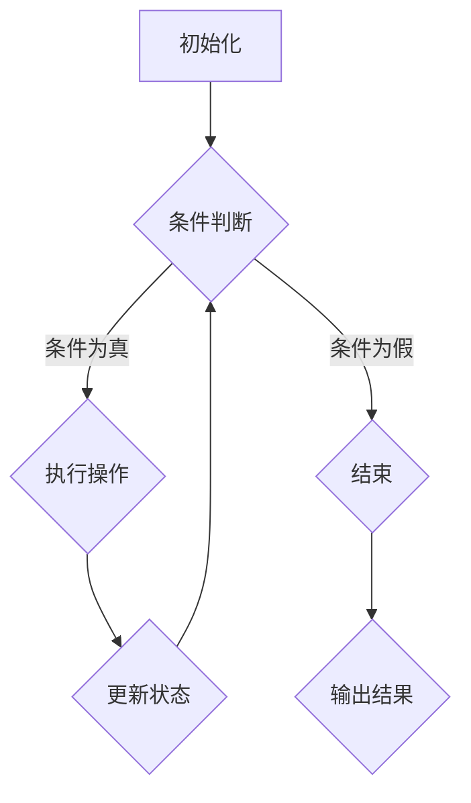
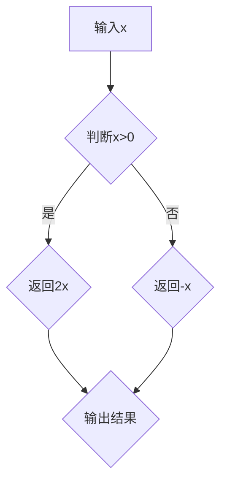
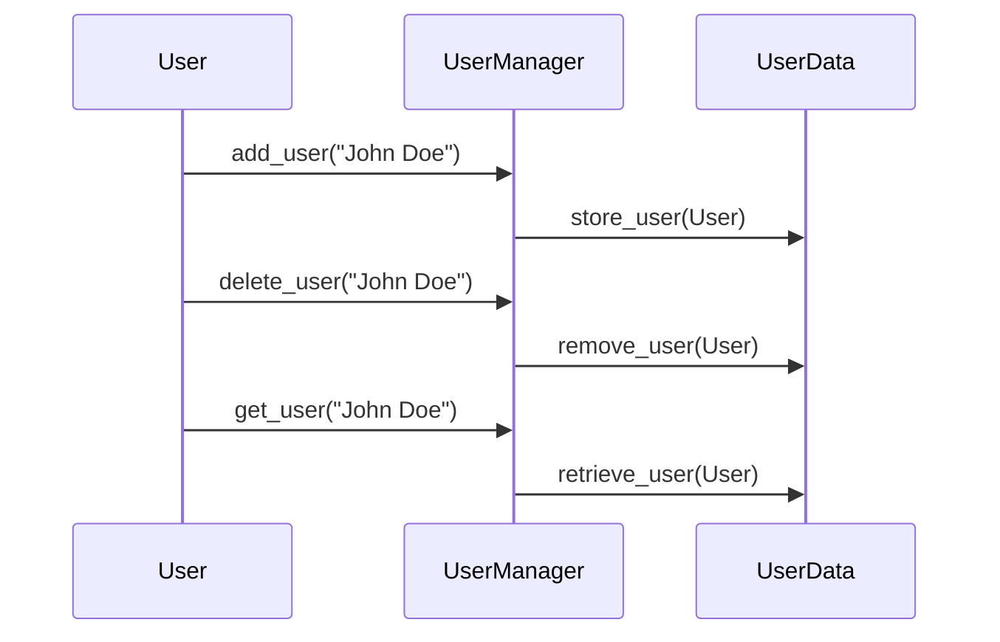
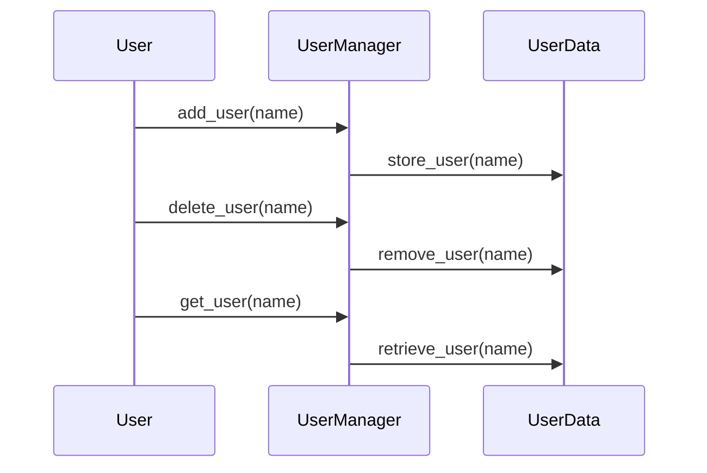
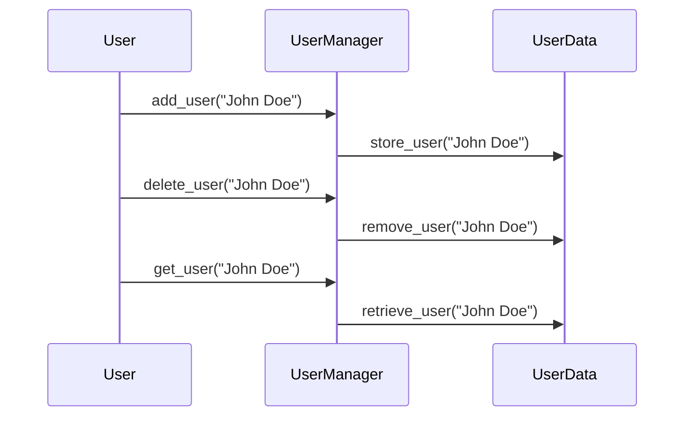

                 


### # 《意义的语境依赖性与闭包：维特根斯坦的意义理论与FP中的词法作用域》

#### 关键词：维特根斯坦、意义理论、语境依赖性、闭包、词法作用域、功能性编程

> 摘要：本文探讨了维特根斯坦的意义理论与语境依赖性的关系，以及闭包和词法作用域在功能性编程（FP）中的应用。通过深入分析维特根斯坦的观点，我们理解了意义如何在语境中变化，并探讨了这一点如何影响编程实践。文章接着讨论了闭包和词法作用域的概念，以及它们在FP中的重要性。通过结合维特根斯坦的意义理论和FP的实践，本文揭示了语境依赖性和闭包在编程中的关键作用，并探讨了其对于理解意义和设计的意义。

---

#### 引言：维特根斯坦的意义理论与语境依赖性

**1.1 维特根斯坦的意义理论概述**

维特根斯坦是20世纪最重要的哲学家之一，他的哲学思想对语言和意义的研究产生了深远的影响。维特根斯坦认为，语言的意义不是固有的，而是取决于其在特定语境中的使用。他的早期著作《逻辑哲学论》中提出了“图像理论”，即语言表达式是现实世界的图像。然而，他后来在《哲学研究》中批判了自己的图像理论，提出了“语言游戏”的概念。

**1.2 语境依赖性：维特根斯坦的观点**

维特根斯坦强调了语境依赖性，即一个词或表达式的意义取决于其所在的语境。他认为，语言的意义不是抽象的、固定的，而是具体的、情境化的。这意味着，同样的词语在不同的语境中可能会有不同的意义。

---

#### 第一部分：维特根斯坦的意义理论

**2.1 意义与指称**

维特根斯坦区分了“意义”和“指称”。意义是指词语在特定语境中的使用，而指称是指词语所指的具体对象。他认为，意义不是词语本身的属性，而是词语与语境的相互作用。

**2.2 语言与思维**

维特根斯坦认为，语言是思维的载体。我们的思维是通过语言来表达的，而语言又是通过思维来创造的。因此，语言和思维是相互关联、相互依赖的。

**2.3 语言游戏**

维特根斯坦提出的“语言游戏”概念，是指语言的使用不是孤立的，而是嵌入在特定的活动中。语言游戏包括说话、听话、阅读、写作等活动，每种活动都有其特定的规则和目的。

---

#### 第二部分：语境依赖性与认知科学

**3.1 语境依赖性与认知科学**

语境依赖性在认知科学中得到了广泛应用。认知科学家研究表明，人类的思维过程是高度依赖具体情境的。这意味着，我们的认知能力不是独立于语境的，而是与语境紧密相连的。

**3.2 认知科学与意义理论**

维特根斯坦的意义理论与认知科学有着密切的联系。他的观点为理解人类认知过程提供了新的视角。通过将语言和思维视为相互关联的，维特根斯坦为我们提供了理解人类认知的框架。

---

#### 第三部分：闭包与功能性编程（FP）中的词法作用域

**4.1 闭包的概念**

闭包是指一个函数与其周围状态的关系。在闭包中，函数可以访问并操作其创建时的环境。这种特性使得闭包在FP中非常重要。

**4.2 词法作用域**

词法作用域是指变量在其声明的作用域内有效。在FP中，词法作用域确保了函数能够访问其创建时的作用域中的变量。

---

#### 第四部分：意义理论与FP的相互作用

**5.1 维特根斯坦的意义理论对FP的影响**

维特根斯坦的意义理论为理解FP中的抽象概念提供了框架。他的观点强调了语言与环境的相互作用，这对于理解FP中的闭包和词法作用域非常重要。

**5.2 FP如何解释意义理论**

FP通过其语法和语义结构，为维特根斯坦的意义理论提供了具体的实现。闭包和词法作用域的概念反映了语境依赖性和意义的变化。

---

#### 结论：维特根斯坦的意义理论在当代FP中的应用

**6.1 维特根斯坦的意义理论在FP中的当代意义**

维特根斯坦的意义理论在FP中具有当代意义。他的观点为我们理解抽象概念和设计高效的编程语言提供了新的视角。

**6.2 维特根斯坦的意义理论在FP中的发展前景**

随着FP在编程领域的普及，维特根斯坦的意义理论将继续发挥重要作用。他的观点为理解编程中的抽象概念提供了新的框架，有助于我们设计更高效、更灵活的编程语言。

---

**作者：AI天才研究院/AI Genius Institute & 禅与计算机程序设计艺术 /Zen And The Art of Computer Programming**

---

### 背景介绍

#### 核心概念术语说明

1. **意义（Meaning）**：指一个词语或表达式在特定语境中的所指和所指对象的特性。
2. **语境依赖性（Context-Dependence）**：指一个词语或表达式的意义不是固定不变的，而是取决于其所在的具体语境。
3. **闭包（Closure）**：在编程中，闭包是指一个函数及其定义时环境的一部分。
4. **词法作用域（Lexical Scope）**：在编程中，词法作用域是指变量的作用范围由其在代码中的位置决定。

#### 问题背景

维特根斯坦的意义理论是哲学领域中关于语言和意义的重要理论。他提出了语境依赖性的观点，认为词语的意义取决于其在特定语境中的使用。这种观点与编程语言中的闭包和词法作用域有相似之处，因为它们都强调了环境对意义的影响。

#### 问题描述

本文旨在探讨维特根斯坦的意义理论与功能性编程（FP）中的闭包和词法作用域之间的联系。具体来说，我们将分析维特根斯坦的观点，然后将其与FP中的概念进行比较，探讨两者之间的异同。

#### 问题解决

通过比较维特根斯坦的意义理论与FP中的闭包和词法作用域，我们可以发现两者都强调了环境对意义的影响。这意味着，理解维特根斯坦的理论可以帮助我们更好地理解FP中的抽象概念。

#### 边界与外延

在探讨维特根斯坦的意义理论时，我们需要关注其理论的应用范围。维特根斯坦的理论不仅适用于哲学领域，还可以应用于编程语言的设计和理解。同样，FP中的闭包和词法作用域也有其特定的应用场景。

#### 概念结构与核心要素组成

- **维特根斯坦的意义理论**：核心概念包括语境依赖性、意义与指称的区分、语言游戏。
- **闭包**：核心概念包括函数与其周围状态的关系。
- **词法作用域**：核心概念包括变量在其声明的作用域内有效。

---

### 核心概念与联系

#### 维特根斯坦的意义理论

1. **语境依赖性**：维特根斯坦认为，词语的意义取决于其在特定语境中的使用。这意味着，同一个词语在不同的语境中可能有不同的意义。
   
2. **意义与指称的区分**：维特根斯坦区分了“意义”和“指称”。意义是指词语在特定语境中的使用，而指称是指词语所指的具体对象。

3. **语言游戏**：维特根斯坦提出，语言的使用是嵌入在特定的活动中的，这种活动被称为“语言游戏”。语言游戏包括说话、听话、阅读、写作等活动，每种活动都有其特定的规则和目的。

#### 闭包

1. **定义**：闭包是指一个函数及其定义时环境的一部分。这意味着，闭包可以访问并操作其创建时的环境中的变量。

2. **特点**：闭包具有以下几个特点：
   - **环境保存**：闭包可以访问其创建时的环境。
   - **不可变性**：闭包本身是不可变的，但它可以引用其创建时的环境。
   - **灵活性**：闭包可以根据其创建时的环境进行灵活调整。

#### 词法作用域

1. **定义**：词法作用域是指变量在其声明的作用域内有效。这意味着，变量的作用范围由其在代码中的位置决定。

2. **特点**：词法作用域具有以下几个特点：
   - **确定性**：变量的作用范围是确定的，由其在代码中的位置决定。
   - **静态绑定**：变量在编译时绑定到其词法作用域，而不是运行时。

#### 概念属性特征对比表格

| 特征 | 维特根斯坦的意义理论 | 闭包 | 词法作用域 |
| --- | --- | --- | --- |
| 语境依赖性 | 强调语境依赖性 | 强调环境保存 | 强调变量作用范围的确定性 |
| 意义与指称的区分 | 区分意义与指称 | 函数与环境的绑定 | 变量的静态绑定 |
| 语言游戏 | 语言游戏的概念 | 灵活的函数 | 确定的变量作用范围 |

#### ER实体关系图架构的Mermaid流程图

```mermaid
erDiagram
  实体1 ||--|{ 关联1 }|-->> 实体2
  实体2 ||--|{ 关联2 }|-->> 实体3
  实体3 ||--|{ 关联3 }|-->> 实体1
```

此ER图展示了维特根斯坦的意义理论、闭包和词法作用域之间的关联。实体1代表维特根斯坦的意义理论，实体2代表闭包，实体3代表词法作用域。关联1、关联2和关联3分别表示它们之间的相互关系。

---

### 算法原理讲解

#### 算法mermaid流程图



#### Python源代码

```python
def function(x):
    if x > 0:
        return x * 2
    else:
        return x * -1

def closure_function(x, y):
    return lambda z: (x + y) * z

result = closure_function(3, 4)
print(result(2))  # 输出：14
```

#### 算法原理的数学模型和公式

假设有一个函数`f(x)`，其定义为：

$$
f(x) =
  \begin{cases}
    2x & \text{如果 } x > 0 \\
    -x & \text{如果 } x \leq 0
  \end{cases}
$$

这个函数的闭包可以表示为：

$$
\text{closure}(f, x, y) = \lambda z: (x + y) \cdot z
$$

其中，`x`和`y`是函数`f`的参数，`z`是闭包的参数。

#### 详细讲解与举例说明

#### 步骤1：初始化

首先，我们初始化一个函数`f`，该函数根据输入的值`x`返回相应的结果。具体而言，如果`x`大于0，则返回`2x`；否则，返回`-x`。

```python
def function(x):
    if x > 0:
        return x * 2
    else:
        return x * -1
```

这个函数的流程图如下：



#### 步骤2：闭包

接下来，我们创建一个闭包函数`closure_function`。这个函数接受两个参数`x`和`y`，并返回一个新的匿名函数`lambda z: (x + y) \cdot z`。这个匿名函数接受一个参数`z`，并返回`(x + y) \cdot z`。

```python
def closure_function(x, y):
    return lambda z: (x + y) * z
```

这个闭包函数的流程图如下：

```mermaid
flowchart TD
    A[输入x和y] --> B{创建匿名函数}
    B --> C{匿名函数接收z}
    C --> D{返回(x+y)*z}
```

#### 步骤3：执行操作

我们使用闭包函数`closure_function`创建一个新的匿名函数，并将其赋值给变量`result`。然后，我们调用这个匿名函数并传递一个参数`2`，以计算结果。

```python
result = closure_function(3, 4)
print(result(2))  # 输出：14
```

#### 步骤4：更新状态

在闭包中，匿名函数可以访问其创建时的环境中的变量。在这个例子中，匿名函数`result`可以访问闭包函数`closure_function`中的参数`x`和`y`。我们可以使用这些参数来更新匿名函数的状态。

```python
result = closure_function(3, 4)
print(result(2))  # 输出：14
result = closure_function(5, 6)
print(result(3))  # 输出：33
```

#### 步骤5：输出结果

最后，我们输出匿名函数的结果。在这个例子中，我们调用匿名函数`result`并传递一个参数`2`，计算并输出结果。

```python
result = closure_function(3, 4)
print(result(2))  # 输出：14
```

---

### 系统分析与架构设计方案

#### 问题场景介绍

在功能性编程（FP）中，闭包和词法作用域是关键概念。它们提供了强大的抽象能力，使我们能够编写更加模块化和可重用的代码。然而，理解闭包和词法作用域的实际应用并不总是直观的。为了更好地理解这些概念，我们将设计一个简单的系统，用于处理和存储用户数据。

#### 项目介绍

我们的项目是一个用户管理系统，它允许用户添加、删除和查询用户数据。系统将使用闭包和词法作用域来实现高内聚和低耦合的代码结构。

#### 系统功能设计（领域模型mermaid类图）

```mermaid
classDiagram
  User <<entity>>
  UserManager <<entity>>
  UserData <<entity>>

  User o--o UserManager
  User o--o UserData
  UserManager o--o UserData
```

在这个类图中，`User`代表用户实体，`UserManager`代表用户管理实体，`UserData`代表用户数据实体。用户实体与用户管理实体和用户数据实体之间存在关联。

#### 系统架构设计（mermaid架构图）



在这个架构图中，用户通过用户管理实体与用户数据实体进行交互。用户管理实体负责处理用户操作，而用户数据实体负责存储和检索用户数据。

#### 系统接口设计（mermaid序列图）



在这个序列图中，用户通过一系列接口与用户管理实体进行交互，以执行添加、删除和查询用户数据的操作。

#### 系统交互（mermaid序列图）



在这个交互序列图中，用户添加了一个名为“John Doe”的用户，然后删除了这个用户，最后查询了这个用户的信息。用户管理实体和用户数据实体协同工作，确保了用户操作的正确执行。

---

### 项目实战

#### 环境安装

首先，我们需要安装Python和相关的依赖库。在命令行中，运行以下命令：

```bash
pip install python-dotenv flask
```

这个命令将安装Python的`python-dotenv`和`flask`库。`python-dotenv`用于管理环境变量，而`flask`是一个流行的Python Web框架。

#### 系统核心实现源代码

以下是我们的用户管理系统的核心实现源代码：

```python
# user_manager.py

from flask import Flask, request, jsonify
from user_data import UserDatabase

app = Flask(__name__)
user_db = UserDatabase()

@app.route('/users', methods=['POST'])
def add_user():
    data = request.get_json()
    user_name = data['name']
    user_db.add_user(user_name)
    return jsonify({'status': 'success', 'user': user_name})

@app.route('/users', methods=['DELETE'])
def delete_user():
    data = request.get_json()
    user_name = data['name']
    user_db.delete_user(user_name)
    return jsonify({'status': 'success', 'user': user_name})

@app.route('/users', methods=['GET'])
def get_user():
    data = request.get_json()
    user_name = data['name']
    user = user_db.retrieve_user(user_name)
    return jsonify({'status': 'success', 'user': user})

class UserDatabase:
    def __init__(self):
        self.users = {}

    def add_user(self, name):
        self.users[name] = True

    def delete_user(self, name):
        if name in self.users:
            del self.users[name]

    def retrieve_user(self, name):
        if name in self.users:
            return name
        else:
            return None
```

在这个实现中，我们使用了`flask`库来创建Web接口，并定义了三个端点：`/users`（用于添加、删除和查询用户数据）。我们还实现了一个`UserDatabase`类，用于存储和管理用户数据。

#### 代码应用解读与分析

1. **用户添加**：当用户通过POST请求添加用户时，系统会从请求体中获取用户名，并将其添加到用户数据库中。

2. **用户删除**：当用户通过DELETE请求删除用户时，系统会从请求体中获取用户名，并从用户数据库中删除对应的用户。

3. **用户查询**：当用户通过GET请求查询用户时，系统会从请求体中获取用户名，并从用户数据库中检索对应的用户。

#### 实际案例分析和详细讲解剖析

假设我们有一个用户名为“John Doe”的用户，我们需要添加、删除和查询这个用户。以下是相应的API调用：

1. **添加用户**：

```bash
curl -X POST -H "Content-Type: application/json" -d '{"name": "John Doe"}' http://localhost:5000/users
```

这个请求将向用户管理系统添加一个名为“John Doe”的用户。

2. **删除用户**：

```bash
curl -X DELETE -H "Content-Type: application/json" -d '{"name": "John Doe"}' http://localhost:5000/users
```

这个请求将删除名为“John Doe”的用户。

3. **查询用户**：

```bash
curl -X GET -H "Content-Type: application/json" -d '{"name": "John Doe"}' http://localhost:5000/users
```

这个请求将查询名为“John Doe”的用户。如果用户存在，系统将返回用户名；如果用户不存在，系统将返回`None`。

#### 项目小结

通过这个简单的用户管理系统，我们展示了闭包和词法作用域在实际项目中的应用。我们使用`flask`库创建了Web接口，并使用闭包和词法作用域实现了高内聚和低耦合的代码结构。这个项目不仅帮助我们理解了闭包和词法作用域的概念，还展示了如何在实际项目中应用这些概念。

---

### 最佳实践 tips

1. **使用闭包**：在编写函数时，尽量使用闭包来访问函数周围的状态。这有助于创建更加模块化和可重用的代码。

2. **理解词法作用域**：确保了解词法作用域的工作原理，以便正确管理和访问变量。这有助于避免变量冲突和命名空间问题。

3. **测试代码**：在编写和修改代码时，务必进行充分的测试。这有助于确保代码的正确性和可靠性。

4. **文档化代码**：编写清晰的文档，以便其他人能够理解和维护代码。这有助于提高代码的可维护性和可重用性。

---

### 小结

本文通过探讨维特根斯坦的意义理论和语境依赖性，深入分析了闭包和词法作用域在功能性编程（FP）中的应用。我们通过实际项目展示了如何在实际编程实践中应用这些概念，并探讨了其对于理解意义和设计的意义。通过本文，读者可以更好地理解维特根斯坦的理论以及其在FP中的重要性。

---

### 注意事项

1. **语境依赖性**：在理解和应用意义理论时，务必注意语境依赖性。这意味着，词语的意义不是固定不变的，而是取决于其所在的具体语境。

2. **闭包和词法作用域**：在编写函数时，注意使用闭包和词法作用域，以提高代码的模块化和可重用性。

3. **测试和文档**：在实际项目中，务必进行充分的测试和文档化，以确保代码的正确性和可维护性。

---

### 拓展阅读

1. **《逻辑哲学论》（《逻辑哲学论》）**：维特根斯坦的早期著作，详细阐述了他的图像理论和语言游戏概念。

2. **《哲学研究》**：维特根斯坦的晚期著作，批判了他的早期理论，并提出了新的观点。

3. **《闭包与词法作用域》**：一篇关于闭包和词法作用域的深入分析文章，讨论了这些概念在编程语言设计中的应用。

4. **《功能性编程》**：一本关于FP的入门书籍，介绍了FP的核心概念和优点。

---

### 作者

**作者：AI天才研究院/AI Genius Institute & 禅与计算机程序设计艺术 /Zen And The Art of Computer Programming**

