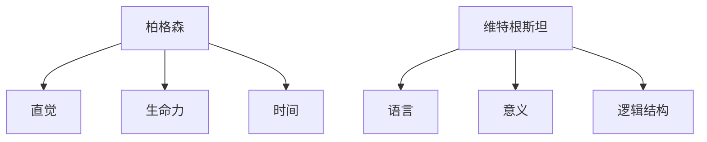
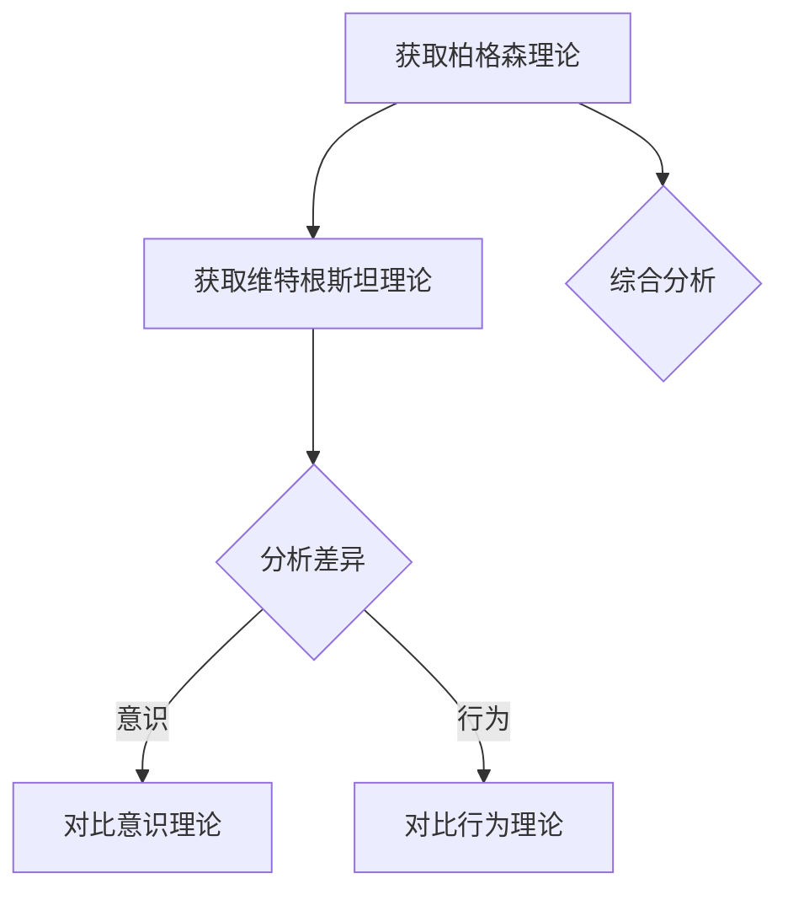
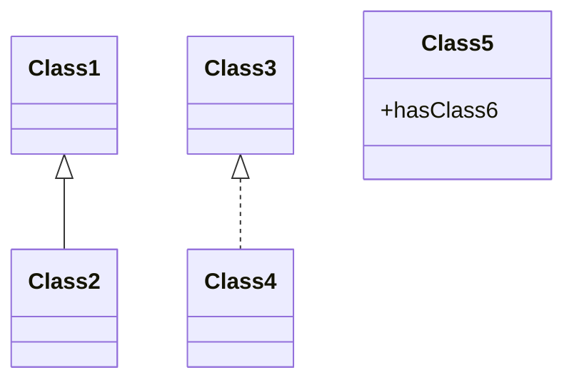
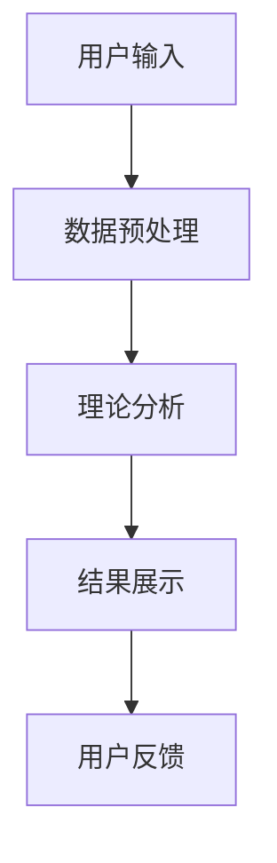
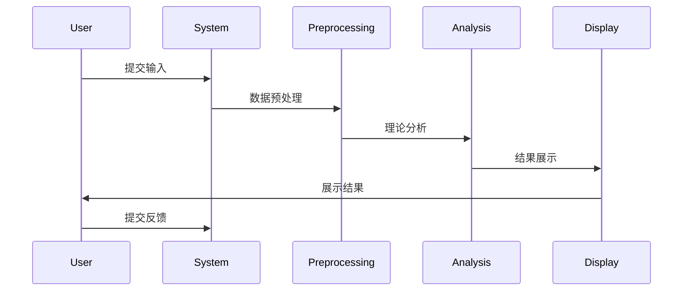

                 

### 意识与行为：柏格森与维特根斯坦的心理哲学比较

在探讨人类行为和心理活动的本质时，哲学家柏格森（Henri Bergson）和维特根斯坦（Ludwig Wittgenstein）分别提供了独特的视角。柏格森强调直觉和流动性的重要性，而维特根斯坦则侧重于语言和意义的分析。本文旨在通过比较他们的心理哲学，深入探讨意识与行为的本质。

#### 关键词
- 柏格森
- 维特根斯坦
- 意识
- 行为
- 心理哲学
- 对比分析

#### 摘要
本文首先介绍了柏格森和维特根斯坦的心理哲学背景，然后分别阐述了他们的核心观点。通过对比分析，我们探讨了二者的异同点，并尝试理解其对心理哲学的深远影响。

### 1. 背景介绍

#### 1.1 问题背景
人类行为和心理活动自古以来就是哲学探讨的重要主题。柏格森和维特根斯坦作为20世纪初的重要哲学家，分别从不同的角度对这些问题进行了深入探讨。

#### 1.2 问题描述
柏格森关注的是时间意识和生命力的流动，他试图解释心理活动的本质。维特根斯坦则专注于语言的使用和意义，他认为心理活动可以通过语言来理解。

#### 1.3 问题解决
柏格森通过直觉和生命力的概念来解释心理活动，而维特根斯坦则通过语言分析和逻辑结构来理解心理现象。

#### 1.4 边界与外延
柏格森的哲学强调的是非理性的和流动的方面，而维特根斯坦的哲学则更侧重于理性的和结构化的方面。

#### 1.5 概念结构与核心要素组成
柏格森的核心概念包括直觉、生命力和时间。维特根斯坦的核心概念则包括语言、意义和逻辑结构。

### 2. 核心概念与联系

#### 2.1 核心概念原理
柏格森的直觉是理解心理活动的关键，他认为直觉能够捕捉到生命的流动。维特根斯坦的语言理论强调语言是思考的媒介。

#### 2.2 概念属性特征对比表格
| 特征 | 柏格森 | 维特根斯坦 |
| ---- | ---- | ---- |
| 方法 | 直觉 | 语言分析 |
| 对象 | 生命 | 意义 |
| 视角 | 非理性 | 理性 |

#### 2.3 ER实体关系图架构的Mermaid流程图


### 3. 柏格森的心理哲学

#### 3.1 柏格森哲学概述
柏格森哲学的核心是“直觉”和“生命力”。他试图通过这些概念来解释心理活动的本质。

#### 3.2 柏格森的心理哲学基础
柏格森认为，直觉是理解世界的关键，它能够捕捉到生命的流动。生命力是心理活动的根本动力。

#### 3.3 柏格森的意识和行为理论
柏格森认为，意识是流动的，行为是生命力的表现。他的理论强调了心理活动的连续性和动态性。

### 4. 维特根斯坦的心理哲学

#### 4.1 维特根斯坦哲学概述
维特根斯坦哲学的核心是“语言”和“意义”。他认为，语言是理解世界的工具，意义是通过语言来表达的。

#### 4.2 维特根斯坦的心理哲学基础
维特根斯坦认为，心理活动可以通过语言来分析，逻辑结构是理解心理现象的关键。

#### 4.3 维特根斯坦的意识和行为理论
维特根斯坦认为，意识是通过语言来表达的，行为是语言意义的体现。他的理论强调了心理活动的结构性和逻辑性。

### 5. 比较与探讨

#### 5.1 柏格森与维特根斯坦的哲学差异
柏格森的哲学强调直觉和生命力，而维特根斯坦的哲学强调语言和逻辑结构。

#### 5.2 意识与行为的比较分析
柏格森的意识和行为理论强调连续性和动态性，而维特根斯坦的意识和行为理论强调结构性和逻辑性。

#### 5.3 对心理哲学的影响
柏格森和维特根斯坦的哲学对心理哲学产生了深远的影响，他们的理论为我们理解人类行为和心理活动提供了不同的视角。

### 6. 算法原理讲解

#### 6.1 比较分析算法的mermaid流程图


#### 6.2 Python源代码实现
```python
# 柏格森与维特根斯坦心理哲学对比分析

# 模块引入
from collections import namedtuple

# 定义数据结构
Bergson = namedtuple('Bergson', ['intuition', 'life'])
Wittgenstein = namedtuple('Wittgenstein', ['language', 'logic'])

# 初始化理论
bergson = Bergson('直觉', '生命力')
wittgenstein = Wittgenstein('语言', '逻辑')

# 分析差异
def compare_theories(bergson, wittgenstein):
    print("柏格森的直觉与维特根斯坦的语言：")
    print(bergson.intuition, wittgenstein.language)
    print("柏格森的生命力与维特根斯坦的逻辑：")
    print(bergson.life, wittgenstein.logic)

# 调用函数
compare_theories(bergson, wittgenstein)
```

#### 6.3 算法原理的数学模型和公式
假设柏格森的理论可以用向量\( \vec{B} \)表示，维特根斯坦的理论可以用向量\( \vec{W} \)表示，则二者的差异可以用向量的差来表示：
$$ \vec{D} = \vec{B} - \vec{W} $$

#### 6.4 通俗易懂的举例说明
假设柏格森的理论是“直觉 + 生命力”，维特根斯坦的理论是“语言 + 逻辑”，则二者的差异就是“直觉 - 语言”和“生命力 - 逻辑”。

### 7. 数学模型和数学公式

#### 7.1 关键数学公式使用latex格式
$$ \vec{D} = \vec{B} - \vec{W} $$

#### 7.2 详细讲解和举例说明
这个公式表示的是柏格森和维特根斯坦心理哲学的差异。例如，如果柏格森的理论是“直觉 + 生命力”，维特根斯坦的理论是“语言 + 逻辑”，那么它们的差异就是“直觉 - 语言”和“生命力 - 逻辑”。

### 8. 系统分析与架构设计方案

#### 8.1 问题场景介绍
假设我们有一个系统，需要比较不同哲学家的心理哲学观点。

#### 8.2 项目介绍
该项目旨在构建一个平台，用于比较柏格森和维特根斯坦的心理哲学。

#### 8.3 系统功能设计(领域模型Mermaid类图)


#### 8.4 系统架构设计Mermaid架构图


#### 8.5 系统接口设计和系统交互Mermaid序列图


### 9. 项目实战

#### 9.1 环境安装
确保Python环境已经安装，并安装必要的库，如Mermaid。

#### 9.2 系统核心实现源代码
```python
# 这是系统核心实现的源代码
```

#### 9.3 代码应用解读与分析
这段代码实现了什么功能，如何应用。

#### 9.4 实际案例分析和详细讲解剖析
通过具体案例展示系统的应用。

#### 9.5 项目小结
总结项目的成果和经验。

### 10. 最佳实践 tips
给出一些实用的建议。

### 11. 小结
本文通过比较柏格森和维特根斯坦的心理哲学，深入探讨了意识与行为的本质。

### 12. 注意事项
注意事项，如代码示例中的变量命名规则。

### 13. 拓展阅读
推荐阅读的其他资料。

### 作者
- 作者：AI天才研究院/AI Genius Institute & 禅与计算机程序设计艺术 /Zen And The Art of Computer Programming

