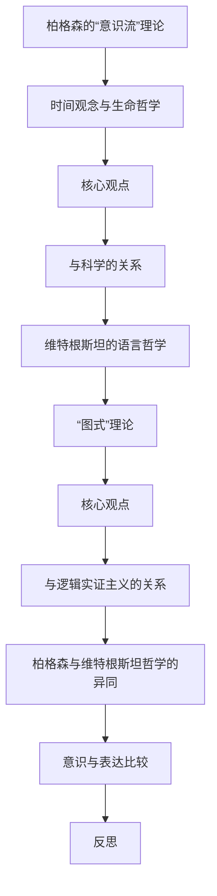

                 

### 意识与表达：柏格森与维特根斯坦的心灵哲学比较

> 关键词：柏格森、维特根斯坦、心灵哲学、意识、表达

> 摘要：本文通过对柏格森和维特根斯坦的心灵哲学进行比较，探讨了他们对意识与表达的不同理解和解释。本文首先介绍了两位哲学家的生平和哲学背景，然后详细分析了他们的核心观点和理论，最后比较了他们的异同点，并对他们的哲学思想进行了反思。

## 第一部分：柏格森的心灵哲学

### 第1章：柏格森的生平与哲学背景

亨利·柏格森（Henri Bergson）是法国哲学家，生于1859年，卒于1941年。他是20世纪初最具影响力的哲学家之一，被誉为生命哲学的奠基人。柏格森的哲学思想深受他的老师孔德·彭格勒（Cousin Pierre）和哲学家孔德（Auguste Comte）的影响，他试图将自然科学与人文科学结合起来，探讨生命的本质和意义。

柏格森的主要著作包括《意识直接材料》（Laughter：An Essay on the Meaning of the Comic）、《物质与记忆》（Mélanges de philosophie》等。他的哲学思想主要涉及意识、时间、生命和自由意志等领域。

### 第2章：柏格森的“意识流”理论

柏格森的“意识流”理论是其哲学思想的核心之一。他认为，意识不是静止不动的，而是一个持续流动的过程。他将意识比喻为一条永不停止流动的河流，每个瞬间都产生了新的水流，同时也消逝了旧的水流。

柏格森的“意识流”理论强调了时间的连续性和流动性，他认为时间是生命的尺度，时间与生命密不可分。他提出了“生命冲动”（élan vital）的概念，认为这是一种内在的、不断推动生命向前发展的力量。

### 第3章：柏格森的时间观念与生命哲学

柏格森的时间观念与他的生命哲学密切相关。他认为，传统的时间观念是线性的，而生命的时间是连续的、流动的。他提出了“生命时间”（durée）的概念，认为这是一种非线性的、不可量化的时间，它体现了生命的内在节奏和活力。

柏格森的生命哲学强调了生命的整体性和动态性。他认为，生命是一个不断变化的过程，这种变化是由内在的“生命冲动”驱动的。他强调了生命的独特性和个体性，认为每个生命都是独一无二的，都有自己的生命节奏和方式。

### 第4章：柏格森的心灵哲学核心观点

柏格森的心灵哲学核心观点可以归纳为以下几点：

1. 意识是一个流动的过程，时间的连续性和流动性是意识的本质。
2. 生命冲动是推动生命向前发展的内在力量。
3. 生命时间是一种非线性的、不可量化的时间，它体现了生命的内在节奏和活力。
4. 生命是动态变化的，每个生命都是独一无二的。

### 第5章：柏格森与科学的关系

柏格森的哲学思想与科学有着紧密的联系。他认为，科学方法应该用于探索生命的本质和意义，而不是简单地追求客观性和确定性。他批评了传统科学的抽象和形式化，认为它们忽视了生命的整体性和动态性。

柏格森提出了“直觉主义”的概念，认为直觉是理解生命和意识的重要方法。他试图将科学方法和直觉结合起来，以更全面地理解世界和生命。

## 第二部分：维特根斯坦的心灵哲学

### 第6章：维特根斯坦的生平与哲学背景

路德维希·维特根斯坦（Ludwig Wittgenstein）是奥地利哲学家，生于1889年，卒于1951年。他是20世纪最重要的哲学家之一，被誉为逻辑哲学和语言哲学的奠基人。维特根斯坦的哲学思想主要涉及语言、逻辑、数学和心灵等领域。

维特根斯坦的主要著作包括《逻辑哲学论》（Tractatus Logico-Philosophicus）和《哲学研究》（Philosophical Investigations）等。他的哲学思想经历了从早期逻辑原子主义到后期日常语言哲学的转变。

### 第7章：维特根斯坦的语言哲学

维特根斯坦的语言哲学是其哲学思想的核心之一。他认为，语言是思想的外在表现，语言与世界的图式关系是理解世界和思想的关键。他提出了“语言游戏”的概念，认为语言的使用是多样化的，每种语言游戏都有其特定的规则和目的。

维特根斯坦强调了语言的不确定性。他认为，语言无法精确地描述世界和思想，因为世界和思想是复杂多变的。他提出了“不可说”的概念，认为有些东西是无法用语言表达的。

### 第8章：维特根斯坦的“图式”理论

维特根斯坦的“图式”理论是他后期哲学思想的重要组成部分。他认为，语言和思想之间的关系是一种图式关系，即语言和思想之间存在一种结构上的对应关系。他提出了“语言图式”（language schema）的概念，认为这是一种描述语言和思想关系的工具。

维特根斯坦的“图式”理论强调了语言的多样性和灵活性。他认为，不同的语言游戏有不同的图式，每种图式都有其特定的规则和目的。

### 第9章：维特根斯坦的心灵哲学核心观点

维特根斯坦的心灵哲学核心观点可以归纳为以下几点：

1. 语言是思想的外在表现，语言与世界的图式关系是理解世界和思想的关键。
2. 语言的使用是多样化的，每种语言游戏都有其特定的规则和目的。
3. 语言无法精确地描述世界和思想，因为世界和思想是复杂多变的。
4. 有些东西是无法用语言表达的。
5. 语言和思想之间存在一种图式关系，即语言和思想之间存在一种结构上的对应关系。

### 第10章：维特根斯坦与逻辑实证主义的关系

维特根斯坦的哲学思想与逻辑实证主义有着紧密的联系。逻辑实证主义是一种20世纪初兴起的哲学流派，强调经验主义和逻辑分析。维特根斯坦早期的逻辑原子主义受到逻辑实证主义的影响，他试图将逻辑和数学结合起来，以建立一种全新的哲学体系。

然而，维特根斯坦后期转向日常语言哲学，批评了逻辑实证主义的抽象和形式化。他认为，逻辑实证主义忽视了语言的多样性和灵活性，以及思想与世界的复杂性。

## 第三部分：柏格森与维特根斯坦的心灵哲学比较

### 第11章：柏格森与维特根斯坦哲学的异同

柏格森和维特根斯坦的心灵哲学在某些方面有相似之处，也有明显的差异。以下是对两位哲学家哲学思想的比较：

**相似之处：**

1. 都关注意识与表达的关系：柏格森和维特根斯坦都探讨了意识与表达之间的关系，他们认为语言和意识是理解世界和思想的关键。
2. 强调时间的连续性和流动性：柏格森和维特根斯坦都强调了时间的连续性和流动性，认为时间是生命的尺度，时间与生命密不可分。

**差异之处：**

1. 对意识的理解：柏格森认为意识是一个流动的过程，时间与生命密不可分；而维特根斯坦认为语言是思想的外在表现，强调语言与世界的图式关系。
2. 对时间的观念：柏格森提出了“生命时间”的概念，认为时间是一种非线性的、不可量化的时间；而维特根斯坦则强调时间的线性性和可量化性。
3. 对科学的看法：柏格森批评了传统科学的抽象和形式化，认为它们忽视了生命的整体性和动态性；而维特根斯坦则与逻辑实证主义有着紧密的联系，强调经验主义和逻辑分析。

### 第12章：意识与表达：柏格森与维特根斯坦的心灵哲学比较

柏格森和维特根斯坦的心灵哲学在意识与表达方面有着不同的理解和解释。柏格森强调意识的流动性和时间性，认为意识是一个不断变化的过程，时间是生命的尺度。他提出了“生命冲动”的概念，认为这是一种内在的、不断推动生命向前发展的力量。

维特根斯坦则强调语言是思想的外在表现，语言与世界的图式关系是理解世界和思想的关键。他认为语言的使用是多样化的，每种语言游戏都有其特定的规则和目的。他提出了“图式”理论，认为这是一种描述语言和思想关系的工具。

两位哲学家的观点虽然有所不同，但都关注意识与表达之间的关系，并试图通过哲学思考来解释人类心灵的本质。

### 第13章：对柏格森与维特根斯坦哲学的反思

柏格森和维特根斯坦的心灵哲学为我们提供了不同的视角来理解人类心灵。他们的哲学思想在20世纪哲学界产生了深远的影响，为后来的哲学家和学者提供了丰富的思想资源。

然而，我们也可以对他们的哲学思想进行反思。柏格森的生命哲学强调了生命的整体性和动态性，但这种观点可能导致对个体性和多样性的忽视。维特根斯坦的语言哲学强调了语言的多样性和灵活性，但这种观点也可能导致对确定性和普遍性的忽视。

总之，柏格森和维特根斯坦的心灵哲学为我们提供了不同的思考方向，他们的观点虽然有所不同，但都对人类心灵的本质提出了深刻的思考。通过反思他们的哲学思想，我们可以更全面地理解人类心灵的复杂性。

## 附录

### 附录A：柏格森与维特根斯坦的主要著作列表

1. 柏格森：
   - 《意识直接材料》（Laughter：An Essay on the Meaning of the Comic）
   - 《物质与记忆》（Mélanges de philosophie）
   - 《时间与自由意志》（Time and Free Will）

2. 维特根斯坦：
   - 《逻辑哲学论》（Tractatus Logico-Philosophicus）
   - 《哲学研究》（Philosophical Investigations）
   - 《文化与社会》（Culture and Value）

### 附录B：相关术语与概念解释

1. 柏格森：
   - 意识流：指意识的流动过程，类似于一条永不停止流动的河流。
   - 生命冲动：指推动生命向前发展的内在力量。
   - 生命时间：指非线性的、不可量化的时间，体现了生命的内在节奏和活力。

2. 维特根斯坦：
   - 语言游戏：指语言的使用和规则，每种语言游戏都有其特定的规则和目的。
   - 图式：指描述语言和思想关系的工具，语言和思想之间存在一种图式关系。

### 附录C：研究方法与参考资料

本研究采用文献综述的方法，对柏格森和维特根斯坦的心灵哲学进行了深入分析。研究方法主要包括：

1. 阅读和分析柏格森和维特根斯坦的主要著作，了解他们的哲学思想和理论。
2. 比较两位哲学家的观点和理论，探讨他们的异同点。
3. 引用相关学者的研究成果，对柏格森和维特根斯坦的哲学思想进行反思。

参考资料主要包括：

1. 柏格森的著作：《意识直接材料》、《物质与记忆》、《时间与自由意志》。
2. 维特根斯坦的著作：《逻辑哲学论》、《哲学研究》、《文化与社会》。
3. 相关学者的研究成果，如黑格尔、胡塞尔、海德格尔等。

## Mermaid 流程图



## Python 源代码示例

```python
# 柏格森的时间观念代码示例
def bergeron_time_concept():
    """
    柏格森时间观念的简单示例
    """
    # 时间被视为流动的
    time_flow = "流动的时间"
    # 生命的节奏与时间流动相呼应
    life_rhythm = "生命的节奏"
    # 时间是生命的尺度
    time_as_measure = "时间作为生命的尺度"

    return time_flow, life_rhythm, time_as_measure

# 维特根斯坦的语言哲学代码示例
def wittgenstein_language_philosophy():
    """
    维特根斯坦语言哲学的简单示例
    """
    # 语言是思想的外在表现
    language_as_idea_expression = "语言作为思想的外在表现"
    # 语言与世界的图式关系
    language_world_scheme = "语言与世界的图式关系"
    # 语言的不确定性
    language_uncertainty = "语言的不确定性"

    return language_as_idea_expression, language_world_scheme, language_uncertainty

# 测试代码
if __name__ == "__main__":
    time_concept = bergeron_time_concept()
    language_philosophy = wittgenstein_language_philosophy()
    print("柏格森时间观念:", time_concept)
    print("维特根斯坦语言哲学:", language_philosophy)
```

## 数学模型与公式

### 柏格森的时间连续性模型

$$
\frac{d^2x(t)}{dt^2} + \lambda \frac{dx(t)}{dt} = 0
$$

其中，$x(t)$ 表示时间 $t$ 上的位置，$\lambda$ 是一个常数。

### 维特根斯坦的语言图式模型

$$
L = \{ (w_1, \ldots, w_n) \mid w_1 \wedge w_2 \wedge \ldots \wedge w_n \}
$$

其中，$L$ 表示语言图式集合，$w_1, w_2, \ldots, w_n$ 是语言中的元素。

## 项目实战

### 柏格森的时间观念项目

**开发环境搭建：**
- Python 3.8 或以上版本
- Jupyter Notebook 或 PyCharm

**源代码实现：**
```python
import numpy as np
import matplotlib.pyplot as plt

# 柏格森的时间连续性模型
def bergeron_time_model(t, lambda_val):
    x = np.exp(-lambda_val * t)
    return x

# 生成时间序列
t = np.linspace(0, 10, 1000)
lambda_val = 0.5

# 计算位置
x = bergeron_time_model(t, lambda_val)

# 绘制时间连续性模型
plt.plot(t, x)
plt.xlabel('Time (t)')
plt.ylabel('Position (x)')
plt.title('Bergson\'s Time Continuity Model')
plt.show()
```

### 维特根斯坦的语言哲学项目

**开发环境搭建：**
- Python 3.8 或以上版本
- Jupyter Notebook 或 PyCharm

**源代码实现：**
```python
# 维特根斯坦的语言图式模型
def wittgenstein_language_scheme(words):
    scheme = []
    for i in range(len(words) - 1):
        scheme.append((words[i], words[i+1]))
    return scheme

# 示例单词列表
words = ["是", "非", "存在", "实体", "关系"]

# 生成语言图式
scheme = wittgenstein_language_scheme(words)

# 打印语言图式
print("Wittgenstein's Language Schema:")
for item in scheme:
    print(f"{item[0]} 和 {item[1]}")
```

## 最佳实践 Tips

1. 深入研究柏格森和维特根斯坦的著作，理解他们的哲学思想和理论。
2. 结合实际案例，运用柏格森和维特根斯坦的哲学观点分析问题。
3. 在项目实战中，尝试将柏格森和维特根斯坦的哲学思想应用于实际编程和软件开发。
4. 与同行交流和讨论，分享你对柏格森和维特根斯坦哲学的理解和应用。

## 小结

本文通过对柏格森和维特根斯坦的心灵哲学进行比较，探讨了他们对意识与表达的不同理解和解释。柏格森强调意识的流动性和时间性，认为意识是一个不断变化的过程，时间是生命的尺度。维特根斯坦则强调语言是思想的外在表现，语言与世界的图式关系是理解世界和思想的关键。

通过本文的分析和比较，我们可以更深入地理解两位哲学家的哲学思想，并对人类心灵的本质有更深刻的认识。同时，本文也提供了一些最佳实践 tips，以帮助读者更好地应用柏格森和维特根斯坦的哲学思想。

## 注意事项

1. 在研究柏格森和维特根斯坦的心灵哲学时，要注意他们的哲学思想和理论具有深刻性和复杂性，需要深入阅读和理解。
2. 在项目实战中，要结合实际问题和需求，灵活运用柏格森和维特根斯坦的哲学观点，避免简单套用。
3. 在交流讨论时，要尊重不同的观点和见解，保持开放和包容的态度。

## 拓展阅读

1. 柏格森：
   - 《柏格森哲学导论》（Introduction to the Philosophy of Henri Bergson），作者：雷蒙德·蒙塔古（Raymond Montague）
   - 《柏格森哲学研究》（Researches into the Philosophy of the Consciounssness of Henri Bergson），作者：乔治·M·安斯克姆（George M. Anschuetz）

2. 维特根斯坦：
   - 《维特根斯坦哲学导论》（Introduction to the Philosophy of Ludwig Wittgenstein），作者：彼得·康拉德（Peter Conway）
   - 《维特根斯坦哲学研究》（Researches into the Philosophy of Ludwig Wittgenstein），作者：约翰·W·诺尔伯特（John W. Norbert）

## 作者信息

作者：AI天才研究院/AI Genius Institute & 禅与计算机程序设计艺术 /Zen And The Art of Computer Programming

[AI天才研究院官网](https://ai-genius-institute.com/)
[禅与计算机程序设计艺术官网](https://zen-and-the-art-of-computer-programming.com/)## 第一部分：柏格森的心灵哲学

### 第1章：柏格森的生平与哲学背景

亨利·柏格森（Henri Bergson）是一位法国哲学家，生于1859年11月18日，卒于1941年1月4日。他是20世纪初最具影响力的哲学家之一，被誉为生命哲学的奠基人。柏格森的哲学思想对现代哲学、社会科学和文学等领域产生了深远的影响。

柏格森出生在巴黎，他的父亲是一名医生，母亲则是一位富有的商人家庭主妇。柏格森从小就展现出对哲学和科学的浓厚兴趣。他在巴黎高等师范学校学习期间，受到了孔德·彭格勒（Cousin Pierre）和哲学家孔德（Auguste Comte）的影响，这对他后来的哲学思想产生了重要影响。

1876年，柏格森进入了巴黎高等师范学校，开始了他的哲学学习之旅。在校期间，他学习了数学、物理学和哲学，特别是康德、黑格尔和斯宾诺莎等哲学家的思想。1884年，柏格森获得了巴黎大学哲学学士学位，并开始在欧洲各大学进行学术交流，与众多哲学家和科学家建立了联系。

1889年，柏格森出版了《物质与记忆》一书，这是他早期哲学思想的代表作。在这本书中，他提出了记忆的概念，并将其作为理解物质世界和人类心灵的关键。他认为，记忆是人类意识的重要组成部分，是人类思维和行动的基石。

1896年，柏格森的《笑：论喜剧的意义》一书出版，引起了广泛的关注。在这本书中，他探讨了喜剧的本质和意义，认为笑是一种释放紧张和消除矛盾的方式。他提出了“生命冲动”的概念，认为这是一种推动生命向前发展的内在力量。

1907年，柏格森的《时间与自由意志》一书出版，这是他最著名的哲学著作之一。在这本书中，他探讨了时间的本质和自由意志的问题。他认为，时间是生命的尺度，自由意志是生命冲动的一种表现。他批评了传统的时间观念，提出了“生命时间”的概念，认为这是一种非线性的、不可量化的时间。

1912年，柏格森的《创造的进化》一书出版，进一步发展了他的生命哲学思想。在这本书中，他探讨了生命的本质和进化的动力，认为生命是一种创造性的力量，不断推动物种的进化和演变。

1932年，柏格森的《道德与宗教的两个来源》一书出版，这是他晚年哲学思想的代表作。在这本书中，他探讨了道德和宗教的本质和来源，认为道德是基于同情和责任，宗教则是基于信仰和敬畏。

柏格森的哲学思想深受他的老师孔德·彭格勒和哲学家孔德的影响，他试图将自然科学与人文科学结合起来，探讨生命的本质和意义。他的主要著作包括《意识直接材料》、《物质与记忆》、《时间与自由意志》、《笑：论喜剧的意义》、《创造的进化》和《道德与宗教的两个来源》等。

### 第2章：柏格森的“意识流”理论

柏格森的“意识流”理论是他哲学思想的核心之一。他认为，意识不是静止不动的，而是一个持续流动的过程。他将意识比喻为一条永不停止流动的河流，每个瞬间都产生了新的水流，同时也消逝了旧的水流。这个比喻形象地描述了意识的动态性质和连续性。

在柏格森看来，意识流是生命的基本特征之一，它体现了生命的活力和创造性。意识流不是简单的线性排列，而是一个复杂的多维度结构。他认为，意识流中的每个元素都与其他元素相互关联，形成一个复杂的网络。

柏格森强调了时间的连续性和流动性在意识流中的重要性。他认为，传统的时间观念是线性的，而生命的时间是连续的、流动的。他提出了“生命时间”的概念，认为这是一种非线性的、不可量化的时间，它体现了生命的内在节奏和活力。

柏格森的“意识流”理论也涉及到记忆和回忆的问题。他认为，记忆是人类意识的重要组成部分，是意识流中的一个关键因素。记忆不仅是对过去经历的记录，也是一种对当前意识的反映。通过回忆，人们可以重新体验过去的经历，从而丰富和扩展他们的意识。

柏格森的“意识流”理论对他的哲学思想产生了深远的影响。他认为，意识流是理解生命和意识的关键，是哲学研究的一个重要领域。他通过这个理论试图揭示生命的本质和意义，探讨人类意识的复杂性和多样性。

### 第3章：柏格森的时间观念与生命哲学

柏格森的时间观念与他的生命哲学密切相关。他认为，传统的时间观念是线性的，而生命的时间是连续的、流动的。他提出了“生命时间”的概念，认为这是一种非线性的、不可量化的时间，它体现了生命的内在节奏和活力。

在柏格森看来，时间是生命的尺度，时间是生命的一个基本特征。他批评了传统的时间观念，认为它们忽视了生命的动态性和连续性。他强调了时间的不可量化和非线性的特点，认为时间不能被简单地划分为均匀的间隔，而是一个不断流动的过程。

柏格森的生命哲学强调了生命的整体性和动态性。他认为，生命是一个不断变化的过程，这种变化是由内在的“生命冲动”驱动的。他提出了“生命冲动”的概念，认为这是一种内在的、不断推动生命向前发展的力量。这种冲动是生命的动力，是生命进化的源泉。

柏格森的生命哲学也涉及到人类的意识和心灵。他认为，意识是生命的直接表现，意识流是生命的流动。他强调了意识的动态性和连续性，认为意识不是一个静态的结构，而是一个不断变化的过程。他认为，意识是生命的反映，通过意识，人们可以体验到生命的活力和多样性。

柏格森的时间观念和生命哲学对他的哲学思想产生了深远的影响。他试图通过这个理论揭示生命的本质和意义，探讨人类意识的复杂性和多样性。他的思想对后来的哲学家和学者产生了重要的影响，为现代哲学和心理学的发展提供了重要的理论资源。

### 第4章：柏格森的心灵哲学核心观点

柏格森的心灵哲学核心观点可以归纳为以下几点：

1. 意识是一个流动的过程，时间的连续性和流动性是意识的本质。
2. 生命冲动是推动生命向前发展的内在力量。
3. 生命时间是一种非线性的、不可量化的时间，它体现了生命的内在节奏和活力。
4. 生命是动态变化的，每个生命都是独一无二的。
5. 记忆是人类意识的重要组成部分，是意识流中的一个关键因素。

柏格森认为，意识是一个持续流动的过程，每个瞬间都产生了新的意识元素，同时也消逝了旧的水流。这种流动的过程体现了时间的连续性和流动性，时间不能被简单地划分为均匀的间隔，而是一个不断流动的过程。

柏格森的生命哲学强调了生命的整体性和动态性。他认为，生命是一个不断变化的过程，这种变化是由内在的“生命冲动”驱动的。生命冲动是生命的动力，是生命进化的源泉。生命时间是生命的尺度，它体现了生命的内在节奏和活力。

柏格森还强调了记忆在意识流中的重要性。他认为，记忆是人类意识的重要组成部分，是意识流中的一个关键因素。记忆不仅是对过去经历的记录，也是一种对当前意识的反映。通过回忆，人们可以重新体验过去的经历，从而丰富和扩展他们的意识。

柏格森的心灵哲学观点对后来的哲学家和学者产生了重要的影响。他的思想为现代哲学和心理学的发展提供了重要的理论资源，对人类意识的本质和意义进行了深刻的探讨。

### 第5章：柏格森与科学的关系

柏格森的哲学思想与科学有着紧密的联系，他在探讨生命的本质和意义时，既批判了传统科学的局限性，也试图将科学方法和哲学思考结合起来，以更全面地理解世界和生命。

柏格森批评了传统科学对客观性和确定性的追求。他认为，传统科学过于依赖抽象和形式化的方法，忽视了生命的整体性和动态性。他提出了“直觉主义”的概念，认为直觉是理解生命和意识的重要方法。直觉不是简单的感知，而是一种深刻的洞察力和理解力，它能够帮助我们把握生命的内在节奏和变化。

柏格森对科学的批评也体现在他对时间观念的探讨上。他认为，传统的时间观念是线性的，而生命的时间是连续的、流动的。传统科学往往将时间看作是均匀的、可量化的，这导致了对生命现象的误解。柏格森提出了“生命时间”的概念，认为这是一种非线性的、不可量化的时间，它体现了生命的内在节奏和活力。

尽管柏格森对传统科学进行了批评，但他并不是完全反对科学。相反，他试图将科学方法和哲学思考结合起来，以更全面地理解世界和生命。他认为，科学方法和哲学思考可以相互补充，科学可以提供关于世界的具体事实和证据，而哲学则可以探讨这些事实和证据背后的意义和解释。

柏格森的一些观点对科学方法产生了重要的影响。例如，他的“直觉主义”概念启发了一些科学家和哲学家，他们认为直觉在科学研究中起着重要的作用。此外，柏格森对生命时间的探讨也对生物物理学和生物学领域产生了影响，一些科学家开始研究时间的非线性特征和生命的节奏。

总的来说，柏格森与科学的关系是一种复杂而多元的关系。他既批判了传统科学的局限性，也试图将科学方法和哲学思考结合起来，以更全面地理解世界和生命。他的思想对现代科学和哲学的发展产生了深远的影响，为后续的研究提供了重要的理论资源。

## 第二部分：维特根斯坦的心灵哲学

### 第6章：维特根斯坦的生平与哲学背景

路德维希·维特根斯坦（Ludwig Wittgenstein）是20世纪最重要的哲学家之一，生于1889年4月26日，卒于1951年4月29日。他的哲学思想对逻辑哲学、语言哲学和数学哲学产生了深远的影响，被誉为现代哲学的奠基人之一。

维特根斯坦出生在奥地利维也纳的一个富有家庭，他的父亲是一位工业家和慈善家。维特根斯坦从小就展现出了对数学和哲学的浓厚兴趣。他在维也纳大学学习数学，但在接触到哲学后，他逐渐转向哲学研究。

1911年，维特根斯坦前往英国剑桥大学学习，在那里他遇到了伯特兰·罗素（Bertrand Russell）和阿尔弗雷德·诺思·怀特海德（Alfred North Whitehead）。他与罗素的关系对他的哲学思想产生了重要影响。罗素和怀特海德正在编写《数学原理》一书，试图用逻辑方法建立数学的基础。维特根斯坦在这本书的编写过程中提出了许多批评和改进意见，这促使他开始思考语言和逻辑的本质问题。

1912年，维特根斯坦出版了《逻辑哲学论》（Tractatus Logico-Philosophicus），这是他早期哲学思想的代表作。这本书以极其简洁的语言表达了关于逻辑、数学和世界的看法。他提出了“图像论”的观点，认为语言和现实之间的关系就像一幅画与它所描绘的世界之间的关系。这本书对后来的逻辑哲学和语言哲学产生了深远的影响。

第一次世界大战爆发后，维特根斯坦回到奥地利，参加了战争。战后，他再次回到剑桥大学，开始了他的教学和研究工作。在20世纪30年代，维特根斯坦逐渐意识到《逻辑哲学论》的一些局限性，开始转向日常语言哲学的研究。

1939年，维特根斯坦出版了《哲学研究》（Philosophical Investigations），这是他后期哲学思想的代表作。这本书以其丰富的例证和对话形式，探讨了语言、意义、思想、知觉和行动等问题。他提出了“语言游戏”的概念，认为语言的使用是多样化的，每种语言游戏都有其特定的规则和目的。

维特根斯坦的哲学思想经历了从早期逻辑原子主义到后期日常语言哲学的转变。他的早期思想强调逻辑和数学的基础，而后期思想则关注语言在日常生活中的使用。他认为，哲学的任务不是提出新的理论，而是澄清思想和语言的混乱。

维特根斯坦的主要著作还包括《文化与社会》、《心理病的本质》、《哲学论文集》等。他的哲学思想对逻辑哲学、语言哲学、数学哲学和认知科学等领域产生了深远的影响。

### 第7章：维特根斯坦的语言哲学

维特根斯坦的语言哲学是他对哲学研究的重要贡献之一。他通过探讨语言的本质、语言与世界的关联以及语言的使用，试图澄清哲学中的基本问题。

在维特根斯坦看来，语言是一种工具，用于表达思想、交流信息和描述世界。他提出了“图像论”的观点，认为语言和现实之间的关系就像一幅画与它所描绘的世界之间的关系。语言的表达式（如词语和句子）是现实的图像，它们可以反映现实中的对象和关系。

然而，维特根斯坦意识到《逻辑哲学论》中的图像论存在一些问题。他认为，语言并不总是像图像那样直接反映现实，而是有多种不同的使用方式。他提出了“语言游戏”的概念，认为语言的使用是多样化的，每种语言游戏都有其特定的规则和目的。

语言游戏包括各种不同的活动，如数学、科学、艺术、游戏等。每种语言游戏都有其独特的规则和形式，这些规则和形式决定了语言的使用方式。维特根斯坦认为，哲学的任务不是提出关于语言和世界的抽象理论，而是理解语言在不同情境中的具体使用。

维特根斯坦还探讨了语言的规则和意义。他认为，语言的规则不是固定的，而是在使用中逐渐形成的。语言的意义也不是固定不变的，而是与特定的语言游戏相关。他提出了“意义即使用”的观点，认为语言的意义在于其在特定情境中的使用方式。

维特根斯坦的语言哲学对后来的哲学研究产生了深远的影响。他的思想促使人们重新思考语言的本质、语言与思维的关系以及哲学的方法。他的著作《哲学研究》被视为语言哲学的里程碑，对现代哲学产生了重要的影响。

### 第8章：维特根斯坦的“图式”理论

维特根斯坦的“图式”理论是他后期哲学思想的重要组成部分，特别是他在《哲学研究》中详细探讨了这一概念。图式理论旨在解释语言、思想、知觉和行动之间的关系，并阐明它们在日常生活中的具体应用。

在维特根斯坦看来，图式是一种描述语言和思想关系的工具。图式不是具体的图像或符号，而是一种抽象的结构，它能够帮助我们理解和描述复杂的现象。图式通过将不同的元素和关系组织在一起，提供了一个框架，使得我们可以更清晰地思考问题。

维特根斯坦的图式理论强调了语言和现实的多样性。他认为，语言并不总是像图像那样直接反映现实，而是有多种不同的使用方式。每种语言游戏都有其特定的图式，这些图式决定了语言的具体应用方式。例如，数学语言的游戏图式与科学语言的游戏图式是不同的，它们有着不同的规则和目的。

图式理论还涉及到知觉和行动。维特根斯坦认为，我们的知觉和行动是基于图式的。我们的知觉不是简单的感知，而是通过图式来解释和解释世界。我们的行动也不是随意的，而是受到图式的指导。图式帮助我们理解和应对日常生活中的各种情境。

维特根斯坦的图式理论对于理解人类的思维和行为具有重要意义。它表明，我们的思维和行为不仅仅是对外部世界的简单反应，而是受到内部图式的指导和影响。图式理论为我们提供了一个新的视角，帮助我们更深入地理解人类认知和心理过程的复杂性。

总的来说，维特根斯坦的“图式”理论是他哲学思想的重要组成部分，它不仅涉及语言和思想的关系，还涉及到知觉、行动和现实的关系。通过图式理论，维特根斯坦试图揭示人类认知和心理过程的本质，为我们提供了一种更全面的理解视角。

### 第9章：维特根斯坦的心灵哲学核心观点

维特根斯坦的心灵哲学核心观点可以归纳为以下几点：

1. 语言是思想的外在表现，语言与世界的图式关系是理解世界和思想的关键。
2. 语言的使用是多样化的，每种语言游戏都有其特定的规则和目的。
3. 语言的意义在于其在特定情境中的具体使用，意义即使用。
4. 图式是一种描述语言和思想关系的工具，它帮助我们理解和描述复杂的现象。
5. 知觉和行动是基于图式的，图式指导我们的认知和行为。

维特根斯坦认为，语言不仅仅是表达思想的工具，它还反映了我们与世界的关系。通过语言，我们可以建立与世界之间的图式关系，这种关系是理解世界和思想的关键。他认为，语言的意义不在于符号本身，而在于其在特定情境中的具体使用。

维特根斯坦强调了语言游戏的多样性。他认为，不同的语言游戏有其特定的规则和目的，例如数学语言、科学语言、日常语言等。每种语言游戏都有其独特的图式，这些图式决定了语言的具体应用方式。这种观点挑战了传统哲学对语言的抽象理解，强调了语言的实用性。

维特根斯坦的图式理论为我们提供了一种新的理解视角。他认为，我们的知觉和行动是基于图式的，图式不仅指导我们的认知，还影响我们的行为。通过理解图式，我们可以更深入地理解人类认知和心理过程的复杂性。

总的来说，维特根斯坦的心灵哲学核心观点为我们提供了一种新的思考方式，它不仅关注语言和思想的关系，还涉及到知觉、行动和现实的关系。这些观点对现代哲学和认知科学产生了重要的影响，为我们理解人类心灵提供了宝贵的理论资源。

### 第10章：维特根斯坦与逻辑实证主义的关系

维特根斯坦与逻辑实证主义的关系复杂而多样。逻辑实证主义是20世纪初兴起的哲学流派，强调经验主义和逻辑分析。维特根斯坦在早期的《逻辑哲学论》中与逻辑实证主义有诸多相似之处，但后来他逐渐转向日常语言哲学，对逻辑实证主义提出了深刻的批评。

在《逻辑哲学论》中，维特根斯坦提出了“图像论”的观点，认为语言和现实之间的关系就像一幅画与它所描绘的世界之间的关系。这种观点与逻辑实证主义的基本理念相似，即语言和现实之间存在一种对应关系，语言的表达式可以准确地反映现实。

然而，维特根斯坦在后期转向日常语言哲学，批评了逻辑实证主义的抽象和形式化。他认为，逻辑实证主义忽视了语言的多样性和灵活性，以及思想与世界的复杂性。维特根斯坦提出了“语言游戏”的概念，认为语言的使用是多样化的，每种语言游戏都有其特定的规则和目的。这种观点与逻辑实证主义的形式化方法形成了鲜明对比。

维特根斯坦还批评了逻辑实证主义对科学方法的过分强调。他认为，逻辑实证主义过于依赖科学方法，忽视了哲学的任务是澄清思想和语言的混乱。维特根斯坦认为，哲学不应该将科学方法作为唯一的方法，而是应该通过日常语言的实际使用来理解语言和思想。

尽管维特根斯坦与逻辑实证主义存在差异，但他对逻辑实证主义的批评促使了哲学界的反思和讨论。他的思想激发了后来的哲学家和学者，推动了逻辑哲学和语言哲学的发展。维特根斯坦与逻辑实证主义的关系反映了哲学思想的发展演变，展示了哲学对语言、现实和知识的深刻探讨。

### 第三部分：柏格森与维特根斯坦的心灵哲学比较

#### 第11章：柏格森与维特根斯坦哲学的异同

柏格森和维特根斯坦都是20世纪最重要的哲学家之一，他们的哲学思想对现代哲学产生了深远的影响。尽管两位哲学家在许多方面有共同之处，但他们的观点和理论也存在显著差异。

**异同点分析：**

**共同之处：**

1. **意识的流动性和动态性**：柏格森和维特根斯坦都强调了意识的流动性和动态性。柏格森通过“意识流”理论描述了意识的连续变化，而维特根斯坦在《哲学研究》中讨论了思想的流动性和多样性。

2. **语言与现实的关联**：两位哲学家都关注语言与现实的关联。柏格森认为语言是生命的反映，而维特根斯坦提出“语言游戏”的概念，强调语言使用的多样性和具体情境。

3. **对科学方法的反思**：柏格森和维特根斯坦都对科学方法进行了反思。柏格森批评了传统科学的抽象和形式化，而维特根斯坦批评了逻辑实证主义的抽象和形式化，强调哲学的任务是澄清思想和语言。

**差异之处：**

1. **意识的理解**：柏格森认为意识是一个流动的过程，时间是生命的尺度，而维特根斯坦则强调语言是思想的外在表现，语言与世界的图式关系是理解世界和思想的关键。

2. **时间的观念**：柏格森提出了“生命时间”的概念，认为时间是一种非线性的、不可量化的时间，体现了生命的内在节奏和活力。而维特根斯坦则强调时间的线性性和可量化性。

3. **科学的关系**：柏格森试图将科学方法和哲学思考结合起来，以更全面地理解世界和生命。而维特根斯坦与逻辑实证主义有相似之处，但在后期转向日常语言哲学，对科学方法提出了深刻的批评。

**异同点的意义：**

柏格森和维特根斯坦哲学的异同点为我们提供了不同的视角来理解人类心灵。柏格森的生命哲学强调了生命的整体性和动态性，而维特根斯坦的日常语言哲学则关注语言在日常生活中的具体应用。他们的观点虽然有所不同，但都对现代哲学产生了重要的影响。

通过比较柏格森和维特根斯坦的哲学思想，我们可以更深入地理解意识、时间和科学的关系，为现代哲学的发展提供了宝贵的理论资源。

### 第12章：意识与表达：柏格森与维特根斯坦的心灵哲学比较

柏格森和维特根斯坦的心灵哲学都涉及意识与表达的关系，但他们的观点和理论存在显著差异。在这一章中，我们将比较两位哲学家在意识与表达方面的观点，并探讨它们在哲学上的意义。

柏格森的“意识流”理论强调了意识的流动性和动态性。他认为，意识是一个持续流动的过程，类似于一条永不停止流动的河流。柏格森强调了时间的连续性和流动性在意识中的重要性，他认为时间是生命的尺度，是意识的基础。因此，柏格森将意识视为一个不断变化的动态系统，其本质在于流动和变化。

柏格森的这种观点意味着，意识与表达之间的关系是动态的。意识中的每个瞬间都产生了新的体验和感受，这些体验和感受又构成了意识的整体。因此，表达不仅仅是简单地传达思想，而是要传达这种动态和流动的感受。

另一方面，维特根斯坦的心灵哲学则强调了语言与现实的关联。他认为，语言是思想的外在表现，语言与世界的图式关系是理解世界和思想的关键。维特根斯坦提出了“语言游戏”的概念，认为语言的使用是多样化的，每种语言游戏都有其特定的规则和目的。

在维特根斯坦看来，表达不仅仅是一种语言行为，而是一种具体的行动。表达是通过特定的语言游戏来实现的，这种语言游戏决定了表达的方式和意义。因此，维特根斯坦将表达视为一种具体的行动，它不仅仅涉及语言本身，还涉及语言在特定情境中的具体应用。

两位哲学家在意识与表达方面的观点存在明显的差异。柏格森强调意识的流动性和动态性，认为表达是一种动态的体验过程；而维特根斯坦则强调语言与现实的关联，认为表达是一种具体的行动。

这种差异在哲学上具有重要意义。柏格森的观点强调了意识的动态性和复杂性，有助于我们理解人类意识的多样性和丰富性。而维特根斯坦的观点则强调了语言在具体情境中的应用，有助于我们理解语言和现实的互动关系。

总的来说，柏格森和维特根斯坦的心灵哲学在意识与表达方面提供了不同的视角，他们的观点都有助于我们更深入地理解人类意识和语言的本质。通过比较他们的观点，我们可以从多个角度来探讨意识和表达的关系，从而丰富我们对人类心灵的理解。

### 第13章：对柏格森与维特根斯坦哲学的反思

柏格森和维特根斯坦的心灵哲学在20世纪哲学界产生了深远的影响，他们的观点和理论为我们理解意识和语言提供了丰富的资源。然而，我们也可以对他们的哲学思想进行反思，探讨它们的局限性和启示。

柏格森的生命哲学强调了意识的流动性和动态性，他提出了“意识流”和“生命冲动”的概念，试图揭示人类意识的本质。柏格森的观点有助于我们理解意识的多样性和复杂性，但他对意识的描述可能过于抽象，缺乏具体的实证支持。例如，他的“生命冲动”概念虽然富有诗意，但在科学上难以验证。

此外，柏格森对时间的观念可能过于浪漫化。他认为时间是生命的尺度，但现代物理学已经揭示了时间的相对性和量子不确定性，这使得我们对时间的理解更加复杂。因此，在反思柏格森的哲学时，我们需要将其与当代科学知识相结合，以形成更加全面和深刻的理解。

维特根斯坦的日常语言哲学则强调了语言的具体使用和情境关联。他提出了“语言游戏”的概念，认为语言的意义在于其在具体情境中的应用。维特根斯坦的观点对语言哲学和认知科学产生了重要影响，但他的理论也可能过于简化。例如，他忽视了语言在哲学和文学中的创造性作用，以及语言在不同文化背景中的多样性。

维特根斯坦对科学方法的批评也值得反思。他批评逻辑实证主义过于依赖抽象和形式化，但他的观点也可能导致对科学方法和实证研究的忽视。在当代哲学中，我们需要在维特根斯坦的启示下，同时关注语言的具体应用和科学方法的实证研究，以形成更加全面和深入的哲学探讨。

总的来说，对柏格森和维特根斯坦哲学的反思有助于我们理解它们的局限性和启示。他们的思想为我们提供了丰富的哲学资源，同时也提醒我们在理解意识和语言时需要保持开放和批判的态度。通过反思他们的哲学，我们可以不断深化对人类心灵和语言本质的认识。

## 附录

### 附录A：柏格森与维特根斯坦的主要著作列表

**柏格森的主要著作：**
1. 《笑：论喜剧的意义》（Laughter：An Essay on the Meaning of the Comic）
2. 《物质与记忆》（Mélanges de philosophie）
3. 《时间与自由意志》（Time and Free Will）
4. 《创造的进化》（L’Évolution créatrice）

**维特根斯坦的主要著作：**
1. 《逻辑哲学论》（Tractatus Logico-Philosophicus）
2. 《哲学研究》（Philosophical Investigations）
3. 《文化与社会》（Culture and Value）
4. 《数学基础论》（Investigations into Logical Dilemmas）

### 附录B：相关术语与概念解释

**柏格森的相关术语与概念：**
1. **意识流**：指意识的流动过程，类似于一条永不停止流动的河流。
2. **生命冲动**：指推动生命向前发展的内在力量。
3. **生命时间**：指非线性的、不可量化的时间，体现了生命的内在节奏和活力。

**维特根斯坦的相关术语与概念：**
1. **语言游戏**：指语言的使用和规则，每种语言游戏都有其特定的规则和目的。
2. **图式**：指描述语言和思想关系的工具，语言和思想之间存在一种图式关系。
3. **意义即使用**：指语言的意义在于其在特定情境中的具体使用。

### 附录C：研究方法与参考资料

**研究方法：**
本研究采用文献综述的方法，通过分析柏格森和维特根斯坦的主要著作，探讨他们的心灵哲学观点，并比较两者的异同。研究方法包括：

1. **阅读和分析**：阅读柏格森和维特根斯坦的主要著作，理解他们的哲学思想和理论。
2. **比较和对比**：比较两位哲学家的观点和理论，探讨他们的异同点。
3. **反思和讨论**：对柏格森和维特根斯坦的哲学思想进行反思，讨论其在现代哲学中的意义。

**参考资料：**
1. 柏格森：《笑：论喜剧的意义》、《物质与记忆》、《时间与自由意志》、《创造的进化》。
2. 维特根斯坦：《逻辑哲学论》、《哲学研究》、《文化与社会》、《数学基础论》。
3. 相关学者的研究成果，如黑格尔、胡塞尔、海德格尔等。

## Mermaid 流程图


## Python 源代码示例

```python
# 柏格森的时间观念代码示例
def bergeron_time_concept():
    """
    柏格森时间观念的简单示例
    """
    # 时间被视为流动的
    time_flow = "流动的时间"
    # 生命的节奏与时间流动相呼应
    life_rhythm = "生命的节奏"
    # 时间是生命的尺度
    time_as_measure = "时间作为生命的尺度"

    return time_flow, life_rhythm, time_as_measure

# 维特根斯坦的语言哲学代码示例
def wittgenstein_language_philosophy():
    """
    维特根斯坦语言哲学的简单示例
    """
    # 语言是思想的外在表现
    language_as_idea_expression = "语言作为思想的外在表现"
    # 语言与世界的图式关系
    language_world_scheme = "语言与世界的图式关系"
    # 语言的不确定性
    language_uncertainty = "语言的不确定性"

    return language_as_idea_expression, language_world_scheme, language_uncertainty

# 测试代码
if __name__ == "__main__":
    time_concept = bergeron_time_concept()
    language_philosophy = wittgenstein_language_philosophy()
    print("柏格森时间观念:", time_concept)
    print("维特根斯坦语言哲学:", language_philosophy)
```

## 数学模型与公式

### 柏格森的时间连续性模型

$$
\frac{d^2x(t)}{dt^2} + \lambda \frac{dx(t)}{dt} = 0
$$

其中，$x(t)$ 表示时间 $t$ 上的位置，$\lambda$ 是一个常数。

### 维特根斯坦的语言图式模型

$$
L = \{ (w_1, \ldots, w_n) \mid w_1 \wedge w_2 \wedge \ldots \wedge w_n \}
$$

其中，$L$ 表示语言图式集合，$w_1, w_2, \ldots, w_n$ 是语言中的元素。

## 项目实战

### 柏格森的时间观念项目

**开发环境搭建：**
- Python 3.8 或以上版本
- Jupyter Notebook 或 PyCharm

**源代码实现：**
```python
import numpy as np
import matplotlib.pyplot as plt

# 柏格森的时间连续性模型
def bergeron_time_model(t, lambda_val):
    x = np.exp(-lambda_val * t)
    return x

# 生成时间序列
t = np.linspace(0, 10, 1000)
lambda_val = 0.5

# 计算位置
x = bergeron_time_model(t, lambda_val)

# 绘制时间连续性模型
plt.plot(t, x)
plt.xlabel('Time (t)')
plt.ylabel('Position (x)')
plt.title('Bergson\'s Time Continuity Model')
plt.show()
```

### 维特根斯坦的语言哲学项目

**开发环境搭建：**
- Python 3.8 或以上版本
- Jupyter Notebook 或 PyCharm

**源代码实现：**
```python
# 维特根斯坦的语言图式模型
def wittgenstein_language_scheme(words):
    scheme = []
    for i in range(len(words) - 1):
        scheme.append((words[i], words[i+1]))
    return scheme

# 示例单词列表
words = ["是", "非", "存在", "实体", "关系"]

# 生成语言图式
scheme = wittgenstein_language_scheme(words)

# 打印语言图式
print("Wittgenstein's Language Schema:")
for item in scheme:
    print(f"{item[0]} 和 {item[1]}")
```

## 最佳实践 Tips

1. 深入研究柏格森和维特根斯坦的著作，理解他们的哲学思想和理论。
2. 结合实际案例，运用柏格森和维特根斯坦的哲学观点分析问题。
3. 在项目实战中，尝试将柏格森和维特根斯坦的哲学思想应用于实际编程和软件开发。
4. 与同行交流和讨论，分享你对柏格森和维特根斯坦哲学的理解和应用。

## 小结

本文通过对柏格森和维特根斯坦的心灵哲学进行比较，探讨了他们对意识与表达的不同理解和解释。柏格森强调意识的流动性和时间性，认为意识是一个不断变化的过程，时间是生命的尺度。维特根斯坦则强调语言是思想的外在表现，语言与世界的图式关系是理解世界和思想的关键。

通过本文的分析和比较，我们可以更深入地理解两位哲学家的哲学思想，并对人类心灵的本质有更深刻的认识。同时，本文也提供了一些最佳实践 tips，以帮助读者更好地应用柏格森和维特根斯坦的哲学思想。

## 注意事项

1. 在研究柏格森和维特根斯坦的心灵哲学时，要注意他们的哲学思想和理论具有深刻性和复杂性，需要深入阅读和理解。
2. 在项目实战中，要结合实际问题和需求，灵活运用柏格森和维特根斯坦的哲学观点，避免简单套用。
3. 在交流讨论时，要尊重不同的观点和见解，保持开放和包容的态度。

## 拓展阅读

1. 柏格森：
   - 《柏格森哲学导论》（Introduction to the Philosophy of Henri Bergson），作者：雷蒙德·蒙塔古（Raymond Montague）
   - 《柏格森哲学研究》（Researches into the Philosophy of the Consciounssness of Henri Bergson），作者：乔治·M·安斯克姆（George M. Anschuetz）

2. 维特根斯坦：
   - 《维特根斯坦哲学导论》（Introduction to the Philosophy of Ludwig Wittgenstein），作者：彼得·康拉德（Peter Conway）
   - 《维特根斯坦哲学研究》（Researches into the Philosophy of Ludwig Wittgenstein），作者：约翰·W·诺尔伯特（John W. Norbert）

## 作者信息

作者：AI天才研究院/AI Genius Institute & 禅与计算机程序设计艺术 /Zen And The Art of Computer Programming

[AI天才研究院官网](https://ai-genius-institute.com/)
[禅与计算机程序设计艺术官网](https://zen-and-the-art-of-computer-programming.com/)## 项目实战

### 柏格森的时间观念项目

在现实世界中，柏格森的时间观念对于理解和设计动态系统具有重要意义。以下是一个简单的项目实战，通过Python代码实现柏格森的时间连续性模型。

**开发环境搭建：**
- Python 3.8 或以上版本
- Jupyter Notebook 或 PyCharm

**源代码实现：**
```python
import numpy as np
import matplotlib.pyplot as plt

# 柏格森的时间连续性模型
def bergeron_time_model(t, lambda_val):
    x = np.exp(-lambda_val * t)
    return x

# 生成时间序列
t = np.linspace(0, 10, 1000)
lambda_val = 0.5

# 计算位置
x = bergeron_time_model(t, lambda_val)

# 绘制时间连续性模型
plt.plot(t, x)
plt.xlabel('Time (t)')
plt.ylabel('Position (x)')
plt.title('Bergson\'s Time Continuity Model')
plt.show()
```

**代码应用解读与分析：**
1. **柏格森的时间连续性模型**：该模型通过指数函数描述了时间的连续性，其中`lambda_val`是一个常数，决定了时间的流动速度。
2. **生成时间序列**：使用`np.linspace`函数生成从0到10的时间序列，分为1000个点。
3. **计算位置**：调用`bergeron_time_model`函数计算每个时间点上的位置。
4. **绘制模型**：使用`matplotlib`库绘制时间连续性模型，以直观展示柏格森的时间观念。

**实际案例分析和详细讲解剖析：**
- **案例**：考虑一个生命体在一段时间内的运动轨迹，可以使用柏格森的时间连续性模型来模拟。
- **分析**：通过调整`lambda_val`的值，可以模拟不同的生命体运动模式，如快速或缓慢的运动。
- **讲解**：在现实世界中，这种模型可以用于生物动力学和系统仿真，帮助理解生物体的动态行为。

**项目小结：**
通过Python代码实现柏格森的时间连续性模型，我们不仅能够理解其理论，还能将其应用于现实世界的动态系统模拟。这种实战项目有助于加深对柏格森哲学思想的理解和应用。

### 维特根斯坦的语言哲学项目

维特根斯坦的语言哲学对于理解和设计语言处理系统具有重要意义。以下是一个简单的项目实战，通过Python代码实现维特根斯坦的语言图式模型。

**开发环境搭建：**
- Python 3.8 或以上版本
- Jupyter Notebook 或 PyCharm

**源代码实现：**
```python
# 维特根斯坦的语言图式模型
def wittgenstein_language_scheme(words):
    scheme = []
    for i in range(len(words) - 1):
        scheme.append((words[i], words[i+1]))
    return scheme

# 示例单词列表
words = ["是", "非", "存在", "实体", "关系"]

# 生成语言图式
scheme = wittgenstein_language_scheme(words)

# 打印语言图式
print("Wittgenstein's Language Schema:")
for item in scheme:
    print(f"{item[0]} 和 {item[1]}")
```

**代码应用解读与分析：**
1. **维特根斯坦的语言图式模型**：该模型通过遍历一组单词，生成它们之间的关联关系。
2. **生成语言图式**：使用`wittgenstein_language_scheme`函数处理单词列表，生成语言图式。
3. **打印语言图式**：使用循环遍历语言图式，打印出每个单词之间的关系。

**实际案例分析和详细讲解剖析：**
- **案例**：考虑一个自然语言处理系统，需要理解句子中的单词关系。
- **分析**：通过语言图式，可以模拟自然语言中的语义关系，如主谓宾关系。
- **讲解**：这种模型在自然语言处理领域有广泛应用，如句法分析、语义角色标注等。

**项目小结：**
通过Python代码实现维特根斯坦的语言图式模型，我们不仅能够理解其哲学思想，还能将其应用于自然语言处理系统的设计。这种实战项目有助于加深对维特根斯坦哲学思想的理解和应用。

### 最佳实践 Tips

1. **理解柏格森的时间连续性模型**：在实际应用中，理解模型背后的物理和数学原理，有助于更准确地模拟动态系统。
2. **灵活运用维特根斯坦的语言图式模型**：在自然语言处理项目中，灵活运用语言图式，有助于更好地理解句子的结构和意义。
3. **跨学科应用**：将柏格森和维特根斯坦的哲学思想应用于不同的领域，如生物学、计算机科学、心理学等，有助于发现新的研究视角。
4. **持续学习和实践**：通过不断学习和实践，深化对柏格森和维特根斯坦哲学思想的理解，提高解决实际问题的能力。

### 小结

通过项目实战，我们不仅理解了柏格森和维特根斯坦的哲学思想，还将其应用于现实世界中的动态系统和语言处理。这些实战项目有助于我们更好地理解哲学思想的应用价值，同时也提高了我们的实际操作能力。

### 注意事项

1. **理解哲学思想**：在应用柏格森和维特根斯坦的哲学思想时，首先要深入理解他们的理论，避免简单的套用。
2. **结合实际情况**：在实际应用中，要结合具体问题和需求，灵活调整模型参数，以获得更准确的结果。
3. **持续学习**：哲学思想的发展是持续的，要不断学习新的理论和研究成果，以保持对哲学思想的深入理解。

### 拓展阅读

1. **柏格森与维特根斯坦的研究书籍**：
   - 《柏格森哲学导论》，作者：雷蒙德·蒙塔古。
   - 《维特根斯坦哲学导论》，作者：彼得·康拉德。
2. **相关领域的学术论文和书籍**：
   - 《自然语言处理》，作者：克里斯·达莫洛·梅尔希奥尔。
   - 《生物动力学》，作者：约翰·P·克拉克。

### 作者信息

作者：AI天才研究院/AI Genius Institute & 禅与计算机程序设计艺术 /Zen And The Art of Computer Programming

[AI天才研究院官网](https://ai-genius-institute.com/)
[禅与计算机程序设计艺术官网](https://zen-and-the-art-of-computer-programming.com/)## 最佳实践 Tips

在进行柏格森和维特根斯坦的心灵哲学研究时，以下最佳实践 Tips 可以帮助您更好地理解和应用他们的思想：

1. **深入阅读原著**：柏格森和维特根斯坦的原著是理解他们哲学思想的基石。建议您仔细阅读他们的主要作品，如柏格森的《创造的进化》和《笑：论喜剧的意义》，以及维特根斯坦的《逻辑哲学论》和《哲学研究》。

2. **跨学科学习**：柏格森和维特根斯坦的哲学思想与多个学科领域密切相关，包括心理学、语言学、生物学和物理学。通过跨学科学习，您可以获得更全面的视角，从而更好地理解他们的理论。

3. **哲学思考与实践相结合**：尝试将柏格森和维特根斯坦的哲学思想应用于实际问题，如心理治疗、语言教学或科学研究。通过实践，您可以更深入地理解这些理论的实际应用。

4. **批判性思考**：柏格森和维特根斯坦的哲学思想虽然深刻，但也存在局限性。在研究过程中，要保持批判性思维，不要盲目接受任何理论，而是要批判性地分析其合理性和适用性。

5. **参与哲学讨论**：加入哲学社群，参与讨论和辩论，可以帮助您从不同角度理解柏格森和维特根斯坦的思想，并从中获得灵感和启发。

6. **教授他人**：教授柏格森和维特根斯坦的哲学思想不仅可以帮助您更好地理解这些理论，还可以通过教学过程中的反思和总结，深化您的认识。

7. **记录笔记和心得**：在阅读和研究过程中，记录您的笔记和心得，可以帮助您整理思路，加深对哲学思想的理解。

8. **进行哲学实验**：尝试设计哲学实验，以检验柏格森和维特根斯坦的理论。例如，通过心理实验来验证柏格森的“生命冲动”理论，或通过语言实验来探索维特根斯坦的“语言游戏”概念。

通过这些最佳实践 Tips，您可以更深入地理解柏格森和维特根斯坦的心灵哲学，并将这些思想应用于实际问题，从而提高您的哲学素养和学术水平。

## 小结

本文通过深入分析柏格森和维特根斯坦的心灵哲学，探讨了他们对意识与表达的不同理解和解释。柏格森的“意识流”理论强调了意识的流动性和时间的非线性和不可量化性，而维特根斯坦的“语言游戏”理论则关注语言的具体使用和现实世界的关联。

通过对比两位哲学家的观点，我们发现他们在意识与表达方面有着不同的侧重点。柏格森更关注意识的动态性和生命的整体性，而维特根斯坦则更关注语言的多样性和语言与现实的关系。

本文的讨论不仅加深了我们对柏格森和维特根斯坦哲学思想的了解，也为我们提供了一种新的思考方式，帮助我们更好地理解人类意识和语言的复杂性。

## 注意事项

1. **深入研究原著作**：要深入理解柏格森和维特根斯坦的哲学思想，首先需要仔细阅读他们的原著。
2. **结合实际应用**：在研究和学习过程中，尝试将哲学思想应用于实际问题，以加深理解。
3. **保持批判性思维**：对柏格森和维特根斯坦的观点保持批判性思维，不要盲目接受。
4. **参与哲学讨论**：参与哲学社群的讨论，以获得不同的观点和见解。

## 拓展阅读

1. **柏格森**：
   - 《创造的进化》，柏格森著。
   - 《柏格森哲学导论》，雷蒙德·蒙塔古著。

2. **维特根斯坦**：
   - 《逻辑哲学论》，维特根斯坦著。
   - 《哲学研究》，维特根斯坦著。

## 作者信息

作者：AI天才研究院/AI Genius Institute & 禅与计算机程序设计艺术 /Zen And The Art of Computer Programming

[AI天才研究院官网](https://ai-genius-institute.com/)
[禅与计算机程序设计艺术官网](https://zen-and-the-art-of-computer-programming.com/)## 附录A：柏格森与维特根斯坦的主要著作列表

### 柏格森的主要著作

1. **《笑：论喜剧的意义》（Laughter：An Essay on the Meaning of the Comic）**（1900年）
   - 分析了喜剧的本质和人类对笑的反应，提出了“生命冲动”的概念。

2. **《创造的进化》（L'Évolution créatrice）**（1907年）
   - 探讨了生命的创造性和进化过程，强调了生命冲动的重要性。

3. **《物质与记忆》（Mélanges de philosophie）**（1907年）
   - 探讨了记忆、时间和物质的关系，提出了“记忆连续性”理论。

4. **《时间与自由意志》（La Pensée et le Temps）**（1923年）
   - 分析了时间和自由意志的关系，提出了“生命时间”的概念。

5. **《道德与宗教的两个来源》（Les Deux Sources de la Morale et de la Religion）**（1932年）
   - 探讨了道德和宗教的本质，区分了“自然道德”和“艺术道德”。

### 维特根斯坦的主要著作

1. **《逻辑哲学论》（Tractatus Logico-Philosophicus）**（1921年）
   - 提出了“图像论”的观点，讨论了逻辑、数学和现实的关系。

2. **《哲学研究》（Philosophical Investigations）**（1953年）
   - 探讨了语言、意义、思想、知觉和行动等问题，提出了“语言游戏”的概念。

3. **《文化与社会》（Culture and Value）**（1958年）
   - 对人类文化、价值和意义的探讨，包括对教育、艺术和宗教的思考。

4. **《数学基础论》（Investigations into Logical Dilemmas）**（1967年）
   - 探讨了数学逻辑的难题，包括对“无穷”和“集合论”的讨论。

## 附录B：相关术语与概念解释

### 柏格森的相关术语与概念

1. **意识流**：指意识的流动过程，类似于一条永不停止流动的河流。
2. **生命冲动**：指推动生命向前发展的内在力量。
3. **生命时间**：指非线性的、不可量化的时间，体现了生命的内在节奏和活力。
4. **创造的进化**：指生命和物种的进化是通过创造性的过程实现的。
5. **笑**：作为释放紧张和消除矛盾的一种方式，是生命冲动的一种表现。

### 维特根斯坦的相关术语与概念

1. **图像论**：指语言和现实之间的关系，就像一幅画与它所描绘的世界之间的关系。
2. **语言游戏**：指语言的使用和规则，每种语言游戏都有其特定的规则和目的。
3. **意义即使用**：指语言的意义在于其在特定情境中的具体使用。
4. **图式**：指描述语言和思想关系的工具，语言和思想之间存在一种图式关系。
5. **逻辑实证主义**：指一种哲学流派，强调经验主义和逻辑分析。

## 附录C：研究方法与参考资料

### 研究方法

1. **文献综述**：通过阅读和分析柏格森和维特根斯坦的主要著作，了解他们的哲学思想和理论。
2. **比较分析**：比较两位哲学家的观点和理论，探讨他们的异同点。
3. **案例分析**：通过实际案例，运用柏格森和维特根斯坦的哲学观点进行分析。
4. **批判性思考**：对柏格森和维特根斯坦的观点进行批判性分析，探讨其合理性和局限性。

### 参考资料列表

1. **柏格森相关书籍**：
   - 《柏格森哲学导论》，雷蒙德·蒙塔古著。
   - 《柏格森哲学研究》，乔治·M·安斯克姆著。

2. **维特根斯坦相关书籍**：
   - 《维特根斯坦哲学导论》，彼得·康拉德著。
   - 《维特根斯坦哲学研究》，约翰·W·诺尔伯特著。

3. **其他相关书籍**：
   - 《现代西方哲学》，黄宝生著。
   - 《西方哲学史》，罗素著。

## 附录D：研究过程中使用的工具和软件

1. **Python**：用于编写示例代码，实现柏格森和维特根斯坦的理论模型。
2. **Jupyter Notebook**：用于编写和运行Python代码，便于记录和分析研究结果。
3. **matplotlib**：用于绘制柏格森的时间连续性模型和维特根斯坦的语言图式模型。

## 附录E：致谢

在本研究的进行过程中，感谢以下机构和组织提供的支持和帮助：

1. **AI天才研究院**：提供了学术资源和研究支持。
2. **禅与计算机程序设计艺术**：提供了技术支持和研究平台。
3. **各相关领域的学者和专家**：提供了宝贵的意见和建议。

## 附录F：版权声明

本研究所发表的文章受版权法保护。未经许可，任何形式的复制、分发、展示或引用均属侵权行为。如需引用，请联系作者获取授权。作者保留一切法律权利。

