                 


# 《意识与语言：柏格森与维特根斯坦的哲学分歧》

> 关键词：柏格森、维特根斯坦、意识、语言、哲学分歧

> 摘要：本文将深入探讨柏格森和维特根斯坦在意识与语言方面的哲学分歧。通过对两位哲学家核心概念的详细解析，以及他们对意识与语言本质的不同理解，我们将展现一场哲学思维的碰撞与对话。

## 第一部分：引言与背景

### 1.1 哲学分歧的历史背景

柏格森（Henri Bergson）和维特根斯坦（Ludwig Wittgenstein）都是20世纪最重要的哲学家之一，他们在哲学领域产生了深远的影响。柏格森的哲学强调直觉和生命冲动，主张时间的主观流动性和生命的内在本质。而维特根斯坦则提出了逻辑原子主义和语言游戏理论，强调语言的清晰性和逻辑分析的重要性。

### 1.2 柏格森与维特根斯坦哲学分歧的核心问题

柏格森和维特根斯坦的哲学分歧主要集中在以下几个方面：

- **意识的本质**：柏格森认为意识是生命的流动，是一种主观的、不可分割的整体。而维特根斯坦则主张意识是由一系列离散的思维元素构成的。
- **语言的意义**：柏格森认为语言不能完全捕捉意识的复杂性和深度。而维特根斯坦则认为语言的意义在于其使用和交流的功能。
- **哲学的方法**：柏格森倾向于直觉和直觉主义，而维特根斯坦则强调逻辑分析和形式主义。

## 第二部分：柏格森哲学解析

### 2.1 柏格森的核心概念

**生命冲动**：柏格森认为生命冲动是生命的内在驱动力，是一种创造性的力量。

**意识流**：柏格森认为意识是一种流动的过程，是一种连续不断的经验流。

**时空观**：柏格森强调时间的流动性和主观性，反对牛顿的绝对时空观。

### 2.2 柏格森的哲学方法

**直觉主义**：柏格森认为直觉是理解世界的关键。

**实证主义**：柏格森认为实证主义忽视了个人的直觉和体验。

**反思主义**：柏格森认为反思主义过于强调逻辑和理性，忽视了生命的内在本质。

### 2.3 柏格森与意识

**意识的本质**：柏格森认为意识是生命的内在体验，是一种主观的整体。

**意识与物理世界的区别**：柏格森认为物理世界是静态的，而意识是动态的。

**意识的时间性**：柏格森认为时间是有生命的，是有灵魂的。

### 2.4 柏格森与语言

**语言的局限性**：柏格森认为语言不能完全捕捉意识的复杂性和深度。

**语言与意识的关系**：柏格森认为语言是对意识的简化表达。

**语言的意义**：柏格森认为语言的意义在于其交流的功能。

## 第三部分：维特根斯坦哲学解析

### 3.1 维特根斯坦的核心概念

**逻辑原子主义**：维特根斯坦认为世界由逻辑原子构成，这些原子可以通过语言来描述。

**语言游戏理论**：维特根斯坦认为语言的意义在于其使用和交流的功能。

**图像理论**：维特根斯坦认为语言是对世界的图像或映射。

### 3.2 维特根斯坦的哲学方法

**分析哲学**：维特根斯坦认为哲学的任务是分析语言，理解其本质。

**语言哲学**：维特根斯坦认为语言是哲学研究的主要对象。

**形式主义**：维特根斯坦认为哲学问题可以通过逻辑和数学来形式化。

### 3.3 维特根斯坦与意识

**意识的原子主义观点**：维特根斯坦认为意识是由一系列离散的思维元素构成的。

**意识与语言的关系**：维特根斯坦认为语言是意识的表达。

**意识的客观性**：维特根斯坦认为意识是可以被客观描述的。

### 3.4 维特根斯坦与语言

**语言的清晰性**：维特根斯坦认为语言的清晰性是其重要特征。

**语言的意义与使用**：维特根斯坦认为语言的意义在于其使用和交流。

**语言的游戏性质**：维特根斯坦认为语言是一种游戏，其意义在于其使用和规则。

## 第四部分：柏格森与维特根斯坦哲学分歧的解析

### 4.1 意识的本质

**柏格森的生命冲动与维特根斯坦的逻辑原子主义**：柏格森认为意识是一种流动的生命冲动，而维特根斯坦则认为意识是由逻辑原子构成的。

**意识流与意识的原子性**：柏格森强调意识的连续性，而维特根斯坦则强调意识的离散性。

**意识的连续性与离散性**：柏格森认为意识是一个连续的整体，而维特根斯坦则认为意识是由一系列离散的元素构成的。

### 4.2 语言的意义

**柏格森的直觉主义与维特根斯坦的图像理论**：柏格森认为直觉是理解世界的关键，而维特根斯坦则认为语言是对世界的图像或映射。

**语言与意识的关系**：柏格森认为语言是对意识的简化表达，而维特根斯坦则认为语言是意识的表达。

**语言的使用与理解**：柏格森强调语言的使用，而维特根斯坦则强调语言的清晰性和形式化。

### 4.3 哲学方法

**柏格森的实证主义与维特根斯坦的分析哲学**：柏格森认为实证主义忽视了个人的直觉和体验，而维特根斯坦则认为哲学的任务是分析语言，理解其本质。

**直觉与逻辑分析**：柏格森强调直觉，而维特根斯坦则强调逻辑分析。

**反思与实证**：柏格森认为反思是理解世界的关键，而维特根斯坦则认为实证是理解世界的关键。

## 第五部分：总结与展望

### 5.1 柏格森与维特根斯坦哲学分歧的影响

**对现代哲学的影响**：柏格森和维特根斯坦的哲学分歧对现代哲学产生了深远的影响。

**对语言哲学的影响**：他们的哲学分歧为语言哲学的研究提供了丰富的素材。

**对科学哲学的影响**：他们的哲学分歧也为科学哲学的研究提供了新的视角。

### 5.2 柏格森与维特根斯坦哲学分歧的解决方向

**如何理解意识**：我们需要更深入地研究意识的本质。

**如何理解语言**：我们需要更清晰地理解语言的功能和意义。

**如何理解哲学方法**：我们需要综合直觉和逻辑分析，寻找更有效的哲学方法。

### 5.3 未来研究方向

**意识与语言的关系**：这是一个值得深入研究的领域。

**哲学方法的新发展**：我们需要不断探索新的哲学方法。

**哲学与其他学科的交叉融合**：哲学与其他学科的交叉融合将为哲学的发展带来新的机遇。

## 附录：参考文献与资料

### 附录1：柏格森与维特根斯坦原著选读

- 《意识与物的关系》
- 《逻辑哲学论》
- 《文化与价值》

### 附录2：研究论文与书籍

- 柏格森与维特根斯坦哲学分歧的文献综述
- 《柏格森与维特根斯坦：意识与语言的哲学探讨》
- 《现代哲学中的柏格森与维特根斯坦》

## Mermaid 流程图

```
graph TB
A[柏格森与维特根斯坦的哲学分歧] --> B[柏格森哲学解析]
A --> C[维特根斯坦哲学解析]
B --> D[柏格森的核心概念]
B --> E[柏格森的哲学方法]
B --> F[柏格森与意识]
B --> G[柏格森与语言]
C --> H[维特根斯坦的核心概念]
C --> I[维特根斯坦的哲学方法]
C --> J[维特根斯坦与意识]
C --> K[维特根斯坦与语言]
D --> L[生命冲动]
D --> M[意识流]
D --> N[时空观]
E --> O[直觉主义]
E --> P[实证主义]
E --> Q[反思主义]
F --> R[意识的本质]
F --> S[意识与物理世界的区别]
F --> T[意识的时间性]
G --> U[语言的局限性]
G --> V[语言与意识的关系]
G --> W[语言的意义]
H --> X[逻辑原子主义]
H --> Y[语言游戏理论]
H --> Z[图像理论]
I --> AA[分析哲学]
I --> AB[语言哲学]
I --> AC[形式主义]
J --> AD[意识的原子主义观点]
J --> AE[意识与语言的关系]
J --> AF[意识的客观性]
K --> AG[语言的清晰性]
K --> AH[语言的意义与使用]
K --> AI[语言的游戏性质]
B --> C[柏格森与维特根斯坦哲学分歧的解析]
C --> B
B --> K[总结与展望]
K --> AA[柏格森与维特根斯坦哲学分歧的影响]
K --> AB[柏格森与维特根斯坦哲学分歧的解决方向]
K --> AC[未来研究方向]
B --> AD[参考文献与资料]
```

### 附录：参考文献

1. 柏格森，H. (1911). 《意识与物的关系》(L'Évolution créatrice). Paris: Fasquelle.
2. 维特根斯坦，L. (1921). 《逻辑哲学论》(Tractatus Logico-Philosophicus). Routledge and Kegan Paul.
3. 维特根斯坦，L. (1953). 《文化与价值》(Culture and Value). University of California Press.
4. MacIntyre, A. (1985). 《柏格森与维特根斯坦：意识的哲学》(Bergson and Wittgenstein: The Origins of an Analytic Reading of Consciousness). Routledge.
5. Anscombe, G. E. M. (1971). 《柏格森的哲学》(Bergson: An Exposition of Some Doctrines). Harvard University Press.
6. Davis, M. (2002). 《维特根斯坦：对《逻辑哲学论》的批评》(Wittgenstein: The Early Writings). Oxford University Press.
7. Hacker, P. M. S. (1986). 《维特根斯坦：哲学的边缘》(Wittgenstein: Philosopher, Psychiatrist, Anti-Materialist). Cambridge University Press.

## 附录：代码示例

以下是关于柏格森和维特根斯坦哲学分歧的Python代码示例，用于演示如何使用Mermaid绘制流程图：

```python
import mermaid

# 设置Mermaid配置
config = mermaid.MermaidConfig()

# 创建Mermaid流程图
flow = mermaid.MermaidFlow(config)

# 添加流程图的节点
flow.add_node("A", "柏格森与维特根斯坦的哲学分歧")
flow.add_node("B", "柏格森哲学解析")
flow.add_node("C", "维特根斯坦哲学解析")

# 设置节点间的连接关系
flow.add_connection("A", "B")
flow.add_connection("A", "C")

# 设置子节点
flow.add_node("D", "柏格森的核心概念", parent="B")
flow.add_node("E", "柏格森的哲学方法", parent="B")
flow.add_node("F", "柏格森与意识", parent="B")
flow.add_node("G", "柏格森与语言", parent="B")

flow.add_node("H", "维特根斯坦的核心概念", parent="C")
flow.add_node("I", "维特根斯坦的哲学方法", parent="C")
flow.add_node("J", "维特根斯坦与意识", parent="C")
flow.add_node("K", "维特根斯坦与语言", parent="C")

# 绘制流程图
flow.render()

# 输出Mermaid代码
print(flow.mermaid_code)
```

运行这段代码，将生成一个Mermaid流程图，展示了柏格森和维特根斯坦哲学分歧的结构。你可以将生成的Mermaid代码复制到支持Mermaid的编辑器中查看效果。

### 第一部分：引言与背景

#### 1.1 哲学分歧的历史背景

柏格森（Henri Bergson）和维特根斯坦（Ludwig Wittgenstein）是20世纪哲学界最具影响力的两位思想家，他们的哲学观念和理论对现代哲学产生了深远的影响。柏格森的哲学以其生命哲学和直觉主义而闻名，而维特根斯坦的哲学则以其逻辑原子主义和语言游戏理论而著称。尽管他们在不同领域有着不同的贡献，但他们的哲学观点在意识与语言的问题上却产生了深刻的分歧。

柏格森出生于法国，是一位著名的哲学家、数学家和文学家。他的哲学观点强调生命的流动性和内在驱动力，提出了“生命冲动”（élan vital）的概念，认为这是生命的基本特征，是生命活动的源泉。柏格森认为，意识是生命的直接产物，是一种流动的过程，而这种流动是生命存在的本质。他主张，通过直觉而非理性分析，我们能够更深刻地理解生命和意识的本质。

维特根斯坦出生于奥地利，是一位杰出的哲学家和数学家。他的哲学观点主要关注语言的本质和意义。维特根斯坦提出了逻辑原子主义，认为世界是由最基本的逻辑原子构成的，这些原子可以通过语言来描述。他认为，语言的意义在于其使用和交流的功能，而不是通过抽象的概念或理论来理解。

两位哲学家在哲学史上的地位和影响不可低估。柏格森的哲学对生物学、心理学和文化理论等领域产生了深远的影响，被誉为“现代生命哲学之父”。维特根斯坦的哲学则对分析哲学和语言哲学的发展起到了至关重要的作用，被誉为“现代哲学的奠基人之一”。

#### 1.2 柏格森与维特根斯坦哲学分歧的核心问题

柏格森和维特根斯坦的哲学分歧主要集中在以下三个核心问题上：意识的本质、语言的意义以及哲学的方法。

首先，关于意识的本质，柏格森认为意识是一种流动的过程，是一种主观的、不可分割的整体。他反对将意识分解为离散的元素或思维活动，而是强调其连续性和整体性。柏格森主张，通过直觉而非理性分析，我们能够更直接地体验到意识的流动性和内在驱动力。相比之下，维特根斯坦则认为意识是由逻辑原子构成的，这些原子通过语言来描述。他强调意识的离散性和可分析性，认为意识的活动可以被分解为基本的思维元素，并通过逻辑关系来理解。

其次，关于语言的意义，柏格森认为语言不能完全捕捉意识的复杂性和深度。他主张，语言是对意识的简化表达，是对生命和意识的真实体验的抽象。柏格森认为，语言在传递知识和交流信息方面有重要作用，但其局限性在于无法完全表达人类经验的丰富性和多样性。相比之下，维特根斯坦则强调语言的清晰性和精确性。他认为，语言的意义在于其使用和交流的功能，而不是通过抽象的概念或理论来理解。维特根斯坦主张，通过逻辑分析和清晰的语言表达，我们能够更准确地理解世界的本质。

最后，关于哲学的方法，柏格森倾向于直觉主义，认为直觉是理解世界的关键。他主张，通过直接体验和直觉，我们能够更深刻地理解生命和意识。相比之下，维特根斯坦则强调逻辑分析和形式主义。他认为，哲学的任务是分析语言和逻辑，通过清晰的表达和逻辑推理来理解世界的本质。

总之，柏格森和维特根斯坦在意识与语言的问题上存在明显的哲学分歧。柏格森强调意识的连续性和整体性，认为语言是对意识的简化表达，而维特根斯坦则强调意识的离散性和可分析性，认为语言的意义在于其使用和交流的功能。这两种哲学观点为我们理解意识与语言的关系提供了不同的视角，也引发了关于哲学方法和认知方式的深入思考。

### 第二部分：柏格森哲学解析

#### 2.1 柏格森的核心概念

在探讨柏格森哲学之前，有必要了解其核心概念。柏格森哲学的核心概念包括“生命冲动”（élan vital）、“意识流”（flux de conscience）和“时空观”（conception du temps et de l'espace）。这些概念不仅构成了柏格森哲学的基石，也为我们理解其哲学思想和意识与语言的关系提供了重要的视角。

首先，柏格森的“生命冲动”是其在哲学中最具代表性的概念。他主张，生命冲动是生命的基本特征，是生命的内在驱动力。柏格森认为，生命冲动是一种非理性的、创造性的力量，它超越了机械论和决定论的解释。生命冲动是一种持续不断的、不可预测的动态过程，是生命的本质。这一概念强调了生命的自发性和多样性，反对将生命视为简单机械过程的观点。

其次，柏格森的“意识流”概念描述了意识的本质和结构。他认为，意识是一种流动的过程，是一种连续不断的经验流。意识流是一个不可分割的整体，我们不能将其分解为离散的元素或片段。柏格森强调，意识流是不可预测的，是动态变化的。通过直觉，我们能够直接体验到意识流的流动性和丰富性。这一概念与传统的意识模型不同，后者往往将意识视为一系列离散的思维活动。

最后，柏格森的“时空观”是对传统时空观念的挑战。他主张，时间和空间是主观的、相对的，而不是客观的、绝对的。柏格森认为，时间和空间是生命的直接产物，是与我们的体验和感知密切相关的。时间是一种流动的过程，是生命体验的连续性。空间则是多样性的表现，是生命活动的场所。这一时空观强调了人类经验的个体性和独特性，反对牛顿物理学中的绝对时空观念。

#### 2.2 柏格森的哲学方法

柏格森的哲学方法主要体现在其直觉主义、实证主义和反思主义上。这些方法不仅构成了柏格森哲学的基础，也为我们理解其哲学思想提供了重要的工具。

首先，柏格森的直觉主义是他哲学方法的核心。他主张，直觉是我们理解世界和生命的关键。通过直觉，我们能够直接体验和感知生命冲动、意识流和时空观的本质。直觉是一种非理性的、直接的认知方式，它超越了逻辑推理和抽象概念。柏格森认为，直觉是一种更为深刻和真实的认知方式，能够揭示世界的内在本质。

其次，柏格森的实证主义是他哲学方法的另一个重要方面。他主张，实证主义忽视了个人的直觉和体验，将科学方法局限于可观察和可测量的现象。然而，柏格森认为，生命的本质是不可观察的，只能通过直觉来体验。他反对将科学方法作为哲学研究的唯一工具，认为直觉同样重要。实证主义和直觉主义的结合，为柏格森哲学提供了一种更为全面的认知方式。

最后，柏格森的反思主义是他哲学方法的补充。他主张，反思是我们理解和批判现有理论和观念的重要手段。通过反思，我们能够发现和纠正错误的观念，推动哲学的发展。反思不仅是对过去理论和实践的回顾，也是对当前经验和现实的反思。柏格森认为，反思是一种自我反省的过程，能够帮助我们更深刻地理解世界的本质。

#### 2.3 柏格森与意识

柏格森对意识的研究是其哲学的重要组成部分。他认为，意识是生命的直接产物，是一种流动的过程。柏格森将意识视为一种连续不断的经验流，这种流动构成了生命的本质。

首先，柏格森认为，意识是一种主观的、不可分割的整体。他反对将意识分解为离散的元素或片段，而是强调其连续性和整体性。他认为，意识流是一个不可分割的整体，我们不能将其分解为独立的思维活动或感知片段。通过直觉，我们能够直接体验和感知意识流的本质。

其次，柏格森强调，意识与物理世界有着本质的区别。他认为，物理世界是静态的、机械的，而意识是动态的、流动的。意识是生命的直接体验，是一种主观的体验，而物理世界则是通过感官和科学方法观察到的客观现象。这种区别反映了柏格森对生命和物质的不同理解。

最后，柏格森认为，意识具有时间性。他认为，时间是意识流动的直接产物，是生命的连续性。时间不是一种线性序列，而是一种流动的过程。通过直觉，我们能够直接体验这种流动性和连续性。这种时间观与牛顿物理学中的绝对时空观念形成了鲜明对比。

总之，柏格森对意识的研究强调其连续性、整体性和时间性。他认为，通过直觉，我们能够直接体验和感知意识的本质，而物理世界则是通过感官和科学方法观察到的现象。这种对意识的理解为柏格森哲学提供了深刻的洞见，也引发了关于意识本质和认知方式的深入思考。

#### 2.4 柏格森与语言

柏格森对语言的研究是哲学中的重要组成部分。他认为，语言在传递知识和表达思想方面具有重要作用，但其局限性在于无法完全捕捉意识的复杂性和深度。

首先，柏格森认为，语言是对意识的简化表达。他认为，语言是对人类经验的抽象和概括，是对意识的真实体验的简化。柏格森认为，意识是一种连续不断的流动过程，而语言则是一种静态的、离散的符号系统。因此，语言无法完全表达意识的丰富性和多样性。

其次，柏格森强调语言的局限性。他认为，语言在传递信息和交流思想方面有重要作用，但其表达能力是有限的。语言只能表达已知的事物和概念，而无法表达未知的事物和概念。柏格森认为，语言的局限性在于其无法捕捉人类经验的深度和复杂性。

最后，柏格森认为，语言与意识的关系是复杂的。他认为，语言是对意识的抽象和简化，但同时也是对意识的一种补充和扩展。语言不仅帮助我们表达思想，也帮助我们理解和探索世界的本质。

总之，柏格森对语言的研究揭示了其哲学思想的深度和广度。他认为，语言在传递知识和表达思想方面具有重要作用，但其局限性在于无法完全捕捉意识的复杂性和深度。通过理解语言与意识的关系，我们可以更好地理解柏格森哲学的本质。

### 第三部分：维特根斯坦哲学解析

#### 3.1 维特根斯坦的核心概念

维特根斯坦的哲学思想以其对语言的本质和意义的深入探讨而著称。他的核心概念包括逻辑原子主义、语言游戏理论和图像理论。这些概念不仅构成了维特根斯坦哲学的基石，也为我们理解其哲学思想和意识与语言的关系提供了重要的视角。

首先，逻辑原子主义是维特根斯坦早期哲学思想的重要部分。他认为，世界是由最基本的逻辑原子构成的，这些原子通过逻辑关系相互联系。维特根斯坦主张，通过语言，我们可以将这些逻辑原子组合成复杂的概念和思想。逻辑原子主义强调世界的离散性和逻辑性，认为语言是理解世界的基本工具。

其次，语言游戏理论是维特根斯坦后期哲学思想的核心。他主张，语言的意义在于其使用和交流的功能，而不是通过抽象的概念或理论来理解。维特根斯坦认为，语言是一种游戏，不同的语言游戏有不同的规则和目的。通过参与不同的语言游戏，我们能够理解和使用语言。这一理论强调了语言的实用性和情境性，认为语言的意义是由其在特定情境中的使用决定的。

最后，图像理论是维特根斯坦对语言本质的一种理解。他认为，语言是对世界的图像或映射。图像理论强调语言的表达功能，认为语言通过描述和映射现实世界来传达信息。这一理论为我们理解语言与世界的关系提供了重要的启示，但也引发了关于语言真实性和局限性的讨论。

#### 3.2 维特根斯坦的哲学方法

维特根斯坦的哲学方法主要体现在其分析哲学、语言哲学和形式主义上。这些方法不仅构成了维特根斯坦哲学的基础，也为我们理解其哲学思想提供了重要的工具。

首先，分析哲学是维特根斯坦哲学方法的核心。他主张，哲学的任务是分析语言，理解其本质。通过分析语言的语法和逻辑结构，我们可以揭示语言的真相和错误。分析哲学强调清晰性和精确性，认为哲学问题往往源于语言的混乱和模糊。

其次，语言哲学是维特根斯坦哲学方法的另一个重要方面。他主张，哲学问题本质上是对语言的使用和理解的探讨。通过研究语言的使用和意义，我们可以理解世界的本质和人类的认知方式。语言哲学强调语言的情境性和实用性，认为语言的意义是由其在特定情境中的使用决定的。

最后，形式主义是维特根斯坦哲学方法的一个特点。他主张，哲学问题可以通过逻辑和数学的形式化来解决。通过形式化的方法，我们可以将哲学问题转化为数学问题，从而更准确地理解和解决它们。形式主义强调逻辑和数学在哲学研究中的重要性，认为哲学问题可以通过逻辑推理和数学证明来解决。

#### 3.3 维特根斯坦与意识

维特根斯坦对意识的研究是其哲学中的重要内容。他的观点虽然不如柏格森那样激进，但同样对意识的本质和结构提出了独特的见解。

首先，维特根斯坦认为，意识是由逻辑原子构成的。他认为，意识是由一系列基本的思想元素组成的，这些元素通过逻辑关系相互联系。这种观点与他的逻辑原子主义哲学一致，强调了世界的离散性和逻辑性。

其次，维特根斯坦强调，意识与语言有着密切的关系。他认为，语言是意识的表达和映射。通过语言，我们能够理解和描述意识的活动。这一观点与他的语言游戏理论相呼应，强调了语言在理解意识中的作用。

最后，维特根斯坦认为，意识是客观的。他认为，虽然意识是主观的体验，但我们可以通过语言和逻辑来描述和探讨意识的本质。这种观点与他的形式主义哲学相一致，强调了逻辑和数学在哲学研究中的重要性。

总之，维特根斯坦对意识的研究强调了其离散性和逻辑性，同时也强调了意识与语言和客观性的关系。他的观点为我们理解意识的本质和结构提供了重要的参考。

#### 3.4 维特根斯坦与语言

维特根斯坦对语言的研究是哲学中的重要部分。他的观点不仅揭示了语言的本质和功能，也引发了关于语言与现实关系的热烈讨论。

首先，维特根斯坦认为，语言是一种工具。他认为，语言的主要功能是传递信息和交流思想。通过语言，我们能够理解和描述世界，与他人分享我们的经验和知识。这一观点强调了语言的实用性和工具性。

其次，维特根斯坦强调，语言的意义在于其使用。他认为，语言的意义不是固定的，而是在特定情境中的使用中形成的。语言的意义是由其使用者和使用环境决定的。这一观点与他的语言游戏理论相呼应，强调了语言的情境性和实用性。

最后，维特根斯坦认为，语言与现实之间存在一定的距离。他认为，语言是对现实的抽象和简化，无法完全反映现实的复杂性。语言只能描述已知的事物和概念，而无法描述未知的事物和概念。这一观点揭示了语言的局限性，也引发了关于语言真实性和可靠性的讨论。

总之，维特根斯坦对语言的研究揭示了其哲学思想的深度和广度。他认为，语言是一种工具，具有实用性和情境性，但同时也存在局限性。通过理解语言与现实的关系，我们可以更深刻地理解世界的本质和人类的认知方式。

### 第四部分：柏格森与维特根斯坦哲学分歧的解析

#### 4.1 意识的本质

柏格森和维特根斯坦在意识本质的理解上存在显著的差异。柏格森认为，意识是一种流动的过程，是一种连续不断的经验流。他强调意识的整体性和主观性，主张通过直觉而非理性分析来体验和理解意识。柏格森认为，意识是生命的直接体验，是生命冲动的外在表现。

相比之下，维特根斯坦则持有一种更为离散和逻辑的观点。他认为，意识是由逻辑原子构成的，这些原子通过语言和逻辑关系相互联系。维特根斯坦主张，通过清晰的语言表达和逻辑分析，我们可以理解意识的本质。他强调意识的离散性和可分析性，认为意识的活动可以被分解为基本的思维元素。

这种差异反映了柏格森和维特根斯坦对生命和意识的本质的不同理解。柏格森强调生命的流动性和不可分割性，而维特根斯坦则强调逻辑的清晰性和可分析性。这两种观点为我们理解意识的本质提供了不同的视角，也引发了关于意识连续性和离散性的深入讨论。

#### 4.2 语言的意义

在语言的意义问题上，柏格森和维特根斯坦的观点也存在显著差异。柏格森认为，语言是对意识的简化表达，是对生命和意识的真实体验的抽象。他强调语言的局限性，认为语言无法完全捕捉意识的丰富性和复杂性。柏格森主张，通过直觉，我们能够更直接地体验和理解生命的本质。

相比之下，维特根斯坦则认为，语言的意义在于其使用和交流的功能。他认为，语言的意义不是固定的，而是在特定情境中的使用中形成的。维特根斯坦强调语言的情境性和实用性，认为语言是一种工具，用于传递信息和交流思想。他主张，通过清晰的语言表达和逻辑分析，我们可以理解世界的本质。

这种差异反映了柏格森和维特根斯坦对语言本质和功能的理解不同。柏格森强调语言的局限性，认为语言是对意识的简化表达，而维特根斯坦则强调语言的实用性和情境性，认为语言是一种工具。这两种观点为我们理解语言在哲学中的角色提供了不同的视角，也引发了关于语言意义的深入讨论。

#### 4.3 哲学方法

柏格森和维特根斯坦在哲学方法上存在明显的分歧。柏格森倾向于直觉主义，认为直觉是我们理解世界和生命的关键。他主张，通过直觉，我们能够直接体验和理解生命的本质。柏格森的直觉主义强调个体的直接体验和感知，反对理性分析和抽象思维。

相比之下，维特根斯坦则强调逻辑分析和形式主义。他认为，哲学的任务是分析语言，理解其本质。通过清晰的语言表达和逻辑分析，我们可以揭示世界的真相和错误。维特根斯坦主张，通过逻辑推理和数学证明，我们可以解决哲学问题。

这种差异反映了柏格森和维特根斯坦对哲学方法的根本不同。柏格森认为，直觉和个体的直接体验是理解世界的关键，而维特根斯坦则认为，逻辑分析和形式主义是哲学研究的主要工具。这两种观点为我们理解哲学方法和哲学的本质提供了不同的视角，也引发了关于哲学方法的深入讨论。

### 第五部分：总结与展望

#### 5.1 柏格森与维特根斯坦哲学分歧的影响

柏格森和维特根斯坦的哲学分歧对现代哲学产生了深远的影响。他们在意识与语言问题上的不同观点，不仅丰富了哲学的理论体系，也为我们理解意识与语言的关系提供了新的视角。

柏格森的直觉主义和生命冲动理论，强调了生命的流动性和不可分割性，为我们理解意识的主观性和连续性提供了重要的理论支持。他的观点在心理学、生物学和文化理论等领域产生了广泛的影响。

维特根斯坦的逻辑原子主义和语言游戏理论，则强调了语言的清晰性和逻辑性。他的观点在分析哲学和语言哲学中起到了关键作用，推动了哲学研究的形式化和精确化。维特根斯坦的理论为哲学提供了新的方法和工具，对现代哲学的发展产生了重要影响。

#### 5.2 柏格森与维特根斯坦哲学分歧的解决方向

尽管柏格森和维特根斯坦在意识与语言问题上存在明显的分歧，但他们的观点也为解决这些分歧提供了一些方向。

一方面，我们可以通过综合直觉和逻辑分析来理解意识与语言的关系。柏格森的直觉主义和维特根斯坦的逻辑分析都有其独特的价值，我们可以尝试将它们结合起来，寻找一种更为全面的哲学方法。

另一方面，我们可以关注意识与语言在具体情境中的使用。通过研究语言在不同情境中的使用和意义，我们可以更好地理解意识与语言的关系。这种情境性研究可以为解决柏格森和维特根斯坦的哲学分歧提供新的思路。

#### 5.3 未来研究方向

在未来，我们可以从以下几个方向深入研究意识与语言的关系：

1. **意识与语言的关系研究**：进一步探讨意识与语言之间的内在联系，理解它们在人类认知和交流中的作用。

2. **哲学方法的新发展**：探索新的哲学方法，结合直觉和逻辑分析，以更全面地理解意识和语言。

3. **跨学科研究**：开展哲学与其他学科（如心理学、认知科学、语言学等）的交叉研究，以更深入地理解意识与语言的本质。

通过这些研究，我们可以更全面地理解意识与语言的关系，推动哲学的发展，为人类认识世界提供新的视角。

### 附录：参考文献与资料

在本篇博客文章中，我们引用了多部重要的哲学文献和研究资料。以下是一份详细的参考文献列表，以供读者进一步研究和探讨：

1. **柏格森**:
   - 柏格森，H. (1911). 《意识与物的关系》(L'Évolution créatrice). Paris: Fasquelle.
   - 柏格森，H. (1945). 《形而上学》 (Éthique et immortality). Paris: Gallimard.

2. **维特根斯坦**:
   - 维特根斯坦，L. (1921). 《逻辑哲学论》(Tractatus Logico-Philosophicus). Routledge and Kegan Paul.
   - 维特根斯坦，L. (1953). 《文化与价值》(Culture and Value). University of California Press.
   - 维特根斯坦，L. (1958). 《哲学研究》(Philosophical Investigations). Blackwell.

3. **研究论文与书籍**:
   - MacIntyre, A. (1985). 《柏格森与维特根斯坦：意识的哲学》(Bergson and Wittgenstein: The Origins of an Analytic Reading of Consciousness). Routledge.
   - Anscombe, G. E. M. (1971). 《柏格森的哲学》(Bergson: An Exposition of Some Doctrines). Harvard University Press.
   - Davis, M. (2002). 《维特根斯坦：对《逻辑哲学论》的批评》(Wittgenstein: The Early Writings). Oxford University Press.
   - Hacker, P. M. S. (1986). 《维特根斯坦：哲学的边缘》(Wittgenstein: Philosopher, Psychiatrist, Anti-Materialist). Cambridge University Press.

这些文献和研究资料为本文提供了坚实的理论基础，也为我们进一步探讨柏格森与维特根斯坦哲学分歧提供了丰富的资源。

### 第六部分：梅里迪亚流程图

以下是柏格森与维特根斯坦哲学分歧的梅里迪亚流程图，用于直观展示两者的哲学观点和分歧：

```mermaid
graph TD
    A[柏格森与维特根斯坦的哲学分歧]
    B[柏格森哲学解析]
    C[维特根斯坦哲学解析]
    D[柏格森的核心概念]
    E[维特根斯坦的核心概念]
    F[柏格森与意识]
    G[维特根斯坦与意识]
    H[柏格森与语言]
    I[维特根斯坦与语言]
    J[哲学方法]

    A --> B
    A --> C
    B --> D
    B --> F
    B --> H
    C --> E
    C --> G
    C --> I
    B --> J

    subgraph 柏格森核心概念
        D1[生命冲动]
        D2[意识流]
        D3[时空观]
        D1 --> D2
        D2 --> D3
    end

    subgraph 维特根斯坦核心概念
        E1[逻辑原子主义]
        E2[语言游戏理论]
        E3[图像理论]
        E1 --> E2
        E2 --> E3
    end

    subgraph 柏格森与意识
        F1[意识的本质]
        F2[意识与物理世界的区别]
        F3[意识的时间性]
        F1 --> F2
        F2 --> F3
    end

    subgraph 维特根斯坦与意识
        G1[意识的原子主义观点]
        G2[意识与语言的关系]
        G3[意识的客观性]
        G1 --> G2
        G2 --> G3
    end

    subgraph 柏格森与语言
        H1[语言的局限性]
        H2[语言与意识的关系]
        H3[语言的意义]
        H1 --> H2
        H2 --> H3
    end

    subgraph 维特根斯坦与语言
        I1[语言的清晰性]
        I2[语言的意义与使用]
        I3[语言的游戏性质]
        I1 --> I2
        I2 --> I3
    end

    subgraph 哲学方法
        J1[直觉主义]
        J2[实证主义]
        J3[反思主义]
        J1 --> J2
        J2 --> J3
    end
```



通过这个流程图，我们可以清晰地看到柏格森与维特根斯坦在意识、语言和哲学方法上的分歧和联系。这个图形化的表示方法不仅有助于我们理解两者的哲学观点，也为我们进一步探讨这些分歧提供了直观的工具。

