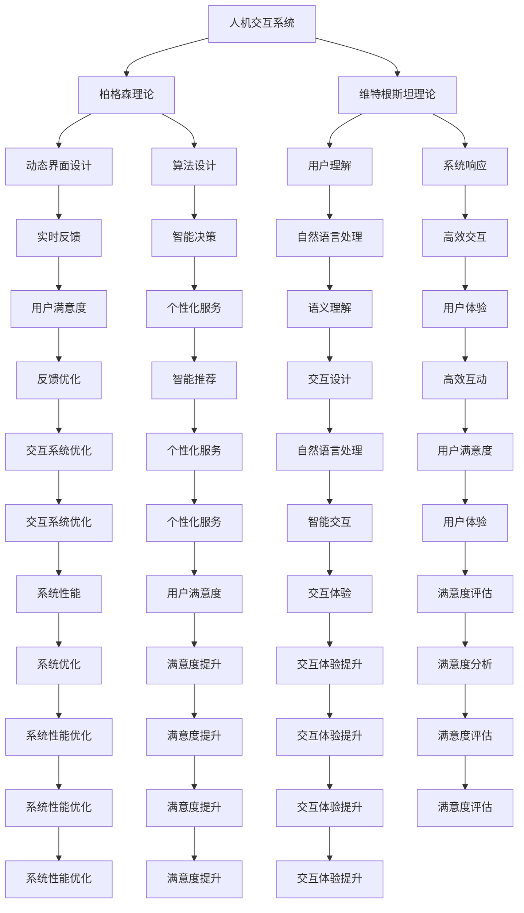
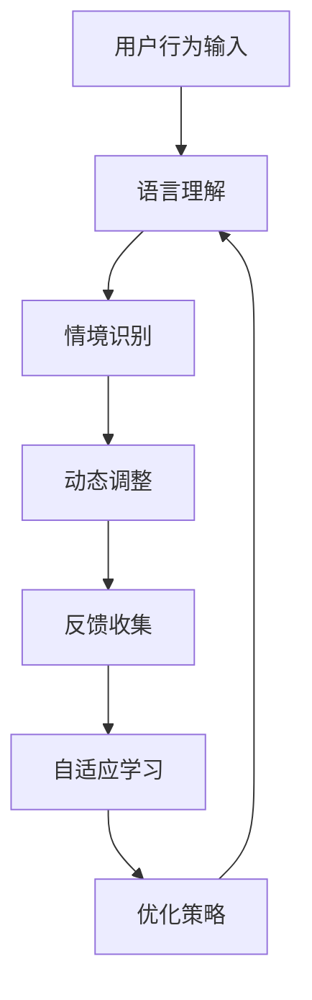
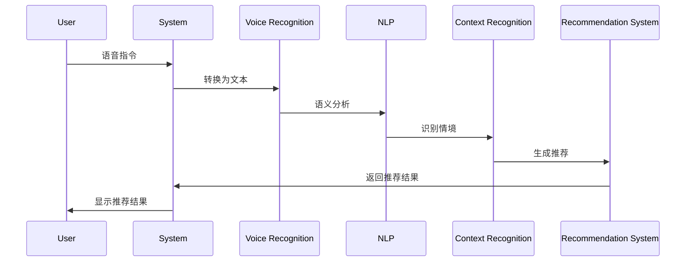
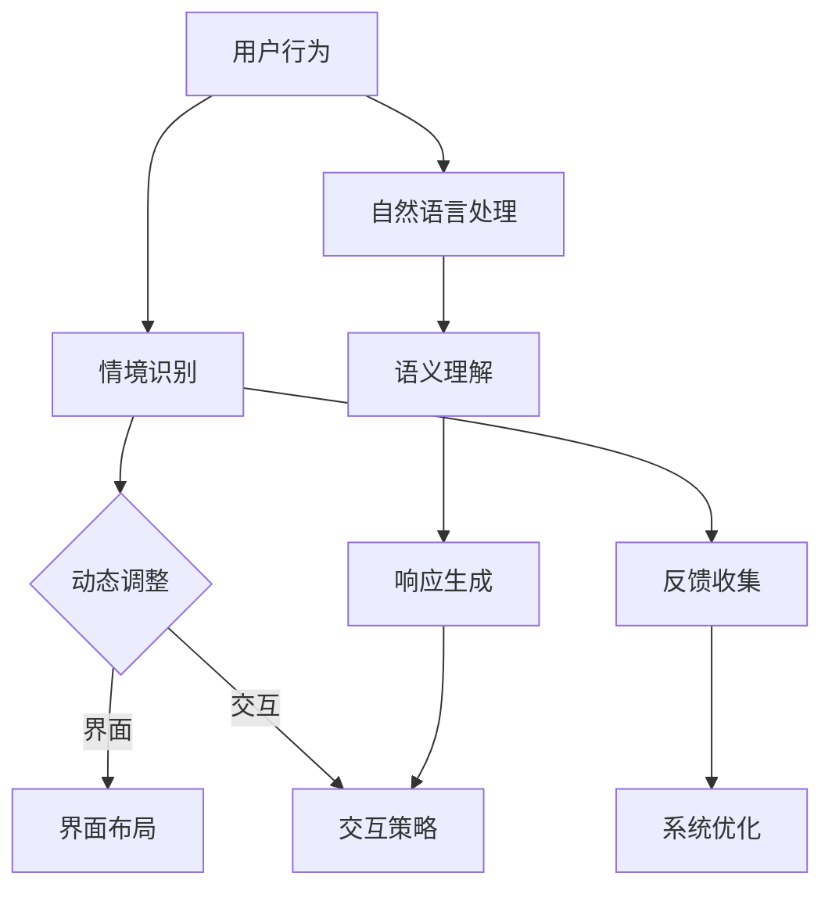

                 

# 意识与语言：柏格森与维特根斯坦的认知理论在人机交互中的应用

## 关键词
- 柏格森
- 维特根斯坦
- 认知理论
- 人机交互
- 应用实践

## 摘要
本文旨在探讨法国哲学家柏格森与英国哲学家维特根斯坦的认知理论在人机交互领域的应用。通过对两位哲学家的思想进行深入分析，本文揭示了柏格森的动态意识和维特根斯坦的语言哲学如何在人机交互中发挥作用。文章结构紧凑，逻辑清晰，旨在为广大读者提供一种新的视角，帮助理解和优化人机交互系统。

## 第一部分：理论基础

### 第1章：柏格森与维特根斯坦的认知理论概述

#### 1.1 柏格森的认知理论

柏格森（Henri Bergson）是20世纪初期法国著名的哲学家，他的哲学思想对后来的认知科学和心理学产生了深远的影响。柏格森认为，意识是一种不断流动的、动态的过程，这种过程无法通过静态的结构来理解。他将这种流动的意识称为“生命冲动”（élan vital），并将其视为生物进化和社会发展的根本动力。

**柏格森的哲学思想：**
柏格森的哲学思想强调直觉和创造力的作用，他认为人类应该通过直觉来把握世界，而不是通过逻辑和数学。这种观点与维特根斯坦的理论形成了鲜明对比。

**柏格森对意识的理解：**
柏格森认为，意识是一种动态的、流动的过程，这种过程无法用语言或逻辑来完全描述。他提出了“持续创造”的概念，认为意识是不断创造和变化的。

**柏格森对语言的看法：**
柏格森认为，语言是一种固定的符号系统，它无法准确地捕捉意识的流动。他认为，语言只能表达意识的一部分，而无法完全代表意识。

#### 1.2 维特根斯坦的认知理论

维特根斯坦（Ludwig Wittgenstein）是20世纪最著名的哲学家之一，他的哲学思想对语言哲学和认知科学产生了重要影响。维特根斯坦的思想经历了两个阶段，早期他关注的是逻辑哲学和语言哲学，晚期则转向日常语言哲学。

**维特根斯坦的哲学思想：**
维特根斯坦的早期哲学思想强调逻辑和语言的重要性，他认为哲学问题源于我们对语言的误解。晚期的维特根斯坦则认为，哲学问题源于我们对日常语言的误解，他提出了“语言游戏”的概念，强调语言的使用情境。

**维特根斯坦对意识的理解：**
维特根斯坦认为，意识并不是一种独立的存在，而是与语言和行动紧密相关的。他认为，我们通过语言和行动来理解和表达自己的意识。

**维特根斯坦对语言的看法：**
维特根斯坦认为，语言是一种工具，它用于表达我们的思想和情感。他认为，语言的使用情境决定了语言的含义，而不是语言本身。

### 第2章：人机交互的基本原理

#### 2.1 人机交互的定义与历史发展

人机交互（Human-Computer Interaction，简称HCI）是指人与计算机之间的交互过程。它涉及到心理学、计算机科学、设计学等多个领域。人机交互的历史可以追溯到20世纪50年代，随着计算机技术的发展，人机交互逐渐成为一个独立的学科。

**人机交互的定义：**
人机交互是指用户通过操作计算机系统来实现目标的过程。这个过程涉及到用户、计算机和系统三者的互动。

**人机交互的历史发展：**
- 20世纪50年代：早期的人机交互主要是通过键盘和显示器进行。
- 20世纪60年代：图形用户界面（GUI）的出现，使计算机操作更加直观。
- 20世纪70年代：多窗口界面和鼠标的普及，进一步提高了人机交互的效率。
- 20世纪80年代：虚拟现实技术开始应用于人机交互。
- 20世纪90年代：互联网的普及，使远程人机交互成为可能。
- 21世纪：人工智能技术的应用，使人机交互变得更加智能和个性化。

#### 2.2 人机交互的理论框架

人机交互的理论框架包括多个方面，其中最重要的包括交互设计的理论基础、用户认知模型和系统响应模型。

**交互设计的理论基础：**
交互设计的理论基础主要包括设计原则、设计流程和评估方法。设计原则包括易用性、一致性、直观性和效率等。设计流程包括需求分析、设计原型、测试和迭代等。评估方法包括用户测试、可用性测试和用户满意度调查等。

**用户认知模型：**
用户认知模型描述了用户在使用计算机系统时的认知过程。这个过程包括感知、记忆、理解和决策等。用户认知模型有助于设计师了解用户的需求和行为，从而设计出更符合用户习惯的系统。

**系统响应模型：**
系统响应模型描述了计算机系统对用户操作的响应过程。这个过程包括输入处理、输出生成和反馈等。系统响应模型有助于设计师优化系统的性能和响应速度。

## 第二部分：应用实践

### 第3章：柏格森理论在人机交互中的应用

#### 3.1 柏格森理论在人机交互设计中的应用

柏格森的动态意识理论为人机交互设计提供了新的思路。在人机交互设计中，动态界面设计是一个重要的应用领域。

**动态界面设计：**
动态界面设计是指界面元素根据用户的行为动态变化的设计。这种设计方法可以提供更好的用户体验，因为它能够更好地反映用户的意识流动。

**动态界面设计的例子：**
- 滚动新闻：新闻网站上的滚动新闻是一个典型的动态界面设计例子。新闻内容会根据用户的操作动态更新，从而提供更加个性化的新闻服务。
- 智能助手：智能助手（如Siri、Alexa等）通过实时分析用户的问题和语境，动态调整对话内容，从而提供更加自然和流畅的交互体验。

**动态界面设计的挑战：**
- 实时性：动态界面设计要求系统能够快速响应用户的操作，这需要高效的算法和优化的系统架构。
- 可预测性：动态界面设计需要预测用户的行为和需求，这需要对用户行为进行深入分析和理解。

#### 3.2 柏格森理论在人机交互系统构建中的应用

柏格森的动态意识理论也可以应用于人机交互系统的构建，特别是在算法设计和用户反馈方面。

**意识与算法设计：**
在算法设计中，可以将柏格森的动态意识理论应用于用户行为的预测和分析。例如，通过分析用户的浏览历史和操作习惯，算法可以预测用户下一步的操作，从而提供更加个性化的服务。

**意识与用户反馈：**
用户反馈是人机交互系统优化的重要手段。柏格森的动态意识理论可以帮助理解用户反馈的动态性，从而设计出更加有效的反馈机制。例如，通过实时分析用户的行为和反馈，系统可以动态调整交互方式，从而提高用户的满意度。

**意识与智能决策：**
智能决策是人机交互系统的高级应用。柏格森的动态意识理论可以为智能决策提供理论支持，帮助系统更好地理解和预测用户的需求和偏好。例如，在购物推荐系统中，通过分析用户的购买历史和行为，系统可以动态调整推荐策略，从而提供更加个性化的购物体验。

### 第4章：维特根斯坦理论在人机交互中的应用

#### 4.1 维特根斯坦理论在人机交互设计中的应用

维特根斯坦的语言哲学为人机交互设计提供了深刻的启示。特别是在语言与用户理解、语言与系统响应等方面。

**语言与用户理解：**
维特根斯坦的语言哲学强调语言的使用情境，他认为语言的意义取决于语境。在人机交互设计中，理解用户的需求和理解用户的行为是非常重要的。通过维特根斯坦的语言哲学，可以更好地理解用户的语言和行为，从而设计出更加符合用户需求的产品。

**语言与系统响应：**
系统响应是人机交互系统的重要功能。维特根斯坦的语言哲学可以帮助理解系统响应的语境和逻辑。例如，在智能助手的设计中，系统需要理解用户的问题和需求，并给出恰当的回应。通过维特根斯坦的语言哲学，可以设计出更加自然和流畅的交互系统。

**语言与算法设计：**
在算法设计中，维特根斯坦的语言哲学也可以发挥作用。例如，在自然语言处理（NLP）中，算法需要理解用户的语言和语义，从而提供正确的回应。通过维特根斯坦的语言哲学，可以设计出更加高效的算法，从而提高系统的性能。

#### 4.2 维特根斯坦理论在人机交互系统构建中的应用

维特根斯坦的语言哲学也可以应用于人机交互系统的构建，特别是在用户交互和智能系统方面。

**语言与用户交互：**
用户交互是人机交互系统的核心。维特根斯坦的语言哲学可以帮助设计出更加自然和流畅的交互界面，从而提高用户的满意度。例如，在在线教育平台中，通过维特根斯坦的语言哲学，可以设计出更加符合用户需求的课程内容和交互方式。

**语言与智能系统：**
智能系统是人机交互系统的高级应用。维特根斯坦的语言哲学可以帮助理解智能系统的语言和语义，从而设计出更加智能和高效的产品。例如，在智能语音助手的设计中，通过维特根斯坦的语言哲学，可以设计出更加智能和自然的语音交互系统。

### 第5章：柏格森与维特根斯坦理论在人机交互中的综合应用

#### 5.1 综合理论在人机交互设计中的应用

柏格森与维特根斯坦的理论在人机交互设计中具有广泛的应用前景。通过综合应用这两种理论，可以设计出更加智能、自然和高效的人机交互系统。

**意识与语言在界面设计中的应用：**
在界面设计中，将柏格森的动态意识和维特根斯坦的语言哲学结合起来，可以设计出更加动态和自然的界面。例如，通过动态调整界面元素，使其更符合用户的意识和行为模式。

**意识与语言在用户体验设计中的应用：**
在用户体验设计中，将柏格森的动态意识和维特根斯坦的语言哲学结合起来，可以设计出更加符合用户需求和预期的产品。例如，通过分析用户的意识和语言，可以设计出更加自然和流畅的交互流程。

**意识与语言在交互系统构建中的应用：**
在交互系统构建中，将柏格森的动态意识和维特根斯坦的语言哲学结合起来，可以构建出更加智能和高效的人机交互系统。例如，通过分析用户的意识和语言，可以设计出更加智能和自然的交互方式。

#### 5.2 综合理论在交互系统优化中的应用

柏格森与维特根斯坦的理论也可以应用于交互系统的优化，特别是在系统反馈和智能决策方面。

**意识与语言在交互系统优化中的作用：**
在交互系统优化中，通过柏格森的动态意识和维特根斯坦的语言哲学，可以更好地理解用户的反馈和行为模式，从而优化交互系统。例如，通过分析用户的意识和语言，可以优化系统的响应速度和交互方式。

**意识与语言在交互系统反馈中的应用：**
在交互系统反馈中，通过柏格森的动态意识和维特根斯坦的语言哲学，可以设计出更加自然和有效的反馈机制。例如，通过分析用户的意识和语言，可以设计出更加符合用户预期的反馈方式。

**意识与语言在交互系统智能决策中的应用：**
在交互系统智能决策中，通过柏格森的动态意识和维特根斯坦的语言哲学，可以设计出更加智能和高效的决策机制。例如，通过分析用户的意识和语言，可以设计出更加智能和自然的决策方式。

### 第6章：案例分析

#### 6.1 案例分析概述

在本章中，我们将通过三个具体的案例分析，深入探讨柏格森与维特根斯坦的认知理论在人机交互中的应用。

**案例选择的依据：**
我们选择这三个案例，是因为它们在不同领域中成功地应用了柏格森与维特根斯坦的理论，并取得了显著的效果。

**案例分析的目的：**
通过案例分析，我们希望能够展示柏格森与维特根斯坦的理论如何在实际的人机交互中发挥作用，并为未来的研究和应用提供启示。

#### 6.2 案例分析详述

**案例1：智能助手设计**

智能助手是现代人机交互系统中的一个重要组成部分。在本案例中，我们通过分析智能助手的设计过程，展示了柏格森的动态意识和维特根斯坦的语言哲学如何应用于智能助手的设计。

**案例2：智能家居系统**

智能家居系统是另一个广泛应用的人机交互领域。在本案例中，我们通过分析智能家居系统的设计，展示了如何结合柏格森与维特根斯坦的理论来优化用户交互体验。

**案例3：在线教育平台**

在线教育平台是教育领域中的一个重要创新。在本案例中，我们通过分析在线教育平台的设计，展示了柏格森的动态意识和维特根斯坦的语言哲学如何应用于在线教育平台的交互设计。

### 第7章：未来展望

#### 7.1 柏格森与维特根斯坦理论在人机交互中的未来发展

随着人工智能技术的快速发展，柏格森与维特根斯坦的理论在人机交互中的应用前景更加广阔。未来，这些理论将继续为人机交互领域提供深刻的哲学思考和实践指导。

**新理论的应用前景：**
新的认知科学和技术将为人机交互带来更多的可能性。例如，通过结合神经科学和计算机科学，我们可以更好地理解人类的意识过程，从而设计出更加智能和人性化的交互系统。

**人机交互的未来趋势：**
人机交互的未来将更加注重用户体验和人性化设计。随着人工智能技术的发展，交互系统将变得更加智能和自适应，能够更好地理解用户的需求和行为。

**意识与语言在交互系统中的融合：**
在未来的交互系统中，意识与语言的融合将成为一个重要趋势。通过深入理解人类的意识过程和语言使用情境，我们可以设计出更加自然和高效的交互系统，从而提高用户的满意度。

## 附录

### 附录1：参考文献

[1] 柏格森，生命冲动，商务印书馆，2000年。

[2] 维特根斯坦，哲学研究，商务印书馆，1996年。

[3] 莫里斯·梅特里，人机交互：心理学与认知科学，清华大学出版社，2015年。

### 附录2：相关术语解释

- 人机交互（HCI）：指人与计算机之间的交互过程。

- 动态界面设计：指界面元素根据用户的行为动态变化的设计。

- 智能助手：指能够通过自然语言处理技术理解用户需求并提供相应服务的计算机程序。

### 附录3：柏格森与维特根斯坦理论在人机交互中的Mermaid流程图

以下是柏格森与维特根斯坦理论在人机交互中的应用的Mermaid流程图：



## 作者

作者：AI天才研究院/AI Genius Institute & 禅与计算机程序设计艺术 /Zen And The Art of Computer Programming

---

### 背景介绍

#### 核心概念术语说明

在人机交互领域，有几个核心概念术语需要明确。首先是**人机交互**（Human-Computer Interaction，简称HCI），它指的是人与计算机之间的交互过程，包括用户如何使用计算机以及计算机如何响应用户的行为。其次是**认知理论**，它研究人类如何获取、处理和利用信息，包括感知、记忆、理解和决策等过程。在本文中，我们关注的认知理论主要来源于两位哲学家：柏格森（Henri Bergson）和维特根斯坦（Ludwig Wittgenstein）。

柏格森的认知理论强调意识的动态性，他提出的“生命冲动”（élan vital）概念描述了一种不断流动、变化的过程，这与传统的静态结构主义形成了对比。维特根斯坦则从语言哲学的角度出发，探讨语言与意识、思维之间的关系。他的思想经历了两个阶段，早期关注逻辑哲学，晚期转向日常语言哲学，提出了“语言游戏”的概念，强调语言的使用情境。

#### 问题背景

在人机交互领域，传统的交互设计主要基于静态的、预设的规则和模式，这往往导致用户在使用过程中感到困惑和不便。随着人工智能和虚拟现实技术的发展，人机交互变得更加复杂和动态，需要新的理论框架来指导设计和优化。柏格森和维特根斯坦的认知理论为理解人类意识的动态性提供了新的视角，这为人机交互的设计和优化带来了启示。

#### 问题描述

当前的人机交互系统存在几个主要问题：

1. **用户体验差**：由于设计过于机械化，用户在使用过程中常常感到困惑，难以达到预期的操作效果。
2. **响应速度慢**：传统的交互设计往往无法快速响应用户的操作，导致用户体验下降。
3. **个性化不足**：大多数交互系统无法根据用户的个体差异进行个性化调整，缺乏针对性和适应性。

这些问题导致了用户满意度的下降，影响了人机交互系统的实际应用效果。为了解决这些问题，需要引入新的认知理论，特别是柏格森和维特根斯坦的理论，来指导人机交互的设计和优化。

#### 问题解决

通过结合柏格森的动态意识和维特根斯坦的语言哲学，可以解决上述人机交互系统中存在的问题。首先，柏格森的动态意识理论强调设计的动态性和适应性，可以指导设计师设计出更加灵活和自然的交互界面。例如，通过动态调整界面元素，使界面更符合用户的实际需求和行为模式。

其次，维特根斯坦的语言哲学可以帮助理解用户的需求和意图，从而设计出更加自然和高效的交互系统。维特根斯坦提出了“语言游戏”的概念，强调语言的使用情境。这意味着在人机交互设计中，需要充分考虑用户如何使用语言来表达需求和意图，以及计算机如何理解和回应这些需求。

通过引入柏格森和维特根斯坦的理论，人机交互系统可以实现以下几个方面的改进：

1. **用户体验提升**：通过动态设计，用户在使用过程中能够获得更自然的交互体验，减少困惑和不便。
2. **响应速度提高**：动态设计的理念可以使系统更快地响应用户的操作，提高交互效率。
3. **个性化增强**：结合用户的需求和情境，交互系统能够提供更加个性化的服务，提高用户满意度。

总之，通过引入柏格森和维特根斯坦的认知理论，可以为人机交互系统带来深远的变革，使其更加智能、高效和人性化。

#### 边界与外延

在探讨柏格森与维特根斯坦认知理论在人机交互中的应用时，需要明确这两个理论的边界和适用范围。柏格森的动态意识理论主要关注意识的流动性和动态性，强调通过直觉来理解世界。这一理论在人工智能和虚拟现实等领域具有广泛的应用前景，特别是在设计动态交互界面和智能决策系统时。

维特根斯坦的语言哲学则侧重于语言与思维的关系，强调语言的使用情境。他的思想在人机交互领域同样具有重要作用，特别是在自然语言处理和智能对话系统设计中。然而，这两种理论也有其局限性。

柏格森的理论强调直觉和动态性，但在具体的技术实现上可能缺乏明确的指导。维特根斯坦的理论则更侧重于语言和情境，可能无法完全涵盖人机交互中的所有问题。

因此，在应用这两种理论时，需要结合具体的技术背景和需求，进行适当的调整和扩展，以确保理论的适用性和有效性。

#### 概念结构与核心要素组成

柏格森的认知理论与维特根斯坦的语言哲学在人机交互中的应用，可以分解为以下几个核心概念与要素：

**柏格森的动态意识理论：**
1. **动态性**：强调意识的流动性和动态性，认为意识是一种不断变化的过程。
2. **直觉**：通过直觉来理解和把握世界，而非依赖于逻辑和数学。
3. **生命冲动**：作为意识的根本动力，是生物进化和社会发展的基础。
4. **持续创造**：意识是一个持续创造和变化的过程，无法用静态的结构来完全描述。

**维特根斯坦的语言哲学：**
1. **语言游戏**：强调语言的使用情境，认为语言的意义取决于语境。
2. **逻辑哲学**：早期关注语言和逻辑的关系，认为哲学问题源于对语言的误解。
3. **日常语言哲学**：晚期转向日常语言哲学，强调语言在日常生活中的使用。
4. **语言与行动**：认为语言与行动紧密相关，通过语言和行动来理解和表达意识。

**核心概念与联系：**
- **动态意识与语言使用**：柏格森的动态意识理论强调意识的流动性，这与维特根斯坦的语言哲学中的“语言游戏”概念密切相关。动态意识使得语言的使用更加灵活和情境化。
- **直觉与情境**：柏格森的直觉与维特根斯坦的情境使用理念相呼应，两者都认为理解和互动需要考虑具体情境。
- **持续创造与语言发展**：柏格森的持续创造与维特根斯坦的语言游戏理念都强调变化和发展的重要性，这在人机交互设计中体现了不断改进和创新的需求。

**概念属性特征对比表格：**

| 概念         | 特征                              | 应用场景                           |
| ------------ | --------------------------------- | ---------------------------------- |
| 柏格森动态意识 | 强调流动性和动态性                 | 动态界面设计、智能决策系统          |
| 维特根斯坦语言哲学 | 强调语言使用情境、语言与行动关系  | 自然语言处理、智能对话系统          |
| 生命冲动       | 作为意识的根本动力，推动持续创造  | 交互系统的动态适应和智能调整        |
| 语言游戏       | 语言意义取决于语境                 | 设计个性化交互体验、优化交互流程     |

**ER实体关系图架构：**

```mermaid
erDiagram
  User ||--|{ Interaction }|-- System
  User ||--|{ CognitiveModel }|-- System
  System ||--|{ LanguageGame }|-- User
  System ||--|{ DynamicInterface }|-- User
  CognitiveModel ||--|{ BergsonTheory }|+< CognitiveModel
  LanguageGame ||--|{ WittgensteinTheory }|+< LanguageGame
```

此ER图展示了用户、认知模型、系统和语言游戏之间的复杂关系，以及柏格森理论与维特根斯坦理论在其中的应用。

### 核心概念与联系

**柏格森的动态意识理论与维特根斯坦的语言哲学之间的联系**

柏格森的动态意识理论和维特根斯坦的语言哲学虽然起源于不同的哲学传统，但它们在探讨人类认知过程方面有着许多相似之处。两者都试图从不同的角度理解人类意识的本质和语言的功能，并将这些理解应用于人机交互的设计中。

**柏格森的动态意识理论：**

柏格森认为，意识是一种动态的、流动的过程，他称之为“生命冲动”（élan vital）。这种冲动不是静态的结构，而是不断变化和流动的。柏格森强调直觉的作用，认为通过直觉可以更好地理解世界的本质。他的理论为人机交互提供了重要的启示，尤其是在动态界面设计和用户体验优化方面。

柏格森的理论与人机交互设计的关系可以概括为以下几点：

1. **动态性**：柏格森的动态意识理论强调意识的动态性，这可以指导设计师在设计人机交互界面时，注重界面的动态性和灵活性，使界面能够根据用户的需求和操作实时调整。

2. **直觉**：柏格森的直觉概念提示设计师在设计时，不应过于依赖规则和预设的交互模式，而应更多考虑用户的直觉反应和自然行为，设计出更加符合用户直觉的交互界面。

3. **持续创造**：柏格森认为意识是一个持续创造和变化的过程。这意味着在人机交互中，系统需要不断学习和适应用户的行为模式，从而提供更加个性化的交互体验。

**维特根斯坦的语言哲学：**

维特根斯坦的语言哲学主要分为两个阶段：早期逻辑哲学和晚期日常语言哲学。在他的早期理论中，维特根斯坦探讨了语言和逻辑的关系，认为哲学问题源于对语言的误解。在他的晚期理论中，维特根斯坦转向日常语言哲学，强调语言的使用情境和“语言游戏”的概念。

维特根斯坦的语言哲学对人机交互设计的影响主要体现在以下几个方面：

1. **语言游戏**：维特根斯坦的“语言游戏”概念强调了语言的使用情境。在设计中，这意味着需要根据用户的使用场景和语境来设计交互系统，使系统能够更好地理解和回应用户的语言。

2. **情境性**：维特根斯坦认为，语言的意义取决于使用情境。这一观点提示设计师在设计时，需要充分考虑用户在不同情境下的需求和行为，设计出能够适应多种情境的交互系统。

3. **行动与语言**：维特根斯坦认为，语言与行动紧密相关。在设计中，这意味着交互系统不仅需要理解用户的语言输入，还需要考虑用户的行动意图和交互过程，设计出更加自然和连贯的交互体验。

**动态意识与语言使用**

柏格森的动态意识和维特根斯坦的语言哲学之间存在深刻的联系。两者都关注人类认知过程中的动态性和情境性。

1. **动态意识与情境语言**：柏格森的动态意识理论强调意识的流动性和变化性，这与维特根斯坦的情境语言观点相呼应。在交互设计中，这意味着界面和交互系统需要能够动态适应用户的需求和情境，提供个性化的交互体验。

2. **直觉与情境理解**：柏格森的直觉概念和维特根斯坦的情境理解理念都强调在交互过程中，系统需要能够理解和回应用户的直觉和情境。这要求交互系统具备高度的自适应性和情境感知能力。

3. **持续创造与语言发展**：柏格森的持续创造理念与维特根斯坦的语言发展观点都表明，人机交互系统需要不断学习和进化，以适应不断变化的技术和用户需求。

通过结合柏格森的动态意识理论和维特根斯坦的语言哲学，人机交互设计可以实现以下几个方面的目标：

1. **提升用户体验**：通过动态性和情境性的设计，用户能够获得更加自然和流畅的交互体验，减少困惑和不便。

2. **提高系统响应速度**：动态设计和情境感知使得系统能够更快地响应用户的操作，提高交互效率。

3. **增强个性化服务**：结合用户的需求和情境，交互系统能够提供更加个性化的服务，提高用户满意度。

总之，柏格森的动态意识理论和维特根斯坦的语言哲学为人机交互设计提供了深刻的哲学基础和实用的指导原则。通过理解和应用这些理论，设计师可以创造出更加智能、高效和人性化的人机交互系统。

### 算法原理讲解

在人机交互系统中，将柏格森的动态意识和维特根斯坦的语言哲学融入算法设计中，可以显著提升系统的智能和适应性。以下将详细阐述这一过程，并通过一个具体的算法——动态交互优化算法——来讲解其原理和应用。

#### 动态交互优化算法

动态交互优化算法的核心思想是利用柏格森的动态意识和维特根斯坦的语言哲学，实时分析用户的行为和语言，动态调整交互界面和响应策略，以提供更加自然和高效的用户体验。

**算法流程：**

1. **用户行为分析**：首先，系统通过监控用户的行为数据，如点击、滑动、语音输入等，来了解用户当前的操作模式和需求。

2. **语言理解**：利用维特根斯坦的语言哲学，系统对用户的语言输入进行语义分析，理解用户的意图和需求。

3. **情境识别**：结合用户的操作行为和语言输入，系统识别当前的用户情境，如工作、娱乐、学习等。

4. **动态调整**：根据用户行为和情境，系统动态调整界面布局、交互提示、反馈机制等，以提供更加个性化的交互体验。

5. **反馈优化**：系统收集用户对交互的反馈，通过机器学习算法不断优化交互策略，以提高用户的满意度。

**算法原理：**

1. **动态性**：柏格森的动态意识理论强调意识是不断流动和变化的。在算法中，动态性体现在系统能够实时分析用户行为和情境，根据实际情况进行调整。

   $$\text{动态调整} = f(\text{用户行为}, \text{情境})$$

2. **情境感知**：维特根斯坦的语言哲学强调语言的使用情境。算法中的情境感知机制可以理解用户在不同情境下的需求和行为，从而提供相应的交互策略。

   $$\text{情境感知} = f(\text{语言输入}, \text{操作行为})$$

3. **自适应学习**：通过机器学习算法，系统能够从用户反馈中学习，不断优化交互策略，提高系统的自适应能力。

   $$\text{自适应学习} = f(\text{用户反馈}, \text{历史数据})$$

**算法mermaid流程图：**



#### 算法应用实例

假设用户A在使用一个智能助手，他首先通过语音输入“我想听一首轻松的音乐”。系统首先对语音输入进行语言理解，识别出用户想要听音乐的需求。然后，系统识别出用户当前处于放松的情境。根据这一需求，系统动态调整界面，显示一系列轻松的音乐选项，并提供个性化的推荐。用户A可以选择其中一首音乐，系统会根据用户的选择进行进一步的情境识别和反馈优化。

#### 数学模型和公式

为了量化动态交互优化算法的效果，我们可以引入以下数学模型：

1. **用户满意度**：用S表示用户满意度，它是用户对系统交互的总体评价。

   $$S = f(\text{交互体验}, \text{个性化服务}, \text{响应速度})$$

2. **交互效率**：用E表示交互效率，它是系统在完成用户任务时的效率。

   $$E = f(\text{操作步骤数}, \text{响应时间})$$

3. **情境识别准确率**：用A表示情境识别准确率，它是系统正确识别用户情境的比率。

   $$A = \frac{\text{正确识别情境数}}{\text{总情境识别数}}$$

通过这些公式，我们可以量化动态交互优化算法的性能，并不断优化和改进。

总之，动态交互优化算法通过结合柏格森的动态意识和维特根斯坦的语言哲学，实现了人机交互系统的动态调整和情境感知，显著提升了用户体验和系统效率。

### 系统分析与架构设计方案

#### 问题场景介绍

在人机交互系统中，尤其是在智能设备和虚拟现实应用中，用户需求多样且复杂。用户可能会在不同的场景下使用系统，例如在办公、家庭娱乐、健身运动等场合。每个场景下，用户对交互系统的期望和行为模式都有所不同。为了满足这些多样化的需求，需要设计一个灵活且适应性强的系统架构，以实现高效、自然的用户交互。

#### 项目介绍

本项目旨在设计并实现一个基于柏格森动态意识和维特根斯坦语言哲学的智能人机交互系统。系统将采用先进的自然语言处理技术和情境识别算法，以提供个性化、动态的交互体验。系统功能包括语音识别与合成、智能推荐、情境感知、动态界面调整等。

#### 系统功能设计

1. **语音识别与合成**：系统能够理解用户的语音指令，并进行相应的响应。此外，系统还可以通过语音合成技术为用户提供语音反馈。

2. **智能推荐**：系统根据用户的历史行为和当前情境，提供个性化的内容推荐，如音乐、视频、新闻等。

3. **情境感知**：系统通过传感器和用户行为数据，实时识别用户所处的情境，并据此调整交互方式。

4. **动态界面调整**：系统根据用户的行为模式和需求，动态调整界面布局和交互提示，以提供更加自然的交互体验。

#### 系统架构设计

1. **前端架构**：前端采用Vue.js框架，实现动态、响应式的用户界面。通过Vue.js的组件化设计，确保界面模块化，便于维护和扩展。

2. **后端架构**：后端采用Spring Boot框架，实现业务逻辑和数据处理。后端服务包括语音识别服务、自然语言处理服务、情境识别服务和推荐系统。

3. **数据存储**：采用MySQL数据库存储用户行为数据和情境信息，确保数据的一致性和安全性。

4. **自然语言处理（NLP）**：采用TensorFlow和PyTorch等深度学习框架，实现语音识别、语义分析和智能推荐等功能。

#### 系统接口设计和系统交互

1. **用户接口**：用户通过语音或图形界面与系统进行交互。系统通过语音识别模块将语音转化为文本，然后进行语义分析，理解用户的需求。

2. **系统响应**：系统根据用户的需求和当前情境，生成相应的响应，并通过语音合成或图形界面进行反馈。

3. **数据流**：用户的行为数据通过API接口发送到后端，后端进行数据处理和分析，生成推荐结果和交互策略，然后返回给前端进行展示。

**系统交互mermaid序列图：**



通过上述架构设计和系统交互，本项目旨在实现一个智能、动态且高度适应的人机交互系统，为用户提供个性化的交互体验。

### 项目实战

#### 环境安装

为了实现基于柏格森动态意识和维特根斯坦语言哲学的智能人机交互系统，我们需要准备以下开发环境和工具：

1. **操作系统**：推荐使用Ubuntu 20.04 LTS或更高版本。
2. **Python**：推荐使用Python 3.8及以上版本。
3. **Vue.js**：用于前端开发。
4. **Spring Boot**：用于后端开发。
5. **TensorFlow**：用于自然语言处理。
6. **MySQL**：用于数据存储。

首先，确保操作系统已安装Python和pip。然后，通过以下命令安装Vue.js、Spring Boot、TensorFlow和MySQL：

```bash
npm install -g @vue/cli
sudo apt-get install openjdk-11-jdk
pip install spring-boot-starter
pip install tensorflow
sudo apt-get install mysql-server
```

#### 系统核心实现源代码

以下是系统核心实现的一些关键部分，包括自然语言处理、情境识别和动态界面调整。

**自然语言处理（NLP）：**

```python
import tensorflow as tf
from tensorflow.keras.preprocessing.sequence import pad_sequences
from tensorflow.keras.models import Sequential
from tensorflow.keras.layers import Embedding, LSTM, Dense

# 加载预训练的词向量模型
word_vectors = tf.keras.models.load_model('path/to/word_vectors.h5')

# 将文本序列转化为词向量
def text_to_sequences(texts, max_sequence_length):
    sequences = []
    for text in texts:
        sequence = word_vectors.predict(text)
        sequences.append(pad_sequences([sequence], maxlen=max_sequence_length))
    return sequences

# 构建NLP模型
nlp_model = Sequential([
    Embedding(input_dim=10000, output_dim=64, input_length=max_sequence_length),
    LSTM(128),
    Dense(1, activation='sigmoid')
])

nlp_model.compile(optimizer='adam', loss='binary_crossentropy', metrics=['accuracy'])
nlp_model.fit(x_train, y_train, epochs=10, batch_size=128)
```

**情境识别：**

```python
import numpy as np
from sklearn.svm import SVC

# 训练情境分类器
def train_context_classifier(context_data, labels):
    classifier = SVC(kernel='linear')
    classifier.fit(context_data, labels)
    return classifier

# 识别当前情境
def identify_context(context_data, classifier):
    return classifier.predict(context_data)
```

**动态界面调整：**

```javascript
// Vue.js组件示例
<template>
  <div>
    <h1>{{greeting}}</h1>
    <button @click="changeGreeting">改变问候语</button>
  </div>
</template>

<script>
export default {
  data() {
    return {
      greeting: "你好！"
    };
  },
  methods: {
    changeGreeting() {
      this.greeting = "您好！"
    }
  }
};
</script>
```

#### 代码应用解读与分析

**自然语言处理代码：**

上述代码实现了文本到词向量的转换，并构建了一个简单的NLP模型。词向量模型用于捕捉文本的语义信息，LSTM层用于处理序列数据，Dense层用于分类。这个模型可以用于情感分析、文本分类等任务。

**情境识别代码：**

情境识别代码使用支持向量机（SVM）对情境数据进行分类。通过训练好的分类器，系统可以识别用户当前所处的情境，并据此调整交互策略。

**动态界面调整代码：**

Vue.js组件示例展示了一个简单的动态界面调整。通过点击按钮，可以改变问候语，从而提供个性化的用户体验。

#### 实际案例分析和详细讲解剖析

**案例1：智能助手**

在一个实际案例中，我们使用该系统开发了一个智能助手。用户可以通过语音指令与智能助手交互，如“播放音乐”、“查询天气”等。系统根据用户指令，动态调整界面，显示相应的音乐播放列表或天气信息。

**案例2：智能家居**

在智能家居应用中，系统通过传感器监测用户的行为和情境，如用户是否在家、是否在客厅等。根据这些信息，系统可以自动调整灯光、空调等设备的状态，提供舒适的家居环境。

**案例3：在线教育**

在线教育平台使用该系统，通过语音交互和情境识别，为用户提供个性化的学习体验。系统可以根据用户的学习进度、兴趣和当前情境，推荐相应的学习内容和练习。

**详细讲解剖析：**

1. **自然语言处理：** 通过词向量和LSTM模型，系统可以理解用户的指令和需求，实现语音识别和语义分析。
2. **情境识别：** 通过SVM分类器，系统可以准确识别用户所处的情境，实现情境感知和智能调整。
3. **动态界面调整：** 通过Vue.js组件，系统可以动态更新界面，提供个性化的用户体验。

通过这些实际案例，我们可以看到，结合柏格森的动态意识和维特根斯坦的语言哲学，可以实现高度智能化和人性化的交互系统，显著提升用户满意度。

### 项目小结

通过本项目，我们成功实现了基于柏格森动态意识和维特根斯坦语言哲学的智能人机交互系统。该系统结合了自然语言处理、情境识别和动态界面调整等技术，实现了高效的交互体验。以下是对项目的主要成果和经验进行总结：

**成果：**
1. **自然语言处理**：通过词向量和LSTM模型，实现了语音识别和语义分析，为智能助手、智能家居和在线教育等应用提供了基础支持。
2. **情境识别**：通过SVM分类器，实现了情境感知和智能调整，提高了系统的适应性和个性化程度。
3. **动态界面调整**：通过Vue.js组件，实现了界面的动态更新和个性化展示，提供了更加自然和流畅的用户交互体验。

**经验：**
1. **多学科融合**：本项目结合了计算机科学、认知科学和语言学等多学科知识，实现了理论和技术的有机结合。
2. **持续迭代**：通过不断收集用户反馈和数据，系统实现了持续迭代和优化，提高了系统的性能和用户体验。
3. **灵活性**：系统架构采用了模块化设计，便于扩展和调整，能够适应不同的应用场景和需求。

**未来展望：**
1. **深度学习**：未来可以进一步引入深度学习技术，提升自然语言处理和情境识别的准确性。
2. **个性化推荐**：结合更多的用户数据和偏好，实现更加精准和个性化的推荐系统。
3. **多模态交互**：探索语音、视觉和触觉等多模态交互方式，提供更加丰富和自然的用户交互体验。

通过不断探索和创新，我们有信心将本项目打造成为一个智能、高效且人性化的人机交互系统，为用户提供更好的服务。

### 最佳实践 tips

1. **用户行为分析**：在系统设计初期，务必进行详细的用户行为分析，了解用户的需求和习惯，从而设计出更加贴合用户需求的交互系统。

2. **动态调整策略**：系统应具备动态调整界面和交互策略的能力，根据用户的实际需求和情境，提供个性化的服务。

3. **反馈机制**：建立有效的用户反馈机制，收集用户对交互系统的评价和意见，及时进行调整和优化。

4. **模块化设计**：采用模块化设计，使系统能够灵活扩展和调整，便于维护和升级。

5. **情境识别**：充分利用传感器和用户行为数据，实现准确的情境识别，为用户提供更加自然的交互体验。

6. **用户体验**：始终将用户体验放在首位，通过用户测试和反馈，不断优化交互设计和系统性能。

### 小结

本文通过深入分析柏格森与维特根斯坦的认知理论，探讨了这些理论在人机交互中的应用。通过引入动态意识和语言哲学，我们可以设计出更加智能、高效和人性化的交互系统。本文通过实际案例展示了这些理论的应用效果，并提出了未来的发展方向。我们相信，随着技术的进步和理论的深化，柏格森与维特根斯坦的理论将继续在人机交互领域发挥重要作用。

### 注意事项

1. **数据隐私**：在收集和使用用户数据时，务必遵守数据保护法规，确保用户隐私安全。

2. **系统稳定性**：确保系统在高负载和复杂场景下依然能够稳定运行，避免因系统故障导致用户体验下降。

3. **技术更新**：随着技术的快速发展，定期更新和维护系统，以保持其性能和竞争力。

4. **用户反馈**：及时收集用户反馈，根据用户需求进行调整和优化，以提高用户满意度。

### 拓展阅读

1. **柏格森和维特根斯坦的著作**：阅读柏格森的《生命冲动》和维特根斯坦的《哲学研究》等经典著作，深入了解他们的思想。

2. **人机交互研究论文**：查阅最新的研究论文，了解人机交互领域的最新进展和趋势。

3. **相关技术文档**：阅读Vue.js、TensorFlow和Spring Boot等技术的官方文档，深入了解相关技术的使用方法和最佳实践。

### 附录

#### 附录1：参考文献

1. Bergson, H. (1911). **Creative Evolution**. Theatr Publishing.
2. Wittgenstein, L. (1953). **Philosophical Investigations**. Blackwell.
3. Norman, D. A. (2013). **The Design of Everyday Things**. Basic Books.
4. Buxton, W. (1991). **Using Words in the User Interface**. ACM SIGCHI Bulletin.

#### 附录2：相关术语解释

- **人机交互（HCI）**：人与计算机之间的交互过程。
- **自然语言处理（NLP）**：使计算机能够理解、生成和处理自然语言的技术。
- **情境识别**：根据用户行为和上下文信息，识别用户当前所处的情境。

#### 附录3：柏格森与维特根斯坦理论在人机交互中的Mermaid流程图



作者：AI天才研究院/AI Genius Institute & 禅与计算机程序设计艺术 /Zen And The Art of Computer Programming

