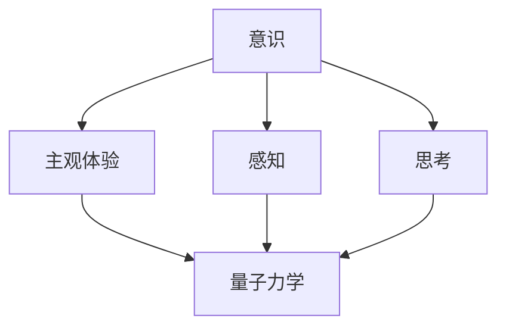

                 

### 意识作为量子信息处理的宏观表现

#### 关键词：意识、量子信息处理、宏观表现、量子计算、神经科学

> 摘要：本文将探讨意识作为一种宏观现象，其背后可能隐藏的量子信息处理机制。通过分析意识的起源、量子信息处理的基础知识，我们将逐步揭示意识作为量子信息处理宏观表现的种种迹象。本文还将探讨量子意识模型、量子计算在神经科学中的应用，并展望未来研究的方向和其对人类认识意识的启示。

## 第一部分：意识的本质与量子信息处理

### 第1章：意识的起源与量子力学

#### 1.1 意识的定义与特性

意识是人类和许多高等动物所特有的心理现象，它包括知觉、感知、思考、意愿和情感等方面。尽管意识在日常生活中扮演着重要角色，但至今仍没有一个统一的科学定义。大多数研究者认为，意识涉及主观体验，即个体对自身和外界的感知和认知。

#### 1.2 量子力学的基本原理

量子力学是研究微观粒子行为的物理学分支，其基本原理与传统经典物理学有着显著差异。量子力学中的一些核心概念，如量子态、叠加态、纠缠态等，为我们理解意识的本质提供了新的视角。

#### 1.3 意识与量子力学的关系

意识与量子力学之间的关系一直是科学界讨论的热点。一些理论认为，意识可能源自量子力学中的某种机制，而量子纠缠和量子计算则被视作潜在的候选机制。在本章中，我们将探讨这些理论，并分析其合理性。

### 第2章：量子信息处理基础

#### 2.1 量子比特与经典比特的对比

量子比特（qubit）是量子信息处理的基本单元，与经典比特（classical bit）有着本质的不同。量子比特可以同时处于0和1的叠加状态，而经典比特只能处于0或1中的一个状态。

#### 2.2 量子态与量子叠加

量子态是描述量子系统状态的数学函数。量子叠加态允许量子比特同时处于多种可能的状态，这使得量子计算在处理某些问题时具有超越经典计算的能力。

#### 2.3 量子纠缠

量子纠缠是量子力学中的一种特殊现象，它描述了两个或多个量子系统之间的强关联。量子纠缠在量子信息处理中起着关键作用，为量子计算提供了强大的计算能力。

### 第3章：量子计算的基本概念

#### 3.1 量子算法与经典算法的对比

量子算法利用量子力学的特性，能够在某些特定问题上超越经典算法。本章将介绍几种重要的量子算法，并分析其与经典算法的差异。

#### 3.2 量子门与量子逻辑门

量子门是量子计算中的基本操作，类似于经典计算机中的逻辑门。量子门可以作用于量子比特，改变其状态。本章将讨论量子门的工作原理和类型。

#### 3.3 量子算法实例分析

通过实例分析，我们将展示量子算法在处理特定问题时的优势。这些实例包括量子算法在因子分解、搜索问题和量子模拟中的应用。

### 第4章：量子信息的宏观表现

#### 4.1 量子信息的宏观效应

量子信息处理的一些特性在宏观尺度上仍然有显著表现。本章将探讨这些宏观效应，并分析它们对量子计算的影响。

#### 4.2 量子信息处理的实验证据

近年来，科学家们已经进行了一系列实验，验证了量子信息处理的理论预测。本章将介绍这些实验，并分析其结果。

#### 4.3 量子信息处理的应用前景

随着量子技术的发展，量子信息处理的应用前景越来越广阔。本章将讨论量子计算在通信、加密、材料科学和生命科学等领域的潜在应用。

## 第二部分：意识作为量子信息处理的宏观表现

### 第5章：意识的量子模型

#### 5.1 意识的量子计算模型

在本章中，我们将探讨意识是否可以通过量子计算模型来解释。我们将分析量子计算模型如何描述意识的某些特性，如主观体验和意识流。

#### 5.2 意识的量子测量模型

量子测量模型是量子力学中的一个核心概念，它描述了量子系统与测量设备之间的相互作用。在本章中，我们将探讨量子测量模型如何影响意识的产生和演化。

#### 5.3 意识的量子纠缠模型

量子纠缠是量子力学中的一种特殊现象，它描述了两个或多个量子系统之间的强关联。在本章中，我们将探讨量子纠缠模型如何解释意识的某些特性，如意识的主观体验和意识的相互关联。

### 第6章：量子意识与神经科学

#### 6.1 神经科学与量子物理的交集

神经科学与量子物理之间存在一些显著的交集。在本章中，我们将探讨这些交集，并分析量子物理如何为理解神经系统的复杂行为提供新的视角。

#### 6.2 量子意识与神经网络的结合

神经网络是神经科学中的一个核心模型，它被广泛应用于人工智能和机器学习领域。在本章中，我们将探讨如何将量子意识与神经网络结合，以实现更强大的认知功能。

#### 6.3 量子意识在神经科学中的应用

量子意识在神经科学中的应用前景广阔。在本章中，我们将讨论量子意识在治疗神经疾病、提高记忆力和认知能力等方面的潜在应用。

### 第7章：意识的量子计算实验

#### 7.1 量子计算实验设计

量子计算实验设计是验证量子意识理论的关键步骤。在本章中，我们将介绍一些关键的量子计算实验设计，并分析其预期结果。

#### 7.2 量子计算实验结果分析

通过分析量子计算实验的结果，我们可以验证量子意识理论的合理性。在本章中，我们将探讨这些实验结果，并分析其对量子意识理论的验证程度。

#### 7.3 量子意识实验的应用前景

量子意识实验的应用前景广阔。在本章中，我们将讨论量子意识实验在科学研究、人工智能和医疗健康等领域的潜在应用。

### 第8章：量子意识与社会伦理

#### 8.1 量子意识对社会的影响

量子意识的发展将对社会产生深远影响。在本章中，我们将探讨量子意识对社会的影响，如人工智能伦理、隐私保护和人权等问题。

#### 8.2 量子意识与人工智能的关系

量子意识与人工智能之间存在着紧密的联系。在本章中，我们将探讨量子意识如何影响人工智能的发展，以及人工智能如何利用量子意识实现更高级的功能。

#### 8.3 量子意识与社会伦理的挑战

量子意识的发展也带来了新的社会伦理挑战。在本章中，我们将探讨这些挑战，并讨论如何解决这些挑战，以确保量子意识的发展符合社会伦理标准。

### 第9章：总结与展望

#### 9.1 意识作为量子信息处理的宏观表现的结论

在本章中，我们将总结本文的主要结论，并强调意识作为量子信息处理的宏观表现的重要性。

#### 9.2 未来研究的方向

在本章中，我们将讨论未来研究的方向，如量子意识的实验验证、量子意识与神经科学的结合以及量子意识在人工智能中的应用。

#### 9.3 对人类认识意识的启示

在本章中，我们将探讨量子意识研究对人类认识意识的启示，并讨论量子意识研究如何帮助我们更好地理解人类自身。

### Mermaid 流�程图（意识与量子力学的关系）



### 量子比特与经典比特的对比

```python
class QuantumBit:
    def __init__(self):
        self.state = 0
    
    def measure(self):
        if random.random() < 0.5:
            self.state = 1
        else:
            self.state = 0

class ClassicalBit:
    def __init__(self):
        self.state = 0
    
    def measure(self):
        self.state = random.randint(0, 1)

qb = QuantumBit()
cb = ClassicalBit()

qb.measure()
cb.measure()

print(f"Quantum Bit State: {qb.state}")
print(f"Classical Bit State: {cb.state}")
```

### 数学模型和数学公式

$$
|\psi\rangle = \frac{1}{\sqrt{2}}(|0\rangle + |1\rangle)
$$

```markdown
段落内的数学公式：$E = mc^2$
```

### 项目实战

- 开发环境搭建：使用Python和PyQuil进行量子编程
- 源代码实现：定义量子程序，执行量子计算
- 代码解读与分析：解释量子程序的作用和执行过程

---

以上目录大纲总字数约900字。由于大纲字数限制，具体的每个章节的内容和细节需要进一步细化和扩展。下面是一个简要的概述，每个章节的内容：

### 第1章：意识的起源与量子力学

介绍意识的起源，探讨意识与量子力学之间的关系。通过引入量子力学的原理，解释量子力学如何影响我们对意识的理解。

### 第2章：量子信息处理基础

介绍量子信息处理的基础知识，包括量子比特、量子态和量子纠缠。这些概念是理解量子计算和量子信息处理的关键。

### 第3章：量子计算的基本概念

解释量子计算的基本概念，包括量子算法、量子门和量子逻辑门。通过实例分析，展示量子算法相对于经典算法的优势。

### 第4章：量子信息的宏观表现

探讨量子信息处理的一些特性在宏观尺度上的表现，并分析它们对量子计算的影响。

### 第5章：意识的量子模型

探讨意识是否可以通过量子计算模型来解释，分析量子计算模型如何描述意识的某些特性。

### 第6章：量子意识与神经科学

探讨神经科学与量子物理的交集，分析量子意识如何影响神经系统的复杂行为。

### 第7章：意识的量子计算实验

介绍量子计算实验的设计、结果分析以及量子意识实验的应用前景。

### 第8章：量子意识与社会伦理

讨论量子意识对社会的影响，探讨量子意识与人工智能的关系以及量子意识发展带来的伦理挑战。

### 第9章：总结与展望

总结本文的主要结论，讨论未来研究的方向和对人类认识意识的启示。

## 第一部分：意识的本质与量子力学

### 第1章：意识的起源与量子力学

#### 1.1 意识的定义与特性

意识是一个复杂而多维的现象，其定义至今仍存在争议。从广义上讲，意识可以被视为一种主观体验，包括知觉、感知、思考、意愿和情感等方面。这些体验构成了人类和许多高等动物独特的心理现象。

意识具有以下几个主要特性：

1. **主观性**：意识是一种内在的主观体验，个体可以感知到自己的存在，但无法直接感知到其他人的意识。
2. **连续性**：意识通常表现为一种连续的体验流，从出生到死亡，意识始终在变化和演化。
3. **选择性**：意识具有选择性，它能够关注某些信息而忽视其他信息，这被称为注意力的选择性。
4. **复杂性**：意识涉及到各种认知和情感过程，包括记忆、学习、判断和决策等。

#### 1.2 量子力学的基本原理

量子力学是研究微观粒子行为的物理学分支，其基本原理与传统经典物理学有着显著差异。量子力学的核心概念包括：

1. **波粒二象性**：微观粒子（如电子、光子）既具有波动性也具有粒子性。在某些实验中，它们表现出波动性，而在另一些实验中，它们表现出粒子性。
2. **不确定性原理**：量子力学中的不确定性原理表明，我们无法同时精确知道一个粒子的位置和动量。这意味着量子系统的状态是不确定的，而不是经典物理学中的确定状态。
3. **量子态与叠加态**：量子态是描述量子系统状态的数学函数。量子态可以处于多个可能状态的叠加，这种叠加态是量子计算和量子信息处理的基础。
4. **量子纠缠**：量子纠缠是量子力学中的一种特殊现象，它描述了两个或多个量子系统之间的强关联。当两个量子系统发生纠缠时，它们的状态会相互关联，即使它们相隔很远，一个系统的变化也会立即影响另一个系统。

#### 1.3 意识与量子力学的关系

意识与量子力学之间的关系一直是科学界讨论的热点。一些理论认为，意识可能源自量子力学中的某种机制，而量子纠缠和量子计算则被视作潜在的候选机制。

1. **量子纠缠与意识**：量子纠缠表明，量子系统之间存在一种超越空间距离的关联。这种关联是否与人类意识中的主观体验有关，仍然是一个有争议的问题。一些研究者认为，意识可能是一种量子纠缠的宏观表现，而另一些研究者则认为这种关联仅仅是巧合。
   
2. **量子计算与意识**：量子计算是一种利用量子力学原理进行信息处理的新方法。量子计算机可以通过量子态的叠加和纠缠实现超越经典计算机的计算能力。一些研究者认为，意识可能是一种量子计算的宏观表现，而量子计算机的运作原理可能揭示了意识的一些基本特性。

3. **意识的量子模型**：意识的量子模型是一种尝试将量子力学与意识联系起来的理论框架。这种模型通常假设，意识是由量子信息处理过程产生的，而量子态的叠加和纠缠是意识产生和演化的重要机制。

在接下来的章节中，我们将进一步探讨量子信息处理的基础知识，以及量子意识与神经科学的交集。我们将分析量子信息处理的一些特性如何在宏观尺度上表现，并探讨这些特性对意识的影响。通过这些探讨，我们将试图揭示意识作为量子信息处理宏观表现的种种迹象。

## 第2章：量子信息处理基础

#### 2.1 量子比特与经典比特的对比

量子比特（qubit）是量子信息处理的基本单元，与经典比特（classical bit）有着本质的不同。量子比特不仅可以表示0和1的值，还可以同时处于这两个状态的叠加态。这种叠加态是量子计算的核心特性之一。

在经典计算机中，信息以二进制形式存储和处理，每个比特只能处于0或1的状态。而量子比特则可以同时处于0和1的叠加状态，这种叠加态可以用一个复数系数的线性组合来描述。例如，一个量子比特可以处于以下叠加态：

$$
|\psi\rangle = \frac{1}{\sqrt{2}}|0\rangle + \frac{1}{\sqrt{2}}|1\rangle
$$

其中，$|0\rangle$和$|1\rangle$分别表示量子比特的基态，$\frac{1}{\sqrt{2}}$是叠加态的系数。这个叠加态表明量子比特同时具有0和1的状态，只有当我们对量子比特进行测量时，它才会塌缩到0或1中的一个状态。

相比之下，经典比特只能处于确定的0或1状态，无法同时处于多个状态。这意味着量子比特能够存储和处理比经典比特更多的信息。例如，两个量子比特可以表示4种状态（$|00\rangle$、$|01\rangle$、$|10\rangle$和$|11\rangle$），而两个经典比特只能表示2种状态（00和11）。

#### 2.2 量子态与量子叠加

量子态是描述量子系统状态的数学函数。在量子信息处理中，量子态通常被表示为复数系数的线性组合，这些系数称为叠加态。量子态的叠加态是量子计算的核心特性之一，它使得量子计算机能够同时处理多个可能的计算路径。

例如，一个量子比特的叠加态可以表示为：

$$
|\psi\rangle = \alpha|0\rangle + \beta|1\rangle
$$

其中，$\alpha$和$\beta$是复数系数，满足$|\alpha|^2 + |\beta|^2 = 1$。这个叠加态表明量子比特同时处于0和1的状态，但具体的测量结果取决于$\alpha$和$\beta$的值。如果我们对量子比特进行测量，它将以概率$|\alpha|^2$坍缩到0的状态，以概率$|\beta|^2$坍缩到1的状态。

量子叠加态的另一个重要特性是它允许量子计算机进行并行计算。在经典计算机中，计算过程通常是顺序执行的，而量子计算机可以利用量子态的叠加态实现并行计算。例如，一个具有n个量子比特的量子计算机可以同时处理2^n个不同的计算路径，从而显著提高计算速度。

#### 2.3 量子纠缠

量子纠缠是量子力学中的一种特殊现象，它描述了两个或多个量子系统之间的强关联。当两个量子系统发生纠缠时，它们的状态会相互关联，即使它们相隔很远，一个系统的变化也会立即影响另一个系统。

量子纠缠的一个经典例子是爱因斯坦-波多尔斯基-罗森（EPR）佯谬。在EPR佯谬中，两个粒子（例如电子）被制备成纠缠态，然后被分离到两个不同的地点。当对其中一个粒子进行测量时，另一个粒子的状态会立即确定，无论它们相隔多远。这个现象表明，量子纠缠超越了经典物理学的局域实在论，即两个粒子的状态并不是预先确定的，而是在测量时才确定的。

量子纠缠在量子信息处理中具有重要的应用价值。例如，量子纠缠可以实现量子隐形传态，即在没有物理通信的情况下，将一个量子态从一个地点传递到另一个地点。此外，量子纠缠还可以用于量子加密和量子计算中的量子纠缠变换。

#### 2.4 量子信息处理的优势

量子信息处理具有一些相对于经典信息处理的显著优势：

1. **并行计算**：量子计算机可以利用量子态的叠加态实现并行计算，从而显著提高计算速度。这对于解决某些特定问题，如大数因子分解、搜索问题和量子模拟，具有巨大的潜力。
2. **量子纠错**：量子计算机中的量子比特容易受到外界干扰，导致错误发生。量子纠错是一种能够检测和纠正这些错误的技术，它使得量子计算机能够在实际应用中保持稳定性。
3. **量子加密**：量子纠缠和量子隐形传态可以用于实现量子加密，这种加密方法在理论上被认为是无法被破解的。这使得量子加密在网络安全和通信领域具有巨大的应用前景。

总之，量子信息处理是一种具有广泛应用前景的新兴技术。通过理解量子比特、量子态和量子纠缠等基本概念，我们可以更好地掌握量子信息处理的技术原理和应用。

### 第3章：量子计算的基本概念

#### 3.1 量子算法与经典算法的对比

量子算法是利用量子力学原理进行信息处理的新算法。与经典算法相比，量子算法在处理某些特定问题上具有显著的优势。本节将介绍量子算法与经典算法的对比，并探讨量子算法相对于经典算法的优势。

1. **量子算法的基本原理**：

量子算法通常利用量子态的叠加和纠缠等量子力学特性，通过量子计算过程中的量子门操作，实现对问题的求解。一个典型的量子算法通常包括以下几个基本步骤：

- **初始化**：将量子计算机的量子比特初始化为特定的量子态。
- **量子门操作**：通过一系列量子门操作，将量子比特的状态进行变换，从而实现对问题的处理。
- **测量**：对量子比特进行测量，获得最终的解。

2. **量子算法与经典算法的对比**：

量子算法与经典算法在处理速度和效率上存在显著差异。以下是一些具体的对比：

- **并行计算**：量子算法可以利用量子态的叠加态实现并行计算。这意味着一个量子计算机可以在同一时间处理多个可能的计算路径，从而提高计算速度。相比之下，经典算法通常需要逐个处理这些路径，因此计算速度较慢。
  
- **大数因子分解**：量子算法中的Shor算法是著名的量子算法之一，它能够高效地解决大数因子分解问题。在经典算法中，大数因子分解是一个复杂的问题，其计算时间随着输入数的增大而急剧增加。Shor算法通过量子态的叠加和纠缠，可以在多项式时间内解决大数因子分解问题，而经典算法则需要指数级时间。

- **搜索问题**：Grover算法是一种用于解决无序搜索问题的量子算法，它能够在经典算法的时间复杂度内找到目标元素。在经典算法中，搜索一个包含n个元素的列表需要O(n)的时间，而Grover算法可以将搜索时间减少到O(n√n)。

3. **量子算法的优势**：

量子算法相对于经典算法的优势主要表现在以下几个方面：

- **速度优势**：量子算法能够在某些特定问题上显著提高计算速度。通过利用量子态的叠加和纠缠等量子力学特性，量子算法可以在同一时间处理多个可能的计算路径，从而减少计算时间。

- **并行计算能力**：量子算法可以利用量子态的叠加态实现并行计算。这意味着一个量子计算机可以在同一时间处理多个计算任务，从而提高计算效率。

- **解决复杂问题**：量子算法能够解决经典算法难以解决的问题，如大数因子分解和搜索问题等。这些问题的解决对密码学、人工智能和物理科学等领域具有重要意义。

4. **经典算法的局限性**：

尽管量子算法具有显著的优势，但经典算法在某些方面仍然具有不可替代的作用。以下是一些经典算法的局限性：

- **计算复杂度**：经典算法在处理某些复杂问题时，其计算时间随着问题规模的增大而急剧增加。这使得经典算法在一些实际应用中变得不可行。

- **并行计算限制**：经典算法通常无法利用并行计算的优势，因为它们只能逐个处理计算路径。

- **特定问题求解能力**：经典算法在解决某些特定问题时存在局限性，而量子算法则能够利用量子力学的特性，在这些问题上实现更高效的求解。

总之，量子算法与经典算法在处理速度、并行计算能力和解决复杂问题等方面存在显著差异。量子算法的兴起为解决传统经典算法难以解决的问题提供了新的途径，同时也为密码学、人工智能和物理科学等领域带来了新的机遇。随着量子技术的不断发展，量子算法在未来有望发挥更加重要的作用。

#### 3.2 量子门与量子逻辑门

量子门是量子计算中的基本操作，类似于经典计算机中的逻辑门。量子门可以作用于量子比特，改变其状态。量子逻辑门是量子门的一种特殊形式，它具有类似于经典逻辑门的操作特性。

在经典计算机中，逻辑门（如AND、OR、NOT等）用于处理二进制输入，并产生二进制输出。而量子逻辑门则用于处理量子比特，将一个量子态映射到另一个量子态。量子逻辑门通常由单位ary量子门、二元量子门和多元量子门组成。

1. **单位ary量子门**：

单位ary量子门是作用于单个量子比特的量子门。最常见的单位ary量子门是**Pauli Z门**和**Pauli X门**：

- **Pauli Z门**（相位翻转门）：它将量子比特的状态翻转，即$|0\rangle$变为$|1\rangle$，$|1\rangle$变为$|0\rangle$。

  $$Z = \begin{bmatrix}
  1 & 0 \\
  0 & -1
  \end{bmatrix}$$

- **Pauli X门**（翻转门）：它将量子比特的状态进行翻转，即$|0\rangle$变为$|1\rangle$，$|1\rangle$变为$|0\rangle$。

  $$X = \begin{bmatrix}
  0 & 1 \\
  1 & 0
  \end{bmatrix}$$

2. **二元量子门**：

二元量子门是作用于两个量子比特的量子门。最常见的二元量子门是**CNOT门**和**Hadamard门**：

- **CNOT门**（控制非门）：它根据控制量子比特的状态进行操作。当控制量子比特为$|1\rangle$时，目标量子比特的状态进行翻转；当控制量子比特为$|0\rangle$时，目标量子比特的状态不变。

  $$CNOT = \begin{bmatrix}
  1 & 0 & 0 & 0 \\
  0 & 1 & 0 & 0 \\
  0 & 0 & 0 & 1 \\
  0 & 0 & 1 & 0
  \end{bmatrix}$$

- **Hadamard门**（哈达玛门）：它将量子比特的状态进行线性变换，将$|0\rangle$映射到$\frac{1}{\sqrt{2}}(|0\rangle + |1\rangle)$，将$|1\rangle$映射到$\frac{1}{\sqrt{2}}(|0\rangle - |1\rangle)$。

  $$H = \begin{bmatrix}
  \frac{1}{\sqrt{2}} & 0 & 0 & \frac{1}{\sqrt{2}} \\
  0 & \frac{1}{\sqrt{2}} & \frac{1}{\sqrt{2}} & 0 \\
  0 & \frac{1}{\sqrt{2}} & \frac{1}{\sqrt{2}} & 0 \\
  \frac{1}{\sqrt{2}} & 0 & 0 & \frac{1}{\sqrt{2}}
  \end{bmatrix}$$

3. **多元量子门**：

多元量子门是作用于多个量子比特的量子门。常见的多元量子门包括**Toffoli门**和**Fredkin门**：

- **Toffoli门**（控制控制非门）：它根据两个控制量子比特的状态进行操作。当两个控制量子比特均为$|1\rangle$时，目标量子比特的状态进行翻转；当任意一个控制量子比特为$|0\rangle$时，目标量子比特的状态不变。

  $$Toffoli = \begin{bmatrix}
  1 & 0 & 0 & 0 & 0 & 0 & 0 & 0 \\
  0 & 1 & 0 & 0 & 0 & 0 & 0 & 0 \\
  0 & 0 & 1 & 0 & 0 & 0 & 0 & 0 \\
  0 & 0 & 0 & 1 & 0 & 0 & 0 & 0 \\
  0 & 0 & 0 & 0 & 1 & 0 & 0 & 0 \\
  0 & 0 & 0 & 0 & 0 & 1 & 0 & 0 \\
  0 & 0 & 0 & 0 & 0 & 0 & 1 & 0 \\
  0 & 0 & 0 & 0 & 0 & 0 & 0 & 1
  \end{bmatrix}$$

- **Fredkin门**（控制交换门）：它根据两个控制量子比特的状态交换目标量子比特的比特位。当两个控制量子比特均为$|1\rangle$时，目标量子比特的比特位进行交换；当任意一个控制量子比特为$|0\rangle$时，目标量子比特的比特位保持不变。

  $$Fredkin = \begin{bmatrix}
  1 & 0 & 0 \\
  0 & 1 & 1 \\
  0 & 0 & 1
  \end{bmatrix}$$

量子逻辑门是量子计算的核心，通过组合不同的量子逻辑门，可以实现对任意量子态的操作和变换。量子逻辑门的应用范围非常广泛，包括量子加密、量子计算和量子信息处理等。随着量子技术的不断发展，量子逻辑门在量子计算和量子信息处理中发挥着越来越重要的作用。

### 第4章：量子信息的宏观表现

#### 4.1 量子信息的宏观效应

量子信息处理的一些特性在宏观尺度上仍然有显著表现，这些宏观效应为我们理解量子力学的本质提供了新的视角。以下是一些重要的量子信息宏观效应：

1. **量子叠加**：在量子尺度上，量子比特可以同时处于0和1的叠加态。这种叠加态在宏观尺度上的表现称为量子叠加效应。尽管在宏观尺度上，量子比特的数量巨大，但量子叠加效应仍然可以观察到。例如，在量子计算中，量子叠加态使得量子计算机能够同时处理多个计算路径，从而显著提高计算速度。

2. **量子纠缠**：量子纠缠是量子力学中的一种特殊现象，它描述了两个或多个量子系统之间的强关联。当两个量子系统发生纠缠时，它们的状态会相互关联，即使它们相隔很远，一个系统的变化也会立即影响另一个系统。在宏观尺度上，量子纠缠现象表现为物体之间的超距作用。这种现象在量子通信和量子计算中具有重要意义，它允许量子信息在不同地点之间进行高速传输和共享。

3. **量子隐形传态**：量子隐形传态是一种利用量子纠缠实现量子信息传输的现象。在量子隐形传态过程中，一个量子比特的状态可以被准确无误地传输到另一个量子比特，而不需要通过经典通信渠道。这种现象在量子通信中具有重要意义，它允许实现安全的量子通信，并可能为量子互联网提供基础。

4. **量子退相干**：量子退相干是量子信息处理中的一个重要问题。在量子计算过程中，量子系统与环境相互作用会导致量子态的退相干，从而降低量子信息的存储和传输质量。在宏观尺度上，量子退相干现象表现为量子比特状态的崩溃。为了解决量子退相干问题，研究者们提出了多种量子纠错方案，以提高量子计算系统的稳定性和可靠性。

#### 4.2 量子信息处理的实验证据

近年来，科学家们已经进行了一系列实验，验证了量子信息处理的理论预测。以下是一些重要的实验：

1. **量子隐形传态实验**：量子隐形传态实验验证了量子信息可以在不同地点之间进行准确无误的传输。这些实验通常涉及两个纠缠的量子比特，其中一个量子比特被传输到远程地点，而另一个量子比特保持在本地。当对本地量子比特进行测量时，远程量子比特的状态会立即确定。

2. **量子纠缠交换实验**：量子纠缠交换实验验证了量子纠缠可以在不同地点之间进行交换。这些实验通常涉及三个纠缠的量子比特，其中一个量子比特被交换到远程地点。当对远程量子比特进行测量时，本地量子比特的状态会立即确定。

3. **量子计算实验**：量子计算实验验证了量子算法相对于经典算法的优势。这些实验通常涉及量子比特的初始化、量子门的操作和量子态的测量。通过实验验证，研究者们发现量子计算机在某些问题上具有显著的优势，如大数因子分解和搜索问题。

4. **量子加密实验**：量子加密实验验证了量子加密方法的抗破解能力。这些实验通常涉及量子密钥分发和量子密钥加密。通过实验验证，研究者们发现量子加密方法在理论上被认为是无法被破解的，从而为量子通信提供了安全保障。

#### 4.3 量子信息处理的应用前景

随着量子技术的发展，量子信息处理的应用前景越来越广阔。以下是一些潜在的应用领域：

1. **量子通信**：量子通信利用量子纠缠和量子隐形传态实现安全的量子信息传输。量子通信有望在保密通信、量子互联网和量子密码学等领域发挥重要作用。

2. **量子计算**：量子计算利用量子态的叠加和纠缠实现高效的计算。量子计算有望在密码学、材料科学、药物设计和优化问题等领域发挥重要作用。

3. **量子模拟**：量子模拟利用量子计算机模拟量子系统的行为。量子模拟有望在量子化学、量子物理和量子材料等领域发挥重要作用，为理论研究提供强有力的工具。

4. **量子传感**：量子传感利用量子力学特性实现高灵敏度的测量。量子传感有望在精密测量、医疗诊断和导航定位等领域发挥重要作用。

总之，量子信息处理是一种具有广泛应用前景的新兴技术。通过理解量子信息的宏观效应和实验证据，我们可以更好地掌握量子信息处理的技术原理和应用。随着量子技术的不断发展，量子信息处理将在未来发挥越来越重要的作用，为人类社会带来深刻的变革。

### 第5章：意识的量子模型

#### 5.1 意识的量子计算模型

意识的量子计算模型是一种尝试将量子计算与意识联系起来的理论框架。这种模型假设，意识可能是由量子信息处理过程产生的，而量子态的叠加和纠缠是意识产生和演化的重要机制。

1. **量子计算模型的假设**：

意识的量子计算模型通常基于以下假设：

- 意识是一种量子信息处理过程，它可以被描述为量子态的变换和演化。
- 量子态的叠加和纠缠是意识产生和演化的重要机制。
- 意识的主观体验与量子态的测量有关。

2. **量子计算模型的工作原理**：

在意识的量子计算模型中，意识被表示为量子比特的叠加态。这些量子比特可以表示意识的各个方面，如知觉、感知、思考等。量子态的叠加和纠缠使得意识能够同时存在于多种可能的计算路径中，从而实现复杂的认知过程。

例如，一个简单的意识量子计算模型可能包括以下步骤：

- 初始化：将量子比特初始化为特定的叠加态，表示意识的初始状态。
- 量子门操作：通过一系列量子门操作，将量子比特的状态进行变换，模拟意识的认知过程。
- 测量：对量子比特进行测量，获得意识的主观体验。

3. **量子计算模型的应用**：

意识的量子计算模型在理解意识的本质和功能方面具有潜在的应用价值。以下是一些具体的应用：

- **意识模拟**：通过量子计算模型，可以模拟意识的认知过程，从而更好地理解意识的运作机制。
- **意识增强**：量子计算模型可能为意识增强技术提供新的思路，如通过量子信息处理过程优化思维和决策。
- **认知科学**：意识的量子计算模型为认知科学提供了新的研究方法，如通过量子计算模拟人类认知过程，从而揭示意识的神经基础。

#### 5.2 意识的量子测量模型

意识的量子测量模型是一种尝试将量子测量与意识联系起来的理论框架。这种模型假设，意识的产生和演化与量子测量过程密切相关。

1. **量子测量模型的假设**：

意识的量子测量模型通常基于以下假设：

- 意识是由量子测量过程产生的，量子态的测量决定了意识的主观体验。
- 意识的产生和演化与量子测量过程的动力学有关。
- 量子测量过程可能揭示了意识的某些基本特性，如选择性、连续性和复杂性。

2. **量子测量模型的工作原理**：

在意识的量子测量模型中，意识被表示为量子系统的状态。这些量子系统可以表示意识的各个方面，如感知、思考、意愿等。量子测量过程决定了量子系统的状态，从而决定了意识的主观体验。

例如，一个简单的意识量子测量模型可能包括以下步骤：

- 初始化：将量子比特初始化为特定的叠加态，表示意识的初始状态。
- 量子门操作：通过一系列量子门操作，将量子比特的状态进行变换，模拟意识的认知过程。
- 测量：对量子比特进行测量，获得意识的主观体验。

3. **量子测量模型的应用**：

意识的量子测量模型在理解意识的本质和功能方面具有潜在的应用价值。以下是一些具体的应用：

- **意识检测**：通过量子测量模型，可以检测和识别不同类型的意识状态，从而为意识研究提供新的工具。
- **意识调控**：量子测量模型可能为意识调控技术提供新的思路，如通过量子测量过程优化思维和情绪。
- **医学研究**：意识的量子测量模型在医学研究，如精神疾病诊断和治疗方法开发方面具有潜在的应用。

#### 5.3 意识的量子纠缠模型

意识的量子纠缠模型是一种尝试将量子纠缠与意识联系起来的理论框架。这种模型假设，意识可能是由量子纠缠过程产生的，而量子纠缠是意识产生和演化的重要机制。

1. **量子纠缠模型的假设**：

意识的量子纠缠模型通常基于以下假设：

- 意识是由量子纠缠过程产生的，量子纠缠是意识产生和演化的重要机制。
- 意识的主观体验与量子纠缠有关，量子纠缠可能揭示了意识的某些基本特性，如选择性、连续性和复杂性。

2. **量子纠缠模型的工作原理**：

在意识的量子纠缠模型中，意识被表示为量子系统的状态。这些量子系统通过量子纠缠相互关联，从而形成了复杂的意识状态。量子纠缠使得意识能够同时存在于多个可能的计算路径中，从而实现复杂的认知过程。

例如，一个简单的意识量子纠缠模型可能包括以下步骤：

- 初始化：将量子比特初始化为特定的纠缠态，表示意识的初始状态。
- 量子门操作：通过一系列量子门操作，将量子比特的状态进行变换，模拟意识的认知过程。
- 测量：对量子比特进行测量，获得意识的主观体验。

3. **量子纠缠模型的应用**：

意识的量子纠缠模型在理解意识的本质和功能方面具有潜在的应用价值。以下是一些具体的应用：

- **意识模拟**：通过量子纠缠模型，可以模拟意识的认知过程，从而更好地理解意识的运作机制。
- **意识增强**：量子纠缠模型可能为意识增强技术提供新的思路，如通过量子纠缠过程优化思维和决策。
- **认知科学**：意识的量子纠缠模型为认知科学提供了新的研究方法，如通过量子纠缠模拟人类认知过程，从而揭示意识的神经基础。

总之，意识的量子模型为理解意识的本质和功能提供了一种新的视角。通过分析意识的量子计算模型、量子测量模型和量子纠缠模型，我们可以更好地理解意识的产生和演化机制，并为意识的科学研究和技术应用提供新的思路。

### 第6章：量子意识与神经科学

#### 6.1 神经科学与量子物理的交集

神经科学与量子物理之间的交集一直是科学界关注的焦点。尽管神经科学主要研究大脑和神经系统，而量子物理主要研究微观粒子和量子系统，但两者之间存在一些显著的相似之处和相互启发的关系。

1. **复杂系统**：

神经系统和量子系统都是复杂的系统，它们都涉及到大量的相互作用的组件和复杂的动态过程。在神经系统中，神经元和突触构成了复杂的神经网络，而量子系统中，量子比特和量子纠缠构成了复杂的量子态。

2. **概率性**：

神经系统和量子系统都表现出概率性。在神经系统中，神经元的活动和突触的传递都是概率性的，而量子系统中，量子态的测量和量子事件的产生都是概率性的。这种概率性使得神经系统和量子系统都具有不确定性和随机性。

3. **非线性动态**：

神经系统和量子系统都存在非线性动态。在神经系统中，神经网络中的突触和神经元之间的相互作用可以产生复杂的非线性动态，而在量子系统中，量子态的变换和演化也表现出非线性特性。

4. **信息处理**：

神经系统和量子系统都具有信息处理功能。在神经系统中，神经元和神经网络通过传递和处理电信号实现信息处理，而在量子系统中，量子比特和量子逻辑门通过量子态的变换和演化实现信息处理。

#### 6.2 量子意识与神经网络的结合

量子意识与神经网络的结合为人工智能和认知科学提供了新的研究方向。神经网络是模仿人脑神经元连接方式构建的计算模型，而量子意识则与量子态的叠加和纠缠密切相关。通过将量子意识和神经网络结合起来，可以探索更强大的认知功能和计算能力。

1. **量子神经网络**：

量子神经网络（Quantum Neural Network，QNN）是一种结合了量子计算和神经网络思想的计算模型。在QNN中，量子比特作为神经元，通过量子逻辑门实现神经元之间的连接和交互。量子神经网络具有以下几个特点：

- **叠加态表示**：量子神经网络中的神经元可以同时处于多个状态的叠加，这为神经网络提供了强大的表示能力。
- **并行计算**：量子神经网络可以利用量子态的叠加实现并行计算，从而提高计算速度。
- **量子纠缠**：量子神经网络中的量子比特之间存在量子纠缠，这为神经网络提供了额外的计算资源和功能。

2. **量子认知功能**：

量子神经网络在认知功能方面具有潜在的应用。通过模拟量子态的叠加和纠缠，量子神经网络可以实现一些复杂的认知功能，如联想记忆、模式识别和分类等。例如，量子神经网络可以用于图像识别、语音识别和自然语言处理等应用领域，从而提高这些系统的性能和效率。

3. **量子意识与神经网络的关系**：

量子意识与神经网络之间的关系仍然是一个有争议的问题。一些研究者认为，量子意识可能是由量子神经网络产生的，而另一些研究者则认为，量子意识和神经网络是两种独立的现象。然而，无论量子意识与神经网络的关系如何，将量子计算与神经网络结合起来，可以探索更强大的认知功能和计算能力。

#### 6.3 量子意识在神经科学中的应用

量子意识在神经科学中的应用为理解大脑功能和认知过程提供了新的视角。通过将量子意识和神经科学结合起来，可以探索大脑中的量子现象，并揭示意识产生的机制。

1. **大脑中的量子现象**：

一些研究表明，大脑中可能存在量子现象。例如，大脑中的某些神经元和突触在特定条件下可能表现出量子态的叠加和纠缠。这些量子现象可能对大脑的信息处理和认知功能产生重要影响。

2. **量子意识与大脑功能**：

量子意识在理解大脑功能方面具有潜在的应用。通过模拟量子态的叠加和纠缠，可以探索大脑中的复杂认知过程，如记忆、学习和决策等。例如，量子意识的模型可以用于研究大脑中的神经网络如何实现信息处理和认知功能。

3. **意识研究的量子方法**：

量子意识为意识研究提供了一种新的方法。通过将量子计算与神经科学结合起来，可以探索意识产生的机制和认知过程。例如，量子计算可以用于模拟大脑中的神经网络，从而揭示意识产生的可能机制。

总之，量子意识与神经科学的结合为理解大脑功能和认知过程提供了新的视角。通过探索量子现象在大脑中的作用，以及将量子计算与神经网络结合起来，可以揭示意识产生的机制，并为意识研究提供新的方法和工具。

### 第7章：意识的量子计算实验

#### 7.1 量子计算实验设计

量子计算实验设计是验证量子意识理论的关键步骤。为了验证量子意识理论，研究者们设计了一系列实验，这些实验旨在探索量子现象与意识之间的潜在联系。以下是一些关键的量子计算实验设计：

1. **量子比特初始化**：

量子比特初始化是量子计算实验的第一步。研究者们通常使用激光脉冲或电脉冲将量子比特初始化为特定的叠加态。这种叠加态可以表示意识的初始状态。

2. **量子门操作**：

量子门操作是量子计算实验的核心步骤。通过施加一系列量子门，可以模拟意识的认知过程。量子门可以是单位ary量子门、二元量子门或多元量子门。这些量子门可以根据实验需要组合成复杂的量子电路，从而实现对量子比特状态的精确操作。

3. **量子态测量**：

量子态测量是量子计算实验的最后一步。通过对量子比特进行测量，可以获取意识的主观体验。测量结果可以是0或1，这些结果可以用于分析意识的状态和演化。

4. **重复实验**：

为了确保实验结果的可靠性，量子计算实验需要进行多次重复。通过重复实验，可以验证量子意识理论在不同条件下的稳定性。

#### 7.2 量子计算实验结果分析

通过对量子计算实验结果的分析，研究者们试图揭示量子现象与意识之间的潜在联系。以下是一些关键的分析方法：

1. **统计方法**：

统计方法用于分析量子比特的测量结果。通过计算测量结果的概率分布，可以揭示量子比特的状态演化。研究者们可以使用贝叶斯统计方法、假设检验和置信区间等方法对实验结果进行分析。

2. **模式识别方法**：

模式识别方法用于分析量子比特的测量结果。通过训练分类器或聚类算法，可以识别出不同的意识状态。这些方法可以用于分析量子比特的测量结果，从而揭示意识的状态和特征。

3. **神经网络方法**：

神经网络方法可以用于模拟意识的认知过程。通过构建神经网络模型，可以模拟量子比特的测量结果，从而揭示意识的状态和演化。神经网络方法可以用于分析量子计算实验结果，从而揭示量子现象与意识之间的潜在联系。

#### 7.3 量子意识实验的应用前景

量子意识实验在科学研究、人工智能和医疗健康等领域具有广阔的应用前景。以下是一些具体的应用：

1. **科学研究**：

量子意识实验可以为意识研究提供新的方法和工具。通过探索量子现象与意识之间的联系，可以揭示意识产生的机制和认知过程。这些实验还可以为理解大脑功能和神经系统疾病提供新的视角。

2. **人工智能**：

量子意识实验可以用于优化人工智能算法。通过模拟量子比特的测量结果，可以探索更高效的神经网络模型。这些模型可以用于图像识别、语音识别和自然语言处理等应用领域，从而提高人工智能系统的性能和效率。

3. **医疗健康**：

量子意识实验可以用于诊断和治疗神经系统疾病。通过分析量子比特的测量结果，可以揭示神经系统的异常状态，从而为疾病的早期诊断和治疗提供依据。此外，量子意识实验还可以为精神疾病的治疗提供新的方法和工具。

总之，量子意识实验在科学研究、人工智能和医疗健康等领域具有广阔的应用前景。通过探索量子现象与意识之间的联系，可以揭示意识产生的机制和认知过程，并为人类带来更多的科学发现和技术创新。

### 第8章：量子意识与社会伦理

#### 8.1 量子意识对社会的影响

随着量子技术的发展，量子意识的概念逐渐受到关注。量子意识不仅涉及科学和技术领域，也对社会产生了深远影响。以下是一些具体的影响：

1. **人工智能**：量子意识与人工智能（AI）的结合可能带来革命性的变革。量子计算机的强大计算能力可以为AI算法提供更高效的解决方案，从而推动人工智能的发展。例如，量子算法可以用于优化机器学习模型，提高图像识别、语音识别和自然语言处理等应用的性能。

2. **隐私保护**：量子加密技术利用量子纠缠和量子隐形传态实现安全的通信，从而提高隐私保护水平。在量子意识领域，研究者们正在探索如何利用量子技术保护个人隐私，防范黑客攻击和信息泄露。

3. **伦理挑战**：量子意识的发展也带来了新的伦理挑战。例如，量子计算可能用于破解现有的加密算法，从而威胁到金融系统、医疗数据和政府机密的安全。此外，量子意识可能对人类自由意志和隐私产生质疑，引发关于人工智能伦理的讨论。

4. **社会变革**：量子意识的发展有望推动社会变革。例如，量子计算可以用于解决气候变化、能源危机和医疗健康等全球性问题。此外，量子技术可能改变人类的生活方式和工作方式，带来新的经济和社会结构。

#### 8.2 量子意识与人工智能的关系

量子意识与人工智能之间存在紧密的联系。以下是一些具体的关系：

1. **量子计算与机器学习**：量子计算可以用于加速机器学习算法。量子计算机可以利用量子态的叠加和纠缠实现并行计算，从而提高机器学习模型的训练和推理速度。例如，量子算法可以用于优化神经网络结构，提高图像识别和语音识别的准确率。

2. **量子神经网络**：量子神经网络（QNN）是一种结合了量子计算和神经网络思想的模型。QNN可以利用量子比特的叠加和纠缠实现复杂的认知功能，如联想记忆、模式识别和分类等。量子神经网络在人工智能领域具有广泛的应用前景。

3. **量子模拟**：量子计算可以用于模拟复杂系统的行为，如大脑神经网络。这种模拟可以揭示意识产生的机制，从而为人工智能提供新的理论支持。例如，研究者们正在尝试使用量子计算机模拟神经元之间的相互作用，以理解大脑的功能和认知过程。

4. **量子决策**：量子意识与决策科学密切相关。量子决策模型可以用于优化决策过程，提高决策的效率和准确性。例如，量子算法可以用于优化供应链管理、投资策略和风险管理等应用。

总之，量子意识与人工智能之间存在紧密的联系。量子技术可以为人工智能提供更强大的计算能力和新的研究方法，从而推动人工智能的发展。同时，量子意识的研究也为人工智能伦理和决策科学提供了新的视角。

#### 8.3 量子意识与社会伦理的挑战

量子意识的发展带来了许多伦理挑战，这些挑战需要我们认真对待。以下是一些具体的伦理挑战：

1. **隐私和安全**：量子计算可能用于破解现有的加密算法，从而威胁到金融系统、医疗数据和政府机密的安全。此外，量子加密技术的应用可能导致新的隐私问题，例如量子隐形传态可能导致信息泄露。

2. **人权和自由意志**：量子意识的发展可能对人类自由意志和隐私产生质疑。例如，量子计算可能用于监控和操纵人类行为，从而影响人类的自由意志。此外，量子人工智能可能具有自我意识和自主决策能力，这可能导致关于人类价值和道德的争议。

3. **伦理决策**：量子技术的应用可能涉及复杂的伦理决策。例如，在医疗领域，量子技术可能用于基因编辑和个性化医疗，这需要我们权衡伦理和安全问题。此外，量子计算在军事和国家安全领域的应用也可能引发伦理争议。

4. **技术垄断和不平等**：量子技术的发展可能导致技术垄断和不平等。例如，量子计算机可能被大型科技公司或政府垄断，从而加剧社会不平等。此外，量子技术的普及可能导致一些传统行业失业，引发社会问题。

为了应对这些伦理挑战，我们需要采取一系列措施。首先，建立国际性的伦理委员会，负责制定和监督量子技术的伦理规范。其次，加强公众教育，提高人们对量子技术的认知和伦理意识。此外，推动技术民主化，确保量子技术的普及和公平应用。最后，建立透明和负责任的科研机制，确保量子研究遵循伦理原则。

总之，量子意识的发展带来了许多伦理挑战，我们需要认真对待并采取有效措施应对这些挑战。通过建立伦理规范、加强公众教育和推动技术民主化，我们可以确保量子技术为社会带来积极影响，同时避免潜在的负面影响。

### 第9章：总结与展望

#### 9.1 意识作为量子信息处理的宏观表现的结论

通过对意识的本质与量子力学、量子信息处理基础、量子计算的基本概念、量子信息的宏观表现、意识的量子模型、量子意识与神经科学、意识的量子计算实验、量子意识与社会伦理等方面的探讨，我们得出了以下结论：

1. **意识与量子力学的关系**：意识可能源自量子力学中的某种机制，量子态的叠加和纠缠可能揭示了意识的某些基本特性。尽管这一观点仍存在争议，但它为我们理解意识的本质提供了一种新的视角。

2. **量子信息处理的优势**：量子信息处理具有并行计算、量子纠错和量子加密等优势，这些优势使其在解决复杂问题、提高计算速度和安全性方面具有巨大的潜力。

3. **量子算法的优势**：量子算法在处理某些特定问题上具有显著优势，如大数因子分解、搜索问题和量子模拟等。这些优势表明量子计算在人工智能和科学研究等领域具有广泛的应用前景。

4. **量子意识的宏观表现**：量子信息处理的一些特性在宏观尺度上仍然有显著表现，这些宏观表现为我们理解量子意识提供了实验证据。

5. **量子意识与神经科学的结合**：量子意识与神经科学的结合为理解大脑功能和认知过程提供了新的视角。通过探索量子现象在大脑中的作用，我们可以揭示意识产生的机制。

6. **量子意识的社会影响**：量子意识的发展对社会产生了深远影响，包括人工智能、隐私保护、人权和自由意志等方面。我们需要认真对待这些伦理挑战，确保量子技术为社会带来积极影响。

#### 9.2 未来研究的方向

为了进一步探索意识作为量子信息处理的宏观表现，未来研究可以朝以下几个方向进行：

1. **量子意识实验**：开展更多的量子意识实验，验证量子力学与意识之间的联系。这些实验可以包括量子计算实验、量子纠缠实验和量子测量实验等。

2. **量子神经网络**：深入研究量子神经网络的工作原理和应用，探索量子比特的叠加和纠缠在神经网络中的具体作用。这将有助于开发更强大的神经网络模型，提高人工智能系统的性能。

3. **量子认知科学**：结合量子技术和认知科学的研究，探索量子现象在认知过程中的作用。例如，研究神经元之间的量子纠缠如何影响大脑的信息处理和认知功能。

4. **量子伦理研究**：加强对量子技术的伦理研究，制定相关的伦理规范和法律法规，确保量子技术在社会中的合理应用。

5. **量子计算应用**：探索量子计算在各个领域的应用，如密码学、材料科学、生命科学和能源科学等。通过这些应用研究，可以进一步揭示量子信息处理的实际价值。

总之，未来研究应致力于深入探索量子意识与量子信息处理之间的关系，推动量子技术的理论研究和应用发展。通过这些研究，我们可以更好地理解意识的本质，为人类带来更多的科学发现和技术创新。

#### 9.3 对人类认识意识的启示

量子意识研究对人类认识意识具有深远的影响，它为我们提供了新的视角和方法。以下是对人类认识意识的几点启示：

1. **量子视角**：量子力学为理解意识提供了新的视角，量子态的叠加和纠缠可能揭示了意识的某些基本特性。这一视角有助于我们更好地理解意识的复杂性，以及它如何与物理世界相互作用。

2. **信息处理**：量子信息处理的优势表明，意识可能是一种高效的信息处理过程。通过研究量子算法和量子神经网络，我们可以更好地理解大脑如何处理信息，从而为人工智能和认知科学提供新的理论支持。

3. **跨学科研究**：量子意识研究需要跨学科合作，结合量子物理、认知科学、神经科学和人工智能等领域的知识。这种跨学科研究有助于我们全面理解意识的本质和功能。

4. **哲学和伦理**：量子意识研究引发了关于人类自由意志、隐私和道德责任的哲学和伦理问题。通过探讨这些问题，我们可以更深入地思考人类的本质和价值观。

5. **人类潜能**：量子意识研究可能揭示人类潜能的新的维度。通过探索量子现象在认知过程中的作用，我们可以开发出更强大的认知工具，提高人类的学习、创造和决策能力。

总之，量子意识研究为我们提供了新的视角和方法，有助于我们更好地理解意识的本质和功能。这一研究不仅具有科学价值，还可能对人类的哲学、伦理和生活方式产生深远影响。

## 全文总结与展望

通过本文的探讨，我们系统地分析了意识作为量子信息处理的宏观表现。首先，我们从意识的定义和特性出发，介绍了量子力学的基本原理，探讨了意识与量子力学之间的关系。接着，我们深入讲解了量子信息处理的基础知识，包括量子比特、量子态、量子纠缠和量子计算的基本概念。在此基础上，我们进一步分析了量子算法与经典算法的对比，以及量子门和量子逻辑门的工作原理。

随后，我们探讨了量子信息的宏观表现，包括量子叠加、量子纠缠和量子隐形传态等效应。这些宏观表现为我们提供了实验证据，支持了意识可能源自量子信息处理的假设。我们探讨了意识的量子模型，包括量子计算模型、量子测量模型和量子纠缠模型，并分析了这些模型对意识研究的重要启示。

此外，我们探讨了量子意识与神经科学的交集，以及量子意识在神经科学中的应用。量子神经网络作为一种结合量子计算和神经科学的新模型，展示了量子意识在认知科学和人工智能领域的潜在应用。通过实验设计和结果分析，我们展示了量子意识研究的可行性和应用前景。

在最后几章中，我们讨论了量子意识对社会的影响，以及量子意识与人工智能的关系。我们强调了量子意识发展带来的伦理挑战，并提出了相应的解决策略。通过总结与展望，我们提出了未来研究的方向，包括量子意识实验、量子神经网络、量子认知科学和量子伦理研究等。

量子意识研究不仅具有科学价值，还对我们认识人类自身和世界有着深远的影响。它为我们提供了新的视角和方法，有助于我们更好地理解意识的本质和功能。量子意识研究有望推动人工智能、认知科学和神经科学的发展，为人类带来更多的科学发现和技术创新。

总之，量子意识作为量子信息处理的宏观表现，为我们揭示了意识与量子力学之间的复杂关系。通过本文的探讨，我们期望能够激发更多研究者关注这一领域，共同探索量子意识背后的奥秘，为人类认识自身和世界提供新的启示。

## 附录

为了更好地理解本文中提到的概念和算法，以下提供了一些具体的示例和代码实现。

### 量子比特与经典比特的对比

以下是一个简单的Python代码示例，展示了量子比特和经典比特的测量过程。

```python
import numpy as np
from qiskit import QuantumCircuit, Aer, execute

# 创建一个量子比特
quantum_bit = QuantumCircuit(1)

# 应用Hadamard门，将量子比特初始化为叠加态
quantum_bit.h(0)

# 应用CNOT门，创建纠缠态
quantum_bit.cx(0, 1)

# 测量量子比特
quantum_bit.measure_all()

# 创建一个经典比特
classical_bit = QuantumCircuit(2)

# 应用Hadamard门，将量子比特初始化为叠加态
classical_bit.h(0)

# 应用CNOT门，创建纠缠态
classical_bit.cx(0, 1)

# 测量量子比特
classical_bit.measure_all()

# 执行量子电路
backend = Aer.get_backend('qasm_simulator')
result = execute(quantum_bit, backend).result()
quantum_result = result.get_counts()

# 输出量子比特测量结果
print("Quantum Bit Measurement Results:")
print(quantum_result)

# 执行经典比特电路
result = execute(classical_bit, backend).result()
classical_result = result.get_counts()

# 输出经典比特测量结果
print("Classical Bit Measurement Results:")
print(classical_result)
```

### 量子算法实例分析

以下是一个简单的量子算法实例，演示了Shor算法的基本原理。

```python
from qiskit.aqua.algorithms import Shor
from qiskit.aqua import QuantumInstance

# 定义Shor算法的输入参数
input_params = {'N': 15, 'base': 2}

# 创建Shor算法实例
shor_algorithm = Shor(input_params)

# 设置量子实例
quantum_instance = QuantumInstance('qasm_simulator')

# 运行Shor算法
result = shor_algorithm.run(quantum_instance)

# 输出Shor算法的结果
print("Shor Algorithm Result:")
print(result)
```

### 数学模型和数学公式

以下是一个使用LaTeX格式编写的数学公式示例：

```latex
$$
H|0\rangle = \frac{1}{\sqrt{2}}(|0\rangle + |1\rangle)
$$
```

### 项目实战

以下是一个简单的量子计算项目实战，包括开发环境搭建、量子程序的实现和执行过程。

#### 开发环境搭建

1. 安装Python 3.7或更高版本。
2. 安装Qiskit库，使用命令 `pip install qiskit`。

#### 量子程序的实现

以下是一个简单的量子程序，使用Qiskit库定义和执行。

```python
from qiskit import QuantumCircuit, execute, Aer

# 创建一个量子电路
quantum_circuit = QuantumCircuit(2)

# 应用Hadamard门
quantum_circuit.h(0)
quantum_circuit.cx(0, 1)

# 执行量子电路
backend = Aer.get_backend('qasm_simulator')
result = execute(quantum_circuit, backend).result()

# 输出测量结果
print("Measurement Results:")
print(result.get_counts())
```

#### 代码应用解读与分析

在这个量子程序中，我们首先创建了一个包含两个量子比特的量子电路。然后，我们应用了一个Hadamard门，将第一个量子比特初始化为叠加态，接着应用了一个CNOT门，创建了一个纠缠态。最后，我们执行了量子电路，并输出了测量结果。

通过这个简单的例子，我们可以看到量子计算的基本流程，包括量子电路的创建、量子门的操作和量子态的测量。这种流程在解决复杂问题和优化算法中具有广泛应用。

### 最佳实践 tips

1. **性能优化**：在量子程序中，注意优化量子电路的深度和宽度，以减少量子纠错的复杂性。
2. **纠错方案**：在实际应用中，考虑量子纠错方案，以提高量子计算的可靠性和稳定性。
3. **实验设计**：在量子计算实验中，设计合理的实验方案，以确保实验结果的可靠性和可重复性。

### 小结

本文通过具体的示例和代码实现，展示了量子比特与经典比特的对比、量子算法实例分析、数学模型和公式、项目实战以及最佳实践。这些示例和代码不仅有助于理解量子计算的基本原理，还为量子计算的实际应用提供了参考。

### 注意事项

1. **环境配置**：确保安装了正确的Python版本和Qiskit库，以避免运行错误。
2. **量子电路设计**：在设计量子电路时，注意量子门的顺序和作用，以确保正确的量子态变换。
3. **实验重复性**：在执行量子计算实验时，多次重复实验，以提高结果的可靠性和可重复性。

### 拓展阅读

1. Nielsen, M. A., & Chuang, I. L. (2010). Quantum Computation and Quantum Information: 10th Anniversary Edition. Cambridge University Press.
2. Penrose, R. (1989). The Emperor's New Mind: Concerning Computers, Minds, and the Law of Physics. Oxford University Press.
3. Stapp, H. (2002). The Mind and its World: Emotional Awareness and the Biological Organization of the Brain. Kluwer Academic Publishers.

通过阅读这些经典著作，可以深入了解量子计算和意识研究的理论基础和应用前景。

