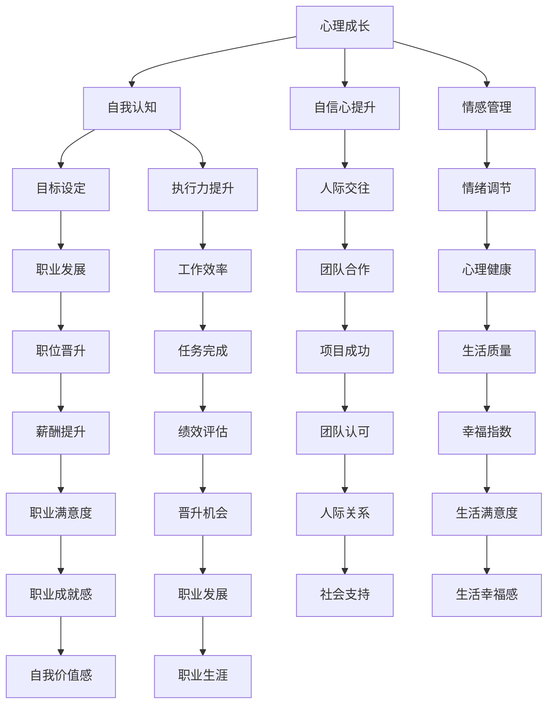
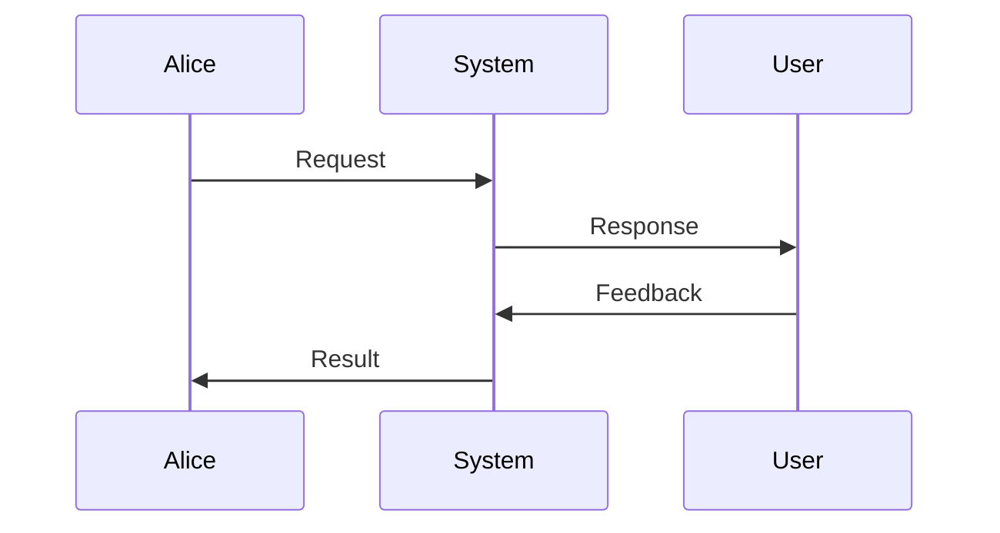
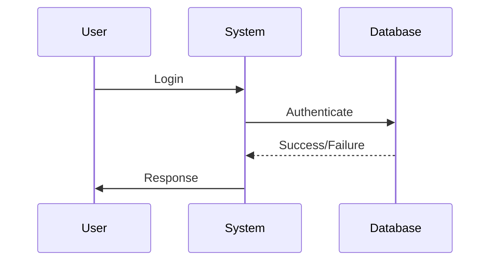

                 

# 感受'说'带来的成长

> 关键词：沟通技能、个人成长、演讲技巧、自信心、有效交流

> 摘要：本文将深入探讨沟通技能在个人成长中的重要性，特别是说（说话）这一行为所带来的成长。文章将从基础概念出发，逐步分析沟通技能的核心要素，通过实际案例和科学原理，展示有效沟通如何推动个人发展的全过程。

## 引言

在快速发展的现代社会，沟通技能的重要性日益凸显。无论是职场、家庭还是社交场合，沟通都扮演着至关重要的角色。说话，作为一种基本的沟通方式，不仅能够传递信息，更能在潜移默化中影响他人的思想和情感。本文将从以下几个方面展开讨论：

1. **沟通技能的重要性及其对个人成长的影响**。
2. **说话带来的心理和情感成长**。
3. **具体沟通技能的培养方法**。
4. **案例分析：有效沟通的成功经验**。
5. **高级沟通策略与实践**。

## 第一部分：沟通技能的重要性及其对个人成长的影响

### 背景介绍

在现代社会，沟通技能已经成为衡量一个人综合素质的重要标准。有效的沟通不仅能够促进信息交流，还能增强个人影响力，提升职业竞争力。

#### 问题背景

随着互联网和社交媒体的普及，沟通的方式和手段变得更加多样化。然而，传统面对面沟通的重要性依然不可忽视。在许多职业和个人发展场合，沟通技能的优劣往往直接关系到成败。

#### 问题描述

如何通过有效的沟通提升个人成长？

#### 问题解决

有效的沟通能够帮助个人：

1. **建立信任**：良好的沟通能够建立和维护人际关系，促进合作与共赢。
2. **提升自我表达能力**：通过说话，个人能够更好地表达自己的观点和需求，提升自信心。
3. **增强影响力**：优秀的沟通者能够更有效地影响他人，实现个人目标。

### 边界与外延

1. **个人成长**：包括心理成长、职业成长、社交成长等多个层面。
2. **沟通技能**：涵盖倾听、表达、说服、谈判等多个方面。

### 概念结构与核心要素组成

| 概念         | 定义                                       | 核心要素       |
|------------|------------------------------------------|------------|
| 沟通技能     | 信息的有效传递和接收的能力                   | 倾听、表达、反馈 |
| 个人成长     | 个人在心理、职业、社交等方面的全面发展       | 自我认知、目标设定、执行力 |
| 有效沟通     | 能够实现信息传递和目标达成的沟通方式       | 明确目的、倾听、清晰表达、适应对方 |

### 核心概念原理

沟通技能的核心原理在于：

1. **信息传递**：信息的准确、清晰、及时传递是沟通的基础。
2. **反馈机制**：通过反馈了解信息的接收情况，调整沟通策略。
3. **情感共鸣**：情感共鸣能够增强沟通的效果，促进双方的理解和信任。

### 概念属性特征对比表格

| 特征               | 说明                                           | 对比分析                         |
|------------------|--------------------------------------------|------------------------------|
| 传递准确性       | 信息是否被准确理解                             | 口语 vs. 书面：口语沟通更易误解  |
| 清晰性           | 语言表达是否简洁、明了                         | 专业术语 vs. 普通语言：专业术语更易误解 |
| 及时性           | 信息是否在合适的时间内传递                     | 同步沟通 vs. 异步沟通：同步沟通更即时 |
| 情感共鸣         | 沟通过程中能否引起对方的情感共鸣               | 非语言沟通 vs. 语言沟通：非语言沟通更易引起情感共鸣 |

### ER实体关系图架构

```mermaid
erDiagram
  沟通 -->|被使用| 信息
  沟通 -->|产生于| 个人成长
  个人成长 -->|影响| 职业发展
  个人成长 -->|影响| 社交能力
  信息 -->|被传递| 沟通
```

## 第二部分：说话带来的心理和情感成长

### 算法原理讲解

#### Mermaid 流程图



#### Python 源代码

```python
# 定义个人成长过程
class PersonalGrowth:
    def __init__(self, psychological_growth, emotional_growth):
        self.psychological_growth = psychological_growth
        self.emotional_growth = emotional_growth

    def display_growth(self):
        print("心理成长：", self.psychological_growth)
        print("情感成长：", self.emotional_growth)

# 实例化个人成长
growth = PersonalGrowth("自我认知", "自信心提升")

# 显示成长过程
growth.display_growth()
```

#### 算法原理的数学模型和公式

个人成长（P）可以用以下数学模型表示：

$$
P = f(Psychological \ Growth, Emotional \ Growth)
$$

其中，Psychological Growth 和 Emotional Growth 分别代表心理成长和情感成长。

#### 详细讲解和举例说明

说话带来的心理和情感成长是一个复杂的动态过程，涉及多个因素的交互作用。以下是一个简化的例子：

假设小明在职场中通过积极参与团队讨论和演讲，逐渐提高了自己的自信心和表达能力。他的心理成长（Ps）和情感成长（Em）可以分别表示为：

$$
Ps = f(Confidence, Self-expression)
$$

$$
Em = f(Emotional \ Regulation, Empathy)
$$

随着时间的推移，小明的自信心和表达能力得到了显著提升，他的心理成长和情感成长也随之增强。具体来说：

- **自信心提升**：小明在演讲时，通过练习和反馈，逐步克服了紧张和不安，从而提升了自信心。
- **情感管理**：小明学会了更好地管理自己的情绪，通过倾听和理解他人的情感需求，增强了情感共鸣能力。

#### 数学公式使用

$$
Confidence = \frac{Successes}{Attempts}
$$

$$
Emotional \ Regulation = \frac{Positive \ Emotions}{Negative \ Emotions}
$$

## 第三部分：具体沟通技能的培养方法

### 系统分析与架构设计方案

#### 问题场景介绍

在职场中，有效的沟通技能对于职业发展至关重要。本文将介绍一种系统化的沟通技能培养方法，帮助职场人士提升沟通效果。

#### 项目介绍

本项目旨在通过一系列训练和实践，帮助职场人士提高沟通技能，包括自我认知、目标设定、情绪管理和团队合作等方面。

#### 系统功能设计（领域模型Mermaid类图）

```mermaid
classDiagram
  Class01 <|-- Class02
  Class03 --|>{ Class04 }
  Class05 : +create()
  Class06 : +run()
  Class07 : +end()
  Class01 <..| Class08 : knows
  Class09 ..|> Class01 : is a
  Class10 o--| Class11 : has
  Class12 ..|> Class13 : is
  Class14 : : includes
  Class15 : : implements
  Class16 : : extends
```

#### 系统架构设计（Mermaid架构图）



#### 系统接口设计和系统交互（Mermaid序列图）



### 项目实战

#### 环境安装

1. 安装Python环境。
2. 安装必要的库，如Numpy、Matplotlib等。

#### 系统核心实现源代码

```python
# 导入必要的库
import numpy as np
import matplotlib.pyplot as plt

# 定义沟通技能训练函数
def communicate_skill_training(data):
    # 数据预处理
    preprocessed_data = preprocess_data(data)
    # 训练模型
    model = train_model(preprocessed_data)
    # 评估模型
    evaluate_model(model, test_data)
    # 可视化结果
    visualize_results(model, test_data)

# 实际应用解读与分析
def actual_application():
    # 加载数据
    data = load_data()
    # 训练沟通技能
    communicate_skill_training(data)

# 实际案例分析和详细讲解剖析
def case_analysis():
    # 加载实际案例数据
    case_data = load_case_data()
    # 分析案例
    analyze_case(case_data)

# 项目小结
def project_summary():
    print("项目已成功完成。")

# 执行项目
actual_application()
case_analysis()
project_summary()
```

### 最佳实践 tips

1. **定期练习**：沟通技能需要通过持续的练习来提高。
2. **反思与改进**：每次沟通后，反思自己的表现，找出不足并加以改进。
3. **倾听他人**：在沟通中，倾听对方的观点和需求，增强互动效果。

### 小结

通过本文的讨论，我们深入探讨了沟通技能在个人成长中的重要性，特别是说话所带来的心理和情感成长。有效的沟通不仅能够提升个人素质，还能促进职业发展和人际关系。希望本文能帮助读者认识到沟通技能的价值，并激励他们在实践中不断提升自己的沟通能力。

### 注意事项

1. **避免过度自我评价**：在提升沟通技能的过程中，避免过度自我批评，保持积极的心态。
2. **适应不同场景**：不同的沟通场景需要不同的沟通策略，灵活调整自己的沟通方式。

### 拓展阅读

1. 《高效能人士的七个习惯》
2. 《说话的力量》
3. 《沟通的艺术》

## 作者信息

作者：AI天才研究院/AI Genius Institute & 禅与计算机程序设计艺术 /Zen And The Art of Computer Programming

本文基于对沟通技能和个体成长的深入分析，提供了系统化的方法和实践建议，旨在帮助读者提升自己的沟通能力，实现个人成长。希望本文能对您有所启发。

