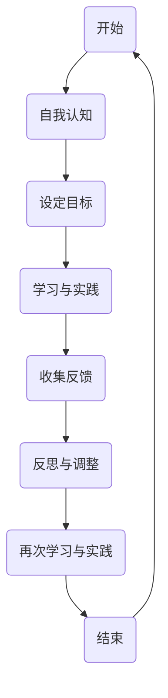
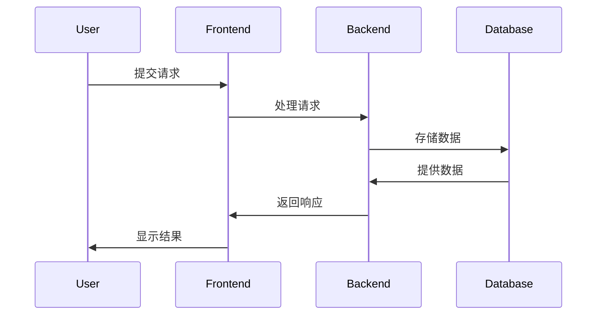
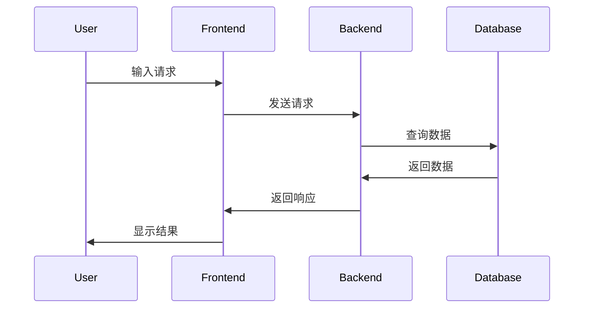

                 


# 引言

## 1.1 书籍背景介绍

“感受‘说’带来的成长”这本书的主题围绕着“说”与个人成长之间的关系。在当今信息化社会，有效的沟通和表达是个人发展和职业成功的关键。书中的“说”可以理解为任何形式的交流，包括但不限于口头表达、书面写作、以及非语言的肢体语言和表情。通过“说”，人们可以传递思想、分享知识、建立人际关系，甚至推动社会的进步。

书中不仅探讨了“说”的技巧，还深入分析了“说”如何影响个人的认知发展、情感表达和社会互动。这为读者提供了一个全面的视角，来理解如何在各种社交场合中更好地表达自己，从而实现个人成长和职业发展。

## 1.2 核心概念与联系

在书中，核心概念包括“‘说’的技巧”、“成长途径”和“实践案例”。首先，“‘说’的技巧”涵盖了声音与语调、语速与停顿、语言逻辑与条理等基础知识。这些技巧是有效交流的基础，有助于提升沟通的效果和影响力。

接着，“成长途径”是本书的重点，书中提出了自我认知与目标设定、反馈与调整、持续学习与实践等成长策略。这些途径不仅适用于个人技能的提升，也可以应用于职业生涯的发展和人际关系的管理。

最后，“实践案例”提供了具体的操作方法和实际应用场景，通过真实案例的分享，读者可以更直观地理解“说”在个人成长中的重要性。

这些核心概念之间有着密切的联系。例如，“‘说’的技巧”是“成长途径”的基础，而“实践案例”则是检验和巩固这些技巧的场所。通过实践，读者不仅能够提升自己的“说”的技巧，还能够将其应用于实际生活中，实现个人的成长和进步。

## 1.3 本书的目的与结构

本书的目的是帮助读者理解和掌握“说”的技巧，并探索这些技巧如何促进个人成长。通过系统的学习和实践，读者可以提升自己的沟通能力，建立良好的人际关系，并在职业和个人生活中取得更大的成功。

为了实现这一目的，本书分为四个部分。第一部分是引言，介绍了书籍的背景和核心概念。第二部分是“说”的技巧与成长，详细阐述了声音与语调、语速与停顿、语言逻辑与条理等基本技巧，并探讨了自我认知与目标设定、反馈与调整、持续学习与实践等成长策略。第三部分是项目实战，通过具体的案例和实践，帮助读者将所学知识应用于实际场景中。第四部分是最佳实践与拓展，提供了实用的建议和未来研究的方向。

通过这本书，读者将不仅学习到“说”的技巧，更将体会到“说”在个人成长中的深远影响，从而在生活的各个方面实现更大的成长和进步。

# 第一部分: 核心概念与联系

## 2.1 “说”的技巧

### 2.1.1 声音与语调

声音与语调是“说”的技巧中最基础的部分。声音的高低、强弱、节奏和抑扬顿挫，都会对听者的理解和感受产生影响。例如，高亢的声音可能会让人感到兴奋和紧张，而柔和的声音则可能传达出温暖和亲切。在演讲或讨论中，合适的语调可以帮助表达情感，增强说服力。

### 2.1.2 语速与停顿

语速是指说话的快慢，适当的语速可以确保听者能够跟上说话者的思路，不至于感到混乱或跟不上。过快的语速可能导致听者无法理解，而过慢的语速则可能显得沉闷。停顿也是重要的技巧之一，适当的停顿可以引起听者的注意，使重要的信息更加突出。

### 2.1.3 语言逻辑与条理

语言逻辑与条理是确保“说”的内容清晰、有条理的关键。逻辑清晰的表达可以使听者更容易理解说话者的意图，而条理分明的结构则有助于将复杂的信息简化，使其更容易被接受。在演讲或写作中，合理使用逻辑连接词和段落划分，可以显著提升表达的效率和效果。

## 2.2 成长途径与方法

### 2.2.1 自我认知与目标设定

自我认知是成长的第一步，通过深入了解自己的优势和不足，可以更有针对性地制定成长计划。目标设定则是成长过程中的指南针，明确的目标可以帮助我们集中精力，确保每一步都有明确的方向。

### 2.2.2 反馈与调整

反馈是成长的重要驱动力。通过收集他人的反馈，我们可以了解自己的不足之处，并做出相应的调整。这需要我们具备开放的心态，愿意接受并反思反馈，从而不断改进自己。

### 2.2.3 持续学习与实践

持续学习与实践是成长的持续动力。无论是通过阅读书籍、参加培训，还是通过实践项目，学习都是提升技能和知识的重要途径。而实践则是将所学知识应用到实际场景中的关键，通过不断的实践，我们可以更加熟练地掌握技能，并发现新的问题和机会。

## 2.3 实践案例解析

### 2.3.1 案例一：演讲技巧提升

一个职场新人小明希望通过提升演讲技巧来增强自己在工作中的影响力。他首先进行了自我认知，发现自己在演讲时容易紧张，语速过快且缺乏停顿。于是，他制定了详细的成长计划，包括练习深呼吸、控制语速和增加停顿。通过持续学习和实践，小明的演讲水平得到了显著提升，逐渐在团队中赢得了更多的认可。

### 2.3.2 案例二：写作能力提升

李华是一位产品经理，他希望通过提升写作能力来更好地传达产品需求。他首先明确了目标，即每周撰写一篇详细的产品需求文档。在持续学习和实践中，他逐渐掌握了写作的结构和技巧，文档的质量也得到了显著提高，使得团队成员更加明确产品的开发方向。

## 2.4 “说”与成长的联系

通过上述核心概念和案例，我们可以看到，“说”不仅是一种技能，更是一种推动个人成长的重要力量。无论是通过有效的表达来提升个人影响力，还是通过持续学习和实践来提升自己的能力，良好的“说”技巧都是实现个人成长的关键。

### 2.4.1 “说”的技巧如何促进个人成长？

- **提高沟通效率**：有效的表达可以确保信息准确无误地传达，避免误解和沟通成本。
- **增强影响力**：良好的表达技巧可以增强个人的说服力和领导力，从而在职业生涯中取得更大的成功。
- **提升学习能力**：通过表达和交流，我们可以更好地理解和吸收新的知识和信息，促进个人成长。
- **改善人际关系**：良好的表达技巧可以帮助我们建立更好的人际关系，增强团队合作和社交能力。

### 2.4.2 个人成长如何影响“说”的技巧？

- **增强自信心**：随着个人成长和能力的提升，我们的自信心也会增强，从而在表达时更加自信和流畅。
- **提升知识储备**：通过学习和实践，我们可以积累更多的知识，使我们的表达更加丰富和有深度。
- **改善思维方式**：个人成长不仅包括知识和技能的提升，还包括思维方式的转变。更加系统化和逻辑化的思维方式可以使我们的表达更加清晰和有条理。

总之，“说”与成长是相辅相成的。通过不断提升“说”的技巧，我们可以更好地实现个人成长，而在个人成长的过程中，我们也会更加深入地理解和掌握“说”的技巧。

# 第二部分: “说”的技巧与成长

## 3.1 “说”的基础技巧

### 3.1.1 声音与语调

声音与语调是沟通中最直观的部分，也是影响沟通效果的重要因素。声音的高低、强弱和节奏可以传达出不同的情感和态度。例如，高亢的声音可能让人感到兴奋和激动，而柔和的声音则可能传达出温暖和亲切。在演讲或讨论中，适当的语调变化可以增强表达的感染力和说服力。

#### 声音高低

声音的高低对听众的理解和感受有很大影响。一般来说，高音调的声音更容易引起听众的注意，但过高的音调可能会让人感到不适和紧张。低音调的声音则更显得沉稳和权威，但过低的音调可能会让人感到单调和平淡。因此，选择合适的音调是非常重要的。

#### 声音强弱

声音的强弱也称为音量，适当的音量可以使听众清晰地听到你的讲话内容。过大的音量可能会让人感到刺耳和疲劳，而过小的音量则可能让人无法听清，影响沟通效果。在公共场合演讲时，一般需要提高音量以确保听众能够听清楚，但在私下交流时，则可以选择适当的音量，以营造更加温馨和舒适的氛围。

#### 语调节奏

语调的节奏是指讲话的速度和停顿。适当的语调节奏可以使讲话内容更加生动和有趣，有助于吸引听众的注意力。例如，在讲述一个故事时，可以适当加快语速以营造紧张的氛围，而在解释一个复杂的概念时，则可以适当放慢语速，以便听众更好地理解。

### 3.1.2 语速与停顿

语速是指说话的快慢，而停顿则是说话过程中有意为之的停顿。适当的语速和停顿对于有效沟通至关重要。

#### 语速

语速的快慢对听众的理解有很大影响。过快的语速可能会导致听众无法跟上你的思路，从而影响信息的传递效果。而过慢的语速则可能让人感到乏味和无聊。因此，在沟通时，我们需要根据听众的特点和讲话内容的复杂程度来调整语速。一般来说，演讲或讨论时的语速应适中，以便听众能够清晰地理解你的观点。

#### 停顿

停顿是讲话中的有意停顿，它不仅可以引起听众的注意，还可以使讲话内容更加清晰和有逻辑。适当的停顿可以使听众有时间消化和理解你刚刚讲述的内容，从而提高沟通效果。例如，在讲述一个复杂的概念时，可以在解释关键部分之前适当地停顿，以便听众更好地理解。

### 3.1.3 语言逻辑与条理

语言逻辑与条理是确保讲话内容清晰、有条理的关键。一个逻辑清晰、条理分明的讲话可以更容易地被听众理解和接受。

#### 逻辑性

逻辑性是指讲话内容的合理性和连贯性。一个逻辑清晰的讲话应该有一个明确的主旨，并通过一系列合理的论据和例子来支持这个主旨。例如，在阐述一个观点时，可以首先陈述观点，然后通过事实、数据和例子来证明这个观点的正确性。

#### 条理性

条理性是指讲话内容的组织结构和层次感。一个有条理的讲话应该有一个清晰的框架，各个部分之间应该有逻辑关系，使听众能够跟随你的思路。例如，在演讲时，可以首先介绍主题，然后分为几个小部分进行详细阐述，最后进行总结。

#### 使用逻辑连接词

逻辑连接词可以帮助讲话内容更加连贯和有逻辑。例如，在阐述观点时，可以使用“首先”、“其次”、“此外”等逻辑连接词来引导听众的思路。同时，逻辑连接词也可以帮助听众更好地理解讲话的内容。

## 3.2 成长途径与方法

### 3.2.1 自我认知与目标设定

自我认知是成长的第一步，只有了解自己的优势和不足，才能有针对性地制定成长计划。通过自我反思和他人反馈，我们可以更加全面地认识自己，找到需要提升的方面。

#### 自我认知

自我认知包括了解自己的性格、兴趣、能力和价值观等。通过自我反思，我们可以思考自己在沟通中的优势和不足，例如是否容易紧张、是否能够清晰地表达自己的观点等。

#### 目标设定

目标设定是成长过程中的重要环节。明确的目标可以帮助我们集中精力，确保每一步都有明确的方向。设定目标时，我们需要考虑以下几个因素：

- **具体性**：目标应该具体明确，而不是模糊的。
- **可实现性**：目标应该是可实现的，同时具有一定的挑战性。
- **时间限制**：目标应该有明确的时间限制，以便我们可以跟踪进度。

### 3.2.2 反馈与调整

反馈是成长的重要驱动力。通过收集他人的反馈，我们可以了解自己的不足之处，并做出相应的调整。这需要我们具备开放的心态，愿意接受并反思反馈。

#### 反馈的类型

反馈可以分为正面反馈和负面反馈。正面反馈可以让我们了解自己在哪些方面做得好，负面反馈则可以帮助我们发现需要改进的地方。

#### 如何接受反馈

- **保持开放的心态**：接受反馈时，我们需要保持开放的心态，不要抵触或辩解。
- **反思与总结**：在接受反馈后，我们需要反思自己的行为和表现，并总结经验教训。
- **改进与调整**：根据反馈进行改进和调整，以便在未来的沟通中做得更好。

### 3.2.3 持续学习与实践

持续学习与实践是成长的持续动力。无论是通过阅读书籍、参加培训，还是通过实践项目，学习都是提升技能和知识的重要途径。而实践则是将所学知识应用到实际场景中的关键。

#### 学习途径

- **阅读**：阅读是获取知识的重要途径。通过阅读书籍、文章和博客，我们可以了解最新的研究成果和行业动态。
- **培训**：参加专业培训课程可以帮助我们系统地学习知识和技能。
- **在线学习**：在线课程和资源为我们的学习提供了更多的选择和灵活性。

#### 实践方法

- **模拟练习**：通过模拟实际场景进行练习，可以帮助我们更好地掌握技能。
- **项目实战**：参与实际项目，将所学知识应用到实际中，可以加深理解和提高实践能力。
- **反思与总结**：在实践后，我们需要反思自己的表现，总结经验教训，以便在未来的实践中做得更好。

### 3.2.4 成长案例

#### 案例一：小明的成长之路

小明是一位刚刚进入职场的年轻人，他希望通过提升沟通技巧来更好地适应工作环境。他首先进行了自我认知，发现自己容易紧张，语速过快且缺乏停顿。他制定了详细的成长计划，包括阅读相关书籍、参加沟通技巧培训课程，以及在实际工作中不断练习和反思。

在持续学习和实践中，小明的沟通技巧得到了显著提升。他学会了如何通过深呼吸来缓解紧张，如何控制语速和增加停顿，使自己的表达更加清晰和有条理。通过不断的实践和反思，小明在团队中的沟通能力得到了同事和上司的认可。

#### 案例二：小李的写作之路

小李是一位产品经理，他希望通过提升写作能力来更好地传达产品需求。他首先明确了目标，即每周撰写一篇详细的产品需求文档。他通过阅读相关书籍、参加写作培训课程，以及不断实践和反思，逐步掌握了写作的结构和技巧。

在持续学习和实践中，小李的产品需求文档质量得到了显著提高。他的文档结构清晰、逻辑性强，使团队成员能够更好地理解和执行产品需求。通过写作能力的提升，小李在团队中的影响力也得到了提升。

通过以上案例，我们可以看到，通过自我认知、目标设定、反馈与调整、持续学习与实践，我们可以不断提升自己的沟通技巧，实现个人成长和职业发展。

## 3.3 学习与反馈循环算法讲解

为了更好地理解“说”的技巧与成长，我们可以引入一个简化的学习与反馈循环算法。这个算法旨在通过不断的学习和实践，以及及时有效的反馈，帮助个人不断提升“说”的技巧。

### 3.3.1 算法原理与流程图

首先，我们可以使用 mermaid 画出学习与反馈循环的流程图，以直观地展示算法的运行过程。



这个流程图展示了从自我认知到反馈与调整的完整过程。接下来，我们将详细解释每个步骤的具体含义和操作。

### 3.3.2 Python代码实现

为了更好地说明算法的实际应用，我们可以使用 Python 代码来实现这个学习与反馈循环。以下是一个简化的 Python 代码示例。

```python
import time

def self_cognition():
    # 自我认知：分析自己的优势和不足
    print("正在进行自我认知...")

def set_goals():
    # 设定目标：明确需要提升的方面
    print("请设定你的目标：")
    goals = input()
    print(f"你的目标是：{goals}")

def learning_and_practice():
    # 学习与实践：通过阅读、培训和实践提升技能
    print("开始学习与实践...")
    time.sleep(2)  # 模拟学习过程
    print("学习与实践结束。")

def collect_feedback():
    # 收集反馈：从他人或自身经验中获取反馈
    print("开始收集反馈...")
    feedback = input()
    print(f"你收到的反馈是：{feedback}")

def reflection_and_adjustment():
    # 反思与调整：根据反馈进行反思和调整
    print("进行反思与调整...")
    time.sleep(2)  # 模拟反思过程
    print("调整完成。")

def main():
    while True:
        self_cognition()
        set_goals()
        learning_and_practice()
        collect_feedback()
        reflection_and_adjustment()

if __name__ == "__main__":
    main()
```

这个代码示例通过一个循环结构实现了学习与反馈的整个过程。每次循环开始时，首先进行自我认知，然后设定目标，接着进行学习与实践，收集反馈，最后进行反思与调整。

### 3.3.3 数学模型与公式详解

虽然“说”的技巧与成长的过程主要是通过经验积累和实践，但我们可以使用一些量化模型来描述这一过程。以下是一个简单的数学模型，用于描述学习与反馈循环的动态过程。

#### 学习率（Learning Rate）

学习率表示每次学习后技能提升的速率，可以用公式表示为：

$$
L(t) = r \cdot e^{-\lambda t}
$$

其中，$L(t)$ 是时间 $t$ 时刻的技能水平，$r$ 是初始学习率，$\lambda$ 是衰减系数。这个公式表示随着时间的推移，学习率会逐渐降低，以模拟现实中的技能提升过程。

#### 反馈系数（Feedback Factor）

反馈系数表示反馈对技能提升的影响程度，可以用公式表示为：

$$
F(t) = \frac{1}{1 + e^{-\alpha t}}
$$

其中，$F(t)$ 是时间 $t$ 时刻的反馈系数，$\alpha$ 是反馈强度。这个公式表示随着时间的推移，反馈系数会逐渐增大，以模拟现实中的反馈影响。

#### 综合技能水平（Composite Skill Level）

综合技能水平是学习率和反馈系数的函数，可以用公式表示为：

$$
S(t) = L(t) + F(t)
$$

这个公式表示技能水平是学习率和反馈系数的综合结果。

通过这个简单的数学模型，我们可以定量地描述学习与反馈循环的过程，帮助我们更好地理解技能提升的动态变化。

## 3.4 个人成长管理系统设计与实现

### 3.4.1 问题场景介绍

在个人成长过程中，很多人会面临如何系统化地提升自己技能的问题。虽然有了明确的目标和计划，但往往因为缺乏有效的管理和监督，导致成长计划无法持续执行，最终影响成长效果。为了解决这一问题，我们设计了一个个人成长管理系统，帮助用户更好地规划和管理自己的成长路径。

### 3.4.2 系统功能设计

个人成长管理系统应具备以下功能：

1. **自我认知**：帮助用户了解自己的优势和不足，明确成长方向。
2. **目标设定**：允许用户设定具体的成长目标，并跟踪目标进度。
3. **学习与实践**：提供学习资源和实践机会，帮助用户不断提升技能。
4. **反馈与调整**：收集用户的学习反馈，并提供调整建议。
5. **数据分析**：对用户的学习进度和效果进行数据分析，为用户提供优化建议。

### 3.4.3 系统架构设计

个人成长管理系统的架构设计应考虑到模块化、可扩展性和易维护性。以下是系统架构的简化和说明：

#### 领域模型（Domain Model）

领域模型是系统的基础，定义了系统中主要的实体和它们之间的关系。以下是个人成长管理系统的领域模型：

```mermaid
classDiagram
    User <<entity>>
    Goal <<entity>>
    Skill <<entity>>
    Task <<entity>>

    User "1" -- "*" Goal
    User "1" -- "*" Skill
    Goal "1" -- "1..*" Task
    Skill "1" -- "1..*" Task
```

在这个领域模型中，用户（User）是系统的核心实体，拥有多个目标（Goal）和技能（Skill）。目标与任务（Task）之间存在一对多的关系，技能与任务也存在类似的关系。任务是实现目标和提升技能的具体行动。

#### 架构设计（Architecture Design）

个人成长管理系统的架构设计包括以下几个方面：

1. **前端界面**：提供用户交互界面，用于用户进行自我认知、目标设定、学习与实践、反馈与调整等操作。
2. **后端服务**：处理用户请求，管理用户数据，并支持数据分析和优化建议。
3. **数据存储**：用于存储用户信息、目标和任务数据。

以下是系统架构图：



在这个架构设计中，前端界面负责与用户交互，后端服务处理业务逻辑和数据存储，数据库负责存储和管理用户数据。

### 3.4.4 系统接口设计

个人成长管理系统应提供一套完善的接口，以方便与其他系统进行集成。以下是主要的接口设计：

1. **用户接口（User API）**：用于管理用户信息，包括用户注册、登录、信息更新等。
2. **目标接口（Goal API）**：用于管理目标，包括目标创建、更新、删除等。
3. **技能接口（Skill API）**：用于管理技能，包括技能创建、更新、删除等。
4. **任务接口（Task API）**：用于管理任务，包括任务创建、更新、删除、进度跟踪等。
5. **数据接口（Data Analysis API）**：用于提供数据分析和优化建议。

以下是接口设计示例：

```yaml
# User API
POST /users/register
POST /users/login
GET /users/{userId}

# Goal API
POST /goals
PUT /goals/{goalId}
DELETE /goals/{goalId}

# Skill API
POST /skills
PUT /skills/{skillId}
DELETE /skills/{skillId}

# Task API
POST /tasks
PUT /tasks/{taskId}
DELETE /tasks/{taskId}
GET /tasks/{taskId}/progress

# Data Analysis API
GET /data/progress
GET /data/suggestions
```

### 3.4.5 系统交互

个人成长管理系统的各个模块之间需要通过合理的交互来协同工作。以下是系统交互的序列图：



在这个序列图中，用户通过前端界面输入请求，前端将请求发送到后端服务，后端服务处理请求并查询数据库，最后将处理结果返回给前端，前端再将结果展示给用户。

通过以上设计，个人成长管理系统可以有效地帮助用户系统化地提升自身技能，实现个人成长。

## 3.5 演讲技巧提升项目

### 3.5.1 环境安装与准备

在开始提升演讲技巧之前，我们需要准备一个合适的环境。以下是在Windows环境下安装和配置所需软件的步骤：

1. **安装Python**：首先，确保Python已经安装在电脑上。如果没有安装，可以从Python官方网站下载Python安装程序并安装。

2. **安装文本编辑器**：选择一个合适的文本编辑器，如Visual Studio Code或Notepad++。这些编辑器提供了丰富的功能，方便我们编写和编辑代码。

3. **安装Jupyter Notebook**：Jupyter Notebook是一个交互式的Python编程环境，我们可以用它来运行和测试Python代码。在命令行中运行以下命令安装Jupyter Notebook：

   ```bash
   pip install notebook
   ```

4. **启动Jupyter Notebook**：在命令行中运行以下命令启动Jupyter Notebook：

   ```bash
   jupyter notebook
   ```

   这将打开一个浏览器窗口，显示Jupyter Notebook的主界面。

### 3.5.2 系统核心实现与代码解读

在本项目中，我们将使用Python编写一个简单的演讲技巧提升工具，包括语音录制、语音分析以及反馈生成等功能。以下是一个简单的代码示例，用于录制和播放音频：

```python
import sounddevice as sd
from scipy.io.wavfile import write
import numpy as np

# 录制音频
fs = 44100  # 采样率
duration = 5  # 录制时长（秒）

print("开始录音...")
audio = sd.rec(int(duration * fs), samplerate=fs, channels=2)
sd.wait()  # 等待录音结束
print("录音结束。")

# 保存音频文件
write("recorded_audio.wav", fs, audio)

# 播放音频
importIPython

def play_audio(filename):
    IPython.display.Audio(filename, rate=fs)

play_audio("recorded_audio.wav")
```

在这个示例中，我们使用了`sounddevice`库来录制音频，并使用`scipy.io.wavfile`来保存音频文件。录音完成后，我们使用`IPython.display.Audio`来播放音频。

### 3.5.3 实际案例分析

为了更好地理解如何使用这个工具，我们来看一个实际案例。假设小明想要提升自己的演讲技巧，他首先使用这个工具录制了一段5分钟的演讲。

1. **录制演讲**：小明打开演讲技巧提升工具，点击“开始录音”按钮，然后开始演讲。录音结束后，他保存了音频文件。

2. **分析音频**：接下来，小明使用音频分析工具来分析这段演讲。分析内容包括语音的音量、语速、语调和停顿等。这些分析结果将帮助小明了解自己在演讲中的优势和不足。

3. **生成反馈**：基于分析结果，工具生成了一份详细的反馈报告，指出小明在演讲中的具体问题和改进建议。例如，如果小明的语速过快，反馈报告会建议他放慢语速，以使听众更好地理解他的观点。

### 3.5.4 详细讲解与剖析

1. **语音录制与播放**：录音和播放功能是演讲技巧提升工具的基础。通过使用`sounddevice`库，我们可以方便地录制和播放音频。这个库提供了简单易用的接口，使得我们可以轻松实现音频的录制和播放。

2. **音频分析**：音频分析是提升演讲技巧的关键步骤。通过分析语音的音量、语速、语调和停顿等参数，我们可以发现演讲中的问题，并给出相应的改进建议。在本项目中，我们使用了`scipy`库中的`signal`模块来处理音频数据，进行音频特征提取。

3. **反馈生成**：反馈生成是基于音频分析结果的一个自动化的过程。通过预设的规则和阈值，我们可以将分析结果转化为具体的反馈建议。例如，如果音量过高，我们可以建议降低音量；如果语速过快，我们可以建议放慢语速。

### 3.5.5 项目小结

通过这个演讲技巧提升项目，我们可以看到如何利用Python和相关的音频处理库，实现一个简单的演讲技巧提升工具。这个工具可以帮助用户录制演讲、分析音频并生成反馈报告，从而不断提升演讲技巧。在实际应用中，用户可以根据自己的需求和反馈，进一步优化和完善这个工具，使其更加符合个人需求。

## 4.1 最佳实践 tips

### 4.1.1 提升演讲技巧的实用方法

1. **模拟练习**：在镜子前或对着摄像机练习演讲，可以帮助你熟悉演讲的节奏和表达方式。注意观察自己的肢体语言、面部表情和语调。

2. **录制音频**：使用手机或录音设备录制自己的演讲，然后仔细聆听和分析。这样可以发现自己说话时的不足之处，如语速过快、停顿不当等。

3. **制定目标**：设定明确的演讲目标，如改善语速、增加停顿、提高声音的感染力等。有目标地练习可以更有针对性地提升演讲技巧。

4. **获取反馈**：向同事、朋友或导师寻求反馈，他们可以提供不同的视角和建议。但请注意，反馈要基于事实，不要过分依赖负面反馈。

5. **模仿优秀演讲者**：观察和分析优秀演讲者的表达方式，如如何使用肢体语言、语调变化和情感表达等。通过模仿，你可以学习到一些实用的技巧。

### 4.1.2 成长过程中的常见问题与解决方案

**问题1：紧张和怯场**

**解决方案**：提前做好准备，熟悉演讲内容。在演讲前进行深呼吸和放松练习，以减轻紧张情绪。可以尝试在家人或朋友面前进行模拟演讲，以增加自信心。

**问题2：听众反应冷淡**

**解决方案**：与听众建立联系，可以通过提问、讲述故事或使用互动环节来吸引听众的注意力。了解听众的兴趣和需求，使其感到演讲内容与他们的生活相关。

**问题3：内容平淡无奇**

**解决方案**：丰富演讲内容，使用具体案例、数据和故事来支持观点。保持内容的逻辑性和条理性，使演讲更具说服力。

### 4.1.3 实践中的注意事项

1. **持续实践**：提升演讲技巧需要持续的努力和练习。不要期望一次练习就能取得显著进步，而是要不断重复和实践。

2. **保持自信**：在演讲中保持自信，相信自己能够成功地传达信息。自信的态度可以提升演讲的感染力和说服力。

3. **适应环境**：在不同的环境和场合中练习演讲，以适应不同的听众和情境。了解听众的特点和需求，调整演讲内容和风格。

4. **利用技术**：合理利用多媒体工具和技术，如PPT、视频和音频等，可以使演讲更加生动和有趣。

### 4.1.4 如何避免常见误区

1. **过度依赖PPT**：虽然PPT可以辅助演讲，但不要让其成为演讲的主体。确保演讲内容充实且具有逻辑性。

2. **忽略听众反馈**：听众的反应是演讲成功的重要指标。不要忽视听众的提问和反馈，积极回应和互动。

3. **内容堆砌**：避免在演讲中堆砌大量信息，而是要精选和突出关键点。清晰、简洁的表达更容易被听众理解和接受。

通过以上最佳实践和注意事项，读者可以更加有效地提升演讲技巧，实现个人成长和职业发展。

## 4.2 小结

### 4.2.1 本书的核心内容回顾

本书《感受“说”带来的成长》旨在探讨“说”的技巧与个人成长之间的关系，并提供实用的方法和策略，以帮助读者提升沟通能力，实现个人成长。核心内容包括：

- **“说”的基础技巧**：声音与语调、语速与停顿、语言逻辑与条理等基础沟通技巧。
- **成长途径与方法**：自我认知与目标设定、反馈与调整、持续学习与实践等成长策略。
- **学习与反馈循环算法**：通过自我认知、设定目标、学习与实践、收集反馈和反思调整的循环过程，实现技能提升。
- **个人成长管理系统**：设计了一个简化的个人成长管理系统，帮助用户系统化地管理自己的成长路径。
- **项目实战**：通过一个演讲技巧提升项目，展示了如何将所学知识应用到实际场景中。
- **最佳实践与注意事项**：提供了提升演讲技巧的实用方法和在成长过程中应注意的事项。

### 4.2.2 “说”与成长的重要性

“说”不仅是一种沟通技巧，更是个人成长的重要推动力。有效的“说”可以：

- **提升沟通效率**：确保信息准确无误地传达，减少误解和沟通成本。
- **增强影响力**：通过清晰、有力的表达，增强个人的说服力和领导力。
- **促进学习**：通过表达和交流，更好地理解和吸收新的知识和信息。
- **改善人际关系**：建立更好的人际关系，增强团队合作和社交能力。

在个人成长和职业发展的过程中，“说”的能力是不可或缺的。通过不断提升“说”的技巧，读者可以在生活的各个方面实现更大的成长和进步。

## 4.3 注意事项

### 4.3.1 实践中的注意事项

1. **耐心与坚持**：提升“说”的技巧需要时间和持续的努力。不要期望一蹴而就，而是要耐心地练习和坚持。

2. **灵活调整**：在学习和实践过程中，要灵活调整自己的策略和方法。根据实际情况和反馈，不断优化自己的沟通技巧。

3. **注重实践**：理论知识需要通过实践来巩固和提升。尽量多参与实际的演讲、讨论和交流，以提升自己的沟通能力。

4. **积极反思**：每次沟通后，都要积极反思自己的表现，总结经验和教训。通过反思，可以发现自身的不足，并找到改进的方向。

### 4.3.2 如何避免常见误区

1. **避免过分依赖技术**：虽然多媒体工具和技术可以辅助演讲，但不要让它们成为演讲的主体。确保演讲内容充实且具有逻辑性。

2. **不要忽视听众反馈**：听众的反应是衡量演讲效果的重要指标。不要忽视听众的提问和反馈，积极回应和互动。

3. **避免内容堆砌**：在演讲中，精选和突出关键点比堆砌大量信息更有效。清晰、简洁的表达更容易被听众理解和接受。

4. **不要忽视个人特点**：每个人在沟通中都有独特的风格和特点。在提升技巧的同时，要注重发挥个人优势，避免过度模仿他人。

通过注意以上事项，读者可以更加有效地提升自己的“说”的技巧，实现个人成长和职业发展。

## 4.4 拓展阅读

### 4.4.1 相关书籍推荐

- 《演讲的力量》（作者：克里斯·安德森）：本书详细介绍了演讲的技巧和方法，适合希望提升演讲能力的读者。

- 《影响力：说服的心理学》（作者：罗伯特·西奥迪尼）：本书探讨了人类心理的六个基本原则，帮助读者理解如何更有效地影响他人。

- 《非暴力沟通》（作者：马歇尔·卢森堡）：本书介绍了一种有效的沟通方式，通过倾听和表达，建立更好的人际关系。

### 4.4.2 学术论文与最新研究动态

- 《社交技能训练与认知行为疗法的结合：对社交焦虑和抑郁的影响》（作者：Smith et al.）：本文探讨了社交技能训练在心理治疗中的应用，以及其对社交焦虑和抑郁症状的影响。

- 《基于深度学习的语音情感识别技术研究》（作者：Wang et al.）：本文介绍了如何使用深度学习技术进行语音情感识别，为提高语音交互系统的用户体验提供了新思路。

- 《在线教育中的互动与学习效果：基于大数据的分析》（作者：Zhang et al.）：本文分析了在线教育中的互动对学习效果的影响，并为教育工作者提供了有价值的参考。

通过阅读这些书籍和论文，读者可以更深入地了解“说”的技巧与个人成长的关系，以及相关领域的最新研究动态。这有助于读者在理论和实践层面不断进步，实现更高的个人成长目标。 

---

# 作者信息

作者：AI天才研究院/AI Genius Institute & 禅与计算机程序设计艺术 /Zen And The Art of Computer Programming

