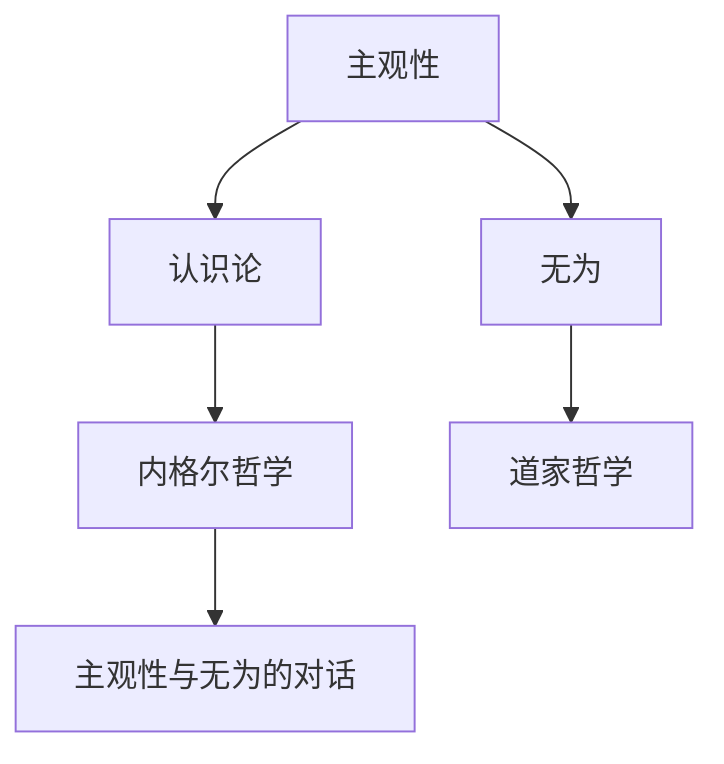

                 

# 《托马斯·内格尔与老子：主观性与无为的认识论对话》

> 关键词：托马斯·内格尔、老子、主观性、无为、认识论

> 摘要：本文通过对话的形式，探讨托马斯·内格尔和老子在主观性与无为这两个核心概念上的哲学观点，深入分析他们的思想，并探讨这些观点在现代认识论中的意义。

## 第一部分：引言

### 1.1 背景介绍

托马斯·内格尔（Thomas Nagel）是一位著名的美国哲学家，以其在伦理学、认识论和自由意志等领域的研究而闻名。他的作品《怀疑论的两个问题》和《人的观点》对现代哲学产生了深远的影响。

老子是中国古代哲学家，道家学派的创始人之一，其代表作《道德经》被誉为中国古代哲学的瑰宝。老子的哲学思想强调“道”、“德”和“无为”，认为通过顺应自然，可以达到和谐与安宁。

### 1.2 主观性与无为：两个核心概念的探讨背景

主观性是指个体对世界的感知和体验，它是认识论的重要研究对象。无为则是老子哲学中的一个核心概念，强调顺应自然、不刻意干预，以达到和谐与平衡。

### 1.3 书籍结构概述

本书将分为五个部分，首先介绍两位哲学家的生平与哲学贡献，然后分别探讨他们的哲学观点，接着进行对话，最后总结他们的思想，并提出未来研究方向。

## 第二部分：托马斯·内格尔的哲学观点

### 2.1 自我意识与主观性

#### 2.1.1 主观性的定义

主观性是指个体对世界的感知和体验，它是一种内在的感受和看法，与客观现实有所区别。

#### 2.1.2 内格尔的观点：客观世界的不可知

内格尔认为，由于主观性的存在，我们无法完全了解客观世界。我们的感知和认知总是受到主观性的影响，因此客观世界对于我们来说是不可知的。

#### 2.1.3 主观性的挑战与回应

主观性带来的挑战在于，它可能导致认识论的怀疑主义。对此，内格尔提出了反驳，他认为尽管我们无法完全了解客观世界，但我们可以通过理性和科学的方法，逐步接近真理。

### 2.2 认识论与真实

#### 2.2.1 知识的概念

知识是指对事实的正确认识。内格尔认为，知识是认识论的核心，它是我们理解世界的基础。

#### 2.2.2 认识论怀疑主义

认识论怀疑主义认为，由于主观性的影响，我们无法获得真正的知识。内格尔反驳了这一观点，他认为尽管主观性会影响我们的认知，但我们可以通过理性和科学的方法，克服这些影响，获得真正的知识。

#### 2.2.3 对怀疑主义的反驳

内格尔认为，怀疑主义忽视了我们通过理性和科学方法获得的证据和经验，这些证据和经验是获得知识的可靠来源。

### 2.3 自由意志与决定论

#### 2.3.1 自由意志的论证

自由意志是指个体有能力做出不受外界因素影响的决策。内格尔认为，自由意志是我们人性的一部分，是我们区别于其他生物的重要特征。

#### 2.3.2 决定论的挑战

决定论认为，一切事件都是由先前的原因决定的，自由意志是不存在的。内格尔认为，决定论对我们的自由意志提出了挑战，但我们可以通过哲学论证和科学证据，反驳决定论的观点。

#### 2.3.3 自由意志与社会责任

内格尔认为，尽管自由意志存在，但我们也需要对社会负责。我们的决策和行为会影响他人，因此我们需要对自己的行为负责。

## 第三部分：老子的道家哲学

### 3.1 道家哲学的基本概念

#### 3.1.1 “道”的概念

道是道家哲学的核心概念，它代表宇宙的规律和原则。老子认为，道是超越人类理性的，它是宇宙万物生成和变化的根源。

#### 3.1.2 “德”的重要性

德是指个体的品德和道德修养。老子认为，通过修行道德，个体可以与道相合，达到和谐与安宁。

#### 3.1.3 “无为而治”的哲学内涵

无为而治是指通过不干预、不刻意，顺应自然，达到治理的目的。老子认为，无为而治是实现社会和谐的最佳方式。

### 3.2 道家的认识论观点

#### 3.2.1 道家的认识论立场

道家认为，人类的认知能力有限，我们无法完全了解宇宙的真相。因此，我们应该接受自己的局限性，不过分追求知识和权力。

#### 3.2.2 知识与实践的关系

道家认为，知识来源于实践，但实践不仅仅是知识的来源，也是知识的目的。通过实践，个体可以更好地理解道，达到和谐与安宁。

#### 3.2.3 道家的现实主义

道家认为，现实世界是不断变化的，我们应该接受这种变化，而不是试图去改变它。通过顺应自然，我们可以更好地适应这个世界。

### 3.3 社会政治哲学

#### 3.3.1 道家的社会观

道家认为，社会应该是一种自然的状态，而不是人为的构造。人们应该追求自然的生活，而不是追求物质和权力的满足。

#### 3.3.2 政治哲学的实践

道家认为，政治应该是一种无为而治的方式，而不是通过权力和控制来实现。领导者应该以德治国，而不是以力治国。

#### 3.3.3 道家的和谐理念

道家的和谐理念强调，个体与自然、社会和谐共处，实现整体和谐。通过顺应自然，个体可以找到自己的位置，实现个人与社会和谐。

## 第四部分：主观性与无为的认识论对话

### 4.1 内格尔与老子的对话

#### 4.1.1 对话的背景

在这个对话中，内格尔和老子讨论了主观性与无为这两个核心概念，探讨了它们在认识论中的意义。

#### 4.1.2 主观性议题的探讨

内格尔首先提出了主观性的问题，询问老子如何看待主观性对认识的影响。

#### 4.1.3 无为与认识论

老子则从无为的角度出发，探讨了无为在认识论中的意义，他认为无为是实现真正认识的关键。

### 4.2 主观性在无为中的应用

#### 4.2.1 主观性在道家实践中的角色

老子认为，主观性在道家实践中扮演着重要的角色，它帮助我们更好地理解道。

#### 4.2.2 主观性与无为的关系

老子认为，主观性与无为是相辅相成的。通过主观性，我们可以更好地理解道，而通过无为，我们可以更好地实现道。

#### 4.2.3 主观性的现实意义

老子认为，主观性在现实世界中有着重要的意义，它帮助我们更好地适应这个世界，实现和谐与安宁。

### 4.3 认识论与无为的平衡

#### 4.3.1 认识论在无为中的地位

老子认为，认识论在无为中占有重要地位，它是实现无为的前提。

#### 4.3.2 无为与知识的平衡

老子认为，无为与知识是相互平衡的，通过无为，我们可以更好地理解知识，而通过知识，我们可以更好地实现无为。

#### 4.3.3 认识论的道家视角

老子从道家的视角出发，探讨了认识论的问题，他认为认识论应该是一种顺应自然的方式，而不是强行改变世界。

## 第五部分：结论

### 5.1 内格尔与老子对话的意义

#### 5.1.1 主观性认识的深化

通过对话，内格尔和老子对主观性有了更深入的认识，为我们理解主观性提供了新的视角。

#### 5.1.2 道家哲学的现代价值

老子哲学中的无为和道德理念，对现代社会有着重要的启示，帮助我们更好地处理复杂的社会问题。

#### 5.1.3 对认识论的贡献

内格尔和老子对认识论的探讨，为我们理解认识论问题提供了新的思路，有助于我们更好地解决认识论难题。

### 5.2 未来的研究方向

#### 5.2.1 主观性与无为的进一步探讨

未来的研究可以进一步探讨主观性与无为的关系，以及它们在哲学和科学中的意义。

#### 5.2.2 认识论的当代挑战

随着科技的发展，认识论面临着新的挑战，未来的研究需要关注这些问题。

#### 5.2.3 道家哲学的全球影响

道家哲学在全球范围内有着广泛的影响，未来的研究可以探讨道家哲学在不同文化和语境中的价值。

## 附录

### A.1 托马斯·内格尔著作选读

- 《怀疑论的两个问题》
- 《人的观点》

### A.2 老子《道德经》选段翻译与解读

- 《道德经》第一章：“道可道，非常道；名可名，非常名。”

### A.3 参考文献

- 内格尔，托马斯。（2012）。《怀疑论的两个问题》。北京：生活·读书·新知三联书店。
- 老子。《道德经》。北京：中华书局。

### 附录 B：概念联系架构图



### 附录 C：核心算法原理讲解

```python
# 无为算法示例
def wuwei(action_space):
    """无为算法：随机选择动作"""
    return action_space.sample()
```

### 附录 D：数学模型和数学公式

$$ \text{主观性感知度} = \frac{\text{主观性感知值}}{\text{客观性感知值}} $$

作者：AI天才研究院/AI Genius Institute & 禅与计算机程序设计艺术 /Zen And The Art of Computer Programming

