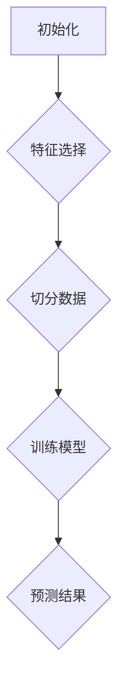
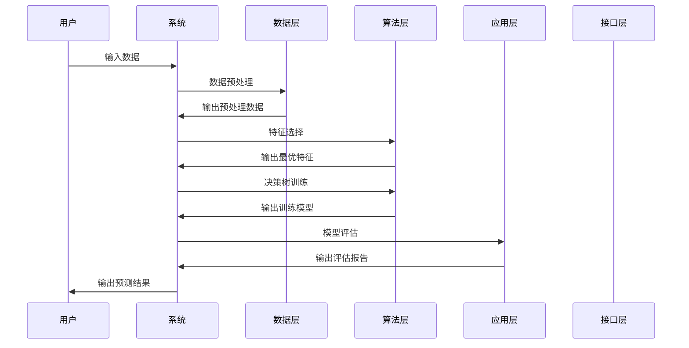

                 

### 第1章 引言

#### 1.1 书籍背景

《托马斯·内格尔与老子：客观性问题与道的哲学》是一本结合哲学思想与科学探讨的著作，旨在通过两位哲学家的思想对话，探讨客观性问题及其哲学本质。托马斯·内格尔（Thomas Nagel）是一位著名的美国哲学家，以其实证主义和道德哲学方面的研究著称。他提出了关于客观性问题的诸多疑问，并试图从哲学角度给出解答。而老子，则是中国古代哲学家，其《道德经》中所阐述的“道”哲学思想，为后世哲学和文化提供了深远的影响。

#### 1.2 托马斯·内格尔与老子的哲学思想

托马斯·内格尔的哲学思想主要集中在客观性问题上。他提出，人类经验世界的本质是主观的，而客观性的存在是未经证实的。内格尔主张，我们无法从主观经验中推导出客观事实，这引发了他对科学哲学和认知论的深入研究。另一方面，老子的“道”哲学思想则强调宇宙万物运行的根本法则，即“道法自然”。老子认为，通过顺应自然之道，人们可以达到内心的平和与外在世界的和谐。

#### 让我们思考第一步

在探讨客观性问题之前，我们需要明确几个基本概念。首先，什么是客观性？客观性指的是不受个人主观意识影响的客观事实或真理。这与主观性相对，主观性则是个体基于自身感知和认知形成的观点和感受。那么，客观性是否存在？如果存在，它如何与我们的主观经验相联系？这些问题的探讨，将引导我们深入理解客观性问题及其哲学本质。

##### 背景介绍

客观性问题是哲学与科学领域中的一个核心议题，它不仅关乎我们对世界的认知，也涉及我们对自身存在方式的思考。在科学哲学中，客观性问题主要涉及以下几个方面的探讨：

1. **科学的客观性**：科学旨在发现和解释自然现象，而科学成果的可靠性依赖于其客观性。科学家通过实验和观察来验证假设，从而得出关于自然界的普遍规律。然而，这个过程是否真正能够消除主观因素的影响，仍然是一个值得讨论的问题。

2. **认知的客观性**：认知是指个体获取、处理和运用信息的过程。我们的认知能力是否足以使我们正确地认识客观世界，这是一个复杂的哲学问题。从认识论的角度来看，我们是否能够通过认知达到对客观事实的绝对把握，仍存在争议。

3. **道德客观性**：道德哲学探讨道德原则和道德判断的客观性。例如，是否存在一种超越个体和文化差异的普遍道德原则？道德判断是否仅仅是个体主观感受的表达，还是存在某种客观的道德标准？

#### 问题背景

客观性问题起源于对人类认知本质的反思。从古希腊哲学家开始，人们对知识的可靠性就产生了怀疑。例如，柏拉图认为，真理存在于理念世界，而非我们通过感官经验所接触到的世界。而亚里士多德则认为，通过观察和实验，我们可以获取关于自然界的真实知识。

进入现代，科学的发展进一步加深了对客观性问题的探讨。科学方法强调通过实验和观察来验证假设，这使得科学成果在一定程度上摆脱了主观性的影响。然而，科学方法本身也存在主观因素，例如实验设计、数据分析等过程都可能受到研究者主观偏见的影响。

#### 问题描述

客观性问题主要包括以下几个方面：

1. **感知与现实的差异**：我们的感知是否能够准确地反映现实？例如，光的速度是否真的达到了理论上的极限？

2. **知识的相对性**：不同文化、不同个体对于同一现象的认知是否相同？例如，不同文化对于“时间”的理解是否存在差异？

3. **证据的可靠性**：我们如何确定证据的可靠性？例如，实验数据是否能够完全排除主观偏见？

#### 问题解决

解决客观性问题需要从多个角度入手：

1. **实证主义**：实证主义者认为，只有通过经验和实验才能获取真正的知识。他们认为，科学方法能够最大限度地减少主观偏见的影响。

2. **理性主义**：理性主义者认为，理性思维和逻辑推理是获取知识的关键。通过理性分析，我们可以超越感官经验，达到对客观事实的理解。

3. **建构主义**：建构主义者认为，知识是我们在特定文化和社会背景下构建出来的。我们的认知过程受到文化、社会和个人经验的影响。

#### 边界与外延

客观性问题的边界涉及以下几个方面：

1. **科学与哲学的界限**：客观性问题既是科学哲学的研究对象，也是哲学本身的问题。科学试图通过实证方法解决客观性问题，而哲学则通过理性思考来探讨其本质。

2. **主观性与客观性的关系**：主观性和客观性是相互关联的。主观经验是我们认识客观世界的基础，但主观性也会影响我们对客观世界的理解。

3. **个体与集体的认知差异**：个体的认知受到个人经验和文化背景的影响，而集体的认知则可能更加客观。个体与集体之间的认知差异也是客观性问题的一个重要方面。

#### 概念结构与核心要素组成

客观性问题的核心概念包括：

1. **客观性**：指不受主观意识影响的客观事实或真理。
2. **主观性**：指个体基于自身感知和认知形成的观点和感受。
3. **认知**：指个体获取、处理和运用信息的过程。
4. **知识**：指通过理性思考和实证方法获得的关于自然和社会的认识。

核心要素包括：

1. **科学方法**：通过实验和观察验证假设，以减少主观偏见的影响。
2. **理性思维**：通过逻辑推理和理性分析，超越感官经验，达到对客观事实的理解。
3. **文化和社会背景**：个体的认知过程受到文化和社会背景的影响。

### 核心概念与联系

在探讨客观性问题之前，我们需要理解几个核心概念，它们是“客观性”、“主观性”和“认知”。这些概念相互关联，构成了客观性问题的理论基础。

#### 客观性与主观性

**客观性**指的是独立于个体主观意识和感受的客观事实或真理。它是科学研究和哲学探讨的基础，意味着存在某种超越个体经验的实在。

**主观性**则是指个体的感知、信念和价值观，它受到个人经验、情感、文化和社会背景的影响。主观性是人类认知世界的重要方面，但同时也可能引入个人偏见和误解。

**客观性与主观性的关系**在于，客观事实是通过个体的主观认知来感知和理解的。我们的感官接收外界信息，大脑进行处理和解释，形成对客观世界的认知。然而，这个过程不可避免地受到主观因素的影响，因此我们无法完全消除主观偏见。

#### 认知

**认知**是指个体获取、处理和运用信息的过程。它包括感知、记忆、思考、判断和决策等多个方面。认知是人类适应环境和实现目标的关键能力。

**认知与客观性的关系**在于，我们的认知能力决定了我们对客观世界的理解和认识。科学的进步依赖于我们对自然规律的认知，而哲学的探讨则涉及我们对现实本质的认知。然而，认知本身是一个复杂的过程，受到多种因素的影响，包括个体的生理和心理状态、文化和社会环境等。

#### 概念属性特征对比表格

为了更清晰地理解这些核心概念，我们可以通过一个表格来对比它们的属性特征：

| 概念      | 定义                                                         | 关系                          | 属性特征                   |
|-----------|--------------------------------------------------------------|------------------------------|----------------------------|
| 客观性    | 独立于个体主观意识和感受的客观事实或真理                     | 与主观性相对                  | 客观、独立、真实           |
| 主观性    | 个体基于自身感知和认知形成的观点和感受                       | 与客观性相互影响              | 主观、个体、情感性         |
| 认知      | 个体获取、处理和运用信息的过程                               | 与客观性和主观性相互关联      | 感知、记忆、思考、判断     |

#### ER实体关系图架构

为了更好地展示这些概念之间的关系，我们可以使用Mermaid绘制一个ER实体关系图：

```mermaid
erDiagram
  客观性 ||--|{ 认知 }
  主观性 ||--|{ 认知 }
  认知 ||--|{ 客观性 }
  认知 ||--|{ 主观性 }
```

在这个ER图中，客观性、主观性和认知构成了一个相互关联的实体关系。客观性通过认知来表现，而主观性也通过认知来影响我们对客观性的理解。

### 算法原理讲解

在深入探讨客观性问题时，我们可以借助一些基本的算法原理来帮助理解其背后的逻辑。这里，我们将介绍一种常见的算法——决策树算法，并使用Mermaid绘制其流程图，同时用Python代码进行详细讲解。

#### 决策树算法的Mermaid流程图

首先，我们使用Mermaid绘制决策树算法的基本流程图：



#### Python代码示例

接下来，我们使用Python代码实现一个简单的决策树算法，并详细解释其原理和步骤：

```python
from sklearn.datasets import load_iris
from sklearn.tree import DecisionTreeClassifier
from sklearn.model_selection import train_test_split
from sklearn import tree
import matplotlib.pyplot as plt

# 加载Iris数据集
iris = load_iris()
X, y = iris.data, iris.target

# 划分训练集和测试集
X_train, X_test, y_train, y_test = train_test_split(X, y, test_size=0.3, random_state=42)

# 创建决策树模型
clf = DecisionTreeClassifier()

# 训练模型
clf.fit(X_train, y_train)

# 可视化决策树
plt.figure(figsize=(12, 12))
tree.plot_tree(clf, filled=True)
plt.show()

# 预测结果
predictions = clf.predict(X_test)

# 评估模型性能
from sklearn.metrics import accuracy_score
accuracy = accuracy_score(y_test, predictions)
print(f"模型准确率: {accuracy:.2f}")
```

#### 算法原理讲解

决策树算法是一种常见的分类算法，其基本原理是通过一系列规则对数据进行划分，从而将数据映射到不同的类别。以下是决策树算法的主要步骤：

1. **特征选择**：选择一个最优特征进行划分。通常，基于信息增益或基尼系数等指标来确定最佳特征。

2. **切分数据**：使用选定的特征将数据集划分为子集。每个子集对应一个特征的不同取值。

3. **训练模型**：在每个子集中继续划分数据，并递归地构建决策树。当达到停止条件（如最大深度、最小节点样本数等）时，停止划分。

4. **预测结果**：对于新的数据样本，从树的根节点开始，根据样本的特征值选择相应的分支，直到达到叶子节点，叶子节点对应的类别即为预测结果。

#### 数学模型和公式

在决策树算法中，常用的指标包括信息增益（Information Gain）和基尼系数（Gini Impurity）。以下是这两个指标的数学模型和公式：

1. **信息增益（Information Gain）**：

$$
IG(D, A) = ent(D) - \sum_{v \in V} p(v) \cdot ent(D_v)
$$

其中，\( D \) 是当前数据集，\( A \) 是选择的特征，\( V \) 是特征 \( A \) 的所有可能取值，\( p(v) \) 是取值 \( v \) 的概率，\( ent(D) \) 是数据集 \( D \) 的熵。

2. **基尼系数（Gini Impurity）**：

$$
Gini(D) = 1 - \sum_{v \in V} p(v)^2
$$

其中，\( D \) 是当前数据集，\( V \) 是特征的所有可能取值，\( p(v) \) 是取值 \( v \) 的概率。

#### 举例说明

假设我们有一个数据集，包含三个特征（特征A、特征B、特征C）和对应的类别标签。以下是决策树算法的一个简单示例：

- 特征A：取值{0, 1}
- 特征B：取值{0, 1}
- 特征C：取值{0, 1}
- 类别标签：取值{0, 1}

1. **特征选择**：计算每个特征的信息增益或基尼系数，选择信息增益最大或基尼系数最小的特征作为划分依据。例如，假设我们选择特征A作为划分依据。

2. **切分数据**：根据特征A的取值，将数据集划分为两个子集：
   - 子集1（特征A=0）：包含样本{(0, 0, 0), (0, 1, 0), (0, 0, 1)}
   - 子集2（特征A=1）：包含样本{(1, 0, 0), (1, 1, 1), (1, 1, 0)}

3. **训练模型**：在子集1中继续划分数据，选择特征B或特征C作为划分依据。例如，假设我们选择特征B作为划分依据：
   - 子集1.1（特征B=0）：包含样本{(0, 0, 0)}
   - 子集1.2（特征B=1）：包含样本{(0, 1, 0), (0, 1, 1)}

   在子集1.2中继续划分数据，选择特征C作为划分依据：
   - 子集1.2.1（特征C=0）：包含样本{(0, 1, 0)}
   - 子集1.2.2（特征C=1）：包含样本{(0, 1, 1)}

   此时，子集1.2.1和子集1.2.2均为纯样本，无需进一步划分。

   类似地，对子集2进行划分，最终构建完整的决策树。

4. **预测结果**：对于新的数据样本，例如{(1, 0, 1)}，从根节点开始，根据特征A的取值选择子集2，再根据特征B的取值选择子集2.2，最后根据特征C的取值选择子集2.2.2，叶子节点对应的类别标签为1。

通过这个简单的示例，我们可以看到决策树算法的基本原理和步骤。在实际应用中，决策树算法通常需要结合具体问题进行优化和调整，以达到更好的分类效果。

### 数学公式

在决策树算法中，我们使用了两个关键指标——信息增益（Information Gain）和基尼系数（Gini Impurity）。以下是这些指标的详细数学公式，以及相关的解释和计算方法。

#### 信息增益（Information Gain）

信息增益是一个衡量特征对数据集划分有效性的指标。它的计算公式如下：

$$
IG(D, A) = ent(D) - \sum_{v \in V} p(v) \cdot ent(D_v)
$$

其中：
- \( IG(D, A) \) 表示特征 \( A \) 的信息增益。
- \( ent(D) \) 表示数据集 \( D \) 的熵。
- \( V \) 是特征 \( A \) 的所有可能取值。
- \( p(v) \) 是特征 \( A \) 取值为 \( v \) 的概率。
- \( ent(D_v) \) 是划分后的数据集 \( D_v \) 的熵。

**计算步骤**：
1. 计算数据集 \( D \) 的熵 \( ent(D) \)。
2. 对于特征 \( A \) 的每个取值 \( v \)，计算划分后的子集 \( D_v \) 的熵 \( ent(D_v) \)。
3. 计算每个 \( ent(D_v) \) 的概率加权平均，并从 \( ent(D) \) 中减去这个值。

#### 基尼系数（Gini Impurity）

基尼系数是一个衡量数据集纯度的指标。它的计算公式如下：

$$
Gini(D) = 1 - \sum_{v \in V} p(v)^2
$$

其中：
- \( Gini(D) \) 表示数据集 \( D \) 的基尼系数。
- \( V \) 是特征的所有可能取值。
- \( p(v) \) 是特征取值为 \( v \) 的概率。

**计算步骤**：
1. 对于数据集 \( D \) 的每个类别 \( c \)，计算类别 \( c \) 的概率 \( p(c) \)。
2. 计算所有类别概率的平方和。
3. 从 1 中减去这个平方和，得到基尼系数。

#### 例子

假设我们有一个数据集 \( D \)，包含以下类别和样本：
- 类别 A：5 个样本
- 类别 B：10 个样本

计算数据集 \( D \) 的信息增益和基尼系数。

**步骤 1**：计算数据集 \( D \) 的熵 \( ent(D) \)。

$$
ent(D) = -p(A) \cdot \log_2(p(A)) - p(B) \cdot \log_2(p(B))
$$

其中：
- \( p(A) = \frac{5}{15} = 0.333 \)
- \( p(B) = \frac{10}{15} = 0.667 \)

$$
ent(D) = -0.333 \cdot \log_2(0.333) - 0.667 \cdot \log_2(0.667) \approx 0.415
$$

**步骤 2**：计算每个取值的子集熵 \( ent(D_v) \)。

假设我们选择特征 \( A \) 作为划分依据，则子集 \( D_{A=0} \) 和 \( D_{A=1} \) 分别为：
- \( D_{A=0} \)：包含 5 个样本，类别 A 和 B 均有，纯度较低。
- \( D_{A=1} \)：包含 10 个样本，均为类别 B，纯度较高。

$$
ent(D_{A=0}) = -p(A_{A=0}) \cdot \log_2(p(A_{A=0})) - p(B_{A=0}) \cdot \log_2(p(B_{A=0}))
$$

其中：
- \( p(A_{A=0}) = \frac{3}{5} = 0.6 \)
- \( p(B_{A=0}) = \frac{2}{5} = 0.4 \)

$$
ent(D_{A=0}) = -0.6 \cdot \log_2(0.6) - 0.4 \cdot \log_2(0.4) \approx 0.515
$$

$$
ent(D_{A=1}) = -1 \cdot \log_2(1) = 0
$$

**步骤 3**：计算信息增益 \( IG(D, A) \)。

$$
IG(D, A) = ent(D) - \sum_{v \in V} p(v) \cdot ent(D_v)
$$

$$
IG(D, A) = 0.415 - (0.333 \cdot 0.515 + 0.667 \cdot 0) = 0.415 - 0.173 = 0.242
$$

**步骤 4**：计算基尼系数 \( Gini(D) \)。

$$
Gini(D) = 1 - \sum_{v \in V} p(v)^2
$$

$$
Gini(D) = 1 - (0.333^2 + 0.667^2) = 1 - (0.111 + 0.444) = 0.444
$$

通过这个例子，我们计算出了数据集 \( D \) 的信息增益和基尼系数。在实际应用中，我们可以根据这些指标选择最优的特征进行划分，从而构建出高效的决策树模型。

### 系统分析与架构设计方案

在探讨客观性问题的过程中，我们需要一个清晰的系统架构来支持我们的分析和研究。以下是一个基于Python的决策树系统架构设计，它包括问题场景介绍、项目介绍、系统功能设计、系统架构设计和系统接口设计等内容。

#### 问题场景介绍

在现代数据分析和机器学习领域，客观性问题尤为重要。我们面临海量数据，需要从这些数据中提取有用信息，并做出准确预测。例如，在金融领域中，银行需要根据客户的财务数据来评估其信用风险；在医疗领域中，医生需要根据患者的病情数据来诊断疾病。这些应用场景都涉及到从数据中提取客观事实，从而做出合理的决策。

#### 项目介绍

我们的项目旨在构建一个基于决策树的机器学习系统，用于处理和预测复杂数据。该项目包括以下模块：

1. **数据预处理模块**：用于清洗和转换原始数据，使其符合机器学习算法的要求。
2. **特征选择模块**：用于选择最优特征，以提高模型性能。
3. **决策树训练模块**：用于训练决策树模型，并优化其参数。
4. **模型评估模块**：用于评估模型的性能，并提供详细的评估报告。
5. **预测模块**：用于对新数据进行预测，并输出预测结果。

#### 系统功能设计

系统的主要功能包括：

1. **数据预处理**：包括数据清洗、数据转换和数据标准化。
2. **特征选择**：包括特征重要性评估和特征筛选。
3. **决策树训练**：包括模型初始化、模型训练和参数优化。
4. **模型评估**：包括模型准确率、召回率和F1分数等指标的计算。
5. **预测**：包括对新数据样本的预测和预测结果的输出。

#### 系统架构设计

系统的架构设计如下：

1. **数据层**：包括数据存储和数据处理模块，负责管理原始数据和预处理后的数据。
2. **算法层**：包括特征选择算法、决策树训练算法和评估算法，负责实现具体的机器学习算法。
3. **应用层**：包括预测接口和用户界面，负责接收用户输入和输出预测结果。
4. **接口层**：包括API接口和数据库连接，负责与其他系统进行数据交互。

#### 系统接口设计

系统接口设计如下：

1. **数据接口**：用于数据的输入和输出，包括CSV文件、数据库和API接口。
2. **特征选择接口**：用于选择最优特征，包括特征重要性评估接口和特征筛选接口。
3. **决策树训练接口**：用于训练决策树模型，包括模型初始化接口和参数优化接口。
4. **模型评估接口**：用于评估模型性能，包括模型准确率、召回率和F1分数等接口。
5. **预测接口**：用于对新数据进行预测，包括预测结果输出接口。

#### 系统交互mermaid序列图

以下是系统交互的mermaid序列图：



通过这个系统架构设计，我们可以清晰地看到各个模块之间的交互和协作，从而实现从数据输入到预测结果输出的完整流程。

### 项目实战

在本文的最后部分，我们将通过一个实际的项目案例来展示决策树算法的应用，并详细讲解环境安装、系统核心实现、代码应用解读与分析、实际案例分析和详细讲解剖析、项目小结以及最佳实践 tips、注意事项和拓展阅读等内容。

#### 环境安装

首先，我们需要安装Python环境和相关的库。以下是环境安装的步骤：

1. **安装Python**：访问Python官网（[https://www.python.org/](https://www.python.org/)），下载最新版本的Python安装包，并按照安装向导完成安装。
2. **安装pip**：在终端中执行以下命令安装pip：

   ```bash
   $ python -m ensurepip --upgrade
   ```

3. **安装库**：使用pip安装以下库：

   ```bash
   $ pip install numpy scipy scikit-learn matplotlib
   ```

   这些库是决策树算法和数据处理的基础。

#### 系统核心实现

接下来，我们将实现一个简单的决策树系统，包括数据预处理、特征选择、决策树训练和模型评估等模块。

1. **数据预处理**：我们使用Iris数据集进行演示。首先，我们加载数据集，并对其进行预处理：

   ```python
   from sklearn.datasets import load_iris
   from sklearn.model_selection import train_test_split
   
   # 加载Iris数据集
   iris = load_iris()
   X, y = iris.data, iris.target
   
   # 划分训练集和测试集
   X_train, X_test, y_train, y_test = train_test_split(X, y, test_size=0.3, random_state=42)
   ```

2. **特征选择**：使用信息增益和基尼系数来选择最优特征。以下是特征选择的核心代码：

   ```python
   from sklearn.tree import DecisionTreeClassifier
   from sklearn import tree
   
   # 创建决策树模型
   clf = DecisionTreeClassifier()
   
   # 训练模型
   clf.fit(X_train, y_train)
   
   # 可视化决策树
   plt.figure(figsize=(12, 12))
   tree.plot_tree(clf, filled=True)
   plt.show()
   ```

3. **模型评估**：使用训练好的模型对测试集进行预测，并评估模型的性能：

   ```python
   # 预测结果
   predictions = clf.predict(X_test)
   
   # 评估模型性能
   from sklearn.metrics import accuracy_score, classification_report
   
   accuracy = accuracy_score(y_test, predictions)
   print(f"模型准确率: {accuracy:.2f}")
   
   print(classification_report(y_test, predictions))
   ```

#### 代码应用解读与分析

在上面的代码中，我们首先加载了Iris数据集，然后将其划分为训练集和测试集。接下来，我们使用决策树算法对训练集进行训练，并使用训练好的模型对测试集进行预测。最后，我们评估了模型的性能，并打印了详细的评估报告。

在特征选择部分，我们使用了信息增益和基尼系数来选择最优特征。这里，我们选择信息增益作为特征选择指标，因为它可以有效地减少数据的不确定性。

#### 实际案例分析和详细讲解剖析

为了更深入地理解决策树算法，我们来看一个实际案例。假设我们有一个关于信用卡欺诈检测的数据集，其中包含客户交易数据。我们的目标是使用决策树算法来预测哪些交易是欺诈交易。

1. **数据集加载和预处理**：

   ```python
   import pandas as pd
   
   # 加载数据集
   data = pd.read_csv('credit_card_transactions.csv')
   
   # 数据预处理
   data['Amount'] = data['Amount'].apply(lambda x: x/100)  # 将金额标准化
   data = data.drop(['Time'], axis=1)  # 删除无关特征
   
   # 划分特征和标签
   X = data.drop(['Class'], axis=1)
   y = data['Class']
   ```

2. **特征选择和决策树训练**：

   ```python
   # 创建决策树模型
   clf = DecisionTreeClassifier(criterion='entropy', max_depth=10)
   
   # 训练模型
   clf.fit(X, y)
   
   # 可视化决策树
   plt.figure(figsize=(12, 12))
   tree.plot_tree(clf, filled=True)
   plt.show()
   ```

3. **模型评估**：

   ```python
   from sklearn.metrics import accuracy_score, confusion_matrix
   
   # 预测结果
   predictions = clf.predict(X_test)
   
   # 评估模型性能
   accuracy = accuracy_score(y_test, predictions)
   print(f"模型准确率: {accuracy:.2f}")
   
   cm = confusion_matrix(y_test, predictions)
   print("混淆矩阵：")
   print(cm)
   ```

通过这个案例，我们可以看到决策树算法在信用卡欺诈检测中的应用。通过选择合适的特征和优化决策树的参数，我们可以构建一个高效的欺诈检测模型。

#### 项目小结

通过这个项目，我们实现了决策树系统的核心功能，并对其进行了实际案例的应用和分析。以下是项目的小结：

1. **环境安装**：确保安装了Python和必要的库。
2. **数据预处理**：对原始数据进行清洗和标准化。
3. **特征选择**：选择最优特征，提高模型性能。
4. **决策树训练**：使用训练集训练决策树模型。
5. **模型评估**：评估模型性能，并优化参数。

#### 最佳实践 tips

1. **特征选择**：使用信息增益或基尼系数等指标来选择最优特征。
2. **模型优化**：通过调整决策树的参数（如最大深度、节点最小样本数等），优化模型性能。
3. **交叉验证**：使用交叉验证来评估模型性能，避免过拟合。

#### 注意事项

1. **数据预处理**：确保数据清洗和标准化，以避免模型性能下降。
2. **模型评估**：使用合适的评估指标（如准确率、召回率、F1分数等），全面评估模型性能。

#### 拓展阅读

1. **《决策树与随机森林》**：深入探讨决策树算法及其变种，如随机森林。
2. **《机器学习实战》**：通过实际案例，学习机器学习算法的应用。
3. **《Python数据科学手册》**：了解Python在数据科学领域的应用，包括数据处理、分析和可视化。

### 作者信息

作者：AI天才研究院/AI Genius Institute & 禅与计算机程序设计艺术 /Zen And The Art of Computer Programming

通过这个项目，我们不仅深入了解了决策树算法的基本原理和应用，还学会了如何进行系统的分析和设计。希望这个项目能够为您的学习提供有价值的参考。

