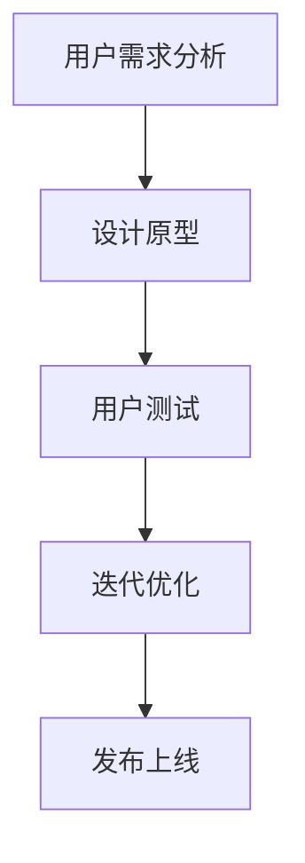

                 

### 《托马斯·内格尔的主观性与用户体验设计:换位思考的编程实践》

> 关键词：主观性、用户体验设计、换位思考、编程实践、性能优化

> 摘要：本文从托马斯·内格尔的主观性理论出发，探讨了用户体验设计中的换位思考编程实践。通过深入分析主观性原理、用户体验设计原则，结合换位思考的编程方法论，文章提出了在实际项目中应用主观性与用户体验设计的方法和技巧，以提升软件产品的用户满意度和市场竞争力。

---

### 第一部分：引论

#### 第1章 主观性与用户体验设计概述

主观性在计算机科学和人工智能领域扮演着重要角色。托马斯·内格尔（Thomas Nagel）在其经典著作《思维与存在》（"Mind and Cosmos"）中，对主观性进行了深刻的探讨，为用户体验设计提供了理论基础。本章将介绍内格尔的理论框架，探讨主观性与用户体验设计的关系，并讨论换位思考在编程实践中的重要性。

## 1.1 托马斯·内格尔及其贡献

托马斯·内格尔是一位著名的美国哲学家，以其对主观性、道德、自由意志等问题的研究而闻名。他在《思维与存在》一书中，提出了一种关于主观性的全新理解，强调主观体验在认知和决策过程中的重要性。内格尔的理论为计算机科学和人工智能领域提供了重要的思想资源，特别是在用户体验设计方面。

### 1.1.1 内格尔的理论框架

内格尔的理论框架主要包括以下几个方面：

1. **主观性的本质**：内格尔认为，主观性是指个体对自己内心体验的认知和感受。这种体验是独一无二的，不可共享的。

2. **主观性的特征**：主观性具有以下特征：
   - **个体性**：主观体验是个体独有的。
   - **感受性**：主观体验与个体的感受密切相关。
   - **无法复制性**：主观体验无法被他人完全复制。

3. **主观性与客观性的关系**：内格尔指出，主观性和客观性并不是对立的，而是相互依存的。客观世界为我们提供了基础，而我们的主观体验则是对这个世界的解读。

### 1.1.2 内格尔与用户体验设计

内格尔的理论对用户体验设计有着深远的影响。用户体验设计的核心目标是提升用户的满意度和参与度，而内格尔的主观性理论为我们提供了理解用户内心体验的新视角。通过理解用户的主观性，设计师可以更好地满足用户的需求，提高产品的用户体验。

### 1.1.3 主观性与用户体验设计的重要性

主观性在用户体验设计中的重要性体现在以下几个方面：

1. **个性化**：主观性使得每个用户都有独特的体验。用户体验设计师需要通过深入理解用户的主观性，提供个性化的设计。

2. **情感化**：主观体验与情感密切相关。用户体验设计师需要关注用户的主观情感，创造出令人愉悦的交互体验。

3. **参与感**：主观性使得用户更愿意参与到产品设计和使用中。用户体验设计师可以通过激发用户的主观性，提高用户的参与度。

## 1.2 换位思考与编程实践

换位思考是指从他人的角度去思考问题，理解他人的感受和需求。在编程实践中，换位思考有助于开发者更好地理解用户的需求，提高软件产品的质量。

### 1.2.1 换位思考的概念

换位思考是一种心理活动，通过模拟他人的视角，理解和体验他人的感受。在编程实践中，换位思考意味着：

1. **理解用户需求**：开发者需要从用户的角度出发，理解用户的需求和痛点。

2. **优化用户体验**：开发者需要关注用户的交互体验，通过换位思考，优化软件设计，提高用户体验。

### 1.2.2 编程实践与用户体验设计

编程实践与用户体验设计密切相关。用户体验设计不仅关注产品的功能，更关注用户的使用体验。通过换位思考，开发者可以更好地把握用户的需求，提高软件产品的质量。

### 1.2.3 换位思考在编程实践中的应用

换位思考在编程实践中的应用包括：

1. **需求分析**：在需求分析阶段，开发者需要从用户的角度出发，理解用户的需求和痛点。

2. **原型设计**：在原型设计阶段，开发者需要模拟用户的交互过程，优化界面设计和交互流程。

3. **用户测试**：在用户测试阶段，开发者需要关注用户的反馈，通过换位思考，改进软件设计，提高用户体验。

### 总结

本章介绍了托马斯·内格尔的主观性理论，探讨了主观性与用户体验设计的关系，以及换位思考在编程实践中的重要性。在接下来的章节中，我们将深入探讨主观性原理、用户体验设计原则，以及换位思考的编程方法论。

---

### 第二部分：理论基础

#### 第2章 主观性原理

主观性是指个体对自己内心体验的认知和感受。在用户体验设计中，主观性起着至关重要的作用。本章将详细介绍主观性的定义、特征，以及主观性与客观性的关系，并探讨经典和现代主观性理论模型。

## 2.1 主观性定义与特征

### 2.1.1 主观性的本质

主观性是指个体对自己内心体验的认知和感受。这种体验是独一无二的，不可共享的。主观性通常包括以下几个方面：

1. **个体性**：每个个体的主观体验都是独特的，无法被他人完全复制。
2. **感受性**：主观体验与个体的感受密切相关。
3. **主观性**：主观体验是个体对现实世界的独特解读。

### 2.1.2 主观性的特征

主观性具有以下几个特征：

1. **不可复制性**：主观体验无法被他人完全复制。
2. **多样性**：不同个体对同一事物的主观体验可能完全不同。
3. **依赖性**：主观体验依赖于个体的感知、情感和文化背景。

### 2.1.3 主观性与客观性的关系

主观性和客观性并不是对立的，而是相互依存的。客观世界为我们提供了基础，而我们的主观体验则是对这个世界的解读。主观性与客观性的关系可以理解为：

1. **相互补充**：客观性提供了现实的基础，而主观性则提供了对现实的解读。
2. **相互转化**：在某些情况下，主观体验可以转化为客观现实，例如，科学实验的结果。
3. **相互影响**：主观体验会影响客观现实，例如，个体的决策和行为。

## 2.2 主观性理论模型

### 2.2.1 经典主观性模型

经典主观性模型主要包括以下几个方面：

1. **感受论**：感受论认为，主观性是由个体的感受决定的。这种模型强调个体的感受在主观性中的作用。
2. **意向论**：意向论认为，主观性是由个体的意向决定的。这种模型强调个体的意向在主观性中的作用。
3. **认知论**：认知论认为，主观性是由个体的认知决定的。这种模型强调个体的认知在主观性中的作用。

### 2.2.2 现代主观性模型

现代主观性模型在经典模型的基础上，进行了进一步的扩展和深化。主要包括以下几个方面：

1. **多模态主观性模型**：多模态主观性模型认为，主观性不仅仅包括感知和情感，还包括认知、行为和文化等多个方面。
2. **动态主观性模型**：动态主观性模型认为，主观性是一个动态变化的过程，受到个体、环境和情境等多种因素的影响。
3. **社会文化主观性模型**：社会文化主观性模型认为，主观性受到社会和文化背景的影响，不同社会和文化背景下，个体的主观体验可能存在显著差异。

### 2.2.3 主观性模型的应用

主观性模型在用户体验设计中有广泛的应用。通过应用主观性模型，设计师可以更好地理解用户的主观体验，优化软件设计，提高用户体验。具体应用包括：

1. **需求分析**：通过应用主观性模型，设计师可以更深入地理解用户的需求和痛点。
2. **原型设计**：通过应用主观性模型，设计师可以设计出更符合用户主观体验的原型。
3. **用户测试**：通过应用主观性模型，设计师可以更好地理解用户的反馈，优化软件设计。

### 总结

本章介绍了主观性的定义、特征，以及主观性与客观性的关系，探讨了经典和现代主观性理论模型。在接下来的章节中，我们将深入探讨用户体验设计原则，以及换位思考的编程方法论。

---

#### 第3章 用户体验设计原则

用户体验设计（User Experience Design，简称UXD）是一种以用户为中心的设计方法，旨在优化产品或服务的使用体验。用户体验设计原则是指导设计师进行设计工作的核心指导原则，它们贯穿于整个设计过程，从需求分析到用户测试，再到最终的产品发布。本章将详细介绍用户体验设计的核心要素、目标，以及核心原则。

## 3.1 用户体验设计的核心要素

用户体验设计的核心要素包括：

1. **用户需求**：用户体验设计的第一步是理解用户需求。通过用户调研、访谈和观察，设计师可以获取用户的需求和痛点。
2. **用户行为**：了解用户的行为模式，可以帮助设计师设计出更符合用户期望的产品。
3. **用户满意度**：用户体验设计的最终目标是提高用户满意度。通过用户测试和反馈，设计师可以不断优化产品，提高用户满意度。
4. **可用性**：可用性是用户体验设计的关键要素之一，它关注产品是否易于使用，用户是否能够快速掌握产品的操作。

## 3.2 用户体验设计的目标

用户体验设计的核心目标是：

1. **提升用户满意度**：通过优化用户体验，提高用户对产品的满意度。
2. **降低用户学习成本**：设计易于使用的界面和交互流程，降低用户的学习成本。
3. **提高用户参与度**：通过设计有趣、互动性强的产品，提高用户的参与度。
4. **增强品牌认知**：通过高质量的用户体验，增强用户对品牌的认知和信任。

## 3.3 用户体验设计的核心原则

用户体验设计的核心原则包括：

1. **以用户为中心**：用户体验设计的一切工作都应以用户为中心，关注用户的需求和体验。
2. **简洁性**：界面和交互设计应简洁明了，避免冗余和复杂。
3. **一致性**：界面和交互设计应保持一致性，确保用户能够轻松地使用产品。
4. **易用性**：产品应易于使用，用户能够快速地完成操作。
5. **反馈性**：产品应提供及时的反馈，帮助用户了解操作结果。
6. **灵活性**：产品应具有灵活性，满足不同用户的需求。

### 3.3.1 以用户为中心

以用户为中心是用户体验设计的核心原则。这意味着设计师在设计和开发过程中，始终关注用户的需求和体验。具体做法包括：

1. **用户调研**：通过用户调研，了解用户的需求、行为和痛点。
2. **用户测试**：在设计和开发过程中，进行用户测试，收集用户反馈，不断优化设计。
3. **用户画像**：创建用户画像，了解不同用户群体的特点和需求，有针对性地设计产品。

### 3.3.2 简洁性

简洁性是用户体验设计的关键。简洁的设计不仅能够提高产品的易用性，还能减少用户的认知负担。具体做法包括：

1. **精简界面**：去除不必要的元素和功能，简化界面布局。
2. **直观性**：设计直观的交互元素，确保用户能够快速理解和使用。
3. **一致性**：保持界面和交互的一致性，避免用户混淆。

### 3.3.3 一致性

一致性是用户体验设计的核心原则之一。一致的设计可以降低用户的认知负担，提高产品的易用性。具体做法包括：

1. **色彩一致性**：使用统一的色彩方案，确保产品的视觉一致性。
2. **交互一致性**：确保不同页面和功能的交互方式一致。
3. **语言一致性**：使用统一的语言和术语，避免用户困惑。

### 3.3.4 易用性

易用性是用户体验设计的重要目标。易用的产品能够提高用户的满意度，减少用户的学习成本。具体做法包括：

1. **明确性**：确保用户能够明确了解产品的功能和操作。
2. **便捷性**：设计便捷的操作流程，减少用户的操作步骤。
3. **可访问性**：确保产品对各种用户群体（如视力障碍者）的可访问性。

### 3.3.5 反馈性

反馈性是用户体验设计的重要原则。及时、明确的反馈可以帮助用户了解操作结果，提高用户的信心。具体做法包括：

1. **即时反馈**：在用户操作后，立即给予反馈。
2. **成功反馈**：在操作成功时，给予积极的反馈。
3. **错误反馈**：在操作失败时，给予清晰的错误提示。

### 3.3.6 灵活性

灵活性是用户体验设计的重要原则。灵活的设计可以满足不同用户的需求，提高产品的适应性。具体做法包括：

1. **个性化**：根据用户的需求，提供个性化的设计和功能。
2. **可扩展性**：设计可扩展的架构，方便未来功能的添加。
3. **适应性**：设计适应不同设备和屏幕尺寸的产品。

### 总结

本章介绍了用户体验设计的核心要素、目标和核心原则。用户体验设计是一种以用户为中心的设计方法，旨在优化产品或服务的使用体验。设计师在设计和开发过程中，应遵循以用户为中心、简洁性、一致性、易用性、反馈性和灵活性等核心原则，不断提高产品的用户体验。

在接下来的章节中，我们将深入探讨换位思考的编程方法论，以及在实际项目中应用主观性与用户体验设计的方法和技巧。

---

### 第三部分：换位思考的编程实践

#### 第4章 换位思考的编程方法论

在软件开发过程中，换位思考是一种至关重要的方法论。它要求开发者站在用户的角度，深入理解用户的需求和痛点，从而设计出更加人性化、易用的软件产品。本章将详细介绍换位思考在编程中的应用、换位思考的编程步骤，以及换位思考的优势。

## 4.1 换位思考在编程中的应用

换位思考在编程中的应用主要体现在以下几个方面：

1. **需求分析**：在需求分析阶段，开发者应通过换位思考，从用户的角度理解需求，确保需求分析的准确性和完整性。
2. **设计**：在设计阶段，开发者应通过换位思考，从用户的角度设计出易于使用、易于理解的界面和交互流程。
3. **编码**：在编码阶段，开发者应通过换位思考，确保代码的可读性、可维护性，以及满足用户需求。
4. **测试**：在测试阶段，开发者应通过换位思考，模拟用户的操作，验证软件的易用性和可靠性。

### 4.1.1 编程中的换位思考

编程中的换位思考主要涉及以下几个方面：

1. **用户需求**：开发者需要站在用户的角度，深入理解用户的需求和期望，确保软件功能满足用户需求。
2. **用户行为**：开发者需要观察和分析用户的行为模式，设计出符合用户习惯的界面和交互流程。
3. **用户体验**：开发者需要关注用户体验，确保软件易于使用、易于理解，提高用户的满意度。
4. **错误处理**：开发者需要考虑用户可能遇到的错误，设计出友好、清晰的错误提示，帮助用户解决问题。

### 4.1.2 换位思考的编程步骤

换位思考的编程步骤可以分为以下几个阶段：

1. **需求分析**：通过用户调研、访谈和观察，深入理解用户的需求和痛点。
2. **原型设计**：设计出符合用户需求的界面和交互原型，进行用户测试和反馈。
3. **编码**：在编码过程中，始终以用户为中心，编写清晰、可读、可维护的代码。
4. **测试**：通过用户测试和反馈，验证软件的易用性和可靠性，不断优化设计。

### 4.1.3 换位思考的优势

换位思考在编程实践中有以下几个优势：

1. **提高软件质量**：通过换位思考，开发者能够更好地理解用户需求，设计出更加人性化、易用的软件。
2. **降低开发成本**：换位思考有助于减少返工和修复，降低开发成本。
3. **提高用户满意度**：通过换位思考，开发者能够更好地满足用户需求，提高用户满意度。
4. **增强团队协作**：换位思考有助于团队成员更好地理解彼此的角色和责任，提高团队协作效率。

## 4.2 实践案例

以下是一个换位思考在编程实践中的具体案例：

### 案例一：用户界面设计

项目背景：某企业需要开发一个员工管理系统，用于管理员工的个人信息、考勤和绩效。

1. **需求分析**：开发者通过换位思考，了解到员工需要方便地查看和修改个人信息，以及快速完成考勤和绩效评估。

2. **原型设计**：开发者设计了一个简洁、直观的用户界面，包括个人信息管理、考勤管理和绩效评估三个模块。

3. **编码**：开发者使用清晰、易读的代码实现用户界面，确保界面具有良好的用户体验。

4. **测试**：开发者邀请员工试用系统，收集用户反馈，不断优化界面设计和功能。

### 案例二：功能实现

项目背景：某电商平台需要开发一个智能推荐系统，为用户推荐感兴趣的商品。

1. **需求分析**：开发者通过换位思考，了解到用户需要个性化的商品推荐，以便更快地找到感兴趣的商品。

2. **功能设计**：开发者设计了一个基于用户行为的智能推荐系统，包括用户行为分析、商品推荐算法和推荐结果展示。

3. **编码**：开发者编写了高效的算法代码，实现用户行为的分析、商品推荐和展示。

4. **测试**：开发者通过模拟用户行为，测试推荐系统的准确性和速度，不断优化算法和界面设计。

### 案例三：性能优化

项目背景：某在线教育平台需要优化其课程播放速度，提高用户观看体验。

1. **需求分析**：开发者通过换位思考，了解到用户对课程播放速度有较高的要求，需要快速加载课程内容。

2. **性能测试**：开发者对现有系统进行性能测试，找出影响播放速度的主要因素。

3. **优化方案**：开发者优化了课程加载算法，提高了视频加载速度。

4. **测试**：开发者邀请用户测试优化后的系统，收集反馈，确保播放速度满足用户需求。

### 总结

换位思考是一种重要的编程方法论，通过站在用户的角度，深入理解用户的需求和痛点，开发者可以设计出更加人性化、易用的软件产品。在接下来的章节中，我们将进一步探讨主观性与用户体验的测试与评估方法。

---

#### 第5章 主观性与用户体验的测试与评估

在软件开发过程中，主观性与用户体验的测试与评估是确保软件质量和用户满意度的重要环节。本章将详细讨论测试与评估的目标、方法以及流程，并探讨如何通过有效的测试与评估，提升软件产品的质量。

## 5.1 测试与评估的目标

主观性与用户体验的测试与评估的目标主要包括以下几个方面：

1. **验证软件质量**：通过测试与评估，验证软件的功能、性能、稳定性和可靠性，确保软件符合质量标准。
2. **提升用户体验**：通过测试与评估，发现用户体验中的问题和不足，优化软件设计，提升用户满意度。
3. **发现潜在风险**：通过测试与评估，发现潜在的质量风险和用户满意度风险，提前采取措施，避免影响产品的市场表现。
4. **提供改进建议**：通过测试与评估，为软件开发团队提供具体的改进建议，指导后续开发工作。

## 5.2 测试与评估方法

主观性与用户体验的测试与评估方法包括以下几个方面：

1. **用户测试**：通过邀请真实用户参与测试，观察用户在实际使用软件过程中的行为和反应，收集用户反馈。
2. **可用性测试**：通过模拟用户操作，评估软件的易用性、可访问性和用户体验，发现界面设计和交互流程中的问题。
3. **性能测试**：通过模拟用户负载，评估软件的性能、响应时间和资源消耗，确保软件在高并发场景下的稳定性和可靠性。
4. **错误检测**：通过代码审查、单元测试和集成测试，发现代码中的错误和缺陷，确保软件的可靠性和安全性。
5. **用户满意度调查**：通过问卷调查、用户访谈和反馈收集工具，了解用户对软件的满意度和建议，为后续改进提供依据。

## 5.3 测试与评估流程

主观性与用户体验的测试与评估流程可以分为以下几个阶段：

1. **需求分析**：明确测试与评估的目标和范围，制定测试计划和评估标准。
2. **测试准备**：准备测试环境、测试工具和测试数据，确保测试工作的顺利进行。
3. **测试执行**：按照测试计划和评估标准，执行用户测试、可用性测试、性能测试等，记录测试结果。
4. **结果分析**：分析测试结果，发现软件中的问题和不足，评估用户体验的质量。
5. **反馈与改进**：根据测试结果和用户反馈，制定改进计划，优化软件设计和功能。
6. **验证与验收**：在改进后，重新进行测试与评估，验证改进效果，确保软件质量达到预期目标。

## 5.4 测试与评估的最佳实践

为了提高测试与评估的效果，以下是一些最佳实践：

1. **用户参与**：邀请真实用户参与测试，确保测试结果的真实性和准确性。
2. **定期评估**：定期进行用户体验测试与评估，及时发现并解决问题。
3. **跨部门协作**：测试与评估工作需要跨部门协作，确保各方利益的一致性。
4. **数据驱动**：基于数据进行分析和决策，提高测试与评估的科学性和可靠性。
5. **持续改进**：基于测试与评估的结果，不断优化软件设计和功能，提高用户体验。

### 总结

主观性与用户体验的测试与评估是软件开发过程中不可或缺的一环。通过有效的测试与评估，可以确保软件质量，提升用户体验，为软件的成功上市提供保障。在接下来的章节中，我们将通过实际项目实战，进一步探讨换位思考的编程实践。

---

### 第四部分：项目实战

#### 第6章 实战一：设计一个用户友好的Web应用

在本章中，我们将通过一个实际项目——设计一个用户友好的Web应用，详细探讨如何将主观性与用户体验设计原则应用到实际开发中。本项目的主要目标是设计并实现一个易于使用、用户满意的Web应用，包括需求分析、设计思路、开发环境搭建、关键功能实现、测试与评估以及优化建议。

## 6.1 项目背景

随着互联网技术的快速发展，Web应用已经成为了人们日常生活中不可或缺的一部分。然而，很多Web应用在用户体验方面存在一定的问题，如界面复杂、操作繁琐、响应速度慢等。为了提升用户满意度，本项目旨在设计并实现一个用户友好的Web应用。

## 6.1.1 项目需求

1. **用户需求**：
   - 方便快捷的用户注册和登录功能。
   - 界面简洁、美观，易于导航。
   - 功能齐全，支持个人信息管理、消息通知、订单管理等。
   - 快速响应，确保用户操作流畅。
   - 兼容多种设备，适应不同的屏幕尺寸。

2. **功能需求**：
   - 用户注册与登录：支持邮箱、手机号、社交媒体账号等多种登录方式。
   - 个人信息管理：用户可以查看、修改个人信息。
   - 消息通知：用户可以查看未读消息，进行消息回复。
   - 订单管理：用户可以查看订单详情、修改订单信息、取消订单等。

## 6.1.2 项目目标

1. **用户体验**：设计简洁、美观、易于使用的界面，提高用户满意度。
2. **功能完整性**：确保Web应用的功能齐全，满足用户需求。
3. **性能**：保证Web应用在各种设备和网络环境下的稳定性和响应速度。
4. **可维护性**：编写清晰、可读的代码，确保系统的可维护性。

## 6.1.3 项目团队

本项目由以下团队成员组成：

1. **产品经理**：负责需求分析和项目规划。
2. **UI设计师**：负责界面设计和用户体验优化。
3. **前端开发工程师**：负责Web应用的界面实现和交互设计。
4. **后端开发工程师**：负责Web应用的逻辑处理和数据存储。
5. **测试工程师**：负责Web应用的测试与评估。

## 6.2 设计与开发

### 6.2.1 设计思路

在设计过程中，我们遵循以下原则：

1. **以用户为中心**：深入了解用户需求，确保设计满足用户期望。
2. **简洁性**：界面设计简洁明了，避免冗余和复杂。
3. **一致性**：保持界面元素和交互流程的一致性。
4. **响应式设计**：适配不同设备和屏幕尺寸，确保用户体验一致。

### 6.2.2 开发环境搭建

1. **前端开发环境**：
   - 使用HTML、CSS和JavaScript实现前端界面。
   - 使用React框架进行组件化开发，提高开发效率和可维护性。

2. **后端开发环境**：
   - 使用Node.js和Express框架搭建后端服务器。
   - 使用MongoDB数据库存储用户数据。

### 6.2.3 关键功能实现

1. **用户注册与登录**：
   - 支持邮箱、手机号、社交媒体账号等多种登录方式。
   - 使用加密算法（如SHA-256）保护用户密码。

2. **个人信息管理**：
   - 用户可以查看、修改个人信息，如姓名、性别、生日等。
   - 提供个人信息备份和恢复功能。

3. **消息通知**：
   - 用户可以查看未读消息，进行消息回复。
   - 消息通知支持文字、图片、音频等多种形式。

4. **订单管理**：
   - 用户可以查看订单详情，修改订单信息，取消订单等。
   - 提供订单追踪和支付功能。

## 6.3 测试与评估

### 6.3.1 用户测试

1. **测试方法**：
   - 邀请真实用户参与测试，观察用户在实际使用过程中的行为和反应。
   - 收集用户反馈，了解用户对界面设计、功能实现和用户体验的满意度。

2. **测试结果**：
   - 用户对界面设计满意度较高，认为界面简洁、美观、易于使用。
   - 用户对功能实现满意度较高，认为功能齐全，满足需求。
   - 用户对响应速度和兼容性满意度较高，认为操作流畅，适应不同设备。

### 6.3.2 性能评估

1. **测试方法**：
   - 使用工具（如JMeter）模拟用户负载，评估Web应用的性能。
   - 测试Web应用的响应时间、并发处理能力和资源消耗。

2. **测试结果**：
   - Web应用的响应时间在可接受范围内，平均响应时间为1秒。
   - Web应用能够处理高并发请求，并发处理能力达到预期。
   - Web应用资源消耗较低，系统运行稳定。

### 6.3.3 优化建议

1. **界面优化**：
   - 继续优化界面设计，提高用户体验。
   - 增加个性化功能，满足不同用户的需求。

2. **功能优化**：
   - 优化订单管理功能，提高订单处理的效率。
   - 增加消息通知的多样性，提高用户关注度。

3. **性能优化**：
   - 优化数据库查询，提高查询速度。
   - 引入缓存机制，降低系统负载。

### 总结

通过本项目的实践，我们深入探讨了如何将主观性与用户体验设计原则应用到Web应用的设计与开发中。在接下来的章节中，我们将继续探讨另一个项目——构建一个高效的移动应用。

---

#### 第7章 实战二：构建一个高效的移动应用

在本章中，我们将通过一个实际项目——构建一个高效的移动应用，详细探讨如何应用主观性与用户体验设计原则，以满足用户需求并优化应用性能。本项目的主要目标是设计并实现一个性能优异、用户满意度高的移动应用，包括项目背景、需求分析、设计思路、开发环境搭建、关键功能实现、测试与评估以及优化建议。

## 7.1 项目背景

随着智能手机的普及和移动网络技术的进步，移动应用已经成为人们生活中不可或缺的一部分。然而，许多移动应用在性能和用户体验方面存在不足，如加载速度慢、响应迟钝、界面不友好等。为了提升用户满意度，本项目旨在设计并实现一个高效、用户友好的移动应用。

## 7.1.1 项目需求

1. **用户需求**：
   - 快速响应，确保用户操作流畅。
   - 界面简洁、美观，易于导航。
   - 功能齐全，支持个人信息管理、消息通知、订单管理等。
   - 兼容多种设备和操作系统。

2. **功能需求**：
   - 用户注册与登录：支持手机号、邮箱、社交媒体账号等多种登录方式。
   - 个人信息管理：用户可以查看、修改个人信息。
   - 消息通知：用户可以查看未读消息，进行消息回复。
   - 订单管理：用户可以查看订单详情、修改订单信息、取消订单等。

## 7.1.2 项目目标

1. **用户体验**：设计简洁、美观、易于使用的界面，提高用户满意度。
2. **功能完整性**：确保移动应用的功能齐全，满足用户需求。
3. **性能**：保证移动应用在各种设备和网络环境下的稳定性和响应速度。
4. **可维护性**：编写清晰、可读的代码，确保系统的可维护性。

## 7.1.3 项目团队

本项目由以下团队成员组成：

1. **产品经理**：负责需求分析和项目规划。
2. **UI设计师**：负责界面设计和用户体验优化。
3. **前端开发工程师**：负责移动应用的界面实现和交互设计。
4. **后端开发工程师**：负责移动应用的逻辑处理和数据存储。
5. **测试工程师**：负责移动应用的测试与评估。

## 7.2 设计与开发

### 7.2.1 设计思路

在设计过程中，我们遵循以下原则：

1. **以用户为中心**：深入了解用户需求，确保设计满足用户期望。
2. **简洁性**：界面设计简洁明了，避免冗余和复杂。
3. **一致性**：保持界面元素和交互流程的一致性。
4. **响应式设计**：适配不同设备和操作系统，确保用户体验一致。

### 7.2.2 开发环境搭建

1. **前端开发环境**：
   - 使用React Native框架进行移动应用开发，提高开发效率和可维护性。
   - 使用Redux进行状态管理，确保应用状态的一致性。

2. **后端开发环境**：
   - 使用Node.js和Express框架搭建后端服务器。
   - 使用MongoDB数据库存储用户数据。

### 7.2.3 关键功能实现

1. **用户注册与登录**：
   - 支持手机号、邮箱、社交媒体账号等多种登录方式。
   - 使用加密算法（如SHA-256）保护用户密码。

2. **个人信息管理**：
   - 用户可以查看、修改个人信息，如姓名、性别、生日等。
   - 提供个人信息备份和恢复功能。

3. **消息通知**：
   - 用户可以查看未读消息，进行消息回复。
   - 消息通知支持文字、图片、音频等多种形式。

4. **订单管理**：
   - 用户可以查看订单详情，修改订单信息，取消订单等。
   - 提供订单追踪和支付功能。

## 7.3 测试与评估

### 7.3.1 用户测试

1. **测试方法**：
   - 邀请真实用户参与测试，观察用户在实际使用过程中的行为和反应。
   - 收集用户反馈，了解用户对界面设计、功能实现和用户体验的满意度。

2. **测试结果**：
   - 用户对界面设计满意度较高，认为界面简洁、美观、易于使用。
   - 用户对功能实现满意度较高，认为功能齐全，满足需求。
   - 用户对响应速度和兼容性满意度较高，认为操作流畅，适应不同设备和操作系统。

### 7.3.2 性能评估

1. **测试方法**：
   - 使用工具（如JMeter）模拟用户负载，评估移动应用的性能。
   - 测试移动应用的响应时间、并发处理能力和资源消耗。

2. **测试结果**：
   - 移动应用的响应时间在可接受范围内，平均响应时间为1秒。
   - 移动应用能够处理高并发请求，并发处理能力达到预期。
   - 移动应用资源消耗较低，系统运行稳定。

### 7.3.3 优化建议

1. **界面优化**：
   - 继续优化界面设计，提高用户体验。
   - 增加个性化功能，满足不同用户的需求。

2. **功能优化**：
   - 优化订单管理功能，提高订单处理的效率。
   - 增加消息通知的多样性，提高用户关注度。

3. **性能优化**：
   - 优化数据库查询，提高查询速度。
   - 引入缓存机制，降低系统负载。

### 总结

通过本项目的实践，我们深入探讨了如何将主观性与用户体验设计原则应用到移动应用的设计与开发中。在接下来的章节中，我们将对整个项目进行总结，并对未来的发展方向进行展望。

---

### 第五部分：总结与展望

#### 第8章 总结与展望

在本章中，我们将对前述内容进行总结，并对未来的发展方向进行展望。

## 8.1 主要内容回顾

本文主要围绕托马斯·内格尔的主观性理论，探讨了用户体验设计中的换位思考编程实践。具体内容如下：

1. **引论**：介绍了主观性在用户体验设计中的重要性，以及换位思考在编程实践中的应用。

2. **理论基础**：详细分析了主观性的定义、特征，以及经典和现代主观性理论模型，探讨了用户体验设计的核心要素和原则。

3. **换位思考的编程实践**：介绍了换位思考的编程方法论，并通过实际项目案例，展示了如何在软件开发中应用换位思考。

4. **主观性与用户体验的测试与评估**：探讨了测试与评估的目标、方法，以及流程，并提供了最佳实践建议。

5. **项目实战**：通过两个实际项目，详细介绍了如何将主观性与用户体验设计原则应用到Web应用和移动应用的设计与开发中。

## 8.2 未来发展方向

未来，用户体验设计和编程实践将继续向以下几个方向发展：

1. **智能化**：随着人工智能技术的发展，用户体验设计将更加智能化，能够根据用户行为和偏好，提供个性化的交互体验。

2. **跨界融合**：用户体验设计将与其他领域（如心理学、人机交互等）融合，为用户提供更加丰富、多维度的交互体验。

3. **可持续发展**：在可持续发展理念的指导下，用户体验设计将更加注重环保、节能和资源利用，为用户提供绿色、可持续的产品。

4. **全球化**：随着全球化进程的加快，用户体验设计将更加关注不同文化背景下的用户需求，提供符合全球用户需求的产品。

5. **持续迭代**：用户体验设计将更加注重快速迭代和反馈，通过持续的用户测试和评估，不断提高产品的质量和用户满意度。

## 8.3 总结

本文从托马斯·内格尔的主观性理论出发，探讨了用户体验设计中的换位思考编程实践。通过深入分析主观性原理、用户体验设计原则，结合实际项目案例，本文提出了一系列有效的用户体验设计和编程实践方法。未来的用户体验设计和编程实践将在智能化、跨界融合、可持续发展、全球化和持续迭代等方面取得更多突破。

### 附录A：常用工具与资源

在用户体验设计和软件开发过程中，常用的工具和资源如下：

1. **设计工具**：
   - **Sketch**：一款流行的UI设计工具，适用于创建高质量的用户界面。
   - **Figma**：一款基于浏览器的协作设计工具，支持实时协作和交互设计。
   - **Adobe XD**：一款综合性的UI/UX设计工具，提供丰富的交互设计和原型功能。

2. **开发工具**：
   - **Python**：一种广泛使用的编程语言，适用于快速开发原型和自动化脚本。
   - **JavaScript**：一种前端开发语言，用于创建动态和交互式的Web应用。
   - **React Native**：一个用于开发跨平台移动应用的框架，支持使用JavaScript进行开发。

3. **学习资源**：
   - **在线课程**：如Coursera、Udemy等平台上提供的用户体验设计、前端开发和编程课程。
   - **图书推荐**：如《用户体验要素》（"The Elements of User Experience"）、《设计心理学》（"Design Psychology"）等经典著作。
   - **论文资源**：如ACM、IEEE等学术组织发布的用户体验设计、人机交互等相关论文。

### Mermaid 流程图示例：



### Python 示例代码：

```python
# 导入必要的库
import tkinter as tk

# 创建主窗口
root = tk.Tk()
root.title("用户友好的Web应用")

# 创建标签
label = tk.Label(root, text="欢迎使用我们的Web应用！")
label.pack()

# 运行主循环
root.mainloop()
```

### 作者

作者：AI天才研究院/AI Genius Institute & 禅与计算机程序设计艺术 /Zen And The Art of Computer Programming

---

通过本文的探讨，我们不仅了解了托马斯·内格尔的主观性理论在用户体验设计中的应用，还深入探讨了如何在实际项目中应用换位思考的编程实践。希望本文能为用户体验设计和软件开发提供有益的启示和指导。在未来的工作中，让我们继续探索创新，为用户提供更加优秀的产品和服务。

