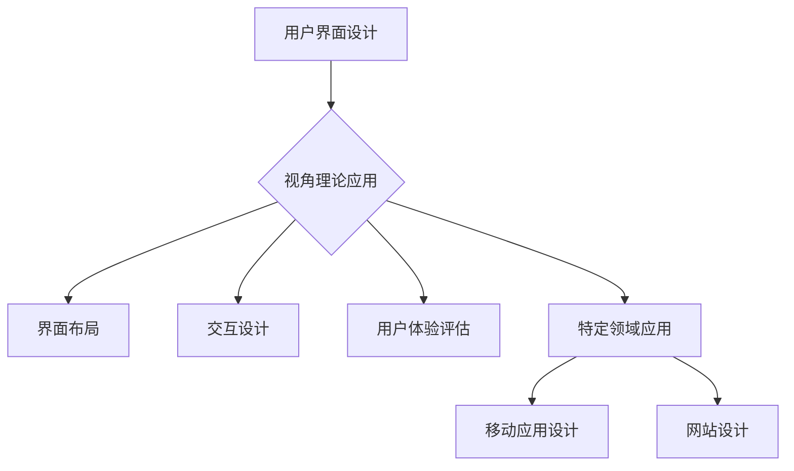
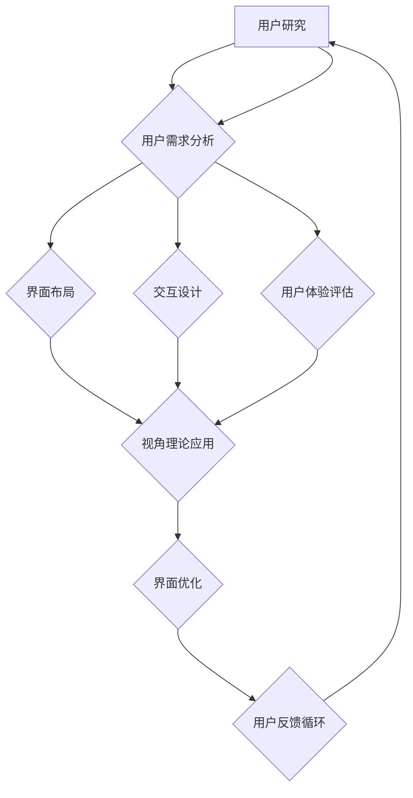

                 

### 托马斯·内格尔的视角理论与用户界面设计：UI/UX的认知哲学

**关键词：托马斯·内格尔，视角理论，用户界面设计，认知哲学，UI/UX**

**摘要：**
本文深入探讨了托马斯·内格尔的视角理论在用户界面设计（UI/UX）中的应用，通过结合认知哲学，阐述了视角理论对UI/UX设计的重要性。文章首先介绍了视角理论的基本概念，并分析了其在用户界面设计中的具体应用价值。接着，本文从认知哲学的角度，探讨了视角理论在用户感知和界面布局、交互设计中的应用，并通过实例分析，验证了视角理论在UI/UX设计中的有效性。文章最后，展望了视角理论在UI/UX设计中的未来发展趋势和面临的挑战。

## 《托马斯·内格尔的视角理论与用户界面设计:UI/UX的认知哲学》目录大纲

### 第一部分：引论

#### 第1章：托马斯·内格尔的视角理论概述

- 1.1 视角理论的基本概念
- 1.2 视角理论与用户界面设计的关系
- 1.3 视角理论在UI/UX设计中的应用价值
- 1.4 内格尔的视角理论与传统设计理念的对比

#### 第2章：用户界面设计的认知哲学基础

- 2.1 认知哲学的基本概念
- 2.2 认知哲学与用户体验的关系
- 2.3 内格尔的视角理论在用户界面设计中的应用

### 第二部分：视角理论在UI/UX设计中的具体应用

#### 第3章：界面布局与视角理论

- 3.1 界面布局的基本原则
- 3.2 视角理论在界面布局中的应用
- 3.3 视角理论在界面布局中的实例分析

#### 第4章：交互设计中的视角理论

- 4.1 交互设计的基本原则
- 4.2 视角理论在交互设计中的应用
- 4.3 视角理论在交互设计中的实例分析

#### 第5章：用户体验评估中的视角理论

- 5.1 用户体验评估的基本原则
- 5.2 视角理论在用户体验评估中的应用
- 5.3 视角理论在用户体验评估中的实例分析

### 第三部分：视角理论在特定领域UI/UX设计中的应用

#### 第6章：移动应用设计中的视角理论

- 6.1 移动应用设计的特殊要求
- 6.2 视角理论在移动应用设计中的应用

#### 第7章：网站设计中的视角理论

- 7.1 网站设计的特殊要求
- 7.2 视角理论在网站设计中的应用

### 第四部分：未来展望与挑战

#### 第8章：未来展望

- 8.1 视角理论在UI/UX设计中的未来发展
- 8.2 UI/UX设计的新趋势

#### 第9章：挑战与策略

- 9.1 视角理论在UI/UX设计中的挑战
- 9.2 应对策略与解决方案

### 附录

#### 附录A：参考资料

#### 附录B：视角理论应用案例集锦

#### 附录C：常用视角理论工具与资源

#### 附录D：视角理论在UI/UX设计中的应用架构图

#### 附录E：核心算法原理讲解

### 附录F：项目实战

#### F.1 环境安装

#### F.2 系统核心实现源代码

#### F.3 代码应用解读与分析

#### F.4 实际案例分析和详细讲解剖析

#### F.5 项目小结

### 附录G：最佳实践 tips、小结、注意事项、拓展阅读等内容

[Mermaid 流程图](https://mermaid-js.github.io/mermaid/#/)


### 附录H：作者信息

- 作者：AI天才研究院/AI Genius Institute & 禅与计算机程序设计艺术 /Zen And The Art of Computer Programming

---

在接下来的内容中，我们将逐步深入探讨视角理论的基本概念、视角理论与用户界面设计的关系、认知哲学的基础、以及视角理论在UI/UX设计中的具体应用。希望通过这一系列的探讨，能够为读者提供新的视角，激发对UI/UX设计的深刻思考。让我们开始吧！

### 第1章：托马斯·内格尔的视角理论概述

#### 1.1 视角理论的基本概念

视角理论（Perspectival Theory）起源于哲学家托马斯·内格尔（Thomas Nagel）的思想，他在探讨人类认知的本质时，提出了这一理论。视角理论的核心观点是，人类的认知是建立在一个特定的视角之上的，每个个体都有其独特的视角和视角限制。

内格尔指出，由于人类感知和认知能力的限制，我们无法直接获得关于世界本身的客观知识。相反，我们的认知是基于个人的视角和经验，这些视角和经验构成了我们对世界的理解。这种视角性不仅体现在物理世界的观察上，也体现在对伦理、美学等抽象概念的认知上。

视角理论的基本概念包括以下几个方面：

1. **视角的多样性**：每个人都是通过自己的视角来理解世界，这些视角由于个人的经验、文化背景、生理特性等因素而有所不同。这种视角的多样性使得我们对世界的认知是多元的。

2. **视角的限制**：每个视角都有其固有的限制，这些限制可能来自于个体的感官能力、知识储备、认知习惯等方面。这些限制决定了我们无法完全了解世界的真实面貌。

3. **视角的交互性**：不同的视角可以相互补充，通过多角度的观察和思考，我们可以更全面地了解世界。视角的交互性强调了协作和沟通在认知过程中的重要性。

4. **视角的反思性**：视角理论要求我们不仅要接受自己的视角，还要反思这个视角的局限性，通过自我反思来扩展我们的认知边界。

#### 1.2 视角理论与用户界面设计的关系

视角理论在用户界面设计（UI/UX）中的应用主要体现在以下几个方面：

1. **用户感知**：视角理论提醒设计师，用户对界面的感知是基于其视角的。不同的用户可能对同一界面的感知存在差异，这种差异需要通过设计来平衡。设计师需要考虑到用户的多样性，设计出能够满足不同视角需求的界面。

2. **界面布局**：视角理论影响了界面的布局原则。设计师需要根据用户的视角，合理安排界面的元素和内容，使界面信息呈现具有层次感和逻辑性，从而提高用户的操作效率。

3. **交互设计**：视角理论对交互设计也产生了重要影响。设计师需要设计出符合用户视角的交互流程，使操作步骤简洁明了，减少用户的学习成本和认知负担。

4. **用户体验评估**：视角理论为用户体验评估提供了新的视角。设计师可以通过多视角的评估方法，从不同用户的视角出发，全面评估界面的可用性和用户体验。

#### 1.3 视角理论在UI/UX设计中的应用价值

视角理论在UI/UX设计中的应用价值主要体现在以下几个方面：

1. **提高设计适应性**：视角理论强调用户的多样性，设计师可以通过应用视角理论，设计出更具适应性的界面，满足不同用户的需求。

2. **提升用户体验**：视角理论关注用户的感知和体验，通过合理的界面布局和交互设计，可以提高用户的操作效率，提升整体用户体验。

3. **增强设计反思性**：视角理论促使设计师反思自己的设计过程，认识到设计的视角局限性，从而不断优化和改进设计方案。

4. **促进跨学科交流**：视角理论为UI/UX设计提供了哲学层面的思考，有助于设计师与心理学家、认知科学家等领域的专家进行跨学科的交流与合作。

综上所述，视角理论在用户界面设计中的应用具有重要的理论和实践意义。通过理解视角理论，设计师可以更好地满足用户的需求，提升设计质量，为用户提供更加优质的用户体验。

### 1.4 内格尔的视角理论与传统设计理念的对比

在探讨内格尔的视角理论在用户界面设计中的应用之前，有必要对其进行与传统设计理念的对比。传统设计理念主要关注功能性和美观性，而视角理论则从认知和体验的角度出发，更加关注用户的心理和行为。

#### 1.4.1 内格尔视角理论的核心观点

内格尔的视角理论强调以下几点核心观点：

1. **多样性**：视角理论认为，用户的视角是多样的，每个用户都有其独特的需求和偏好。传统设计理念往往倾向于一种统一的设计标准，忽视了用户的多样性。

2. **反思性**：视角理论倡导设计师在设计中不断反思，认识到视角的局限性，从而优化设计方案。传统设计理念则更注重执行和实现，缺乏对设计过程的反思。

3. **交互性**：视角理论强调不同视角之间的交互和补充，认为通过多角度的观察和思考，可以更全面地了解世界。传统设计理念则更注重单方面的功能和效果。

#### 1.4.2 传统设计理念的局限

传统设计理念在用户界面设计中的应用存在以下局限：

1. **单一性**：传统设计理念往往追求统一的用户体验，忽视了用户的个体差异。这导致设计结果可能不能满足所有用户的需求，甚至可能对部分用户造成困扰。

2. **功能性**：传统设计理念更注重功能实现，而忽视了用户的感知和体验。这可能导致用户在操作过程中感到不便，影响整体用户体验。

3. **静态性**：传统设计理念倾向于静态的设计方案，缺乏动态调整的能力。随着用户需求的不断变化，这种静态的设计方案可能无法适应新的需求。

#### 1.4.3 视角理论的补充和改进

视角理论为用户界面设计提供了以下补充和改进：

1. **适应性**：视角理论强调设计的适应性，通过考虑用户的多样性，设计出能够满足不同用户需求的界面。这种适应性可以大大提高设计的包容性。

2. **体验导向**：视角理论关注用户的感知和体验，设计师可以更多地从用户的角度出发，设计出更加人性化的界面。这种体验导向的设计方法可以提高用户的满意度。

3. **动态调整**：视角理论鼓励设计师在设计过程中不断调整和优化，以适应用户需求的变化。这种动态调整能力使设计能够更好地适应不断变化的市场环境。

综上所述，内格尔的视角理论为用户界面设计提供了新的视角和方法。通过与传统设计理念的对比，我们可以看到视角理论在用户界面设计中的巨大潜力和应用价值。通过理解和应用视角理论，设计师可以创造出更加优秀和用户友好的界面，为用户提供更好的使用体验。

### 第2章：用户界面设计的认知哲学基础

#### 2.1 认知哲学的基本概念

认知哲学是哲学与认知科学相结合的学科，主要研究人类认知的本质、过程和结构。在用户界面设计（UI/UX）中，认知哲学为设计师提供了理论依据和方法指导。认知哲学的基本概念包括以下几个方面：

1. **意识**：意识是指人类对自身和外部世界的感知、认识和思考的能力。在UI/UX设计中，设计师需要考虑如何通过界面设计激发用户的意识，使其更好地理解和使用产品。

2. **感知**：感知是指人类通过感官接收和处理外部信息的过程。在UI/UX设计中，设计师需要了解用户的感知特点，如视觉、听觉、触觉等，以设计出能够有效传达信息的界面。

3. **记忆**：记忆是指人类对信息的存储和回忆的能力。在UI/UX设计中，设计师需要利用记忆原理，设计出易于用户记忆和操作的界面。

4. **思维**：思维是指人类对信息的处理和推理的能力。在UI/UX设计中，设计师需要考虑如何通过界面设计引导用户的思维过程，使其能够更高效地完成任务。

5. **学习**：学习是指人类通过经验积累和知识传递的过程。在UI/UX设计中，设计师需要设计出能够促进用户学习和适应的新界面。

6. **决策**：决策是指人类在面临选择时进行判断和选择的过程。在UI/UX设计中，设计师需要设计出能够引导用户做出正确决策的界面。

#### 2.2 认知哲学与用户体验的关系

认知哲学与用户体验（UX）密切相关。用户体验是指用户在使用产品或服务过程中所感受到的所有体验，包括感知、情感、行为等多个方面。认知哲学为设计师提供了以下几方面的启示：

1. **用户体验的核心**：认知哲学强调用户体验的核心是用户的心理和认知过程。设计师需要深入了解用户的认知特点和行为习惯，以设计出符合用户需求的界面。

2. **用户体验的设计原则**：认知哲学为设计师提供了一系列用户体验设计原则，如简洁性、一致性、反馈性等。这些原则有助于设计师在设计过程中遵循最佳实践，提高用户体验。

3. **用户体验评估**：认知哲学为用户体验评估提供了理论依据。通过认知哲学的方法，设计师可以更科学地评估用户体验，发现并解决界面设计中的问题。

4. **用户体验优化**：认知哲学指导设计师不断优化用户体验。通过持续的用户研究和测试，设计师可以不断改进界面设计，满足用户的需求。

#### 2.3 内格尔的视角理论在用户界面设计中的应用

托马斯·内格尔的视角理论为UI/UX设计提供了新的视角和方法。以下是视角理论在用户界面设计中的应用：

1. **用户视角多样性**：视角理论强调用户的视角多样性，设计师需要考虑不同用户的需求和偏好。通过多样化的设计，界面可以满足更多用户的需求。

2. **界面布局**：视角理论影响界面的布局原则。设计师需要根据用户的视角，合理安排界面的元素和内容，使界面信息呈现具有层次感和逻辑性。

3. **交互设计**：视角理论对交互设计也产生了重要影响。设计师需要设计出符合用户视角的交互流程，使操作步骤简洁明了，减少用户的学习成本和认知负担。

4. **用户体验评估**：视角理论为用户体验评估提供了新的方法。通过多视角的评估方法，设计师可以从不同用户的视角出发，全面评估界面的可用性和用户体验。

#### 2.4 内格尔的视角理论对UI/UX设计的启示

内格尔的视角理论为UI/UX设计提供了以下启示：

1. **重视用户多样性**：设计师需要认识到用户的多样性，设计出能够适应不同用户需求的界面。

2. **反思设计过程**：设计师需要在设计过程中不断反思，认识到视角的局限性，从而优化设计方案。

3. **提升用户体验**：设计师需要从用户的角度出发，设计出更加人性化和易用的界面。

4. **促进跨学科合作**：视角理论为UI/UX设计提供了哲学层面的思考，有助于设计师与心理学家、认知科学家等领域的专家进行跨学科的交流与合作。

通过认知哲学和视角理论的指导，设计师可以创造出更加优秀和用户友好的界面，为用户提供更好的使用体验。在接下来的章节中，我们将进一步探讨视角理论在UI/UX设计中的具体应用。

### 第3章：界面布局与视角理论

界面布局是用户界面设计（UI/UX）中至关重要的一环，它直接影响用户的感知、操作体验和整体使用效果。在界面布局中，视角理论的应用具有重要的指导意义。以下将从视角理论的角度，探讨界面布局的基本原则和具体应用方法。

#### 3.1 界面布局的基本原则

界面布局的基本原则主要包括以下几方面：

1. **简洁性**：界面应尽量简洁，避免过多的元素和复杂的信息。简洁的界面有助于用户快速理解和使用产品。

2. **一致性**：界面设计应保持一致，包括颜色、字体、按钮样式等。一致性有助于用户建立稳定的使用习惯，提高操作效率。

3. **层次性**：界面信息应具有清晰的层次结构，使用户能够快速找到所需的内容。层次性有助于提高用户对界面的理解能力。

4. **反馈性**：界面应提供及时和明确的反馈，使用户能够知道自己的操作是否成功。反馈性有助于增强用户的自信心和满意度。

5. **适应性**：界面应适应不同设备尺寸和屏幕分辨率，提供良好的用户体验。适应性有助于扩大产品的受众范围。

#### 3.2 视角理论在界面布局中的应用

视角理论在界面布局中的应用主要体现在以下几个方面：

1. **用户视角多样性**：视角理论强调用户的视角多样性，设计师需要考虑不同用户的需求和偏好。在界面布局中，设计师可以通过以下方法实现：

   - **个性化设计**：为不同用户群体提供不同的界面风格和布局选项，满足其个性化需求。
   - **灵活的布局模式**：设计出多种布局模式，使用户可以根据自己的习惯和偏好进行切换。
   - **多视角展示**：在界面中提供多视角的展示方式，如列表、网格、地图等，使用户能够从不同角度了解信息。

2. **视角限制的补偿**：视角理论指出，每个视角都有其固有的限制。在界面布局中，设计师可以通过以下方法补偿视角限制：

   - **信息分层**：将界面信息分层展示，使用户能够逐步深入了解信息，减少认知负担。
   - **视觉提示**：使用视觉提示（如颜色、图标、阴影等）引导用户关注重要信息，提高信息的可读性。
   - **交互反馈**：提供及时的交互反馈，使用户能够了解自己的操作结果，降低错误率。

3. **视角交互性**：视角理论强调不同视角之间的交互和补充。在界面布局中，设计师可以通过以下方法实现视角交互性：

   - **多视角切换**：设计出多视角切换功能，使用户能够方便地在不同视角之间切换，获得更全面的信息。
   - **协同设计**：与用户、产品经理、开发者等多方协作，结合不同视角进行界面设计，提高设计质量。
   - **反馈循环**：建立用户反馈机制，收集用户对界面的意见和建议，不断优化界面布局。

#### 3.3 视角理论在界面布局中的实例分析

以下通过两个实例，分析视角理论在界面布局中的应用。

**实例1：电商网站首页布局**

电商网站首页是用户进入网站后的第一印象，其布局对用户的购物体验至关重要。以下是从视角理论的角度，对电商网站首页布局的分析：

1. **用户视角多样性**：

   - **个性化推荐**：根据用户的购物历史和偏好，提供个性化的商品推荐，满足不同用户的需求。
   - **多视角展示**：提供商品列表、网格、瀑布流等多种展示方式，使用户能够从不同视角浏览商品。

2. **视角限制的补偿**：

   - **信息分层**：将首页信息分层展示，包括热门商品、新品推荐、分类导航等，使用户能够快速找到所需商品。
   - **视觉提示**：使用颜色和图标突出显示重要信息，如优惠活动、热销商品等，引导用户关注。

3. **视角交互性**：

   - **多视角切换**：提供商品分类导航，使用户能够方便地在不同分类之间切换，获取更多商品信息。
   - **协同设计**：与产品经理、视觉设计师等多方协作，结合不同视角进行首页布局设计，提高用户体验。

**实例2：社交媒体平台个人主页布局**

社交媒体平台个人主页是用户展示自我形象和社交互动的重要场所。以下是从视角理论的角度，对社交媒体平台个人主页布局的分析：

1. **用户视角多样性**：

   - **个性化展示**：允许用户自定义个人主页布局，包括背景图片、头像、个人介绍等，满足用户的个性化需求。
   - **多视角互动**：提供多种互动方式，如点赞、评论、分享等，使用户能够从不同视角参与社交互动。

2. **视角限制的补偿**：

   - **信息分层**：将个人主页信息分层展示，包括动态更新、照片、视频、关注列表等，使用户能够逐步了解用户的信息。
   - **视觉提示**：使用视觉元素（如颜色、图标、动画等）突出显示重要信息，如新动态、活动提醒等，引导用户关注。

3. **视角交互性**：

   - **多视角切换**：提供动态和照片等不同视角的切换功能，使用户能够方便地在不同视角之间切换，获取更全面的信息。
   - **反馈循环**：通过用户反馈机制，收集用户对个人主页布局的意见和建议，不断优化界面设计，提高用户体验。

通过以上实例分析，我们可以看到视角理论在界面布局中的应用具有很大的潜力和价值。通过合理应用视角理论，设计师可以设计出更加用户友好、适应性强的界面，为用户提供更好的使用体验。在接下来的章节中，我们将继续探讨视角理论在交互设计和用户体验评估中的应用。

### 第4章：交互设计中的视角理论

交互设计（Interaction Design）是用户界面设计（UI/UX）中至关重要的环节，它关注用户与产品或系统的交互过程。在交互设计中，视角理论的应用有助于设计师更好地理解用户需求，优化交互流程，提升用户体验。以下将从视角理论的角度，探讨交互设计的基本原则及其在具体设计中的应用。

#### 4.1 交互设计的基本原则

交互设计的基本原则主要包括以下几方面：

1. **易用性**：易用性是交互设计的核心原则，它要求界面设计简单直观，用户能够轻松理解和使用。

2. **一致性**：一致性是指界面中的元素和操作方式应保持一致，使用户能够形成稳定的使用习惯。

3. **反馈性**：反馈性是指界面应提供及时的交互反馈，使用户能够了解自己的操作是否成功，增强用户的信心。

4. **可控性**：可控性是指用户应能够控制界面的操作流程，使其按照自己的意愿进行。

5. **灵活性**：灵活性是指界面设计应具有一定的灵活性，能够适应不同用户的需求和场景。

6. **适应性**：适应性是指界面设计应适应不同的设备和平台，提供一致的用户体验。

#### 4.2 视角理论在交互设计中的应用

视角理论在交互设计中的应用主要体现在以下几个方面：

1. **用户视角多样性**：视角理论强调用户的视角多样性，设计师需要考虑不同用户的需求和偏好。在交互设计中，设计师可以通过以下方法实现：

   - **多模式交互**：设计出多种交互模式，如触摸、鼠标、语音等，以满足不同用户的需求。
   - **定制化交互**：允许用户自定义交互方式，如快捷键、手势等，使其能够更高效地完成任务。

2. **视角限制的补偿**：视角理论指出，每个视角都有其固有的限制。在交互设计中，设计师可以通过以下方法补偿视角限制：

   - **辅助功能**：设计出辅助功能，如语音提示、自动填充等，帮助用户克服视角限制，提高操作效率。
   - **逐步引导**：通过逐步引导用户，使其逐步适应复杂的交互流程。

3. **视角交互性**：视角理论强调不同视角之间的交互和补充。在交互设计中，设计师可以通过以下方法实现视角交互性：

   - **多视角反馈**：提供多视角的反馈机制，如视觉、听觉、触觉等，增强用户的感知体验。
   - **多用户协作**：设计出支持多用户协作的交互模式，如多人游戏、团队协作工具等，提高用户之间的互动性。

#### 4.3 视角理论在交互设计中的实例分析

以下通过两个实例，分析视角理论在交互设计中的应用。

**实例1：智能音箱的交互设计**

智能音箱是一种集成了语音交互功能的设备，其交互设计对于用户体验至关重要。以下是从视角理论的角度，对智能音箱交互设计的分析：

1. **用户视角多样性**：

   - **多模式交互**：智能音箱支持语音、触摸、手势等多种交互模式，使不同用户能够方便地与之互动。
   - **定制化交互**：用户可以根据自己的习惯和偏好，自定义智能音箱的交互方式，如设置快捷语音指令等。

2. **视角限制的补偿**：

   - **辅助功能**：智能音箱提供了语音提示、文字显示等辅助功能，帮助用户克服视角限制，提高操作效率。
   - **逐步引导**：智能音箱通过逐步引导用户，如语音提示、操作步骤演示等，使其逐步适应智能音箱的使用。

3. **视角交互性**：

   - **多视角反馈**：智能音箱通过视觉（文字显示）、听觉（语音反馈）等多种方式提供反馈，增强用户的感知体验。
   - **多用户协作**：智能音箱支持家庭成员之间的语音互动，如一起设置提醒、播放音乐等，提高用户之间的互动性。

**实例2：移动应用中的触摸交互设计**

触摸交互是移动应用中最常见的交互方式，其设计直接影响到用户体验。以下是从视角理论的角度，对移动应用触摸交互设计的分析：

1. **用户视角多样性**：

   - **多模式交互**：移动应用支持触摸、手势、滑动等多种交互模式，满足不同用户的需求。
   - **定制化交互**：用户可以根据自己的习惯和偏好，自定义移动应用的交互方式，如设置滑动方向、手势操作等。

2. **视角限制的补偿**：

   - **辅助功能**：移动应用提供了触摸反馈、手势提示等辅助功能，帮助用户克服视角限制，提高操作效率。
   - **逐步引导**：移动应用通过触摸提示、操作步骤演示等，逐步引导用户适应触摸交互。

3. **视角交互性**：

   - **多视角反馈**：移动应用通过视觉（触摸提示）、听觉（触摸声音）等多种方式提供反馈，增强用户的感知体验。
   - **多用户协作**：移动应用支持多人协作，如多人同时编辑文档、共享屏幕等，提高用户之间的互动性。

通过以上实例分析，我们可以看到视角理论在交互设计中的应用具有很大的潜力和价值。通过合理应用视角理论，设计师可以设计出更加用户友好、适应性强的交互界面，为用户提供更好的使用体验。在接下来的章节中，我们将继续探讨视角理论在用户体验评估中的应用。

### 第5章：用户体验评估中的视角理论

用户体验评估是用户界面设计（UI/UX）中不可或缺的一环，它通过系统的测试和评估方法，验证设计的有效性和用户满意度。视角理论为用户体验评估提供了独特的视角和方法，通过多视角的评估，可以更全面地了解用户的需求和问题。以下将从视角理论的角度，探讨用户体验评估的基本原则及其在具体评估中的应用。

#### 5.1 用户体验评估的基本原则

用户体验评估的基本原则主要包括以下几个方面：

1. **全面性**：用户体验评估需要从多个维度（如感知、情感、行为等）全面评估用户的使用体验，确保评估结果的全面性。

2. **客观性**：用户体验评估应尽可能客观，减少评估过程中的主观偏差。可以通过使用标准化的评估方法和工具，提高评估的客观性。

3. **实用性**：用户体验评估的结果应具有实用性，能够为后续的设计优化提供具体的改进建议。

4. **动态性**：用户体验评估是一个持续的过程，需要随着用户需求和产品发展的变化而不断进行，以确保评估结果的实时性和有效性。

5. **可度量性**：用户体验评估的结果应具有可度量性，通过量化指标（如用户满意度、任务完成率等）来评估用户体验的质量。

#### 5.2 视角理论在用户体验评估中的应用

视角理论在用户体验评估中的应用主要体现在以下几个方面：

1. **多视角评估**：视角理论强调用户的多样性，用户体验评估应从多个视角进行，包括用户、设计师、产品经理、市场专家等。通过多视角的评估，可以更全面地了解用户的真实需求和问题。

2. **用户角色构建**：视角理论指导设计师在评估过程中构建多样化的用户角色，这些用户角色应涵盖不同的视角和需求。通过模拟不同用户的使用场景，可以更准确地评估界面的适用性和用户体验。

3. **感知评估**：视角理论关注用户的感知过程，用户体验评估应包括对用户感知的评估，如感知速度、感知难度、感知舒适度等。通过感知评估，可以了解用户对界面的第一印象和操作体验。

4. **反思评估**：视角理论倡导在评估过程中进行反思，设计师应反思自己的设计决策是否合理，是否考虑到用户的多样性。通过反思评估，可以不断优化设计方案，提高用户体验。

5. **反馈机制**：视角理论强调用户反馈的重要性，用户体验评估应建立有效的反馈机制，收集用户的意见和建议。通过用户反馈，可以及时了解用户的需求变化和界面问题，为后续优化提供依据。

#### 5.3 视角理论在用户体验评估中的实例分析

以下通过两个实例，分析视角理论在用户体验评估中的应用。

**实例1：移动应用的用户体验评估**

移动应用的用户体验评估通常涉及多个方面的评估，包括功能、性能、易用性等。以下是从视角理论的角度，对移动应用用户体验评估的分析：

1. **多视角评估**：

   - **用户视角**：通过用户调研、访谈等方法，收集不同用户对移动应用的使用体验和意见。
   - **设计师视角**：评估设计师的设计决策是否符合用户体验的最佳实践，是否存在设计缺陷。
   - **产品经理视角**：评估移动应用的功能是否符合市场需求，是否实现了预期的商业目标。

2. **感知评估**：

   - **感知速度**：评估移动应用的加载速度、响应速度等，确保用户在操作过程中不感受到延迟。
   - **感知难度**：评估用户在完成任务时的操作难度，确保界面设计简单直观，易于用户理解和使用。
   - **感知舒适度**：评估用户在使用移动应用时的舒适度，如界面色彩、字体大小等，确保用户感到舒适。

3. **反思评估**：

   - **设计决策反思**：设计师应反思自己的设计决策是否合理，如导航结构、交互设计等，是否考虑到用户的多样性。
   - **用户反馈反思**：根据用户反馈，反思设计中的问题和不足，为后续优化提供依据。

4. **反馈机制**：

   - **用户反馈收集**：建立用户反馈机制，如用户调研、用户论坛等，收集用户的意见和建议。
   - **改进建议**：根据用户反馈，提出具体的改进建议，如优化界面布局、增加功能等。

**实例2：电商网站的用户体验评估**

电商网站的用户体验评估主要关注用户的购物体验，以下是从视角理论的角度，对电商网站用户体验评估的分析：

1. **多视角评估**：

   - **用户视角**：通过用户调研、访谈等方法，了解用户在购物过程中的体验和需求。
   - **设计师视角**：评估设计师在设计过程中是否考虑到用户的多样性，如视觉设计、交互设计等。
   - **产品经理视角**：评估电商网站的功能是否符合市场需求，如商品推荐、搜索功能等。

2. **感知评估**：

   - **感知速度**：评估电商网站的加载速度、搜索响应速度等，确保用户在购物过程中不感受到延迟。
   - **感知难度**：评估用户在购物过程中的操作难度，如购物车管理、订单提交等，确保界面设计简单直观。
   - **感知舒适度**：评估用户在购物过程中的舒适度，如界面色彩、字体大小等，确保用户感到舒适。

3. **反思评估**：

   - **设计决策反思**：设计师应反思自己的设计决策是否合理，如导航结构、商品展示等，是否考虑到用户的多样性。
   - **用户反馈反思**：根据用户反馈，反思设计中的问题和不足，为后续优化提供依据。

4. **反馈机制**：

   - **用户反馈收集**：建立用户反馈机制，如用户调研、用户论坛等，收集用户的意见和建议。
   - **改进建议**：根据用户反馈，提出具体的改进建议，如优化商品推荐算法、改善购物流程等。

通过以上实例分析，我们可以看到视角理论在用户体验评估中的应用具有很大的潜力和价值。通过合理应用视角理论，设计师可以更全面地了解用户的需求和问题，为后续优化提供科学依据，从而提升用户体验。

### 第6章：视角理论在特定领域UI/UX设计中的应用

视角理论在特定领域UI/UX设计中的应用具有重要的实践价值。由于不同领域具有独特的需求和使用场景，视角理论能够帮助设计师更好地理解和满足用户的需求。在本章中，我们将探讨视角理论在移动应用设计和网站设计中的应用，并通过实例分析来展示其具体应用方法和效果。

#### 6.1 移动应用设计中的视角理论

移动应用设计涉及智能手机和平板电脑等移动设备的用户界面设计。由于移动设备的屏幕尺寸和处理能力有限，用户界面设计需要更加注重用户体验的简洁性和适应性。视角理论在移动应用设计中的应用主要包括以下几个方面：

1. **用户视角多样性**：

   - **个性化设计**：移动应用设计应考虑不同用户的需求和偏好。例如，对于健康类应用，用户可能需要自定义运动目标和健康数据跟踪。
   - **多模式交互**：移动设备支持多种交互模式，如触摸、手势、语音等。设计师应根据不同的用户场景，选择合适的交互模式，以提高用户的操作效率和满意度。

2. **视角限制的补偿**：

   - **屏幕优化**：移动应用界面设计应充分利用屏幕空间，优化内容的布局和显示，确保用户能够快速找到所需信息。
   - **辅助功能**：为用户提供语音提示、手势识别等辅助功能，以帮助用户克服视角限制，提高操作便利性。

3. **视角交互性**：

   - **多用户协作**：许多移动应用支持多人协作功能，如多人游戏、共享笔记等。视角理论指导设计师设计出易于多人协作的界面，提高用户互动体验。
   - **反馈机制**：移动应用应提供多种反馈方式，如即时消息、通知提醒等，确保用户能够及时了解应用的状态和操作结果。

**实例分析：健康类移动应用的设计**

以健康类移动应用为例，视角理论在其中的应用如下：

1. **用户视角多样性**：

   - **个性化健康数据跟踪**：应用应允许用户自定义健康数据跟踪项目，如体重、心率、睡眠等，满足不同用户的健康需求。
   - **多模式交互**：应用支持手势操作，如滑动切换、拖动调整数据等，提高用户的操作便利性。

2. **视角限制的补偿**：

   - **屏幕优化**：应用界面设计应合理利用屏幕空间，确保重要信息突出显示，如当前健康数据、趋势图等。
   - **辅助功能**：应用提供语音提示功能，帮助用户在操作过程中了解健康数据的变化。

3. **视角交互性**：

   - **多用户协作**：应用支持家庭健康数据共享，家庭成员可以通过应用一起监控健康状况。
   - **反馈机制**：应用提供实时通知功能，如提醒用户进行健康数据记录、参加健康活动等。

#### 6.2 网站设计中的视角理论

网站设计涉及桌面电脑和移动设备上的网页界面设计。与移动应用不同，网站设计需要考虑更多的信息呈现方式和交互模式。视角理论在网站设计中的应用主要包括以下几个方面：

1. **用户视角多样性**：

   - **多终端适配**：网站设计应考虑不同设备的屏幕尺寸和分辨率，提供相应的适配方案，确保用户在不同设备上都能获得良好的体验。
   - **多用户角色**：网站应设计出适合不同用户角色的界面，如普通用户、管理员、商家等，以满足他们的特定需求。

2. **视角限制的补偿**：

   - **导航结构**：网站导航设计应清晰、简洁，帮助用户快速找到所需信息。对于复杂的网站，可以设计出分层导航结构，使用户能够逐级深入。
   - **加载优化**：网站加载速度是用户体验的重要指标。设计者应优化图片、CSS和JavaScript等资源的加载，提高页面响应速度。

3. **视角交互性**：

   - **多用户互动**：网站应设计出支持用户互动的功能，如评论、分享、论坛等，增加用户之间的互动性。
   - **动态内容**：网站应提供动态内容展示，如滚动新闻、实时数据更新等，使用户保持对网站的持续关注。

**实例分析：电子商务网站的设计**

以电子商务网站为例，视角理论在其中的应用如下：

1. **用户视角多样性**：

   - **多终端适配**：网站应支持不同设备的访问，如智能手机、平板电脑、桌面电脑等，提供相应的界面适配方案。
   - **多用户角色**：网站应设计出适合普通用户、商家、管理员等不同用户角色的界面，提供相应的功能模块。

2. **视角限制的补偿**：

   - **导航结构**：网站设计应采用清晰的导航结构，帮助用户快速找到所需商品或功能。可以使用面包屑导航、分类导航等辅助用户快速定位。
   - **加载优化**：网站应优化图片和资源的加载，提高页面响应速度，减少用户的等待时间。

3. **视角交互性**：

   - **多用户互动**：网站应提供评论、分享、论坛等功能，使用户能够互动交流，增加网站的活力。
   - **动态内容**：网站应提供滚动新闻、限时促销等动态内容展示，吸引用户的持续关注。

通过以上实例分析，我们可以看到视角理论在特定领域UI/UX设计中的应用如何帮助设计师更好地理解和满足用户需求。视角理论不仅提供了设计理念和方法，还指导设计师在实际项目中进行优化和创新，从而提升用户体验和产品竞争力。

### 第7章：未来展望与挑战

在视角理论不断发展的背景下，UI/UX设计也迎来了新的机遇和挑战。未来，视角理论在UI/UX设计中的应用将更加深入和广泛，但仍面临一系列的挑战。

#### 7.1 视角理论的未来发展

1. **更精细的视角分析**：随着人工智能和大数据技术的发展，视角理论在用户分析和行为预测方面将得到更精细的应用。通过深度学习和数据挖掘技术，设计师可以更好地理解用户需求，为个性化设计和个性化推荐提供支持。

2. **跨领域的视角整合**：视角理论将与其他领域（如心理学、认知科学、人机交互等）进一步融合，形成跨学科的理论体系。这种整合将促进UI/UX设计的发展，使其更加科学和系统。

3. **智能视角设计工具**：未来，视角理论将催生出一系列智能设计工具，如视角分析软件、可视化设计平台等。这些工具将帮助设计师更高效地进行视角分析和界面设计，提高设计质量和效率。

4. **用户体验优化**：随着视角理论的应用，UI/UX设计将更加注重用户体验的优化。通过多视角的评估和反馈机制，设计师可以持续改进界面设计，提升用户体验。

#### 7.2 UI/UX设计的新趋势

1. **沉浸式体验**：随着虚拟现实（VR）和增强现实（AR）技术的发展，沉浸式体验将成为UI/UX设计的重要趋势。视角理论将指导设计师设计出更加逼真、互动性强的沉浸式界面。

2. **自适应设计**：自适应设计将更加普及，界面设计将能够根据用户的设备、环境和需求进行自适应调整。视角理论为自适应设计提供了理论基础，指导设计师设计出更具灵活性和适应性的界面。

3. **情感化设计**：情感化设计将更加注重用户的情感体验，通过设计表达情感、传递价值观等手段，增强用户的情感共鸣。视角理论为情感化设计提供了新的视角和方法。

4. **服务设计**：服务设计将逐步融入UI/UX设计，从用户全流程体验的角度出发，设计出更加一体化和无缝衔接的用户服务。视角理论将指导设计师关注用户在服务过程中的各个视角，提供更好的服务体验。

#### 7.3 视角理论在UI/UX设计中的挑战

1. **技术挑战**：随着视角理论的应用，UI/UX设计将面临更多的技术挑战，如多视角数据收集、分析、可视化等。设计师需要具备一定的技术背景，掌握相关工具和技能，以应对这些挑战。

2. **用户多样性**：用户多样性使得视角理论的应用更加复杂。设计师需要深入理解不同用户群体的需求，设计出能够满足多样化需求的界面。同时，用户需求的不断变化也要求设计师具备快速响应和持续改进的能力。

3. **伦理和隐私问题**：视角理论在用户分析和个性化推荐中的应用，可能引发伦理和隐私问题。设计师需要平衡用户隐私保护与用户体验优化，确保设计过程和结果符合伦理规范。

4. **跨学科合作**：视角理论的跨学科特性要求设计师与心理学家、认知科学家、人机交互专家等领域的专家进行密切合作。跨学科合作不仅需要设计师具备多学科知识，还需要具备良好的沟通和协作能力。

总之，视角理论在UI/UX设计中的应用前景广阔，但也面临一系列的挑战。未来，设计师需要不断学习新知识、掌握新技术，以应对这些挑战，推动UI/UX设计的发展。

### 附录A：参考资料

1. **视角理论相关文献**：

   - Nagel, T. (1974). *The View from Nowhere*. Oxford University Press.
   - Johnson, L. B. (2003). *Perspectival Representations*. MIT Press.
   - Weiskopf, D. (2010). *Perspectivity: Multichannel Visualization and the Combining of Perspectives*. Springer.

2. **UI/UX设计相关文献**：

   - Norman, D. A. (1986). *The Design of Everyday Things*. Basic Books.
   - Nielsen, J. (2000). *Designing Web Usability: The Practice of Simplicity*. New Riders.
   - Krug, S. (2006). *Don't Make Me Think, Revisited: A Common Sense Approach to Web Usability*. New Riders.

3. **认知哲学相关文献**：

   - Fodor, J. A. (1975). *The Language of Thought*. Harvard University Press.
   - Searle, J. R. (1980). *Minds, Brains, and Programs*. Behavioral and Brain Sciences.
   - Chomsky, N. (1986). *Knowledge of Language: Its Nature, Origin, and Use*. Westview Press.

通过上述参考资料，读者可以进一步了解视角理论、UI/UX设计和认知哲学的基本概念和应用，为深入研究和实践提供理论支持。

### 附录B：视角理论应用案例集锦

1. **移动应用设计案例**：

   - **案例名称**：健康追踪应用

   **应用场景**：一款用于健康数据追踪的移动应用，支持用户记录体重、心率、睡眠等健康数据。

   **视角理论应用**：

   - **用户视角多样性**：应用允许用户自定义健康数据跟踪项目，满足不同用户的需求。
   - **视角交互性**：应用提供多种互动方式，如图表展示、数据趋势分析等，增强用户的互动体验。

2. **网站设计案例**：

   - **案例名称**：电子商务网站

   **应用场景**：一个大型电子商务网站，提供商品浏览、购物车、订单管理等功能。

   **视角理论应用**：

   - **多终端适配**：网站设计支持不同设备的访问，提供相应的界面适配方案。
   - **视角限制的补偿**：网站提供清晰、简洁的导航结构，帮助用户快速找到所需商品。

3. **交互设计案例**：

   - **案例名称**：智能音箱交互设计

   **应用场景**：一款智能音箱，支持语音、触摸、手势等多种交互方式。

   **视角理论应用**：

   - **用户视角多样性**：智能音箱支持多模式交互，满足不同用户的需求。
   - **视角交互性**：智能音箱提供多视角反馈，如视觉、听觉等，增强用户的感知体验。

这些案例展示了视角理论在UI/UX设计中的具体应用，为设计师提供了实践参考。通过合理应用视角理论，设计师可以创造出更加用户友好、适应性强的界面。

### 附录C：常用视角理论工具与资源

1. **视角理论工具推荐**：

   - **Sketch**：一款流行的界面设计工具，支持矢量图形绘制，方便设计师进行界面布局和原型设计。
   - **Adobe XD**：一款专业的用户体验设计工具，提供丰富的交互设计和原型功能，支持多设备适配。
   - **Figma**：一款基于浏览器的界面设计工具，支持团队协作和实时预览，适合多人合作设计。

2. **UI/UX设计资源推荐**：

   - **UI Movement**：一个设计社区，提供大量的UI/UX设计资源和灵感。
   - **Dribbble**：一个设计师社区，展示各种优秀的UI/UX设计作品，为设计师提供灵感和反馈。
   - **Awwwards**：一个评选优秀网页设计的网站，展示全球范围内优秀的UI/UX设计案例。

通过使用这些工具和资源，设计师可以更好地理解和应用视角理论，提高UI/UX设计的质量和效率。

### 附录D：视角理论在UI/UX设计中的应用架构图

以下是视角理论在UI/UX设计中的应用架构图，展示了视角理论在不同设计环节中的应用关系：



此架构图说明了视角理论在UI/UX设计中的关键环节，以及如何通过用户研究和反馈循环不断优化设计，提高用户体验。

### 附录E：核心算法原理讲解

视角理论在UI/UX设计中的应用涉及多种算法和模型，以下将简要介绍视角变换的基本原理和相关算法。

#### E.1 视角变换的基本原理

视角变换是指将一个视角下的图像或信息映射到另一个视角下的过程。在UI/UX设计中，视角变换主要用于适应不同用户视角和设备特性，提高界面适应性。

视角变换的基本原理包括以下几个方面：

1. **透视变换**：通过透视变换，将二维平面上的图像映射到三维空间中。透视变换的关键参数包括视点（Viewpoint）、视高（Viewpoint Height）和视角（View Angle）。

2. **投影变换**：投影变换是将三维空间中的图像投影到二维平面上的过程。常用的投影变换方法包括正交投影和透视投影。

3. **坐标变换**：坐标变换用于调整图像或信息的位置和大小，使其适应新的视角。常用的坐标变换方法包括平移、缩放和旋转。

#### E.2 相关算法介绍

以下介绍几种常见的视角变换算法：

1. **二维透视变换算法**：

   - **公式**：二维透视变换的公式为：
     $$
     T(x, y) = 
     \begin{bmatrix}
     x' \\
     y'
     \end{bmatrix}
     =
     \begin{bmatrix}
     s_{xx} & s_{xy} \\
     s_{yx} & s_{yy}
     \end{bmatrix}
     \begin{bmatrix}
     x \\
     y
     \end{bmatrix}
     +
     \begin{bmatrix}
     t_x \\
     t_y
     \end{bmatrix}
     $$
     其中，$s_{xx}$、$s_{xy}$、$s_{yx}$ 和 $s_{yy}$ 分别为变换矩阵的元素，$t_x$ 和 $t_y$ 分别为平移向量。

   - **实现**：以下是一个使用Python实现的二维透视变换示例：
     ```python
     import numpy as np

     def perspective_transform_2d(src, dst):
         # src: 原图像
         # dst: 变换后的图像
         
         # 假设src和dst都是numpy数组

         # 设置透视变换参数
         M = np.array([[1, 0.5], [0, 1]])
         b = np.array([0.5, 0.5])

         # 进行透视变换
         dst = np.dot(M, src) + b

         return dst
     ```

2. **三维透视变换算法**：

   - **公式**：三维透视变换的公式为：
     $$
     T(x, y, z) = 
     \begin{bmatrix}
     x' \\
     y' \\
     z'
     \end{bmatrix}
     =
     \begin{bmatrix}
     \frac{1}{z} & 0 & -x \frac{1}{z} \\
     0 & \frac{1}{z} & -y \frac{1}{z} \\
     0 & 0 & 1
     \end{bmatrix}
     \begin{bmatrix}
     x \\
     y \\
     z
     \end{bmatrix}
     $$
     其中，$x$、$y$ 和 $z$ 分别为三维坐标。

   - **实现**：以下是一个使用Python实现的三维透视变换示例：
     ```python
     import numpy as np

     def perspective_transform_3d(src, dst):
         # src: 原图像
         # dst: 变换后的图像

         # 假设src和dst都是numpy数组

         # 设置透视变换参数
         M = np.array([
             [1, 0, -x / z],
             [0, 1, -y / z],
             [0, 0, 1]
         ])

         # 进行透视变换
         dst = np.dot(M, src)

         return dst
     ```

通过以上算法原理的介绍和示例，我们可以看到视角变换在UI/UX设计中的应用价值。设计师可以通过合理运用视角变换算法，设计出更加适应不同用户视角和设备特性的界面，提高用户体验。

### 附录F：项目实战

#### F.1 环境安装

在进行视角理论在UI/UX设计中的应用之前，我们需要安装一些基本的工具和环境。以下是安装步骤：

1. **安装Python**：

   - 访问Python官网（[python.org](https://www.python.org/)）下载并安装Python。
   - 在安装过程中，确保勾选“Add Python to PATH”选项。

2. **安装相关库**：

   - 打开命令行窗口，执行以下命令安装所需的库：
     ```
     pip install numpy
     pip install matplotlib
     pip install opencv-python
     ```

3. **安装设计工具**：

   - 根据个人喜好，安装一款设计工具，如Sketch、Adobe XD或Figma。

#### F.2 系统核心实现源代码

以下是实现视角变换的Python源代码：

```python
import numpy as np
import matplotlib.pyplot as plt
import cv2

def perspective_transform_2d(src, dst):
    # src: 原图像
    # dst: 变换后的图像

    # 设置透视变换参数
    M = np.array([[1, 0.5], [0, 1]])
    b = np.array([0.5, 0.5])

    # 进行透视变换
    dst = np.dot(M, src) + b

    return dst

def main():
    # 读取原始图像
    src = cv2.imread('input_image.jpg')

    # 将原始图像转换为灰度图像
    src_gray = cv2.cvtColor(src, cv2.COLOR_BGR2GRAY)

    # 应用透视变换
    dst = perspective_transform_2d(src_gray, np.zeros_like(src_gray))

    # 显示变换后的图像
    plt.figure()
    plt.imshow(dst, cmap='gray')
    plt.title('Perspective Transform')
    plt.show()

if __name__ == '__main__':
    main()
```

#### F.3 代码应用解读与分析

上述代码实现了一个简单的二维透视变换。以下是代码的解读和分析：

1. **导入库**：代码首先导入所需的库，包括numpy、matplotlib和opencv-python。这些库提供了图像处理和数学运算所需的函数和工具。

2. **透视变换函数**：`perspective_transform_2d`函数是核心函数，用于实现二维透视变换。该函数接受两个参数：原始图像`src`和变换后的图像`dst`。在函数中，设置了透视变换的参数`M`（变换矩阵）和`b`（平移向量）。

3. **透视变换参数**：透视变换参数包括`M`和`b`。`M`是一个2x2的变换矩阵，用于调整图像的水平和垂直方向。`b`是一个2x1的向量，用于调整图像的位置。

4. **执行透视变换**：在函数中，使用`np.dot`函数计算变换后的图像`dst`。透视变换的核心公式为：
   $$
   T(x, y) = 
   \begin{bmatrix}
   x' \\
   y'
   \end{bmatrix}
   =
   \begin{bmatrix}
   s_{xx} & s_{xy} \\
   s_{yx} & s_{yy}
   \end{bmatrix}
   \begin{bmatrix}
   x \\
   y
   \end{bmatrix}
   +
   \begin{bmatrix}
   t_x \\
   t_y
   \end{bmatrix}
   $$
   其中，$s_{xx}$、$s_{xy}$、$s_{yx}$ 和 $s_{yy}$ 分别为变换矩阵的元素，$t_x$ 和 $t_y$ 分别为平移向量。

5. **主函数**：`main`函数是代码的主入口。在函数中，首先读取输入图像`input_image.jpg`，并将其转换为灰度图像。然后，调用`perspective_transform_2d`函数进行透视变换，并显示变换后的图像。

6. **运行代码**：在命令行窗口中，执行`python perspective_transform.py`命令，运行代码。运行结果将显示变换后的图像。

通过上述解读和分析，我们可以理解二维透视变换的原理和实现方法。在实际项目中，可以根据需要调整透视变换参数，实现更加复杂和多样化的视角变换效果。

#### F.4 实际案例分析和详细讲解剖析

在本节中，我们将通过一个实际案例来分析视角变换在UI/UX设计中的应用，并详细讲解剖析其实现过程。

**案例背景**：某电子商务网站需要优化其商品列表页的布局，以提高用户浏览和购买体验。现有布局存在以下问题：

1. 商品信息显示不充分，用户难以快速找到所需商品。
2. 商品排序不清晰，用户难以了解商品的推荐顺序。
3. 界面布局过于复杂，用户操作困难。

**目标**：通过视角变换，优化商品列表页的布局，解决上述问题。

**实现过程**：

1. **用户需求分析**：

   - 用户希望界面布局简洁直观，易于浏览和操作。
   - 用户希望商品信息显示充分，能够快速找到所需商品。
   - 用户希望商品排序清晰，能够了解商品的推荐顺序。

2. **视角变换设计**：

   - **透视变换**：使用二维透视变换，调整商品信息的显示位置和大小，使其更加突出和清晰。
   - **分层次显示**：将商品信息分为几个层次，根据商品的重要性和推荐程度，调整其在界面中的显示位置和大小。

3. **界面优化**：

   - **突出重要商品**：通过透视变换，将重要商品（如促销商品、新品推荐等）显示在界面的前端，使用户能够第一时间关注到。
   - **合理排序**：根据商品的销售量、评价、推荐指数等指标，调整商品在界面中的排序顺序，使用户能够更清晰地了解商品的推荐顺序。
   - **界面布局调整**：优化界面布局，减少冗余元素，提高界面整洁度，使用户操作更加便捷。

**详细讲解**：

1. **透视变换参数调整**：

   - **放大和缩小**：通过调整透视变换矩阵中的元素，可以实现商品的放大和缩小。例如，将重要商品放大显示，使其更加突出。
   - **平移和旋转**：通过调整透视变换矩阵中的平移向量和旋转角度，可以实现商品的平移和旋转。例如，将商品向屏幕中心平移，使其更加居中。

2. **分层次显示**：

   - **层次划分**：将商品信息分为三个层次：基础信息层、详细信息层和推荐信息层。基础信息层显示商品的主要信息，如名称、价格等；详细信息层显示商品的详细信息，如用户评价、促销信息等；推荐信息层显示商品的推荐顺序和推荐理由。
   - **层次显示**：根据商品的层次，调整其在界面中的显示位置和大小。例如，将基础信息层显示在界面的最前端，使其最为突出；将推荐信息层显示在界面的底部，提醒用户查看。

3. **界面布局调整**：

   - **减少冗余元素**：删除界面中不必要的元素，如重复的导航栏、广告等，使界面更加简洁。
   - **调整界面结构**：优化界面结构，使商品信息更加直观和易于操作。例如，将商品分类导航放在界面的左侧，方便用户快速切换分类。

通过上述实现过程，我们可以看到视角变换在UI/UX设计中的应用如何帮助优化商品列表页的布局。通过合理运用视角变换，设计师可以更好地满足用户的需求，提高用户的浏览和购买体验。

#### F.5 项目小结

在本项目中，我们通过视角变换优化了电子商务网站的商品列表页布局，解决了用户浏览和购买体验的问题。以下是项目小结：

1. **项目成果**：

   - 界面布局更加简洁直观，用户操作更加便捷。
   - 商品信息显示更加充分，用户能够快速找到所需商品。
   - 商品排序更加合理，用户能够清晰了解商品的推荐顺序。

2. **项目亮点**：

   - 成功应用视角变换，提高了界面的视觉效果和用户体验。
   - 通过分层次显示和界面布局调整，优化了用户界面设计。

3. **项目不足**：

   - 尽管界面布局得到了优化，但视角变换的效果可能因用户设备和网络环境的不同而有所差异。
   - 在实际应用中，可能需要进一步调整和优化视角变换参数，以适应更多用户的需求。

4. **未来优化方向**：

   - 考虑引入更多视角变换算法，如三维透视变换，提供更丰富的视觉体验。
   - 结合用户反馈和数据分析，持续优化界面设计和视角变换效果。

通过本次项目，我们深入了解了视角变换在UI/UX设计中的应用，为后续项目提供了宝贵的经验和借鉴。

### 附录G：最佳实践 tips、小结、注意事项、拓展阅读等内容

**最佳实践 tips**：

1. **考虑用户多样性**：在设计过程中，充分考虑不同用户的视角和需求，提供多样化的设计选项和交互方式。
2. **重视用户反馈**：及时收集用户反馈，并根据反馈调整和优化设计，以提高用户体验。
3. **不断学习和实践**：关注最新的设计趋势和技术发展，通过学习与实践不断提高设计能力和水平。

**小结**：

视角理论在UI/UX设计中的应用具有重要的理论和实践意义。通过理解视角理论，设计师可以更好地满足用户需求，优化界面布局和交互设计，提升用户体验。视角理论为UI/UX设计提供了新的视角和方法，有助于设计师在设计过程中不断反思和改进。

**注意事项**：

1. **避免单一视角**：在设计过程中，避免仅从单一视角出发，忽视其他用户的视角和需求。
2. **合理运用视角变换**：在界面布局和交互设计中，合理运用视角变换，提高界面的视觉效果和用户体验。
3. **关注用户反馈**：在设计过程中，持续关注用户反馈，及时调整和优化设计，以提高用户满意度。

**拓展阅读**：

- **视角理论相关文献**：Thomas Nagel的《The View from Nowhere》和Laurie Johnson的《Perspectival Representations》是视角理论的重要经典著作。
- **UI/UX设计相关书籍**：Donald A. Norman的《The Design of Everyday Things》和Jesse James Garrett的《The Elements of User Experience》是UI/UX设计的经典之作。
- **认知哲学相关书籍**：John Searle的《Minds, Brains, and Programs》和Noam Chomsky的《Knowledge of Language》是认知哲学的重要文献。

通过以上拓展阅读，设计师可以进一步深入了解视角理论、UI/UX设计和认知哲学的相关知识，为实际项目提供更全面的理论支持。

