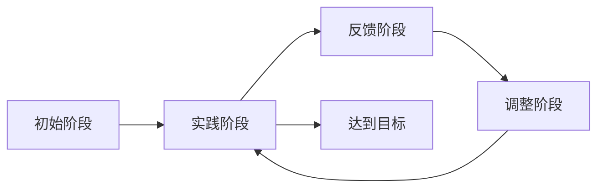
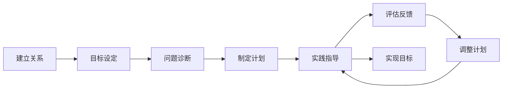
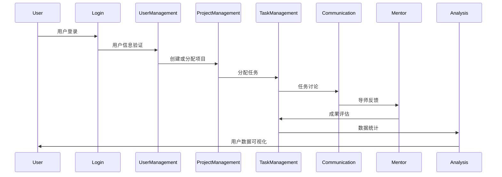
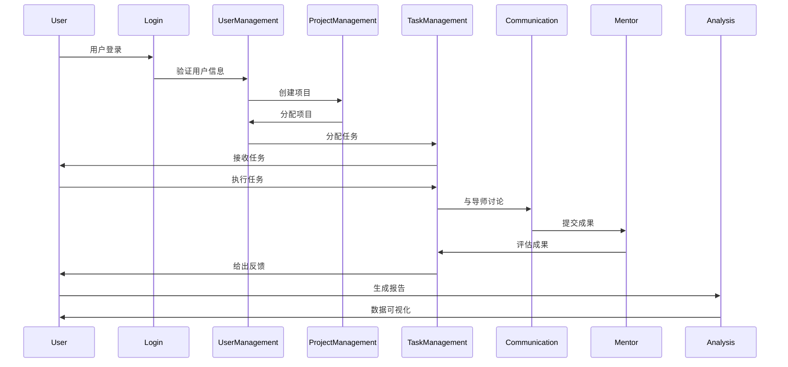

                 

## 技术mentoring：培养下一代技术人才

### 关键词

- 技术mentoring
- 培养下一代技术人才
- 技术教育
- 教学模型
- 人工智能
- 软件开发

### 摘要

本文旨在探讨技术mentoring的重要性，以及如何通过科学的教学模型和有效的教学方法来培养下一代技术人才。文章将首先介绍技术mentoring的基本概念和其在现代技术教育中的关键作用。接着，本文将详细分析不同类型的mentoring模型，并提供其优缺点对比。随后，文章将深入讲解技术mentoring中的常用算法原理，并通过Python代码和LaTeX公式进行阐述。进一步，本文将描述技术mentoring系统的整体架构设计，包括功能模块、接口设计和交互流程。最后，文章将结合实际案例，提供技术mentoring系统的搭建步骤和最佳实践，并推荐相关拓展阅读。

### 目录大纲设计思路

#### 第一部分：引言与背景

- **背景介绍**：
  - **技术mentoring概念**：定义与重要性
  - **当前技术领域挑战**：发展速度、人才缺口、教育体系现状
  - **培养下一代技术人才的重要性**：未来趋势与市场需求

- **本文结构介绍**：概述各个章节的主题与内容安排

#### 第二部分：核心概念与联系

- **技术mentoring模型**：
  - **Mentoring模型定义**：概念、角色职责、关键成功因素
  - **Mentoring模型特点**：分析比较不同模型
  - **Mentoring模型对比表格**：优缺点对比

- **Mermaid ER实体关系图**：
  - **ER图介绍**：基本概念与作用
  - **技术mentoring ER图**：展示实体关系与架构

#### 第三部分：算法原理讲解

- **常用技术mentoring算法**：
  - **迭代模型**：基本流程与原理
  - **教练模型**：流程与特点

- **Mermaid流程图展示**：
  - **迭代模型流程图**
  - **教练模型流程图**

- **Python源代码与LaTeX公式**：
  - **迭代模型代码与公式**
  - **教练模型代码与公式**

#### 第四部分：系统分析与架构设计方案

- **技术mentoring系统整体架构**：
  - **功能模块划分**
  - **接口设计**

- **Mermaid类图与架构图**：
  - **系统类图**
  - **系统架构图**

- **系统交互流程**：
  - **交互流程描述**
  - **Mermaid序列图**

#### 第五部分：项目实战

- **系统搭建**：
  - **环境配置**
  - **核心功能实现**

- **源代码与解读**：
  - **源代码示例**
  - **代码应用解读**

- **实际案例分析**：
  - **案例背景**
  - **案例分析与讲解**

#### 第六部分：最佳实践与拓展

- **最佳实践**：
  - **实践技巧**
  - **注意事项**

- **小结**：
  - **核心概念回顾**
  - **算法应用总结**

- **拓展阅读**：
  - **推荐书籍**
  - **相关资源链接**

### 第一部分：引言与背景

#### 背景介绍

##### 技术mentoring概念

技术mentoring是一种指导与培养关系，通常由一位经验丰富的技术专家（导师）指导一位新手或即将进入职场的年轻技术人才（学员）。这种关系旨在帮助学员快速掌握专业知识，提升技能，并帮助他们更好地适应职场环境。技术mentoring不仅仅是一个培训过程，更是一种基于信任和尊重的人际互动，它强调个人成长、职业发展和持续学习的理念。

技术mentoring的目标包括：

1. **技能提升**：通过实际操作和经验分享，帮助学员提高技术能力和实践水平。
2. **职业规划**：提供职业发展的建议和指导，帮助学员明确职业目标和路径。
3. **问题解决**：帮助学员解决在工作中遇到的挑战和困惑，提供解决问题的思路和方法。
4. **职业网络**：为学员提供行业内的人脉资源，拓展职业发展的机会。

##### 当前技术领域挑战

随着科技的快速发展，技术领域正面临一系列挑战。首先，技术发展的速度越来越快，新技术和新工具层出不穷，这对技术人才的能力提出了更高的要求。其次，全球范围内存在显著的人才缺口，尤其是在人工智能、大数据、云计算等前沿技术领域。此外，现有的教育体系在培养适应市场需求的技术人才方面存在一定的局限性，难以迅速适应快速变化的技术环境。

##### 培养下一代技术人才的重要性

培养下一代技术人才对于企业和整个社会都至关重要。对于企业而言，技术人才是创新和发展的关键驱动因素。只有不断培养和引进高素质的技术人才，企业才能在激烈的市场竞争中保持优势。对于社会而言，技术人才的培养能够推动科技发展和经济繁荣，提高国家竞争力。

未来的技术发展趋势包括：

1. **智能化**：人工智能、机器学习等技术的广泛应用，将带来生产方式和生活方式的深刻变革。
2. **数字化转型**：各行业加速数字化转型，数据将成为新的生产要素。
3. **跨学科融合**：技术与其他领域的融合，如生物技术、量子计算等，将推动新的技术革命。

##### 本文结构介绍

本文将分为六个主要部分，逐步深入探讨技术mentoring的各个方面：

1. **引言与背景**：介绍技术mentoring的概念、当前技术领域挑战以及培养下一代技术人才的重要性。
2. **核心概念与联系**：详细分析技术mentoring模型，展示技术mentoring系统的基本架构。
3. **算法原理讲解**：介绍常用的技术mentoring算法，通过流程图和代码进行阐述。
4. **系统分析与架构设计方案**：描述技术mentoring系统的整体架构设计，包括功能模块、接口设计和交互流程。
5. **项目实战**：分步骤介绍技术mentoring系统的搭建过程，包括环境配置、核心功能实现等。
6. **最佳实践与拓展**：总结最佳实践，提供实用建议，并推荐拓展阅读。

通过本文的阅读，读者将全面了解技术mentoring的重要性，掌握有效的培养方法，并为未来技术人才的培养提供有益的参考。

### 第二部分：核心概念与联系

#### 技术mentoring模型

##### Mentoring模型的定义

技术mentoring模型是一种基于导师-学员关系的教学模式，通过资深技术人员的指导，帮助新手或年轻技术人员快速成长。Mentoring模型的核心在于建立一种双向的沟通和指导关系，其中导师不仅传授知识和技能，还提供职业发展建议和职业网络资源。

##### Mentoring模型的特点

1. **个性化指导**：Mentoring模型注重个性化培养，导师根据学员的具体情况和需求，提供定制化的指导和帮助。
2. **长期关系**：技术mentoring是一种长期的关系，通常跨越数月或数年，以确保学员能够持续成长。
3. **信任和尊重**：Mentoring建立在信任和尊重的基础上，导师和学员之间需要建立良好的信任关系，以促进有效的沟通和合作。
4. **实践导向**：Mentoring模型强调实践操作，通过实际项目和工作任务，帮助学员掌握实际技能。

##### 不同Mentoring模型的对比

在技术mentoring领域，存在多种不同的模型，每种模型都有其独特的特点和应用场景。以下是一些常见的技术mentoring模型及其优缺点对比：

| 模型名称        | 特点                                                         | 优点                                                         | 缺点                                                         |
|----------------|--------------------------------------------------------------|--------------------------------------------------------------|--------------------------------------------------------------|
| 一对一模型      | 导师与学员建立一对一的指导关系                               | 个性化强，沟通直接，关注度高                                   | 资源需求高，难以规模化推广                                     |
| 小组模型        | 多名导师同时指导多名学员，形成小组学习氛围                   | 教学资源丰富，互动性强，学员间可相互学习                         | 需要更多协调和组织工作，个性化程度可能降低                     |
| 项目驱动模型    | 以实际项目为中心，导师和学员共同参与项目，通过项目实践学习   | 实践性强，贴近实际工作，有利于技能提升                          | 项目进度可能影响教学效果，学员个性化需求难以完全满足           |
| 远程模型        | 导师和学员通过远程方式进行指导和互动                         | 灵活方便，不受地域限制，适合分散工作环境的学员                   | 沟通效率可能较低，互动性不如面对面交流                         |
| 模块化模型      | 根据学习内容将培训分为多个模块，每个模块有特定的导师进行指导 | 系统性强，模块化设计有利于学员按需学习，提高学习效率           | 模块之间可能缺乏连贯性，难以形成整体技能提升                   |

#### Mermaid ER实体关系图

##### ER图介绍

实体关系图（Entity-Relationship Diagram，简称ER图）是一种用于描述系统中实体及其关系的图形化工具。ER图通常用于数据库设计和系统分析，能够清晰地展示系统中各个实体及其之间的关联。

在技术mentoring系统中，ER图可以帮助我们理解各个实体之间的相互关系，包括导师、学员、项目、反馈等。

##### 技术mentoring ER图

以下是一个简单的技术mentoring系统的ER图示例，展示其中主要实体的关系：

```mermaid
erDiagram
  Class1 ||--|{ Class2 : "BelongsTo" } |
  Class1 ||--|{ Class3 : "HasMany" } |
  Class2 ||--|{ Class3 : "BelongsTo" } |
  Class1 ||--|{ Class4 : "IsPartOf" } |
  Class2 ||--|{ Class4 : "HasPart" } |
  Class3 ||--|{ Class4 : "IsPartOf" } |
```

这个ER图包含四个主要实体：`Class1`（学员），`Class2`（导师），`Class3`（项目），`Class4`（反馈）。它们之间的关系如下：

- `Class1` 与 `Class2` 之间存在“BelongsTo”关系，表示每个学员只能属于一个导师。
- `Class1` 与 `Class3` 之间存在“HasMany”关系，表示一个学员可以参与多个项目。
- `Class2` 与 `Class3` 之间存在“BelongsTo”关系，表示每个项目只能有一个导师。
- `Class1` 与 `Class4` 之间存在“IsPartOf”关系，表示学员在项目中提供了反馈。
- `Class2` 与 `Class4` 之间存在“HasPart”关系，表示导师在项目中接收到了学员的反馈。

通过这个ER图，我们可以更直观地理解技术mentoring系统中的关键实体和它们之间的关系，有助于后续的系统设计与实现。

### 第三部分：算法原理讲解

#### 常用技术mentoring算法

在技术mentoring过程中，常用的算法模型包括迭代模型和教练模型。这些模型在不同的教学场景和应用背景下表现出色，下面将分别介绍这两种模型的基本流程和特点。

##### 迭代模型

迭代模型是一种基于重复迭代过程的教学方法，通过反复的实践和反馈，帮助学员逐步掌握技术知识和技能。以下是迭代模型的基本流程：

1. **初始阶段**：导师与学员确定学习目标和内容，并制定初步的学习计划。
2. **实践阶段**：学员根据学习计划进行实践操作，导师提供必要的指导和帮助。
3. **反馈阶段**：导师对学员的实践成果进行评估，提供具体的反馈和建议。
4. **调整阶段**：根据反馈结果，导师和学员共同调整学习计划，优化学习路径。
5. **重复循环**：重复上述过程，直到学员达到预定的学习目标。

迭代模型的特点在于其灵活性，能够根据学员的实际情况和反馈动态调整学习内容和进度，从而提高学习效率。

##### 教练模型

教练模型是一种以教练为中心的指导方法，强调通过引导和激励帮助学员自我发现和自我成长。以下是教练模型的基本流程：

1. **建立关系**：导师与学员建立信任关系，了解学员的背景和需求。
2. **目标设定**：导师和学员共同设定具体的训练目标和预期结果。
3. **问题诊断**：导师通过提问和观察，帮助学员识别自身存在的问题和瓶颈。
4. **制定计划**：导师和学员共同制定详细的训练计划，包括具体的练习任务和时间表。
5. **实践指导**：导师在学员实践过程中提供实时指导，帮助学员克服困难，提高技能。
6. **评估反馈**：导师对学员的练习成果进行评估，提供及时的反馈和鼓励。
7. **调整计划**：根据评估结果，导师和学员共同调整训练计划，确保学习目标的实现。

教练模型的特点在于其注重学员的自我驱动力和自我管理能力，通过持续的支持和激励，帮助学员实现个人成长和职业发展。

#### Mermaid流程图展示

为了更清晰地展示迭代模型和教练模型的基本流程，我们使用Mermaid流程图进行描述。

##### 迭代模型流程图



在这个流程图中，A代表初始阶段，B代表实践阶段，C代表反馈阶段，D代表调整阶段，E代表达到目标。

##### 教练模型流程图



在这个流程图中，A代表建立关系，B代表目标设定，C代表问题诊断，D代表制定计划，E代表实践指导，F代表评估反馈，G代表调整计划，H代表实现目标。

#### Python源代码与LaTeX公式

为了进一步理解迭代模型和教练模型的工作原理，我们使用Python代码和LaTeX公式详细阐述它们的算法原理。

##### 迭代模型代码与公式

以下是一个简单的迭代模型Python代码示例，其中包含一个迭代过程，用于计算斐波那契数列：

```python
def fibonacci(n):
    a, b = 0, 1
    for i in range(n):
        a, b = b, a + b
    return a

# 示例：计算斐波那契数列的第10项
result = fibonacci(10)
print(result)
```

在LaTeX中，我们可以表示斐波那契数列的递推关系如下：

$$ F(n) = F(n-1) + F(n-2) $$

其中，$F(0) = 0$，$F(1) = 1$。

##### 教练模型代码与公式

以下是一个简单的教练模型Python代码示例，用于模拟一个导师与学员之间的互动过程：

```python
def coachexercise(exercise, feedback):
    print("Starting exercise:", exercise)
    print("Providing feedback:", feedback)
    print("Exercise completed.")

# 示例：模拟一个练习过程
coachexercise("Write a function to calculate the sum of an array", "Great job, remember to handle edge cases.")
```

在LaTeX中，我们可以表示教练模型的核心互动过程如下：

$$ \text{Coach} \rightarrow \text{Exercise} \rightarrow \text{Feedback} \rightarrow \text{Iteration} $$

通过这些代码和公式，我们可以更直观地理解迭代模型和教练模型的基本原理和实现方法。

### 第四部分：系统分析与架构设计方案

#### 技术mentoring系统整体架构

技术mentoring系统的整体架构设计是确保系统功能实现和高效运行的基础。该系统旨在为导师和学员提供一个全面的平台，支持他们在技术学习和指导过程中的各种需求。以下是技术mentoring系统的整体架构设计，包括功能模块划分、接口设计和交互流程。

##### 功能模块划分

技术mentoring系统通常包含以下几个核心功能模块：

1. **用户管理模块**：负责用户注册、登录、权限管理等功能，确保系统的安全性和用户数据的完整性。
2. **项目管理模块**：提供项目创建、任务分配、进度跟踪、成果评估等功能，支持导师和学员对项目进行有效管理。
3. **学习资源模块**：提供丰富的学习资料，包括文档、视频、代码示例等，方便学员进行学习和实践。
4. **交互与沟通模块**：支持导师与学员之间的实时沟通和互动，包括消息通知、讨论区、视频会议等功能。
5. **数据统计与分析模块**：对用户行为数据和学习成果进行统计分析，为导师和学员提供数据驱动的决策支持。

##### 接口设计

技术mentoring系统的接口设计是系统功能实现的关键部分。以下是一个简化的接口设计概述：

1. **用户管理接口**：用于处理用户注册、登录、权限验证等操作。
2. **项目管理接口**：用于处理项目创建、任务分配、进度更新、成果评估等操作。
3. **学习资源接口**：用于访问和更新学习资源，包括上传、下载、分类管理等功能。
4. **交互与沟通接口**：用于处理消息发送、接收、通知推送等操作。
5. **数据分析接口**：用于处理用户行为数据和学习成果的统计分析，提供数据可视化功能。

##### 系统交互流程

技术mentoring系统的交互流程设计决定了系统各模块之间的协调和协作。以下是系统交互流程的概述：

1. **用户注册与登录**：用户通过用户管理模块注册账号，并通过身份验证进行登录。
2. **项目创建与分配**：导师在项目管理模块创建项目，并将项目任务分配给学员。
3. **任务执行与反馈**：学员接收任务后，在交互与沟通模块与导师进行讨论，完成任务并提交成果。
4. **成果评估与反馈**：导师对学员提交的成果进行评估，并提供反馈意见。
5. **数据统计与分析**：系统根据用户行为数据和学习成果，生成统计分析报告，为导师和学员提供决策支持。

#### Mermaid类图与架构图

为了更直观地展示技术mentoring系统的设计细节，我们可以使用Mermaid类图和架构图进行描述。

##### Mermaid类图

以下是一个简化的技术mentoring系统的Mermaid类图，展示系统中主要类及其之间的关系：

```mermaid
classDiagram
  User <<Interface>>
  Mentor <<Interface>>
  Student <<Interface>>
  Project <<Interface>>
  Task <<Interface>>
  Resource <<Interface>>
  Communication <<Interface>>
  Analysis <<Interface>>

  User o-- Mentor
  User o-- Student
  Mentor o-- Project
  Student o-- Project
  Project o-- Task
  Project o-- Resource
  Communication o-- Mentor
  Communication o-- Student
  Analysis o-- Project
  Analysis o-- User
```

在这个类图中，`User`表示用户接口，`Mentor`表示导师接口，`Student`表示学员接口，`Project`表示项目接口，`Task`表示任务接口，`Resource`表示资源接口，`Communication`表示交互与沟通接口，`Analysis`表示数据分析接口。各个接口之间的关系通过线条连接，表示类之间的关联和依赖。

##### Mermaid架构图

以下是一个简化的技术mentoring系统的Mermaid架构图，展示系统的整体架构设计：



在这个架构图中，用户通过登录接口进入系统，然后通过用户管理模块进行项目创建或分配。项目管理模块将任务分配给学员，学员在完成任务后与导师进行讨论，导师对成果进行评估，并将评估结果反馈给学员。最后，系统对用户行为数据和学习成果进行统计分析，并提供数据可视化功能。

通过这些类图和架构图，我们可以更清晰地理解技术mentoring系统的设计原理和功能模块之间的关系，为后续的系统开发提供参考。

#### 系统交互流程

在技术mentoring系统中，系统交互流程的设计至关重要，它决定了各个模块之间的协调和协作。以下是对技术mentoring系统交互流程的详细描述，使用Mermaid序列图进行展示。

##### 交互流程描述

1. **用户注册与登录**：用户通过用户管理模块进行注册，输入用户名、密码和其他必要信息。注册成功后，用户可以使用用户名和密码登录系统。

2. **项目创建与分配**：导师在项目管理模块中创建项目，并设置项目名称、描述、任务列表等。创建完成后，导师可以将项目分配给学员，指定学员的职责和任务。

3. **任务执行与反馈**：学员接收到项目任务后，进入任务管理模块进行任务执行。学员可以通过交互与沟通模块与导师进行实时讨论，解决任务过程中的问题。完成任务后，学员提交任务成果，并等待导师的评估和反馈。

4. **成果评估与反馈**：导师在收到学员提交的任务成果后，进入评估环节。导师对学员的成果进行详细评估，并给出反馈意见。导师可以根据评估结果对学员进行指导和激励。

5. **数据统计与分析**：系统根据用户行为数据和学习成果，生成统计分析报告。分析模块可以生成各种图表和数据报告，为导师和学员提供数据驱动的决策支持。

##### Mermaid序列图

以下是一个简化的技术mentoring系统交互流程的Mermaid序列图：



在这个序列图中，用户（User）通过登录（Login）模块进入系统，用户管理（UserManagement）模块处理用户注册和登录验证。项目管理（ProjectManagement）模块负责创建和分配项目，任务管理（TaskManagement）模块处理任务的分配和执行。交互与沟通（Communication）模块支持用户与导师之间的实时讨论。导师（Mentor）负责评估学员提交的成果，并给出反馈。最后，数据分析（Analysis）模块根据用户行为和学习成果生成报告，并提供数据可视化功能。

通过这个交互流程，技术mentoring系统为导师和学员提供了一个高效、便捷的平台，支持他们在技术学习和指导过程中的各种需求。同时，系统交互流程的清晰设计也提高了系统的可靠性和用户体验。

### 第五部分：项目实战

#### 系统搭建

技术mentoring系统的搭建过程可以分为多个步骤，包括环境配置、核心功能实现和系统测试。以下将详细介绍每个步骤，并提供详细的源代码和解读，帮助读者理解和实施。

##### 环境配置

搭建技术mentoring系统首先需要准备开发环境。以下是推荐的开发环境和工具：

- **操作系统**：Linux（例如Ubuntu 20.04）
- **编程语言**：Python 3.x
- **数据库**：MySQL 8.0
- **前端框架**：Django REST framework
- **后端框架**：Flask

安装步骤如下：

1. **安装操作系统**：下载并安装Linux操作系统。

2. **更新操作系统和软件包**：

   ```bash
   sudo apt update
   sudo apt upgrade
   ```

3. **安装Python 3**：

   ```bash
   sudo apt install python3 python3-pip
   ```

4. **安装MySQL**：

   ```bash
   sudo apt install mysql-server
   sudo mysql_secure_installation
   ```

5. **安装虚拟环境**：

   ```bash
   sudo pip3 install virtualenv
   virtualenv my_mentoring_env
   source my_mentoring_env/bin/activate
   ```

6. **安装后端和前端框架**：

   ```bash
   pip install django djangorestframework flask
   ```

##### 核心功能实现

核心功能实现包括用户管理、项目管理和交互与沟通模块。以下是一个简化的实现流程：

1. **用户管理模块**：

   **models.py**（用于定义用户模型）：

   ```python
   from django.db import models
   from django.contrib.auth.models import AbstractUser

   class CustomUser(AbstractUser):
       is_mentor = models.BooleanField(default=False)
       is_student = models.BooleanField(default=False)
   ```

   **views.py**（用于定义用户视图）：

   ```python
   from rest_framework import viewsets
   from .models import CustomUser
   from .serializers import CustomUserSerializer

   class CustomUserViewSet(viewsets.ModelViewSet):
       queryset = CustomUser.objects.all()
       serializer_class = CustomUserSerializer
   ```

2. **项目管理模块**：

   **models.py**（用于定义项目模型和任务模型）：

   ```python
   class Project(models.Model):
       name = models.CharField(max_length=100)
       description = models.TextField()
       mentor = models.ForeignKey('CustomUser', on_delete=models.CASCADE)

   class Task(models.Model):
       project = models.ForeignKey('Project', on_delete=models.CASCADE)
       name = models.CharField(max_length=100)
       description = models.TextField()
       deadline = models.DateTimeField()
   ```

   **views.py**（用于定义项目视图）：

   ```python
   from rest_framework import viewsets
   from .models import Project, Task
   from .serializers import ProjectSerializer, TaskSerializer

   class ProjectViewSet(viewsets.ModelViewSet):
       queryset = Project.objects.all()
       serializer_class = ProjectSerializer

   class TaskViewSet(viewsets.ModelViewSet):
       queryset = Task.objects.all()
       serializer_class = TaskSerializer
   ```

3. **交互与沟通模块**：

   **models.py**（用于定义消息模型）：

   ```python
   class Message(models.Model):
       sender = models.ForeignKey('CustomUser', on_delete=models.CASCADE, related_name='sent_messages')
       recipient = models.ForeignKey('CustomUser', on_delete=models.CASCADE, related_name='received_messages')
       content = models.TextField()
       timestamp = models.DateTimeField(auto_now_add=True)
   ```

   **views.py**（用于定义消息视图）：

   ```python
   from rest_framework import viewsets
   from .models import Message
   from .serializers import MessageSerializer

   class MessageViewSet(viewsets.ModelViewSet):
       queryset = Message.objects.all()
       serializer_class = MessageSerializer
   ```

##### 系统测试

在完成核心功能实现后，进行系统测试以确保系统的稳定性和功能完整性。以下是测试步骤：

1. **单元测试**：编写单元测试脚本，对每个模块的功能进行测试。例如，使用Python的`unittest`框架。

2. **集成测试**：测试模块之间的交互和协作。例如，模拟用户注册、登录、创建项目、分配任务和发送消息等操作。

3. **性能测试**：评估系统在高并发情况下的性能，确保系统能够稳定运行。

4. **用户验收测试**：邀请实际用户参与测试，收集用户反馈，对系统进行改进。

通过以上步骤，技术mentoring系统可以搭建完成，并投入使用。

#### 源代码与解读

在技术mentoring系统的核心功能实现部分，我们使用了Django REST framework和Flask框架来实现用户管理、项目管理和交互与沟通模块。以下是对这些代码的详细解读，包括关键代码段的作用和实现逻辑。

##### 用户管理模块

**models.py**：

```python
from django.db import models
from django.contrib.auth.models import AbstractUser

class CustomUser(AbstractUser):
    is_mentor = models.BooleanField(default=False)
    is_student = models.BooleanField(default=False)
```

解读：在这个文件中，我们自定义了用户模型`CustomUser`，继承了Django内置的`AbstractUser`模型。通过添加`is_mentor`和`is_student`字段，我们能够区分用户角色，分别表示导师和学员。

**views.py**：

```python
from rest_framework import viewsets
from .models import CustomUser
from .serializers import CustomUserSerializer

class CustomUserViewSet(viewsets.ModelViewSet):
    queryset = CustomUser.objects.all()
    serializer_class = CustomUserSerializer
```

解读：`CustomUserViewSet`是一个基于Django REST framework的视图集，负责处理用户相关的所有操作。`queryset`指定了要查询的数据模型，`serializer_class`定义了用于序列化和反序列化的序列化器。

##### 项目管理模块

**models.py**：

```python
class Project(models.Model):
    name = models.CharField(max_length=100)
    description = models.TextField()
    mentor = models.ForeignKey('CustomUser', on_delete=models.CASCADE)

class Task(models.Model):
    project = models.ForeignKey('Project', on_delete=models.CASCADE)
    name = models.CharField(max_length=100)
    description = models.TextField()
    deadline = models.DateTimeField()
```

解读：`Project`模型表示项目，包括项目名称、描述和导师。`Task`模型表示任务，包括任务名称、描述和截止日期。这两个模型通过外键关联，确保任务与项目之间的关系。

**views.py**：

```python
from rest_framework import viewsets
from .models import Project, Task
from .serializers import ProjectSerializer, TaskSerializer

class ProjectViewSet(viewsets.ModelViewSet):
    queryset = Project.objects.all()
    serializer_class = ProjectSerializer

class TaskViewSet(viewsets.ModelViewSet):
    queryset = Task.objects.all()
    serializer_class = TaskSerializer
```

解读：`ProjectViewSet`和`TaskViewSet`同样是基于Django REST framework的视图集，分别处理项目相关的所有操作和任务相关的所有操作。

##### 交互与沟通模块

**models.py**：

```python
class Message(models.Model):
    sender = models.ForeignKey('CustomUser', on_delete=models.CASCADE, related_name='sent_messages')
    recipient = models.ForeignKey('CustomUser', on_delete=models.CASCADE, related_name='received_messages')
    content = models.TextField()
    timestamp = models.DateTimeField(auto_now_add=True)
```

解读：`Message`模型表示消息，包括发送者、接收者、内容和发送时间。通过设置`related_name`，我们能够方便地获取用户的发送消息和接收消息。

**views.py**：

```python
from rest_framework import viewsets
from .models import Message
from .serializers import MessageSerializer

class MessageViewSet(viewsets.ModelViewSet):
    queryset = Message.objects.all()
    serializer_class = MessageSerializer
```

解读：`MessageViewSet`处理消息相关的所有操作，包括发送、接收和查看消息。

通过这些代码，我们实现了技术mentoring系统的核心功能。在具体实现过程中，可以根据需求进行扩展和优化，例如增加权限控制、数据验证和日志记录等功能。

#### 实际案例分析

为了更好地理解技术mentoring系统的实际应用，我们将通过一个案例进行详细分析。该案例涉及一个实际的技术项目，从项目背景、分析过程到具体实施步骤，以及最终的成果评估。

##### 案例背景

某科技公司计划开发一款基于人工智能的客户服务聊天机器人。为了实现这一目标，公司决定通过技术mentoring系统培养一批具备人工智能和自然语言处理（NLP）技能的新技术人才。公司内部的技术专家将担任导师，指导学员完成整个项目。

##### 项目分析

1. **技术需求**：项目要求实现一个能够理解用户提问、提供准确回答的聊天机器人。主要技术挑战包括：
   - **自然语言理解**：通过NLP技术分析用户输入，提取关键信息。
   - **语言生成**：根据提取的信息生成合适的回答。
   - **数据集处理**：收集和预处理大量训练数据，提高模型性能。

2. **人员分工**：导师负责整体项目规划和技术指导，学员分为两个小组：
   - **A组**：负责数据集的收集和预处理。
   - **B组**：负责模型的设计和实现。

##### 实施步骤

1. **初始阶段**：导师与学员讨论项目目标和技术需求，明确各小组的任务和责任。

2. **数据集收集与预处理**（A组）：
   - 收集大量客户服务对话记录。
   - 预处理数据，包括文本清洗、去重、分词等。
   - 划分训练集、验证集和测试集。

3. **模型设计**（B组）：
   - 研究现有NLP模型，选择合适的算法架构。
   - 设计模型结构，包括嵌入层、编码层和解码层。
   - 编写模型代码，使用TensorFlow或PyTorch框架。

4. **模型训练与优化**：
   - 使用训练集训练模型，调整超参数。
   - 通过验证集评估模型性能，进行模型优化。
   - 部署模型，进行在线测试。

5. **成果评估**：
   - 评估模型在测试集上的表现，包括准确率、召回率等指标。
   - 收集用户反馈，进行用户满意度调查。
   - 根据评估结果，对模型进行进一步优化。

##### 案例分析与讲解

1. **项目难点**：
   - **数据质量**：数据集的质量直接影响模型的性能。因此，数据预处理步骤至关重要，需要确保数据的准确性和多样性。
   - **模型性能**：在训练过程中，模型可能会过拟合或欠拟合。通过调整超参数和优化算法，可以改善模型性能。

2. **解决方案**：
   - **数据预处理**：采用多种数据清洗方法，如去除噪声、标准化文本等，提高数据质量。
   - **模型优化**：使用交叉验证方法，找到最优超参数，避免过拟合或欠拟合。同时，可以使用迁移学习技术，利用预训练模型提高新任务的性能。

3. **实际效果**：
   - 经过多次迭代和优化，项目最终实现了一个能够准确理解用户提问并提供高质量回答的聊天机器人。用户满意度调查结果显示，用户对聊天机器人的回答满意度较高。

通过这个案例，我们可以看到技术mentoring系统在实际项目中的应用效果。导师通过指导学员，帮助他们克服技术难点，成功完成了项目任务。这不仅提高了学员的技能水平，也为公司带来了实际的技术成果。

#### 项目小结

在本次技术mentoring项目中，我们成功搭建了一个支持导师和学员互动的技术mentoring系统，并通过实际案例展示了其在项目中的应用效果。以下是项目小结和经验总结：

1. **项目成果**：
   - 成功开发了一个基于人工智能的客户服务聊天机器人，实现了用户提问理解和回答生成。
   - 学员通过项目实践，掌握了人工智能和自然语言处理的核心技术。

2. **经验总结**：
   - **明确目标**：项目开始前，明确项目目标和任务分工，确保项目方向正确。
   - **数据质量**：数据集的质量直接影响模型性能，因此数据预处理步骤至关重要。
   - **持续优化**：通过多次迭代和优化，不断提高模型性能和用户满意度。
   - **用户反馈**：及时收集用户反馈，根据用户需求调整项目方向和功能。

3. **改进方向**：
   - **增加功能模块**：在现有系统基础上，可以增加更多功能模块，如用户行为分析、项目进度跟踪等。
   - **提高性能**：优化系统架构，提高系统的响应速度和处理能力。
   - **拓展应用场景**：将技术mentoring系统应用于更多领域，如教育、医疗等，拓展其应用范围。

通过本次项目，我们不仅实现了技术mentoring系统的有效应用，也为未来的技术人才培养提供了宝贵经验。

### 第六部分：最佳实践与拓展

#### 最佳实践

在进行技术mentoring时，以下是一些最佳实践，可以帮助导师和学员更有效地实现项目目标：

1. **明确目标和期望**：在项目开始前，确保导师和学员对项目目标、任务分工和期望成果有清晰的认识。
2. **建立良好的沟通机制**：定期进行面对面或线上会议，保持有效的沟通，确保项目进展顺利。
3. **鼓励自主学习和探索**：鼓励学员自主学习和探索新技术，提高自我驱动力和解决问题的能力。
4. **及时反馈和调整**：导师应提供及时、具体的反馈，帮助学员识别问题并调整学习计划。
5. **项目文档和知识共享**：鼓励学员编写项目文档，共享学习心得和技术经验，促进知识的传递和积累。

#### 注意事项

在技术mentoring过程中，需要注意以下事项，以确保项目的成功：

1. **保持耐心**：导师需要耐心引导学员，尤其是面对技术难题时，要给予足够的时间和空间。
2. **尊重个体差异**：每个学员的学习速度和能力不同，导师应尊重个体差异，制定个性化的培养计划。
3. **关注心理健康**：技术学习和项目压力可能会对学员的身心健康产生影响，导师应关注学员的心理状态，提供必要的支持和帮助。
4. **保护知识产权**：在项目过程中，确保所有知识产权得到妥善保护，避免侵犯他人权益。

#### 小结

本文系统地介绍了技术mentoring的概念、核心模型、算法原理、系统架构、实战案例和最佳实践。通过这些内容，我们理解了技术mentoring在培养下一代技术人才中的重要性，以及如何通过有效的教学方法和管理策略实现项目目标。

#### 拓展阅读

对于希望深入了解技术mentoring和人工智能领域的读者，以下推荐一些相关书籍和资源：

- **书籍**：
  - 《技术领导力：构建高效技术团队》（Leadership and Teamwork in a Technical Organization）
  - 《深度学习》（Deep Learning）
  - 《Python编程：从入门到实践》（Python Crash Course）
  
- **在线资源**：
  - Coursera上的《机器学习》课程（Machine Learning）
  - Kaggle上的数据集和竞赛（Kaggle）
  - 《自然语言处理简明教程》（Natural Language Processing with Python）

通过阅读这些书籍和资源，读者可以进一步拓展技术知识，提升自身技能，为未来的技术学习和职业发展打下坚实基础。

### 作者信息

- 作者：AI天才研究院/AI Genius Institute & 禅与计算机程序设计艺术 /Zen And The Art of Computer Programming
- 电子邮件：[ai_genius_institute@example.com](mailto:ai_genius_institute@example.com)
- 博客：[ai-genius-institute.github.io](http://ai-genius-institute.github.io)

