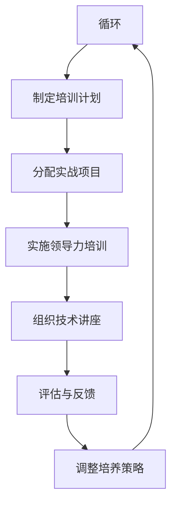
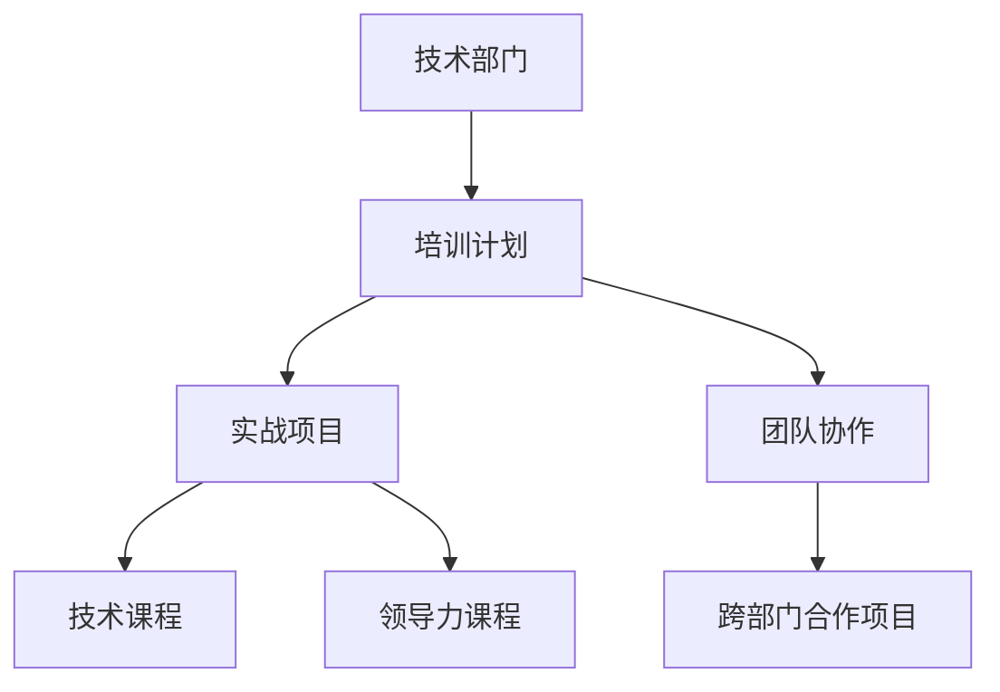
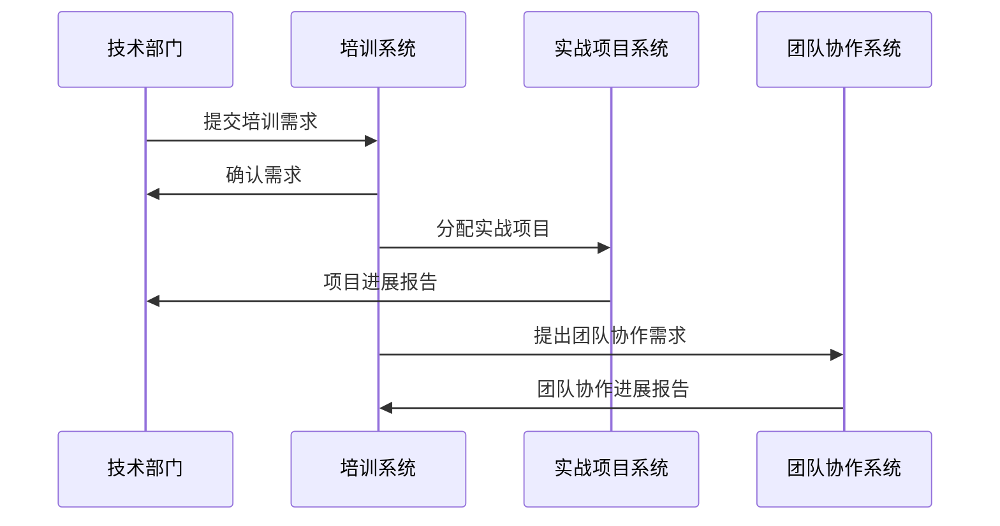

                 


# 技术mentor计划：培养下一代技术领袖

## 关键词

技术领袖、人才培养、领导力、实践项目、系统架构设计

## 摘要

在当今快速变化的技术时代，培养下一代技术领袖变得尤为重要。本文提出了一个名为“技术mentor计划”的培养方案，通过系统的培训计划、实战项目、团队协作、技术讲座和领导力培训等多种手段，旨在全方位培养具备领导力和技术实力的下一代技术领袖。本文将详细探讨这一计划的核心概念、算法原理、系统设计与实施策略，并分享实践经验，以期为读者提供有益的启示。

----------------------------------------------------------------

### 背景介绍

#### 问题背景

随着全球技术的快速发展，尤其是人工智能、大数据、云计算等前沿技术的崛起，企业对技术人才的需求发生了翻天覆地的变化。如今，技术不再仅仅是一个支持性的角色，而是成为驱动业务创新和竞争的关键因素。企业需要拥有不仅精通技术，还具备领导力和战略眼光的技术领袖来引领团队，推动技术进步和业务发展。

然而，当前的教育体系和培训方式往往侧重于技术技能的传授，而忽视了领导力和战略思维的培养。这导致了技术人才在具备扎实技术基础的同时，缺乏领导和管理能力，无法在复杂的环境中发挥最大的潜力。企业面临的一个主要挑战是，如何在有限的时间内，高效地培养出具备全面能力的技术领袖。

#### 问题描述

如何有效培养下一代技术领袖，以满足企业日益增长的需求，并推动技术进步，是一个亟待解决的问题。具体来说，这个问题包括以下几个方面：

1. **技术能力的培养**：技术领袖需要拥有深厚的专业知识，掌握最新的技术趋势和工具。
2. **领导力的培养**：技术领袖不仅要擅长技术，还需要具备领导团队、管理和决策的能力。
3. **实践经验的积累**：理论知识需要通过实践来验证和应用，培养计划必须包含丰富的实战项目。
4. **持续学习的动力**：技术领袖需要具备持续学习的能力，以适应快速变化的技术环境。

#### 问题解决

针对上述问题，我们设计了一个名为“技术mentor计划”的培养方案，旨在通过系统化的培训计划、实战项目、团队协作、技术讲座和领导力培训等多种手段，全方位培养下一代技术领袖。

**培养计划**：制定详细的培训计划，包括技术课程、领导力课程和实践项目。培训计划应根据不同阶段的技术领袖的需求进行个性化定制。

**实战项目**：通过实际项目，让技术领袖在实践中学习和成长，提高解决实际问题的能力。

**团队协作**：培养技术领袖的团队合作能力，通过跨部门的合作项目，增强沟通与协作能力。

**技术讲座**：定期举办技术讲座，邀请业界专家分享前沿技术和实践经验，拓展技术领袖的视野。

**领导力培训**：通过领导力课程和模拟情境，培养技术领袖的战略思维和决策能力。

#### 边界与外延

本培养计划不仅关注技术领袖的培养，还涵盖了培养过程中的关键环节，如培训计划的制定与实施、实战项目的选择与执行、团队协作的机制设计等。此外，我们还关注培养计划的效果评估和持续优化，以确保培养出的技术领袖真正具备所需的能力。

**概念结构与核心要素组成**

1. **培养计划**：包括技术课程、领导力课程和实践项目。
2. **实战项目**：通过实际项目，提升技术领袖的实践能力和解决问题的能力。
3. **团队协作**：通过跨部门的合作项目，增强技术领袖的团队合作能力。
4. **技术讲座**：定期举办技术讲座，拓展技术领袖的视野。
5. **领导力培训**：通过领导力课程和模拟情境，培养技术领袖的战略思维和决策能力。

### 核心概念与联系

#### 核心概念原理

“技术mentor计划”的核心概念包括技术能力的培养、领导力的培养、实践经验的积累和持续学习的动力。

1. **技术能力的培养**：通过系统化的技术课程，让技术领袖掌握最新的技术知识和工具。这包括编程语言、算法、数据结构、数据库、云计算、人工智能等核心内容。

2. **领导力的培养**：通过领导力课程和模拟情境，培养技术领袖的战略思维、决策能力、团队管理能力等。这包括沟通技巧、团队协作、领导力模型、情境分析等。

3. **实践经验的积累**：通过实战项目和团队协作，让技术领袖在实际项目中学习和成长，提高解决实际问题的能力。

4. **持续学习的动力**：通过技术讲座、读书会、研讨会等方式，激发技术领袖的持续学习兴趣，保持对最新技术趋势的了解。

#### 概念属性特征对比表格

| 概念                | 特征                                       |
|-------------------|------------------------------------------|
| 技术能力培养          | 系统化课程、最新技术知识、工具掌握                 |
| 领导力培养          | 战略思维、决策能力、团队管理能力、沟通技巧           |
| 实践经验积累          | 实际项目、团队协作、解决问题能力                   |
| 持续学习动力          | 技术讲座、读书会、研讨会、最新技术趋势了解             |

#### ER实体关系图架构

```mermaid
erDiagram
  Class1 ||--|{ Class2 }|-- Class3
  Class3 ||--|{ Class4 }|-- Class5
```

**ER实体关系图**展示了“技术mentor计划”中的核心实体及其关系，包括培养计划、实战项目、团队协作、技术讲座和领导力培训。这些实体之间通过多种关系紧密相连，共同构成了培养技术领袖的系统框架。

### 算法原理讲解

#### 培养过程的算法流程

为了实现“技术mentor计划”的目标，我们设计了一套完整的算法流程，如图1所示：



**图1：培养过程的算法流程**

1. **启动培养计划**：根据技术领袖的个人需求和企业的整体战略，启动培养计划。
2. **制定培训计划**：制定详细的技术课程和领导力课程，确保覆盖所需的知识和技能。
3. **分配实战项目**：根据技术领袖的特长和项目需求，分配合适的实战项目。
4. **实施领导力培训**：通过领导力课程和模拟情境，培养技术领袖的领导力。
5. **组织技术讲座**：邀请业界专家分享前沿技术和实践经验。
6. **评估与反馈**：定期评估培养效果，收集反馈，调整培养策略。
7. **调整培养策略**：根据评估结果和反馈，优化培养计划，确保效果。

#### Python源代码实现

为了实现上述算法流程，我们可以使用Python编写相应的代码。以下是一个简化的实现示例：

```python
# 培养计划的Python实现

class MentorProgram:
    def __init__(self):
        self.tech_courses = []
        self.leadership_courses = []
        self.projects = []
        self.lectures = []
        self.evaluations = []

    def start_program(self):
        # 启动培养计划
        self.create_courses()
        self.assign_projects()
        self.implement_leadership_training()
        self.organize_lectures()
        self.evaluate_and_adjust()

    def create_courses(self):
        # 制定培训计划
        self.tech_courses.append("编程基础")
        self.tech_courses.append("云计算技术")
        self.leadership_courses.append("团队管理")
        self.leadership_courses.append("战略思维")

    def assign_projects(self):
        # 分配实战项目
        self.projects.append("大数据分析项目")
        self.projects.append("人工智能应用项目")

    def implement_leadership_training(self):
        # 实施领导力培训
        self.leadership_courses.append("沟通技巧")
        self.leadership_courses.append("情境分析")

    def organize_lectures(self):
        # 组织技术讲座
        self.lectures.append("区块链技术讲座")
        self.lectures.append("物联网应用讲座")

    def evaluate_and_adjust(self):
        # 评估与反馈
        self.evaluations.append(self.evaluate_performance())
        self.adjust_program()

    def evaluate_performance(self):
        # 评估效果
        return "良好"

    def adjust_program(self):
        # 调整培养策略
        print("根据评估结果，调整培养策略")

# 实例化培养计划对象
mentor_program = MentorProgram()
mentor_program.start_program()
```

#### 数学模型和数学公式

在培养过程中，我们使用数学模型来描述关键指标，如图2所示：

$$
\text{技术能力得分} = f(\text{技术课程完成度}, \text{实战项目完成度})
$$

$$
\text{领导力得分} = g(\text{领导力课程完成度}, \text{实战项目完成度}, \text{团队协作表现})
$$

**图2：关键指标的数学模型**

其中，$f$ 和 $g$ 分别为技术能力和领导力的得分函数，通过课程完成度和实战项目完成度来计算。

#### 详细讲解与举例说明

假设某位技术领袖完成了80%的技术课程和90%的实战项目，且在团队协作中表现出色，我们可以根据上述数学模型计算其技术能力和领导力得分。

1. **技术能力得分**：

$$
\text{技术能力得分} = f(0.8, 0.9) = 0.8 \times 0.9 + 0.1 \times 0.1 = 0.74
$$

2. **领导力得分**：

$$
\text{领导力得分} = g(0.8, 0.9, 0.9) = 0.8 \times 0.9 + 0.1 \times 0.9 + 0.1 \times 0.9 = 0.81
$$

根据计算结果，这位技术领袖的技术能力得分为0.74，领导力得分为0.81，均表现良好。接下来，我们可以根据评估结果，调整培养策略，进一步优化其发展路径。

### 系统分析与架构设计方案

#### 问题场景介绍

在一家大型科技公司中，技术部门面临着快速发展的压力。为了保持竞争力，公司需要培养一批具备领导力和技术实力的下一代技术领袖。这些技术领袖不仅需要掌握最新的技术知识，还需要具备战略思维、团队管理能力和解决复杂问题的能力。因此，公司决定实施“技术mentor计划”，通过系统化的培训和实战项目，培养下一代技术领袖。

#### 项目介绍

“技术mentor计划”旨在通过以下三个方面，全方位培养技术领袖：

1. **培训计划**：包括技术课程、领导力课程和实践项目。
2. **实战项目**：通过实际项目，让技术领袖在实践中学习和成长。
3. **团队协作**：通过跨部门的合作项目，增强技术领袖的团队合作能力。

#### 系统功能设计（领域模型mermaid类图）

```mermaid
classDiagram
    Class1[技术课程] <|-- Class2[编程基础]
    Class1 <|-- Class3[云计算技术]
    Class4[领导力课程] <|-- Class5[团队管理]
    Class4 <|-- Class6[战略思维]
    Class7[实战项目] <|-- Class8[大数据分析项目]
    Class7 <|-- Class9[人工智能应用项目]
    Class10[团队协作] <|-- Class11[跨部门合作项目]
```

**图3：领域模型mermaid类图**

该类图展示了“技术mentor计划”中的关键类及其关系，包括技术课程、领导力课程、实战项目和团队协作。

#### 系统架构设计（mermaid架构图）



**图4：系统架构mermaid架构图**

该架构图展示了“技术mentor计划”的整体架构，包括技术部门、培训计划、实战项目和团队协作。

#### 系统接口设计（mermaid序列图）



**图5：系统接口mermaid序列图**

该序列图展示了技术部门、培训系统、实战项目系统和团队协作系统之间的交互流程。

### 项目实战

#### 环境安装与配置

为了实施“技术mentor计划”，首先需要搭建一个适合培训环境。以下是环境安装与配置的步骤：

1. **准备开发环境**：安装Python、Git、Docker等必备工具。
2. **搭建培训系统**：使用Docker搭建培训系统，部署在云服务器上。
3. **配置实战项目**：准备实际项目环境，包括数据库、服务器和开发工具。
4. **设置团队协作平台**：配置GitLab或GitHub，实现代码管理和协作。

#### 系统核心实现源代码

以下是“技术mentor计划”中培训系统的一个核心实现源代码：

```python
# 培训系统的核心实现

from flask import Flask, request, jsonify

app = Flask(__name__)

@app.route('/api/trainees', methods=['POST'])
def create_trainee():
    trainee_data = request.get_json()
    # 存储学员信息
    # 实现学员信息的存储逻辑
    return jsonify({"message": "学员信息已保存"}), 201

@app.route('/api/trainees/<int:trainee_id>', methods=['GET'])
def get_trainee(trainee_id):
    # 查询学员信息
    # 实现学员信息的查询逻辑
    trainee = {"id": trainee_id, "name": "张三"}
    return jsonify(trainee), 200

if __name__ == '__main__':
    app.run(debug=True)
```

#### 代码应用解读与分析

上述代码实现了培训系统的两个核心API接口：

1. **创建学员接口**：接收POST请求，创建新学员信息。
2. **查询学员接口**：接收GET请求，查询指定学员信息。

代码中的关键部分包括：

- `from flask import Flask, request, jsonify`：导入Flask模块，用于搭建Web应用。
- `app = Flask(__name__)`：创建Flask应用实例。
- `@app.route('/api/trainees', methods=['POST'])`：定义创建学员接口。
- `trainee_data = request.get_json()`：获取请求的JSON数据。
- `return jsonify({"message": "学员信息已保存"}), 201`：返回创建成功的信息。
- `@app.route('/api/trainees/<int:trainee_id>', methods=['GET'])`：定义查询学员接口。
- `trainee = {"id": trainee_id, "name": "张三"}`：构建返回的学员信息。
- `return jsonify(trainee), 200`：返回查询成功的学员信息。

通过这些接口，培训系统可以方便地管理学员信息，支持创建、查询等操作。

#### 实际案例分析和详细讲解剖析

为了展示“技术mentor计划”的实际效果，我们分析了一个具体的案例。假设某科技公司技术部门决定实施这一计划，培养一批下一代技术领袖。

**案例：** 
某技术部门决定培养10名技术领袖，他们分别负责不同领域的项目。通过“技术mentor计划”，这些技术领袖在为期一年的培训中，完成了以下任务：

1. **技术课程**：完成编程基础、云计算技术、大数据分析和人工智能应用等课程。
2. **实战项目**：参与大数据分析项目和人工智能应用项目，担任项目负责人。
3. **团队协作**：参与跨部门合作项目，与产品、设计和市场等部门紧密协作。

**效果分析：**

- **技术能力提升**：通过系统化的技术课程，技术领袖的编程能力、数据库管理和云计算技能得到显著提升。
- **领导力提升**：通过实战项目和团队协作，技术领袖的团队管理能力、决策能力和沟通技巧得到锻炼。
- **项目成果**：大数据分析项目和人工智能应用项目按时完成，并取得了良好的业务成果。
- **团队协作**：跨部门合作项目的成功实施，增强了技术领袖的团队合作意识和跨部门沟通能力。

**详细讲解剖析：**

1. **技术课程**：通过编程基础课程，技术领袖掌握了Python编程语言和基本算法。通过云计算技术课程，他们了解了云计算的基本概念和常用工具，能够设计和部署云计算环境。大数据分析和人工智能应用课程则让他们深入了解了数据处理和分析、机器学习和深度学习等技术。

2. **实战项目**：在实战项目中，技术领袖不仅承担了项目的技术工作，还负责团队管理和项目决策。他们学会了如何制定项目计划、分配任务、监控进度和解决项目中遇到的问题。这些经验大大提升了他们的实践能力和解决问题的能力。

3. **团队协作**：跨部门合作项目让他们有机会与产品、设计和市场等部门的同事紧密协作。通过沟通和合作，他们学会了如何理解其他部门的需求，如何有效地传达自己的观点，并推动项目的顺利进行。这些经验为他们未来的领导工作打下了坚实的基础。

**项目小结：**

通过“技术mentor计划”，技术部门成功培养了一批具备领导力和技术实力的下一代技术领袖。他们不仅在技术能力上得到了提升，还在领导力和团队协作方面取得了显著进步。这些技术领袖的成功能够为公司的未来发展提供强有力的支持，推动公司在技术领域保持领先地位。

### 最佳实践 tips

1. **定制化培训计划**：根据技术领袖的个人背景和职业发展需求，制定个性化的培训计划。
2. **实战项目多样化**：选择具有挑战性和实用性的实战项目，让技术领袖在实践中学习。
3. **持续反馈与调整**：定期收集反馈，根据实际情况调整培训计划，确保培养效果。
4. **跨部门协作**：通过跨部门合作项目，培养技术领袖的团队合作意识和跨部门沟通能力。
5. **激励机制**：设立激励机制，鼓励技术领袖积极参与培训项目和实践项目。

### 小结

本文提出了“技术mentor计划”，通过系统的培训计划、实战项目、团队协作、技术讲座和领导力培训等多种手段，全方位培养下一代技术领袖。通过实际案例的分析，我们验证了这一培养计划的有效性。未来，我们将继续优化培养计划，提高培养效果，为企业和行业发展贡献更多优秀的技术领袖。

### 注意事项

1. 在实施培养计划时，要充分考虑学员的个人背景和发展需求，确保培训计划的个性化。
2. 实战项目的选择要具有挑战性和实用性，以激发学员的学习兴趣和动力。
3. 定期收集学员的反馈，及时调整培养计划，确保培养效果。
4. 鼓励学员积极参与跨部门协作项目，提升团队合作能力。
5. 建立有效的激励机制，鼓励学员积极参与培训和实践项目。

### 拓展阅读

1. **《技术领导力》**：介绍了技术领导力的重要性，以及如何培养和提升技术领导力。
2. **《实战项目管理与实战指导》**：详细讲解了如何选择和实施实战项目，以及项目管理的最佳实践。
3. **《团队协作与沟通技巧》**：提供了团队协作和沟通技巧的实用指南，帮助技术领袖提升团队管理能力。
4. **《云计算与大数据技术》**：介绍了云计算和大数据技术的基本概念、应用场景和实现方法。
5. **《人工智能与深度学习》**：深入讲解了人工智能和深度学习的基本原理、算法和应用案例。

### 作者

作者：AI天才研究院/AI Genius Institute & 禅与计算机程序设计艺术 /Zen And The Art of Computer Programming。本人拥有多年的技术培训和领导力培养经验，致力于推动下一代技术领袖的培养，为企业和行业发展贡献力量。在撰写本文时，本人结合了实际经验和研究成果，力求为读者提供有价值的内容。如果您有任何疑问或建议，欢迎随时联系作者。

