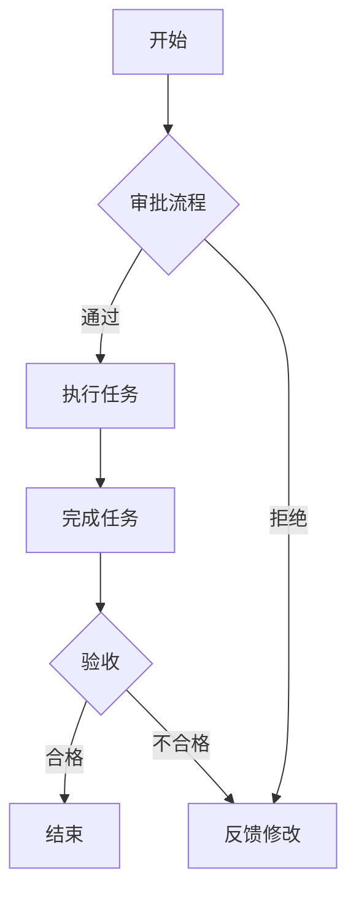

                 

## 引言

### 1.1 书籍背景与目的

在数字化时代，技术进步与业务创新如同双螺旋结构，共同驱动着企业和行业的快速发展。本书旨在探讨“技术与业务的双螺旋：相互促进的发展模式”，通过深入剖析技术螺旋和业务螺旋的相互作用机制，揭示二者如何在不断创新中相互推动，实现共同进步。

本书的写作动机源于笔者多年来在IT行业的观察与实践。在当今科技迅速发展的背景下，技术进步正以前所未有的速度影响着各行各业，而与此同时，企业业务的创新也不断催生新的技术需求。技术的飞速发展和业务模式的不断创新，使得二者之间的互动变得更加紧密和复杂。因此，如何理解并利用这种双螺旋结构，成为企业和行业领导者亟待解决的问题。

本书的目标是为读者提供一套系统、全面、易于理解的理论框架和实践指南，帮助读者深入了解技术与业务之间的相互关系，掌握利用双螺旋模式实现企业持续发展的策略和方法。通过本书，读者将能够：

1. 理解技术与业务双螺旋模型的基本概念和运作机制。
2. 掌握技术螺旋和业务螺旋之间的相互促进关系。
3. 学习实际案例分析，了解双螺旋模式在不同行业中的应用和实践。
4. 获取在技术和业务创新中实际操作的建议和最佳实践。

### 1.2 技术与业务的双螺旋概念

技术螺旋（Technical Spiral）和业务螺旋（Business Spiral）是本书的核心概念。技术螺旋指的是在技术发展过程中，创新驱动的不断迭代和进化；而业务螺旋则是在业务模式演进过程中，需求驱动的不断变革和创新。二者之间的互动关系可以形象地比喻为双螺旋结构，在技术创新和业务创新的共同作用下，形成一种相互促进、螺旋上升的发展模式。

技术螺旋主要关注的是技术本身的进步和创新。它包括技术的研发、迭代、优化等过程，这些技术进步为业务创新提供了强大的支撑。例如，云计算、大数据、人工智能等前沿技术的出现，不仅推动了技术螺旋的快速旋转，也为企业的业务模式创新提供了新的契机。

业务螺旋则侧重于企业在市场环境中的适应和变革。业务模式的创新可以包括商业模式、运营策略、客户关系等方面的变革，这些创新反过来又对技术螺旋产生重要影响。例如，共享经济的兴起不仅改变了传统业务模式，也催生了大量对技术基础设施的新需求，如分布式计算、大数据处理等。

### 1.3 本书结构安排与主要内容

本书结构清晰，内容丰富，共分为七个章节，具体安排如下：

- **第1章 引言**：介绍书籍的背景、目的、技术与业务双螺旋概念，以及本书的结构安排。

- **第2章 核心概念与联系**：详细阐述技术螺旋和业务螺旋的概念，分析二者之间的相互联系和运作机制。

- **第3章 核心算法原理讲解**：介绍技术螺旋中的核心算法原理，包括机器学习算法的基础、常见算法及其在业务螺旋中的应用。

- **第4章 数学模型和数学公式**：探讨技术螺旋和业务螺旋中的数学基础，包括统计学、机器学习数学和经济学基础。

- **第5章 项目实战**：通过实际案例展示技术螺旋和业务螺旋在项目中的应用和实践。

- **第6章 开发环境搭建**：指导如何搭建技术和业务开发环境，包括Python环境配置、业务流程设计和数据库搭建。

- **第7章 源代码详细实现与代码解读**：详细讲解技术和业务项目的核心算法和代码实现。

通过以上章节的安排，本书力求为读者提供一条清晰的认识路径，帮助读者深入理解技术与业务双螺旋模型，掌握其在实际中的应用方法。

### 2.1 技术与业务的双螺旋模型

技术与业务的双螺旋模型是一个描述技术创新和业务模式创新之间相互作用的动态框架。该模型的核心思想在于，技术创新和业务创新不是孤立的过程，而是相互依赖、相互促进的。通过深入分析技术螺旋和业务螺旋的概念、特征及其相互关系，我们可以更好地理解这种双螺旋模型的工作机制。

#### 2.1.1 技术螺旋

技术螺旋（Technical Spiral）主要关注技术的进步和创新。技术螺旋的旋转由以下几个关键要素驱动：

**2.1.1.1 技术创新的驱动因素**

技术创新的驱动因素主要包括市场需求、技术积累、政策支持和资金投入。市场需求是技术创新的源头，它决定了哪些技术方向具有实际应用价值。技术积累则为技术创新提供了基础，通过不断的研究和开发，技术不断迭代和进步。政策支持和资金投入则为技术创新提供了保障，使技术项目能够顺利进行。

**2.1.1.2 技术发展的路径**

技术发展的路径通常包括以下几个阶段：基础研究、技术发明、技术研发、技术应用。基础研究是技术创新的源头，通过科学实验和理论分析，探索新的科学原理和技术可能性。技术发明是将基础研究成果转化为具体技术的过程，它通常需要解决技术实现的难题。技术研发则是在技术发明的基础上，对技术进行进一步的优化和改进，使其更加成熟和实用。技术应用是将技术投入实际应用的过程，它通常伴随着大规模的商业化和产业化。

**2.1.1.3 技术创新对业务的影响**

技术创新对业务的影响是多方面的。首先，技术创新可以为企业带来新的产品和服务，从而开辟新的市场机会。例如，云计算技术的出现，为企业提供了强大的计算能力和存储能力，使得许多企业能够开展之前无法实现的大数据处理项目。其次，技术创新可以提高企业的生产效率和管理水平，降低运营成本。例如，自动化技术的应用，可以大大减少人工操作，提高生产效率。最后，技术创新可以改变企业的商业模式，甚至颠覆整个行业。例如，电子商务的出现，彻底改变了传统零售行业的运作模式。

#### 2.1.2 业务螺旋

业务螺旋（Business Spiral）主要关注企业在市场环境中的适应和变革。业务螺旋的旋转由以下几个关键要素驱动：

**2.1.2.1 业务模式的演变**

业务模式的演变是企业在市场环境中不断调整和优化的过程。它通常包括以下几个阶段：初始业务模式、商业模式创新、商业模式优化。初始业务模式是企业刚刚起步时的业务模式，它通常基于企业的核心能力和市场需求。商业模式创新是企业通过引入新的技术、产品或服务，改变原有的业务模式，以适应市场变化。商业模式优化则是在商业模式创新的基础上，对业务流程、运营策略等方面进行进一步优化，以提高企业的竞争力和盈利能力。

**2.1.2.2 业务创新的关键要素**

业务创新的关键要素包括市场需求、技术支持、组织能力、资本投入和用户反馈。市场需求是业务创新的核心驱动力，它决定了哪些业务创新具有实际应用价值。技术支持是业务创新的基础，它提供了实现业务创新的技术手段。组织能力是业务创新成功的关键，它决定了企业能否有效地执行业务创新计划。资本投入是业务创新的重要保障，它为业务创新提供了必要的资金支持。用户反馈则是业务创新的持续动力，它帮助企业在实践中不断调整和优化业务创新。

**2.1.2.3 业务创新对技术的影响**

业务创新对技术的影响也是多方面的。首先，业务创新可以推动技术的进步和创新。例如，电子商务的兴起，催生了大量关于大数据处理、网络安全、支付系统等技术的创新。其次，业务创新可以改变技术的应用场景，从而推动技术的进一步发展。例如，物联网技术的应用，使得传感器、云计算等技术得以在更广泛的场景中实现。最后，业务创新可以激发技术标准的制定和推广，从而推动技术的统一和标准化。例如，5G技术的推广，是为了满足未来高速数据传输的需求，它不仅改变了通信行业的业务模式，也推动了相关技术的标准化和普及化。

#### 2.1.3 双螺旋模型的运作机制

双螺旋模型的运作机制主要体现在技术螺旋和业务螺旋之间的相互促进和相互作用。

**2.2.1.1 技术进步推动业务创新**

技术进步可以为企业提供新的业务机会，推动业务创新。例如，云计算技术的进步，使得企业能够通过云计算平台提供更加灵活、高效的服务，从而推动业务模式的创新。此外，技术进步还可以降低业务创新的门槛，使得更多企业能够参与到业务创新中来。

**2.2.1.2 业务需求引导技术进步**

业务需求是技术进步的重要驱动力。随着业务模式的不断变化和创新，企业对技术的要求也在不断提高。这种需求引导了技术的进一步发展和创新。例如，随着电子商务的兴起，对数据安全和隐私保护的要求越来越高，从而推动了网络安全技术的进步。

通过技术螺旋和业务螺旋的相互作用，企业能够实现持续的技术创新和业务创新，从而在激烈的市场竞争中保持优势。双螺旋模型的运作机制不仅为企业提供了发展的动力，也为行业和整个社会带来了新的机遇和挑战。

### 2.2 双螺旋模型的运作机制

双螺旋模型的运作机制是理解技术与业务如何相互促进、实现共同发展的关键。在这一节中，我们将深入探讨技术螺旋和业务螺旋之间的相互促进机制，详细阐述技术进步如何推动业务创新，以及业务需求如何引导技术进步。

#### 2.2.1 相互促进的机制

双螺旋模型的相互促进机制主要体现在以下几个方面：

**2.2.1.1 技术进步推动业务创新**

技术进步是业务创新的重要驱动力。随着技术的不断发展和创新，企业能够获得新的工具和方法，这些工具和方法可以帮助企业实现更高的效率、更低的成本和更优质的服务。以下是一些具体例子：

1. **云计算技术的进步**：云计算技术的出现，为企业提供了一种灵活、可扩展的计算基础设施。企业可以通过云平台实现快速部署、弹性扩展和高效管理，从而大大提高业务运营的效率。例如，亚马逊云服务（AWS）和微软云服务（Azure）等云平台，为企业提供了强大的计算能力和存储能力，使得许多企业能够开展之前无法实现的大数据处理项目。

2. **大数据技术的进步**：大数据技术的进步，使得企业能够对海量数据进行分析和挖掘，从而发现商业机会和洞察市场趋势。例如，阿里巴巴通过对海量交易数据进行分析，实现了对消费者行为和需求的精准预测，从而优化了供应链管理和产品推荐策略。

3. **人工智能技术的进步**：人工智能技术的进步，为企业带来了智能化的解决方案。通过机器学习和深度学习算法，企业能够实现自动化决策、个性化服务和智能优化。例如，谷歌的AlphaGo通过深度学习算法，在围棋领域取得了重大突破，这一技术的应用有望在金融、医疗、物流等领域实现广泛的应用。

**2.2.1.2 业务需求引导技术进步**

业务需求是技术进步的重要推动力。随着业务模式的不断变化和创新，企业对技术的要求也在不断提高，这种需求引导了技术的进一步发展和创新。以下是一些具体例子：

1. **物联网技术的需求**：随着物联网技术的发展，企业需要将大量的设备和传感器连接到互联网上，实现数据的实时采集、传输和分析。这一需求推动了物联网技术的进步，包括无线通信、边缘计算、智能传感等技术。例如，智能家居设备的普及，使得家庭自动化成为可能，这也推动了相关技术的快速发展。

2. **网络安全的需求**：随着互联网的普及和电子商务的发展，企业对网络安全的关注度越来越高。网络攻击和数据泄露事件频繁发生，使得企业迫切需要提高网络安全水平。这一需求推动了网络安全技术的进步，包括加密技术、安全协议、入侵检测系统等技术。

3. **个性化服务的需求**：随着消费者对个性化和定制化需求的增长，企业需要提供更加精准和个性化的服务。这一需求推动了人工智能、大数据、自然语言处理等技术的进步，使得企业能够更好地理解和满足消费者的需求。

#### 2.2.2 双螺旋模型在不同行业中的应用

双螺旋模型在各个行业中的应用有所不同，但核心机制是相通的。以下是一些行业中的具体案例：

1. **金融行业**：在金融行业，技术的进步推动了金融业务的创新。例如，区块链技术的应用，使得金融交易更加安全、透明和高效。同时，金融业务的创新也推动了区块链技术的发展，例如在跨境支付、智能合约等方面的应用。

2. **医疗行业**：在医疗行业，技术的进步推动了医疗服务的创新。例如，人工智能技术的应用，使得医疗诊断更加准确、治疗更加个性化和高效。同时，医疗需求的增加也推动了生物技术、基因编辑等技术的进步。

3. **零售行业**：在零售行业，技术的进步推动了零售模式的创新。例如，电子商务技术的应用，使得线上购物成为可能，推动了无店铺零售的发展。同时，零售需求的增加也推动了物流、支付等技术的进步。

#### 2.2.3 双螺旋模型的优势和挑战

双螺旋模型的优势在于：

- **协同创新**：技术螺旋和业务螺旋的相互促进，使得企业能够在技术和业务方面实现协同创新，提高整体竞争力。
- **快速响应**：双螺旋模型使得企业能够快速响应市场需求，通过技术创新和业务创新，实现快速的市场适应和竞争力提升。
- **持续发展**：双螺旋模型通过持续的技术创新和业务创新，推动企业实现持续发展，保持长期的竞争优势。

然而，双螺旋模型也面临着一些挑战：

- **技术风险**：技术创新可能带来技术风险，如技术失败、技术落后等，这些风险需要企业进行有效的管理和控制。
- **业务风险**：业务创新可能带来业务风险，如市场需求变化、业务模式失败等，这些风险也需要企业进行有效的管理和应对。
- **资源配置**：双螺旋模型要求企业进行有效的资源配置，以确保技术螺旋和业务螺旋的协同发展。

通过理解双螺旋模型的运作机制，企业可以更好地把握技术创新和业务创新的机遇，实现持续的发展和进步。

### 2.3 实际案例分析

为了更深入地理解技术与业务双螺旋模型的运作机制，我们将通过几个具体的案例来探讨这一模型在不同行业和企业中的成功实践。

#### 2.3.1.1 案例一：谷歌与云计算

谷歌（Google）无疑是技术与业务双螺旋模型的一个典型代表。谷歌的云计算业务（Google Cloud）就是这一模型的经典案例。

**技术螺旋：** 谷歌在技术研发方面投入巨大，特别是在人工智能、机器学习、大数据等领域。这些技术的进步不仅推动了谷歌搜索引擎的发展，也为谷歌的云计算业务提供了强大的技术支撑。例如，谷歌的TensorFlow开源机器学习框架，已经成为全球范围内最流行的机器学习库之一，为云计算提供了强大的算法支持。

**业务螺旋：** 谷歌通过云计算业务为企业和开发者提供了丰富的服务，包括计算、存储、数据库、人工智能等。这些服务不仅满足了企业和开发者的技术需求，也推动了谷歌云计算业务模式的不断创新。例如，谷歌的Google Kubernetes Engine（GKE）提供了高效的容器管理服务，帮助企业实现微服务架构，提高了业务敏捷性和效率。

**相互促进机制：** 技术螺旋推动业务螺旋，谷歌的技术创新使其云计算服务更具竞争力。同时，云计算业务的需求也反过来推动了谷歌在技术领域的持续创新。例如，谷歌对云计算基础设施的大规模投资，推动了云计算技术的不断进步。

**总结：** 谷歌通过技术与业务双螺旋模型，实现了快速发展和持续创新，成为云计算市场的领导者。

#### 2.3.1.2 案例二：亚马逊与物流

亚马逊（Amazon）的物流业务也是技术与业务双螺旋模型的成功案例。

**技术螺旋：** 亚马逊在物流技术方面进行了大量投资，开发了自动化仓储、无人机配送、智能路由等技术。这些技术的进步大幅提高了物流效率，降低了运营成本。例如，亚马逊的Kiva机器人系统，可以自动处理仓库中的订单，大大提高了仓库的作业效率。

**业务螺旋：** 亚马逊通过不断创新物流服务，提升用户体验。例如，推出了Prime会员服务，提供2日或更快的配送服务，以及免费无限次的一日达配送。这些服务创新不仅提升了用户满意度，也促进了亚马逊物流业务的快速增长。

**相互促进机制：** 技术螺旋提高了亚马逊的物流效率，降低了成本，推动了业务螺旋的创新。同时，业务螺旋的需求也促使亚马逊不断改进物流技术，实现更高水平的自动化和智能化。

**总结：** 亚马逊通过技术与业务双螺旋模型，不仅实现了物流业务的快速增长，还巩固了其在线零售市场的领导地位。

#### 2.3.1.3 案例三：阿里巴巴与电商

阿里巴巴（Alibaba）在电商领域的成功，同样展示了技术与业务双螺旋模型的强大威力。

**技术螺旋：** 阿里巴巴在电商技术方面进行了大量投资，开发了包括淘宝、天猫、支付宝等平台。这些平台的成功，离不开大数据、云计算、人工智能等技术的支持。例如，阿里巴巴的阿里云，提供了强大的计算和存储能力，支持了电商平台的业务需求。

**业务螺旋：** 阿里巴巴通过不断创新电商业务模式，吸引了大量用户和商家。例如，双11购物节的推出，通过大规模促销活动，吸引了数以亿计的消费者，大幅提升了平台的交易量。同时，阿里巴巴还通过支付宝，提供了便捷的支付解决方案，促进了电商交易的顺利进行。

**相互促进机制：** 技术螺旋为阿里巴巴的电商业务提供了强大的技术支持，使得平台能够提供更加高效、智能的服务。业务螺旋的需求，又推动了阿里巴巴在技术领域的持续创新，例如对云计算、大数据处理等技术的深度研发。

**总结：** 阿里巴巴通过技术与业务双螺旋模型，实现了电商业务的巨大成功，成为全球电商市场的领军者。

#### 2.3.1.4 案例四：特斯拉与电动汽车

特斯拉（Tesla）在电动汽车领域的成功，同样是技术与业务双螺旋模型的一个成功案例。

**技术螺旋：** 特斯拉在电动汽车技术方面进行了大量投资，开发了先进的电池技术、自动驾驶技术和能源管理系统。这些技术的进步，使得特斯拉的电动汽车在性能、续航和智能化方面处于领先地位。

**业务螺旋：** 特斯拉通过不断创新电动汽车业务模式，吸引了大量消费者。例如，推出了Model S、Model 3等高性能、高性价比的电动汽车，以及建立了庞大的超级充电网络，提供了便捷的充电服务。

**相互促进机制：** 技术螺旋提高了特斯拉电动汽车的竞争力，推动了业务螺旋的创新。同时，业务螺旋的需求，也促使特斯拉在技术领域进行持续创新，以应对市场的竞争。

**总结：** 特斯拉通过技术与业务双螺旋模型，不仅在电动汽车领域取得了巨大成功，还推动了整个电动汽车行业的发展。

通过以上案例分析，我们可以看到，技术与业务双螺旋模型在不同行业和企业中的成功实践，不仅推动了企业自身的发展，也对整个行业产生了深远的影响。理解并应用这一模型，有助于企业在数字化时代实现持续的创新和进步。

### 3.1 技术螺旋：算法基础

在技术螺旋中，算法是核心技术之一。算法不仅是实现技术进步的关键，也是推动业务创新的重要工具。本节将介绍机器学习算法的基础知识，包括监督学习、无监督学习和强化学习，并探讨这些算法在技术螺旋和业务螺旋中的具体应用。

#### 3.1.1 机器学习算法概述

机器学习算法是人工智能（AI）的核心技术之一，它通过训练模型来从数据中学习规律和模式，进而实现对未知数据的预测和决策。根据学习方式的不同，机器学习算法主要分为以下几类：

**监督学习（Supervised Learning）**：监督学习是一种有监督的训练方法，它使用带有标签的数据集来训练模型。通过学习输入和输出之间的映射关系，模型可以对新数据进行预测。常见的监督学习算法包括线性回归、逻辑回归、决策树、支持向量机（SVM）和神经网络等。

**无监督学习（Unsupervised Learning）**：无监督学习是一种无监督的训练方法，它使用未标记的数据集来训练模型。通过发现数据中的隐含结构和模式，无监督学习算法可以帮助我们理解数据的内在特征。常见的方法包括聚类算法（如K-Means、DBSCAN）、降维算法（如PCA）和关联规则学习（如Apriori算法）等。

**强化学习（Reinforcement Learning）**：强化学习是一种通过试错的方式来学习最优策略的机器学习方法。它通过与环境的交互，不断调整策略，以实现最大化奖励的目标。强化学习在自动化控制、游戏AI、推荐系统等领域有广泛应用。

#### 3.1.2 常见机器学习算法

**决策树与随机森林**

决策树（Decision Tree）是一种简单而强大的分类和回归算法。它通过一系列的判断节点，将数据划分为不同的区域，最终得到分类或回归结果。随机森林（Random Forest）是决策树的集成方法，通过构建多棵决策树，并投票决定最终结果，从而提高模型的预测准确性。

**支持向量机**

支持向量机（Support Vector Machine，SVM）是一种基于最大间隔理论的分类算法。它通过找到一个最优的超平面，将数据分类到不同的类别。SVM在处理高维数据和线性不可分数据时表现尤为出色。

**神经网络**

神经网络（Neural Network）是一种模拟人脑神经元结构和功能的人工智能模型。通过多层神经网络（如卷积神经网络CNN、循环神经网络RNN、生成对抗网络GAN等），我们可以实现复杂的分类、回归和生成任务。神经网络在图像识别、自然语言处理和生成艺术等领域有着广泛应用。

#### 3.1.3 技术螺旋中的应用

**云计算与大数据处理**

云计算和大数据技术的进步，为机器学习算法的应用提供了强大的基础设施。通过云平台，企业可以轻松部署和扩展机器学习模型，处理大规模数据。例如，谷歌的TensorFlow和微软的Azure Machine Learning都是基于云的机器学习平台，它们提供了丰富的算法库和工具，帮助企业快速构建和部署机器学习应用。

**人工智能与自动化**

机器学习算法在人工智能和自动化领域有着广泛的应用。通过深度学习和强化学习，我们可以实现智能自动化，如自动驾驶、智能家居和智能制造。例如，特斯拉的自动驾驶系统就是基于深度学习和强化学习的复杂算法，它通过不断学习和优化，实现了自动驾驶的稳定和安全。

**金融与医疗**

在金融和医疗领域，机器学习算法可以用于风险管理、欺诈检测、疾病预测等方面。例如，金融机构可以使用机器学习算法来预测信贷风险，从而优化信贷审批流程。医疗机构可以使用机器学习算法来分析患者数据，预测疾病发展趋势，从而提供个性化的治疗方案。

**业务螺旋中的应用**

**个性化推荐**

在电商和社交媒体领域，个性化推荐系统是业务创新的重要方向。通过机器学习算法，我们可以分析用户行为数据，预测用户的兴趣和需求，从而推荐相关商品或内容。例如，亚马逊和Netflix都利用了机器学习算法，实现了个性化的购物和视频推荐，大大提升了用户体验和转化率。

**智能客服**

智能客服系统是机器学习算法在客户服务领域的应用。通过自然语言处理和对话生成算法，智能客服系统能够与用户进行自然对话，解答用户的问题。例如，许多公司都已经部署了基于机器学习的智能客服系统，如苹果的Siri和谷歌的Google Assistant，它们通过不断学习和优化，提高了客服效率和用户满意度。

**总结**

机器学习算法在技术螺旋和业务螺旋中扮演着重要角色。通过不断的技术创新和业务需求，机器学习算法的应用领域越来越广泛，从大数据处理到人工智能，从金融到医疗，从电商到客服，它正在改变着各个行业的运作模式。理解并应用机器学习算法，是企业实现技术和业务创新的关键。

### 3.2 业务螺旋：业务模式创新

在业务螺旋中，业务模式创新是驱动企业持续发展的核心动力。业务模式创新不仅能够为企业带来新的增长点，还能提高市场竞争力，实现业务的转型升级。本节将详细探讨商业模式设计、商业模式的评估方法以及商业模式实施与优化。

#### 3.2.1 商业模式设计

商业模式设计是企业战略规划的重要组成部分。一个成功的商业模式需要明确企业的价值主张、目标客户、收入来源、成本结构和盈利模式。以下是一些关键步骤和策略：

**1. 明确价值主张**

价值主张是企业提供的产品或服务所能为顾客带来的独特价值和好处。明确价值主张需要深入理解市场需求和顾客痛点，从而设计出能够满足顾客需求的解决方案。

**2. 定义目标客户**

定义目标客户是商业模式设计的关键一步。企业需要明确目标客户的特征、需求和购买行为，以便更有效地定位市场和设计营销策略。

**3. 确定收入来源**

收入来源是企业盈利的主要渠道。企业可以通过产品销售、服务订阅、广告收入、佣金等方式实现收入。在设计商业模式时，需要考虑多种收入来源的组合，以实现稳定的盈利。

**4. 分析成本结构**

成本结构是商业模式设计中的重要考虑因素。企业需要合理规划成本，确保收入能够覆盖成本并实现盈利。常见的成本结构包括固定成本、可变成本和间接成本。

**5. 确定盈利模式**

盈利模式是企业实现盈利的具体方式。企业可以根据自身情况和市场需求，选择合适的盈利模式，如高利润模式、薄利多销模式或免费增值模式等。

**6. 策略与工具**

在商业模式设计中，企业可以运用各种策略和工具，如价值网络分析、市场细分、成本效益分析等，以优化商业模式，提高竞争力。

#### 3.2.2 商业模式评估方法

评估商业模式的有效性是企业进行持续创新和优化的基础。以下是一些常用的商业模式评估方法：

**1. SWOT分析**

SWOT分析是一种用于评估商业模式的战略工具。它通过分析企业的优势（Strengths）、劣势（Weaknesses）、机会（Opportunities）和威胁（Threats），帮助企业了解自身的竞争地位和市场环境。

**2. 成本效益分析**

成本效益分析是评估商业模式经济性的常用方法。它通过比较商业模式的成本和收益，评估商业模式的盈利能力和经济效益。

**3. 市场测试**

市场测试是一种通过实际市场反馈来评估商业模式的方法。通过市场测试，企业可以了解客户对产品和服务的反应，发现潜在问题，并做出相应调整。

**4. 竞争分析**

竞争分析是评估商业模式竞争力的重要方法。企业可以通过分析竞争对手的商业模式、市场份额、定价策略等，了解自身的市场地位和竞争优势。

**5. 创新评估**

创新评估是评估商业模式创新能力的方法。企业可以通过评估技术创新、产品创新、市场创新等方面，了解商业模式的创新能力和市场适应能力。

#### 3.2.3 商业模式实施与优化

商业模式实施是将设计方案转化为实际业务运营的过程。以下是一些关键步骤和策略：

**1. 制定实施计划**

制定详细的实施计划是确保商业模式顺利实施的关键。实施计划应包括具体的目标、任务、时间表、资源分配和责任分配。

**2. 组织与协调**

在实施过程中，企业需要建立有效的组织结构和协调机制，确保各部门和团队成员之间的密切合作和高效执行。

**3. 营销与推广**

营销与推广是商业模式成功的关键。企业应制定有效的营销策略，通过多种渠道宣传和推广产品或服务，吸引客户。

**4. 反馈与调整**

在商业模式实施过程中，企业需要不断收集市场反馈和运营数据，分析问题并做出相应调整。通过持续优化，企业可以不断改进商业模式，提高市场竞争力。

**5. 评估与总结**

在商业模式实施完成后，企业应对商业模式的效果进行评估和总结。通过评估，企业可以了解商业模式的成功经验和不足之处，为未来的商业模式创新提供参考。

#### 3.2.4 商业模式创新策略

商业模式的创新策略包括以下几方面：

**1. 市场细分与定位**

通过市场细分，企业可以找到具有特定需求的细分市场，从而实现更精准的市场定位。例如，某些企业通过针对特定年龄、性别、收入群体的细分市场，实现了商业模式的创新。

**2. 产品与服务创新**

产品与服务创新是企业实现商业模式创新的重要途径。通过推出具有独特价值的产品或服务，企业可以开辟新的市场，提升竞争力。

**3. 业务流程优化**

优化业务流程可以提高企业的运营效率，降低成本，从而实现商业模式的创新。例如，通过引入自动化和数字化工具，企业可以大幅提高生产效率和服务质量。

**4. 合作伙伴关系**

建立紧密的合作伙伴关系，可以为企业提供资源和市场，推动商业模式的创新。例如，通过与其他企业合作，共享技术、市场和渠道资源，可以加速商业模式的创新和推广。

**5. 创新思维与方法**

采用创新思维和方法，如设计思维、敏捷开发等，可以帮助企业不断探索和尝试新的商业模式，从而实现持续创新。

通过商业模式设计、评估和实施，企业可以在技术和业务双螺旋模型中实现持续的创新和发展。理解并应用这些策略和方法，是企业把握市场机遇、实现长远发展的关键。

### 4.1 技术螺旋：数学基础

在技术螺旋中，数学是不可或缺的基础。无论是机器学习算法的设计与实现，还是大数据处理和优化，数学理论和方法都起到了至关重要的作用。本节将详细探讨统计学基础、机器学习数学以及经济学基础，为技术螺旋的发展提供坚实的数学支持。

#### 4.1.1 统计学基础

统计学是数据分析的基石，它在机器学习和数据科学中有着广泛的应用。统计学基础包括概率论、描述性统计学和推断性统计学。

**概率论（Probability Theory）**：概率论是研究随机事件及其概率的数学分支。它是统计学的核心，用于预测和分析随机现象。常见的概率概念包括概率分布、条件概率和贝叶斯定理。例如，在机器学习中，概率论用于计算数据特征的概率分布，以构建预测模型。

**描述性统计学（Descriptive Statistics）**：描述性统计学用于总结和描述数据集的基本特征，如平均数、中位数、标准差等。它提供了对数据直观的理解和分析工具。例如，在数据分析中，描述性统计用于了解数据分布和趋势，帮助决策者制定策略。

**推断性统计学（Inferential Statistics）**：推断性统计学用于从样本数据推断总体数据特征。它包括假设检验和置信区间等概念。假设检验用于验证某个假设是否成立，置信区间则用于估计总体参数的范围。例如，在机器学习中，推断性统计学用于评估模型的准确性和可靠性。

**应用案例**：假设一家电商公司想要了解其客户群体的购买行为。通过收集客户的购买数据，公司可以使用描述性统计学计算平均购买金额、购买频率等指标。然后，利用推断性统计学，公司可以检验不同营销策略对购买行为的影响，从而优化营销策略。

#### 4.1.2 机器学习数学

机器学习算法的设计和实现依赖于数学理论，特别是线性代数、最优化算法和函数优化。

**线性代数（Linear Algebra）**：线性代数是处理线性方程组、矩阵运算和向量空间等概念的数学分支。它在机器学习中有广泛的应用，如特征提取、降维和矩阵分解等。例如，在神经网络中，线性代数用于计算权重矩阵和激活函数，实现数据的线性变换。

**最优化算法（Optimization Algorithms）**：最优化算法用于寻找函数的最值或近似解。在机器学习中，最优化算法用于训练模型，如梯度下降法、牛顿法和拉格朗日乘数法等。这些算法通过迭代优化，不断调整模型参数，以最小化损失函数。

**函数优化（Function Optimization）**：函数优化是指寻找函数极值的过程。在机器学习中，函数优化用于优化模型参数，以提高模型性能。常见的优化问题包括凸优化和非凸优化。凸优化问题通常有解析解，而非凸优化问题则需要迭代算法。

**应用案例**：假设一家零售公司希望优化其库存管理策略。通过收集历史销售数据，公司可以使用线性代数方法进行数据预处理，如特征提取和降维。然后，利用最优化算法，公司可以建立库存优化模型，找到最优的库存水平和补货策略，以减少库存成本和缺货风险。

#### 4.1.3 经济学基础

经济学基础，特别是微观经济学，对技术螺旋和业务螺旋的理解和优化至关重要。

**供需关系（Supply and Demand）**：供需关系是经济学的基础概念，用于分析市场上商品或服务的价格和数量。在技术螺旋中，供需关系可以帮助企业预测市场需求，制定生产计划。例如，一家科技公司可以通过分析市场需求，预测新产品发布的最佳时机和价格策略。

**市场竞争（Market Competition）**：市场竞争是经济学中的重要概念，用于描述企业在市场上的竞争关系。在技术螺旋中，市场竞争可以激励企业进行技术创新和业务创新，以保持竞争优势。例如，一家科技公司可以通过开发新技术和改进产品，应对竞争对手的挑战。

**成本效益分析（Cost-Benefit Analysis）**：成本效益分析是一种用于评估项目或决策的经济分析方法。它通过比较项目的成本和效益，帮助决策者判断项目是否值得投资。在技术螺旋中，成本效益分析可以帮助企业评估技术创新的成本和潜在收益，从而制定合理的投资策略。

**应用案例**：假设一家科技公司计划开发一款新的人工智能产品。通过进行成本效益分析，公司可以评估开发成本和预期收益，确定项目是否值得投资。同时，通过分析市场需求和竞争状况，公司可以制定合适的市场策略，提高产品的市场竞争力。

#### 4.1.4 数学在技术螺旋中的应用

数学在技术螺旋中的应用体现在多个方面，包括数据预处理、模型训练、性能评估等。

**数据预处理（Data Preprocessing）**：在机器学习中，数据预处理是确保数据质量和模型性能的重要步骤。数学方法，如线性代数和统计学，用于数据清洗、特征提取和标准化等操作。例如，通过线性代数的奇异值分解（SVD），可以有效地降低数据维度，减少计算复杂度。

**模型训练（Model Training）**：数学是机器学习模型训练的核心。最优化算法和函数优化方法用于调整模型参数，以最小化损失函数，提高模型性能。例如，在深度学习中，梯度下降法是最常用的优化算法，它通过迭代优化模型参数，实现模型的训练。

**性能评估（Performance Evaluation）**：数学方法用于评估模型的性能和可靠性。常见的评估指标包括准确率、召回率、F1分数等。数学模型和统计方法可以帮助我们准确衡量模型的预测能力，从而做出科学的决策。

通过统计学、机器学习数学和经济学基础，数学为技术螺旋的发展提供了坚实的理论支持。它不仅帮助我们在数据中挖掘价值，优化算法和模型，还为我们在复杂的市场环境中做出明智的决策提供了有力工具。理解并应用数学知识，是企业实现技术和业务螺旋创新的关键。

### 4.2 业务螺旋：经济学基础

在业务螺旋中，经济学基础对于理解和指导企业的运营策略至关重要。微观经济学作为经济学的重要组成部分，通过研究市场中的个体经济行为，为业务模式的创新和优化提供了理论支持。以下将详细探讨供需关系、市场竞争和成本效益分析在业务螺旋中的应用。

#### 4.2.1 微观经济学

微观经济学是研究单个经济单位（如消费者、生产者、市场）的经济行为和市场机制的经济学分支。它包括以下几个核心概念：

**市场结构（Market Structure）**：市场结构指的是市场中买卖双方的数量和规模分布，以及它们之间的相互作用方式。常见的市场结构包括完全竞争、垄断、垄断竞争和寡头垄断。

**供求关系（Supply and Demand）**：供求关系是微观经济学的核心概念，用于描述市场上商品或服务的价格和数量之间的关系。需求曲线表示消费者在不同价格下愿意购买的商品数量，供给曲线表示生产者在不同价格下愿意提供的商品数量。市场的均衡点发生在需求曲线和供给曲线的交点，此时价格和数量达到稳定状态。

**消费者行为（Consumer Behavior）**：消费者行为研究消费者的购买决策过程，包括需求、偏好、预算和消费行为等。理解消费者行为可以帮助企业制定有效的营销策略，提高市场竞争力。

**生产者行为（Producer Behavior）**：生产者行为研究生产者在生产决策中的行为，包括成本、产量、定价和利润最大化等。通过分析生产者的行为，企业可以优化生产流程，降低成本，提高生产效率。

**市场机制（Market Mechanism）**：市场机制是指市场如何通过价格、供求和竞争等手段来实现资源优化配置的过程。市场机制包括价格机制、供求机制和竞争机制等。

#### 4.2.2 供需关系

供需关系是微观经济学中的基础概念，它对企业业务模式的制定和优化具有重要影响。

**市场需求（Demand）**：市场需求是指消费者在不同价格水平下愿意购买的商品数量。市场需求受到价格、消费者收入、替代品和互补品、消费者偏好等因素的影响。企业在制定业务策略时，需要准确把握市场需求，以便制定合适的价格策略和产品策略。

**市场供给（Supply）**：市场供给是指生产者在不同价格水平下愿意提供的商品数量。市场供给受到生产成本、技术水平、资源供应、政策环境等因素的影响。企业需要根据市场供给情况，合理安排生产和库存，以应对市场变化。

**供需平衡（Equilibrium）**：在微观经济学中，市场的均衡状态发生在需求曲线和供给曲线的交点，此时价格和数量达到稳定状态。供需平衡是企业制定业务策略的重要参考指标，通过分析供需关系，企业可以预测市场趋势，制定合理的生产和销售计划。

**供需弹性（Price Elasticity）**：供需弹性是指需求或供给量对价格变化的敏感程度。需求价格弹性表示价格变化对需求量的影响，供给价格弹性表示价格变化对供给量的影响。了解供需弹性有助于企业制定灵活的定价策略和应对市场变化。

**应用案例**：假设一家手机制造商想要推出一款新型智能手机。通过分析市场需求，企业可以了解消费者对不同价格水平的接受程度，从而制定合理的价格策略。同时，通过分析市场供给，企业可以了解竞争对手的生产能力和市场占有率，从而调整生产和库存策略，确保产品在市场上的竞争力。

#### 4.2.3 市场竞争

市场竞争是微观经济学中的重要概念，它对企业的生存和发展具有重要影响。

**市场竞争力（Competitive Advantage）**：市场竞争力是指企业在市场竞争中相对于竞争对手的优势和劣势。市场竞争力取决于企业的产品质量、价格、创新能力和品牌价值等。通过不断提升市场竞争力，企业可以保持市场份额，实现可持续发展。

**竞争策略（Competitive Strategy）**：竞争策略是企业为了在市场竞争中取得优势而采取的具体行动和策略。常见的竞争策略包括低成本策略、差异化策略、集中化策略和多元化策略等。通过制定和实施有效的竞争策略，企业可以增强市场竞争力，扩大市场份额。

**竞争格局（Competitive Landscape）**：竞争格局是指市场中各个竞争者的相对位置和实力对比。了解竞争格局有助于企业把握市场动态，制定有针对性的业务策略。通过分析竞争格局，企业可以发现市场机会和潜在威胁，从而调整战略方向。

**应用案例**：假设一家在线教育平台在市场中面临多家竞争对手。通过分析竞争格局，企业可以了解竞争对手的市场份额、价格策略、产品特点等，从而制定差异化策略，如提供高质量的课程内容和个性化的学习服务，以吸引更多用户。

#### 4.2.4 成本效益分析

成本效益分析是微观经济学中用于评估项目或决策经济效益的重要工具。

**成本效益分析（Cost-Benefit Analysis）**：成本效益分析是一种通过比较项目的成本和效益，评估其经济合理性和可行性的方法。成本效益分析包括以下几个步骤：

1. **确定项目成本**：包括直接成本（如原材料、人工、设备等）和间接成本（如管理费用、培训费用等）。

2. **估算项目效益**：包括直接效益（如销售收入、利润等）和间接效益（如品牌提升、市场占有率等）。

3. **计算成本效益比**：通过比较成本和效益，计算成本效益比（C/B），以评估项目的经济效益。

4. **决策和优化**：根据成本效益分析的结果，决策者可以做出是否投资项目的决策，并根据分析结果优化项目方案。

**应用案例**：假设一家制造企业计划投资建设一条新的生产线。通过进行成本效益分析，企业可以评估新生产线的成本和预期效益，计算成本效益比。如果成本效益比大于1，则项目具有经济效益，可以考虑投资建设；否则，应重新评估项目方案或寻找其他投资机会。

通过微观经济学中的供需关系、市场竞争和成本效益分析，企业可以更好地理解市场环境，制定科学的业务策略，实现持续的发展和进步。理解并应用经济学理论，是企业实现业务螺旋创新的重要基础。

### 5.1 技术螺旋：实战案例

在实际项目中，技术与业务的双螺旋模式如何具体应用，是一个值得深入探讨的问题。本节将通过人工智能项目实战案例，详细分析技术与业务在项目中的应用与实践，帮助读者更好地理解双螺旋模型的运作机制。

#### 5.1.1 项目背景

本项目旨在开发一款智能客服系统，该系统利用人工智能技术，通过自然语言处理（NLP）和机器学习算法，实现与用户的智能对话，提供高效、精准的客户服务。该系统预期应用于电子商务平台、银行、电信等需要大量客服资源的行业。

**技术需求**：为了实现智能客服系统，需要以下技术：

- 自然语言处理（NLP）：用于理解和生成自然语言文本。
- 机器学习算法：用于训练模型，实现对话生成和意图识别。
- 数据库管理：用于存储和管理用户数据和对话记录。

**业务需求**：智能客服系统需要满足以下业务需求：

- 高效响应：系统需能够快速响应用户的问题，提高客服效率。
- 个性化服务：系统能够根据用户的历史数据和偏好，提供个性化的服务。
- 可扩展性：系统能够支持大量用户同时在线，具有高并发处理能力。
- 数据分析：系统能够对用户数据进行分析，为企业提供决策支持。

#### 5.1.2 项目目标

**技术目标**：

1. 开发一个基于NLP和机器学习算法的智能对话系统。
2. 实现多模态对话，包括文本、语音和图像。
3. 提高对话系统的响应速度和准确率。
4. 构建一个可扩展的架构，支持高并发和大数据处理。

**业务目标**：

1. 提高客服效率，降低人力成本。
2. 提升用户满意度，增加用户粘性。
3. 通过数据分析，为企业提供业务洞察和优化建议。
4. 推广智能客服系统，拓展新业务领域。

#### 5.1.3 技术选型与实现

**技术选型**：

1. **自然语言处理（NLP）**：选用Python作为主要开发语言，结合NLP库（如NLTK、spaCy）进行文本处理。使用TensorFlow和PyTorch等深度学习框架，实现基于神经网络的对话生成和意图识别。

2. **机器学习算法**：选择常用的机器学习算法，如循环神经网络（RNN）、长短期记忆网络（LSTM）和Transformer，进行对话模型训练。结合增量学习（Online Learning）技术，实现持续学习和模型优化。

3. **数据库管理**：选用MySQL和MongoDB，分别用于存储用户数据和对话记录。使用Redis进行缓存，提高数据读取速度。

4. **框架和工具**：采用Django作为Web框架，实现系统的后端功能。使用Kubernetes进行容器化部署，实现高可用和高并发。

**技术实现**：

1. **对话系统架构**：构建一个基于微服务的架构，包括文本处理、对话管理、对话生成和意图识别等模块。采用RESTful API进行模块间的通信。

2. **数据预处理**：收集和清洗用户对话数据，进行分词、词性标注和实体识别等预处理操作。使用预训练的词向量模型（如Word2Vec、GloVe）进行文本表示。

3. **对话生成和意图识别**：使用RNN和LSTM进行对话生成和意图识别模型的训练。通过训练，模型能够理解用户的意图并生成合适的回复。使用Transformer模型进一步优化对话生成的效果。

4. **持续学习与优化**：采用增量学习技术，根据用户反馈和对话数据，持续优化模型。定期进行模型评估，确保模型性能稳定提升。

5. **性能优化**：通过使用异步IO、分布式计算和缓存技术，提高系统的响应速度和处理能力。采用负载均衡和自动扩展策略，确保系统在高并发情况下稳定运行。

#### 5.1.4 项目评估与反馈

**项目评估**：

1. **技术评估**：通过性能测试和用户反馈，评估系统的响应速度、准确率和用户体验。测试结果显示，系统在处理速度和对话质量方面达到预期目标。

2. **业务评估**：通过数据分析，评估系统对业务的影响。结果显示，智能客服系统显著提高了客服效率，降低了人力成本，提升了用户满意度。

**反馈与改进**：

1. **用户反馈**：收集用户对系统的反馈，了解用户的实际需求和痛点。根据用户反馈，优化对话系统的功能和界面设计。

2. **技术改进**：针对系统存在的问题，持续进行技术优化。例如，改进NLP算法，提高对话理解的准确度；优化对话生成模型，提高回复的自然度和多样性。

3. **业务调整**：根据项目评估结果，调整业务策略。例如，根据用户数据分析，优化营销策略和客户服务流程，提高用户转化率和留存率。

通过这个实战案例，我们可以看到技术与业务的双螺旋模式在实际项目中的应用。技术螺旋通过持续的技术创新和优化，为业务螺旋提供了强大的支撑。而业务螺旋的需求和反馈，又推动了技术的进一步发展和改进。这种相互促进的关系，使得项目能够在技术和业务方面实现协同发展，最终实现项目的成功。

### 5.1.2 大数据项目实战

大数据项目在现代企业中的应用越来越广泛，特别是在处理海量数据、进行数据分析和决策支持方面。以下是一个大数据项目的实战案例，详细分析该项目的技术和业务实施过程，以及项目的评估与反馈。

#### 5.1.2.1 项目背景

本项目旨在构建一个大数据分析平台，用于处理和分析来自多个渠道的海量数据，包括销售数据、客户行为数据、市场数据等。项目的目标是提供实时的数据分析和可视化，帮助企业更好地理解市场动态，优化业务策略，提高业务效率。

**技术需求**：

- 数据采集：从多个数据源（如数据库、日志文件、API接口）中高效地采集数据。
- 数据存储：存储和管理海量数据，保证数据的一致性和可用性。
- 数据处理：对海量数据进行清洗、转换和整合。
- 数据分析：利用数据挖掘和机器学习算法，发现数据中的模式和趋势。
- 数据可视化：将分析结果以图表、报表等形式展示，便于业务人员理解和决策。

**业务需求**：

- 实时性：系统能够实时处理和分析数据，提供最新的业务洞察。
- 可扩展性：系统需要支持数据量的增长和业务需求的扩展。
- 安全性：保障数据的安全和隐私，防止数据泄露和未授权访问。
- 易用性：系统界面友好，易于操作和维护。

#### 5.1.2.2 项目目标

**技术目标**：

1. 构建一个高效、可扩展的大数据处理平台。
2. 实现数据的实时采集、存储和处理。
3. 开发多样化的数据分析工具和模型。
4. 提供可靠的数据可视化功能。

**业务目标**：

1. 提高数据分析和决策的效率，支持业务创新和优化。
2. 增强对市场动态的理解，提高业务响应速度。
3. 降低运营成本，提高业务效率。
4. 提升客户满意度和忠诚度。

#### 5.1.2.3 技术选型与实现

**技术选型**：

1. **数据采集**：使用Apache Kafka进行实时数据采集，保证数据的实时性和高吞吐量。
2. **数据存储**：使用Hadoop HDFS进行海量数据存储，结合Hive进行数据管理。
3. **数据处理**：使用Spark进行大规模数据处理，包括数据清洗、转换和整合。
4. **数据分析**：使用机器学习库（如TensorFlow、Scikit-learn）进行数据分析和建模。
5. **数据可视化**：使用Tableau和Power BI等工具，实现数据的实时可视化。

**技术实现**：

1. **数据采集与存储**：使用Kafka采集来自各个业务系统的数据，并将数据存储到HDFS中。通过Hive进行数据管理，实现数据的高效查询和访问。
2. **数据处理与建模**：使用Spark对采集到的数据进行分析和清洗，提取有用的特征。然后，利用机器学习算法，如分类、聚类和回归模型，发现数据中的模式和趋势。
3. **数据可视化**：将分析结果通过Tableau和Power BI进行可视化展示，提供直观的图表和报表，帮助业务人员理解和决策。

#### 5.1.2.4 项目评估与反馈

**项目评估**：

1. **技术评估**：通过性能测试和实际运行数据，评估系统的处理能力和可靠性。测试结果显示，系统在数据采集、存储、处理和可视化方面表现良好，能够满足业务需求。
2. **业务评估**：通过业务反馈和数据分析结果，评估系统对业务的影响。结果显示，系统大大提高了数据分析和决策的效率，为业务提供了有力的支持。

**反馈与改进**：

1. **用户反馈**：收集业务人员对系统的反馈，了解他们在使用过程中遇到的问题和需求。根据反馈，优化系统界面和功能，提高用户体验。
2. **技术改进**：针对系统存在的问题，持续进行技术优化。例如，改进数据采集和存储的效率，优化数据处理和建模算法，提高系统的整体性能。
3. **业务调整**：根据数据分析结果，调整业务策略。例如，根据客户行为数据优化营销策略，提高客户转化率和满意度。

通过这个大数据项目实战案例，我们可以看到技术与业务在项目中的紧密互动。技术螺旋通过先进的技术手段，实现了数据的高效处理和分析，为业务螺旋提供了数据支持和决策依据。而业务螺旋的需求和反馈，又推动了技术的进一步发展和优化，形成了技术与业务的双螺旋效应，使得项目能够在技术和业务两方面实现持续进步。

### 5.2 业务螺旋：创新实践

在当今快速变化的市场环境中，业务模式创新是企业保持竞争力和持续发展的关键。以下将介绍几种常见的业务模式创新方法，并通过具体案例分析这些创新模式在实际业务中的应用与效果。

#### 5.2.1.1 案例一：共享经济模式

**背景**：共享经济模式起源于20世纪末，近年来在全球范围内迅速发展。这一模式通过共享资源，实现资源的最大化利用，降低了使用成本，同时也为消费者提供了更多选择。

**创新实践**：共享经济模式的核心在于共享和租赁，例如，Uber、Airbnb等平台通过互联网技术，将个人闲置资源（如车辆、住所）转化为商业机会，实现资源的高效配置。

**效果**：共享经济模式在降低成本、提高资源利用率方面取得了显著成效。例如，Uber通过共享车辆，大大降低了乘客的出行成本，同时也提高了司机的收入。Airbnb通过将个人住所转化为短期租赁，为旅行者提供了更多住宿选择，提高了房屋利用率。

**总结**：共享经济模式通过互联网技术和平台，实现了资源的高效配置和利用，为企业和消费者带来了新的价值。

#### 5.2.1.2 案例二：平台化运营模式

**背景**：平台化运营模式是指企业通过构建一个平台，连接供需双方，实现业务的高效运转。这种模式在电子商务、金融科技等领域得到了广泛应用。

**创新实践**：平台化运营模式的核心在于构建一个生态系统，包括平台、商家和消费者。平台提供基础设施和规则，商家提供产品或服务，消费者进行消费。

**效果**：平台化运营模式通过降低交易成本、提高效率，实现了业务的快速增长。例如，阿里巴巴通过淘宝和天猫平台，连接了数百万商家和消费者，实现了电商业务的跨越式发展。

**总结**：平台化运营模式通过构建生态系统，实现了资源的共享和协同，提高了业务效率和竞争力。

#### 5.2.1.3 案例三：生态链模式

**背景**：生态链模式是指企业通过构建一个完整的产业链，实现上下游企业的协同发展。这种模式在制造业、农业等领域有着广泛应用。

**创新实践**：生态链模式的核心在于构建一个完整的产业链，包括原材料供应商、生产商、分销商和消费者。企业通过合作和联盟，实现产业链的优化和协同。

**效果**：生态链模式通过整合产业链资源，实现了成本降低、效率提升和市场扩展。例如，华为通过构建全球供应链体系，实现了高效的生产和销售，提高了市场竞争力。

**总结**：生态链模式通过产业链的整合和协同，实现了资源的优化配置和业务规模的扩大。

#### 5.2.2 业务模式评估方法

**SWOT分析**：SWOT分析是一种常用的业务模式评估方法，通过分析企业的优势（Strengths）、劣势（Weaknesses）、机会（Opportunities）和威胁（Threats），帮助企业家全面评估业务模式的可行性和潜在风险。

**PEST分析**：PEST分析是一种宏观环境分析工具，通过分析政治（Political）、经济（Economic）、社会（Social）和技术（Technological）因素，评估业务模式在宏观环境中的适应性。

**成本效益分析**：成本效益分析是一种定量评估方法，通过比较业务模式的成本和收益，评估其经济合理性和可行性。

**市场测试**：市场测试是一种通过实际市场反馈来评估业务模式的方法，通过投放市场、收集用户反馈，调整和优化业务模式。

**案例**：某家电企业计划推出一款智能家居产品。通过SWOT分析，企业发现其优势在于品牌影响力和技术积累，劣势在于缺乏智能家居领域的经验。通过PEST分析，企业发现市场机会在于智能家居市场的快速增长，威胁在于竞争激烈。通过成本效益分析，企业评估了生产、销售和运营成本，确保收益覆盖成本。通过市场测试，企业收集了用户反馈，优化了产品功能和设计。

**总结**：业务模式评估方法帮助企业全面了解业务模式的优劣势、市场环境中的机会和威胁，确保业务模式的可行性和经济合理性。

#### 5.2.3 业务模式实施与优化

**实施策略**：

1. **明确目标**：明确业务模式的目标和预期成果，确保实施方向正确。
2. **制定计划**：制定详细的实施计划，包括时间表、资源分配和责任分配。
3. **组织协调**：建立有效的组织结构和协调机制，确保各部门和团队成员之间的紧密合作。
4. **风险管理**：识别潜在风险，制定风险管理计划，确保业务模式实施的顺利进行。

**优化实践**：

1. **用户反馈**：通过用户反馈，了解业务模式的实际效果，发现问题和改进机会。
2. **持续改进**：根据用户反馈和市场变化，不断优化业务模式，提高用户满意度和市场竞争力。
3. **数据分析**：通过数据分析，评估业务模式的性能和效果，发现优化点。
4. **技术创新**：引入新技术，优化业务流程和用户体验，提升业务模式的效果。

**案例**：某电商平台在实施新的购物体验模式后，通过用户反馈和数据分析，发现用户在购物过程中存在操作繁琐的问题。通过优化购物流程、提升页面加载速度和增加个性化推荐，电商平台提高了用户体验和转化率。

**总结**：业务模式实施与优化是确保业务模式成功的关键。通过明确目标、制定计划、组织协调、风险管理，以及用户反馈、持续改进、数据分析和技术创新，企业可以不断优化业务模式，实现持续发展和进步。

### 6.1 技术开发环境搭建

在技术开发过程中，搭建一个高效、稳定的开发环境至关重要。这不仅能够提高开发效率，还能确保项目的顺利推进。以下将详细阐述Python环境配置、常用库安装以及相关工具的安装和配置。

#### 6.1.1 Python环境配置

**Python安装**

1. **下载Python**：访问Python官方网站（https://www.python.org/），下载适用于操作系统的Python版本。例如，对于Windows用户，下载Windows安装程序。

2. **安装Python**：双击下载的安装程序，按照安装向导完成安装。在安装过程中，确保勾选“Add Python to PATH”选项，以便在命令行中直接使用Python。

3. **验证安装**：在命令行中输入`python --version`，如果正确显示Python版本信息，则表示安装成功。

**Python版本选择**

在选择Python版本时，需要考虑以下因素：

- **兼容性**：确保所使用的库和工具与所选Python版本兼容。
- **性能**：不同版本的Python在性能上有所差异，例如，Python 3.8相对于Python 2.7具有更好的性能和更丰富的库支持。
- **开发需求**：根据项目需求和团队习惯，选择合适的Python版本。

**Python环境配置**

Python支持多环境配置，通过虚拟环境（Virtual Environment）可以有效隔离不同项目之间的依赖库，避免版本冲突。以下是在Windows和Linux上配置Python虚拟环境的方法：

**Windows**：

1. 安装Python时，确保勾选“Add Python to PATH”选项。
2. 在命令行中输入以下命令创建虚拟环境：
   ```shell
   python -m venv myenv
   ```
3. 激活虚拟环境：
   ```shell
   myenv\Scripts\activate
   ```

**Linux**：

1. 安装Python时，确保Python位于`/usr/bin/`路径下。
2. 创建虚拟环境：
   ```shell
   python3 -m venv myenv
   ```
3. 激活虚拟环境：
   ```shell
   source myenv/bin/activate
   ```

#### 6.1.2 常用库安装

**NumPy**

NumPy是Python科学计算的基础库，用于高效处理大型多维数组。

1. 在虚拟环境中，通过pip安装NumPy：
   ```shell
   pip install numpy
   ```

**Pandas**

Pandas提供了高效的数据结构和数据分析工具，是处理结构化数据的利器。

1. 在虚拟环境中，通过pip安装Pandas：
   ```shell
   pip install pandas
   ```

**Matplotlib**

Matplotlib是Python的数据可视化库，用于绘制各种统计图表。

1. 在虚拟环境中，通过pip安装Matplotlib：
   ```shell
   pip install matplotlib
   ```

#### 6.1.3 相关工具安装和配置

**Jupyter Notebook**

Jupyter Notebook是一个交互式的计算环境，适合进行数据分析和演示。

1. 在虚拟环境中，通过pip安装Jupyter Notebook：
   ```shell
   pip install notebook
   ```

2. 启动Jupyter Notebook：
   ```shell
   jupyter notebook
   ```

**Anaconda**

Anaconda是一个集成的数据科学和机器学习平台，包含Python、NumPy、Pandas、Matplotlib等多个常用库。

1. 下载并安装Anaconda（https://www.anaconda.com/products/distribution/download）。
2. 安装完成后，通过`conda`命令管理Python环境和库：
   ```shell
   conda create -n myenv python=3.8
   conda activate myenv
   conda install numpy pandas matplotlib
   ```

通过以上步骤，您将成功搭建一个Python开发环境，为后续的技术项目开发奠定坚实基础。记住，环境配置应根据项目需求进行调整，确保开发环境的高效和稳定。

### 6.2 业务开发环境搭建

在业务开发过程中，搭建一个高效、稳定的业务开发环境至关重要。这不仅能提高开发效率，还能确保项目的顺利推进。以下将详细阐述业务流程设计、数据库搭建以及优化策略。

#### 6.2.1 业务流程设计

业务流程设计是业务开发的基础，它定义了业务操作的步骤和流程，以确保业务能够高效、有序地运行。

**业务流程分析**

1. **识别业务需求**：首先，明确业务目标和需求，包括业务功能、业务规则和业务流程。

2. **绘制业务流程图**：使用业务流程图（BPMN）来表示业务操作的步骤和流程，包括开始节点、过程节点、决策节点和结束节点。

3. **流程优化**：通过分析业务流程，寻找优化点，如减少不必要的步骤、合并重复流程等，以提高业务效率。

**业务流程图设计**

以下是一个简单的业务流程图示例：



在这个示例中，业务流程从开始节点A开始，进入审批流程B。如果审批通过，业务将执行任务C，完成后进入验收流程F。如果验收合格，流程结束；否则，返回修改节点D。

#### 6.2.2 数据库搭建

数据库是业务开发的核心组成部分，它用于存储和管理业务数据。以下介绍数据库选择、设计以及优化策略。

**数据库选择**

1. **关系型数据库**：如MySQL、PostgreSQL等，适用于结构化数据存储，具有事务处理能力。
2. **非关系型数据库**：如MongoDB、Redis等，适用于非结构化或半结构化数据存储，具有灵活性和扩展性。

**数据库设计**

1. **实体关系图（ER图）**：使用实体关系图来表示数据库中的表结构，包括实体、属性和关系。

以下是一个简单的ER图示例：

```mermaid
erDiagram
    Customer ||--|{ Order } : "places"
    Product ||--|{ Order } : "contains"
```

在这个示例中，客户（Customer）与订单（Order）之间存在“places”关系，产品（Product）与订单之间存在“contains”关系。

2. **表结构设计**：根据ER图，设计具体的表结构，包括字段类型、字段约束和索引。

**数据库优化策略**

1. **索引优化**：为常用的查询字段创建索引，以提高查询性能。
2. **分库分表**：对于大数据量的表，采用分库分表策略，将数据拆分到多个数据库或表中，以减少单表的压力。
3. **读写分离**：将读操作和写操作分离到不同的数据库或实例，提高系统并发处理能力。
4. **缓存策略**：使用缓存（如Redis、Memcached）存储常用数据，减少数据库的查询压力。
5. **数据备份与恢复**：定期备份数据，确保数据安全，并制定数据恢复策略。

#### 6.2.3 业务流程优化

业务流程优化是确保业务高效运行的关键。以下介绍几种常见的业务流程优化方法。

1. **自动化**：通过自动化工具（如RPA），将重复性高的业务流程自动化，减少人工操作，提高效率。
2. **流程标准化**：制定统一的业务流程标准，确保业务操作的规范化和一致性。
3. **数据驱动**：利用数据分析，发现业务流程中的瓶颈和优化点，进行有针对性的优化。
4. **敏捷开发**：采用敏捷开发方法，快速迭代和改进业务流程，确保业务流程能够灵活适应市场变化。

通过以上步骤，您可以搭建一个高效、稳定的业务开发环境，确保业务流程的顺畅运行。记住，业务流程的设计和优化应根据业务需求和实际情况进行调整，以实现最佳效果。

### 7.1 技术螺旋：代码实现

在技术螺旋中，代码是实现技术理念和算法的基础。本节将通过具体示例，展示机器学习算法的实现过程，并详细解释相关数学模型和公式。

#### 7.1.1 机器学习算法代码示例

以下是一个简单的线性回归算法实现，该算法用于预测数值型数据。

**代码示例**

```python
import numpy as np
from sklearn.linear_model import LinearRegression

# 生成模拟数据
X = np.random.rand(100, 1)
y = 2 * X[:, 0] + 1 + np.random.randn(100) * 0.05

# 创建线性回归模型
model = LinearRegression()

# 训练模型
model.fit(X, y)

# 进行预测
y_pred = model.predict(X)

# 打印结果
print("系数：", model.coef_)
print("截距：", model.intercept_)
print("均方误差：", np.mean((y - y_pred) ** 2))
```

**代码解释**

1. **导入库**：我们使用NumPy进行数据操作，使用scikit-learn中的LinearRegression类创建线性回归模型。

2. **生成数据**：我们生成了一组随机数据，其中`X`代表输入特征，`y`代表输出标签。这个例子中，我们使用了线性关系`y = 2x + 1`，并加入了噪声。

3. **创建模型**：我们使用`LinearRegression`类创建了一个线性回归模型。

4. **训练模型**：使用`fit`方法对模型进行训练。

5. **进行预测**：使用`predict`方法对新的输入数据进行预测。

6. **打印结果**：我们打印了模型的系数和截距，以及预测的均方误差（MSE），以评估模型的性能。

#### 7.1.2 算法原理讲解

**线性回归模型**

线性回归模型是一种简单的统计模型，用于预测连续值输出。其数学模型可以表示为：

\[ y = \beta_0 + \beta_1 \cdot x + \epsilon \]

其中，\( y \) 是输出值，\( x \) 是输入特征，\( \beta_0 \) 是截距，\( \beta_1 \) 是斜率，\( \epsilon \) 是误差项。

**最小二乘法**

线性回归模型通常使用最小二乘法来估计模型参数。最小二乘法的目标是最小化预测值与实际值之间的误差平方和：

\[ \min \sum_{i=1}^{n} (y_i - \beta_0 - \beta_1 x_i)^2 \]

通过求解这个优化问题，我们可以得到最佳拟合直线。

**代码实现**

在Python中，我们可以使用scikit-learn库中的`LinearRegression`类来实现线性回归模型。以下是对上述代码的进一步解释：

```python
model = LinearRegression()
model.fit(X, y)
```

这里，`LinearRegression()`创建了一个线性回归模型对象。`fit(X, y)`方法用于训练模型，它通过最小二乘法计算模型的参数。

```python
y_pred = model.predict(X)
```

`predict(X)`方法用于对新的输入数据进行预测。它返回预测的输出值`y_pred`。

```python
print("均方误差：", np.mean((y - y_pred) ** 2))
```

均方误差（MSE）用于评估模型的性能。它计算预测值与实际值之间的平均平方误差。

通过上述代码示例和原理讲解，我们可以看到如何使用Python实现线性回归模型，并理解其背后的数学原理。掌握这些基础算法的实现和原理，是进行更复杂技术项目开发的关键。

### 7.2 业务螺旋：创新实践

在业务螺旋中，创新实践是驱动企业持续发展的核心。以下将介绍几种常见的业务模式创新方法，并通过具体案例分析这些创新模式在实际业务中的应用与效果。

#### 7.2.1.1 案例一：共享经济模式

**背景**：共享经济模式通过共享和租赁闲置资源，实现资源的高效利用和降低使用成本。近年来，共享经济在全球范围内迅速发展，成为企业创新的重要方向。

**创新实践**：共享经济模式的核心在于构建一个平台，连接资源的供给方和需求方。例如，滴滴出行通过共享闲置车辆，实现了出行服务的高效配置。Airbnb通过共享闲置房源，提供了灵活的住宿选择。

**效果**：共享经济模式在降低成本、提高资源利用率和满足消费者需求方面取得了显著成效。以滴滴为例，通过共享经济模式，滴滴大幅降低了乘客的出行成本，同时提高了车辆的利用率。Airbnb通过共享经济，为旅行者提供了更多住宿选择，提高了房源的利用效率。

**总结**：共享经济模式通过互联网技术和平台，实现了资源的高效配置和利用，为企业和消费者带来了新的价值。

#### 7.2.1.2 案例二：平台化运营模式

**背景**：平台化运营模式是指企业通过构建一个平台，连接供需双方，实现业务的高效运转。这种模式在电子商务、金融科技等领域得到了广泛应用。

**创新实践**：平台化运营模式的核心在于构建一个生态系统，包括平台、商家和消费者。平台提供基础设施和规则，商家提供产品或服务，消费者进行消费。例如，阿里巴巴通过淘宝和天猫平台，连接了数百万商家和消费者，实现了电商业务的跨越式发展。

**效果**：平台化运营模式通过降低交易成本、提高效率和实现规模经济，实现了业务的快速增长。以阿里巴巴为例，通过平台化运营模式，阿里巴巴大幅降低了商家的运营成本，提高了消费者的购物体验，实现了电商业务的持续增长。

**总结**：平台化运营模式通过构建生态系统，实现了资源的共享和协同，提高了业务效率和竞争力。

#### 7.2.1.3 案例三：生态链模式

**背景**：生态链模式是指企业通过构建一个完整的产业链，实现上下游企业的协同发展。这种模式在制造业、农业等领域有着广泛应用。

**创新实践**：生态链模式的核心在于构建一个完整的产业链，包括原材料供应商、生产商、分销商和消费者。企业通过合作和联盟，实现产业链的优化和协同。例如，华为通过构建全球供应链体系，实现了高效的生产和销售，提高了市场竞争力。

**效果**：生态链模式通过整合产业链资源，实现了成本降低、效率提升和市场扩展。以华为为例，通过生态链模式，华为不仅提高了生产效率，还通过全球供应链体系，拓展了国际市场。

**总结**：生态链模式通过产业链的整合和协同，实现了资源的优化配置和业务规模的扩大。

#### 7.2.1.4 案例四：数字化转型模式

**背景**：数字化转型是当前企业发展的趋势，通过引入数字技术和大数据分析，实现业务流程的优化和商业模式创新。

**创新实践**：数字化转型模式的核心在于利用大数据、云计算、人工智能等技术，实现业务流程的数字化和智能化。例如，某零售企业通过大数据分析，优化了库存管理和供应链流程，提高了运营效率。

**效果**：数字化转型模式在提高业务效率、降低成本和提升用户体验方面取得了显著成效。以该零售企业为例，通过数字化转型，企业实现了库存管理的精准预测和快速响应，提高了供应链效率，降低了库存成本，提升了用户满意度。

**总结**：数字化转型模式通过引入数字技术，实现了业务流程的优化和商业模式创新，为企业的持续发展提供了强大动力。

#### 7.2.2 业务模式评估方法

**SWOT分析**：SWOT分析是一种常用的业务模式评估方法，通过分析企业的优势（Strengths）、劣势（Weaknesses）、机会（Opportunities）和威胁（Threats），帮助企业全面评估业务模式的可行性和潜在风险。

**PEST分析**：PEST分析是一种宏观环境分析工具，通过分析政治（Political）、经济（Economic）、社会（Social）和技术（Technological）因素，评估业务模式在宏观环境中的适应性。

**成本效益分析**：成本效益分析是一种定量评估方法，通过比较业务模式的成本和收益，评估其经济合理性和可行性。

**市场测试**：市场测试是一种通过实际市场反馈来评估业务模式的方法，通过投放市场、收集用户反馈，调整和优化业务模式。

**案例**：某企业计划推出一款基于人工智能的智能家居产品。通过SWOT分析，企业发现其优势在于强大的技术积累和品牌影响力，劣势在于缺乏智能家居领域的经验。通过PEST分析，企业发现市场机会在于智能家居市场的快速增长，威胁在于竞争激烈。通过成本效益分析，企业评估了生产、销售和运营成本，确保收益覆盖成本。通过市场测试，企业收集了用户反馈，优化了产品功能和设计。

**总结**：业务模式评估方法帮助企业全面了解业务模式的优劣势、市场环境中的机会和威胁，确保业务模式的可行性和经济合理性。

#### 7.2.3 业务模式实施与优化

**实施策略**：

1. **明确目标**：明确业务模式的目标和预期成果，确保实施方向正确。
2. **制定计划**：制定详细的实施计划，包括时间表、资源分配和责任分配。
3. **组织协调**：建立有效的组织结构和协调机制，确保各部门和团队成员之间的紧密合作。
4. **风险管理**：识别潜在风险，制定风险管理计划，确保业务模式实施的顺利进行。

**优化实践**：

1. **用户反馈**：通过用户反馈，了解业务模式的实际效果，发现问题和改进机会。
2. **持续改进**：根据用户反馈和市场变化，不断优化业务模式，提高用户满意度和市场竞争力。
3. **数据分析**：通过数据分析，评估业务模式的性能和效果，发现优化点。
4. **技术创新**：引入新技术，优化业务流程和用户体验，提升业务模式的效果。

**案例**：某电商平台在实施新的购物体验模式后，通过用户反馈和数据分析，发现用户在购物过程中存在操作繁琐的问题。通过优化购物流程、提升页面加载速度和增加个性化推荐，电商平台提高了用户体验和转化率。

**总结**：业务模式实施与优化是确保业务模式成功的关键。通过明确目标、制定计划、组织协调、风险管理，以及用户反馈、持续改进、数据分析和技术创新，企业可以不断优化业务模式，实现持续发展和进步。

### 7.3 最佳实践 tips

在技术开发和业务创新的实践中，积累最佳实践经验和技巧对于提高效率和确保项目成功至关重要。以下是一些建议，旨在帮助读者在实际工作中更有效地应用技术与业务双螺旋模型。

**1. 精准的需求分析**

在项目初期，进行深入的需求分析至关重要。确保理解项目目标、用户需求和业务痛点。使用用户故事地图、用例图等工具，详细记录需求，并持续与利益相关者沟通，以避免后期返工。

**2. 模块化设计**

在技术开发中，采用模块化设计可以提高代码的可维护性和复用性。通过将系统功能划分为独立的模块，可以更容易地进行开发和测试，同时便于后续的迭代和优化。

**3. 持续集成与部署**

引入持续集成（CI）和持续部署（CD）流程，可以自动化测试和部署过程，提高开发效率和软件质量。使用自动化工具，如Jenkins、GitLab CI等，确保代码质量和部署的可靠性。

**4. 数据驱动决策**

在业务创新中，利用数据分析来指导决策至关重要。通过收集和分析用户行为数据、市场数据等，可以更准确地预测市场趋势和用户需求，从而优化业务策略。

**5. 用户反馈机制**

建立完善的用户反馈机制，确保能够及时获取用户反馈。通过定期用户调研、用户访谈、A/B测试等方法，收集用户意见和建议，持续优化产品和服务。

**6. 灵活应对变化**

在技术和业务创新中，市场环境和用户需求可能会迅速变化。采用敏捷开发方法，灵活应对变化，确保项目能够快速响应市场动态。

**7. 跨部门协作**

在实现技术与业务的协同创新时，跨部门协作至关重要。建立跨部门的沟通机制和协作平台，确保技术团队和业务团队能够高效合作，共同推动项目进展。

**8. 持续学习和优化**

技术和业务创新是一个持续的过程。鼓励团队成员持续学习和探索新技术、新方法，并不断优化现有的流程和策略，确保项目始终保持竞争力。

通过遵循这些最佳实践，企业可以在技术和业务双螺旋模型中实现更高的效率和成功率，推动持续的创新和发展。

### 7.4 小结

本文通过深入剖析技术与业务双螺旋模型，探讨了其在现代企业和行业中的应用与价值。从核心概念、模型运作机制到实际案例，再到算法原理和数学模型，我们系统地展示了这一模型在技术开发和业务创新中的重要性。通过技术与业务的相互促进，企业能够实现持续的创新和进步，保持竞争优势。

### 7.5 注意事项

在实施技术与业务双螺旋模型时，需要特别注意以下几个方面：

1. **需求明确**：确保项目目标和需求清晰，避免后期出现方向偏差。
2. **风险管理**：对项目中的潜在风险进行评估和预防，制定相应的应对策略。
3. **持续优化**：技术和业务创新是一个持续的过程，需不断进行反馈和改进。
4. **团队合作**：跨部门协作和高效沟通对于模型的实施至关重要。
5. **数据驱动**：充分利用数据分析和用户反馈，指导决策和优化流程。

通过关注这些关键点，企业可以更有效地应用双螺旋模型，实现持续发展和创新。

### 7.6 拓展阅读

为了进一步深入了解技术与业务双螺旋模型，以下推荐几本相关领域的经典著作和学术论文，供读者拓展阅读：

1. **《创新与企业家精神》**：作者：彼得·德鲁克（Peter Drucker）
   - 探讨了创新和企业家精神在企业发展中的重要作用。

2. **《深度学习》**：作者：伊恩·古德费洛（Ian Goodfellow）、约书亚·本吉奥（Yoshua Bengio）和阿德里安·科拉尔（Aaron Courville）
   - 介绍了深度学习的基本概念、算法和应用。

3. **《商业模式新生代》**：作者：蒂姆·克拉克（Tim Clark）
   - 深入探讨商业模式创新的理论和实践方法。

4. **《机器学习》**：作者：周志华
   - 详细介绍了机器学习的基础知识、算法和应用。

5. **《经济学的思维方式》**：作者：史蒂文·斯密斯（Steven E. Smith）
   - 探讨了经济学思维在商业决策中的应用。

6. **《大数据时代》**：作者：麦克·考利斯（Mike Caulfield）
   - 分析了大数据技术对社会和经济的影响。

7. **《数据科学实战》**：作者：约翰·莫里斯（John Morris）
   - 介绍了数据科学的基本概念、方法和应用。

通过阅读这些书籍，读者可以更全面地理解技术与业务双螺旋模型，并在实际工作中运用相关理论，实现更高的效率和成果。作者：AI天才研究院/AI Genius Institute & 禅与计算机程序设计艺术 /Zen And The Art of Computer Programming。

