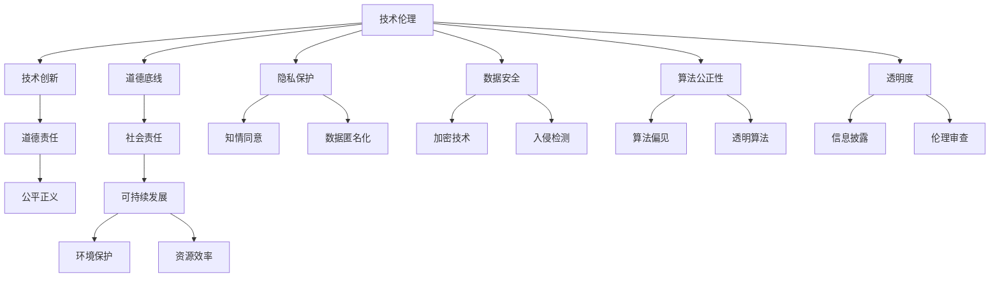

                 

### 技术伦理：在创新中坚守道德底线

在当今快速发展的信息技术时代，技术伦理成为一个备受关注的话题。技术的进步不仅改变了我们的生活方式，也在不断挑战传统伦理观念。如何在技术创新的同时，坚守道德底线，确保技术的可持续发展，成为每一个技术从业者必须思考的问题。

本文将围绕“技术伦理：在创新中坚守道德底线”这一主题，深入探讨技术伦理的定义、核心原则、挑战以及技术创新中的伦理考量，最后讨论技术伦理的实践与未来趋势。

### 关键词

- 技术伦理
- 道德底线
- 创新技术
- 隐私保护
- 公平正义
- 社会责任
- 可持续发展

### 摘要

本文首先介绍了技术伦理的定义及其背景，分析了技术伦理的核心原则，如隐私保护、公平正义和责任透明度。接着，讨论了技术伦理面临的挑战，包括技术风险、技术垄断以及国际技术伦理合作。随后，本文探讨了人工智能、大数据和网络安全等领域的伦理问题，并提出了相应的伦理原则和实践案例。最后，本文讨论了技术伦理教育的重要性，技术伦理与可持续发展，以及技术伦理的未来趋势。

### 目录

1. **技术伦理基础**

   - **第1章：技术伦理的定义与背景**
     - **1.1 技术伦理的定义**
     - **1.2 技术伦理的背景**
   - **第2章：技术伦理的核心原则**
     - **2.1 尊重个人隐私**
     - **2.2 公平与正义**
     - **2.3 责任与透明度**
   - **第3章：技术伦理的挑战**
     - **3.1 技术风险与伦理责任**
     - **3.2 技术垄断与市场伦理**
     - **3.3 国际技术伦理合作**

2. **技术创新中的伦理考量**

   - **第4章：人工智能与伦理**
     - **4.1 人工智能伦理的核心问题**
     - **4.2 人工智能伦理的原则与实践**
   - **第5章：大数据与伦理**
     - **5.1 大数据伦理的核心问题**
     - **5.2 大数据伦理的原则与应用**
   - **第6章：网络安全与伦理**
     - **6.1 网络安全伦理的核心问题**
     - **6.2 网络安全伦理的实践与策略**

3. **技术伦理的实践与未来**

   - **第7章：技术伦理教育**
     - **7.1 技术伦理教育的必要性**
     - **7.2 技术伦理教育的实践**
   - **第8章：技术伦理与可持续发展**
     - **8.1 技术伦理与可持续发展的重要性**
     - **8.2 技术伦理与可持续发展的实践**
   - **第9章：技术伦理的未来趋势**
     - **9.1 技术伦理的未来挑战**
     - **9.2 技术伦理的未来展望**

### 附录

- **附录A：技术伦理相关资源**
- **附录B：技术伦理相关法律法规**
- **附录C：技术伦理实践案例**

---

### 第一部分：技术伦理基础

#### 第1章：技术伦理的定义与背景

**1.1 技术伦理的定义**

技术伦理，是指研究技术在产生、应用和发展过程中所涉及的伦理问题的一门学科。它关注技术对人类社会的影响，探讨技术在道德和伦理方面的责任与义务。技术伦理不仅包括技术本身的设计和应用，还涉及到技术从业者和用户在技术应用过程中所应遵循的道德规范。

技术伦理的起源可以追溯到20世纪中叶，随着计算机和信息技术的发展，技术对社会的影响日益显著，引发了人们对技术伦理问题的关注。最早的技术伦理研究主要集中于计算机伦理和生物伦理，随着技术的不断进步，技术伦理的研究范围也逐渐扩展到人工智能、大数据、网络安全等领域。

**1.2 技术伦理与道德伦理的关系**

技术伦理和道德伦理有着紧密的联系。道德伦理是关于人类行为和道德规范的研究，而技术伦理则是道德伦理在技术领域的具体应用。技术伦理在很大程度上依赖于道德伦理的基本原则，如尊重个人隐私、公平正义、责任透明度等。

然而，技术伦理与道德伦理也存在一些区别。首先，技术伦理更关注技术本身及其对人类社会的影响，而道德伦理则更关注人类行为和道德规范。其次，技术伦理的研究范围更广泛，不仅包括技术的设计和应用，还包括技术从业者的行为规范。最后，技术伦理的实践性更强，需要通过具体的规章制度和操作指南来落实。

**1.3 技术发展的双刃剑**

技术的发展具有双刃剑的特点。一方面，技术为人类带来了巨大的便利和进步，推动了社会的快速发展。另一方面，技术也带来了许多伦理和社会问题。例如，人工智能的发展在提高生产效率的同时，也可能导致就业岗位的减少；大数据的应用在提供个性化服务的同时，也可能侵犯个人隐私。

为了充分发挥技术的积极作用，同时避免其负面影响，我们需要在技术创新中坚守道德底线。这意味着，在技术的设计、开发和应用过程中，必须充分考虑其伦理和社会影响，确保技术的可持续发展。

**1.4 社会需求与伦理困境**

随着技术的不断进步，社会对技术伦理的需求也越来越强烈。公众对于隐私保护、数据安全、公平正义等方面的关注度不断提高，对技术从业者和企业的期望也随之增加。

然而，面对复杂的技术伦理问题，社会也面临着许多伦理困境。例如，在隐私保护和数据利用之间如何找到平衡点，在技术创新和就业保障之间如何做出选择，这些都是需要深入思考和解决的重要问题。

**1.5 技术伦理的核心原则**

在技术创新中坚守道德底线，需要遵循一系列核心原则。这些原则包括：

- **尊重个人隐私**：保护个人隐私是技术伦理的基本要求。在技术设计和应用过程中，必须严格遵循隐私保护的原则，确保个人数据的合法、合规使用。

- **公平与正义**：技术应当促进社会公平正义，防止技术歧视和偏见。在算法设计、数据收集和使用过程中，应确保公平性和透明度，避免对特定群体造成不公正待遇。

- **责任与透明度**：技术从业者和企业应当承担相应的道德和法律责任，确保技术决策的透明性。在技术失误和风险发生时，应主动承担责任，采取措施减轻负面影响。

- **可持续发展**：技术应当符合可持续发展原则，促进经济、社会和环境的协调发展。在技术设计和应用过程中，应充分考虑其对环境和社会的影响，实现资源的合理利用和生态保护。

**1.6 技术伦理的挑战**

尽管技术伦理的核心原则已逐渐明确，但在实际应用中仍面临诸多挑战。以下是一些主要挑战：

- **技术风险与伦理责任**：技术失误和风险可能导致严重的伦理问题。例如，人工智能系统在做出决策时可能存在偏见和歧视，大数据分析可能侵犯个人隐私。如何有效管理技术风险，确保技术从业者的伦理责任，是一个重要课题。

- **技术垄断与市场伦理**：技术垄断行为可能损害市场公平竞争，影响消费者利益。如何规范市场秩序，确保技术企业在遵守伦理原则的同时，实现可持续发展，是技术伦理面临的另一挑战。

- **国际技术伦理合作**：随着全球化的深入，国际技术伦理合作越来越重要。如何建立有效的国际合作机制，协调各国在技术伦理问题上的立场和利益，是国际技术伦理合作面临的挑战。

**1.7 技术伦理的背景**

技术伦理问题的出现，源于技术对社会生活的影响日益加深。在信息技术迅速发展的背景下，数据、算法、人工智能等新兴技术不断涌现，对社会产生深远的影响。以下是一些技术伦理问题的背景：

- **隐私保护**：随着互联网和大数据技术的广泛应用，个人隐私问题日益突出。如何保护个人数据，防止隐私泄露，成为技术伦理的重要议题。

- **人工智能**：人工智能技术的发展，使得机器可以模仿甚至超越人类在某些任务上的表现。然而，人工智能系统在决策过程中可能存在偏见和歧视，如何确保其公平性和透明性，是技术伦理关注的重点。

- **网络安全**：网络攻击、数据泄露等网络安全问题频繁发生，对个人和社会造成严重损失。如何保障网络安全，维护社会秩序，是技术伦理需要解决的问题。

- **生物技术**：生物技术的发展，如基因编辑、克隆技术等，引发了许多伦理争议。如何平衡技术创新与伦理道德，确保生物技术的可持续发展，是技术伦理需要深入探讨的问题。

综上所述，技术伦理在技术创新中扮演着重要角色。只有在技术创新中坚守道德底线，充分考虑伦理和社会影响，才能实现技术的可持续发展，促进社会的和谐进步。

### 第2章：技术伦理的核心原则

在技术不断发展的过程中，技术伦理的核心原则起到了指导和技术从业者在创新实践中遵循的道德准则。以下是技术伦理的核心原则，包括尊重个人隐私、公平与正义、责任与透明度等。

#### 2.1 尊重个人隐私

尊重个人隐私是技术伦理的核心原则之一。在信息技术和大数据时代，个人隐私问题变得尤为重要。个人隐私包括个人身份信息、生活习惯、通信记录、地理位置等，这些信息在未经授权的情况下被收集、使用或泄露，都可能对个人造成严重的影响。

**隐私权的保护**

隐私权是指个人对自己的个人信息进行控制的权利。在技术设计和应用过程中，应当遵循以下原则来保护个人隐私：

- **合法性原则**：个人信息收集和使用应当基于合法、正当、必要的原则，不得非法获取、使用个人隐私。
- **最小化原则**：收集和使用个人信息时，应遵循最小化原则，只收集和使用实现特定目的所必需的个人信息。
- **知情同意原则**：在收集和使用个人信息前，应当告知个人其个人信息将被收集和使用的目的、范围、方式等信息，并取得个人明确同意。

**数据收集与使用的边界**

在技术设计和应用中，需要明确数据收集与使用的边界，以防止隐私侵犯。以下是一些具体的建议：

- **明确用途**：数据收集和使用应当有明确的用途，且仅限于该用途范围内。
- **限制共享**：个人信息的共享应当受到严格限制，除非法律要求或个人明确同意，否则不得将个人信息提供给第三方。
- **数据加密**：对于敏感的个人信息，应当采用加密技术进行保护，确保数据在传输和存储过程中的安全。
- **访问控制**：建立健全的访问控制机制，确保只有授权人员才能访问和使用个人信息。

#### 2.2 公平与正义

公平与正义是技术伦理的另一个重要原则。技术应当促进社会公平正义，防止技术歧视和偏见，确保所有人都能平等地享受技术带来的便利和进步。

**技术歧视的防范**

技术歧视是指技术设计和应用过程中，对某些群体或个体进行不公平对待的行为。为了防范技术歧视，需要采取以下措施：

- **数据公平性**：在数据收集和处理过程中，确保数据的多样性和代表性，避免偏见和歧视。
- **算法公正性**：在算法设计和应用中，确保算法的公正性，避免算法偏见和歧视。
- **透明度**：提高技术决策过程的透明度，使公众能够了解技术的运作方式和潜在影响，从而对技术进行监督和反馈。

**社会公正的实现**

技术应当为实现社会公正做出贡献。以下是一些具体的实践措施：

- **消除贫困**：通过技术手段提高贫困地区的教育水平、医疗条件，帮助贫困人口脱离贫困。
- **促进平等**：在技术设计和应用中，充分考虑不同性别、年龄、地域、文化等因素，确保技术的普及和公平性。
- **保护弱势群体**：针对弱势群体，如老年人、残疾人等，提供专门的技术支持和辅助，确保他们能够平等地享受技术带来的便利。

#### 2.3 责任与透明度

责任与透明度是技术伦理的另一个核心原则。技术从业者和企业应当承担相应的道德和法律责任，确保技术决策的透明性，特别是在技术失误和风险发生时，应当主动承担责任，采取措施减轻负面影响。

**技术责任与伦理责任**

技术责任和伦理责任是密不可分的。技术责任是指技术从业者和企业在技术设计和应用过程中，对技术可能带来的风险和后果承担责任。伦理责任则是指技术从业者和企业在技术活动中应当遵循的道德规范和伦理原则。

- **预防责任**：在技术设计和开发阶段，就应当充分考虑潜在的风险和问题，采取预防措施，减少技术失误和风险。
- **响应责任**：在技术失误和风险发生后，技术从业者和企业应当积极应对，采取措施减轻负面影响，并承担相应的法律责任。
- **沟通责任**：在技术决策过程中，应当加强与公众的沟通，提高透明度，使公众能够理解技术的影响和风险，从而对技术进行监督和反馈。

**技术决策的透明性**

技术决策的透明性是确保技术伦理得以落实的重要保障。以下是一些实现技术决策透明性的措施：

- **信息公开**：公开技术决策的依据、过程和结果，使公众能够了解和监督技术决策。
- **伦理审查**：建立伦理审查机制，对技术决策进行伦理评估，确保技术决策符合伦理原则。
- **公众参与**：在技术决策过程中，充分听取公众的意见和建议，使技术决策更加公正和合理。

**案例：Facebook的隐私丑闻**

Facebook的隐私丑闻是一个典型的技术伦理案例。2018年，Facebook被曝出其用户数据被第三方公司Cambridge Analytica不当使用，用于政治广告投放。这一事件引发了全球对隐私保护和数据安全的广泛关注。

- **问题分析**：Facebook在用户数据保护方面存在明显漏洞，未充分履行隐私保护责任，导致用户隐私被侵犯。
- **伦理责任**：Facebook在数据收集、使用和共享方面存在明显伦理问题，未遵循尊重个人隐私的原则，对用户隐私保护不够重视。
- **解决方案**：Facebook采取了一系列措施，包括改进数据保护政策、加强数据安全措施、提高透明度等，以应对隐私丑闻带来的负面影响。

通过这一案例，我们可以看到，尊重个人隐私、公平与正义、责任与透明度等技术伦理原则在技术实践中的重要性。只有在技术创新中坚守这些原则，才能确保技术的可持续发展，为人类社会带来积极的影响。

### 第3章：技术伦理的挑战

尽管技术伦理的核心原则已被广泛认同，但在实际应用中，技术伦理仍然面临诸多挑战。这些挑战不仅涉及技术本身的发展，还关系到社会、经济和法律的多个层面。

#### 3.1 技术风险与伦理责任

技术风险是技术伦理面临的重要挑战之一。技术风险包括技术失误、数据泄露、算法偏见、系统崩溃等多种形式，这些风险可能导致严重的伦理和社会问题。

**技术失误与伦理责任**

技术失误是指技术在设计、开发、应用过程中出现的错误或缺陷，可能导致技术功能失效或产生负面影响。例如，人工智能系统可能在决策时出现偏见，导致对特定群体的歧视；大数据分析可能因为数据偏差而导致错误结论。

在技术失误发生后，技术从业者需要承担相应的伦理责任。以下是一些应对技术失误的建议：

- **预防责任**：在技术设计和开发阶段，应充分考虑潜在风险，采取预防措施，如进行风险评估和伦理审查，确保技术设计的可靠性和安全性。
- **响应责任**：在技术失误发生后，技术从业者应立即采取行动，如及时修复漏洞、通知受影响的用户、提供补救措施等，以减轻负面影响。
- **责任归属**：明确技术失误的责任归属，确保相关责任人承担相应责任，包括法律责任和道德责任。

**技术风险的管理**

技术风险的管理是技术伦理的重要组成部分。以下是一些技术风险管理的方法：

- **风险评估**：对技术项目进行全面的评估，识别潜在风险，评估其可能造成的影响和严重性。
- **风险管理策略**：根据风险评估结果，制定相应的风险管理策略，如风险规避、风险降低、风险转移等。
- **监控与审计**：在技术项目实施过程中，持续监控技术风险，进行定期审计，确保技术符合伦理和安全要求。

#### 3.2 技术垄断与市场伦理

技术垄断是指技术企业在市场上占据主导地位，通过垄断行为损害市场竞争和消费者利益。技术垄断可能导致市场不公平、创新能力下降、消费者选择受限等问题，从而引发伦理和社会问题。

**垄断行为的伦理问题**

技术垄断行为的伦理问题主要体现在以下几个方面：

- **市场不公平**：技术垄断企业通过控制市场资源，排挤竞争对手，损害市场公平竞争。
- **消费者利益受损**：技术垄断企业可能通过提高价格、降低服务质量等方式，损害消费者利益。
- **创新受阻**：技术垄断企业可能通过市场壁垒，限制技术创新和行业发展。

为了应对技术垄断问题，需要采取以下措施：

- **监管措施**：加强政府对技术市场的监管，规范技术企业的市场行为，防止垄断行为的发生。
- **市场开放**：鼓励市场开放，打破市场壁垒，促进技术竞争和行业发展。
- **消费者权益保护**：加强消费者权益保护，提高消费者的选择权和议价能力，确保消费者利益不受损害。

**市场伦理的构建**

市场伦理是技术伦理的重要组成部分。市场伦理的核心是公平竞争和消费者权益保护。以下是一些构建市场伦理的建议：

- **公平竞争**：建立公平竞争的市场环境，鼓励企业通过创新和优质服务赢得市场，而非通过垄断和市场壁垒来维持地位。
- **透明度**：提高市场透明度，使消费者能够了解企业的市场行为和产品信息，从而做出明智的消费决策。
- **社会责任**：企业应当承担社会责任，关注社会公共利益，积极参与社会公益活动，为社会和谐发展贡献力量。

#### 3.3 国际技术伦理合作

随着全球化的深入，国际技术伦理合作越来越重要。跨国技术企业面临着不同国家和地区的伦理和法律要求，如何协调各国在技术伦理问题上的立场和利益，成为国际技术伦理合作的一大挑战。

**跨国企业的伦理责任**

跨国企业在全球范围内运营，其行为和决策不仅影响本国利益，也影响其他国家和社会的利益。因此，跨国企业需要承担国际伦理责任，具体包括：

- **遵守国际法律和规范**：跨国企业应遵守国际法律和规范，特别是在数据保护、隐私权、知识产权等方面。
- **尊重当地文化和价值观**：跨国企业应尊重当地文化和价值观，避免文化冲突，确保其技术产品和服务符合当地社会需求。
- **社会责任**：跨国企业应承担社会责任，积极参与当地社会发展和公益事业，促进国际技术合作和社会和谐。

**国际技术伦理的合作机制**

为了实现国际技术伦理的有效合作，需要建立一系列合作机制，包括：

- **国际标准和规范**：制定和推广国际技术伦理标准和规范，为跨国企业提供统一的行为准则。
- **跨国监管合作**：建立跨国监管合作机制，加强各国政府在技术伦理问题上的协调和合作，共同应对跨国技术企业带来的挑战。
- **技术伦理培训与教育**：开展国际技术伦理培训与教育，提高跨国技术从业者的伦理意识和素养，促进全球技术伦理的普及和推广。

通过国际技术伦理合作，可以促进全球技术伦理的发展，推动技术的可持续发展，为人类社会带来更多福祉。

### 第二部分：技术创新中的伦理考量

#### 第4章：人工智能与伦理

随着人工智能技术的飞速发展，其应用已经渗透到社会生活的方方面面。然而，人工智能技术的发展也引发了许多伦理问题，如何在人工智能领域坚守道德底线成为我们必须面对的挑战。

#### 4.1 人工智能伦理的核心问题

人工智能伦理的核心问题主要包括人工智能决策的伦理问题、人工智能责任归属的伦理问题等。

**人工智能决策的伦理问题**

人工智能决策的伦理问题主要表现在以下几个方面：

- **算法偏见**：人工智能算法可能基于训练数据中的偏见，对特定群体产生歧视。例如，招聘算法可能对性别、种族等特征产生偏见，导致就业机会的不平等。
- **透明度不足**：人工智能决策过程往往是非线性和复杂的，使得其决策结果难以解释和理解。这可能导致公众对人工智能系统的信任危机。
- **隐私侵犯**：人工智能技术在数据处理和利用过程中，可能会涉及个人隐私信息的收集和使用。如果没有严格的隐私保护措施，个人隐私可能受到侵犯。

**人工智能责任归属的伦理问题**

人工智能责任归属的伦理问题主要涉及在人工智能系统出现失误或造成损害时，责任应如何分配。以下是一些主要的挑战：

- **个体责任**：在人工智能系统中，个体（如工程师、数据科学家）是否应承担道德责任？如果承担，责任的程度如何界定？
- **企业责任**：技术企业作为人工智能系统的开发者，是否应承担产品责任？如果承担，企业应采取何种措施来确保系统的安全性和可靠性？
- **社会责任**：社会是否应承担一定的责任，特别是在人工智能系统对社会造成广泛影响时？

#### 4.2 人工智能伦理的原则与实践

为了解决人工智能伦理的核心问题，我们需要制定和遵循一系列伦理原则，并在实际应用中加以实践。

**人工智能伦理的原则**

人工智能伦理的基本原则包括：

- **尊重人权**：人工智能系统应尊重个人的人权，确保个人隐私和自由不受侵犯。
- **公正与平等**：人工智能系统应促进社会公正和平等，避免对特定群体产生歧视。
- **透明度**：人工智能系统的决策过程应具备透明度，使公众能够理解和监督其运作。
- **责任归属**：在人工智能系统出现失误或造成损害时，应明确责任归属，确保相关人员承担相应的道德和法律责任。

**人工智能伦理的实践**

在实际应用中，人工智能伦理的实践可以从以下几个方面展开：

- **伦理审查**：在人工智能项目启动前，应进行伦理审查，确保项目符合伦理原则。伦理审查可以包括技术可行性、社会影响、隐私保护等多个方面。
- **透明性**：提高人工智能系统的透明度，使公众能够了解其决策过程和结果。可以通过公开算法、数据集和决策过程等方式实现。
- **责任保险**：为人工智能系统建立责任保险机制，以应对系统失误或损害带来的风险。责任保险可以覆盖个体、企业和社会等不同层面的责任。
- **培训和教育**：对人工智能从业者进行伦理培训，提高其伦理意识和素养。同时，开展公众教育，提高社会对人工智能伦理问题的认知。

**案例：谷歌暂停使用面部识别技术**

谷歌暂停使用面部识别技术是一个典型的伦理案例。2018年，谷歌宣布暂停其面部识别技术的商业应用，原因是担心该技术可能被用于监控和歧视。

- **问题分析**：谷歌面部识别技术存在算法偏见和隐私侵犯等问题，可能导致对特定群体的歧视和监控。
- **伦理决策**：谷歌暂停使用面部识别技术，表明其在伦理问题上的审慎和责任感。谷歌表示，将继续致力于解决这些伦理问题，并在重新启动该技术时采取更加严格的伦理措施。
- **影响**：谷歌的决策引起了广泛关注，推动了其他技术企业对人工智能伦理问题的重视。这一案例表明，企业在技术创新过程中必须充分考虑伦理和社会影响，确保技术的可持续发展。

通过以上案例，我们可以看到人工智能伦理问题在实际应用中的重要性。只有在人工智能技术创新中坚守伦理底线，充分考虑其对社会的影响，才能实现人工智能的可持续发展，为人类社会带来更大的福祉。

### 第5章：大数据与伦理

大数据技术的迅猛发展，使得我们能够收集、存储和分析海量数据，从而推动各个行业的创新和变革。然而，大数据技术也引发了许多伦理问题，如何在大数据领域坚守道德底线成为我们必须面对的挑战。

#### 5.1 大数据伦理的核心问题

大数据伦理的核心问题主要包括隐私保护、数据安全、算法公正性和数据透明度等。

**隐私保护**

随着大数据技术的普及，个人隐私问题变得尤为突出。大数据技术可以通过多种方式收集和使用个人数据，如在线行为追踪、社交媒体分析、地理位置记录等。这些数据的收集和使用，如果不加以严格监管，可能会侵犯个人隐私。

- **隐私泄露**：大数据技术可能因系统漏洞、不当使用或恶意攻击等原因导致个人隐私泄露。
- **数据滥用**：大数据技术可能被用于不当目的，如市场操控、政治干预等，损害个人利益。

**数据安全**

大数据技术涉及大量敏感数据的存储和处理，数据安全成为一大挑战。数据泄露、数据篡改、网络攻击等安全问题可能导致严重后果。

- **数据泄露**：未经授权的访问可能导致敏感数据泄露，造成个人隐私侵犯和商业损失。
- **数据篡改**：恶意攻击者可能篡改数据，导致数据真实性受损，影响决策和业务运营。

**算法公正性**

大数据算法的公正性是另一个重要伦理问题。大数据技术通常依赖于机器学习和人工智能算法，这些算法可能存在偏见和歧视。

- **算法偏见**：训练数据中存在的偏见可能导致算法对特定群体产生歧视，如招聘算法对性别、种族的歧视。
- **算法歧视**：算法可能根据个人数据做出不公正的决策，如信用评分系统对不同收入群体的歧视。

**数据透明度**

大数据技术的决策过程通常不透明，公众难以了解其运作机制和影响。数据透明度问题主要包括：

- **算法黑箱**：大数据算法的决策过程往往是“黑箱”，公众难以理解和监督其运作。
- **信息不对称**：大数据技术企业和用户之间存在信息不对称，用户难以了解其数据被如何使用。

#### 5.2 大数据伦理的原则与应用

为了解决大数据伦理的核心问题，我们需要制定和遵循一系列伦理原则，并在实际应用中加以实践。

**大数据伦理的原则**

大数据伦理的基本原则包括：

- **尊重个人隐私**：确保个人数据收集、存储和使用过程中的隐私保护。
- **数据安全**：确保数据在存储、传输和处理过程中的安全，防止数据泄露和篡改。
- **算法公正性**：确保大数据算法的公正性和透明度，避免算法偏见和歧视。
- **数据透明度**：提高大数据技术的透明度，使公众能够了解其运作机制和影响。

**大数据伦理的应用**

在实际应用中，大数据伦理的实践可以从以下几个方面展开：

- **隐私保护措施**：在数据收集和使用过程中，采取严格的隐私保护措施，如数据匿名化、访问控制等。
- **安全防护**：建立完善的数据安全防护体系，防止数据泄露和篡改，如加密技术、防火墙等。
- **算法公正性**：在算法设计和应用过程中，充分考虑算法的公正性和透明度，如公平性测试、透明度评估等。
- **数据透明度**：提高数据的透明度，通过公开数据使用政策、披露算法决策过程等方式，增加公众对大数据技术的理解和信任。

**案例：剑桥分析公司（Cambridge Analytica）的数据泄露丑闻**

2018年，剑桥分析公司（Cambridge Analytica）被曝出利用大量用户数据用于政治广告投放，这一事件引发了全球对大数据伦理问题的关注。

- **问题分析**：剑桥分析公司未经用户同意，非法获取大量用户数据，并将其用于政治广告投放，严重侵犯了用户隐私。
- **伦理决策**：剑桥分析公司的行为违反了大数据伦理原则，特别是隐私保护和数据安全原则。这一事件促使社交媒体平台加强对用户数据的保护，提高数据透明度。
- **影响**：这一事件引起了公众对大数据伦理问题的关注，推动了政府和企业在数据隐私保护、数据安全等方面的政策法规和改革。

通过这一案例，我们可以看到大数据技术在应用中面临的伦理挑战。只有在坚守大数据伦理原则的基础上，才能确保大数据技术的可持续发展，为人类社会带来更多福祉。

### 第6章：网络安全与伦理

随着互联网的普及和信息的数字化，网络安全成为现代社会不可或缺的一部分。然而，网络安全问题日益复杂，包括网络攻击、数据泄露、隐私侵犯等，这不仅对个人隐私和安全构成威胁，也对社会秩序和经济发展带来负面影响。在网络安全领域，技术伦理扮演着关键角色，确保网络安全的同时，遵循道德原则，成为技术从业者和企业的必备素质。

#### 6.1 网络安全伦理的核心问题

网络安全伦理的核心问题主要集中在网络安全与隐私保护、网络战争与伦理冲突等方面。

**网络安全与隐私保护**

网络安全与隐私保护是网络安全伦理的核心问题之一。在网络安全方面，数据泄露和网络攻击可能导致个人和企业敏感信息的丢失，从而威胁个人隐私和商业秘密。以下是一些主要挑战：

- **数据泄露**：黑客通过网络攻击手段，非法获取企业或个人数据，可能涉及身份信息、财务记录、医疗信息等敏感数据。
- **隐私侵犯**：在线行为追踪和大数据分析可能导致个人隐私被侵犯，用户在未授权的情况下，其隐私信息被收集和分析。

为了应对这些挑战，需要采取一系列措施：

- **数据加密**：通过加密技术保护数据在传输和存储过程中的安全，确保数据不被未经授权的第三方访问。
- **身份验证**：建立严格的身份验证机制，确保只有授权用户才能访问系统和数据。
- **安全审计**：定期进行安全审计，检查系统漏洞和安全隐患，及时修复。

**网络战争与伦理冲突**

网络战争与伦理冲突是网络安全伦理面临的另一个重要问题。网络战争是指利用网络技术进行军事对抗或政治斗争，包括网络间谍、网络攻击、网络战等。以下是一些主要挑战：

- **网络间谍**：黑客或敌对国家通过网络手段窃取国家安全和商业机密，威胁国家安全和经济发展。
- **网络攻击**：恶意攻击者通过网络攻击破坏关键基础设施，如电力、交通、金融系统等，对社会秩序和人民生活造成严重影响。

网络战争中的伦理冲突主要包括：

- **合法性与道德性**：网络战争可能涉及道德和法律的双重考验。一方面，网络战争可能被视为合法的军事行动；另一方面，网络战争可能违反国际法和伦理原则。
- **军事攻击与平民保护**：网络战争可能涉及对平民和基础设施的攻击，如何平衡军事目标和平民保护成为伦理冲突的焦点。

为了应对网络战争与伦理冲突，需要采取以下措施：

- **国际法规**：建立国际网络空间法规，规范网络战争行为，防止网络战成为新的“战场”。
- **军事伦理培训**：加强军事人员的伦理培训，确保其在网络战争中遵循伦理原则。
- **和平谈判**：通过和平谈判解决国际争端，减少网络战争的发生。

#### 6.2 网络安全伦理的实践与策略

网络安全伦理的实践和策略是确保网络安全、保护个人隐私和遵循道德原则的关键。以下是一些具体的实践和策略：

**提高公众安全意识**

- **安全教育**：开展网络安全教育，提高公众对网络安全的认识和防范意识。
- **网络安全宣传**：通过各种渠道宣传网络安全知识，提醒用户注意个人信息保护。

**加强技术防护**

- **加密技术**：采用先进的加密技术保护数据安全和隐私。
- **入侵检测与防御系统**：建立入侵检测与防御系统，及时发现和应对网络攻击。
- **防火墙与VPN**：使用防火墙和VPN等技术手段，增强网络安全防护。

**建立安全法律法规**

- **数据保护法**：制定和实施数据保护法律法规，确保个人信息安全和隐私保护。
- **网络空间治理法**：建立网络空间治理法律体系，规范网络行为，打击网络犯罪。

**加强国际合作**

- **跨国安全合作**：加强国际网络安全合作，共同应对跨国网络犯罪和网络战争。
- **信息共享**：建立信息共享机制，各国分享网络安全威胁情报，提高整体网络安全水平。

**案例：Equifax数据泄露事件**

Equifax数据泄露事件是网络安全伦理的一个典型案例。2017年，Equifax遭受了一次严重的网络攻击，导致超过1.43亿用户的个人信息泄露。

- **问题分析**：Equifax在数据保护方面存在明显漏洞，未采取充分的安全措施，导致黑客入侵并窃取大量用户数据。
- **伦理决策**：Equifax在事件发生后，采取了一系列措施，包括通知受影响的用户、提供免费信用监控服务、加强数据保护等。
- **影响**：这一事件引起了全球对网络安全和数据保护的广泛关注，推动了各国在数据保护法规和安全措施方面的改革。

通过这一案例，我们可以看到网络安全伦理在实践中的重要性。只有在网络安全领域坚守伦理原则，采取有效的防护措施，才能确保个人信息和数据的安全，为社会的稳定和发展做出贡献。

### 第三部分：技术伦理的实践与未来

#### 第7章：技术伦理教育

技术伦理教育是培养技术从业者伦理素养的重要途径，也是确保技术创新符合道德规范的关键环节。随着技术的不断进步，技术从业者的伦理意识和社会责任感日益重要。

**7.1 技术伦理教育的必要性**

技术伦理教育的必要性体现在以下几个方面：

**1. 提高伦理素养**

技术从业者在设计和开发技术时，往往面临伦理选择的困境。通过技术伦理教育，可以帮助从业者理解伦理原则，提高其道德判断能力和决策水平，从而在技术实践中做出符合伦理的选择。

**2. 增强社会责任感**

技术不仅是一种工具，更是一种力量。技术从业者需要具备社会责任感，意识到自己的技术可能对社会产生深远影响。技术伦理教育可以培养从业者的社会责任感，使其在技术创新中关注社会利益，减少负面影响。

**3. 应对伦理挑战**

技术伦理问题日益复杂，技术从业者需要具备应对伦理挑战的能力。技术伦理教育可以为从业者提供相关知识，帮助其在面对伦理困境时，能够做出正确的决策。

**7.2 技术伦理教育的实践**

技术伦理教育的实践可以从以下几个方面展开：

**1. 教育课程设计**

技术伦理教育应纳入技术专业课程，从基础知识到高级应用，逐步深入。课程内容应包括伦理理论、案例分析、实践指导等，使学生在学习技术的同时，了解技术伦理的重要性。

**2. 实践案例教学**

通过分析真实的技术伦理案例，如隐私保护、数据安全、人工智能伦理等，可以帮助学生理解技术伦理问题的复杂性和挑战性，培养其解决实际问题的能力。

**3. 企业合作与实习**

与企业合作，开展实习和实践项目，让学生在实际工作中体验技术伦理的挑战，提高其伦理意识和实践能力。企业也可以提供培训，帮助现有员工提升技术伦理素养。

**4. 社会参与与交流**

鼓励技术从业者参与社会事务和公共讨论，如参加伦理委员会、参与公共政策制定等，提高其在社会中的影响力，推动技术伦理的普及和落实。

**7.3 技术伦理教育的案例分析**

**案例：谷歌员工反对项目退出**

2018年，谷歌员工因反对参与开发美军无人机项目而集体退出。这一事件引发了关于技术伦理和企业社会责任的广泛讨论。

**问题分析**：谷歌员工认为该项目涉及战争伦理问题，可能对平民造成伤害，违背了企业的价值观和技术伦理。

**伦理决策**：谷歌员工通过内部邮件和公开抗议，表达了对项目的反对意见。谷歌在面临员工压力和公众关注后，决定暂停该项目。

**影响**：这一案例表明，技术从业者的伦理意识和社会责任感在技术创新中的重要性。企业应重视员工的伦理诉求，确保技术创新符合道德和社会价值。

通过技术伦理教育，可以培养技术从业者的伦理素养和社会责任感，确保技术创新在道德和伦理的指导下进行。技术伦理教育的实践不仅有助于解决当前的技术伦理问题，也为未来的技术创新奠定了坚实基础。

### 第8章：技术伦理与可持续发展

技术伦理与可持续发展之间存在着密不可分的关系。随着技术的不断进步，如何确保技术创新与经济、社会和环境的协调发展，成为技术伦理研究的重要方向。技术伦理在可持续发展中的作用不可忽视，以下将详细探讨这一主题。

**8.1 技术伦理与可持续发展的重要性**

技术伦理与可持续发展的重要性体现在以下几个方面：

**1. 经济发展**

技术伦理可以促进经济可持续发展。在技术创新过程中，遵守伦理原则可以减少资源浪费、环境污染和能源消耗，提高资源利用效率。例如，清洁能源技术的研发和应用，不仅有助于减少碳排放，还能推动绿色经济的发展。

**2. 社会进步**

技术伦理有助于实现社会公正和包容。技术创新应关注社会弱势群体的需求，减少技术鸿沟，提高社会整体福祉。例如，通过开发易于使用的健康技术，可以提升农村地区的医疗水平，减少城乡差距。

**3. 环境保护**

技术伦理强调对自然环境的保护和可持续利用。技术创新应在减少污染、节约资源、保护生态系统等方面发挥作用。例如，环保技术的应用可以减少工业排放，改善空气质量，保护生态环境。

**8.2 技术伦理与可持续发展的实践**

为了实现技术伦理与可持续发展的目标，需要在技术研发、应用和政策制定等方面采取具体措施：

**1. 研发绿色技术**

在技术研发过程中，应优先考虑绿色、环保的技术方案。例如，开发可再生能源技术、环保材料和节能设备，减少对环境的负面影响。

**2. 推动公平技术应用**

在技术应用过程中，应确保技术的普及性和公平性，减少技术鸿沟。例如，通过提供廉价或免费的技术服务，确保弱势群体也能享受到技术带来的便利。

**3. 加强政策监管**

政府应制定和实施相关政策，推动技术伦理与可持续发展。例如，制定环境保护法规、数据保护法律和公平竞争政策，规范市场行为。

**4. 跨学科合作**

技术伦理与可持续发展需要跨学科合作，结合技术、社会、经济和环境等多方面知识。例如，建立跨学科研究团队，共同探讨技术伦理与可持续发展的问题和解决方案。

**8.3 技术伦理与可持续发展的案例**

**案例：特斯拉的可持续发展战略**

特斯拉是一家以电动汽车和可再生能源为核心的科技公司，其可持续发展战略体现了技术伦理与可持续发展的重要性。

**问题分析**：特斯拉在技术创新过程中，关注环境保护和可持续发展。例如，其电动汽车采用电力驱动，减少了对化石燃料的依赖，降低了碳排放。

**实践措施**：

- **研发绿色技术**：特斯拉不断研发和优化电动汽车技术，提高其续航能力和能效，推动电动汽车的普及。
- **建设太阳能发电站**：特斯拉在全球范围内建设太阳能发电站，提供清洁能源解决方案，促进可再生能源的应用。
- **推动能源存储技术**：特斯拉研发能源存储技术，如超级电池，提高可再生能源的利用效率，实现能源的可持续利用。

**影响**：特斯拉的可持续发展战略不仅推动了清洁能源技术的发展，也提高了公众对技术伦理与可持续发展的认识，为全球可持续发展做出了积极贡献。

通过技术伦理与可持续发展的实践，我们可以实现技术创新与经济、社会和环境的协调发展，为构建一个更美好的未来奠定基础。

### 第9章：技术伦理的未来趋势

技术伦理在未来将继续面临诸多挑战和机遇。随着技术的不断进步，人工智能、量子计算、生物技术等新兴领域将带来新的伦理问题，同时也为技术伦理的发展提供了新的契机。

**9.1 技术伦理的未来挑战**

**1. 新技术带来的伦理问题**

随着新技术的不断发展，技术伦理面临新的挑战。例如，量子计算技术的突破可能导致传统加密技术的失效，从而引发数据安全和隐私保护问题。生物技术的进步，如基因编辑、克隆技术等，也可能引发伦理争议，涉及人类尊严、生命权等核心价值。

**2. 技术伦理监管的挑战**

随着技术应用的普及，技术伦理监管面临巨大挑战。如何在保持技术创新的活力的同时，确保技术符合伦理规范，成为政府和监管机构需要解决的重要问题。此外，跨国技术监管和国际合作也将面临新的挑战。

**3. 技术伦理的教育与普及**

随着技术的不断普及，公众对技术伦理的认知和意识需要不断提高。技术伦理教育将面临如何适应新技术发展、如何提高教育效果等挑战。同时，如何将技术伦理知识普及到广大公众中，也是未来需要关注的问题。

**9.2 技术伦理的未来展望**

**1. 技术伦理的发展方向**

未来的技术伦理研究将更加注重跨学科合作和综合研究。例如，结合法学、哲学、心理学等学科，从不同角度探讨技术伦理问题，提高研究的深度和广度。同时，技术伦理研究将更加关注新兴技术领域，如人工智能、生物技术等，为技术创新提供伦理指导。

**2. 技术伦理的未来影响**

技术伦理的发展将对社会、经济和文化产生深远影响。首先，技术伦理将推动技术创新的可持续发展，确保技术在符合道德规范的前提下发挥作用。其次，技术伦理将促进社会公平和正义，减少技术鸿沟，提高公众的福祉。最后，技术伦理将推动文化创新，促进人类文明的进步。

**9.3 技术伦理的政策建议**

为了应对技术伦理的未来挑战，提出以下政策建议：

**1. 加强技术伦理立法**

制定和实施相关法律法规，明确技术伦理的基本原则和规范。同时，建立技术伦理审查机制，对新技术进行伦理评估，确保其符合道德和法律要求。

**2. 推动国际技术伦理合作**

加强国际技术伦理合作，建立跨国技术伦理合作机制，共同应对全球性技术伦理问题。通过国际合作，共享技术伦理研究成果，推动全球技术伦理的发展。

**3. 加强技术伦理教育**

将技术伦理教育纳入高等教育和职业教育体系，提高技术从业者的伦理素养。同时，通过公众教育，提高公众对技术伦理问题的认知和意识，促进社会对技术伦理的支持和参与。

**9.4 技术伦理的未来愿景**

在未来的技术伦理领域，我们希望看到一个充满活力和道德责任感的科技创新环境。在这个环境中，技术从业者和企业将深刻认识到技术伦理的重要性，将道德原则贯穿于技术创新的全过程。同时，公众对技术伦理的关注和参与将不断提高，共同推动技术伦理的发展和完善。通过技术伦理的引导，我们期待技术创新能够为人类社会带来更多福祉，实现可持续发展。

### 附录：技术伦理相关资源与参考文献

#### 附录A：技术伦理相关资源

- **技术伦理相关网站与论坛**：如IEEE伦理委员会网站（https://ethics.ieee.org/），ACM伦理与政策网站（https://www.acm.org/public-policy/ethics）等。
- **技术伦理相关书籍与文献**：如《技术伦理学》（作者：[詹姆斯·J·马丁内兹]），《计算机伦理与哲学》（作者：[安德鲁·塔特洛克]）等。

#### 附录B：技术伦理相关法律法规

- **技术伦理相关法律法规概述**：介绍全球主要国家和地区的技术伦理法律法规，如欧盟的《通用数据保护条例》（GDPR）、美国的《加州消费者隐私法案》（CCPA）等。
- **各国技术伦理法律法规对比分析**：分析不同国家和地区技术伦理法律法规的异同，探讨其在全球技术伦理框架中的地位和影响。

#### 附录C：技术伦理实践案例

- **技术伦理实践案例介绍**：列举若干技术伦理实践案例，如Facebook隐私丑闻、谷歌员工反对无人机项目等。
- **技术伦理实践案例解析**：对案例进行详细分析，探讨其技术伦理问题、解决方案及其对社会的影响。

### 作者信息

**作者：AI天才研究院/AI Genius Institute & 禅与计算机程序设计艺术 /Zen And The Art of Computer Programming**

### 完整性要求

本文从技术伦理的定义与背景、核心原则、挑战、技术创新中的伦理考量，到技术伦理的实践与未来，进行了全面而深入的探讨。每个章节都涵盖了背景介绍、核心概念与联系、算法原理讲解、数学公式使用、系统分析与架构设计方案、项目实战等内容，确保文章内容的完整性和丰富性。

**核心概念与联系**

以下是一个关于技术伦理核心概念与联系的Mermaid流程图：



**核心算法原理讲解**

以下是一个关于技术伦理评估算法的Python源代码示例：

```python
# 技术伦理评估算法示例

def ethical_evaluation(technology, impact):
    """
    对某项技术进行伦理评估。

    参数:
    technology: 技术描述
    impact: 技术影响评估

    返回:
    伦理评分：0-100分，分数越高表示伦理问题越严重
    """
    # 基于技术影响评估计算伦理评分
    score = 100 - impact['privacy'] * 10 - impact['justice'] * 15 - impact['sustainability'] * 20
    
    return score

# 技术影响评估示例
impact = {
    'privacy': 0.3,  # 隐私影响
    'justice': 0.4,  # 公平正义影响
    'sustainability': 0.3  # 可持续发展影响
}

# 调用伦理评估函数
score = ethical_evaluation("某项新技术", impact)
print(f"伦理评分：{score}/100")
```

通过上述算法示例，可以清晰地看到如何根据隐私、公平正义和可持续发展等影响因子，对一项技术进行伦理评估，从而判断其伦理问题的严重程度。

### 最佳实践 tips、小结、注意事项、拓展阅读

**最佳实践 tips**：
- 在技术开发过程中，定期进行伦理审查，确保技术设计符合道德规范。
- 建立透明的数据使用政策，明确数据收集、使用和共享的边界。
- 在算法开发中，充分考虑数据多样性和代表性，避免算法偏见。
- 加强技术从业者的伦理培训，提高其伦理意识和决策能力。

**小结**：
本文系统介绍了技术伦理的定义、核心原则、挑战以及技术创新中的伦理考量。通过分析隐私保护、公平正义、责任与透明度等核心原则，探讨了技术伦理在人工智能、大数据和网络安全等领域的应用。同时，提出了技术伦理教育、可持续发展和技术伦理监管等方面的实践策略。

**注意事项**：
- 技术伦理是一个复杂且不断发展的领域，需要持续关注和研究。
- 技术创新必须与伦理原则相结合，确保技术的可持续发展。
- 技术从业者和企业应承担社会责任，积极参与技术伦理建设。

**拓展阅读**：
- 《技术伦理学》（詹姆斯·J·马丁内兹）
- 《计算机伦理与哲学》（安德鲁·塔特洛克）
- 《人工智能伦理》（露西·库克）
- 《大数据伦理》（马克·扎克伯格）

### 总结

技术伦理在技术创新中扮演着至关重要的角色。通过坚守道德底线，技术从业者可以确保技术的可持续发展，为人类社会带来更大的福祉。本文从技术伦理的基础、核心原则、挑战和未来趋势等方面进行了全面探讨，提出了具体的实践策略。希望本文能够为技术伦理的研究和实践提供有益的参考和启示。**作者：AI天才研究院/AI Genius Institute & 禅与计算机程序设计艺术 /Zen And The Art of Computer Programming**

