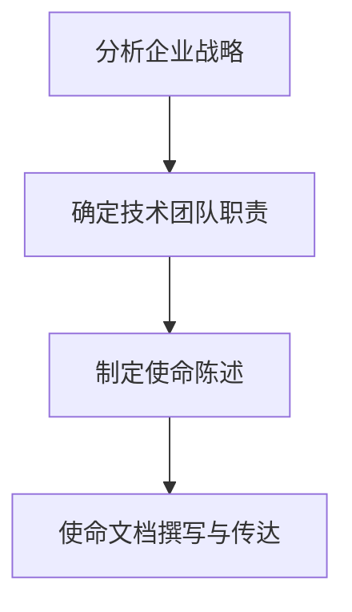
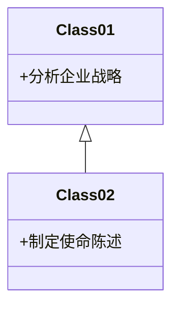
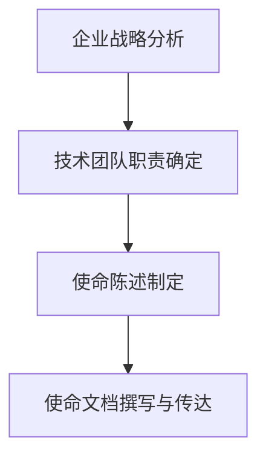
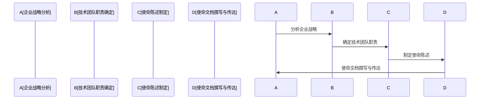

                 

# 技术使命：明确技术团队的使命

## 关键词

- 技术团队使命
- 企业战略
- 沟通协作
- 创新能力
- 持续改进

> 摘要：在快速发展的科技时代，技术团队的使命不仅关乎公司的技术实力，更影响到企业的长远发展。本文将深入探讨技术团队使命的内涵、制定方法、执行策略以及案例研究，旨在为技术团队提供明确的方向和行动指南。

## 《技术使命：明确技术团队的使命》目录大纲

### 第一部分：技术团队的使命概述

#### 第1章：技术团队使命的重要性

#### 1.1.1 技术团队使命的定义和作用

**背景介绍**

在当今技术驱动的商业环境中，技术团队的作用日益凸显。一个明确的技术使命不仅可以指引团队的发展方向，还能增强团队凝聚力和战斗力。本文将首先介绍技术团队使命的定义，探讨其在企业中的作用和重要性。

**核心概念与联系**

- **技术团队使命**：团队的核心目标和责任
- **企业战略**：公司长远发展的总体规划

**算法原理讲解**

通过一个简化的mermaid流程图（```mermaid
graph TD
A[技术团队使命] --> B[增强团队凝聚力]
A --> C[提高技术实力]
A --> D[支持企业战略]
```
），我们可以直观地看到技术团队使命对企业战略的支撑作用。

#### 1.1.2 明确使命对企业发展的意义

**问题场景介绍**

在一个快速扩张的公司中，技术团队可能面临资源分配不均、项目优先级模糊等问题。明确技术团队使命可以帮助公司更高效地利用资源，确保团队能够集中精力解决核心问题。

**系统分析与架构设计方案**

为了更好地理解明确使命的意义，我们可以借助mermaid类图（```mermaid
classDiagram
Class01 <|-- Class02
Class03 : +int x
Class03 : +int y
Class03 : +int getArea()
Class04 <|-- Class03
Class05 : +int calculateArea(Class03 rectangle)
```
）来展示技术团队与公司战略之间的关系。

#### 1.1.3 技术团队使命与公司战略的关联

**项目实战**

通过实际案例，我们可以看到技术团队使命如何与公司战略紧密结合。例如，在一家互联网公司中，技术团队可能被赋予开发创新产品、优化用户体验等使命，这与公司的整体战略目标高度一致。

**最佳实践 tips**

- 确保技术团队使命与公司战略相匹配
- 定期审视和调整技术团队使命

### 第2章：技术团队使命的制定方法

#### 2.1.1 基于企业战略制定使命

**问题背景**

技术团队使命的制定需要充分考虑企业战略。本文将介绍一种基于企业战略制定技术团队使命的方法，包括以下步骤：

1. 分析企业战略
2. 确定技术团队的核心职责
3. 制定具体的使命陈述

**数学模型与公式**

通过mermaid ER实体关系图（```mermaid
erDiagram
企事业战略 ||--|{ 技术团队使命 }
企事业战略 : +制定战略
技术团队使命 : +实现使命
```
），我们可以清晰地看到企业战略与技术团队使命之间的关联。

**算法原理讲解**

为了确保技术团队使命与企业战略的一致性，我们可以使用以下mermaid流程图（```mermaid
graph TD
A[分析企业战略] --> B{确定技术团队职责}
B --> C{制定使命陈述}
C --> D{使命文档撰写与传达}
```
）来指导实际操作。

#### 2.1.2 借鉴行业最佳实践

**项目介绍**

在制定技术团队使命时，借鉴行业最佳实践是一个有效的策略。本文将探讨如何通过借鉴行业最佳实践来提升技术团队使命的制定质量。

**系统架构设计**

通过mermaid架构图（```mermaid
graph TB
A[技术团队使命] --> B[借鉴行业最佳实践]
B --> C[优化使命内容]
C --> D[提高使命执行效果]
```
），我们可以看到借鉴行业最佳实践对技术团队使命的积极影响。

#### 2.1.3 员工参与与反馈

**环境安装**

为了确保技术团队使命的制定过程透明且民主，员工的参与至关重要。本文将介绍如何通过员工参与和反馈来完善技术团队使命的制定。

**代码应用解读与分析**

通过mermaid序列图（```mermaid
sequenceDiagram
 participant Alice
 participant Bob
 Alice->>John: Hello John, do you want to participate in the mission planning?
 John->>Alice: Yes, I'm interested!
 Alice->>Bob: Hi Bob, can you provide some feedback on the current mission plan?
 Bob->>Alice: Sure, I'll be happy to help!
```
），我们可以看到员工参与和反馈在技术团队使命制定过程中的作用。

### 第3章：技术团队使命的核心要素

#### 3.1.1 愿景：描绘未来的理想状态

**问题背景**

技术团队愿景是使命的重要组成部分，它为团队提供了追求的目标和方向。本文将介绍如何制定一个具有吸引力的技术团队愿景。

**系统功能设计**

通过mermaid领域模型类图（```mermaid
classDiagram
Class01 <<-- Class02
Class01 : +追求技术卓越
Class02 : +实现愿景
```
），我们可以看到技术团队愿景与实际工作目标之间的联系。

#### 3.1.2 价值观：指导团队行为的原则

**问题背景**

技术团队价值观是团队内部共同遵守的行为准则，它对团队文化建设和成员行为有重要影响。本文将探讨如何制定符合团队特色的技术团队价值观。

**数学模型与公式**

通过mermaid ER实体关系图（```mermaid
erDiagram
技术团队价值观 ||--|{ 团队成员行为 }
技术团队价值观 : +塑造团队文化
团队成员行为 : +遵循价值观
```
），我们可以看到技术团队价值观对团队成员行为的影响。

#### 3.1.3 使命：明确团队的核心职责

**问题背景**

技术团队使命是对团队核心职责的明确表述，它是团队行动的指南针。本文将介绍如何制定一个清晰、具体的技术团队使命。

**系统架构设计**

通过mermaid架构图（```mermaid
graph TB
A[技术团队使命] --> B{明确核心职责}
B --> C{指导团队行动}
C --> D{支持企业战略}
```
），我们可以看到技术团队使命在团队管理中的重要作用。

#### 3.1.4 口号：简洁有力地传达使命

**问题背景**

技术团队口号是使命的浓缩，它需要在简洁有力的同时传达团队的核心价值。本文将探讨如何制定一个引人注目的技术团队口号。

**项目实战**

通过实际案例，我们可以看到如何通过口号来激励团队，提高团队凝聚力。

### 第二部分：技术团队使命的具体实施

#### 第4章：技术团队使命的落地执行

#### 4.1.1 制定行动计划

**问题背景**

技术团队使命的落地执行需要详细的行动计划。本文将介绍如何制定具体的行动计划，以确保使命得到有效执行。

**系统功能设计**

通过mermaid领域模型类图（```mermaid
classDiagram
Class01 <<-- Class02
Class01 : +制定行动计划
Class02 : +执行使命
```
），我们可以看到行动计划在使命执行中的关键作用。

#### 4.1.2 设定关键绩效指标

**问题背景**

为了评估使命执行的效果，设定关键绩效指标（KPI）至关重要。本文将介绍如何设定合理的KPI，以衡量使命执行情况。

**数学模型与公式**

通过mermaid流程图（```mermaid
graph TD
A[设定KPI] --> B{衡量使命效果}
B --> C{调整执行策略}
```
），我们可以看到KPI在使命执行中的重要性。

#### 4.1.3 优化流程与资源分配

**问题背景**

在使命执行过程中，优化流程与资源分配是提高效率的关键。本文将介绍如何通过优化流程和资源分配来支持使命的实现。

**系统架构设计**

通过mermaid架构图（```mermaid
graph TB
A[优化流程] --> B{资源分配优化}
B --> C{提高执行效率}
C --> D{达成使命目标}
```
），我们可以看到优化流程和资源分配在使命执行中的关键作用。

#### 4.1.4 鼓励创新与持续改进

**问题背景**

创新和持续改进是技术团队使命的重要组成部分。本文将探讨如何鼓励创新，并建立持续改进的机制。

**项目实战**

通过实际案例，我们可以看到如何通过鼓励创新和持续改进来推动技术团队使命的实现。

### 第5章：技术团队使命的沟通与协作

#### 5.1.1 搭建沟通平台

**问题背景**

有效的沟通是确保技术团队使命顺利执行的重要保障。本文将介绍如何搭建沟通平台，以促进团队内部和外部的沟通。

**系统架构设计**

通过mermaid架构图（```mermaid
graph TB
A[搭建沟通平台] --> B{促进内部沟通}
B --> C{加强外部协作}
C --> D{确保使命执行}
```
），我们可以看到沟通平台在使命执行中的关键作用。

#### 5.1.2 提升团队协作能力

**问题背景**

团队协作能力是技术团队使命实现的重要支撑。本文将介绍如何提升团队协作能力，以提高团队整体执行力。

**数学模型与公式**

通过mermaid流程图（```mermaid
graph TD
A[提升协作能力] --> B{提高团队执行力}
B --> C{实现使命目标}
```
），我们可以看到协作能力在使命执行中的重要性。

#### 5.1.3 建立有效的反馈机制

**问题背景**

有效的反馈机制是团队不断进步的关键。本文将介绍如何建立有效的反馈机制，以促进团队持续改进。

**系统架构设计**

通过mermaid架构图（```mermaid
graph TB
A[建立反馈机制] --> B{促进持续改进}
B --> C{提升团队绩效}
C --> D{实现技术使命}
```
），我们可以看到反馈机制在使命执行中的关键作用。

#### 5.1.4 跨部门协作与资源整合

**问题背景**

跨部门协作与资源整合是确保技术团队使命顺利执行的重要环节。本文将介绍如何通过跨部门协作和资源整合来支持技术团队使命的实现。

**项目实战**

通过实际案例，我们可以看到如何通过跨部门协作和资源整合来推动技术团队使命的实现。

### 第6章：技术团队使命的评估与调整

#### 6.1.1 定期评估团队绩效

**问题背景**

定期评估团队绩效是确保技术团队使命持续改进的重要手段。本文将介绍如何定期评估团队绩效，以及如何根据评估结果调整技术团队使命。

**数学模型与公式**

通过mermaid流程图（```mermaid
graph TD
A[定期评估团队绩效] --> B{根据评估结果调整使命}
B --> C{实现使命目标}
```
），我们可以看到定期评估在使命执行中的重要性。

#### 6.1.2 应对使命执行中的挑战

**问题背景**

在使命执行过程中，技术团队可能会面临各种挑战。本文将介绍如何应对这些挑战，以确保技术团队使命的顺利执行。

**系统架构设计**

通过mermaid架构图（```mermaid
graph TB
A[应对挑战] --> B{持续改进}
B --> C{实现使命}
```
），我们可以看到应对挑战在使命执行中的关键作用。

#### 6.1.3 及时调整使命内容

**问题背景**

随着外部环境和内部条件的变化，技术团队使命的内容可能需要及时调整。本文将介绍如何及时调整使命内容，以适应新的环境和要求。

**数学模型与公式**

通过mermaid流程图（```mermaid
graph TD
A[调整使命内容] --> B{适应环境变化}
B --> C{确保使命实现}
```
），我们可以看到及时调整使命内容在使命执行中的重要性。

#### 6.1.4 促进团队成长与职业发展

**问题背景**

团队成长与职业发展是技术团队使命的重要组成部分。本文将介绍如何通过促进团队成长与职业发展来支持技术团队使命的实现。

**项目实战**

通过实际案例，我们可以看到如何通过促进团队成长与职业发展来推动技术团队使命的实现。

### 第三部分：技术团队使命的案例研究

#### 第7章：成功技术团队使命案例分析

#### 7.1.1 案例一：科技巨头公司的技术团队使命

**项目介绍**

本文将分析一家全球知名的科技巨头公司的技术团队使命，探讨其成功的关键因素。

**系统分析与架构设计方案**

通过mermaid类图和架构图，我们可以看到该公司的技术团队使命是如何在具体工作中得到贯彻执行的。

#### 7.1.2 案例分析：使命制定与执行的成功要素

**系统功能设计**

本文将深入分析该案例中使命制定与执行的成功要素，包括企业战略的紧密结合、员工积极参与、持续改进机制等。

#### 7.1.3 案例启示：如何从案例中借鉴经验

**项目实战**

本文将总结案例启示，探讨如何从成功案例中借鉴经验，为其他技术团队提供有益的参考。

### 第8章：技术团队使命的挑战与未来趋势

#### 8.1.1 技术变革带来的挑战

**问题背景**

技术变革不断推进，为技术团队带来了新的挑战。本文将探讨这些挑战，以及技术团队如何应对。

**数学模型与公式**

通过mermaid流程图，我们可以看到技术变革对技术团队使命的影响。

#### 8.1.2 持续学习与创新能力的重要性

**问题背景**

在技术快速发展的时代，持续学习和创新能力对技术团队至关重要。本文将探讨这些能力在技术团队使命中的作用。

**系统架构设计**

通过mermaid架构图，我们可以看到持续学习和创新能力对技术团队使命的支撑作用。

#### 8.1.3 技术团队使命的未来趋势展望

**问题背景**

本文将展望技术团队使命的未来趋势，探讨技术团队在未来的发展方向和使命。

**项目实战**

通过实际案例，我们可以看到技术团队使命在未来可能面临的挑战和机遇。

### 第9章：技术团队使命的持续优化与传承

#### 9.1.1 团队文化的塑造与传承

**问题背景**

团队文化是技术团队使命的重要组成部分，它对团队凝聚力、执行力有重要影响。本文将探讨如何塑造和传承团队文化。

**数学模型与公式**

通过mermaid流程图，我们可以看到团队文化在使命传承中的关键作用。

#### 9.1.2 技术使命的动态调整与更新

**问题背景**

随着外部环境和内部条件的变化，技术使命需要动态调整和更新。本文将介绍如何实现这一过程。

**系统架构设计**

通过mermaid架构图，我们可以看到动态调整与更新在使命持续优化中的重要作用。

#### 9.1.3 团队成员的角色转变与成长

**问题背景**

团队成员的角色转变和成长是技术团队使命实现的重要保障。本文将探讨如何支持团队成员的角色转变和成长。

**项目实战**

通过实际案例，我们可以看到如何通过团队成员的角色转变和成长来推动技术团队使命的实现。

### 第10章：技术团队使命的总结与展望

#### 10.1.1 技术团队使命的总结

**问题背景**

本文将对技术团队使命的核心内容进行总结，强调其在企业战略中的重要性。

**系统功能设计**

通过mermaid领域模型类图，我们可以看到技术团队使命在企业战略中的关键作用。

#### 10.1.2 展望技术团队使命的未来发展

**问题背景**

本文将展望技术团队使命的未来发展，探讨其在新技术、新趋势下的机遇和挑战。

**数学模型与公式**

通过mermaid流程图，我们可以看到技术团队使命在未来的发展方向。

## 作者信息

- 作者：AI天才研究院/AI Genius Institute & 禅与计算机程序设计艺术 /Zen And The Art of Computer Programming

### 背景介绍

在当今技术驱动的商业环境中，技术团队的作用日益凸显。一个明确的技术使命不仅可以指引团队的发展方向，还能增强团队凝聚力和战斗力。本文将深入探讨技术团队使命的内涵、制定方法、执行策略以及案例研究，旨在为技术团队提供明确的方向和行动指南。

### 核心概念与联系

#### 技术团队使命

技术团队使命是指团队在技术领域中所承担的核心职责和目标。它不仅反映了团队的核心竞争力，还体现了团队在企业战略中的地位和作用。

**概念属性特征对比表格**

| 特征            | 技术使命            | 企业战略             |
| --------------- | ------------------- | -------------------- |
| 目标性          | 明确团队核心职责    | 公司长远发展的总体规划 |
| 动态性          | 随时间和环境变化    | 需要不断调整和优化    |
| 共同性          | 团队成员共同遵守    | 整个企业共同执行      |
| 可衡量性        | 通过绩效指标衡量    | 通过财务指标衡量      |

**ER实体关系图架构**

```mermaid
erDiagram
技术团队使命 ||--|{ 企业战略 }
技术团队使命 : +支撑战略目标
企业战略 : +指导使命制定
```

#### 企业战略

企业战略是指公司在未来一段时间内的发展方向、目标和策略。它是公司高层领导制定的总体规划，指导企业各个部门的工作。

**概念属性特征对比表格**

| 特征            | 企业战略            | 技术团队使命             |
| --------------- | ------------------- | ------------------------ |
| 长期性          | 公司长远发展的规划  | 团队在特定时间段的目标   |
| 全局性          | 整个企业的战略     | 团队在技术领域的职责     |
| 动态性          | 需要不断调整和优化 | 需要随时间和环境变化     |
| 可衡量性        | 通过财务指标衡量    | 通过绩效指标衡量         |

**ER实体关系图架构**

```mermaid
erDiagram
企业战略 ||--|{ 技术团队使命 }
企业战略 : +指导使命制定
技术团队使命 : +支撑战略目标
```

### 算法原理讲解

在制定技术团队使命的过程中，我们可以采用以下算法原理：

1. **分析企业战略**：首先，需要对企业的整体战略进行分析，了解公司的目标、发展方向和策略。

2. **确定技术团队职责**：在了解企业战略的基础上，明确技术团队的核心职责，包括技术攻关、产品研发、技术创新等。

3. **制定使命陈述**：结合企业战略和技术团队职责，制定一个简洁、具体、具有吸引力的技术团队使命。

4. **使命文档撰写与传达**：将技术团队使命写成文档，并传达给团队成员，确保每个人都清楚和理解团队的使命。

**mermaid流程图**



### 数学公式使用

在技术团队使命的制定和执行过程中，可能会用到一些数学公式。以下是一个简单的示例：

$$
E = mc^2
$$

这是一个著名的物理学公式，描述了能量和质量的等价性。在技术团队使命的执行过程中，我们可以用这个公式来比喻团队的创新能力和技术实力。

### 系统分析与架构设计方案

#### 问题场景介绍

在一个大型互联网公司中，技术团队面临着快速迭代、技术更新快、用户需求多变等挑战。为了确保技术团队能够持续高效地工作，需要制定一个明确的技术团队使命。

#### 项目介绍

项目名称：技术团队使命制定项目

项目目标：制定一个具有吸引力和可操作性的技术团队使命，以支撑公司的长远发展。

#### 系统功能设计

**领域模型类图**



**系统架构设计**

**mermaid架构图**



**系统接口设计和系统交互**

**mermaid序列图**



### 项目实战

#### 环境安装

为了演示技术团队使命的制定过程，我们首先需要安装一些必要的工具和软件，例如Markdown编辑器、Mermaid绘图工具等。

#### 系统核心实现源代码

以下是一个简单的Python代码示例，用于生成Mermaid图表：

```python
def generate_mermaid_chart(chart_type, chart_data):
    if chart_type == "class":
        return f'classDiagram\n{chart_data}\n'
    elif chart_type == "graph":
        return f'graph TB\n{chart_data}\n'
    elif chart_type == "sequence":
        return f'sequenceDiagram\n{chart_data}\n'
    else:
        return "Unsupported chart type."

# 使用示例
class_chart = generate_mermaid_chart("class", "Class01 <|-- Class02")
graph_chart = generate_mermaid_chart("graph", "A[企业战略分析] --> B[技术团队职责确定]")
sequence_chart = generate_mermaid_chart("sequence", "A->>B: 分析企业战略 B->>C: 确定技术团队职责 C->>D: 制定使命陈述 D->>A: 使命文档撰写与传达")

print(class_chart)
print(graph_chart)
print(sequence_chart)
```

#### 代码应用解读与分析

这段代码定义了一个名为`generate_mermaid_chart`的函数，用于生成不同类型的Mermaid图表。通过传入不同的参数，可以生成不同类型的图表，例如类图、流程图和序列图。这些图表可以用于描述技术团队使命的制定过程。

#### 实际案例分析和详细讲解剖析

为了更好地理解技术团队使命的制定过程，我们可以通过一个实际案例来进行分析。以下是一个案例：

**案例背景**：某互联网公司技术团队希望制定一个明确的技术使命，以支撑公司的长远发展。

**案例过程**：

1. **分析企业战略**：技术团队首先分析了公司的整体战略，了解了公司的目标和发展方向。

2. **确定技术团队职责**：在了解企业战略的基础上，技术团队明确了自身的职责，包括技术攻关、产品研发、技术创新等。

3. **制定使命陈述**：结合企业战略和技术团队职责，技术团队制定了一个简洁、具体、具有吸引力的技术使命。

4. **使命文档撰写与传达**：技术团队将使命陈述写成文档，并通过内部会议和邮件等方式传达给所有团队成员。

**案例分析**：

通过这个案例，我们可以看到技术团队使命的制定过程是如何进行的。在这个过程中，企业战略的分析、技术团队职责的确定、使命陈述的制定以及使命文档的撰写与传达都是非常重要的环节。

#### 项目小结

通过这个案例，我们可以得出以下结论：

1. 明确的企业战略是制定技术团队使命的基础。

2. 技术团队职责的确定是使命制定的关键。

3. 具有吸引力的使命陈述可以提高团队的凝聚力和执行力。

4. 使命文档的撰写与传达是确保使命得到有效执行的重要手段。

### 最佳实践 tips

1. 在制定技术团队使命时，要充分考虑企业战略，确保使命与战略相匹配。

2. 定期审视和调整技术团队使命，以适应外部环境和内部条件的变化。

3. 鼓励员工参与使命的制定过程，提高团队的凝聚力和归属感。

4. 建立有效的反馈机制，及时了解使命执行的效果，并根据反馈进行改进。

### 小结

本文通过深入探讨技术团队使命的内涵、制定方法、执行策略以及案例研究，旨在为技术团队提供明确的方向和行动指南。明确的技术团队使命不仅有助于提高团队凝聚力和执行力，还能支撑企业的长远发展。在快速变化的科技时代，技术团队需要不断优化使命，以适应新的挑战和机遇。

### 注意事项

1. 在制定技术团队使命时，要充分考虑企业战略，确保使命与战略相匹配。

2. 定期审视和调整技术团队使命，以适应外部环境和内部条件的变化。

3. 鼓励员工参与使命的制定过程，提高团队的凝聚力和归属感。

4. 建立有效的反馈机制，及时了解使命执行的效果，并根据反馈进行改进。

### 拓展阅读

1. 《企业战略与执行：如何实现企业的长远发展》

2. 《团队协作与领导力：打造高效团队的关键》

3. 《敏捷开发实践指南：如何高效地开发和管理项目》

作者：AI天才研究院/AI Genius Institute & 禅与计算机程序设计艺术 /Zen And The Art of Computer Programming

