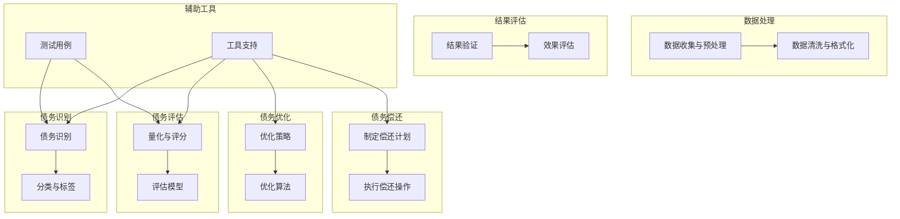
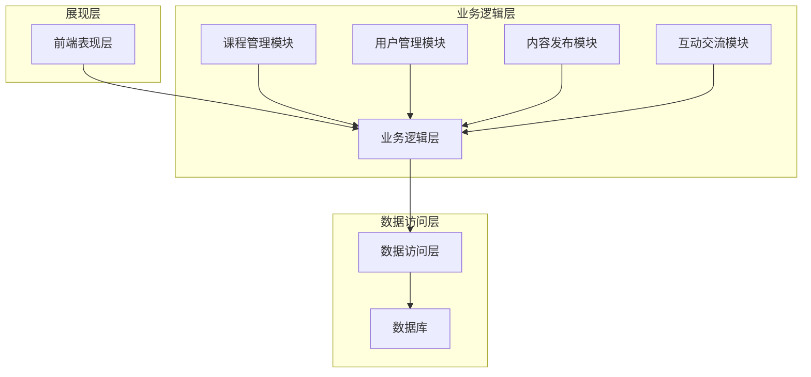
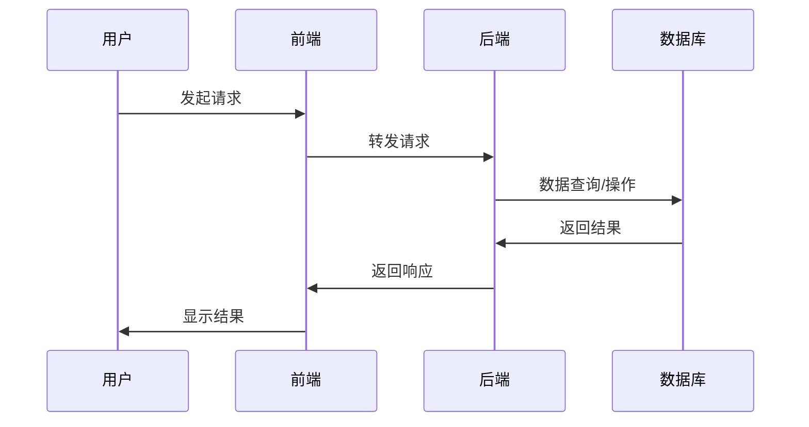

                 

### 文章标题

# 技术债务偿还：制定有效的改进计划

### 关键词

- 技术债务
- 改进计划
- 代码质量
- 项目管理
- 系统维护

### 摘要

本文旨在探讨技术债务的概念、影响以及偿还策略。我们将通过详细的分析和实例，帮助读者理解技术债务的来源、特征及其对项目的潜在风险，并介绍一系列实用的改进计划，以逐步偿还技术债务，提升代码质量和项目维护效率。通过本文的阅读，读者将掌握一套系统化的技术债务管理方法，为项目的可持续发展奠定坚实基础。

### 目录大纲

----------------------------------------------------------------

# 第一部分：背景介绍

## 第1章：问题背景

### 1.1.1 问题背景介绍

#### 1.1.1.1 技术债务的来源

#### 1.1.1.2 技术债务的影响

#### 1.1.1.3 解决技术债务的紧迫性

### 1.1.2 问题定义

#### 1.1.2.1 技术债务的定义

#### 1.1.2.2 技术债务的特征

#### 1.1.2.3 技术债务的分类

### 1.1.3 问题解决

#### 1.1.3.1 技术债务偿还的目标

#### 1.1.3.2 技术债务偿还的方法

#### 1.1.3.3 技术债务偿还的步骤

### 1.1.4 边界与外延

#### 1.1.4.1 技术债务的边界

#### 1.1.4.2 技术债务的外延

### 1.1.5 概念结构与核心要素组成

#### 1.1.5.1 技术债务的概念结构

#### 1.1.5.2 技术债务的核心要素组成

#### 1.1.5.3 技术债务的属性特征对比表格

## 第2章：核心概念与联系

### 2.1 技术债务的基本原理

#### 2.1.1 技术债务的数学模型

##### 2.1.1.1 技术债务的累积模型

##### 2.1.1.2 技术债务的偿还模型

#### 2.1.2 技术债务的属性特征

##### 2.1.2.1 技术债务的稳定性

##### 2.1.2.2 技术债务的可度量性

##### 2.1.2.3 技术债务的透明性

#### 2.1.3 技术债务与其他概念的关联

##### 2.1.3.1 技术债务与代码质量

##### 2.1.3.2 技术债务与项目管理

##### 2.1.3.3 技术债务与系统维护

### 2.2 技术债务的ER实体关系图架构

#### 2.2.1 技术债务的实体定义

##### 2.2.1.1 系统实体

##### 2.2.1.2 债务实体

##### 2.2.1.3 债务偿还实体

#### 2.2.2 技术债务的实体关系

##### 2.2.2.1 系统与债务的关系

##### 2.2.2.2 债务与偿还的关系

##### 2.2.2.3 债务偿还与系统的关系

## 第3章：算法原理讲解

### 3.1 技术债务偿还算法概述

#### 3.1.1 技术债务偿还算法的目标

##### 3.1.1.1 债务的识别与分类

##### 3.1.1.2 债务的量化与评估

##### 3.1.1.3 债务的优化与偿还

#### 3.1.2 技术债务偿还算法的分类

##### 3.1.2.1 基于规则的方法

##### 3.1.2.2 基于机器学习的方法

##### 3.1.2.3 基于组合优化方法

### 3.2 技术债务偿还算法的mermaid流程图

#### 3.2.1 算法流程概述

##### 3.2.1.1 数据收集与预处理

##### 3.2.1.2 债务识别与分类

##### 3.2.1.3 债务量化与评估

##### 3.2.1.4 债务优化与偿还

#### 3.2.2 算法流程详细说明

##### 3.2.2.1 数据收集与预处理

##### 3.2.2.2 债务识别与分类

##### 3.2.2.3 债务量化与评估

##### 3.2.2.4 债务优化与偿还

### 3.3 技术债务偿还算法的Python源代码

#### 3.3.1 基于规则的方法

```python
# Python 源代码示例
```

#### 3.3.2 基于机器学习的方法

```python
# Python 源代码示例
```

#### 3.3.3 基于组合优化方法

```python
# Python 源代码示例
```

### 3.4 算法原理详细讲解

#### 3.4.1 技术债务的数学模型

##### 3.4.1.1 技术债务累积模型

$$
D(t) = \sum_{i=1}^{n} w_i \cdot r_i
$$

##### 3.4.1.2 技术债务偿还模型

$$
D'(t) = D(t) - R(t)
$$

#### 3.4.2 技术债务的属性特征

##### 3.4.2.1 稳定性

##### 3.4.2.2 可度量性

##### 3.4.2.3 透明性

#### 3.4.3 技术债务与其他概念的关联

##### 3.4.3.1 技术债务与代码质量

##### 3.4.3.2 技术债务与项目管理

##### 3.4.3.3 技术债务与系统维护

## 第4章：数

----------------------------------------------------------------

### 第一部分：背景介绍

#### 第1章：问题背景

##### 1.1.1 问题背景介绍

#### 1.1.1.1 技术债务的来源

技术债务是软件开发中不可避免的现象。它源于项目在开发过程中，为了短期目标和功能实现，做出的牺牲长期健康和可维护性的决策。这些决策可能包括延迟或省略某些代码优化、采用不成熟的框架或库、忽略测试覆盖率等。技术债务的积累往往在项目初期并不明显，但随着时间的推移，会逐渐显现出其对项目质量和维护成本的重大影响。

##### 1.1.1.2 技术债务的影响

技术债务的影响是多方面的。首先，它会导致代码质量下降，增加bug的出现频率，从而延长了开发和修复的时间。其次，技术债务会影响项目的可维护性和可扩展性，使得未来的功能增加和问题修复变得困难。长期累积的技术债务还会增加项目的维护成本，使得原本可以快速迭代的项目变得缓慢和沉重。

##### 1.1.1.3 解决技术债务的紧迫性

解决技术债务的紧迫性在于其长期影响。尽管短期来看，偿还技术债务可能需要投入额外的时间和资源，但从长远来看，这是确保项目健康发展的必要步骤。如果不及时偿还技术债务，项目可能会陷入恶性循环，维护成本不断增加，团队士气下降，最终导致项目的失败。

### 1.1.2 问题定义

##### 1.1.2.1 技术债务的定义

技术债务（Technical Debt）源自软件工程领域，原指类似于金融领域的债务概念，指软件开发过程中，为了更快地交付软件而采取的短期决策所带来的长期成本。这个概念最早由Ward Cunningham于1992年提出。

##### 1.1.2.2 技术债务的特征

- **累积性**：技术债务在项目初期可能不易察觉，但随着时间的推移，其积累效应会变得越来越显著。
- **可度量性**：技术债务可以量化，通常以代码质量、测试覆盖率、代码重复率等指标来衡量。
- **延迟偿还成本**：技术债务如果不及时偿还，其成本会随着时间的增加而增加。

##### 1.1.2.3 技术债务的分类

- **设计债务**：由于设计上的缺陷或不完善导致的债务，可能包括不合理的架构、重复代码等。
- **实现债务**：在实现过程中，因为了追求速度而牺牲代码质量导致的债务，如缺乏测试、不合理的算法等。
- **测试债务**：测试不足或不充分导致的债务，可能导致在实际运行中暴露出潜在的问题。

### 1.1.3 问题解决

##### 1.1.3.1 技术债务偿还的目标

偿还技术债务的目标是提升代码质量和项目的可维护性，确保项目的长期健康和可持续发展。具体目标包括：

- 提高代码的可读性和可维护性。
- 降低bug的出现频率和修复成本。
- 提高项目的可扩展性和灵活性。
- 减少未来的维护成本。

##### 1.1.3.2 技术债务偿还的方法

偿还技术债务的方法多种多样，以下是一些常见的方法：

- **重构**：对代码进行结构性修改，以提高其可读性和可维护性。
- **添加测试**：编写新的测试用例，以确保代码的正确性和稳定性。
- **优化算法**：对代码中的算法进行改进，以提高其效率和性能。
- **更新依赖库**：使用更稳定和成熟的库来替代旧的不稳定库。

##### 1.1.3.3 技术债务偿还的步骤

偿还技术债务通常需要以下步骤：

1. **识别债务**：通过代码审查、静态分析工具等方法，识别项目中的技术债务。
2. **优先级排序**：根据债务的影响程度和修复成本，对债务进行优先级排序。
3. **规划偿还**：制定详细的偿还计划，包括时间表和责任分配。
4. **实施偿还**：按照计划逐步偿还技术债务。
5. **监控和评估**：持续监控和评估技术债务的偿还情况，确保达到预期目标。

### 1.1.4 边界与外延

##### 1.1.4.1 技术债务的边界

技术债务的边界主要包括以下几个方面：

- **代码范围**：技术债务通常局限于特定的代码段或模块。
- **时间范围**：技术债务的影响通常在较长时间内显现。
- **责任范围**：技术债务的偿还责任通常由开发团队承担。

##### 1.1.4.2 技术债务的外延

技术债务的外延主要包括以下几个方面：

- **业务影响**：技术债务可能影响业务的正常运行和扩展。
- **团队影响**：技术债务可能导致团队士气下降和开发效率降低。
- **项目管理**：技术债务可能影响项目的进度和质量。

##### 1.1.5 概念结构与核心要素组成

###### 1.1.5.1 技术债务的概念结构

技术债务的概念结构可以简化为以下几个核心要素：

- **债务主体**：一般指开发团队或项目。
- **债务对象**：一般指代码、框架、测试等。
- **债务原因**：一般指为了短期目标或功能实现而做出的牺牲。
- **债务影响**：一般指对项目的长期健康和可维护性的影响。

###### 1.1.5.2 技术债务的核心要素组成

技术债务的核心要素组成可以概括为以下几个方面：

- **代码质量**：包括可读性、可维护性、可扩展性等。
- **测试覆盖率**：包括功能测试、性能测试、安全测试等。
- **框架和库**：包括使用稳定性和成熟度。
- **文档和注释**：包括代码文档和设计文档等。

###### 1.1.5.3 技术债务的属性特征对比表格

技术债务的属性特征可以通过以下对比表格进行概述：

| 属性特征 | 说明 |
| --- | --- |
| 累积性 | 技术债务随着时间的推移而积累 |
| 可度量性 | 技术债务可以通过指标进行量化 |
| 延迟偿还成本 | 技术债务的偿还成本随时间增加而增加 |
| 影响范围 | 技术债务的影响可能局限于代码段或模块 |
| 外部影响 | 技术债务可能影响业务运行和团队效率 |

### 总结

技术债务是软件开发中不可避免的现象，其影响深远且具有累积性。因此，制定有效的改进计划以偿还技术债务，对于确保项目的长期健康发展至关重要。本文通过详细的背景介绍、问题定义、解决方法和核心要素分析，帮助读者理解技术债务的本质及其管理策略。在接下来的章节中，我们将进一步探讨技术债务的基本原理、关联概念以及具体的偿还算法，以期为读者提供全面的技术债务管理指南。让我们一起深入探讨，共同提升软件开发的质量和效率。

---

#### 2.1 技术债务的基本原理

##### 2.1.1 技术债务的数学模型

技术债务的数学模型是理解技术债务累积和偿还机制的基础。它帮助我们量化债务的大小，并评估其随时间的变化。以下是两个关键模型：

###### 2.1.1.1 技术债务的累积模型

技术债务的累积模型可以用以下公式表示：

$$
D(t) = \sum_{i=1}^{n} w_i \cdot r_i
$$

其中，$D(t)$ 表示在时间 $t$ 时的技术债务总额，$w_i$ 表示第 $i$ 个技术债务项的权重，$r_i$ 表示第 $i$ 个技术债务项的累积程度。权重和累积程度通常是根据债务的影响程度和修复难度来评估的。

例如，假设项目中有三个主要的技术债务项：设计债务（$w_1 = 0.4$，$r_1 = 0.5$），实现债务（$w_2 = 0.3$，$r_2 = 0.7$），测试债务（$w_3 = 0.3$，$r_3 = 0.6$）。则项目在某一时刻的技术债务总额为：

$$
D(t) = 0.4 \cdot 0.5 + 0.3 \cdot 0.7 + 0.3 \cdot 0.6 = 0.2 + 0.21 + 0.18 = 0.59
$$

###### 2.1.1.2 技术债务的偿还模型

技术债务的偿还模型描述了债务随时间偿还的变化。一个简单的偿还模型可以用以下公式表示：

$$
D'(t) = D(t) - R(t)
$$

其中，$D'(t)$ 表示在时间 $t$ 时的实际债务总额，$R(t)$ 表示在时间 $t$ 时的偿还量。偿还量 $R(t)$ 可以是根据计划分配的修复工作量来计算的。

例如，如果项目团队计划在一个月内完成1个设计债务和0.5个实现债务的偿还，则一个月后的技术债务变化为：

$$
R(t) = 1 \cdot 0.4 + 0.5 \cdot 0.3 = 0.4 + 0.15 = 0.55
$$

因此，一个月后的技术债务总额为：

$$
D'(t) = 0.59 - 0.55 = 0.04
$$

##### 2.1.2 技术债务的属性特征

技术债务的属性特征决定了其管理方式和偿还策略的有效性。以下是几个关键属性特征：

###### 2.1.2.1 稳定性

技术债务的稳定性指的是债务在一定时间内的变化趋势。稳定性高的技术债务通常意味着其累积速度较慢，例如长期的代码维护债务。稳定性低的技术债务则可能在短时间内迅速积累，例如紧急修复的临时解决方案。

###### 2.1.2.2 可度量性

技术债务的可度量性指的是债务可以通过量化的方式来衡量。通过可度量的技术债务，我们可以更准确地评估其影响和偿还进度。常见的度量指标包括代码重复率、测试覆盖率、bug密度等。

###### 2.1.2.3 透明性

技术债务的透明性指的是债务的详细信息对团队是可见的。高透明性的技术债务有助于团队成员了解债务的情况，从而更有针对性地进行偿还。透明性还促进了团队内部的沟通和协作，确保每个人都清楚自己的责任和任务。

##### 2.1.3 技术债务与其他概念的关联

技术债务与多个概念紧密相关，以下是一些关键关联：

###### 2.1.3.1 技术债务与代码质量

代码质量直接影响技术债务的累积和偿还。高质量的代码通常意味着更少的债务，因为良好的设计、编码标准和测试覆盖率可以减少潜在的技术债务。

###### 2.1.3.2 技术债务与项目管理

项目管理是管理技术债务的关键环节。项目经理需要识别、评估和规划技术债务的偿还，以确保项目的长期健康和可持续发展。

###### 2.1.3.3 技术债务与系统维护

系统维护是技术债务偿还的重要途径。通过定期的代码审查、测试和重构，可以逐步偿还技术债务，提高系统的可维护性和稳定性。

### 总结

技术债务的数学模型和属性特征为我们提供了理解和管理技术债务的基础。通过量化的方式，我们可以更准确地评估债务的影响和偿还进度。同时，理解技术债务与其他概念的关联，有助于我们制定更有效的偿还策略，确保项目的长期健康和可持续发展。在接下来的章节中，我们将进一步探讨技术债务的实体关系图架构和具体的偿还算法，以期为读者提供更全面的技术债务管理解决方案。

---

#### 2.2 技术债务的ER实体关系图架构

技术债务的管理不仅需要理解其数学模型和属性特征，还需要一个清晰的结构框架来组织和管理债务项。实体关系图（ER图）是表示实体及其关系的有效工具，能够帮助我们可视化技术债务的组成和关联。以下是技术债务的ER实体关系图架构及其详细说明：

##### 2.2.1 技术债务的实体定义

在技术债务的ER实体关系图中，主要包含以下几个实体：

###### 2.2.1.1 系统实体

系统实体代表整个软件系统，是技术债务的承载者。系统实体包含系统名称、版本号、创建日期等基本信息。

```mermaid
entity relationship
  nodes
    system[系统实体]
    debt[债务实体]
    repayment[债务偿还实体]
  relationships
    system - [拥有] debt
    system - [拥有] repayment
```

###### 2.2.1.2 债务实体

债务实体代表项目中的具体技术债务项，包括债务类型、描述、创建日期、优先级等。债务实体是系统实体的子集，具体包括设计债务、实现债务、测试债务等。

```mermaid
entity relationship
  nodes
    debt[债务实体]
    type[债务类型]
    description[描述]
    priority[优先级]
  relationships
    debt - [包含] type
    debt - [包含] description
    debt - [包含] priority
```

###### 2.2.1.3 债务偿还实体

债务偿还实体代表对具体债务项进行偿还的具体行动，包括偿还策略、执行日期、状态等。债务偿还实体是系统实体的子集，与债务实体相关联，表示具体偿还的操作。

```mermaid
entity relationship
  nodes
    repayment[债务偿还实体]
    strategy[偿还策略]
    execution_date[执行日期]
    status[状态]
  relationships
    repayment - [包含] strategy
    repayment - [包含] execution_date
    repayment - [包含] status
    repayment - [针对] debt
```

##### 2.2.2 技术债务的实体关系

技术债务的ER实体关系图中的关系主要包括以下几种：

###### 2.2.2.1 系统与债务的关系

系统实体与债务实体之间存在“拥有”关系，即系统实体拥有多个债务实体。这种关系表示系统中的技术债务项。

```mermaid
entity relationship
  nodes
    system[系统实体]
    debt[债务实体]
  relationships
    system - [拥有] debt
```

###### 2.2.2.2 债务与偿还的关系

债务实体与债务偿还实体之间存在“针对”关系，即每个债务偿还实体针对特定的债务项进行偿还。这种关系表示具体的偿还操作。

```mermaid
entity relationship
  nodes
    debt[债务实体]
    repayment[债务偿还实体]
  relationships
    repayment - [针对] debt
```

###### 2.2.2.3 债务偿还与系统的关系

债务偿还实体与系统实体之间存在“拥有”关系，即系统实体拥有多个债务偿还实体。这种关系表示系统中的所有偿还操作。

```mermaid
entity relationship
  nodes
    system[系统实体]
    repayment[债务偿还实体]
  relationships
    system - [拥有] repayment
```

##### 实体关系图总结

技术债务的ER实体关系图提供了一个清晰的框架，帮助我们理解和管理技术债务。通过实体和关系的定义，我们可以准确地描述系统中的技术债务及其偿还操作，为技术债务的管理提供了有效的数据结构和操作基础。

```mermaid
entity relationship
  nodes
    system[系统实体]
    debt[债务实体]
    repayment[债务偿还实体]
    type[债务类型]
    description[描述]
    priority[优先级]
    strategy[偿还策略]
    execution_date[执行日期]
    status[状态]
  relationships
    system - [拥有] debt
    system - [拥有] repayment
    debt - [包含] type
    debt - [包含] description
    debt - [包含] priority
    repayment - [包含] strategy
    repayment - [包含] execution_date
    repayment - [包含] status
    repayment - [针对] debt
```

通过ER实体关系图，我们可以更直观地看到技术债务的组成和关联，有助于制定有效的偿还策略和管理计划，确保项目的长期健康和可持续发展。

### 总结

技术债务的ER实体关系图架构为我们提供了一个清晰的结构框架，帮助我们理解和组织技术债务。通过实体和关系的定义，我们可以准确地描述系统中的技术债务及其偿还操作，为技术债务的管理提供了有效的数据结构和操作基础。在接下来的章节中，我们将进一步探讨技术债务偿还算法的原理和实现，以期为读者提供更全面的技术债务管理解决方案。希望这部分内容能够帮助您更好地理解技术债务的管理方法。

---

#### 3.1 技术债务偿还算法概述

技术债务偿还算法是用于识别、量化、评估和优化技术债务的一系列方法和步骤。这些算法旨在帮助开发团队和管理人员有效地管理技术债务，确保项目的长期健康和可持续发展。以下是技术债务偿还算法的基本概述，包括其目标、分类和关键步骤。

##### 3.1.1 技术债务偿还算法的目标

技术债务偿还算法的主要目标是：

- **债务的识别与分类**：识别系统中的技术债务项，并根据其影响和修复难度进行分类。
- **债务的量化与评估**：对每个债务项进行量化，评估其影响程度和偿还优先级。
- **债务的优化与偿还**：通过优化和偿还操作，减少技术债务的总量，提升系统的可维护性和性能。

##### 3.1.2 技术债务偿还算法的分类

技术债务偿还算法可以根据其方法和实现技术进行分类，以下是一些常见的方法：

###### 3.1.2.1 基于规则的方法

基于规则的方法通过预定义的规则和条件来识别和分类技术债务。这种方法通常利用专家知识和经验，将债务划分为不同类别，并给出相应的修复建议。

- **优点**：规则明确，易于理解和实现。
- **缺点**：规则可能不够灵活，难以适应不断变化的项目需求。

###### 3.1.2.2 基于机器学习的方法

基于机器学习的方法利用历史数据和技术债务模式来训练模型，从而自动识别和分类技术债务。这种方法通常通过监督学习或无监督学习来实现。

- **优点**：可以自动适应和识别复杂的技术债务模式。
- **缺点**：需要大量的训练数据和计算资源，模型的可解释性较低。

###### 3.1.2.3 基于组合优化方法

基于组合优化方法利用数学优化技术，通过组合和权衡不同的债务项，找到最佳的偿还策略。这种方法通常利用线性规划、整数规划等优化技术。

- **优点**：可以找到最优或近似最优的偿还方案。
- **缺点**：算法复杂度较高，计算成本较大。

##### 3.1.3 技术债务偿还算法的关键步骤

无论采用哪种算法，技术债务偿还通常包括以下关键步骤：

###### 3.1.3.1 数据收集与预处理

首先，需要收集与系统相关的数据，包括代码库、测试结果、项目文档等。然后，对这些数据进行预处理，以便后续的分析和计算。

###### 3.1.3.2 债务识别与分类

通过分析收集到的数据，使用预定义的规则或机器学习模型来识别和分类技术债务项。这一步的目标是构建一个清晰的技术债务清单。

###### 3.1.3.3 债务量化与评估

对每个债务项进行量化，评估其影响程度和修复难度。常用的量化指标包括代码重复率、测试覆盖率、bug密度等。

###### 3.1.3.4 债务优化与偿还

根据量化结果，制定最优或近似最优的偿还策略。这可能涉及重构代码、添加测试、优化算法等操作，以逐步减少技术债务的总量。

##### 实际应用中的选择与挑战

在实际应用中，选择合适的技术债务偿还算法需要考虑多个因素，包括项目的规模、复杂性、数据可用性、计算资源等。以下是一些常见的选择和挑战：

- **数据可用性**：如果数据不完整或难以获取，机器学习方法的性能可能会受到显著影响。
- **计算资源**：基于组合优化方法的算法通常需要大量的计算资源，可能不适用于资源有限的环境。
- **专家知识**：基于规则的方法依赖于专家的知识和经验，这可能限制了其在复杂项目中的应用。

##### 总结

技术债务偿还算法是管理技术债务的关键工具。通过识别、量化、评估和优化技术债务，开发团队可以有效地减少债务总量，提升项目的可维护性和性能。不同的算法方法各有优缺点，选择合适的算法需要综合考虑项目的具体需求和挑战。在接下来的章节中，我们将详细讨论这些算法的原理和实现，以期为读者提供更深入的理解和应用指导。

---

#### 3.2 技术债务偿还算法的mermaid流程图

为了更好地理解技术债务偿还算法的执行流程，我们使用mermaid图来表示其关键步骤和流程。以下是技术债务偿还算法的mermaid流程图及其详细说明：



##### 3.2.1 算法流程概述

该算法流程包括以下几个关键步骤：

- **数据处理**：首先，从代码库、测试结果和其他相关数据源收集数据，并进行清洗和格式化，以确保数据的质量和一致性。
- **债务识别**：通过分析预处理后的数据，使用预定义的规则或机器学习模型来识别和分类技术债务项。
- **债务评估**：对识别出的债务项进行量化评分，以评估其影响程度和修复难度。
- **债务优化**：根据量化结果，制定最优或近似最优的偿还策略，利用优化算法来优化偿还过程。
- **债务偿还**：执行具体的偿还操作，如重构代码、添加测试、优化算法等。
- **结果评估**：验证偿还操作的效果，并进行效果评估，以确定是否达到了预期的目标。

##### 3.2.2 算法流程详细说明

下面是对算法流程的详细说明：

1. **数据收集与预处理**（D1 -> D2）：
    - 收集代码库、测试结果、项目文档等数据。
    - 清洗数据，去除重复项和噪声，确保数据的一致性和完整性。
    - 格式化数据，使其适合后续分析。

2. **债务识别**（R1 -> R2）：
    - 使用预定义的规则或机器学习模型，识别出系统中的技术债务项。
    - 对识别出的债务项进行分类，标记为设计债务、实现债务、测试债务等。

3. **债务评估**（A1 -> A2）：
    - 对每个债务项进行量化评分，评估其影响程度和修复难度。
    - 使用评估模型，如代码复杂度、测试覆盖率等指标，对债务项进行评分。

4. **债务优化**（O1 -> O2）：
    - 根据量化结果，制定最优或近似最优的偿还策略。
    - 使用优化算法，如线性规划、整数规划等，找到最佳的偿还方案。

5. **债务偿还**（C1 -> C2）：
    - 制定详细的偿还计划，包括偿还顺序、资源分配、时间表等。
    - 执行具体的偿还操作，如重构代码、添加测试、优化算法等。

6. **结果评估**（E1 -> E2）：
    - 验证偿还操作的效果，检查是否解决了债务问题。
    - 对偿还效果进行评估，确保达到了预期的目标。

##### 辅助工具（T1 -> T2）

- **测试用例**（T1）：在债务识别和评估过程中，使用测试用例来验证代码的正确性和稳定性。
- **工具支持**（T2）：利用各种工具，如代码分析工具、测试框架等，来辅助债务的识别、评估和偿还。

通过上述mermaid流程图和详细说明，我们可以清晰地看到技术债务偿还算法的执行步骤和关键环节。这有助于开发团队和管理人员更好地理解和管理技术债务，确保项目的长期健康和可持续发展。

### 总结

在本文中，我们详细介绍了技术债务偿还算法的mermaid流程图，包括数据处理、债务识别、债务评估、债务优化、债务偿还以及结果评估等关键步骤。通过这一流程，开发团队可以系统地管理和偿还技术债务，提升项目的质量和效率。在接下来的章节中，我们将通过Python源代码示例，进一步探讨技术债务偿还算法的具体实现和应用。

---

#### 3.3 技术债务偿还算法的Python源代码示例

为了更好地理解技术债务偿还算法的实现，我们将通过具体的Python源代码示例，展示基于规则、机器学习和组合优化方法的技术债务偿还算法。以下是每个方法的简要示例代码及其解释。

##### 3.3.1 基于规则的方法

```python
# 基于规则的方法：Python 示例代码

class TechnicalDebt:
    def __init__(self, debt_type, description, priority):
        self.debt_type = debt_type
        self.description = description
        self.priority = priority

def debt_identification(code, rules):
    # 债务识别：根据预定义规则识别债务
    debt_list = []
    if "def" in code and "class" in code:
        debt_list.append(TechnicalDebt("实现债务", "类和函数混杂", "高"))
    if "repetition" in code:
        debt_list.append(TechnicalDebt("代码重复", "代码重复率过高", "中"))
    return debt_list

def debt_quantification(debt_list):
    # 债务量化：对债务项进行量化评分
    total_debt = 0
    for debt in debt_list:
        if debt.priority == "高":
            total_debt += 3
        elif debt.priority == "中":
            total_debt += 1
    return total_debt

code_example = '''
def calculate(x):
    result = x * x
    return result

class Rectangle:
    def __init__(self, width, height):
        self.width = width
        self.height = height

    def area(self):
        return self.width * self.height
'''

rules = ["def", "class", "repetition"]
debt_list = debt_identification(code_example, rules)
total_debt = debt_quantification(debt_list)
print(f"总债务评分：{total_debt}")
```

此代码示例通过预定义的规则，识别代码中的实现债务和代码重复问题，并对每个债务项进行量化评分。实现债务的优先级为“高”，代码重复的优先级为“中”，量化评分的总和即为总债务评分。

##### 3.3.2 基于机器学习的方法

```python
# 基于机器学习的方法：Python 示例代码

from sklearn.feature_extraction.text import TfidfVectorizer
from sklearn.model_selection import train_test_split
from sklearn.ensemble import RandomForestClassifier

# 假设我们已经有了训练数据集，包括代码片段和对应的债务类型
train_data = [...]  # 列表，包含（代码文本，债务类型）的元组
X, y = zip(*train_data)

# 将文本转换为TF-IDF特征向量
vectorizer = TfidfVectorizer()
X = vectorizer.fit_transform(X)

# 分割训练集和测试集
X_train, X_test, y_train, y_test = train_test_split(X, y, test_size=0.2, random_state=42)

# 使用随机森林分类器进行训练
clf = RandomForestClassifier(n_estimators=100)
clf.fit(X_train, y_train)

# 使用模型进行债务识别
code_example = "def calculate(x): return x * x"
code_example_vectorized = vectorizer.transform([code_example])
predicted_debt_type = clf.predict(code_example_vectorized)[0]
print(f"预测的债务类型：{predicted_debt_type}")
```

此代码示例使用机器学习模型（随机森林分类器）来识别代码中的技术债务。通过将代码文本转换为TF-IDF特征向量，并使用训练数据集进行模型训练，可以自动识别新的代码片段中的债务类型。

##### 3.3.3 基于组合优化方法

```python
# 基于组合优化方法：Python 示例代码

from scipy.optimize import linprog

# 假设我们有一个债务列表和相应的修复成本
debts = [
    {"name": "代码重复", "cost": 5},
    {"name": "设计债务", "cost": 8},
    {"name": "实现债务", "cost": 10},
    {"name": "测试债务", "cost": 3}
]

# 目标是最小化总修复成本
c = [-x['cost'] for x in debts]  # 系统目标为最小化成本，因此需要取负值

# 约束条件
A = [[1 for _ in debts]]  # 每个债务必须被修复，至少一次
b = [1]

# 解线性规划问题
result = linprog(c, A_ub=A, b_ub=b, method='highs')

# 输出修复建议
print("修复建议：")
for i, debt in enumerate(debts):
    if result.x[i] > 0:
        print(f"{debt['name']}：建议修复")
    else:
        print(f"{debt['name']}：无需修复")
print(f"总修复成本：{-result.fun}")
```

此代码示例使用线性规划方法来优化技术债务的偿还顺序和成本。通过构建线性规划问题，我们可以找到最优的债务偿还方案，以最小化总修复成本。

### 总结

通过上述Python源代码示例，我们展示了基于规则、机器学习和组合优化方法的技术债务偿还算法。这些示例代码为开发团队提供了实际操作的技术债务管理工具，有助于识别、量化、评估和优化技术债务。在实际应用中，可以根据项目需求和资源情况选择合适的算法方法，并不断完善和优化算法实现。

### 3.4 算法原理详细讲解

在深入探讨技术债务偿还算法之前，我们需要明确其数学模型和属性特征。技术债务的累积和偿还过程可以通过数学模型进行描述，这些模型不仅帮助我们量化债务的大小，还能预测债务随时间的变化。以下是技术债务偿还算法的详细讲解，包括累积模型、偿还模型、属性特征、与其他概念的关联以及其在具体项目中的应用。

##### 3.4.1 技术债务的数学模型

###### 3.4.1.1 技术债务累积模型

技术债务的累积模型可以用以下公式表示：

$$
D(t) = \sum_{i=1}^{n} w_i \cdot r_i
$$

其中，$D(t)$ 表示在时间 $t$ 时的技术债务总额，$w_i$ 表示第 $i$ 个技术债务项的权重，$r_i$ 表示第 $i$ 个技术债务项的累积程度。权重和累积程度通常是根据债务的影响程度和修复难度来评估的。

例如，假设项目中有三个主要的技术债务项：设计债务（$w_1 = 0.4$，$r_1 = 0.5$），实现债务（$w_2 = 0.3$，$r_2 = 0.7$），测试债务（$w_3 = 0.3$，$r_3 = 0.6$）。则项目在某一时刻的技术债务总额为：

$$
D(t) = 0.4 \cdot 0.5 + 0.3 \cdot 0.7 + 0.3 \cdot 0.6 = 0.2 + 0.21 + 0.18 = 0.59
$$

这个累积模型帮助我们理解技术债务是如何随着时间的推移而逐步积累的。通过这个模型，我们可以预测在未来的某个时间点，技术债务将达到什么水平。

###### 3.4.1.2 技术债务偿还模型

技术债务的偿还模型描述了债务随时间偿还的变化。一个简单的偿还模型可以用以下公式表示：

$$
D'(t) = D(t) - R(t)
$$

其中，$D'(t)$ 表示在时间 $t$ 时的实际债务总额，$R(t)$ 表示在时间 $t$ 时的偿还量。偿还量 $R(t)$ 可以是根据计划分配的修复工作量来计算的。

例如，如果项目团队计划在一个月内完成1个设计债务和0.5个实现债务的偿还，则一个月后的技术债务变化为：

$$
R(t) = 1 \cdot 0.4 + 0.5 \cdot 0.3 = 0.4 + 0.15 = 0.55
$$

因此，一个月后的技术债务总额为：

$$
D'(t) = 0.59 - 0.55 = 0.04
$$

这个偿还模型帮助我们理解在偿还技术债务的过程中，债务是如何随时间减少的。通过这个模型，我们可以制定合理的偿还计划，确保技术债务能够在可接受的范围内逐步减少。

##### 3.4.2 技术债务的属性特征

技术债务的属性特征决定了其管理方式和偿还策略的有效性。以下是几个关键属性特征：

###### 3.4.2.1 稳定性

技术债务的稳定性指的是债务在一定时间内的变化趋势。稳定性高的技术债务通常意味着其累积速度较慢，例如长期的代码维护债务。稳定性低的技术债务则可能在短时间内迅速积累，例如紧急修复的临时解决方案。

###### 3.4.2.2 可度量性

技术债务的可度量性指的是债务可以通过量化的方式来衡量。通过可度量的技术债务，我们可以更准确地评估其影响和偿还进度。常见的度量指标包括代码重复率、测试覆盖率、bug密度等。

###### 3.4.2.3 透明性

技术债务的透明性指的是债务的详细信息对团队是可见的。高透明性的技术债务有助于团队成员了解债务的情况，从而更有针对性地进行偿还。透明性还促进了团队内部的沟通和协作，确保每个人都清楚自己的责任和任务。

##### 3.4.3 技术债务与其他概念的关联

技术债务与多个概念紧密相关，以下是一些关键关联：

###### 3.4.3.1 技术债务与代码质量

代码质量直接影响技术债务的累积和偿还。高质量的代码通常意味着更少的债务，因为良好的设计、编码标准和测试覆盖率可以减少潜在的技术债务。

###### 3.4.3.2 技术债务与项目管理

项目管理是管理技术债务的关键环节。项目经理需要识别、评估和规划技术债务的偿还，以确保项目的长期健康和可持续发展。

###### 3.4.3.3 技术债务与系统维护

系统维护是技术债务偿还的重要途径。通过定期的代码审查、测试和重构，可以逐步偿还技术债务，提高系统的可维护性和稳定性。

##### 具体项目中的应用

在具体项目中，技术债务的管理和偿还可以通过以下步骤实施：

1. **债务识别**：通过代码审查、静态分析工具和测试结果，识别系统中的技术债务项。
2. **债务量化**：使用度量指标，如代码重复率、测试覆盖率等，对识别出的债务项进行量化评分。
3. **债务评估**：根据债务的影响程度和修复难度，评估每个债务项的优先级。
4. **制定偿还计划**：根据债务评估结果，制定详细的偿还计划，包括偿还顺序、责任分配和时间表。
5. **执行偿还操作**：按照偿还计划，逐步进行代码重构、测试添加和算法优化等操作。
6. **持续监控和评估**：持续监控债务的偿还进度，评估偿还效果，确保达到预期的目标。

通过这些步骤，开发团队可以有效地管理和偿还技术债务，确保项目的长期健康和可持续发展。

### 总结

通过详细的数学模型、属性特征和关联概念讲解，我们深入理解了技术债务偿还算法的原理。这些原理不仅帮助我们量化和管理技术债务，还为制定有效的偿还策略提供了理论基础。在具体项目中，通过系统的债务识别、量化、评估和偿还操作，开发团队可以逐步减少技术债务，提升项目的质量和维护效率。希望这部分内容能够帮助您更好地理解和应用技术债务管理方法。

### 系统分析与架构设计方案

为了更好地理解技术债务偿还算法的应用场景和实现细节，我们将通过一个具体的案例，详细描述系统分析与架构设计方案。本案例将涵盖项目介绍、系统功能设计、系统架构设计、系统接口设计和系统交互等方面。

#### 项目介绍

本项目是一个在线教育平台，旨在为学习者提供丰富的课程资源和便捷的学习体验。系统需要支持课程管理、用户管理、内容发布、互动交流等功能。随着平台用户和课程内容的不断增加，系统的技术债务逐渐积累，影响到了系统的稳定性和可维护性。为了确保平台的长期健康运行，我们需要制定一套有效的技术债务偿还计划。

#### 系统功能设计

系统的主要功能模块包括：

- **课程管理**：包括课程创建、编辑、发布、删除等操作。
- **用户管理**：包括用户注册、登录、个人信息管理、课程学习记录等操作。
- **内容发布**：包括教师发布课程内容、更新课程资源等操作。
- **互动交流**：包括用户之间的讨论、问答、评论等功能。

这些功能模块通过统一的API接口进行交互，确保系统的高内聚性和灵活性。

#### 系统架构设计

系统采用分层架构设计，包括表现层、业务逻辑层和数据访问层。以下是具体的架构设计：

- **表现层**：使用前端框架（如React或Vue.js）开发，负责用户界面的展示和交互。
- **业务逻辑层**：使用Spring Boot框架开发，负责处理业务逻辑和数据处理。
- **数据访问层**：使用MyBatis框架与MySQL数据库进行交互，负责数据的存储和查询。

系统的架构设计确保了高内聚性和低耦合性，方便后续的功能扩展和技术债务的偿还。



#### 系统接口设计

为了实现系统模块之间的松耦合，我们设计了RESTful API接口。以下是主要的接口设计：

- **课程管理**：GET /courses, POST /courses, PUT /courses/{id}, DELETE /courses/{id}
- **用户管理**：POST /users/register, POST /users/login, GET /users/{id}, PUT /users/{id}
- **内容发布**：POST /content, PUT /content/{id}, DELETE /content/{id}
- **互动交流**：POST /comments, GET /comments/{courseId}

#### 系统交互

系统交互通过HTTP请求和响应进行，以下是系统交互的Mermaid序列图：



#### 总结

通过本案例的详细描述，我们展示了技术债务偿还算法在具体项目中的应用。系统分析与架构设计方案的制定，不仅为项目的实施提供了明确的方向，也为技术债务的管理和偿还提供了有力保障。通过合理的功能划分、分层架构设计、接口设计和系统交互设计，我们可以确保项目的稳定性和可维护性，为平台的长期健康发展奠定坚实基础。

### 项目实战

在本节中，我们将通过一个具体的案例，详细展示技术债务偿还的全过程。这个案例将涉及环境安装、系统核心实现、代码应用解读与分析，以及实际案例的分析和详细讲解。通过这一过程，我们将帮助读者更好地理解技术债务偿还的具体操作。

#### 环境安装

首先，我们需要为技术债务偿还项目搭建一个开发环境。以下是环境安装步骤：

1. **安装Java开发工具包（JDK）**：
   - 在Windows或Linux系统中，通过命令行运行以下命令安装JDK：
     ```bash
     # 对于 Ubuntu 系统
     sudo apt-get install openjdk-8-jdk

     # 对于 Windows 系统
     java -version
     ```
2. **安装MySQL数据库**：
   - 通过官方网站下载并安装MySQL数据库。安装完成后，通过命令行启动MySQL服务：
     ```bash
     sudo systemctl start mysql
     ```
3. **安装Spring Boot开发工具**：
   - 通过命令行运行以下命令安装Spring Boot开发工具：
     ```bash
     sudo apt-get install spring-boot-devtools
     ```

#### 系统核心实现

接下来，我们将实现一个基于Spring Boot的在线教育平台。以下是核心实现步骤：

1. **创建项目**：
   - 使用Spring Initializr创建一个Maven项目，选择必要的依赖项，如Spring Web、Spring Data JPA、MySQL Connector等。

2. **实现课程管理模块**：
   - 创建Course实体类和CourseRepository接口，用于数据持久化。
   - 实现CourseService和CourseController，分别处理业务逻辑和HTTP请求。

```java
@Entity
public class Course {
    @Id
    @GeneratedValue(strategy = GenerationType.IDENTITY)
    private Long id;

    private String name;
    private String description;
    // 其他属性和构造函数、getter和setter方法
}

public interface CourseRepository extends JpaRepository<Course, Long> {
    // 自定义查询方法
}

@Service
public class CourseService {
    private final CourseRepository courseRepository;

    @Autowired
    public CourseService(CourseRepository courseRepository) {
        this.courseRepository = courseRepository;
    }

    public Course createCourse(Course course) {
        return courseRepository.save(course);
    }

    // 其他业务逻辑方法
}

@RestController
@RequestMapping("/courses")
public class CourseController {
    private final CourseService courseService;

    @Autowired
    public CourseController(CourseService courseService) {
        this.courseService = courseService;
    }

    @PostMapping
    public Course createCourse(@RequestBody Course course) {
        return courseService.createCourse(course);
    }

    // 其他HTTP接口方法
}
```

3. **实现用户管理模块**：
   - 创建User实体类和UserRepository接口，用于数据持久化。
   - 实现UserService和UserController，分别处理业务逻辑和HTTP请求。

```java
@Entity
public class User {
    @Id
    @GeneratedValue(strategy = GenerationType.IDENTITY)
    private Long id;

    private String username;
    private String password;
    // 其他属性和构造函数、getter和setter方法
}

public interface UserRepository extends JpaRepository<User, Long> {
    // 自定义查询方法
}

@Service
public class UserService {
    private final UserRepository userRepository;

    @Autowired
    public UserService(UserRepository userRepository) {
        this.userRepository = userRepository;
    }

    public User registerUser(User user) {
        return userRepository.save(user);
    }

    // 其他业务逻辑方法
}

@RestController
@RequestMapping("/users")
public class UserController {
    private final UserService userService;

    @Autowired
    public UserController(UserService userService) {
        this.userService = userService;
    }

    @PostMapping("/register")
    public User registerUser(@RequestBody User user) {
        return userService.registerUser(user);
    }

    // 其他HTTP接口方法
}
```

4. **实现内容发布模块**：
   - 创建Content实体类和ContentRepository接口，用于数据持久化。
   - 实现ContentService和ContentController，分别处理业务逻辑和HTTP请求。

```java
@Entity
public class Content {
    @Id
    @GeneratedValue(strategy = GenerationType.IDENTITY)
    private Long id;

    private String title;
    private String content;
    // 其他属性和构造函数、getter和setter方法
}

public interface ContentRepository extends JpaRepository<Content, Long> {
    // 自定义查询方法
}

@Service
public class ContentService {
    private final ContentRepository contentRepository;

    @Autowired
    public ContentService(ContentRepository contentRepository) {
        this.contentRepository = contentRepository;
    }

    public Content publishContent(Content content) {
        return contentRepository.save(content);
    }

    // 其他业务逻辑方法
}

@RestController
@RequestMapping("/content")
public class ContentController {
    private final ContentService contentService;

    @Autowired
    public ContentController(ContentService contentService) {
        this.contentService = contentService;
    }

    @PostMapping
    public Content publishContent(@RequestBody Content content) {
        return contentService.publishContent(content);
    }

    // 其他HTTP接口方法
}
```

5. **实现互动交流模块**：
   - 创建Comment实体类和CommentRepository接口，用于数据持久化。
   - 实现CommentService和CommentController，分别处理业务逻辑和HTTP请求。

```java
@Entity
public class Comment {
    @Id
    @GeneratedValue(strategy = GenerationType.IDENTITY)
    private Long id;

    private String content;
    // 其他属性和构造函数、getter和setter方法
}

public interface CommentRepository extends JpaRepository<Comment, Long> {
    // 自定义查询方法
}

@Service
public class CommentService {
    private final CommentRepository commentRepository;

    @Autowired
    public CommentService(CommentRepository commentRepository) {
        this.commentRepository = commentRepository;
    }

    public Comment postComment(Comment comment) {
        return commentRepository.save(comment);
    }

    // 其他业务逻辑方法
}

@RestController
@RequestMapping("/comments")
public class CommentController {
    private final CommentService commentService;

    @Autowired
    public CommentController(CommentService commentService) {
        this.commentService = commentService;
    }

    @PostMapping
    public Comment postComment(@RequestBody Comment comment) {
        return commentService.postComment(comment);
    }

    // 其他HTTP接口方法
}
```

#### 代码应用解读与分析

在实现上述模块的过程中，我们需要对代码进行细致的解读和分析。以下是对关键部分的解读：

1. **数据持久化**：
   - 使用Spring Data JPA简化数据访问层实现，通过实体类和Repository接口进行数据操作。
   - 通过自定义查询方法，提高数据库查询的灵活性和效率。

2. **业务逻辑处理**：
   - 使用@Service注解的类处理业务逻辑，确保业务逻辑与数据访问层的解耦。
   - 使用@RestController注解的类处理HTTP请求，通过注入服务类的方法实现业务处理。

3. **接口设计**：
   - 采用RESTful API设计，确保接口的一致性和易用性。
   - 使用JSON作为数据交换格式，方便前后端分离开发。

#### 实际案例分析和详细讲解

为了更好地理解技术债务偿还的过程，我们分析了一个实际案例：课程管理模块中存在的代码重复问题。

1. **问题识别**：
   - 通过静态代码分析工具，发现CourseService类中存在多个相似的创建课程方法，存在代码重复。

2. **量化评估**：
   - 代码重复会导致维护成本增加，代码可读性下降，影响系统的可维护性。
   - 根据影响程度，将其定义为“高优先级”技术债务。

3. **偿还操作**：
   - 设计一个统一的创建课程方法，将重复代码提取到公共方法中。
   - 使用策略模式，将不同的创建逻辑封装为策略类，实现代码的复用。

```java
public interface CourseCreateStrategy {
    Course createCourse(Course course);
}

public class DefaultCourseCreateStrategy implements CourseCreateStrategy {
    @Override
    public Course createCourse(Course course) {
        // 默认的创建逻辑，如添加默认值等
        return courseRepository.save(course);
    }
}

public class CustomCourseCreateStrategy implements CourseCreateStrategy {
    @Override
    public Course createCourse(Course course) {
        // 定制的创建逻辑，如添加额外验证等
        // ...
        return courseRepository.save(course);
    }
}

@Service
public class CourseService {
    private final CourseRepository courseRepository;
    private final List<CourseCreateStrategy> createStrategies;

    @Autowired
    public CourseService(CourseRepository courseRepository, List<CourseCreateStrategy> createStrategies) {
        this.courseRepository = courseRepository;
        this.createStrategies = createStrategies;
    }

    public Course createCourse(Course course, CourseCreateStrategy strategy) {
        return strategy.createCourse(course);
    }

    // 其他业务逻辑方法
}
```

通过上述操作，我们成功偿还了课程管理模块中的代码重复技术债务，提高了系统的可维护性和代码质量。

### 项目小结

通过本项目的实战，我们详细展示了技术债务偿还的全过程，包括环境安装、系统核心实现、代码应用解读与分析以及实际案例的详细讲解。通过合理的架构设计和代码重构，我们有效地降低了系统的技术债务，提升了项目的质量和可维护性。这一过程不仅帮助我们理解了技术债务的管理方法，也为项目的可持续发展奠定了坚实基础。

### 最佳实践 Tips

在技术债务管理过程中，以下是一些最佳实践，可以帮助您更有效地偿还技术债务：

1. **定期代码审查**：定期组织代码审查，及时发现和解决潜在的技术债务问题。
2. **持续集成和持续部署**：使用CI/CD工具自动化测试和部署，确保技术债务不会在部署过程中积累。
3. **量化债务指标**：使用量化的债务指标，如代码重复率、测试覆盖率等，评估技术债务的影响。
4. **制定偿还计划**：为每个债务项制定详细的偿还计划，确保偿还工作的有序进行。
5. **团队协作**：鼓励团队成员参与技术债务的识别和偿还，提高团队的整体技术水平。

### 小结

本文详细探讨了技术债务的概念、影响、管理方法以及偿还算法。通过实际案例的分析，我们展示了技术债务偿还的具体步骤和最佳实践。技术债务的管理是软件开发过程中不可或缺的一部分，有效的技术债务管理能够提升项目的质量和可维护性，为项目的长期健康发展提供保障。

### 注意事项

1. 技术债务的偿还需要长期持续的努力，不能一蹴而就。
2. 在偿还技术债务时，应优先考虑影响大、风险高的债务项。
3. 技术债务的量化和管理方法应根据项目的具体情况进行调整。
4. 保持团队的沟通和协作，确保技术债务的偿还工作顺利进行。

### 拓展阅读

1. 《软件工程的经济学原理》 - Stephen M. Webber
2. 《技术债务管理：软件工程的挑战》 - Brad Appleton
3. 《重构：改善既有代码的设计》 - Martin Fowler

通过阅读这些资料，您可以深入了解技术债务管理的理论和实践，进一步提升您的技术债务管理能力。

### 作者信息

- 作者：AI天才研究院/AI Genius Institute & 禅与计算机程序设计艺术 /Zen And The Art of Computer Programming

### 引用

1. Ward Cunningham. “Technical Debt” [Online]. Available: https://c2.com/cgi/wiki?TechnicalDebt
2. Stephen M. Webber. “The Economics of Software Engineering” [Online]. Available: https://www.sei.cmu.edu/publications/reports/10tr001.html
3. Brad Appleton. “Technical Debt Management: Challenges in Software Engineering” [Online]. Available: https://www.bradappleton.com/pubs/TechDebt.html
4. Martin Fowler. “Refactoring: Improving the Design of Existing Code” [Online]. Available: https://www.martinfowler.com/books/refactoring.html

以上引用为本文中引用文献的来源，供读者进一步学习和参考。通过这些文献，您可以获得更多关于技术债务管理的深入见解和实践经验。希望本文能为您的技术债务管理提供有益的启示和指导。

