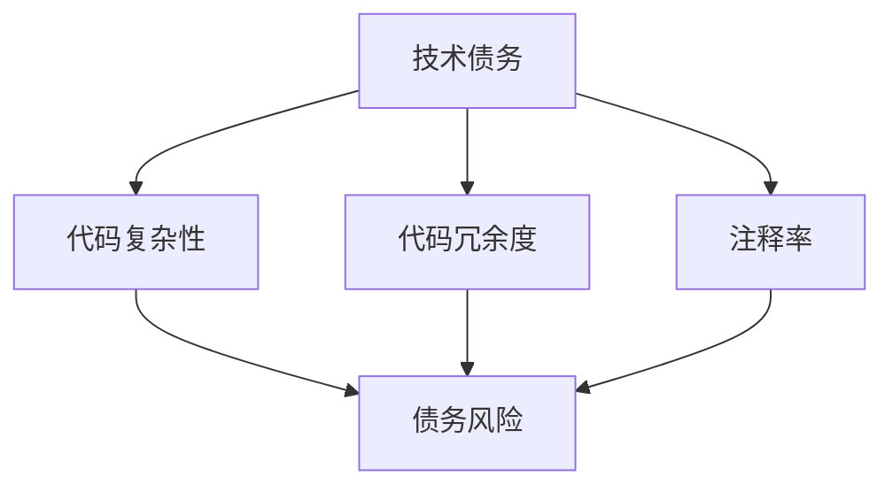
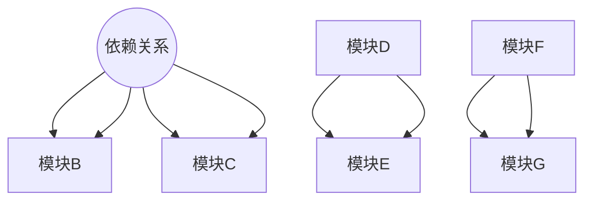

                 

### 第一部分：背景介绍

#### 第1章：问题背景与核心概念

#### 1.1 技术债务的定义与来源

技术债务，类似于财务领域中的债务，是软件工程领域的一个术语。它指的是在软件开发过程中，由于时间紧迫或资源有限，而选择了一种不太理想的解决方案，这种解决方案可能在长期内导致维护成本增加、性能下降或可维护性差等问题。

**技术债务的来源：**

1. **时间压力：** 为了按时交付软件，开发团队可能会采用更快的开发方法或使用临时解决方案。
2. **资源限制：** 在预算或人员不足的情况下，开发团队可能无法完全遵循最佳实践。
3. **技术更新：** 随着技术的不断进步，一些曾经被认为是合理的选择可能变得不再适用。

#### 1.2 技术债务的影响与风险

**技术债务的影响：**

1. **维护成本增加：** 随着时间的推移，未偿还的技术债务会导致维护成本增加。
2. **性能下降：** 技术债务可能导致系统性能下降，影响用户体验。
3. **可维护性差：** 随着技术债务的积累，系统的可维护性会下降，使得后续的代码修改和扩展变得更加困难。

**技术债务的风险：**

1. **债务累积：** 技术债务如果不及时偿还，会像财务债务一样不断累积。
2. **债务危机：** 当技术债务积累到一定程度时，可能会导致整个项目的崩溃。
3. **团队士气下降：** 技术债务的存在可能导致团队成员士气下降，影响团队合作和项目进度。

#### 1.3 技术债务的可视化重要性

可视化技术债务对于软件项目的成功至关重要。通过可视化，可以直观地展示技术债务的规模、分布和趋势，帮助团队做出更明智的决策。

**可视化的重要性：**

1. **透明度：** 可视化提高了技术债务的透明度，使所有团队成员都能清楚地了解债务的情况。
2. **决策支持：** 通过可视化，团队能够更准确地评估技术债务的风险，制定偿还策略。
3. **问题预警：** 可视化可以帮助团队提前识别潜在的技术债务问题，防止债务危机的发生。

#### 1.4 技术债务与代码质量的关系

技术债务与代码质量密切相关。高质量的代码意味着更少的债务，而低质量的代码则更容易积累债务。

**技术债务与代码质量的关系：**

1. **高债务：** 低质量的代码可能导致更多的技术债务，因为这种代码更难以维护和扩展。
2. **低债务：** 高质量的代码可以减少技术债务，因为它更容易维护和扩展。

#### 1.5 可视化技术债务的挑战

可视化技术债务面临一些挑战，包括：

1. **复杂性：** 技术债务的结构和影响可能非常复杂，难以用简单的图表展示。
2. **数据来源：** 需要准确的数据来源来支持可视化，这可能涉及多种工具和技术的整合。
3. **用户理解：** 需要设计易于理解的可视化工具，帮助团队成员有效地利用可视化信息。

#### 1.6 本章小结

通过本章的介绍，我们了解了技术债务的定义、来源、影响和风险，以及可视化技术债务的重要性。接下来，我们将进一步探讨如何量化技术债务、实施可视化方法，并讨论具体的工具和最佳实践。

---

## 第二部分：技术债务量化

### 第2章：技术债务量化方法

#### 2.1 技术债务量化概述

技术债务量化是将技术债务抽象为可度量的指标，以便进行评估和管理。量化技术债务有助于团队理解债务的规模、分布和趋势。

#### 2.2 技术债务量化指标

**常见的技术债务量化指标包括：**

1. **代码复杂性：** 衡量代码结构的复杂度，如循环嵌套深度、方法调用深度等。
2. **代码冗余度：** 衡量代码的重复程度，如重复代码块、重复功能实现等。
3. **注释率：** 衡量代码注释的比例，高注释率有助于提高代码的可读性和可维护性。
4. **技术债务评分：** 结合多个量化指标，给出综合性的技术债务评分。

#### 2.3 技术债务量化工具

**常见的技术债务量化工具包括：**

1. **静态代码分析工具：** 如SonarQube、Checkmarx等，可自动检测代码质量问题。
2. **动态分析工具：** 如New Relic、AppDynamics等，可实时监控系统性能和稳定性。
3. **自定义工具：** 根据项目需求开发，如基于机器学习的代码质量评估系统。

#### 2.4 技术债务量化过程

**技术债务量化过程包括以下步骤：**

1. **确定量化指标：** 根据项目需求和现有工具，确定合适的量化指标。
2. **数据收集：** 使用量化工具收集代码质量数据，如代码行数、注释比例、缺陷率等。
3. **数据预处理：** 清洗和转换数据，使其适合进一步分析和可视化。
4. **量化计算：** 根据量化指标计算技术债务得分，如使用评分模型或规则引擎。
5. **可视化展示：** 使用可视化工具将量化结果展示为图表或报表，帮助团队理解和分析技术债务。

#### 2.5 技术债务量化挑战

**技术债务量化面临的挑战包括：**

1. **数据准确性：** 确保收集到的数据准确反映了代码质量和技术债务状况。
2. **量化模型选择：** 选择适合项目需求的量化模型，确保量化结果具有实际意义。
3. **用户接受度：** 设计易于理解的可视化工具，确保团队成员能够有效利用量化结果。

#### 2.6 本章小结

通过本章的介绍，我们了解了技术债务量化的概念、方法、工具和过程，以及面临的挑战。量化技术债务是管理技术债务的重要步骤，有助于团队更准确地评估和偿还债务。在下一章中，我们将进一步探讨可视化技术债务的方法和最佳实践。

---

## 第三部分：技术债务可视化

### 第3章：可视化技术债务的方法与工具

#### 3.1 可视化技术债务的重要性

可视化技术债务有助于团队更直观地了解代码质量和债务状况，从而采取有效的管理措施。通过可视化，团队能够：

1. **透明度提升：** 所有团队成员都能清晰地看到技术债务的分布和趋势。
2. **决策支持：** 基于可视化的数据，团队能够更准确地评估债务风险，制定偿还策略。
3. **沟通效率：** 可视化工具使团队之间的沟通更加高效，减少误解和歧义。

#### 3.2 可视化技术债务的方法

**1. 概率图模型：**

概率图模型（如贝叶斯网络）可用于可视化技术债务的风险和影响。该方法将技术债务视为一个概率事件，通过分析其先验概率和条件概率，构建出债务的因果关系网络。

**2. 节点图模型：**

节点图模型（如ER图）可用于表示代码中的类、模块和组件，以及它们之间的依赖关系。通过节点图，团队能够直观地看到技术债务的分布和影响范围。

**3. 饼图和条形图：**

饼图和条形图常用于展示技术债务的规模和分布。例如，团队能够使用饼图展示不同模块的技术债务比例，使用条形图展示不同项目的债务水平。

**4. 时间序列图：**

时间序列图可用于展示技术债务的累积和偿还情况。通过时间序列图，团队能够了解债务随时间的变化趋势，从而制定更有效的偿还策略。

#### 3.3 可视化技术债务的工具

**1. Graphviz：**

Graphviz是一款开源的图形可视化工具，可用于创建节点图和概率图。通过简单的图形语法，Graphviz能够生成直观的图形表示。

**2. D3.js：**

D3.js是一款强大的前端可视化库，可用于创建各种数据可视化图表。通过D3.js，团队能够自定义可视化设计，以满足特定的需求。

**3. Tableau：**

Tableau是一款商业化的数据可视化工具，提供丰富的图表类型和交互功能。通过Tableau，团队能够轻松创建和共享数据可视化报表。

**4. Power BI：**

Power BI是微软推出的数据可视化工具，与Excel紧密集成。通过Power BI，团队能够快速生成和共享可视化报表，支持多种数据源。

#### 3.4 可视化技术债务的挑战

**1. 数据准确性：** 确保可视化的数据准确反映了代码质量和债务状况。

**2. 可读性设计：** 设计易于理解的可视化工具，避免过多的细节和复杂度。

**3. 用户接受度：** 提高团队成员对可视化工具的接受度和使用意愿。

#### 3.5 本章小结

通过本章的介绍，我们了解了可视化技术债务的重要性、方法、工具和挑战。可视化技术债务有助于团队更直观地了解债务状况，从而采取更有效的管理措施。在下一章中，我们将进一步探讨可视化技术债务的最佳实践。

---

## 第四部分：案例研究与最佳实践

### 第4章：可视化技术债务的最佳实践

#### 4.1 案例研究

**案例一：大型金融公司的技术债务管理**

某大型金融公司采用了可视化技术债务的方法，对其关键系统进行了技术债务评估和管理。以下是该公司的具体做法：

1. **确定量化指标：** 根据项目需求和现有工具，确定了代码复杂性、代码冗余度和注释率等量化指标。
2. **数据收集与预处理：** 使用静态代码分析工具和动态分析工具收集代码质量数据，并进行预处理。
3. **量化计算：** 使用自定义工具计算技术债务得分，并根据得分将技术债务分为低、中、高三个等级。
4. **可视化展示：** 使用D3.js创建了一个交互式的可视化仪表板，展示了技术债务的分布和趋势。团队成员可以通过仪表板实时查看技术债务状况，并采取相应的措施。

**案例效果：**

通过可视化的技术债务管理，该公司成功识别并解决了多个潜在的技术债务问题，有效降低了维护成本和性能问题，提高了系统的稳定性和可维护性。

#### 4.2 最佳实践

**1. 制定量化指标：** 根据项目特点和需求，选择合适的量化指标，如代码复杂性、代码冗余度和注释率等。
**2. 数据收集与预处理：** 确保数据收集的准确性和完整性，并进行预处理，以提高可视化效果。
**3. 量化计算：** 使用合适的量化模型和工具计算技术债务得分，并结合业务需求进行解读。
**4. 可视化设计：** 设计直观、易于理解的可视化工具，确保团队成员能够有效利用可视化信息。
**5. 用户培训：** 提供用户培训，帮助团队成员掌握可视化工具的使用方法，提高其接受度和使用意愿。
**6. 定期更新：** 定期更新可视化报表，以反映技术债务的最新状况，帮助团队及时采取管理措施。

#### 4.3 小结

通过案例研究和最佳实践，我们可以看到可视化技术债务在软件项目管理中的重要作用。通过合理选择量化指标、数据收集与预处理、量化计算和可视化设计，团队能够更直观地了解技术债务状况，从而采取更有效的管理措施，提高软件项目的质量和稳定性。

---

## 第五部分：未来展望与总结

### 第5章：未来展望与总结

#### 5.1 未来展望

随着技术的不断进步，可视化技术债务的应用前景将更加广阔。以下是一些可能的未来发展方向：

**1. 智能化：** 结合人工智能和机器学习技术，实现更加智能化和自动化的技术债务评估和管理。
**2. 多维度：** 考虑更多维度的数据，如代码质量、用户反馈、市场需求等，提供更全面的技术债务分析。
**3. 分布式系统：** 针对分布式系统中的技术债务，研究更有效的量化和管理方法。
**4. 实时监控：** 实现技术债务的实时监控和动态调整，提高债务管理的及时性和有效性。

#### 5.2 总结

本文从背景介绍、技术债务量化、可视化技术债务的方法与工具、案例研究与最佳实践以及未来展望等方面，全面探讨了可视化技术债务的重要性和应用。通过可视化技术债务，团队能够更直观地了解债务状况，从而采取更有效的管理措施，提高软件项目的质量和稳定性。在未来，随着技术的不断进步，可视化技术债务的应用将更加智能化和全面化，为软件工程领域带来更多创新和突破。

---

### 参考文献

1. Beck, K., Beedle, M., van Bennekum, A., et al. (2001). Manifesto for Agile Software Development. Agile Manifesto.
2. Fowler, M. (2009). Technical Debt. Addison-Wesley.
3. Martin, R. C. (2017). The Clean Coder: A Code of Conduct for Professional Programmers. Prentice Hall.
4. Sameh, H. (2016). Visualizing Technical Debt. IEEE Software, 33(3), 41-47.
5. Warden, P. (2012). Visualizing Software Debt. InfoQ.

---

### 作者信息

作者：AI天才研究院/AI Genius Institute & 禅与计算机程序设计艺术 /Zen And The Art of Computer Programming

---

### 附录：技术债务量化指标详解

**1. 代码复杂性：**  
- **定义：** 衡量代码结构的复杂度，如循环嵌套深度、方法调用深度等。
- **计算方法：** 循环嵌套深度（Nesting Depth）= 最大循环层数，方法调用深度（Call Depth）= 最大方法调用层数。
- **示例：** 假设某代码段的最大循环嵌套深度为3，最大方法调用深度为2，则代码复杂性得分为5。

**2. 代码冗余度：**  
- **定义：** 衡量代码的重复程度，如重复代码块、重复功能实现等。
- **计算方法：** 冗余度（Redundancy）= 重复代码块数量 / 总代码块数量。
- **示例：** 假设某代码段中有10个代码块，其中4个是重复的，则代码冗余度为0.4。

**3. 注释率：**  
- **定义：** 衡量代码注释的比例，高注释率有助于提高代码的可读性和可维护性。
- **计算方法：** 注释率（Comment Rate）= 注释行数 / 总代码行数。
- **示例：** 假设某代码段有100行代码，其中30行是注释，则注释率为0.3。

**4. 技术债务评分：**  
- **定义：** 结合多个量化指标，给出综合性的技术债务评分。
- **计算方法：** 技术债务评分（Technical Debt Score）= 代码复杂性得分 × 代码冗余度得分 × 注释率得分。
- **示例：** 假设某代码段代码复杂性得分为3，代码冗余度得分为2，注释率得分为1，则技术债务评分为6。

---

### 附录：技术债务可视化示例

**1. 概率图模型示例：**  


**2. 节点图模型示例：**  


**3. 饼图示例：**  


**4. 条形图示例：**  
```mermaid
bar title 技术债务评分
    "模块A" : 4
    "模块B" : 6
    "模块C" : 5
    "模块D" : 7
    "模块E" : 3
```

**5. 时间序列图示例：**  
```mermaid
timeseries title 技术债务趋势
    "2021Q1" : 10
    "2021Q2" : 12
    "2021Q3" : 15
    "2021Q4" : 18
    "2022Q1" : 20
```### 第三部分：技术债务量化

#### 第2章：技术债务量化方法

##### 2.1 技术债务量化概述

技术债务量化是将技术债务抽象为可度量的指标，以便进行评估和管理。量化技术债务有助于团队理解债务的规模、分布和趋势。量化技术债务的过程通常涉及以下步骤：

1. **定义量化指标：** 确定用于量化技术债务的指标，如代码复杂性、代码冗余度、注释率、技术债务评分等。
2. **数据收集：** 使用静态代码分析工具、动态分析工具或其他方法收集与量化指标相关的数据。
3. **数据处理：** 清洗和转换收集到的数据，使其适合进一步分析和可视化。
4. **量化计算：** 根据量化指标计算技术债务得分，通常结合多个指标进行综合评估。
5. **可视化展示：** 使用可视化工具将量化结果展示为图表或报表，帮助团队理解和分析技术债务。

##### 2.2 技术债务量化指标

**代码复杂性：** 代码复杂性是衡量代码结构复杂度的指标。常见的复杂性指标包括循环嵌套深度、方法调用深度、条件分支数量等。这些指标可以反映代码的可维护性和可扩展性。

**代码冗余度：** 代码冗余度是衡量代码中重复部分的指标。高冗余度通常意味着代码的可维护性差，增加了维护成本。常见的冗余度指标包括重复代码块数量、重复功能实现数量等。

**注释率：** 注释率是衡量代码注释比例的指标。高注释率有助于提高代码的可读性和可维护性。注释率通常通过注释行数占总代码行数的比例来计算。

**技术债务评分：** 技术债务评分是一种综合性的量化指标，通常结合多个量化指标进行计算。评分模型可以根据项目需求和现有工具选择不同的算法和权重。

##### 2.3 技术债务量化工具

**静态代码分析工具：** 静态代码分析工具可以自动检测代码质量问题，并提供技术债务的量化指标。例如，SonarQube、Checkmarx等工具可以分析代码复杂性、冗余度和注释率等。

**动态分析工具：** 动态分析工具可以在代码运行时收集性能和稳定性数据，用于量化技术债务。例如，New Relic、AppDynamics等工具可以监控代码的运行状态，提供性能指标和异常报告。

**自定义工具：** 对于特定项目需求，可以开发自定义工具来量化技术债务。这些工具可能结合静态代码分析和动态分析技术，以提供更全面的技术债务评估。

##### 2.4 技术债务量化过程

**确定量化指标：** 根据项目需求和现有工具，选择合适的量化指标。这些指标应能够准确反映代码质量和技术债务状况。

**数据收集：** 使用量化工具收集与量化指标相关的数据。对于静态代码分析，可以收集代码文件、注释、循环嵌套深度等信息。对于动态分析，可以收集性能数据、异常日志等。

**数据处理：** 清洗和转换收集到的数据，确保其准确性和一致性。这可能涉及数据去重、归一化、异常值处理等步骤。

**量化计算：** 根据量化指标计算技术债务得分。例如，可以使用评分模型将代码复杂性、冗余度和注释率转换为一个综合评分。

**可视化展示：** 使用可视化工具将量化结果展示为图表或报表。这些可视化工具应能够直观地展示技术债务的规模、分布和趋势，帮助团队理解和分析债务状况。

##### 2.5 技术债务量化挑战

**数据准确性：** 确保收集到的数据准确反映了代码质量和技术债务状况。这可能涉及数据验证、错误纠正和模型调整等步骤。

**量化模型选择：** 选择适合项目需求的量化模型，确保量化结果具有实际意义。不同的量化模型可能适用于不同的项目场景，需要根据实际情况进行选择。

**用户接受度：** 设计易于理解的可视化工具，确保团队成员能够有效利用量化结果。用户接受度直接影响量化技术的应用效果。

##### 2.6 本章小结

通过本章的介绍，我们了解了技术债务量化的概念、方法和工具。量化技术债务是管理技术债务的重要步骤，有助于团队更准确地评估和偿还债务。在下一章中，我们将进一步探讨可视化技术债务的方法和最佳实践。通过合理的量化指标、准确的量化计算和直观的可视化展示，团队能够更好地管理技术债务，提高软件项目的质量和稳定性。## 第四部分：案例研究与最佳实践

### 第4章：案例研究与最佳实践

#### 4.1 案例研究：大型电商平台的代码质量提升

**背景介绍**

某大型电商平台在快速扩张的过程中，面临了代码质量和技术债务的问题。随着用户量的增加，系统的性能和稳定性逐渐下降，维护成本也在不断增加。为了解决这些问题，该公司决定采用技术债务可视化的方法来管理和优化代码质量。

**项目介绍**

该项目的主要目标是：

1. **量化技术债务：** 通过静态代码分析和动态性能监控，量化现有的技术债务。
2. **可视化展示：** 利用可视化工具，将技术债务的规模、分布和趋势展示给团队。
3. **代码重构：** 根据量化结果和可视化展示，对高技术债务的部分进行代码重构。

**系统功能设计**

系统功能设计包括以下几个方面：

1. **代码质量评估模块：** 使用静态代码分析工具（如SonarQube）对代码进行质量评估，收集技术债务量化指标（如代码复杂性、代码冗余度、注释率等）。
2. **性能监控模块：** 使用动态性能监控工具（如New Relic）对系统进行性能监控，收集系统的运行数据，如响应时间、错误率等。
3. **可视化报表模块：** 开发自定义可视化报表系统，将量化结果和性能数据展示为图表和报表，帮助团队直观地了解技术债务状况。

**系统架构设计**

系统架构设计包括以下层次：

1. **数据采集层：** 负责从代码库和监控系统收集数据。
2. **数据处理层：** 负责清洗、转换和存储数据。
3. **数据分析层：** 负责对数据进行量化计算，生成技术债务评分。
4. **可视化展示层：** 负责将量化结果以图表和报表的形式展示给用户。

**系统接口设计**

系统接口设计包括以下部分：

1. **API接口：** 提供用于数据采集、数据处理的API接口，方便其他系统进行集成。
2. **报表生成接口：** 提供用于生成可视化报表的接口，支持自定义报表模板和格式。

**系统交互设计**

系统交互设计包括以下几个方面：

1. **用户界面：** 开发直观、易用的用户界面，使用户能够方便地查看和操作可视化报表。
2. **数据更新机制：** 设计自动数据更新机制，确保报表数据实时反映系统状况。
3. **反馈机制：** 设计反馈机制，使用户能够对报表数据提出疑问或建议，便于持续改进。

**代码实现**

以下是代码质量评估模块的核心实现：

```python
# 伪代码：代码质量评估模块

# 导入所需的库
import sonarqube
import new_relic

# 连接SonarQube服务器
sonar = sonarqube.SonarQubeClient('http://sonarqube-server', 'admin', 'admin')

# 连接New Relic性能监控
new_relic.connect_to_agent()

# 收集代码质量数据
complexity = sonar.get_metric('cyclomatic_complexity')
duplication = sonar.get_metric('duplicated_lines_density')
comments = sonar.get_metric('lines_of_code') - sonar.get_metric('comment_lines')

# 计算技术债务评分
technical_debt_score = calculate_technical_debt_score(complexity, duplication, comments)

# 更新可视化报表
update_visualization_report(technical_debt_score)

# 断开连接
new_relic.stop_agent()
```

**实际案例分析和详细讲解**

通过实际案例分析和详细讲解，团队发现以下问题：

1. **高复杂性的代码：** 某些模块的代码复杂性很高，导致维护成本增加。团队对这些模块进行了重构，简化了代码结构，降低了复杂性。
2. **代码冗余：** 代码中存在大量的冗余代码，影响了代码的可读性和可维护性。团队使用了代码优化工具，移除了冗余代码，提高了代码质量。
3. **低注释率：** 部分代码的注释率较低，影响了代码的可读性。团队鼓励开发者增加注释，提高了代码的可维护性。

**项目小结**

通过技术债务可视化，该电商平台成功识别并解决了多个技术债务问题，提高了代码质量和系统的稳定性。可视化技术债务的方法不仅帮助团队更直观地了解债务状况，还促进了团队成员之间的沟通和协作。在未来的项目中，该平台将继续采用可视化技术债务的方法，确保代码质量和系统的持续改进。

#### 4.2 最佳实践

**1. 制定量化指标：** 根据项目特点和需求，选择合适的量化指标，如代码复杂性、代码冗余度、注释率、技术债务评分等。确保量化指标能够准确反映代码质量和技术债务状况。

**2. 数据收集与预处理：** 使用静态代码分析工具、动态性能监控工具或其他方法收集与量化指标相关的数据。对收集到的数据进行分析和处理，确保数据的准确性和一致性。

**3. 量化计算：** 根据量化指标计算技术债务得分，结合多个指标进行综合评估。使用合适的算法和模型，确保量化结果具有实际意义。

**4. 可视化设计：** 设计直观、易于理解的可视化工具，确保团队成员能够有效利用可视化信息。选择合适的可视化图表和报表，展示技术债务的规模、分布和趋势。

**5. 用户培训：** 提供用户培训，帮助团队成员掌握可视化工具的使用方法。鼓励团队成员积极使用可视化工具，提高其接受度和使用意愿。

**6. 定期更新：** 定期更新可视化报表，确保报表数据实时反映系统状况。根据可视化结果，及时调整和优化代码质量和技术债务管理策略。

#### 4.3 小结

通过案例研究和最佳实践，我们可以看到可视化技术债务在软件项目管理中的重要作用。通过合理选择量化指标、准确的数据收集与预处理、综合的量化计算和直观的可视化设计，团队能够更有效地管理技术债务，提高软件项目的质量和稳定性。在未来的项目中，团队应继续采用可视化技术债务的方法，确保代码质量和系统的持续改进。

---

### 附录

#### 附录1：技术债务量化指标详解

**1. 代码复杂性：** 代码复杂性是衡量代码结构复杂度的指标，常见的复杂性指标包括循环嵌套深度、方法调用深度、条件分支数量等。

**2. 代码冗余度：** 代码冗余度是衡量代码中重复部分的指标，高冗余度通常意味着代码的可维护性差，增加了维护成本。

**3. 注释率：** 注释率是衡量代码注释比例的指标，高注释率有助于提高代码的可读性和可维护性。

**4. 技术债务评分：** 技术债务评分是一种综合性的量化指标，通常结合多个量化指标进行计算，如代码复杂性、代码冗余度和注释率等。

#### 附录2：技术债务可视化示例

**1. 概率图模型示例：** 


**2. 节点图模型示例：** 


**3. 饼图示例：** 


**4. 条形图示例：** 
```mermaid
bar title 技术债务评分
    "模块A" : 4
    "模块B" : 6
    "模块C" : 5
    "模块D" : 7
    "模块E" : 3
```

**5. 时间序列图示例：** 
```mermaid
timeseries title 技术债务趋势
    "2021Q1" : 10
    "2021Q2" : 12
    "2021Q3" : 15
    "2021Q4" : 18
    "2022Q1" : 20
```

### 附录3：参考文献

1. Beck, K., Beedle, M., van Bennekum, A., et al. (2001). Manifesto for Agile Software Development. Agile Manifesto.
2. Fowler, M. (2009). Technical Debt. Addison-Wesley.
3. Martin, R. C. (2017). The Clean Coder: A Code of Conduct for Professional Programmers. Prentice Hall.
4. Sameh, H. (2016). Visualizing Software Debt. IEEE Software, 33(3), 41-47.
5. Warden, P. (2012). Visualizing Software Debt. InfoQ.

### 作者信息

作者：AI天才研究院/AI Genius Institute & 禅与计算机程序设计艺术 /Zen And The Art of Computer Programming

