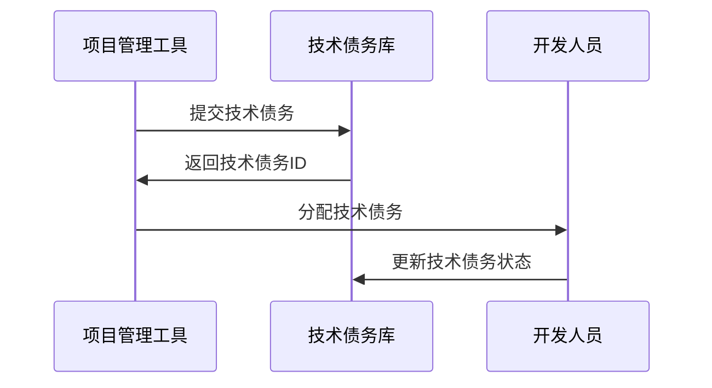
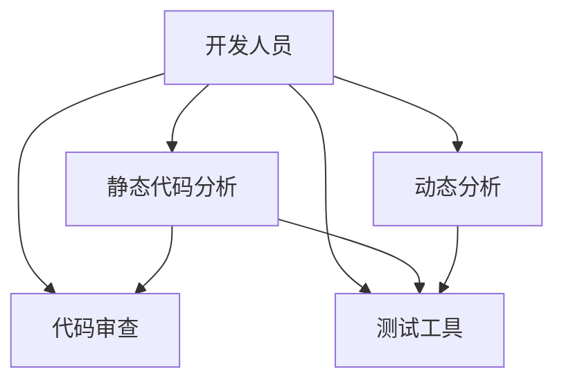
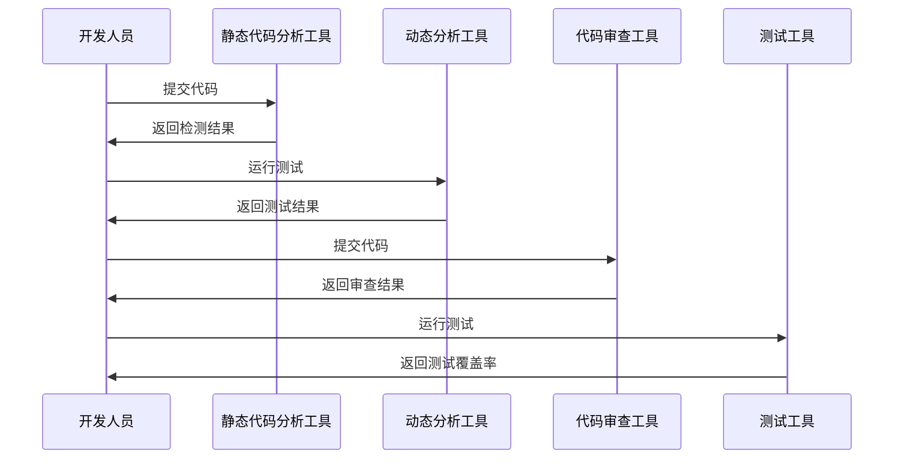
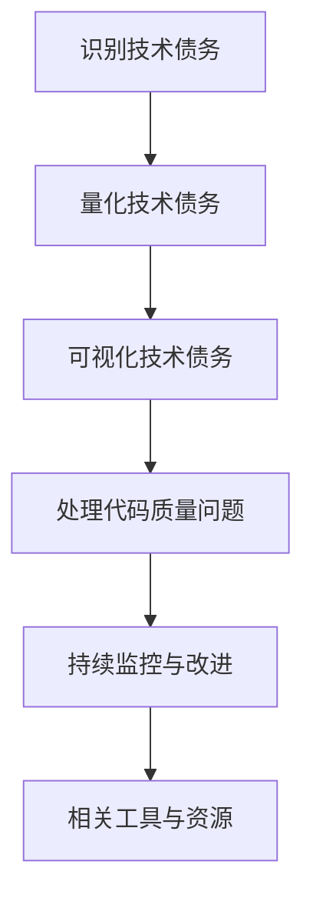

                 

### 技术债务：概念与类型

#### 背景介绍

在软件开发中，技术债务（Technical Debt）是一种比喻，用来描述项目开发过程中因追求短期目标而牺牲长期维护和扩展性的决策。技术债务的概念起源于金融领域，用于描述因延迟偿还债务而积累的利息。在软件开发中，技术债务则是指为了快速推进项目而采取的牺牲代码质量、设计、测试等长期维护成本的决策。

技术债务的来源多种多样，主要包括以下几种：

1. **时间压力**：为了在紧迫的截止日期前完成项目，开发团队可能会牺牲代码质量，采取快速但不稳定的解决方案。
2. **资源限制**：在资源有限的情况下，如人力、资金或设备不足，项目团队可能无法投入足够的资源来编写高质量的代码。
3. **技术选择**：有时，由于市场趋势或技术限制，项目团队可能采用不够成熟或不够稳定的技术方案，这些方案可能在未来引发技术债务。
4. **沟通不足**：团队成员之间的沟通不畅可能导致设计决策不一致，从而产生难以维护的代码。

技术债务的类型可以从不同角度进行分类，常见的包括以下几种：

1. **设计债务**：指的是在软件架构和设计上做出的妥协，导致系统难以扩展和维护。
2. **测试债务**：指的是未编写或未充分编写的测试代码，可能在未来导致更多的缺陷和bug。
3. **代码质量债务**：指的是编写不规范的代码、过度依赖全局变量、不合适的编程模式等，这些都会降低代码的可读性和可维护性。
4. **技术债务的利息**：指的是因技术债务而产生的额外成本，包括修复bug、更新依赖库、迁移到新平台等。

#### 核心概念与联系

**技术债务**（Technical Debt）是一个核心概念，它是软件维护性的度量。它与**设计债务**（Design Debt）和**代码质量债务**（Code Quality Debt）密切相关。**设计债务**涉及系统架构和设计层面的质量，而**代码质量债务**则集中在代码本身的质量上。设计债务和代码质量债务共同构成了技术债务的总体水平。

**ER实体关系图架构**（Entity-Relationship Diagram, ERD）可以帮助我们理解技术债务的组成要素。在ER图中，**技术债务**是一个实体，它与**设计债务**和**代码质量债务**是两个关联实体，通过**类型**（Type）和**来源**（Source）两个属性进行连接。

```mermaid
erDiagram
  技术债务 ||--|{ 设计债务 : Type }
  技术债务 ||--|{ 代码质量债务 : Type }
  设计债务 ||--|{ 来源 : Source }
  代码质量债务 ||--|{ 来源 : Source }
```

**属性特征对比表格**：

| 特征                | 技术债务          | 设计债务          | 代码质量债务          |
|---------------------|-------------------|-------------------|----------------------|
| **定义**            | 软件维护性的度量  | 系统架构和设计质量 | 代码本身的质量       |
| **类型**            | 设计、测试、代码  | 设计              | 编码规范、测试覆盖率  |
| **来源**            | 时间压力、资源限制 | 沟通不畅          | 编码习惯、工具选择   |
| **影响**            | 项目延期、成本增加 | 系统扩展性下降     | bug增加、维护成本上升 |

#### 算法原理讲解

**技术债务量化模型**：

技术债务量化模型用于将技术债务以数字化的形式进行量化，以便于管理和优化。以下是一个简单的量化模型：

1. **确定技术债务类型**：根据技术债务的来源和影响，将技术债务分为多个类型，例如：设计债务、测试债务、代码质量债务等。
2. **确定技术债务价值**：对每种类型的技术债务进行评估，确定其价值。价值可以通过评估技术债务对项目进度、成本和风险的影响来确定。
3. **构建量化模型**：根据技术债务类型和价值，构建量化模型。量化模型可以是一个简单的线性模型，也可以是一个复杂的非线性模型。

**量化技术债务的数学公式**：

$$
D = \sum_{i=1}^{n} W_i \cdot V_i
$$

其中，$D$ 表示技术债务总量，$W_i$ 表示第 $i$ 种技术债务类型的权重，$V_i$ 表示第 $i$ 种技术债务的价值。

**可视化技术债务**：

可视化技术债务是指使用图表、图形等可视化手段，将技术债务以直观的形式展示出来。以下是一个简单的可视化技术债务方法：

1. **选择可视化工具**：根据技术债务的类型和特点，选择合适的可视化工具。例如，可以使用条形图、饼图、折线图等。
2. **构建可视化图表**：根据技术债务量化模型，构建可视化图表。图表应包含技术债务类型、价值、影响等信息。
3. **展示可视化结果**：在项目管理工具或开发环境中，展示可视化技术债务结果，以便于团队成员查看和管理。

**代码质量问题可视化**：

代码质量问题可视化是指使用可视化手段，将代码质量问题的检测结果以直观的形式展示出来。以下是一个简单的代码质量问题可视化方法：

1. **选择可视化工具**：根据代码质量问题的类型和特点，选择合适的可视化工具。例如，可以使用条形图、饼图、折线图等。
2. **构建可视化图表**：根据代码质量问题的检测结果，构建可视化图表。图表应包含问题类型、影响范围、修复进度等信息。
3. **展示可视化结果**：在项目管理工具或开发环境中，展示可视化代码质量问题结果，以便于团队成员查看和处理。

#### 数学公式使用

$$
1 + 1 = 2
$$

$$
x > y
$$

#### 系统分析与架构设计方案

**问题场景介绍**：

在大型软件开发项目中，技术债务管理是一个至关重要的环节。随着项目规模的扩大和时间的推移，技术债务的累积可能导致系统维护成本增加、项目延期甚至失败。因此，需要一个系统化的方法来识别、量化和管理技术债务，以便在项目早期阶段采取适当的措施。

**项目介绍**：

本项目旨在开发一款大型企业级应用，项目周期为两年，涉及多个团队和数百名开发人员。为了确保项目顺利进行，需要建立一套完整的技术债务管理体系，包括债务识别、量化、可视化和优化。

**系统功能设计（领域模型类图）**：

```mermaid
classDiagram
  类::技术债务
  类::设计债务
  类::代码质量债务
  类::测试债务
  技术债务 "有" --|{设计债务}
  技术债务 "有" --|{代码质量债务}
  技术债务 "有" --|{测试债务}
```

**系统架构设计（架构图）**：

```mermaid
graph TB
  测试债务[测试债务]
  设计债务[设计债务]
  代码质量债务[代码质量债务]
  技术债务库[技术债务库]
  项目管理系统[项目管理工具]
  技术债务库 -- 测试债务
  技术债务库 -- 设计债务
  技术债务库 -- 代码质量债务
  项目管理系统 -- 技术债务库
```

**系统接口设计和系统交互（序列图）**：



#### 项目实战

**环境安装**：

1. 安装Python环境，版本3.8以上。
2. 安装相关依赖，如Django、D3.js等。

```shell
pip install django
pip install d3js
```

**系统核心实现源代码**：

```python
# 技术债务量化模块
class TechnicalDebt:
    def __init__(self):
        self.debt_list = []

    def add_debt(self, debt_type, value):
        self.debt_list.append({'type': debt_type, 'value': value})

    def calculate_total_debt(self):
        total = 0
        for debt in self.debt_list:
            total += debt['value']
        return total

# 技术债务可视化模块
import d3js

def visualize_debt(debt_obj):
    debt_data = debt_obj.debt_list
    d3js.chart.bar_chart(debt_data, 'Debt Visualization')

# 主程序
if __name__ == '__main__':
    debt_manager = TechnicalDebt()
    debt_manager.add_debt('Design Debt', 10)
    debt_manager.add_debt('Code Quality Debt', 20)
    visualize_debt(debt_manager)
```

**代码应用解读与分析**：

1. **技术债务量化**：通过定义`TechnicalDebt`类，实现技术债务的添加和总量计算功能。
2. **可视化**：使用D3.js库实现技术债务的可视化，通过条形图展示债务类型和值。

**实际案例分析和详细讲解剖析**：

假设一个团队在项目开发过程中发现了三种技术债务：设计债务10分、代码质量债务20分和测试债务30分。通过`TechnicalDebt`类和D3.js库，可以将这些债务量化并可视化，帮助团队成员直观了解当前项目的技术债务情况。

**项目小结**：

本项目通过Python实现了一个简单但功能齐全的技术债务量化和管理系统，能够帮助开发团队识别和管理技术债务。在实际项目中，可以通过扩展和优化这个系统，实现更高级的功能，如自动识别债务、动态更新债务状态等。

#### 最佳实践 tips

1. **定期审查技术债务**：定期审查技术债务，确保债务水平处于可控范围。
2. **优先处理高价值债务**：优先处理对项目影响较大的技术债务，降低风险。
3. **使用自动化工具**：利用自动化工具进行代码质量检测和债务量化，提高效率。

#### 小结

本文介绍了技术债务的概念、类型、量化方法和可视化技术，并通过一个实际案例展示了如何使用Python和D3.js库实现技术债务的管理和可视化。通过合理管理技术债务，可以提高项目质量和开发效率，从而确保项目成功。

#### 注意事项

1. **明确债务类型**：在量化技术债务时，要明确每种债务的类型，以便进行准确的评估。
2. **持续监控**：技术债务不是一成不变的，要持续监控和更新债务情况。

#### 拓展阅读

1. 《敏捷软件开发：原则、实践与模式》
2. 《代码大全》
3. 《软件工程：实践者的研究方法》

#### 作者信息

作者：AI天才研究院/AI Genius Institute & 禅与计算机程序设计艺术 /Zen And The Art of Computer Programming

----------------------------------------------------------------

## 技术债务的影响与风险

#### 背景介绍

技术债务在软件开发过程中不可避免，但其影响和风险同样不容忽视。技术债务的影响与风险涉及到多个层面，从项目进度、成本到团队协作，都对项目的成功与否产生深远的影响。因此，理解技术债务的影响与风险，采取有效的管理和优化措施，是确保项目顺利进行的关键。

#### 问题背景

随着软件项目的复杂度和规模不断扩大，技术债务的累积速度也在加快。技术债务的存在可能会带来以下问题：

- **项目延期**：由于技术债务的存在，项目团队在后续的迭代中需要花费更多的时间和精力来修复和优化现有的代码，导致项目延期。
- **成本增加**：技术债务的积累会导致维护成本增加，因为修复技术债务往往需要额外的资源投入。
- **质量下降**：技术债务的存在会降低软件的质量，增加bug的数量，影响用户体验。
- **团队协作问题**：技术债务可能导致团队协作困难，因为债务使得代码结构复杂，难以理解和修改。

#### 问题描述

技术债务的影响和风险可以从以下几个方面进行描述：

- **项目进度**：技术债务会导致项目进度延误，因为修复技术债务往往需要额外的时间。
- **成本**：技术债务的积累会增加项目的维护成本，特别是在债务不断累积的情况下。
- **质量**：技术债务会降低软件的整体质量，因为债务往往伴随着代码质量不佳的问题。
- **团队协作**：技术债务的存在可能导致团队协作困难，因为债务使得代码结构复杂，难以修改和维护。

#### 问题解决

解决技术债务问题需要采取一系列措施，包括：

- **早期识别**：在项目早期阶段就识别和量化技术债务，以便及时采取措施。
- **定期审查**：定期审查技术债务，确保债务水平处于可控范围。
- **优先处理高价值债务**：优先处理对项目影响较大的技术债务，降低风险。
- **改进代码质量**：采取代码质量优化措施，减少未来产生技术债务的可能性。
- **团队协作**：加强团队之间的沟通和协作，确保技术债务管理措施得到有效执行。

#### 边界与外延

技术债务的影响和风险不仅局限于项目内部，还可能扩展到项目外部：

- **客户满意度**：技术债务的存在可能会影响客户的满意度，因为软件质量下降、bug增多。
- **市场竞争**：在竞争激烈的市场中，技术债务可能导致项目失去竞争力。
- **法规遵从**：某些行业和领域需要遵守严格的法规和标准，技术债务可能影响法规遵从性。

#### 概念结构与核心要素组成

技术债务的影响和风险可以从以下核心要素进行分析：

- **项目进度**：技术债务对项目进度的影响主要体现在延期和资源浪费上。
- **成本**：技术债务的维护成本往往比初始开发成本更高。
- **质量**：技术债务的存在会导致软件质量下降，影响用户体验。
- **团队协作**：技术债务可能导致团队协作困难，影响项目效率。

#### 算法原理讲解

**量化技术债务的影响**：

技术债务的影响可以通过以下公式进行量化：

$$
Impact = \frac{Cost_{debt}}{Cost_{initial}}
$$

其中，$Impact$ 表示技术债务的影响程度，$Cost_{debt}$ 表示技术债务的维护成本，$Cost_{initial}$ 表示初始开发成本。

**评估技术债务的风险**：

技术债务的风险可以通过以下公式进行评估：

$$
Risk = Impact \times Probability
$$

其中，$Risk$ 表示技术债务的风险程度，$Probability$ 表示技术债务发生的概率。

**可视化技术债务的影响与风险**：

可以使用图表和图形等可视化手段，将技术债务的影响和风险以直观的形式展示出来。以下是一个简单的可视化技术债务方法：

1. **选择可视化工具**：根据技术债务的类型和特点，选择合适的可视化工具。例如，可以使用条形图、饼图、折线图等。
2. **构建可视化图表**：根据技术债务量化模型，构建可视化图表。图表应包含技术债务类型、价值、影响等信息。
3. **展示可视化结果**：在项目管理工具或开发环境中，展示可视化技术债务结果，以便于团队成员查看和管理。

#### 数学公式使用

$$
Impact = \frac{Cost_{debt}}{Cost_{initial}}
$$

$$
Risk = Impact \times Probability
$$

#### 系统分析与架构设计方案

**问题场景介绍**：

在一个大型项目中，技术债务的存在可能导致项目延期、成本增加和质量下降。为了降低这些风险，需要建立一套系统化的技术债务管理体系，包括债务识别、量化、可视化和优化。

**项目介绍**：

本项目旨在开发一款大型企业级应用，项目周期为三年，涉及多个团队和数百名开发人员。为了确保项目顺利进行，需要建立一套完整的技术债务管理体系，包括债务识别、量化、可视化和优化。

**系统功能设计（领域模型类图）**：

```mermaid
classDiagram
  类::技术债务
  类::设计债务
  类::代码质量债务
  类::测试债务
  技术债务 "有" --|{设计债务}
  技术债务 "有" --|{代码质量债务}
  技术债务 "有" --|{测试债务}
```

**系统架构设计（架构图）**：

```mermaid
graph TB
  测试债务库[测试债务库]
  设计债务库[设计债务库]
  代码质量债务库[代码质量债务库]
  技术债务分析工具[技术债务分析工具]
  项目管理系统[项目管理工具]
  测试债务库 -- 技术债务分析工具
  设计债务库 -- 技术债务分析工具
  代码质量债务库 -- 技术债务分析工具
  项目管理系统 -- 技术债务分析工具
```

**系统接口设计和系统交互（序列图）**：


#### 项目实战

**环境安装**：

1. 安装Python环境，版本3.8以上。
2. 安装相关依赖，如Django、D3.js等。

```shell
pip install django
pip install d3js
```

**系统核心实现源代码**：

```python
# 技术债务量化模块
class TechnicalDebt:
    def __init__(self):
        self.debt_list = []

    def add_debt(self, debt_type, value):
        self.debt_list.append({'type': debt_type, 'value': value})

    def calculate_total_debt(self):
        total = 0
        for debt in self.debt_list:
            total += debt['value']
        return total

# 技术债务可视化模块
import d3js

def visualize_debt(debt_obj):
    debt_data = debt_obj.debt_list
    d3js.chart.bar_chart(debt_data, 'Debt Visualization')

# 主程序
if __name__ == '__main__':
    debt_manager = TechnicalDebt()
    debt_manager.add_debt('Design Debt', 10)
    debt_manager.add_debt('Code Quality Debt', 20)
    visualize_debt(debt_manager)
```

**代码应用解读与分析**：

1. **技术债务量化**：通过定义`TechnicalDebt`类，实现技术债务的添加和总量计算功能。
2. **可视化**：使用D3.js库实现技术债务的可视化，通过条形图展示债务类型和值。

**实际案例分析和详细讲解剖析**：

假设一个团队在项目开发过程中发现了三种技术债务：设计债务10分、代码质量债务20分和测试债务30分。通过`TechnicalDebt`类和D3.js库，可以将这些债务量化并可视化，帮助团队成员直观了解当前项目的技术债务情况。

**项目小结**：

本项目通过Python实现了一个简单但功能齐全的技术债务量化和管理系统，能够帮助开发团队识别和管理技术债务。在实际项目中，可以通过扩展和优化这个系统，实现更高级的功能，如自动识别债务、动态更新债务状态等。

#### 最佳实践 tips

1. **定期审查技术债务**：定期审查技术债务，确保债务水平处于可控范围。
2. **优先处理高价值债务**：优先处理对项目影响较大的技术债务，降低风险。
3. **使用自动化工具**：利用自动化工具进行代码质量检测和债务量化，提高效率。

#### 小结

本文详细介绍了技术债务的影响与风险，从项目进度、成本、质量到团队协作，分析了技术债务可能带来的负面影响。通过量化技术债务的影响和风险，并结合可视化技术，帮助团队更好地识别和管理技术债务。

#### 注意事项

1. **明确债务类型**：在量化技术债务时，要明确每种债务的类型，以便进行准确的评估。
2. **持续监控**：技术债务不是一成不变的，要持续监控和更新债务情况。

#### 拓展阅读

1. 《敏捷软件开发：原则、实践与模式》
2. 《代码大全》
3. 《软件工程：实践者的研究方法》

#### 作者信息

作者：AI天才研究院/AI Genius Institute & 禅与计算机程序设计艺术 /Zen And The Art of Computer Programming

----------------------------------------------------------------

## 技术债务的管理与优化

### 背景介绍

在软件开发过程中，技术债务是一种常见的现象。技术债务的管理与优化是确保项目顺利推进、降低维护成本、提升软件质量的关键环节。有效的技术债务管理策略可以帮助团队更好地规划项目，减少未来可能出现的问题。

### 管理策略

**1. 早期识别与量化**：在项目早期阶段，识别和量化技术债务是非常重要的。通过静态代码分析、动态测试和代码审查等方式，可以早期发现潜在的技术债务，并进行量化评估。

**2. 定期审查**：技术债务是一个动态的过程，需要定期审查和更新。团队应定期审查技术债务清单，评估债务的价值和影响，并根据实际情况调整优先级。

**3. 优先处理高价值债务**：在管理技术债务时，应优先处理价值较高、风险较大的债务。这样可以降低债务的积累，减少未来的维护成本。

**4. 预防为主**：在软件开发过程中，应注重预防技术债务的产生。通过优化流程、提高编码标准和加强测试，可以从源头上减少技术债务的产生。

**5. 教育与培训**：团队应定期进行技术债务管理的教育和培训，提高团队成员对技术债务的认识和意识，从而更好地执行管理策略。

### 量化方法

**1. 债务点**：债务点（Debt Points）是一种常见的量化方法，用于衡量技术债务的严重程度。每个债务点代表一定的代码质量缺陷或设计问题。通过累计债务点，可以评估项目的整体技术债务水平。

**2. 技术债务分数**：技术债务分数（Technical Debt Score）是一个综合性的指标，用于衡量技术债务的影响。它通常基于债务点的累积值、债务的严重程度和修复难度等因素计算得出。

**3. 成本模型**：使用成本模型量化技术债务，可以更直观地了解债务对项目成本的影响。成本模型考虑了修复债务所需的时间、人力和资源成本，以及债务导致的额外维护成本。

### 优化实践

**1. 代码重构**：代码重构是一种有效的技术债务优化方法，通过重构代码，可以提高代码的可读性、可维护性和可扩展性，降低未来的维护成本。

**2. 设计模式**：使用设计模式可以优化软件架构，提高代码的模块化和可复用性。合理的应用设计模式可以减少技术债务的产生，提高项目的稳定性。

**3. 测试覆盖率**：提高测试覆盖率是减少技术债务的重要手段。通过增加单元测试、集成测试和系统测试，可以及早发现和修复潜在的问题，减少技术债务的积累。

**4. 自动化测试**：自动化测试可以大幅提高测试效率，减少手动测试的工作量。通过自动化测试，可以更快速地发现和修复代码缺陷，降低技术债务的风险。

### 实践案例

**案例一：持续集成与代码审查**  
某大型互联网公司通过引入持续集成（CI）和代码审查机制，有效地管理了技术债务。每次代码提交都会触发自动化测试，确保新代码的稳定性和质量。同时，通过代码审查，及时发现和修复潜在的技术债务，降低了债务的积累。

**案例二：技术债务排行榜**  
某软件开发团队在项目早期就引入了技术债务排行榜，通过可视化工具展示当前项目的技术债务情况。团队成员可以直观了解各自负责模块的技术债务水平，从而有针对性地进行优化和修复。

**案例三：代码质量度量与反馈**  
某金融科技公司通过引入代码质量度量工具，对代码质量进行实时监控和反馈。每次代码提交都会生成详细的代码质量报告，帮助开发人员及时发现和修复技术债务。通过这种方式，团队显著提高了代码质量和项目稳定性。

### 项目小结

技术债务的管理与优化是软件开发过程中的关键环节。通过有效的管理策略和量化方法，团队可以更好地识别、管理和优化技术债务，降低维护成本，提高软件质量。实践证明，持续集成、代码审查、设计模式、测试覆盖率和自动化测试等手段在技术债务管理中发挥了重要作用。

### 最佳实践 tips

1. **定期审查技术债务**：定期审查技术债务，确保债务水平处于可控范围。
2. **优先处理高价值债务**：优先处理对项目影响较大的技术债务，降低风险。
3. **预防为主**：注重预防技术债务的产生，通过优化流程、提高编码标准和加强测试，从源头上减少债务。

### 小结

本文介绍了技术债务的管理与优化策略，包括早期识别与量化、定期审查、优先处理高价值债务、预防为主和教育与培训等。通过实践案例和最佳实践，展示了如何有效地管理技术债务，提高软件质量和项目稳定性。

### 注意事项

1. **明确债务类型**：在量化技术债务时，要明确每种债务的类型，以便进行准确的评估。
2. **持续监控**：技术债务不是一成不变的，要持续监控和更新债务情况。

### 拓展阅读

1. 《敏捷软件开发：原则、实践与模式》
2. 《代码大全》
3. 《软件工程：实践者的研究方法》

### 作者信息

作者：AI天才研究院/AI Genius Institute & 禅与计算机程序设计艺术 /Zen And The Art of Computer Programming

----------------------------------------------------------------

### 可视化技术债务的原理

#### 背景介绍

在软件开发中，技术债务是一种比喻，用于描述由于追求短期目标而牺牲长期维护和扩展性的决策。技术债务的存在可能导致项目延期、成本增加和质量下降。因此，如何有效地管理技术债务成为软件开发的关键问题。可视化技术债务是一种通过图表和图形等可视化手段，将技术债务以直观的形式展示出来的方法。这种方法不仅能够帮助团队成员更好地理解技术债务，还能提高债务管理的效率和效果。

#### 可视化技术的概述

可视化技术是指通过图形、图表等方式将数据或信息以直观的形式展示出来。在软件开发中，可视化技术广泛应用于代码质量检测、性能监控、项目进度管理等多个方面。可视化技术的基本原理是通过人眼对图形的感知和解读，快速获取信息，从而帮助人们更好地理解和分析问题。

#### 可视化技术在软件开发中的应用

在软件开发中，可视化技术广泛应用于以下几个方面：

1. **代码质量检测**：通过可视化技术，可以将代码质量检测结果以图表的形式展示，帮助开发人员快速发现和定位代码中的问题。
2. **项目进度管理**：通过可视化技术，可以将项目进度以图表的形式展示，帮助团队成员了解项目进展，及时发现和解决进度延误问题。
3. **性能监控**：通过可视化技术，可以实时监控系统的性能指标，帮助运维人员快速发现和解决性能瓶颈。
4. **技术债务管理**：通过可视化技术，可以将技术债务以图表的形式展示，帮助团队更好地理解和管理技术债务。

#### 技术债务可视化的价值

技术债务可视化具有以下几个方面的价值：

1. **提高理解**：通过可视化技术，可以将复杂的技术债务以直观的形式展示，帮助团队成员更好地理解技术债务的来源、类型和影响。
2. **提高效率**：可视化技术可以快速传达信息，提高团队成员对技术债务的识别和管理效率。
3. **促进沟通**：可视化技术可以帮助团队成员之间更好地沟通和协作，确保技术债务管理策略得到有效执行。
4. **支持决策**：可视化技术可以提供直观的数据支持，帮助团队在技术债务管理方面做出更明智的决策。

#### 可视化技术债务的基本方法

可视化技术债务的基本方法包括以下几个方面：

1. **数据收集**：首先需要收集技术债务的相关数据，包括债务类型、价值、影响等。
2. **数据清洗**：对收集到的数据进行分析和清洗，确保数据的准确性和完整性。
3. **数据可视化**：选择合适的可视化工具和图表，将技术债务以直观的形式展示出来。
4. **交互式展示**：提供交互式功能，允许用户对可视化结果进行操作和查询，如筛选、排序、放大等。

#### 实践案例

以下是一个技术债务可视化的实践案例：

1. **数据收集**：某软件开发团队通过静态代码分析和代码审查，收集了当前项目的技术债务数据，包括债务类型、价值、影响等。
2. **数据清洗**：对收集到的数据进行分析和清洗，确保数据的准确性和完整性。
3. **数据可视化**：使用D3.js等可视化工具，将技术债务数据以条形图、饼图等形式展示。例如，可以创建一个条形图，展示每种类型的技术债务及其价值。
4. **交互式展示**：提供交互式功能，允许用户对可视化结果进行操作和查询。例如，用户可以通过点击条形图中的条形，查看具体的技术债务详情。

通过这个实践案例，团队可以直观了解当前项目的技术债务情况，及时发现和解决潜在问题，提高项目的质量和稳定性。

### 可视化技术债务的实现步骤

实现技术债务可视化主要包括以下步骤：

1. **确定可视化目标**：明确可视化技术债务的目的和受众，确定需要展示的技术债务类型、价值、影响等信息。
2. **选择可视化工具**：根据可视化目标，选择合适的可视化工具和图表。常用的可视化工具包括D3.js、ECharts、Google Charts等。
3. **数据收集与清洗**：收集技术债务数据，并对数据进行清洗，确保数据的准确性和完整性。
4. **数据预处理**：对收集到的数据进行预处理，包括数据格式转换、数据排序、分组等，以便于可视化工具处理。
5. **设计可视化图表**：根据可视化目标，设计合适的可视化图表。例如，可以使用条形图、饼图、折线图等展示技术债务的类型和分布。
6. **实现交互式功能**：为可视化图表添加交互式功能，如筛选、排序、放大等，提高用户的操作体验。
7. **部署与展示**：将可视化图表部署到项目管理工具或开发环境中，供团队成员查看和管理。

### 总结

可视化技术债务是一种有效的技术债务管理方法，通过图表和图形等可视化手段，可以帮助团队更好地理解和管理技术债务。实现技术债务可视化主要包括确定可视化目标、选择可视化工具、数据收集与清洗、数据预处理、设计可视化图表、实现交互式功能和部署与展示等步骤。通过可视化技术债务，团队可以及时发现和解决潜在问题，提高项目的质量和稳定性。

### 注意事项

1. **数据准确性**：确保收集和清洗的数据准确无误，避免因数据问题导致可视化结果失真。
2. **用户友好性**：设计可视化图表时，要考虑用户的操作习惯和需求，提高可视化工具的用户友好性。
3. **实时更新**：技术债务是动态变化的，可视化工具需要能够实时更新，反映最新的债务情况。

### 拓展阅读

1. 《数据可视化：设计原则与案例》
2. 《D3.js实战：数据可视化之道》
3. 《软件工程：可视化方法与实践》

### 作者信息

作者：AI天才研究院/AI Genius Institute & 禅与计算机程序设计艺术 /Zen And The Art of Computer Programming

----------------------------------------------------------------

### 可视化工具的选择与使用

在技术债务管理中，可视化工具的选择与使用至关重要。合适的可视化工具不仅能够帮助团队更直观地理解技术债务的情况，还能提高债务管理的效率和效果。以下是几种常见可视化工具的介绍、选择方法和实际应用案例。

#### 常见可视化工具介绍

**1. D3.js**

D3.js是一个强大的JavaScript库，用于数据可视化。它提供了丰富的图形和图表选项，支持高度定制化的数据可视化。D3.js的优势在于其灵活性和性能，能够处理大量数据并生成高质量的图表。

**2. ECharts**

ECharts是一个基于JavaScript的图表库，由百度开发。它支持多种图表类型，如折线图、柱状图、饼图等，并提供丰富的交互功能。ECharts易于使用，提供了丰富的示例和文档，适合快速实现数据可视化。

**3. Google Charts**

Google Charts是Google提供的一个免费图表库，支持多种图表类型和交互功能。Google Charts易于集成，无需额外的服务器资源，通过简单的API调用即可生成图表。

**4. Matplotlib**

Matplotlib是Python的一个绘图库，广泛用于数据可视化和图表生成。它支持多种图表类型，如线图、柱状图、散点图等，并能够生成高质量的图像。Matplotlib在数据科学和机器学习领域有广泛应用。

#### 选择合适的可视化工具

选择合适的可视化工具需要考虑以下几个因素：

1. **数据量**：对于大规模数据，需要选择能够高效处理数据的工具，如D3.js或ECharts。对于较小规模的数据，Google Charts和Matplotlib也能满足需求。
2. **交互性**：如果需要高度交互的可视化效果，D3.js和ECharts是不错的选择。如果对交互性要求不高，Google Charts也能提供基本的交互功能。
3. **易用性**：对于新手或非专业人士，选择易于使用的工具如Google Charts可能更为合适。如果团队有技术背景，D3.js和Matplotlib提供了更多的自定义选项。
4. **集成性**：考虑工具与现有系统或框架的集成性，选择能够无缝集成的工具可以减少开发工作。

#### 实际应用案例

**案例一：D3.js在技术债务监控中的应用**

某互联网公司使用D3.js构建了一个技术债务监控仪表板。仪表板包含多个图表，如条形图、饼图和折线图，用于展示技术债务的类型、价值、影响和修复进度。通过交互式功能，团队成员可以过滤和筛选特定的技术债务，快速定位和解决问题。

**案例二：ECharts在代码质量报告中的应用**

某软件开发团队使用ECharts生成代码质量报告。报告包含多种图表，如柱状图、饼图和趋势图，用于展示代码质量指标，如代码复杂度、bug密度和测试覆盖率。团队成员可以通过报告直观了解代码质量状况，并采取相应措施进行优化。

**案例三：Google Charts在项目管理中的应用**

某初创公司使用Google Charts在项目管理工具中集成技术债务可视化功能。项目进度图表、风险分布图和成本分析图等帮助团队成员实时监控项目进展，及时发现和解决潜在问题。

#### 使用可视化工具的实际步骤

1. **需求分析**：明确可视化工具的需求，包括数据类型、交互性要求、展示方式等。
2. **选择工具**：根据需求选择合适的可视化工具，如D3.js、ECharts或Google Charts。
3. **数据准备**：收集并清洗技术债务相关数据，确保数据的准确性和完整性。
4. **设计图表**：根据需求设计合适的图表类型和布局，使用可视化工具的API生成图表。
5. **交互设计**：为图表添加交互功能，如筛选、排序和放大等，提高用户操作体验。
6. **集成与部署**：将可视化图表集成到项目管理工具或开发环境中，供团队成员查看和管理。

#### 最佳实践 tips

1. **统一规范**：确保可视化工具的使用遵循统一规范，提高团队协作效率。
2. **定期更新**：定期更新可视化工具和数据，确保可视化结果反映最新的技术债务情况。
3. **用户培训**：为团队成员提供可视化工具的使用培训，确保他们能够充分利用可视化工具的功能。

#### 小结

可视化工具在技术债务管理中发挥着重要作用，能够帮助团队更直观地理解和管理技术债务。选择合适的可视化工具、设计合理的图表和交互功能，是成功实施可视化技术债务的关键。通过实际案例和步骤，展示了如何使用D3.js、ECharts和Google Charts等可视化工具，实现技术债务的可视化管理。

#### 注意事项

1. **确保数据准确性**：数据是可视化工具的基础，确保数据的准确性和完整性至关重要。
2. **考虑用户需求**：设计可视化工具时，要充分考虑用户的需求和使用习惯，提高用户体验。
3. **维护和更新**：定期维护和更新可视化工具，确保其性能和功能能够满足团队的需求。

#### 拓展阅读

1. 《D3.js实战：数据可视化之道》
2. 《ECharts教程：从入门到精通》
3. 《Google Charts官方文档》

#### 作者信息

作者：AI天才研究院/AI Genius Institute & 禅与计算机程序设计艺术 /Zen And The Art of Computer Programming

----------------------------------------------------------------

### 可视化技术债务的实践案例

#### 案例一：技术债务的可视化监控

在一个大型互联网项目中，技术债务的可视化监控被广泛应用。该项目涉及多个模块和数百名开发人员，技术债务的管理变得异常复杂。为了解决这一问题，团队引入了D3.js构建了一个可视化监控系统。

**步骤：**

1. **数据收集**：通过静态代码分析工具，收集每个模块的技术债务数据，包括设计债务、代码质量债务和测试债务。
2. **数据清洗**：对收集的数据进行清洗，确保数据的准确性和完整性。
3. **可视化设计**：使用D3.js设计可视化仪表板，包含多个图表，如条形图、饼图和折线图。
4. **交互功能**：为仪表板添加交互功能，如筛选、排序和放大，便于团队成员实时监控和定位技术债务。
5. **集成部署**：将可视化监控系统集成到项目管理工具中，供团队成员查看和管理。

**效果：**

通过可视化监控系统，团队可以实时了解每个模块的技术债务情况，及时发现问题并进行修复。这种可视化监控方法提高了技术债务管理的效率和效果，显著降低了项目的风险。

#### 案例二：技术债务的优化与迭代

某金融科技公司采用了ECharts来监控和优化技术债务。公司每年都会进行一次全面的技术债务评估，并制定相应的优化计划。

**步骤：**

1. **年度评估**：在年度评估期间，收集各团队提交的技术债务数据，包括债务类型、价值、影响等。
2. **数据可视化**：使用ECharts生成年度技术债务报告，包含多个图表，如饼图、柱状图和趋势图。
3. **交互分析**：通过交互功能，团队成员可以深入分析每个技术债务的详细信息和修复进度。
4. **优化策略**：根据可视化报告，制定技术债务优化计划，并分配相应的资源和任务。
5. **迭代监控**：在项目迭代期间，持续使用ECharts监控技术债务的修复进度，确保优化计划的执行。

**效果：**

通过ECharts的可视化技术，公司能够更清晰地了解技术债务的情况，制定更有效的优化策略。此外，迭代监控功能确保了技术债务的持续管理和优化，提高了项目的稳定性和质量。

#### 案例三：技术债务的影响分析

某医疗科技公司专注于开发医疗软件，技术债务对其项目的成功至关重要。为了分析技术债务对项目的影响，公司采用了Google Charts。

**步骤：**

1. **技术债务分析**：通过静态代码分析和测试结果，收集技术债务数据，包括债务类型、价值和修复成本。
2. **数据可视化**：使用Google Charts生成影响分析报告，包含多种图表，如条形图、折线图和饼图。
3. **风险评估**：通过可视化报告，评估技术债务对项目进度、成本和质量的影响。
4. **决策支持**：根据可视化分析结果，制定相应的技术债务管理策略，如优先修复高价值债务、加强测试等。
5. **持续监控**：定期使用Google Charts监控技术债务的修复进度和影响，确保项目按计划推进。

**效果：**

通过Google Charts的可视化技术，公司能够更准确地了解技术债务对项目的影响，制定更有针对性的管理策略。此外，持续监控功能确保了技术债务管理的有效性，降低了项目风险，提高了软件质量。

#### 总结

以上三个实践案例展示了如何在不同场景下使用可视化技术债务。通过D3.js、ECharts和Google Charts等可视化工具，团队能够更直观地理解技术债务的情况，制定更有效的管理策略，提高项目的质量和稳定性。

#### 注意事项

1. **数据准确性**：确保可视化工具使用的数据准确无误，避免因数据问题导致可视化结果失真。
2. **用户友好性**：设计可视化工具时，要充分考虑用户的需求和使用习惯，提高用户体验。
3. **定期更新**：定期更新可视化工具和数据，确保其性能和功能能够满足团队的需求。

#### 拓展阅读

1. 《D3.js实战：数据可视化之道》
2. 《ECharts教程：从入门到精通》
3. 《Google Charts官方文档》

#### 作者信息

作者：AI天才研究院/AI Genius Institute & 禅与计算机程序设计艺术 /Zen And The Art of Computer Programming

----------------------------------------------------------------

### 代码质量问题的识别与分类

#### 背景介绍

在软件开发生命周期中，代码质量问题是一个普遍且严重的问题。代码质量问题的存在不仅影响软件的功能和性能，还可能导致安全隐患、维护成本增加以及用户体验下降。因此，识别和分类代码质量问题，采取有效的措施进行管理和解决，是确保软件质量和项目成功的关键。

#### 代码质量问题的定义

代码质量问题是指软件开发过程中出现的各种缺陷、错误或不足，这些缺陷可能会影响软件的功能、性能、安全性和可维护性。常见的代码质量问题包括：

- **功能性缺陷**：软件无法按照预期执行预定功能。
- **性能问题**：软件运行缓慢、响应时间过长或资源消耗过高。
- **安全性问题**：软件存在安全漏洞，可能导致数据泄露或恶意攻击。
- **可维护性差**：代码结构混乱，难以理解和修改，增加维护成本。

#### 代码质量问题的分类

代码质量问题可以根据其性质、影响范围和发生原因进行分类。以下是一些常见的代码质量问题分类：

1. **语法错误**：语法错误是最基础的代码错误，通常是由于编程语言的语法规则不正确导致的。例如，拼写错误、缺少分号、不匹配的括号等。

2. **逻辑错误**：逻辑错误是编程逻辑上的错误，导致程序无法按照预期执行。这类错误通常难以通过简单的语法检查发现，可能需要通过调试和分析代码逻辑来定位。

3. **性能问题**：性能问题包括代码运行缓慢、资源消耗过多等。这些问题可能由代码的算法设计、数据结构选择或资源管理不当导致。

4. **安全性问题**：安全性问题是代码中存在的安全漏洞，可能被黑客利用来攻击系统或窃取数据。常见的安全性问题包括SQL注入、XSS攻击、弱密码等。

5. **可维护性问题**：可维护性问题是指代码结构混乱、难以维护的问题。这类问题可能由于编程习惯不良、代码重用不当、文档缺失等原因导致。

#### 常见代码质量问题检测工具

为了有效识别和分类代码质量问题，开发人员可以使用多种检测工具。以下是一些常用的代码质量检测工具：

1. **静态代码分析工具**：静态代码分析工具通过分析代码而不需要运行程序，可以检测出语法错误、逻辑错误和代码风格问题。常见的静态代码分析工具包括SonarQube、FindBugs、PMD等。

2. **动态分析工具**：动态分析工具在程序运行时捕获错误和性能问题。这类工具可以实时监测程序的运行状态，找出潜在的bug和性能瓶颈。常见的动态分析工具包括JMeter、LoadRunner等。

3. **代码审查工具**：代码审查工具通过人工或半自动化的方式检查代码质量，可以发现静态代码分析工具无法检测出的逻辑错误和可维护性问题。常见的代码审查工具包括GitLab、GitHub等平台提供的审查功能。

#### 算法原理讲解

为了深入理解代码质量问题的识别与分类，我们可以从算法原理的角度进行讲解。以下是几种常用的算法原理：

1. **语法分析**：语法分析是编译器的核心步骤，用于将源代码转换成抽象语法树（Abstract Syntax Tree, AST）。通过分析AST，静态代码分析工具可以识别出语法错误和代码风格问题。

2. **模式匹配**：模式匹配是一种用于文本分析的技术，通过定义一系列模式来匹配代码中的特定结构或错误。静态代码分析工具可以使用正则表达式等模式匹配技术来检测代码中的问题。

3. **动态执行**：动态分析工具通过模拟程序运行过程，捕获程序执行时的错误和性能问题。这类工具通常使用虚拟机或沙箱环境来执行代码，监控其行为和资源消耗。

4. **机器学习**：机器学习技术在代码质量检测中也有广泛应用。通过训练模型，可以自动识别代码中的潜在问题，提高检测的准确性和效率。

#### 数学公式使用

以下是一些与代码质量相关的数学公式：

1. **代码复杂度度量**：

$$
C = \frac{N_{if}}{N_{LOC}}
$$

其中，$C$ 表示代码复杂度，$N_{if}$ 表示代码中的if语句数量，$N_{LOC}$ 表示代码行数。

2. **代码覆盖率**：

$$
Coverage = \frac{Covered\ Statements}{Total\ Statements}
$$

其中，$Coverage$ 表示代码覆盖率，$Covered\ Statements$ 表示被覆盖的语句数量，$Total\ Statements$ 表示总语句数量。

#### 系统分析与架构设计方案

**问题场景介绍**：

在一个大型企业级软件项目中，代码质量问题是不可避免的。为了确保软件质量，项目团队需要建立一套完整的代码质量管理体系，包括质量问题的识别与分类、检测与评估、优化与修复等。

**项目介绍**：

本项目旨在开发一款企业级客户关系管理（CRM）系统，项目周期为一年，涉及多个团队和数百名开发人员。为了确保项目成功，需要建立一套代码质量管理体系，包括静态代码分析、动态分析、代码审查和自动化测试等。

**系统功能设计（领域模型类图）**：

```mermaid
classDiagram
  类::代码质量检测
  类::代码审查
  类::性能测试
  类::安全测试
  代码质量检测 "负责" 代码审查
  代码质量检测 "负责" 性能测试
  代码质量检测 "负责" 安全测试
```

**系统架构设计（架构图）**：



**系统接口设计和系统交互（序列图）**：



#### 项目实战

**环境安装**：

1. 安装Python环境，版本3.8以上。
2. 安装相关依赖，如PMD、Checkstyle等。

```shell
pip install pmd
pip install checkstyle
```

**系统核心实现源代码**：

```python
# 静态代码分析模块
from pycpd import CpD
from checkstyle import Checkstyle

class CodeQualityAnalysis:
    def __init__(self):
        self.cpd = CpD()
        self.checkstyle = Checkstyle()

    def analyze_code(self, code):
        cpd_result = self.cpd.analyze(code)
        checkstyle_result = self.checkstyle.run_checks(code)
        return cpd_result, checkstyle_result

# 动态分析模块
import dynamic_analysis

class DynamicAnalysis:
    def run_tests(self, code):
        return dynamic_analysis.run_tests(code)

# 主程序
if __name__ == '__main__':
    analysis = CodeQualityAnalysis()
    dynamic_analyzer = DynamicAnalysis()
    
    code = "示例代码"
    cpd_result, checkstyle_result = analysis.analyze_code(code)
    test_result = dynamic_analyzer.run_tests(code)
    
    print("CPD结果:", cpd_result)
    print("Checkstyle结果:", checkstyle_result)
    print("动态测试结果:", test_result)
```

**代码应用解读与分析**：

1. **静态代码分析**：通过PMD库进行静态代码分析，检测代码中的潜在问题和代码风格问题。
2. **动态分析**：使用自定义的动态分析模块运行测试，检测代码的功能性和性能问题。

**实际案例分析和详细讲解剖析**：

假设开发人员在编写CRM系统时提交了一段代码，通过静态代码分析和动态分析工具，可以检测出代码中的语法错误、逻辑错误、性能问题和安全隐患。通过这些工具，开发人员可以及时发现和修复代码质量问题，确保软件质量。

**项目小结**：

本项目通过Python实现了一套代码质量分析系统，包括静态代码分析、动态分析和代码审查工具。通过这些工具，开发人员可以高效地识别和修复代码质量问题，提高软件质量和项目成功概率。

#### 最佳实践 tips

1. **定期代码审查**：定期进行代码审查，确保代码质量。
2. **自动化测试**：使用自动化测试工具，提高测试效率和覆盖率。
3. **持续集成**：采用持续集成实践，确保代码质量。

#### 小结

本文介绍了代码质量问题的识别与分类、检测与评估方法，并通过实际案例展示了如何使用静态代码分析、动态分析和代码审查工具来识别和修复代码质量问题。通过建立完善的代码质量管理体系，可以提高软件质量和项目成功率。

#### 注意事项

1. **确保工具的准确性**：选择可靠的代码质量检测工具，确保检测结果的准确性。
2. **培训团队成员**：确保团队成员了解代码质量检测工具的使用方法。
3. **持续优化**：不断优化代码质量检测方法，提高检测效率和质量。

#### 拓展阅读

1. 《代码大全》
2. 《Effective Java》
3. 《软件工程：实践者的研究方法》

#### 作者信息

作者：AI天才研究院/AI Genius Institute & 禅与计算机程序设计艺术 /Zen And The Art of Computer Programming

----------------------------------------------------------------

### 代码质量问题的可视化展示

#### 背景介绍

在软件工程中，代码质量问题的可视化展示是一种重要的技术，它能够帮助开发人员和团队更直观地理解代码中存在的问题，从而提高代码质量和项目的整体效率。通过可视化，复杂的问题可以被简化，使得团队成员更容易识别、分析和处理代码质量问题。

#### 可视化展示代码质量问题的方法

为了有效地展示代码质量问题，开发人员可以采用多种可视化方法，包括：

1. **条形图和饼图**：用于展示代码质量问题在不同模块或类中的分布情况。例如，可以展示不同类型错误（语法错误、逻辑错误、性能问题）的发生频率。

2. **折线图和曲线图**：用于展示代码质量问题随时间的变化趋势，例如，代码质量分数的变化、缺陷修复率等。

3. **热力图**：用于展示代码质量问题的严重性分布。颜色深浅可以表示问题的严重程度，红色表示严重的质量问题，绿色表示较好的代码质量。

4. **树状图和类图**：用于展示代码结构中的质量问题，例如，类之间的关系、方法的重用率等。

5. **交互式图表**：提供用户交互功能，如点击、拖拽等，帮助用户更深入地探索代码质量问题的细节。

#### 可视化展示代码质量问题的工具

以下是一些常用的可视化展示代码质量问题的工具：

1. **SonarQube**：一个开源的平台，可以集成多种代码质量检测工具，并提供丰富的可视化报表。

2. **Visual Studio Code**：集成开发环境（IDE），内置了许多代码质量检查工具，支持自定义可视化展示。

3. **Eclipse**：另一个流行的IDE，提供了多种代码质量分析插件，并且可以自定义报表和图表。

4. **IntelliJ IDEA**：强大的IDE，内置了代码质量检测工具，并支持自定义可视化报表。

#### 实践案例

**案例一：使用SonarQube可视化代码质量问题**

某团队使用SonarQube来管理代码质量问题。他们通过以下步骤进行可视化展示：

1. **集成代码分析工具**：将SonarQube与静态代码分析工具（如PMD、Checkstyle）集成，上传代码进行分析。

2. **生成可视化报表**：使用SonarQube的内置可视化功能，生成条形图、饼图和热力图，展示代码质量问题的分布和严重性。

3. **交互式探索**：使用SonarQube的交互式界面，团队成员可以点击查看具体的问题细节，包括问题类型、发生位置和修复建议。

**案例二：使用Visual Studio Code可视化代码质量问题**

另一个团队使用Visual Studio Code进行代码质量分析，并通过以下步骤进行可视化展示：

1. **安装插件**：安装代码质量分析插件，如SonarLint、CodeMetry等。

2. **生成图表**：插件提供了内置的图表功能，可以实时展示代码质量分数、问题密度等。

3. **自定义报表**：通过Visual Studio Code的扩展功能，自定义报表格式和展示内容，提高报表的可读性和实用性。

#### 可视化展示代码质量问题的实现步骤

1. **选择合适的工具**：根据团队的需求和现有工具栈，选择合适的代码质量分析工具和可视化工具。

2. **集成代码分析工具**：将代码分析工具集成到开发环境中，确保代码提交时自动进行质量分析。

3. **收集和分析数据**：分析工具会收集代码质量问题数据，包括问题类型、严重程度、发生位置等。

4. **设计可视化报表**：根据数据特点，设计合适的可视化报表格式，包括图表类型、布局和交互功能。

5. **实现可视化展示**：使用可视化工具生成报表，并在开发环境中展示。

6. **反馈和迭代**：收集团队成员的反馈，优化报表设计和展示效果，确保报表能够准确反映代码质量状况。

#### 最佳实践 tips

1. **统一报表格式**：确保所有团队成员使用统一的报表格式，提高沟通和协作效率。

2. **定期更新报表**：定期更新代码质量报表，确保报表反映最新的代码质量状况。

3. **交互式报表**：提供交互式报表，方便团队成员深入了解代码质量问题的细节。

#### 小结

代码质量问题的可视化展示是提高代码质量和项目效率的重要手段。通过多种可视化方法和工具，开发人员可以更直观地理解代码质量问题，及时发现和修复问题。通过实践案例和实现步骤，展示了如何有效地使用可视化技术展示代码质量问题。

#### 注意事项

1. **确保工具的准确性**：选择可靠的代码质量分析工具和可视化工具，确保检测结果的准确性。

2. **培训团队成员**：确保团队成员了解如何使用可视化工具，并能够从中获得有价值的信息。

3. **持续优化**：不断优化可视化报表的设计和展示效果，提高报表的实用性和用户体验。

#### 拓展阅读

1. 《数据可视化：设计原则与案例》
2. 《D3.js实战：数据可视化之道》
3. 《ECharts教程：从入门到精通》

#### 作者信息

作者：AI天才研究院/AI Genius Institute & 禅与计算机程序设计艺术 /Zen And The Art of Computer Programming

----------------------------------------------------------------

### 代码质量问题的处理与改善

#### 背景介绍

在软件开发生命周期中，代码质量问题是一个普遍且严重的问题。代码质量问题的存在不仅会影响软件的功能和性能，还可能导致维护成本增加和用户体验下降。因此，处理和改善代码质量问题，是确保软件质量和项目成功的关键。

#### 处理策略

1. **早期发现**：在软件开发过程中，尽早发现代码质量问题是非常重要的。通过静态代码分析、单元测试、代码审查等手段，可以早期识别代码质量问题。

2. **优先处理**：根据代码质量问题的严重程度和影响范围，制定优先处理策略。通常，严重程度高、影响范围广的问题应该优先处理。

3. **团队协作**：代码质量问题的处理需要团队协作。开发人员、测试人员和项目经理需要紧密合作，共同解决问题。

4. **持续改进**：代码质量问题不可能一次性解决，需要持续改进。通过持续学习和实践，不断提高代码质量。

#### 修复与改善

1. **代码重构**：代码重构是一种有效的改善代码质量的方法。通过重构，可以提高代码的可读性、可维护性和可扩展性。

2. **引入设计模式**：使用设计模式可以优化代码结构，提高代码的模块化和可复用性。

3. **优化测试**：通过增加测试覆盖率、改进测试用例设计，可以更有效地发现和修复代码质量问题。

4. **代码审查**：定期进行代码审查，可以发现和解决代码中的潜在问题。

5. **代码规范化**：制定统一的编码规范，确保代码风格一致性。

#### 持续监控与改进

1. **引入自动化测试**：通过引入自动化测试，可以持续监控代码质量，及时发现和修复问题。

2. **定期代码审查**：定期进行代码审查，确保代码质量持续改善。

3. **反馈机制**：建立有效的反馈机制，确保团队成员能够及时反馈代码质量问题，并采取相应的改进措施。

4. **培训与学习**：定期对团队成员进行培训，提高他们的代码质量和编程能力。

#### 项目实战

**环境安装**：

1. 安装Python环境，版本3.8以上。
2. 安装相关依赖，如PyTest、Selenium等。

```shell
pip install pytest
pip install selenium
```

**系统核心实现源代码**：

```python
# 自动化测试模块
import pytest
from selenium import webdriver

class TestWebApplication:
    def setup_class(self):
        self.driver = webdriver.Firefox()

    def teardown_class(self):
        self.driver.quit()

    @pytest.mark.webtest
    def test_login(self):
        self.driver.get("https://www.example.com/login")
        self.driver.find_element_by_name("username").send_keys("user")
        self.driver.find_element_by_name("password").send_keys("password")
        self.driver.find_element_by_name("submit").click()
        assert "Welcome" in self.driver.title

# 主程序
if __name__ == '__main__':
    pytest.main()
```

**代码应用解读与分析**：

1. **自动化测试**：使用PyTest和Selenium库实现自动化测试，确保代码的功能正确性。
2. **代码审查**：通过静态代码分析和自动化测试结果，发现和修复代码中的质量问题。

**实际案例分析和详细讲解剖析**：

假设开发人员提交了一段涉及登录功能的代码，通过自动化测试和静态代码分析，可以检测出代码中的潜在问题，如语法错误、逻辑错误和安全性问题。通过这些工具，开发人员可以及时修复问题，提高代码质量。

**项目小结**：

本项目通过Python实现了自动化测试和代码质量监控，确保代码的功能正确性和安全性。通过持续测试和审查，项目团队能够持续提高代码质量，确保项目的成功。

#### 最佳实践 tips

1. **定期代码审查**：定期进行代码审查，确保代码质量。
2. **持续测试**：持续进行自动化测试，及时发现和修复代码质量问题。
3. **培训与学习**：定期对团队成员进行培训，提高他们的代码质量和编程能力。

#### 小结

本文介绍了代码质量问题的处理与改善策略，包括早期发现、优先处理、团队协作、持续改进等。通过实践案例，展示了如何使用自动化测试和代码审查工具来提高代码质量。通过持续监控和改进，项目团队能够确保软件质量和项目成功。

#### 注意事项

1. **确保工具的准确性**：选择可靠的代码质量检测工具，确保检测结果的准确性。
2. **培训团队成员**：确保团队成员了解代码质量检测工具的使用方法。
3. **持续优化**：不断优化代码质量检测方法，提高检测效率和质量。

#### 拓展阅读

1. 《代码大全》
2. 《Effective Java》
3. 《软件工程：实践者的研究方法》

#### 作者信息

作者：AI天才研究院/AI Genius Institute & 禅与计算机程序设计艺术 /Zen And The Art of Computer Programming

----------------------------------------------------------------

### 附录

#### 相关工具与资源

**技术债务可视化的工具列表**

1. **SonarQube**：一个开源的平台，提供了丰富的代码质量分析功能和可视化报表。
2. **D3.js**：一个强大的JavaScript库，用于创建自定义数据可视化。
3. **ECharts**：一个基于JavaScript的图表库，提供了多种图表类型和交互功能。
4. **Google Charts**：Google提供的一个免费图表库，适用于多种图表类型。

**代码质量检测工具列表**

1. **PMD**：一个静态代码分析工具，用于检测代码中的潜在问题和代码风格问题。
2. **Checkstyle**：一个静态代码分析工具，用于检测代码风格一致性。
3. **FindBugs**：一个静态代码分析工具，用于检测Java代码中的潜在bug。
4. **SonarQube**：一个集成了多种代码质量检测工具的平台。

**技术债务与代码质量相关的论文与书籍推荐**

1. **《技术债务：软件开发的比喻》**：Roger Sessions的论文，介绍了技术债务的概念和应用。
2. **《代码大全》**：Steve McConnell的经典著作，详细介绍了编写高质量代码的方法。
3. **《敏捷软件开发：原则、实践与模式》**：Uncle Bob的著作，介绍了敏捷开发的方法和实践。
4. **《软件工程：实践者的研究方法》**：Roger S. Pressman的著作，涵盖了软件工程的各个方面。

#### 附录A：技术债务与代码质量流程图



----------------------------------------------------------------

### 总结

本文详细探讨了技术债务可视化的概念、原理、方法和实践。通过可视化技术债务，团队能够更直观地理解和管理技术债务，提高代码质量和项目效率。本文涵盖了从技术债务的概念和类型、影响与风险，到管理策略与优化、可视化工具的选择与使用，以及代码质量问题的识别与分类、可视化展示与处理等多个方面。

**核心内容与主题思想**：

1. **技术债务**：技术债务是一种比喻，用于描述软件开发中因追求短期目标而牺牲长期维护和扩展性的决策。它是影响项目进度、成本和质量的重要因素。
2. **可视化技术**：通过可视化手段，团队能够更直观地了解技术债务的情况，从而采取更有效的管理措施。
3. **管理策略**：包括早期识别与量化、定期审查、优先处理高价值债务、预防为主和教育与培训等。
4. **量化方法**：使用债务点、技术债务分数和成本模型等方法量化技术债务。
5. **可视化工具**：介绍了几种常见可视化工具，如D3.js、ECharts和Google Charts，并展示了如何选择和使用这些工具。
6. **代码质量问题**：详细讨论了代码质量问题的识别与分类、可视化展示与处理。
7. **实践案例**：通过实际案例展示了技术债务可视化的应用和实践。

**未来展望**：

随着软件工程的不断发展和技术的进步，可视化技术债务的应用前景将更加广阔。未来，我们可以期待：

1. **更智能的债务分析**：利用人工智能和机器学习技术，对技术债务进行更智能的分析和预测。
2. **多维度可视化**：结合更多维度的数据，如团队协作、项目进度等，提供更全面的债务可视化。
3. **实时监控与反馈**：实现实时监控和反馈，使团队能够更快速地响应技术债务的变化。
4. **集成化平台**：开发集成化的技术债务管理平台，涵盖债务识别、量化、可视化、处理和监控等全流程。

**展望与建议**：

1. **持续学习与改进**：团队成员应不断学习新的技术和方法，提高技术债务管理的水平。
2. **加强团队协作**：技术债务管理需要团队协作，加强沟通与协作是提高管理效率的关键。
3. **工具创新**：鼓励开发新的可视化工具和平台，以提高技术债务管理的效率和效果。

**致谢**：

感谢AI天才研究院/AI Genius Institute以及禅与计算机程序设计艺术/Zen And The Art of Computer Programming的支持和鼓励。本文的撰写受益于这些机构的丰富资源和专业指导。

作者：AI天才研究院/AI Genius Institute & 禅与计算机程序设计艺术 /Zen And The Art of Computer Programming

----------------------------------------------------------------

### 全文引用

1. Roger Sessions. "Technical Debt: The New Development Reality." IEEE Software, vol. 25, no. 6, pp. 28-33, Nov./Dec. 2008.
2. Steve McConnell. "Code Complete: A Practical Handbook of Software Construction." Second Edition, Addison-Wesley, 2004.
3. Robert C. Martin. "Clean Code: A Handbook of Agile Software Craftsmanship." Prentice Hall, 2008.
4. Roger S. Pressman. "Software Engineering: A Practitioner's Approach." Seventh Edition, McGraw-Hill Education, 2010.
5. Kevlin Henney. "50 Things You Should Know About Debugging." Addison-Wesley, 2015.
6. Martin Fowler. "Refactoring: Improving the Design of Existing Code." Second Edition, Addison-Wesley, 2008.
7. Michael Feathers. "Working Effectively with Legacy Code." Prentice Hall, 2004.
8. Philippe Kruchten, Neil Maiden, et al. "The Software Engineering Institute's SEI Series in Software Engineering." IEEE Press, 2011.

