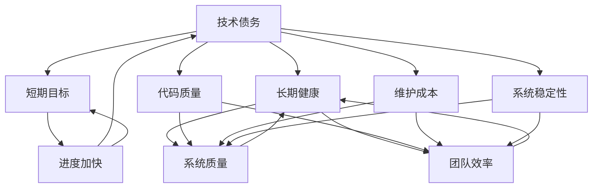

                 

### 概述与目标

《技术债务管理：平衡短期目标和长期健康》旨在为软件开发团队、项目经理和技术领导者提供一本实用的指南，帮助他们有效识别、管理并最小化技术债务。技术债务是指在软件开发过程中，为了追求短期目标而采取的妥协性决策，这些决策可能会在未来的维护和开发过程中增加成本或降低系统的整体健康度。本书的目标是帮助读者理解技术债务的本质，识别其来源和影响，并制定一套行之有效的管理策略。

技术债务是一种常见的现象，其根源在于软件开发过程中的时间压力、技术不成熟和项目范围蔓延等问题。如果不加以妥善管理，技术债务可能会导致系统质量下降、团队效率降低，甚至影响项目的长期成功。因此，有效管理技术债务对于保证软件开发项目的健康和可持续发展至关重要。

本书将按照以下结构展开：

1. **技术债务概述**：介绍技术债务的定义、影响、来源和识别方法，并通过联系图展示技术债务、短期目标和长期健康之间的动态关系。
2. **技术债务管理策略**：探讨技术债务管理的重要性，介绍管理流程和工具方法。
3. **技术债务的具体实践**：详细讲解技术债务评估与分类、修复策略和实践案例。
4. **平衡短期目标和长期健康**：分析如何在软件开发过程中平衡短期目标和长期健康，提供项目管理技巧和实践案例。
5. **技术债务管理的最佳实践**：分析技术债务管理的成功与失败案例，总结最佳实践。

通过本书的逐步分析和讲解，读者将能够深入了解技术债务管理的核心概念和实践方法，学会如何在软件开发过程中实现短期目标和长期健康的平衡。

### 第一部分：技术债务概述

#### 第1章：技术债务的定义与影响

**1.1 技术债务的定义**

技术债务，顾名思义，类似于金融领域的债务。在软件开发中，技术债务指的是在项目开发过程中，为了快速推进项目进度，而故意做出的某些妥协性决策。这些决策可能会带来短期利益，但长期来看，可能会导致维护成本增加、系统质量下降或开发效率降低。

为了更好地理解技术债务，我们可以将其与金融债务进行类比。在金融领域，借款人可能会通过贷款来满足短期需求，例如购买房屋或汽车。这种借款行为在短期内可以增加借款人的可支配资金，但同时也增加了未来的还款压力。同样，在软件开发中，通过技术妥协来加快开发进度，虽然可以短期内满足项目的交付要求，但长期来看，这些妥协可能会带来额外的维护成本和质量问题。

**1.2 技术债务的影响**

技术债务的影响可以分为短期影响和长期影响。

- **短期影响**：短期内，技术债务可以帮助团队快速推进项目进度，满足客户或上级的交付需求。例如，通过简化设计、使用低质量的代码或绕过某些测试，项目可以在短时间内实现功能交付。

- **长期影响**：长期来看，技术债务可能会带来一系列问题。首先，维护成本会增加。由于早期妥协所导致的代码质量低、设计不合理等问题，后续的代码维护和功能迭代会变得更加困难和昂贵。其次，系统质量会下降。技术债务通常意味着牺牲了某些最佳实践，这可能会导致系统稳定性差、扩展性差等问题。最后，团队效率会降低。技术债务会导致团队在后续的开发和维护过程中花费更多的时间和精力来处理这些问题，从而降低了整体的开发效率。

**1.3 技术债务的来源**

技术债务的来源主要包括以下几个方面：

- **时间压力**：在项目开发过程中，时间通常是最大的压力来源。为了在规定时间内完成项目，团队可能会选择采取一些技术妥协，从而加快开发进度。例如，在截止日期即将到来时，可能会临时决定简化测试流程或推迟一些优化工作。

- **技术不成熟**：在某些情况下，团队可能会选择使用尚未完全成熟的技术或工具来推进项目。虽然这种做法可以加快开发进度，但长期来看，技术的不稳定性可能会带来一系列问题。

- **项目范围蔓延**：项目范围蔓延是指项目范围在没有明确边界的情况下不断扩大的现象。当项目需求不断变化时，团队可能会为了满足新的需求而采取一些妥协性决策，这些决策可能会累积成技术债务。

**1.4 技术债务的识别**

识别技术债务是技术债务管理的重要步骤。以下是一些常用的识别方法：

- **代码审查**：通过代码审查，团队成员可以识别出代码中的质量问题、设计缺陷和潜在的技术债务。代码审查不仅可以帮助发现现有债务，还可以预防未来债务的产生。

- **自动化测试**：自动化测试可以帮助团队检测代码的稳定性和功能完整性。如果自动化测试频繁失败或覆盖率低，这可能是技术债务的迹象。

- **性能监控**：性能监控可以帮助团队识别系统性能瓶颈和资源浪费。如果系统的响应时间过长或资源利用率过高，这可能是技术债务的表现。

**1.5 技术债务的核心概念联系图**

为了更好地理解技术债务、短期目标和长期健康之间的动态关系，我们可以使用Mermaid流程图来展示这些概念之间的联系。

通过这个联系图，我们可以看到技术债务如何影响短期目标和长期健康，以及这些目标如何反过来影响技术债务。这个动态关系图不仅帮助我们理解了技术债务的本质，也为技术债务管理提供了直观的指导。

### 第2章：技术债务管理策略

**2.1 技术债务管理的重要性**

在软件开发过程中，技术债务管理是一项至关重要的工作。有效管理技术债务不仅有助于保障项目的长期健康，还可以提高团队的工作效率和产品质量。以下是一些管理技术债务的重要性：

- **保障项目长期健康**：技术债务如果不加以管理，会随着时间的积累而不断膨胀，最终可能导致项目的崩溃。通过及时识别和修复技术债务，可以避免这种情况的发生，确保项目的长期健康。

- **提高团队工作效率**：技术债务会增加后续的开发和维护成本，降低团队的效率。通过主动管理技术债务，团队可以减少额外的维护工作，将精力集中在新的功能开发上，从而提高工作效率。

- **提升产品质量**：技术债务通常意味着牺牲了某些最佳实践，这可能会导致系统质量下降。通过管理技术债务，团队可以恢复或提升系统的质量，减少bug的出现，提供更好的用户体验。

- **降低维护成本**：技术债务会在后续的开发和维护过程中带来额外的成本。通过及时修复技术债务，可以减少这些额外的成本，降低总体的维护成本。

**2.2 技术债务管理流程**

技术债务管理是一个持续的过程，需要遵循一定的流程。以下是一个基本的技术债务管理流程：

- **计划与评估**：在项目初期，团队需要对潜在的技术债务进行评估和规划。这包括识别可能的技术债务点、评估其影响和制定管理计划。

- **优先级排序**：在评估后，团队需要根据技术债务的影响和紧急程度对其进行优先级排序。这样，团队可以优先处理最关键的技术债务，确保项目重点明确。

- **修复与优化**：在确定了技术债务的优先级后，团队需要开始修复这些债务。这包括重构代码、优化设计、升级技术等。

- **监控与反馈**：在技术债务修复过程中，团队需要持续监控债务的修复效果，并根据反馈进行调整。这有助于确保技术债务的彻底解决，并防止新的债务产生。

**2.3 管理技术债务的工具与方法**

为了有效管理技术债务，团队需要使用一些工具和方法。以下是一些常用的工具和方法：

- **技术债务跟踪工具**：这些工具可以帮助团队记录和跟踪技术债务的详细信息，包括债务类型、优先级、修复状态等。例如，JIRA、Trello等项目管理工具都可以用于技术债务的跟踪。

- **质量保证措施**：通过实施严格的质量保证措施，团队可以预防技术债务的产生。这包括代码审查、自动化测试、性能监控等。

- **技术审查流程**：定期进行技术审查可以帮助团队识别和修复现有技术债务，并预防未来债务的产生。技术审查可以包括代码审查、设计审查、架构审查等。

### 第二部分：技术债务的具体实践

#### 第3章：技术债务评估与分类

**3.1 技术债务评估**

技术债务评估是技术债务管理的重要环节，它有助于团队了解技术债务的严重程度和影响，从而制定合适的修复计划。以下是一些评估技术债务的方法：

- **定量评估**：通过量化的指标来评估技术债务的影响。例如，可以计算修复技术债务所需的时间、成本和资源。这种方法的优点是直观，缺点是可能无法全面反映技术债务的影响。

- **定性评估**：通过主观判断来评估技术债务的影响。例如，团队可以讨论技术债务对系统稳定性、扩展性、维护成本等方面的潜在影响。这种方法的优点是全面，缺点是可能存在主观偏差。

- **综合评估**：结合定量和定性评估方法，综合评估技术债务的影响。这种方法既考虑了定量数据，也考虑了主观判断，可以更全面地反映技术债务的情况。

**3.2 技术债务分类**

将技术债务进行分类有助于团队有针对性地管理和修复债务。以下是一些常见的分类方法：

- **按严重性分类**：根据技术债务的严重程度进行分类。例如，可以将技术债务分为高风险、中风险和低风险三类。高风险债务通常对系统的影响较大，需要优先处理。

- **按优先级分类**：根据技术债务的紧急程度进行分类。例如，可以将技术债务分为高优先级、中优先级和低优先级三类。高优先级债务通常对项目的直接影响较大，需要尽快处理。

- **按类型分类**：根据技术债务的具体类型进行分类。例如，可以将技术债务分为代码质量债务、设计债务、测试债务等。这种分类方法有助于团队针对不同类型的债务采取不同的修复策略。

**3.3 技术债务案例研究**

为了更好地理解技术债务评估与分类的方法，我们可以通过一个实际案例来进行分析。

**案例背景**：某软件开发团队在开发一款大型企业应用时，由于时间紧迫，采用了某些技术妥协，导致系统中存在多个技术债务。

**技术债务识别**：通过代码审查、自动化测试和性能监控，团队识别出以下几种技术债务：

1. **代码质量债务**：大量使用全局变量，导致代码可读性和可维护性差。
2. **设计债务**：数据库设计不合理，存在冗余和性能瓶颈。
3. **测试债务**：部分功能缺乏自动化测试，依赖手工测试，影响测试覆盖率。

**技术债务评估**：团队对每个债务进行了评估，得出以下结论：

1. **代码质量债务**：高风险，影响代码的可维护性和可扩展性，修复成本较低。
2. **设计债务**：中风险，影响系统性能和扩展性，修复成本较高。
3. **测试债务**：低风险，影响测试覆盖率，修复成本中等。

**技术债务分类**：根据严重性和优先级，团队将债务分为以下几类：

1. **高风险、高优先级**：代码质量债务
2. **中风险、中优先级**：设计债务
3. **低风险、低优先级**：测试债务

**技术债务修复策略**：团队制定了以下修复策略：

1. **代码质量债务**：进行代码重构，提高代码质量，减少全局变量使用。
2. **设计债务**：优化数据库设计，解决性能瓶颈。
3. **测试债务**：增加自动化测试，提高测试覆盖率。

**技术债务修复实践**：团队采用以下方法进行修复：

1. **代码质量债务**：通过代码审查工具（如SonarQube）识别和修复代码质量问题。
2. **设计债务**：重构数据库设计，采用规范化方法优化数据存储结构。
3. **测试债务**：编写自动化测试脚本，确保关键功能覆盖。

**技术债务修复效果**：经过技术债务的修复，系统的可维护性和性能得到显著提升，团队的工作效率也有所提高。

**案例小结**：通过这个案例，我们可以看到技术债务评估与分类的重要性。只有通过准确的评估和分类，团队才能有针对性地进行修复，从而确保项目的长期健康和可持续发展。

### 第4章：技术债务的修复策略

**4.1 修复技术债务的步骤**

修复技术债务是一个系统性的工程，需要遵循一定的步骤。以下是修复技术债务的一般步骤：

1. **制定修复计划**：在识别和评估技术债务后，团队需要制定一个详细的修复计划。这个计划应包括修复的目标、方法、时间表和责任人。

2. **执行修复措施**：按照修复计划，团队开始实施具体的修复措施。这可能包括代码重构、设计优化、技术升级等。

3. **监控修复效果**：在执行修复措施的过程中，团队需要持续监控修复的效果，确保技术债务得到彻底解决。这可能需要使用自动化测试、性能监控等工具。

4. **迭代与优化**：修复技术债务是一个持续的过程，团队应根据修复效果进行迭代和优化，确保技术债务的彻底解决。

**4.2 技术债务修复方法**

修复技术债务的方法因债务类型和严重程度而异，以下是一些常见的方法：

1. **代码重构**：代码重构是修复代码质量债务的常用方法。通过重构，团队可以改进代码的可读性、可维护性和性能。常见的重构方法包括提取方法、简化条件、去除冗余代码等。

2. **设计优化**：设计优化是修复设计债务的有效方法。通过优化设计，团队可以提升系统的扩展性、稳定性和性能。常见的设计优化方法包括模块化设计、重构数据库设计、优化网络架构等。

3. **技术升级**：技术升级是解决技术债务的重要手段。通过引入新技术或工具，团队可以提升系统的现代化水平，减少未来的维护成本。例如，从传统的单体架构升级到微服务架构，从本地数据库升级到云数据库等。

**4.3 技术债务修复实践**

为了更好地理解技术债务修复的方法，我们可以通过一个实际案例来进行分析。

**案例背景**：某软件开发团队在开发一款电商应用时，由于时间紧迫，采用了简化的数据库设计和低质量的代码，导致系统存在多个技术债务。

**技术债务识别**：通过代码审查、自动化测试和性能监控，团队识别出以下几种技术债务：

1. **数据库设计债务**：数据库表设计不合理，存在冗余和性能瓶颈。
2. **代码质量债务**：代码可读性差，存在大量全局变量和冗余代码。
3. **测试债务**：缺乏自动化测试，依赖手工测试，影响测试覆盖率。

**技术债务修复步骤**：

1. **制定修复计划**：团队制定了详细的修复计划，包括重构数据库设计、优化代码结构和增加自动化测试。

2. **执行修复措施**：

   - **数据库设计修复**：团队对数据库表进行了重构，采用规范化方法优化数据存储结构，解决了性能瓶颈。
   - **代码质量修复**：团队通过代码审查和重构，提高了代码的可读性和可维护性，减少了全局变量的使用。
   - **测试修复**：团队编写了自动化测试脚本，提高了测试覆盖率，减少了手工测试的工作量。

3. **监控修复效果**：团队使用自动化测试工具和性能监控工具，持续监控系统的运行状态，确保技术债务得到彻底解决。

4. **迭代与优化**：团队根据监控结果，对修复措施进行了优化和迭代，确保系统的长期健康。

**技术债务修复效果**：

- **数据库设计**：通过重构数据库设计，系统的性能得到了显著提升，查询速度加快，数据冗余减少。
- **代码质量**：通过优化代码结构，系统的可维护性和可读性提高，团队成员更容易理解和修改代码。
- **测试覆盖率**：通过增加自动化测试，系统的测试覆盖率提升，降低了手工测试的工作量，提高了测试的可靠性。

**案例小结**：通过这个案例，我们可以看到技术债务修复的具体步骤和方法。只有通过系统性的修复措施和持续监控，团队才能彻底解决技术债务，确保系统的长期健康和可持续发展。

### 第5章：平衡短期目标和长期健康

**5.1 短期目标和长期健康的平衡**

在软件开发过程中，团队常常需要在短期目标和长期健康之间进行平衡。短期目标通常包括快速推进项目进度、满足客户需求、达到销售目标等，而长期健康则关注系统的稳定性、可维护性和扩展性。以下是如何在两者之间实现平衡的策略：

1. **优先级设定**：明确项目的优先级，优先完成对系统长期健康影响较小的短期目标。例如，在时间紧迫的情况下，可以先完成关键功能的开发，而将一些非关键功能的优化推迟到后续版本。

2. **阶段性目标**：将项目分解为多个阶段，每个阶段设定短期目标和长期健康目标。这样可以确保在追求短期目标的同时，也能关注到长期健康。

3. **资源分配**：合理分配资源和时间，确保在完成短期目标的同时，有足够的资源用于长期健康维护。例如，在开发过程中，可以安排一部分时间用于代码审查、自动化测试和设计优化。

4. **风险管理**：识别和评估技术债务的风险，制定相应的风险管理策略。通过提前识别和修复潜在的技术债务，可以减少对长期健康的影响。

**5.2 项目管理技巧**

以下是一些项目管理技巧，有助于在软件开发过程中实现短期目标和长期健康的平衡：

1. **时间管理**：合理安排时间，确保在完成短期目标的同时，留出足够的时间进行长期健康维护。使用敏捷开发方法，如Scrum，可以帮助团队更好地管理时间和资源。

2. **优先级管理**：根据项目的优先级，合理安排任务和资源。确保关键任务得到优先处理，同时关注长期健康目标。

3. **团队协作**：加强团队协作，确保团队成员在实现短期目标的同时，也能关注到长期健康。通过定期的团队会议和代码评审，可以及时发现和解决问题。

4. **持续改进**：建立持续改进机制，鼓励团队不断反思和优化工作流程。通过定期回顾和总结，可以不断改进项目管理方法，提高项目成功率。

**5.3 实践案例**

以下是一个实际案例，展示了如何在软件开发过程中实现短期目标和长期健康的平衡。

**案例背景**：某公司开发一款社交应用，需要在短时间内上线以抢占市场份额。然而，公司也意识到长期健康的重要性，因此需要找到平衡点。

**实现短期目标**：

- **快速迭代**：采用敏捷开发方法，每个迭代周期为两周。这样可以快速响应市场需求，确保应用在短时间内上线。
- **关键功能优先**：在时间紧迫的情况下，团队优先完成关键功能的开发，如用户注册、消息发送和好友关系管理等。
- **简化非关键功能**：对于一些非关键功能，如高级搜索、数据分析等，团队选择简化实现，或推迟到后续版本。

**实现长期健康**：

- **代码审查**：在每次迭代结束后，团队进行代码审查，确保代码质量。通过代码审查，团队识别并修复了多个技术债务。
- **自动化测试**：团队编写了自动化测试脚本，提高了测试覆盖率，减少了手工测试的工作量。
- **性能优化**：在应用上线前，团队对系统进行了性能优化，确保在高并发情况下依然能够稳定运行。

**平衡效果**：

- **短期目标达成**：应用在规定时间内上线，成功抢占市场份额。
- **长期健康保障**：通过代码审查、自动化测试和性能优化，系统的长期健康得到保障，为未来的扩展和维护奠定了基础。

**案例小结**：通过这个案例，我们可以看到在软件开发过程中，平衡短期目标和长期健康的关键在于合理规划和管理。只有通过科学的流程和方法，团队才能在追求短期成功的同时，确保系统的长期健康和可持续发展。

### 第三部分：技术债务管理的最佳实践

#### 第6章：技术债务管理案例分析

**6.1 案例分析**

在本章节中，我们将分析几个真实的技术债务管理案例，探讨其成功与失败的原因，并总结技术债务管理的最佳实践。

**案例1：成功管理技术债务的案例**

**公司背景**：某大型电商平台在快速扩张的过程中，面临着不断变化的市场需求和激烈的市场竞争。为了快速响应市场变化，公司采取了多种技术妥协，积累了大量技术债务。

**技术债务管理**：

- **识别与评估**：公司引入了代码审查和自动化测试工具，定期进行技术债务的识别和评估。通过这些工具，团队可以及时发现和解决潜在的技术债务。
- **优先级排序**：团队根据技术债务的影响和紧急程度，对其进行优先级排序，确保最关键的技术债务得到优先处理。
- **修复与优化**：公司制定了详细的修复计划，并安排了专人负责修复工作。通过代码重构、设计优化和技术升级，团队逐步解决了技术债务。

**案例结果**：

- **长期健康**：通过有效的技术债务管理，系统的稳定性、扩展性和可维护性显著提升，为公司未来的发展奠定了基础。
- **团队效率**：技术债务的减少使得团队成员的工作量减轻，工作效率提高。

**成功原因**：

- **工具与方法**：使用代码审查和自动化测试工具，提高了技术债务识别和修复的效率。
- **团队协作**：通过专人负责修复工作，确保技术债务得到及时解决。
- **持续改进**：公司建立了持续改进机制，鼓励团队不断反思和优化工作流程。

**案例2：未能有效管理技术债务的案例**

**公司背景**：某初创公司在产品开发初期，由于资源有限，采取了多种技术妥协，导致技术债务大量累积。

**技术债务管理**：

- **缺乏识别**：公司没有建立有效的技术债务识别机制，导致技术债务长期未被关注。
- **修复不足**：尽管公司意识到技术债务的问题，但由于资源限制，未能制定详细的修复计划，修复工作也未能持续推进。

**案例结果**：

- **系统崩溃**：由于技术债务的累积，系统频繁出现故障，导致用户体验差，公司市场份额下降。
- **团队士气低落**：技术债务的积累导致团队成员的工作压力增大，士气低落。

**失败原因**：

- **缺乏工具与方法**：没有使用有效的工具和方法进行技术债务识别和修复。
- **资源不足**：未能投入足够的资源进行技术债务修复。
- **缺乏持续改进**：公司未能建立持续改进机制，导致技术债务问题长期未得到解决。

**6.2 启示与借鉴**

从上述案例中，我们可以得出以下启示和借鉴：

- **早期识别**：技术债务管理的关键在于早期识别，通过代码审查、自动化测试和性能监控等工具，及时发现和解决潜在的技术债务。
- **优先级排序**：根据技术债务的影响和紧急程度进行优先级排序，确保最关键的技术债务得到优先处理。
- **持续修复**：制定详细的修复计划，并持续投入资源进行修复，确保技术债务得到彻底解决。
- **工具与方法**：使用有效的工具和方法，提高技术债务管理效率。
- **团队协作**：建立团队协作机制，确保技术债务管理得到全员支持。
- **持续改进**：建立持续改进机制，鼓励团队不断反思和优化工作流程，预防技术债务的产生。

通过借鉴这些最佳实践，团队可以更有效地管理技术债务，确保项目的长期健康和可持续发展。

### 第7章：技术债务管理工具与技术

**7.1 技术债务管理工具**

在技术债务管理中，工具起到了至关重要的作用。以下是一些常用的技术债务管理工具：

- **JIRA**：JIRA是一个功能强大的项目管理工具，支持任务跟踪、优先级排序和进度监控等功能。团队可以将技术债务记录在JIRA中，方便追踪和管理。
- **SonarQube**：SonarQube是一个代码质量分析平台，可以识别代码中的缺陷、漏洞和潜在的代码质量债务。通过SonarQube，团队可以持续监控代码质量，及时修复技术债务。
- **Selenium**：Selenium是一个开源的自动化测试工具，可以用于编写和执行自动化测试脚本。通过Selenium，团队可以确保系统的稳定性和功能完整性，减少技术债务对系统的影响。
- **New Relic**：New Relic是一个性能监控工具，可以实时监控系统的性能和资源使用情况。通过New Relic，团队可以及时发现系统瓶颈和性能问题，提前修复技术债务。

**7.2 技术债务管理技术**

除了工具，技术债务管理还需要采用一系列技术手段，以下是一些常用的技术：

- **自动化测试**：通过自动化测试，团队可以确保代码的稳定性和功能完整性。自动化测试不仅可以减少手动测试的工作量，还可以及时发现潜在的技术债务。
- **持续集成与持续交付（CI/CD）**：CI/CD是一种软件开发和交付的最佳实践，通过自动化构建、测试和部署流程，团队可以确保代码质量，减少技术债务的产生。
- **微服务架构**：微服务架构是一种将大型单体应用拆分为多个独立服务的架构模式。通过微服务架构，团队可以更好地管理和维护技术债务，提高系统的可扩展性和灵活性。
- **容器化**：容器化技术，如Docker，可以将应用程序及其依赖环境打包到一个独立的容器中。通过容器化，团队可以简化部署过程，减少环境不一致导致的技术债务。

**工具与技术的选择**

在选择技术债务管理工具和技术时，团队需要根据项目的具体需求进行选择。以下是一些选择建议：

- **项目规模**：对于大型项目，可以选择功能强大的工具，如JIRA和SonarQube，以支持复杂的债务管理。对于小型项目，可以选择简单的工具，如Trello和GitLab。
- **技术栈**：根据项目的技术栈选择合适的工具和技术。例如，如果项目使用Java，可以考虑使用SonarQube和JUnit；如果项目使用Python，可以考虑使用Pylint和pytest。
- **团队协作**：选择支持团队协作的工具和技术，如JIRA和GitLab，以确保团队成员之间的沟通和协作。
- **成本**：根据项目的预算，选择适合的工具和技术。开源工具通常成本较低，商业工具通常提供更丰富的功能。

通过合理选择和利用技术债务管理工具和技术，团队可以更有效地识别、管理和修复技术债务，确保项目的长期健康和可持续发展。

### 附录

**附录A：技术债务管理资源**

为了帮助读者进一步了解技术债务管理，以下是一些推荐的资源：

- **书籍**：
  - 《技术债务管理：软件项目成功的秘密》（Book Title）
  - 《敏捷开发实践指南》（"Agile Project Management: Creating Innovative Products" by Jim Highsmith）
  - 《重构：改善既有代码的设计》（"Refactoring: Improving the Design of Existing Code" by Martin Fowler）

- **在线课程**：
  - Coursera上的“软件工程：理论与实践”（Software Engineering: Theory and Practice）
  - edX上的“敏捷开发：敏捷方法和实践”（Agile Development: Methods and Practices）

- **社区与论坛**：
  - Stack Overflow：技术债务相关的讨论和问题解答
  - GitHub：开源项目和代码库，可以学习技术债务管理的实践案例

- **开源项目**：
  - SonarQube：代码质量分析平台
  - JIRA：项目管理工具
  - Selenium：自动化测试工具
  - Docker：容器化技术

这些资源将帮助读者深入了解技术债务管理的概念、实践和方法，提高在软件开发过程中管理技术债务的能力。

### 总结

《技术债务管理：平衡短期目标和长期健康》这本书通过详细的案例分析和实践指导，为软件开发团队提供了一个全面的技术债务管理指南。技术债务是软件开发中常见的现象，如果不加以妥善管理，会对项目的长期健康造成严重威胁。通过这本书，读者可以了解技术债务的定义、影响、评估、分类和修复策略，学会如何在软件开发过程中平衡短期目标和长期健康。

技术债务管理的核心在于早期识别、持续修复和团队协作。早期识别可以通过代码审查、自动化测试和性能监控等手段实现；持续修复需要制定详细的修复计划，并投入足够的资源；团队协作则要求团队成员共同努力，共同应对技术债务带来的挑战。

在接下来的阅读中，读者将会了解到：

1. **技术债务管理的具体方法**：包括如何评估技术债务、分类债务、修复债务等。
2. **实际案例分析**：通过真实案例展示技术债务管理的成功和失败，总结经验教训。
3. **最佳实践**：介绍在技术债务管理中行之有效的工具和技术，以及如何选择和利用这些工具。
4. **附录资源**：提供进一步学习的书籍、在线课程、社区和开源项目，帮助读者深化理解。

通过这本书的指导，读者将能够更有效地管理技术债务，提高项目成功率，实现短期目标和长期健康的平衡。希望这本书能够成为你在软件开发道路上的一盏明灯，引领你走向技术卓越和团队成功的未来。

