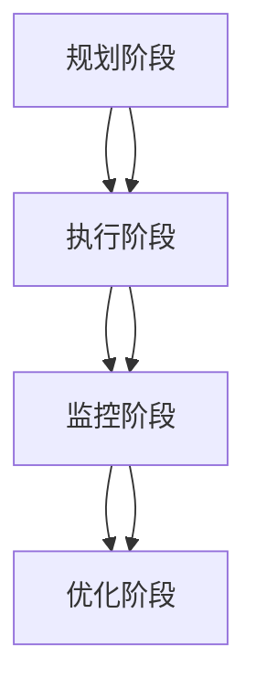

                 

# 技术债务管理：平衡短期目标和长期健康

## 关键词
技术债务、短期目标、长期健康、管理策略、案例分析、项目实战、最佳实践

## 摘要
本文旨在探讨技术债务管理的核心问题，即如何在追求短期业务目标的同时，确保系统的长期健康与可持续发展。文章首先介绍了技术债务的概念、背景、定义和特征，然后详细阐述了技术债务管理的基本原则、方法、过程以及实践。通过企业案例分析和项目实战，揭示了技术债务管理的最佳实践。最后，对技术债务管理的趋势与挑战进行了展望，提出了未来研究方向。

### 目录大纲

1. 第一部分：问题背景与定义
   1.1 问题背景
   1.2 技术债务的定义与特征
   1.3 技术债务的分类
   1.4 技术债务的边界与外延
   1.5 本章小结

2. 第二部分：技术债务管理策略
   2.1 短期目标与长期健康的平衡
   2.2 技术债务管理的基本原则
   2.3 技术债务管理的方法
   2.4 技术债务管理的过程
   2.5 本章小结

3. 第三部分：技术债务管理实践
   3.1 企业案例分析
   3.2 项目实战
   3.3 最佳实践
   3.4 小结与展望

4. 第四部分：技术债务管理趋势与挑战
   4.1 技术债务管理的趋势
   4.2 技术债务管理的挑战
   4.3 未来研究方向
   4.4 本章小结

5. 第五部分：附录与参考文献
   5.1 附录
   5.2 参考文献

---

## 第一部分：问题背景与定义

### 1.1 问题背景

在快速发展的IT行业中，技术债务（Technical Debt）是一个日益受到关注的话题。技术债务源自软件工程领域，最初用来比喻软件开发过程中为了加快开发进度而采取的短期技术手段，这些手段可能会在未来增加额外的维护成本。随着时间的推移，技术债务逐渐演变成一个更为广泛的概念，不仅仅限于软件，还包括硬件、系统架构、代码库等多个层面。

技术债务的起源可以追溯到20世纪80年代，当时软件开发的速度和质量成为了企业竞争力的关键。为了在激烈的市场竞争中脱颖而出，开发团队常常会选择在代码质量、系统架构和稳定性方面妥协，以便尽快交付功能。这些妥协带来的结果是，系统在短期内看起来运行良好，但长期来看，可能会因为技术债务的累积而面临各种问题，如性能下降、维护成本增加、扩展性受限等。

### 1.2 技术债务的定义与特征

**1.2.1 技术债务的定义**

技术债务是指为了快速实现功能或解决问题，而采取的短期解决方案，这些解决方案在未来可能会带来额外的维护成本或风险。技术债务不同于代码债务（Code Debt），后者主要关注代码质量，如代码可读性、复用性和可维护性等。

**1.2.2 技术债务的特征**

- **累积性**：技术债务随着时间的推移会不断累积，导致系统质量逐渐下降。
- **隐匿性**：许多技术债务可能在开发初期不易被发现，但随着时间的推移，其负面影响会逐渐显现。
- **关联性**：技术债务往往与其他类型的债务（如代码债务、文档债务等）相互关联。

### 1.3 技术债务的分类

**1.3.1 按类型分类**

- **技术选择债务**：由于选择了不合适的技术栈或工具，导致后续的维护和扩展变得困难。
- **代码质量债务**：由于代码不规范、缺乏测试等原因，导致系统的可靠性和可维护性下降。
- **架构债务**：由于系统架构设计不合理，导致系统的扩展性和性能受限。

**1.3.2 按阶段分类**

- **设计阶段**：在设计阶段引入的技术债务，如选择了不适合的架构模式。
- **开发阶段**：在开发阶段引入的技术债务，如使用了未经验证的库或框架。
- **维护阶段**：在系统维护过程中引入的技术债务，如为了修复bug而引入的临时解决方案。

**1.3.3 按性质分类**

- **功能性债务**：为了实现特定功能而采取的短期解决方案。
- **性能性债务**：为了提高系统性能而采取的优化措施，但这些措施可能在未来带来维护成本。
- **安全性债务**：由于安全措施不足或未及时更新，导致系统面临潜在的安全风险。

### 1.4 技术债务的边界与外延

**1.4.1 技术债务的范围**

技术债务不仅限于软件代码，还包括硬件设备、系统架构、开发流程等多个方面。例如，使用过时的硬件设备可能导致系统性能下降，选择不合适的开发流程可能导致开发效率低下。

**1.4.2 技术债务的影响因素**

- **团队经验**：经验丰富的团队可能更容易识别和避免技术债务。
- **开发环境**：良好的开发环境（如完善的工具链、高效的代码库管理等）有助于减少技术债务的产生。
- **项目规模**：大型项目由于涉及更多的技术和团队成员，更容易产生技术债务。

**1.4.3 技术债务的管理目标**

技术债务管理的目标是在确保系统短期性能和功能的同时，保持系统的长期健康和可持续性。具体目标包括：

- **降低维护成本**：通过减少技术债务的累积，降低系统的维护成本。
- **提高开发效率**：通过优化开发流程和工具，提高开发效率。
- **增强系统稳定性**：通过改进系统架构和代码质量，提高系统的稳定性。

### 1.5 本章小结

本部分主要介绍了技术债务的背景、定义与特征、分类、边界与外延以及管理目标。技术债务是一个广泛且复杂的概念，其管理不仅关乎短期目标的实现，更关乎系统的长期健康与可持续发展。在接下来的章节中，我们将进一步探讨技术债务管理的基本原则、方法、过程以及实践。

---

## 第二部分：技术债务管理策略

### 2.1 短期目标与长期健康的平衡

在软件开发过程中，如何平衡短期目标和长期健康是一个关键问题。短期目标通常是指尽快交付功能、满足用户需求，而长期健康则是指确保系统在未来的可维护性、稳定性和扩展性。两者之间的矛盾往往会导致开发团队在决策时面临巨大的压力。

**2.1.1 短期目标的重要性**

短期目标对于企业来说至关重要，因为它们直接关系到产品的市场竞争力。快速交付功能可以抢占市场先机，满足用户需求，从而为企业带来收益。此外，短期目标还可以帮助企业快速调整方向，以应对市场变化。

**2.1.2 长期健康的重要性**

然而，长期健康同样不可忽视。一个不健康的系统可能在短期内看起来运行良好，但随着时间的推移，会暴露出各种问题，如性能下降、维护成本增加、扩展性受限等。这些问题不仅会增加后续的维护成本，还会影响用户体验，甚至可能导致项目的失败。

**2.1.3 平衡短期目标和长期健康的挑战**

平衡短期目标和长期健康面临的挑战主要有以下几个方面：

- **时间与资源限制**：在快速发展的市场中，时间和资源往往是有限的。如何在有限的时间内确保系统的长期健康，是一个巨大的挑战。
- **团队协作**：技术债务管理需要整个团队的参与，但团队成员可能对技术债务的认识程度不同，导致协作困难。
- **决策困难**：在决策时，如何权衡短期目标和长期健康，往往需要权衡多个因素，如成本、时间、风险等。

### 2.2 技术债务管理的基本原则

为了平衡短期目标和长期健康，技术债务管理需要遵循以下基本原则：

**2.2.1 透明性**

技术债务管理需要透明，确保所有团队成员都能了解当前的技术债务状况。透明性有助于团队成员更好地协作，共同管理技术债务。

**2.2.2 可持续性**

技术债务管理需要可持续，即不仅要解决当前的技术债务问题，还要防止未来产生新的技术债务。可持续性有助于确保系统的长期健康。

**2.2.3 实时性**

技术债务管理需要实时性，即及时识别和解决技术债务问题。实时性有助于减少技术债务的累积，确保系统的长期健康。

**2.2.4 可度量性**

技术债务管理需要可度量性，即能够量化技术债务的大小、影响和修复进度。可度量性有助于团队成员更好地了解技术债务的状况，制定有效的管理策略。

### 2.3 技术债务管理的方法

技术债务管理包括检测、评估、修复、优化和预防等多个环节。以下将详细介绍这些方法。

**2.3.1 检测与评估**

检测与评估是技术债务管理的第一步，主要通过工具和人工审核来识别系统中的技术债务。

- **工具检测**：使用静态代码分析工具、性能监控工具等，自动识别系统中的潜在技术债务。
- **人工审核**：通过代码审查、架构评审等方式，人工识别系统中的技术债务。

**2.3.2 修复与优化**

一旦检测到技术债务，就需要及时修复和优化。

- **修复技术债务**：根据技术债务的类型和影响，制定相应的修复策略。例如，对于代码质量债务，可以通过代码重构、增加单元测试等方式进行修复。
- **优化技术债务**：在修复技术债务的同时，还可以进行优化，以提高系统的性能和稳定性。

**2.3.3 预防与控制**

预防与控制是技术债务管理的关键，主要通过以下几个方面实现：

- **编码规范**：制定并遵循编码规范，确保新代码的质量。
- **持续集成**：通过持续集成和持续交付（CI/CD），确保代码的质量和一致性。
- **代码审查**：通过代码审查，确保代码的规范性和质量。

### 2.4 技术债务管理的过程

技术债务管理是一个持续的过程，包括以下几个阶段：

- **规划阶段**：制定技术债务管理计划，明确管理目标和策略。
- **执行阶段**：按照计划执行技术债务管理的各项任务，如检测、评估、修复等。
- **监控阶段**：监控技术债务的修复进度和效果，及时调整管理策略。
- **优化阶段**：根据监控结果，持续优化技术债务管理过程，提高管理效率。

### 2.5 本章小结

本部分详细介绍了技术债务管理的基本原则、方法、过程以及平衡短期目标和长期健康的挑战。技术债务管理是一个复杂而重要的任务，需要团队成员的共同努力。通过遵循基本原则、采用有效的方法和过程，可以确保系统的长期健康和可持续发展。

---

## 第三部分：技术债务管理实践

### 3.1 企业案例分析

在技术债务管理实践中，企业案例分析是非常有价值的。通过分析不同类型企业的技术债务管理实践，可以总结出一些有效的经验和教训。

#### 3.1.1 大型互联网公司的技术债务管理

大型互联网公司，如阿里巴巴、腾讯等，通常在技术债务管理方面具有丰富的经验。这些公司拥有庞大的技术团队和完善的开发流程，能够有效地管理技术债务。

- **规范化的开发流程**：这些公司建立了规范化的开发流程，如代码审查、测试驱动开发（TDD）等，确保代码质量。
- **持续集成与持续交付（CI/CD）**：通过CI/CD，确保代码的质量和一致性，减少技术债务的产生。
- **技术债务监控**：定期进行技术债务的检测和评估，及时发现和修复技术债务。
- **技术债务文档**：将技术债务记录在文档中，确保所有团队成员都能了解当前的技术债务状况。

#### 3.1.2 中小型企业的技术债务管理

中小型企业在技术债务管理方面可能面临更多的挑战，但也有一些成功的案例。

- **敏捷开发**：采用敏捷开发方法，快速响应市场变化，减少技术债务的产生。
- **外包与协作**：通过外包或与第三方协作，借助外部资源进行技术债务的管理。
- **内部培训**：定期进行内部培训，提高团队对技术债务的认识和管理能力。

#### 3.1.3 初创公司的技术债务管理

初创公司在技术债务管理方面往往面临较大的压力，但也有一些成功的策略。

- **优先级管理**：在资源有限的情况下，优先解决最关键的技术债务，确保系统的核心功能。
- **代码质量意识**：培养团队成员的代码质量意识，从源头上减少技术债务的产生。
- **开放沟通**：鼓励团队成员之间的沟通和协作，共同解决技术债务问题。

### 3.2 项目实战

以下是一个技术债务管理项目实战的例子。

#### 3.2.1 项目背景

某初创公司开发了一款在线教育平台，由于时间紧张，项目团队在开发过程中采取了一些短期解决方案，导致系统存在一些技术债务。

#### 3.2.2 技术债务检测

通过静态代码分析工具和人工审查，项目团队识别出以下技术债务：

- **代码质量债务**：代码缺乏注释、可读性差、缺乏单元测试。
- **架构债务**：系统架构不够灵活，难以扩展。
- **性能债务**：数据库查询性能不佳，响应时间较长。

#### 3.2.3 技术债务修复

针对识别出的技术债务，项目团队制定了以下修复策略：

- **代码重构**：对关键模块进行重构，提高代码的可读性和可维护性。
- **架构优化**：改进系统架构，增加模块的灵活性和可扩展性。
- **性能优化**：优化数据库查询，提高系统的响应速度。

#### 3.2.4 技术债务预防

为了预防未来产生新的技术债务，项目团队采取了以下措施：

- **编码规范**：制定并遵循编码规范，确保新代码的质量。
- **代码审查**：引入代码审查机制，确保代码的规范性和质量。
- **持续集成**：采用持续集成和持续交付，确保代码的质量和一致性。

### 3.3 最佳实践

通过企业案例分析和项目实战，可以总结出一些技术债务管理的最佳实践：

- **规范化开发流程**：建立规范化的开发流程，如代码审查、测试驱动开发（TDD）等，确保代码质量。
- **持续集成与持续交付**：通过CI/CD，确保代码的质量和一致性，减少技术债务的产生。
- **定期检测与评估**：定期进行技术债务的检测和评估，及时发现和修复技术债务。
- **团队协作**：鼓励团队成员之间的沟通和协作，共同解决技术债务问题。
- **预防为主**：通过编码规范、代码审查、持续集成等措施，从源头上减少技术债务的产生。

### 3.4 小结与展望

通过企业案例分析和项目实战，我们可以看到技术债务管理在实践中的重要性。有效管理技术债务不仅有助于确保系统的长期健康，还可以提高开发效率，降低维护成本。在未来，随着技术的不断进步，技术债务管理将面临新的挑战和机遇。通过持续探索和实践，我们可以找到更加高效、科学的技术债务管理方法。

---

## 第四部分：技术债务管理趋势与挑战

### 4.1 技术债务管理的趋势

随着技术的发展，技术债务管理也在不断演进。以下是一些技术债务管理的趋势：

**4.1.1 自动化**

自动化是技术债务管理的重要趋势。通过使用自动化工具，可以快速检测、评估和修复技术债务，提高管理效率。例如，自动化静态代码分析工具可以帮助识别代码质量债务，自动化性能测试工具可以帮助评估系统性能债务。

**4.1.2 数据驱动**

数据驱动是技术债务管理的另一个趋势。通过收集和分析系统数据，可以更准确地识别和评估技术债务。数据驱动的管理策略可以帮助团队更好地理解技术债务的影响，制定更加有效的修复计划。

**4.1.3 云原生**

云原生技术的普及使得技术债务管理变得更加复杂。云原生架构的灵活性和可扩展性带来了便利，但同时也增加了技术债务的风险。如何有效管理云原生环境中的技术债务，是一个值得深入研究的课题。

**4.1.4 人工智能**

人工智能（AI）在技术债务管理中的应用日益增加。通过机器学习算法，可以预测技术债务的累积趋势，提供优化建议。AI还可以帮助自动化技术债务的检测、评估和修复过程，提高管理效率。

### 4.2 技术债务管理的挑战

尽管技术债务管理在不断进步，但仍面临许多挑战：

**4.2.1 文化障碍**

技术债务管理需要整个团队的参与，但许多团队可能对技术债务的认识不足，缺乏相应的管理文化。要克服文化障碍，需要从组织层面进行推动，提高团队对技术债务管理的重视。

**4.2.2 技术复杂性**

随着技术的不断发展，系统的复杂性也在增加。技术债务管理的挑战在于如何在一个复杂的系统中识别、评估和修复技术债务。这需要团队具备较高的技术能力和经验。

**4.2.3 资源限制**

许多团队在资源有限的情况下进行技术债务管理。如何有效利用有限的资源，确保技术债务的及时修复，是一个重要的挑战。

**4.2.4 持续集成**

持续集成是技术债务管理的重要环节，但实现持续集成面临许多挑战。如何确保持续集成的效率和质量，避免引入新的技术债务，是持续集成中需要解决的问题。

### 4.3 未来研究方向

为了应对技术债务管理的挑战，未来的研究方向包括：

**4.3.1 技术债务模型**

建立更加准确和全面的技术债务模型，以更好地预测技术债务的累积趋势和影响。

**44.3.2 技术债务预测**

利用机器学习算法和大数据分析技术，预测技术债务的产生和累积，提前采取预防措施。

**4.3.3 技术债务优化**

研究如何通过优化技术债务的修复策略和管理方法，提高技术债务管理的效率。

### 4.4 本章小结

技术债务管理是一个复杂而重要的任务，随着技术的发展，其管理方法和工具也在不断演进。未来，通过自动化、数据驱动和人工智能等技术的应用，技术债务管理将更加高效和准确。然而，要实现这一目标，还需要克服文化障碍、技术复杂性、资源限制和持续集成等挑战。

---

## 第五部分：附录与参考文献

### 5.1 附录

**5.1.1 技术债务管理流程图**

**5.1.2 技术债务检测工具列表**

- SonarQube
- PMD
- Checkstyle
- FindBugs
- PMDA

**5.1.3 技术债务修复案例模板**

1. 识别技术债务
2. 制定修复计划
3. 实施修复措施
4. 测试修复效果
5. 记录修复过程

### 5.2 参考文献

- Martin, R. C. (2004). Clean Code: A Handbook of Agile Software Craftsmanship. Prentice Hall.
- Feathers, D. (2004). Working Effectively with Legacy Code. Prentice Hall.
- Beck, K. (2004). Test-Driven Development: By Example. Addison-Wesley.
- Coplien, J. O., & Schmidt, D. C. (2003). Organizational Patterns of Agile Projects. John Wiley & Sons.
- Poppendieck, M., & Poppendieck, M. (2003). Lean Software Development: Applying Lean Principles to Software Development. Addison-Wesley.
- Fowler, M. (2009). Patterns of Enterprise Application Architecture. Addison-Wesley.
- Highsmith, J. (2004). Agile Project Management: Creating Innovative Products. Addison-Wesley.

---

## 作者

作者：AI天才研究院/AI Genius Institute & 禅与计算机程序设计艺术 /Zen And The Art of Computer Programming

---

### 总结

技术债务管理是确保软件系统长期健康和可持续发展的关键。通过平衡短期目标和长期健康，遵循基本原则，采用有效的方法和过程，企业可以更好地管理技术债务，提高系统的质量和稳定性。未来的研究将继续探索自动化、数据驱动和人工智能等技术在技术债务管理中的应用，以应对日益复杂的软件开发环境。通过不断的学习和实践，我们可以找到更加高效、科学的技术债务管理方法，推动软件行业的持续发展。

