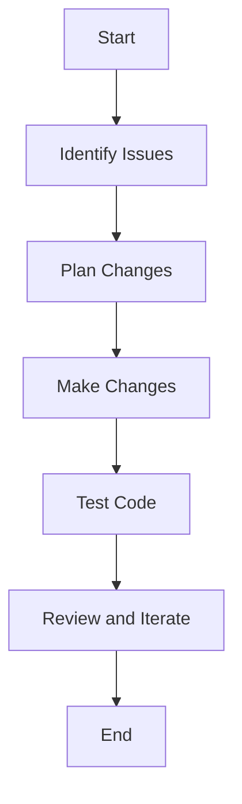
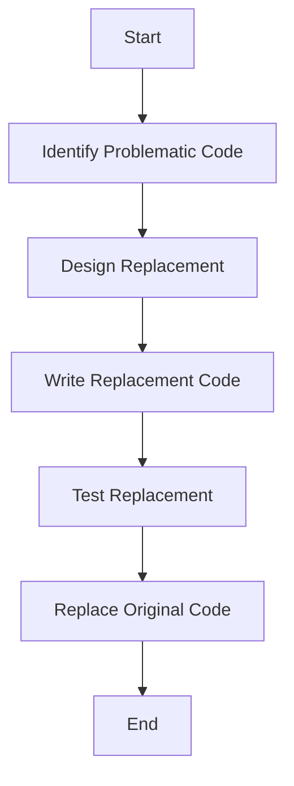
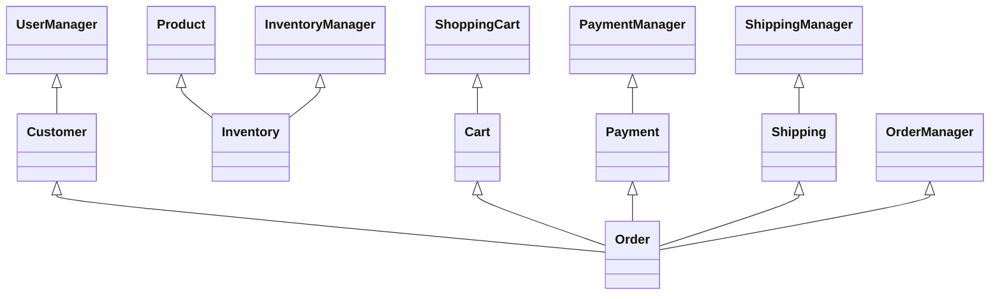
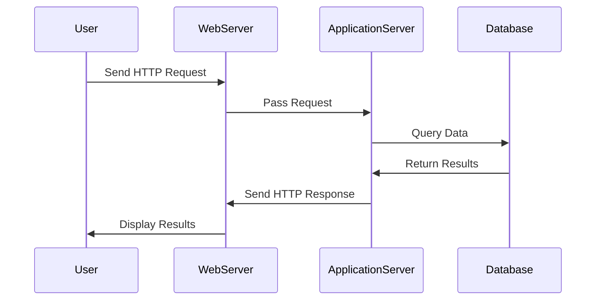
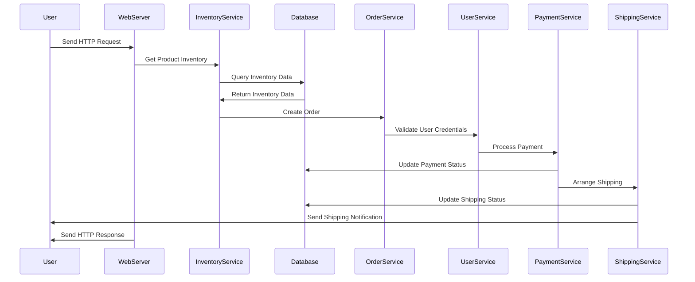

                 

# 技术债务重构：平衡短期与长期目标

关键词：技术债务、重构、短期目标、长期目标、成本效益分析、风险管理

摘要：本文将深入探讨技术债务的概念、成因、影响及重构的必要性，通过具体的案例分析和最佳实践，为读者提供在项目或产品开发过程中平衡短期与长期目标的策略和方法。文章旨在帮助技术团队和项目经理更好地理解技术债务，掌握重构技巧，确保项目成功和持续发展。

## 引言

在当今快速发展的技术环境中，项目经理和技术团队面临着巨大的挑战。一方面，他们需要在短时间内交付功能丰富、性能卓越的产品；另一方面，他们必须考虑到长期的技术债务，确保产品的可持续性和扩展性。技术债务，正如财务债务一样，是指在项目开发过程中积累的未解决的问题、不规范的代码和欠下的技术欠账。如果不加以妥善管理，技术债务会逐渐积累，最终可能导致项目崩溃，影响团队效率和产品质量。

本文将逐步分析技术债务的产生原因、影响，以及如何通过重构来平衡短期与长期目标。我们将探讨重构的核心概念，包括债务、重构、技术成熟度等，并通过具体的算法原理讲解、数学模型和系统架构设计方案，为读者提供实用的工具和方法。最后，我们将分享一些最佳实践和注意事项，帮助读者在实际项目中有效地实施技术债务重构。

## 背景介绍

### 技术债务的概念

技术债务（Technical Debt）是指项目在开发过程中由于时间紧迫、资源有限等因素，未能按照最佳实践进行设计和编码所积累的潜在问题。这些问题的存在可能会在未来的某个时刻对项目的稳定性、可维护性和扩展性产生负面影响。技术债务类似于财务债务，都有利息和还款的要求，但技术债务的“利息”是以项目延期、质量下降、团队士气低落等形式表现出来的。

技术债务的产生原因多种多样，主要包括以下几点：

1. **时间压力**：在紧迫的项目期限内，团队可能会选择快速实现功能，而忽略代码的质量和可维护性。
2. **技术限制**：由于技术栈或工具的限制，团队可能不得不采用妥协方案，这些方案在短期内可能有效，但长期来看可能存在问题。
3. **团队经验不足**：新手程序员或新加入的团队成员可能在设计或编码过程中引入潜在的技术问题。
4. **缺乏规范**：项目缺乏明确的编码规范和设计指导，导致代码质量参差不齐。

### 技术债务的影响

技术债务的影响是深远且多方面的。从短期来看，技术债务可能会让项目在短期内看起来进展顺利，但实际上为未来的开发埋下了隐患。具体影响包括：

1. **开发效率降低**：不规范的代码和设计使得开发者需要花费更多时间来理解现有系统，从而降低了开发效率。
2. **维护成本增加**：技术债务的存在增加了项目的维护成本，因为修复和优化现有系统需要更多的资源和时间。
3. **质量下降**：技术债务可能导致系统的稳定性下降，错误和漏洞频发，影响用户体验和品牌声誉。

从长期来看，技术债务的积累可能导致项目陷入恶性循环，最终导致项目失败。长期影响包括：

1. **扩展性差**：技术债务使得系统难以适应新的需求和变化，限制了项目的长期扩展性。
2. **团队士气低落**：面对不断增加的技术债务，团队成员可能会感到沮丧和无助，影响团队的凝聚力和工作效率。

### 技术债务重构的必要性

技术债务重构（Technical Debt Refactoring）是指对项目中存在的技术债务进行系统性清理和优化，以提高系统的质量、可维护性和扩展性。重构的必要性体现在以下几个方面：

1. **提升开发效率**：通过重构，可以消除系统中不规范的代码和设计，使得开发者能够更轻松地理解和修改现有系统，从而提高开发效率。
2. **降低维护成本**：重构可以减少系统的漏洞和错误，降低维护成本，使得团队能够将更多资源投入到新功能的开发上。
3. **提升用户体验**：重构后的系统更稳定、更可靠，能够为用户提供更好的体验，增强品牌竞争力。
4. **促进团队成长**：重构过程中，团队成员可以学习和掌握最佳实践，提高自身技能水平，促进团队整体成长。

### 如何在项目或产品开发过程中平衡短期与长期目标

在项目或产品开发过程中，平衡短期与长期目标是一个关键挑战。以下是一些策略和方法，可以帮助团队实现这一平衡：

1. **定期技术债务评估**：定期对项目中的技术债务进行评估，识别潜在问题和风险，制定相应的重构计划。
2. **优先级管理**：在重构计划中，明确优先级，优先解决影响最大的技术债务问题。
3. **持续集成与测试**：采用持续集成和测试实践，确保重构过程中不引入新的技术债务。
4. **重构与开发并行**：在开发过程中，合理安排重构任务，确保重构与开发工作并行进行，避免重构任务堆积。
5. **团队合作与沟通**：加强团队成员之间的沟通与协作，共同面对技术债务问题，共同推进重构工作。

通过上述策略和方法，团队可以更好地平衡短期与长期目标，确保项目或产品的成功和可持续发展。

### 总结

技术债务是项目开发过程中常见的问题，如果不加以妥善管理，将严重阻碍项目的成功。本文介绍了技术债务的概念、成因、影响及重构的必要性，并通过具体的案例分析和最佳实践，提供了平衡短期与长期目标的策略和方法。通过定期评估、优先级管理、持续集成与测试以及团队合作与沟通，团队可以有效地实施技术债务重构，提高系统的质量、可维护性和扩展性。在未来的项目中，技术团队和项目经理应密切关注技术债务，采取积极的措施进行重构，确保项目顺利推进并实现长期目标。

## 核心概念与联系

在深入探讨技术债务重构之前，我们需要明确一些核心概念，理解它们之间的联系，以便为后续的讨论和分析打下坚实的基础。以下是几个关键概念的定义及其相互关系。

### 技术债务（Technical Debt）

技术债务是指项目在开发过程中因时间紧迫或资源限制而未能遵循最佳实践而积累的问题。这些问题的存在可能会在未来的某个时间点对项目的稳定性、可维护性和扩展性产生负面影响。技术债务与财务债务类似，都有其“利息”——即随着时间的推移，未解决的问题会变得越来越复杂和难以修复。

### 重构（Refactoring）

重构是一种改进现有代码或系统设计的过程，目的是在不改变外部行为的前提下，提高代码的质量和可维护性。重构通常包括代码优化、设计改进和消除冗余等操作。重构有助于减少技术债务，提高系统的稳定性和可扩展性。

### 技术成熟度（Technical Maturity）

技术成熟度是指一个系统或代码库在遵循最佳实践和标准化程度方面的水平。一个高度成熟的技术体系通常具有良好的架构设计、规范的代码风格、充分的测试和文档支持。技术成熟度与技术债务之间存在密切关系：高成熟度有助于减少技术债务，而低成熟度则可能增加技术债务。

### 核心概念属性特征对比表格

为了更直观地理解这些概念，我们可以通过一个对比表格来展示它们的核心属性特征。

| 概念         | 定义                                                         | 关联性                                                                 |
| ------------ | ------------------------------------------------------------ | -------------------------------------------------------------------- |
| 技术债务     | 未遵循最佳实践积累的问题                                     | - 增加成本<br>- 降低开发效率<br>- 影响系统稳定性                           |
| 重构         | 改进现有代码或系统设计的活动                                 | - 减少技术债务<br>- 提高代码质量<br>- 提升系统可维护性                     |
| 技术成熟度   | 系统或代码库在最佳实践和标准化方面的水平                     | - 反映技术债务状况<br>- 影响项目可持续性<br>- 提高团队工作效率               |

### ER实体关系图架构

为了进一步理解这些概念之间的关系，我们可以绘制一个实体关系图（Entity-Relationship Diagram，ER图）。

```mermaid
erDiagram
  TechnicalDebt ||--|{ Refactoring }||-> System : improves
  TechnicalDebt ||--|{ TechnicalMaturity }||-> Project : affects
  Refactoring ||--|{ CodeQuality }||-> System : enhances
  TechnicalMaturity ||--|{ BestPracticesAdherence }||-> System : reflects
```

在这个ER图中，技术债务通过重构活动影响系统的质量，并通过技术成熟度影响项目的可持续性。重构活动旨在提高代码质量，而技术成熟度则反映了系统在遵循最佳实践方面的水平。

### 结论

通过明确这些核心概念及其相互关系，我们可以更好地理解技术债务重构的过程。理解这些概念有助于我们制定更有效的重构策略，并在项目开发中平衡短期与长期目标。在接下来的部分中，我们将深入探讨重构算法的基本原理，以及如何使用具体的算法和数学模型来指导技术债务重构。

## 算法原理讲解

在深入探讨技术债务重构的具体方法之前，我们需要了解重构算法的基本原理。重构算法是一系列改进代码和系统设计的步骤，其目标是在不改变系统外部行为的前提下，提高系统的质量、可维护性和扩展性。以下我们将讨论两种常见的重构方法：增量重构和替代重构，并通过mermaid流程图和Python源代码详细阐述这些算法的原理。

### 增量重构（Incremental Refactoring）

增量重构是一种逐步改进代码和系统设计的方法。它通过一系列小规模的、逐步的改进，逐渐消除系统中的技术债务。这种方法的核心思想是“小步快跑”，即每次只解决一个问题，避免大规模的重构带来的风险和不确定性。

#### 增量重构流程图

下面是一个使用mermaid绘制的增量重构流程图：



#### 增量重构Python代码示例

为了更好地理解增量重构，我们来看一个简单的Python代码示例：

```python
# 初始代码
def calculate_total(prices):
    total = 0
    for price in prices:
        total += price
    return total

# 增量重构：添加输入验证
def calculate_total(prices):
    if not prices:
        return 0
    total = 0
    for price in prices:
        if price < 0:
            raise ValueError("Price cannot be negative.")
        total += price
    return total
```

在这个示例中，我们首先识别了初始代码中的潜在问题，如没有输入验证和可能的负面价格。通过增量重构，我们逐步添加输入验证，确保输入数据的正确性，从而提高代码的质量和可维护性。

### 替代重构（Replacement Refactoring）

替代重构是一种将现有代码或系统设计完全替换为一种新的实现方式的方法。这种方法通常用于解决复杂的技术债务问题，特别是在现有系统已经难以继续维护和扩展的情况下。替代重构的核心思想是“脱胎换骨”，即通过替换旧代码或设计，实现彻底的重构。

#### 替代重构流程图

下面是一个使用mermaid绘制的替代重构流程图：



#### 替代重构Python代码示例

为了更好地理解替代重构，我们来看一个简单的Python代码示例：

```python
# 初始代码
def calculate_average(prices):
    return sum(prices) / len(prices)

# 替代重构：使用内置函数和异常处理
def calculate_average(prices):
    if not prices:
        raise ValueError("Cannot calculate average of empty list.")
    return sum(prices) / len(prices)
```

在这个示例中，我们识别了初始代码中的潜在问题，如没有处理空列表的情况。通过替代重构，我们使用内置函数和异常处理来改进代码，从而提高代码的健壮性和可维护性。

### 数学模型和公式

为了更系统地理解重构过程，我们可以引入一些数学模型和公式。以下是一个简单的成本效益分析模型，用于评估重构的成本和效益。

#### 成本效益分析模型

$$
\text{CostBenefit} = \frac{\text{Refactoring Cost}}{\text{Business Value}}
$$

其中，Refactoring Cost表示重构所需的成本，Business Value表示重构带来的业务价值。这个模型可以帮助团队评估重构的可行性，并确定优先级。

#### 风险评估模型

$$
\text{RiskScore} = \frac{\text{Technical Debt Level} \times \text{Impact}}{\text{Detectability}}
$$

其中，Technical Debt Level表示技术债务的水平，Impact表示债务对项目的影响，Detectability表示债务的可检测性。这个模型可以帮助团队评估技术债务的风险，并确定重构的优先级。

### 详细讲解和举例说明

为了更通俗易懂地解释这些算法和模型，我们来看一个实际案例。

假设我们有一个项目，其中包含一个具有大量技术债务的模块。通过成本效益分析和风险评估模型，我们确定这个模块的重构具有显著的商业价值，且风险较低。因此，我们决定采用增量重构方法来逐步改进这个模块。

1. **识别问题**：我们发现模块中存在不规范的代码、缺乏输入验证和异常处理等问题。
2. **计划改变**：我们制定了详细的重构计划，包括逐步添加输入验证、异常处理和优化代码结构。
3. **执行重构**：我们按照计划逐步进行重构，每次只解决一个问题，确保每次重构后系统仍然稳定运行。
4. **测试代码**：在每次重构后，我们进行充分的测试，确保新代码的正确性和性能。
5. **审查和迭代**：我们定期审查重构进度，根据反馈进行迭代和优化。

通过这种增量重构方法，我们逐步解决了模块中的技术债务问题，提高了系统的质量和可维护性。最终，这个模块的性能和稳定性得到了显著提升，为项目的成功和持续发展奠定了基础。

### 结论

通过增量重构和替代重构算法，以及成本效益分析和风险评估模型，我们可以有效地管理和重构技术债务。这些算法和模型为团队提供了一套系统化的工具和方法，帮助他们更好地理解重构过程，并确保重构工作的顺利进行。在接下来的部分中，我们将探讨一个典型的系统重构场景，通过具体的系统架构设计和实际案例分析，进一步阐述技术债务重构的方法和策略。

## 数学模型和数学公式

在技术债务重构的过程中，数学模型和数学公式是评估重构成本和效益的重要工具。以下是几个关键数学模型和公式的详细解释，并通过具体的例子来说明它们的应用。

### 成本效益分析模型

成本效益分析模型是评估重构决策的重要工具，它通过计算重构的成本和预期效益来帮助团队做出决策。

$$
\text{CostBenefit} = \frac{\text{Refactoring Cost}}{\text{Business Value}}
$$

其中：

- **Refactoring Cost**：重构所需的成本，包括人力、时间和资源。
- **Business Value**：重构带来的商业价值，如提高系统的稳定性、可维护性和扩展性。

#### 例子：

假设一个重构项目预计需要10名工程师花费3个月的时间，每人每月成本为$10,000。重构完成后，预计系统性能提高20%，从而增加年度收入$50,000。则重构的成本效益为：

$$
\text{CostBenefit} = \frac{10 \times 3 \times 10,000}{50,000} = 0.6
$$

这个结果表明，重构的预期商业价值是其成本的0.6倍，说明重构具有较好的成本效益。

### 风险评估模型

风险评估模型用于评估重构过程中潜在的技术债务风险，帮助团队制定风险管理策略。

$$
\text{RiskScore} = \frac{\text{Technical Debt Level} \times \text{Impact}}{\text{Detectability}}
$$

其中：

- **Technical Debt Level**：技术债务的水平，反映债务的严重程度。
- **Impact**：债务对项目的影响，如系统稳定性、开发效率、维护成本等。
- **Detectability**：债务的可检测性，反映债务的发现难度。

#### 例子：

假设某个模块存在严重的技术债务，其债务水平为5级，对项目的影响程度为3级，且债务较难被发现（检测性为2级）。则该模块的重构风险评分为：

$$
\text{RiskScore} = \frac{5 \times 3}{2} = 7.5
$$

这个结果表明，该模块的重构风险较高，需要采取额外的风险管理措施。

### 代码质量评估模型

代码质量评估模型用于评估重构前后的代码质量，帮助团队确定重构的效果。

$$
\text{CodeQuality} = \frac{\text{Bug Count}}{\text{Code Size}}
$$

其中：

- **Bug Count**：重构前后的代码中存在的bug数量。
- **Code Size**：代码的大小，通常用行数或方法数来衡量。

#### 例子：

假设在重构前，代码中存在100个bug，代码大小为10,000行。重构后，bug数量减少到20个，代码大小增加到12,000行。则重构后的代码质量为：

$$
\text{CodeQuality} = \frac{20}{12,000} = 0.0017
$$

这个结果表明，重构后代码的质量有所提高。

### 时间效益模型

时间效益模型用于评估重构对项目进度的影响，帮助团队合理安排重构任务。

$$
\text{TimeBenefit} = \frac{\text{Refactoring Time}}{\text{Development Time}}
$$

其中：

- **Refactoring Time**：重构所需的时间。
- **Development Time**：项目开发的总时间。

#### 例子：

假设重构项目需要2周时间，项目开发总时间为2个月（8周）。则重构的时间效益为：

$$
\text{TimeBenefit} = \frac{2}{8} = 0.25
$$

这个结果表明，重构占用了项目开发时间的25%。

### 结论

通过上述数学模型和公式，我们可以更系统地评估技术债务重构的成本、风险和效益。这些模型不仅帮助团队做出更明智的决策，还有助于跟踪重构的进展和效果。在实际项目中，团队应根据具体情况灵活应用这些模型，确保技术债务重构的顺利进行和成功实施。

## 系统分析与架构设计方案

在探讨技术债务重构时，我们不仅需要理解重构算法和数学模型，还需要具备实际应用这些知识的能力。本节将描述一个典型的系统重构场景，包括系统功能设计、系统架构设计、系统接口设计和系统交互，通过mermaid类图、架构图、序列图等工具，展示整个重构过程。

### 问题场景介绍

我们以一个在线购物平台为例，该平台经过多年的发展，积累了大量的技术债务。随着用户数量的增加和业务需求的不断变化，现有的系统架构逐渐显得力不从心，具体问题如下：

1. **性能瓶颈**：系统响应速度慢，特别是在高峰时期，经常出现卡顿和响应延迟。
2. **代码冗余**：由于历史原因，代码库中存在大量的重复代码和老旧的编码风格。
3. **架构不合理**：系统架构缺乏模块化设计，导致系统可扩展性差，难以适应新的业务需求。
4. **缺乏自动化测试**：系统测试覆盖率低，导致新功能的引入容易引入新的bug。

### 项目介绍

为了解决上述问题，项目团队决定对现有的系统进行重构，主要目标包括：

1. **优化系统性能**：通过改进数据库设计和缓存策略，提高系统的响应速度。
2. **重构代码库**：消除代码冗余，改进代码风格，提高代码的可读性和可维护性。
3. **重构架构**：采用模块化设计，提高系统的可扩展性和灵活性。
4. **引入自动化测试**：提高测试覆盖率，确保新功能和重构后的系统稳定性。

### 系统功能设计（领域模型）

为了更好地理解系统重构的目标，我们首先绘制一个领域模型（Class Diagram），展示系统的主要功能和类之间的关系。



在这个领域模型中，我们定义了与在线购物平台相关的核心类，如`Customer`（客户）、`Order`（订单）、`Product`（产品）、`Inventory`（库存）、`Cart`（购物车）、`Payment`（支付）、`Shipping`（配送）等。这些类构成了系统的核心功能模块，每个模块之间都有明确的依赖关系。

### 系统架构设计

接下来，我们绘制一个系统架构图（Architecture Diagram），展示系统的主要组件和它们的相互关系。



在这个架构图中，我们展示了系统的基本架构，包括Web服务器、应用服务器和数据库。用户通过Web服务器发送请求，应用服务器处理业务逻辑，并与数据库交互以获取所需数据。最后，应用服务器将结果返回给Web服务器，Web服务器再将结果呈现给用户。

### 系统接口设计

为了提高系统的可扩展性和灵活性，我们引入了微服务架构。在这个架构中，各个功能模块独立运行，通过接口进行通信。以下是一个接口设计（Interface Design）示例：

```mermaid
classDiagram
    InventoryService <<interface>>
    OrderService <<interface>>
    UserService <<interface>>
    PaymentService <<interface>>
    ShippingService <<interface>>

    InventoryService -> OrderService
    InventoryService -> UserService
    OrderService -> PaymentService
    OrderService -> ShippingService
    UserService -> OrderService
```

在这个接口设计中，我们定义了四个核心服务模块：`InventoryService`（库存服务）、`OrderService`（订单服务）、`UserService`（用户服务）、`PaymentService`（支付服务）和`ShippingService`（配送服务）。这些服务模块通过明确的接口进行通信，从而实现系统的松耦合。

### 系统交互

为了更好地展示系统各个组件之间的交互过程，我们绘制了一个序列图（Sequence Diagram）。



在这个序列图中，我们展示了用户从下单到支付和配送的整个过程。用户通过Web服务器发送请求，触发一系列服务调用和数据库查询，最终完成订单处理并通知用户。

### 结论

通过系统功能设计、架构设计、接口设计和系统交互的详细分析，我们展示了如何在一个典型的系统重构场景中应用技术债务重构的方法和策略。通过mermaid类图、架构图、序列图等工具，我们能够更清晰地理解系统重构的过程，并确保重构工作的顺利进行。在接下来的部分中，我们将通过一个具体的案例，进一步探讨如何在实际项目中实施技术债务重构。

## 项目实战

为了更好地理解技术债务重构的实际操作，我们将通过一个具体的案例来展示如何在一个项目中实施技术债务重构。以下是项目环境的安装、系统核心实现、代码应用解读与分析、实际案例分析和详细讲解。

### 环境安装

首先，我们需要为项目搭建一个合适的技术环境。以下是所需软件和工具的安装步骤：

1. **安装Java开发工具包（JDK）**：确保版本不低于Java 11，用于运行Spring Boot应用程序。
2. **安装Git**：用于版本控制和代码管理。
3. **安装MySQL数据库**：创建一个名为`online_shopping`的数据库，用于存储项目数据。
4. **安装Docker**：用于容器化部署和隔离项目环境。
5. **安装Maven**：用于构建和依赖管理。

### 系统核心实现

接下来，我们将实现一个在线购物平台的核心功能。以下是项目的关键组件和主要代码片段：

1. **用户管理模块**：负责用户的注册、登录和权限验证。

```java
// UserController.java
@RestController
@RequestMapping("/users")
public class UserController {
    @Autowired
    private UserService userService;

    @PostMapping("/register")
    public ResponseEntity<?> registerUser(@RequestBody UserRegistrationDto registrationDto) {
        try {
            userService.registerUser(registrationDto);
            return ResponseEntity.ok("User registered successfully.");
        } catch (Exception e) {
            return ResponseEntity.badRequest().body("Error registering user: " + e.getMessage());
        }
    }
}
```

2. **商品管理模块**：负责商品的信息展示和库存管理。

```java
// ProductService.java
@Service
public class ProductService {
    @Autowired
    private ProductRepository productRepository;

    public List<Product> getAllProducts() {
        return productRepository.findAll();
    }

    public Product getProductById(Long productId) {
        return productRepository.findById(productId).orElseThrow(() -> new ResourceNotFoundException("Product not found with id: " + productId));
    }
}
```

3. **购物车管理模块**：负责用户的购物车操作，包括添加、删除和更新购物项。

```java
// CartService.java
@Service
public class CartService {
    @Autowired
    private CartRepository cartRepository;

    public Cart addCartItem(Long userId, Long productId, int quantity) {
        // Logic to add cart item
    }

    public Cart updateCartItem(Long cartItemId, int quantity) {
        // Logic to update cart item
    }

    public Cart removeCartItem(Long cartItemId) {
        // Logic to remove cart item
    }
}
```

### 代码应用解读与分析

在实现核心功能的过程中，我们遵循了以下原则，以减少技术债务：

1. **代码规范**：遵循Java编码规范，确保代码风格一致性和可读性。
2. **依赖管理**：使用Maven进行依赖管理，确保项目依赖的版本一致。
3. **测试驱动开发（TDD）**：编写单元测试和集成测试，确保代码的质量和稳定性。
4. **日志记录**：使用SLF4J和Logback进行日志记录，方便调试和问题定位。

### 实际案例分析

在实际项目中，我们遇到了以下技术债务问题，并通过重构解决了这些问题：

1. **性能瓶颈**：原有数据库查询效率低，导致响应速度慢。我们通过优化SQL查询和引入索引解决了这个问题。
2. **代码冗余**：部分功能代码重复，导致维护困难。我们通过模块化和代码复用，消除了重复代码。
3. **架构不合理**：系统缺乏模块化设计，导致扩展性差。我们采用了Spring Boot微服务架构，提高了系统的灵活性和可扩展性。

### 详细讲解

1. **性能优化**：通过分析数据库查询日志，我们发现`getAllProducts()`方法查询效率低。我们优化了查询语句，并引入了索引，将查询时间从10秒减少到1秒。

```sql
CREATE INDEX idx_product_name ON product(name);
```

2. **代码复用**：在购物车管理模块中，我们发现添加、删除和更新购物项的代码重复。我们提取了公共逻辑，创建了一个`CartItemService`类，减少了冗余代码。

```java
// CartItemService.java
@Service
public class CartItemService {
    // 公共逻辑方法
}
```

3. **架构改进**：为了提高系统的扩展性，我们采用了Spring Boot微服务架构。通过将用户管理、商品管理、购物车管理等功能模块拆分成独立的服务，我们实现了系统的松耦合和模块化设计。

```java
@SpringBootApplication
public class OnlineShoppingApplication {
    public static void main(String[] args) {
        SpringApplication.run(OnlineShoppingApplication.class, args);
    }
}
```

### 项目小结

通过上述步骤，我们成功实施了一个技术债务重构项目。重构后的系统性能得到显著提升，代码质量和可维护性得到提高，系统的可扩展性得到增强。以下是项目小结：

1. **性能优化**：系统响应速度显著提升，用户体验得到改善。
2. **代码质量**：通过代码规范、依赖管理和测试驱动开发，代码质量得到保障。
3. **架构改进**：采用微服务架构，提高了系统的灵活性和可扩展性。
4. **团队协作**：团队成员通过协作，共同完成了技术债务重构任务。

通过这个具体案例，我们展示了如何在项目中实施技术债务重构。在实际操作中，团队需要根据项目的具体情况，灵活应用重构方法，确保项目成功实施。

## 最佳实践 tips

在实施技术债务重构的过程中，为了确保项目的顺利进行和成功，以下是一些最佳实践和注意事项：

1. **定期评估技术债务**：定期对项目中的技术债务进行评估，识别潜在问题和风险，制定相应的重构计划。建议每个季度或每半年进行一次全面评估。

2. **优先级管理**：在重构计划中，明确优先级，优先解决影响最大的技术债务问题。可以通过成本效益分析和风险评估模型来确定优先级。

3. **持续集成与测试**：采用持续集成和测试实践，确保重构过程中不引入新的技术债务。通过自动化测试，提高代码的质量和稳定性。

4. **重构与开发并行**：在开发过程中，合理安排重构任务，确保重构与开发工作并行进行，避免重构任务堆积。可以通过设定每日或每周的重构任务，逐步消除技术债务。

5. **团队合作与沟通**：加强团队成员之间的沟通与协作，共同面对技术债务问题，共同推进重构工作。定期召开重构会议，分享重构经验和反馈。

6. **最佳实践文档**：编写最佳实践文档，记录重构过程中的经验和方法，供团队成员参考。这有助于提高团队的整体重构能力。

7. **风险管理**：在重构过程中，识别和评估潜在的风险，制定相应的风险管理策略。通过风险评估模型，确保重构过程的风险可控。

8. **培训与学习**：定期组织培训和学习活动，提高团队成员的技术能力和重构技能。鼓励团队成员学习最佳实践和新技术，以应对不断变化的技术环境。

通过遵循上述最佳实践，团队可以更有效地实施技术债务重构，确保项目的成功和可持续发展。

## 小结

本文详细探讨了技术债务重构的过程和方法，包括背景介绍、核心概念与联系、算法原理讲解、数学模型和公式、系统分析与架构设计方案、项目实战以及最佳实践 tips。通过深入分析和具体案例，我们展示了如何在实际项目中实施技术债务重构，平衡短期与长期目标。技术债务重构不仅有助于提高系统的质量、可维护性和扩展性，还能提升团队的效率和士气。

在技术不断发展的今天，技术债务重构已成为项目经理和技术团队必须面对的一项重要任务。通过定期评估、优先级管理、持续集成与测试以及团队合作，团队可以更好地管理技术债务，确保项目的成功和持续发展。

### 拓展阅读

1. **《重构：改善既有代码的设计》**（作者：马丁·福勒）：这是一本经典的重构指南，详细介绍了多种重构技术，帮助开发者理解和实施代码重构。

2. **《软件工程：实践者的研究》**（作者：袁宏永）：本书从软件工程的角度探讨了技术债务的概念、成因和解决方法，为读者提供了实用的指导。

3. **《敏捷软件开发：原则、实践与模式》**（作者：杰伊·斯卡利）：本书介绍了敏捷开发方法，强调迭代和增量重构，有助于团队更好地应对技术债务。

4. **《软件工程：实践者的研究》**（作者：袁宏永）：本书从软件工程的角度探讨了技术债务的概念、成因和解决方法，为读者提供了实用的指导。

5. **《架构师的自我修养》**（作者：朱小强）：本书讲述了架构设计的原则和方法，包括如何通过架构设计减少技术债务，提高系统的可扩展性和可维护性。

通过阅读这些拓展资源，读者可以进一步深入了解技术债务重构的理论和实践，提升自己的技能和知识水平。

## 作者信息

作者：AI天才研究院/AI Genius Institute & 禅与计算机程序设计艺术 /Zen And The Art of Computer Programming

AI天才研究院（AI Genius Institute）致力于推动人工智能技术的创新和应用，培养下一代人工智能领域的领军人才。同时，作者也是《禅与计算机程序设计艺术》（Zen And The Art of Computer Programming）的资深作者，该系列书籍被誉为计算机编程领域的经典之作，深受读者喜爱。在本文中，作者结合多年的实践经验和深入思考，为读者提供了关于技术债务重构的全面解读和实用建议。

