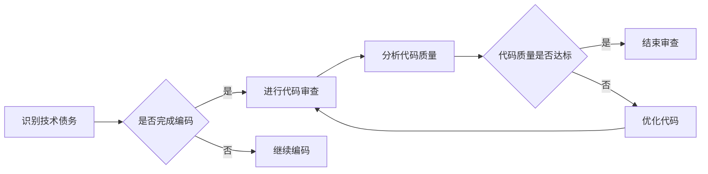
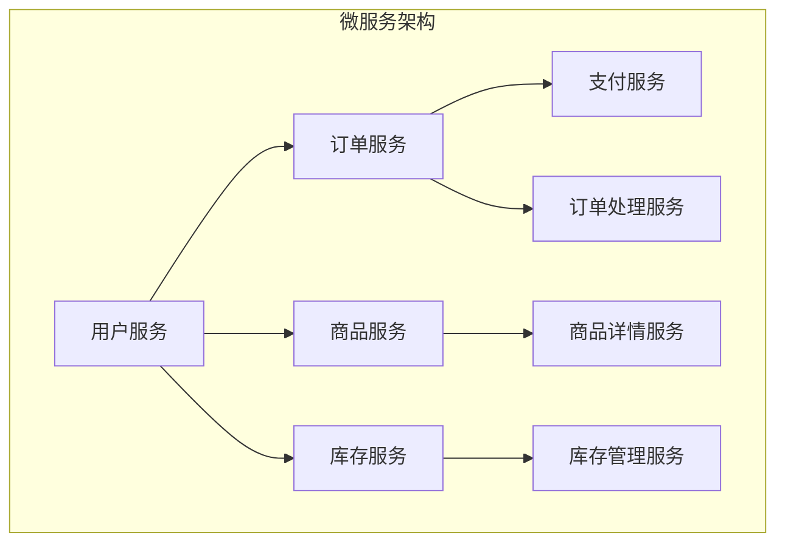

                 

### 技术债务：识别、量化和管理

> 关键词：技术债务、代码质量、设计模式、系统架构、量化工具、管理策略

> 摘要：本文深入探讨了技术债务的概念、类型及其对软件项目的影响。通过详细的分析和实例，介绍了识别、量化和管理技术债务的方法与策略，旨在帮助开发人员更好地理解和应对技术债务问题。

## 第一部分：背景介绍

### 问题背景

技术债务（Technical Debt）是软件工程中的一个核心概念，它源自于金融领域中的债务概念。在软件开发过程中，技术债务指的是为了加快项目进度而采用的短期解决方案所带来的潜在风险和成本。这些解决方案可能是为了迅速交付功能而牺牲了代码质量、设计模式和系统架构等方面，从而在项目后期可能会带来更高的维护成本和更复杂的修改难度。

随着软件项目的复杂性和规模不断增加，技术债务问题日益凸显。技术债务不仅影响项目的短期开发效率，还会对长期维护成本和系统稳定性产生深远影响。因此，识别、量化和管理技术债务变得尤为重要。

### 问题描述

技术债务可以分为债务代码、设计债务和架构债务。

- **债务代码**：指的是代码质量低下、重复代码、糟糕的命名习惯等问题。这些问题的存在会降低代码的可读性、可维护性和可扩展性，增加开发人员的沟通成本和出错概率。

- **设计债务**：涉及设计模式的选择、模块化程度等。不良的设计选择会导致模块之间的依赖关系复杂，增加系统的耦合度，降低系统的可扩展性和可维护性。

- **架构债务**：是指系统架构方面的问题，如过度耦合、高耦合度等。这些问题会降低系统的稳定性，增加系统的维护成本和风险。

如果不加以解决，技术债务会随着项目的发展不断积累，导致系统维护成本增加、性能下降，甚至最终导致项目失败。

### 问题解决

解决技术债务问题的关键在于识别、量化和管理。

- **识别技术债务**：需要开发人员具备一定的代码审查能力和技术洞察力。通过代码审查、设计审查和架构审查等方法，可以发现代码质量、设计模式和系统架构方面存在的问题。

- **量化技术债务**：需要借助工具和算法进行评估。通过度量代码质量、设计复杂度和系统耦合度等指标，可以量化技术债务的程度。

- **管理技术债务**：需要在项目规划和实施过程中制定相应的策略和措施。通过持续的技术评审、代码重构和架构优化等措施，可以有效地管理技术债务，降低项目风险。

### 边界与外延

技术债务不仅存在于软件开发领域，也可以扩展到系统架构设计、项目管理等方面。不同领域的技术债务具有不同的表现形式和解决方法。因此，在处理技术债务问题时，需要根据实际情况进行具体分析和应对。

### 概念结构与核心要素组成

技术债务的核心概念包括债务代码、设计债务和架构债务。其中，债务代码主要涉及代码质量，设计债务则侧重于设计模式和模块化程度，架构债务则关注系统架构的稳定性和可扩展性。

核心要素组成包括：

- **识别技术债务的方法**：如代码审查、设计审查和架构审查等。
- **量化技术债务的工具和算法**：如代码质量度量工具、设计复杂度评估工具等。
- **管理技术债务的策略和措施**：如持续的技术评审、代码重构和架构优化等。

## 第二部分：核心概念与联系

### 核心概念原理

技术债务的核心概念包括债务代码、设计债务和架构债务。

- **债务代码**：指的是代码质量低下、重复代码、糟糕的命名习惯等问题。这些问题会降低代码的可读性、可维护性和可扩展性。

- **设计债务**：涉及设计模式的选择、模块化程度等。不良的设计选择会导致模块之间的依赖关系复杂，增加系统的耦合度，降低系统的可扩展性和可维护性。

- **架构债务**：是指系统架构方面的问题，如过度耦合、高耦合度等。这些问题会降低系统的稳定性，增加系统的维护成本和风险。

### 概念属性特征对比表格

| 类别         | 定义                                                         | 属性特征对比                      |
| ------------ | ------------------------------------------------------------ | -------------------------------- |
| 债务代码     | 代码质量低下、重复代码、糟糕的命名习惯等问题                 | 缺乏可读性、可维护性差、易出错   |
| 设计债务     | 设计模式的选择、模块化程度等                                 | 可扩展性差、模块间依赖复杂       |
| 架构债务     | 系统架构方面的问题，如过度耦合、高耦合度等                   | 系统稳定性差、维护成本高         |

### ER实体关系图架构

```mermaid
erDiagram
  Project ||--|{ TechnicalDebt }||>
  TechnicalDebt ||--|{ CodeDebt }||>
  TechnicalDebt ||--|{ DesignDebt }||>
  TechnicalDebt ||--|{ ArchitecturalDebt }||>
```

在ER实体关系图中，Project是项目实体，TechnicalDebt是技术债务实体，CodeDebt、DesignDebt和ArchitecturalDebt分别是债务代码、设计债务和架构债务的实体。项目实体与技术债务实体之间是一对多的关系，技术债务实体与债务代码、设计债务和架构债务实体之间也是一对多的关系。

## 第三部分：算法原理讲解

### 算法流程图



### Python源代码

```python
# 代码质量审查工具示例
def review_code(code):
    # 假设我们使用一个简单的代码质量指标：行数
    lines_of_code = len(code.split('\n'))
    
    # 检查代码行数是否过多
    if lines_of_code > 100:
        print("代码行数过多，需要进行优化。")
        return False
    
    # 检查是否有重复代码
    unique_lines = set(code.split('\n'))
    if len(unique_lines) < len(code.split('\n')):
        print("存在重复代码，需要进行代码重构。")
        return False
    
    # 检查命名习惯是否规范
    if not all(line.startswith('def ') or line.startswith('class ') for line in code.split('\n')):
        print("命名习惯不规范，需要进行命名规范检查。")
        return False
    
    # 代码质量达标
    print("代码质量达标。")
    return True
```

### 算法原理

技术债务的识别、量化和管理可以通过以下步骤实现：

1. **代码审查**：通过人工或自动化工具对代码进行审查，识别债务代码。

2. **设计审查**：对代码的设计模式、模块化程度等进行评估，识别设计债务。

3. **架构审查**：对系统架构进行评估，识别架构债务。

4. **量化评估**：使用指标和算法对技术债务进行量化，如代码复杂度、设计复杂度和架构复杂度等。

5. **管理策略**：根据量化结果，制定相应的管理策略，如代码重构、设计重构和架构优化等。

### 数学模型与公式

假设我们使用以下指标来量化技术债务：

- **代码复杂度**（C）：代码行数、函数数量、类数量等。
- **设计复杂度**（D）：模块间依赖关系、类间依赖关系等。
- **架构复杂度**（A）：系统的模块数量、类数量、接口数量等。

我们可以使用以下公式来量化技术债务（TD）：

$$
TD = w_1 \times C + w_2 \times D + w_3 \times A
$$

其中，$w_1$、$w_2$ 和 $w_3$ 分别是代码复杂度、设计复杂度和架构复杂度的权重。

### 举例说明

假设一个项目中有以下数据：

- 代码行数（C）：1000行
- 模块间依赖关系（D）：10个
- 系统模块数量（A）：5个

我们可以使用以下权重来计算技术债务：

- 代码复杂度权重（$w_1$）：0.5
- 设计复杂度权重（$w_2$）：0.3
- 架构复杂度权重（$w_3$）：0.2

则技术债务（TD）为：

$$
TD = 0.5 \times 1000 + 0.3 \times 10 + 0.2 \times 5 = 550
$$

这意味着该项目的技术债务为550单位。

### 小结

通过以上算法原理讲解，我们可以看出，技术债务的识别、量化和管理是一个系统化的过程。通过使用适当的工具和算法，可以有效地识别技术债务，量化其程度，并制定相应的管理策略，从而降低项目风险，提高软件项目的质量和稳定性。

## 第四部分：系统分析与架构设计方案

### 问题场景介绍

在一个大型电子商务项目中，随着用户量的增长和业务需求的不断变化，系统的复杂度和规模也在不断增大。为了应对这些变化，开发团队采用了快速迭代开发的模式，但在项目发展的过程中，逐渐积累了一定的技术债务。这些技术债务的存在导致了系统的性能下降、维护成本增加，甚至对用户体验产生了负面影响。为了解决这些问题，需要对系统的技术债务进行识别、量化和管理。

### 项目介绍

该项目是一个在线购物平台，提供商品展示、购物车管理、订单处理、支付结算等功能。系统采用微服务架构，由多个独立的微服务组成，每个微服务负责一个特定的业务功能。这种架构方式可以提升系统的可扩展性和可维护性，但同时也带来了技术债务的风险。

### 系统功能设计（领域模型mermaid类图）

```mermaid
classDiagram
    Customer <<-- Order
    Order o-- Payment
    Order o-- Product
    Product <.. Inventory
    Payment o-- PaymentService
```

在这个类图中，Customer表示用户，Order表示订单，Payment表示支付，Product表示商品，Inventory表示库存。订单与用户、支付和商品之间存在关联，支付与支付服务之间存在关联。

### 系统架构设计（mermaid架构图）



在这个架构图中，用户服务、订单服务、商品服务和库存服务是主要的微服务，它们之间通过接口进行交互。订单服务和支付服务之间、订单服务和订单处理服务之间、商品服务和商品详情服务之间、库存服务和库存管理服务之间也通过接口进行通信。

### 系统接口设计和系统交互（mermaid序列图）

```mermaid
sequenceDiagram
    participant 用户 as 用户
    participant 用户服务 as 用户服务
    participant 订单服务 as 订单服务
    participant 商品服务 as 商品服务
    participant 支付服务 as 支付服务

    用户->>用户服务: 登录系统
    用户服务->>订单服务: 创建订单
    用户服务->>商品服务: 获取商品信息
    用户服务->>支付服务: 处理支付

    感谢用户选择我们的服务
```

在这个序列图中，用户登录系统后，用户服务创建订单，获取商品信息，并处理支付。这些操作通过接口在各个微服务之间进行通信。

### 系统架构设计总结

该电子商务项目采用了微服务架构，通过将系统拆分为多个独立的微服务，可以更好地应对业务需求的变化，提高系统的可扩展性和可维护性。然而，这种架构方式也可能导致技术债务的增加，因此需要对系统的技术债务进行识别、量化和管理。

## 第五部分：项目实战

### 环境安装

在进行技术债务识别、量化和管理之前，我们需要安装一些必要的工具和依赖。以下是在一个基于Linux操作系统的环境中安装相关工具的步骤：

1. **安装Git**：Git是一个版本控制系统，用于管理代码仓库。

   ```shell
   sudo apt-get install git
   ```

2. **安装Python**：Python是一个通用编程语言，用于编写自动化脚本和工具。

   ```shell
   sudo apt-get install python3
   ```

3. **安装Docker**：Docker是一个容器化平台，用于部署和管理微服务。

   ```shell
   sudo apt-get install docker.io
   ```

4. **安装PostgreSQL**：PostgreSQL是一个关系型数据库，用于存储系统数据。

   ```shell
   sudo apt-get install postgresql
   ```

5. **安装Jenkins**：Jenkins是一个持续集成和持续部署工具，用于自动化构建和部署。

   ```shell
   sudo apt-get install jenkins
   ```

### 系统核心实现源代码

以下是一个简单的示例，展示了如何使用Python编写一个用于识别技术债务的脚本：

```python
# technical_debt.py

import os
import subprocess

def count_lines_of_code(file_path):
    return subprocess.check_output(['wc', '-l', file_path]).decode().split()[0]

def review_code(file_path):
    lines_of_code = count_lines_of_code(file_path)
    
    if lines_of_code > 100:
        print(f"{file_path}: 代码行数过多，需要进行优化。")
    else:
        print(f"{file_path}: 代码质量达标。")

if __name__ == "__main__":
    for root, dirs, files in os.walk("src"):
        for file in files:
            if file.endswith(".py"):
                review_code(os.path.join(root, file))
```

这个脚本使用`os.walk`函数遍历源代码目录，统计每个Python文件的行数，并根据预设的阈值判断代码质量。

### 代码应用解读与分析

在实际项目中，我们可以将这个脚本集成到持续集成（CI）流程中，以便在每次代码提交时自动进行技术债务的识别。以下是具体的实现步骤：

1. **配置Jenkins**：在Jenkins中创建一个新作业，选择“构建一个自由风格的软件项目”。

2. **构建步骤**：在“构建”选项卡下，添加一个“执行shell”步骤，输入以下脚本：

   ```shell
   python technical_debt.py
   ```

3. **触发器**：配置一个Webhook，以便在Git仓库中的代码发生变更时自动触发Jenkins作业。

通过这些配置，每次有新的代码提交到Git仓库时，Jenkins会自动运行`technical_debt.py`脚本，识别出代码质量不佳的文件，并在构建日志中输出提示。

### 实际案例分析和详细讲解剖析

假设在一个电商平台的开发过程中，代码库中存在一个名为`order_management.py`的文件，其中包含以下代码：

```python
def create_order(order_details):
    # 处理订单创建逻辑
    pass

def update_order(order_id, order_details):
    # 处理订单更新逻辑
    pass

def delete_order(order_id):
    # 处理订单删除逻辑
    pass
```

使用`technical_debt.py`脚本对这段代码进行审查，我们发现该文件包含110行代码，超过了我们设定的代码行数阈值（100行）。因此，脚本会输出以下提示：

```
order_management.py: 代码行数过多，需要进行优化。
```

这意味着这段代码可能存在技术债务，需要进一步分析和优化。

进一步分析，我们发现这个文件中存在多个函数，函数间的依赖关系可能比较复杂。例如，`create_order`函数可能依赖于`update_order`函数，而`delete_order`函数可能依赖于`update_order`函数。这种复杂的依赖关系可能导致代码的可维护性下降，增加技术债务。

为了解决这个问题，我们可以采用以下措施：

1. **代码重构**：将`create_order`、`update_order`和`delete_order`函数拆分为更小的函数，每个函数只负责单一的任务。这样可以降低函数间的依赖关系，提高代码的可维护性。

2. **设计模式**：引入设计模式，如工厂模式或策略模式，来处理复杂的依赖关系。这样可以降低模块间的耦合度，提高系统的可扩展性。

3. **单元测试**：编写单元测试，确保每个函数的正确性。这样可以提高代码的可靠性和可维护性。

### 项目小结

通过实际案例的分析，我们可以看到技术债务在软件开发过程中是如何产生的，以及如何通过识别、量化和管理技术债务来降低项目风险。在实际项目中，我们需要密切关注代码质量，采用适当的工具和策略，及时识别和解决技术债务问题，确保项目的顺利进行。

## 第六部分：最佳实践 tips、小结、注意事项、拓展阅读

### 最佳实践 tips

1. **持续代码审查**：定期进行代码审查，确保代码质量。可以通过自动化工具如SonarQube等，实现代码质量监控。

2. **代码规范**：制定并遵循统一的代码规范，如PEP8（Python）、Google Java Style Guide等，以提升代码的可读性和一致性。

3. **持续集成**：将技术债务识别、量化和管理集成到持续集成（CI）流程中，实现自动化的技术债务管理。

4. **重构代码**：定期对代码进行重构，降低系统的技术债务。

5. **设计模式**：合理使用设计模式，降低模块间的耦合度，提高系统的可维护性和扩展性。

### 小结

技术债务是软件开发中不可避免的问题，但通过合理的识别、量化和管理，可以降低其对项目的负面影响。本文介绍了技术债务的概念、类型、识别、量化和管理方法，并通过实际案例进行了详细讲解。开发者应关注代码质量，采用最佳实践来降低技术债务。

### 注意事项

1. 技术债务的识别和量化需要根据项目特点进行定制化，不同项目可能有不同的技术债务表现形式。

2. 技术债务的管理策略需要根据项目的实际情况灵活调整。

3. 技术债务的解决不应影响项目的进度和稳定性。

### 拓展阅读

1. 《技术债务管理：软件项目的风险管理》（Managing Technical Debt: Strategies for Maintaining a Healthy Software Project）

2. 《代码大全》（The Art of Software Architecture）

3. 《持续交付：加速软件交付的实践之路》（Continuous Delivery: Reliable Software Releases through Build, Test, and Deployment Automation）

### 作者信息

**作者：AI天才研究院/AI Genius Institute & 禅与计算机程序设计艺术 /Zen And The Art of Computer Programming**

