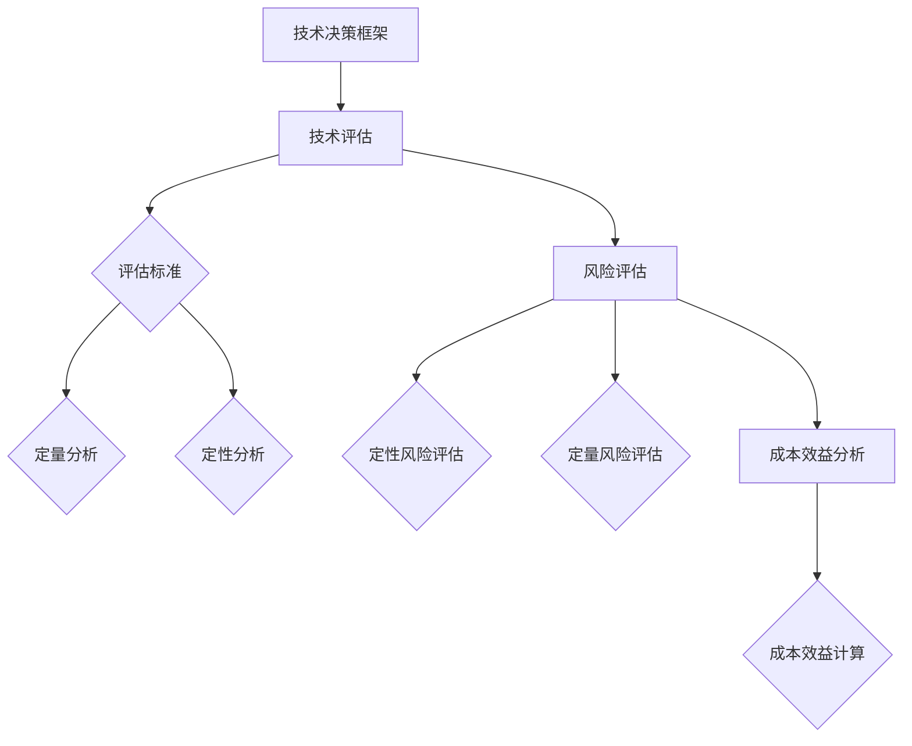

                 

### 前言

在快速变化的科技时代，技术决策的重要性愈发凸显。技术决策不仅影响企业的战略发展方向，还直接关系到项目的成败和资源的有效利用。然而，技术决策并非易事，它需要综合考虑多方面的因素，如技术可行性、成本效益、风险控制、市场需求等。如何在这个复杂的环境中做出合理的技术选择，成为了企业和IT从业者亟待解决的关键问题。

本文旨在为读者提供一个系统的技术决策框架，帮助他们在面对技术选择时，能够更加理性、科学地进行决策。我们将通过逐步分析、推理和思考，详细介绍技术决策的核心概念、构建方法、应用场景以及项目管理中的技术决策实践。

本文将分为四个主要部分：

1. **技术决策概述**：介绍技术决策的定义、重要性、挑战和核心概念。
2. **构建技术决策框架**：详细解析技术评估方法、风险评估、成本效益分析和技术决策框架的设计与实施。
3. **技术决策框架下的具体技术应用**：探讨人工智能、大数据、云计算和区块链等具体技术的决策应用。
4. **技术决策与项目管理**：分析技术决策在项目管理中的应用、团队协作和项目风险管理。

通过这篇文章，我们希望读者能够：

- **理解技术决策的核心概念和重要性**，认识到其在企业和项目管理中的关键作用。
- **掌握构建技术决策框架的方法和技巧**，学会如何科学、系统地做出技术选择。
- **了解技术决策在具体技术应用中的实践**，能够将理论知识应用到实际项目中。
- **掌握技术决策与项目管理的结合**，提高项目管理的效率和质量。

技术决策不仅是一门科学，也是一门艺术。希望通过本文的阐述，读者能够在技术决策的道路上更加自信和从容。现在，让我们开始深入的探讨和思考，一起构建属于自己的技术决策框架。

----------------------------------------------------------------

## 技术决策概述

### 问题背景与问题描述

随着信息技术的飞速发展，企业面临的竞争环境日益复杂和多变。在这种背景下，技术决策成为了企业保持竞争力、实现持续发展的关键。技术决策不仅仅是选择一种技术或工具，它涉及到一系列复杂的分析和评估过程，旨在确保选定的技术方案能够最大限度地满足业务需求、提升效率和降低风险。

#### 问题背景

1. **市场竞争加剧**：在数字化时代，市场竞争更加激烈，企业必须不断创新和优化其技术架构，以应对不断变化的市场需求和客户期望。
2. **技术变革迅速**：新兴技术的不断涌现，如人工智能、大数据、云计算和区块链等，为企业和项目提供了更多的选择，但也带来了复杂的技术决策问题。
3. **资源有限**：企业通常面临资源有限的问题，包括时间、人力和资金等，这要求技术决策必须更加科学和高效，以确保资源的最佳利用。

#### 问题描述

技术决策的核心问题包括：

1. **选择正确的技术方案**：在多种技术选项中，如何选择最适合当前和未来需求的技术方案，是一个关键问题。
2. **平衡短期与长期利益**：技术决策需要在短期效益和长期战略之间找到平衡，避免因短期决策而影响长期的可持续发展。
3. **风险评估与管理**：技术决策过程中必须考虑潜在的技术风险，并制定相应的风险应对策略。
4. **成本与效益分析**：如何评估技术投入的回报，确保技术决策的经济合理性。

综上所述，技术决策不仅是一个技术问题，更是一个战略问题。它需要从多维度进行综合分析和评估，以确保企业的技术投资能够带来最大的价值。

### 技术决策的重要性

技术决策的重要性体现在以下几个方面：

1. **影响企业战略方向**：技术决策直接关系到企业的战略方向和发展路径。选择合适的技术方案，能够推动企业业务的创新发展，提升市场竞争力。
2. **资源优化配置**：合理的技术决策能够确保企业资源（如资金、人力和时间）的最佳利用，避免资源浪费和重复投资。
3. **提升项目成功率**：技术决策的正确与否直接影响到项目的成功与否。一个错误的技术选择可能导致项目延期、超预算和业务目标无法达成。
4. **风险管理**：通过技术决策框架，企业可以系统性地识别、评估和管理技术风险，降低技术不确定性带来的负面影响。

因此，技术决策是企业生存和发展的重要环节。一个成熟的技术决策框架，不仅能够帮助企业应对复杂的市场环境，还能够提高企业的整体运营效率和竞争力。

### 技术决策的挑战

尽管技术决策的重要性显而易见，但在实际操作中，技术决策面临诸多挑战：

1. **信息不对称**：企业内部不同部门之间可能存在信息不对称的问题，导致决策者无法全面了解技术细节和业务需求。
2. **技术复杂度高**：随着技术的快速发展，许多技术方案的复杂度不断增加，技术决策者需要具备广泛的技术知识和实践经验。
3. **时间压力**：在市场竞争激烈的环境下，技术决策往往需要在短时间内完成，这增加了决策的难度和风险。
4. **利益冲突**：不同利益相关者可能对技术决策有不同的期望和偏好，如何在利益冲突中做出公正的决策是一个重要挑战。

为了应对这些挑战，企业需要建立科学、系统的技术决策框架，提升决策的透明度和科学性。通过多方面的信息收集、技术评估和风险评估，确保技术决策的合理性和有效性。

### 技术决策的核心概念与联系

#### 核心概念

1. **技术评估**：技术评估是技术决策的基础，涉及对技术方案的技术可行性、成本效益、风险等方面进行详细评估。
2. **风险评估**：风险评估是识别和评估技术实施过程中可能面临的风险，并制定相应的风险应对策略。
3. **成本效益分析**：成本效益分析是评估技术决策的经济合理性，通过比较技术投入与预期回报，确定最佳技术方案。
4. **技术决策框架**：技术决策框架是一个系统化的决策模型，包含评估方法、风险评估、成本效益分析等核心要素，用于指导技术决策过程。

#### 核心要素组成

1. **评估标准**：评估标准是技术评估的重要参考，包括技术可行性、性能指标、成本、风险等。
2. **评估方法**：评估方法包括定量分析和定性分析，如专家评审、SWOT分析、成本效益分析等。
3. **风险评估**：风险评估包括定性风险评估和定量风险评估，如风险矩阵、风险优先级排序等。
4. **成本效益分析**：成本效益分析通过计算技术投入与预期回报的比值，确定技术方案的经济合理性。

#### 概念属性特征对比表格

| 概念       | 定义                                                         | 属性特征 | 特征对比 |
| ---------- | ------------------------------------------------------------ | -------- | ------- |
| 技术评估   | 对技术方案的技术可行性、成本效益、风险等方面进行评估          | 定量/定性 | 精确度  |
| 风险评估   | 识别和评估技术实施过程中可能面临的风险，并制定相应的风险应对策略 | 定量/定性 | 全面性  |
| 成本效益分析 | 通过计算技术投入与预期回报的比值，确定技术方案的经济合理性     | 定量     | 经济性  |
| 技术决策框架 | 系统化的决策模型，用于指导技术决策过程                     | 整体性   | 科学性  |

#### 概念结构与核心要素组成关系图

通过上述分析，我们可以看到技术决策的核心概念和要素之间是相互联系、相互作用的。一个成熟的技术决策框架，能够帮助企业从多维度、多角度进行全面、系统的技术评估和决策，确保技术决策的科学性和合理性。

### 技术决策与传统决策方法的对比

在技术决策领域，传统决策方法与现代技术决策框架之间存在显著差异。传统决策方法通常依赖于个人经验、直觉和主观判断，而现代技术决策框架则更加系统化、科学化和数据驱动。

#### 传统决策方法

1. **依赖个人经验**：传统决策方法往往依赖于决策者的个人经验和直觉。这种方式在简单和熟悉的环境中可能有效，但在复杂和不确定的环境中则容易导致决策失误。
2. **缺乏系统化流程**：传统决策缺乏系统化的流程和工具支持，决策过程中容易受到个人情感和偏见的影响。
3. **信息不对称**：传统决策方法通常缺乏全面和准确的信息支持，决策者可能无法全面了解技术细节和业务需求。

#### 现代技术决策框架

1. **系统化流程**：现代技术决策框架采用系统化的流程，包括技术评估、风险评估、成本效益分析等环节，确保决策的全面性和科学性。
2. **数据驱动**：现代技术决策框架以数据为基础，通过定量分析和定性分析，全面评估技术方案的各种指标，提高决策的准确性和可靠性。
3. **工具支持**：现代技术决策框架借助各种决策工具和软件，如专家评审系统、风险矩阵、成本效益分析软件等，提高决策效率和效果。

#### 对比分析

1. **决策质量**：现代技术决策框架通过系统化和数据驱动的流程，能够提高决策的质量和可靠性，减少主观判断和经验依赖的误差。
2. **决策效率**：现代技术决策框架采用自动化工具和流程，能够显著提高决策效率，缩短决策时间。
3. **决策透明度**：现代技术决策框架提供详细的决策依据和过程记录，提高决策的透明度和可追溯性，便于后续的监督和审计。

总之，现代技术决策框架相较于传统决策方法，具有更高的科学性、系统性和数据驱动力，能够更好地应对复杂和多变的市场环境，为企业提供更加可靠和有效的技术决策支持。

### 技术决策在企业中的应用

技术决策在企业运营和发展中扮演着至关重要的角色。通过科学合理的技术决策，企业能够优化业务流程、提升运营效率、开拓新的市场机会，并有效应对技术变革带来的挑战。

#### 企业技术决策的现状

当前，企业在技术决策方面呈现出以下几个方面的特点：

1. **技术依赖程度增加**：随着数字化转型的深入，企业对技术的依赖程度显著增加。技术决策不仅仅是IT部门的职责，而是涉及企业各个业务部门和层级的共同决策过程。
2. **技术多样性和复杂性**：企业面临的技术选择日益多样化，如云计算、大数据、人工智能、区块链等新兴技术的广泛应用，使得技术决策更加复杂。
3. **决策流程不规范**：许多企业的技术决策流程尚未完全规范化，决策过程中可能存在信息不对称、决策效率低下等问题。

#### 技术决策对企业发展的影响

1. **提升竞争力**：通过科学合理的技术决策，企业能够快速响应市场需求，优化业务流程，提高生产效率和产品质量，从而在激烈的市场竞争中保持优势。
2. **推动业务创新**：技术决策不仅关注现有业务的技术优化，还关注新兴技术带来的业务创新机会，如通过大数据分析挖掘新的商业模式，利用人工智能提升用户体验等。
3. **降低运营风险**：科学的技术决策能够帮助企业识别和评估潜在的技术风险，制定有效的风险应对策略，降低技术实施过程中的不确定性，确保业务稳定运营。

#### 技术决策的最佳实践

为了提高技术决策的质量和效果，企业可以借鉴以下最佳实践：

1. **建立技术决策框架**：企业应建立系统化的技术决策框架，明确技术评估、风险评估、成本效益分析等核心环节，确保决策过程的科学性和透明度。
2. **跨部门协作**：技术决策涉及多个部门和层级的利益，企业应促进跨部门协作，确保决策过程中信息共享和资源整合。
3. **数据驱动决策**：充分利用数据分析和模型预测，为企业技术决策提供可靠的数据支持，减少主观判断和经验依赖。
4. **持续改进**：技术决策不是一次性的过程，企业应建立持续改进机制，根据市场变化和技术发展，及时调整和优化技术决策框架。

通过以上实践，企业能够更好地应对技术变革，实现可持续发展和长期竞争力。

### 技术决策的边界与外延

在技术决策过程中，明确其边界与外延至关重要。这不仅有助于界定技术决策的范围，还能为决策提供清晰的指导方向。

#### 技术决策的领域范围

技术决策的领域范围涵盖了企业运营的各个方面，包括但不限于：

1. **产品开发**：涉及技术选型、架构设计、开发工具和平台选择等。
2. **系统集成**：包括企业现有系统的升级、扩展和新系统的引入。
3. **技术基础设施**：如数据中心建设、网络架构优化、云服务选择等。
4. **业务流程优化**：利用新技术改进业务流程，提高效率和减少成本。
5. **新兴技术应用**：如人工智能、大数据、区块链等新兴技术的引入与落地。

#### 技术决策的时间维度

技术决策不仅仅关注短期效果，还需要考虑长期影响。因此，时间维度在技术决策中至关重要：

1. **短期决策**：关注当前项目或业务需求，通常涉及短期目标和效益，如系统升级、优化现有流程等。
2. **长期决策**：考虑企业的战略发展方向和长远利益，涉及大规模技术投入、新技术的引入和应用等。
3. **持续决策**：技术决策是一个持续迭代和优化的过程，需要定期评估和调整，以适应技术发展和市场变化。

#### 技术决策的影响因素

技术决策过程中需要综合考虑多种影响因素，以确保决策的科学性和合理性：

1. **技术可行性**：评估所选技术的可行性，包括技术成熟度、实施难度和风险等。
2. **市场需求**：分析市场需求和用户需求，确保技术决策能够满足用户需求并带来市场价值。
3. **成本与效益**：进行详细的成本效益分析，确保技术投入能够带来相应的经济效益。
4. **风险评估**：识别和评估潜在的技术风险，并制定相应的风险应对策略。
5. **资源限制**：考虑企业的资源状况，如资金、人力和时间等，确保技术决策在资源范围内实施。
6. **法律法规**：遵守相关法律法规，确保技术决策符合政策要求。

#### 边界与外延的具体应用

1. **内部边界**：技术决策在企业内部需要明确责任分工，确保各部门职责明确，避免决策过程中的信息孤岛和资源浪费。
2. **外部边界**：技术决策还需要考虑外部环境的影响，如市场动态、竞争态势、技术发展趋势等，确保决策的适应性。
3. **综合应用**：在实际应用中，技术决策需要结合内部边界和外部边界，综合考虑多种因素，以制定出最优的技术决策方案。

通过明确技术决策的边界与外延，企业能够更加科学、系统地制定技术决策，确保技术方案的有效实施和持续优化。

### 本章小结

本章对技术决策进行了全面的概述，探讨了技术决策的问题背景与问题描述，技术决策的重要性与挑战，以及技术决策的核心概念与联系。通过对比传统决策方法，我们了解到现代技术决策框架的科学性、系统性和数据驱动力。此外，本章还详细阐述了技术决策在企业中的应用及其边界与外延。通过这些分析，我们为构建技术决策框架奠定了基础，并认识到科学合理的技术决策对企业发展的重要性。

----------------------------------------------------------------

## 构建技术决策框架

技术决策框架是指导企业在复杂多变的环境中做出科学、合理的技术选择的关键工具。一个完善的技术决策框架应包括技术评估方法、风险评估、成本效益分析以及技术决策框架的设计与实施。以下我们将逐一详细探讨这些核心要素。

### 技术评估方法

技术评估是技术决策框架的基础，旨在对各个技术方案进行全面、系统的评估，以确保选定的技术方案能够满足业务需求、具备可行性且具有潜在的优势。

#### 技术评估的概念

技术评估是指通过多种方法和工具，对技术方案的技术可行性、成本、性能、风险等方面进行系统性的分析和评估，以确定其是否适合企业的需求。

#### 技术评估的标准

技术评估的标准包括以下几个方面：

1. **技术可行性**：评估技术方案是否能够实现业务需求，技术实现难度如何。
2. **性能指标**：评估技术方案的性能，如速度、稳定性、扩展性等。
3. **成本**：评估技术方案的实施成本，包括硬件、软件、人力等。
4. **安全性**：评估技术方案的安全性能，包括数据保护、网络安全等。
5. **风险**：评估技术方案在实施过程中可能面临的风险，如技术风险、市场风险、法律风险等。
6. **兼容性**：评估技术方案与企业现有系统、工具和流程的兼容性。
7. **可维护性**：评估技术方案的维护成本和维护难易程度。

#### 技术评估的工具

1. **专家评审**：通过邀请行业专家对技术方案进行评审，获取专业的意见和建议。
2. **SWOT分析**：对技术方案的优点（Strengths）、弱点（Weaknesses）、机会（Opportunities）和威胁（Threats）进行系统分析。
3. **成本效益分析**：通过计算技术投入与预期收益的比值，评估技术方案的经济合理性。
4. **风险评估矩阵**：通过定性或定量方法，对技术方案的风险进行排序和评估。

### 风险评估

风险评估是技术决策框架中的关键环节，旨在识别和评估技术方案实施过程中可能面临的各种风险，并制定相应的应对策略。

#### 风险评估的定义

风险评估是指通过系统化的方法，识别、评估和管理技术决策过程中可能出现的风险，以确保技术方案的实施能够顺利进行，并降低潜在的不利影响。

#### 风险评估的方法

1. **定性风险评估**：通过专家评审、头脑风暴等方法，对风险的发生可能性及其影响程度进行主观判断。
2. **定量风险评估**：使用数学模型和统计方法，对风险的发生概率及其影响进行定量计算。
3. **风险矩阵**：通过风险矩阵对风险的发生可能性及其影响程度进行定量评估，并排序和优先级排序。
4. **风险优先级排序**：根据风险评估结果，对风险进行优先级排序，确定优先处理的风险。

#### 风险评估的案例分析

例如，在引入一个新的数据中心架构时，可以通过以下步骤进行风险评估：

1. **识别风险**：可能的风险包括硬件故障、网络中断、数据丢失等。
2. **评估风险**：使用风险矩阵评估各个风险的发生概率和影响程度。
3. **制定应对策略**：针对高优先级的风险，制定具体的应对策略，如增加冗余硬件、部署网络监控工具、定期备份数据等。
4. **监控和调整**：在实施过程中持续监控风险状态，并根据实际情况调整应对策略。

### 成本效益分析

成本效益分析是技术决策过程中不可或缺的环节，旨在通过比较技术投入与预期回报，确定技术方案的经济合理性。

#### 成本效益分析的基本原理

成本效益分析的基本原理是通过计算技术投入（成本）与预期回报（效益）的比值，评估技术方案的经济合理性。

公式：效益/成本 = 效益指标 / 成本指标

其中，效益指标通常包括销售收入、成本节约、用户体验提升等，成本指标包括直接成本（如硬件、软件采购费用）和间接成本（如培训、维护费用）。

#### 成本效益分析的工具

1. **财务分析工具**：如净现值（NPV）、内部收益率（IRR）、回收期等。
2. **成本效益比（CBR）**：计算技术投入与预期收益的比值，用于评估技术方案的经济性。
3. **成本节约计算**：通过对现有业务流程的分析，计算采用新技术后的成本节约情况。
4. **收益预测模型**：通过市场调研、历史数据分析等方法，预测采用新技术后的收益情况。

#### 成本效益分析的实际应用

例如，在考虑引入一个新的客户关系管理系统（CRM）时，可以通过以下步骤进行成本效益分析：

1. **计算成本**：包括软件采购费用、硬件采购费用、培训费用、维护费用等。
2. **预测效益**：包括提高销售业绩、降低客户流失率、提高工作效率等。
3. **计算成本效益比**：将预期收益与总成本进行比较，判断经济性。
4. **评估风险**：考虑潜在的风险，如市场变化、技术实施风险等，调整预测结果。

### 技术决策框架的设计与实施

技术决策框架的设计与实施是一个系统化、结构化的过程，旨在通过明确的步骤和工具，确保技术决策的科学性和有效性。

#### 技术决策框架的设计原则

1. **系统性**：确保技术决策框架涵盖所有相关环节，如技术评估、风险评估、成本效益分析等。
2. **科学性**：采用科学的方法和工具，如专家评审、数据分析等，提高决策的准确性。
3. **可操作性**：设计易于操作的流程和工具，确保决策框架在实际应用中能够顺利实施。
4. **灵活性**：技术决策框架应具备一定的灵活性，能够根据实际情况进行调整和优化。

#### 技术决策框架的实施步骤

1. **需求分析**：明确技术需求，包括业务需求、用户需求等。
2. **技术评估**：对多个技术方案进行评估，选择最优的技术方案。
3. **风险评估**：识别和评估技术方案在实施过程中可能面临的风险，并制定应对策略。
4. **成本效益分析**：计算技术投入与预期收益，确保决策的经济合理性。
5. **决策**：根据技术评估、风险评估和成本效益分析的结果，做出最终的技术决策。
6. **实施与监控**：按照决策方案实施技术方案，并持续监控实施过程，确保技术方案的顺利执行。
7. **调整与优化**：根据实施过程中的反馈和实际情况，对技术决策框架进行调整和优化。

#### 技术决策框架的案例研究

以一家中型企业的数据中心迁移决策为例，通过以下步骤实施技术决策框架：

1. **需求分析**：明确现有数据中心存在的问题，如容量不足、性能不稳定等，以及未来的业务需求。
2. **技术评估**：评估多个云服务提供商的技术方案，包括成本、性能、安全性、可靠性等。
3. **风险评估**：识别迁移过程中可能的风险，如数据泄露、服务中断等，并制定相应的风险应对策略。
4. **成本效益分析**：计算不同技术方案的成本与预期效益，比较各方案的性价比。
5. **决策**：选择最适合企业需求的云服务提供商，并制定详细的迁移计划。
6. **实施与监控**：按照迁移计划实施数据中心迁移，并实时监控迁移过程，确保迁移顺利进行。
7. **调整与优化**：在迁移完成后，对技术决策框架进行总结和优化，为未来的技术决策提供参考。

### 技术决策的监督与调整

技术决策不是一次性的过程，而是一个持续迭代和优化的过程。通过有效的监督与调整，企业能够确保技术决策的持续有效性。

#### 技术决策的监督机制

1. **定期评估**：定期对技术决策的实施效果进行评估，包括技术性能、成本效益、用户反馈等。
2. **监控工具**：使用监控工具和软件，实时监控技术方案的实施状态和性能指标。
3. **反馈机制**：建立有效的反馈机制，收集用户和技术团队的意见和建议，及时调整和优化技术决策。

#### 技术决策的调整策略

1. **风险调整**：根据实际风险状况，调整风险应对策略，确保技术方案能够应对各种不确定性。
2. **成本调整**：根据实际成本支出和预期效益，调整技术投入预算，确保经济合理性。
3. **需求调整**：根据业务需求和用户反馈，调整技术方案，确保技术决策能够满足实际需求。
4. **持续改进**：通过持续改进，优化技术方案，提升技术性能和用户体验。

#### 技术决策的持续改进

技术决策的持续改进是企业保持竞争力的关键。通过以下措施，企业能够不断提升技术决策的质量和效果：

1. **知识积累与分享**：总结技术决策过程中的经验和教训，形成知识库，供后续决策参考。
2. **培训与学习**：定期对决策团队进行培训和学习，提升团队的技术能力和决策水平。
3. **数据驱动**：利用数据分析方法，对技术决策的过程和结果进行深入分析，发现问题和改进机会。
4. **迭代优化**：根据实际情况，对技术决策框架进行迭代和优化，确保其适应不断变化的市场和技术环境。

通过上述分析和实践，企业能够构建一个科学、系统的技术决策框架，确保技术决策的合理性和有效性，为企业的长期发展提供有力支持。

### 本章小结

本章详细探讨了构建技术决策框架的各个方面，包括技术评估方法、风险评估、成本效益分析和技术决策框架的设计与实施。通过系统化和科学化的方法，企业能够提高技术决策的准确性和可靠性。此外，本章还强调了技术决策的监督与调整的重要性，确保技术决策能够持续优化和改进。通过本章的学习，读者应能够理解如何构建一个有效的技术决策框架，并在实际工作中应用这些方法，提高企业的技术决策能力。

----------------------------------------------------------------

## 技术决策框架下的具体技术应用

技术决策框架在实际应用中涉及多种具体技术的选择和实施，这些技术包括人工智能、大数据、云计算和区块链等。每个技术都有其独特的原理、应用场景和优势。本章节将逐一探讨这些技术的决策框架和应用实践。

### 人工智能决策

#### 人工智能概述

人工智能（Artificial Intelligence，AI）是计算机科学的一个分支，致力于使计算机模拟人类的智能行为。人工智能技术包括机器学习、深度学习、自然语言处理、计算机视觉等子领域。

#### 人工智能决策的核心技术

1. **机器学习**：机器学习是一种通过数据训练模型，使其能够对未知数据进行预测和决策的技术。常用的算法包括决策树、支持向量机、神经网络等。
2. **深度学习**：深度学习是机器学习的一种方法，通过多层神经网络对数据进行学习和处理，能够实现更复杂的预测和决策。
3. **自然语言处理**：自然语言处理（Natural Language Processing，NLP）是一种让计算机理解和生成人类语言的技术，广泛应用于语音识别、机器翻译、文本分析等领域。
4. **计算机视觉**：计算机视觉（Computer Vision）是一种让计算机理解图像和视频的技术，广泛应用于图像识别、物体检测、自动驾驶等领域。

#### 人工智能决策的应用案例

1. **智能客服**：通过自然语言处理和机器学习技术，智能客服系统能够自动处理用户查询，提供高效、准确的客服服务。
2. **智能推荐系统**：利用深度学习和大数据分析技术，智能推荐系统可以准确预测用户兴趣，为用户推荐个性化的商品或内容。
3. **自动驾驶**：通过计算机视觉和深度学习技术，自动驾驶系统能够实时感知道路环境，做出安全、准确的驾驶决策。

### 大数据决策

#### 大数据概述

大数据（Big Data）是指数据量巨大、类型繁多、生成速度极快的数据集合。大数据技术包括数据采集、存储、处理、分析和可视化等环节。

#### 大数据决策的方法论

1. **数据采集**：通过各种渠道收集数据，如企业内部系统、传感器、社交媒体等。
2. **数据存储**：使用分布式存储技术，如Hadoop、Spark等，存储大规模数据。
3. **数据处理**：利用分布式计算技术，对大规模数据进行高效处理，如数据清洗、数据挖掘、统计分析等。
4. **数据分析**：通过机器学习和统计分析方法，对数据进行深入分析，提取有价值的信息。
5. **数据可视化**：使用数据可视化工具，如Tableau、Power BI等，将数据分析结果以图表、报表等形式展示，便于理解和决策。

#### 大数据决策的成功案例

1. **精准营销**：通过大数据分析，企业可以精确了解用户需求，实现精准营销，提高销售转化率。
2. **供应链优化**：通过大数据分析，企业可以优化供应链管理，提高库存周转率，降低运营成本。
3. **风险控制**：通过大数据分析，金融机构可以识别和评估潜在风险，提高信贷审批的准确性和效率。

### 云计算决策

#### 云计算概述

云计算是一种通过互联网提供动态可伸缩的虚拟化资源的服务模式。云计算技术包括IaaS、PaaS、SaaS等。

#### 云计算决策的优势

1. **弹性伸缩**：云计算可以根据需求自动调整资源，实现弹性伸缩，降低运营成本。
2. **高可用性**：云计算提供多节点部署和容错机制，确保服务的高可用性。
3. **高效性**：云计算提供高效的数据处理和分析能力，支持大规模数据存储和计算。
4. **便捷性**：云计算服务可以随时随地访问，提高工作效率。

#### 云计算决策的实施路径

1. **需求分析**：明确业务需求，确定云计算服务的类型和规模。
2. **技术评估**：评估不同云计算提供商的技术性能、成本、安全性等，选择合适的云计算平台。
3. **迁移规划**：制定详细的迁移计划，包括数据迁移、系统调整、人员培训等。
4. **实施与部署**：按照迁移计划实施云计算服务，并进行测试和优化。
5. **监控与维护**：建立监控和运维机制，确保云计算服务的稳定运行。

#### 云计算决策的应用场景

1. **企业应用**：企业可以利用云计算实现企业应用的部署和运维，提高效率和降低成本。
2. **大数据处理**：云计算提供强大的数据处理能力，适用于大规模数据分析和处理。
3. **物联网**：云计算与物联网结合，可以实现设备的远程监控和管理，提高物联网应用的可靠性。

### 区块链决策

#### 区块链概述

区块链是一种分布式账本技术，通过加密算法和共识机制确保数据的不可篡改和透明性。区块链技术包括区块链协议、智能合约等。

#### 区块链决策的原理

1. **分布式账本**：区块链通过多个节点存储数据，每个节点都有完整的数据副本，确保数据的不可篡改。
2. **加密算法**：区块链使用加密算法确保数据的隐私和安全，防止未授权访问和篡改。
3. **共识机制**：区块链采用共识机制，确保多个节点对数据的共识和一致性。

#### 区块链决策的应用领域

1. **金融**：区块链技术在金融领域有广泛应用，如加密货币、跨境支付、智能合约等。
2. **供应链管理**：区块链技术可以追踪供应链中的每一个环节，确保供应链的透明性和可追溯性。
3. **身份认证**：区块链技术可以用于身份认证，提高身份信息的真实性和安全性。

#### 区块链决策案例分析

以一家零售企业的供应链管理为例，通过以下步骤进行区块链决策：

1. **需求分析**：明确供应链管理的需求，如产品追溯、库存管理、支付流程等。
2. **技术评估**：评估不同区块链平台的性能、安全性、扩展性等，选择合适的区块链平台。
3. **系统设计**：设计区块链系统架构，包括节点部署、数据结构、智能合约等。
4. **实施与部署**：按照设计方案实施区块链系统，并进行测试和优化。
5. **监控与维护**：建立监控和运维机制，确保区块链系统的稳定运行。

### 技术集成与协同决策

随着技术的不断发展，不同技术之间的集成和协同应用变得越来越重要。技术集成与协同决策的目标是实现多种技术的优势互补，提高整体解决方案的性能和效率。

#### 技术集成的概念

技术集成是指将多种技术手段有机结合，实现不同技术之间的优势互补，形成一个整体解决方案。技术集成包括硬件集成、软件集成、网络集成等。

#### 技术集成的挑战

1. **兼容性**：不同技术之间可能存在兼容性问题，需要解决接口、协议、数据格式等方面的兼容性。
2. **复杂性**：技术集成通常涉及多个技术领域，需要具备跨领域的综合技术能力。
3. **安全性**：技术集成过程中需要确保系统的整体安全性，防止安全漏洞和风险。

#### 技术集成的成功实践

1. **智慧城市建设**：智慧城市通过集成物联网、云计算、大数据、人工智能等技术，实现城市管理的智能化和高效化。
2. **金融科技应用**：金融科技（FinTech）通过集成区块链、云计算、人工智能等技术，提供更加安全、便捷的金融服务。
3. **智能制造**：智能制造通过集成物联网、大数据、人工智能等技术，实现生产过程的自动化和智能化。

### 本章小结

本章详细探讨了技术决策框架在具体技术应用中的实践，包括人工智能、大数据、云计算和区块链等技术的决策框架和应用案例。通过这些案例，我们了解了如何在不同应用场景中利用技术决策框架做出合理的技术选择，并实现技术的集成和协同应用。通过本章的学习，读者应能够掌握技术决策的具体应用方法，提高在实际项目中的技术决策能力。

----------------------------------------------------------------

## 技术决策与项目管理

### 项目管理概述

项目管理是确保项目按时、按预算、按质量完成的一项系统性活动。它包括计划、执行、监控和收尾等核心过程，并运用一系列方法和工具来确保项目的成功。

#### 项目的定义与类型

**项目的定义**：
项目是一个临时的、独特的任务，旨在创造一个特定的产品、服务或成果。项目具有以下特点：
- **临时性**：项目有明确的开始和结束时间。
- **独特性**：每个项目都有特定的目标，与日常运营活动不同。
- **目标导向**：项目追求特定的成果，如新产品开发、系统升级等。

**项目的类型**：
项目可以分为多种类型，包括：
1. **软件开发项目**：涉及开发新的软件系统或对现有系统进行升级。
2. **基础设施建设项目**：如建造建筑物、道路、桥梁等。
3. **市场营销项目**：包括市场调研、品牌推广等。
4. **技术研发项目**：涉及新技术的研究和开发。

#### 项目管理的核心过程

**项目计划**：
项目计划是项目管理的第一步，包括定义项目目标、确定项目范围、制定工作计划、分配资源等。项目计划为项目执行提供了清晰的指导。

**项目执行**：
项目执行是项目计划的实施阶段，包括组织团队、分配任务、执行工作、协调各方等。执行过程中需要确保项目按计划进行，并及时调整计划以应对变化。

**项目监控**：
项目监控是跟踪项目进展、管理风险、确保项目目标的实现。监控过程中需要定期审查项目进度、成本和质量，并采取必要的纠正措施。

**项目收尾**：
项目收尾是项目完成的最后阶段，包括交付项目成果、总结项目经验、项目验收等。通过项目收尾，确保项目正式结束，并从项目中获取有益的经验和教训。

#### 项目管理的方法与工具

**项目管理方法论**：
项目管理方法论包括不同的方法和框架，如PMBOK（项目管理知识体系）、Agile（敏捷开发方法）等。不同的方法论适用于不同的项目类型和环境。

**项目管理工具**：
项目管理工具用于支持项目计划、执行和监控。常见的管理工具包括：
- **项目计划工具**：如Microsoft Project、GanttProject等。
- **任务管理工具**：如Trello、JIRA等。
- **沟通工具**：如Slack、Microsoft Teams等。
- **风险管理工具**：如Risk Register、Qualys等。
- **文档管理工具**：如Confluence、SharePoint等。

### 技术决策在项目管理中的应用

技术决策在项目管理中起着至关重要的作用，它直接影响项目的成功与否。以下探讨技术决策在项目管理中的应用及其挑战。

#### 技术决策在项目规划中的角色

在项目规划阶段，技术决策的主要任务是确定项目的技术方向和架构。具体应用包括：
1. **技术选型**：选择最适合项目需求的技术方案，如编程语言、框架、数据库等。
2. **系统架构设计**：设计项目的系统架构，包括前端、后端、数据库、中间件等。
3. **技术风险评估**：评估项目实施过程中可能面临的技术风险，并制定相应的应对策略。
4. **技术可行性分析**：评估技术方案的技术可行性，确保项目能够在预定时间内完成。

#### 技术决策在项目执行中的挑战

在项目执行阶段，技术决策面临以下挑战：
1. **技术复杂性**：随着技术的发展，项目的技术复杂性不断增加，需要技术决策者具备丰富的技术知识和实践经验。
2. **技术变更**：项目进行过程中，技术需求可能发生变化，需要及时调整技术决策，确保项目能够继续推进。
3. **资源限制**：项目通常面临资源（如时间、人力、资金）的限制，技术决策需要在资源有限的情况下做出最优选择。

#### 技术决策在项目监控与控制中的重要性

技术决策在项目监控与控制中的重要性体现在以下几个方面：
1. **进度控制**：通过技术监控，确保项目按计划进行，及时发现并解决技术问题，避免项目延期。
2. **成本控制**：技术决策的合理性直接影响项目的成本效益，通过监控技术决策的执行情况，确保项目成本控制在预算范围内。
3. **质量控制**：技术决策的质量直接影响项目成果的质量。通过技术监控，确保技术方案的有效实施，提高项目成果的可靠性和稳定性。

### 技术决策与团队协作

技术决策的顺利实施离不开团队协作。以下探讨技术决策对团队协作的影响以及提高团队协作的技术决策策略。

#### 技术决策对团队协作的影响

1. **沟通障碍**：技术决策涉及多个技术领域，不同团队成员可能存在沟通障碍，影响决策的顺利进行。
2. **意见分歧**：不同团队成员可能对技术方案有不同的看法和意见，需要在决策过程中进行协调和统一。
3. **职责划分**：技术决策需要明确各个团队成员的职责和任务，确保技术决策的有效实施。

#### 提高团队协作的技术决策策略

1. **建立协作文化**：营造开放、透明、协作的文化氛围，鼓励团队成员积极参与技术决策过程。
2. **明确责任分工**：根据团队成员的专业技能和经验，明确技术决策中的责任分工，确保各成员能够充分发挥自己的优势。
3. **定期沟通与反馈**：通过定期会议、报告等方式，保持团队成员之间的沟通和协作，及时解决意见分歧和问题。
4. **利用协作工具**：利用项目管理工具和沟通工具，提高团队协作效率和决策透明度。

### 团队协作工具的应用

以下介绍几种常用的团队协作工具：

1. **项目管理工具**：如JIRA、Trello、Asana等，用于任务分配、进度跟踪和协作管理。
2. **版本控制工具**：如Git、Subversion等，用于代码管理和团队协作。
3. **沟通工具**：如Slack、Microsoft Teams、Zoom等，用于实时沟通和协作。
4. **文档共享工具**：如Google Docs、Confluence等，用于文档共享和协作编辑。

### 项目风险管理

项目风险管理是项目管理的重要组成部分，旨在识别、评估和应对项目实施过程中可能出现的风险。以下探讨项目风险管理的概念、方法与实践。

#### 风险管理的概念

**风险识别**：识别项目中可能出现的各种风险，如技术风险、市场风险、资源风险等。

**风险评估**：对识别出的风险进行评估，包括风险的可能性及其影响程度。

**风险应对**：制定风险应对策略，包括风险规避、风险减轻、风险接受等。

**风险监控**：在项目实施过程中持续监控风险状态，并根据实际情况调整风险应对策略。

#### 风险识别与评估

1. **头脑风暴**：通过头脑风暴方法，集思广益，识别项目中的潜在风险。
2. **专家评审**：邀请相关专家对项目风险进行评估，获取专业的意见和建议。
3. **风险矩阵**：使用风险矩阵对风险进行定量评估，确定风险的优先级和应对策略。

#### 风险应对与监控

1. **风险规避**：通过调整项目计划或技术方案，避免风险的发生。
2. **风险减轻**：通过增加冗余资源、制定应急预案等措施，降低风险的影响程度。
3. **风险接受**：对于无法避免或减轻的风险，制定风险接受策略，确保项目能够继续推进。
4. **持续监控**：在项目实施过程中，持续监控风险状态，并根据实际情况调整风险应对策略。

### 项目案例分析

以下以一个软件开发项目为例，介绍技术决策在项目管理中的应用过程。

#### 项目介绍

某企业计划开发一款客户关系管理系统（CRM），以提高销售效率和管理客户信息。项目预计历时12个月，预算为500万元。

#### 系统功能设计

系统功能包括：
1. **客户信息管理**：记录和存储客户的基本信息、联系历史等。
2. **销售机会管理**：跟踪销售机会的状态、进展和预计收益。
3. **营销活动管理**：策划和执行营销活动，跟踪活动效果。
4. **报表与分析**：生成销售报表和分析报告，辅助决策。

#### 系统架构设计

系统采用B/S架构，分为前端、后端和数据库三部分：
1. **前端**：使用React框架实现，提供友好的用户界面。
2. **后端**：使用Spring Boot框架实现，提供业务逻辑处理和接口服务。
3. **数据库**：使用MySQL数据库存储数据，确保数据的安全和可靠性。

#### 技术决策与实施

1. **技术选型**：根据项目需求，选择适合的技术框架和开发工具。
2. **风险评估**：识别技术实施过程中的风险，如技术难度、人员配备、硬件需求等，并制定应对策略。
3. **成本效益分析**：计算技术投入与预期收益的比值，确保技术决策的经济合理性。
4. **实施与监控**：按照技术决策方案实施项目，并实时监控项目进度、成本和质量。

#### 项目小结

通过技术决策框架，该项目顺利完成了系统设计和开发，成功上线并投入使用。项目实现了客户信息的统一管理、销售机会的跟踪和营销活动的策划执行，显著提高了销售效率和客户满意度。

### 本章小结

本章探讨了技术决策在项目管理中的应用，包括项目管理的核心过程、技术决策在项目规划、执行和监控中的角色，团队协作的影响及工具应用，以及项目风险管理的方法与实践。通过案例分析，我们了解了技术决策在项目管理中的具体应用过程。通过本章的学习，读者应能够理解技术决策在项目管理中的重要性，并掌握如何在实际项目中应用技术决策框架，提高项目管理的效率和质量。

----------------------------------------------------------------

### 实际案例分析与技术决策剖析

在本章节中，我们将通过具体的技术决策案例，详细剖析技术决策的过程、应用和效果，为读者提供实际操作中的经验和教训。

#### 案例背景

某电子商务公司计划进行一次技术升级，以提升系统性能和用户体验。公司面临的主要挑战包括高并发访问、大数据处理、安全性提升以及系统可扩展性。公司希望找到一个合理的技术决策框架，以指导这次技术升级。

#### 技术决策过程

1. **需求分析**：公司首先明确了技术升级的目标，包括提升系统响应速度、优化数据处理能力、增强数据安全性和实现系统的高扩展性。
2. **技术评估**：评估了多种技术方案，包括传统的企业级应用服务器、云服务提供商、容器化技术和微服务架构等。
3. **风险评估**：识别了技术实施过程中可能面临的风险，如技术实现难度、迁移过程中的数据安全问题、技术支持的可持续性等，并制定了相应的风险应对策略。
4. **成本效益分析**：计算了不同技术方案的成本和预期效益，综合考虑了技术投入、维护成本和长期收益，选择了最具经济性的方案。
5. **决策**：最终决定采用微服务架构和云服务提供商，以实现系统的弹性伸缩、高效处理和可靠的数据安全。

#### 技术决策应用

1. **微服务架构**：公司采用了微服务架构，将系统拆分为多个独立的服务模块，每个服务模块负责不同的功能。这种架构具有高可扩展性、易于维护和故障隔离等优点。
2. **云服务提供商**：公司选择了云服务提供商，利用其强大的计算能力和存储能力，实现了系统的弹性伸缩和高可用性。此外，云服务提供商提供了丰富的安全工具和服务，增强了数据安全性。
3. **技术实施**：在实施过程中，公司采用了容器化技术（如Docker和Kubernetes），实现了服务的快速部署和扩展。同时，公司还采用了自动化部署和持续集成/持续部署（CI/CD）流程，提高了开发效率和系统稳定性。
4. **监控与维护**：公司建立了完善的监控和运维机制，使用各种监控工具（如Prometheus、Grafana）实时监控系统的性能和状态，确保系统的高可用性和快速响应。

#### 案例效果

1. **性能提升**：技术升级后，系统的响应速度显著提升，用户满意度明显提高。
2. **扩展性增强**：系统采用微服务架构和云服务，具备良好的扩展性，可以轻松应对业务增长和流量波动。
3. **安全性提升**：通过采用云服务和安全工具，系统的数据安全性得到了显著增强，降低了数据泄露和攻击的风险。
4. **成本节约**：尽管技术升级涉及一定的投入，但通过优化资源利用和降低运维成本，公司在长期内实现了成本节约。

#### 经验与教训

1. **全面需求分析**：在技术决策过程中，全面的需求分析是至关重要的。公司应确保充分了解业务需求和用户需求，为技术方案提供明确的方向。
2. **风险评估**：技术决策过程中必须进行详细的风险评估，识别和应对潜在的风险。公司应制定应对策略，确保技术方案能够顺利实施。
3. **成本效益分析**：在技术决策中，成本效益分析是决策的重要依据。公司应综合考虑技术投入和预期效益，选择最具经济性的方案。
4. **持续监控与优化**：技术决策不是一次性的过程，公司应建立持续监控和优化的机制，确保技术方案的有效实施和持续改进。
5. **团队协作**：技术决策和实施需要团队的紧密协作。公司应建立良好的沟通机制，确保团队成员之间的协作和信息的畅通。

#### 项目小结

通过本次技术升级，该电子商务公司成功提升了系统性能、增强了用户体验和安全性，实现了业务的稳定增长。这个案例展示了技术决策在实际项目中的应用和效果，为其他企业提供了宝贵的经验和教训。

### 本章小结

本章通过具体的案例分析和技术决策剖析，详细展示了技术决策在项目实施中的重要性。从需求分析、风险评估、成本效益分析到技术实施和持续监控，每个环节都至关重要。通过本章的学习，读者应能够理解技术决策的实践过程，掌握如何在实际项目中应用技术决策框架，提高项目管理的效率和效果。

----------------------------------------------------------------

## 最佳实践与注意事项

在技术决策过程中，遵循一些最佳实践和注意事项能够显著提高决策的质量和效果。以下是一些关键的建议和提醒：

### 最佳实践

1. **需求驱动**：始终以业务需求为导向，确保技术决策能够真正解决实际问题，提升业务价值。
2. **数据驱动**：充分利用数据分析和模型预测，减少主观判断，提高决策的科学性和准确性。
3. **风险评估**：进行全面、系统的风险评估，识别和应对潜在风险，确保技术决策的稳健性和可靠性。
4. **成本效益分析**：细致地进行成本效益分析，确保技术决策的经济合理性，避免不必要的资源浪费。
5. **跨部门协作**：促进跨部门协作，确保技术决策过程透明、信息畅通，减少决策过程中的信息孤岛。
6. **持续监控与优化**：技术决策不是一次性过程，应持续监控和优化，确保技术方案能够适应不断变化的环境。
7. **及时调整**：根据项目进展和市场变化，及时调整技术决策，确保决策的持续有效性。

### 注意事项

1. **避免盲目跟风**：技术决策应基于实际需求和长期规划，避免盲目跟风新兴技术，确保技术决策的适用性和稳定性。
2. **保持灵活性**：技术决策框架应具备一定的灵活性，以应对技术发展和市场环境的变化，避免僵化不变。
3. **重视人员培训**：技术决策的实施需要团队成员具备相应的技术能力和知识，应重视人员培训和技术支持。
4. **合规性检查**：确保技术决策符合相关法律法规和行业标准，避免因合规性问题而导致项目失败。
5. **预防信息不对称**：建立有效的沟通机制，防止信息不对称，确保决策者能够全面了解技术细节和业务需求。

### 拓展阅读

为了更深入地理解和掌握技术决策的实践和方法，读者可以参考以下相关书籍和资源：

1. **《技术决策与管理》**：详细探讨技术决策的理论和实践，提供丰富的案例分析。
2. **《项目管理知识体系（PMBOK）》**：涵盖项目管理的核心过程和方法，对技术决策具有指导意义。
3. **《数据驱动的决策》**：介绍数据分析和模型预测在决策中的应用，提高决策的科学性和准确性。
4. **《敏捷项目管理实践指南》**：探讨敏捷方法在项目管理中的应用，提供灵活的技术决策框架。
5. **在线课程和研讨会**：参加相关的在线课程和研讨会，了解最新的技术决策方法和最佳实践。

通过上述建议和拓展阅读，读者可以不断提升自己的技术决策能力，为企业的技术发展和项目成功提供有力支持。

### 本章小结

本章总结了技术决策过程中的最佳实践和注意事项，强调了数据驱动、风险评估、跨部门协作和持续监控的重要性。通过这些最佳实践的遵循和注意事项的注意，读者可以提升技术决策的质量和效果。此外，本章还推荐了相关书籍和资源，以供进一步学习和实践。通过本章的学习，读者应能够更好地应用技术决策框架，为企业的技术发展和项目管理提供有效的支持。

----------------------------------------------------------------

## 总结

本文通过系统化的分析和详细阐述，深入探讨了技术决策的核心概念、构建方法、应用实践和项目管理中的技术决策。以下是本文的主要内容和核心观点的简要总结：

### 主要内容

1. **技术决策概述**：介绍了技术决策的定义、重要性、挑战、核心概念及与传统决策方法的对比。
2. **构建技术决策框架**：详细解析了技术评估方法、风险评估、成本效益分析和技术决策框架的设计与实施。
3. **技术决策框架下的具体技术应用**：探讨了人工智能、大数据、云计算和区块链等技术的决策应用。
4. **技术决策与项目管理**：分析了技术决策在项目管理中的应用、团队协作和项目风险管理。

### 核心观点

- **技术决策是企业战略的重要组成部分**：合理的技**术决策能够推动企业创新发展，提升市场竞争力。
- **技术决策应遵循科学、系统的框架**：通过明确的需求分析、全面的风险评估、细致的成本效益分析和灵活的决策框架设计，提高决策的质量和可靠性。
- **数据驱动和技术集成**：充分利用数据分析和模型预测，确保技术决策的科学性；通过技术集成，实现多种技术的优势互补，提高整体解决方案的性能和效率。
- **持续监控与优化**：技术决策不是一次性的过程，应建立持续监控和优化的机制，确保技术方案能够适应不断变化的环境。
- **跨部门协作与沟通**：促进跨部门协作和信息共享，确保技术决策的透明度和有效性。

通过本文的深入探讨，我们希望读者能够：

- **理解技术决策的核心概念和重要性**，认识到其在企业发展和项目管理中的关键作用。
- **掌握构建技术决策框架的方法和技巧**，能够科学、系统地做出技术选择。
- **了解技术决策在具体技术应用中的实践**，能够将理论知识应用到实际项目中。
- **掌握技术决策与项目管理的结合**，提高项目管理的效率和效果。

技术决策不仅是技术和艺术的结合，更是企业持续发展和创新的基石。希望通过本文的阐述，读者能够在技术决策的道路上更加自信和从容。

### 结束语

感谢读者对本文的阅读。本文旨在为读者提供一个全面的技术决策框架，帮助读者在复杂多变的环境中做出科学、合理的技术选择。技术决策是一个不断学习和实践的过程，希望读者能够持续关注技术发展的最新动态，不断优化和提升自己的技术决策能力。

如果您对本文有任何疑问或建议，欢迎通过以下方式联系我们：

- **电子邮件**：[tech-decision-framework@ai-genius-institute.com]
- **社交媒体**：访问我们的官方微信公众号“AI天才研究院”或LinkedIn“AI Genius Institute”获取更多相关资源和更新。

再次感谢您的阅读和支持，期待与您在技术决策的探索之路上共同进步。

### 作者信息

作者：**AI天才研究院（AI Genius Institute） & 禅与计算机程序设计艺术（Zen And The Art of Computer Programming）**

AI天才研究院致力于推动人工智能和计算机科学的发展，为全球企业和开发者提供先进的技术研究和解决方案。同时，我们的出版物《禅与计算机程序设计艺术》为程序员们提供了深刻的编程哲学和实践指导，帮助他们在技术道路上达到更高的境界。

感谢您的关注与支持！让我们共同探索技术的无限可能，开启智慧与创新的未来。

