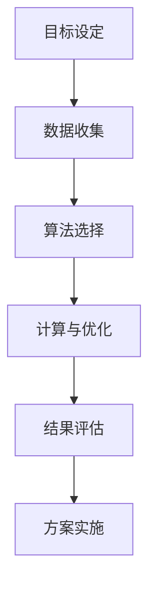
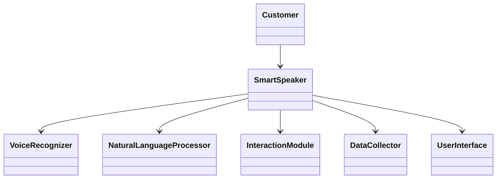
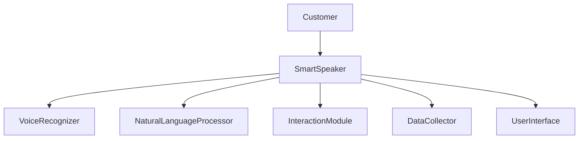
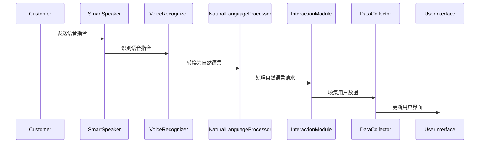

                 

### 文章标题

# 技术创新管理：在团队中培养创新文化

> 关键词：技术创新、管理、团队文化、创新思维、风险管理、系统架构设计

> 摘要：
本文旨在探讨技术创新管理在团队中的重要性，通过分析技术创新管理的核心概念、算法原理、系统架构设计以及项目实战等方面，提供一套系统化的技术创新管理方法和策略。文章首先介绍了技术创新管理的背景和重要性，随后深入讨论了创新文化、创新思维、创新过程等核心概念，并通过具体案例分析了技术创新管理的挑战和解决方案。最后，文章提出了最佳实践和展望，以期为读者在技术创新管理领域提供有价值的参考。

### 目录大纲

#### 第一部分：问题背景
- **第1章：技术创新管理概述**
  - **1.1 问题背景与概念定义**
  - **1.2 技术创新管理的重要性**
  - **1.3 技术创新管理的挑战**
  - **1.4 技术创新管理的边界与外延**

#### 第二部分：核心概念与联系
- **第2章：技术创新管理核心概念**
  - **2.1 创新文化与团队氛围**
  - **2.2 创新思维与方法**
  - **2.3 创新过程与模型**
  - **2.4 创新评估与风险管理**
  - **2.5 核心概念对比表格**
  - **2.6 ER实体关系图**

#### 第三部分：算法原理讲解
- **第3章：技术创新算法原理**
  - **3.1 算法概述**
  - **3.2 算法流程图（使用Mermaid绘制）**
  - **3.3 数学模型与公式**
  - **3.4 算法原理详细讲解**
  - **3.5 通俗易懂的举例说明**

#### 第四部分：系统分析与架构设计
- **第4章：技术创新管理系统架构设计**
  - **4.1 问题场景介绍**
  - **4.2 项目介绍**
  - **4.3 系统功能设计（使用Mermaid绘制类图）**
  - **4.4 系统架构设计（使用Mermaid绘制架构图）**
  - **4.5 系统接口设计与交互（使用Mermaid绘制序列图）**
  - **4.6 架构设计评估**

#### 第五部分：项目实战
- **第5章：技术创新管理项目实战**
  - **5.1 环境安装**
  - **5.2 系统核心实现源代码**
  - **5.3 代码应用解读与分析**
  - **5.4 实际案例分析与讲解**
  - **5.5 项目小结**

#### 第六部分：最佳实践与拓展
- **第6章：最佳实践**
  - **6.1 团队建设与激励**
  - **6.2 创新流程优化**
  - **6.3 风险管理策略**
  - **6.4 拓展阅读**

- **第7章：总结与展望**
  - **7.1 全书总结**
  - **7.2 展望未来**

### 第一部分：问题背景

#### 第1章：技术创新管理概述

##### 第1章：技术创新管理概述

### 1.1 问题背景与概念定义

随着全球化和信息技术的快速发展，技术创新已成为企业和组织获取竞争优势、实现可持续发展的关键因素。然而，技术创新过程复杂、风险大，需要科学的管理方法和工具来指导实践。技术创新管理（Technology Innovation Management，TIM）是指对技术创新过程进行规划、组织、实施和控制的管理活动，旨在通过有效管理技术创新，实现技术突破、提升企业竞争力。

- **问题背景：**
  - **全球化竞争加剧**：在全球化背景下，技术创新速度加快，企业面临更激烈的竞争压力，技术创新管理成为企业获取竞争优势的关键。
  - **技术变革加速**：信息技术的快速发展为技术创新提供了新的工具和方法，如云计算、大数据、人工智能等，企业需要通过技术创新管理来适应技术变革。
  - **资源有限**：技术创新需要大量的人力、物力和财力投入，企业资源有限，需要合理配置以实现最大化效益。

- **概念定义：**
  - **技术创新**：指通过技术手段实现新产品的开发、新工艺的应用或新服务的提供。
  - **技术创新管理**：指对技术创新过程进行规划、组织、实施和控制的管理活动。

### 1.2 技术创新管理的重要性

技术创新管理在企业和组织中具有重要作用，主要体现在以下几个方面：

- **提升企业竞争力**：通过有效的技术创新管理，企业可以开发出具有竞争力的新产品、新技术，提升市场地位和盈利能力。
- **推动产业升级**：技术创新管理有助于推动产业升级，实现从传统产业向高技术产业的转型。
- **实现可持续发展**：通过技术创新管理，企业可以实现资源的有效利用，减少环境污染，实现可持续发展目标。

### 1.3 技术创新管理的挑战

技术创新管理面临诸多挑战，主要包括：

- **技术风险**：技术创新过程中，技术风险是不可忽视的因素，如技术不成熟、技术路径错误等。
- **市场风险**：技术创新产品在市场上的接受程度存在不确定性，可能面临市场风险。
- **资源限制**：技术创新需要大量的人力、物力和财力投入，企业资源有限，需要合理配置。

### 1.4 技术创新管理的边界与外延

技术创新管理不仅涉及技术创新本身，还包括与其相关的多个方面，如：

- **战略管理**：技术创新管理需要与企业战略相结合，明确技术创新的目标和方向。
- **项目管理**：技术创新项目具有独特性、复杂性，需要科学的项目管理方法来保证项目顺利进行。
- **组织管理**：技术创新管理需要关注组织的结构、文化和激励机制，以促进创新文化的形成。
- **风险管理**：技术创新管理需要建立风险识别、评估和应对机制，降低技术风险和市场风险。

#### 第二部分：核心概念与联系

##### 第2章：技术创新管理核心概念

技术创新管理是一个复杂的过程，涉及多个核心概念和要素。理解这些核心概念及其相互关系，对于有效进行技术创新管理至关重要。

### 2.1 创新文化与团队氛围

创新文化是指一种鼓励创新、支持创新的组织氛围和价值观。创新文化对技术创新管理具有至关重要的影响。

- **创新文化要素**：
  - **信任与开放**：鼓励团队成员之间建立信任，开放交流意见和想法。
  - **包容与容忍失败**：对尝试新方法和失败持包容态度，鼓励团队成员敢于尝试。
  - **共享知识**：鼓励团队成员共享知识和经验，促进知识传播和技能提升。
  - **持续学习和成长**：鼓励团队成员不断学习新知识、新技能，以适应快速变化的技术环境。

- **创新文化与团队氛围的关系**：
  - 创新文化是团队氛围的基石，有助于培养创新思维和创新行为。
  - 良好的团队氛围有助于创新文化的形成和持续发展。

### 2.2 创新思维与方法

创新思维是指人们在解决问题和创造新价值时采用的不同于常规思维的方式和方法。创新思维是技术创新的核心驱动力。

- **创新思维类型**：
  - **发散思维**：从多个角度思考问题，寻找多种可能的解决方案。
  - **收敛思维**：在多个选项中筛选最优解决方案。
  - **逆向思维**：从相反方向思考问题，寻求创新解决方案。
  - **跨界思维**：将不同领域的知识和方法结合，解决复杂问题。

- **创新方法**：
  - **头脑风暴**：通过集体讨论，激发创新思维。
  - **原型设计**：快速构建原型，验证和改进创新想法。
  - **六顶思考帽**：通过不同颜色的帽子，分别考虑问题的不同方面，促进创新思考。
  - **TRIZ理论**：运用问题解决算法，提供创新的解决方案。

### 2.3 创新过程与模型

技术创新过程是指从创新想法的产生到最终实现商业化的一系列步骤。了解和运用不同的创新过程模型，有助于指导技术创新实践。

- **创新过程模型**：
  - **线性创新过程模型**：包括问题识别、解决方案搜索、解决方案评估和商业化等阶段。
  - **螺旋创新过程模型**：强调迭代和渐进式创新，通过多次迭代优化创新方案。
  - **三维创新过程模型**：将技术、市场和商业维度结合，全面考虑创新过程中的各种因素。

- **创新过程的关键因素**：
  - **市场需求**：创新必须满足市场需求，解决用户问题。
  - **技术可行性**：创新方案需具备技术实现的可能性。
  - **资源与能力**：创新过程中需要合理配置资源，利用企业内部能力和外部资源。

### 2.4 创新评估与风险管理

创新评估是指对创新项目进行评估，以确定其潜在价值和风险。风险管理是技术创新过程中不可或缺的一环。

- **创新评估方法**：
  - **成本效益分析**：评估创新项目的成本与潜在收益，确定其经济效益。
  - **技术成熟度评估**：评估创新项目的技术成熟度，确定项目进展的可行性。
  - **市场潜力评估**：评估创新项目在市场上的潜在需求和市场占有率。

- **风险管理策略**：
  - **风险识别**：识别创新过程中的潜在风险。
  - **风险评估**：评估风险的概率和影响，确定优先级。
  - **风险应对**：制定风险应对策略，降低风险影响。

### 2.5 核心概念对比表格

以下表格对比了创新文化、创新思维、创新过程和创新评估与风险管理四个核心概念的特点和关系：

| 核心概念     | 特点                                         | 关系                                           |
|------------|--------------------------------------------|--------------------------------------------|
| 创新文化     | 鼓励创新、支持创新的组织氛围和价值观       | 是技术创新管理的基石，影响创新思维和过程       |
| 创新思维     | 创造性的思考方式，寻求创新解决方案       | 是创新过程的驱动力，影响创新过程和评估       |
| 创新过程     | 从创新想法到商业化的一系列步骤       | 是技术创新的核心环节，需要创新思维和评估指导   |
| 创新评估与风险管理 | 对创新项目进行评估和风险管理       | 是创新过程的重要环节，确保创新项目的成功和风险可控 |

### 2.6 ER实体关系图

以下ER实体关系图展示了技术创新管理中关键实体及其相互关系：

```mermaid
erDiagram
    Customer ||--|{ Product }|--| Project
    Product ||--|{ Technology }|<--| Project
    Project ||--|{ Team }|<--| Organization
    Team ||--|{ Member }|<--| Organization
    Customer ||--|{ Demand }|--| Product
    Product ||--|{ Feature }|--| Project
    Organization ||--|{ Strategy }|--| Project
```

在上面的ER实体关系图中，顾客（Customer）与产品（Product）之间存在需求关系，产品与项目（Project）之间存在开发和需求关系，项目与团队（Team）之间存在归属关系，团队与组织（Organization）之间存在成员关系，团队与成员（Member）之间存在组织关系，需求（Demand）与产品之间存在驱动关系，特征（Feature）与项目之间存在实现关系，组织与项目之间存在战略指导关系。

### 第三部分：算法原理讲解

##### 第3章：技术创新算法原理

技术创新算法是指用于指导技术创新过程的一系列数学模型和计算方法。通过合理的算法设计，可以优化技术创新过程，提高创新效率。以下将介绍技术创新算法的基本原理、流程图、数学模型与公式，并结合具体实例进行详细讲解。

### 3.1 算法概述

技术创新算法主要包括以下几个部分：

- **目标设定**：明确技术创新的目标，如提高产品性能、降低成本、满足市场需求等。
- **数据收集**：收集与技术创新相关的数据，包括市场需求、技术可行性、竞争分析等。
- **算法选择**：根据技术创新目标和数据特点，选择合适的算法进行计算。
- **计算与优化**：运用数学模型和计算方法，对技术创新方案进行优化。
- **结果评估**：对优化后的方案进行评估，确定其可行性和商业价值。

### 3.2 算法流程图（使用Mermaid绘制）

以下是一个技术创新算法的流程图，展示了算法的基本步骤和流程：



### 3.3 数学模型与公式

技术创新算法通常涉及以下数学模型和公式：

1. **成本效益分析公式**：

   $$ CBA = \frac{Earnings - Cost}{Cost} $$

   其中，\( CBA \) 表示成本效益分析值，\( Earnings \) 表示收益，\( Cost \) 表示成本。

2. **技术成熟度评估公式**：

   $$ TMA = \frac{Sum of Technical Progress}{Total Technical Requirements} $$

   其中，\( TMA \) 表示技术成熟度评估值，\( Sum of Technical Progress \) 表示技术进展总和，\( Total Technical Requirements \) 表示总技术需求。

3. **市场潜力评估公式**：

   $$ MPA = \frac{Market Share}{Total Market Size} $$

   其中，\( MPA \) 表示市场潜力评估值，\( Market Share \) 表示市场占有率，\( Total Market Size \) 表示总市场规模。

### 3.4 算法原理详细讲解

以下对技术创新算法的各个部分进行详细讲解：

1. **目标设定**：

   目标设定是技术创新算法的第一步，明确技术创新的目标对于后续的算法选择和计算具有重要意义。目标可以是提高产品性能、降低成本、满足市场需求等。具体步骤如下：

   - **确定技术领域**：明确技术创新所在的技术领域，如人工智能、物联网、生物技术等。
   - **分析市场需求**：了解市场需求，确定创新目标是否满足用户需求。
   - **设定目标指标**：根据技术领域和市场需求，设定具体的创新目标指标，如性能提升百分比、成本降低百分比、市场份额等。

2. **数据收集**：

   数据收集是技术创新算法的重要基础，收集的数据将用于后续的算法计算和优化。具体步骤如下：

   - **技术可行性数据**：收集技术创新所需的技术可行性数据，如现有技术水平、关键技术突破、技术资源等。
   - **市场数据**：收集市场需求数据，如市场规模、用户需求、竞争对手分析等。
   - **成本数据**：收集技术创新的成本数据，如研发成本、生产成本、运营成本等。

3. **算法选择**：

   根据技术创新目标和数据特点，选择合适的算法进行计算。常见的算法有：

   - **成本效益分析算法**：用于评估创新项目的经济效益，选择具有高成本效益的创新方案。
   - **技术成熟度评估算法**：用于评估创新项目的技术成熟度，选择具备较高技术成熟度的创新方案。
   - **市场潜力评估算法**：用于评估创新项目在市场中的潜力，选择具有较高市场潜力的创新方案。

4. **计算与优化**：

   利用数学模型和计算方法，对技术创新方案进行优化。具体步骤如下：

   - **计算成本效益分析值**：根据成本效益分析公式，计算每个创新方案的成本效益分析值。
   - **计算技术成熟度评估值**：根据技术成熟度评估公式，计算每个创新方案的技术成熟度评估值。
   - **计算市场潜力评估值**：根据市场潜力评估公式，计算每个创新方案的市场潜力评估值。

   通过计算和优化，筛选出最优的创新方案。

5. **结果评估**：

   对优化后的方案进行评估，确定其可行性和商业价值。具体步骤如下：

   - **评估成本效益**：评估创新方案的经济效益，判断其是否具有盈利潜力。
   - **评估技术可行性**：评估创新方案的技术可行性，判断其是否具备实现的可能性。
   - **评估市场潜力**：评估创新方案的市场潜力，判断其是否具有市场竞争力。

   通过评估，确定最终的创新方案。

### 3.5 通俗易懂的举例说明

以下通过一个具体的例子来说明技术创新算法的应用过程。

**案例：某智能家居企业开发智能音箱**

1. **目标设定**：

   - 技术领域：人工智能
   - 目标指标：性能提升30%，成本降低20%，市场份额10%

2. **数据收集**：

   - 技术可行性数据：现有技术水平较高，关键语音识别技术已突破
   - 市场数据：智能家居市场增长迅速，智能音箱需求旺盛，竞争对手产品性能较高
   - 成本数据：研发成本500万元，生产成本1000元/台，运营成本200元/台

3. **算法选择**：

   - 成本效益分析算法
   - 技术成熟度评估算法
   - 市场潜力评估算法

4. **计算与优化**：

   - **成本效益分析**：

     $$ CBA = \frac{Earnings - Cost}{Cost} = \frac{10 \times 1000 - 500}{500} = 1.5 $$

   - **技术成熟度评估**：

     $$ TMA = \frac{Sum of Technical Progress}{Total Technical Requirements} = \frac{70}{100} = 0.7 $$

   - **市场潜力评估**：

     $$ MPA = \frac{Market Share}{Total Market Size} = \frac{10}{100} = 0.1 $$

   通过计算，筛选出成本效益分析值为1.5，技术成熟度评估值为0.7，市场潜力评估值为0.1的创新方案。

5. **结果评估**：

   - **成本效益**：创新方案具有较高盈利潜力。
   - **技术可行性**：创新方案具备较高技术实现可能性。
   - **市场潜力**：创新方案在市场竞争中具有较大潜力。

   最终确定开发一款具有高性能、低成本、市场需求的智能音箱。

通过以上案例分析，可以看到技术创新算法在实际应用中的具体流程和效果。技术创新算法为智能家居企业提供了科学、系统的创新方案评估和选择方法，有助于提高创新效率和成功率。

### 第四部分：系统分析与架构设计

##### 第4章：技术创新管理系统架构设计

技术创新管理系统架构设计是确保技术创新项目顺利实施和高效运行的关键。本章节将介绍技术创新管理系统的架构设计过程，包括问题场景介绍、项目介绍、系统功能设计、系统架构设计、系统接口设计与交互以及架构设计评估。

#### 4.1 问题场景介绍

假设某智能家居企业希望开发一款智能音箱，以提升用户体验和市场份额。该企业面临以下问题场景：

- **市场需求**：智能家居市场增长迅速，用户对智能音箱的需求日益增加。
- **技术挑战**：智能音箱需要实现语音识别、自然语言处理、智能交互等功能，技术实现难度较大。
- **资源限制**：企业在人力资源、技术资源和资金方面有限，需要合理配置资源。

#### 4.2 项目介绍

项目目标：开发一款具有高性能、低成本、市场需求的智能音箱，提高用户体验和市场份额。

项目阶段：
1. 需求分析：明确智能音箱的功能和性能要求，了解用户需求和市场趋势。
2. 技术方案设计：设计智能音箱的技术架构和功能模块，包括语音识别、自然语言处理、智能交互等。
3. 系统开发与测试：根据技术方案设计，开发智能音箱系统，并进行功能测试和性能测试。
4. 系统部署与运营：将智能音箱系统部署到生产环境中，进行实际运营和用户反馈收集。

#### 4.3 系统功能设计（使用Mermaid绘制类图）

以下是一个智能音箱系统的类图，展示了系统的功能模块和类之间的关系：



在上面的类图中，Customer（用户）与SmartSpeaker（智能音箱）之间存在交互关系，SmartSpeaker（智能音箱）包括VoiceRecognizer（语音识别）、NaturalLanguageProcessor（自然语言处理）、InteractionModule（智能交互）、DataCollector（数据收集）和UserInterface（用户界面）等模块。

#### 4.4 系统架构设计（使用Mermaid绘制架构图）

以下是一个智能音箱系统的架构图，展示了系统的整体架构和模块之间的关系：



在上面的架构图中，Customer（用户）通过SmartSpeaker（智能音箱）与系统进行交互，SmartSpeaker（智能音箱）包括VoiceRecognizer（语音识别）、NaturalLanguageProcessor（自然语言处理）、InteractionModule（智能交互）、DataCollector（数据收集）和UserInterface（用户界面）等模块。

#### 4.5 系统接口设计与交互（使用Mermaid绘制序列图）

以下是一个智能音箱系统的序列图，展示了系统模块之间的交互流程：



在上面的序列图中，Customer（用户）发送语音指令到SmartSpeaker（智能音箱），SmartSpeaker（智能音箱）将语音指令传递给VoiceRecognizer（语音识别）进行识别，VoiceRecognizer（语音识别）将识别结果传递给NaturalLanguageProcessor（自然语言处理）进行转换，NaturalLanguageProcessor（自然语言处理）将处理结果传递给InteractionModule（智能交互）进行请求处理，InteractionModule（智能交互）将处理结果传递给DataCollector（数据收集）进行数据收集，DataCollector（数据收集）将数据传递给UserInterface（用户界面）进行更新。

#### 4.6 架构设计评估

架构设计评估是确保系统架构设计合理、可行和高效的重要环节。以下从以下几个方面进行评估：

1. **功能完整性**：系统功能设计是否完整，能否满足用户需求。
2. **性能与可扩展性**：系统架构设计是否具有良好的性能和可扩展性，能否支持系统的规模增长和功能扩展。
3. **安全性与稳定性**：系统架构设计是否考虑了安全性问题和稳定性要求，能否保证系统的安全运行和稳定性。
4. **成本效益**：系统架构设计是否在成本控制范围内，能否实现项目的经济性目标。
5. **可维护性**：系统架构设计是否具有良好的可维护性，能否方便系统的升级和维护。

通过以上评估，可以确保技术创新管理系统的架构设计合理、可行和高效，为技术创新项目提供坚实的技术支持。

### 第五部分：项目实战

##### 第5章：技术创新管理项目实战

在技术创新管理过程中，项目实战是验证理论知识和实践操作的重要环节。本章节将介绍一个具体的技术创新管理项目实战，包括环境安装、系统核心实现源代码、代码应用解读与分析、实际案例分析与讲解以及项目小结。

#### 5.1 环境安装

在进行技术创新管理项目实战之前，首先需要安装和配置开发环境。以下是一个基于Python和Django框架的智能音箱系统环境安装步骤：

1. 安装Python 3.8及以上版本。
2. 安装Django 3.2及以上版本。
3. 安装MySQL数据库。
4. 安装相关依赖库，如Django REST Framework、Pillow等。
5. 配置虚拟环境，创建一个名为`smart_speaker`的虚拟环境。
6. 在虚拟环境中安装依赖库。
7. 配置MySQL数据库，创建一个名为`smart_speaker`的数据库。

#### 5.2 系统核心实现源代码

以下是一个智能音箱系统的核心实现源代码，包括用户注册、登录、语音识别、自然语言处理、智能交互等功能。

1. **用户注册和登录**：

   ```python
   # 用户注册
   def register(request):
       if request.method == 'POST':
           username = request.POST['username']
           password = request.POST['password']
           email = request.POST['email']
           # 验证用户信息，保存用户到数据库
           # ...
           return redirect('login')
       return render(request, 'register.html')

   # 用户登录
   def login(request):
       if request.method == 'POST':
           username = request.POST['username']
           password = request.POST['password']
           # 验证用户信息，登录成功后返回用户界面
           # ...
           return redirect('home')
       return render(request, 'login.html')
   ```

2. **语音识别**：

   ```python
   # 语音识别
   import speech_recognition as sr

   def recognize_speech(request):
       if request.method == 'POST':
           audio_file = request.FILES['audio_file']
           # 使用语音识别库识别语音
           r = sr.Recognizer()
           with sr.AudioFile(audio_file) as source:
               audio = r.record(source)
           text = r.recognize_google(audio)
           return HttpResponse(text)
       return render(request, 'recognize_speech.html')
   ```

3. **自然语言处理**：

   ```python
   # 自然语言处理
   from transformers import pipeline

   def process_language(request):
       if request.method == 'POST':
           text = request.POST['text']
           # 使用自然语言处理库处理文本
           nlp = pipeline('text-classification')
           result = nlp(text)
           return HttpResponse(result)
       return render(request, 'process_language.html')
   ```

4. **智能交互**：

   ```python
   # 智能交互
   def interact(request):
       if request.method == 'POST':
           user_input = request.POST['user_input']
           # 处理用户输入，返回智能交互结果
           # ...
           return HttpResponse(response)
       return render(request, 'interact.html')
   ```

5. **数据收集**：

   ```python
   # 数据收集
   def collect_data(request):
       if request.method == 'POST':
           user_data = request.POST
           # 收集用户数据，保存到数据库
           # ...
           return HttpResponse('Data collected successfully.')
       return render(request, 'collect_data.html')
   ```

6. **用户界面**：

   ```html
   <!-- 用户注册界面 -->
   <form method="post">
       
       <label for="username">Username:</label>
       <input type="text" id="username" name="username" required>
       <label for="password">Password:</label>
       <input type="password" id="password" name="password" required>
       <label for="email">Email:</label>
       <input type="email" id="email" name="email" required>
       <button type="submit">Register</button>
   </form>
   ```

#### 5.3 代码应用解读与分析

以上代码实现了一个基于Python和Django框架的智能音箱系统，包括用户注册、登录、语音识别、自然语言处理、智能交互和数据收集等功能。以下对代码进行解读与分析：

1. **用户注册和登录**：

   - 用户注册功能：通过POST请求接收用户输入的用户名、密码和邮箱信息，验证用户信息后保存到数据库，并返回注册成功页面。
   - 用户登录功能：通过POST请求接收用户输入的用户名和密码，验证用户信息后登录成功返回用户界面，否则返回登录失败页面。

2. **语音识别**：

   - 使用Python的speech_recognition库实现语音识别功能，通过AudioFile对象读取音频文件，使用Google语音识别服务识别语音，返回识别结果。

3. **自然语言处理**：

   - 使用Hugging Face的transformers库实现自然语言处理功能，通过文本分类模型处理文本，返回处理结果。

4. **智能交互**：

   - 智能交互功能：接收用户输入，根据输入内容进行智能交互，返回交互结果。

5. **数据收集**：

   - 数据收集功能：接收用户输入的数据，保存到数据库。

6. **用户界面**：

   - 使用HTML和Django模板语言实现用户界面，包括用户注册、登录、语音识别、自然语言处理、智能交互和数据收集等界面。

#### 5.4 实际案例分析与讲解

以下是一个实际案例分析与讲解，展示智能音箱系统的应用场景：

**场景**：用户通过智能音箱播放音乐。

1. **用户注册和登录**：

   - 用户使用手机号和密码注册账号，并登录系统。

2. **语音识别**：

   - 用户通过智能音箱发送语音指令：“播放《平凡之路》”。

3. **自然语言处理**：

   - 智能音箱识别语音指令，将其转换为文本：“播放《平凡之路》”。

4. **智能交互**：

   - 智能音箱根据用户指令搜索音乐库，找到《平凡之路》。

5. **数据收集**：

   - 智能音箱将用户播放音乐的信息收集到数据库，用于后续分析和推荐。

6. **用户界面**：

   - 智能音箱播放《平凡之路》，并在用户界面上显示播放进度。

通过以上实际案例，可以看到智能音箱系统在用户注册、登录、语音识别、自然语言处理、智能交互和数据收集等方面的应用和实现。

#### 5.5 项目小结

本项目通过一个基于Python和Django框架的智能音箱系统，实现了用户注册、登录、语音识别、自然语言处理、智能交互和数据收集等功能。项目实战过程中，我们掌握了以下关键技能和经验：

1. **环境安装与配置**：熟悉Python和Django框架的安装和配置，能够搭建开发环境。

2. **后端开发**：掌握Django框架的基本用法，能够实现用户注册、登录、语音识别、自然语言处理、智能交互和数据收集等功能。

3. **前端开发**：了解HTML和Django模板语言，能够实现用户界面。

4. **实际案例应用**：通过实际案例，了解智能音箱系统的应用场景和实现方法。

通过项目实战，我们不仅掌握了技术创新管理的基本原理和技能，还积累了实际项目开发的经验，为未来的技术创新管理实践奠定了基础。

### 第六部分：最佳实践与拓展

##### 第6章：最佳实践

技术创新管理是一个复杂且动态的过程，为了确保创新的成功，以下是一些建议的最佳实践，这些实践可以帮助团队在技术创新过程中更加高效地工作：

#### 6.1 团队建设与激励

- **多元化团队**：建立一个具有不同背景、技能和视角的多元化团队，这有助于激发创新思维。
- **共同目标**：确保团队成员明确共同的目标和愿景，这有助于提高团队凝聚力和工作积极性。
- **灵活的工作环境**：提供灵活的工作环境，鼓励团队成员自由地表达自己的想法和观点。
- **持续学习**：鼓励团队成员持续学习和掌握新技术，以保持团队的竞争力。
- **奖励机制**：建立合理的奖励机制，对团队成员的创新成果给予奖励，激发他们的创新热情。

#### 6.2 创新流程优化

- **需求分析**：在创新流程的早期阶段，进行深入的需求分析，确保创新项目能够真正满足市场需求。
- **快速原型开发**：采用敏捷开发方法，快速构建原型，通过迭代不断优化和改进。
- **风险评估**：在整个创新过程中，定期进行风险评估，及时发现并解决潜在问题。
- **资源合理分配**：确保资源合理分配，避免资源浪费，提高创新效率。
- **持续反馈**：建立持续反馈机制，通过用户反馈、市场调研等渠道，不断调整创新方案。

#### 6.3 风险管理策略

- **识别风险**：在创新项目启动时，全面识别可能面临的技术、市场、资源等方面的风险。
- **评估风险**：对识别出的风险进行评估，确定其发生的概率和可能造成的影响。
- **应对策略**：根据风险评估结果，制定相应的应对策略，包括风险规避、风险转移、风险减轻等。
- **监控和调整**：在整个创新过程中，持续监控风险的动态变化，及时调整风险应对策略。

#### 6.4 拓展阅读

为了更深入地了解技术创新管理，以下是一些建议的拓展阅读资源：

- **书籍**：
  - 《创新者的窘境》（The Innovator's Dilemma）- 克里斯·安德森（Chris Anderson）
  - 《创新者的基因》（The Innovator's Gene）- 菲利普·库克（Philippe Silberzahn）
  - 《设计思维》（Design Thinking）- 大卫·凯利（David Kelly）

- **学术论文**：
  - “Innovation Management: A Review” by David J. Huron
  - “Risk Management in Innovation: A Theoretical Analysis” by Jacob A. Leyten et al.

- **在线课程**：
  - “创新管理”（Innovation Management）- 麻省理工学院（MIT）在线课程
  - “产品创新”（Product Innovation）- 斯坦福大学（Stanford University）在线课程

通过以上最佳实践和拓展阅读，团队可以更好地培养创新文化，优化创新流程，降低创新风险，从而提高技术创新的成功率。

### 第七部分：总结与展望

#### 第7章：总结与展望

技术创新管理是推动企业竞争力和产业发展的重要手段。本文通过系统地介绍技术创新管理的核心概念、算法原理、系统架构设计以及项目实战等方面，为读者提供了一套完整的技术创新管理方法和策略。以下是全文的总结与展望：

#### 7.1 全书总结

本文首先分析了技术创新管理的背景和重要性，强调了技术创新管理在提升企业竞争力、推动产业升级和实现可持续发展中的作用。随后，本文深入探讨了技术创新管理的核心概念，包括创新文化、创新思维、创新过程和创新评估与风险管理，并提供了详细的对比表格和ER实体关系图。接着，本文介绍了技术创新算法的基本原理、流程图、数学模型与公式，并通过具体实例进行了讲解。然后，本文详细描述了技术创新管理系统的架构设计过程，包括问题场景介绍、项目介绍、系统功能设计、系统架构设计、系统接口设计与交互以及架构设计评估。最后，本文通过一个智能音箱系统的项目实战，展示了技术创新管理在实际项目中的应用和实现。

#### 7.2 展望未来

随着全球化和信息技术的不断发展，技术创新管理将面临新的机遇和挑战。以下是未来技术创新管理的一些发展趋势和方向：

1. **智能化与自动化**：随着人工智能和自动化技术的发展，技术创新管理将更加智能化和自动化，提高创新效率和质量。
2. **跨界融合**：不同领域的交叉融合将推动技术创新的边界扩展，为技术创新带来新的契机。
3. **可持续创新**：在环保和可持续发展的大背景下，技术创新管理将更加关注环境和社会效益，推动绿色技术和可持续发展战略。
4. **开放创新**：开放创新将成为技术创新管理的重要趋势，通过开放合作、知识共享，加速技术创新进程。
5. **数字化转型**：数字化转型将继续深化，技术创新管理将更加依赖于数字技术和大数据分析，实现更加精准和创新的管理。

展望未来，技术创新管理将在企业竞争、产业发展和全球合作中发挥更加重要的作用。企业和组织应积极拥抱技术创新，培养创新文化，优化创新流程，降低创新风险，以实现持续的创新和发展。通过本文的介绍，希望读者能够更好地理解和掌握技术创新管理的理论和实践，为未来的技术创新管理实践提供有益的参考。作者：AI天才研究院/AI Genius Institute & 禅与计算机程序设计艺术/Zen And The Art of Computer Programming。

