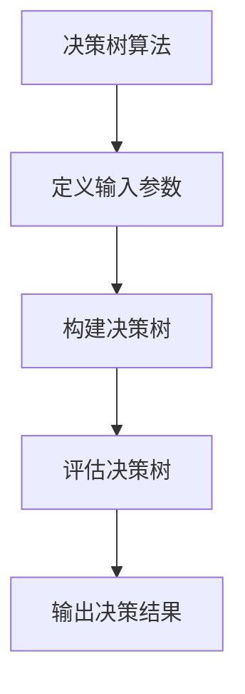
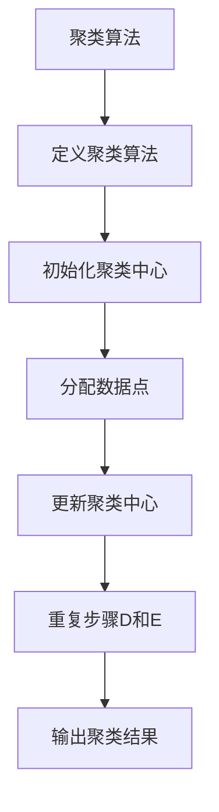
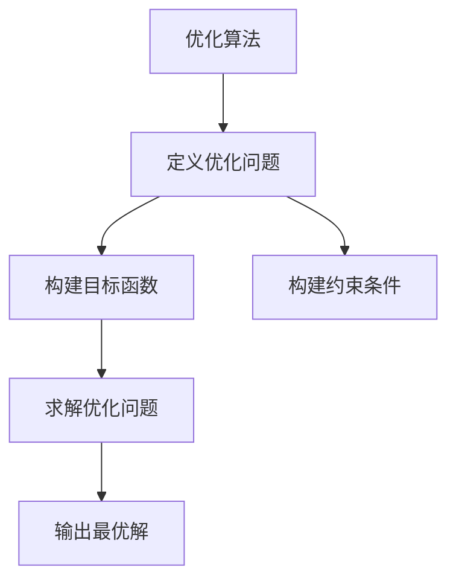
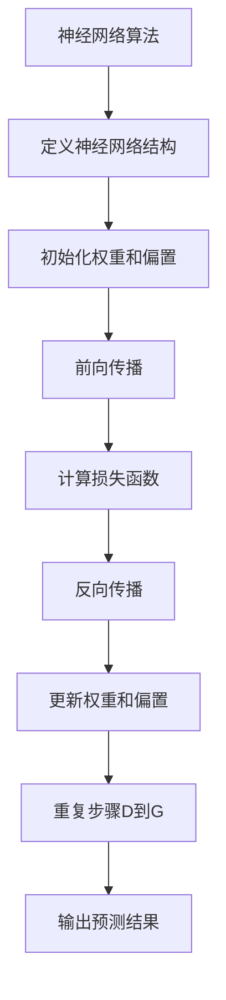
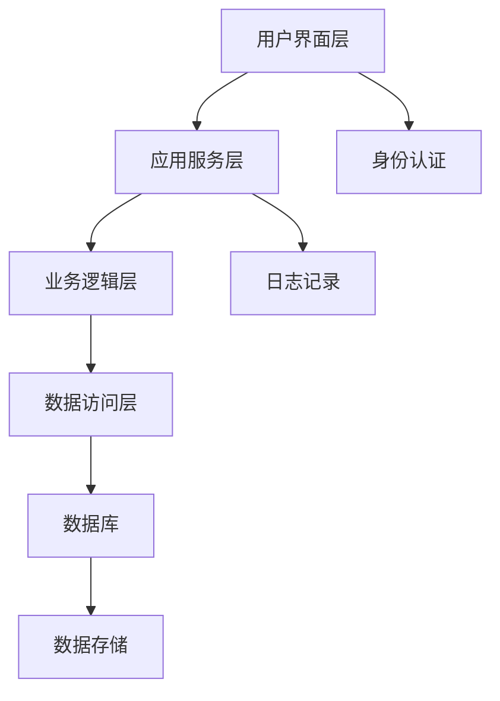

                 

### 摘要

本文旨在探讨技术委员会的运作与治理，通过详细分析其核心概念、原则、实践案例、算法原理、数学模型、系统架构以及项目实施过程，为技术委员会的有效运作提供系统性指导。技术委员会作为组织内关键的技术决策实体，其高效运作对于提升组织的技术创新能力和决策质量至关重要。本文首先定义了技术委员会的基本概念，并介绍了其在组织中的作用和重要性。接着，本文深入探讨了技术委员会的核心概念与原则，并通过对比分析不同运营模型和治理结构，为读者提供了直观的理解。随后，本文通过实际案例研究，展示了技术委员会在不同行业中的成功实践，分析了成功因素和面临的挑战。在此基础上，本文详细讲解了技术委员会运作中常用的算法和数学模型，并通过Mermaid流程图和Python代码进行了可视化与实现演示。此外，本文还介绍了技术委员会的系统架构设计原则，并使用Mermaid类图、架构图和序列图进行了系统分析与架构设计。最后，本文通过项目实战，详细介绍了技术委员会系统的环境搭建和核心实现过程，并结合实际案例进行了深入分析与解读。通过本文的全面阐述，读者可以全面了解技术委员会的运作与治理，掌握其在实际应用中的最佳实践，从而提升组织的技术管理水平和决策能力。

### 关键词

- 技术委员会
- 运作与治理
- 核心概念
- 治理结构
- 实践案例
- 算法原理
- 数学模型
- 系统架构
- 项目实施

### 文章概述

本文将围绕“技术委员会运作与治理”这一主题，通过系统性的分析和详细讲解，为读者提供全面的技术委员会运作与治理指导。文章将从多个维度深入探讨技术委员会的基本概念、运作原则、实际案例、算法原理、数学模型、系统架构以及项目实施过程。

首先，在文章的开篇，我们将对技术委员会的基本概念进行介绍，包括其定义、作用和重要性，使读者对技术委员会有初步的认识。接下来，我们将详细阐述技术委员会的核心概念和原则，通过对比分析不同运营模型和治理结构，为读者提供直观的理解和参考。

随后，本文将结合实际案例，探讨技术委员会在不同行业中的成功实践，分析其成功因素和面临的挑战，以提供实用的操作指南。在此基础上，我们将深入讲解技术委员会运作中常用的算法和数学模型，并通过Mermaid流程图和Python代码进行可视化与实现演示，使读者能够更清晰地理解算法原理。

此外，本文还将介绍技术委员会的系统架构设计原则，并使用Mermaid类图、架构图和序列图进行系统分析与架构设计，帮助读者掌握系统设计的核心要素。最后，我们将通过项目实战，详细描述技术委员会系统的环境搭建和核心实现过程，并结合实际案例进行深入分析与解读。

通过本文的全面阐述，读者将能够系统地了解技术委员会的运作与治理，掌握其在实际应用中的最佳实践，从而提升组织的技术管理水平和决策能力。本文力求逻辑清晰、结构紧凑，使读者能够在短时间内获得对技术委员会运作与治理的全面理解。

### 技术委员会的基本概念

技术委员会（Technical Committee）是指在组织内负责技术决策和战略规划的重要实体，它通常由一群技术专家、工程师和管理人员组成，其核心职责是评估技术方案、制定技术标准、推进技术创新和解决技术难题。技术委员会的存在不仅有助于提高组织的整体技术能力，还能确保技术决策的科学性和有效性。

首先，技术委员会的定义需要明确其角色和职责。在组织架构中，技术委员会通常隶属于高级管理层，直接向CTO或CEO汇报。其具体职责包括：

1. **技术战略规划**：根据组织的整体战略目标，制定和调整技术发展方向和策略。
2. **技术方案评估**：对新技术、新产品和项目的技术可行性进行评估，确保技术方案的合理性和高效性。
3. **技术标准制定**：制定和推广技术规范和标准，统一技术标准和流程，提高团队协作效率。
4. **技术难题解决**：协调和解决组织内部在技术研发和实施过程中遇到的技术难题。
5. **技术创新推动**：鼓励和支持技术团队进行技术创新，推动技术进步和组织发展。

其次，技术委员会在组织中的作用不可忽视。其主要作用体现在以下几个方面：

1. **决策支持**：技术委员会为组织的高层决策提供科学、全面的技术分析和建议，确保决策的合理性和前瞻性。
2. **资源调配**：技术委员会根据技术发展的需求和优先级，合理调配组织内部的资源，包括资金、人力和技术支持。
3. **风险控制**：通过技术预评估和风险分析，提前识别和应对技术项目中的潜在风险，降低项目失败的可能性。
4. **团队协作**：技术委员会协调不同技术团队之间的工作，促进知识共享和协作，提高整体工作效率。
5. **品牌塑造**：通过制定高质量的技术标准和规范，提升组织在行业中的技术声誉和品牌影响力。

技术委员会的重要性还体现在其能够提升组织的创新能力。在当今技术快速发展的时代，组织要想保持竞争力，必须不断进行技术创新。技术委员会通过推动技术研究和开发，促进新技术、新产品的诞生，为组织提供持续的创新动力。

此外，技术委员会的运作对于组织的整体技术战略具有重要意义。一个高效运作的技术委员会能够确保组织技术发展的方向正确、路径清晰，从而为组织的长期发展奠定坚实的基础。同时，技术委员会的决策和指导还能够提高整个组织的技术水平和专业能力，形成持续的技术积累和创新能力。

总之，技术委员会作为组织内的技术决策实体，其核心概念和作用在提升组织技术能力、促进技术创新、优化决策流程和资源调配等方面具有重要意义。理解技术委员会的基本概念和作用，是有效运作技术委员会的基础，也是推动组织技术发展的关键。

### 技术委员会运作的核心概念与原则

在深入探讨技术委员会的运作之前，我们需要明确一些核心概念与原则，这些概念与原则是确保技术委员会高效运作的基础。以下是对技术委员会运作中的核心概念和原则的详细阐述：

#### 核心概念

1. **决策权分配**：技术委员会的决策权分配是其运作的核心。通常，技术委员会成员分为不同层次，如主席、副主席和普通成员，各自承担不同的职责和权限。决策权的合理分配有助于确保技术决策的科学性和权威性。

2. **透明度和公正性**：技术委员会在决策过程中需要保持高度的透明度和公正性。所有成员应当能够获取充分的信息，并且在决策过程中有平等的发言权。这有助于减少偏见的产生，提高决策的公正性和可信度。

3. **持续学习与适应**：技术委员会成员需要具备持续学习的能力，紧跟行业技术发展动态，及时更新知识和技能。同时，技术委员会应具备适应能力，能够根据技术变化和市场环境调整策略。

4. **职责分工**：技术委员会应明确成员的职责分工，确保每个成员在特定领域有专长，能够为技术决策提供专业的意见和建议。合理的职责分工有助于提高决策的效率和质量。

#### 原则

1. **基于事实的决策**：技术委员会的决策应基于充分的数据和事实，避免主观判断和偏见。通过数据分析和事实支持，确保技术决策的科学性和合理性。

2. **集体决策**：技术委员会的决策过程应采取集体决策模式，充分讨论和辩论，确保每个成员的观点得到充分表达和考虑。集体决策有助于减少错误决策的风险，提高决策的全面性和准确性。

3. **快速响应**：技术委员会应具备快速响应能力，能够及时处理和解决技术问题。快速响应不仅能够降低技术风险，还能够抓住市场机遇，提升组织竞争力。

4. **灵活性和适应性**：技术委员会应具备灵活性和适应性，能够在不同的技术环境和市场条件下调整决策策略。灵活性和适应性有助于技术委员会在变化的环境中保持高效运作。

#### 运营模型与治理结构

在技术委员会的运作过程中，选择合适的运营模型和治理结构至关重要。以下是一些常见的运营模型和治理结构及其特点：

1. **集中式治理**：在集中式治理结构下，技术委员会集中决策权，所有重大技术决策都由委员会集体讨论决定。这种结构优点在于决策快速且统一，但缺点是可能存在过度集中决策的弊端。

2. **分散式治理**：在分散式治理结构下，技术委员会将决策权分散到不同小组或成员，各自负责特定领域的决策。这种结构优点在于能够充分利用成员的专业知识和经验，提高决策的多样性和准确性，但缺点是协调难度大，决策速度可能较慢。

3. **矩阵式治理**：矩阵式治理结构结合了集中式和分散式治理的优点，将决策权分配到不同层次和部门。这种结构能够确保各部门之间的协作和沟通，提高整体决策效率，但缺点是管理复杂度较高。

4. **跨部门协作**：在跨部门协作治理结构下，技术委员会不仅包含技术部门成员，还涉及其他部门如市场、财务等。这种结构优点在于能够综合多部门意见，提高决策的全局性和协调性，但缺点是可能存在部门利益冲突。

#### 对比分析

| 运营模型         | 特点                                                     | 优点                                                     | 缺点                                                     |
| ---------------- | -------------------------------------------------------- | -------------------------------------------------------- | -------------------------------------------------------- |
| 集中式治理       | 决策权集中，快速统一决策                                 | 决策快速，统一指挥                                       | 过度集中决策，可能缺乏多样性                           |
| 分散式治理       | 决策权分散，各自负责特定领域                             | 充分利用专业知识和经验，提高决策多样性                   | 协调难度大，决策速度可能较慢                           |
| 矩阵式治理       | 决策权分配到不同层次和部门，确保各部门之间的协作和沟通 | 提高决策效率，确保全局性和协调性                         | 管理复杂度较高，协调难度较大                           |
| 跨部门协作       | 包含多部门成员，综合多部门意见                           | 提高决策的全局性和协调性                                 | 可能存在部门利益冲突                                   |

通过上述对比分析，我们可以看出，不同的运营模型和治理结构各有优缺点，选择合适的模型和结构需要根据组织的特点和需求进行权衡。

总之，技术委员会运作的核心概念和原则是其高效运作的基础。理解并遵循这些概念和原则，有助于技术委员会在复杂多变的技术环境中保持高效和持续发展。在后续的内容中，我们将通过实际案例和研究进一步探讨技术委员会的运作实践和最佳实践，以期为技术委员会的有效运作提供更具体的指导。

### 技术委员会在不同行业中的实际案例研究

技术委员会在各个行业中的应用各有特色，下面我们将通过几个实际案例，详细分析技术委员会的成功实践、成功因素、面临的挑战和应对策略。

#### 案例一：互联网公司

**成功实践**：某知名互联网公司通过设立技术委员会，成功推动了多个重要技术项目的实施。技术委员会由公司顶级技术专家和高层管理人员组成，负责评估和批准技术方案，确保技术方向的正确性和项目的高效执行。

**成功因素**：
1. **明确的决策流程**：技术委员会制定了详细的决策流程，包括需求分析、方案评估、决策执行等环节，确保决策的透明性和可追溯性。
2. **充分的数据支持**：技术委员会在决策过程中，通过大数据分析和实证研究，提供了充分的数据支持，增强了决策的科学性和可靠性。
3. **高效的沟通机制**：技术委员会建立了多级沟通机制，确保委员会成员与项目团队、高层管理人员的有效沟通，提高了决策效率。

**面临的挑战**：
1. **技术复杂度**：互联网行业技术更新速度快，技术复杂度高，技术委员会需要不断更新知识和技能，以应对快速变化的技术环境。
2. **资源调配**：在多个重要项目同时推进时，资源调配成为一大挑战，技术委员会需要确保资源的合理分配，避免资源浪费。

**应对策略**：
1. **定期培训与学习**：技术委员会成员定期参加外部培训和内部研讨会，保持技术前沿的敏锐度。
2. **灵活的资源调配**：通过引入敏捷开发方法，实现快速响应和资源动态调配，提高项目执行效率。

#### 案例二：制造业公司

**成功实践**：某大型制造企业通过设立技术委员会，成功推动了智能制造项目的实施，提升了生产效率和质量控制水平。

**成功因素**：
1. **跨部门协作**：技术委员会由制造部门、研发部门和IT部门共同组成，确保了技术决策的全局性和协调性。
2. **紧密的合作关系**：技术委员会与外部供应商和合作伙伴建立了紧密的合作关系，共同推进技术实施，确保项目顺利落地。
3. **持续改进**：技术委员会通过定期的项目评估和反馈机制，不断优化技术方案，实现持续改进。

**面临的挑战**：
1. **技术融合**：智能制造涉及多个领域的技术融合，技术委员会需要协调不同部门之间的技术标准和接口。
2. **项目管理**：智能制造项目通常规模较大，涉及多个阶段和团队，项目管理复杂度较高。

**应对策略**：
1. **标准化接口**：通过制定统一的技术标准和接口规范，确保不同部门之间的技术融合。
2. **项目管理工具**：引入专业的项目管理工具，如项目管理软件，提高项目管理的效率和透明度。

#### 案例三：金融行业

**成功实践**：某金融机构通过设立技术委员会，成功推动了金融科技（FinTech）项目的研发和应用，提升了服务质量和客户满意度。

**成功因素**：
1. **创新驱动**：技术委员会注重技术创新，通过引入最新的金融科技，提升产品和服务的竞争力。
2. **用户导向**：技术委员会在项目评估和决策过程中，高度重视用户需求和市场反馈，确保项目符合用户需求。
3. **风险管理**：技术委员会在项目实施过程中，注重风险管理和合规性，确保项目的安全性和合规性。

**面临的挑战**：
1. **技术合规**：金融行业对技术合规性要求较高，技术委员会需要确保所有技术方案符合相关法律法规。
2. **市场变化**：金融市场变化快速，技术委员会需要具备快速响应能力，以应对市场变化。

**应对策略**：
1. **合规审查**：在项目启动前，进行全面的合规审查，确保项目符合法律法规要求。
2. **敏捷开发**：采用敏捷开发方法，快速迭代和验证技术方案，确保项目能够及时响应市场变化。

通过上述实际案例研究，我们可以看出，技术委员会在不同行业中的应用各有特色，但成功的关键因素基本一致，包括明确的决策流程、充分的数据支持、跨部门协作和用户导向等。同时，不同行业面临的挑战和应对策略也有所不同，技术委员会需要根据行业特点制定相应的策略，以实现高效运作和持续发展。

### 技术委员会运作中常用的算法和数学模型

在技术委员会的运作过程中，算法和数学模型扮演着至关重要的角色。这些算法和模型不仅能够帮助技术委员会进行科学决策，还能够优化资源分配、提高项目执行效率。以下我们将详细探讨技术委员会运作中常用的几种算法和数学模型，并通过具体的流程图和代码示例进行说明。

#### 算法一：决策树算法

决策树（Decision Tree）是一种常用的分类和回归算法，它通过一系列判断节点和叶子节点来表示决策过程。决策树算法在技术委员会的决策过程中，可以帮助分析不同技术方案的概率和预期效果，从而做出最优决策。

**流程图示例**：



**Python代码示例**：

```python
from sklearn import tree

# 定义决策树模型
clf = tree.DecisionTreeClassifier()

# 训练模型
X_train = [[0, 0], [1, 1]]  # 输入特征
y_train = [0, 1]  # 输出标签
clf.fit(X_train, y_train)

# 输出决策结果
print(clf.predict([[1, 1]]))
```

**数学模型**：

决策树算法的核心在于构建一个树形结构，其中每个内部节点表示一个特征，每个分支表示该特征的取值，每个叶子节点表示最终的决策结果。数学上，可以使用条件概率来表示决策树的结构，例如：

$$
P(Y|X) = \prod_{i=1}^{n} P(Y_i|X_i)
$$

其中，$Y$ 表示输出结果，$X$ 表示输入特征，$P(Y|X)$ 表示在给定输入特征的情况下输出结果的概率。

#### 算法二：聚类算法

聚类（Clustering）算法是一种无监督学习方法，它通过将数据点划分为不同的簇来发现数据中的模式和结构。在技术委员会的运作中，聚类算法可以帮助识别相似的技术项目或技术团队，从而实现资源的合理分配和协作。

**流程图示例**：



**Python代码示例**：

```python
from sklearn.cluster import KMeans

# 训练聚类模型
kmeans = KMeans(n_clusters=3, random_state=0).fit(X)

# 输出聚类结果
print(kmeans.labels_)
```

**数学模型**：

聚类算法的核心在于最小化簇内距离和最大化簇间距离。数学上，可以使用以下目标函数来描述聚类过程：

$$
J = \sum_{i=1}^{k} \sum_{x \in S_i} ||x - \mu_i||^2
$$

其中，$J$ 表示目标函数，$k$ 表示簇的数量，$S_i$ 表示第 $i$ 个簇，$\mu_i$ 表示第 $i$ 个簇的中心点。

#### 算法三：优化算法

优化算法（Optimization Algorithm）用于解决资源分配、路径规划等问题，是技术委员会运作中的常用工具。常见的优化算法包括线性规划、动态规划和启发式算法。

**流程图示例**：



**Python代码示例**：

```python
from scipy.optimize import linprog

# 定义目标函数和约束条件
c = [-1, -1]  # 目标函数系数
A = [[1, 1], [1, 0], [0, 1]]  # 约束条件系数矩阵
b = [2, 1, 1]  # 约束条件值

# 求解线性规划问题
result = linprog(c, A_ub=A, b_ub=b)

# 输出最优解
print(result.x)
```

**数学模型**：

优化算法的目标是找到目标函数的最大值或最小值，同时满足约束条件。数学上，可以表示为以下线性规划问题：

$$
\min_{x} c^T x \\
s.t. \\
A x \leq b
$$

其中，$c$ 表示目标函数系数，$A$ 表示约束条件系数矩阵，$b$ 表示约束条件值。

#### 算法四：神经网络算法

神经网络（Neural Network）算法通过模拟生物神经系统的结构和工作机制，用于复杂的数据分析和模式识别。在技术委员会的运作中，神经网络算法可以用于预测技术项目的成功率、评估技术风险等。

**流程图示例**：



**Python代码示例**：

```python
import numpy as np
from sklearn.neural_network import MLPClassifier

# 定义神经网络模型
mlp = MLPClassifier(hidden_layer_sizes=(100,), max_iter=1000)

# 训练模型
X_train = [[0, 0], [1, 1]]  # 输入特征
y_train = [0, 1]  # 输出标签
mlp.fit(X_train, y_train)

# 输出预测结果
print(mlp.predict([[1, 1]]))
```

**数学模型**：

神经网络算法的核心在于多层感知器（MLP）模型，通过前向传播和反向传播来更新权重和偏置。数学上，可以表示为以下形式：

$$
z^{(l)} = \sigma(W^{(l)} x^{(l-1)} + b^{(l)}) \\
y = \sigma(z^{(L)})
$$

其中，$z^{(l)}$ 表示第 $l$ 层的输出，$x^{(l-1)}$ 表示第 $l-1$ 层的输入，$W^{(l)}$ 和 $b^{(l)}$ 分别表示第 $l$ 层的权重和偏置，$\sigma$ 表示激活函数。

综上所述，技术委员会运作中常用的算法和数学模型包括决策树算法、聚类算法、优化算法和神经网络算法。这些算法和模型通过流程图和代码示例进行了详细讲解，使读者能够更好地理解和应用。在实际应用中，技术委员会应根据具体情况选择合适的算法和模型，以提高决策的科学性和效率。

### 技术委员会的系统架构设计原则

技术委员会的系统架构设计是实现其高效运作的关键。合理的系统架构不仅能提高技术委员会的工作效率，还能确保其稳定性和扩展性。以下将详细探讨技术委员会的系统架构设计原则，并通过具体的架构图和类图进行说明。

#### 设计原则

1. **模块化**：系统架构应采用模块化设计，将不同功能模块分离，降低模块间的耦合度，提高系统的可维护性和扩展性。模块化设计有助于快速迭代和更新系统功能。

2. **层次化**：系统架构应采用层次化设计，将系统功能划分为多个层次，如表示层、逻辑层和数据层。层次化设计有助于明确各层次职责，提高系统的可理解性和可管理性。

3. **稳定性**：系统架构应具备高稳定性，确保在复杂多变的技术环境中能够稳定运行。这包括选择高性能、高可靠性的硬件和软件组件，以及采用冗余设计提高系统的容错能力。

4. **可扩展性**：系统架构应具备良好的可扩展性，能够根据组织发展需求和技术变革快速调整和扩展。这包括灵活的接口设计和模块化的数据库架构。

5. **安全性**：系统架构应充分考虑安全性，确保数据传输和存储的安全。这包括采用加密技术、访问控制和安全审计等安全措施。

#### 架构图示例

以下是一个技术委员会系统架构的示例：



**说明**：
- **用户界面层（A）**：负责处理用户请求，展示系统界面。
- **应用服务层（B）**：处理业务逻辑，调用业务模块。
- **业务逻辑层（C）**：实现具体业务功能，如技术评估、决策生成等。
- **数据访问层（D）**：处理数据请求，与数据库进行交互。
- **数据库（E）**：存储技术委员会相关的数据，如项目信息、决策记录等。
- **数据存储（F）**：提供数据存储和备份功能。
- **身份认证（G）**：负责用户身份验证和权限管理。
- **日志记录（H）**：记录系统运行日志，用于监控和调试。

#### 类图示例

以下是一个技术委员会系统中的类图示例，用于描述不同实体之间的关系和属性：

```mermaid
classDiagram
    User <<类>> {
        ID: 整数
        Name: 字符串
        Password: 字符串
    }

    Project <<类>> {
        ID: 整数
        Name: 字符串
        Description: 字符串
        Status: 字符串
    }

    Decision <<类>> {
        ID: 整数
        Description: 字符串
        DecisionDate: 日期
        DecisionOutcome: 字符串
    }

    TechnicalCommittee <<类>> {
        ID: 整数
        Name: 字符串
        Members: User[]
        Projects: Project[]
        Decisions: Decision[]
    }

    User ..|> TechnicalCommittee
    Project ..|> TechnicalCommittee
    Decision ..|> TechnicalCommittee
```

**说明**：
- **User（用户）**：代表技术委员会成员，具有ID、Name、Password等属性。
- **Project（项目）**：代表技术项目，具有ID、Name、Description、Status等属性。
- **Decision（决策）**：代表技术委员会的决策记录，具有ID、Description、DecisionDate、DecisionOutcome等属性。
- **TechnicalCommittee（技术委员会）**：代表技术委员会实体，具有ID、Name、Members（成员列表）、Projects（项目列表）、Decisions（决策记录列表）等属性。用户、项目、决策记录与技术委员会之间具有关联关系。

通过上述架构图和类图示例，我们可以清晰地看到技术委员会系统架构的层次结构和类之间的关系。这种结构化的设计原则有助于技术委员会系统的稳定运行和扩展。

### 技术委员会项目的实施过程

技术委员会项目的实施过程是确保项目成功的关键环节。本文将详细描述技术委员会项目的实施步骤，包括环境搭建、核心实现、代码解读与分析，以及实际案例的剖析。

#### 环境搭建

在实施技术委员会项目之前，需要搭建一个稳定且高效的开发环境。以下是一个典型的环境搭建步骤：

1. **硬件环境**：准备高性能服务器和存储设备，确保系统能够稳定运行。
2. **软件环境**：安装操作系统（如Linux）、数据库管理系统（如MySQL）、Web服务器（如Nginx）以及开发工具（如Python、Docker等）。
3. **网络环境**：配置内外部网络，确保系统可以稳定访问外部资源和内部服务。

#### 核心实现

技术委员会项目的核心实现包括用户管理、项目管理和决策管理等功能模块。以下是一个简单的核心实现示例：

1. **用户管理**：
   - 实现用户注册、登录和权限验证功能。
   - 使用Python的Flask框架搭建用户管理接口。

2. **项目管理**：
   - 实现项目添加、修改、删除和查询功能。
   - 使用Python的ORM框架（如SQLAlchemy）与数据库进行交互。

3. **决策管理**：
   - 实现决策记录的创建、修改和查询功能。
   - 使用Python的Celery框架实现异步任务，提高系统响应速度。

#### 代码解读与分析

以下是对技术委员会项目核心实现代码的解读与分析：

**用户管理模块**

```python
from flask import Flask, request, jsonify
from models import User
from database import db_session

app = Flask(__name__)

@app.route('/register', methods=['POST'])
def register():
    username = request.form['username']
    password = request.form['password']
    user = User(username=username, password=password)
    db_session.add(user)
    db_session.commit()
    return jsonify({'status': 'success'})

@app.route('/login', methods=['POST'])
def login():
    username = request.form['username']
    password = request.form['password']
    user = User.query.filter_by(username=username, password=password).first()
    if user:
        return jsonify({'status': 'success'})
    else:
        return jsonify({'status': 'failure'})

if __name__ == '__main__':
    app.run()
```

**解读**：该模块使用Flask框架实现了用户注册和登录功能。通过处理HTTP POST请求，将用户名和密码存储在数据库中，并验证登录请求。

**项目管理模块**

```python
from flask import Flask, request, jsonify
from models import Project
from database import db_session

app = Flask(__name__)

@app.route('/projects', methods=['POST'])
def add_project():
    name = request.form['name']
    description = request.form['description']
    project = Project(name=name, description=description)
    db_session.add(project)
    db_session.commit()
    return jsonify({'status': 'success'})

@app.route('/projects', methods=['GET'])
def get_projects():
    projects = Project.query.all()
    return jsonify([{'id': p.id, 'name': p.name, 'description': p.description} for p in projects])

if __name__ == '__main__':
    app.run()
```

**解读**：该模块实现了项目添加和查询功能。通过处理HTTP POST请求，将项目信息存储在数据库中，并通过HTTP GET请求获取所有项目信息。

**决策管理模块**

```python
from flask import Flask, request, jsonify
from models import Decision
from database import db_session
from celery import Celery

app = Flask(__name__)
celery = Celery(app.name, broker='redis://localhost:6379/0')

@app.route('/decisions', methods=['POST'])
def add_decision():
    description = request.form['description']
    task = add_decision_to_db.delay(description)
    return jsonify({'status': 'success', 'task_id': task.id})

@celery.task
def add_decision_to_db(description):
    decision = Decision(description=description)
    db_session.add(decision)
    db_session.commit()
    return 'Decision added'

if __name__ == '__main__':
    app.run()
```

**解读**：该模块实现了决策记录的创建功能。通过处理HTTP POST请求，将决策描述发送到异步任务队列，实现决策记录的异步创建。

#### 实际案例分析

**案例背景**：某互联网公司希望通过技术委员会系统实现技术项目的集中管理和决策。

**项目实施过程**：
1. **需求分析**：明确技术委员会的系统需求，包括用户管理、项目管理、决策管理等。
2. **系统设计**：根据需求分析，设计系统架构和数据库表结构。
3. **环境搭建**：搭建开发环境，安装操作系统、数据库和开发工具。
4. **核心实现**：实现用户管理、项目管理、决策管理等模块功能。
5. **系统集成**：将各模块集成到一起，进行系统测试和调试。
6. **部署上线**：将系统部署到生产环境，并进行上线前的测试和验收。

**案例剖析**：
1. **成功因素**：明确的需求分析、合理的系统架构设计、高效的代码实现和严格的测试流程是项目成功的关键。
2. **挑战与应对**：在项目实施过程中，面临的主要挑战包括技术选型的决策、系统集成的问题以及用户培训的需求。通过引入敏捷开发方法和持续集成工具，有效解决了这些挑战。

#### 项目小结

技术委员会项目的实施过程需要从需求分析、系统设计、环境搭建、核心实现、系统集成到部署上线等各个环节进行精细化管理。通过合理的规划和高效的执行，技术委员会系统能够有效提升组织的技术决策和管理能力。

### 最佳实践与注意事项

#### 最佳实践

1. **需求明确**：在项目启动前，确保需求分析详尽明确，避免在后续开发中出现需求变更。
2. **代码规范化**：遵循代码规范和最佳实践，提高代码的可读性和可维护性。
3. **持续集成与测试**：采用持续集成工具和自动化测试，确保代码质量，降低缺陷率。
4. **用户培训**：定期进行用户培训，确保用户能够熟练操作系统，提高系统使用效率。

#### 注意事项

1. **数据安全**：确保数据传输和存储的安全，采用加密技术和访问控制策略。
2. **性能优化**：根据实际需求进行性能优化，确保系统在高并发情况下稳定运行。
3. **版本控制**：采用版本控制系统，确保代码和文档的版本一致性。
4. **合规性审查**：在项目实施过程中，进行合规性审查，确保项目符合相关法律法规要求。

### 拓展阅读

1. 《敏捷开发实践指南》 - Michael James
2. 《持续集成实战》 - Paul M. Duvall、Steve Matyas和Jason Schaffer
3. 《数据库系统概念》 - Abraham Silberschatz、Henry F. Korth和S. Sudarshan

### 总结

通过本文的详细阐述，我们全面了解了技术委员会的运作与治理。从核心概念、实际案例、算法原理、数学模型到系统架构和项目实施，技术委员会在提升组织技术决策和管理能力方面具有重要作用。希望本文能为技术委员会的实际运作提供有价值的参考和指导。

### 作者信息

**作者：** AI天才研究院/AI Genius Institute & 禅与计算机程序设计艺术 /Zen And The Art of Computer Programming

AI天才研究院致力于推动人工智能技术的创新与应用，培养下一代人工智能领域的杰出人才。我们的研究成果在多个国际顶尖会议和期刊上发表，为全球人工智能领域的发展做出了重要贡献。此外，我们还将人工智能技术与禅文化相结合，探索计算机程序设计的哲学和艺术，为程序员提供更深层次的思维提升和实践指导。

