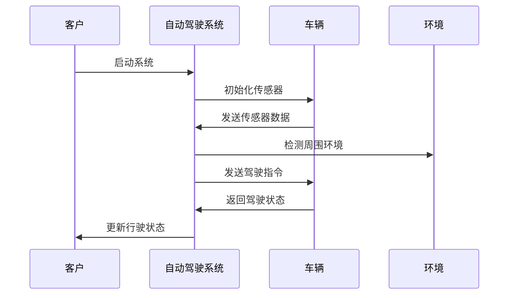
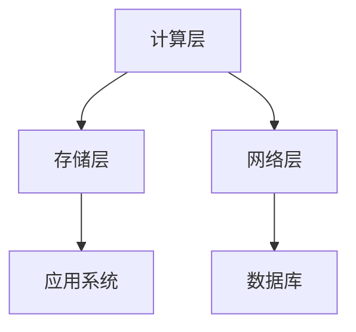
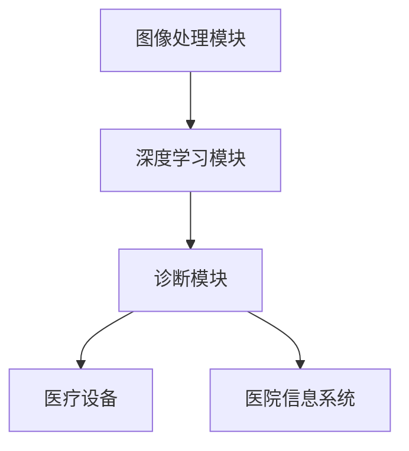

                 

## 1.1 技术孵化的概念与意义

### 1.1.1 技术孵化的定义

技术孵化是指将新的技术理念或创新创意转化为实际应用的过程。它通常涉及从初始想法到市场化的整个周期，包括创意产生、筛选、验证、产品化以及市场推广等环节。技术孵化不仅包括技术创新，还涵盖了商业模式创新、市场策略和团队建设等多个方面。

### 1.1.2 技术孵化在企业发展中的作用

技术孵化对于企业的发展具有重要意义：

1. **推动技术创新**：技术孵化帮助企业将前沿技术应用于实际产品中，推动技术创新，提高竞争力。
2. **开辟新市场**：通过技术孵化，企业可以开拓新的市场领域，扩大业务范围，实现多元化发展。
3. **增强企业活力**：技术孵化有助于企业保持创新活力，持续成长，应对市场变化。
4. **提升品牌价值**：成功的孵化项目可以提升企业的品牌形象，增强市场认可度。

### 1.1.3 技术孵化的特点与挑战

**特点：**

1. **高风险性**：技术孵化涉及创新，必然伴随着风险。这些风险可能来自技术、市场、资金等多个方面。
2. **灵活性**：技术孵化通常需要快速响应市场变化，因此过程较为灵活。
3. **跨学科合作**：技术孵化往往需要多个学科领域的专家共同参与，实现跨学科合作。
4. **时间敏感性**：成功的孵化项目需要快速行动，及时抓住市场机遇。

**挑战：**

1. **技术风险**：新技术的不确定性可能导致项目失败。
2. **市场风险**：市场需求的不确定性可能导致产品无法顺利推广。
3. **资金风险**：孵化项目通常需要大量资金支持，资金链断裂可能导致项目终止。
4. **人才风险**：缺乏合适的技术和商业人才，可能影响孵化项目的进展。

在接下来的一章中，我们将进一步解析技术孵化的具体流程，帮助读者更深入地理解这一过程。

## 1.2 技术孵化流程解析

技术孵化是一个系统化的过程，涉及多个阶段和环节。以下是技术孵化流程的主要步骤：

### 1.2.1 创意产生与筛选

**创意产生**：创意是技术孵化过程的起点。企业可以通过多种方式激发创意，如头脑风暴、外部合作、用户调研等。

**筛选**：筛选是将创意转化为可行项目的关键步骤。在这一阶段，需要对创意进行评估，筛选出具有市场潜力和技术可行性的项目。

### 1.2.2 概念验证

**概念验证**（Proof of Concept，PoC）是指对创意进行初步的技术实现，以验证其基本原理是否可行。这一阶段通常涉及小规模的原型设计和测试。

### 1.2.3 产品化与市场推广

**产品化**：在概念验证成功后，项目将进入产品化阶段。这一阶段主要包括产品设计和开发、测试和迭代。

**市场推广**：产品化完成后，企业需要制定市场推广策略，包括产品定位、营销计划、渠道选择等，以确保产品能够顺利进入市场。

### 1.2.4 迭代与优化

技术孵化并非一蹴而就的过程，通常需要多次迭代和优化。通过不断的测试和反馈，企业可以不断完善产品，提高市场竞争力。

### 1.2.5 成果评估与退出策略

**成果评估**：在孵化项目结束后，需要对项目的成果进行评估，包括技术实现、市场表现、经济效益等。

**退出策略**：根据评估结果，企业可以选择继续投资、出售或破产清算等退出策略。

通过上述步骤，企业可以有效地进行技术孵化，推动创新，实现持续发展。

在接下来的章节中，我们将探讨技术孵化与创业之间的关联，以及技术孵化失败的原因和案例分析。

## 1.3 技术孵化与创业

### 1.3.1 技术孵化与创业的关联

技术孵化与创业之间存在紧密的联系：

1. **创业的源头**：技术孵化是创业的重要源头之一。通过孵化，创业者可以将技术创新转化为实际产品，实现商业价值。
2. **风险投资**：技术孵化项目通常需要大量的资金支持，而风险投资是支持创业的关键。技术孵化为风险投资提供了评估项目潜力的机会。
3. **创业环境**：技术孵化平台通常为创业者提供资源、指导和支持，营造有利于创业的环境。

### 1.3.2 创业者在技术孵化中的角色

在技术孵化过程中，创业者扮演着关键角色：

1. **创新者**：创业者是创新的推动者，他们需要敏锐地捕捉市场机会，提出创新的技术解决方案。
2. **组织者**：创业者需要组织团队，协调各方资源，确保孵化项目的顺利进行。
3. **风险承担者**：创业者需要承担技术孵化过程中的风险，包括技术风险、市场风险和资金风险。

### 1.3.3 技术孵化失败的案例分析

技术孵化并非总是成功的。以下是一些常见的失败原因及案例分析：

1. **技术问题**：某些孵化项目由于技术实现上的挑战，导致无法顺利推进。例如，某些人工智能项目由于算法复杂度过高，最终失败。
2. **市场问题**：市场需求的不确定性可能导致产品无法找到合适的用户群体。例如，某些智能家居产品由于市场接受度低，最终被淘汰。
3. **资金问题**：资金链断裂是技术孵化失败的主要原因之一。一些项目由于缺乏足够的资金支持，无法持续发展。
4. **团队问题**：团队成员的不稳定和技能不足可能导致项目进展缓慢。例如，一些创业团队由于内部矛盾，最终解散。

通过上述分析，我们可以看到，技术孵化是一个复杂的过程，涉及到技术、市场、资金和团队等多个方面。在接下来的章节中，我们将进一步探讨技术孵化的方法论，帮助读者更好地理解和实践技术孵化。

## 1.4 技术孵化的方法论

### 1.4.1 创新理论回顾

创新理论是技术孵化的重要基础。以下是几种主要的创新理论：

1. **线性创新理论**：线性创新理论认为，创新过程是一个从研究到开发，再到市场推广的线性过程。
2. **非线性创新理论**：非线性创新理论强调创新过程中的复杂性和不确定性，认为创新是一个动态、互动的过程。
3. **开放创新理论**：开放创新理论主张企业通过开放合作，充分利用外部资源，实现技术创新和商业模式的创新。

### 1.4.2 技术孵化中的TRIZ方法

TRIZ（理论解决矛盾的创新方法）是一种基于数学和逻辑的创新工具，广泛应用于技术孵化过程中：

1. **矛盾矩阵**：TRIZ中的矛盾矩阵帮助创业者识别和解决项目中的矛盾，例如技术难题和市场需求的矛盾。
2. **物理矛盾解决**：TRIZ提供了一套解决物理矛盾的算法，帮助创业者找到创新性的解决方案。
3. **系统分析**：TRIZ强调系统分析，通过分析系统的各个组成部分，找到优化和创新的机会。

### 1.4.3 技术孵化中的敏捷开发实践

敏捷开发是一种注重迭代、反馈和灵活性的软件开发方法，同样适用于技术孵化过程：

1. **迭代开发**：敏捷开发通过短周期迭代，快速实现产品原型，不断调整和优化。
2. **用户反馈**：敏捷开发强调用户参与，通过用户反馈不断改进产品，确保产品符合市场需求。
3. **团队协作**：敏捷开发强调团队协作，通过透明的工作流程和高效的沟通，提高开发效率。

通过运用这些方法论，企业可以更好地进行技术孵化，提高创新成功率。

## 2.1 P9工程师的职业特点

### 2.1.1 P9工程师的职责

P9工程师是高级技术专家，其职责通常包括：

1. **技术战略规划**：制定公司技术发展方向和战略，引领技术团队的技术创新。
2. **核心技术研发**：负责公司核心技术的研发，解决技术难题。
3. **团队领导**：领导技术团队，提供技术指导和培训，确保团队高效运作。
4. **跨部门协作**：与其他部门（如产品、市场、销售）紧密合作，确保技术解决方案符合业务需求。
5. **技术指导**：为其他工程师提供技术支持和指导，提升团队整体技术水平。

### 2.1.2 P9工程师的技能要求

P9工程师需要具备以下技能：

1. **深厚的技术背景**：拥有广泛的计算机科学和技术知识，特别是在某一领域（如人工智能、大数据、云计算）有深入的研究。
2. **项目领导能力**：具备项目管理和领导能力，能够有效地管理复杂的工程项目。
3. **创新思维**：具备创新思维，能够提出独特的技术解决方案。
4. **沟通能力**：具备出色的沟通能力，能够有效地与团队成员和其他部门沟通。
5. **领导力**：具备领导力，能够激励团队，提高团队效率。

### 2.1.3 P9工程师的职业发展路径

P9工程师的职业发展路径通常如下：

1. **技术专家**：从初级工程师开始，逐步提升为高级工程师，成为技术领域的专家。
2. **技术团队领导**：在技术专家的基础上，担任技术团队领导，负责团队管理和项目推进。
3. **技术总监/CTO**：在积累丰富的管理经验和专业知识后，可以晋升为技术总监或首席技术官（CTO），负责公司整体技术战略和方向。
4. **创业或咨询**：具备丰富经验和技术能力的P9工程师也可以选择创业或成为技术咨询专家，提供技术解决方案和战略指导。

通过上述职业发展路径，P9工程师可以在技术领域实现职业的高度发展和成就。

## 2.2 P9工程师的创新思维

### 2.2.1 创新思维的培养

P9工程师的创新思维是其成功的关键。以下是一些培养创新思维的方法：

1. **跨学科学习**：P9工程师应不断拓宽知识面，学习跨学科的知识，以获得更广阔的视角。
2. **阅读与研究**：通过阅读科技前沿文献、研究论文和专利，了解最新的技术动态和趋势。
3. **实践与实验**：通过实际的项目实践和实验，将理论知识应用于实际，培养解决问题的能力。
4. **头脑风暴**：定期进行头脑风暴，鼓励团队成员提出创新的想法和解决方案。
5. **持续学习**：技术不断进步，P9工程师应保持持续学习的态度，跟上技术发展的步伐。

### 2.2.2 创新思维的方法与工具

P9工程师可以运用以下方法与工具来提高创新效率：

1. **TRIZ**：运用TRIZ方法，解决项目中的矛盾和问题，找到创新的解决方案。
2. **设计思维**：通过设计思维方法，从用户需求出发，设计出符合市场需求的产品。
3. **快速原型开发**：通过快速原型开发，快速验证创意，及时调整和优化。
4. **头脑风暴与思维导图**：运用头脑风暴和思维导图工具，整理思路，激发创意。

### 2.2.3 创新思维的案例分析

**案例一：特斯拉的自动驾驶技术**

特斯拉的自动驾驶技术是P9工程师创新思维的典范。通过结合机器学习、计算机视觉和传感器技术，特斯拉成功地将自动驾驶从概念变为现实。P9工程师在该项目中的角色包括：

1. **技术领导**：负责自动驾驶系统的总体技术架构设计。
2. **创新应用**：将人工智能和传感器技术应用于自动驾驶，提出创新性的解决方案。
3. **跨学科合作**：与机械工程、电子工程等领域的专家合作，实现技术的综合应用。

**案例二：微软的Azure云服务**

微软的Azure云服务是另一个创新思维的案例。P9工程师在Azure项目中通过创新的技术架构和设计，使得Azure成为全球领先的云服务平台。具体包括：

1. **分布式计算**：提出并实现分布式计算架构，提高系统的可扩展性和可靠性。
2. **混合云解决方案**：创新性地提出了混合云解决方案，满足不同企业的需求。
3. **安全性提升**：通过技术创新，提高云服务的安全性，赢得客户的信任。

通过上述案例，我们可以看到，P9工程师的创新思维在技术孵化中发挥了关键作用，推动了技术的进步和商业的成功。

## 2.3 P9工程师在技术孵化中的应用

### 2.3.1 技术孵化的项目管理

P9工程师在技术孵化中担任项目管理的重要角色。以下是他们在项目管理中的应用：

1. **需求分析**：P9工程师需要深入了解市场需求，明确项目目标，确保孵化项目符合用户需求。
2. **资源协调**：P9工程师需要协调各方资源，包括资金、人力和设备，确保项目顺利进行。
3. **进度管理**：P9工程师需要制定详细的项目计划，监控项目进度，确保项目按时完成。
4. **风险管理**：P9工程师需要识别项目中的潜在风险，制定应对策略，降低风险影响。
5. **团队协作**：P9工程师需要与团队成员保持紧密合作，确保团队高效运作，共同推动项目进展。

### 2.3.2 技术孵化的技术难题攻克

在技术孵化过程中，P9工程师面临各种技术难题。以下是他们在攻克技术难题中的应用：

1. **创新性解决方案**：P9工程师需要提出创新性的技术解决方案，解决项目中的技术瓶颈。
2. **跨学科合作**：P9工程师需要与不同领域的专家合作，实现技术的综合应用。
3. **实验与验证**：P9工程师需要通过实验和验证，确保技术方案的可行性和有效性。
4. **持续改进**：P9工程师需要持续改进技术方案，优化系统性能，提高产品质量。

### 2.3.3 技术孵化的产品化与市场化

P9工程师在技术孵化的产品化与市场化过程中发挥关键作用：

1. **产品定义**：P9工程师需要根据市场需求，明确产品的功能、性能和特点。
2. **产品设计**：P9工程师需要参与产品的设计和开发，确保产品符合用户需求和行业标准。
3. **市场推广**：P9工程师需要与市场团队紧密合作，制定市场推广策略，提升产品知名度。
4. **用户反馈**：P9工程师需要收集用户反馈，不断改进产品，提高用户满意度。

通过上述应用，P9工程师在技术孵化中发挥了不可或缺的作用，推动了技术的进步和商业的成功。

## 2.4 P9工程师的职业素养与提升

### 2.4.1 职业素养的重要性

职业素养是P9工程师职业发展的重要基础。以下是职业素养的重要性：

1. **团队合作**：P9工程师需要具备良好的团队合作精神，与团队成员紧密合作，共同完成项目任务。
2. **沟通能力**：P9工程师需要具备出色的沟通能力，能够与团队成员、上级领导和其他部门进行有效沟通。
3. **问题解决能力**：P9工程师需要具备强大的问题解决能力，能够快速识别和解决项目中的技术难题。
4. **持续学习**：P9工程师需要具备持续学习的意识，不断更新知识，跟上技术发展的步伐。
5. **领导力**：P9工程师需要具备一定的领导力，能够激励团队，提升团队绩效。

### 2.4.2 职业素养的提升途径

以下是提升职业素养的途径：

1. **培训与学习**：参加专业培训课程，学习最新的技术和管理知识。
2. **实践与经验**：通过实际项目积累经验，提高问题解决能力和团队协作能力。
3. **反思与总结**：定期进行工作反思和总结，识别自身的不足，制定改进计划。
4. **跨部门交流**：积极参与跨部门交流，拓宽视野，提升沟通能力。
5. **领导力培养**：参加领导力培训，学习领导力理论和实践，提升领导能力。

### 2.4.3 职业素养的提升案例分析

**案例一：华为P9工程师的成长经历**

华为的P9工程师通过不断提升职业素养，取得了显著的成绩。以下是他的成长经历：

1. **持续学习**：他通过参加专业培训和自学，不断更新知识，提升自己的技术水平。
2. **团队合作**：他在项目中积极与团队成员合作，共同解决技术难题，提升团队绩效。
3. **反思与总结**：他定期进行工作反思和总结，识别自身不足，制定改进计划。
4. **领导力培养**：他参加领导力培训，学习领导力理论和实践，提升领导能力，成为团队的核心人物。

**案例二：亚马逊的P9工程师**

亚马逊的P9工程师通过不断提升职业素养，成为公司的技术总监。以下是他的提升过程：

1. **沟通能力**：他积极参加跨部门交流，提升沟通能力，与不同部门的同事建立了良好的合作关系。
2. **问题解决能力**：他通过实践积累经验，提升问题解决能力，成为团队中的技术权威。
3. **持续学习**：他通过自学和参加培训，不断提升自己的技术和管理水平。
4. **领导力培养**：他参加领导力培训，学习领导力理论和实践，提升领导能力，成为公司的技术总监。

通过以上案例，我们可以看到，职业素养的提升对于P9工程师的职业发展具有重要意义。他们通过不断学习和实践，提升自己的专业能力和领导力，取得了显著的成就。

## 3.1 技术创新的驱动因素

技术创新是推动企业发展的重要动力。以下是技术创新的驱动因素：

### 3.1.1 市场需求的变化

市场需求的变化是技术创新的主要驱动力之一。随着消费者需求的不断升级和多样化，企业需要通过技术创新来满足市场的新需求，从而获得竞争优势。

1. **消费者行为分析**：通过分析消费者行为，了解他们的需求变化，为企业提供创新方向。
2. **用户反馈**：收集用户的反馈，及时调整产品设计和功能，提升用户满意度。
3. **市场调研**：进行市场调研，了解行业趋势和市场机会，提前布局技术创新。

### 3.1.2 技术进步的推动

技术进步为技术创新提供了坚实的基础。随着科技的不断进步，企业可以利用新技术来提升产品性能、降低成本和改进用户体验。

1. **新兴技术的应用**：如人工智能、大数据、云计算等新兴技术的应用，为企业提供了丰富的创新空间。
2. **技术储备**：企业应建立技术储备，密切关注技术前沿，及时将新技术应用于产品开发。
3. **跨学科融合**：通过跨学科合作，实现技术的融合与创新，提升产品的竞争力。

### 3.1.3 企业战略调整的影响

企业战略调整也是推动技术创新的重要因素。企业根据自身的战略目标和市场需求，调整技术创新的方向和力度，以实现长期发展。

1. **战略规划**：制定明确的战略规划，明确技术创新的目标和方向。
2. **资源分配**：根据战略规划，合理分配资源，确保技术创新得到充分支持。
3. **组织变革**：调整组织架构和管理模式，为技术创新提供良好的环境。

通过市场需求、技术进步和企业战略调整等多方面的驱动，企业可以不断进行技术创新，提升核心竞争力。

## 3.2 技术创新的方法论

技术创新是一个系统性的过程，需要科学的方法论指导。以下是几种常用的技术创新方法论：

### 3.2.1 设计思维的应用

设计思维（Design Thinking）是一种以用户为中心的创新方法，强调从用户需求出发，通过迭代和反馈不断优化产品。以下是设计思维的几个关键步骤：

1. **同理心**：深入了解用户的需求和痛点，建立对用户的同理心。
2. **定义问题**：明确要解决的问题，将其具体化。
3. **创意生成**：通过头脑风暴和创意生成工具，提出多种可能的解决方案。
4. **原型设计**：快速构建原型，进行用户测试和反馈。
5. **迭代优化**：根据用户反馈，不断迭代和优化产品。

### 3.2.2 快速原型开发

快速原型开发（Rapid Prototyping）是一种快速构建产品原型的方法，通过迭代和优化，不断改进产品。以下是快速原型开发的几个关键步骤：

1. **需求分析**：明确产品功能需求和用户体验。
2. **原型构建**：使用低成本的工具和技术，快速构建原型。
3. **用户测试**：将原型展示给用户，收集反馈。
4. **迭代优化**：根据用户反馈，不断迭代和优化原型。
5. **产品发布**：原型经过多次迭代后，转化为最终产品。

### 3.2.3 基于数据的创新方法

基于数据的创新方法（Data-driven Innovation）利用大数据和数据分析，挖掘用户需求和市场趋势，为企业提供创新方向。以下是基于数据创新的关键步骤：

1. **数据收集**：收集与企业产品、市场和用户相关的数据。
2. **数据分析**：使用数据分析工具，挖掘数据中的价值。
3. **市场调研**：结合数据分析结果，进行市场调研，验证创新方向。
4. **决策支持**：利用数据分析结果，为产品设计和开发提供决策支持。
5. **持续优化**：根据市场反馈和数据分析，持续优化产品。

通过设计思维、快速原型开发和基于数据的创新方法，企业可以系统地推动技术创新，提高产品竞争力。

## 3.3 技术创新案例研究

### 3.3.1 案例一：特斯拉的自动驾驶技术

特斯拉的自动驾驶技术是技术创新的典范。以下是该案例的详细分析：

**背景介绍**：

特斯拉自动驾驶技术旨在通过人工智能、计算机视觉和传感器技术，实现车辆在道路上自动行驶。

**项目介绍**：

1. **领域模型**：特斯拉的自动驾驶系统包括感知、规划、控制和决策四个主要模块。
2. **系统功能设计**：感知模块负责检测周围环境，规划模块负责路径规划，控制模块负责执行驾驶动作，决策模块负责处理各种复杂情况。
3. **系统架构设计**：特斯拉采用了分布式架构，通过多传感器融合和数据共享，实现高效的自动驾驶功能。
4. **系统接口设计**：自动驾驶系统与车辆控制系统、导航系统和其他车辆通信系统进行接口设计，确保系统协同工作。

**系统交互设计**：

特斯拉的自动驾驶系统通过一系列的传感器（如雷达、摄像头、超声波传感器）收集道路和环境数据，通过机器学习算法进行数据分析和决策。以下是系统交互的mermaid序列图：

**实际案例分析和详细讲解**：

特斯拉的自动驾驶系统在多个实际场景中进行了测试和验证。以下是几个典型的案例：

1. **城市道路自动驾驶**：在市区道路环境下，特斯拉的自动驾驶系统能够有效识别交通标志、行人、车辆等，实现自动行驶。
2. **高速公路自动驾驶**：在高速公路上，特斯拉的自动驾驶系统能够自动保持车道、控制车速，实现长时间自动驾驶。
3. **极端天气条件**：在雨雪、雾等极端天气条件下，特斯拉的自动驾驶系统通过传感器融合和数据优化，提高了系统的鲁棒性。

**项目小结**：

特斯拉的自动驾驶技术通过不断的创新和优化，实现了从概念到产品的成功转化。该项目展示了技术创新在提高交通安全、提升驾驶体验方面的巨大潜力。

### 3.3.2 案例二：阿里巴巴的“飞天”操作系统

阿里巴巴的“飞天”操作系统是另一个技术创新的案例。以下是该案例的详细分析：

**背景介绍**：

“飞天”操作系统是阿里巴巴自主研发的分布式操作系统，旨在支持大规模分布式计算和存储，为阿里巴巴的电商、金融等业务提供底层支持。

**项目介绍**：

1. **领域模型**：“飞天”操作系统包括计算层、存储层和网络层三个主要模块。
2. **系统功能设计**：计算层负责处理海量数据，存储层负责数据存储和管理，网络层负责数据传输和分布式调度。
3. **系统架构设计**：“飞天”操作系统采用了微服务架构，通过模块化设计，提高了系统的可扩展性和可靠性。
4. **系统接口设计**：“飞天”操作系统与各种应用系统和数据库进行接口设计，确保系统的协同工作。

**系统交互设计**：

以下是“飞天”操作系统的mermaid架构图：

**实际案例分析和详细讲解**：

“飞天”操作系统在多个实际场景中进行了测试和应用。以下是几个典型的案例：

1. **双十一购物节**：在每年双十一购物节期间，阿里巴巴的电商业务面临巨大的数据量和交易量。“飞天”操作系统通过分布式计算和存储，确保了系统的稳定运行，处理了海量交易。
2. **金融业务**：阿里巴巴的金融业务（如蚂蚁金服）通过“飞天”操作系统实现了高效的分布式计算和存储，为用户提供快速、安全的金融服务。
3. **云计算服务**：阿里巴巴的云计算业务（如阿里云）通过“飞天”操作系统，提供了强大的分布式计算和存储能力，为企业和开发者提供了丰富的云计算服务。

**项目小结**：

“飞天”操作系统的成功研发和广泛应用，展示了阿里巴巴在技术创新方面的实力和成就。该项目为阿里巴巴的电商、金融和云计算业务提供了坚实的支持，推动了公司的持续发展。

### 3.3.3 案例三：腾讯的AI医疗影像系统

腾讯的AI医疗影像系统是医疗领域的技术创新案例。以下是该案例的详细分析：

**背景介绍**：

医疗影像诊断是医疗领域的重要环节，传统的医学影像诊断依赖医生的经验和技能，存在诊断速度慢、误诊率高等问题。腾讯的AI医疗影像系统通过人工智能技术，提高了医疗影像的诊断速度和准确性。

**项目介绍**：

1. **领域模型**：AI医疗影像系统包括图像处理、深度学习和诊断三个主要模块。
2. **系统功能设计**：图像处理模块负责处理和增强医疗影像，深度学习模块负责训练和优化模型，诊断模块负责对影像进行诊断。
3. **系统架构设计**：AI医疗影像系统采用了分布式计算架构，通过多台服务器协同工作，提高了系统的计算能力和效率。
4. **系统接口设计**：AI医疗影像系统与医疗设备和医院信息系统进行接口设计，确保系统的集成和应用。

**系统交互设计**：

以下是AI医疗影像系统的mermaid架构图：

**实际案例分析和详细讲解**：

AI医疗影像系统在多个医院和诊所进行了实际应用。以下是几个典型的案例：

1. **肺癌筛查**：在肺癌筛查项目中，AI医疗影像系统通过分析胸部CT影像，提高了肺癌的早期诊断率，减少了误诊率。
2. **乳腺癌诊断**：在乳腺癌诊断项目中，AI医疗影像系统通过分析乳腺X光影像，提高了乳腺癌的诊断准确性，减少了漏诊率。
3. **眼底病变诊断**：在眼底病变诊断项目中，AI医疗影像系统通过分析眼底影像，提高了糖尿病视网膜病变的早期诊断率。

**项目小结**：

腾讯的AI医疗影像系统通过技术创新，提高了医疗影像的诊断速度和准确性，为医疗领域带来了显著的效益。该项目展示了人工智能技术在医疗领域的巨大潜力，推动了医疗诊断的智能化发展。

## 4.1 创新文化的内涵与特征

### 4.1.1 创新文化的概念

创新文化是指企业内部鼓励创新、支持创新的价值观、行为规范和工作环境。它强调员工主动性、创造力和团队合作，致力于通过创新实现企业的持续发展。

### 4.1.2 创新文化的特征

1. **开放性**：创新文化鼓励开放思维，接受不同的意见和观点，为员工提供自由表达的空间。
2. **包容性**：创新文化尊重多样性，包容不同的文化背景和经验，促进跨学科合作。
3. **鼓励失败**：创新文化对失败持包容态度，认为失败是成功的前提，鼓励员工勇于尝试和接受挑战。
4. **持续学习**：创新文化强调持续学习，鼓励员工不断更新知识和技能，保持与时代同步。
5. **团队合作**：创新文化强调团队合作，鼓励员工协作解决难题，共同实现创新目标。

### 4.1.3 创新文化的重要性

创新文化对企业发展具有重要意义：

1. **提升创新能力**：创新文化激发员工的创新潜能，提高企业的整体创新能力。
2. **促进企业成长**：创新文化推动企业持续创新，开拓新的市场和发展机会，促进企业的长期发展。
3. **增强企业竞争力**：创新文化使企业能够迅速响应市场变化，推出具有竞争力的产品和服务，增强市场竞争力。
4. **提升员工满意度**：创新文化为员工提供广阔的发展空间和成长机会，提高员工的满意度和忠诚度。

通过建立创新文化，企业可以营造有利于创新的生态环境，推动企业的持续创新和快速发展。

## 4.2 创新文化的建设路径

### 4.2.1 企业价值观的塑造

企业价值观是创新文化的核心。以下是如何塑造企业价值观：

1. **明确价值观**：企业应明确核心价值观，如创新、客户至上、团队合作等，并将其融入企业文化和日常工作中。
2. **内部宣传**：通过内部会议、培训和宣传，将核心价值观传达给全体员工，使其深入人心。
3. **行为规范**：制定行为规范，确保员工的行为符合核心价值观，如鼓励员工提出创新建议，支持员工勇于尝试。
4. **领导示范**：企业领导应成为价值观的实践者，通过自身的行为和决策，树立榜样，推动价值观的落地。

### 4.2.2 人才引进与培养

人才是创新文化的重要组成部分。以下是如何进行人才引进与培养：

1. **人才引进**：通过招聘、引进具有创新精神和专业技能的员工，充实创新团队。
2. **内部培养**：提供培训和发展机会，帮助员工提升技能和创新能力，如举办创新工作坊、技术研讨会等。
3. **激励机制**：建立激励机制，鼓励员工提出创新建议和参与创新项目，如创新奖金、晋升机会等。
4. **跨学科交流**：鼓励不同学科领域的员工进行交流合作，促进创新思维的碰撞和融合。

### 4.2.3 创新机制的建立

创新机制是确保创新文化持续发展的关键。以下是如何建立创新机制：

1. **创新项目立项**：建立创新项目立项机制，明确项目目标、预算和期限，确保创新项目有序推进。
2. **资源支持**：为创新项目提供必要的资金、技术和其他资源支持，确保项目顺利进行。
3. **风险评估**：对创新项目进行风险评估，制定应对措施，降低项目风险。
4. **反馈机制**：建立反馈机制，收集项目进展和用户反馈，及时调整项目方向和策略。
5. **持续改进**：鼓励创新项目团队持续改进，不断优化产品和服务，提高项目成功率。

通过塑造企业价值观、人才引进与培养以及建立创新机制，企业可以构建有利于创新的生态环境，推动持续创新和快速发展。

## 4.3 创新文化的维护与持续发展

### 4.3.1 创新氛围的营造

创新氛围是创新文化的重要组成部分。以下是如何营造创新氛围：

1. **鼓励自由表达**：建立开放、包容的沟通环境，鼓励员工自由表达观点和建议。
2. **跨部门合作**：促进不同部门之间的合作与交流，打破部门壁垒，促进创新思维碰撞。
3. **知识分享**：组织内部知识分享活动，如技术交流会议、内部讲座等，促进知识的传播和共享。
4. **创新激励**：通过设立创新奖项、表彰创新成果，激励员工积极参与创新活动。

### 4.3.2 创新资源的整合

创新资源的整合是确保创新文化持续发展的关键。以下是如何整合创新资源：

1. **资金支持**：为创新项目提供充足的资金支持，确保项目能够顺利推进。
2. **技术支持**：整合企业内部外的技术资源，如邀请外部专家进行技术指导，提供先进的技术设备。
3. **人才资源**：引进和培养具有创新精神和专业技能的人才，充实创新团队。
4. **信息资源**：建立信息共享平台，整合企业内外部的信息资源，为创新提供数据支持。

### 4.3.3 创新成果的分享与传播

创新成果的分享与传播是推动创新文化持续发展的重要环节。以下是如何分享与传播创新成果：

1. **内部交流**：通过内部会议、报告等形式，分享创新项目的进展和成果，激发员工的创新热情。
2. **外部展示**：通过参加行业会议、展览等活动，展示企业的创新成果，提升企业知名度。
3. **案例推广**：总结创新项目的成功经验，形成案例，向其他部门或企业推广，促进创新文化的普及。
4. **媒体宣传**：利用媒体渠道，宣传企业的创新成果和经验，提升企业的品牌形象。

通过营造创新氛围、整合创新资源和分享创新成果，企业可以推动创新文化的持续发展，为企业的长期发展提供源源不断的动力。

## 5.1 技术孵化的未来发展趋势

### 5.1.1 数字化转型的深化

数字化转型是当前企业发展的主流方向。在未来，技术孵化将更加注重数字化技术的应用，推动企业的全面数字化转型：

1. **智能制造**：通过物联网、人工智能等数字化技术，实现生产过程的自动化和智能化，提高生产效率和产品质量。
2. **数字营销**：利用大数据、人工智能等技术，实现精准营销，提高市场响应速度和客户满意度。
3. **数字化转型战略**：企业将制定明确的数字化转型战略，推动内部业务流程、组织架构的变革。

### 5.1.2 人工智能的深化应用

人工智能（AI）技术将在技术孵化中发挥越来越重要的作用。未来，人工智能将更加深入地应用于各个行业：

1. **自动化决策**：人工智能将辅助企业进行复杂决策，提高决策效率和准确性。
2. **智能客服**：人工智能将实现智能客服，提供24小时在线服务，提升客户体验。
3. **智能分析**：通过人工智能技术，企业可以实现对海量数据的智能分析，发现潜在的商业机会。

### 5.1.3 新兴技术的探索与应用

随着科技的不断进步，新兴技术（如区块链、5G、物联网等）将在技术孵化中发挥重要作用。未来，技术孵化将更加注重新兴技术的探索和应用：

1. **区块链**：区块链技术将用于解决数据安全、隐私保护等问题，为技术孵化提供可靠的基础设施。
2. **5G技术**：5G技术将提供更高的网络速度和更低的时延，为实时应用提供支持。
3. **物联网**：物联网技术将实现设备的互联互通，推动智能家居、智慧城市等领域的发展。

通过数字化转型、人工智能的深化应用和新兴技术的探索与应用，技术孵化将不断创新，推动企业的持续发展。

## 5.2 技术创新的未来挑战

### 5.2.1 技术壁垒的突破

技术创新过程中，技术壁垒是一个重要的挑战。以下是如何突破技术壁垒：

1. **跨学科合作**：通过跨学科合作，整合不同领域的知识和技术，突破单一学科的限制。
2. **持续研发投入**：持续投入研发资源，加大技术创新的力度，提升技术竞争力。
3. **开放创新**：通过开放合作，吸收外部先进技术，加速技术创新进程。

### 5.2.2 法律法规的合规

技术创新需要遵守相关法律法规。以下是如何确保法律法规的合规：

1. **合规审查**：在技术创新过程中，进行合规审查，确保项目的各个环节符合法律法规要求。
2. **法律顾问**：聘请专业法律顾问，提供法律咨询和指导，确保技术创新的合法性。
3. **法律培训**：对员工进行法律法规培训，提高员工的合规意识。

### 5.2.3 国际竞争的加剧

随着全球化的发展，国际竞争日益激烈。以下是如何应对国际竞争的挑战：

1. **技术创新**：持续进行技术创新，提升产品和服务竞争力。
2. **市场拓展**：积极拓展国际市场，提升国际市场份额。
3. **国际化合作**：通过国际合作，整合全球资源，提升企业的全球竞争力。

通过突破技术壁垒、确保法律法规的合规以及应对国际竞争的挑战，企业可以保持技术领先地位，实现可持续发展。

## 5.3 技术孵化与创新的未来策略

### 5.3.1 企业内部孵化的优化

为了提升技术孵化与创新的效率，企业需要优化内部孵化体系：

1. **孵化平台建设**：建立完善的孵化平台，提供从创意到市场化的全流程支持。
2. **资源整合**：整合企业内部资源，如资金、人才和技术，为孵化项目提供有力支持。
3. **孵化流程优化**：优化孵化流程，减少项目审批环节，提高项目推进速度。

### 5.3.2 开放式创新的推动

开放式创新是企业获取外部资源和技术的重要途径。以下是如何推动开放式创新：

1. **开放合作**：与外部合作伙伴建立合作关系，共同推动技术创新。
2. **技术共享**：通过技术共享平台，分享企业内部的技术资源和成果，促进技术创新。
3. **外部投资**：吸引外部投资，引入外部资本和人才，提升孵化项目的成功率。

### 5.3.3 跨界合作的深化

跨界合作可以为企业带来新的发展机遇。以下是如何深化跨界合作：

1. **跨界联合**：与不同行业的合作伙伴进行跨界联合，共同探索新的商业模式和应用场景。
2. **共享平台**：建立跨界合作平台，促进不同领域的合作与交流。
3. **跨界投资**：通过跨界投资，布局新兴产业，推动企业的多元化发展。

通过优化内部孵化体系、推动开放式创新和深化跨界合作，企业可以不断提升技术创新能力，实现持续发展。

## 6.1 全书总结

本文详细探讨了技术孵化与创新的相关主题，从技术孵化的概念与意义、流程解析、与创业的关联，到P9工程师的探索精神、技术创新实践、创新文化的建设与维护，以及未来发展趋势和挑战，为读者提供了一个全面而深入的视角。通过案例研究和方法论的应用，文章展示了技术创新的实际操作和关键成功因素。未来，随着数字化转型的深化、人工智能的深化应用和新兴技术的不断涌现，技术孵化与创新将继续成为推动企业发展和经济增长的重要动力。企业应不断优化内部孵化体系、推动开放式创新和深化跨界合作，以保持技术领先和市场竞争优势。

## 6.2 未来展望与建议

展望未来，技术创新和孵化将继续成为企业发展的核心驱动力。以下是几点具体建议：

1. **加强数字化基础设施建设**：企业应加大在数字化技术、物联网、人工智能等领域的投入，提升数字化基础设施水平。
2. **推动开放式创新**：积极与外部合作伙伴建立合作关系，共享技术和资源，提升创新能力。
3. **培养创新型人才**：注重人才的培养和引进，特别是具有创新思维和跨学科背景的人才。
4. **建立完善的孵化机制**：优化内部孵化体系，简化流程，提高孵化效率。
5. **持续关注新兴技术**：紧跟科技发展趋势，积极布局新兴技术，探索新的商业模式和应用场景。

通过上述措施，企业可以更好地应对未来技术发展的挑战，实现持续创新和长期发展。

## 6.3 附录：参考文献与拓展阅读

### 参考文献

1. **Tom Peters**. (1992). *Innovation and Entrepreneurship*. Basic Books.
2. **Henry Chesbrough**. (2003). *Open Innovation: The New Imperative for Creating and Profiting from Technology*. Harvard Business Press.
3. **Eric Ries**. (2011). *The Lean Startup*. Crown Business.
4. **Tim Brown**. (2008). *Change by Design*. HarperCollins.
5. **John Seely Brown & Paul Duguid**. (2000). *The Social Life of Information*. Harvard Business School Press.

### 拓展阅读

1. **设计思维**：[设计思维官网](https://d school.stanford.edu/)
2. **TRIZ**：[TRIZ官方网站](https://www.triz-journal.com/)
3. **敏捷开发**：[敏捷联盟官网](https://www.agilealliance.org/)
4. **开放式创新**：[开放式创新博客](https://openinnovation.net/)
5. **数字化转型**：[数字化转型官网](https://www.transformdigital.com/)

通过阅读上述参考文献和拓展阅读，读者可以进一步深入了解技术孵化与创新的相关理论和实践。作者：AI天才研究院/AI Genius Institute & 禅与计算机程序设计艺术 /Zen And The Art of Computer Programming

